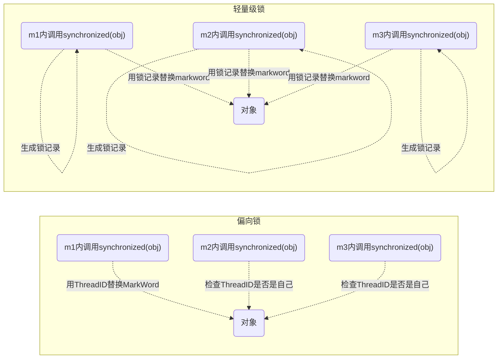

# JUC

+++

课程链接：[黑马程序员深入学习Java并发编程，JUC并发编程全套教程](https://www.bilibili.com/video/BV16J411h7Rd?p=21&vd_source=6e6b2286ee9a603d7bdb2bc5ba80e449)

**预备知识**：

- 希望你不是一个初学者
- 线程安全问题，需要你接触过 JavaWeb 开发、Jdbc 开发、Web 服务器、分布式框架时才会遇到
- 基于JDK8，最好对函数式编程、lambda有一定了解
- 采用了 slf4j 打印日志，这是好的实践
- 采用了 lombok 简化 java bean 编写
- 给每个线程好名字，这也是一项好的实践

## 一、进程与线程

本章内容

- 进程和线程的概念
- 并行和并发的概念
- 线程基本应用


### 1 进程与线程

**进程**：

- 程序由指令和数据组成，但这些指令要运行，数据要读写，就必须将指令加载至 CPU，数据加载至内存。在指令运行过程中还需要用到磁盘、网络等设备。进程就是用来加载指令、管理内存、管理 IO 的。
- 当一个程序被运行，从磁盘加载这个程序的代码至内存，这时就开启了一个进程。
- 进程就可以视为程序的一个实例。大部分程序可以同时运行多个实例进程（例如记事本、画图、浏览器等），也有的程序只能启动一个实例进程（例如网易云音乐、360 安全卫士等）。


**线程**：

- 一个进程之内可以分为一到多个线程。
- 一个线程就是一个指令流，将指令流中的一条条指令以一定的顺序交给 CPU 执行。
- Java 中，**线程作为最小调度单位**，**进程作为资源分配的最小单位**。在 windows 中进程是不活动的，只是作为线程的容器。


**二者对比**：

- 进程基本上相互独立的，而线程存在于进程内，是进程的一个子集。 


- 进程拥有共享的资源，如内存空间等，供其内部的线程共享。


- 进程间通信较为复杂：

  - 同一台计算机的进程通信称为 IPC（Inter-process communication）
  - 不同计算机之间的进程通信，需要通过网络，并遵守共同的协议，例如 HTTP 

- 线程通信相对简单，因为它们共享进程内的内存，一个例子是多个线程可以访问同一个共享变量 


- 线程更轻量，线程上下文切换成本一般上要比进程上下文切换低


### 2 并行与并发

单核 cpu 下，线程实际还是**串行执行**的。操作系统中有一个组件叫做任务调度器，将 cpu 的时间片（windows下时间片最小约为 15 毫秒）分给不同的程序使用，只是由于 cpu 在线程间（时间片很短）的切换非常快，人类感觉是**同时运行**的。总结为一句话就是：*微观串行，宏观并行*。

一般会将这种*线程轮流使用CPU的做法称为并发*，concurrent

| CPU  | 时间片 1 | 时间片 2 | 时间片 3 | 时间片 4 |
| :--: | :------: | :------: | :------: | :------: |
| core |  线程 1  |  线程 2  |  线程 3  |  线程 4  |

多核 cpu下，每个核（core） 都可以调度运行线程，这时候线程可以是*并行*的。

|  CPU  | 时间片 1 | 时间片 2 | 时间片 3 | 时间片 4 |
| :---: | :------: | :------: | :------: | :------: |
| core1 |  线程 1  |  线程 2  |  线程 3  |  线程 4  |
| core2 |  线程 4  |  线程 4  |  线程 2  |  线程 2  |

引用 Rob Pike 的一段描述：

- 并发（concurrent）是同一时间应对（dealing with）多件事情的能力
- 并行（parallel）是同一时间动手做（doing）多件事情的能力

例子：

- 家庭主妇做饭、打扫卫生、给孩子喂奶，她一个人轮流交替做这多件事，这时就是并发
- 家庭主妇雇了个保姆，她们一起这些事，这时既有并发，也有并行（这时会产生竞争，例如锅只有一口，一个人用锅时，另一个人就得等待）
- 雇了3个保姆，一个专做饭、一个专打扫卫生、一个专喂奶，互不干扰，这时是并行


### 3 应用

#### 3.1 应用之异步调用（案例1）

##### 3.1.1 需要等待结果

这时既可以使用同步处理，也可以使用异步来处理


###### join 实现（同步）

```java
static int result = 0;
private static void test1() throws InterruptedException {
    log.debug("开始");
    Thread t1 = new Thread(() -> {
        log.debug("开始");
        sleep(1);
        log.debug("结束");
        result = 10;
    }, "t1");
    t1.start();
    t1.join();
    log.debug("结果为:{}", result);
}
```

输出

```
20:30:40.453 [main] c.TestJoin - 开始
20:30:40.541 [t1] c.TestJoin - 开始
20:30:41.543 [t1] c.TestJoin - 结束
20:30:41.551 [main] c.TestJoin - 结果为:10
```

评价 

- 需要外部共享变量，不符合面向对象封装的思想 
- 必须等待线程结束，不能配合线程池使用


###### Future 实现（同步）

```java
private static void test2() throws InterruptedException, ExecutionException {
    log.debug("开始");
    FutureTask<Integer> result = new FutureTask<>(() -> {
        log.debug("开始");
        sleep(1);
        log.debug("结束");
        return 10;
    });
    new Thread(result, "t1").start();
    log.debug("结果为:{}", result.get());
}
```

输出

```
10:11:57.880 c.TestSync [main] - 开始
10:11:57.942 c.TestSync [t1] - 开始
10:11:58.943 c.TestSync [t1] - 结束
10:11:58.943 c.TestSync [main] - 结果为:10
```

评价 

- 规避了使用 join 之前的缺点 
- 可以方便配合线程池使用


```java
private static void test3() throws InterruptedException, ExecutionException {
    ExecutorService service = Executors.newFixedThreadPool(1);
    log.debug("开始");
    Future<Integer> result = service.submit(() -> {
        log.debug("开始");
        sleep(1);
        log.debug("结束");
        return 10;
    });
    log.debug("结果为:{}, result 的类型:{}", result.get(), result.getClass());
    service.shutdown();
}
```

输出

```sh
10:17:40.090 c.TestSync [main] - 开始
10:17:40.150 c.TestSync [pool-1-thread-1] - 开始
10:17:41.151 c.TestSync [pool-1-thread-1] - 结束
10:17:41.151 c.TestSync [main] - 结果为:10, result 的类型:class java.util.concurrent.FutureTask
```

评价 

- 仍然是 main 线程接收结果 
- get 方法是让调用线程同步等待


###### 自定义实现（同步）

见模式篇：保护性暂停模式


###### CompletableFuture 实现（异步）

```java
private static void test4() {
    // 进行计算的线程池
    ExecutorService computeService = Executors.newFixedThreadPool(1);
    // 接收结果的线程池
    ExecutorService resultService = Executors.newFixedThreadPool(1);
    log.debug("开始");
    CompletableFuture.supplyAsync(() -> {
        log.debug("开始");
        sleep(1);
        log.debug("结束");
        return 10;
    }, computeService).thenAcceptAsync((result) -> {
        log.debug("结果为:{}", result);
    }, resultService);
}
```

输出

```sh
10:36:28.114 c.TestSync [main] - 开始
10:36:28.164 c.TestSync [pool-1-thread-1] - 开始
10:36:29.165 c.TestSync [pool-1-thread-1] - 结束
10:36:29.165 c.TestSync [pool-2-thread-1] - 结果为:10
```

评价 

- 可以让调用线程异步处理结果，实际是其他线程去同步等待 
- 可以方便地分离不同职责的线程池 
- 以任务为中心，而不是以线程为中心


###### BlockingQueue 实现（异步）

```java
private static void test6() {
    ExecutorService consumer = Executors.newFixedThreadPool(1);
    ExecutorService producer = Executors.newFixedThreadPool(1);
    BlockingQueue<Integer> queue = new SynchronousQueue<>();
    log.debug("开始");
    producer.submit(() -> {
        log.debug("开始");
        sleep(1);
        log.debug("结束");
        try {
            queue.put(10);
        } catch (InterruptedException e) {
            e.printStackTrace();
        }
    });
    consumer.submit(() -> {
        try {
            Integer result = queue.take();
            log.debug("结果为:{}", result);
        } catch (InterruptedException e) {
            e.printStackTrace();
        }
    });
}
```


##### 3.1.2 不需要等待结果

这时最好是使用异步来处理

###### 普通线程实现

```java
@Slf4j(topic = "c.FileReader")
public class FileReader {
    public static void read(String filename) {
        int idx = filename.lastIndexOf(File.separator);
        String shortName = filename.substring(idx + 1);
        try (FileInputStream in = new FileInputStream(filename)) {
            long start = System.currentTimeMillis();
            log.debug("read [{}] start ...", shortName);
            byte[] buf = new byte[1024];
            int n = -1;
            do {
                n = in.read(buf);
            } while (n != -1);
            long end = System.currentTimeMillis();
            log.debug("read [{}] end ... cost: {} ms", shortName, end - start);
        } catch (IOException e) {
            e.printStackTrace();
        }
    }
}
```

没有用线程时，方法的调用是同步的：

```java
@Slf4j(topic = "c.Sync")
public class Sync {
    public static void main(String[] args) {
        String fullPath = "E:\\1.mp4";
        FileReader.read(fullPath);
        log.debug("do other things ...");
    }
}
```

输出

```sh
18:39:15 [main] c.FileReader - read [1.mp4] start ...
18:39:19 [main] c.FileReader - read [1.mp4] end ... cost: 4090 ms
18:39:19 [main] c.Sync - do other things ...
```

使用了线程后，方法的调用时异步的：

```java
private static void test1() {
    new Thread(() -> FileReader.read(Constants.MP4_FULL_PATH)).start();
    log.debug("do other things ...");
}
```

输出

```sh
18:41:53 [main] c.Async - do other things ...
18:41:53 [Thread-0] c.FileReader - read [1.mp4] start ...
18:41:57 [Thread-0] c.FileReader - read [1.mp4] end ... cost: 4197 ms
```


###### 线程池实现

```java
private static void test2() {
    ExecutorService service = Executors.newFixedThreadPool(1);
    service.execute(() -> FileReader.read(Constants.MP4_FULL_PATH));
    log.debug("do other things ...");
    service.shutdown();
}
```

输出

```sh
11:03:31.245 c.TestAsyc [main] - do other things ... 
11:03:31.245 c.FileReader [pool-1-thread-1] - read [1.mp4] start ... 
11:03:33.479 c.FileReader [pool-1-thread-1] - read [1.mp4] end ... cost: 2235 ms
```


###### CompletableFuture 实现

```java
private static void test3() throws IOException {
    CompletableFuture.runAsync(() -> FileReader.read(Constants.MP4_FULL_PATH));
    log.debug("do other things ...");
    System.in.read();
}
```

输出

```sh
11:09:38.145 c.TestAsyc [main] - do other things ... 
11:09:38.145 c.FileReader [ForkJoinPool.commonPool-worker-1] - read [1.mp4] start ... 
11:09:40.514 c.FileReader [ForkJoinPool.commonPool-worker-1] - read [1.mp4] end ... cost: 2369 ms 
```


##### 3.1.3 总结

以调用方角度来讲，如果

* 需要等待结果返回，才能继续运行就是同步
* 不需要等待结果返回，就能继续运行就是异步

**设计**：多线程可以让方法执行变为异步的（即不要巴巴干等着）比如说读取磁盘文件时，假设读取操作花费了 5 秒钟，如果没有线程调度机制，这5秒 cpu 什么都做不了，其它代码都得暂停...

**结论**：

- 比如在项目中，视频文件需要转换格式等操作比较费时，这时开一个新线程处理视频转换，避免阻塞主线程
- tomcat 的异步 servlet 也是类似的目的，让用户线程处理耗时较长的操作，避免阻塞 tomcat 的工作线程
- ui 程序中，开线程进行其他操作，避免阻塞 ui 线程


#### 3.2 应用之提高效率（案例1）

充分利用多核 cpu 的优势，提高运行效率。想象下面的场景，执行 3 个计算，最后将计算结果汇总。

```
计算 1 花费 10 ms
计算 2 花费 11 ms
计算 3 花费 9 ms
汇总需要 1 ms
```

- 如果是串行执行，那么总共花费的时间是 10 + 11 + 9 + 1 = 31ms

- 但如果是四核 cpu，各个核心分别使用线程 1 执行计算 1，线程 2 执行计算 2，线程 3 执行计算 3，那么 3 个线程是并行的，花费时间只取决于最长的那个线程运行的时间，即 11ms 最后加上汇总时间只会花费 12ms

> **注意：**
>
> 需要在多核 cpu 才能提高效率，单核仍然时是轮流执行


##### 3.2.1 设计

略

##### 3.2.2 结论

1. 单核 cpu 下，多线程不能实际提高程序运行效率，只是为了能够在不同的任务之间切换，不同线程轮流使用 cpu，不至于一个线程总占用 cpu，别的线程没法干活
2. 多核 cpu 可以并行跑多个线程，但能否提高程序运行效率还是要分情况的
   - 有些任务，经过精心设计，将任务拆分，并行执行，当然可以提高程序的运行效率。但不是所有计算任务都能拆分（参考后文的【阿姆达尔定律】）
   - 也不是所有任务都需要拆分，任务的目的如果不同，谈拆分和效率没啥意义
3. IO 操作不占用 cpu，只是我们一般拷贝文件使用的是【阻塞 IO】，这时相当于线程虽然不用 cpu，但需要一直等待 IO 结束，没能充分利用线程。所以才有后面的【非阻塞 IO】和【异步 IO】优化。

+++

## 二、Java线程

本章内容

- 创建和运行线程
- 查看线程
- 线程 API
- 线程状态


### 1 创建和运行线程

#### 1.1 直接使用Thread

```java
// 创建线程对象
Thread t = new Thread() {
    public void run() {
        // 要执行的任务
    }
};
// 启动线程
t.start();
```

例如：

```java
// 构造方法的参数是给线程指定名字，推荐
Thread t1 = new Thread("t1") {
    @Override
    // run 方法内实现了要执行的任务
    public void run() {
        log.debug("hello");
    }
};
t1.start();
```

输出：

```
19:19:00 [t1] c.ThreadStarter - hello
```


#### 1.2 使用Runnable配合Thread

把【线程】和【任务】（要执行的代码）分开

- Thread 代表线程
- Runnable 可运行的任务（线程要执行的代码）

```java
Runnable runnable = new Runnable() {
    public void run(){
        // 要执行的任务
    }
};
// 创建线程对象
Thread t = new Thread( runnable );
// 启动线程
t.start(); 
```

例如：

```java
// 创建任务对象
Runnable task2 = new Runnable() {
    @Override
    public void run() {
        log.debug("hello");
    }
};
// 参数1 是任务对象; 参数2 是线程名字，推荐
Thread t2 = new Thread(task2, "t2");
t2.start();
```

输出：

```
9:19:00 [t2] c.ThreadStarter - hello
```

Java 8 以后可以使用 lambda 精简代码

```java
// 创建任务对象
Runnable task2 = () -> log.debug("hello");
// 参数1 是任务对象; 参数2 是线程名字，推荐
Thread t2 = new Thread(task2, "t2");
t2.start();
```


#### 1.3 原理之Thread与Runnable的关系

分析 Thread 的源码，理清它与 Runnable 的关系

```java
//Runnable源码
public interface Runnable {
    public abstract void run();
}
```

```java
//Thread源码（部分）
public class Thread implements Runnable {
    /* What will be run. */
    private Runnable target;
    
    public Thread(Runnable target) {
        init(null, target, "Thread-" + nextThreadNum(), 0);
    }
    
    private void init(ThreadGroup g, Runnable target, String name,
                      long stackSize, AccessControlContext acc,
                      boolean inheritThreadLocals) {
        //...
        this.target = target;
       //...
    }
    @Override
    public void run() {
        if (target != null) {
            target.run();
        }
    }
```

小结：

- 1.1 是把线程和任务合并在了一起，1.2 是把线程和任务分开了
- 用 Runnable 更容易与线程池等高级API 配合 
- 用 Runnable 让任务类脱离了 Thread 继承体系，更灵活


#### 1.4 FutureTask配合Thread

FutureTask 能够接收 Callable 类型的参数，用来处理有返回结果的情况

```java
// 创建任务对象
FutureTask<Integer> task3 = new FutureTask<>(() -> {
 log.debug("hello");
 return 100;
});

// 参数1 是任务对象; 参数2 是线程名字，推荐
new Thread(task3, "t3").start();

// 主线程阻塞，同步等待 task 执行完毕的结果
Integer result = task3.get();
log.debug("结果是:{}", result);
```

输出

```
19:22:27 [t3] c.ThreadStarter - hello
19:22:27 [main] c.ThreadStarter - 结果是:100
```

源码分析

```java
//FutureTask源码（部分）
public class FutureTask<V> implements RunnableFuture<V> {
    /** The underlying callable; nulled out after running */
    private Callable<V> callable;
    
    /** The result to return or exception to throw from get() */
    private Object outcome; // non-volatile, protected by state reads/writes
    
    public FutureTask(Callable<V> callable) {
        if (callable == null)
            throw new NullPointerException();
        this.callable = callable;
        this.state = NEW;       // ensure visibility of callable
    }
    
    public void run() {
       //...
        try {
            Callable<V> c = callable;
            if (c != null && state == NEW) {
                V result;
                boolean ran;
                try {
                    result = c.call();
                    ran = true;
                } catch (Throwable ex) {
                    result = null;
                    ran = false;
                    setException(ex);
                }
                if (ran)
                    set(result);
            }
        }
        //...
    }
    
    protected void set(V v) {
        if (UNSAFE.compareAndSwapInt(this, stateOffset, NEW, COMPLETING)) {
            outcome = v;
            UNSAFE.putOrderedInt(this, stateOffset, NORMAL); // final state
            finishCompletion();
        }
    }
    
    public V get() throws InterruptedException, ExecutionException {
        int s = state;
        if (s <= COMPLETING)
            s = awaitDone(false, 0L);
        return report(s);
    }
    
    private V report(int s) throws ExecutionException {
        Object x = outcome;
        if (s == NORMAL)
            return (V)x;
        if (s >= CANCELLED)
            throw new CancellationException();
        throw new ExecutionException((Throwable)x);
    }
}    
```

```java
//Callable源码
@FunctionalInterface
public interface Callable<V> {
    /**
     * Computes a result, or throws an exception if unable to do so.
     *
     * @return computed result
     * @throws Exception if unable to compute a result
     */
    V call() throws Exception;
}
```

说明：

- FutureTask内置了一个Callable对象，初始化方法将指定的Callable赋给这个对象。
- FutureTask实现了Runnable接口，并重写了Run方法，在Run方法中调用了Callable中的call方法，并将返回值赋值给outcome变量。
- get方法就是取出outcome的值。


### 2 观察多个线程同时运行

主要是理解： 

- 交替执行 
- 谁先谁后，不由我们控制

示例代码

```java
@Slf4j(topic = "c.TestMultiThread")
public class TestMultiThread {
    public static void main(String[] args) {
        new Thread(() -> {
            while(true) {
                log.debug("running");
            }
        },"t1").start();
        new Thread(() -> {
            while(true) {
                log.debug("running");
            }
        },"t2").start();
    }
}
```

运行结果：

```sh
23:45:26.254 c.TestMultiThread [t2] - running
23:45:26.254 c.TestMultiThread [t2] - running
23:45:26.254 c.TestMultiThread [t2] - running
23:45:26.254 c.TestMultiThread [t2] - running
23:45:26.254 c.TestMultiThread [t1] - running
23:45:26.254 c.TestMultiThread [t1] - running
23:45:26.254 c.TestMultiThread [t1] - running
23:45:26.254 c.TestMultiThread [t1] - running
23:45:26.254 c.TestMultiThread [t1] - running
23:45:26.254 c.TestMultiThread [t1] - running
```


### 3 查看进程线程的方法

1. Wondows

   - 任务管理器可以查看进程和线程数，也可以用来杀死进程
   - tasklist 查看进程 
     - `tasklist | findstr <关键字>`
   - taskkill 杀死进程
     - `taskkill /F(彻底杀死）/PID <PID>`

2. Linux

   - `ps -fe` 查看所有进程 
   - `ps -fT -p <PID>` 查看某个进程（PID）的所有线程 
   - `kill` 杀死进程 
   - `top` 按大写 H 切换是否显示线程
   - `top -H -p <PID>` 查看某个进程（PID）的所有线程

3. Java

   - `jps` 命令查看所有 Java 进程 

   - `jstack <PID>`  查看某个 Java 进程（PID）的所有线程状态 

   - `jconsole` 来查看某个 Java 进程中线程的运行情况（图形界面）

     jconsole 远程监控配置

     - 需要以如下方式运行你的 java 类

       ```bash
       java -Djava.rmi.server.hostname=`ip地址` -Dcom.sun.management.jmxremote -Dcom.sun.management.jmxremote.port=`连接端口` -Dcom.sun.management.jmxremote.ssl=是否安全连接 -Dcom.sun.management.jmxremote.authenticate=是否认证 java类
       ```

     - 关闭防火墙，允许端口

     - 修改 /etc/hosts 文件将 127.0.0.1 映射至主机名

     如果要认证访问，还需要做如下步骤

     - 复制 jmxremote.password 文件 
     - 修改 jmxremote.password 和 jmxremote.access 文件的权限为 600 即文件所有者可读写 
     - 连接时填入 controlRole（用户名），R&D（密码）


### 4 原理之线程运行

#### 4.1 栈与栈帧

Java Virtual Machine Stacks（Java虚拟机栈）

我们都知道 JVM 中由**堆**、**栈**、**方法区**所组成，其中栈内存是给谁用的呢？其实就是线程，每个线程启动后，虚拟机就会为其分配一块栈内存。 

- 每个栈由多个栈帧（Frame）组成，对应着每次方法调用时所占用的内存 
- 每个线程只能有一个活动栈帧，对应着当前正在执行的那个方法


#### 4.2 线程上下文切换

因为以下一些原因导致 cpu 不再执行当前的线程，转而执行另一个线程的代码

- 线程的 cpu 时间片用完
- 垃圾回收
- 有更高优先级的线程需要运行
- 线程自己调用了 sleep、yield、wait、join、park、synchronized、lock 等方法

当 Context Switch 发生时，需要由操作系统保存当前线程的状态，并恢复另一个线程的状态，Java 中对应的概念就是程序计数器（Program Counter Register），它的作用是记住下一条 jvm 指令的执行地址，是线程私有的

- 状态包括程序计数器、虚拟机栈中每个栈帧的信息，如局部变量、操作数栈、返回地址等
- Context Switch 频繁发生会影响性能


### 5 常用方法

| 方法                                            | 功能                                                         | 说明                                                         |
| ----------------------------------------------- | ------------------------------------------------------------ | ------------------------------------------------------------ |
| **public void start()**                         | 启动一个新线程；Java虚拟机调用此线程的run方法                | start 方法只是让线程进入就绪，里面代码不一定立刻运行（CPU 的时间片还没分给它）。每个线程对象的 start 方法只能调用一次，如果调用了多次会出现 IllegalThreadStateException |
| **public void run()**                           | 线程启动后调用该方法                                         | 如果在构造 Thread 对象时传递了 Runnable 参数，则线程启动后会调用 Runnable 中的 run 方法，否则默认不执行任何操作。但可以创建 Thread 的子类对象，来覆盖默认行为 |
| **public void setName(String name)**            | 给当前线程取名字                                             |                                                              |
| **public void getName()**                       | 获取当前线程的名字。线程存在默认名称：子线程是Thread-索引，主线程是main |                                                              |
| **public static Thread currentThread()**        | 获取当前线程对象，代码在哪个线程中执行                       |                                                              |
| **public static void sleep(long time)**         | 让当前线程休眠多少毫秒再继续执行。**Thread.sleep(0)**：让操作系统立刻重新进行一次cpu竞争 |                                                              |
| **public static native void yield()**           | 提示线程调度器让出当前线程对CPU的使用                        | 主要是为了测试和调试                                         |
| **public final int getPriority()**              | 返回此线程的优先级                                           |                                                              |
| **public final void setPriority(int priority)** | 更改此线程的优先级，常用1 5 10                               | java中规定线程优先级是1~10的整数，较大的优先级能提高该线程被 CPU 调度的机率 |
| **public void interrupt()**                     | 中断这个线程，异常处理机制                                   | 如果被打断线程正在 sleep，wait，join 会导致被打断<br/>的线程抛出 InterruptedException，并清除打断标<br/>记；如果打断的正在运行的线程，则会设置打断标<br/>记；park 的线程被打断，也会设置打断标记 |
| **public static boolean interrupted()**         | 判断当前线程是否被打断，清除打断标记                         |                                                              |
| **public boolean isInterrupted()**              | 判断当前线程是否被打断，不清除打断标记                       |                                                              |
| **public final void join()**                    | 等待这个线程结束                                             |                                                              |
| **public final void join(long millis)**         | 等待这个线程死亡millis毫秒，0意味着永远等待                  |                                                              |
| **public final native boolean isAlive()**       | 线程是否存活（还没有运行完毕）                               |                                                              |
| **public final void setDaemon(boolean on)**     | 将此线程标记为守护线程或用户线程                             |                                                              |
| **public long getId()**                         | 获取线程长整型 的 id                                         | id 唯一                                                      |
| **public state getState()**                     | 获取线程状态                                                 | Java 中线程状态是用 6 个 enum 表示，分别为：NEW, RUNNABLE, BLOCKED, WAITING, TIMED_WAITING, TERMINATED |


### 6 start 和 run

#### 6.1 调用run

```java
public static void main(String[] args) {
    Thread t1 = new Thread("t1") {
        @Override
        public void run() {
            log.debug(Thread.currentThread().getName());
            FileReader.read(Constants.MP4_FULL_PATH);
        }
    };
    t1.run();
    log.debug("do other things ...");
}
```

输出

```sh
19:39:14 [main] c.TestStart - main
19:39:14 [main] c.FileReader - read [1.mp4] start ...
19:39:18 [main] c.FileReader - read [1.mp4] end ... cost: 4227 ms
19:39:18 [main] c.TestStart - do other things ...
```

程序仍在 main 线程运行，FileReader.read() 方法调用还是同步的


#### 6.2 调用start

将上述代码的 t1.run() 改为

```java
t1.start();
```

输出

```sh
19:41:30 [main] c.TestStart - do other things ...
19:41:30 [t1] c.TestStart - t1
19:41:30 [t1] c.FileReader - read [1.mp4] start ...
19:41:35 [t1] c.FileReader - read [1.mp4] end ... cost: 4542 ms
```

程序在 t1 线程运行， FileReader.read() 方法调用是异步的


#### 6.3 小结

- 直接调用 run 是在主线程中执行了 run，没有启动新的线程 

- 使用 start 是启动新的线程，通过新的线程间接执行 run 中的代码

  ```java
  public static void main(String[] args) {
      Thread t1 = new Thread("t1") {
          @Override
          public void run() {
              log.debug("running...");
          }
      };
      System.out.println(t1.getState());
      t1.start();
      System.out.println(t1.getState());
  }
  ```

  可以看见，start方法创建了一个新线程，将线程从就绪状态切换为Runnable

  ```sh
  NEW
  RUNNABLE
  03:45:12.255 c.Test5 [t1] - running...
  ```


### 7 sleep 和 yelid

#### 7.1 sleep

1. 调用 sleep 会让当前线程从 Running 进入 Timed Waiting 状态（阻塞）

2. 其它线程可以使用 interrupt 方法打断正在睡眠的线程，这时 sleep 方法会抛出 InterruptedException 

   ```java
   public static void main(String[] args) throws InterruptedException {
       Thread t1 = new Thread("t1") {
           @Override
           public void run() {
               log.debug("enter sleep...");
               try {
                   Thread.sleep(2000);
               } catch (InterruptedException e) {
                   log.debug("wake up...");
                   e.printStackTrace();
               }
           }
       };
       t1.start();
   
       Thread.sleep(1000);
       log.debug("interrupt...");
       t1.interrupt();
   }
   ```

   输出结果：

   ```sh
   03:47:18.141 c.Test7 [t1] - enter sleep...
   03:47:19.132 c.Test7 [main] - interrupt...
   03:47:19.132 c.Test7 [t1] - wake up...
   java.lang.InterruptedException: sleep interrupted
   	at java.lang.Thread.sleep(Native Method)
   	at cn.itcast.test.Test7$1.run(Test7.java:14)
   ```

3. 睡眠结束后的线程未必会立刻得到执行

4. 建议用 TimeUnit 的 sleep 代替 Thread 的 sleep 来获得更好的可读性。其底层还是sleep方法。

   ```java
   @Slf4j(topic = "c.Test8")
   public class Test8 {
   
       public static void main(String[] args) throws InterruptedException {
           log.debug("enter");
           TimeUnit.SECONDS.sleep(1);
           log.debug("end");
   		// Thread.sleep(1000);
       }
   }
   ```

5. 在循环访问锁的过程中，可以加入sleep让线程阻塞时间，防止大量占用cpu资源。


#### 7.2 yield

1. 调用 yield 会让当前线程从 Running 进入 Runnable 就绪状态，然后调度执行其它线程
1. 具体的实现依赖于操作系统的任务调度器


#### 7.3 线程优先级

- 线程优先级会提示（hint）调度器优先调度该线程，但它仅仅是一个提示，调度器可以忽略它
- 如果 cpu 比较忙，那么优先级高的线程会获得更多的时间片，但 cpu 闲时，优先级几乎没作用


**测试优先级和yield**：

```java
@Slf4j(topic = "c.TestYield")
public class TestYield {
    public static void main(String[] args) {
        Runnable task1 = () -> {
            int count = 0;
            for (;;) {
                System.out.println("---->1 " + count++);
            }
        };
        Runnable task2 = () -> {
            int count = 0;
            for (;;) {
                // yield测试
			   // Thread.yield();
                System.out.println("              ---->2 " + count++);
            }
        };
        Thread t1 = new Thread(task1, "t1");
        Thread t2 = new Thread(task2, "t2");
        // 优先级测试
        // t1.setPriority(Thread.MIN_PRIORITY);
        // t2.setPriority(Thread.MAX_PRIORITY);
        t1.start();
        t2.start();
    }
}
```

测试结果：

```sh
#优先级
---->1 283500
              ---->2 374389

#yield
---->1 119199
              ---->2 101074
```

可以看出，线程优先级和yield会对线程获取cpu时间片产生一定影响，但不会影响太大。


#### 7.4 应用之限制（案例1）

**限制对 CPU 的使用**：

##### 7.4.1 sleep实现

在没有利用 cpu 来计算时，不要让 while(true) 空转浪费 cpu，这时可以使用 yield 或 sleep 来让出 cpu 的使用权给其他程序

```java
while(true) {
    try {
        Thread.sleep(50);
        // OR 
        // Thread.yield();
    } catch (InterruptedException e) {
        e.printStackTrace();
    }
}
```

- 可以用 **wait** 或 **条件变量**达到类似的效果 
- 不同的是，后两种都需要加锁，并且需要相应的唤醒操作，一般适用于要进行同步的场景
- sleep 适用于无需锁同步的场景


##### 7.4.2 wait实现

```java
synchronized(锁对象) {
    while(条件不满足) { 
        try {
            锁对象.wait();
        } catch(InterruptedException e) {
            e.printStackTrace();
        }
    }
    // do sth...
}
```


##### 7.4.3 条件变量实现

```java
lock.lock();
try {
    while(条件不满足) {
        try {
            条件变量.await();
        } catch (InterruptedException e) {
            e.printStackTrace();
        }
    }
    // do sth...
} finally {
    lock.unlock();
}
```


### 8 join方法详解

#### 8.1 为什么需要join

下面的代码执行，打印 r 是什么？

```java
static int r = 0;
public static void main(String[] args) throws InterruptedException {
    test1();
}
private static void test1() throws InterruptedException {
    log.debug("开始");
    Thread t1 = new Thread(() -> {
        log.debug("开始");
        sleep(1); // 睡眠1秒
        log.debug("结束");
        r = 10;
    });
    t1.start();
    log.debug("结果为:{}", r);
    log.debug("结束");
}
```

分析 

- 因为主线程和线程 t1 是并行执行的，t1 线程需要 1 秒之后才能算出 r=10 
- 而主线程一开始就要打印 r 的结果，所以只能打印出 r=0 

解决方法

- 用 sleep 行不行？为什么？ 
- 用 join，加在 t1.start() 之后即可


#### 8.2 应用之同步（案例1）

以调用方角度来讲，如果

- 需要等待结果返回，才能继续运行就是同步 
- 不需要等待结果返回，就能继续运行就是异步


**等待多个结果**：

问，下面代码 cost 大约多少秒？

```java
static int r1 = 0;
static int r2 = 0;
public static void main(String[] args) throws InterruptedException {
    test2();
}
private static void test2() throws InterruptedException {
    Thread t1 = new Thread(() -> {
        sleep(1); // 睡眠1秒
        r1 = 10;
    });
    Thread t2 = new Thread(() -> {
        sleep(2); // 睡眠2秒
        r2 = 20;
    });
    long start = System.currentTimeMillis();
    t1.start();
    t2.start();
    t1.join();
    t2.join();
    long end = System.currentTimeMillis();
    log.debug("r1: {} r2: {} cost: {}", r1, r2, end - start);
}  
```

分析如下 

- 第一个 join：等待 t1 时, t2 并没有停止, 而在运行 
- 第二个 join：1s 后, 执行到此, t2 也运行了 1s, 因此也只需再等待 1s 

如果颠倒两个 join 呢？ 

最终都是输出

```sh
20:45:43.239 [main] c.TestJoin - r1: 10 r2: 20 cost: 2005
```


#### 8.3 有时效的join

当线程执行时间没有超过join设定时间

```java
static int r1 = 0;
static int r2 = 0;
public static void main(String[] args) throws InterruptedException {
    test3();
}
public static void test3() throws InterruptedException {
    Thread t1 = new Thread(() -> {
        sleep(1); // 睡眠1秒
        r1 = 10;
    });
    long start = System.currentTimeMillis();
    t1.start();
    // 线程执行结束会导致 join 结束
    t1.join(1500);
    long end = System.currentTimeMillis();
    log.debug("r1: {} r2: {} cost: {}", r1, r2, end - start);
}
```

输出

```sh
20:48:01.320 [main] c.TestJoin - r1: 10 r2: 0 cost: 1010
```


当执行时间超时

```java
static int r1 = 0;
static int r2 = 0;
public static void main(String[] args) throws InterruptedException {
    test3();
}
public static void test3() throws InterruptedException {
    Thread t1 = new Thread(() -> {
        sleep(2); // 睡眠2秒
        r1 = 10;
    });
    long start = System.currentTimeMillis();
    t1.start();
    // 线程执行结束会导致 join 结束
    t1.join(1500);
    long end = System.currentTimeMillis();
    log.debug("r1: {} r2: {} cost: {}", r1, r2, end - start);
}
```

输出

```sh
20:52:15.623 [main] c.TestJoin - r1: 0 r2: 0 cost: 1502
```


### 9 interrupt方法详解

#### 9.1 interrupt说明

`interrupt`的本质是将线程的打断标记设为true，并调用线程的三个parker对象（C++实现级别）unpark该线程。

基于以上本质，有如下说明：

- 打断线程不等于中断线程，有以下两种情况：
  - 打断正在运行中的线程并不会影响线程的运行，但如果线程监测到了打断标记为true，可以自行决定后续处理。
  - 打断阻塞中的线程会让此线程产生一个`InterruptedException`异常，结束线程的运行。但如果该异常被线程捕获住，该线程依然可以自行决定后续处理（终止运行，继续运行，做一些善后工作等等）


#### 9.2 打断sleep，wait，join的线程

这几个方法都会让线程进入阻塞状态 

打断 sleep 的线程, 会清空打断状态，以 sleep 为例

```java
private static void test1() throws InterruptedException {
    Thread t1 = new Thread(()->{
        sleep(1); // 睡眠1秒
    }, "t1");
    t1.start();
    sleep(0.5); // 睡眠0.5秒
    t1.interrupt();
    log.debug(" 打断状态: {}", t1.isInterrupted());
}
```

输出

```sh
java.lang.InterruptedException: sleep interrupted
 at java.lang.Thread.sleep(Native Method)
 at java.lang.Thread.sleep(Thread.java:340)
 at java.util.concurrent.TimeUnit.sleep(TimeUnit.java:386)
 at cn.itcast.n2.util.Sleeper.sleep(Sleeper.java:8)
 at cn.itcast.n4.TestInterrupt.lambda$test1$3(TestInterrupt.java:59)
 at java.lang.Thread.run(Thread.java:745)
21:18:10.374 [main] c.TestInterrupt - 打断状态: false
```


#### 9.3 打断正常运行的线程

打断正常运行的线程, 不会清空打断状态

```java
private static void test2() throws InterruptedException {
    Thread t2 = new Thread(()->{
        while(true) {
            Thread current = Thread.currentThread();
            boolean interrupted = current.isInterrupted();
            if(interrupted) {
                log.debug(" 打断状态: {}", interrupted);
                break;
            }
        }
    }, "t2");
    t2.start();
    sleep(1);
    t2.interrupt();
}
```

输出

```sh
20:57:37.964 [t2] c.TestInterrupt - 打断状态: true
```


#### 9.4 模式之两阶段终止

Two Phase Termination

在一个线程 T1 中如何“优雅”终止线程 T2？这里的【优雅】指的是给 T2 一个料理后事的机会。

##### 9.4.1 错误思路

- 使用线程对象的 stop() 方法停止线程 

  stop 方法会真正杀死线程，如果这时线程锁住了共享资源，那么当它被杀死后就再也没有机会释放锁，其它线程将永远无法获取锁

- 使用 System.exit(int) 方法停止线程 

  目的仅是停止一个线程，但这种做法会让整个程序都停止


##### 9.4.2 两阶段终止模式


###### 利用isInterrupted

interrupt 可以打断正在执行的线程，无论这个线程是在 sleep，wait，还是正常运行

```java
class TPTInterrupt {
    private Thread thread;
    public void start(){
        thread = new Thread(() -> {
            while(true) {
                Thread current = Thread.currentThread();
                if(current.isInterrupted()) {
                    log.debug("料理后事");
                    break;
                }
                try {
                    Thread.sleep(1000);
                    log.debug("将结果保存");
                } catch (InterruptedException e) {
                    current.interrupt();
                }
                // 执行监控操作
            }
        }, "监控线程");
        thread.start();
    }
    public void stop() {
        thread.interrupt();
    }
}
```

调用

```java
TPTInterrupt t = new TPTInterrupt();
t.start();
Thread.sleep(3500);
log.debug("stop");
t.stop();
```

结果

```sh
11:49:42.915 c.TwoPhaseTermination [监控线程] - 将结果保存
11:49:43.919 c.TwoPhaseTermination [监控线程] - 将结果保存
11:49:44.919 c.TwoPhaseTermination [监控线程] - 将结果保存
11:49:45.413 c.TestTwoPhaseTermination [main] - stop 
11:49:45.413 c.TwoPhaseTermination [监控线程] - 料理后事
```


###### 利用停止标记

```java
// 停止标记用 volatile 是为了保证该变量在多个线程之间的可见性
// 我们的例子中，即主线程把它修改为 true 对 t1 线程可见
class TPTVolatile {
    private Thread thread;
    private volatile boolean stop = false;
    public void start(){
        thread = new Thread(() -> {
            while(true) {
                Thread current = Thread.currentThread();
                if(stop) {
                    log.debug("料理后事");
                    break;
                }
                try {
                    Thread.sleep(1000);
                    log.debug("将结果保存");
                } catch (InterruptedException e) {
                }
                // 执行监控操作
            }
        }, "监控线程");
        thread.start();
    }
    public void stop() {
        stop = true;
        thread.interrupt();
    }
}
```

调用

```java
TPTVolatile t = new TPTVolatile();
t.start();
Thread.sleep(3500);
log.debug("stop");
t.stop();
```

结果

```sh
11:54:52.003 c.TPTVolatile [监控线程] - 将结果保存
11:54:53.006 c.TPTVolatile [监控线程] - 将结果保存
11:54:54.007 c.TPTVolatile [监控线程] - 将结果保存
11:54:54.502 c.TestTwoPhaseTermination [main] - stop 
11:54:54.502 c.TPTVolatile [监控线程] - 料理后事
```


#### 9.5 打断park线程

打断 park 线程，不会清空打断状态

```java
private static void test3() throws InterruptedException {
    Thread t1 = new Thread(() -> {
        log.debug("park...");
        LockSupport.park();
        log.debug("unpark...");
        log.debug("打断状态：{}", Thread.currentThread().isInterrupted());
    }, "t1");
    t1.start();
    sleep(0.5);
    t1.interrupt();
}
```

输出

```sh
21:11:52.795 [t1] c.TestInterrupt - park... 
21:11:53.295 [t1] c.TestInterrupt - unpark...
21:11:53.295 [t1] c.TestInterrupt - 打断状态：true 
```

如果打断标记已经是 true, 则 park 会失效

```java
private static void test4() {
    Thread t1 = new Thread(() -> {
        for (int i = 0; i < 5; i++) {
            log.debug("park...");
            LockSupport.park();
            log.debug("打断状态：{}", Thread.currentThread().isInterrupted());
        }
    });
    t1.start();
    sleep(1);
    t1.interrupt();
}
```

输出

```sh
21:13:48.783 [Thread-0] c.TestInterrupt - park... 
21:13:49.809 [Thread-0] c.TestInterrupt - 打断状态：true 
21:13:49.812 [Thread-0] c.TestInterrupt - park... 
21:13:49.813 [Thread-0] c.TestInterrupt - 打断状态：true 
21:13:49.813 [Thread-0] c.TestInterrupt - park... 
21:13:49.813 [Thread-0] c.TestInterrupt - 打断状态：true 
21:13:49.813 [Thread-0] c.TestInterrupt - park... 
21:13:49.813 [Thread-0] c.TestInterrupt - 打断状态：true 
21:13:49.813 [Thread-0] c.TestInterrupt - park... 
21:13:49.813 [Thread-0] c.TestInterrupt - 打断状态：true 
```

> 提示 
>
> 可以使用 Thread.interrupted() 清除打断状态


### 10 不推荐的方法

还有一些不推荐使用的方法，这些方法已过时，容易破坏同步代码块，造成线程死锁

| **方法名** | **static** | **功能说明**         |
| :--------- | :--------- | -------------------- |
| stop()     |            | 停止线程运行         |
| suspend()  |            | 挂起（暂停）线程运行 |
| resume()   |            | 恢复线程运行         |


### 11 主线程与守护线程

默认情况下，Java 进程需要等待所有线程都运行结束，才会结束。有一种特殊的线程叫做守护线程，**只要其它非守护线程运行结束了，即使守护线程的代码没有执行完，也会强制结束**。

例：

```java
log.debug("开始运行...");
Thread t1 = new Thread(() -> {
     log.debug("开始运行...");
     sleep(2);
     log.debug("运行结束...");
}, "daemon");
// 设置该线程为守护线程
t1.setDaemon(true);
t1.start();
sleep(1);
log.debug("运行结束...");
```

输出：

```sh
08:26:38.123 [main] c.TestDaemon - 开始运行... 
08:26:38.213 [daemon] c.TestDaemon - 开始运行... 
08:26:39.215 [main] c.TestDaemon - 运行结束... 
```

> 注意 
>
> - 垃圾回收器线程就是一种守护线程 
> - Tomcat 中的 Acceptor 和 Poller 线程都是守护线程，所以 Tomcat 接收到 shutdown 命令后，不会等待它们处理完当前请求


### 12 五种状态

这是从**操作系统**层面来描述的


- 【初始状态】仅是在语言层面创建了线程对象，还未与操作系统线程关联 
- 【可运行状态】（就绪状态）指该线程已经被创建（与操作系统线程关联），可以由 CPU 调度执行 
- 【运行状态】指获取了 CPU 时间片运行中的状态
  - 当 CPU 时间片用完，会从【运行状态】转换至【可运行状态】，会导致线程的上下文切换
- 【阻塞状态】
  - 如果调用了阻塞 API，如 BIO 读写文件，这时该线程实际不会用到 CPU，会导致线程上下文切换，进入【阻塞状态】 
  - 等 BIO 操作完毕，会由操作系统唤醒阻塞的线程，转换至【可运行状态】
  - 与【可运行状态】的区别是，对【阻塞状态】的线程来说只要它们一直不唤醒，调度器就一直不会考虑调度它们
- 【终止状态】表示线程已经执行完毕，生命周期已经结束，不会再转换为其它状态


### 13 六种状态

这是从**Java API**层面来描述的 

根据 Thread.State 枚举，分为六种状态


- `NEW` 线程刚被创建，但是还没有调用 `start()` 方法
- `RUNNABLE` 当调用了 `start()` 方法之后，注意，Java API 层面的 `RUNNABLE` 状态涵盖了**操作系统**层面的【*可运行状态*】、【*运行状态*】和【*阻塞状态*】（由于 BIO 导致的线程阻塞，在 Java 里无法区分，仍然认为是可运行） 
- `BLOCKED`，`WAITING`，`TIMED_WAITING` 都是**Java API**层面对【阻塞状态】的细分，后面会在状态转换一节详述 
- `TERMINATED` 当线程代码运行结束

代码测试六种运行状态：

```java
public class Test03 {
    public static void main(String[] args) {
        // t1 创建出来，没有运行，故为NEW状态
        Thread t1 = new Thread(() -> LogUtil.debug("running......"), "t1"); 

        Thread t2 = new Thread(() -> {
            while (true) { // t2一直在运行 runnable

            }
        }, "t2");
        t2.start();

        // t3运行之后直接结束了，状态为TERMINATED
        Thread t3 = new Thread(() -> LogUtil.debug("running..."), "t3");
        t3.start();

        Thread t4 = new Thread(() -> {
            synchronized (Test03.class){
                try {
                    Thread.sleep(1000000); // t4一直在睡眠 timed_waiting
                } catch (InterruptedException e) {
                    e.printStackTrace();
                }
            }
        }, "t4");
        t4.start();

        Thread t5 = new Thread(() -> {
            try {
                t2.join(); // t5等待t2停止运行，处于一直等待状态 waiting
            } catch (InterruptedException e) {
                e.printStackTrace();
            }
        }, "t5");
        t5.start();

        Thread t6 = new Thread(() -> {
            synchronized (Test03.class){
                try {
                    Thread.sleep(1000000); // 锁资源被t4占有 blocked
                } catch (InterruptedException e) {
                    e.printStackTrace();
                }
            }
        }, "t6");
        t6.start();

        try {
            Thread.sleep(500);
        } catch (InterruptedException e) {
            e.printStackTrace();
        }

        LogUtil.debug("t1 state " + t1.getState());
        LogUtil.debug("t2 state " + t2.getState());
        LogUtil.debug("t3 state " + t3.getState());
        LogUtil.debug("t4 state " + t4.getState());
        LogUtil.debug("t5 state " + t5.getState());
        LogUtil.debug("t6 state " + t6.getState());
    }
}
```


### 14 习题

#### 14.1 统筹方法

阅读华罗庚《统筹方法》，给出烧水泡茶的多线程解决方案，提示

- 参考图二，用两个线程（两个人协作）模拟烧水泡茶过程
  - 文中办法乙、丙都相当于任务串行
  - 而图一相当于启动了 4 个线程，有点浪费
- 用 sleep(n) 模拟洗茶壶、洗水壶等耗费的时间

附：华罗庚《统筹方法》

> 统筹方法，是一种安排工作进程的数学方法。它的实用范围极广泛，在企业管理和基本建设中，以及关系复杂的科研项目的组织与管理中，都可以应用。
>
> 怎样应用呢？主要是把工序安排好。
>
> 比如，想泡壶茶喝。当时的情况是：开水没有；水壶要洗，茶壶、茶杯要洗；火已生了，茶叶也有了。怎么办？
>
> - 办法甲：洗好水壶，灌上凉水，放在火上；在等待水开的时间里，洗茶壶、洗茶杯、拿茶叶；等水开了，泡茶喝。
> - 办法乙：先做好一些准备工作，洗水壶，洗茶壶茶杯，拿茶叶；一切就绪，灌水烧水；坐待水开了，泡茶喝。
> - 办法丙：洗净水壶，灌上凉水，放在火上，坐待水开；水开了之后，急急忙忙找茶叶，洗茶壶茶杯，泡茶喝。
>
> 哪一种办法省时间？我们能一眼看出，第一种办法好，后两种办法都窝了工。
>
> 这是小事，但这是引子，可以引出生产管理等方面有用的方法来。
>
> 水壶不洗，不能烧开水，因而洗水壶是烧开水的前提。没开水、没茶叶、不洗茶壶茶杯，就不能泡茶，因而这些又是泡茶的前提。它们的相互关系，可以用下边的箭头图来表示：
>
> 
>
> 从这个图上可以一眼看出，办法甲总共要16分钟（而办法乙、丙需要20分钟）。如果要缩短工时、提高工作效率，应当主要抓烧开水这个环节，而不是抓拿茶叶等环节。同时，洗茶壶茶杯、拿茶叶总共不过4分钟，大可利用“等水开”的时间来做。
>
> 是的，这好像是废话，卑之无甚高论。有如走路要用两条腿走，吃饭要一口一口吃，这些道理谁都懂得。但稍有变化，临事而迷的情况，常常是存在的。在近代工业的错综复杂的工艺过程中，往往就不是像泡茶喝这么简单了。任务多了，几百几千，甚至有好几万个任务。关系多了，错综复杂，千头万绪，往往出现“万事俱备，只欠东风”的情况。由于一两个零件没完成，耽误了一台复杂机器的出厂时间。或往往因为抓的不是关键，连夜三班，急急忙忙，完成这一环节之后，还得等待旁的环节才能装配。
>
> 洗茶壶，洗茶杯，拿茶叶，或先或后，关系不大，而且同是一个人的活儿，因而可以合并成为：
>
> 
>
> 看来这是“小题大做”，但在工作环节太多的时候，这样做就非常必要了。
>
> 这里讲的主要是时间方面的事，但在具体生产实践中，还有其他方面的许多事。这种方法虽然不一定能直接解决所有问题，但是，我们利用这种方法来考虑问题，也是不无裨益的。


#### 14.2 应用之统筹（烧水泡茶）

##### 14.2.1 解法1：join

```java
Thread t1 = new Thread(() -> {
    log.debug("洗水壶");
    sleep(1);
    log.debug("烧开水");
    sleep(15);
}, "老王");

Thread t2 = new Thread(() -> {
    log.debug("洗茶壶");
    sleep(1);
    log.debug("洗茶杯");
    sleep(2);
    log.debug("拿茶叶");
    sleep(1);
    try {
        t1.join();
    } catch (InterruptedException e) {
        e.printStackTrace();
    }
    log.debug("泡茶");
}, "小王");

t1.start();
t2.start();
```

输出

```sh
19:19:37.547 [小王] c.TestMakeTea - 洗茶壶
19:19:37.547 [老王] c.TestMakeTea - 洗水壶
19:19:38.552 [小王] c.TestMakeTea - 洗茶杯
19:19:38.552 [老王] c.TestMakeTea - 烧开水
19:19:40.553 [小王] c.TestMakeTea - 拿茶叶
19:19:53.553 [小王] c.TestMakeTea - 泡茶
```

解法1的缺陷：

- 上面模拟的是小王等老王的水烧开了，小王泡茶，如果反过来要实现老王等小王的茶叶拿来了，老王泡茶呢？代码最好能适应两种情况 
- 上面的两个线程其实是各执行各的，如果要模拟老王把水壶交给小王泡茶，或模拟小王把茶叶交给老王泡茶呢？


##### 14.2.2 解法2：wait/notify

```java
class S2 {
    static String kettle = "冷水";
    static String tea = null;
    static final Object lock = new Object();
    static boolean maked = false;
    
    public static void makeTea() {
        new Thread(() -> {
            log.debug("洗水壶");
            sleep(1);
            log.debug("烧开水");
            sleep(5);
            synchronized (lock) {
                kettle = "开水";
                lock.notifyAll();
                while (tea == null) {
                    try {
                        lock.wait();
                    } catch (InterruptedException e) {
                        e.printStackTrace();
                    }
                }
                if (!maked) {
                    log.debug("拿({})泡({})", kettle, tea);
                    maked = true;
                }
            }
        }, "老王").start();
        
        new Thread(() -> {
            log.debug("洗茶壶");
            sleep(1);
            log.debug("洗茶杯");
            sleep(2);
            log.debug("拿茶叶");
            sleep(1);
            synchronized (lock) {
                tea = "花茶";
                lock.notifyAll();
                while (kettle.equals("冷水")) {
                    try {
                        lock.wait();
                    } catch (InterruptedException e) {
                        e.printStackTrace();
                    }
                }
                if (!maked) {
                    log.debug("拿({})泡({})", kettle, tea);
                    maked = true;
                }
            }
        }, "小王").start();
    }
}
```

输出

```java
20:04:48.179 c.S2 [小王] - 洗茶壶
20:04:48.179 c.S2 [老王] - 洗水壶
20:04:49.185 c.S2 [老王] - 烧开水
20:04:49.185 c.S2 [小王] - 洗茶杯
20:04:51.185 c.S2 [小王] - 拿茶叶
20:04:54.185 c.S2 [老王] - 拿(开水)泡(花茶) 
```

解法2 解决了解法1 的问题，不过老王和小王需要相互等待，不如他们只负责各自的任务，泡茶交给第三人来做


##### 14.2.3 解法3：第三者协调

```java
class S3 {
    static String kettle = "冷水";
    static String tea = null;
    static final Object lock = new Object();
    
    public static void makeTea() {
        new Thread(() -> {
            log.debug("洗水壶");
            sleep(1);
            log.debug("烧开水");
            sleep(5);
            synchronized (lock) {
                kettle = "开水";
                lock.notifyAll();
            }
        }, "老王").start();
        
        new Thread(() -> {
            log.debug("洗茶壶");
            sleep(1);
            log.debug("洗茶杯");
            sleep(2);
            log.debug("拿茶叶");
            sleep(1);
            synchronized (lock) {
                tea = "花茶";
                lock.notifyAll();
            }
        }, "小王").start();
        
        new Thread(() -> {
            synchronized (lock) {
                while (kettle.equals("冷水") || tea == null) {
                    try {
                        lock.wait();
                    } catch (InterruptedException e) {
                        e.printStackTrace();
                    }
                }
                log.debug("拿({})泡({})", kettle, tea);
            }
        }, "王夫人").start();
    }
}
```

输出

```sh
20:13:18.202 c.S3 [小王] - 洗茶壶
20:13:18.202 c.S3 [老王] - 洗水壶
20:13:19.206 c.S3 [小王] - 洗茶杯
20:13:19.206 c.S3 [老王] - 烧开水
20:13:21.206 c.S3 [小王] - 拿茶叶
20:13:24.207 c.S3 [王夫人] - 拿(开水)泡(花茶) 
```


### 本章小结

本章的重点在于掌握 

- 线程创建
- 线程重要 api，如 start，run，sleep，join，interrupt 等
- 线程状态
- 应用方面
  - 异步调用：主线程执行期间，其它线程异步执行耗时操作
  - 提高效率：并行计算，缩短运算时间
  - 同步等待：join
  - 统筹规划：合理使用线程，得到最优效果
- 原理方面
  - 线程运行流程：栈、栈帧、上下文切换、程序计数器
  - Thread 两种创建方式的源码
- 模式方面 
  - 终止模式之两阶段终止

+++

## 三、共享模型之管程

本章内容

- 共享问题
- synchronized
- 线程安全分析
- Monitor
- wait/notify
- 线程状态转换
- 活跃性
- Lock


### 1 共享带来的问题

#### 1.1 小故事

- 老王（操作系统）有一个功能强大的算盘（CPU），现在想把它租出去，赚一点外快

  

- 小南、小女（线程）来使用这个算盘来进行一些计算，并按照时间给老王支付费用

- 但小南不能一天24小时使用算盘，他经常要小憩一会（sleep），又或是去吃饭上厕所（阻塞 io 操作），有时还需要一根烟，没烟时思路全无（wait），这些情况统称为[阻塞]

  

- 在这些时候，算盘没利用起来（不能收钱了），老王觉得有点不划算

- 另外，小女也想用用算盘，如果总是小南占着算盘，让小女觉得不公平

- 于是，老王灵机一动，想了个办法 [让他们每人用一会，轮流使用算盘]

- 这样，当小南阻塞的时候，算盘可以分给小女使用，不会浪费，反之亦然

- 最近执行的计算比较复杂，需要存储一些中间结果，而学生们的脑容量（工作内存）不够，所以老王申请了一个笔记本（主存），把一些中间结果先记在本上

- 计算流程是这样的

  

- 但是由于分时系统，有一天还是发生了事故

- 小南刚读取了初始值 0 做了个 +1 运算，还没来得及写回结果

- 老王说 [小南，你的时间到了，该别人了，记住结果走吧]，于是小南念叨着[ 结果是1，结果是1...]，不甘心地到一边待着去了（上下文切换）

- 老王说 [ 小女，该你了 ]，小女看到了笔记本上还写着 0 做了一个 -1 运算，将结果 -1 写入笔记本

- 这时小女的时间也用完了，老王又叫醒了小南：[小南，把你上次的题目算完吧]，小南将他脑海中的结果 1 写入了笔记本

  

- 小南和小女都觉得自己没做错，但笔记本里的结果是 1 而不是 0


#### 1.2 Java的体现

两个线程对初始值为 0 的静态变量一个做自增，一个做自减，各做 5000 次，结果是 0 吗？

```java
static int counter = 0;
public static void main(String[] args) throws InterruptedException {
    Thread t1 = new Thread(() -> {
        for (int i = 0; i < 5000; i++) {
            counter++;
        }
    }, "t1");
    
    Thread t2 = new Thread(() -> {
        for (int i = 0; i < 5000; i++) {
            counter--;
        }
    }, "t2");
    
    t1.start();
    t2.start();
    t1.join();
    t2.join();
    log.debug("{}",counter);
}
```


#### 1.3 问题分析

以上的结果可能是正数、负数、零。为什么呢？因为 Java 中对静态变量的自增，自减并不是原子操作，要彻底理解，必须从字节码来进行分析

例如对于`i++`而言（i为静态变量），实际会产生如下的 JVM 字节码指令：

```java
getstatic i		// 获取静态变量i的值
iconst_1		// 准备常量1
iadd			// 自增
putstatic i		 // 将修改后的值存入静态变量i
```

而对应`i--`也是类似：

```java
getstatic i		// 获取静态变量i的值
iconst_1		// 准备常量1
isub			// 自减
putstatic i		 // 将修改后的值存入静态变量i
```

而 Java 的内存模型如下，完成静态变量的自增，自减需要在主存和工作内存中进行数据交换：


如果是单线程以上8行代码是顺序执行（不会交错）没有问题：


但多线程下这 8 行代码可能交错运行：

出现负数的情况：


出现正数的情况：


#### 1.4 临界区Critical Section

- 一个程序运行多个线程本身是没有问题的

- 问题出在多个线程访问**共享资源** 

  - 多个线程读**共享资源**其实也没有问题 

  - 在多个线程对**共享资源**读写操作时发生指令交错，就会出现问题

- 一段代码块内如果存在对共享资源的多线程读写操作，称这段代码块为**临界区**

```java
static int counter = 0;
static void increment()
// 临界区
{
    counter++;
}

static void decrement()
// 临界区
{
    counter--;
}
```


#### 1.5 竞态条件Race Condition

多个线程在临界区内执行，由于代码的**执行序列不同**而导致结果无法预测，称之为发生了**竞态条件**


### 2 synchronized解决方案

#### 2.1 应用之互斥

为了避免临界区的竞态条件发生，有多种手段可以达到目的。

- 阻塞式的解决方案：synchronized，Lock
- 非阻塞式的解决方案：原子变量 

本次课使用阻塞式的解决方案：synchronized，来解决上述问题，即俗称的【对象锁】，它采用互斥的方式让同一时刻至多只有一个线程能持有【对象锁】，其它线程再想获取这个【对象锁】时就会阻塞住。这样就能保证拥有锁的线程可以安全的执行临界区内的代码，不用担心线程上下文切换

> **注意** 
>
> 虽然 java 中互斥和同步都可以采用 synchronized 关键字来完成，但它们还是有区别的：
>
> - 互斥是保证临界区的竞态条件发生，同一时刻只能有一个线程执行临界区代码
> - 同步是由于线程执行的先后、顺序不同、需要一个线程等待其它线程运行到某个点


#### 2.2 synchronized

语法

```java
synchronized(对象) // 线程1持有锁对象，线程2(blocked)
{
    临界区
}
```

解决

```java
static int counter = 0;
static final Object room = new Object();

public static void main(String[] args) throws InterruptedException {
    Thread t1 = new Thread(() -> {
        for (int i = 0; i < 5000; i++) {
            synchronized (room) {
                counter++;
            }
        }
    }, "t1");
    
    Thread t2 = new Thread(() -> {
        for (int i = 0; i < 5000; i++) {
            synchronized (room) {
                counter--;
            }
        }
    }, "t2");
    
    t1.start();
    t2.start();
    t1.join();
    t2.join();
    log.debug("{}",counter);
}
```


你可以做这样的类比：

- `synchronized(对象)`中的对象，可以想象为一个房间（room），有唯一入口（门）房间只能一次进入一人进行计算，线程t1，t2想象成两个人
- 当线程 t1 执行到`synchronized(room)`时就好比 t1 进入了这个房间，并锁住了门拿走了钥匙，在门内执行`count++`代码
- 这时候如果 t2 也运行到了`synchronized(room)`时，它发现门被锁住了，只能在门外等待，发生了上下文切换，阻塞住了
- 这中间即使 t1 的 cpu 时间片不幸用完，被踢出了门外（不要错误理解为锁住了对象就能一直执行下去哦），这时门还是锁住的，t1 仍拿着钥匙，t2 线程还在阻塞状态进不来，只有下次轮到 t1 自己再次获得时间片时才能开门进入
- 当 t1 执行完`synchronized{}`块内的代码，这时候才会从 obj 房间出来并解开门上的锁，唤醒 t2 线程把钥匙给他。t2 线程这时才可以进入 obj 房间，锁住了门拿上钥匙，执行它的`count--`代码

用图来表示：


#### 2.3 思考

synchronized 实际是用**对象锁**保证了**临界区内代码的原子性**，临界区内的代码对外是不可分割的，不会被线程切换所打断。 

为了加深理解，请思考下面的问题

- 如果把 `synchronized(obj)` 放在 for 循环的外面，如何理解？-- 原子性 
- 如果 t1 `synchronized(obj1)` 而 t2 `synchronized(obj2)` 会怎样运作？-- 锁对象 
- 如果 t1 `synchronized(obj)` 而 t2 没有加会怎么样？如何理解？-- 锁对象


#### 2.4 面向对象改进

把需要保护的共享变量放入一个类

```java
class Room {
    int value = 0;
    
    public void increment() {
        synchronized (this) {
            value++;
        }
    }
    
    public void decrement() {
        synchronized (this) {
            value--;
        }
    }
    
    public int get() {
        synchronized (this) {
            return value;
        }
    }
}

@Slf4j
public class Test1 {

    public static void main(String[] args) throws InterruptedException {
        Room room = new Room();
        
        Thread t1 = new Thread(() -> {
            for (int j = 0; j < 5000; j++) {
                room.increment();
            }
        }, "t1");
        
        Thread t2 = new Thread(() -> {
            for (int j = 0; j < 5000; j++) {
                room.decrement();
            }
        }, "t2");
        
        t1.start();
        t2.start();
        t1.join();
        t2.join();
        log.debug("count: {}" , room.get());
    }
}
```


### 3 方法上的synchronized

- 成员方法(非静态方法)上加synchronized，锁对象是当前对象(`this`)
- 静态方法上加synchronized，锁对象是`当前类的类名.class`，即类锁、类对象

```java
class Test{
    public synchronized void test() {

    }
}

//等价于

class Test{
    public void test() {
        synchronized(this) {

        }
    }
}
```

```java
class Test{
    public synchronized static void test() {
    }
}

// 等价于

class Test{
    public static void test() {
        synchronized(Test.class) {

        }
    }
}
```


#### 3.1 不加 synchronized 的方法

不加 synchronzied 的方法就好比不遵守规则的人，不去老实排队（好比翻窗户进去的）


#### 3.2 所谓的“线程八锁”

其实就是考察 synchronized 锁住的是哪个对象

情况1：`12` 或 `21`

```java
@Slf4j(topic = "c.Number")
class Number{
    public synchronized void a() {
        log.debug("1");
    }
    public synchronized void b() {
        log.debug("2");
    }
}

public static void main(String[] args) {
    Number n1 = new Number();
    new Thread(()->{ n1.a(); }).start();
    new Thread(()->{ n1.b(); }).start();
}
```

情况2：`1s后 12` 或 `2 1s后 1`

```java
@Slf4j(topic = "c.Number")
class Number{
    public synchronized void a() {
        sleep(1);
        log.debug("1");
    }
    public synchronized void b() {
        log.debug("2");
    }
}

public static void main(String[] args) {
    Number n1 = new Number();
    new Thread(()->{ n1.a(); }).start();
    new Thread(()->{ n1.b(); }).start();
}
```

情况3：`3 1s后 12` 或 `23 1s后 1` 或 `32 1s后 1`

```java
@Slf4j(topic = "c.Number")
class Number{
    public synchronized void a() {
        sleep(1);
        log.debug("1");
    }
    public synchronized void b() {
        log.debug("2");
    }
    public void c() {
        log.debug("3");
    }
}

public static void main(String[] args) {
    Number n1 = new Number();
    new Thread(()->{ n1.a(); }).start();
    new Thread(()->{ n1.b(); }).start();
    new Thread(()->{ n1.c(); }).start();
}
```

情况4：`2 1s后 1`

```java
@Slf4j(topic = "c.Number")
class Number{
    public synchronized void a() {
        sleep(1);
        log.debug("1");
    }
    public synchronized void b() {
        log.debug("2");
    }
}

public static void main(String[] args) {
    Number n1 = new Number();
    Number n2 = new Number();
    new Thread(()->{ n1.a(); }).start();
    new Thread(()->{ n2.b(); }).start();
}
```

情况5：`2 1s后 1`

```java
@Slf4j(topic = "c.Number")
class Number{
    public static synchronized void a() {
        sleep(1);
        log.debug("1");
    }
    public synchronized void b() {
        log.debug("2");
    }
}

public static void main(String[] args) {
    Number n1 = new Number();
    new Thread(()->{ n1.a(); }).start();
    new Thread(()->{ n1.b(); }).start();
}
```

情况6：`1s后 12` 或 `2 1s后 1`

```java
@Slf4j(topic = "c.Number")
class Number{
    public static synchronized void a() {
        sleep(1);
        log.debug("1");
    }
    public static synchronized void b() {
        log.debug("2");
    }
}
public static void main(String[] args) {
    Number n1 = new Number();
    new Thread(()->{ n1.a(); }).start();
    new Thread(()->{ n1.b(); }).start();
}
```

情况7：`2 1s后 1`

```java
@Slf4j(topic = "c.Number")
class Number{
    public static synchronized void a() {
        sleep(1);
        log.debug("1");
    }
    public synchronized void b() {
        log.debug("2");
    }
}
public static void main(String[] args) {
    Number n1 = new Number();
    Number n2 = new Number();
    new Thread(()->{ n1.a(); }).start();
    new Thread(()->{ n2.b(); }).start();
}
```

情况8：`1s后 12` 或 `2 1s后 1`

```java
@Slf4j(topic = "c.Number")
class Number{
    public static synchronized void a() {
        sleep(1);
        log.debug("1");
    }
    public static synchronized void b() {
        log.debug("2");
    }
}
public static void main(String[] args) {
    Number n1 = new Number();
    Number n2 = new Number();
    new Thread(()->{ n1.a(); }).start();
    new Thread(()->{ n2.b(); }).start();
}
```


### 4 变量的线程安全分析

#### 4.1 成员变量和静态变量是否线程安全？

- 如果它们没有共享，则线程安全
- 如果它们被共享了，根据它们的状态是否能够改变，又分两种情况
  - 如果只有读操作，则线程安全
  - 如果有读写操作，则这段代码是临界区，需要考虑线程安全


#### 4.2 局部变量是否线程安全？

- 局部变量是线程安全的
- 但局部变量引用的对象则未必
  - 如果该对象没有逃离方法的作用访问，它是线程安全的
  - 如果该对象逃离方法的作用范围，需要考虑线程安全


#### 4.3 局部变量线程安全分析

```java
public static void test1() {
    int i = 10;
    i++;
}
```

每个线程调用 test1() 方法时局部变量i，会在每个线程的栈帧内存中被创建多份，因此不存在共享

```java
public static void test1();
 	descriptor: ()V 
 	flags: ACC_PUBLIC, ACC_STATIC
 	Code:
 		stack=1, locals=1, args_size=0
			0: bipush 10
 			2: istore_0
 			3: iinc 0, 1
 			6: return
 		LineNumberTable:
 			line 10: 0
 			line 11: 3
 			line 12: 6
 		LocalVariableTable:
 			Start Length Slot Name Signature
 			3        4     0   i      I
```

如图：


局部变量的引用稍有不同

先看一个成员变量的例子

```java
class ThreadUnsafe {
    ArrayList<String> list = new ArrayList<>();
    public void method1(int loopNumber) {
        for (int i = 0; i < loopNumber; i++) {
            // { 临界区, 会产生竞态条件
            method2();
            method3();
            // } 临界区
        }
    }
    private void method2() {
        list.add("1");
    }
    private void method3() {
        list.remove(0);
    }
}
```

执行

```java
static final int THREAD_NUMBER = 2;
static final int LOOP_NUMBER = 200;
public static void main(String[] args) {
    ThreadUnsafe test = new ThreadUnsafe();
    for (int i = 0; i < THREAD_NUMBER; i++) {
        new Thread(() -> {
            test.method1(LOOP_NUMBER);
        }, "Thread" + i).start();
    }
}
```

其中一种情况是，如果线程2 还未 add，线程1 remove 就会报错：

```java
Exception in thread "Thread1" java.lang.IndexOutOfBoundsException: Index: 0, Size: 0 
 at java.util.ArrayList.rangeCheck(ArrayList.java:657) 
 at java.util.ArrayList.remove(ArrayList.java:496) 
 at cn.itcast.n6.ThreadUnsafe.method3(TestThreadSafe.java:35) 
 at cn.itcast.n6.ThreadUnsafe.method1(TestThreadSafe.java:26) 
 at cn.itcast.n6.TestThreadSafe.lambda$main$0(TestThreadSafe.java:14) 
 at java.lang.Thread.run(Thread.java:748) 
```

分析： 

- 无论哪个线程中的 method2 引用的都是同一个对象中的 list 成员变量 
- method3 与 method2 分析相同


将 list 修改为局部变量

```java
class ThreadSafe {
    public final void method1(int loopNumber) {
        ArrayList<String> list = new ArrayList<>();
        for (int i = 0; i < loopNumber; i++) {
            method2(list);
            method3(list);
        }
    }
    private void method2(ArrayList<String> list) {
        list.add("1");
    }
    private void method3(ArrayList<String> list) {
        list.remove(0);
    }
}
```

那么就不会有上述问题了

分析： 

- list 是局部变量，每个线程调用时会创建其不同实例，没有共享 
- 而 method2 的参数是从 method1 中传递过来的，与 method1 中引用同一个对象 
- method3 的参数分析与 method2 相同


方法访问修饰符带来的思考，如果把 method2 和 method3 的方法修改为 public 会不会代理线程安全问题？

- 情况1：有其它线程调用 method2 和 method3 
- 情况2：在 情况1 的基础上，为 ThreadSafe 类添加子类，子类覆盖 method2 或 method3 方法，即

```java
class ThreadSafe {
    public final void method1(int loopNumber) {
        ArrayList<String> list = new ArrayList<>();
        for (int i = 0; i < loopNumber; i++) {
            method2(list);
            method3(list);
        }
    }
    private void method2(ArrayList<String> list) {
        list.add("1");
    }
    private void method3(ArrayList<String> list) {
        list.remove(0);
    }
}

class ThreadSafeSubClass extends ThreadSafe{
    @Override
    public void method3(ArrayList<String> list) {
        new Thread(() -> {
            list.remove(0);
        }).start();
    }
}
```

> 从这个例子可以看出 private 或 final 提供【安全】的意义所在，请体会开闭原则中的【闭】


#### 4.4 常见线程安全类

- String 
- Integer 等包装类
- StringBuffer
- Random
- Vector 
- Hashtable
- java.util.concurrent 包下的类

这里说它们是线程安全的是指，多个线程调用它们同一个实例的某个方法时，是线程安全的。也可以理解为

```java
Hashtable table = new Hashtable();
new Thread(()->{
    table.put("key", "value1");
}).start();
new Thread(()->{
    table.put("key", "value2");
}).start();
```

- 它们的每个方法是原子的 
- 但注意它们多个方法的组合不是原子的，见后面分析


##### 4.4.1 线程安全类方法的组合

分析下面代码是否线程安全？

```java
Hashtable table = new Hashtable();
// 线程1，线程2
if( table.get("key") == null) {
	table.put("key", value);
}
```


##### 4.4.2 不可变类线程安全性

String、Integer 等都是不可变类，因为其内部的状态不可以改变，因此它们的方法都是线程安全的

有同学或许有疑问，String 有 replace，substring 等方法【可以】改变值啊，那么这些方法又是如何保证线程安全的呢？

```java
public class Immutable{
    private int value = 0;
    public Immutable(int value){
        this.value = value;
    }
    public int getValue(){
        return this.value;
    }
}
```

如果想增加一个增加的方法呢？

```java
public class Immutable{
    private int value = 0;
    public Immutable(int value){
        this.value = value;
    }
    public int getValue(){
        return this.value;
    }

    public Immutable add(int v){
        return new Immutable(this.value + v);
    }
}
```


#### 4.5 实例分析

例1：

```java
public class MyServlet extends HttpServlet {
    // 是否安全？ 不安全
    Map<String,Object> map = new HashMap<>();
    // 是否安全？ 安全 因为String类型是不可变类
    String S1 = "...";
    // 是否安全？ 安全
    final String S2 = "...";
    // 是否安全？ 不安全 
    Date D1 = new Date(); 
    // 是否安全？ 不安全 因为Date里面的属性会改变，即Date类型是可变类
    final Date D2 = new Date();

    public void doGet(HttpServletRequest request, HttpServletResponse response) {
        // 使用上述变量
    }
}
```

例2：

```java
public class MyServlet extends HttpServlet {
    // 是否安全？不安全
    private UserService userService = new UserServiceImpl();

    public void doGet(HttpServletRequest request, HttpServletResponse response) {
        userService.update(...);
    }
}

public class UserServiceImpl implements UserService {
    // 记录调用次数
    private int count = 0;

    public void update() {
        // ...
        count++;
    }
}
```

例3：

```java
@Aspect
@Component
public class MyAspect {
    // 是否安全？不安全
    private long start = 0L;

    @Before("execution(* *(..))")
    public void before() {
        start = System.nanoTime();
    }

    @After("execution(* *(..))")
    public void after() {
        long end = System.nanoTime();
        System.out.println("cost time:" + (end-start));
    }
}
```

例4:

```java
public class MyServlet extends HttpServlet {
    // 是否安全？ 安全
    private UserService userService = new UserServiceImpl();

    public void doGet(HttpServletRequest request, HttpServletResponse response) {
        userService.update(...);
    }
}
public class UserServiceImpl implements UserService {
    // 是否安全？ 安全
    private UserDao userDao = new UserDaoImpl();

    public void update() {
        userDao.update();
    }
}

public class UserDaoImpl implements UserDao {
    public void update() {
        String sql = "update user set password = ? where username = ?";
        // 是否安全？ 安全，无成员变量
        try (Connection conn = DriverManager.getConnection("","","")){
            // ...
        } catch (Exception e) {
            // ...
        }
    }
}
```

例5:

```java
public class MyServlet extends HttpServlet {
    // 是否安全
    private UserService userService = new UserServiceImpl();

    public void doGet(HttpServletRequest request, HttpServletResponse response) {
        userService.update(...);
    }
}

public class UserServiceImpl implements UserService {
    // 是否安全？ 
    private UserDao userDao = new UserDaoImpl();

    public void update() {
        userDao.update();
    }
}

public class UserDaoImpl implements UserDao {
    // 是否安全？ 不安全
    private Connection conn = null;
    public void update() throws SQLException {
        String sql = "update user set password = ? where username = ?";
        conn = DriverManager.getConnection("","","");
        // ...
        conn.close();
    }
}
```

例6：

```java
public class MyServlet extends HttpServlet {
    // 是否安全
    private UserService userService = new UserServiceImpl();

    public void doGet(HttpServletRequest request, HttpServletResponse response) {
        userService.update(...);
    }
}

public class UserServiceImpl implements UserService {
    public void update() {
        UserDao userDao = new UserDaoImpl();
        userDao.update();
    }
}

public class UserDaoImpl implements UserDao {
    // 是否安全？无线程问题，因为UserServiceImpl中使用的是新new的UserDao
    private Connection = null;
    public void update() throws SQLException {
        String sql = "update user set password = ? where username = ?";
        conn = DriverManager.getConnection("","","");
        // ...
        conn.close();
    }
}
```

例7:

```java
public abstract class Test {
    public void bar() {
        // 是否安全？不安全
        SimpleDateFormat sdf = new SimpleDateFormat("yyyy-MM-dd HH:mm:ss");
        foo(sdf);
    }

    public abstract foo(SimpleDateFormat sdf);


    public static void main(String[] args) {
        new Test().bar();
    }
}
```

其中 foo 的行为是不确定的，可能导致不安全的发生，被称之为**外星方法**

```java
public void foo(SimpleDateFormat sdf) {
    String dateStr = "1999-10-11 00:00:00";
    for (int i = 0; i < 20; i++) {
        new Thread(() -> {
            try {
                sdf.parse(dateStr);
            } catch (ParseException e) {
                e.printStackTrace();
            }
        }).start();
    }
}
```

请比较 JDK 中 String 类的实现

例8：

```java
private static Integer i = 0;
public static void main(String[] args) throws InterruptedException {
    List<Thread> list = new ArrayList<>();
    for (int j = 0; j < 2; j++) {
        Thread thread = new Thread(() -> {
            for (int k = 0; k < 5000; k++) {
                synchronized (i) {
                    i++;
                }
            }
        }, "" + j);
        list.add(thread);
    }
    list.stream().forEach(t -> t.start());
    list.stream().forEach(t -> {
        try {
            t.join();
        } catch (InterruptedException e) {
            e.printStackTrace();
        }
    });
    log.debug("{}", i);
}
```


### 5 习题

#### 5.1 卖票练习

测试下面代码是否存在线程安全问题，并尝试改正

- 将sell方法声明为synchronized即可
- 注意只将对count进行修改的一行代码用synchronized括起来也不行。对count大小的判断也必须是为原子操作的一部分，否则也会导致count值异常。

```java
public class ExerciseSell throws InterruptedException {
    public static void main(String[] args) {
        TicketWindow ticketWindow = new TicketWindow(2000);
        // 所有线程的集合
        List<Thread> list = new ArrayList<>();
        // 用来存储卖出去多少张票
        List<Integer> sellCount = new Vector<>();
        for (int i = 0; i < 2000; i++) {
            Thread t = new Thread(() -> {
                // 分析这里的竞态条件
                int count = ticketWindow.sell(randomAmount());
                sellCount.add(count);
            });
            list.add(t);
            t.start();
        }
        for (Thread thread : list) {
            thread.join();
        }
        // 统计卖出的票数和剩余的票数
        // 买出去的票求和
        log.debug("selled count:{}", sellCount.stream().mapToInt(c -> c).sum());
        // 剩余票数
        log.debug("remainder count:{}", ticketWindow.getCount());
    }
    
    // Random 为线程安全
    private static Random random = new Random();
    // 随机 1~5
    private static int randomAmount() {
        return random.nextInt(5) + 1;
    }
}

class TicketWindow {
    private int count;
    
    public TicketWindow(int count) {
        this.count = count;
    }
    
    public int getCount() {
        return count;
    }
    
    //在方法上加一个synchronized即可
    public int sell(int amount) {
        if (this.count >= amount) {
            this.count -= amount;
            return amount;
        } else {
            return 0;
        }
    }
}    
```

另外，用下面的代码行不行，为什么？

- 不行，因为sellCount会被多个线程共享，必须使用线程安全的实现类。

```java
List<Integer> sellCount = new ArrayList<>();
```

- 两段没有前后因果关系的临界区代码，只需要保证各自的原子性即可，不需要括起来。


#### 5.2 转账练习

测试下面代码是否存在线程安全问题，并尝试改正

- 将transfer方法的方法体用同步代码块包裹，将当Account.class设为锁对象。

```java
public class ExerciseTransfer {
    public static void main(String[] args) throws InterruptedException {
        Account a = new Account(1000);
        Account b = new Account(1000);
        
        Thread t1 = new Thread(() -> {
            for (int i = 0; i < 1000; i++) {
                a.transfer(b, randomAmount());
            }
        }, "t1");
        
        Thread t2 = new Thread(() -> {
            for (int i = 0; i < 1000; i++) {
                b.transfer(a, randomAmount());
            }
        }, "t2");
        
        t1.start();
        t2.start();
        t1.join();
        t2.join();
        // 查看转账2000次后的总金额
        log.debug("total:{}",(a.getMoney() + b.getMoney()));
    }
    
    // Random 为线程安全
    static Random random = new Random();
    // 随机 1~100
    public static int randomAmount() {
        return random.nextInt(100) +1;
    }
}

// 账户
class Account {
    private int money;
    public Account(int money) {
        this.money = money;
    }
    public int getMoney() {
        return money;
    }
    public void setMoney(int money) {
        this.money = money;
    }
    
    public void transfer(Account target, int amount) {
        if (this.money > amount) {
            this.setMoney(this.getMoney() - amount);
            target.setMoney(target.getMoney() + amount);
        }
    }
}
```

解决：

```java
public void transfer(Account target, int amount) {
    synchronized (Account.class) {
        if (this.money > amount) {
            this.setMoney(this.getMoney() - amount);
            target.setMoney(target.getMoney() + amount);
        }
    }
}
```

这样改正行不行，为什么？

- 不行，因为不同线程调用此方法，将会锁住不同的对象

```java
public synchronized void transfer(Account target, int amount) {
    if (this.money > amount) {
        this.setMoney(this.getMoney() - amount);
        target.setMoney(target.getMoney() + amount);
    }
}
```


### 6 Monitor概念

#### 6.1 Java对象头

以 32 位虚拟机为例

普通对象

```ruby
|--------------------------------------------------------------|
|                    Object Header (64 bits)                   |
|------------------------------------|-------------------------|
|       Mark Word (32 bits)          |   Klass Word (32 bits)  |
|------------------------------------|-------------------------|
```

数组对象

```ruby
|---------------------------------------------------------------------------------|
|                             Object Header (96 bits)                             |
|--------------------------------|-----------------------|------------------------|
|        Mark Word(32bits)       |   Klass Word(32bits)  |  array length(32bits)  |
|--------------------------------|-----------------------|------------------------|
```

其中 Mark Word 结构为

```ruby
|-------------------------------------------------------|--------------------|
|                  Mark Word (32 bits)                  |        State       |
|-------------------------------------------------------|--------------------|
|    hashcode:25  | age:4 |   biased_lock:0   |   01    |       Normal       |
|-------------------------------------------------------|--------------------|
|thread:23|epoch:2| age:4 |   biased_lock:1   |   01    |       Biased       |
|-------------------------------------------------------|--------------------|
|          ptr_to_lock_record:30              |   00    | Lightweight Locked |
|-------------------------------------------------------|--------------------|
|          ptr_to_heavyweight_monitor:30      |   10    | Heavyweight Locked |
|-------------------------------------------------------|--------------------|
|                                             |   11    |    Marked for GC   |
|-------------------------------------------------------|--------------------|
```

64 位虚拟机 Mark Word

```ruby
|--------------------------------------------------------------------|--------------------|
|                          Mark Word (64 bits)                       |        State       |
|--------------------------------------------------------------------|--------------------|
| unused:25 | hashcode:31 | unused:1 | age:4 | biased_lock:0 |  01   |        Normal      |
|--------------------------------------------------------------------|--------------------|
| thread:54 |   epoch:2   | unused:1 | age:4 | biased_lock:1 |  01   |        Biased      |
|--------------------------------------------------------------------|--------------------|
|                    ptr_to_lock_record:62                   |  00   | Lightweight Locked |
|--------------------------------------------------------------------|--------------------|
|                 ptr_to_heavyweight_monitor:62              |  10   | Heavyweight Locked |
|--------------------------------------------------------------------|--------------------|
|                                                            |  11   |    Marked for GC   |
|--------------------------------------------------------------------|--------------------|
```

> 参考资料
>
> https://stackoverflow.com/questions/26357186/what-is-in-java-object-header


#### 6.2 原理之Monitor(锁)

Monitor被翻译为**监视器**或**管程**。 

每个Java对象都可以关联一个Monitor对象，如果使用synchronized给对象上锁（重量级）之后，该对象头的**Mark Word**中就被设置指向 Monitor 对象的指针。

Monitor结构如下：


- 刚开始 Monitor 中 Owner 为 null 
- 当 Thread-2 执行 synchronized(obj) 就会将 Monitor 的所有者 Owner 置为 Thread-2，Monitor中只能有一个 Owner 
- 在 Thread-2 上锁的过程中，如果 Thread-3，Thread-4，Thread-5 也来执行 synchronized(obj)，就会进入 EntryList BLOCKED 
- Thread-2 执行完同步代码块的内容，然后唤醒 EntryList 中等待的线程来竞争锁，竞争的时是非公平的 
- 图中 WaitSet 中的 Thread-0，Thread-1 是之前获得过锁，但条件不满足进入 WAITING 状态的线程，后面讲 wait-notify 时会分析

> **注意**： 
>
> - synchronized 必须是进入同一个对象的 monitor 才有上述的效果 
> - 不加 synchronized 的对象不会关联监视器，不遵从以上规则


#### 6.3 原理之synchronized

```java
static final Object lock = new Object();
static int counter = 0;
public static void main(String[] args) {
    synchronized (lock) {
        counter++;
    }
}
```

对应的字节码为

```java
public static void main(java.lang.String[]);
descriptor: ([Ljava/lang/String;)V
              flags: ACC_PUBLIC, ACC_STATIC
              Code:
              stack=2, locals=3, args_size=1
              0: getstatic #2 // <- lock引用 （synchronized开始）
              3: dup
              4: astore_1 // lock引用 -> slot 1
              5: monitorenter // 将 lock对象 MarkWord 置为 Monitor 指针
              6: getstatic #3 // <- i
              9: iconst_1 // 准备常数 1
              10: iadd // +1
              11: putstatic #3 // -> i
              14: aload_1 // <- lock引用
              15: monitorexit // 将 lock对象 MarkWord 重置, 唤醒 EntryList
              16: goto 24
              19: astore_2 // e -> slot 2 
              20: aload_1 // <- lock引用
              21: monitorexit // 将 lock对象 MarkWord 重置, 唤醒 EntryList
              22: aload_2 // <- slot 2 (e)
              23: athrow // throw e
              24: return
              Exception table:
              from to target type
              6    16  19    any
              19   22  19    any
              LineNumberTable:
              line 8: 0
              line 9: 6
              line 10: 14
              line 11: 24
              LocalVariableTable:
              Start Length Slot Name Signature
              0     25     0    args [Ljava/lang/String;
              StackMapTable: number_of_entries = 2
              frame_type = 255 /* full_frame */
              offset_delta = 19
              locals = [ class "[Ljava/lang/String;", class java/lang/Object ]
              stack = [ class java/lang/Throwable ]
              frame_type = 250 /* chop */
              offset_delta = 4
```

> **注意** 
>
> 方法级别的 synchronized 不会在字节码指令中有所体现


#### 6.4 小故事

故事角色

- 老王 - JVM
- 小南 - 线程
- 小女 - 线程
- 房间 - 对象
- 房间门上 - 防盗锁 - Monitor
- 房间门上 - 小南书包 - 轻量级锁
- 房间门上 - 刻上小南大名 - 偏向锁
- 批量重刻名 - 一个类的偏向锁撤销到达 20 阈值
- 不能刻名字 - 批量撤销该类对象的偏向锁，设置该类不可偏向

小南要使用房间保证计算不被其它人干扰（原子性），最初，他用的是防盗锁，当上下文切换时，锁住门。这样，即使他离开了，别人也进不了门，他的工作就是安全的。
但是，很多情况下没人跟他来竞争房间的使用权。小女是要用房间，但使用的时间上是错开的，小南白天用，小女晚上用。每次上锁太麻烦了，有没有更简单的办法呢？

小南和小女商量了一下，约定不锁门了，而是谁用房间，谁把自己的书包挂在门口，但他们的书包样式都一样，因此每次进门前得翻翻书包，看课本是谁的，如果是自己的，那么就可以进门，这样省的上锁解锁了。万一书包不是自己的，那么就在门外等，并通知对方下次用锁门的方式。
后来，小女回老家了，很长一段时间都不会用这个房间。小南每次还是挂书包，翻书包，虽然比锁门省事了，但仍然觉得麻烦。
于是，小南干脆在门上刻上了自己的名字：【小南专属房间，其它人勿用】，下次来用房间时，只要名字还在，那么说明没人打扰，还是可以安全地使用房间。如果这期间有其它人要用这个房间，那么由使用者将小南刻的名字擦掉，升级为挂书包的方式。

同学们都放假回老家了，小南就膨胀了，在 20 个房间刻上了自己的名字，想进哪个进哪个。后来他自己放假回老家了，这时小女回来了（她也要用这些房间），结果就是得一个个地擦掉小南刻的名字，升级为挂书包的方式。老王觉得这成本有点高，提出了一种批量重刻名的方法，他让小女不用挂书包了，可以直接在门上刻上自己的名字
后来，刻名的现象越来越频繁，老王受不了了：算了，这些房间都不能刻名了，只能挂书包


#### 6.5 原理之synchronized进阶

##### 6.5.1 轻量级锁

轻量级锁的使用场景：如果一个对象虽然有多线程要加锁，但加锁的时间是错开的（也就是没有竞争），那么可以使用轻量级锁来优化。 

轻量级锁对使用者是透明的，即语法仍然是 synchronized

假设有两个方法同步块，利用同一个对象加锁

```java
static final Object obj = new Object();
public static void method1() {
    synchronized( obj ) {
        // 同步块 A
        method2();
    }
}
public static void method2() {
    synchronized( obj ) {
        // 同步块 B
    }
}
```

- 创建锁记录（Lock Record）对象，每个线程都的栈帧都会包含一个锁记录的结构，内部可以存储锁定对象的 Mark Word

  

- 让锁记录中 Object reference 指向锁对象，并尝试用 cas 替换 Object 的 Mark Word，将 Mark Word 的值存入锁记录

  

- 如果 cas 替换成功，对象头中存储了`锁记录地址和状态 00`，表示由该线程给对象加锁，这时图示如下

  

- 如果 cas 失败，有两种情况

  - 如果是其它线程已经持有了该 Object 的轻量级锁，这时表明有竞争，进入锁膨胀过程
  - 如果是自己执行了 synchronized 锁重入，那么再添加一条 Lock Record 作为重入的计数

  

- 当退出 synchronized 代码块（解锁时）如果有取值为 null 的锁记录，表示有重入，这时重置锁记录，表示重入计数减一

  

- 当退出 synchronized 代码块（解锁时）锁记录的值不为 null，这时使用 cas 将 Mark Word 的值恢复给对象头

  - 成功，则解锁成功
  - 失败，说明轻量级锁进行了锁膨胀或已经升级为重量级锁，进入重量级锁解锁流程


##### 6.5.2 锁膨胀

如果在尝试加轻量级锁的过程中，CAS 操作无法成功，这时一种情况就是有其它线程为此对象加上了轻量级锁（有竞争），这时需要进行锁膨胀，将轻量级锁变为重量级锁。

```java
static Object obj = new Object();
public static void method1() {
    synchronized( obj ) {
        // 同步块
    }
}
```

- 当 Thread-1 进行轻量级加锁时，Thread-0 已经对该对象加了轻量级锁

  

- 这时 Thread-1 加轻量级锁失败，进入锁膨胀流程

  - 即为 Object 对象申请 Monitor 锁，让 Object 指向重量级锁地址
  - 然后 Thread-1 进入 Monitor 的 EntryList BLOCKED

  

- 当 Thread-0 退出同步块解锁时，使用 cas 将 Mark Word 的值恢复给对象头，失败。这时会进入重量级解锁流程，即按照 Monitor 地址找到 Monitor 对象，设置 Owner 为 null，唤醒 EntryList 中 BLOCKED 线程


##### 6.5.3 自旋优化

重量级锁竞争的时候，还可以使用自旋来进行优化，如果当前线程自旋成功（即这时候持锁线程已经退出了同步块，释放了锁），这时当前线程就可以避免阻塞。

自旋重试成功的情况

| **线程1 (core1上)**     | **对象Mark**           | **线程2 (core2上)**      |
| :---------------------- | :--------------------- | :----------------------- |
| -                       | 10（重量锁）           | -                        |
| 访问同步块，获取monitor | 10（重量锁）重量锁指针 | -                        |
| 成功（加锁）            | 10（重量锁）重量锁指针 | -                        |
| 执行同步块              | 10（重量锁）重量锁指针 | -                        |
| 执行同步块              | 10(重量锁）重量锁指针  | 访问同步块，获取 monitor |
| 执行同步块              | 10（重量锁）重量锁指针 | 自旋重试                 |
| 执行完毕                | 10（重量锁）重量锁指针 | 自旋重试                 |
| 成功（解锁）            | 01（无锁）             | 自旋重试                 |
| -                       | 10（重量锁）重量锁指针 | 成功（加锁)              |
| -                       | 10（重量锁）重量锁指针 | 执行同步块               |
| -                       | ...                    | ...                      |

自旋重试失败的情况

| **线程1 (core1上)**     | **对象Mark**           | **线程2 (core2上)**     |
| :---------------------- | :--------------------- | :---------------------- |
| -                       | 10（重量锁）           | -                       |
| 访问同步块，获取monitor | 10（重量锁）重量锁指针 | -                       |
| 成功（加锁)             | 10（重量锁）重量锁指针 | -                       |
| 执行同步块              | 10（重量锁）重量锁指针 | -                       |
| 执行同步块              | 10（重量锁）重量锁指针 | 访问同步块，获取monitor |
| 执行同步块              | 10（重量锁）重量锁指针 | 自旋重试                |
| 执行同步块              | 10（重量锁）重量锁指针 | 自旋重试                |
| 执行同步块              | 10（重量锁）重量锁指针 | 自旋重试                |
| 执行同步块              | 10（重量锁）重量锁指针 | 阻塞                    |
| -                       | ...                    | ...                     |

- 自旋会占用 CPU 时间，单核 CPU 自旋就是浪费，多核 CPU 自旋才能发挥优势。 
- 在 Java 6 之后自旋锁是自适应的，比如对象刚刚的一次自旋操作成功过，那么认为这次自旋成功的可能性会高，就多自旋几次；反之，就少自旋甚至不自旋，总之，比较智能。
- Java 7 之后不能控制是否开启自旋功能


##### 6.5.4 偏向锁

轻量级锁在没有竞争时（就自己这个线程），每次重入仍然需要执行 CAS 操作。

Java 6 中引入了偏向锁来做进一步优化：只有第一次使用 CAS 将线程 ID 设置到对象的 Mark Word 头，之后发现这个线程ID是自己的就表示没有竞争，不用重新CAS。以后只要不发生竞争，这个对象就归该线程所有

例如：

```java
static final Object obj = new Object();
public static void m1() {
    synchronized( obj ) {
        // 同步块 A
        m2();
    }
}
public static void m2() {
    synchronized( obj ) {
        // 同步块 B
        m3();
    }
}
public static void m3() {
    synchronized( obj ) {
        // 同步块 C
    }
}
```




###### 偏向状态

回忆一下对象头格式

```ruby
|--------------------------------------------------------------------|--------------------|
|                          Mark Word (64 bits)                       |        State       |
|--------------------------------------------------------------------|--------------------|
| unused:25 | hashcode:31 | unused:1 | age:4 | biased_lock:0 |  01   |        Normal      |
|--------------------------------------------------------------------|--------------------|
| thread:54 |   epoch:2   | unused:1 | age:4 | biased_lock:1 |  01   |        Biased      |
|--------------------------------------------------------------------|--------------------|
|                    ptr_to_lock_record:62                   |  00   | Lightweight Locked |
|--------------------------------------------------------------------|--------------------|
|                 ptr_to_heavyweight_monitor:62              |  10   | Heavyweight Locked |
|--------------------------------------------------------------------|--------------------|
|                                                            |  11   |    Marked for GC   |
|--------------------------------------------------------------------|--------------------|
```

一个对象创建时：

- 如果开启了偏向锁（默认开启），那么对象创建后，markword 值为 0x05 即最后 3 位为 101，这时它的 thread、epoch、age 都为 0 
- 偏向锁是默认是延迟的，不会在程序启动时立即生效，如果想避免延迟，可以加 VM 参数`-XX:BiasedLockingStartupDelay=0`来禁用延迟
- 如果没有开启偏向锁，那么对象创建后，markword 值为 0x01 即最后 3 位为 001，这时它的 hashcode、age 都为 0，第一次用到 hashcode 时才会赋值


1. 测试延迟特性 

2. 测试偏向锁

   ```java
   class Dog {}
   ```

   利用 jol 第三方工具来查看对象头信息（注意这里我扩展了 jol 让它输出更为简洁）

   ```java
   // 添加虚拟机参数 -XX:BiasedLockingStartupDelay=0 
   public static void main(String[] args) throws IOException {
       Dog d = new Dog();
       ClassLayout classLayout = ClassLayout.parseInstance(d);
       new Thread(() -> {
           log.debug("synchronized 前");
           System.out.println(classLayout.toPrintableSimple(true));
           synchronized (d) {
               log.debug("synchronized 中");
               System.out.println(classLayout.toPrintableSimple(true));
           }
           log.debug("synchronized 后");
           System.out.println(classLayout.toPrintableSimple(true));
       }, "t1").start();
   }
   ```

   ```sh
   11:08:58.117 c.TestBiased [t1] - synchronized 前
   00000000 00000000 00000000 00000000 00000000 00000000 00000000 00000101
   11:08:58.121 c.TestBiased [t1] - synchronized 中
   00000000 00000000 00000000 00000000 00011111 11101011 11010000 00000101
   11:08:58.121 c.TestBiased [t1] - synchronized 后
   00000000 00000000 00000000 00000000 00011111 11101011 11010000 00000101
   ```

   > **注意** 
   >
   > 处于偏向锁的对象解锁后，线程 id 仍存储于对象头中

3. 测试禁用

   在上面测试代码运行时在添加 VM 参数 `-XX:-UseBiasedLocking` 禁用偏向锁 

   输出

   ```sh
   11:13:10.018 c.TestBiased [t1] - synchronized 前
   00000000 00000000 00000000 00000000 00000000 00000000 00000000 00000001
   11:13:10.021 c.TestBiased [t1] - synchronized 中
   00000000 00000000 00000000 00000000 00100000 00010100 11110011 10001000
   11:13:10.021 c.TestBiased [t1] - synchronized 后
   00000000 00000000 00000000 00000000 00000000 00000000 00000000 00000001
   ```

4. 测试 hashCode

   正常状态对象一开始是没有 hashCode 的，第一次调用才生成


###### 撤销---调用对象hashCode

调用了对象的 hashCode，但偏向锁的对象 MarkWord 中存储的是线程 id，如果调用 hashCode 会导致偏向锁被撤销

- 轻量级锁会在锁记录中记录 hashCode
- 重量级锁会在 Monitor 中记录 hashCode

在调用 hashCode 后使用偏向锁，记得去掉`-XX:-UseBiasedLocking `。

```java
// 添加虚拟机参数 -XX:BiasedLockingStartupDelay=0 
public static void main(String[] args) throws IOException {
    Dog d = new Dog();
    log.debug("调用 hashCode:{}", d.hashCode()); // 会禁用这个对象的偏向锁
    ClassLayout classLayout = ClassLayout.parseInstance(d);
    new Thread(() -> {
        log.debug("synchronized 前");
        System.out.println(classLayout.toPrintableSimple(true));
        synchronized (d) {
            log.debug("synchronized 中");
            System.out.println(classLayout.toPrintableSimple(true));
        }
        log.debug("synchronized 后");
        System.out.println(classLayout.toPrintableSimple(true));
    }, "t1").start();
}
```

输出

```SH
11:22:10.386 c.TestBiased [main] - 调用 hashCode:1778535015 
11:22:10.391 c.TestBiased [t1] - synchronized 前
00000000 00000000 00000000 01101010 00000010 01001010 01100111 00000001
11:22:10.393 c.TestBiased [t1] - synchronized 中
00000000 00000000 00000000 00000000 00100000 11000011 11110011 01101000
11:22:10.393 c.TestBiased [t1] - synchronized 后
00000000 00000000 00000000 01101010 00000010 01001010 01100111 00000001
```


###### 撤销---其它线程使用对象

当有其它线程使用偏向锁对象时，会将偏向锁升级为轻量级锁

```JAVA
private static void test2() throws InterruptedException {
    Dog d = new Dog();
    Thread t1 = new Thread(() -> {
        synchronized (d) {
            log.debug(ClassLayout.parseInstance(d).toPrintableSimple(true));
        }
        synchronized (TestBiased.class) {
            TestBiased.class.notify();
        }
        // 如果不用 wait/notify 使用 join 必须打开下面的注释
        // 因为：t1 线程不能结束，否则底层线程可能被 jvm 重用作为 t2 线程，底层线程 id 是一样的
        /*
        try {
	    	System.in.read();
 		} catch (IOException e) {
 			e.printStackTrace();
 		}*/
    }, "t1").start();
 
    Thread t2 = new Thread(() -> {
        synchronized (TestBiased.class) {
            try {
                TestBiased.class.wait();
            } catch (InterruptedException e) {
                e.printStackTrace();
            }
        }
        log.debug(ClassLayout.parseInstance(d).toPrintableSimple(true));
        synchronized (d) {
            log.debug(ClassLayout.parseInstance(d).toPrintableSimple(true));
        }
        log.debug(ClassLayout.parseInstance(d).toPrintableSimple(true));
    }, "t2").start();
}
```

输出

```sh
[t1] - 00000000 00000000 00000000 00000000 00011111 01000001 00010000 00000101
[t2] - 00000000 00000000 00000000 00000000 00011111 01000001 00010000 00000101
[t2] - 00000000 00000000 00000000 00000000 00011111 10110101 11110000 01000000
[t2] - 00000000 00000000 00000000 00000000 00000000 00000000 00000000 00000001
```


###### 撤销---调用wait/notify

```java
public static void main(String[] args) throws InterruptedException {
    Dog d = new Dog();
    Thread t1 = new Thread(() -> {
        log.debug(ClassLayout.parseInstance(d).toPrintableSimple(true));
        synchronized (d) {
            log.debug(ClassLayout.parseInstance(d).toPrintableSimple(true));
            try {
                d.wait();
            } catch (InterruptedException e) {
                e.printStackTrace();
            }
            log.debug(ClassLayout.parseInstance(d).toPrintableSimple(true));
        }
    }, "t1").start();
    
    new Thread(() -> {
        try {
            Thread.sleep(6000);
        } catch (InterruptedException e) {
            e.printStackTrace();
        }
        synchronized (d) {
            log.debug("notify");
            d.notify();
        }
    }, "t2").start();
}
```

输出

```sh
[t1] - 00000000 00000000 00000000 00000000 00000000 00000000 00000000 00000101 
[t1] - 00000000 00000000 00000000 00000000 00011111 10110011 11111000 00000101 
[t2] - notify 
[t1] - 00000000 00000000 00000000 00000000 00011100 11010100 00001101 11001010 
```


###### 批量重偏向

如果对象虽然被多个线程访问，但没有竞争，这时偏向了线程 T1 的对象仍有机会重新偏向 T2，重偏向会重置对象的 Thread ID

当撤销偏向锁阈值超过 20 次后，jvm 会这样觉得，我是不是偏向错了呢，于是会在给这些对象加锁时重新偏向至加锁线程

```java
private static void test3() throws InterruptedException {
    Vector<Dog> list = new Vector<>();
    Thread t1 = new Thread(() -> {
        for (int i = 0; i < 30; i++) {
            Dog d = new Dog();
            list.add(d);
            synchronized (d) {
                log.debug(i + "\t" + ClassLayout.parseInstance(d).toPrintableSimple(true));
            }
        }
        synchronized (list) {
            list.notify();
        } 
    }, "t1");
    t1.start();

    Thread t2 = new Thread(() -> {
        synchronized (list) {
            try {
                list.wait();
            } catch (InterruptedException e) {
                e.printStackTrace();
            }
        }
        log.debug("===============> ");
        for (int i = 0; i < 30; i++) {
            Dog d = list.get(i);
            log.debug(i + "\t" + ClassLayout.parseInstance(d).toPrintableSimple(true));
            synchronized (d) {
                log.debug(i + "\t" + ClassLayout.parseInstance(d).toPrintableSimple(true));
            }
            log.debug(i + "\t" + ClassLayout.parseInstance(d).toPrintableSimple(true));
        }
    }, "t2");
    t2.start();
}
```

输出

```sh
[t1] - 0 00000000 00000000 00000000 00000000 00011111 11110011 11100000 00000101 
[t1] - 1 00000000 00000000 00000000 00000000 00011111 11110011 11100000 00000101 
[t1] - 2 00000000 00000000 00000000 00000000 00011111 11110011 11100000 00000101 
[t1] - 3 00000000 00000000 00000000 00000000 00011111 11110011 11100000 00000101 
[t1] - 4 00000000 00000000 00000000 00000000 00011111 11110011 11100000 00000101 
[t1] - 5 00000000 00000000 00000000 00000000 00011111 11110011 11100000 00000101 
[t1] - 6 00000000 00000000 00000000 00000000 00011111 11110011 11100000 00000101 
[t1] - 7 00000000 00000000 00000000 00000000 00011111 11110011 11100000 00000101 
[t1] - 8 00000000 00000000 00000000 00000000 00011111 11110011 11100000 00000101 
[t1] - 9 00000000 00000000 00000000 00000000 00011111 11110011 11100000 00000101 
[t1] - 10 00000000 00000000 00000000 00000000 00011111 11110011 11100000 00000101 
[t1] - 11 00000000 00000000 00000000 00000000 00011111 11110011 11100000 00000101 
[t1] - 12 00000000 00000000 00000000 00000000 00011111 11110011 11100000 00000101 
[t1] - 13 00000000 00000000 00000000 00000000 00011111 11110011 11100000 00000101 
[t1] - 14 00000000 00000000 00000000 00000000 00011111 11110011 11100000 00000101 
[t1] - 15 00000000 00000000 00000000 00000000 00011111 11110011 11100000 00000101 
[t1] - 16 00000000 00000000 00000000 00000000 00011111 11110011 11100000 00000101 
[t1] - 17 00000000 00000000 00000000 00000000 00011111 11110011 11100000 00000101 
[t1] - 18 00000000 00000000 00000000 00000000 00011111 11110011 11100000 00000101 
[t1] - 19 00000000 00000000 00000000 00000000 00011111 11110011 11100000 00000101 
[t1] - 20 00000000 00000000 00000000 00000000 00011111 11110011 11100000 00000101 
[t1] - 21 00000000 00000000 00000000 00000000 00011111 11110011 11100000 00000101 
[t1] - 22 00000000 00000000 00000000 00000000 00011111 11110011 11100000 00000101 
[t1] - 23 00000000 00000000 00000000 00000000 00011111 11110011 11100000 00000101 
[t1] - 24 00000000 00000000 00000000 00000000 00011111 11110011 11100000 00000101 
[t1] - 25 00000000 00000000 00000000 00000000 00011111 11110011 11100000 00000101 
[t1] - 26 00000000 00000000 00000000 00000000 00011111 11110011 11100000 00000101 
[t1] - 27 00000000 00000000 00000000 00000000 00011111 11110011 11100000 00000101 
[t1] - 28 00000000 00000000 00000000 00000000 00011111 11110011 11100000 00000101 
[t1] - 29 00000000 00000000 00000000 00000000 00011111 11110011 11100000 00000101 
[t2] - ===============> 
[t2] - 0 00000000 00000000 00000000 00000000 00011111 11110011 11100000 00000101 
[t2] - 0 00000000 00000000 00000000 00000000 00100000 01011000 11110111 00000000 
[t2] - 0 00000000 00000000 00000000 00000000 00000000 00000000 00000000 00000001 
[t2] - 1 00000000 00000000 00000000 00000000 00011111 11110011 11100000 00000101 
[t2] - 1 00000000 00000000 00000000 00000000 00100000 01011000 11110111 00000000 
[t2] - 1 00000000 00000000 00000000 00000000 00000000 00000000 00000000 00000001 
[t2] - 2 00000000 00000000 00000000 00000000 00011111 11110011 11100000 00000101 
[t2] - 2 00000000 00000000 00000000 00000000 00100000 01011000 11110111 00000000 
[t2] - 2 00000000 00000000 00000000 00000000 00000000 00000000 00000000 00000001 
[t2] - 3 00000000 00000000 00000000 00000000 00011111 11110011 11100000 00000101 
[t2] - 3 00000000 00000000 00000000 00000000 00100000 01011000 11110111 00000000 
[t2] - 3 00000000 00000000 00000000 00000000 00000000 00000000 00000000 00000001 
[t2] - 4 00000000 00000000 00000000 00000000 00011111 11110011 11100000 00000101 
[t2] - 4 00000000 00000000 00000000 00000000 00100000 01011000 11110111 00000000 
[t2] - 4 00000000 00000000 00000000 00000000 00000000 00000000 00000000 00000001 
[t2] - 5 00000000 00000000 00000000 00000000 00011111 11110011 11100000 00000101 
[t2] - 5 00000000 00000000 00000000 00000000 00100000 01011000 11110111 00000000 
[t2] - 5 00000000 00000000 00000000 00000000 00000000 00000000 00000000 00000001 
[t2] - 6 00000000 00000000 00000000 00000000 00011111 11110011 11100000 00000101 
[t2] - 6 00000000 00000000 00000000 00000000 00100000 01011000 11110111 00000000 
[t2] - 6 00000000 00000000 00000000 00000000 00000000 00000000 00000000 00000001 
[t2] - 7 00000000 00000000 00000000 00000000 00011111 11110011 11100000 00000101
[t2] - 7 00000000 00000000 00000000 00000000 00100000 01011000 11110111 00000000 
[t2] - 7 00000000 00000000 00000000 00000000 00000000 00000000 00000000 00000001 
[t2] - 8 00000000 00000000 00000000 00000000 00011111 11110011 11100000 00000101 
[t2] - 8 00000000 00000000 00000000 00000000 00100000 01011000 11110111 00000000 
[t2] - 8 00000000 00000000 00000000 00000000 00000000 00000000 00000000 00000001 
[t2] - 9 00000000 00000000 00000000 00000000 00011111 11110011 11100000 00000101 
[t2] - 9 00000000 00000000 00000000 00000000 00100000 01011000 11110111 00000000 
[t2] - 9 00000000 00000000 00000000 00000000 00000000 00000000 00000000 00000001 
[t2] - 10 00000000 00000000 00000000 00000000 00011111 11110011 11100000 00000101 
[t2] - 10 00000000 00000000 00000000 00000000 00100000 01011000 11110111 00000000 
[t2] - 10 00000000 00000000 00000000 00000000 00000000 00000000 00000000 00000001 
[t2] - 11 00000000 00000000 00000000 00000000 00011111 11110011 11100000 00000101 
[t2] - 11 00000000 00000000 00000000 00000000 00100000 01011000 11110111 00000000 
[t2] - 11 00000000 00000000 00000000 00000000 00000000 00000000 00000000 00000001 
[t2] - 12 00000000 00000000 00000000 00000000 00011111 11110011 11100000 00000101 
[t2] - 12 00000000 00000000 00000000 00000000 00100000 01011000 11110111 00000000 
[t2] - 12 00000000 00000000 00000000 00000000 00000000 00000000 00000000 00000001 
[t2] - 13 00000000 00000000 00000000 00000000 00011111 11110011 11100000 00000101 
[t2] - 13 00000000 00000000 00000000 00000000 00100000 01011000 11110111 00000000 
[t2] - 13 00000000 00000000 00000000 00000000 00000000 00000000 00000000 00000001 
[t2] - 14 00000000 00000000 00000000 00000000 00011111 11110011 11100000 00000101 
[t2] - 14 00000000 00000000 00000000 00000000 00100000 01011000 11110111 00000000 
[t2] - 14 00000000 00000000 00000000 00000000 00000000 00000000 00000000 00000001 
[t2] - 15 00000000 00000000 00000000 00000000 00011111 11110011 11100000 00000101 
[t2] - 15 00000000 00000000 00000000 00000000 00100000 01011000 11110111 00000000 
[t2] - 15 00000000 00000000 00000000 00000000 00000000 00000000 00000000 00000001 
[t2] - 16 00000000 00000000 00000000 00000000 00011111 11110011 11100000 00000101 
[t2] - 16 00000000 00000000 00000000 00000000 00100000 01011000 11110111 00000000 
[t2] - 16 00000000 00000000 00000000 00000000 00000000 00000000 00000000 00000001 
[t2] - 17 00000000 00000000 00000000 00000000 00011111 11110011 11100000 00000101 
[t2] - 17 00000000 00000000 00000000 00000000 00100000 01011000 11110111 00000000 
[t2] - 17 00000000 00000000 00000000 00000000 00000000 00000000 00000000 00000001 
[t2] - 18 00000000 00000000 00000000 00000000 00011111 11110011 11100000 00000101 
[t2] - 18 00000000 00000000 00000000 00000000 00100000 01011000 11110111 00000000 
[t2] - 18 00000000 00000000 00000000 00000000 00000000 00000000 00000000 00000001 
[t2] - 19 00000000 00000000 00000000 00000000 00011111 11110011 11100000 00000101 
[t2] - 19 00000000 00000000 00000000 00000000 00011111 11110011 11110001 00000101 
[t2] - 19 00000000 00000000 00000000 00000000 00011111 11110011 11110001 00000101 
[t2] - 20 00000000 00000000 00000000 00000000 00011111 11110011 11100000 00000101 
[t2] - 20 00000000 00000000 00000000 00000000 00011111 11110011 11110001 00000101 
[t2] - 20 00000000 00000000 00000000 00000000 00011111 11110011 11110001 00000101 
[t2] - 21 00000000 00000000 00000000 00000000 00011111 11110011 11100000 00000101 
[t2] - 21 00000000 00000000 00000000 00000000 00011111 11110011 11110001 00000101 
[t2] - 21 00000000 00000000 00000000 00000000 00011111 11110011 11110001 00000101 
[t2] - 22 00000000 00000000 00000000 00000000 00011111 11110011 11100000 00000101 
[t2] - 22 00000000 00000000 00000000 00000000 00011111 11110011 11110001 00000101 
[t2] - 22 00000000 00000000 00000000 00000000 00011111 11110011 11110001 00000101 
[t2] - 23 00000000 00000000 00000000 00000000 00011111 11110011 11100000 00000101 
[t2] - 23 00000000 00000000 00000000 00000000 00011111 11110011 11110001 00000101 
[t2] - 23 00000000 00000000 00000000 00000000 00011111 11110011 11110001 00000101 
[t2] - 24 00000000 00000000 00000000 00000000 00011111 11110011 11100000 00000101 
[t2] - 24 00000000 00000000 00000000 00000000 00011111 11110011 11110001 00000101 
[t2] - 24 00000000 00000000 00000000 00000000 00011111 11110011 11110001 00000101 
[t2] - 25 00000000 00000000 00000000 00000000 00011111 11110011 11100000 00000101 
[t2] - 25 00000000 00000000 00000000 00000000 00011111 11110011 11110001 00000101 
[t2] - 25 00000000 00000000 00000000 00000000 00011111 11110011 11110001 00000101 
[t2] - 26 00000000 00000000 00000000 00000000 00011111 11110011 11100000 00000101 
[t2] - 26 00000000 00000000 00000000 00000000 00011111 11110011 11110001 00000101 
[t2] - 26 00000000 00000000 00000000 00000000 00011111 11110011 11110001 00000101 
[t2] - 27 00000000 00000000 00000000 00000000 00011111 11110011 11100000 00000101 
[t2] - 27 00000000 00000000 00000000 00000000 00011111 11110011 11110001 00000101 
[t2] - 27 00000000 00000000 00000000 00000000 00011111 11110011 11110001 00000101 
[t2] - 28 00000000 00000000 00000000 00000000 00011111 11110011 11100000 00000101 
[t2] - 28 00000000 00000000 00000000 00000000 00011111 11110011 11110001 00000101 
[t2] - 28 00000000 00000000 00000000 00000000 00011111 11110011 11110001 00000101 
[t2] - 29 00000000 00000000 00000000 00000000 00011111 11110011 11100000 00000101 
[t2] - 29 00000000 00000000 00000000 00000000 00011111 11110011 11110001 00000101 
[t2] - 29 00000000 00000000 00000000 00000000 00011111 11110011 11110001 00000101 
```


###### 批量撤销

当撤销偏向锁阈值超过 40 次后，jvm 会这样觉得，自己确实偏向错了，根本就不该偏向。于是整个类的所有对象都会变为不可偏向的，新建的对象也是不可偏向的

```java
static Thread t1,t2,t3;
private static void test4() throws InterruptedException {
    Vector<Dog> list = new Vector<>();
    int loopNumber = 39;
    t1 = new Thread(() -> {
        for (int i = 0; i < loopNumber; i++) {
            Dog d = new Dog();
            list.add(d);
            synchronized (d) {
                log.debug(i + "\t" + ClassLayout.parseInstance(d).toPrintableSimple(true));
            }
        }
        LockSupport.unpark(t2);
    }, "t1").start();
    
    t2 = new Thread(() -> {
        LockSupport.park();
        log.debug("===============> ");
        for (int i = 0; i < loopNumber; i++) {
            Dog d = list.get(i);
            log.debug(i + "\t" + ClassLayout.parseInstance(d).toPrintableSimple(true));
            synchronized (d) {
                log.debug(i + "\t" + ClassLayout.parseInstance(d).toPrintableSimple(true));
            }
            log.debug(i + "\t" + ClassLayout.parseInstance(d).toPrintableSimple(true));
        }
        LockSupport.unpark(t3);
    }, "t2").start();
    
    t3 = new Thread(() -> {
        LockSupport.park();
        log.debug("===============> ");
        for (int i = 0; i < loopNumber; i++) {
            Dog d = list.get(i);
            log.debug(i + "\t" + ClassLayout.parseInstance(d).toPrintableSimple(true));
            synchronized (d) {
                log.debug(i + "\t" + ClassLayout.parseInstance(d).toPrintableSimple(true));
            }
            log.debug(i + "\t" + ClassLayout.parseInstance(d).toPrintableSimple(true));
        }
    }, "t3").start();
    t3.join();
    
    log.debug(ClassLayout.parseInstance(new Dog()).toPrintableSimple(true));
}
```

> 参考资料 
>
> https://github.com/farmerjohngit/myblog/issues/12 
>
> https://www.cnblogs.com/LemonFive/p/11246086.html 
>
> https://www.cnblogs.com/LemonFive/p/11248248.html 
>
> [偏向锁论文]([Eliminating Synchronization-Related Atomic Operations with Biased Locking and Bulk Rebiasing (oracle.com)](https://www.oracle.com/technetwork/java/biasedlocking-oopsla2006-wp-149958.pdf))


###### 锁消除

锁消除

```java
@Fork(1)
@BenchmarkMode(Mode.AverageTime)
@Warmup(iterations=3)
@Measurement(iterations=5)
@OutputTimeUnit(TimeUnit.NANOSECONDS)
public class MyBenchmark {
    
    static int x = 0;
    
    @Benchmark
    public void a() throws Exception {
        x++;
    }
    
    @Benchmark
    public void b() throws Exception {
        Object o = new Object();
        synchronized (o) {
            x++;
        }
    }
}
```

`java -jar benchmarks.jar`

```sh
Benchmark 			Mode 		Samples 	Score 		Score error 	Units 
c.i.MyBenchmark.a 	avgt 		 5 			1.542 			0.056 		ns/op 
c.i.MyBenchmark.b 	avgt 		 5 			1.518 			0.091 		ns/op 
```

-XX:-EliminateLocks：禁用锁消除优化

`java -XX:-EliminateLocks -jar benchmarks.jar`

```sh
Benchmark 			Mode 		Samples 		Score 		Score error 	Units 
c.i.MyBenchmark.a 	avgt 		 5 				1.507 		0.108 			ns/op 
c.i.MyBenchmark.b 	avgt 		 5 				16.976 		1.572 			ns/op
```


###### 锁粗化 

对相同对象多次加锁，导致线程发生多次重入，可以使用锁粗化方式来优化，这不同于之前讲的细分锁的粒度。


### 7 wait/notify

#### 7.1 小故事---为什么需要wait

- 由于条件不满足，小南不能继续进行计算

- 但小南如果一直占用着锁，其它人就得一直阻塞，效率太低

  

- 于是老王单开了一间休息室（调用 wait 方法），让小南到休息室（WaitSet）等着去了，但这时锁释放开，其它人可以由老王随机安排进屋

- 直到小M将烟送来，大叫一声[你的烟到了] （调用 notify 方法）

  

- 小南于是可以离开休息室，重新进入竞争锁的队列

  


#### 7.2 原理之wait/notify


- Owner 线程发现条件不满足，调用 wait 方法，即可进入 WaitSet 变为 WAITING 状态
- BLOCKED 和 WAITING 的线程都处于阻塞状态，不占用 CPU 时间片
- BLOCKED 线程会在 Owner 线程释放锁时唤醒
- WAITING 线程会在 Owner 线程调用 notify 或 notifyAll 时唤醒，但唤醒后并不意味者立刻获得锁，仍需进入 EntryList 重新竞争


#### 7.3 API介绍

- `obj.wait()`：让进入 object 监视器的线程到 waitSet 等待
- `obj.notify()`：在 object 上正在 waitSet 等待的线程中挑一个唤醒
- `obj.notifyAll()`：让 object 上正在 waitSet 等待的线程全部唤醒

它们都是线程之间进行协作的手段，都属于 Object 对象的方法。**必须获得此对象的锁，才能调用这几个方法**；

```java
final static Object obj = new Object();

public static void main(String[] args) {
    new Thread(() -> {
        synchronized (obj) {
            log.debug("执行....");
            try {
                obj.wait(); // 让线程在obj上一直等待下去
            } catch (InterruptedException e) {
                e.printStackTrace();
            }
            log.debug("其它代码....");
        }
    }).start();
    
    new Thread(() -> {
        synchronized (obj) {
            log.debug("执行....");
            try {
                obj.wait(); // 让线程在obj上一直等待下去
            } catch (InterruptedException e) {
                e.printStackTrace();
            }
            log.debug("其它代码....");
        }
    }).start();
    
    // 主线程两秒后执行
    sleep(2);
    log.debug("唤醒 obj 上其它线程");
    synchronized (obj) {
        obj.notify(); // 唤醒obj上一个线程
        // obj.notifyAll(); // 唤醒obj上所有等待线程
    }
}
```

notify 的一种结果

```sh
20:00:53.096 [Thread-0] c.TestWaitNotify - 执行.... 
20:00:53.099 [Thread-1] c.TestWaitNotify - 执行.... 
20:00:55.096 [main] c.TestWaitNotify - 唤醒 obj 上其它线程
20:00:55.096 [Thread-0] c.TestWaitNotify - 其它代码.... 
```

notifyAll 的结果

```sh
19:58:15.457 [Thread-0] c.TestWaitNotify - 执行.... 
19:58:15.460 [Thread-1] c.TestWaitNotify - 执行.... 
19:58:17.456 [main] c.TestWaitNotify - 唤醒 obj 上其它线程
19:58:17.456 [Thread-1] c.TestWaitNotify - 其它代码.... 
19:58:17.456 [Thread-0] c.TestWaitNotify - 其它代码.... 
```

`wait()`：方法会释放对象的锁，进入 WaitSet 等待区，从而让其他线程就机会获取对象的锁。无限制等待，直到 notify 为止

`wait(long n)`：有时限的等待，到 n 毫秒后结束等待，或是被 notify


### 8 wait/notify的正确姿势

#### 8.1 sleep(long n) 和 wait(long n)的区别

1. sleep 是 Thread 静态方法，而 wait 是 Object 成员方法
2. sleep 不需要强制和 synchronized 配合使用，但 wait 需要和 synchronized 一起用
3. sleep 在睡眠的同时，不会释放对象锁的，但 wait 在等待的时候会释放对象锁
4. 它们状态 TIMED_WAITING


#### 8.2 step1

```java
static final Object room = new Object();
static boolean hasCigarette = false;
static boolean hasTakeout = false;
```

思考下面的解决方案好不好，为什么？

```java
new Thread(() -> {
    synchronized (room) {
        log.debug("有烟没？[{}]", hasCigarette);
        if (!hasCigarette) {
            log.debug("没烟，先歇会！");
            sleep(2);
        }
        log.debug("有烟没？[{}]", hasCigarette);
        if (hasCigarette) {
            log.debug("可以开始干活了");
        }
    }
}, "小南").start();

for (int i = 0; i < 5; i++) {
    new Thread(() -> {
        synchronized (room) {
            log.debug("可以开始干活了");
        }
    }, "其它人").start();
}

sleep(1);
new Thread(() -> {
    // 这里能不能加 synchronized (room)？
    hasCigarette = true;
    log.debug("烟到了噢！");
}, "送烟的").start();
```

输出

```sh
20:49:49.883 [小南] c.TestCorrectPosture - 有烟没？[false] 
20:49:49.887 [小南] c.TestCorrectPosture - 没烟，先歇会！
20:49:50.882 [送烟的] c.TestCorrectPosture - 烟到了噢！
20:49:51.887 [小南] c.TestCorrectPosture - 有烟没？[true] 
20:49:51.887 [小南] c.TestCorrectPosture - 可以开始干活了
20:49:51.887 [其它人] c.TestCorrectPosture - 可以开始干活了
20:49:51.887 [其它人] c.TestCorrectPosture - 可以开始干活了
20:49:51.888 [其它人] c.TestCorrectPosture - 可以开始干活了
20:49:51.888 [其它人] c.TestCorrectPosture - 可以开始干活了
20:49:51.888 [其它人] c.TestCorrectPosture - 可以开始干活了
```

- 其它干活的线程，都要一直阻塞，效率太低
- 小南线程必须睡足 2s 后才能醒来，就算烟提前送到，也无法立刻醒来
- 加了 synchronized(room) 后，就好比小南在里面反锁了门睡觉，烟根本没法送进门，main 没加 synchronized 就好像 main 线程是翻窗户进来的 
- 解决方法，使用 wait-notify 机制


#### 8.3 step2

思考下面的实现行吗，为什么？

```java
new Thread(() -> {
    synchronized (room) {
        log.debug("有烟没？[{}]", hasCigarette);
        if (!hasCigarette) {
            log.debug("没烟，先歇会！");
            try {
                room.wait(2000);
            } catch (InterruptedException e) {
                e.printStackTrace();
            }
        }
        log.debug("有烟没？[{}]", hasCigarette);
        if (hasCigarette) {
            log.debug("可以开始干活了");
        }
    }
}, "小南").start();

for (int i = 0; i < 5; i++) {
    new Thread(() -> {
        synchronized (room) {
            log.debug("可以开始干活了");
        }
    }, "其它人").start();
}

sleep(1);
new Thread(() -> {
    synchronized (room) {
        hasCigarette = true;
        log.debug("烟到了噢！");
        room.notify();
    }
}, "送烟的").start();
```

```sh
20:51:42.489 [小南] c.TestCorrectPosture - 有烟没？[false] 
20:51:42.493 [小南] c.TestCorrectPosture - 没烟，先歇会！
20:51:42.493 [其它人] c.TestCorrectPosture - 可以开始干活了
20:51:42.493 [其它人] c.TestCorrectPosture - 可以开始干活了
20:51:42.494 [其它人] c.TestCorrectPosture - 可以开始干活了
20:51:42.494 [其它人] c.TestCorrectPosture - 可以开始干活了
20:51:42.494 [其它人] c.TestCorrectPosture - 可以开始干活了
20:51:43.490 [送烟的] c.TestCorrectPosture - 烟到了噢！
20:51:43.490 [小南] c.TestCorrectPosture - 有烟没？[true] 
20:51:43.490 [小南] c.TestCorrectPosture - 可以开始干活了
```

- 解决了其它干活的线程阻塞的问题 
- 但如果有其它线程也在等待条件呢？


#### 8.4 step3

```java
new Thread(() -> {
    synchronized (room) {
        log.debug("有烟没？[{}]", hasCigarette);
        if (!hasCigarette) {
            log.debug("没烟，先歇会！");
            try {
                room.wait();
            } catch (InterruptedException e) {
                e.printStackTrace();
            }
        }
        log.debug("有烟没？[{}]", hasCigarette);
        if (hasCigarette) {
            log.debug("可以开始干活了");
        } else {
            log.debug("没干成活...");
        }
    }
}, "小南").start();

new Thread(() -> {
    synchronized (room) {
        Thread thread = Thread.currentThread();
        log.debug("外卖送到没？[{}]", hasTakeout);
        if (!hasTakeout) {
            log.debug("没外卖，先歇会！");
            try {
                room.wait();
            } catch (InterruptedException e) {
                e.printStackTrace();
            }
        }
        log.debug("外卖送到没？[{}]", hasTakeout);
        if (hasTakeout) {
            log.debug("可以开始干活了");
        } else {
            log.debug("没干成活...");
        }
    }
}, "小女").start();

sleep(1);
new Thread(() -> {
    synchronized (room) {
        hasTakeout = true;
        log.debug("外卖到了噢！");
        room.notify();
    }
}, "送外卖的").start();
```

输出

```sh
20:53:12.173 [小南] c.TestCorrectPosture - 有烟没？[false] 
20:53:12.176 [小南] c.TestCorrectPosture - 没烟，先歇会！
20:53:12.176 [小女] c.TestCorrectPosture - 外卖送到没？[false] 
20:53:12.176 [小女] c.TestCorrectPosture - 没外卖，先歇会！
20:53:13.174 [送外卖的] c.TestCorrectPosture - 外卖到了噢！
20:53:13.174 [小南] c.TestCorrectPosture - 有烟没？[false] 
20:53:13.174 [小南] c.TestCorrectPosture - 没干成活... 
```

- notify 只能随机唤醒一个 WaitSet 中的线程，这时如果有其它线程也在等待，那么就可能唤醒不了正确的线程，称之为【虚假唤醒】 
- 解决方法，改为 notifyAll


#### 8.5 step4

```java
new Thread(() -> {
    synchronized (room) {
        hasTakeout = true;
        log.debug("外卖到了噢！");
        room.notifyAll();
    }
}, "送外卖的").start();
```

输出

```sh
20:55:23.978 [小南] c.TestCorrectPosture - 有烟没？[false] 
20:55:23.982 [小南] c.TestCorrectPosture - 没烟，先歇会！
20:55:23.982 [小女] c.TestCorrectPosture - 外卖送到没？[false] 
20:55:23.982 [小女] c.TestCorrectPosture - 没外卖，先歇会！
20:55:24.979 [送外卖的] c.TestCorrectPosture - 外卖到了噢！
20:55:24.979 [小女] c.TestCorrectPosture - 外卖送到没？[true] 
20:55:24.980 [小女] c.TestCorrectPosture - 可以开始干活了
20:55:24.980 [小南] c.TestCorrectPosture - 有烟没？[false] 
20:55:24.980 [小南] c.TestCorrectPosture - 没干成活... 
```

- 用 notifyAll 仅解决某个线程的唤醒问题，但使用 if + wait 判断仅有一次机会，一旦条件不成立，就没有重新判断的机会了 
- 解决方法，用 while + wait，当条件不成立，再次 wait


#### 8.6 step5

将 if 改为 while

```java
if (!hasCigarette) {
    log.debug("没烟，先歇会！");
    try {
        room.wait();
    } catch (InterruptedException e) {
        e.printStackTrace();
    }
}
```

改动后

```java
while (!hasCigarette) {
    log.debug("没烟，先歇会！");
    try {
        room.wait();
    } catch (InterruptedException e) {
        e.printStackTrace();
    }
}
```

输出

```sh
20:58:34.322 [小南] c.TestCorrectPosture - 有烟没？[false] 
20:58:34.326 [小南] c.TestCorrectPosture - 没烟，先歇会！
20:58:34.326 [小女] c.TestCorrectPosture - 外卖送到没？[false] 
20:58:34.326 [小女] c.TestCorrectPosture - 没外卖，先歇会！
20:58:35.323 [送外卖的] c.TestCorrectPosture - 外卖到了噢！
20:58:35.324 [小女] c.TestCorrectPosture - 外卖送到没？[true] 
20:58:35.324 [小女] c.TestCorrectPosture - 可以开始干活了
20:58:35.324 [小南] c.TestCorrectPosture - 没烟，先歇会！
```

```java
synchronized(lock) {
    while(条件不成立) {
        lock.wait();
    }
    // 干活
}
//另一个线程
synchronized(lock) {
    lock.notifyAll();
}
```


#### 8.7 模式之保护性暂停

##### 8.7.1 定义

即 Guarded Suspension，用在一个线程等待另一个线程的执行结果 

要点：

- 有一个结果需要从一个线程传递到另一个线程，让他们关联同一个 GuardedObject 
- 如果有结果不断从一个线程到另一个线程那么可以使用消息队列（见生产者/消费者）
- JDK中，join 的实现、Future 的实现，采用的就是此模式
- 因为要等待另一方的结果，因此归类到同步模式


##### 8.7.2 实现

```java
class GuardedObject {
    private Object response;
    
    private final Object lock = new Object();
    
    // 获取结果
    public Object get() {
        synchronized (lock) {
		   // 条件不满足则等待
            while (response == null) {
                try {
                    lock.wait();
                } catch (InterruptedException e) {
                    e.printStackTrace();
                }
            }
            return response;
        }
    }
    
    // 产生结果
    public void complete(Object response) {
        synchronized (lock) {
		    // 条件满足，通知等待线程
            this.response = response;
            lock.notifyAll();
        }
    }
}
```

测试

一个线程等待另一个线程的执行结果

```java
public static void main(String[] args) {
    GuardedObject guardedObject = new GuardedObject();
    new Thread(() -> {
        try {
            // 子线程执行下载
            List<String> response = download();
            log.debug("download complete...");
            guardedObject.complete(response);
        } catch (IOException e) {
            e.printStackTrace();
        }
    }).start();
    
    log.debug("waiting...");
    // 主线程阻塞等待
    Object response = guardedObject.get();
    log.debug("get response: [{}] lines", ((List<String>) response).size());
}
```

执行结果

```sh
08:42:18.568 [main] c.TestGuardedObject - waiting...
08:42:23.312 [Thread-0] c.TestGuardedObject - download complete...
08:42:23.312 [main] c.TestGuardedObject - get response: [3] lines
```


##### 8.7.3 带超时版GuardedObject

如果要控制超时时间呢

```java
class GuardedObjectV2 {
    private Object response;
    
    private final Object lock = new Object();
    
    public Object get(long millis) {
        synchronized (lock) {
            // 1) 记录最初时间
            long begin = System.currentTimeMillis();
		    // 2) 已经经历的时间
            long timePassed = 0;
            while (response == null) {
			   // 4) 假设 millis 是 1000，结果在 400 时唤醒了，那么还有 600 要等
                long waitTime = millis - timePassed;
                log.debug("waitTime: {}", waitTime);
                if (waitTime <= 0) {
                    log.debug("break...");
                    break;
                }
                try {
                    lock.wait(waitTime);
                } catch (InterruptedException e) {
                    e.printStackTrace();
                }
			   // 3) 如果提前被唤醒，这时已经经历的时间假设为 400
                timePassed = System.currentTimeMillis() - begin;
                log.debug("timePassed: {}, object is null {}",
                        timePassed, response == null);
            }
            return response;
        }
    }
    
    public void complete(Object response) {
        synchronized (lock) {
			// 条件满足，通知等待线程
            this.response = response;
            log.debug("notify...");
            lock.notifyAll();
        }
    }
}
```

测试，没有超时

```java
public static void main(String[] args) {
    GuardedObjectV2 v2 = new GuardedObjectV2();
    
    new Thread(() -> {
        sleep(1);
        v2.complete(null);
        sleep(1);
        v2.complete(Arrays.asList("a", "b", "c"));
    }).start();
    
    Object response = v2.get(2500);
    
    if (response != null) {
        log.debug("get response: [{}] lines", ((List<String>) response).size());
    } else {
        log.debug("can't get response");
    }
}
```

输出

```sh
08:49:39.917 [main] c.GuardedObjectV2 - waitTime: 2500
08:49:40.917 [Thread-0] c.GuardedObjectV2 - notify...
08:49:40.917 [main] c.GuardedObjectV2 - timePassed: 1003, object is null true
08:49:40.917 [main] c.GuardedObjectV2 - waitTime: 1497
08:49:41.918 [Thread-0] c.GuardedObjectV2 - notify...
08:49:41.918 [main] c.GuardedObjectV2 - timePassed: 2004, object is null false
08:49:41.918 [main] c.TestGuardedObjectV2 - get response: [3] lines
```

测试超时

```java
// 等待时间不足
List<String> lines = v2.get(1500);
```

输出

```bash
08:47:54.963 [main] c.GuardedObjectV2 - waitTime: 1500
08:47:55.963 [Thread-0] c.GuardedObjectV2 - notify...
08:47:55.963 [main] c.GuardedObjectV2 - timePassed: 1002, object is null true
08:47:55.963 [main] c.GuardedObjectV2 - waitTime: 498
08:47:56.461 [main] c.GuardedObjectV2 - timePassed: 1500, object is null true
08:47:56.461 [main] c.GuardedObjectV2 - waitTime: 0
08:47:56.461 [main] c.GuardedObjectV2 - break...
08:47:56.461 [main] c.TestGuardedObjectV2 - can't get response
08:47:56.963 [Thread-0] c.GuardedObjectV2 - notify...
```


##### 8.7.4 原理之join

是调用者轮询检查线程 alive 状态

```java
t1.join();
```

等价于下面的代码

```java
synchronized (t1) {
    // 调用者线程进入 t1 的 waitSet 等待, 直到 t1 运行结束
    while (t1.isAlive()) {
        t1.wait(0);
    }
}
```

> **注意** 
>
> join 体现的是【保护性暂停】模式，请参考之

源码：

```java
//不带参
public final void join() throws InterruptedException {
    join(0);
}
//带参
//等待时长的实现类似于之前的保护性暂停
public final synchronized void join(long millis)
    throws InterruptedException {
    long base = System.currentTimeMillis();
    long now = 0;

    if (millis < 0) {
        throw new IllegalArgumentException("timeout value is negative");
    }

    if (millis == 0) {
        while (isAlive()) {
            wait(0);
        }
    } else {
        while (isAlive()) {
            long delay = millis - now;
            if (delay <= 0) {
                break;
            }
            wait(delay);
            now = System.currentTimeMillis() - base;
        }
    }
}
```


##### 8.7.5 多任务版GuardedObject

图中 Futures 就好比居民楼一层的信箱（每个信箱有房间编号），左侧的 t0，t2，t4 就好比等待邮件的居民，右侧的 t1，t3，t5 就好比邮递员
如果需要在多个类之间使用 GuardedObject 对象，作为参数传递不是很方便，因此设计一个用来解耦的中间类，这样不仅能够解耦【结果等待者】和【结果生产者】，还能够同时支持多个任务的管理


新增 id 用来标识 Guarded Object

```java
class GuardedObject {
    // 标识 Guarded Object
    private int id;
    public GuardedObject(int id) {
        this.id = id;
    }
    public int getId() {
        return id;
    }
    
    // 结果
    private Object response;
    // 获取结果
    // timeout 表示要等待多久 2000
    public Object get(long timeout) {
        synchronized (this) {
            // 开始时间 15:00:00
            long begin = System.currentTimeMillis();
            // 经历的时间
            long passedTime = 0;
            while (response == null) {
                // 这一轮循环应该等待的时间
                long waitTime = timeout - passedTime;
                // 经历的时间超过了最大等待时间时，退出循环
                if (timeout - passedTime <= 0) {
                    break;
                }
                try {
                    this.wait(waitTime); // 虚假唤醒 15:00:01
                } catch (InterruptedException e) {
                    e.printStackTrace();
                }
                // 求得经历时间
                passedTime = System.currentTimeMillis() - begin; // 15:00:02 1s
            }
            return response;
        }
    }
    
    // 产生结果
    public void complete(Object response) {
        synchronized (this) {
            // 给结果成员变量赋值
            this.response = response;
            this.notifyAll();
        }
    }
}
```

中间解耦类

```java
// 邮箱类
class Mailboxes {
    
    private static Map<Integer, GuardedObject> boxes = new Hashtable<>();
    
    private static int id = 1;
    // 产生唯一 id，方法必须声明为synchronized
    private static synchronized int generateId() {
        return id++;
    }
    
    public static GuardedObject getGuardedObject(int id) {
        return boxes.remove(id);
    }
    
    public static GuardedObject createGuardedObject() {
        GuardedObject go = new GuardedObject(generateId());
        boxes.put(go.getId(), go);
        return go;
    }
    
    public static Set<Integer> getIds() {
        return boxes.keySet();
    }
}
```

业务相关类

```java
// 居民类
class People extends Thread{
    @Override
    public void run() {
        // 收信
        GuardedObject guardedObject = Mailboxes.createGuardedObject();
        log.debug("开始收信 id:{}", guardedObject.getId());
        Object mail = guardedObject.get(5000);
        log.debug("收到信 id:{}, 内容:{}", guardedObject.getId(), mail);
    }
}
```

```java
// 邮递员类
class Postman extends Thread {
    private int id;
    private String mail;
    public Postman(int id, String mail) {
        this.id = id;
        this.mail = mail;
    }
    @Override
    public void run() {
        GuardedObject guardedObject = Mailboxes.getGuardedObject(id);
        log.debug("送信 id:{}, 内容:{}", id, mail);
        guardedObject.complete(mail);
    }
}
```

测试

```java
public static void main(String[] args) throws InterruptedException {
    for (int i = 0; i < 3; i++) {
        new People().start();
    }
    Sleeper.sleep(1);
    for (Integer id : Mailboxes.getIds()) {
        new Postman(id, "内容" + id).start();
    }
}
```

某次运行结果

```java
10:35:05.689 c.People [Thread-1] - 开始收信 id:3
10:35:05.689 c.People [Thread-2] - 开始收信 id:1
10:35:05.689 c.People [Thread-0] - 开始收信 id:2
10:35:06.688 c.Postman [Thread-4] - 送信 id:2, 内容:内容2
10:35:06.688 c.Postman [Thread-5] - 送信 id:1, 内容:内容1
10:35:06.688 c.People [Thread-0] - 收到信 id:2, 内容:内容2
10:35:06.688 c.People [Thread-2] - 收到信 id:1, 内容:内容1
10:35:06.688 c.Postman [Thread-3] - 送信 id:3, 内容:内容3
10:35:06.689 c.People [Thread-1] - 收到信 id:3, 内容:内容3
```


#### 8.8 模式之生产者消费者

##### 8.8.1 定义

要点 

- 与前面的保护性暂停中的 GuardObject 不同，不需要产生结果和消费结果的线程一一对应 
- 消费队列可以用来平衡生产和消费的线程资源 
- 生产者仅负责产生结果数据，不关心数据该如何处理，而消费者专心处理结果数据 
- 消息队列是有容量限制的，满时不会再加入数据，空时不会再消耗数据 
- JDK 中各种阻塞队列，采用的就是这种模式


##### 8.8.2 实现

```java
class Message {
    private int id;
    private Object message;
    public Message(int id, Object message) {
        this.id = id;
        this.message = message;
    }
    public int getId() {
        return id;
    }
    public Object getMessage() {
        return message;
    }
}

// 消息队列类，Java的线程之间通信
class MessageQueue {
    // 消息的队列集合
    private LinkedList<Message> queue;
    // 队列的容量
    private int capacity;
    public MessageQueue(int capacity) {
        this.capacity = capacity;
        queue = new LinkedList<>();
    }
    
    // 获取消息
    public Message take() {
        synchronized (queue) {
            // 检测队列是否有数据
            while (queue.isEmpty()) {
                log.debug("没货了, wait");
                try {
                    queue.wait();
                } catch (InterruptedException e) {
                    e.printStackTrace();
                }
            }
            // 从队列头部获取消息并返回
            Message message = queue.removeFirst();
            queue.notifyAll();
            return message;
        }
    }
    
    // 存入消息
    public void put(Message message) {
        synchronized (queue) {
            // 检测队列是否已满
            while (queue.size() == capacity) {
                log.debug("库存已达上限, wait");
                try {
                    queue.wait();
                } catch (InterruptedException e) {
                    e.printStackTrace();
                }
            }
            // 将消息加入队列尾部
            queue.addLast(message);
            queue.notifyAll();
        }
    }
}
```

测试

```java
MessageQueue messageQueue = new MessageQueue(2);

// 4 个生产者线程, 下载任务
for (int i = 0; i < 4; i++) {
    int id = i;
    new Thread(() -> {
        try {
            log.debug("download...");
            List<String> response = Downloader.download();
            log.debug("try put message({})", id);
            messageQueue.put(new Message(id, response));
        } catch (IOException e) {
            e.printStackTrace();
        }
    }, "生产者" + i).start();
}

// 1 个消费者线程, 处理结果
new Thread(() -> {
    while (true) {
        Message message = messageQueue.take();
        List<String> response = (List<String>) message.getMessage();
        log.debug("take message({}): [{}] lines", message.getId(), response.size());
    }
}, "消费者").start();
```

某次运行结果

```sh
10:48:38.070 [生产者3] c.TestProducerConsumer - download...
10:48:38.070 [生产者0] c.TestProducerConsumer - download...
10:48:38.070 [消费者] c.MessageQueue - 没货了, wait
10:48:38.070 [生产者1] c.TestProducerConsumer - download...
10:48:38.070 [生产者2] c.TestProducerConsumer - download...
10:48:41.236 [生产者1] c.TestProducerConsumer - try put message(1)
10:48:41.237 [生产者2] c.TestProducerConsumer - try put message(2)
10:48:41.236 [生产者0] c.TestProducerConsumer - try put message(0)
10:48:41.237 [生产者3] c.TestProducerConsumer - try put message(3)
10:48:41.239 [生产者2] c.MessageQueue - 库存已达上限, wait
10:48:41.240 [生产者1] c.MessageQueue - 库存已达上限, wait
10:48:41.240 [消费者] c.TestProducerConsumer - take message(0): [3] lines
10:48:41.240 [生产者2] c.MessageQueue - 库存已达上限, wait
10:48:41.240 [消费者] c.TestProducerConsumer - take message(3): [3] lines
10:48:41.240 [消费者] c.TestProducerConsumer - take message(1): [3] lines
10:48:41.240 [消费者] c.TestProducerConsumer - take message(2): [3] lines
10:48:41.240 [消费者] c.MessageQueue - 没货了, wait
```

结果解读


### 9 Park & Unpark

#### 9.1 基本使用

它们是 LockSupport 类中的方法

```java
// 暂停当前线程
LockSupport.park(); 

// 恢复某个线程的运行
LockSupport.unpark(暂停线程对象);
```

先 park 再 unpark

```java
Thread t1 = new Thread(() -> {
    log.debug("start...");
    sleep(1);
    log.debug("park...");
    LockSupport.park();
    log.debug("resume...");
},"t1");
t1.start();
sleep(2);
log.debug("unpark...");
LockSupport.unpark(t1);
```

输出

```sh
18:42:52.585 c.TestParkUnpark [t1] - start... 
18:42:53.589 c.TestParkUnpark [t1] - park... 
18:42:54.583 c.TestParkUnpark [main] - unpark... 
18:42:54.583 c.TestParkUnpark [t1] - resume... 
```

先 unpark 再 park

```java
Thread t1 = new Thread(() -> {
    log.debug("start...");
    sleep(2);
    log.debug("park...");
    LockSupport.park();
    log.debug("resume...");
}, "t1");
t1.start();
sleep(1);
log.debug("unpark...");
LockSupport.unpark(t1);
```

输出

```sh
18:43:50.765 c.TestParkUnpark [t1] - start... 
18:43:51.764 c.TestParkUnpark [main] - unpark... 
18:43:52.769 c.TestParkUnpark [t1] - park... 
18:43:52.769 c.TestParkUnpark [t1] - resume... 
```


#### 9.2 特点

与 Object 的 wait & notify 相比

- wait，notify 和 notifyAll 必须配合 Object Monitor 一起使用，而 park，unpark 不必
- park & unpark 是以线程为单位来【阻塞】和【唤醒】线程，而 notify 只能随机唤醒一个等待线程，notifyAll 是唤醒所有等待线程，就不那么【精确】
- park & unpark 可以先 unpark，而 wait & notify 不能先 notify


#### 9.3 原理之park & unpark

每个线程都有自己的一个 Parker 对象(由C++编写，java中不可见)，由三部分组成`_counter `，`_cond `和`_mutex`打个比喻

- 线程就像一个旅人，Parker 就像他随身携带的背包，条件变量就好比背包中的帐篷。_counter就好比背包中的备用干粮（0为耗尽，1为充足）
- 调用 park 就是要看需不需要停下来歇息
  1. 如果备用干粮耗尽，那么钻进帐篷歇息
  2. 如果备用干粮充足，那么不需停留，继续前进
- 调用 unpark，就好比令干粮充足
  1. 如果这时线程还在帐篷，就唤醒让他继续前进
  2. 如果这时线程还在运行，那么下次他调用 park 时，仅是消耗掉备用干粮，不需停留继续前进
     - 因为背包空间有限，多次调用 unpark 仅会补充一份备用干粮


1. 当前线程调用 Unsafe.park() 方法
2. 检查 _counter，本情况为 0，这时，获得 _mutex 互斥锁
3. 线程进入 _cond 条件变量阻塞
4. 设置 _counter = 0


1. 调用 Unsafe.unpark(Thread_0) 方法，设置 _counter 为 1
2. 唤醒 _cond 条件变量中的 Thread_0
3. Thread_0 恢复运行
4. 设置 _counter 为 0


1. 调用 Unsafe.unpark(Thread_0) 方法，设置 _counter 为 1
2. 当前线程调用 Unsafe.park() 方法
3. 检查 _counter，本情况为 1，这时线程无需阻塞，继续运行
4. 设置 _counter 为 0


### 10 重新理解线程状态转换


假设有线程`Thread t`

1. 情况1：`NEW` --> `RUNNABLE`

   当调用`t.start()`方法时，由`NEW` --> `RUNNABLE`

2. 情况2：`RUNNABLE` <--> `WAITING`

   **t 线程**用 `synchronized(obj)` 获取了对象锁后

   - 调用 `obj.wait()` 方法时，**t 线程**从 `RUNNABLE` --> `WAITING` 
   - 调用 `obj.notify()`，`obj.notifyAll()`，`t.interrupt()`时
     - 竞争锁成功，**t 线程**从 `WAITING` --> `RUNNABLE` 
     - 竞争锁失败，**t 线程**从 `WAITING` --> `BLOCKED`

3. 情况3：`RUNNABLE` <--> `WAITING`

   - **当前线程**调用 `t.join()` 方法时，**当前线程**从 `RUNNABLE` --> `WAITING`，注意是**当前线程**在**t 线程对象**的监视器上等待
   - **t 线程**运行结束，或调用了**当前线程**的 interrupt() 时，当前线程从 `WAITING` --> `RUNNABLE`。

4. 情况4：`RUNNABLE` <--> `WAITING`

   - **当前线程**调用 `LockSupport.park()` 方法会让**当前线程**从 `RUNNABLE` --> `WAITING` 
   - 调用 `LockSupport.unpark`(目标线程) 或调用了线程的 `interrupt()`，会让目标线程从 `WAITING` --> `RUNNABLE`

5. 情况5：`RUNNABLE` <--> `TIMED_WAITING`

   **t 线程**用 `synchronized(obj)` 获取了对象锁后

   - 调用 `obj.wait(long n)` 方法时，**t 线程**从`RUNNABLE` --> `TIMED_WAITING` 
   - **t 线程**等待时间超过了 n 毫秒，或调用 `obj.notify()`，`obj.notifyAll()`，` t.interrupt() `时
     - 竞争锁成功，**t 线程**从`TIMED_WAITING` --> `RUNNABLE` 
     - 竞争锁失败，**t 线程**从`TIMED_WAITING` --> `BLOCKED`

6. 情况6：`RUNNABLE` <--> `TIMED_WAITING`

   - **当前线程**调用 `t.join(long n)` 方法时，**当前线程**从`RUNNABLE` --> `TIMED_WAITING`，注意是当前线程在**t 线程**对象的监视器上等待
   - **当前线程**等待时间超过了 n 毫秒，或**t 线程**运行结束，或调用了**当前线程**的 `interrupt()` 时，当前线程从`TIMED_WAITING` --> `RUNNABLE`

7. 情况7：`RUNNABLE` <--> `TIMED_WAITING`

   - **当前线程**调用`Thread.sleep(long n)`，**当前线程**从 `RUNNABLE` --> `TIMED_WAITING` 
   - **当前线程**等待时间超过了 n 毫秒，**当前线程**从 `TIMED_WAITING` --> `RUNNABLE`

8. 情况8：`RUNNABLE` <--> `TIMED_WAITING`

   - **当前线程**调用`LockSupport.parkNanos(long nanos)`或`LockSupport.parkUntil(long millis)`时，**当前线程**从 `RUNNABLE` --> `TIMED_WAITING `
   - 调用`LockSupport.unpark`(目标线程) 或调用了线程的 `interrupt()`，或是等待超时，会让目标线程从 `TIMED_WAITING` --> `RUNNABLE`

9. 情况9：`RUNNABLE` <--> `BLOCKED`

   - **t 线程**用 `synchronized(obj)` 获取了对象锁时如果竞争失败，从`RUNNABLE` --> `BLOCKED` 
   - 持 obj 锁线程的同步代码块执行完毕，会唤醒该对象上所有 `BLOCKED` 的线程重新竞争，如果其中 **t 线程**竞争成功，从`BLOCKED` --> `RUNNABLE`，其它失败的线程仍然`BLOCKED`

10. 情况10：`RUNNABLE` <--> `TERMINATED`

    - 当前线程所有代码运行完毕，进入`TERMINATED`。


### 11 多把锁

**多把不相干的锁** 

一间大屋子有两个功能：睡觉、学习，互不相干。 

现在小南要学习，小女要睡觉，但如果只用一间屋子（一个对象锁）的话，那么并发度很低 

解决方法是准备多个房间（多个对象锁）

例如

```java
class BigRoom {
    
    public void sleep() {
        synchronized (this) {
            log.debug("sleeping 2 小时");
            Sleeper.sleep(2);
        }
    }
    
    public void study() {
        synchronized (this) {
            log.debug("study 1 小时");
            Sleeper.sleep(1);
        }
    }
    
}
```

执行

```java
BigRoom bigRoom = new BigRoom();

new Thread(() -> {
    bigRoom.study();
},"小南").start();

new Thread(() -> {
    bigRoom.sleep();
},"小女").start();
```

结果

```sh
12:13:54.471 [小南] c.BigRoom - study 1 小时
12:13:55.476 [小女] c.BigRoom - sleeping 2 小时
```

改进

```java
class BigRoom {
    private final Object studyRoom = new Object();
    
    private final Object bedRoom = new Object();
    
    public void sleep() {
        synchronized (bedRoom) {
            log.debug("sleeping 2 小时");
            Sleeper.sleep(2);
        }
    }
    
    public void study() {
        synchronized (studyRoom) {
            log.debug("study 1 小时");
            Sleeper.sleep(1);
        }
    }
    
}
```

某次执行结果

```sh
12:15:35.069 [小南] c.BigRoom - study 1 小时
12:15:35.069 [小女] c.BigRoom - sleeping 2 小时
```

将锁的粒度细分

- 好处，是可以增强并发度
- 坏处，如果一个线程需要同时获得多把锁，就容易发生死锁
- 前提：两把锁锁住的两段代码互不相关


### 12 活跃性

#### 12.1 死锁

有这样的情况：一个线程需要同时获取多把锁，这时就容易发生死锁 

`t1 线程`获得`A对象`锁，接下来想获取`B对象`的锁，`t2 线程`获得`B对象`锁，接下来想获取`A对象`的锁例：

```java
Object A = new Object();
Object B = new Object();

Thread t1 = new Thread(() -> {
    synchronized (A) {
        log.debug("lock A");
        sleep(1);
        synchronized (B) {
            log.debug("lock B");
            log.debug("操作...");
        }
    }
}, "t1");

Thread t2 = new Thread(() -> {
    synchronized (B) {
        log.debug("lock B");
        sleep(0.5);
        synchronized (A) {
            log.debug("lock A");
            log.debug("操作...");
        }
    }
}, "t2");

t1.start();
t2.start();
```

结果

```sh
12:22:06.962 [t2] c.TestDeadLock - lock B 
12:22:06.962 [t1] c.TestDeadLock - lock A
```

解决方式：ReentrantLock


#### 12.2 定位死锁

检测死锁可以使用 jconsole工具，或者使用 jps 定位进程 id，再用 jstack 定位死锁：

```sh
cmd > jps
Picked up JAVA_TOOL_OPTIONS: -Dfile.encoding=UTF-8
12320 Jps
22816 KotlinCompileDaemon
33200 TestDeadLock // JVM 进程
11508 Main
28468 Launcher
```

```sh
cmd > jstack 33200
Picked up JAVA_TOOL_OPTIONS: -Dfile.encoding=UTF-8
2018-12-29 05:51:40
Full thread dump Java HotSpot(TM) 64-Bit Server VM (25.91-b14 mixed mode):

"DestroyJavaVM" #13 prio=5 os_prio=0 tid=0x0000000003525000 nid=0x2f60 waiting on condition 
[0x0000000000000000]
	java.lang.Thread.State: RUNNABLE

"Thread-1" #12 prio=5 os_prio=0 tid=0x000000001eb69000 nid=0xd40 waiting for monitor entry 
[0x000000001f54f000]
	java.lang.Thread.State: BLOCKED (on object monitor)
        at thread.TestDeadLock.lambda$main$1(TestDeadLock.java:28)
        - waiting to lock <0x000000076b5bf1c0> (a java.lang.Object)
        - locked <0x000000076b5bf1d0> (a java.lang.Object)
        at thread.TestDeadLock$$Lambda$2/883049899.run(Unknown Source)
        at java.lang.Thread.run(Thread.java:745)

"Thread-0" #11 prio=5 os_prio=0 tid=0x000000001eb68800 nid=0x1b28 waiting for monitor entry 
[0x000000001f44f000]
	java.lang.Thread.State: BLOCKED (on object monitor)
        at thread.TestDeadLock.lambda$main$0(TestDeadLock.java:15)
        - waiting to lock <0x000000076b5bf1d0> (a java.lang.Object)
         - locked <0x000000076b5bf1c0> (a java.lang.Object)
 		at thread.TestDeadLock$$Lambda$1/495053715.run(Unknown Source)
 		at java.lang.Thread.run(Thread.java:745)
 
// 略去部分输出

Found one Java-level deadlock:
=============================
"Thread-1":
 	waiting to lock monitor 0x000000000361d378 (object 0x000000076b5bf1c0, a java.lang.Object),
 	which is held by "Thread-0"
"Thread-0":
	 waiting to lock monitor 0x000000000361e768 (object 0x000000076b5bf1d0, a java.lang.Object),
 	which is held by "Thread-1"

Java stack information for the threads listed above:
===================================================
"Thread-1":
         at thread.TestDeadLock.lambda$main$1(TestDeadLock.java:28)
         - waiting to lock <0x000000076b5bf1c0> (a java.lang.Object)
         - locked <0x000000076b5bf1d0> (a java.lang.Object)
         at thread.TestDeadLock$$Lambda$2/883049899.run(Unknown Source)
         at java.lang.Thread.run(Thread.java:745)
"Thread-0":
         at thread.TestDeadLock.lambda$main$0(TestDeadLock.java:15)
         - waiting to lock <0x000000076b5bf1d0> (a java.lang.Object)
         - locked <0x000000076b5bf1c0> (a java.lang.Object)
         at thread.TestDeadLock$$Lambda$1/495053715.run(Unknown Source)
         at java.lang.Thread.run(Thread.java:745)
Found 1 deadlock.
```

- 避免死锁要注意加锁顺序 
- 另外如果由于某个线程进入了死循环，导致其它线程一直等待，对于这种情况 linux 下可以通过 top 先定位到 CPU 占用高的 Java 进程，再利用 top -Hp 进程id 来定位是哪个线程，最后再用 jstack 排查


#### 12.3 哲学家就餐问题


有五位哲学家，围坐在圆桌旁。

- 他们只做两件事，思考和吃饭，思考一会吃口饭，吃完饭后接着思考。
- 吃饭时要用两根筷子吃，桌上共有 5 根筷子，每位哲学家左右手边各有一根筷子。
- 如果筷子被身边的人拿着，自己就得等待

筷子类：

```java
// 筷子类
class Chopstick {
    String name;

    public Chopstick(String name) {
        this.name = name;
    }

    @Override
    public String toString() {
        return "筷子{"+ name +"}";
    }
}
```

哲学家类：

```java
// 哲学家类
class Philosopher extends Thread {
    Chopstick left;
    Chopstick right;

    public Philosopher(String name, Chopstick left, Chopstick right) {
        super(name);
        this.left = left;
        this.right = right;
    }

    @Override
    public void run() {
        while (true) {
            // 尝试获取左手筷子
            synchronized (left) {
                // 尝试获取右手筷子
                synchronized (right) {
                    eat(); // 吃饭
                }
                // 放下右手筷子
            }
            // 放下左手筷子
        }
    }

    public void eat() {
        log.debug("eating...");
        Sleeper.sleep(1);
    }
}
```

就餐：

```java
Chopstick c1 = new Chopstick("1");
Chopstick c2 = new Chopstick("2");
Chopstick c3 = new Chopstick("3");
Chopstick c4 = new Chopstick("4");
Chopstick c5 = new Chopstick("5");

new Philosopher("苏格拉底", c1, c2).start();
new Philosopher("柏拉图", c2, c3).start();
new Philosopher("亚里士多德", c3, c4).start();
new Philosopher("赫拉克利特", c4, c5).start();
new Philosopher("阿基米德", c5, c1).start();
```

执行不多会，就执行不下去了

```java
12:33:15.575 [苏格拉底] c.Philosopher - eating... 
12:33:15.575 [亚里士多德] c.Philosopher - eating... 
12:33:16.580 [阿基米德] c.Philosopher - eating... 
12:33:17.580 [阿基米德] c.Philosopher - eating... 
// 卡在这里, 不向下运行
```

使用 jconsole 检测死锁，发现

```bash
-------------------------------------------------------------------------
名称: 阿基米德
状态: cn.itcast.Chopstick@1540e19d (筷子1) 上的BLOCKED, 拥有者: 苏格拉底
总阻止数: 2, 总等待数: 1

堆栈跟踪:
cn.itcast.Philosopher.run(TestDinner.java:48)
 	- 已锁定 cn.itcast.Chopstick@6d6f6e28 (筷子5)
-------------------------------------------------------------------------
名称: 苏格拉底
状态: cn.itcast.Chopstick@677327b6 (筷子2) 上的BLOCKED, 拥有者: 柏拉图
总阻止数: 2, 总等待数: 1

堆栈跟踪:
cn.itcast.Philosopher.run(TestDinner.java:48)
 	- 已锁定 cn.itcast.Chopstick@1540e19d (筷子1)
-------------------------------------------------------------------------
名称: 柏拉图
状态: cn.itcast.Chopstick@14ae5a5 (筷子3) 上的BLOCKED, 拥有者: 亚里士多德
总阻止数: 2, 总等待数: 0

堆栈跟踪:
cn.itcast.Philosopher.run(TestDinner.java:48)
 	- 已锁定 cn.itcast.Chopstick@677327b6 (筷子2)
-------------------------------------------------------------------------
名称: 亚里士多德
状态: cn.itcast.Chopstick@7f31245a (筷子4) 上的BLOCKED, 拥有者: 赫拉克利特
总阻止数: 1, 总等待数: 1

堆栈跟踪:
cn.itcast.Philosopher.run(TestDinner.java:48)
 	- 已锁定 cn.itcast.Chopstick@14ae5a5 (筷子3)
-------------------------------------------------------------------------
名称: 赫拉克利特
状态: cn.itcast.Chopstick@6d6f6e28 (筷子5) 上的BLOCKED, 拥有者: 阿基米德
总阻止数: 2, 总等待数: 0

堆栈跟踪:
cn.itcast.Philosopher.run(TestDinner.java:48)
 	- 已锁定 cn.itcast.Chopstick@7f31245a (筷子4)
```

这种线程没有按预期结束，执行不下去的情况，归类为【活跃性】问题，除了死锁以外，还有活锁和饥饿者两种情况


#### 12.4 活锁

活锁出现在两个线程互相改变对方的结束条件，最后谁也无法结束，例如

```java
public class TestLiveLock {
    static volatile int count = 10;
    
    static final Object lock = new Object();
    
    public static void main(String[] args) {
        
        new Thread(() -> {
            // 期望减到 0 退出循环
            while (count > 0) {
                sleep(0.2);
                count--;
                log.debug("count: {}", count);
            }
        }, "t1").start();
        
        new Thread(() -> {
            // 期望超过 20 退出循环
            while (count < 20) {
                sleep(0.2);
                count++;
                log.debug("count: {}", count);
            }
        }, "t2").start();
        
    }
}
```

解决方式：

- 错开线程的运行时间，使得一方不能改变另一方的结束条件。
- 将睡眠时间调整为随机数。


#### 2.5 饥饿

很多教程中把饥饿定义为，一个线程由于优先级太低，始终得不到 CPU 调度执行，也不能够结束，饥饿的情况不易演示，讲读写锁时会涉及饥饿问题

下面我讲一下我遇到的一个线程饥饿的例子，先来看看使用顺序加锁的方式解决之前的死锁问题


顺序加锁的解决方案


### 13 ReentrantLock

相对于 synchronized 它具备如下特点 

- 可中断
- 可以设置超时时间
- 可以设置为公平锁
- 支持多个条件变量

与 synchronized 一样，都支持可重入 

基本语法

```java
// 获取锁
reentrantLock.lock();
try {
 	// 临界区
} finally {
 	// 释放锁
 	reentrantLock.unlock();
}
```


#### 13.1 可重入

可重入是指同一个线程如果首次获得了这把锁，那么因为它是这把锁的拥有者，因此有权利再次获取这把锁

如果是不可重入锁，那么第二次获得锁时，自己也会被锁挡住。

```java
static ReentrantLock lock = new ReentrantLock();

public static void main(String[] args) {
    method1();
}

public static void method1() {
    lock.lock();
    try {
        log.debug("execute method1");
        method2();
    } finally {
        lock.unlock();
    }
}

public static void method2() {
    lock.lock();
    try {
        log.debug("execute method2");
        method3();
    } finally {
        lock.unlock();
    }
}

public static void method3() {
    lock.lock();
    try {
        log.debug("execute method3");
    } finally {
        lock.unlock();
    }
}
```

输出

```sh
17:59:11.862 [main] c.TestReentrant - execute method1 
17:59:11.865 [main] c.TestReentrant - execute method2 
17:59:11.865 [main] c.TestReentrant - execute method3
```


#### 13.2 可打断

可打断指的是处于阻塞状态等待锁的线程可以被打断等待。

注意`lock.lockInterruptibly()`和`lock.trylock()`方法是可打断的，`lock.lock()`不是。

可打断的意义在于避免得不到锁的线程无限制地等待下去，防止死锁的一种方式。

示例

```java
ReentrantLock lock = new ReentrantLock();

Thread t1 = new Thread(() -> {
    log.debug("启动...");
    try {
        lock.lockInterruptibly();
    } catch (InterruptedException e) {
        e.printStackTrace();
        log.debug("等锁的过程中被打断");
        return;
    }
    try {
        log.debug("获得了锁");
    } finally {
        lock.unlock();
    }
}, "t1");

lock.lock();
log.debug("获得了锁");
t1.start();
try {
    sleep(1);
    t1.interrupt();
    log.debug("执行打断");
} finally {
    lock.unlock();
}
```

输出

```java
18:02:40.520 [main] c.TestInterrupt - 获得了锁
18:02:40.524 [t1] c.TestInterrupt - 启动... 
18:02:41.530 [main] c.TestInterrupt - 执行打断
java.lang.InterruptedException 
 		at 
java.util.concurrent.locks.AbstractQueuedSynchronizer.doAcquireInterruptibly(AbstractQueuedSynchr
onizer.java:898) 
 		at 
java.util.concurrent.locks.AbstractQueuedSynchronizer.acquireInterruptibly(AbstractQueuedSynchron
izer.java:1222) 
 		at java.util.concurrent.locks.ReentrantLock.lockInterruptibly(ReentrantLock.java:335) 
 		at cn.itcast.n4.reentrant.TestInterrupt.lambda$main$0(TestInterrupt.java:17) 
 		at java.lang.Thread.run(Thread.java:748) 
18:02:41.532 [t1] c.TestInterrupt - 等锁的过程中被打断
```

注意如果是不可中断模式，那么即使使用了 interrupt 也不会让等待中断

```java
ReentrantLock lock = new ReentrantLock();

Thread t1 = new Thread(() -> {
    log.debug("启动...");
    lock.lock();
    try {
        log.debug("获得了锁");
    } finally {
        lock.unlock();
    }
}, "t1");

lock.lock();
log.debug("获得了锁");
t1.start();
try {
    sleep(1);
    t1.interrupt();
    log.debug("执行打断");
    sleep(1);
} finally {
    log.debug("释放了锁");
    lock.unlock();
}
```

输出

```java
18:06:56.261 [main] c.TestInterrupt - 获得了锁
18:06:56.265 [t1] c.TestInterrupt - 启动... 
18:06:57.266 [main] c.TestInterrupt - 执行打断 // 这时 t1 并没有被真正打断, 而是仍继续等待锁
18:06:58.267 [main] c.TestInterrupt - 释放了锁
18:06:58.267 [t1] c.TestInterrupt - 获得了锁
```


#### 13.3 锁超时

立刻失败

```java
ReentrantLock lock = new ReentrantLock();

Thread t1 = new Thread(() -> {
    log.debug("启动...");
    if (!lock.tryLock()) {
        log.debug("获取立刻失败，返回");
        return;
    }
    try {
        log.debug("获得了锁");
    } finally {
        lock.unlock();
    }
}, "t1");

lock.lock();
log.debug("获得了锁");
t1.start();
try {
    sleep(2);
} finally {
    lock.unlock();
}
```

输出

```sh
18:15:02.918 [main] c.TestTimeout - 获得了锁
18:15:02.921 [t1] c.TestTimeout - 启动... 
18:15:02.921 [t1] c.TestTimeout - 获取立刻失败，返回
```


超时失败

```java
ReentrantLock lock = new ReentrantLock();

Thread t1 = new Thread(() -> {
    log.debug("启动...");
    try {
        if (!lock.tryLock(1, TimeUnit.SECONDS)) {
            log.debug("获取等待 1s 后失败，返回");
            return;
        }
    } catch (InterruptedException e) {
        e.printStackTrace();
    }
    try {
        log.debug("获得了锁");
    } finally {
        lock.unlock();
    }
}, "t1");

lock.lock();
log.debug("获得了锁");
t1.start();
try {
    sleep(2);
} finally {
    lock.unlock();
}
```

输出

```sh
18:19:40.537 [main] c.TestTimeout - 获得了锁
18:19:40.544 [t1] c.TestTimeout - 启动... 
18:19:41.547 [t1] c.TestTimeout - 获取等待 1s 后失败，返回
```


使用 tryLock 解决哲学家就餐问题

```java
class Chopstick extends ReentrantLock {
    String name;
    
    public Chopstick(String name) {
        this.name = name;
    }
    
    @Override
    public String toString() {
        return "筷子{" + name + '}';
    }
}
```

```java
class Philosopher extends Thread {
    Chopstick left;
    Chopstick right;
    
    public Philosopher(String name, Chopstick left, Chopstick right) {
        super(name);
        this.left = left;
        this.right = right;
    }
    
    @Override
    public void run() {
        while (true) {
            // 尝试获得左手筷子
            if (left.tryLock()) {
                try {
                    // 尝试获得右手筷子
                    if (right.tryLock()) {
                        try {
                            eat();
                        } finally {
                            right.unlock();
                        }
                    }
                } finally {
                    left.unlock();
                }
            }
        }
    }
    
    private void eat() {
        log.debug("eating...");
        Sleeper.sleep(1);
    }
}
```


#### 13.4 公平锁

ReentrantLock 默认是不公平的

```java
ReentrantLock lock = new ReentrantLock(false);

lock.lock();
for (int i = 0; i < 500; i++) {
    new Thread(() -> {
        lock.lock();
        try {
            System.out.println(Thread.currentThread().getName() + " running...");
        } finally {
            lock.unlock();
        }
    }, "t" + i).start();
}

// 1s 之后去争抢锁
Thread.sleep(1000);

new Thread(() -> {
    System.out.println(Thread.currentThread().getName() + " start...");
    lock.lock();
    try {
        System.out.println(Thread.currentThread().getName() + " running...");
    } finally {
        lock.unlock();
    }
}, "强行插入").start();
lock.unlock();
```

强行插入，有机会在中间输出

> **注意**：该实验不一定总能复现

```sh
t39 running... 
t40 running... 
t41 running... 
t42 running... 
t43 running... 
强行插入 start... 
强行插入 running... 
t44 running... 
t45 running... 
t46 running... 
t47 running... 
t49 running... 
```

改为公平锁后

```java
ReentrantLock lock = new ReentrantLock(true);
```

强行插入，总是在最后输出

```sh
t465 running... 
t464 running... 
t477 running... 
t442 running... 
t468 running... 
t493 running... 
t482 running... 
t485 running... 
t481 running... 
强行插入 running... 
```

公平锁一般没有必要，会降低并发度，后面分析原理时会讲解


#### 13.5 条件变量

synchronized中也有条件变量，就是我们讲原理时那个 waitSet 休息室，当条件不满足时进入 waitSet 等待

ReentrantLock 的条件变量比 synchronized 强大之处在于，它是支持多个条件变量的，这就好比

- synchronized 是那些不满足条件的线程都在一间休息室等消息
- 而 ReentrantLock 支持多间休息室，有专门等烟的休息室、专门等早餐的休息室、唤醒时也是按休息室来唤醒

**使用要点**：

- await 前需要获得锁
- await 执行后，会释放锁，进入 conditionObject 等待
- await 的线程被唤醒（或打断、或超时）取重新竞争 lock 锁
- 竞争 lock 锁成功后，从 await 后继续执行

**API**：

```java
public interface Condition {

    void await() throws InterruptedException;

    void awaitUninterruptibly();

    long awaitNanos(long nanosTimeout) throws InterruptedException;

    boolean await(long time, TimeUnit unit) throws InterruptedException;

    boolean awaitUntil(Date deadline) throws InterruptedException;

    /**
     * Wakes up one waiting thread.
     */
    void signal();

    /**
     * Wakes up all waiting threads.
     */
    void signalAll();
}
```

**例子**：

```java
static ReentrantLock lock = new ReentrantLock();

static Condition waitCigaretteQueue = lock.newCondition(); // 等烟的休息室
static Condition waitbreakfastQueue = lock.newCondition(); // 等早餐的休息室

static volatile boolean hasCigrette = false; // 是否有烟
static volatile boolean hasBreakfast = false; // 是否有早餐

public static void main(String[] args) {
    new Thread(() -> {
        try {
            lock.lock();
            while (!hasCigrette) {
                try {
                    waitCigaretteQueue.await();
                } catch (InterruptedException e) {
                    e.printStackTrace();
                }
            }
            log.debug("等到了它的烟");
        } finally {
            lock.unlock();
        }
    }).start();
    
    new Thread(() -> {
        try {
            lock.lock();
            while (!hasBreakfast) {
                try {
                    waitbreakfastQueue.await();
                } catch (InterruptedException e) {
                    e.printStackTrace();
                }
            }
            log.debug("等到了它的早餐");
        } finally {
            lock.unlock();
        }
    }).start();
    
    sleep(1);
    sendBreakfast();
    sleep(1);
    sendCigarette();
}

private static void sendCigarette() {
    lock.lock();
    try {
        log.debug("送烟来了");
        hasCigrette = true;
        waitCigaretteQueue.signal();
    } finally {
        lock.unlock();
    }
}

private static void sendBreakfast() {
    lock.lock();
    try {
        log.debug("送早餐来了");
        hasBreakfast = true;
        waitbreakfastQueue.signal();
    } finally {
        lock.unlock();
    }
}
```

输出：

```java
18:52:27.680 [main] c.TestCondition - 送早餐来了
18:52:27.682 [Thread-1] c.TestCondition - 等到了它的早餐
18:52:28.683 [main] c.TestCondition - 送烟来了
18:52:28.683 [Thread-0] c.TestCondition - 等到了它的烟
```


#### 13.6 同步模式之顺序控制

##### 13.6.1 固定运行顺序

比如，必须先 2 后 1 打印


**wait notify 版**

```java
// 用来同步的对象
static Object obj = new Object();

// t2 运行标记， 代表 t2 是否执行过
static boolean t2runed = false;

public static void main(String[] args) {
    Thread t1 = new Thread(() -> {
        synchronized (obj) {
            // 如果 t2 没有执行过
            while (!t2runed) { 
                try {
                    // t1 先等一会
                    obj.wait(); 
                } catch (InterruptedException e) {
                    e.printStackTrace();
                }
            }
        }
        System.out.println(1);
    });
    
    Thread t2 = new Thread(() -> {
        System.out.println(2);
        synchronized (obj) {
            // 修改运行标记
            t2runed = true;
            // 通知 obj 上等待的线程（可能有多个，因此需要用 notifyAll）
            obj.notifyAll();
        }
    });
    
    t1.start();
    t2.start();
}
```


**Park Unpark 版**

可以看到，实现上很麻烦：

- 首先，需要保证先 wait 再 notify，否则 wait 线程永远得不到唤醒。因此使用了『运行标记』来判断该不该 wait
- 第二，如果有些干扰线程错误地 notify 了 wait 线程，条件不满足时还要重新等待，使用了 while 循环来解决此问题
- 最后，唤醒对象上的 wait 线程需要使用 notifyAll，因为『同步对象』上的等待线程可能不止一个 

可以使用 `LockSupport` 类的 `park` 和 `unpark` 来简化上面的题目：

```java
Thread t1 = new Thread(() -> {
    try { Thread.sleep(1000); } catch (InterruptedException e) { }
    // 当没有『许可』时，当前线程暂停运行；有『许可』时，用掉这个『许可』，当前线程恢复运行
    LockSupport.park();
    System.out.println("1");
});

Thread t2 = new Thread(() -> {
    System.out.println("2");
    // 给线程 t1 发放『许可』（多次连续调用 unpark 只会发放一个『许可』）
    LockSupport.unpark(t1);
});

t1.start();
t2.start();
```

park 和 unpark 方法比较灵活，他俩谁先调用，谁后调用无所谓。并且是以线程为单位进行『暂停』和『恢复』，不需要『同步对象』和『运行标记』


##### 13.6.2 交替输出

线程 1 输出 a 5 次

线程 2 输出 b 5 次

线程 3 输出 c 5 次。

现在要求输出 abcabcabcabcabc 怎么实现


**wait notify 版**

```java
/*
输出内容    等待标记    下一个标记
a           1           2
b           2           3
c           3           1
*/
class WaitNotify {
    // 等待标记
    private int flag;
    // 循环次数
    private int loopNumber;

    public WaitNotify(int flag, int loopNumber) {
        this.flag = flag;
        this.loopNumber = loopNumber;
    }

    // 打印
    // 参数1：打印的字符串，参数2：需要的等待标记，参数3：下一次打印的等待标记
    public void print(String str, int waitFlag, int nextFlag) {
        for (int i = 0; i < loopNumber; i++) {
            synchronized (this) {
                while (flag != waitFlag) {
                    try {
                        this.wait();
                    } catch (InterruptedException e) {
                        throw new RuntimeException(e);
                    }
                }
                System.out.print(str);
                flag = nextFlag;
                this.notifyAll();
            }
        }
    }
}
```

```java
WaitNotify notify = new WaitNotify(1, 5);

new Thread(() -> notify.print("a", 1, 2), "a").start();
new Thread(() -> notify.print("b", 2, 3), "b").start();
new Thread(() -> notify.print("c", 3, 1), "c").start();
```


**Lock 条件变量版**

```java
class AwaitSignal extends ReentrantLock {
    private int loopNumber;

    public AwaitSignal(int loopNumber) {
        this.loopNumber = loopNumber;
    }

    // 参数一：打印内容，参数二：进入那一间休息室，参数三：用来唤醒下一休息室对象
    public void print(String str, Condition current, Condition next) {
        for (int i = 0; i < loopNumber; i++) {
            lock();
            try {
                current.await();
                System.out.print(str);
                next.signal();
            } catch (InterruptedException e) {
                throw new RuntimeException(e);
            } finally {
                unlock();
            }
        }
    }
}
```

```java
AwaitSignal awaitSignal = new AwaitSignal(5);
Condition a = awaitSignal.newCondition();
Condition b = awaitSignal.newCondition();
Condition c = awaitSignal.newCondition();

new Thread(() -> awaitSignal.print("a", a, b)).start();
new Thread(() -> awaitSignal.print("b", b, c)).start();
new Thread(() -> awaitSignal.print("c", c, a)).start();

LogUtil.debug("开始睡眠一秒");
Sleeper.sleep(1);
LogUtil.debug("唤醒a");
// main线程唤醒条件a
awaitSignal.lock();
try {
    a.signal();
} finally {
    awaitSignal.unlock();
}
```

> **注意**
>
> 该实现没有考虑 a，b，c 线程都就绪再开始


**Park Unpark 版**

```java
class ParkUnPark {
    private int loopNumber;

    public ParkUnPark(int loopNumber) {
        this.loopNumber = loopNumber;
    }

    public void print(String str, Thread next) {
        for (int i = 0; i < loopNumber; i++) {
            LockSupport.park();
            System.out.print(str);
            LockSupport.unpark(next);
        }
    }
}
```

```java
static Thread t1;
static Thread t2;
static Thread t3;

public static void main(String[] args) {
    ParkUnPark p = new ParkUnPark(5);

    t1 = new Thread(() -> p.print("a", t2));
    t2 = new Thread(() -> p.print("b", t3));
    t3 = new Thread(() -> p.print("c", t1));

    t1.start();
    t2.start();
    t3.start();

    Sleeper.sleep(1);
	// main线程唤醒t1
    LockSupport.unpark(t1);
}
```


### 本章小结

本章我们需要重点掌握的是

- 分析多线程访问共享资源时，哪些代码片段属于临界区
- 使用 synchronized 互斥解决临界区的线程安全问题 
  - 掌握 synchronized 锁对象语法 
  - 掌握 synchronzied 加载成员方法和静态方法语法 
  - 掌握 wait/notify 同步方法
- 使用 lock 互斥解决临界区的线程安全问题 
  - 掌握 lock 的使用细节：可打断、锁超时、公平锁、条件变量
- 学会分析变量的线程安全性、掌握常见线程安全类的使用
  - 线程安全类的方法是原子性的，但方法之间的组合要具体分析。 
- 了解线程活跃性问题：死锁、活锁、饥饿。
  - 解决死锁、饥饿的方式：ReentranLock
- <font color='green'>应用方面</font> 
  - 互斥：使用 synchronized 或 Lock 达到共享资源互斥效果 
  - 同步：使用 wait/notify 或 Lock 的条件变量来达到线程间通信效果 
- <font color='blue'>原理方面</font> 
  - monitor、synchronized 、wait/notify 原理 
  - synchronized 进阶原理 
  - park & unpark 原理 
- <font color='orange'>模式方面</font> 
  - 同步模式之保护性暂停 
  - 异步模式之生产者消费者 
  - 同步模式之顺序控制

+++

## 四、共享模型之内存

本章内容

上一章讲解的 Monitor 主要关注的是访问共享变量时，保证临界区代码的原子性

这一章我们进一步深入学习共享变量在多线程间的【可见性】问题与多条指令执行时的【有序性】问题


### 1 Java内存模型


