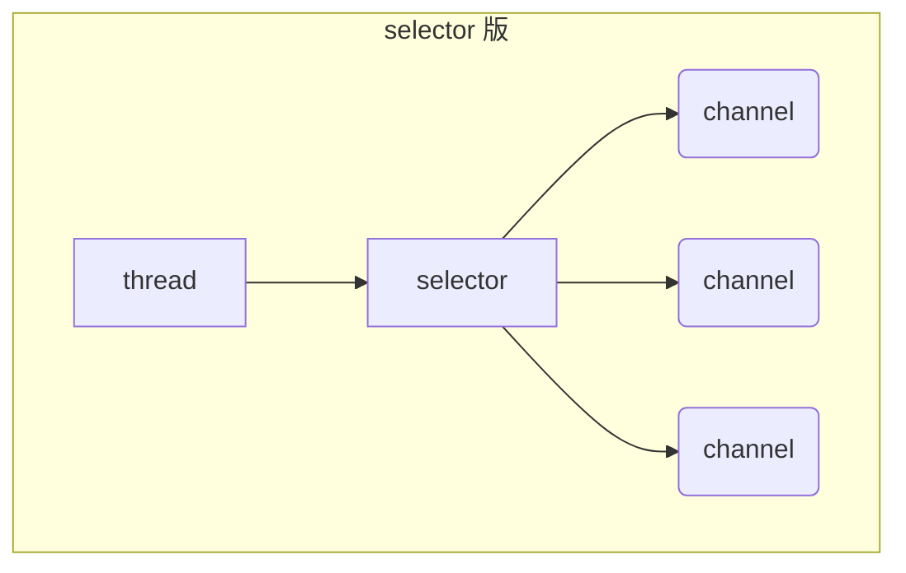

# Netty

视频链接：[黑马程序员Netty全套教程， netty深入浅出Java网络编程重点教程](https://www.bilibili.com/video/BV1py4y1E7oA?vd_source=6e6b2286ee9a603d7bdb2bc5ba80e449)

参考笔记：

- [Nio基础](https://nyimac.gitee.io/2021/04/18/Netty%E5%AD%A6%E4%B9%A0%E4%B9%8BNIO%E5%9F%BA%E7%A1%80/)
- [Netty笔记](https://nyimac.gitee.io/2021/04/25/Netty%E5%9F%BA%E7%A1%80/)

+++

## 一、NIO基础

### 1 三大组件

#### 1.1 Channel & Buffer

channel 有一点类似于 stream，它就是读写数据的**双向通道**，可以从 channel 将数据读入 buffer，也可以将 buffer 的数据写入 channel，而之前的 stream 要么是输入，要么是输出，channel 比 stream 更为底层


常见的 Channel 有

* FileChannel
* DatagramChannel
* SocketChannel
* ServerSocketChannel


buffer 则用来缓冲读写数据，常见的 buffer 有

* ByteBuffer
  * MappedByteBuffer
  * DirectByteBuffer
  * HeapByteBuffer
* ShortBuffer
* IntBuffer
* LongBuffer
* FloatBuffer
* DoubleBuffer
* CharBuffer


#### 1.2 Selector

selector 单从字面意思不好理解，需要结合服务器的设计演化来理解它的用途

1. 多线程版设计

   ```mermaid
   graph TD
   subgraph 多线程版
   t1(thread) --> s1(socket1)
   t2(thread) --> s2(socket2)
   t3(thread) --> s3(socket3)
   end
   ```

   多线程版缺点：

   + 内存占用高
   + 线程上下文切换成本高
   + 只适合连接数少的场景

2. 线程池版设计

   ```mermaid
   graph TD
   subgraph 线程池版
   t4(thread) --> s4(socket1)
   t5(thread) --> s5(socket2)
   t4(thread) -.-> s6(socket3)
   t5(thread) -.-> s7(socket4)
   end
   ```

   线程池版缺点：

   * 阻塞模式下，线程仅能处理一个 socket 连接
   * 仅适合短连接场景

3. selector 版设计

   selector 的作用就是配合一个线程来管理多个 channel，获取这些 channel 上发生的事件，这些 channel 工作在非阻塞模式下，不会让线程吊死在一个 channel 上。适合连接数特别多，但流量低的场景（low traffic）

   ```mermaid
   graph TD
   subgraph selector 版
   thread --> selector
   selector --> c1(channel)
   selector --> c2(channel)
   selector --> c3(channel)
   end
   ```

   

   调用 selector 的 `select()` 会阻塞直到 channel 发生了读写就绪事件，这些事件发生，select 方法就会返回这些事件交给 thread 来处理


### 2 ByteBuffer

有一普通文本文件 data.txt，内容为

```
1234567890abcd
```

使用 FileChannel 来读取文件内容

```java
@Slf4j
public class ChannelDemo1 {
    public static void main(String[] args) {
        // FileChannel  1.输入输出流获取  2.RanllomAccessFile获取
        try (RandomAccessFile file = new RandomAccessFile("helloword/data.txt", "rw")) {
            FileChannel channel = file.getChannel();
            ByteBuffer buffer = ByteBuffer.allocate(10);
            do {
                // 向 buffer 写入
                int len = channel.read(buffer);
                log.debug("读到字节数：{}", len);
                if (len == -1) {
                    break;
                }
                // 切换 buffer 读模式
                buffer.flip();
                while(buffer.hasRemaining()) {
                    log.debug("{}", (char) buffer.get());
                }
                // 切换 buffer 写模式
                buffer.clear();
            } while (true);
        } catch (IOException e) {
            e.printStackTrace();
        }
    }
}
```

输出

```
10:39:03 [DEBUG] [main] c.i.n.ChannelDemo1 - 读到字节数：10
10:39:03 [DEBUG] [main] c.i.n.ChannelDemo1 - 1
10:39:03 [DEBUG] [main] c.i.n.ChannelDemo1 - 2
10:39:03 [DEBUG] [main] c.i.n.ChannelDemo1 - 3
10:39:03 [DEBUG] [main] c.i.n.ChannelDemo1 - 4
10:39:03 [DEBUG] [main] c.i.n.ChannelDemo1 - 5
10:39:03 [DEBUG] [main] c.i.n.ChannelDemo1 - 6
10:39:03 [DEBUG] [main] c.i.n.ChannelDemo1 - 7
10:39:03 [DEBUG] [main] c.i.n.ChannelDemo1 - 8
10:39:03 [DEBUG] [main] c.i.n.ChannelDemo1 - 9
10:39:03 [DEBUG] [main] c.i.n.ChannelDemo1 - 0
10:39:03 [DEBUG] [main] c.i.n.ChannelDemo1 - 读到字节数：4
10:39:03 [DEBUG] [main] c.i.n.ChannelDemo1 - a
10:39:03 [DEBUG] [main] c.i.n.ChannelDemo1 - b
10:39:03 [DEBUG] [main] c.i.n.ChannelDemo1 - c
10:39:03 [DEBUG] [main] c.i.n.ChannelDemo1 - d
10:39:03 [DEBUG] [main] c.i.n.ChannelDemo1 - 读到字节数：-1
```


#### 2.1  ByteBuffer 正确使用姿势

1. 向 buffer 写入数据，例如调用 channel.read(buffer)
2. 调用 flip() 切换至**读模式**
3. 从 buffer 读取数据，例如调用 buffer.get()
4. 调用 clear() 或 compact() 切换至**写模式**
5. 重复 1~4 步骤


#### 2.2 ByteBuffer 结构

ByteBuffer 有以下重要属性

* capacity：容量
* position：读写指针
* limit：读写限制

一开始


写模式下，position 是写入位置，limit 等于容量，下图表示写入了 4 个字节后的状态


flip 动作发生后，position 切换为读取位置，limit 切换为读取限制


读取 4 个字节后，状态


clear 动作发生后，状态


compact 方法，是把未读完的部分向前压缩，然后切换至写模式


##### 💡 调试工具类

```java
public class ByteBufferUtil {
    private static final char[] BYTE2CHAR = new char[256];
    private static final char[] HEXDUMP_TABLE = new char[256 * 4];
    private static final String[] HEXPADDING = new String[16];
    private static final String[] HEXDUMP_ROWPREFIXES = new String[65536 >>> 4];
    private static final String[] BYTE2HEX = new String[256];
    private static final String[] BYTEPADDING = new String[16];

    static {
        final char[] DIGITS = "0123456789abcdef".toCharArray();
        for (int i = 0; i < 256; i++) {
            HEXDUMP_TABLE[i << 1] = DIGITS[i >>> 4 & 0x0F];
            HEXDUMP_TABLE[(i << 1) + 1] = DIGITS[i & 0x0F];
        }

        int i;

        // Generate the lookup table for hex dump paddings
        for (i = 0; i < HEXPADDING.length; i++) {
            int padding = HEXPADDING.length - i;
            StringBuilder buf = new StringBuilder(padding * 3);
            for (int j = 0; j < padding; j++) {
                buf.append("   ");
            }
            HEXPADDING[i] = buf.toString();
        }

        // Generate the lookup table for the start-offset header in each row (up to 64KiB).
        for (i = 0; i < HEXDUMP_ROWPREFIXES.length; i++) {
            StringBuilder buf = new StringBuilder(12);
            buf.append(NEWLINE);
            buf.append(Long.toHexString(i << 4 & 0xFFFFFFFFL | 0x100000000L));
            buf.setCharAt(buf.length() - 9, '|');
            buf.append('|');
            HEXDUMP_ROWPREFIXES[i] = buf.toString();
        }

        // Generate the lookup table for byte-to-hex-dump conversion
        for (i = 0; i < BYTE2HEX.length; i++) {
            BYTE2HEX[i] = ' ' + StringUtil.byteToHexStringPadded(i);
        }

        // Generate the lookup table for byte dump paddings
        for (i = 0; i < BYTEPADDING.length; i++) {
            int padding = BYTEPADDING.length - i;
            StringBuilder buf = new StringBuilder(padding);
            for (int j = 0; j < padding; j++) {
                buf.append(' ');
            }
            BYTEPADDING[i] = buf.toString();
        }

        // Generate the lookup table for byte-to-char conversion
        for (i = 0; i < BYTE2CHAR.length; i++) {
            if (i <= 0x1f || i >= 0x7f) {
                BYTE2CHAR[i] = '.';
            } else {
                BYTE2CHAR[i] = (char) i;
            }
        }
    }

    /**
     * 打印所有内容
     * @param buffer
     */
    public static void debugAll(ByteBuffer buffer) {
        int oldlimit = buffer.limit();
        buffer.limit(buffer.capacity());
        StringBuilder origin = new StringBuilder(256);
        appendPrettyHexDump(origin, buffer, 0, buffer.capacity());
        System.out.println("+--------+-------------------- all ------------------------+----------------+");
        System.out.printf("position: [%d], limit: [%d]\n", buffer.position(), oldlimit);
        System.out.println(origin);
        buffer.limit(oldlimit);
    }

    /**
     * 打印可读取内容
     * @param buffer
     */
    public static void debugRead(ByteBuffer buffer) {
        StringBuilder builder = new StringBuilder(256);
        appendPrettyHexDump(builder, buffer, buffer.position(), buffer.limit() - buffer.position());
        System.out.println("+--------+-------------------- read -----------------------+----------------+");
        System.out.printf("position: [%d], limit: [%d]\n", buffer.position(), buffer.limit());
        System.out.println(builder);
    }

    private static void appendPrettyHexDump(StringBuilder dump, ByteBuffer buf, int offset, int length) {
        if (isOutOfBounds(offset, length, buf.capacity())) {
            throw new IndexOutOfBoundsException(
                    "expected: " + "0 <= offset(" + offset + ") <= offset + length(" + length
                            + ") <= " + "buf.capacity(" + buf.capacity() + ')');
        }
        if (length == 0) {
            return;
        }
        dump.append(
                "         +-------------------------------------------------+" +
                        NEWLINE + "         |  0  1  2  3  4  5  6  7  8  9  a  b  c  d  e  f |" +
                        NEWLINE + "+--------+-------------------------------------------------+----------------+");

        final int startIndex = offset;
        final int fullRows = length >>> 4;
        final int remainder = length & 0xF;

        // Dump the rows which have 16 bytes.
        for (int row = 0; row < fullRows; row++) {
            int rowStartIndex = (row << 4) + startIndex;

            // Per-row prefix.
            appendHexDumpRowPrefix(dump, row, rowStartIndex);

            // Hex dump
            int rowEndIndex = rowStartIndex + 16;
            for (int j = rowStartIndex; j < rowEndIndex; j++) {
                dump.append(BYTE2HEX[getUnsignedByte(buf, j)]);
            }
            dump.append(" |");

            // ASCII dump
            for (int j = rowStartIndex; j < rowEndIndex; j++) {
                dump.append(BYTE2CHAR[getUnsignedByte(buf, j)]);
            }
            dump.append('|');
        }

        // Dump the last row which has less than 16 bytes.
        if (remainder != 0) {
            int rowStartIndex = (fullRows << 4) + startIndex;
            appendHexDumpRowPrefix(dump, fullRows, rowStartIndex);

            // Hex dump
            int rowEndIndex = rowStartIndex + remainder;
            for (int j = rowStartIndex; j < rowEndIndex; j++) {
                dump.append(BYTE2HEX[getUnsignedByte(buf, j)]);
            }
            dump.append(HEXPADDING[remainder]);
            dump.append(" |");

            // Ascii dump
            for (int j = rowStartIndex; j < rowEndIndex; j++) {
                dump.append(BYTE2CHAR[getUnsignedByte(buf, j)]);
            }
            dump.append(BYTEPADDING[remainder]);
            dump.append('|');
        }

        dump.append(NEWLINE +
                "+--------+-------------------------------------------------+----------------+");
    }

    private static void appendHexDumpRowPrefix(StringBuilder dump, int row, int rowStartIndex) {
        if (row < HEXDUMP_ROWPREFIXES.length) {
            dump.append(HEXDUMP_ROWPREFIXES[row]);
        } else {
            dump.append(NEWLINE);
            dump.append(Long.toHexString(rowStartIndex & 0xFFFFFFFFL | 0x100000000L));
            dump.setCharAt(dump.length() - 9, '|');
            dump.append('|');
        }
    }

    public static short getUnsignedByte(ByteBuffer buffer, int index) {
        return (short) (buffer.get(index) & 0xFF);
    }
}
```


#### 2.3 ByteBuffer 常见方法

##### 分配空间

可以使用 allocate 方法为 ByteBuffer 分配空间，其它 buffer 类也有该方法

```java
Bytebuffer buf = ByteBuffer.allocate(16);
```

```java
public static void main(String[] args) {
    System.out.println(ByteBuffer.allocate(16).getClass());
    System.out.println(ByteBuffer.allocateDirect(16).getClass());
    /*
    * class java.nio.HeapByteBuffer     - java 堆内存，读写效率较低，受到 GC 的影响
    * class java.nio.DirectByteBuffer   - 直接内存，读写效率高（少一次拷贝），不会受到 GC 的影响，分配效率低
    * */
}
```


##### 向 buffer 写入数据

有两种办法

* 调用 channel 的 read 方法
* 调用 buffer 自己的 put 方法

```java
int readBytes = channel.read(buf);
```

和

```java
buf.put((byte)127);
```


##### 从 buffer 读取数据

同样有两种办法

* 调用 channel 的 write 方法
* 调用 buffer 自己的 get 方法

```java
int writeBytes = channel.write(buf);
```

和

```java
byte b = buf.get();
```

get 方法会让 position 读指针向后走，如果想重复读取数据

* 可以调用 rewind 方法将 position 重新置为 0
* 或者调用 get(int i) 方法获取索引 i 的内容，它不会移动读指针


##### mark 和 reset

mark 是在读取时，做一个标记，即使 position 改变，只要调用 reset 就能回到 mark 的位置

> **注意**
>
> rewind 和 flip 都会清除 mark 位置


##### 字符串与 ByteBuffer 互转

```java
public static void main(String[] args) {
    // 1. 字符串 转为 ByteBuffer
    ByteBuffer buffer1 = ByteBuffer.allocate(16);
    buffer1.put("Hello Netty".getBytes());
    debugAll(buffer1);

    // 2. Charset
    ByteBuffer buffer2 = StandardCharsets.UTF_8.encode("Hello NIO");
    debugAll(buffer2);

    // 3. wrap
    ByteBuffer buffer3 = ByteBuffer.wrap("Hello".getBytes());
    debugAll(buffer3);

    // 4. 转为字符串
    String str2 = StandardCharsets.UTF_8.decode(buffer2).toString();
    System.out.println(str2);

    // 需要将 buffer1 切换至读模式
    buffer1.flip();
    String str1 = StandardCharsets.UTF_8.decode(buffer1).toString();
    System.out.println(str1);
}
```

输出

```
+--------+-------------------- all ------------------------+----------------+
position: [11], limit: [16]
         +-------------------------------------------------+
         |  0  1  2  3  4  5  6  7  8  9  a  b  c  d  e  f |
+--------+-------------------------------------------------+----------------+
|00000000| 48 65 6c 6c 6f 20 4e 65 74 74 79 00 00 00 00 00 |Hello Netty.....|
+--------+-------------------------------------------------+----------------+
+--------+-------------------- all ------------------------+----------------+
position: [0], limit: [9]
         +-------------------------------------------------+
         |  0  1  2  3  4  5  6  7  8  9  a  b  c  d  e  f |
+--------+-------------------------------------------------+----------------+
|00000000| 48 65 6c 6c 6f 20 4e 49 4f                      |Hello NIO       |
+--------+-------------------------------------------------+----------------+
+--------+-------------------- all ------------------------+----------------+
position: [0], limit: [5]
         +-------------------------------------------------+
         |  0  1  2  3  4  5  6  7  8  9  a  b  c  d  e  f |
+--------+-------------------------------------------------+----------------+
|00000000| 48 65 6c 6c 6f                                  |Hello           |
+--------+-------------------------------------------------+----------------+
Hello NIO
Hello Netty
```


##### ⚠️ Buffer 的线程安全

> Buffer 是**非线程安全的**


#### 2.4 Scattering Reads

分散读取，有一个文本文件 words.txt

```
onetwothree
```

使用如下方式读取，可以将数据填充至多个 buffer

```java
try (FileChannel channel = new RandomAccessFile("words.txt", "r").getChannel()) {
    ByteBuffer b1 = ByteBuffer.allocate(3);
    ByteBuffer b2 = ByteBuffer.allocate(3);
    ByteBuffer b3 = ByteBuffer.allocate(5);
    channel.read(new ByteBuffer[]{ b1, b2, b3 });

    b1.flip();
    b2.flip();
    b3.flip();

    debugAll(b1);
    debugAll(b2);
    debugAll(b3);
} catch (IOException e) {
    e.printStackTrace();
}
```

结果

```
+--------+-------------------- all ------------------------+----------------+
position: [0], limit: [3]
         +-------------------------------------------------+
         |  0  1  2  3  4  5  6  7  8  9  a  b  c  d  e  f |
+--------+-------------------------------------------------+----------------+
|00000000| 6f 6e 65                                        |one             |
+--------+-------------------------------------------------+----------------+
+--------+-------------------- all ------------------------+----------------+
position: [0], limit: [3]
         +-------------------------------------------------+
         |  0  1  2  3  4  5  6  7  8  9  a  b  c  d  e  f |
+--------+-------------------------------------------------+----------------+
|00000000| 74 77 6f                                        |two             |
+--------+-------------------------------------------------+----------------+
+--------+-------------------- all ------------------------+----------------+
position: [0], limit: [5]
         +-------------------------------------------------+
         |  0  1  2  3  4  5  6  7  8  9  a  b  c  d  e  f |
+--------+-------------------------------------------------+----------------+
|00000000| 74 68 72 65 65                                  |three           |
+--------+-------------------------------------------------+----------------+
```


#### 2.5 Gathering Writes

使用如下方式写入，可以将多个 buffer 的数据填充至 channel

```java
try (FileChannel channel = new RandomAccessFile("words2.txt", "rw").getChannel()) {
    ByteBuffer b1 = StandardCharsets.UTF_8.encode("hello");
    ByteBuffer b2 = StandardCharsets.UTF_8.encode("world");
    ByteBuffer b3 = StandardCharsets.UTF_8.encode("你好");

    channel.write(new ByteBuffer[]{ b1, b2, b3 });
} catch (IOException e) {
    e.printStackTrace();
}
```

文件内容

```
helloworld你好
```


#### 2.6 练习

网络上有多条数据发送给服务端，数据之间使用`\n`进行分隔
但由于某种原因这些数据在接收时，被进行了重新组合，例如原始数据有3条为

* Hello,world\n
* I'm zhangsan\n
* How are you?\n

变成了下面的两个 byteBuffer (黏包，半包)

* Hello,world\nI'm zhangsan\nHo
* w are you?\n

现在要求你编写程序，将错乱的数据恢复成原始的按`\n`分隔的数据

```java
public class TestByteBufferExam {
    public static void main(String[] args) {
        ByteBuffer source = ByteBuffer.allocate(32);
        source.put("Hello,world\nI'm zhangsan\nHo".getBytes());
        split(source);

        source.put("w are you?\n".getBytes());
        split(source);
    }

    private static void split(ByteBuffer source) {
        source.flip(); // 切换至读模式
        for (int i = 0; i < source.limit(); i++) {
            // 找到一条完整消息
            if (source.get(i) == '\n') {
                // 消息长度
                int length = i + 1 - source.position();
                // 把这条完整消息存入新的 ByteBuffer
                ByteBuffer target = ByteBuffer.allocate(length);
                // 从 source 读取，写入 target 中
                for (int j = 0; j < length; j++) {
                    target.put(source.get());
                }
                debugAll(target);
            }
        }
        source.compact();
    }
}
```

输出：

```
+--------+-------------------- all ------------------------+----------------+
position: [12], limit: [12]
         +-------------------------------------------------+
         |  0  1  2  3  4  5  6  7  8  9  a  b  c  d  e  f |
+--------+-------------------------------------------------+----------------+
|00000000| 48 65 6c 6c 6f 2c 77 6f 72 6c 64 0a             |Hello,world.    |
+--------+-------------------------------------------------+----------------+
+--------+-------------------- all ------------------------+----------------+
position: [13], limit: [13]
         +-------------------------------------------------+
         |  0  1  2  3  4  5  6  7  8  9  a  b  c  d  e  f |
+--------+-------------------------------------------------+----------------+
|00000000| 49 27 6d 20 7a 68 61 6e 67 73 61 6e 0a          |I'm zhangsan.   |
+--------+-------------------------------------------------+----------------+
+--------+-------------------- all ------------------------+----------------+
position: [13], limit: [13]
         +-------------------------------------------------+
         |  0  1  2  3  4  5  6  7  8  9  a  b  c  d  e  f |
+--------+-------------------------------------------------+----------------+
|00000000| 48 6f 77 20 61 72 65 20 79 6f 75 3f 0a          |How are you?.   |
+--------+-------------------------------------------------+----------------+
```


### 3 文件编程

#### 3.1 FileChannel

##### ⚠️ FileChannel 工作模式

> FileChannel 只能工作在阻塞模式下


##### 获取

不能直接打开 FileChannel，必须通过 FileInputStream、FileOutputStream 或者 RandomAccessFile 来获取 FileChannel，它们都有 getChannel 方法

* 通过 FileInputStream 获取的 channel 只能读
* 通过 FileOutputStream 获取的 channel 只能写
* 通过 RandomAccessFile 是否能读写根据构造 RandomAccessFile 时的读写模式决定


##### 读取

会从 channel 读取数据填充 ByteBuffer，返回值表示读到了多少字节，-1 表示到达了文件的末尾

```java
int readBytes = channel.read(buffer);
```


##### 写入

写入的正确姿势如下，SocketChannel

```java
ByteBuffer buffer = ...;
buffer.put(...); // 存入数据
buffer.flip();   // 切换读模式

while(buffer.hasRemaining()) {
    channel.write(buffer);
}
```

在 while 中调用 channel.write 是因为 write 方法并不能保证一次将 buffer 中的内容全部写入 channel


##### 关闭

channel 必须关闭，不过调用了 FileInputStream、FileOutputStream 或者 RandomAccessFile 的 close 方法会间接地调用 channel 的 close 方法


##### 位置

获取当前位置

```java
long pos = channel.position();
```

设置当前位置

```java
long newPos = ...;
channel.position(newPos);
```

设置当前位置时，如果设置为文件的末尾

* 这时读取会返回 -1 
* 这时写入，会追加内容，但要注意如果 position 超过了文件末尾，再写入时在新内容和原末尾之间会有空洞（00）


##### 大小

使用 size() 方法获取文件的大小


##### 强制写入

操作系统出于性能的考虑，会将数据缓存，不是立刻写入磁盘。可以调用 `force(true)` 方法将文件内容和元数据（文件的权限等信息）立刻写入磁盘


#### 3.2 两个Channel传输数据

```java
private static void method1() {
    try(
            FileChannel from = new FileInputStream("data.txt").getChannel();
            FileChannel to = new FileOutputStream("to.txt").getChannel();) {
        // 效率高，底层会利用操作系统的零拷贝进行优化
        from.transferTo(0, from.size(), to);
    } catch (IOException e) {
        e.printStackTrace();
    }
}
```

超过 2g 大小的文件传输

```java
private static void method2() {
    try(
            FileChannel from = new FileInputStream("data.txt").getChannel();
            FileChannel to = new FileOutputStream("to.txt").getChannel();) {
        // 效率高，底层会利用操作系统的零拷贝进行优化，最多传2G数据
        long size = from.size();
        // left 变量表示还剩多少字节
        for (long left = size; left > 0; ) {
            System.out.println("position:" + (size - left) + " left:" + left);
            left -= from.transferTo(size - left, left, to);
        }
    } catch (IOException e) {
        e.printStackTrace();
    }
}
```

实际传输一个超大文件

```
position:0 left:7769948160
position:2147483647 left:5622464513
position:4294967294 left:3474980866
position:6442450941 left:1327497219
```


#### 3.3 Path

jdk7 引入了 Path 和 Paths 类

* Path 用来表示文件路径
* Paths 是工具类，用来获取 Path 实例

```java
Path source = Paths.get("1.txt"); // 相对路径 使用 user.dir 环境变量来定位 1.txt

Path source = Paths.get("d:\\1.txt"); // 绝对路径 代表了  d:\1.txt

Path source = Paths.get("d:/1.txt"); // 绝对路径 同样代表了  d:\1.txt

Path projects = Paths.get("d:\\data", "projects"); // 代表了  d:\data\projects
```

* `.` 代表了当前路径
* `..` 代表了上一级路径

例如目录结构如下

```
d:
	|- data
		|- projects
			|- a
			|- b
```

代码

```java
Path path = Paths.get("d:\\data\\projects\\a\\..\\b");
System.out.println(path);
System.out.println(path.normalize()); // 正常化路径
```

会输出

```
d:\data\projects\a\..\b
d:\data\projects\b
```


#### 3.4 Files

1. 检查文件是否存在

   ```java
   Path path = Paths.get("helloword/data.txt");
   
   System.out.println(Files.exists(path));
   ```

2. 创建一级目录

   ```java
   Path path = Paths.get("helloword/d1");
   
   Files.createDirectory(path);
   ```

   * 如果目录已存在，会抛异常 FileAlreadyExistsException
   * 不能一次创建多级目录，否则会抛异常 NoSuchFileException

3. 创建多级目录用

   ```java
   Path path = Paths.get("helloword/d1/d2");
   
   Files.createDirectories(path);
   ```

4. 拷贝文件

   ```java
   Path source = Paths.get("helloword/data.txt");
   Path target = Paths.get("helloword/target.txt");
   
   Files.copy(source, target);
   ```

   * 如果文件已存在，会抛异常 FileAlreadyExistsException

   如果希望用 source 覆盖掉 target，需要用 StandardCopyOption 来控制

   ```java
   Files.copy(source, target, StandardCopyOption.REPLACE_EXISTING);
   ```

5. 移动文件

   ```java
   Path source = Paths.get("helloword/data.txt");
   Path target = Paths.get("helloword/data.txt");
   
   Files.move(source, target, StandardCopyOption.ATOMIC_MOVE);
   ```

   * StandardCopyOption.ATOMIC_MOVE 保证文件移动的原子性

6. 删除文件

   ```java
   Path target = Paths.get("helloword/target.txt");
   
   Files.delete(target);
   ```

   * 如果文件不存在，会抛异常 NoSuchFileException

7. 删除目录

   ```java
   Path target = Paths.get("helloword/d1");
   
   Files.delete(target);
   ```

   * 如果目录还有内容，会抛异常 DirectoryNotEmptyException

8. 遍历目录文件

   ```java
   /**
    * 遍历所在目录下所有的文件和目录 并统计目录和文件的数量
    * 
    * @throws IOException
    */
   private static void m1() throws IOException {
       AtomicInteger dirCount = new AtomicInteger();
       AtomicInteger fileCount = new AtomicInteger();
       final String pathName = "X:\\a_sourceCode\\apache-zookeeper-3.5.7\\apache-zookeeper-3.5.7";
       Files.walkFileTree(Paths.get(pathName), new SimpleFileVisitor<Path>() {
           @Override
           public FileVisitResult preVisitDirectory(Path dir, BasicFileAttributes attrs) throws IOException {
               System.out.println(dir);
               dirCount.incrementAndGet();
               return super.preVisitDirectory(dir, attrs);
           }
   
           @Override
           public FileVisitResult visitFile(Path file, BasicFileAttributes attrs) throws IOException {
               System.out.println("=====" + file);
               fileCount.incrementAndGet();
               return super.visitFile(file, attrs);
           }
       });
   
       System.out.println("dir count：" + dirCount);
       System.out.println("file count：" + fileCount);
   }
   ```

9. 统计 jar 的数目

   ```java
   /**
    * 计算所在目录下面的jar包的数量
    *
    * @throws IOException
    */
   private static void m2() throws IOException {
       AtomicInteger jarCount = new AtomicInteger();
       final String pathName = "X:\\newJava\\Maven\\maven_repository";
       Files.walkFileTree(Paths.get(pathName), new SimpleFileVisitor<Path>() {
           @Override
           public FileVisitResult visitFile(Path file, BasicFileAttributes attrs) throws IOException {
               if (file.toString().endsWith(".jar")) {
                   System.out.println(file);
                   jarCount.incrementAndGet();
               }
               return super.visitFile(file, attrs);
           }
       });
       System.out.println("jar count：" + jarCount);
   }
   ```

10. 删除多级目录

    ```java
    /**
     * 删除多级目录
     *
     * @throws IOException
     */
    private static void m3() throws IOException {
        final String pathName = "C:\\Users\\Amadeus\\Desktop\\apache-zookeeper-3.5.7";
        Files.walkFileTree(Paths.get(pathName), new SimpleFileVisitor<Path>() {
            @Override
            public FileVisitResult visitFile(Path file, BasicFileAttributes attrs) throws IOException {
                Files.delete(file);
                return super.visitFile(file, attrs);
            }
    
            @Override
            public FileVisitResult postVisitDirectory(Path dir, IOException exc) throws IOException {
                Files.delete(dir);
                return super.postVisitDirectory(dir, exc);
            }
        });
    }
    ```

    > 删除是危险操作，确保要递归删除的文件夹没有重要内容

11. 拷贝多级目录

    ```java
    /**
     * 拷贝多级目录
     * @throws IOException
     */
    private static void m4() throws IOException {
        final String source = "X:\\a_sourceCode\\apache-zookeeper-3.5.7\\apache-zookeeper-3.5.7";
        final String target = "C:\\Users\\Amadeus\\Desktop\\zookeeper";
        Files.walk(Paths.get(source)).forEach(path -> {
            try {
                String targetName = path.toString().replace(source, target);
                if (Files.isDirectory(path)) {
                    // 是目录 创建目录
                    Files.createDirectory(Paths.get(targetName));
                } else if (Files.isRegularFile(path)) {
                    // 是普通文件 拷贝
                    Files.copy(path, Paths.get(targetName));
                }
            } catch (IOException e) {
                throw new RuntimeException(e);
            }
        });
    }
    ```


### 4 网络编程

#### 4.1 非阻塞VS阻塞

##### 堵塞

* 阻塞模式下，相关方法都会导致线程暂停
  * ServerSocketChannel.accept 会在**没有连接建立时**让线程暂停
  * SocketChannel.read 会在**通道中没有数据可读时**让线程暂停
  * 阻塞的表现其实就是线程暂停了，暂停期间不会占用 cpu，但线程相当于闲置
* 单线程下，阻塞方法之间相互影响，几乎不能正常工作，需要多线程支持
* 但多线程下，有新的问题，体现在以下方面
  * 32 位 jvm 一个线程 320k，64 位 jvm 一个线程 1024k，如果连接数过多，必然导致 OOM，并且线程太多，反而会因为频繁上下文切换导致性能降低
  * 可以采用线程池技术来减少线程数和线程上下文切换，但治标不治本，如果有很多连接建立，但长时间 inactive，会阻塞线程池中所有线程，因此不适合长连接，只适合短连接

**服务器端**：

```java
public class Server {
    public static void main(String[] args) throws IOException {
        // 0. 创建缓冲区
        ByteBuffer buffer = ByteBuffer.allocate(16);
        // 1. 创建服务器
        ServerSocketChannel ssc = ServerSocketChannel.open();
        // 2. 绑定监听接口
        ssc.bind(new InetSocketAddress(8080));
        // 3. 连接集合
        List<SocketChannel> channels = new ArrayList<>();
        while (true) {
            // 4. accept 建立与客户端连接，SocketChannel 用来与客户端之间通信
            System.out.println("before connecting...");
            SocketChannel sc = ssc.accept(); // 堵塞方法，线程停止运行
            System.out.println("after connecting...");
            channels.add(sc);
            for (SocketChannel channel : channels) {
                // 5. 接收客户端发送的数据
                System.out.println("before reading");
                channel.read(buffer); // 堵塞方法，线程停止运行
                buffer.flip();
                debugRead(buffer);
                buffer.clear();
                System.out.println("after reading");
            }
        }
    }
}
```

**客户端**：

```java
@Slf4j
public class Client {
    public static void main(String[] args) throws IOException {
        SocketChannel sc = SocketChannel.open();
        sc.connect(new InetSocketAddress("localhost", 8080));
        System.out.println("waiting...");
    }
}
```

运行结果

- 客户端-服务器建立连接前：服务器端因accept阻塞

  [](https://nyimapicture.oss-cn-beijing.aliyuncs.com/img/20210413213318.png)

- 客户端-服务器建立连接后，客户端发送消息前：服务器端因通道为空被阻塞

  [](https://nyimapicture.oss-cn-beijing.aliyuncs.com/img/20210413213446.png)

- 客户端发送数据后，服务器处理通道中的数据。再次进入循环时，再次被accept阻塞

  [](https://nyimapicture.oss-cn-beijing.aliyuncs.com/img/20210413214109.png)

- 之前的客户端再次发送消息，**服务器端因为被accept阻塞**，无法处理之前客户端发送到通道中的信息

  [](https://nyimapicture.oss-cn-beijing.aliyuncs.com/img/20210413214505.png)


##### 非阻塞

* 非阻塞模式下，相关方法都会不会让线程暂停
  * 在 ServerSocketChannel.accept 在没有连接建立时，会返回 null，继续运行
  * SocketChannel.read 在没有数据可读时，会返回 0，但线程不必阻塞，可以去执行其它 SocketChannel 的 read 或是去执行 ServerSocketChannel.accept 
  * 写数据时，线程只是等待数据写入 Channel 即可，无需等 Channel 通过网络把数据发送出去
* 但非阻塞模式下，即使没有连接建立，和可读数据，线程仍然在不断运行，白白浪费了 cpu
* 数据复制过程中，线程实际还是阻塞的（AIO 改进的地方）

**服务器端，客户端代码不变**：

```java
@Slf4j
public class Server {
    public static void main(String[] args) throws IOException {
        // 使用 NIO 来理解非阻塞模式, 单线程
        // 0. ByteBuffer
        ByteBuffer buffer = ByteBuffer.allocate(16);
        // 1. 创建服务器
        ServerSocketChannel ssc = ServerSocketChannel.open();
        ssc.configureBlocking(false); // 非阻塞模式
        // 2. 绑定监听接口
        ssc.bind(new InetSocketAddress(8080));
        // 3. 连接集合
        List<SocketChannel> channels = new ArrayList<>();
        while (true) {
            // 4. accept 建立与客户端连接，SocketChannel 用来与客户端之间通信
            SocketChannel sc = ssc.accept(); // 非堵塞方法，线程还会继续运行，如果没有连接建立，返回的sc为null
            if (sc != null) {
                log.debug("connected... {}", sc);
                sc.configureBlocking(false); // 非堵塞模式
                channels.add(sc);
            }
            for (SocketChannel channel : channels) {
                // 5. 接收客户端发送的数据
                int read = channel.read(buffer);// 非堵塞方法，线程还会继续运行，如果没有读到数据，read 返回 0
                if (read > 0) {
                    buffer.flip();
                    debugRead(buffer);
                    buffer.clear();
                    log.debug("after read... {}", channel);
                }
            }
        }
    }
}
```


##### 多路复用

单线程可以配合 Selector 完成对多个 Channel 可读写事件的监控，这称之为多路复用

* 多路复用*仅针对网络IO*，*普通文件IO*没法利用多路复用
* 如果不用 Selector 的非阻塞模式，线程大部分时间都在做无用功，而 Selector 能够保证
  * 有可连接事件时才去连接
  * 有可读事件才去读取
  * 有可写事件才去写入
    * 限于网络传输能力，Channel 未必时时可写，一旦 Channel 可写，会触发 Selector 的可写事件


#### 4.2 Selector




好处

* 一个线程配合 selector 就可以监控多个 channel 的事件，事件发生线程才去处理。避免非阻塞模式下所做无用功
* 让这个线程能够被充分利用
* 节约了线程的数量
* 减少了线程上下文切换


##### 创建Selector

```java
Selector selector = Selector.open();
```


##### 绑定 Channel 事件

也称之为注册事件，绑定的事件 selector 才会关心

```java
channel.configureBlocking(false);
SelectionKey key = channel.register(selector, 绑定事件);
```

* channel 必须工作在非阻塞模式
* FileChannel 没有非阻塞模式，因此不能配合 selector 一起使用
* 绑定的事件类型可以有
  * connect - 客户端连接成功时触发
  * accept - 服务器端成功接受连接时触发
  * read - 数据可读入时触发，有因为接收能力弱，数据暂不能读入的情况
  * write - 数据可写出时触发，有因为发送能力弱，数据暂不能写出的情况


##### 监听Channel事件

可以通过下面三种方法来监听是否有事件发生，方法的返回值代表有多少 channel 发生了事件

方法1，阻塞直到绑定事件发生

```java
int count = selector.select();
```

方法2，阻塞直到绑定事件发生，或是超时（时间单位为 ms）

```java
int count = selector.select(long timeout);
```

方法3，不会阻塞，也就是不管有没有事件，立刻返回，自己根据返回值检查是否有事件

```java
int count = selector.selectNow();
```


##### 💡 select 何时不阻塞

> * 事件发生时
>   * 客户端发起连接请求，会触发 accept 事件
>   * 客户端发送数据过来，客户端正常、异常关闭时，都会触发 read 事件，另外如果发送的数据大于 buffer 缓冲区，会触发多次读取事件
>   * channel 可写，会触发 write 事件
>   * 在 linux 下 nio bug 发生时
> * 调用 selector.wakeup()
> * 调用 selector.close()
> * selector 所在线程 interrupt


#### 4.3 处理 accept 事件

要使用 Selector 实现多路复用，服务端代码如下改进

```java
public class SelectServer {
    public static void main(String[] args) {
        ByteBuffer buffer = ByteBuffer.allocate(16);
        // 获得服务器通道
        try(ServerSocketChannel server = ServerSocketChannel.open()) {
            server.bind(new InetSocketAddress(8080));
            // 创建选择器
            Selector selector = Selector.open();
            
            // 通道必须设置为非阻塞模式
            server.configureBlocking(false);
            // 将通道注册到选择器中，并设置感兴趣的事件
            server.register(selector, SelectionKey.OP_ACCEPT);
            while (true) {
                // 若没有事件就绪，线程会被阻塞，反之不会被阻塞。从而避免了CPU空转
                // 返回值为就绪的事件个数
                int ready = selector.select();
                System.out.println("selector ready counts : " + ready);
                
                // 获取所有事件
                Set<SelectionKey> selectionKeys = selector.selectedKeys();
                
                // 使用迭代器遍历事件
                Iterator<SelectionKey> iterator = selectionKeys.iterator();
                while (iterator.hasNext()) {
                    SelectionKey key = iterator.next();
                    
                    // 判断key的类型
                    if(key.isAcceptable()) {
                        // 获得key对应的channel
                        ServerSocketChannel channel = (ServerSocketChannel) key.channel();
                        System.out.println("before accepting...");
                        
        				// 获取连接并处理，而且是必须处理，否则需要取消
                        SocketChannel socketChannel = channel.accept();
                        System.out.println("after accepting...");
                    }
                    // 处理完毕后移除
                    iterator.remove();
                }
            }
        } catch (IOException e) {
            e.printStackTrace();
        }
    }
}Copy
```

**步骤解析**

- 获得选择器Selector

  ```java
  Selector selector = Selector.open();
  ```

- 将**通道设置为非阻塞模式**，并注册到选择器中，并设置感兴趣的事件

  - channel 必须工作在非阻塞模式

  - FileChannel 没有非阻塞模式，因此不能配合 selector 一起使用

  - 绑定的**事件类型**可以有

    - connect - 客户端连接成功时触发
    - accept - 服务器端成功接受连接时触发
    - read - 数据可读入时触发，有因为接收能力弱，数据暂不能读入的情况
    - write - 数据可写出时触发，有因为发送能力弱，数据暂不能写出的情况

    ```java
    // 通道必须设置为非阻塞模式
    server.configureBlocking(false);
    // 将通道注册到选择器中，并设置感兴趣的实践
    server.register(selector, SelectionKey.OP_ACCEPT);
    ```

- 通过Selector监听事件，并获得就绪的通道个数，若没有通道就绪，线程会被阻塞

  - 阻塞直到绑定事件发生

    ```java
    int count = selector.select();
    ```

  - 阻塞直到绑定事件发生，**或是超时**（时间单位为 ms）

    ```java
    int count = selector.select(long timeout);
    ```

  - **不会阻塞**，也就是不管有没有事件，立刻返回，自己根据返回值检查是否有事件

    ```java
    int count = selector.selectNow();
    ```

- 获取就绪事件并**得到对应的通道**，然后进行处理

  ```java
  // 获取所有事件
  Set<SelectionKey> selectionKeys = selector.selectedKeys();
                  
  // 使用迭代器遍历事件
  Iterator<SelectionKey> iterator = selectionKeys.iterator();
  
  while (iterator.hasNext()) {
  	SelectionKey key = iterator.next();
                      
  	// 判断key的类型，此处为Accept类型
  	if(key.isAcceptable()) {
          // 获得key对应的channel
          ServerSocketChannel channel = (ServerSocketChannel) key.channel();
  
          // 获取连接并处理，而且是必须处理，否则需要取消
          SocketChannel socketChannel = channel.accept();
  
          // 处理完毕后移除
          iterator.remove();
  	}
  }
  ```

**事件发生后能否不处理**

事件发生后，**要么处理，要么取消（cancel）**，不能什么都不做，**否则下次该事件仍会触发**，这是因为 nio 底层使用的是水平触发


#### 4.4 处理 read 事件

- 在Accept事件中，若有客户端与服务器端建立了连接，**需要将其对应的SocketChannel设置为非阻塞，并注册到选择其中**；
- 添加Read事件，触发后进行读取操作

```java
public class SelectServer {
    public static void main(String[] args) {
        ByteBuffer buffer = ByteBuffer.allocate(16);
        // 获得服务器通道
        try(ServerSocketChannel server = ServerSocketChannel.open()) {
            server.bind(new InetSocketAddress(8080));
            // 创建选择器
            Selector selector = Selector.open();
            // 通道必须设置为非阻塞模式
            server.configureBlocking(false);
            // 将通道注册到选择器中，并设置感兴趣的实践
            server.register(selector, SelectionKey.OP_ACCEPT);
            // 为serverKey设置感兴趣的事件
            while (true) {
                // 若没有事件就绪，线程会被阻塞，反之不会被阻塞。从而避免了CPU空转
                // 返回值为就绪的事件个数
                int ready = selector.select();
                System.out.println("selector ready counts : " + ready);
                // 获取所有事件
                Set<SelectionKey> selectionKeys = selector.selectedKeys();
                // 使用迭代器遍历事件
                Iterator<SelectionKey> iterator = selectionKeys.iterator();
                while (iterator.hasNext()) {
                    SelectionKey key = iterator.next();
                    // 判断key的类型
                    if(key.isAcceptable()) {
                        // 获得key对应的channel
                        ServerSocketChannel channel = (ServerSocketChannel) key.channel();
                        System.out.println("before accepting...");
                        // 获取连接
                        SocketChannel socketChannel = channel.accept();
                        System.out.println("after accepting...");
                        // 设置为非阻塞模式，同时将连接的通道也注册到选择其中
                        socketChannel.configureBlocking(false);
                        socketChannel.register(selector, SelectionKey.OP_READ);
                    } else if (key.isReadable()) {
                        SocketChannel channel = (SocketChannel) key.channel();
                        System.out.println("before reading...");
                        channel.read(buffer);
                        System.out.println("after reading...");
                        buffer.flip();
                        ByteBufferUtil.debugRead(buffer);
                        buffer.clear();
                    }
                    // 处理完毕后移除
                    iterator.remove();
                }
            }
        } catch (IOException e) {
            e.printStackTrace();
        }
    }
}
```


##### 💡 为何要iterator.remove()

**当处理完一个事件后，一定要调用迭代器的remove方法移除对应事件，否则会出现错误**。原因如下

以我们上面的 **Read事件** 的代码为例

- 当调用了 server.register(selector, SelectionKey.OP_ACCEPT)后，Selector中维护了一个集合，**用于存放SelectionKey以及其对应的通道**

  ```java
  // WindowsSelectorImpl 中的 SelectionKeyImpl数组
  private SelectionKeyImpl[] channelArray = new SelectionKeyImpl[8];
  ```

  ```java
  public class SelectionKeyImpl extends AbstractSelectionKey {
      // Key对应的通道
      final SelChImpl channel;
      ...
  }
  ```

  

- 当**选择器中的通道对应的事件发生后**，selecionKey会被放到另一个集合中，但是**selecionKey不会自动移除**，所以需要我们在处理完一个事件后，通过迭代器手动移除其中的selecionKey。否则会导致已被处理过的事件再次被处理，就会引发错误

  


##### 💡 cancel的作用：断开处理

当客户端与服务器之间的连接**断开时，会给服务器端发送一个读事件**，对异常断开和正常断开需要加以不同的方式进行处理

- **正常断开**

  - 正常断开时，服务器端的channel.read(buffer)方法的返回值为-1，**所以当结束到返回值为-1时，需要调用key的cancel方法取消此事件，并在取消后移除该事件**

    ```java
    int read = channel.read(buffer);
    // 断开连接时，客户端会向服务器发送一个写事件，此时read的返回值为-1
    if(read == -1) {
        // 取消该事件的处理
    	key.cancel();
        channel.close();
    } else {
        ...
    }
    // 取消或者处理，都需要移除key
    iterator.remove();
    ```

  - 异常断开

    - 异常断开时，会抛出IOException异常，在try-catch的**catch块中捕获异常并调用key的cancel方法即可**


##### 💡 消息边界

**不处理消息边界存在的问题**

将缓冲区的大小设置为4个字节，发送2个汉字（你好），通过decode解码并打印时，会出现乱码

```java
ByteBuffer buffer = ByteBuffer.allocate(4);
// 解码并打印
System.out.println(StandardCharsets.UTF_8.decode(buffer));
```

```
你�
��
```

这是因为UTF-8字符集下，1个汉字占用3个字节，此时缓冲区大小为4个字节，**一次读时间无法处理完通道中的所有数据，所以一共会触发两次读事件**。这就导致`你好`的`好`字被拆分为了前半部分和后半部分发送，解码时就会出现问题


**处理消息边界**

传输的文本可能有以下三种情况

- 文本大于缓冲区大小 - 时刻1
  - 此时需要将缓冲区进行扩容
- 发生半包现象 - 时刻2
- 发生粘包现象 - 时刻3


解决思路大致有以下三种

- **固定消息长度**，数据包大小一样，服务器按预定长度读取，当发送的数据较少时，需要将数据进行填充，直到长度与消息规定长度一致。缺点是浪费带宽

- 另一种思路是按分隔符拆分，缺点是效率低，需要一个一个字符地去匹配分隔符

- TLV 格式，即 Type 类型、Length 长度、Value 数据（也就是在消息开头用一些空间存放后面数据的长度），如HTTP请求头中的Content-Type与

  Content-Length。类型和长度已知的情况下，就可以方便获取消息大小，分配合适的 buffer，缺点是 buffer 需要提前分配，如果内容过大，则影响 server 吞吐量

  - Http 1.1 是 TLV 格式
  - Http 2.0 是 LTV 格式


下文的消息边界处理方式为**第二种：按分隔符拆分**

**附件与扩容**

Channel的register方法还有**第三个参数**：`附件`，可以向其中放入一个Object类型的对象，该对象会与登记的Channel以及其对应的SelectionKey绑定，可以从SelectionKey获取到对应通道的附件

```java
public final SelectionKey register(Selector sel, int ops, Object att)
```

可通过SelectionKey的**attachment()方法获得附件**

```
ByteBuffer buffer = (ByteBuffer) key.attachment();
```

我们需要在Accept事件发生后，将通道注册到Selector中时，**对每个通道添加一个ByteBuffer附件**，让每个通道发生读事件时都使用自己的通道，避免与其他通道发生冲突而导致问题

```java
// 设置为非阻塞模式，同时将连接的通道也注册到选择其中，同时设置附件
socketChannel.configureBlocking(false);
ByteBuffer buffer = ByteBuffer.allocate(16);
// 添加通道对应的Buffer附件
socketChannel.register(selector, SelectionKey.OP_READ, buffer);
```

当Channel中的数据大于缓冲区时，需要对缓冲区进行**扩容**操作。此代码中的扩容的判定方法：**Channel调用compact方法后，buffer的position与limit相等，说明缓冲区中的数据并未被读取（容量太小），此时创建新的缓冲区，其大小扩大为两倍。同时还要将旧缓冲区中的数据拷贝到新的缓冲区中，同时调用SelectionKey的attach方法将新的缓冲区作为新的附件放入SelectionKey中**

```java
// 如果缓冲区太小，就进行扩容
if (buffer.position() == buffer.limit()) {
    ByteBuffer newBuffer = ByteBuffer.allocate(buffer.capacity() << 1);
    // 将旧buffer中的内容放入新的buffer中
    newBuffer.put(buffer);
    // 将新buffer作为附件放到key中
    key.attach(newBuffer);
}
```

**改造后的服务器代码如下**

```java
@Slf4j
public class Server {
    public static void main(String[] args) throws IOException {
        // 1. 创建Selector对象，管理多个Channel
        Selector selector = Selector.open();
        ServerSocketChannel ssc = ServerSocketChannel.open();
        ssc.configureBlocking(false);

        // 2. 建立 selector 和 channel 的联系（注册）
        // SelectionKey 就是将来事件发生后，通过它可以知道事件和哪个channel的事件
        SelectionKey sscKey = ssc.register(selector, 0, null);
        // sscKey 只关注 accept 事件
        sscKey.interestOps(SelectionKey.OP_ACCEPT);
        log.debug("register key: {}", sscKey);
        ssc.bind(new InetSocketAddress(8080));

        while (true) {
            // 3. select 方法，没有事件发生，线程堵塞，有事件，线程才会恢复运行
            // select 在事件未处理时，它不会堵塞
            selector.select();
            // 4. 处理事件，selectedKeys 方法内部包含了所有发生的事件
            Set<SelectionKey> keySet = selector.selectedKeys();
            Iterator<SelectionKey> it = keySet.iterator();
            while (it.hasNext()) {
                SelectionKey key = it.next();
                // 处理 key 时，要从 selectedKeys 集合中删除，否则下次处理就会有问题
                it.remove();
                log.debug("key: {}", key);
                // 5. 区分事件类型
                if (key.isAcceptable()) { // 如果是 accept 事件
                    ServerSocketChannel channel = (ServerSocketChannel) key.channel();
                    SocketChannel sc = channel.accept();
                    sc.configureBlocking(false);
                    ByteBuffer buffer = ByteBuffer.allocate(16); // attachment 附件
                    // 将一个 ByteBuffer 作为附件关联到 selectionKey 上
                    SelectionKey scKey = sc.register(selector, 0, buffer);
                    scKey.interestOps(SelectionKey.OP_READ);
                    log.debug("sc {}: ", sc);
                    log.debug("scKey {}: ", scKey);
                } else if (key.isReadable()) { // 如果是 read 事件
                    try {
                        SocketChannel channel = (SocketChannel) key.channel();
                        // 获取 selectionKey 上关联的附件
                        ByteBuffer buffer = (ByteBuffer) key.attachment();
                        int read = channel.read(buffer); // 如果是正常断开，read 方法的返回值是 -1
                        if (read == -1) {
                            key.cancel();
                        } else {
                            split(buffer);
                            if (buffer.position() == buffer.limit()) {
                                ByteBuffer newBuffer = ByteBuffer.allocate(buffer.capacity() << 1);
                                buffer.flip();
                                newBuffer.put(buffer);
                                key.attach(newBuffer);
                            }
                        }
                    } catch (IOException e) {
                        e.printStackTrace();
                        key.cancel(); // 因为客户端断开了，因此需要将 key 取消（从 selector 的 keys 集合中真正删除 key）
                    }
                }
            }
        }
    }

    public static void split(ByteBuffer source) {
        source.flip();
        for (int i = 0; i < source.limit(); i++) {
            // 找到一条完整消息
            if (source.get(i) == '\n') {
                // 消息长度
                int length = i + 1 - source.position();
                // 把这条完整消息存入新的 ByteBuffer
                ByteBuffer target = ByteBuffer.allocate(length);
                // 从 source 读取，写入 target 中
                for (int j = 0; j < length; j++) {
                    target.put(source.get());
                }
                debugAll(target);
            }
        }
        source.compact();
    }
}
```


##### ByteBuffer的大小分配

* 每个 channel 都需要记录可能被切分的消息，因为 **ByteBuffer 不能被多个 channel 共同使用**，因此需要为每个 channel 维护一个独立的 ByteBuffer

* ByteBuffer 不能太大，比如一个 ByteBuffer 1Mb 的话，要支持百万连接就要 1Tb 内存，因此需要设计大小可变的 ByteBuffer

  * 一种思路是首先分配一个较小的 buffer，例如 4k，如果发现数据不够，再分配 8k 的 buffer，将 4k buffer 内容拷贝至 8k buffer，优点是消息连续容易处理，缺点是数据拷贝耗费性能

    参考实现 [http://tutorials.jenkov.com/java-performance/resizable-array.html](http://tutorials.jenkov.com/java-performance/resizable-array.html)

  * 另一种思路是用多个数组组成 buffer，一个数组不够，把多出来的内容写入新的数组，与前面的区别是消息存储不连续解析复杂，优点是避免了拷贝引起的性能损耗


#### 4.5 处理 write 事件

服务器通过Buffer向通道中写入数据时，**可能因为通道容量小于Buffer中的数据大小，导致无法一次性将Buffer中的数据全部写入到Channel中，这时便需要分多次写入**，具体步骤如下

- 执行一次写操作，向将buffer中的内容写入到SocketChannel中，然后判断Buffer中是否还有数据

- 若Buffer中还有数据，则**需要将SockerChannel注册到Seletor中，并关注写事件，同时将未写完的Buffer作为附件一起放入到SelectionKey中**

  ```java
  int write = socket.write(buffer);
  // 通道中可能无法放入缓冲区中的所有数据
  if (buffer.hasRemaining()) {
      // 注册到Selector中，关注可写事件，并将buffer添加到key的附件中
      socket.configureBlocking(false);
      socket.register(selector, SelectionKey.OP_WRITE, buffer);
  }
  ```

- 添加写事件的相关操作`key.isWritable()`，对Buffer再次进行写操作

  每次写后需要判断Buffer中是否还有数据（是否写完）。**若写完，需要移除SelecionKey中的Buffer附件，避免其占用过多内存，同时还需移除对写事件的关注**

  ```java
  SocketChannel socket = (SocketChannel) key.channel();
  // 获得buffer
  ByteBuffer buffer = (ByteBuffer) key.attachment();
  // 执行写操作
  int write = socket.write(buffer);
  System.out.println(write);
  // 如果已经完成了写操作，需要移除key中的附件，同时不再对写事件感兴趣
  if (!buffer.hasRemaining()) {
      key.attach(null);
      key.interestOps(0);
  }
  ```

**整体代码如下**

服务端：

```java
@Slf4j
public class WriteServer {
    public static void main(String[] args) throws IOException {
        ServerSocketChannel ssc = ServerSocketChannel.open();
        ssc.configureBlocking(false);

        Selector selector = Selector.open();
        ssc.register(selector, SelectionKey.OP_ACCEPT);

        ssc.bind(new InetSocketAddress(8080));

        while (true) {
            selector.select();
            Iterator<SelectionKey> it = selector.selectedKeys().iterator();
            while (it.hasNext()) {
                SelectionKey key = it.next();
                it.remove();
                if (key.isAcceptable()) {
                    SocketChannel sc = ssc.accept();
                    sc.configureBlocking(false);
                    SelectionKey scKey = sc.register(selector, 0, null);
                    scKey.interestOps(SelectionKey.OP_READ);

                    // 1. 向客户端发送大量数据
                    StringBuilder sb = new StringBuilder();
                    for (long i = 0; i < 30000000L; i++) {
                        sb.append((char) (i & 127));
                    }
                    ByteBuffer buffer = Charset.defaultCharset().encode(sb.toString());

                    // 2. 返回值代表实际写入的字节数
                    int write = sc.write(buffer);
                    log.debug("write = {}", write);

                    // 3. 判断是否有剩余内容
                    if (buffer.hasRemaining()) {
                        // 4. 关注可写事件
                        scKey.interestOps(scKey.interestOps() + SelectionKey.OP_WRITE);
                        // 5. 把未写完的数据挂到 scKey 上
                        scKey.attach(buffer);
                    }
                } else if (key.isWritable()){
                    ByteBuffer buffer = (ByteBuffer) key.attachment();
                    SocketChannel sc = (SocketChannel) key.channel();
                    int write = sc.write(buffer);
                    log.debug("write = {}", write);
                    // 6. 清理操作
                    // 如果已经完成了写操作，需要移除key中的附件，同时不再对写事件感兴趣
                    if (!buffer.hasRemaining()) {
                        key.attach(null); // 需要清除 buffer
                        key.interestOps(key.interestOps() - SelectionKey.OP_WRITE); // 不需要关注可写事件
                    }
                }
            }
        }
    }
}
```

客户端：

```java
@Slf4j
public class WriteClient {
    public static void main(String[] args) throws IOException {
        SocketChannel sc = SocketChannel.open();
        sc.connect(new InetSocketAddress("localhost", 8080));
        // 3. 接收数据
        int count = 0;
        while (true) {
            ByteBuffer buffer = ByteBuffer.allocate(1024 * 1024);
            count += sc.read(buffer);
            log.debug("count = {}", count);
            buffer.clear();
        }
    }
}
```


##### 💡 write为何要取消

只要向 channel 发送数据时，socket 缓冲可写，这个事件会频繁触发，因此应当只在 socket 缓冲区写不下时再关注可写事件，数据写完之后再取消关注


#### 4.6 优化

##### 💡 利用多线程优化

> 现在都是多核 cpu，设计时要充分考虑别让 cpu 的力量被白白浪费

前面的代码只有一个选择器，没有充分利用多核 cpu，如何改进呢？

充分利用多核CPU，分两组选择器

- 单线程配一个选择器（Boss），**专门处理 accept 事件**；
- 创建 cpu 核心数的线程（Worker），**每个线程配一个选择器，轮流处理 read 事件**。

**实现思路**：

- 创建**一个**负责处理Accept事件的Boss线程，与**多个**负责处理Read事件的Worker线程

- **Boss线程**执行的操作

  - 接受并处理Accepet事件，当Accept事件发生后，调用Worker的register(SocketChannel socket)方法，让Worker去处理Read事件，其中需要**根据标识robin去判断将任务分配给哪个Worker**

    ```java
    // 创建固定数量的Worker
    Worker[] workers = new Worker[2];
    // 用于负载均衡的原子整数
    AtomicInteger robin = new AtomicInteger(0);
    // 负载均衡，轮询分配Worker
    workers[robin.getAndIncrement() % workers.length].register(socket);
    ```

  - register(SocketChannel socket)方法会**通过同步队列完成Boss线程与Worker线程之间的通信**，让SocketChannel的注册任务被Worker线程执行。添加任务后需要调用selector.wakeup()来唤醒被阻塞的Selector

    ```java
    private ConcurrentLinkedQueue<Runnable> queue = new ConcurrentLinkedQueue<>();
    
    // 初始化线程 和 selector
    public void register(SocketChannel sc) throws IOException {
        label:
        if (!this.start) {
            synchronized (this) {
                if (this.start) break label;
                this.selector = Selector.open();
                this.thread = new Thread(this, this.name);
                this.thread.start();
                this.start = true;
            }
        }
        // 向队列添加了任务，但这个任务并没有被执行
        queue.offer(() -> {
            try {
                sc.register(this.selector, SelectionKey.OP_READ, null);
            } catch (ClosedChannelException e) {
                e.printStackTrace();
            }
        });
        // select类似LockSupport中的park，wakeup的原理类似LockSupport中的unpark
        selector.wakeup(); // 唤醒 select 方法
    }
    ```

- **Worker线程执行**的操作
  - **从同步队列中获取注册任务，并处理Read事件**。

实现代码

```java
@Slf4j
public class MultiThreadServer {
    public static void main(String[] args) throws IOException {
        Thread.currentThread().setName("Boss");
        ServerSocketChannel ssc = ServerSocketChannel.open();
        ssc.configureBlocking(false);
        Selector boss = Selector.open();
        SelectionKey bossKey = ssc.register(boss, 0, null);
        bossKey.interestOps(SelectionKey.OP_ACCEPT);
        ssc.bind(new InetSocketAddress(9999));

        // 1. 创建固定数量的 selector 并初始化
        Worker[] workers = new Worker[2];
        for (int i = 0; i < workers.length; i++) {
            workers[i] = new Worker("worker-" + i);
        }
        // 计数器
        AtomicInteger index = new AtomicInteger();
        while (true) {
            boss.select();
            Iterator<SelectionKey> iter = boss.selectedKeys().iterator();
            while (iter.hasNext()) {
                SelectionKey key = iter.next();
                iter.remove();
                if (key.isAcceptable()) {
                    SocketChannel sc = ssc.accept();
                    sc.configureBlocking(false);
                    log.debug("connected... {}", sc.getRemoteAddress());
                    // 2. 关联 selector
                    log.debug("before register... {}", sc.getRemoteAddress());
                    workers[index.getAndIncrement() % workers.length].register(sc);// boss调用 创建 selector，启动 worker
                    log.debug("after register... {}", sc.getRemoteAddress());
                }
            }
        }
    }

    static class Worker implements Runnable {
        private Thread thread;
        private Selector selector;
        private String name;

        private volatile boolean start = false; // 还未初始化

        private ConcurrentLinkedQueue<Runnable> queue = new ConcurrentLinkedQueue<>();

        public Worker(String name) {
            this.name = name;
        }

        // 初始化线程 和 selector
        public void register(SocketChannel sc) throws IOException {
            label:
            if (!this.start) {
                synchronized (this) {
                    if (this.start) break label;
                    this.selector = Selector.open();
                    this.thread = new Thread(this, this.name);
                    this.thread.start();
                    this.start = true;
                }
            }
            // 向队列添加了任务，但这个任务并没有被执行
            queue.offer(() -> {
                try {
                    sc.register(this.selector, SelectionKey.OP_READ, null);
                } catch (ClosedChannelException e) {
                    e.printStackTrace();
                }
            });
            selector.wakeup(); // 唤醒 select 方法
        }

        @Override
        public void run() {
            while (true) {
                try {
                    selector.select(); // worker-0 堵塞，wakeup
                    Runnable task = queue.poll();
                    if (task != null) {
                        task.run(); // 执行了 sc.register(this.selector, SelectionKey.OP_READ, null);
                    }
                    Iterator<SelectionKey> it = selector.selectedKeys().iterator();
                    while (it.hasNext()) {
                        SelectionKey key = it.next();
                        it.remove();
                        if (key.isReadable()) {
                            ByteBuffer buffer = ByteBuffer.allocate(16);
                            SocketChannel channel = (SocketChannel) key.channel();
                            log.debug("read... {}", channel.getRemoteAddress());
                            channel.read(buffer);
                            buffer.flip();
                            debugAll(buffer);
                        }
                    }
                } catch (IOException e) {
                    e.printStackTrace();
                }
            }
        }
    }
}
```


##### 💡 如何拿到 cpu 个数

* `Runtime.getRuntime().availableProcessors()` 如果工作在 docker 容器下，因为容器不是物理隔离的，会拿到物理 cpu 个数，而不是容器申请时的个数
* 这个问题直到 jdk 10 才修复，使用 jvm 参数 UseContainerSupport 配置，默认开启


#### 4.7 UDP

* UDP 是无连接的，client 发送数据不会管 server 是否开启
* server 这边的 receive 方法会将接收到的数据存入 byte buffer，但如果数据报文超过 buffer 大小，多出来的数据会被默默抛弃

首先启动服务器端

```java
public class UdpServer {
    public static void main(String[] args) {
        try (DatagramChannel channel = DatagramChannel.open()) {
            channel.socket().bind(new InetSocketAddress(9999));
            System.out.println("waiting...");
            ByteBuffer buffer = ByteBuffer.allocate(16);
            channel.receive(buffer);
            buffer.flip();
            debug(buffer);
        } catch (IOException e) {
            e.printStackTrace();
        }
    }
}
```

输出

```
waiting...
```

运行客户端

```java
public class UdpClient {
    public static void main(String[] args) {
        try (DatagramChannel channel = DatagramChannel.open()) {
            ByteBuffer buffer = StandardCharsets.UTF_8.encode("hello");
            InetSocketAddress address = new InetSocketAddress("localhost", 9999);
            channel.send(buffer, address);
        } catch (Exception e) {
            e.printStackTrace();
        }
    }
}
```

接下来服务器端输出

```
+--------+-------------------- all ------------------------+----------------+
position: [0], limit: [5]
         +-------------------------------------------------+
         |  0  1  2  3  4  5  6  7  8  9  a  b  c  d  e  f |
+--------+-------------------------------------------------+----------------+
|00000000| 68 65 6c 6c 6f 00 00 00 00 00 00 00 00 00 00 00 |hello...........|
+--------+-------------------------------------------------+----------------+
```


### 5 NIO VS BIO

#### 5.1 stream vs channel

- stream 不会自动缓冲数据，channel 会利用系统提供的发送缓冲区、接收缓冲区（更为底层）
- stream 仅支持阻塞 API，channel 同时支持阻塞、非阻塞 API，**网络 channel 可配合 selector 实现多路复用**
- 二者均为全双工，即读写可以同时进行
  - 虽然Stream是单向流动的，但是它也是全双工的


#### 5.2 IO模型

- 同步：线程自己去获取结果（一个线程）
  - 例如：线程调用一个方法后，需要等待方法返回结果
- 异步：线程自己不去获取结果，而是由其它线程返回结果（至少两个线程）
  - 例如：线程A调用一个方法后，继续向下运行，运行结果由线程B返回

当调用一次 channel.**read** 或 stream.**read** 后，会由用户态切换至操作系统内核态来完成真正数据读取，而读取又分为两个阶段，分别为：

- 等待数据阶段
- 复制数据阶段


参考`UNIX网络编程-卷I`，IO模型主要有以下几种


##### 堵塞IO


- 用户线程进行read操作时，**需要等待操作系统执行实际的read操作**，此期间用户线程是被阻塞的，无法执行其他操作

##### 非堵塞IO


- 用户线程在一个循环中一直调用read方法，若内核空间中还没有数据可读，立即返回
  - **只是在等待阶段非阻塞**
- 用户线程发现内核空间中有数据后，等待内核空间执行复制数据，待复制结束后返回结果

##### 多路复用


**Java中通过Selector实现多路复用**

- 当没有事件时，调用select方法会被阻塞住
- 一旦有一个或多个事件发生后，就会处理对应的事件，从而实现多路复用

**多路复用与阻塞IO的区别**

- 阻塞IO模式下，**若线程因accept事件被阻塞，发生read事件后，仍需等待accept事件执行完成后**，才能去处理read事件
- 多路复用模式下，一个事件发生后，若另一个事件处于阻塞状态，不会影响该事件的执行

##### 异步IO


- 线程1调用方法后理解返回，**不会被阻塞也不需要立即获取结果**
- 当方法的运行结果出来以后，由线程2将结果返回给线程1


#### 5.3 零拷贝

**零拷贝指的是数据无需拷贝到 JVM 内存中**，同时具有以下三个优点

- 更少的用户态与内核态的切换
- 不利用 cpu 计算，减少 cpu 缓存伪共享
- 零拷贝适合小文件传输


##### 传统 IO 问题

传统的 IO 将一个文件通过 socket 写出

```java
File f = new File("helloword/data.txt");
RandomAccessFile file = new RandomAccessFile(file, "r");

byte[] buf = new byte[(int)f.length()];
file.read(buf);

Socket socket = ...;
socket.getOutputStream().write(buf);
```

**内部工作流如下**


- Java 本身并不具备 IO 读写能力，因此 read 方法调用后，要从 Java 程序的**用户态切换至内核态**，去调用操作系统（Kernel）的读能力，将数据读入**内核缓冲区**。这期间用户线程阻塞，操作系统使用 DMA（Direct Memory Access）来实现文件读，其间也不会使用 CPU

  `DMA 也可以理解为硬件单元，用来解放 cpu 完成文件 IO`

- 从**内核态**切换回**用户态**，将数据从**内核缓冲区**读入**用户缓冲区**（即 byte[] buf），这期间 **CPU 会参与拷贝**，无法利用 DMA

- 调用 write 方法，这时将数据从**用户缓冲区**（byte[] buf）写入 **socket 缓冲区，CPU 会参与拷贝**

- 接下来要向网卡写数据，这项能力 Java 又不具备，因此又得从**用户态**切换至**内核态**，调用操作系统的写能力，使用 DMA 将 **socket 缓冲区**的数据写入网卡，不会使用 CPU

可以看到中间环节较多，java 的 IO 实际不是物理设备级别的读写，而是缓存的复制，底层的真正读写是操作系统来完成的

- 用户态与内核态的切换发生了 3 次，这个操作比较重量级
- 数据拷贝了共 4 次


##### NIO优化

通过 **DirectByteBuffer**

- ByteBuffer.allocate(10)
  - 底层对应 HeapByteBuffer，使用的还是 Java 内存
- ByteBuffer.allocateDirect(10)
  - 底层对应DirectByteBuffer，**使用的是操作系统内存**


大部分步骤与优化前相同，唯有一点：**Java 可以使用 DirectByteBuffer 将堆外内存映射到 JVM 内存中来直接访问使用**

- 这块内存不受 JVM 垃圾回收的影响，因此内存地址固定，有助于 IO 读写
- Java 中的 DirectByteBuffer 对象仅维护了此内存的虚引用，内存回收分成两步
  - DirectByteBuffer 对象被垃圾回收，将虚引用加入引用队列
    - 当引用的对象ByteBuffer被垃圾回收以后，虚引用对象Cleaner就会被放入引用队列中，然后调用Cleaner的clean方法来释放直接内存
    - DirectByteBuffer 的释放底层调用的是 Unsafe 的 freeMemory 方法
  - 通过专门线程访问引用队列，根据虚引用释放堆外内存
- **减少了一次数据拷贝，用户态与内核态的切换次数没有减少**


##### 进一步优化1

**以下两种方式都是零拷贝**，即无需将数据拷贝到用户缓冲区中（JVM内存中）

底层采用了 **linux 2.1** 后提供的 **sendFile** 方法，Java 中对应着两个 channel 调用 **transferTo/transferFrom** 方法拷贝数据


- Java 调用 transferTo 方法后，要从 Java 程序的**用户态**切换至**内核态**，使用 DMA将数据读入**内核缓冲区**，不会使用 CPU
- 数据从**内核缓冲区**传输到 **socket 缓冲区**，CPU 会参与拷贝
- 最后使用 DMA 将 **socket 缓冲区**的数据写入网卡，不会使用 CPU

这种方法下

- 只发生了1次用户态与内核态的切换
- 数据拷贝了 3 次


##### 进一步优化2

**linux 2.4** 对上述方法再次进行了优化


- Java 调用 transferTo 方法后，要从 Java 程序的**用户态**切换至**内核态**，使用 DMA将数据读入**内核缓冲区**，不会使用 CPU
- 只会将一些 offset 和 length 信息拷入 **socket 缓冲区**，几乎无消耗
- 使用 DMA 将 **内核缓冲区**的数据写入网卡，不会使用 CPU
- **整个过程仅只发生了1次用户态与内核态的切换，数据拷贝了 2 次**


#### 5.4 AIO

AIO 用来解决数据复制阶段的阻塞问题

- 同步意味着，在进行读写操作时，线程需要等待结果，还是相当于闲置
- 异步意味着，在进行读写操作时，线程不必等待结果，而是将来由操作系统来通过回调方式由另外的线程来获得结果

> 异步模型需要底层操作系统（Kernel）提供支持
>
> - Windows 系统通过 IOCP **实现了真正的异步 IO**
> - Linux 系统异步 IO 在 2.6 版本引入，但其**底层实现还是用多路复用模拟了异步 IO，性能没有优势**


##### 文件AIO

```java
@Slf4j
public class AioFileChannel {
    public static void main(String[] args) {
        try (AsynchronousFileChannel channel = AsynchronousFileChannel.open(Paths.get("data.txt"), StandardOpenOption.READ)) {
            ByteBuffer buffer = ByteBuffer.allocate(16);
            // 参数1 ByteBuffer
            // 参数2 读取的起始位置
            // 参数3 附件
            // 参数4 回调函数
            log.debug("read begin...");
            channel.read(buffer, 0, buffer, new CompletionHandler<Integer, ByteBuffer>() {
                @Override // read 成功
                public void completed(Integer result, ByteBuffer attachment) {
                    log.debug("read completed... {}", result);
                    attachment.flip();
                    debugAll(attachment);
                }

                @Override // read 失败
                public void failed(Throwable exc, ByteBuffer attachment) {
                    exc.printStackTrace();
                }
            });
            log.debug("read end...");
            System.in.read();
        } catch (Exception e) {
            e.printStackTrace();
        }
    }
}
```

输出

```
14:48:05 [DEBUG] [main] c.i.n.c.AioFileChannel - read begin...
14:48:05 [DEBUG] [main] c.i.n.c.AioFileChannel - read end...
14:48:05 [DEBUG] [Thread-8] c.i.n.c.AioFileChannel - read completed... 14
+--------+-------------------- all ------------------------+----------------+
position: [0], limit: [14]
         +-------------------------------------------------+
         |  0  1  2  3  4  5  6  7  8  9  a  b  c  d  e  f |
+--------+-------------------------------------------------+----------------+
|00000000| 31 32 33 34 35 36 37 38 39 30 61 62 63 64 00 00 |1234567890abcd..|
+--------+-------------------------------------------------+----------------+
```


##### 💡 守护线程

默认文件 AIO 使用的线程都是守护线程，所以最后要执行 `System.in.read()` 以避免守护线程意外结束


##### 网络AIO

```java
public class AioServer {
    public static void main(String[] args) throws IOException {
        AsynchronousServerSocketChannel ssc = AsynchronousServerSocketChannel.open();
        ssc.bind(new InetSocketAddress(8080));
        ssc.accept(null, new AcceptHandler(ssc));
        System.in.read();
    }

    private static void closeChannel(AsynchronousSocketChannel sc) {
        try {
            System.out.printf("[%s] %s close\n", Thread.currentThread().getName(), sc.getRemoteAddress());
            sc.close();
        } catch (IOException e) {
            e.printStackTrace();
        }
    }

    private static class ReadHandler implements CompletionHandler<Integer, ByteBuffer> {
        private final AsynchronousSocketChannel sc;

        public ReadHandler(AsynchronousSocketChannel sc) {
            this.sc = sc;
        }

        @Override
        public void completed(Integer result, ByteBuffer attachment) {
            try {
                if (result == -1) {
                    closeChannel(sc);
                    return;
                }
                System.out.printf("[%s] %s read\n", Thread.currentThread().getName(), sc.getRemoteAddress());
                attachment.flip();
                System.out.println(Charset.defaultCharset().decode(attachment));
                attachment.clear();
                // 处理完第一个 read 时，需要再次调用 read 方法来处理下一个 read 事件
                sc.read(attachment, attachment, this);
            } catch (IOException e) {
                e.printStackTrace();
            }
        }

        @Override
        public void failed(Throwable exc, ByteBuffer attachment) {
            closeChannel(sc);
            exc.printStackTrace();
        }
    }

    private static class WriteHandler implements CompletionHandler<Integer, ByteBuffer> {
        private final AsynchronousSocketChannel sc;

        private WriteHandler(AsynchronousSocketChannel sc) {
            this.sc = sc;
        }

        @Override
        public void completed(Integer result, ByteBuffer attachment) {
            // 如果作为附件的 buffer 还有内容，需要再次 write 写出剩余内容
            if (attachment.hasRemaining()) {
                sc.write(attachment);
            }
        }

        @Override
        public void failed(Throwable exc, ByteBuffer attachment) {
            exc.printStackTrace();
            closeChannel(sc);
        }
    }

    private static class AcceptHandler implements CompletionHandler<AsynchronousSocketChannel, Object> {
        private final AsynchronousServerSocketChannel ssc;

        public AcceptHandler(AsynchronousServerSocketChannel ssc) {
            this.ssc = ssc;
        }

        @Override
        public void completed(AsynchronousSocketChannel sc, Object attachment) {
            try {
                System.out.printf("[%s] %s connected\n", Thread.currentThread().getName(), sc.getRemoteAddress());
            } catch (IOException e) {
                e.printStackTrace();
            }
            ByteBuffer buffer = ByteBuffer.allocate(16);
            // 读事件由 ReadHandler 处理
            sc.read(buffer, buffer, new ReadHandler(sc));
            // 写事件由 WriteHandler 处理
            sc.write(Charset.defaultCharset().encode("server hello!"), ByteBuffer.allocate(16), new WriteHandler(sc));
            // 处理完第一个 accpet 时，需要再次调用 accept 方法来处理下一个 accept 事件
            ssc.accept(null, this);
        }

        @Override
        public void failed(Throwable exc, Object attachment) {
            exc.printStackTrace();
        }
    }
}
```

+++

## 二、Netty入门

### 1 概述

#### 1.1 Netty是什么？

```
Netty is an asynchronous event-driven network application framework
for rapid development of maintainable high performance protocol servers & clients.
```

Netty 是一个异步的、基于事件驱动的网络应用框架，用于快速开发可维护、高性能的网络服务器和客户端


#### 1.2 Netty的作者


他还是另一个著名网络应用框架 Mina 的重要贡献者


#### 1.3 Netty的地位

Netty 在 Java 网络应用框架中的地位就好比：Spring 框架在 JavaEE 开发中的地位

以下的框架都使用了 Netty，因为它们有网络通信需求！

* Cassandra - nosql 数据库
* Spark - 大数据分布式计算框架
* Hadoop - 大数据分布式存储框架
* RocketMQ - ali开源的消息队列
* ElasticSearch - 搜索引擎
* gRPC - rpc框架
* Dubbo - rpc框架
* Spring 5.x - flux api 完全抛弃了tomcat，使用 netty 作为服务器端
* Zookeeper - 分布式协调框架


#### 1.4 Netty的优势

* 跟 Netty 相比，NIO 开发工作量大，bug 多
  * 需要自己构建协议
  * 解决 TCP 传输问题，如粘包、半包
  * epoll 空轮询导致 CPU 100%
  * Netty 对 API 进行增强，使之更易用，如 FastThreadLocal => ThreadLocal，ByteBuf => ByteBuffer
* Netty vs 其它网络应用框架
  * Mina 由 apache 维护，将来 3.x 版本可能会有较大重构，破坏 API 向下兼容性，Netty 的开发迭代更迅速，API 更简洁、文档更优秀
  * 久经考验，16年，Netty 版本
    * 2.x 2004
    * 3.x 2008
    * 4.x 2013
    * 5.x 已废弃（没有明显的性能提升，维护成本高）


### 2 HelloWorld

#### 2.1 目标

开发一个简单的服务器端和客户端

* 客户端向服务器端发送 hello, world
* 服务器仅接收，不返回

加入依赖

```xml
<dependency>
    <groupId>io.netty</groupId>
    <artifactId>netty-all</artifactId>
    <version>4.1.39.Final</version>
</dependency>
```


#### 2.2 服务器端

```java
public class HelloServer {
    public static void main(String[] args) {
        // 启动器，负责组装netty组件，启动服务器
        new ServerBootstrap()
                // BossEventLoop, WorkerEventLoop(selector, thread)  group 组
                .group(new NioEventLoopGroup())  // 1
                // 选择服务器的 ServerSocketChannel 实现
                .channel(NioServerSocketChannel.class) // 2
                // boss 负责处理连接，worker(child) 负责处理读写，决定了 worker(child) 能执行哪些操作(handler)
                // channel 代表和客户端进行数据读写的通道 Initializer 初始化，负责添加别的 handler
                .childHandler(new ChannelInitializer<NioSocketChannel>() { // 3
                    @Override
                    protected void initChannel(NioSocketChannel ch) throws Exception {
                        // 添加具体 handler
                        ch.pipeline().addLast(new StringDecoder()); // 将 ByteBuf 转换为字符串 5
                        ch.pipeline().addLast(new ChannelInboundHandlerAdapter() { // 自定义 handler 6
                            @Override // 读事件
                            public void channelRead(ChannelHandlerContext ctx, Object msg) throws Exception {
                                // 打印上一步转换好的字符串
                                System.out.println(msg);
                            }
                        });
                    }
                })
                // 绑定监听端口
                .bind(8080); // 4
    }
}
```

代码解读

* 1 处，创建 NioEventLoopGroup，可以简单理解为 `线程池 + Selector` 后面会详细展开

* 2 处，选择服务 ServerSocketChannel 实现类，其中 NioServerSocketChannel 表示基于 NIO 的服务器端实现，其它实现还有

  

* 3 处，为啥方法叫 childHandler，是接下来添加的处理器都是给 SocketChannel 用的，而不是给 ServerSocketChannel。ChannelInitializer 处理器（仅执行一次)，它的作用是待客户端 SocketChannel 建立连接后，执行 initChannel 以便添加更多的处理器

* 4 处，ServerSocketChannel 绑定的监听端口

* 5 处，SocketChannel 的处理器，解码 ByteBuf => String

* 6 处，SocketChannel 的业务处理器，使用上一个处理器的处理结果


#### 2.3 客户端

```java
public class HelloClient {
    public static void main(String[] args) throws InterruptedException {
        // 启动器类
        new Bootstrap()
                // 添加 EventLoop
                .group(new NioEventLoopGroup()) // 1
                // 选择客户端 channel 实现
                .channel(NioSocketChannel.class) // 2
                // 添加处理器
                .handler(new ChannelInitializer<NioSocketChannel>() { // 3
                    @Override // 在连接建立后被调用
                    protected void initChannel(NioSocketChannel ch) throws Exception {
                        ch.pipeline().addLast(new StringEncoder());  // 8
                    }
                })
                // 连接服务器
                .connect(new InetSocketAddress("localhost", 8080)) // 4
                .sync() // 5
                .channel() // 6
                // 向服务器发送数据
                .writeAndFlush("hello, world"); // 7
    }
}
```

代码解读

* 1 处，创建 NioEventLoopGroup，同 Server

* 2 处，选择客户 SocketChannel 实现类，NioSocketChannel 表示基于 NIO 的客户端实现，其它实现还有

  

* 3 处，添加 SocketChannel 的处理器，ChannelInitializer 处理器（仅执行一次），它的作用是待客户端 SocketChannel 建立连接后，执行 initChannel 以便添加更多的处理器

* 4 处，指定要连接的服务器和端口

* 5 处，Netty 中很多方法都是异步的，如 connect，这时需要使用 sync 方法等待 connect 建立连接完毕

* 6 处，获取 channel 对象，它即为通道抽象，可以进行数据读写操作

* 7 处，写入消息并清空缓冲区

* 8 处，消息会经过通道 handler 处理，这里是将 String => ByteBuf 发出

* 数据经过网络传输，到达服务器端，服务器端 5 和 6 处的 handler 先后被触发，走完一个流程


#### 2.4 流程梳理


##### 💡 提示

> 一开始需要树立正确的观念
>
> * 把 channel 理解为数据的通道
> * 把 msg 理解为流动的数据，最开始输入是 ByteBuf，但经过 pipeline(流水线) 的加工，会变成其它类型对象，最后输出又变成 ByteBuf
> * 把 handler 理解为数据的处理工序
>   * 工序有多道，**合在一起就是 pipeline(传递途径)**，pipeline 负责发布事件（读、读取完成...）传播给每个 handler，handler 对自己感兴趣的事件进行处理（重写了相应事件处理方法）
>     - pipeline 中有多个 handler，处理时会依次调用其中的 handler
>   * handler 分 Inbound 和 Outbound 两类
>     - Inbound 入站
>     - Outbound 出站
> * 把 eventLoop 理解为处理数据的工人
>   * eventLoop 可以管理多个 channel 的 io 操作，并且一旦 eventLoop 负责了某个 channel，就**会将其与channel进行绑定**，以后该 channel 中的 io 操作都由该 eventLoop 负责
>   * eventLoop 既可以执行 io 操作，**也可以进行任务处理**，每个 eventLoop 有自己的任务队列，队列里可以堆放多个 channel 的待处理任务，任务分为普通任务、定时任务
>   * eventLoop 按照 pipeline 顺序，依次按照 handler 的规划（代码）处理数据，可以为每个 handler 指定不同的 eventLoop


### 3 组件

#### 3.1 EventLoop

**事件循环对象** EventLoop

EventLoop 本质是一个**单线程执行器**（同时**维护了一个 Selector**），里面有 run 方法处理一个或多个 Channel 上源源不断的 io 事件

它的继承关系如下

- 继承自 j.u.c.ScheduledExecutorService 因此包含了线程池中所有的方法
- 继承自 netty 自己的 OrderedEventExecutor
  - 提供了 `boolean inEventLoop(Thread thread)` 方法判断一个线程是否属于此 EventLoop
  - 提供了 `EventLoopGroup parent()` 方法来看看自己属于哪个 EventLoopGroup

**事件循环组** EventLoopGroup

EventLoopGroup 是一组 EventLoop，Channel 一般会调用 EventLoopGroup 的 register 方法来绑定其中一个 EventLoop，后续这个 Channel 上的 io 事件都由此 EventLoop 来处理（保证了 io 事件处理时的线程安全）

- 继承自 netty 自己的 EventExecutorGroup
  - 实现了 Iterable 接口提供遍历 EventLoop 的能力
  - 另有 `next` 方法获取集合中下一个 EventLoop

以一个简单的实现为例：

```java
// 内部创建了两个 EventLoop, 每个 EventLoop 维护一个线程
EventLoopGroup group = new NioEventLoopGroup(2);

System.out.println(group.next());
System.out.println(group.next());
System.out.println(group.next());
System.out.println(group.next());
System.out.println(group.next());
```

输出

```
io.netty.channel.nio.NioEventLoop@5f2108b5
io.netty.channel.nio.NioEventLoop@31a5c39e
io.netty.channel.nio.NioEventLoop@5f2108b5
io.netty.channel.nio.NioEventLoop@31a5c39e
io.netty.channel.nio.NioEventLoop@5f2108b5
```

也可以使用 for 循环

```java
DefaultEventLoopGroup group = new DefaultEventLoopGroup(2);
for (EventExecutor eventLoop : group) {
    System.out.println(eventLoop);
}
```

输出

```
io.netty.channel.nio.NioEventLoop@5f2108b5
io.netty.channel.nio.NioEventLoop@31a5c39e
```


##### 演示普通与定时任务

```java
@Slf4j
public class TestEventLoop {
    public static void main(String[] args) {
        // 1. 创建事件循环组
        EventLoopGroup group = new NioEventLoopGroup(2); // io事件、普通任务、定时任务
        //EventLoopGroup group = new DefaultEventLoopGroup(); // 普通任务、定时任务

        // 2. 获取下一个事件循环对象
        System.out.println(group.next());
        System.out.println(group.next());
        System.out.println(group.next());
        System.out.println(group.next());
        System.out.println(group.next());

        // 3. 执行普通任务  可以用来执行耗时较长的任务
        group.next().submit(() -> {
            sleep(1, TimeUnit.SECONDS); // 睡眠1秒
            log.debug("ok");
        });

        // 4. 执行定时任务 3秒之后执行，每1秒执行一次  可以用来执行定时任务
        group.next().scheduleAtFixedRate(() -> {
            log.debug("ok schedule");
        }, 3, 1, TimeUnit.SECONDS);

        log.debug("main");
    }

    private static void sleep(int n, TimeUnit unit) {
        try {
            unit.sleep(n);
        } catch (InterruptedException e) {
            throw new RuntimeException(e);
        }
    }
}
```

输出结果如下

```
io.netty.channel.nio.NioEventLoop@5f2108b5
io.netty.channel.nio.NioEventLoop@31a5c39e
io.netty.channel.nio.NioEventLoop@5f2108b5
io.netty.channel.nio.NioEventLoop@31a5c39e
io.netty.channel.nio.NioEventLoop@5f2108b5
20:26:16 [DEBUG] [main] c.i.n.c.TestEventLoop - main
20:26:17 [DEBUG] [nioEventLoopGroup-2-1] c.i.n.c.TestEventLoop - ok
20:26:19 [DEBUG] [nioEventLoopGroup-2-2] c.i.n.c.TestEventLoop - ok schedule
20:26:20 [DEBUG] [nioEventLoopGroup-2-2] c.i.n.c.TestEventLoop - ok schedule
20:26:21 [DEBUG] [nioEventLoopGroup-2-2] c.i.n.c.TestEventLoop - ok schedule
20:26:22 [DEBUG] [nioEventLoopGroup-2-2] c.i.n.c.TestEventLoop - ok schedule
...
```


##### 💡 关闭EventLoopGroup

优雅关闭 `shutdownGracefully` 方法。该方法会首先切换 `EventLoopGroup` 到关闭状态从而拒绝新的任务的加入，然后在任务队列的任务都处理完成后，停止线程的运行。从而确保整体应用是在正常有序的状态下退出的


##### 处理IO任务

**服务器代码**：

```java
public class MyServer {
    public static void main(String[] args) {
        new ServerBootstrap()
                .group(new NioEventLoopGroup())
                .channel(NioServerSocketChannel.class)
                .childHandler(new ChannelInitializer<SocketChannel>() {
                    @Override
                    protected void initChannel(SocketChannel socketChannel) throws Exception {
                        socketChannel.pipeline().addLast(new ChannelInboundHandlerAdapter() {
                            @Override
                            public void channelRead(ChannelHandlerContext ctx, Object msg) 
                                throws Exception {
                                ByteBuf buf = (ByteBuf) msg;
                                System.out.println(Thread.currentThread().getName() + " " 
                                                   + buf.toString(StandardCharsets.UTF_8));
                            }
                        });
                    }
                })
                .bind(8080);
    }
}
```

**客户端代码**：

```java
public class MyClient {
    public static void main(String[] args) throws IOException, InterruptedException {
        Channel channel = new Bootstrap()
                .group(new NioEventLoopGroup())
                .channel(NioSocketChannel.class)
                .handler(new ChannelInitializer<SocketChannel>() {
                    @Override
                    protected void initChannel(SocketChannel socketChannel) throws Exception {
                        socketChannel.pipeline().addLast(new StringEncoder());
                    }
                })
                .connect(new InetSocketAddress("localhost", 8080))
                .sync()
                .channel();
        System.out.println(channel);
        // 此处打断点调试，调用 channel.writeAndFlush(...);
        System.in.read();
    }
}
```


##### 💡 分工

Bootstrap的group()方法**可以传入两个EventLoopGroup参数**，分别负责处理不同的事件

```java
public class MyServer {
    public static void main(String[] args) {
        new ServerBootstrap()
            	// 细分1
                // boss(第一个参数) 和 worker(第二个参数)
                // boss 只负责 accept 事件
                // worker 只负责 socketChannel 上的读写
                .group(new NioEventLoopGroup(1), new NioEventLoopGroup(2))
            
				...
    }
}
```

三个客户端分别依次发送`one`、`two`、`three`； 

结果

```
20:36:09 [DEBUG] [nioEventLoopGroup-4-1] c.i.n.c.EventLoopServer - one
20:36:20 [DEBUG] [nioEventLoopGroup-4-2] c.i.n.c.EventLoopServer - two
20:36:33 [DEBUG] [nioEventLoopGroup-4-1] c.i.n.c.EventLoopServer - three
20:36:54 [DEBUG] [nioEventLoopGroup-4-1] c.i.n.c.EventLoopServer - three
20:36:56 [DEBUG] [nioEventLoopGroup-4-2] c.i.n.c.EventLoopServer - two
20:36:59 [DEBUG] [nioEventLoopGroup-4-1] c.i.n.c.EventLoopServer - one
20:37:03 [DEBUG] [nioEventLoopGroup-4-2] c.i.n.c.EventLoopServer - two
```

可以看出，一个EventLoop可以**负责多个**Channel，且EventLoop一旦与Channel绑定，则**一直负责**处理该Channel中的事件


*增加自定义EventLoopGroup*：

当有的**任务需要较长的时间处理时，可以使用非NioEventLoopGroup**，避免同一个NioEventLoop中的其他Channel在较长的时间内都无法得到处理

```java
@Slf4j
public class EventLoopServer {
    public static void main(String[] args) {
        // 细分2
        // 创建一个独立的 EventLoopGroup
        EventLoopGroup group = new DefaultEventLoopGroup();
        new ServerBootstrap()
                // 细分1
                // boss(第一个参数) 和 worker(第二个参数)
                // boss 只负责 accept 事件
                // worker 只负责 socketChannel 上的读写
                .group(new NioEventLoopGroup(), new NioEventLoopGroup(2))
                .channel(NioServerSocketChannel.class)
                .childHandler(new ChannelInitializer<NioSocketChannel>() {
                    @Override
                    protected void initChannel(NioSocketChannel ch) throws Exception {
                        ch.pipeline().addLast("handler1", new ChannelInboundHandlerAdapter() {
                            @Override
                            public void channelRead(ChannelHandlerContext ctx, Object msg) throws Exception {
                                ByteBuf buf = (ByteBuf) msg;
                                log.debug(buf.toString(Charset.defaultCharset()));
                                ctx.fireChannelRead(msg); // 将消息传递给下一个handler
                            }
                        })
                        // 该handler绑定自定义的Group
                        .addLast(group, "handler2", new ChannelInboundHandlerAdapter() {
                            @Override
                            public void channelRead(ChannelHandlerContext ctx, Object msg) throws Exception {
                                ByteBuf buf = (ByteBuf) msg;
                                log.debug(buf.toString(Charset.defaultCharset()));
                            }
                        });
                    }
                })
                .bind(8080);
    }
}
```

启动四个客户端发送数据

```
20:45:20 [DEBUG] [nioEventLoopGroup-4-1] c.i.n.c.EventLoopServer - hello1
20:45:20 [DEBUG] [defaultEventLoopGroup-2-1] c.i.n.c.EventLoopServer - hello1
20:45:33 [DEBUG] [nioEventLoopGroup-4-2] c.i.n.c.EventLoopServer - hello2
20:45:33 [DEBUG] [defaultEventLoopGroup-2-2] c.i.n.c.EventLoopServer - hello2
20:45:43 [DEBUG] [nioEventLoopGroup-4-1] c.i.n.c.EventLoopServer - hello3
20:45:43 [DEBUG] [defaultEventLoopGroup-2-3] c.i.n.c.EventLoopServer - hello3
20:45:53 [DEBUG] [nioEventLoopGroup-4-2] c.i.n.c.EventLoopServer - hello4
20:45:53 [DEBUG] [defaultEventLoopGroup-2-4] c.i.n.c.EventLoopServer - hello4
```

可以看出，客户端与服务器之间的事件，被nioEventLoopGroup和defaultEventLoopGroup分别处理


##### 💡 切换线程的实现

**不同的EventLoopGroup切换的实现原理如下**

由上面的图可以看出，当handler中绑定的Group不同时，需要切换Group来执行不同的任务

```java
static void invokeChannelRead(final AbstractChannelHandlerContext next, Object msg) {
    final Object m = next.pipeline.touch(ObjectUtil.checkNotNull(msg, "msg"), next);
    // 获得下一个EventLoop, excutor 即为 EventLoop
    EventExecutor executor = next.executor();
    
    // 如果下一个EventLoop 在当前的 EventLoopGroup中
    if (executor.inEventLoop()) {
        // 使用当前 EventLoopGroup 中的 EventLoop 来处理任务
        next.invokeChannelRead(m);
    } else {
        // 否则让另一个 EventLoopGroup 中的 EventLoop 来创建任务并执行
        executor.execute(new Runnable() {
            public void run() {
                next.invokeChannelRead(m);
            }
        });
    }
}
```

- 如果两个 handler 绑定的是**同一个EventLoopGroup**，那么就直接调用
- 否则，把要调用的代码封装为一个任务对象，由下一个 handler 的 EventLoopGroup 来调用


#### 3.2 Channel

Channel 的常用方法

1. close() 可以用来关闭Channel
2. closeFuture() 用来处理 Channel 的关闭
   - sync 方法作用是同步等待 Channel 关闭
   - 而 addListener 方法是异步等待 Channel 关闭
3. pipeline() 方法用于添加处理器
4. write() 方法将数据写入
   - 因为缓冲机制，数据被写入到 Channel 中以后，不会立即被发送
   - **只有当缓冲满了或者调用了flush()方法后**，才会将数据通过 Channel 发送出去
5. writeAndFlush() 方法将数据写入并**立即发送（刷出）**


##### ChannelFuture

**连接问题**：

**拆分客户端代码**

```java
public class MyClient {
    public static void main(String[] args) throws IOException, InterruptedException {
        ChannelFuture channelFuture = new Bootstrap()
                .group(new NioEventLoopGroup())
                .channel(NioSocketChannel.class)
                .handler(new ChannelInitializer<SocketChannel>() {
                    @Override
                    protected void initChannel(SocketChannel socketChannel) throws Exception {
                        socketChannel.pipeline().addLast(new StringEncoder());
                    }
                })
                // connect 方法为异步非阻塞方法，主线程调用后不会被阻塞，真正去执行连接操作的是NIO线程
            	// NIO线程：NioEventLoop 中的线程
                .connect(new InetSocketAddress("localhost", 8080));
        
        // 该方法用于等待连接真正建立
        channelFuture.sync();
        
        // 获取客户端-服务器之间的Channel对象
        Channel channel = channelFuture.channel();
        channel.writeAndFlush("hello world");
        System.in.read();
    }
}
```

如果我们去掉`channelFuture.sync()`方法，会服务器无法收到`hello world`。

这是因为建立连接(connect)的过程是**异步非阻塞**的，若不通过`sync()`方法阻塞主线程，等待连接真正建立，这时通过 channelFuture.channel() **拿到的 Channel 对象，并不是真正与服务器建立好连接的 Channel**，也就没法将信息正确的传输给服务器端

所以需要通过`channelFuture.sync()`方法，阻塞主线程，**同步处理结果**，等待连接真正建立好以后，再去获得 Channel 传递数据。使用该方法，获取 Channel 和发送数据的线程**都是主线程**


下面还有一种方法，用于**异步**获取建立连接后的 Channel 和发送数据，使得执行这些操作的线程是 NIO 线程（去执行connect操作的线程）

**addListener方法**

通过这种方法可以**在NIO线程中获取 Channel 并发送数据**，而不是在主线程中执行这些操作

```java
public class MyClient {
    public static void main(String[] args) throws IOException, InterruptedException {
        ChannelFuture channelFuture = new Bootstrap()
                .group(new NioEventLoopGroup())
                .channel(NioSocketChannel.class)
                .handler(new ChannelInitializer<SocketChannel>() {
                    @Override
                    protected void initChannel(SocketChannel socketChannel) throws Exception {
                        socketChannel.pipeline().addLast(new StringEncoder());
                    }
                })
                // 该方法为异步非阻塞方法，主线程调用后不会被阻塞，真正去执行连接操作的是NIO线程
                // NIO线程：NioEventLoop 中的线程
                .connect(new InetSocketAddress("localhost", 8080));
        
	    // 当connect方法执行完毕后，也就是连接真正建立后
        // 会在NIO线程中调用operationComplete方法
        channelFuture.addListener(new ChannelFutureListener() {
            @Override
            public void operationComplete(ChannelFuture channelFuture) throws Exception {
                Channel channel = channelFuture.channel();
                channel.writeAndFlush("hello world");
            }
        });
        System.in.read();
    }
}
```


##### CloseFuture

```java
public class ReadClient {
    public static void main(String[] args) throws InterruptedException {
        // 创建EventLoopGroup，使用完毕后关闭
        NioEventLoopGroup group = new NioEventLoopGroup();
        
        ChannelFuture channelFuture = new Bootstrap()
                .group(group)
                .channel(NioSocketChannel.class)
                .handler(new ChannelInitializer<SocketChannel>() {
                    @Override
                    protected void initChannel(SocketChannel socketChannel) throws Exception {
                        socketChannel.pipeline().addLast(new StringEncoder());
                    }
                })
                .connect(new InetSocketAddress("localhost", 8080));
        channelFuture.sync();

        Channel channel = channelFuture.channel();

        // 创建一个线程用于输入并向服务器发送
        new Thread(()->{
            while (true) {
                Scanner scanner = new Scanner(System.in);
                String msg = scanner.next();
                if ("q".equals(msg)) {
                    // 关闭操作是异步的，在NIO线程中执行
                    channel.close();
                    break;
                }
                channel.writeAndFlush(msg);
            }
        }, "inputThread").start();

        // 获得closeFuture对象
        ChannelFuture closeFuture = channel.closeFuture();
        System.out.println("waiting close...");
        
        // 同步等待NIO线程执行完close操作
        closeFuture.sync();
        
        // 关闭之后执行一些操作，可以保证执行的操作一定是在channel关闭以后执行的
        System.out.println("关闭之后执行一些额外操作...");
        
        // 关闭EventLoopGroup   优雅关闭
        group.shutdownGracefully();
    }
}
```

**关闭channel**

当我们要关闭channel时，可以调用channel.close()方法进行关闭。但是该方法也是一个**异步方法**。真正的关闭操作并不是在调用该方法的线程中执行的，而是**在NIO线程中执行真正的关闭操作**；

如果我们想在channel**真正关闭以后**，执行一些额外的操作，可以选择以下两种方法来实现

- 通过channel.closeFuture()方法获得对应的ChannelFuture对象，然后调用**sync()方法**阻塞执行操作的线程，等待channel真正关闭后，再执行其他操作

  ```java
  // 获得closeFuture对象
  ChannelFuture closeFuture = channel.closeFuture();
  
  // 同步等待NIO线程执行完close操作
  closeFuture.sync();
  ```

- 调用**closeFuture.addListener**方法，添加close的后续操作

  ```java
  closeFuture.addListener(new ChannelFutureListener() {
      @Override
      public void operationComplete(ChannelFuture channelFuture) throws Exception {
          // 等待channel关闭后才执行的操作
          System.out.println("关闭之后执行一些额外操作...");
          // 关闭EventLoopGroup
          group.shutdownGracefully();
      }
  });
  ```


##### 💡 异步提升的是什么

* 有些同学看到这里会有疑问：为什么不在一个线程中去执行建立连接、去执行关闭 channel，那样不是也可以吗？非要用这么复杂的异步方式：比如一个线程发起建立连接，另一个线程去真正建立连接

* 还有同学会笼统地回答，因为 netty 异步方式用了多线程、多线程就效率高。其实这些认识都比较片面，多线程和异步所提升的效率并不是所认为的

思考下面的场景，4 个医生给人看病，每个病人花费 20 分钟，而且医生看病的过程中是以病人为单位的，一个病人看完了，才能看下一个病人。假设病人源源不断地来，可以计算一下 4 个医生一天工作 8 小时，处理的病人总数是：`4 * 8 * 3 = 96`


经研究发现，看病可以细分为四个步骤，经拆分后每个步骤需要 5 分钟，如下


因此可以做如下优化，只有一开始，医生 2、3、4 分别要等待 5、10、15 分钟才能执行工作，但只要后续病人源源不断地来，他们就能够满负荷工作，并且处理病人的能力提高到了 `4 * 8 * 12 = 384` 效率几乎是原来的四倍


要点

* 单线程没法异步提高效率，必须配合多线程、多核 cpu 才能发挥异步的优势
* 异步并没有缩短响应时间，反而有所增加
* 合理进行任务拆分，也是利用异步的关键


#### 3.3 Future与Promise

##### 概念

在异步处理时，经常用到这两个接口

netty 中的 Future 与 jdk 中的 Future **同名**，但是是两个接口

netty 的 Future 继承自 jdk 的 Future，而 Promise 又对 netty Future 进行了扩展

- jdk Future 只能同步等待任务结束（或成功、或失败）才能得到结果
- netty Future 可以同步等待任务结束得到结果，也可以异步方式得到结果，但**都是要等任务结束**
- netty Promise 不仅有 netty Future 的功能，而且脱离了任务独立存在，**只作为两个线程间传递结果的容器**

| **功能/名称** | **jdk Future**                 | **netty Future**                                             | **Promise**  |
| ------------- | ------------------------------ | ------------------------------------------------------------ | ------------ |
| cancel        | 取消任务                       | -                                                            | -            |
| isCanceled    | 任务是否取消                   | -                                                            | -            |
| isDone        | 任务是否完成，不能区分成功失败 | -                                                            | -            |
| get           | 获取任务结果，阻塞等待         | -                                                            | -            |
| getNow        | -                              | 获取任务结果，非阻塞，还未产生结果时返回 null                | -            |
| await         | -                              | 等待任务结束，如果任务失败，**不会抛异常**，而是通过 isSuccess 判断 | -            |
| sync          | -                              | 等待任务结束，如果任务失败，抛出异常                         | -            |
| isSuccess     | -                              | 判断任务是否成功                                             | -            |
| cause         | -                              | 获取失败信息，非阻塞，如果没有失败，返回null                 | -            |
| addLinstener  | -                              | 添加回调，异步接收结果                                       | -            |
| setSuccess    | -                              | -                                                            | 设置成功结果 |
| setFailure    | -                              | -                                                            | 设置失败结果 |


##### JDK Future

```java
@Slf4j
public class TestJdkFuture {
    public static void main(String[] args) throws ExecutionException, InterruptedException {
        // 1. 线程池
        ExecutorService service = Executors.newFixedThreadPool(2);
        // 2. 提交任务
        Future<String> future = service.submit(new Callable<String>() {
            @Override
            public String call() throws Exception {
                log.debug("执行操作");
                Thread.sleep(1000); // 睡眠1s
                return "Test JDK Future";
            }
        });
        // 3. 主线程通过 future 来获取结果
        log.debug("等待结果");
        String result = future.get();
        log.debug("结果 = {}", result);
    }
}
```

输出：

```
14:40:10 [DEBUG] [pool-1-thread-1] c.i.n.c.TestJdkFuture - 执行操作
14:40:10 [DEBUG] [main] c.i.n.c.TestJdkFuture - 等待结果
14:40:11 [DEBUG] [main] c.i.n.c.TestJdkFuture - 结果 = Test JDK Future
```


##### Netty Future

**同步处理结果**：

```java
@Slf4j
public class TestNettyFuture {
    public static void main(String[] args) throws ExecutionException, InterruptedException {
        NioEventLoopGroup group = new NioEventLoopGroup();
        EventLoop eventLoop = group.next();
        Future<String> future = eventLoop.submit(new Callable<String>() {
            @Override
            public String call() throws Exception {
                log.debug("执行操作");
                Thread.sleep(1000); // 睡眠1s
                return "Test Netty Future";
            }
        });
        // 同步方式处理结果
        log.debug("等待结果---同步");
        log.debug("结果getNow = {}", future.getNow());
        log.debug("结果get = {}", future.get());
    }
}
```

输出：

```
15:05:10 [DEBUG] [nioEventLoopGroup-2-1] c.i.n.c.TestNettyFuture - 执行操作
15:05:10 [DEBUG] [main] c.i.n.c.TestNettyFuture - 等待结果---同步
15:05:10 [DEBUG] [main] c.i.n.c.TestNettyFuture - 结果getNow = null
15:05:11 [DEBUG] [main] c.i.n.c.TestNettyFuture - 结果get = Test Netty Future
```

**异步处理结果**：

```java
@Slf4j
public class TestNettyFuture {
    public static void main(String[] args) throws ExecutionException, InterruptedException {
        NioEventLoopGroup group = new NioEventLoopGroup();
        EventLoop eventLoop = group.next();
        Future<String> future = eventLoop.submit(new Callable<String>() {
            @Override
            public String call() throws Exception {
                log.debug("执行操作");
                Thread.sleep(1000); // 睡眠1s
                return "Test Netty Future";
            }
        });

        // 异步方式处理结果
        log.debug("等待结果---异步");
        future.addListener(new GenericFutureListener<Future<? super String>>() {
            @Override
            public void operationComplete(Future<? super String> future) throws Exception {
                log.debug("结果getNow = {}", future.getNow());
                log.debug("结果get = {}", future.get());
            }
        });
    }
}
```

输出：

```
15:07:23 [DEBUG] [nioEventLoopGroup-2-1] c.i.n.c.TestNettyFuture - 执行操作
15:07:23 [DEBUG] [main] c.i.n.c.TestNettyFuture - 等待结果---异步
15:07:24 [DEBUG] [nioEventLoopGroup-2-1] c.i.n.c.TestNettyFuture - 结果getNow = Test Netty Future
15:07:24 [DEBUG] [nioEventLoopGroup-2-1] c.i.n.c.TestNettyFuture - 结果get = Test Netty Future
```

Netty中的Future对象，可以通过EventLoop的sumbit()方法得到

- 可以通过Future对象的**get方法**，阻塞地获取返回结果
- 也可以通过**getNow方法**，获取结果，若还没有结果，则返回null，该方法是非阻塞的
- 还可以通过**future.addListener方法**，在Callable方法执行的线程中，异步获取返回结果


##### Netty Promise

Promise相当于一个容器，可以用于存放各个线程中的结果，然后让其他线程去获取该结果

```java
@Slf4j
public class TestNettyPromise {
    public static void main(String[] args) throws ExecutionException, InterruptedException {
        // 1. 获取 EventLoop 对象
        EventLoop eventLoop = new NioEventLoopGroup().next();
        // 2. 可以主动创建 promise，作为结果容器
        DefaultPromise<String> promise = new DefaultPromise<>(eventLoop);
        
        new Thread(() -> {
            // 3. 任意一个线程执行操作，操作完毕后向 promise 填充结果
            log.debug("执行操作");
            try {
                //int i = 1/0;
                TimeUnit.SECONDS.sleep(1); // 睡眠1s
                promise.setSuccess("Test Netty Promise"); // 自定义线程向Promise中存放结果
            } catch (InterruptedException e) {
                e.printStackTrace();
                promise.setFailure(e);
            }
        }).start();

        // 4. 接收结果的线程
        log.debug("等待结果");
        log.debug("结果 = {}", promise.get());
    }
}
```

输出：

```
15:11:31 [DEBUG] [main] c.i.n.c.TestNettyPromise - 等待结果
15:11:31 [DEBUG] [Thread-0] c.i.n.c.TestNettyPromise - 执行操作
15:11:32 [DEBUG] [main] c.i.n.c.TestNettyPromise - 结果 = Test Netty Promise
```


#### 3.4 Handler与Pipeline

ChannelHandler 用来处理 Channel 上的各种事件，分为入站、出站两种。所有 ChannelHandler 被连成一串，就是 Pipeline

* 入站处理器通常是 ChannelInboundHandlerAdapter 的子类，主要用来读取客户端数据，写回结果
* 出站处理器通常是 ChannelOutboundHandlerAdapter 的子类，主要对写回结果进行加工

打个比喻，每个 Channel 是一个产品的加工车间，Pipeline 是车间中的流水线，ChannelHandler 就是流水线上的各道工序，而后面要讲的 ByteBuf 是原材料，经过很多工序的加工：先经过一道道入站工序，再经过一道道出站工序最终变成产品


#####  PipeLine

```java
@Slf4j
public class TestPipeline {
    public static void main(String[] args) {
        new ServerBootstrap()
                .group(new NioEventLoopGroup())
                .channel(NioServerSocketChannel.class)
                .childHandler(new ChannelInitializer<NioSocketChannel>() {
                    @Override
                    protected void initChannel(NioSocketChannel ch) throws Exception {
                        // 在socketChannel的pipeline中添加handler
                        // pipeline中handler是带有head与tail节点的双向链表，的实际结构为
    				   // head <-> h1 <-> ... <-> h6 <->tail
                        // Inbound主要处理入站操作，一般为读操作，发生入站操作时会触发Inbound方法
                        // 入站时，handler是从head向后调用的
                        
                        // 1. 通过 channel 拿到 pipeline
                        ChannelPipeline pipeline = ch.pipeline();
                        // 2. 添加处理器 head <-> h1 <-> h2 <-> h3 <-> h4 <-> h5 <-> h6 <-> tail
                        pipeline.addLast("h1", new ChannelInboundHandlerAdapter() {
                            @Override
                            public void channelRead(ChannelHandlerContext ctx, Object msg) throws Exception {
                                log.debug("1");
                                // 父类该方法内部会调用fireChannelRead
                                // 将数据传递给下一个handler
                                super.channelRead(ctx, msg);  // 1
                            }
                        });
                        pipeline.addLast("h2", new ChannelInboundHandlerAdapter() {
                            @Override
                            public void channelRead(ChannelHandlerContext ctx, Object msg) throws Exception {
                                log.debug("2");
                                super.channelRead(ctx, msg); // 2
                            }
                        });
                        pipeline.addLast("h3", new ChannelInboundHandlerAdapter() {
                            @Override
                            public void channelRead(ChannelHandlerContext ctx, Object msg) throws Exception {
                                log.debug("3");
                                // 执行write操作，使得Outbound的方法能够得到调用
                                ch.writeAndFlush(ctx.alloc().buffer().writeBytes("server...".getBytes())); // 3
                            }
                        });
                        
                        // Outbound主要处理出站操作，一般为写操作，发生出站操作时会触发Outbound方法
                        // 出站时，handler的调用是从tail向前调用的
                        pipeline.addLast("h4", new ChannelOutboundHandlerAdapter() {
                            @Override
                            public void write(ChannelHandlerContext ctx, Object msg, ChannelPromise promise) throws Exception {
                                log.debug("4");
                                super.write(ctx, msg, promise); // 4
                            }
                        });
                        pipeline.addLast("h5", new ChannelOutboundHandlerAdapter() {
                            @Override
                            public void write(ChannelHandlerContext ctx, Object msg, ChannelPromise promise) throws Exception {
                                log.debug("5");
                                super.write(ctx, msg, promise); // 5
                            }
                        });
                        pipeline.addLast("h6", new ChannelOutboundHandlerAdapter() {
                            @Override
                            public void write(ChannelHandlerContext ctx, Object msg, ChannelPromise promise) throws Exception {
                                log.debug("6");
                                super.write(ctx, msg, promise); // 6
                            }
                        });
                    }
                }).bind(8088);
    }
}
```

**运行结果如下**

```
15:30:02 [DEBUG] [nioEventLoopGroup-2-2] c.i.n.c.TestPipeline - 1
15:30:02 [DEBUG] [nioEventLoopGroup-2-2] c.i.n.c.TestPipeline - 2
15:30:02 [DEBUG] [nioEventLoopGroup-2-2] c.i.n.c.TestPipeline - 3
15:30:02 [DEBUG] [nioEventLoopGroup-2-2] c.i.n.c.TestPipeline - 6
15:30:02 [DEBUG] [nioEventLoopGroup-2-2] c.i.n.c.TestPipeline - 5
15:30:02 [DEBUG] [nioEventLoopGroup-2-2] c.i.n.c.TestPipeline - 4
```

通过channel.pipeline().addLast(name, handler)添加handler时，**记得给handler取名字**。这样可以调用pipeline的**addAfter、addBefore等方法更灵活地向pipeline中添加handler**

handler需要放入通道的pipeline中，才能根据放入顺序来使用handler

- pipeline 结构是一个带有head与tail指针的双向链表，其中的节点为handler
  - 要通过`ctx.fireChannelRead(msg)`等方法，**将当前handler的处理结果传递给下一个handler**
- 当有**入站**（Inbound）操作时，会从**head开始向后**调用handler，直到handler不是处理Inbound操作为止
- 当有**出站**（Outbound）操作时，会从**tail开始向前**调用handler，直到handler不是处理Outbound操作为止

**具体结构如下**


* 入站处理器中，`ctx.fireChannelRead(msg)` 是 **调用下一个入站处理器**
  * 如果注释掉 1 处代码，则仅会打印 1
  * 如果注释掉 2 处代码，则仅会打印 1 2
* 3 处的 `ch.writeAndFlush(msg)`也即`ctx.channel().write(msg)` 会 **从尾部开始触发** 后续出站处理器的执行
  * 如果注释掉 3 处代码，则仅会打印 1 2 3
* 类似的，出站处理器中，`ctx.write(msg, promise)` 的调用也会 **触发上一个出站处理器**
  * 如果注释掉 6 处代码，则仅会打印 1 2 3 6
* `ctx.channel().write(msg)` vs `ctx.write(msg)`
  * 都是触发出站处理器的执行
  * `ctx.channel().write(msg)` 从尾部开始查找出站处理器
  * `ctx.write(msg)` 是从当前节点找上一个出站处理器
  * 3 处的 ctx.channel().write(msg) 如果改为 ctx.write(msg) 仅会打印 1 2 3，因为节点3 之前没有其它出站处理器了
  * 6 处的 ctx.write(msg, promise) 如果改为 ctx.channel().write(msg) 会打印 1 2 3 6 6 6... 因为 ctx.channel().write() 是从尾部开始查找，结果又是节点6自己

**调用顺序如下**


##### OutboundHandler

`socketChannel.writeAndFlush()`

当handler中调用该方法进行写操作时，会触发Outbound操作，**此时是从tail向前寻找OutboundHandler**


`ctx.writeAndFlush()`

当handler中调用该方法进行写操作时，会触发Outbound操作，**此时是从当前handler向前寻找OutboundHandler**


##### EmbeddedChannel

EmbeddedChannel可以用于测试各个handler，通过其构造函数按顺序传入需要测试handler，然后调用对应的Inbound和Outbound方法即可

```java
public class TestEmbeddedChannel {
    public static void main(String[] args) {
        // 入站 处理器
        ChannelInboundHandlerAdapter h1 = new ChannelInboundHandlerAdapter() {
            @Override
            public void channelRead(ChannelHandlerContext ctx, Object msg) throws Exception {
                System.out.println("1");
                super.channelRead(ctx, msg);
            }
        };
        ChannelInboundHandlerAdapter h2 = new ChannelInboundHandlerAdapter() {
            @Override
            public void channelRead(ChannelHandlerContext ctx, Object msg) throws Exception {
                System.out.println("2");
                super.channelRead(ctx, msg);
            }
        };
		
        // 出站处理器
        ChannelOutboundHandlerAdapter h3 = new ChannelOutboundHandlerAdapter() {
            @Override
            public void write(ChannelHandlerContext ctx, Object msg, ChannelPromise promise) throws Exception {
                System.out.println("3");
                super.write(ctx, msg, promise);
            }
        };
        ChannelOutboundHandlerAdapter h4 = new ChannelOutboundHandlerAdapter() {
            @Override
            public void write(ChannelHandlerContext ctx, Object msg, ChannelPromise promise) throws Exception {
                System.out.println("4");
                super.write(ctx, msg, promise);
            }
        };

        // 用于测试Handler的Channel
        EmbeddedChannel channel = new EmbeddedChannel(h1, h2, h3, h4);
        
        // 执行Inbound操作 
        channel.writeInbound(ByteBufAllocator.DEFAULT.buffer().writeBytes("hello".getBytes(StandardCharsets.UTF_8)));
        // 执行Outbound操作
        channel.writeOutbound(ByteBufAllocator.DEFAULT.buffer().writeBytes("hello".getBytes(StandardCharsets.UTF_8)));
    }
}
```


#### 3.5 ByteBuf

**调试工具方法**

```java
import io.netty.buffer.ByteBuf;

import static io.netty.buffer.ByteBufUtil.appendPrettyHexDump;
import static io.netty.util.internal.StringUtil.NEWLINE;

public class ByteBufUtil {
    public static void log(ByteBuf buffer) {
        int length = buffer.readableBytes();
        int rows = length / 16 + (length % 15 == 0 ? 0 : 1) + 4;
        StringBuilder buf = new StringBuilder(rows * 80 * 2)
                .append("read index:").append(buffer.readerIndex())
                .append(" write index:").append(buffer.writerIndex())
                .append(" capacity:").append(buffer.capacity())
                .append(NEWLINE);
        appendPrettyHexDump(buf, buffer);
        System.out.println(buf.toString());
    }
}
```

该方法可以帮助我们更为详细地查看ByteBuf中的内容


##### 创建

```java
@Slf4j
public class TestByteBuf {
    public static void main(String[] args) {
        // 创建ByteBuf
        ByteBuf buf = ByteBufAllocator.DEFAULT.buffer();
        System.out.println(buf.getClass());
        ByteBufUtil.log(buf);
        
        // 向buffer中写入数据
        StringBuilder sb = new StringBuilder();
        for (int i = 0; i < 32; i++) {
            sb.append("a");
        }
        buf.writeBytes(sb.toString().getBytes(StandardCharsets.UTF_8));
        
        // 查看写入结果
        ByteBufUtil.log(buf);
    }
}
```

**运行结果**

```bash
class io.netty.buffer.PooledUnsafeDirectByteBuf
read index:0 write index:0 capacity:256

read index:0 write index:32 capacity:256
         +-------------------------------------------------+
         |  0  1  2  3  4  5  6  7  8  9  a  b  c  d  e  f |
+--------+-------------------------------------------------+----------------+
|00000000| 61 61 61 61 61 61 61 61 61 61 61 61 61 61 61 61 |aaaaaaaaaaaaaaaa|
|00000010| 61 61 61 61 61 61 61 61 61 61 61 61 61 61 61 61 |aaaaaaaaaaaaaaaa|
+--------+-------------------------------------------------+----------------+
```

ByteBuf**通过`ByteBufAllocator`选择allocator并调用对应的buffer()方法来创建的**，默认使用**直接内存**作为ByteBuf，容量为256个字节，可以指定初始容量的大小

当ByteBuf的容量无法容纳所有数据时，**ByteBuf会进行扩容操作**

**如果在handler中创建ByteBuf，建议使用`ChannelHandlerContext ctx.alloc().buffer()`来创建**


##### 直接内存与堆内存

通过该方法创建的ByteBuf，使用的是**基于直接内存**的ByteBuf

```java
ByteBuf buffer = ByteBufAllocator.DEFAULT.buffer(16);
```

可以使用下面的代码来创建池化**基于堆**的 ByteBuf

```java
ByteBuf buffer = ByteBufAllocator.DEFAULT.heapBuffer(16);
```

也可以使用下面的代码来创建池化**基于直接内存**的 ByteBuf

```java
ByteBuf buffer = ByteBufAllocator.DEFAULT.directBuffer(16);
```

- 直接内存创建和销毁的代价昂贵，但读写性能高（少一次内存复制），适合配合池化功能一起用
- 直接内存对 GC 压力小，因为这部分内存不受 JVM 垃圾回收的管理，但也要注意及时主动释放

**验证**：

```java
public static void main(String[] args) {
    ByteBuf buffer = ByteBufAllocator.DEFAULT.buffer(16);
    System.out.println(buffer.getClass());

    buffer = ByteBufAllocator.DEFAULT.heapBuffer(16);
    System.out.println(buffer.getClass());

    buffer = ByteBufAllocator.DEFAULT.directBuffer(16);
    System.out.println(buffer.getClass());
}
```

**输出**：

```java
// 使用池化的直接内存
class io.netty.buffer.PooledUnsafeDirectByteBuf
    
// 使用池化的堆内存    
class io.netty.buffer.PooledUnsafeHeapByteBuf
    
// 使用池化的直接内存    
class io.netty.buffer.PooledUnsafeDirectByteBuf
```


##### 池化与非池化

池化的最大意义在于可以**重用** ByteBuf，优点有

- 没有池化，则每次都得创建新的 ByteBuf 实例，这个操作对直接内存代价昂贵，就算是堆内存，也会增加 GC 压力
- 有了池化，则可以重用池中 ByteBuf 实例，并且采用了与 jemalloc 类似的内存分配算法提升分配效率
- 高并发时，池化功能更节约内存，减少内存溢出的可能

池化功能是否开启，可以通过下面的系统环境变量来设置

```
-Dio.netty.allocator.type={unpooled|pooled}
```

- 4.1 以后，**非 Android 平台默认启用池化实现**，Android 平台启用非池化实现
- 4.1 之前，池化功能还不成熟，默认是非池化实现


##### 组成

ByteBuf主要有以下几个组成部分

- 最大容量与当前容量
  - 在构造ByteBuf时，可传入两个参数，分别代表**初始容量**和**最大容量**，若未传入第二个参数（最大容量），最大容量默认为Integer.MAX_VALUE
  - 当ByteBuf容量无法容纳所有数据时，会进行扩容操作，若**超出最大容量**，会抛出`java.lang.IndexOutOfBoundsException`异常
- 读写操作不同于ByteBuffer只用position进行控制，ByteBuf分别由读指针和写指针两个指针控制。进行读写操作时，无需进行模式的切换
  - 读指针前的部分被称为废弃部分，是已经读过的内容
  - 读指针与写指针之间的空间称为可读部分
  - 写指针与当前容量之间的空间称为可写部分
  - 当前容量和最大容量之间的空间称为可扩容部分


##### 写入

常用方法如下

| **方法签名**                                                 | **含义**                   | **备注**                                                |
| ------------------------------------------------------------ | -------------------------- | ------------------------------------------------------- |
| writeBoolean(boolean value)                                  | 写入 boolean 值            | **用一字节 01\|00 代表 true\|false**                    |
| writeByte(int value)                                         | 写入 byte 值               |                                                         |
| writeShort(int value)                                        | 写入 short 值              |                                                         |
| writeInt(int value)                                          | 写入 int 值                | Big Endian（大端写入），即 0x250，写入后 00 00 02 50    |
| writeIntLE(int value)                                        | 写入 int 值                | Little Endian（小端写入），即 0x250，写入后 50 02 00 00 |
| writeLong(long value)                                        | 写入 long 值               |                                                         |
| writeChar(int value)                                         | 写入 char 值               |                                                         |
| writeFloat(float value)                                      | 写入 float 值              |                                                         |
| writeDouble(double value)                                    | 写入 double 值             |                                                         |
| writeBytes(ByteBuf src)                                      | 写入 netty 的 ByteBuf      |                                                         |
| writeBytes(byte[] src)                                       | 写入 byte[]                |                                                         |
| writeBytes(ByteBuffer src)                                   | 写入 nio 的 **ByteBuffer** |                                                         |
| int writeCharSequence(CharSequence sequence, Charset charset) | 写入字符串                 | CharSequence为字符串类的父类，第二个参数为对应的字符集  |

> 注意
>
> - 这些方法的未指明返回值的，其返回值都是 ByteBuf，意味着可以链式调用来写入不同的数据
> - 网络传输中，**默认习惯是 Big Endian**，使用 writeInt(int value)

**使用方法**：

```java
public class ByteBufStudy {
    public static void main(String[] args) {
        // 创建ByteBuf
        ByteBuf buffer = ByteBufAllocator.DEFAULT.buffer(16, 20);
        ByteBufUtil.log(buffer);

        // 向buffer中写入数据
        buffer.writeBytes(new byte[]{1, 2, 3, 4});
        ByteBufUtil.log(buffer);

        buffer.writeInt(5);
        ByteBufUtil.log(buffer);

        buffer.writeIntLE(6);
        ByteBufUtil.log(buffer);

        buffer.writeLong(7);
        ByteBufUtil.log(buffer);
    }
}
```

**运行结果**：

```
read index:0 write index:0 capacity:16

read index:0 write index:4 capacity:16
         +-------------------------------------------------+
         |  0  1  2  3  4  5  6  7  8  9  a  b  c  d  e  f |
+--------+-------------------------------------------------+----------------+
|00000000| 01 02 03 04                                     |....            |
+--------+-------------------------------------------------+----------------+

read index:0 write index:8 capacity:16
         +-------------------------------------------------+
         |  0  1  2  3  4  5  6  7  8  9  a  b  c  d  e  f |
+--------+-------------------------------------------------+----------------+
|00000000| 01 02 03 04 00 00 00 05                         |........        |
+--------+-------------------------------------------------+----------------+

read index:0 write index:12 capacity:16
         +-------------------------------------------------+
         |  0  1  2  3  4  5  6  7  8  9  a  b  c  d  e  f |
+--------+-------------------------------------------------+----------------+
|00000000| 01 02 03 04 00 00 00 05 06 00 00 00             |............    |
+--------+-------------------------------------------------+----------------+

read index:0 write index:20 capacity:20
         +-------------------------------------------------+
         |  0  1  2  3  4  5  6  7  8  9  a  b  c  d  e  f |
+--------+-------------------------------------------------+----------------+
|00000000| 01 02 03 04 00 00 00 05 06 00 00 00 00 00 00 00 |................|
|00000010| 00 00 00 07                                     |....            |
+--------+-------------------------------------------------+----------------+
```

还有一类方法是 **set 开头**的一系列方法，也**可以写入数据，但不会改变写指针位置**


##### 扩容

当ByteBuf中的容量无法容纳写入的数据时，会进行扩容操作

```java
ByteBuf buffer = ByteBufAllocator.DEFAULT.buffer(16);
ByteBufUtil.log(buffer);

buffer.writeLong(8);
buffer.writeLong(2);
ByteBufUtil.log(buffer);

buffer.writeLong(10);
ByteBufUtil.log(buffer);
```

```
read index:0 write index:0 capacity:16

read index:0 write index:16 capacity:16
         +-------------------------------------------------+
         |  0  1  2  3  4  5  6  7  8  9  a  b  c  d  e  f |
+--------+-------------------------------------------------+----------------+
|00000000| 00 00 00 00 00 00 00 08 00 00 00 00 00 00 00 02 |................|
+--------+-------------------------------------------------+----------------+

read index:0 write index:24 capacity:64
         +-------------------------------------------------+
         |  0  1  2  3  4  5  6  7  8  9  a  b  c  d  e  f |
+--------+-------------------------------------------------+----------------+
|00000000| 00 00 00 00 00 00 00 08 00 00 00 00 00 00 00 02 |................|
|00000010| 00 00 00 00 00 00 00 0a                         |........        |
+--------+-------------------------------------------------+----------------+
```

**扩容规则**：

- 如果写入后数据大小未超过 512 字节，则选择下一个 16 的整数倍进行扩容
  - 例如写入后大小为 12 字节，则扩容后 capacity 是 16 字节
- 如果写入后数据大小超过 512 字节，则选择下一个 2<sup>n</sup>
  - 例如写入后大小为 513 字节，则扩容后 capacity 是 2<sup>10</sup>=1024 字节（2<sup>9</sup>=512 已经不够了）
- 扩容**不能超过** maxCapacity，否则会抛出`java.lang.IndexOutOfBoundsException`异常

```java
Exception in thread "main" java.lang.IndexOutOfBoundsException: writerIndex(16) + minWritableBytes(8) exceeds maxCapacity(20): PooledUnsafeDirectByteBuf(ridx: 0, widx: 16, cap: 16/20)
	at io.netty.buffer.AbstractByteBuf.ensureWritable0(AbstractByteBuf.java:286)
	at io.netty.buffer.AbstractByteBuf.writeLong(AbstractByteBuf.java:1047)
	at cn.itcast.netty.c1.ByteBufStudy.main(ByteBufStudy.java:33)
```


##### 读取

读取主要是通过一系列read方法进行读取，读取时会根据读取数据的字节数移动读指针

如果需要**重复读取**，需要调用`buffer.markReaderIndex()`对读指针进行标记，并通过`buffer.resetReaderIndex()`将读指针恢复到mark标记的位置

```java
public static void main(String[] args) {
    // 创建ByteBuf
    ByteBuf buffer = ByteBufAllocator.DEFAULT.buffer(16, 20);

    // 向buffer中写入数据
    buffer.writeBytes(new byte[]{1, 2, 3, 4});
    buffer.writeInt(5);

    // 读取4个字节
    System.out.println(buffer.readByte());
    System.out.println(buffer.readByte());
    System.out.println(buffer.readByte());
    System.out.println(buffer.readByte());
    ByteBufUtil.log(buffer);

    // 通过mark与reset实现重复读取
    buffer.markReaderIndex();
    System.out.println(buffer.readInt());
    ByteBufUtil.log(buffer);

    // 恢复到mark标记处
    buffer.resetReaderIndex();
    ByteBufUtil.log(buffer);
}
```

**输出**：

```
1
2
3
4
read index:4 write index:8 capacity:16
         +-------------------------------------------------+
         |  0  1  2  3  4  5  6  7  8  9  a  b  c  d  e  f |
+--------+-------------------------------------------------+----------------+
|00000000| 00 00 00 05                                     |....            |
+--------+-------------------------------------------------+----------------+
5
read index:8 write index:8 capacity:16

read index:4 write index:8 capacity:16
         +-------------------------------------------------+
         |  0  1  2  3  4  5  6  7  8  9  a  b  c  d  e  f |
+--------+-------------------------------------------------+----------------+
|00000000| 00 00 00 05                                     |....            |
+--------+-------------------------------------------------+----------------+
```

还有以 get 开头的一系列方法，这些**方法不会改变读指针的位置**


##### 释放

由于 Netty 中有堆外内存（直接内存）的 ByteBuf 实现，**堆外内存最好是手动来释放**，而不是等 GC 垃圾回收。

- UnpooledHeapByteBuf 使用的是 JVM 内存，只需等 GC 回收内存即可
- UnpooledDirectByteBuf 使用的就是直接内存了，需要特殊的方法来回收内存
- PooledByteBuf 和它的子类使用了池化机制，需要更复杂的规则来回收内存

Netty 这里采用了引用计数法来控制回收内存，每个 ByteBuf 都实现了 ReferenceCounted 接口

- 每个 ByteBuf 对象的初始计数为 1
- 调用 `release` 方法计数减 1，如果计数为 0，ByteBuf 内存被回收
- 调用 `retain` 方法计数加 1，表示调用者没用完之前，其它 handler 即使调用了 release 也不会造成回收
- 当计数为 0 时，底层内存会被回收，这时即使 ByteBuf 对象还在，其各个方法均无法正常使用

**释放规则**：

因为 pipeline 的存在，一般需要将 ByteBuf 传递给下一个 ChannelHandler，如果在每个 ChannelHandler 中都去调用 release，就失去了传递性（如果在这个 ChannelHandler 内这个 ByteBuf 已完成了它的使命，那么便无须再传递）

**基本规则是，谁是最后使用者，谁负责 release**

- 起点，对于 NIO 实现来讲，在`io.netty.channel.nio.AbstractNioByteChannel.NioByteUnsafe.read`方法中首次创建 ByteBuf 放入 pipeline（line 163 pipeline.fireChannelRead(byteBuf)）

- 入站 ByteBuf 处理原则

  - 对原始 ByteBuf 不做处理，调用 ctx.fireChannelRead(msg) 向后传递，这时无须 release
  - **将原始 ByteBuf 转换为其它类型的 Java 对象，这时 ByteBuf 就没用了，必须 release**
  - **如果不调用 ctx.fireChannelRead(msg) 向后传递，那么也必须 release**
  - **注意各种异常，如果 ByteBuf 没有成功传递到下一个 ChannelHandler，必须 release**
  - 假设消息**一直向后传**，那么 TailContext 会负责释放未处理消息（原始的 ByteBuf）

- 出站 ByteBuf 处理原则

  - **出站消息最终都会转为 ByteBuf 输出，一直向前传，由 HeadContext flush 后 release**

- 异常处理原则

  - 有时候不清楚 ByteBuf 被引用了多少次，但又必须彻底释放，可以**循环调用 release 直到返回 true**

    ```java
    while (!buffer.release()) {}
    ```

当ByteBuf**被传到了pipeline的head与tail时**，ByteBuf会被其中的方法彻底释放，但**前提是ByteBuf被传递到了head与tail中**

**TailConext中释放ByteBuf的源码**

```java
protected void onUnhandledInboundMessage(Object msg) {
    try {
        logger.debug("Discarded inbound message {} that reached at the tail of the pipeline. Please check your pipeline configuration.", msg);
    } finally {
        // 具体的释放方法
        ReferenceCountUtil.release(msg);
    }
}
```

判断传过来的是否为ByteBuf，是的话才需要释放

```java
public static boolean release(Object msg) {
	return msg instanceof ReferenceCounted ? ((ReferenceCounted)msg).release() : false;
}
```


##### slice切片

ByteBuf切片是【零拷贝】的体现之一，对原始 ByteBuf 进行切片成多个 ByteBuf，**切片后的 ByteBuf 并没有发生内存复制，还是使用原始 ByteBuf 的内存**，切片后的 ByteBuf 维护独立的 read，write 指针

得到分片后的buffer后，要调用其retain方法，使其内部的引用计数加一。避免原ByteBuf释放，导致切片buffer无法使用

修改原ByteBuf中的值，也会影响切片后得到的ByteBuf


```java
public class TestSlice {
    public static void main(String[] args) {
        ByteBuf buf = ByteBufAllocator.DEFAULT.buffer(10);
        buf.writeBytes(new byte[]{'a','b','c','d','e','f','g','h','i','j',});
        ByteBufUtil.log(buf);

        // 在切片过程中，没有发生复制
        // 将buf分成两部分
        ByteBuf f1 = buf.slice(0, 5);
        ByteBuf f2 = buf.slice(5, 5);

        // 需要让分片的buffer引用计数加一
        // 避免原Buffer释放导致分片buffer无法使用
        f1.retain();
        f2.retain();

        ByteBufUtil.log(f1);
        ByteBufUtil.log(f2);

        System.out.println("============修改原buf中的值==============");
        f1.setByte(0, 'q');
        ByteBufUtil.log(f1);
        ByteBufUtil.log(buf);

        System.out.println("============释放原来的 ByteBuf 内存============");
        buf.release();
        ByteBufUtil.log(f1);

        f1.release();
        f2.release();
    }
}
```

运行结果

```
read index:0 write index:10 capacity:10
         +-------------------------------------------------+
         |  0  1  2  3  4  5  6  7  8  9  a  b  c  d  e  f |
+--------+-------------------------------------------------+----------------+
|00000000| 61 62 63 64 65 66 67 68 69 6a                   |abcdefghij      |
+--------+-------------------------------------------------+----------------+

read index:0 write index:5 capacity:5
         +-------------------------------------------------+
         |  0  1  2  3  4  5  6  7  8  9  a  b  c  d  e  f |
+--------+-------------------------------------------------+----------------+
|00000000| 61 62 63 64 65                                  |abcde           |
+--------+-------------------------------------------------+----------------+
read index:0 write index:5 capacity:5
         +-------------------------------------------------+
         |  0  1  2  3  4  5  6  7  8  9  a  b  c  d  e  f |
+--------+-------------------------------------------------+----------------+
|00000000| 66 67 68 69 6a                                  |fghij           |
+--------+-------------------------------------------------+----------------+

============修改原buf中的值==============
read index:0 write index:5 capacity:5
         +-------------------------------------------------+
         |  0  1  2  3  4  5  6  7  8  9  a  b  c  d  e  f |
+--------+-------------------------------------------------+----------------+
|00000000| 71 62 63 64 65                                  |qbcde           |
+--------+-------------------------------------------------+----------------+
read index:0 write index:10 capacity:10
         +-------------------------------------------------+
         |  0  1  2  3  4  5  6  7  8  9  a  b  c  d  e  f |
+--------+-------------------------------------------------+----------------+
|00000000| 71 62 63 64 65 66 67 68 69 6a                   |qbcdefghij      |
+--------+-------------------------------------------------+----------------+

============释放原来的 ByteBuf 内存============
read index:0 write index:5 capacity:5
         +-------------------------------------------------+
         |  0  1  2  3  4  5  6  7  8  9  a  b  c  d  e  f |
+--------+-------------------------------------------------+----------------+
|00000000| 71 62 63 64 65                                  |qbcde           |
+--------+-------------------------------------------------+----------------+
```


##### duplicate

【零拷贝】的体现之一，就好比截取了原始 ByteBuf 所有内容，并且没有 max capacity 的限制，也是与原始 ByteBuf 使用同一块底层内存，只是读写指针是独立的


##### copy

会将底层内存数据进行深拷贝，因此无论读写，都与原始 ByteBuf 无关


##### CompositeByteBuf

【零拷贝】的体现之一，可以将多个 ByteBuf 合并为一个逻辑上的 ByteBuf，避免拷贝

有两个 ByteBuf 如下

```java
ByteBuf buf1 = ByteBufAllocator.DEFAULT.buffer(5);
buf1.writeBytes(new byte[]{1, 2, 3, 4, 5});

ByteBuf buf2 = ByteBufAllocator.DEFAULT.buffer(5);
buf2.writeBytes(new byte[]{6, 7, 8, 9, 10});

System.out.println(ByteBufUtil.prettyHexDump(buf1));
System.out.println(ByteBufUtil.prettyHexDump(buf2));
```

输出

```
         +-------------------------------------------------+
         |  0  1  2  3  4  5  6  7  8  9  a  b  c  d  e  f |
+--------+-------------------------------------------------+----------------+
|00000000| 01 02 03 04 05                                  |.....           |
+--------+-------------------------------------------------+----------------+

         +-------------------------------------------------+
         |  0  1  2  3  4  5  6  7  8  9  a  b  c  d  e  f |
+--------+-------------------------------------------------+----------------+
|00000000| 06 07 08 09 0a                                  |.....           |
+--------+-------------------------------------------------+----------------+
```

现在需要一个新的 ByteBuf，内容来自于刚才的 buf1 和 buf2，如何实现？


**方法1**：

```java
ByteBuf buf3 = ByteBufAllocator.DEFAULT.buffer(buf1.readableBytes()+buf2.readableBytes());
buf3.writeBytes(buf1);
buf3.writeBytes(buf2);
System.out.println(ByteBufUtil.prettyHexDump(buf3));
```

结果

```
         +-------------------------------------------------+
         |  0  1  2  3  4  5  6  7  8  9  a  b  c  d  e  f |
+--------+-------------------------------------------------+----------------+
|00000000| 01 02 03 04 05 06 07 08 09 0a                   |..........      |
+--------+-------------------------------------------------+----------------+
```

这种方法好不好？回答是不太好，因为进行了数据的内存复制操作


**方法2**：

```java
CompositeByteBuf buf3 = ByteBufAllocator.DEFAULT.compositeBuffer();

// true 表示增加新的 ByteBuf 自动递增 write index, 否则 write index 会始终为 0
buf3.addComponents(true, buf1, buf2);
```

结果是一样的

```
         +-------------------------------------------------+
         |  0  1  2  3  4  5  6  7  8  9  a  b  c  d  e  f |
+--------+-------------------------------------------------+----------------+
|00000000| 01 02 03 04 05 06 07 08 09 0a                   |..........      |
+--------+-------------------------------------------------+----------------+
```

CompositeByteBuf 是一个组合的 ByteBuf，它内部维护了一个 Component 数组，每个 Component 管理一个 ByteBuf，记录了这个 ByteBuf 相对于整体偏移量等信息，代表着整体中某一段的数据。

* 优点，对外是一个虚拟视图，组合这些 ByteBuf 不会产生内存复制
* 缺点，复杂了很多，多次操作会带来性能的损耗


##### Unpooled

Unpooled 是一个工具类，类如其名，提供了非池化的 ByteBuf 创建、组合、复制等操作

这里仅介绍其跟【零拷贝】相关的 `wrappedBuffer` 方法，可以用来包装 ByteBuf

```java
ByteBuf buf1 = ByteBufAllocator.DEFAULT.buffer(5);
buf1.writeBytes(new byte[]{1, 2, 3, 4, 5});
ByteBuf buf2 = ByteBufAllocator.DEFAULT.buffer(5);
buf2.writeBytes(new byte[]{6, 7, 8, 9, 10});

// 当包装 ByteBuf 个数超过一个时, 底层使用了 CompositeByteBuf
ByteBuf buf3 = Unpooled.wrappedBuffer(buf1, buf2);
System.out.println(ByteBufUtil.prettyHexDump(buf3));
```

输出

```
         +-------------------------------------------------+
         |  0  1  2  3  4  5  6  7  8  9  a  b  c  d  e  f |
+--------+-------------------------------------------------+----------------+
|00000000| 01 02 03 04 05 06 07 08 09 0a                   |..........      |
+--------+-------------------------------------------------+----------------+
```

也可以用来包装普通字节数组，底层也不会有拷贝操作

```java
ByteBuf buf4 = Unpooled.wrappedBuffer(new byte[]{1, 2, 3}, new byte[]{4, 5, 6});
System.out.println(buf4.getClass());
System.out.println(ByteBufUtil.prettyHexDump(buf4));
```

输出

```
class io.netty.buffer.CompositeByteBuf
         +-------------------------------------------------+
         |  0  1  2  3  4  5  6  7  8  9  a  b  c  d  e  f |
+--------+-------------------------------------------------+----------------+
|00000000| 01 02 03 04 05 06                               |......          |
+--------+-------------------------------------------------+----------------+
```


##### ByteBuf优势

- 池化思想 - 可以重用池中 ByteBuf 实例，更节约内存，减少内存溢出的可能
- **读写指针分离**，不需要像 ByteBuffer 一样切换读写模式
- 可以**自动扩容**
- 支持链式调用，使用更流畅
- 很多地方体现零拷贝，例如：slice、duplicate、CompositeByteBuf


### 4 双向通信

#### 4.1 练习

实现一个 echo server

客户端发送什么内容，服务端回应什么内容

**服务端**：

```java
public class Server {
    public static void main(String[] args) {
        new ServerBootstrap()
                .group(new NioEventLoopGroup())
                .channel(NioServerSocketChannel.class)
                .childHandler(new ChannelInitializer<NioSocketChannel>() {
                    @Override
                    protected void initChannel(NioSocketChannel ch) throws Exception {
                        ch.pipeline().addLast(new ChannelInboundHandlerAdapter() {
                            @Override
                            public void channelRead(ChannelHandlerContext ctx, Object msg) throws Exception {
                                ByteBuf buffer = (ByteBuf) msg;
                                System.out.println(buffer.toString(Charset.defaultCharset()));
                                // 建议使用 ctx.alloc() 创建 ByteBuf
                                ByteBuf response = ctx.alloc().buffer();
                                response.writeBytes(buffer);
                                ctx.writeAndFlush(response);
							  
                                msg.release();
                                super.channelRead(ctx, response);
                            }
                        });
                    }
                }).bind(8888);
    }
}
```

**客户端**：

```java
public class Client {
    public static void main(String[] args) throws InterruptedException {
        NioEventLoopGroup group = new NioEventLoopGroup();
        Channel channel = new Bootstrap()
                .group(group)
                .channel(NioSocketChannel.class)
                .handler(new ChannelInitializer<NioSocketChannel>() {
                    @Override
                    protected void initChannel(NioSocketChannel ch) throws Exception {
                        ch.pipeline().addLast(new StringEncoder());
                        ch.pipeline().addLast(new ChannelInboundHandlerAdapter() {
                            @Override
                            public void channelRead(ChannelHandlerContext ctx, Object msg) throws Exception {
                                ByteBuf buf = (ByteBuf) msg;

                                System.out.println(buf.toString(Charset.defaultCharset()));
                                super.channelRead(ctx, msg);
                            }
                        });
                    }
                }).connect("localhost", 8888).sync().channel();

        channel.closeFuture().addListener(future -> {
            group.shutdownGracefully();
        });

        new Thread(() -> {
            Scanner scanner = new Scanner(System.in);
            while (true) {
                String line = scanner.nextLine();
                if ("q".equals(line)) {
                    channel.close();
                    break;
                }
                channel.writeAndFlush(line);
            }
        }).start();
    }
}
```


#### 4.2 💡 读和写的误解

最初在认识上有这样的误区，认为只有在 netty，nio 这样的多路复用 IO 模型时，读写才不会相互阻塞，才可以实现高效的双向通信，但实际上，Java Socket 是全双工的：在任意时刻，线路上存在`A 到 B` 和 `B 到 A` 的双向信号传输。即使是阻塞 IO，读和写是可以同时进行的，只要分别采用读线程和写线程即可，读不会阻塞写、写也不会阻塞读


例如

```java
public class TestServer {
    public static void main(String[] args) throws IOException {
        ServerSocket ss = new ServerSocket(8888);
        Socket s = ss.accept();

        new Thread(() -> {
            try {
                BufferedReader reader = new BufferedReader(new InputStreamReader(s.getInputStream()));
                while (true) {
                    System.out.println(reader.readLine());
                }
            } catch (IOException e) {
                e.printStackTrace();
            }
        }).start();

        new Thread(() -> {
            try {
                BufferedWriter writer = new BufferedWriter(new OutputStreamWriter(s.getOutputStream()));
                // 例如在这个位置加入 thread 级别断点，可以发现即使不写入数据，也不妨碍前面线程读取客户端数据
                for (int i = 0; i < 100; i++) {
                    writer.write(String.valueOf(i));
                    writer.newLine();
                    writer.flush();
                }
            } catch (IOException e) {
                e.printStackTrace();
            }
        }).start();
    }
}
```

客户端

```java
public class TestClient {
    public static void main(String[] args) throws IOException {
        Socket s = new Socket("localhost", 8888);

        new Thread(() -> {
            try {
                BufferedReader reader = new BufferedReader(new InputStreamReader(s.getInputStream()));
                while (true) {
                    System.out.println(reader.readLine());
                }
            } catch (IOException e) {
                e.printStackTrace();
            }
        }).start();

        new Thread(() -> {
            try {
                BufferedWriter writer = new BufferedWriter(new OutputStreamWriter(s.getOutputStream()));
                for (int i = 0; i < 100; i++) {
                    writer.write(String.valueOf(i));
                    writer.newLine();
                    writer.flush();
                }
            } catch (IOException e) {
                e.printStackTrace();
            }
        }).start();
    }
}
```

+++

## 三、Netty进阶

### 1 粘包与半包

#### 1.1 粘包现象

**服务端代码**：

```java
@Slf4j
public class HelloWorldServer1 {
    public static void main(String[] args) {
        new HelloWorldServer1().start();
    }

    void start() {
        NioEventLoopGroup boss = new NioEventLoopGroup();
        NioEventLoopGroup worker = new NioEventLoopGroup();
        try {
            ServerBootstrap serverBootstrap = new ServerBootstrap();
            serverBootstrap.group(boss, worker);
            serverBootstrap.channel(NioServerSocketChannel.class);
            serverBootstrap.childHandler(new ChannelInitializer<SocketChannel>() {
                @Override
                protected void initChannel(SocketChannel ch) throws Exception {
                    ch.pipeline().addLast(new LoggingHandler(LogLevel.DEBUG));
                }
            });
            ChannelFuture channelFuture = serverBootstrap.bind(8080).sync();
            channelFuture.channel().closeFuture().sync();
        } catch (InterruptedException e) {
            log.error("server error", e);
        } finally {
            boss.shutdownGracefully();
            worker.shutdownGracefully();
        }
    }
}
```

**客户端代码**：希望发送 10 个消息，每个消息是 16 字节

```java
public class HelloWorldClient1 {
    public static final Logger log = LoggerFactory.getLogger(HelloWorldClient1.class);

    public static void main(String[] args) {
        NioEventLoopGroup worker = new NioEventLoopGroup();
        try {
            Bootstrap bootstrap = new Bootstrap();
            bootstrap.channel(NioSocketChannel.class);
            bootstrap.group(worker);
            bootstrap.handler(new ChannelInitializer<SocketChannel>() {
                @Override
                protected void initChannel(SocketChannel ch) throws Exception {
                    ch.pipeline().addLast(new ChannelInboundHandlerAdapter() {
                        // 会在连接 channel 建立成功后，会触发 active 事件
                        @Override
                        public void channelActive(ChannelHandlerContext ctx) throws Exception {
                            // 每次发送16个字节的数据，共发送10次
                            for (int i = 0; i < 10; i++) {
                                ByteBuf buf = ByteBufAllocator.DEFAULT.buffer(16);
                                buf.writeBytes(new byte[] 
                                               {'0','1','2','3','4','5','6','7','8','9','a','b','c','d','e','f'});
                                ctx.writeAndFlush(buf);
                            }
                            super.channelActive(ctx);
                        }
                    });
                }
            });
            ChannelFuture channelFuture = bootstrap.connect("localhost", 8080).sync();
            channelFuture.channel().closeFuture().sync();
        } catch (InterruptedException e) {
            log.error("client error", e);
        } finally {
            worker.shutdownGracefully();
        }
    }
}
```

**服务器接收结果**：可以看到一次就接收了 160 个字节，而非分 10 次接收

```ruby
14:45:33 [DEBUG] [nioEventLoopGroup-3-1] i.n.h.l.LoggingHandler - [id: 0x24dc741a, L:/127.0.0.1:8080 - R:/127.0.0.1:11596] REGISTERED
14:45:33 [DEBUG] [nioEventLoopGroup-3-1] i.n.h.l.LoggingHandler - [id: 0x24dc741a, L:/127.0.0.1:8080 - R:/127.0.0.1:11596] ACTIVE
14:45:33 [DEBUG] [nioEventLoopGroup-3-1] i.n.h.l.LoggingHandler - [id: 0x24dc741a, L:/127.0.0.1:8080 - R:/127.0.0.1:11596] READ: 160B
         +-------------------------------------------------+
         |  0  1  2  3  4  5  6  7  8  9  a  b  c  d  e  f |
+--------+-------------------------------------------------+----------------+
|00000000| 30 31 32 33 34 35 36 37 38 39 61 62 63 64 65 66 |0123456789abcdef|
|00000010| 30 31 32 33 34 35 36 37 38 39 61 62 63 64 65 66 |0123456789abcdef|
|00000020| 30 31 32 33 34 35 36 37 38 39 61 62 63 64 65 66 |0123456789abcdef|
|00000030| 30 31 32 33 34 35 36 37 38 39 61 62 63 64 65 66 |0123456789abcdef|
|00000040| 30 31 32 33 34 35 36 37 38 39 61 62 63 64 65 66 |0123456789abcdef|
|00000050| 30 31 32 33 34 35 36 37 38 39 61 62 63 64 65 66 |0123456789abcdef|
|00000060| 30 31 32 33 34 35 36 37 38 39 61 62 63 64 65 66 |0123456789abcdef|
|00000070| 30 31 32 33 34 35 36 37 38 39 61 62 63 64 65 66 |0123456789abcdef|
|00000080| 30 31 32 33 34 35 36 37 38 39 61 62 63 64 65 66 |0123456789abcdef|
|00000090| 30 31 32 33 34 35 36 37 38 39 61 62 63 64 65 66 |0123456789abcdef|
+--------+-------------------------------------------------+----------------+
14:45:33 [DEBUG] [nioEventLoopGroup-3-1] i.n.h.l.LoggingHandler - [id: 0x24dc741a, L:/127.0.0.1:8080 - R:/127.0.0.1:11596] READ COMPLETE
```


#### 1.2 半包现象

将客户端-服务器之间的channel容量进行调整

**服务端代码**：调整channel的容量

```java
@Slf4j
public class HelloWorldServer2 {
    public static void main(String[] args) {
        new HelloWorldServer2().start();
    }

    void start() {
        NioEventLoopGroup boss = new NioEventLoopGroup();
        NioEventLoopGroup worker = new NioEventLoopGroup();
        try {
            ServerBootstrap serverBootstrap = new ServerBootstrap();
            serverBootstrap.channel(NioServerSocketChannel.class);
            // 调整系统的接收缓冲区（滑动窗口）
            serverBootstrap.option(ChannelOption.SO_RCVBUF, 10); // 调整channel的容量
            serverBootstrap.group(boss, worker);
            serverBootstrap.childHandler(new ChannelInitializer<SocketChannel>() {
                @Override
                protected void initChannel(SocketChannel ch) throws Exception {
                    ch.pipeline().addLast(new LoggingHandler(LogLevel.DEBUG));
                }
            });
            ChannelFuture channelFuture = serverBootstrap.bind(8080).sync();
            channelFuture.channel().closeFuture().sync();
        } catch (InterruptedException e) {
            log.error("server error", e);
        } finally {
            boss.shutdownGracefully();
            worker.shutdownGracefully();
        }
    }
}
```

> 注意：
>
> serverBootstrap.option(ChannelOption.SO_RCVBUF, 10) 影响的底层接收缓冲区（即滑动窗口）大小，仅决定了 netty 读取的最小单位，**netty 实际每次读取的一般是它的整数倍**

**客户端代码**：希望发送 10 个消息，每个消息是 16 字节

```java
public class HelloWorldClient2 {
    public static final Logger log = LoggerFactory.getLogger(HelloWorldClient2.class);

    public static void main(String[] args) {
        NioEventLoopGroup worker = new NioEventLoopGroup();
        try {
            Bootstrap bootstrap = new Bootstrap();
            bootstrap.channel(NioSocketChannel.class);
            bootstrap.group(worker);
            bootstrap.handler(new ChannelInitializer<SocketChannel>() {
                @Override
                protected void initChannel(SocketChannel ch) throws Exception {
                    ch.pipeline().addLast(new ChannelInboundHandlerAdapter() {
                        // 会在连接 channel 建立成功后，会触发 active 事件
                        @Override
                        public void channelActive(ChannelHandlerContext ctx) throws Exception {
                            for (int i = 0; i < 10; i++) {
                                ByteBuf buf = ByteBufAllocator.DEFAULT.buffer(16);
                                buf.writeBytes(new byte[] {'0','1','2','3','4','5','6','7','8','9','a','b','c','d','e','f'});
                                ctx.writeAndFlush(buf);
                            }
                            super.channelActive(ctx);
                        }
                    });
                }
            });
            ChannelFuture channelFuture = bootstrap.connect("localhost", 8080).sync();
            channelFuture.channel().closeFuture().sync();
        } catch (InterruptedException e) {
            log.error("client error", e);
        } finally {
            worker.shutdownGracefully();
        }
    }
}
```

**服务器接收结果**：可见客户端每次发送的数据，**因channel容量不足，无法将发送的数据一次性接收**，便产生了半包现象

```ruby
14:55:45 [DEBUG] [nioEventLoopGroup-3-1] i.n.h.l.LoggingHandler - [id: 0x0c2972b5, L:/127.0.0.1:8080 - R:/127.0.0.1:11909] REGISTERED
14:55:45 [DEBUG] [nioEventLoopGroup-3-1] i.n.h.l.LoggingHandler - [id: 0x0c2972b5, L:/127.0.0.1:8080 - R:/127.0.0.1:11909] ACTIVE
14:55:45 [DEBUG] [nioEventLoopGroup-3-1] i.n.h.l.LoggingHandler - [id: 0x0c2972b5, L:/127.0.0.1:8080 - R:/127.0.0.1:11909] READ: 36B
         +-------------------------------------------------+
         |  0  1  2  3  4  5  6  7  8  9  a  b  c  d  e  f |
+--------+-------------------------------------------------+----------------+
|00000000| 30 31 32 33 34 35 36 37 38 39 61 62 63 64 65 66 |0123456789abcdef|
|00000010| 30 31 32 33 34 35 36 37 38 39 61 62 63 64 65 66 |0123456789abcdef|
|00000020| 30 31 32 33                                     |0123            |
+--------+-------------------------------------------------+----------------+
14:55:45 [DEBUG] [nioEventLoopGroup-3-1] i.n.h.l.LoggingHandler - [id: 0x0c2972b5, L:/127.0.0.1:8080 - R:/127.0.0.1:11909] READ COMPLETE
14:55:45 [DEBUG] [nioEventLoopGroup-3-1] i.n.h.l.LoggingHandler - [id: 0x0c2972b5, L:/127.0.0.1:8080 - R:/127.0.0.1:11909] READ: 50B
         +-------------------------------------------------+
         |  0  1  2  3  4  5  6  7  8  9  a  b  c  d  e  f |
+--------+-------------------------------------------------+----------------+
|00000000| 34 35 36 37 38 39 61 62 63 64 65 66 30 31 32 33 |456789abcdef0123|
|00000010| 34 35 36 37 38 39 61 62 63 64 65 66 30 31 32 33 |456789abcdef0123|
|00000020| 34 35 36 37 38 39 61 62 63 64 65 66 30 31 32 33 |456789abcdef0123|
|00000030| 34 35                                           |45              |
+--------+-------------------------------------------------+----------------+
14:55:45 [DEBUG] [nioEventLoopGroup-3-1] i.n.h.l.LoggingHandler - [id: 0x0c2972b5, L:/127.0.0.1:8080 - R:/127.0.0.1:11909] READ COMPLETE
14:55:45 [DEBUG] [nioEventLoopGroup-3-1] i.n.h.l.LoggingHandler - [id: 0x0c2972b5, L:/127.0.0.1:8080 - R:/127.0.0.1:11909] READ: 50B
         +-------------------------------------------------+
         |  0  1  2  3  4  5  6  7  8  9  a  b  c  d  e  f |
+--------+-------------------------------------------------+----------------+
|00000000| 36 37 38 39 61 62 63 64 65 66 30 31 32 33 34 35 |6789abcdef012345|
|00000010| 36 37 38 39 61 62 63 64 65 66 30 31 32 33 34 35 |6789abcdef012345|
|00000020| 36 37 38 39 61 62 63 64 65 66 30 31 32 33 34 35 |6789abcdef012345|
|00000030| 36 37                                           |67              |
+--------+-------------------------------------------------+----------------+
14:55:45 [DEBUG] [nioEventLoopGroup-3-1] i.n.h.l.LoggingHandler - [id: 0x0c2972b5, L:/127.0.0.1:8080 - R:/127.0.0.1:11909] READ COMPLETE
14:55:45 [DEBUG] [nioEventLoopGroup-3-1] i.n.h.l.LoggingHandler - [id: 0x0c2972b5, L:/127.0.0.1:8080 - R:/127.0.0.1:11909] READ: 24B
         +-------------------------------------------------+
         |  0  1  2  3  4  5  6  7  8  9  a  b  c  d  e  f |
+--------+-------------------------------------------------+----------------+
|00000000| 38 39 61 62 63 64 65 66 30 31 32 33 34 35 36 37 |89abcdef01234567|
|00000010| 38 39 61 62 63 64 65 66                         |89abcdef        |
+--------+-------------------------------------------------+----------------+
14:55:45 [DEBUG] [nioEventLoopGroup-3-1] i.n.h.l.LoggingHandler - [id: 0x0c2972b5, L:/127.0.0.1:8080 - R:/127.0.0.1:11909] READ COMPLETE
```


#### 1.3 现象分析

*粘包*

* 现象，分别发送`abc` `def`，接收 `abcdef`
* 原因
  * 应用层：接收方 ByteBuf 设置太大（Netty 默认 1024）
  * 滑动窗口：假设发送方 256 bytes 表示一个完整报文，但由于接收方处理不及时且**窗口大小足够大，这 256 bytes 字节就会缓冲在接收方的滑动窗口中**，当滑动窗口中缓冲了多个报文就会粘包
  * Nagle 算法：会造成粘包

*半包*

* 现象，发送 `abcdef`，接收 `abc` `def`

* 原因

  * 应用层：接收方 ByteBuf 小于实际发送数据量

  * 传输层-网络层：

    滑动窗口：假设接收方的窗口只剩了 128 bytes，发送方的报文大小是 256 bytes，这时**接收方窗口中无法容纳发送方的全部报文，发送方只能先发送前 128 bytes，等待 ack 后才能发送剩余部分，这就造成了半包**

  * 数据链路层：

    MSS 限制：当发送的数据超过 MSS 限制后，会将数据切分发送，就会造成半包

*本质*：发生粘包与半包现象的本质是**因为 TCP 是流式协议，消息无边界**

> 滑动窗口
>
> * TCP 以一个段（segment）为单位，每发送一个段就需要进行一次确认应答（ack）处理，但如果这么做，缺点是包的往返时间越长性能就越差
>
>   
>
> * 为了解决此问题，引入了窗口概念，窗口大小即决定了无需等待应答而可以继续发送的数据最大值
>
>   
>
> * 窗口实际就起到一个缓冲区的作用，同时也能起到流量控制的作用
>
>   * 图中深色的部分即要发送的数据，高亮的部分即窗口
>   * 窗口内的数据才允许被发送，当应答未到达前，窗口必须停止滑动
>   * 如果 1001~2000 这个段的数据 ack 回来了，窗口就可以向前滑动
>   * 接收方也会维护一个窗口，只有落在窗口内的数据才能允许接收

>  MSS 限制
>
>  * 链路层对一次能够发送的最大数据有限制，这个限制称之为 MTU（maximum transmission unit），不同的链路设备的 MTU 值也有所不同，例如
>
>   * 以太网的 MTU 是 1500
>   * FDDI（光纤分布式数据接口）的 MTU 是 4352
>   * 本地回环地址的 MTU 是 65535 - 本地测试不走网卡
>
>  * MSS 是最大段长度（maximum segment size），它是 MTU 刨去 tcp 头和 ip 头后剩余能够作为数据传输的字节数
>
>   * ipv4 tcp 头占用 20 bytes，ip 头占用 20 bytes，因此以太网 MSS 的值为 1500 - 40 = 1460
>   * TCP 在传递大量数据时，会按照 MSS 大小将数据进行分割发送
>   * MSS 的值在三次握手时通知对方自己 MSS 的值，然后在两者之间选择一个小值作为 MSS
>
>   

> Nagle 算法
>
> * 即使发送一个字节，也需要加入 tcp 头和 ip 头，也就是总字节数会使用 41 bytes，非常不经济。因此为了提高网络利用率，tcp 希望尽可能发送足够大的数据，这就是 Nagle 算法产生的缘由
> * 该算法是指发送端即使还有应该发送的数据，但如果这部分数据很少的话，则进行延迟发送
>   * 如果 SO_SNDBUF 的数据达到 MSS，则需要发送
>   * 如果 SO_SNDBUF 中含有 FIN（表示需要连接关闭）这时将剩余数据发送，再关闭
>   * 如果 TCP_NODELAY = true，则需要发送
>   * 已发送的数据都收到 ack 时，则需要发送
>   * 上述条件不满足，但发生超时（一般为 200ms）则需要发送
>   * 除上述情况，延迟发送


#### 1.4 解决方案

1. 短链接，发一个包建立一次连接，这样连接建立到连接断开之间就是消息的边界，缺点效率太低
2. 每一条消息采用固定长度，缺点浪费空间
3. 每一条消息采用分隔符，例如 \n，缺点需要转义
4. 每一条消息分为 head 和 body，head 中包含 body 的长度


##### 短链接

**客户端每次向服务器发送数据以后，就与服务器断开连接，此时的消息边界为连接建立到连接断开**。这时便无需使用滑动窗口等技术来缓冲数据，则不会发生粘包现象。

但如果一次性数据发送过多，接收方无法一次性容纳所有数据，还是会发生半包现象，所以**短链接无法解决半包现象**

**服务端代码**：

```java
@Slf4j
public class HelloWorldServer3 {
    public static void main(String[] args) {
        new HelloWorldServer3().start();
    }

    void start() {
        NioEventLoopGroup boss = new NioEventLoopGroup();
        NioEventLoopGroup worker = new NioEventLoopGroup();
        try {
            ServerBootstrap serverBootstrap = new ServerBootstrap();
            serverBootstrap.channel(NioServerSocketChannel.class);
            // 调整系统的接收缓冲区（滑动窗口）
            // serverBootstrap.option(ChannelOption.SO_RCVBUF, 10);
            // 调整netty的接收缓冲区（ByteBuf）
            serverBootstrap.childOption(ChannelOption.RCVBUF_ALLOCATOR, new AdaptiveRecvByteBufAllocator(16, 16, 16));
            serverBootstrap.group(boss, worker);
            serverBootstrap.childHandler(new ChannelInitializer<SocketChannel>() {
                @Override
                protected void initChannel(SocketChannel ch) throws Exception {
                    ch.pipeline().addLast(new LoggingHandler(LogLevel.DEBUG));
                }
            });
            ChannelFuture channelFuture = serverBootstrap.bind(8080).sync();
            channelFuture.channel().closeFuture().sync();
        } catch (InterruptedException e) {
            log.error("server error", e);
        } finally {
            boss.shutdownGracefully();
            worker.shutdownGracefully();
        }
    }
}
```

**客户端代码**：

```java
public class HelloWorldClient3 {
    public static final Logger log = LoggerFactory.getLogger(HelloWorldClient3.class);

    public static void main(String[] args) {
        for (int i = 0; i < 10; i++) {
            send();
        }
        log.debug("finish");
    }

    private static void send() {
        NioEventLoopGroup worker = new NioEventLoopGroup();
        try {
            Bootstrap bootstrap = new Bootstrap();
            bootstrap.channel(NioSocketChannel.class);
            bootstrap.group(worker);
            bootstrap.handler(new ChannelInitializer<SocketChannel>() {
                @Override
                protected void initChannel(SocketChannel ch) throws Exception {
                    ch.pipeline().addLast(new ChannelInboundHandlerAdapter() {
                        // 会在连接 channel 建立成功后，会触发 active 事件
                        @Override
                        public void channelActive(ChannelHandlerContext ctx) throws Exception {
                            for (int i = 0; i < 10; i++) {
                                ByteBuf buf = ByteBufAllocator.DEFAULT.buffer(16);
                                buf.writeBytes(new byte[] {'0','1','2','3','4','5','6','7','8','9','a','b','c','d','e','f'});
                                ctx.writeAndFlush(buf);
                                ctx.channel().close(); // 使用短链接，每次发送完毕后就断开连接
                            }
                            super.channelActive(ctx);
                        }
                    });
                }
            });
            ChannelFuture channelFuture = bootstrap.connect("localhost", 8080).sync();
            channelFuture.channel().closeFuture().sync();
        } catch (InterruptedException e) {
            log.error("client error", e);
        } finally {
            worker.shutdownGracefully();
        }
    }
}
```

**运行结果**：

```ruby
15:14:02 [DEBUG] [nioEventLoopGroup-3-1] i.n.h.l.LoggingHandler - [id: 0xadeab020, L:/127.0.0.1:8080 - R:/127.0.0.1:12297] REGISTERED
15:14:02 [DEBUG] [nioEventLoopGroup-3-1] i.n.h.l.LoggingHandler - [id: 0xadeab020, L:/127.0.0.1:8080 - R:/127.0.0.1:12297] ACTIVE
15:14:02 [DEBUG] [nioEventLoopGroup-3-2] i.n.h.l.LoggingHandler - [id: 0x5d1e649f, L:/127.0.0.1:8080 - R:/127.0.0.1:12330] REGISTERED
15:14:02 [DEBUG] [nioEventLoopGroup-3-2] i.n.h.l.LoggingHandler - [id: 0x5d1e649f, L:/127.0.0.1:8080 - R:/127.0.0.1:12330] ACTIVE
15:14:02 [DEBUG] [nioEventLoopGroup-3-1] i.n.h.l.LoggingHandler - [id: 0xadeab020, L:/127.0.0.1:8080 - R:/127.0.0.1:12297] READ: 16B
         +-------------------------------------------------+
         |  0  1  2  3  4  5  6  7  8  9  a  b  c  d  e  f |
+--------+-------------------------------------------------+----------------+
|00000000| 30 31 32 33 34 35 36 37 38 39 61 62 63 64 65 66 |0123456789abcdef|
+--------+-------------------------------------------------+----------------+
15:14:02 [DEBUG] [nioEventLoopGroup-3-2] i.n.h.l.LoggingHandler - [id: 0x5d1e649f, L:/127.0.0.1:8080 - R:/127.0.0.1:12330] READ: 16B
         +-------------------------------------------------+
         |  0  1  2  3  4  5  6  7  8  9  a  b  c  d  e  f |
+--------+-------------------------------------------------+----------------+
|00000000| 30 31 32 33 34 35 36 37 38 39 61 62 63 64 65 66 |0123456789abcdef|
+--------+-------------------------------------------------+----------------+
15:14:02 [DEBUG] [nioEventLoopGroup-3-2] i.n.h.l.LoggingHandler - [id: 0x5d1e649f, L:/127.0.0.1:8080 - R:/127.0.0.1:12330] READ COMPLETE
15:14:02 [DEBUG] [nioEventLoopGroup-3-1] i.n.h.l.LoggingHandler - [id: 0xadeab020, L:/127.0.0.1:8080 - R:/127.0.0.1:12297] READ COMPLETE
15:14:02 [DEBUG] [nioEventLoopGroup-3-1] i.n.h.l.LoggingHandler - [id: 0xadeab020, L:/127.0.0.1:8080 - R:/127.0.0.1:12297] READ COMPLETE
15:14:02 [DEBUG] [nioEventLoopGroup-3-2] i.n.h.l.LoggingHandler - [id: 0x5d1e649f, L:/127.0.0.1:8080 - R:/127.0.0.1:12330] READ COMPLETE
15:14:02 [DEBUG] [nioEventLoopGroup-3-2] i.n.h.l.LoggingHandler - [id: 0x5d1e649f, L:/127.0.0.1:8080 ! R:/127.0.0.1:12330] INACTIVE
15:14:02 [DEBUG] [nioEventLoopGroup-3-1] i.n.h.l.LoggingHandler - [id: 0xadeab020, L:/127.0.0.1:8080 ! R:/127.0.0.1:12297] INACTIVE
15:14:02 [DEBUG] [nioEventLoopGroup-3-2] i.n.h.l.LoggingHandler - [id: 0x5d1e649f, L:/127.0.0.1:8080 ! R:/127.0.0.1:12330] UNREGISTERED
15:14:02 [DEBUG] [nioEventLoopGroup-3-1] i.n.h.l.LoggingHandler - [id: 0xadeab020, L:/127.0.0.1:8080 ! R:/127.0.0.1:12297] UNREGISTERED
15:14:02 [DEBUG] [nioEventLoopGroup-3-3] i.n.h.l.LoggingHandler - [id: 0x1449e7ee, L:/127.0.0.1:8080 - R:/127.0.0.1:12363] REGISTERED
15:14:02 [DEBUG] [nioEventLoopGroup-3-3] i.n.h.l.LoggingHandler - [id: 0x1449e7ee, L:/127.0.0.1:8080 - R:/127.0.0.1:12363] ACTIVE
15:14:02 [DEBUG] [nioEventLoopGroup-3-3] i.n.h.l.LoggingHandler - [id: 0x1449e7ee, L:/127.0.0.1:8080 - R:/127.0.0.1:12363] READ: 16B
         +-------------------------------------------------+
         |  0  1  2  3  4  5  6  7  8  9  a  b  c  d  e  f |
+--------+-------------------------------------------------+----------------+
|00000000| 30 31 32 33 34 35 36 37 38 39 61 62 63 64 65 66 |0123456789abcdef|
+--------+-------------------------------------------------+----------------+
15:14:02 [DEBUG] [nioEventLoopGroup-3-3] i.n.h.l.LoggingHandler - [id: 0x1449e7ee, L:/127.0.0.1:8080 - R:/127.0.0.1:12363] READ COMPLETE
15:14:02 [DEBUG] [nioEventLoopGroup-3-3] i.n.h.l.LoggingHandler - [id: 0x1449e7ee, L:/127.0.0.1:8080 - R:/127.0.0.1:12363] READ COMPLETE
15:14:02 [DEBUG] [nioEventLoopGroup-3-3] i.n.h.l.LoggingHandler - [id: 0x1449e7ee, L:/127.0.0.1:8080 ! R:/127.0.0.1:12363] INACTIVE
15:14:02 [DEBUG] [nioEventLoopGroup-3-3] i.n.h.l.LoggingHandler - [id: 0x1449e7ee, L:/127.0.0.1:8080 ! R:/127.0.0.1:12363] UNREGISTERED
15:14:02 [DEBUG] [nioEventLoopGroup-3-4] i.n.h.l.LoggingHandler - [id: 0x4b5b78ae, L:/127.0.0.1:8080 - R:/127.0.0.1:12396] REGISTERED
15:14:02 [DEBUG] [nioEventLoopGroup-3-4] i.n.h.l.LoggingHandler - [id: 0x4b5b78ae, L:/127.0.0.1:8080 - R:/127.0.0.1:12396] ACTIVE
15:14:02 [DEBUG] [nioEventLoopGroup-3-4] i.n.h.l.LoggingHandler - [id: 0x4b5b78ae, L:/127.0.0.1:8080 - R:/127.0.0.1:12396] READ: 16B
         +-------------------------------------------------+
         |  0  1  2  3  4  5  6  7  8  9  a  b  c  d  e  f |
+--------+-------------------------------------------------+----------------+
|00000000| 30 31 32 33 34 35 36 37 38 39 61 62 63 64 65 66 |0123456789abcdef|
+--------+-------------------------------------------------+----------------+
15:14:02 [DEBUG] [nioEventLoopGroup-3-4] i.n.h.l.LoggingHandler - [id: 0x4b5b78ae, L:/127.0.0.1:8080 - R:/127.0.0.1:12396] READ COMPLETE
15:14:02 [DEBUG] [nioEventLoopGroup-3-4] i.n.h.l.LoggingHandler - [id: 0x4b5b78ae, L:/127.0.0.1:8080 - R:/127.0.0.1:12396] READ COMPLETE
15:14:02 [DEBUG] [nioEventLoopGroup-3-4] i.n.h.l.LoggingHandler - [id: 0x4b5b78ae, L:/127.0.0.1:8080 ! R:/127.0.0.1:12396] INACTIVE
15:14:02 [DEBUG] [nioEventLoopGroup-3-4] i.n.h.l.LoggingHandler - [id: 0x4b5b78ae, L:/127.0.0.1:8080 ! R:/127.0.0.1:12396] UNREGISTERED
......
```

客户端先于服务器建立连接，此时控制台打印`ACTIVE`，之后客户端向服务器发送了16B的数据，发送后断开连接，此时控制台打印`INACTIVE`，可见**未出现粘包现象**


**修改客户端代码**：短链接无法解决半包问题，因为接收方的缓冲区大小是有限的

```java
@Override
public void channelActive(ChannelHandlerContext ctx) throws Exception {
    for (int i = 0; i < 10; i++) {
        ByteBuf buf = ByteBufAllocator.DEFAULT.buffer(16);
        buf.writeBytes(new byte[] {'0','1','2','3','4','5','6','7','8','9','a','b','c','d','e','f','g','h','i','j'});
        ctx.writeAndFlush(buf);
        ctx.channel().close();
    }
    super.channelActive(ctx);
}
```

**运行结果**：

```ruby
15:17:32 [DEBUG] [nioEventLoopGroup-3-11] i.n.h.l.LoggingHandler - [id: 0xdf5c6622, L:/127.0.0.1:8080 - R:/127.0.0.1:12689] REGISTERED
15:17:32 [DEBUG] [nioEventLoopGroup-3-11] i.n.h.l.LoggingHandler - [id: 0xdf5c6622, L:/127.0.0.1:8080 - R:/127.0.0.1:12689] ACTIVE
15:17:32 [DEBUG] [nioEventLoopGroup-3-11] i.n.h.l.LoggingHandler - [id: 0xdf5c6622, L:/127.0.0.1:8080 - R:/127.0.0.1:12689] READ: 16B
         +-------------------------------------------------+
         |  0  1  2  3  4  5  6  7  8  9  a  b  c  d  e  f |
+--------+-------------------------------------------------+----------------+
|00000000| 30 31 32 33 34 35 36 37 38 39 61 62 63 64 65 66 |0123456789abcdef|
+--------+-------------------------------------------------+----------------+
15:17:32 [DEBUG] [nioEventLoopGroup-3-11] i.n.h.l.LoggingHandler - [id: 0xdf5c6622, L:/127.0.0.1:8080 - R:/127.0.0.1:12689] READ COMPLETE
15:17:32 [DEBUG] [nioEventLoopGroup-3-11] i.n.h.l.LoggingHandler - [id: 0xdf5c6622, L:/127.0.0.1:8080 - R:/127.0.0.1:12689] READ: 4B
         +-------------------------------------------------+
         |  0  1  2  3  4  5  6  7  8  9  a  b  c  d  e  f |
+--------+-------------------------------------------------+----------------+
|00000000| 67 68 69 6a                                     |ghij            |
+--------+-------------------------------------------------+----------------+
15:17:32 [DEBUG] [nioEventLoopGroup-3-11] i.n.h.l.LoggingHandler - [id: 0xdf5c6622, L:/127.0.0.1:8080 - R:/127.0.0.1:12689] READ COMPLETE
15:17:32 [DEBUG] [nioEventLoopGroup-3-11] i.n.h.l.LoggingHandler - [id: 0xdf5c6622, L:/127.0.0.1:8080 - R:/127.0.0.1:12689] READ COMPLETE
15:17:32 [DEBUG] [nioEventLoopGroup-3-11] i.n.h.l.LoggingHandler - [id: 0xdf5c6622, L:/127.0.0.1:8080 ! R:/127.0.0.1:12689] INACTIVE
15:17:32 [DEBUG] [nioEventLoopGroup-3-11] i.n.h.l.LoggingHandler - [id: 0xdf5c6622, L:/127.0.0.1:8080 ! R:/127.0.0.1:12689] UNREGISTERED
15:17:32 [DEBUG] [nioEventLoopGroup-3-12] i.n.h.l.LoggingHandler - [id: 0x1323fa49, L:/127.0.0.1:8080 - R:/127.0.0.1:12722] REGISTERED
15:17:32 [DEBUG] [nioEventLoopGroup-3-12] i.n.h.l.LoggingHandler - [id: 0x1323fa49, L:/127.0.0.1:8080 - R:/127.0.0.1:12722] ACTIVE
15:17:32 [DEBUG] [nioEventLoopGroup-3-12] i.n.h.l.LoggingHandler - [id: 0x1323fa49, L:/127.0.0.1:8080 - R:/127.0.0.1:12722] READ: 16B
         +-------------------------------------------------+
         |  0  1  2  3  4  5  6  7  8  9  a  b  c  d  e  f |
+--------+-------------------------------------------------+----------------+
|00000000| 30 31 32 33 34 35 36 37 38 39 61 62 63 64 65 66 |0123456789abcdef|
+--------+-------------------------------------------------+----------------+
15:17:32 [DEBUG] [nioEventLoopGroup-3-12] i.n.h.l.LoggingHandler - [id: 0x1323fa49, L:/127.0.0.1:8080 - R:/127.0.0.1:12722] READ COMPLETE
15:17:32 [DEBUG] [nioEventLoopGroup-3-12] i.n.h.l.LoggingHandler - [id: 0x1323fa49, L:/127.0.0.1:8080 - R:/127.0.0.1:12722] READ: 4B
         +-------------------------------------------------+
         |  0  1  2  3  4  5  6  7  8  9  a  b  c  d  e  f |
+--------+-------------------------------------------------+----------------+
|00000000| 67 68 69 6a                                     |ghij            |
+--------+-------------------------------------------------+----------------+
15:17:32 [DEBUG] [nioEventLoopGroup-3-12] i.n.h.l.LoggingHandler - [id: 0x1323fa49, L:/127.0.0.1:8080 - R:/127.0.0.1:12722] READ COMPLETE
15:17:32 [DEBUG] [nioEventLoopGroup-3-12] i.n.h.l.LoggingHandler - [id: 0x1323fa49, L:/127.0.0.1:8080 - R:/127.0.0.1:12722] READ COMPLETE
15:17:32 [DEBUG] [nioEventLoopGroup-3-12] i.n.h.l.LoggingHandler - [id: 0x1323fa49, L:/127.0.0.1:8080 ! R:/127.0.0.1:12722] INACTIVE
15:17:32 [DEBUG] [nioEventLoopGroup-3-12] i.n.h.l.LoggingHandler - [id: 0x1323fa49, L:/127.0.0.1:8080 ! R:/127.0.0.1:12722] UNREGISTERED
15:17:32 [DEBUG] [nioEventLoopGroup-3-13] i.n.h.l.LoggingHandler - [id: 0x01984f0e, L:/127.0.0.1:8080 - R:/127.0.0.1:12755] REGISTERED
15:17:32 [DEBUG] [nioEventLoopGroup-3-13] i.n.h.l.LoggingHandler - [id: 0x01984f0e, L:/127.0.0.1:8080 - R:/127.0.0.1:12755] ACTIVE
15:17:32 [DEBUG] [nioEventLoopGroup-3-13] i.n.h.l.LoggingHandler - [id: 0x01984f0e, L:/127.0.0.1:8080 - R:/127.0.0.1:12755] READ: 16B
         +-------------------------------------------------+
         |  0  1  2  3  4  5  6  7  8  9  a  b  c  d  e  f |
+--------+-------------------------------------------------+----------------+
|00000000| 30 31 32 33 34 35 36 37 38 39 61 62 63 64 65 66 |0123456789abcdef|
+--------+-------------------------------------------------+----------------+
15:17:32 [DEBUG] [nioEventLoopGroup-3-13] i.n.h.l.LoggingHandler - [id: 0x01984f0e, L:/127.0.0.1:8080 - R:/127.0.0.1:12755] READ COMPLETE
15:17:32 [DEBUG] [nioEventLoopGroup-3-13] i.n.h.l.LoggingHandler - [id: 0x01984f0e, L:/127.0.0.1:8080 - R:/127.0.0.1:12755] READ: 4B
         +-------------------------------------------------+
         |  0  1  2  3  4  5  6  7  8  9  a  b  c  d  e  f |
+--------+-------------------------------------------------+----------------+
|00000000| 67 68 69 6a                                     |ghij            |
+--------+-------------------------------------------------+----------------+
15:17:32 [DEBUG] [nioEventLoopGroup-3-13] i.n.h.l.LoggingHandler - [id: 0x01984f0e, L:/127.0.0.1:8080 - R:/127.0.0.1:12755] READ COMPLETE
15:17:32 [DEBUG] [nioEventLoopGroup-3-13] i.n.h.l.LoggingHandler - [id: 0x01984f0e, L:/127.0.0.1:8080 - R:/127.0.0.1:12755] READ COMPLETE
15:17:32 [DEBUG] [nioEventLoopGroup-3-13] i.n.h.l.LoggingHandler - [id: 0x01984f0e, L:/127.0.0.1:8080 ! R:/127.0.0.1:12755] INACTIVE
15:17:32 [DEBUG] [nioEventLoopGroup-3-13] i.n.h.l.LoggingHandler - [id: 0x01984f0e, L:/127.0.0.1:8080 ! R:/127.0.0.1:12755] UNREGISTERED
......
```


##### 定长解码器

客户端与服务器**约定一个最大长度，保证客户端每次发送的数据长度都不会大于该长度**。若发送数据长度不足则需要**补齐**至该长度

服务器接收数据时，**将接收到的数据按照约定的最大长度进行拆分**，即使发送过程中产生了粘包，也可以通过定长解码器将数据正确地进行拆分。**服务端需要用到`FixedLengthFrameDecoder`对数据进行定长解码**，具体使用方法如下

```java
ch.pipeline().addLast(new FixedLengthFrameDecoder(16));
```

**服务端代码**：

```java
serverBootstrap.childHandler(new ChannelInitializer<SocketChannel>() {
    @Override
    protected void initChannel(SocketChannel ch) throws Exception {
        // 通过定长解码器对粘包数据进行拆分
        ch.pipeline().addLast(new FixedLengthFrameDecoder(16));
        ch.pipeline().addLast(new LoggingHandler(LogLevel.DEBUG));
    }
});
```

**客户端代码**：

```java
public class HelloWorldClient4 {
    public static final Logger log = LoggerFactory.getLogger(HelloWorldClient4.class);

    public static void main(String[] args) {
        send();
        System.out.println("finish");
    }

    public static byte[] fill0Bytes(char c, int len) {
        final int length = 16;
        byte ch1 = (byte) c;
        byte ch2 = '_';

        byte[] result = new byte[length];
        for (int i = 0; i < len; i++) {
            result[i] = ch1;
        }
        for (int j = len; j < length; j++) {
            result[j] = ch2;
        }
        System.out.println(new String(result));
        return result;
    }

    private static void send() {
        NioEventLoopGroup worker = new NioEventLoopGroup();
        try {
            Bootstrap bootstrap = new Bootstrap();
            bootstrap.channel(NioSocketChannel.class);
            bootstrap.group(worker);
            bootstrap.handler(new ChannelInitializer<SocketChannel>() {
                @Override
                protected void initChannel(SocketChannel ch) throws Exception {
                    ch.pipeline().addLast(new LoggingHandler(LogLevel.DEBUG));
                    ch.pipeline().addLast(new ChannelInboundHandlerAdapter() {
                        // 会在连接 channel 建立成功后，会触发 active 事件
                        @Override
                        public void channelActive(ChannelHandlerContext ctx) throws Exception {
                            ByteBuf buf = ctx.alloc().buffer();
                            char c = '0';
                            Random random = new Random();
                            for (int i = 0; i < 16; i++) {
                                byte[] bytes = fill0Bytes(c, random.nextInt(16) + 1);
                                c++;
                                buf.writeBytes(bytes);
                            }
                            ctx.writeAndFlush(buf);
                            super.channelActive(ctx);
                        }
                    });
                }
            });
            ChannelFuture channelFuture = bootstrap.connect("localhost", 8080).sync();
            channelFuture.channel().closeFuture().sync();
        } catch (InterruptedException e) {
            log.error("client error", e);
        } finally {
            worker.shutdownGracefully();
        }
    }
}
```

**运行结果**：

```ruby
15:25:47 [DEBUG] [nioEventLoopGroup-3-3] i.n.h.l.LoggingHandler - [id: 0xec26c0e9, L:/127.0.0.1:8080 - R:/127.0.0.1:13379] REGISTERED
15:25:47 [DEBUG] [nioEventLoopGroup-3-3] i.n.h.l.LoggingHandler - [id: 0xec26c0e9, L:/127.0.0.1:8080 - R:/127.0.0.1:13379] ACTIVE
15:25:47 [DEBUG] [nioEventLoopGroup-3-3] i.n.h.l.LoggingHandler - [id: 0xec26c0e9, L:/127.0.0.1:8080 - R:/127.0.0.1:13379] READ: 16B
         +-------------------------------------------------+
         |  0  1  2  3  4  5  6  7  8  9  a  b  c  d  e  f |
+--------+-------------------------------------------------+----------------+
|00000000| 30 30 30 30 30 30 30 30 30 30 30 30 30 5f 5f 5f |0000000000000___|
+--------+-------------------------------------------------+----------------+
15:25:47 [DEBUG] [nioEventLoopGroup-3-3] i.n.h.l.LoggingHandler - [id: 0xec26c0e9, L:/127.0.0.1:8080 - R:/127.0.0.1:13379] READ COMPLETE
15:25:47 [DEBUG] [nioEventLoopGroup-3-3] i.n.h.l.LoggingHandler - [id: 0xec26c0e9, L:/127.0.0.1:8080 - R:/127.0.0.1:13379] READ: 16B
         +-------------------------------------------------+
         |  0  1  2  3  4  5  6  7  8  9  a  b  c  d  e  f |
+--------+-------------------------------------------------+----------------+
|00000000| 31 31 31 31 31 31 31 31 31 31 31 31 31 31 31 31 |1111111111111111|
+--------+-------------------------------------------------+----------------+
15:25:47 [DEBUG] [nioEventLoopGroup-3-3] i.n.h.l.LoggingHandler - [id: 0xec26c0e9, L:/127.0.0.1:8080 - R:/127.0.0.1:13379] READ COMPLETE
15:25:47 [DEBUG] [nioEventLoopGroup-3-3] i.n.h.l.LoggingHandler - [id: 0xec26c0e9, L:/127.0.0.1:8080 - R:/127.0.0.1:13379] READ: 16B
         +-------------------------------------------------+
         |  0  1  2  3  4  5  6  7  8  9  a  b  c  d  e  f |
+--------+-------------------------------------------------+----------------+
|00000000| 32 32 32 32 32 32 32 32 32 32 32 32 32 32 32 32 |2222222222222222|
+--------+-------------------------------------------------+----------------+
15:25:47 [DEBUG] [nioEventLoopGroup-3-3] i.n.h.l.LoggingHandler - [id: 0xec26c0e9, L:/127.0.0.1:8080 - R:/127.0.0.1:13379] READ COMPLETE
15:25:47 [DEBUG] [nioEventLoopGroup-3-3] i.n.h.l.LoggingHandler - [id: 0xec26c0e9, L:/127.0.0.1:8080 - R:/127.0.0.1:13379] READ: 16B
         +-------------------------------------------------+
         |  0  1  2  3  4  5  6  7  8  9  a  b  c  d  e  f |
+--------+-------------------------------------------------+----------------+
|00000000| 33 33 33 33 33 5f 5f 5f 5f 5f 5f 5f 5f 5f 5f 5f |33333___________|
+--------+-------------------------------------------------+----------------+
15:25:47 [DEBUG] [nioEventLoopGroup-3-3] i.n.h.l.LoggingHandler - [id: 0xec26c0e9, L:/127.0.0.1:8080 - R:/127.0.0.1:13379] READ COMPLETE
15:25:47 [DEBUG] [nioEventLoopGroup-3-3] i.n.h.l.LoggingHandler - [id: 0xec26c0e9, L:/127.0.0.1:8080 - R:/127.0.0.1:13379] READ: 16B
         +-------------------------------------------------+
         |  0  1  2  3  4  5  6  7  8  9  a  b  c  d  e  f |
+--------+-------------------------------------------------+----------------+
|00000000| 34 34 34 34 34 34 34 34 34 34 34 34 34 5f 5f 5f |4444444444444___|
+--------+-------------------------------------------------+----------------+
15:25:47 [DEBUG] [nioEventLoopGroup-3-3] i.n.h.l.LoggingHandler - [id: 0xec26c0e9, L:/127.0.0.1:8080 - R:/127.0.0.1:13379] READ COMPLETE
15:25:47 [DEBUG] [nioEventLoopGroup-3-3] i.n.h.l.LoggingHandler - [id: 0xec26c0e9, L:/127.0.0.1:8080 - R:/127.0.0.1:13379] READ: 16B
         +-------------------------------------------------+
         |  0  1  2  3  4  5  6  7  8  9  a  b  c  d  e  f |
+--------+-------------------------------------------------+----------------+
|00000000| 35 35 35 35 5f 5f 5f 5f 5f 5f 5f 5f 5f 5f 5f 5f |5555____________|
+--------+-------------------------------------------------+----------------+
15:25:47 [DEBUG] [nioEventLoopGroup-3-3] i.n.h.l.LoggingHandler - [id: 0xec26c0e9, L:/127.0.0.1:8080 - R:/127.0.0.1:13379] READ COMPLETE
15:25:47 [DEBUG] [nioEventLoopGroup-3-3] i.n.h.l.LoggingHandler - [id: 0xec26c0e9, L:/127.0.0.1:8080 - R:/127.0.0.1:13379] READ: 16B
         +-------------------------------------------------+
         |  0  1  2  3  4  5  6  7  8  9  a  b  c  d  e  f |
+--------+-------------------------------------------------+----------------+
|00000000| 36 36 36 36 36 36 36 36 36 36 36 36 36 36 5f 5f |66666666666666__|
+--------+-------------------------------------------------+----------------+
15:25:47 [DEBUG] [nioEventLoopGroup-3-3] i.n.h.l.LoggingHandler - [id: 0xec26c0e9, L:/127.0.0.1:8080 - R:/127.0.0.1:13379] READ COMPLETE
15:25:47 [DEBUG] [nioEventLoopGroup-3-3] i.n.h.l.LoggingHandler - [id: 0xec26c0e9, L:/127.0.0.1:8080 - R:/127.0.0.1:13379] READ: 16B
         +-------------------------------------------------+
         |  0  1  2  3  4  5  6  7  8  9  a  b  c  d  e  f |
+--------+-------------------------------------------------+----------------+
|00000000| 37 37 37 37 37 37 37 5f 5f 5f 5f 5f 5f 5f 5f 5f |7777777_________|
+--------+-------------------------------------------------+----------------+
15:25:47 [DEBUG] [nioEventLoopGroup-3-3] i.n.h.l.LoggingHandler - [id: 0xec26c0e9, L:/127.0.0.1:8080 - R:/127.0.0.1:13379] READ COMPLETE
15:25:47 [DEBUG] [nioEventLoopGroup-3-3] i.n.h.l.LoggingHandler - [id: 0xec26c0e9, L:/127.0.0.1:8080 - R:/127.0.0.1:13379] READ: 16B
         +-------------------------------------------------+
         |  0  1  2  3  4  5  6  7  8  9  a  b  c  d  e  f |
+--------+-------------------------------------------------+----------------+
|00000000| 38 38 5f 5f 5f 5f 5f 5f 5f 5f 5f 5f 5f 5f 5f 5f |88______________|
+--------+-------------------------------------------------+----------------+
15:25:47 [DEBUG] [nioEventLoopGroup-3-3] i.n.h.l.LoggingHandler - [id: 0xec26c0e9, L:/127.0.0.1:8080 - R:/127.0.0.1:13379] READ COMPLETE
15:25:47 [DEBUG] [nioEventLoopGroup-3-3] i.n.h.l.LoggingHandler - [id: 0xec26c0e9, L:/127.0.0.1:8080 - R:/127.0.0.1:13379] READ: 16B
         +-------------------------------------------------+
         |  0  1  2  3  4  5  6  7  8  9  a  b  c  d  e  f |
+--------+-------------------------------------------------+----------------+
|00000000| 39 39 39 39 39 39 39 39 39 39 39 39 39 39 5f 5f |99999999999999__|
+--------+-------------------------------------------------+----------------+
15:25:47 [DEBUG] [nioEventLoopGroup-3-3] i.n.h.l.LoggingHandler - [id: 0xec26c0e9, L:/127.0.0.1:8080 - R:/127.0.0.1:13379] READ COMPLETE
```


##### 行解码器

行解码器的是**通过分隔符对数据进行拆分**来解决粘包半包问题的

可以通过`LineBasedFrameDecoder(int maxLength)`来拆分以**换行符(\n)**为分隔符的数据，也可以通过`DelimiterBasedFrameDecoder(int maxFrameLength, ByteBuf... delimiters)`来**指定通过什么分隔符来拆分数据（可以传入多个分隔符）**

两种解码器**都需要传入数据的最大长度**，若超出最大长度，会抛出`TooLongFrameException`异常


**以换行符 \n 为分隔符**

**客户端代码**：

```java
public class HelloWorldClient5 {
    public static final Logger log = LoggerFactory.getLogger(HelloWorldClient5.class);

    public static void main(String[] args) {
        send();
        System.out.println("finish");
    }

    public static StringBuilder makeString(char c, int len) {
        StringBuilder sb = new StringBuilder(len + 2);
        for (int i = 0; i < len; i++) {
            sb.append(c);
        }
        sb.append('\n');
        return sb;
    }

    private static void send() {
        NioEventLoopGroup worker = new NioEventLoopGroup();
        try {
            Bootstrap bootstrap = new Bootstrap();
            bootstrap.channel(NioSocketChannel.class);
            bootstrap.group(worker);
            bootstrap.handler(new ChannelInitializer<SocketChannel>() {
                @Override
                protected void initChannel(SocketChannel ch) throws Exception {
                    ch.pipeline().addLast(new LoggingHandler(LogLevel.DEBUG));
                    ch.pipeline().addLast(new ChannelInboundHandlerAdapter() {
                        // 会在连接 channel 建立成功后，会触发 active 事件
                        @Override
                        public void channelActive(ChannelHandlerContext ctx) throws Exception {
                            ByteBuf buf = ctx.alloc().buffer();
                            char c = '0';
                            Random random = new Random();
                            for (int i = 0; i < 10; i++) {
                                StringBuilder sb = makeString(c, random.nextInt(256) + 1);
                                c++;
                                buf.writeBytes(sb.toString().getBytes());
                            }
                            ctx.writeAndFlush(buf);
                            super.channelActive(ctx);
                        }
                    });
                }
            });
            ChannelFuture channelFuture = bootstrap.connect("localhost", 8080).sync();
            channelFuture.channel().closeFuture().sync();
        } catch (InterruptedException e) {
            log.error("client error", e);
        } finally {
            worker.shutdownGracefully();
        }
    }
}
```

**服务端代码**：

```java
// 通过行解码器对粘包数据进行拆分，以 \n 为分隔符
// 需要指定最大长度
ch.pipeline().addLast(new LineBasedFrameDecoder(1024));
ch.pipeline().addLast(new LoggingHandler(LogLevel.DEBUG));
```

**运行结果**：

```ruby
15:34:04 [DEBUG] [nioEventLoopGroup-3-1] i.n.h.l.LoggingHandler - [id: 0x3a419070, L:/127.0.0.1:8080 - R:/127.0.0.1:13595] REGISTERED
15:34:04 [DEBUG] [nioEventLoopGroup-3-1] i.n.h.l.LoggingHandler - [id: 0x3a419070, L:/127.0.0.1:8080 - R:/127.0.0.1:13595] ACTIVE
15:34:04 [DEBUG] [nioEventLoopGroup-3-1] i.n.h.l.LoggingHandler - [id: 0x3a419070, L:/127.0.0.1:8080 - R:/127.0.0.1:13595] READ COMPLETE
15:34:04 [DEBUG] [nioEventLoopGroup-3-1] i.n.h.l.LoggingHandler - [id: 0x3a419070, L:/127.0.0.1:8080 - R:/127.0.0.1:13595] READ COMPLETE
15:34:04 [DEBUG] [nioEventLoopGroup-3-1] i.n.h.l.LoggingHandler - [id: 0x3a419070, L:/127.0.0.1:8080 - R:/127.0.0.1:13595] READ COMPLETE
15:34:04 [DEBUG] [nioEventLoopGroup-3-1] i.n.h.l.LoggingHandler - [id: 0x3a419070, L:/127.0.0.1:8080 - R:/127.0.0.1:13595] READ COMPLETE
15:34:04 [DEBUG] [nioEventLoopGroup-3-1] i.n.h.l.LoggingHandler - [id: 0x3a419070, L:/127.0.0.1:8080 - R:/127.0.0.1:13595] READ: 68B
         +-------------------------------------------------+
         |  0  1  2  3  4  5  6  7  8  9  a  b  c  d  e  f |
+--------+-------------------------------------------------+----------------+
|00000000| 30 30 30 30 30 30 30 30 30 30 30 30 30 30 30 30 |0000000000000000|
|00000010| 30 30 30 30 30 30 30 30 30 30 30 30 30 30 30 30 |0000000000000000|
|00000020| 30 30 30 30 30 30 30 30 30 30 30 30 30 30 30 30 |0000000000000000|
|00000030| 30 30 30 30 30 30 30 30 30 30 30 30 30 30 30 30 |0000000000000000|
|00000040| 30 30 30 30                                     |0000            |
+--------+-------------------------------------------------+----------------+
15:34:04 [DEBUG] [nioEventLoopGroup-3-1] i.n.h.l.LoggingHandler - [id: 0x3a419070, L:/127.0.0.1:8080 - R:/127.0.0.1:13595] READ COMPLETE
15:34:04 [DEBUG] [nioEventLoopGroup-3-1] i.n.h.l.LoggingHandler - [id: 0x3a419070, L:/127.0.0.1:8080 - R:/127.0.0.1:13595] READ COMPLETE
15:34:04 [DEBUG] [nioEventLoopGroup-3-1] i.n.h.l.LoggingHandler - [id: 0x3a419070, L:/127.0.0.1:8080 - R:/127.0.0.1:13595] READ COMPLETE
15:34:04 [DEBUG] [nioEventLoopGroup-3-1] i.n.h.l.LoggingHandler - [id: 0x3a419070, L:/127.0.0.1:8080 - R:/127.0.0.1:13595] READ COMPLETE
15:34:04 [DEBUG] [nioEventLoopGroup-3-1] i.n.h.l.LoggingHandler - [id: 0x3a419070, L:/127.0.0.1:8080 - R:/127.0.0.1:13595] READ COMPLETE
15:34:04 [DEBUG] [nioEventLoopGroup-3-1] i.n.h.l.LoggingHandler - [id: 0x3a419070, L:/127.0.0.1:8080 - R:/127.0.0.1:13595] READ COMPLETE
15:34:04 [DEBUG] [nioEventLoopGroup-3-1] i.n.h.l.LoggingHandler - [id: 0x3a419070, L:/127.0.0.1:8080 - R:/127.0.0.1:13595] READ COMPLETE
15:34:04 [DEBUG] [nioEventLoopGroup-3-1] i.n.h.l.LoggingHandler - [id: 0x3a419070, L:/127.0.0.1:8080 - R:/127.0.0.1:13595] READ COMPLETE
15:34:04 [DEBUG] [nioEventLoopGroup-3-1] i.n.h.l.LoggingHandler - [id: 0x3a419070, L:/127.0.0.1:8080 - R:/127.0.0.1:13595] READ COMPLETE
15:34:04 [DEBUG] [nioEventLoopGroup-3-1] i.n.h.l.LoggingHandler - [id: 0x3a419070, L:/127.0.0.1:8080 - R:/127.0.0.1:13595] READ COMPLETE
15:34:04 [DEBUG] [nioEventLoopGroup-3-1] i.n.h.l.LoggingHandler - [id: 0x3a419070, L:/127.0.0.1:8080 - R:/127.0.0.1:13595] READ COMPLETE
15:34:04 [DEBUG] [nioEventLoopGroup-3-1] i.n.h.l.LoggingHandler - [id: 0x3a419070, L:/127.0.0.1:8080 - R:/127.0.0.1:13595] READ COMPLETE
15:34:04 [DEBUG] [nioEventLoopGroup-3-1] i.n.h.l.LoggingHandler - [id: 0x3a419070, L:/127.0.0.1:8080 - R:/127.0.0.1:13595] READ COMPLETE
15:34:04 [DEBUG] [nioEventLoopGroup-3-1] i.n.h.l.LoggingHandler - [id: 0x3a419070, L:/127.0.0.1:8080 - R:/127.0.0.1:13595] READ COMPLETE
15:34:04 [DEBUG] [nioEventLoopGroup-3-1] i.n.h.l.LoggingHandler - [id: 0x3a419070, L:/127.0.0.1:8080 - R:/127.0.0.1:13595] READ: 222B
         +-------------------------------------------------+
         |  0  1  2  3  4  5  6  7  8  9  a  b  c  d  e  f |
+--------+-------------------------------------------------+----------------+
|00000000| 31 31 31 31 31 31 31 31 31 31 31 31 31 31 31 31 |1111111111111111|
|00000010| 31 31 31 31 31 31 31 31 31 31 31 31 31 31 31 31 |1111111111111111|
|00000020| 31 31 31 31 31 31 31 31 31 31 31 31 31 31 31 31 |1111111111111111|
|00000030| 31 31 31 31 31 31 31 31 31 31 31 31 31 31 31 31 |1111111111111111|
|00000040| 31 31 31 31 31 31 31 31 31 31 31 31 31 31 31 31 |1111111111111111|
|00000050| 31 31 31 31 31 31 31 31 31 31 31 31 31 31 31 31 |1111111111111111|
|00000060| 31 31 31 31 31 31 31 31 31 31 31 31 31 31 31 31 |1111111111111111|
|00000070| 31 31 31 31 31 31 31 31 31 31 31 31 31 31 31 31 |1111111111111111|
|00000080| 31 31 31 31 31 31 31 31 31 31 31 31 31 31 31 31 |1111111111111111|
|00000090| 31 31 31 31 31 31 31 31 31 31 31 31 31 31 31 31 |1111111111111111|
|000000a0| 31 31 31 31 31 31 31 31 31 31 31 31 31 31 31 31 |1111111111111111|
|000000b0| 31 31 31 31 31 31 31 31 31 31 31 31 31 31 31 31 |1111111111111111|
|000000c0| 31 31 31 31 31 31 31 31 31 31 31 31 31 31 31 31 |1111111111111111|
|000000d0| 31 31 31 31 31 31 31 31 31 31 31 31 31 31       |11111111111111  |
+--------+-------------------------------------------------+----------------+
15:34:04 [DEBUG] [nioEventLoopGroup-3-1] i.n.h.l.LoggingHandler - [id: 0x3a419070, L:/127.0.0.1:8080 - R:/127.0.0.1:13595] READ COMPLETE
15:34:04 [DEBUG] [nioEventLoopGroup-3-1] i.n.h.l.LoggingHandler - [id: 0x3a419070, L:/127.0.0.1:8080 - R:/127.0.0.1:13595] READ COMPLETE
15:34:04 [DEBUG] [nioEventLoopGroup-3-1] i.n.h.l.LoggingHandler - [id: 0x3a419070, L:/127.0.0.1:8080 - R:/127.0.0.1:13595] READ COMPLETE
15:34:04 [DEBUG] [nioEventLoopGroup-3-1] i.n.h.l.LoggingHandler - [id: 0x3a419070, L:/127.0.0.1:8080 - R:/127.0.0.1:13595] READ COMPLETE
15:34:04 [DEBUG] [nioEventLoopGroup-3-1] i.n.h.l.LoggingHandler - [id: 0x3a419070, L:/127.0.0.1:8080 - R:/127.0.0.1:13595] READ COMPLETE
15:34:04 [DEBUG] [nioEventLoopGroup-3-1] i.n.h.l.LoggingHandler - [id: 0x3a419070, L:/127.0.0.1:8080 - R:/127.0.0.1:13595] READ COMPLETE
15:34:04 [DEBUG] [nioEventLoopGroup-3-1] i.n.h.l.LoggingHandler - [id: 0x3a419070, L:/127.0.0.1:8080 - R:/127.0.0.1:13595] READ: 98B
         +-------------------------------------------------+
         |  0  1  2  3  4  5  6  7  8  9  a  b  c  d  e  f |
+--------+-------------------------------------------------+----------------+
|00000000| 32 32 32 32 32 32 32 32 32 32 32 32 32 32 32 32 |2222222222222222|
|00000010| 32 32 32 32 32 32 32 32 32 32 32 32 32 32 32 32 |2222222222222222|
|00000020| 32 32 32 32 32 32 32 32 32 32 32 32 32 32 32 32 |2222222222222222|
|00000030| 32 32 32 32 32 32 32 32 32 32 32 32 32 32 32 32 |2222222222222222|
|00000040| 32 32 32 32 32 32 32 32 32 32 32 32 32 32 32 32 |2222222222222222|
|00000050| 32 32 32 32 32 32 32 32 32 32 32 32 32 32 32 32 |2222222222222222|
|00000060| 32 32                                           |22              |
+--------+-------------------------------------------------+----------------+
15:34:04 [DEBUG] [nioEventLoopGroup-3-1] i.n.h.l.LoggingHandler - [id: 0x3a419070, L:/127.0.0.1:8080 - R:/127.0.0.1:13595] READ COMPLETE
15:34:04 [DEBUG] [nioEventLoopGroup-3-1] i.n.h.l.LoggingHandler - [id: 0x3a419070, L:/127.0.0.1:8080 - R:/127.0.0.1:13595] READ COMPLETE
15:34:04 [DEBUG] [nioEventLoopGroup-3-1] i.n.h.l.LoggingHandler - [id: 0x3a419070, L:/127.0.0.1:8080 - R:/127.0.0.1:13595] READ COMPLETE
15:34:04 [DEBUG] [nioEventLoopGroup-3-1] i.n.h.l.LoggingHandler - [id: 0x3a419070, L:/127.0.0.1:8080 - R:/127.0.0.1:13595] READ COMPLETE
15:34:04 [DEBUG] [nioEventLoopGroup-3-1] i.n.h.l.LoggingHandler - [id: 0x3a419070, L:/127.0.0.1:8080 - R:/127.0.0.1:13595] READ: 60B
         +-------------------------------------------------+
         |  0  1  2  3  4  5  6  7  8  9  a  b  c  d  e  f |
+--------+-------------------------------------------------+----------------+
|00000000| 33 33 33 33 33 33 33 33 33 33 33 33 33 33 33 33 |3333333333333333|
|00000010| 33 33 33 33 33 33 33 33 33 33 33 33 33 33 33 33 |3333333333333333|
|00000020| 33 33 33 33 33 33 33 33 33 33 33 33 33 33 33 33 |3333333333333333|
|00000030| 33 33 33 33 33 33 33 33 33 33 33 33             |333333333333    |
+--------+-------------------------------------------------+----------------+
15:34:04 [DEBUG] [nioEventLoopGroup-3-1] i.n.h.l.LoggingHandler - [id: 0x3a419070, L:/127.0.0.1:8080 - R:/127.0.0.1:13595] READ COMPLETE
15:34:04 [DEBUG] [nioEventLoopGroup-3-1] i.n.h.l.LoggingHandler - [id: 0x3a419070, L:/127.0.0.1:8080 - R:/127.0.0.1:13595] READ COMPLETE
15:34:04 [DEBUG] [nioEventLoopGroup-3-1] i.n.h.l.LoggingHandler - [id: 0x3a419070, L:/127.0.0.1:8080 - R:/127.0.0.1:13595] READ COMPLETE
15:34:04 [DEBUG] [nioEventLoopGroup-3-1] i.n.h.l.LoggingHandler - [id: 0x3a419070, L:/127.0.0.1:8080 - R:/127.0.0.1:13595] READ COMPLETE
15:34:04 [DEBUG] [nioEventLoopGroup-3-1] i.n.h.l.LoggingHandler - [id: 0x3a419070, L:/127.0.0.1:8080 - R:/127.0.0.1:13595] READ COMPLETE
15:34:04 [DEBUG] [nioEventLoopGroup-3-1] i.n.h.l.LoggingHandler - [id: 0x3a419070, L:/127.0.0.1:8080 - R:/127.0.0.1:13595] READ COMPLETE
15:34:04 [DEBUG] [nioEventLoopGroup-3-1] i.n.h.l.LoggingHandler - [id: 0x3a419070, L:/127.0.0.1:8080 - R:/127.0.0.1:13595] READ COMPLETE
15:34:04 [DEBUG] [nioEventLoopGroup-3-1] i.n.h.l.LoggingHandler - [id: 0x3a419070, L:/127.0.0.1:8080 - R:/127.0.0.1:13595] READ COMPLETE
15:34:04 [DEBUG] [nioEventLoopGroup-3-1] i.n.h.l.LoggingHandler - [id: 0x3a419070, L:/127.0.0.1:8080 - R:/127.0.0.1:13595] READ COMPLETE
15:34:04 [DEBUG] [nioEventLoopGroup-3-1] i.n.h.l.LoggingHandler - [id: 0x3a419070, L:/127.0.0.1:8080 - R:/127.0.0.1:13595] READ: 150B
         +-------------------------------------------------+
         |  0  1  2  3  4  5  6  7  8  9  a  b  c  d  e  f |
+--------+-------------------------------------------------+----------------+
|00000000| 34 34 34 34 34 34 34 34 34 34 34 34 34 34 34 34 |4444444444444444|
|00000010| 34 34 34 34 34 34 34 34 34 34 34 34 34 34 34 34 |4444444444444444|
|00000020| 34 34 34 34 34 34 34 34 34 34 34 34 34 34 34 34 |4444444444444444|
|00000030| 34 34 34 34 34 34 34 34 34 34 34 34 34 34 34 34 |4444444444444444|
|00000040| 34 34 34 34 34 34 34 34 34 34 34 34 34 34 34 34 |4444444444444444|
|00000050| 34 34 34 34 34 34 34 34 34 34 34 34 34 34 34 34 |4444444444444444|
|00000060| 34 34 34 34 34 34 34 34 34 34 34 34 34 34 34 34 |4444444444444444|
|00000070| 34 34 34 34 34 34 34 34 34 34 34 34 34 34 34 34 |4444444444444444|
|00000080| 34 34 34 34 34 34 34 34 34 34 34 34 34 34 34 34 |4444444444444444|
|00000090| 34 34 34 34 34 34                               |444444          |
+--------+-------------------------------------------------+----------------+
15:34:04 [DEBUG] [nioEventLoopGroup-3-1] i.n.h.l.LoggingHandler - [id: 0x3a419070, L:/127.0.0.1:8080 - R:/127.0.0.1:13595] READ COMPLETE
15:34:04 [DEBUG] [nioEventLoopGroup-3-1] i.n.h.l.LoggingHandler - [id: 0x3a419070, L:/127.0.0.1:8080 - R:/127.0.0.1:13595] READ COMPLETE
15:34:04 [DEBUG] [nioEventLoopGroup-3-1] i.n.h.l.LoggingHandler - [id: 0x3a419070, L:/127.0.0.1:8080 - R:/127.0.0.1:13595] READ COMPLETE
15:34:04 [DEBUG] [nioEventLoopGroup-3-1] i.n.h.l.LoggingHandler - [id: 0x3a419070, L:/127.0.0.1:8080 - R:/127.0.0.1:13595] READ COMPLETE
15:34:04 [DEBUG] [nioEventLoopGroup-3-1] i.n.h.l.LoggingHandler - [id: 0x3a419070, L:/127.0.0.1:8080 - R:/127.0.0.1:13595] READ COMPLETE
15:34:04 [DEBUG] [nioEventLoopGroup-3-1] i.n.h.l.LoggingHandler - [id: 0x3a419070, L:/127.0.0.1:8080 - R:/127.0.0.1:13595] READ COMPLETE
15:34:04 [DEBUG] [nioEventLoopGroup-3-1] i.n.h.l.LoggingHandler - [id: 0x3a419070, L:/127.0.0.1:8080 - R:/127.0.0.1:13595] READ COMPLETE
15:34:04 [DEBUG] [nioEventLoopGroup-3-1] i.n.h.l.LoggingHandler - [id: 0x3a419070, L:/127.0.0.1:8080 - R:/127.0.0.1:13595] READ COMPLETE
15:34:04 [DEBUG] [nioEventLoopGroup-3-1] i.n.h.l.LoggingHandler - [id: 0x3a419070, L:/127.0.0.1:8080 - R:/127.0.0.1:13595] READ COMPLETE
15:34:04 [DEBUG] [nioEventLoopGroup-3-1] i.n.h.l.LoggingHandler - [id: 0x3a419070, L:/127.0.0.1:8080 - R:/127.0.0.1:13595] READ COMPLETE
15:34:04 [DEBUG] [nioEventLoopGroup-3-1] i.n.h.l.LoggingHandler - [id: 0x3a419070, L:/127.0.0.1:8080 - R:/127.0.0.1:13595] READ: 151B
         +-------------------------------------------------+
         |  0  1  2  3  4  5  6  7  8  9  a  b  c  d  e  f |
+--------+-------------------------------------------------+----------------+
|00000000| 35 35 35 35 35 35 35 35 35 35 35 35 35 35 35 35 |5555555555555555|
|00000010| 35 35 35 35 35 35 35 35 35 35 35 35 35 35 35 35 |5555555555555555|
|00000020| 35 35 35 35 35 35 35 35 35 35 35 35 35 35 35 35 |5555555555555555|
|00000030| 35 35 35 35 35 35 35 35 35 35 35 35 35 35 35 35 |5555555555555555|
|00000040| 35 35 35 35 35 35 35 35 35 35 35 35 35 35 35 35 |5555555555555555|
|00000050| 35 35 35 35 35 35 35 35 35 35 35 35 35 35 35 35 |5555555555555555|
|00000060| 35 35 35 35 35 35 35 35 35 35 35 35 35 35 35 35 |5555555555555555|
|00000070| 35 35 35 35 35 35 35 35 35 35 35 35 35 35 35 35 |5555555555555555|
|00000080| 35 35 35 35 35 35 35 35 35 35 35 35 35 35 35 35 |5555555555555555|
|00000090| 35 35 35 35 35 35 35                            |5555555         |
+--------+-------------------------------------------------+----------------+
15:34:04 [DEBUG] [nioEventLoopGroup-3-1] i.n.h.l.LoggingHandler - [id: 0x3a419070, L:/127.0.0.1:8080 - R:/127.0.0.1:13595] READ COMPLETE
15:34:04 [DEBUG] [nioEventLoopGroup-3-1] i.n.h.l.LoggingHandler - [id: 0x3a419070, L:/127.0.0.1:8080 - R:/127.0.0.1:13595] READ COMPLETE
15:34:04 [DEBUG] [nioEventLoopGroup-3-1] i.n.h.l.LoggingHandler - [id: 0x3a419070, L:/127.0.0.1:8080 - R:/127.0.0.1:13595] READ COMPLETE
15:34:04 [DEBUG] [nioEventLoopGroup-3-1] i.n.h.l.LoggingHandler - [id: 0x3a419070, L:/127.0.0.1:8080 - R:/127.0.0.1:13595] READ COMPLETE
15:34:04 [DEBUG] [nioEventLoopGroup-3-1] i.n.h.l.LoggingHandler - [id: 0x3a419070, L:/127.0.0.1:8080 - R:/127.0.0.1:13595] READ COMPLETE
15:34:04 [DEBUG] [nioEventLoopGroup-3-1] i.n.h.l.LoggingHandler - [id: 0x3a419070, L:/127.0.0.1:8080 - R:/127.0.0.1:13595] READ COMPLETE
15:34:04 [DEBUG] [nioEventLoopGroup-3-1] i.n.h.l.LoggingHandler - [id: 0x3a419070, L:/127.0.0.1:8080 - R:/127.0.0.1:13595] READ COMPLETE
15:34:04 [DEBUG] [nioEventLoopGroup-3-1] i.n.h.l.LoggingHandler - [id: 0x3a419070, L:/127.0.0.1:8080 - R:/127.0.0.1:13595] READ COMPLETE
15:34:04 [DEBUG] [nioEventLoopGroup-3-1] i.n.h.l.LoggingHandler - [id: 0x3a419070, L:/127.0.0.1:8080 - R:/127.0.0.1:13595] READ COMPLETE
15:34:04 [DEBUG] [nioEventLoopGroup-3-1] i.n.h.l.LoggingHandler - [id: 0x3a419070, L:/127.0.0.1:8080 - R:/127.0.0.1:13595] READ COMPLETE
15:34:04 [DEBUG] [nioEventLoopGroup-3-1] i.n.h.l.LoggingHandler - [id: 0x3a419070, L:/127.0.0.1:8080 - R:/127.0.0.1:13595] READ COMPLETE
15:34:04 [DEBUG] [nioEventLoopGroup-3-1] i.n.h.l.LoggingHandler - [id: 0x3a419070, L:/127.0.0.1:8080 - R:/127.0.0.1:13595] READ COMPLETE
15:34:04 [DEBUG] [nioEventLoopGroup-3-1] i.n.h.l.LoggingHandler - [id: 0x3a419070, L:/127.0.0.1:8080 - R:/127.0.0.1:13595] READ COMPLETE
15:34:04 [DEBUG] [nioEventLoopGroup-3-1] i.n.h.l.LoggingHandler - [id: 0x3a419070, L:/127.0.0.1:8080 - R:/127.0.0.1:13595] READ: 211B
         +-------------------------------------------------+
         |  0  1  2  3  4  5  6  7  8  9  a  b  c  d  e  f |
+--------+-------------------------------------------------+----------------+
|00000000| 36 36 36 36 36 36 36 36 36 36 36 36 36 36 36 36 |6666666666666666|
|00000010| 36 36 36 36 36 36 36 36 36 36 36 36 36 36 36 36 |6666666666666666|
|00000020| 36 36 36 36 36 36 36 36 36 36 36 36 36 36 36 36 |6666666666666666|
|00000030| 36 36 36 36 36 36 36 36 36 36 36 36 36 36 36 36 |6666666666666666|
|00000040| 36 36 36 36 36 36 36 36 36 36 36 36 36 36 36 36 |6666666666666666|
|00000050| 36 36 36 36 36 36 36 36 36 36 36 36 36 36 36 36 |6666666666666666|
|00000060| 36 36 36 36 36 36 36 36 36 36 36 36 36 36 36 36 |6666666666666666|
|00000070| 36 36 36 36 36 36 36 36 36 36 36 36 36 36 36 36 |6666666666666666|
|00000080| 36 36 36 36 36 36 36 36 36 36 36 36 36 36 36 36 |6666666666666666|
|00000090| 36 36 36 36 36 36 36 36 36 36 36 36 36 36 36 36 |6666666666666666|
|000000a0| 36 36 36 36 36 36 36 36 36 36 36 36 36 36 36 36 |6666666666666666|
|000000b0| 36 36 36 36 36 36 36 36 36 36 36 36 36 36 36 36 |6666666666666666|
|000000c0| 36 36 36 36 36 36 36 36 36 36 36 36 36 36 36 36 |6666666666666666|
|000000d0| 36 36 36                                        |666             |
+--------+-------------------------------------------------+----------------+
15:34:04 [DEBUG] [nioEventLoopGroup-3-1] i.n.h.l.LoggingHandler - [id: 0x3a419070, L:/127.0.0.1:8080 - R:/127.0.0.1:13595] READ COMPLETE
15:34:04 [DEBUG] [nioEventLoopGroup-3-1] i.n.h.l.LoggingHandler - [id: 0x3a419070, L:/127.0.0.1:8080 - R:/127.0.0.1:13595] READ COMPLETE
15:34:04 [DEBUG] [nioEventLoopGroup-3-1] i.n.h.l.LoggingHandler - [id: 0x3a419070, L:/127.0.0.1:8080 - R:/127.0.0.1:13595] READ COMPLETE
15:34:04 [DEBUG] [nioEventLoopGroup-3-1] i.n.h.l.LoggingHandler - [id: 0x3a419070, L:/127.0.0.1:8080 - R:/127.0.0.1:13595] READ COMPLETE
15:34:04 [DEBUG] [nioEventLoopGroup-3-1] i.n.h.l.LoggingHandler - [id: 0x3a419070, L:/127.0.0.1:8080 - R:/127.0.0.1:13595] READ COMPLETE
15:34:04 [DEBUG] [nioEventLoopGroup-3-1] i.n.h.l.LoggingHandler - [id: 0x3a419070, L:/127.0.0.1:8080 - R:/127.0.0.1:13595] READ COMPLETE
15:34:04 [DEBUG] [nioEventLoopGroup-3-1] i.n.h.l.LoggingHandler - [id: 0x3a419070, L:/127.0.0.1:8080 - R:/127.0.0.1:13595] READ COMPLETE
15:34:04 [DEBUG] [nioEventLoopGroup-3-1] i.n.h.l.LoggingHandler - [id: 0x3a419070, L:/127.0.0.1:8080 - R:/127.0.0.1:13595] READ COMPLETE
15:34:04 [DEBUG] [nioEventLoopGroup-3-1] i.n.h.l.LoggingHandler - [id: 0x3a419070, L:/127.0.0.1:8080 - R:/127.0.0.1:13595] READ COMPLETE
15:34:04 [DEBUG] [nioEventLoopGroup-3-1] i.n.h.l.LoggingHandler - [id: 0x3a419070, L:/127.0.0.1:8080 - R:/127.0.0.1:13595] READ COMPLETE
15:34:04 [DEBUG] [nioEventLoopGroup-3-1] i.n.h.l.LoggingHandler - [id: 0x3a419070, L:/127.0.0.1:8080 - R:/127.0.0.1:13595] READ COMPLETE
15:34:04 [DEBUG] [nioEventLoopGroup-3-1] i.n.h.l.LoggingHandler - [id: 0x3a419070, L:/127.0.0.1:8080 - R:/127.0.0.1:13595] READ COMPLETE
15:34:04 [DEBUG] [nioEventLoopGroup-3-1] i.n.h.l.LoggingHandler - [id: 0x3a419070, L:/127.0.0.1:8080 - R:/127.0.0.1:13595] READ COMPLETE
15:34:04 [DEBUG] [nioEventLoopGroup-3-1] i.n.h.l.LoggingHandler - [id: 0x3a419070, L:/127.0.0.1:8080 - R:/127.0.0.1:13595] READ COMPLETE
15:34:04 [DEBUG] [nioEventLoopGroup-3-1] i.n.h.l.LoggingHandler - [id: 0x3a419070, L:/127.0.0.1:8080 - R:/127.0.0.1:13595] READ: 219B
         +-------------------------------------------------+
         |  0  1  2  3  4  5  6  7  8  9  a  b  c  d  e  f |
+--------+-------------------------------------------------+----------------+
|00000000| 37 37 37 37 37 37 37 37 37 37 37 37 37 37 37 37 |7777777777777777|
|00000010| 37 37 37 37 37 37 37 37 37 37 37 37 37 37 37 37 |7777777777777777|
|00000020| 37 37 37 37 37 37 37 37 37 37 37 37 37 37 37 37 |7777777777777777|
|00000030| 37 37 37 37 37 37 37 37 37 37 37 37 37 37 37 37 |7777777777777777|
|00000040| 37 37 37 37 37 37 37 37 37 37 37 37 37 37 37 37 |7777777777777777|
|00000050| 37 37 37 37 37 37 37 37 37 37 37 37 37 37 37 37 |7777777777777777|
|00000060| 37 37 37 37 37 37 37 37 37 37 37 37 37 37 37 37 |7777777777777777|
|00000070| 37 37 37 37 37 37 37 37 37 37 37 37 37 37 37 37 |7777777777777777|
|00000080| 37 37 37 37 37 37 37 37 37 37 37 37 37 37 37 37 |7777777777777777|
|00000090| 37 37 37 37 37 37 37 37 37 37 37 37 37 37 37 37 |7777777777777777|
|000000a0| 37 37 37 37 37 37 37 37 37 37 37 37 37 37 37 37 |7777777777777777|
|000000b0| 37 37 37 37 37 37 37 37 37 37 37 37 37 37 37 37 |7777777777777777|
|000000c0| 37 37 37 37 37 37 37 37 37 37 37 37 37 37 37 37 |7777777777777777|
|000000d0| 37 37 37 37 37 37 37 37 37 37 37                |77777777777     |
+--------+-------------------------------------------------+----------------+
15:34:04 [DEBUG] [nioEventLoopGroup-3-1] i.n.h.l.LoggingHandler - [id: 0x3a419070, L:/127.0.0.1:8080 - R:/127.0.0.1:13595] READ COMPLETE
15:34:04 [DEBUG] [nioEventLoopGroup-3-1] i.n.h.l.LoggingHandler - [id: 0x3a419070, L:/127.0.0.1:8080 - R:/127.0.0.1:13595] READ COMPLETE
15:34:04 [DEBUG] [nioEventLoopGroup-3-1] i.n.h.l.LoggingHandler - [id: 0x3a419070, L:/127.0.0.1:8080 - R:/127.0.0.1:13595] READ COMPLETE
15:34:04 [DEBUG] [nioEventLoopGroup-3-1] i.n.h.l.LoggingHandler - [id: 0x3a419070, L:/127.0.0.1:8080 - R:/127.0.0.1:13595] READ COMPLETE
15:34:04 [DEBUG] [nioEventLoopGroup-3-1] i.n.h.l.LoggingHandler - [id: 0x3a419070, L:/127.0.0.1:8080 - R:/127.0.0.1:13595] READ COMPLETE
15:34:04 [DEBUG] [nioEventLoopGroup-3-1] i.n.h.l.LoggingHandler - [id: 0x3a419070, L:/127.0.0.1:8080 - R:/127.0.0.1:13595] READ COMPLETE
15:34:04 [DEBUG] [nioEventLoopGroup-3-1] i.n.h.l.LoggingHandler - [id: 0x3a419070, L:/127.0.0.1:8080 - R:/127.0.0.1:13595] READ: 99B
         +-------------------------------------------------+
         |  0  1  2  3  4  5  6  7  8  9  a  b  c  d  e  f |
+--------+-------------------------------------------------+----------------+
|00000000| 38 38 38 38 38 38 38 38 38 38 38 38 38 38 38 38 |8888888888888888|
|00000010| 38 38 38 38 38 38 38 38 38 38 38 38 38 38 38 38 |8888888888888888|
|00000020| 38 38 38 38 38 38 38 38 38 38 38 38 38 38 38 38 |8888888888888888|
|00000030| 38 38 38 38 38 38 38 38 38 38 38 38 38 38 38 38 |8888888888888888|
|00000040| 38 38 38 38 38 38 38 38 38 38 38 38 38 38 38 38 |8888888888888888|
|00000050| 38 38 38 38 38 38 38 38 38 38 38 38 38 38 38 38 |8888888888888888|
|00000060| 38 38 38                                        |888             |
+--------+-------------------------------------------------+----------------+
15:34:04 [DEBUG] [nioEventLoopGroup-3-1] i.n.h.l.LoggingHandler - [id: 0x3a419070, L:/127.0.0.1:8080 - R:/127.0.0.1:13595] READ COMPLETE
15:34:04 [DEBUG] [nioEventLoopGroup-3-1] i.n.h.l.LoggingHandler - [id: 0x3a419070, L:/127.0.0.1:8080 - R:/127.0.0.1:13595] READ COMPLETE
15:34:04 [DEBUG] [nioEventLoopGroup-3-1] i.n.h.l.LoggingHandler - [id: 0x3a419070, L:/127.0.0.1:8080 - R:/127.0.0.1:13595] READ: 35B
         +-------------------------------------------------+
         |  0  1  2  3  4  5  6  7  8  9  a  b  c  d  e  f |
+--------+-------------------------------------------------+----------------+
|00000000| 39 39 39 39 39 39 39 39 39 39 39 39 39 39 39 39 |9999999999999999|
|00000010| 39 39 39 39 39 39 39 39 39 39 39 39 39 39 39 39 |9999999999999999|
|00000020| 39 39 39                                        |999             |
+--------+-------------------------------------------------+----------------+
15:34:04 [DEBUG] [nioEventLoopGroup-3-1] i.n.h.l.LoggingHandler - [id: 0x3a419070, L:/127.0.0.1:8080 - R:/127.0.0.1:13595] READ COMPLETE
```


**以自定义分隔符 \c 为分隔符**

客户端代码

```java
...
    
// 数据以 \c 结尾
sb.append("\\c");
buffer.writeBytes(sb.toString().getBytes(StandardCharsets.UTF_8));

...
```

服务器代码

```java
// 将分隔符放入ByteBuf中
ByteBuf bufSet = ch.alloc().buffer().writeBytes("\\c".getBytes(StandardCharsets.UTF_8));
// 通过行解码器对粘包数据进行拆分，以 \c 为分隔符
ch.pipeline().addLast(new DelimiterBasedFrameDecoder(64, ch.alloc().buffer().writeBytes(bufSet)));
ch.pipeline().addLast(new LoggingHandler(LogLevel.DEBUG));
```


##### 长度字段解码器

在传送数据时可以在数据中**添加一个用于表示有用数据长度的字段**，在解码时读取出这个用于表明长度的字段，同时读取其他相关参数，即可知道最终需要的数据是什么样子的

`LengthFieldBasedFrameDecoder`解码器可以提供更为丰富的拆分方法，其构造方法有五个参数

```java
public LengthFieldBasedFrameDecoder(
    int maxFrameLength,
    int lengthFieldOffset, int lengthFieldLength,
    int lengthAdjustment, int initialBytesToStrip)
```

**参数解析**

- maxFrameLength 数据最大长度

  表示数据的最大长度（包括附加信息、长度标识等内容）

- lengthFieldOffset **数据长度标识的起始偏移量**

  用于指明数据第几个字节开始是用于标识有用字节长度的，因为前面可能还有其他附加信息

- lengthFieldLength **数据长度标识所占字节数**（用于指明有用数据的长度）

  数据中用于表示有用数据长度的标识所占的字节数

- lengthAdjustment **长度表示与有用数据的偏移量**

  用于指明数据长度标识和有用数据之间的距离，因为两者之间还可能有附加信息

- initialBytesToStrip **数据读取起点**

  读取起点，**不读取** 0 ~ initialBytesToStrip 之间的数据

**参数图解**


```
lengthFieldOffset   = 0
lengthFieldLength   = 2
lengthAdjustment    = 0
initialBytesToStrip = 0 (= do not strip header)
  
BEFORE DECODE (14 bytes)         AFTER DECODE (14 bytes)
+--------+----------------+      +--------+----------------+
| Length | Actual Content |----->| Length | Actual Content |
| 0x000C | "HELLO, WORLD" |      | 0x000C | "HELLO, WORLD" |
+--------+----------------+      +--------+----------------+
```

从0开始即为长度标识，长度标识长度为2个字节

**0x000C** 即为后面`HELLO, WORLD`的长度


```
lengthFieldOffset   = 0
lengthFieldLength   = 2
lengthAdjustment    = 0
initialBytesToStrip = 2 (= the length of the Length field)
  
BEFORE DECODE (14 bytes)         AFTER DECODE (12 bytes)
+--------+----------------+      +----------------+
| Length | Actual Content |----->| Actual Content |
| 0x000C | "HELLO, WORLD" |      | "HELLO, WORLD" |
+--------+----------------+      +----------------+Copy
```

从0开始即为长度标识，长度标识长度为2个字节，**读取时从第二个字节开始读取**（此处即跳过长度标识）

因为**跳过了用于表示长度的2个字节**，所以此处直接读取`HELLO, WORLD`


```
lengthFieldOffset   = 2 (= the length of Header 1)
lengthFieldLength   = 3
lengthAdjustment    = 0
initialBytesToStrip = 0
  
BEFORE DECODE (17 bytes)                      AFTER DECODE (17 bytes)
+----------+----------+----------------+      +----------+----------+----------------+
| Header 1 |  Length  | Actual Content |----->| Header 1 |  Length  | Actual Content |
|  0xCAFE  | 0x00000C | "HELLO, WORLD" |      |  0xCAFE  | 0x00000C | "HELLO, WORLD" |
+----------+----------+----------------+      +----------+----------+----------------+Copy
```

长度标识**前面还有2个字节的其他内容**（0xCAFE），第三个字节开始才是长度标识，长度表示长度为3个字节(0x00000C)

Header1中有附加信息，**读取长度标识时需要跳过这些附加信息来获取长度**


```
lengthFieldOffset   = 0
lengthFieldLength   = 3
lengthAdjustment    = 2 (= the length of Header 1)
initialBytesToStrip = 0
  
BEFORE DECODE (17 bytes)                      AFTER DECODE (17 bytes)
+----------+----------+----------------+      +----------+----------+----------------+
|  Length  | Header 1 | Actual Content |----->|  Length  | Header 1 | Actual Content |
| 0x00000C |  0xCAFE  | "HELLO, WORLD" |      | 0x00000C |  0xCAFE  | "HELLO, WORLD" |
+----------+----------+----------------+      +----------+----------+----------------+Copy
```

从0开始即为长度标识，长度标识长度为3个字节，**长度标识之后还有2个字节的其他内容**（0xCAFE）

长度标识(0x00000C)表示的是**从其后lengthAdjustment（2个字节）开始的数据的长度，即`HELLO, WORLD`**，不包括0xCAFE


```
lengthFieldOffset   = 1 (= the length of HDR1)
lengthFieldLength   = 2
lengthAdjustment    = 1 (= the length of HDR2)
initialBytesToStrip = 3 (= the length of HDR1 + LEN)
  
BEFORE DECODE (16 bytes)                       AFTER DECODE (13 bytes)
+------+--------+------+----------------+      +------+----------------+
| HDR1 | Length | HDR2 | Actual Content |----->| HDR2 | Actual Content |
| 0xCA | 0x000C | 0xFE | "HELLO, WORLD" |      | 0xFE | "HELLO, WORLD" |
+------+--------+------+----------------+      +------+----------------+Copy
```

长度标识**前面有1个字节的其他内容，后面也有1个字节的其他内容，读取时从长度标识之后3个字节处开始读取**，即读取 `0xFE HELLO, WORLD`


**使用**：

```java
public class TestLengthFieldDecoder {
    public static void main(String[] args) {
        // 模拟服务器
        // 使用EmbeddedChannel测试handler
        EmbeddedChannel channel = new EmbeddedChannel(
                // 数据最大长度为1KB，长度标识前后各有1个字节的附加信息，长度标识长度为4个字节（int）
                new LengthFieldBasedFrameDecoder(1024, 1, 4, 1, 0),
                new LoggingHandler(LogLevel.DEBUG)
        );

        // 模拟客户端，写入数据
        // 4 个字节的内容长度，实际内容
        ByteBuf buffer = ByteBufAllocator.DEFAULT.buffer();
        send(buffer, "Hello, World");
        send(buffer, "Hi!");

        channel.writeInbound(buffer);
    }

    private static void send(ByteBuf buffer, String content) {
        byte[] bytes = content.getBytes(StandardCharsets.UTF_8); // 实际内容
        int length = bytes.length; // 内容长度
        
        buffer.writeByte(0xCA); // 写入长度标识前的其他信息
        buffer.writeInt(length); // 写入数据长度标识
        buffer.writeByte(0xFE); // 写入长度标识后的其他信息
        buffer.writeBytes(bytes); // 写入具体的数据
    }
}
```

**运行结果**：

```ruby
15:48:50 [DEBUG] [main] i.n.h.l.LoggingHandler - [id: 0xembedded, L:embedded - R:embedded] REGISTERED
15:48:50 [DEBUG] [main] i.n.h.l.LoggingHandler - [id: 0xembedded, L:embedded - R:embedded] ACTIVE
15:48:50 [DEBUG] [main] i.n.h.l.LoggingHandler - [id: 0xembedded, L:embedded - R:embedded] READ: 18B
         +-------------------------------------------------+
         |  0  1  2  3  4  5  6  7  8  9  a  b  c  d  e  f |
+--------+-------------------------------------------------+----------------+
|00000000| ca 00 00 00 0c fe 48 65 6c 6c 6f 2c 20 57 6f 72 |......Hello, Wor|
|00000010| 6c 64                                           |ld              |
+--------+-------------------------------------------------+----------------+
15:48:50 [DEBUG] [main] i.n.h.l.LoggingHandler - [id: 0xembedded, L:embedded - R:embedded] READ: 9B
         +-------------------------------------------------+
         |  0  1  2  3  4  5  6  7  8  9  a  b  c  d  e  f |
+--------+-------------------------------------------------+----------------+
|00000000| ca 00 00 00 03 fe 48 69 21                      |......Hi!       |
+--------+-------------------------------------------------+----------------+
15:48:50 [DEBUG] [main] i.n.h.l.LoggingHandler - [id: 0xembedded, L:embedded - R:embedded] READ COMPLETE
```


### 2 协议设计与解析

#### 2.1 为什么需要协议？

TCP/IP 中消息传输基于流的方式，没有边界。

协议的目的就是**划定消息的边界，制定通信双方要共同遵守的通信规则**

例如：在网络上传输

```
下雨天留客天留我不留
```

是中文一句著名的无标点符号句子，在没有标点符号情况下，这句话有数种拆解方式，而意思却是完全不同，所以常被用作讲述标点符号的重要性

一种解读

```
下雨天留客，天留，我不留
```

另一种解读

```
下雨天，留客天，留我不？留
```


如何设计协议呢？其实就是给网络传输的信息加上“标点符号”。但通过分隔符来断句不是很好，因为分隔符本身如果用于传输，那么必须加以区分。因此，下面一种协议较为常用

``` 
定长字节表示内容长度 + 实际内容
```

例如，假设一个中文字符长度为 3，按照上述协议的规则，发送信息方式如下，就不会被接收方弄错意思了

```
0f下雨天留客06天留09我不留
```

> 小故事
>
> 很久很久以前，一位私塾先生到一家任教。双方签订了一纸协议：“无鸡鸭亦可无鱼肉亦可白菜豆腐不可少不得束修金”。此后，私塾先生虽然认真教课，但主人家则总是给私塾先生以白菜豆腐为菜，丝毫未见鸡鸭鱼肉的款待。私塾先生先是很不解，可是后来也就想通了：主人把鸡鸭鱼肉的钱都会换为束修金的，也罢。至此双方相安无事。
>
> 年关将至，一个学年段亦告结束。私塾先生临行时，也不见主人家为他交付束修金，遂与主家理论。然主家亦振振有词：“有协议为证——无鸡鸭亦可，无鱼肉亦可，白菜豆腐不可少，不得束修金。这白纸黑字明摆着的，你有什么要说的呢？”
>
> 私塾先生据理力争：“协议是这样的——无鸡，鸭亦可；无鱼，肉亦可；白菜豆腐不可，少不得束修金。”
>
> 双方唇枪舌战，你来我往，真个是不亦乐乎！
>
> 这里的束修金，也作“束脩”，应当是泛指教师应当得到的报酬


#### 2.2 Redis协议

如果我们要向Redis服务器发送一条`set name zhangsan`的指令，需要遵守如下协议

```ruby
// 该指令一共有3部分，每条指令之后都要添加回车与换行符
*3\r\n
// 第一个指令的长度是3
$3\r\n
// 第一个指令是set指令
set\r\n
// 下面的指令以此类推
$4\r\n
name\r\n
$8\r\n
zhangsan\r\n
```

**客户端代码如下**

```java
@Slf4j
public class TestRedis {
    public static void main(String[] args) {
        final byte[] LINE = new byte[] { 13, 10 }; // 换行符及回车符
        NioEventLoopGroup worker = new NioEventLoopGroup();
        try {
            Bootstrap bootstrap = new Bootstrap();
            bootstrap.group(worker);
            bootstrap.channel(NioSocketChannel.class);
            bootstrap.handler(new ChannelInitializer<SocketChannel>() {
                @Override
                protected void initChannel(SocketChannel ch) throws Exception {
                    ch.pipeline().addLast(new LoggingHandler()); // 打印日志
                    ch.pipeline().addLast(new ChannelInboundHandlerAdapter() {
                        @Override
                        public void channelActive(ChannelHandlerContext ctx) throws Exception {
                            ByteBuf buf = ctx.alloc().buffer();
                            // 连接建立后，向Redis中发送一条指令，注意添加回车与换行
                            buf.writeBytes("*3".getBytes());
                            buf.writeBytes(LINE);
                            buf.writeBytes("$3".getBytes());
                            buf.writeBytes(LINE);
                            buf.writeBytes("set".getBytes());
                            buf.writeBytes(LINE);
                            buf.writeBytes("$4".getBytes());
                            buf.writeBytes(LINE);
                            buf.writeBytes("name".getBytes());
                            buf.writeBytes(LINE);
                            buf.writeBytes("$8".getBytes());
                            buf.writeBytes(LINE);
                            buf.writeBytes("zhangsan".getBytes());
                            buf.writeBytes(LINE);

                            ctx.writeAndFlush(buf);
                            super.channelActive(ctx);
                        }
                        
                        @Override
                        public void channelRead(ChannelHandlerContext ctx, Object msg) throws Exception {
                            ByteBuf buf = (ByteBuf) msg;
                            System.out.println(buf.toString(Charset.defaultCharset()));
                            super.channelRead(ctx, msg);
                        }
                    });
                }
            });
            ChannelFuture channelFuture = bootstrap.connect("192.168.88.100", 6379).sync();
            channelFuture.channel().closeFuture().sync();
        } catch (InterruptedException e) {
            log.error("client error", e);
        } finally {
            worker.shutdownGracefully();
        }
    }
}
```

**控制台打印结果**

```ruby
16:40:51 [DEBUG] [nioEventLoopGroup-2-1] i.n.h.l.LoggingHandler - [id: 0x1de76ca2] REGISTERED
16:40:51 [DEBUG] [nioEventLoopGroup-2-1] i.n.h.l.LoggingHandler - [id: 0x1de76ca2] CONNECT: /192.168.88.100:6379
16:40:51 [DEBUG] [nioEventLoopGroup-2-1] i.n.h.l.LoggingHandler - [id: 0x1de76ca2, L:/192.168.88.1:11051 - R:/192.168.88.100:6379] ACTIVE
16:40:51 [DEBUG] [nioEventLoopGroup-2-1] i.n.h.l.LoggingHandler - [id: 0x1de76ca2, L:/192.168.88.1:11051 - R:/192.168.88.100:6379] WRITE: 37B
         +-------------------------------------------------+
         |  0  1  2  3  4  5  6  7  8  9  a  b  c  d  e  f |
+--------+-------------------------------------------------+----------------+
|00000000| 2a 33 0d 0a 24 33 0d 0a 73 65 74 0d 0a 24 34 0d |*3..$3..set..$4.|
|00000010| 0a 6e 61 6d 65 0d 0a 24 38 0d 0a 7a 68 61 6e 67 |.name..$8..zhang|
|00000020| 73 61 6e 0d 0a                                  |san..           |
+--------+-------------------------------------------------+----------------+
16:40:51 [DEBUG] [nioEventLoopGroup-2-1] i.n.h.l.LoggingHandler - [id: 0x1de76ca2, L:/192.168.88.1:11051 - R:/192.168.88.100:6379] FLUSH
16:40:51 [DEBUG] [nioEventLoopGroup-2-1] i.n.h.l.LoggingHandler - [id: 0x1de76ca2, L:/192.168.88.1:11051 - R:/192.168.88.100:6379] READ: 5B
         +-------------------------------------------------+
         |  0  1  2  3  4  5  6  7  8  9  a  b  c  d  e  f |
+--------+-------------------------------------------------+----------------+
|00000000| 2b 4f 4b 0d 0a                                  |+OK..           |
+--------+-------------------------------------------------+----------------+
+OK

16:40:51 [DEBUG] [nioEventLoopGroup-2-1] i.n.h.l.LoggingHandler - [id: 0x1de76ca2, L:/192.168.88.1:11051 - R:/192.168.88.100:6379] READ COMPLETE
```

**Redis中查询执行结果**


#### 2.3 HTTP协议

HTTP协议在请求行请求头中都有很多的内容，自己实现较为困难，可以使用`HttpServerCodec`作为**服务器端的解码器与编码器，来处理HTTP请求**

```java
// HttpServerCodec 中既有请求的解码器 HttpRequestDecoder 又有响应的编码器 HttpResponseEncoder
// Codec(CodeCombine) 一般代表该类既作为 编码器 又作为 解码器
public final class HttpServerCodec extends CombinedChannelDuplexHandler<HttpRequestDecoder, HttpResponseEncoder>
        implements HttpServerUpgradeHandler.SourceCodec
```

**服务器代码**

```java
@Slf4j
public class TestHttp {
    public static void main(String[] args) {
        NioEventLoopGroup boss = new NioEventLoopGroup();
        NioEventLoopGroup worker = new NioEventLoopGroup();
        try {
            ServerBootstrap serverBootstrap = new ServerBootstrap();
            serverBootstrap.group(boss, worker);
            serverBootstrap.channel(NioServerSocketChannel.class);
            serverBootstrap.childHandler(new ChannelInitializer<SocketChannel>() {
                @Override
                protected void initChannel(SocketChannel ch) throws Exception {
                    ch.pipeline().addLast(new LoggingHandler(LogLevel.DEBUG));
                    // 作为服务器，使用 HttpServerCodec 作为编码器与解码器
                    ch.pipeline().addLast(new HttpServerCodec());
                    // 服务器只处理HTTPRequest
                    ch.pipeline().addLast(new SimpleChannelInboundHandler<HttpRequest>() {
                        @Override
                        protected void channelRead0(ChannelHandlerContext ctx, HttpRequest request) throws Exception {
                            log.debug(request.uri()); // 获取请求uri
                            // 获得完整响应，设置版本号与状态码
                            DefaultFullHttpResponse response =
                                    new DefaultFullHttpResponse(request.protocolVersion(), HttpResponseStatus.OK);
                            // 设置响应内容
                            byte[] bytes = "<h1>Hello, World!</h1>".getBytes(StandardCharsets.UTF_8);
                            // 设置响应体长度，避免浏览器一直接收响应内容
                            response.headers().setInt(HttpHeaderNames.CONTENT_LENGTH, bytes.length);
                            // 设置响应体
                            response.content().writeBytes(bytes);
                            // 写回响应
                            ctx.writeAndFlush(response);
                        }
                    });

                    /*ch.pipeline().addLast(new ChannelInboundHandlerAdapter() {
                        @Override
                        public void channelRead(ChannelHandlerContext ctx, Object msg) throws Exception {
                            log.debug("{}", msg.getClass());
                            if (msg instanceof HttpRequest) { // 请求行 请求头

                            } else if (msg instanceof HttpContent) { // 请求体

                            }

                            super.channelRead(ctx, msg);
                        }
                    });*/
                }
            });
            ChannelFuture channelFuture = serverBootstrap.bind(8080).sync();
            channelFuture.channel().closeFuture().sync();
        } catch (InterruptedException e) {
            log.error("server error", e);
        } finally {
            boss.shutdownGracefully();
            worker.shutdownGracefully();
        }
    }
}
```

服务器负责处理请求并响应浏览器。所以**只需要处理HTTP请求**即可

```java
// 服务器只处理HTTPRequest
ch.pipeline().addLast(new SimpleChannelInboundHandler<HttpRequest>()
```

获得请求后，需要返回响应给浏览器。需要创建响应对象`DefaultFullHttpResponse`，设置HTTP版本号及状态码，为避免浏览器获得响应后，因为获得`CONTENT_LENGTH`而一直空转，需要添加`CONTENT_LENGTH`字段，表明响应体中数据的具体长度

```java
// 获得完整响应，设置版本号与状态码
DefaultFullHttpResponse response = new DefaultFullHttpResponse(msg.protocolVersion(), HttpResponseStatus.OK);
// 设置响应内容
byte[] bytes = "<h1>Hello, World!</h1>".getBytes(StandardCharsets.UTF_8);
// 设置响应体长度，避免浏览器一直接收响应内容
response.headers().setInt(CONTENT_LENGTH, bytes.length);
// 设置响应体
response.content().writeBytes(bytes);
```

**运行结果**

浏览器


控制台输出：

```ruby
16:49:42 [DEBUG] [nioEventLoopGroup-3-1] i.n.h.l.LoggingHandler - [id: 0xf9b5ff6f, L:/0:0:0:0:0:0:0:1:8080 - R:/0:0:0:0:0:0:0:1:11290] REGISTERED
16:49:42 [DEBUG] [nioEventLoopGroup-3-1] i.n.h.l.LoggingHandler - [id: 0xf9b5ff6f, L:/0:0:0:0:0:0:0:1:8080 - R:/0:0:0:0:0:0:0:1:11290] ACTIVE
16:49:42 [DEBUG] [nioEventLoopGroup-3-1] i.n.h.l.LoggingHandler - [id: 0xf9b5ff6f, L:/0:0:0:0:0:0:0:1:8080 - R:/0:0:0:0:0:0:0:1:11290] READ: 663B
         +-------------------------------------------------+
         |  0  1  2  3  4  5  6  7  8  9  a  b  c  d  e  f |
+--------+-------------------------------------------------+----------------+
|00000000| 47 45 54 20 2f 68 65 6c 6c 6f 20 48 54 54 50 2f |GET /hello HTTP/|
|00000010| 31 2e 31 0d 0a 48 6f 73 74 3a 20 6c 6f 63 61 6c |1.1..Host: local|
|00000020| 68 6f 73 74 3a 38 30 38 30 0d 0a 43 6f 6e 6e 65 |host:8080..Conne|
|00000030| 63 74 69 6f 6e 3a 20 6b 65 65 70 2d 61 6c 69 76 |ction: keep-aliv|
|00000040| 65 0d 0a 73 65 63 2d 63 68 2d 75 61 3a 20 22 43 |e..sec-ch-ua: "C|
|00000050| 68 72 6f 6d 69 75 6d 22 3b 76 3d 22 31 31 30 22 |hromium";v="110"|
|00000060| 2c 20 22 4e 6f 74 20 41 28 42 72 61 6e 64 22 3b |, "Not A(Brand";|
|00000070| 76 3d 22 32 34 22 2c 20 22 47 6f 6f 67 6c 65 20 |v="24", "Google |
|00000080| 43 68 72 6f 6d 65 22 3b 76 3d 22 31 31 30 22 0d |Chrome";v="110".|
|00000090| 0a 73 65 63 2d 63 68 2d 75 61 2d 6d 6f 62 69 6c |.sec-ch-ua-mobil|
|000000a0| 65 3a 20 3f 30 0d 0a 73 65 63 2d 63 68 2d 75 61 |e: ?0..sec-ch-ua|
|000000b0| 2d 70 6c 61 74 66 6f 72 6d 3a 20 22 57 69 6e 64 |-platform: "Wind|
|000000c0| 6f 77 73 22 0d 0a 55 70 67 72 61 64 65 2d 49 6e |ows"..Upgrade-In|
|000000d0| 73 65 63 75 72 65 2d 52 65 71 75 65 73 74 73 3a |secure-Requests:|
|000000e0| 20 31 0d 0a 55 73 65 72 2d 41 67 65 6e 74 3a 20 | 1..User-Agent: |
|000000f0| 4d 6f 7a 69 6c 6c 61 2f 35 2e 30 20 28 57 69 6e |Mozilla/5.0 (Win|
|00000100| 64 6f 77 73 20 4e 54 20 31 30 2e 30 3b 20 57 69 |dows NT 10.0; Wi|
|00000110| 6e 36 34 3b 20 78 36 34 29 20 41 70 70 6c 65 57 |n64; x64) AppleW|
|00000120| 65 62 4b 69 74 2f 35 33 37 2e 33 36 20 28 4b 48 |ebKit/537.36 (KH|
|00000130| 54 4d 4c 2c 20 6c 69 6b 65 20 47 65 63 6b 6f 29 |TML, like Gecko)|
|00000140| 20 43 68 72 6f 6d 65 2f 31 31 30 2e 30 2e 30 2e | Chrome/110.0.0.|
|00000150| 30 20 53 61 66 61 72 69 2f 35 33 37 2e 33 36 0d |0 Safari/537.36.|
|00000160| 0a 41 63 63 65 70 74 3a 20 74 65 78 74 2f 68 74 |.Accept: text/ht|
|00000170| 6d 6c 2c 61 70 70 6c 69 63 61 74 69 6f 6e 2f 78 |ml,application/x|
|00000180| 68 74 6d 6c 2b 78 6d 6c 2c 61 70 70 6c 69 63 61 |html+xml,applica|
|00000190| 74 69 6f 6e 2f 78 6d 6c 3b 71 3d 30 2e 39 2c 69 |tion/xml;q=0.9,i|
|000001a0| 6d 61 67 65 2f 61 76 69 66 2c 69 6d 61 67 65 2f |mage/avif,image/|
|000001b0| 77 65 62 70 2c 69 6d 61 67 65 2f 61 70 6e 67 2c |webp,image/apng,|
|000001c0| 2a 2f 2a 3b 71 3d 30 2e 38 2c 61 70 70 6c 69 63 |*/*;q=0.8,applic|
|000001d0| 61 74 69 6f 6e 2f 73 69 67 6e 65 64 2d 65 78 63 |ation/signed-exc|
|000001e0| 68 61 6e 67 65 3b 76 3d 62 33 3b 71 3d 30 2e 37 |hange;v=b3;q=0.7|
|000001f0| 0d 0a 53 65 63 2d 46 65 74 63 68 2d 53 69 74 65 |..Sec-Fetch-Site|
|00000200| 3a 20 6e 6f 6e 65 0d 0a 53 65 63 2d 46 65 74 63 |: none..Sec-Fetc|
|00000210| 68 2d 4d 6f 64 65 3a 20 6e 61 76 69 67 61 74 65 |h-Mode: navigate|
|00000220| 0d 0a 53 65 63 2d 46 65 74 63 68 2d 55 73 65 72 |..Sec-Fetch-User|
|00000230| 3a 20 3f 31 0d 0a 53 65 63 2d 46 65 74 63 68 2d |: ?1..Sec-Fetch-|
|00000240| 44 65 73 74 3a 20 64 6f 63 75 6d 65 6e 74 0d 0a |Dest: document..|
|00000250| 41 63 63 65 70 74 2d 45 6e 63 6f 64 69 6e 67 3a |Accept-Encoding:|
|00000260| 20 67 7a 69 70 2c 20 64 65 66 6c 61 74 65 2c 20 | gzip, deflate, |
|00000270| 62 72 0d 0a 41 63 63 65 70 74 2d 4c 61 6e 67 75 |br..Accept-Langu|
|00000280| 61 67 65 3a 20 7a 68 2d 43 4e 2c 7a 68 3b 71 3d |age: zh-CN,zh;q=|
|00000290| 30 2e 39 0d 0a 0d 0a                            |0.9....         |
+--------+-------------------------------------------------+----------------+
16:49:42 [DEBUG] [nioEventLoopGroup-3-1] c.i.n.c1.TestHttp - /hello
16:49:42 [DEBUG] [nioEventLoopGroup-3-1] i.n.h.l.LoggingHandler - [id: 0xf9b5ff6f, L:/0:0:0:0:0:0:0:1:8080 - R:/0:0:0:0:0:0:0:1:11290] WRITE: 61B
         +-------------------------------------------------+
         |  0  1  2  3  4  5  6  7  8  9  a  b  c  d  e  f |
+--------+-------------------------------------------------+----------------+
|00000000| 48 54 54 50 2f 31 2e 31 20 32 30 30 20 4f 4b 0d |HTTP/1.1 200 OK.|
|00000010| 0a 63 6f 6e 74 65 6e 74 2d 6c 65 6e 67 74 68 3a |.content-length:|
|00000020| 20 32 32 0d 0a 0d 0a 3c 68 31 3e 48 65 6c 6c 6f | 22....<h1>Hello|
|00000030| 2c 20 57 6f 72 6c 64 21 3c 2f 68 31 3e          |, World!</h1>   |
+--------+-------------------------------------------------+----------------+
16:49:42 [DEBUG] [nioEventLoopGroup-3-1] i.n.h.l.LoggingHandler - [id: 0xf9b5ff6f, L:/0:0:0:0:0:0:0:1:8080 - R:/0:0:0:0:0:0:0:1:11290] FLUSH
16:49:42 [DEBUG] [nioEventLoopGroup-3-1] i.n.h.l.LoggingHandler - [id: 0xf9b5ff6f, L:/0:0:0:0:0:0:0:1:8080 - R:/0:0:0:0:0:0:0:1:11290] READ COMPLETE
```


#### 2.4 自定义协议

##### 组成要素

- **魔数**：用来在第一时间判定接收的数据是否为无效数据包

- **版本号**：可以支持协议的升级

- 序列化算法：消息正文到底采用哪种序列化反序列化方式

  如：json、protobuf、hessian、jdk

- **指令类型**：是登录、注册、单聊、群聊… 跟业务相关

- **请求序号**：为了双工通信，提供异步能力

- **正文长度**

- **消息正文**


##### 编码器与解码器

```java
@Slf4j
public class MessageCodec extends ByteToMessageCodec<Message> {
    @Override
    protected void encode(ChannelHandlerContext ctx, Message msg, ByteBuf out) throws Exception {
        // 1. 4字节的魔数
        out.writeBytes(new byte[]{1,2,3,4});
        // 2. 1字节的版本
        out.writeByte(1);
        // 3. 1字节的序列方式 jdk 0, json 1
        out.writeByte(0);
        // 4. 1字节的指令类型
        out.writeByte(msg.getMessageType());
        // 5. 4字节的请求序号
        out.writeInt(msg.getSequenceId());
        // 为了补齐为16个字节，填充1个字节的数据
        out.writeByte(0xff);
        // 6. 获取内容的字节数组
        ByteArrayOutputStream bos = new ByteArrayOutputStream();
        ObjectOutputStream oos = new ObjectOutputStream(bos);
        oos.writeObject(msg);
        byte[] bytes = bos.toByteArray();
        // 7. 4字节 正文的长度
        out.writeInt(bytes.length);
        // 8. 写入内容
        out.writeBytes(bytes);
    }

    @Override
    protected void decode(ChannelHandlerContext ctx, ByteBuf in, List<Object> out) throws Exception {
        int magicNum = in.readInt();
        byte version = in.readByte();
        byte serializerType = in.readByte();
        byte messageType = in.readByte();
        int sequenceId = in.readInt();
        in.readByte();
        int msgLength = in.readInt();

        byte[] bytes = new byte[msgLength];
        in.readBytes(bytes, 0, msgLength);

        if (serializerType == 0) {
            ObjectInputStream ois = new ObjectInputStream(new ByteArrayInputStream(bytes));
            Message message = (Message) ois.readObject();
            log.debug("{}, {}, {}, {}, {}, {}", magicNum, version, serializerType, messageType, sequenceId, msgLength);
            log.debug("{}", message);
            out.add(message);
        }
    }
}
```

- 编码器与解码器方法源于**父类ByteToMessageCodec**，通过该类可以自定义编码器与解码器，**泛型类型为被编码与被解码的类**。此处使用了自定义类Message，代表消息

  ```java
  public class MessageCodec extends ByteToMessageCodec<Message>
  ```

- 编码器**负责将附加信息与正文信息写入到ByteBuf中**，其中附加信息**总字节数最好为2<sup>n</sup>，不足需要补齐**。正文内容如果为对象，需要通过**序列化**将其放入到ByteBuf中

- 解码器**负责将ByteBuf中的信息取出，并放入List中**，该List用于将信息传递给下一个handler

**编写测试类**

```java
public class TestMessageCodec {
    public static void main(String[] args) throws Exception {
        EmbeddedChannel channel = new EmbeddedChannel(
                new LengthFieldBasedFrameDecoder(1024, 12, 4, 0, 0),
                new LoggingHandler(),
                new MessageCodec());

        // encode
        LoginRequestMessage message = new LoginRequestMessage("zhangsan", "123456", "张三");
        channel.writeOutbound(message);

        System.out.println("=============================================");
        
        // decode
        ByteBuf buf = ByteBufAllocator.DEFAULT.buffer();
        new MessageCodec().encode(null, message, buf);

        // 入站
        channel.writeInbound(buf);
    }
}
```

```ruby
17:41:18 [DEBUG] [main] i.n.h.l.LoggingHandler - [id: 0xembedded, L:embedded - R:embedded] REGISTERED
17:41:18 [DEBUG] [main] i.n.h.l.LoggingHandler - [id: 0xembedded, L:embedded - R:embedded] ACTIVE
17:41:18 [DEBUG] [main] i.n.h.l.LoggingHandler - [id: 0xembedded, L:embedded - R:embedded] WRITE: 242B
         +-------------------------------------------------+
         |  0  1  2  3  4  5  6  7  8  9  a  b  c  d  e  f |
+--------+-------------------------------------------------+----------------+
|00000000| 01 02 03 04 01 00 00 00 00 00 00 ff 00 00 00 e2 |................|
|00000010| ac ed 00 05 73 72 00 25 63 6e 2e 69 74 63 61 73 |....sr.%cn.itcas|
|00000020| 74 2e 6d 65 73 73 61 67 65 2e 4c 6f 67 69 6e 52 |t.message.LoginR|
|00000030| 65 71 75 65 73 74 4d 65 73 73 61 67 65 69 16 46 |equestMessagei.F|
|00000040| e8 ec d3 7b b7 02 00 03 4c 00 08 6e 69 63 6b 6e |...{....L..nickn|
|00000050| 61 6d 65 74 00 12 4c 6a 61 76 61 2f 6c 61 6e 67 |amet..Ljava/lang|
|00000060| 2f 53 74 72 69 6e 67 3b 4c 00 08 70 61 73 73 77 |/String;L..passw|
|00000070| 6f 72 64 71 00 7e 00 01 4c 00 08 75 73 65 72 6e |ordq.~..L..usern|
|00000080| 61 6d 65 71 00 7e 00 01 78 72 00 19 63 6e 2e 69 |ameq.~..xr..cn.i|
|00000090| 74 63 61 73 74 2e 6d 65 73 73 61 67 65 2e 4d 65 |tcast.message.Me|
|000000a0| 73 73 61 67 65 f7 65 86 73 f4 a4 ab 03 02 00 02 |ssage.e.s.......|
|000000b0| 49 00 0b 6d 65 73 73 61 67 65 54 79 70 65 49 00 |I..messageTypeI.|
|000000c0| 0a 73 65 71 75 65 6e 63 65 49 64 78 70 00 00 00 |.sequenceIdxp...|
|000000d0| 00 00 00 00 00 74 00 06 e5 bc a0 e4 b8 89 74 00 |.....t........t.|
|000000e0| 06 31 32 33 34 35 36 74 00 08 7a 68 61 6e 67 73 |.123456t..zhangs|
|000000f0| 61 6e                                           |an              |
+--------+-------------------------------------------------+----------------+
17:41:18 [DEBUG] [main] i.n.h.l.LoggingHandler - [id: 0xembedded, L:embedded - R:embedded] FLUSH
=============================================
17:41:18 [DEBUG] [main] i.n.h.l.LoggingHandler - [id: 0xembedded, L:embedded - R:embedded] READ: 242B
         +-------------------------------------------------+
         |  0  1  2  3  4  5  6  7  8  9  a  b  c  d  e  f |
+--------+-------------------------------------------------+----------------+
|00000000| 01 02 03 04 01 00 00 00 00 00 00 ff 00 00 00 e2 |................|
|00000010| ac ed 00 05 73 72 00 25 63 6e 2e 69 74 63 61 73 |....sr.%cn.itcas|
|00000020| 74 2e 6d 65 73 73 61 67 65 2e 4c 6f 67 69 6e 52 |t.message.LoginR|
|00000030| 65 71 75 65 73 74 4d 65 73 73 61 67 65 69 16 46 |equestMessagei.F|
|00000040| e8 ec d3 7b b7 02 00 03 4c 00 08 6e 69 63 6b 6e |...{....L..nickn|
|00000050| 61 6d 65 74 00 12 4c 6a 61 76 61 2f 6c 61 6e 67 |amet..Ljava/lang|
|00000060| 2f 53 74 72 69 6e 67 3b 4c 00 08 70 61 73 73 77 |/String;L..passw|
|00000070| 6f 72 64 71 00 7e 00 01 4c 00 08 75 73 65 72 6e |ordq.~..L..usern|
|00000080| 61 6d 65 71 00 7e 00 01 78 72 00 19 63 6e 2e 69 |ameq.~..xr..cn.i|
|00000090| 74 63 61 73 74 2e 6d 65 73 73 61 67 65 2e 4d 65 |tcast.message.Me|
|000000a0| 73 73 61 67 65 f7 65 86 73 f4 a4 ab 03 02 00 02 |ssage.e.s.......|
|000000b0| 49 00 0b 6d 65 73 73 61 67 65 54 79 70 65 49 00 |I..messageTypeI.|
|000000c0| 0a 73 65 71 75 65 6e 63 65 49 64 78 70 00 00 00 |.sequenceIdxp...|
|000000d0| 00 00 00 00 00 74 00 06 e5 bc a0 e4 b8 89 74 00 |.....t........t.|
|000000e0| 06 31 32 33 34 35 36 74 00 08 7a 68 61 6e 67 73 |.123456t..zhangs|
|000000f0| 61 6e                                           |an              |
+--------+-------------------------------------------------+----------------+
17:41:18 [DEBUG] [main] c.i.p.MessageCodec - 16909060, 1, 0, 0, 0, 226
17:41:18 [DEBUG] [main] c.i.p.MessageCodec - LoginRequestMessage(super=Message(sequenceId=0, messageType=0), username=zhangsan, password=123456, nickname=张三)
17:41:18 [DEBUG] [main] i.n.h.l.LoggingHandler - [id: 0xembedded, L:embedded - R:embedded] READ COMPLETE
```


##### @Sharable注解

为了**提高handler的复用率，可以将handler创建为handler对象**，然后在不同的channel中使用该handler对象进行处理操作

```java
LoggingHandler loggingHandler = new LoggingHandler(LogLevel.DEBUG);
// 不同的channel中使用同一个handler对象，提高复用率
channel1.pipeline().addLast(loggingHandler);
channel2.pipeline().addLast(loggingHandler);
```

但是**并不是所有的handler都能通过这种方法来提高复用率的**，例如`LengthFieldBasedFrameDecoder`。如果多个channel中使用同一个LengthFieldBasedFrameDecoder对象，则可能发生如下问题

- channel1中收到了一个半包，LengthFieldBasedFrameDecoder发现不是一条完整的数据，则没有继续向下传播
- 此时channel2中也收到了一个半包，**因为两个channel使用了同一个LengthFieldBasedFrameDecoder，存入其中的数据刚好拼凑成了一个完整的数据包**。LengthFieldBasedFrameDecoder让该数据包继续向下传播，**最终引发错误**

为了提高handler的复用率，同时又避免出现一些并发问题，**Netty中原生的handler中用`@Sharable`注解来标明，该handler能否在多个channel中共享。**

**只有带有该注解，才能通过对象的方式被共享**，否则无法被共享


##### 自定义编解码器能否使用@Sharable注解

**这需要根据自定义的handler的处理逻辑进行分析**

我们的MessageCodec本身接收的是LengthFieldBasedFrameDecoder处理之后的数据，那么数据肯定是完整的，按分析来说是可以添加@Sharable注解的

但是实际情况我们并**不能**添加该注解，会抛出异常信息`ChannelHandler cn.nyimac.study.day8.protocol.MessageCodec is not allowed to be shared`

- 因为MessageCodec**继承自ByteToMessageCodec**，ByteToMessageCodec类的注解如下

  [](https://nyimapicture.oss-cn-beijing.aliyuncs.com/img/20210427144049.png)

  这就意味着**ByteToMessageCodec不能被多个channel所共享的**

  - 原因：**因为该类的目标是：将ByteBuf转化为Message，意味着传进该handler的数据还未被处理过**。所以传过来的ByteBuf**可能并不是完整的数据**，如果共享则会出现问题

**如果想要共享，需要怎么办呢？**

继承**MessageToMessageDecoder**即可。**该类的目标是：将已经被处理的完整数据再次被处理。**传过来的Message**如果是被处理过的完整数据**，那么被共享也就不会出现问题了，也就可以使用@Sharable注解了。实现方式与ByteToMessageCodec类似

```java
// 必须和 LengthFieldBasedFrameDecoder 一起使用，确保接到的 ByteBuf 消息是完整的
@ChannelHandler.Sharable
public class MessageSharableCodec extends MessageToMessageCodec<ByteBuf, Message> {
    @Override
    protected void encode(ChannelHandlerContext ctx, Message msg, List<Object> out) throws Exception {
        ...
    }

    @Override
    protected void decode(ChannelHandlerContext ctx, ByteBuf msg, List<Object> out) throws Exception {
		...
    }
}
```


### 3 在线聊天室

#### 3.1 聊天室业务

##### 用户信息接口

```java
@Data
public abstract class Message implements Serializable {

    public static Class<?> getMessageClass(int messageType) {
        return messageClasses.get(messageType);
    }

    private int sequenceId;

    private int messageType;

    public abstract int getMessageType();

    public static final int LoginRequestMessage = 0;
    public static final int LoginResponseMessage = 1;
    public static final int ChatRequestMessage = 2;
    public static final int ChatResponseMessage = 3;
    public static final int GroupCreateRequestMessage = 4;
    public static final int GroupCreateResponseMessage = 5;
    public static final int GroupJoinRequestMessage = 6;
    public static final int GroupJoinResponseMessage = 7;
    public static final int GroupQuitRequestMessage = 8;
    public static final int GroupQuitResponseMessage = 9;
    public static final int GroupChatRequestMessage = 10;
    public static final int GroupChatResponseMessage = 11;
    public static final int GroupMembersRequestMessage = 12;
    public static final int GroupMembersResponseMessage = 13;
    public static final int PingMessage = 14;
    public static final int PongMessage = 15;
    private static final Map<Integer, Class<?>> messageClasses = new HashMap<>();

    static {
        messageClasses.put(LoginRequestMessage, LoginRequestMessage.class);
        messageClasses.put(LoginResponseMessage, LoginResponseMessage.class);
        messageClasses.put(ChatRequestMessage, ChatRequestMessage.class);
        messageClasses.put(ChatResponseMessage, ChatResponseMessage.class);
        messageClasses.put(GroupCreateRequestMessage, GroupCreateRequestMessage.class);
        messageClasses.put(GroupCreateResponseMessage, GroupCreateResponseMessage.class);
        messageClasses.put(GroupJoinRequestMessage, GroupJoinRequestMessage.class);
        messageClasses.put(GroupJoinResponseMessage, GroupJoinResponseMessage.class);
        messageClasses.put(GroupQuitRequestMessage, GroupQuitRequestMessage.class);
        messageClasses.put(GroupQuitResponseMessage, GroupQuitResponseMessage.class);
        messageClasses.put(GroupChatRequestMessage, GroupChatRequestMessage.class);
        messageClasses.put(GroupChatResponseMessage, GroupChatResponseMessage.class);
        messageClasses.put(GroupMembersRequestMessage, GroupMembersRequestMessage.class);
        messageClasses.put(GroupMembersResponseMessage, GroupMembersResponseMessage.class);
    }
}
```


##### 用户登录接口

```JAva
public interface UserService {
    /**
     * 登录
     * @param username 用户名
     * @param password 密码
     * @return 登录成功返回 true, 否则返回 false
     */
    boolean login(String username, String password);
}
```


##### 用户会话接口

```java
public interface Session {

    /**
     * 绑定会话
     * @param channel 哪个 channel 要绑定会话
     * @param username 会话绑定用户
     */
    void bind(Channel channel, String username);

    /**
     * 解绑会话
     * @param channel 哪个 channel 要解绑会话
     */
    void unbind(Channel channel);

    /**
     * 获取属性
     * @param channel 哪个 channel
     * @param name 属性名
     * @return 属性值
     */
    Object getAttribute(Channel channel, String name);

    /**
     * 设置属性
     * @param channel 哪个 channel
     * @param name 属性名
     * @param value 属性值
     */
    void setAttribute(Channel channel, String name, Object value);

    /**
     * 根据用户名获取 channel
     * @param username 用户名
     * @return channel
     */
    Channel getChannel(String username);
}
```


##### 群聊会话接口

```java
public interface GroupSession {
    /**
     * 创建一个聊天组, 如果不存在才能创建成功, 否则返回 null
     * @param name 组名
     * @param members 成员
     * @return 成功时返回组对象, 失败返回 null
     */
    Group createGroup(String name, Set<String> members);

    /**
     * 加入聊天组
     * @param name 组名
     * @param member 成员名
     * @return 如果组不存在返回 null, 否则返回组对象
     */
    Group joinMember(String name, String member);

    /**
     * 移除组成员
     * @param name 组名
     * @param member 成员名
     * @return 如果组不存在返回 null, 否则返回组对象
     */
    Group removeMember(String name, String member);

    /**
     * 移除聊天组
     * @param name 组名
     * @return 如果组不存在返回 null, 否则返回组对象
     */
    Group removeGroup(String name);

    /**
     * 获取组成员
     * @param name 组名
     * @return 成员集合, 如果群不存在或没有成员会返回 empty set
     */
    Set<String> getMembers(String name);

    /**
     * 获取组成员的 channel 集合, 只有在线的 channel 才会返回
     * @param name 组名
     * @return 成员 channel 集合
     */
    List<Channel> getMembersChannel(String name);
    
    /**
     * 判断群聊是否一被创建
     * @param name 群聊名称
     * @return 是否存在
     */
    boolean isCreated(String name);
}
```


##### 整体架构


- client包：存放客户端相关类
- message包：存放各种类型的消息
- protocol包：存放自定义协议
- server包：存放服务器相关类
  - service包：存放用户相关类
  - session包：单聊及群聊相关会话类


##### 客户端代码结构

```java
public class ChatClient {
    static final Logger log = LoggerFactory.getLogger(ChatClient.class);
    public static void main(String[] args) {
        NioEventLoopGroup group = new NioEventLoopGroup();
        LoggingHandler loggingHandler = new LoggingHandler(LogLevel.DEBUG);
        MessageSharableCodec messageSharableCodec = new MessageSharableCodec();
        try {
            Bootstrap bootstrap = new Bootstrap();
            bootstrap.group(group);
            bootstrap.channel(NioSocketChannel.class);
            bootstrap.handler(new ChannelInitializer<SocketChannel>() {
                @Override
                protected void initChannel(SocketChannel ch) throws Exception {
                    // LengthFieldBasedFrameDecoder(1024, 12, 4, 0, 0)
                    ch.pipeline().addLast(new ProtocolFrameDecoder());
                    ch.pipeline().addLast(loggingHandler);
                    ch.pipeline().addLast(messageSharableCodec);
                }
            });
            Channel channel = bootstrap.connect().sync().channel();
            channel.closeFuture().sync();
        } catch (InterruptedException e) {
            e.printStackTrace();
        } finally {
           group.shutdownGracefully();
        }
    }
}
```


##### 服务端代码结构

```java
public class ChatServer {
    static final Logger log = LoggerFactory.getLogger(ChatServer.class);
    public static void main(String[] args) {
        NioEventLoopGroup boss = new NioEventLoopGroup();
        NioEventLoopGroup worker = new NioEventLoopGroup();
        LoggingHandler loggingHandler = new LoggingHandler(LogLevel.DEBUG);
        MessageSharableCodec messageSharableCodec = new MessageSharableCodec();
        try {
            ServerBootstrap bootstrap = new ServerBootstrap();
            bootstrap.group(boss, worker);
            bootstrap.channel(NioServerSocketChannel.class);
            bootstrap.childHandler(new ChannelInitializer<SocketChannel>() {
                @Override
                protected void initChannel(SocketChannel ch) throws Exception {
                    // LengthFieldBasedFrameDecoder(1024, 12, 4, 0, 0)
                    ch.pipeline().addLast(new ProtocolFrameDecoder());
                    ch.pipeline().addLast(loggingHandler);
                    ch.pipeline().addLast(messageSharableCodec);
                }
            });
            Channel channel = bootstrap.bind(8080).sync().channel();
            channel.closeFuture().sync();
        } catch (InterruptedException e) {
            e.printStackTrace();
        } finally {
            boss.shutdownGracefully();
            worker.shutdownGracefully();
        }
    }
}
```


#### 3.2 登录

##### 客户端代码

客户端添加如下handler，**分别处理登录、聊天等操作**。

```java
CountDownLatch WAIT_FOR_LOGIN = new CountDownLatch(1);
AtomicBoolean LOGIN = new AtomicBoolean(false);

ch.pipeline().addLast("Client Handler", new ChannelInboundHandlerAdapter() {
    // 接收响应消息
    @Override
    public void channelRead(ChannelHandlerContext ctx, Object msg) throws Exception {
        log.debug("msg: {}", msg);
        if (msg instanceof LoginResponseMessage) {
            LoginResponseMessage response = (LoginResponseMessage) msg;
            LOGIN.set(response.isSuccess());
            WAIT_FOR_LOGIN.countDown(); // 唤醒 system in 线程
        }
    }

    // 在连接建立后触发 active 事件
    @Override
    public void channelActive(ChannelHandlerContext ctx) throws Exception {
        // 负责接收用户在控制台的输入，负责向服务器发送各种请求
        new Thread(() -> {
            Scanner scanner = new Scanner(System.in);
            System.out.print("请输入用户名：");
            String username = scanner.nextLine();
            System.out.print("请输入密码：");
            String password = scanner.nextLine();
            // 构造消息对象
            LoginRequestMessage message = new LoginRequestMessage(username, password);
            // 发送消息
            ctx.writeAndFlush(message);

            System.out.println("等待后续操作...");
            try {
                WAIT_FOR_LOGIN.await();
            } catch (InterruptedException e) {
                e.printStackTrace();
            }
            // 如果登录失败
            if (!LOGIN.get()) {
                ctx.channel().close();
                return;
            }
            while (true) {
                System.out.println("============================================");
                System.out.println("send [username] [content]");
                System.out.println("gsend [group name] [content]");
                System.out.println("gcreate [group name] [m1,m2,m3,m4...]");
                System.out.println("gmembers [group name]");
                System.out.println("gjoin [group name]");
                System.out.println("gquit [group name]");
                System.out.println("quit");
                System.out.println("============================================");
                System.out.print("please input command: ");
                String command = scanner.nextLine();
                String[] s = command.split(" ");
                switch (s[0]) {
                    case "send":
                        ctx.writeAndFlush(new ChatRequestMessage(username, s[1], s[2]));
                        break;
                    case "gsend":
                        ctx.writeAndFlush(new GroupChatRequestMessage(username, s[1], s[2]));
                        break;
                    case "gcreate":
                        Set<String> set = new HashSet<>(Arrays.asList(s[2].split(",")));
                        set.add(username); // 加入自己
                        ctx.writeAndFlush(new GroupCreateRequestMessage(s[1], set));
                        break;
                    case "gmembers":
                        ctx.writeAndFlush(new GroupMembersRequestMessage(s[1]));
                        break;
                    case "gjoin":
                        ctx.writeAndFlush(new GroupJoinRequestMessage(username, s[1]));
                        break;
                    case "gquit":
                        ctx.writeAndFlush(new GroupQuitRequestMessage(username, s[1]));
                        break;
                    case "quit":
                        ctx.channel().close();
                        return;
                }
            }
        }, "system in").start();
    }
});
```


##### 服务端代码

服务器添加如下handler，并添加到对应的channel中，**负责处理登录请求信息，并作出响应**

```java
@ChannelHandler.Sharable // 必须添加该注解
public class LoginRequestMessageHandler extends SimpleChannelInboundHandler<LoginRequestMessage> {
    @Override
    protected void channelRead0(ChannelHandlerContext ctx, LoginRequestMessage msg) throws Exception {
        String username = msg.getUsername();
        String password = msg.getPassword();
        // 校验登录信息
        boolean login = UserServiceFactory.getUserService().login(username, password);
        LoginResponseMessage responseMessage;
        if (login) {
            // 绑定channel与user
            SessionFactory.getSession().bind(ctx.channel(), username);
            responseMessage = new LoginResponseMessage(true, "登录成功");
        } else {
            responseMessage = new LoginResponseMessage(false, "用户名或密码不正确");
        }
        ctx.writeAndFlush(responseMessage);
    }
}
```

```java
// 该handler处理登录请求
LoginRequestMessageHandler LOGIN_HANDLER = new LoginRequestMessageHandler();
ch.pipeline().addLast(LOGIN_HANDLER);
```


#### 3.3 单聊

客户端输入`send username content`即可发送单聊消息，需要**服务器端添加处理ChatRequestMessage的handler**

```java
@ChannelHandler.Sharable
public class ChatRequestMessageHandler extends SimpleChannelInboundHandler<ChatRequestMessage> {
    @Override
    protected void channelRead0(ChannelHandlerContext ctx, ChatRequestMessage msg) throws Exception {
        String to = msg.getTo();
        Channel channel = SessionFactory.getSession().getChannel(to);
        if (channel != null) {
            // 在线
            channel.writeAndFlush(new ChatResponseMessage(msg.getFrom(), msg.getContent()));
        } else {
            // 不在线
            ctx.writeAndFlush(new ChatResponseMessage(false, "对方用户不存在或者不在线"));
        }
    }
}
```

```java
// 该handler处理单聊请求
ChatRequestMessageHandler CHAT_HANDLER = new ChatRequestMessageHandler();
ch.pipeline().addLast(CHAT_HANDLER);
```


#### 3.4 群聊

##### 创建群聊

客户端输入`gcreate groupName members`即可创建群聊，并拉人，服务端添加处理`GroupCreateRequestMessage`的handler

```java
@ChannelHandler.Sharable
public class GroupCreateRequestMessageHandler extends SimpleChannelInboundHandler<GroupCreateRequestMessage> {
    @Override
    protected void channelRead0(ChannelHandlerContext ctx, GroupCreateRequestMessage msg) throws Exception {
        String groupName = msg.getGroupName();
        Set<String> members = msg.getMembers();
        // 群管理器
        GroupSession groupSession = GroupSessionFactory.getGroupSession();
        // 判断该群聊是否创建过，未创建返回null并创建群聊
        Group group = groupSession.createGroup(groupName, members);
        if (group == null) {
            // 发送成功消息
            ctx.writeAndFlush(new GroupCreateResponseMessage(true, groupName + "创建成功"));
            // 发送拉群消息
            List<Channel> channels = groupSession.getMembersChannel(groupName);
            for (Channel channel : channels) {
                channel.writeAndFlush(new GroupCreateResponseMessage(true, "您已被拉入" + groupName));
            }
        } else {
            ctx.writeAndFlush(new GroupCreateResponseMessage(false, groupName + "已经存在"));
        }
    }
}
```

```java
// 该handler处理创建群聊请求
GroupCreateRequestMessageHandler GROUP_CREATE_HANDLER = new GroupCreateRequestMessageHandler();
ch.pipeline().addLast(GROUP_CREATE_HANDLER);
```


##### 群聊聊天

客户端输入`gsend groupName content`即可群聊聊天，服务端添加处理`GroupChatRequestMessage`的handler

```java
@ChannelHandler.Sharable
public class GroupChatRequestMessageHandler extends SimpleChannelInboundHandler<GroupChatRequestMessage> {
    @Override
    protected void channelRead0(ChannelHandlerContext ctx, GroupChatRequestMessage msg) throws Exception {
        String groupName = msg.getGroupName();
        GroupSession groupSession = GroupSessionFactory.getGroupSession();
        // 判断群聊是否存在
        boolean isCreated = groupSession.isCreated(groupName);
        if (isCreated) {
            // 给群员发送信息
            List<Channel> membersChannel = groupSession.getMembersChannel(groupName);
            for(Channel channel : membersChannel) {
                channel.writeAndFlush(new GroupChatResponseMessage(msg.getFrom(), msg.getContent()));
            }
        } else {
            ctx.writeAndFlush(new GroupChatResponseMessage(false, "群聊不存在"));
        }
    }
}
```

```java
// 该handler处理群聊聊天
GroupChatRequestMessageHandler GROUP_CHAT_HANDLER = new GroupChatRequestMessageHandler();
ch.pipeline().addLast(GROUP_CHAT_HANDLER);
```


##### 群聊加入

客户端输入`gjoin groupName`即加入该群，服务端添加处理`GroupJoinRequestMessage`的handler

```java
@ChannelHandler.Sharable
public class GroupJoinRequestMessageHandler extends SimpleChannelInboundHandler<GroupJoinRequestMessage> {
    @Override
    protected void channelRead0(ChannelHandlerContext ctx, GroupJoinRequestMessage msg) throws Exception {
        GroupSession groupSession = GroupSessionFactory.getGroupSession();
        // 判断该用户是否在群聊中
        Set<String> members = groupSession.getMembers(msg.getGroupName());
        boolean joinFlag = false;
        // 群聊存在且用户未加入，才能加入
        if (!members.contains(msg.getUsername()) && groupSession.isCreated(msg.getGroupName())) {
            joinFlag = true;
        }

        if (joinFlag) {
            // 加入群聊
            groupSession.joinMember(msg.getGroupName(), msg.getUsername());
            ctx.writeAndFlush(new GroupJoinResponseMessage(true,"加入"+msg.getGroupName()+"成功"));
        } else {
            ctx.writeAndFlush(new GroupJoinResponseMessage(false, "加入失败，群聊未存在或您已加入该群聊"));
        }
    }
}
```

```java
// 该handler处理加入群聊
GroupJoinRequestMessageHandler GROUP_JOIN_HANDLER = new GroupJoinRequestMessageHandler();
ch.pipeline().addLast(GROUP_JOIN_HANDLER);
```


##### 退出群聊

客户端输入`gquit groupName`即退出该群，服务端添加处理`GroupQuitRequestMessage`的handler

```java
@ChannelHandler.Sharable
public class GroupQuitRequestMessageHandler extends SimpleChannelInboundHandler<GroupQuitRequestMessage> {
    @Override
    protected void channelRead0(ChannelHandlerContext ctx, GroupQuitRequestMessage msg) throws Exception {
        GroupSession groupSession = GroupSessionFactory.getGroupSession();
        String groupName = msg.getGroupName();
        Set<String> members = groupSession.getMembers(groupName);
        String username = msg.getUsername();
        // 判断用户是否在群聊中以及群聊是否存在
        boolean joinFlag = false;
        if (groupSession.isCreated(groupName) && members.contains(username)) {
            // 可以退出
            joinFlag = true;
        }

        if (joinFlag) {
            // 退出成功
            groupSession.removeMember(groupName, username);
            ctx.writeAndFlush(new GroupQuitResponseMessage(true, "退出"+groupName+"成功"));
        } else {
            // 退出失败
            ctx.writeAndFlush(new GroupQuitResponseMessage(false, "群聊不存在或您未加入该群，退出"+groupName+"失败"));
        }
    }
}
```

```java
GroupQuitRequestMessageHandler GROUP_QUIT_HANDLER = new GroupQuitRequestMessageHandler();
ch.pipeline().addLast(GROUP_QUIT_HANDLER);
```


##### 查看群聊成员

客户端输入`gmembers groupName`即可查询该群的所有成员，服务端添加处理`GroupQuitRequestMessage`的handler

```java
@ChannelHandler.Sharable
public class GroupMembersRequestMessageHandler extends SimpleChannelInboundHandler<GroupMembersRequestMessage> {
    @Override
    protected void channelRead0(ChannelHandlerContext ctx, GroupMembersRequestMessage msg) throws Exception {
        Set<String> members = GroupSessionFactory.getGroupSession().getMembers(msg.getGroupName());
        ctx.channel().writeAndFlush(new GroupMembersResponseMessage(members));
    }
}
```

```java
GroupMembersRequestMessageHandler GROUP_MEMBERS_HANDLER = new GroupMembersRequestMessageHandler();
ch.pipeline().addLast(GROUP_MEMBERS_HANDLER);
```


#### 3.5 退出聊天室

客户端输入`quit`即可退出聊天室，服务端添加处理退出聊天室的handler

```java
@Slf4j
@ChannelHandler.Sharable
public class QuitHandler extends ChannelInboundHandlerAdapter {
    // 连接断开时触发 inactive 事件
    @Override
    public void channelInactive(ChannelHandlerContext ctx) throws Exception {
        SessionFactory.getSession().unbind(ctx.channel());
        log.debug("{} 已经断开", ctx.channel());
    }

    // 异常退出，需要解绑
    @Override
    public void exceptionCaught(ChannelHandlerContext ctx, Throwable cause) throws Exception {
        SessionFactory.getSession().unbind(ctx.channel());
        log.debug("{} 异常断开，异常信息：{}", ctx.channel(), cause.getMessage());
    }
}
```

```java
QuitHandler QUIT_HANDLER = new QuitHandler();
ch.pipeline().addLast(QUIT_HANDLER);
```

**退出时，客户端会关闭channel并返回**

```java
case "quit":
	// 关闭channel并返回
    ctx.channel().close();
    return;
```


#### 3.6 空闲检测

##### 连接假死

**原因**

- 网络设备出现故障，例如网卡，机房等，底层的 TCP 连接已经断开了，**但应用程序没有感知到**，仍然占用着资源
- 公网网络不稳定，出现丢包。如果连续出现丢包，这时现象就是客户端数据发不出去，服务端也一直收不到数据，会白白地消耗资源
- 应用程序线程阻塞，无法进行数据读写

**问题**

- 假死的连接占用的资源不能自动释放
- 向假死的连接发送数据，得到的反馈是发送超时


##### 解决方案

可以添加`IdleStateHandler`对空闲时间进行检测，通过构造函数可以传入四个参数

- readerIdleTimeSeconds 读空闲经过的秒数
- writerIdleTimeSeconds 写空闲经过的秒数
- allIdleTimeSeconds 读和写空闲经过的秒数
- timeUnit 时间单位

当指定时间内未发生读或写事件时，**会触发特定事件**


- 读空闲会触发`READER_IDLE`
- 写空闲会触发`WRITER_IDLE`
- 读和写空闲会触发`ALL_IDEL`

想要处理这些事件，**需要自定义事件处理函数**

**服务器端代码**

```java
// 用来判断是不是 读空闲时间过长 或者 写空闲时间过长
// 5秒内如果没有收到 channel 的数据，会触发一个 IdleState#READER_IDLE 事件
ch.pipeline().addLast(new IdleStateHandler(5, 0, 0, TimeUnit.SECONDS));
// ChannelDuplexHandler 可以同时作为 入站 和 出站 处理器
ch.pipeline().addLast(new ChannelDuplexHandler() {
    // 用来触发特殊事件
    @Override
    public void userEventTriggered(ChannelHandlerContext ctx, Object evt) throws Exception {
        IdleStateEvent event = (IdleStateEvent) evt;
        // 触发了读空闲事件
        if (event.state() == IdleState.READER_IDLE) {
            log.debug("已经5秒内没有读到数据了");
            ctx.channel().close(); // 断开连接
        }
    }
});
```

- 使用`IdleStateHandler`进行空闲检测

- 使用双向处理器

  ```java
  ChannelDuplexHandler
  ```

  对入站与出站事件进行处理

  `IdleStateHandler`中的事件为特殊事件，需要实现`ChannelDuplexHandler`的`userEventTriggered`方法，判断事件类型并自定义处理方式，来对事件进行处理


为**避免因非网络等原因引发的READ_IDLE事件**，比如网络情况良好，只是用户本身没有输入数据，这时发生READ_IDLE事件，**直接让服务器断开连接是不可取的**

为避免此类情况，需要在**客户端向服务器发送心跳包**，发送频率要**小于**服务器设置的`IdleTimeSeconds`，一般设置为其值的一半

**客户端代码**

```java
// 发送心跳包，让服务器知道客户端在线
// 3秒内如果没有向服务器写数据，会触发一个 IdleState#WRITER_IDLE 事件
ch.pipeline().addLast(new IdleStateHandler(0, 3, 0, TimeUnit.SECONDS));
ch.pipeline().addLast(new ChannelDuplexHandler() {
    @Override
    public void userEventTriggered(ChannelHandlerContext ctx, Object evt) throws Exception {
        IdleStateEvent event = (IdleStateEvent) evt;
        // 触发了写空闲事件
        if (event.state() == IdleState.WRITER_IDLE) {
            // log.debug("3秒没有写数据了，发送一个心跳包");
            ctx.writeAndFlush(new PingMessage());
        }
    }
});
```

+++

## 四、Netty优化与源码

### 1 优化

#### 1.1 扩展序列化算法

序列化、反序列化主要用在消息正文的转换上

* 序列化时，需要将 Java 对象变为要传输的数据（可以是 byte[]，或 json 等，最终都需要变成 byte[]）
* 反序列化时，需要将传入的正文数据还原成 Java 对象，便于处理


##### 序列化接口

```java
public interface Serializer {
    // 反序列化方法
    <T> T deserialize(Class<T> clazz, byte[] bytes);

    // 序列化方法
    <T> byte[] serialize(T object);
}
```


##### 枚举实现类

```java
enum Algorithm implements Serializer {
    // Java 实现
    JAVA {
        @Override
        public <T> T deserialize(Class<T> clazz, byte[] bytes) {
            try (ObjectInputStream ois = new ObjectInputStream(new ByteArrayInputStream(bytes));) {
                return clazz.cast(ois.readObject());
            } catch (IOException | ClassNotFoundException e) {
                throw new RuntimeException("反序列化失败", e);
            }
        }

        @Override
        public <T> byte[] serialize(T object) {
            try (ByteArrayOutputStream bos = new ByteArrayOutputStream(); 
                 ObjectOutputStream oos = new ObjectOutputStream(bos)) {
                oos.writeObject(object);
                return bos.toByteArray();
            } catch (IOException e) {
                throw new RuntimeException("序列化失败", e);
            }
        }
    },

    // Json 实现(引入了 Gson 依赖)
    JSON {
        @Override
        public <T> T deserialize(Class<T> clazz, byte[] bytes) {
            String json = new String(bytes);
            return new Gson().fromJson(json, clazz);
        }

        @Override
        public <T> byte[] serialize(T object) {
            String json = new Gson().toJson(object);
            return json.getBytes(StandardCharsets.UTF_8);
        }
    }
}
```


##### 配置类和配置文件

```java
public abstract class Config {
    static Properties properties;
    static {
        try (InputStream in = Config.class.getResourceAsStream("/application.properties")) {
            properties = new Properties();
            properties.load(in);
        } catch (IOException e) {
            throw new RuntimeException(e);
        }
    }

    public static int getServerPort() {
        String value = properties.getProperty("server.port");
        if (StringUtil.isNullOrEmpty(value)) {
            return 8080;
        } else {
            return Integer.parseInt(value);
        }
    }

    public static Serializer.Algorithm getSerializerAlgorithm() {
        String value = properties.getProperty("serializer.algorithm");
        if (StringUtil.isNullOrEmpty(value)) {
            return Serializer.Algorithm.JAVA;
        } else {
            return Serializer.Algorithm.valueOf(value);
        }
    }
}
```

配置文件：application.properties

```properties
serializer.algorithm=JAVA
server.port=8899
```


##### 修改编解码器

```java
@Slf4j
@ChannelHandler.Sharable
public class MessageCodecSharable extends MessageToMessageCodec<ByteBuf, Message> {

    @Override
    protected void encode(ChannelHandlerContext ctx, Message msg, List<Object> outList) throws Exception {
        ByteBuf out = ctx.alloc().buffer();
        // 1. 4字节的魔数
        out.writeBytes(new byte[]{1, 2, 3, 4});
        // 2. 1字节的版本
        out.writeByte(1);
        // 3. 1字节的序列方式 jdk 0, json 1
        out.writeByte(Config.getSerializerAlgorithm().ordinal());
        // 4. 1字节的指定类型
        out.writeByte(msg.getMessageType());
        // 5. 4字节的请求序号
        out.writeInt(msg.getSequenceId());
        // 无意义，对齐填充用的
        out.writeByte(0xff);
        // 6. 获取内容的字节数组 --- 编码
        byte[] bytes = Config.getSerializerAlgorithm().serialize(msg);
        // 7. 4字节 正文的长度
        out.writeInt(bytes.length);
        // 8. 写入内容
        out.writeBytes(bytes);

        outList.add(out);
    }

    @Override
    protected void decode(ChannelHandlerContext ctx, ByteBuf in, List<Object> out) throws Exception {
        int magicNum = in.readInt();
        byte version = in.readByte();
        byte serializerAlgorithm = in.readByte();
        byte messageType = in.readByte();
        int sequenceId = in.readInt();
        in.readByte();
        int msgLength = in.readInt();

        byte[] bytes = new byte[msgLength];
        in.readBytes(bytes, 0, msgLength);

        // 找到反序列化算法 --- 解码
        Serializer.Algorithm algorithm = Serializer.Algorithm.values()[serializerAlgorithm];
        // 确定具体消息类型
        Class<?> messageClass = Message.getMessageClass(messageType);
        Object message = algorithm.deserialize(messageClass, bytes);
        //log.debug("{}, {}, {}, {}, {}, {}", magicNum, version, serializerType, messageType, sequenceId, msgLength);
        //log.debug("{}", message);
        out.add(message);
    }
}
```

其中确定具体消息类型，可以根据 `消息类型字节` 获取到对应的 `消息 class`

```java
@Data
public abstract class Message implements Serializable {

    public static Class<?> getMessageClass(int messageType) {
        return messageClasses.get(messageType);
    }

    private int sequenceId;

    private int messageType;

    public abstract int getMessageType();

    public static final int LoginRequestMessage = 0;
    public static final int LoginResponseMessage = 1;
    public static final int ChatRequestMessage = 2;
    public static final int ChatResponseMessage = 3;
    public static final int GroupCreateRequestMessage = 4;
    public static final int GroupCreateResponseMessage = 5;
    public static final int GroupJoinRequestMessage = 6;
    public static final int GroupJoinResponseMessage = 7;
    public static final int GroupQuitRequestMessage = 8;
    public static final int GroupQuitResponseMessage = 9;
    public static final int GroupChatRequestMessage = 10;
    public static final int GroupChatResponseMessage = 11;
    public static final int GroupMembersRequestMessage = 12;
    public static final int GroupMembersResponseMessage = 13;
    public static final int PingMessage = 14;
    public static final int PongMessage = 15;
    private static final Map<Integer, Class<?>> messageClasses = new HashMap<>();

    static {
        messageClasses.put(LoginRequestMessage, LoginRequestMessage.class);
        messageClasses.put(LoginResponseMessage, LoginResponseMessage.class);
        messageClasses.put(ChatRequestMessage, ChatRequestMessage.class);
        messageClasses.put(ChatResponseMessage, ChatResponseMessage.class);
        messageClasses.put(GroupCreateRequestMessage, GroupCreateRequestMessage.class);
        messageClasses.put(GroupCreateResponseMessage, GroupCreateResponseMessage.class);
        messageClasses.put(GroupJoinRequestMessage, GroupJoinRequestMessage.class);
        messageClasses.put(GroupJoinResponseMessage, GroupJoinResponseMessage.class);
        messageClasses.put(GroupQuitRequestMessage, GroupQuitRequestMessage.class);
        messageClasses.put(GroupQuitResponseMessage, GroupQuitResponseMessage.class);
        messageClasses.put(GroupChatRequestMessage, GroupChatRequestMessage.class);
        messageClasses.put(GroupChatResponseMessage, GroupChatResponseMessage.class);
        messageClasses.put(GroupMembersRequestMessage, GroupMembersRequestMessage.class);
        messageClasses.put(GroupMembersResponseMessage, GroupMembersResponseMessage.class);
    }
}
```


#### 1.2 参数调优

##### CONNECT_TIMEOUT_MILLIS

- 属于 **SocketChannal** 的参数
- 用在**客户端建立连接**时，如果在指定毫秒内无法连接，会抛出 timeout 异常
- **注意**：Netty 中不要用成了 SO_TIMEOUT，SO_TIMEOUT主要用在阻塞 IO，而 Netty 是非阻塞 IO

**使用**

```java
public class TestParam {
    public static void main(String[] args) {
        // SocketChannel 5s内未建立连接就抛出异常
        new Bootstrap().option(ChannelOption.CONNECT_TIMEOUT_MILLIS, 5000);
        
        // ServerSocketChannel 5s内未建立连接就抛出异常
        new ServerBootstrap().option(ChannelOption.CONNECT_TIMEOUT_MILLIS,5000);
        
        // SocketChannel 5s内未建立连接就抛出异常
        new ServerBootstrap().childOption(ChannelOption.CONNECT_TIMEOUT_MILLIS, 5000);
    }
}
```

- 客户端通过 `Bootstrap.option` 函数来配置参数，**配置参数作用于 SocketChannel**
- 服务器通过 `ServerBootstrap` 来配置参数，但是对于不同的 Channel 需要选择不同的方法
  - 通过 `option` 来配置 **ServerSocketChannel** 上的参数
  - 通过 `childOption` 来配置 **SocketChannel** 上的参数

**源码分析**

客户端中连接服务器的线程是 NIO 线程，抛出异常的是主线程。这是如何做到超时判断以及线程通信的呢？

`AbstractNioChannel.AbstractNioUnsafe.connect`方法中

```java
public final void connect(
                final SocketAddress remoteAddress, 
    final SocketAddress localAddress, final ChannelPromise promise) {
    
    ...
        
    // Schedule connect timeout.
    // 设置超时时间，通过option方法传入的 CONNECT_TIMEOUT_MILLIS 参数进行设置
    int connectTimeoutMillis = config().getConnectTimeoutMillis();
    // 如果超时时间大于0
    if (connectTimeoutMillis > 0) {
        // 创建一个定时任务，延时 connectTimeoutMillis（设置的超时时间时间）后执行
        // schedule(Runnable command, long delay, TimeUnit unit)
        connectTimeoutFuture = eventLoop().schedule(new Runnable() {
            @Override
            public void run() {
                // 判断是否建立连接，Promise进行NIO线程与主线程之间的通信
                // 如果超时，则通过tryFailure方法将异常放入Promise中
                // 在主线程中抛出
                ChannelPromise connectPromise = AbstractNioChannel.this.connectPromise;
                ConnectTimeoutException cause = new ConnectTimeoutException("connection timed out: " + remoteAddress);
                if (connectPromise != null && connectPromise.tryFailure(cause)) {
                    close(voidPromise());
                }
            }
        }, connectTimeoutMillis, TimeUnit.MILLISECONDS);
    }
    
   	...
        
}
```

超时的判断**主要是通过 Eventloop 的 schedule 方法和 Promise 共同实现的**

- schedule 设置了一个定时任务，延迟 `connectTimeoutMillis` 秒后执行该方法

- 如果指定时间内没有建立连接，则会执行其中的任务

  任务负责创建 `ConnectTimeoutException` 异常，并将异常通过 Pormise 传给主线程并抛出


##### SO_BACKLOG

该参数是 **ServerSocketChannel** 的参数


*三次握手与连接队列*：

第一次握手时，因为客户端与服务器之间的连接还未完全建立，连接会被放入**半连接队列**中


当完成三次握手以后，连接会被放入**全连接队列中**


服务器处理Accept事件是在TCP三次握手，也就是建立连接之后。服务器会从全连接队列中获取连接并进行处理


在 linux 2.2 之前，backlog 大小包括了两个队列的大小，**在 linux 2.2 之后，分别用下面两个参数来控制**

- 半连接队列 --- sync queue

  大小通过 `/proc/sys/net/ipv4/tcp_max_syn_backlog` 指定，在 `syncookies` 启用的情况下，逻辑上没有最大值限制，这个设置便被忽略

- 全连接队列 --- accept queue

  - 其大小通过 `/proc/sys/net/core/somaxconn` 指定，在使用 listen 函数时，**内核会根据传入的 backlog 参数与系统参数，取二者的较小值**
  - 如果 accpet queue 队列满了，server 将发送一个拒绝连接的错误信息到 client

*作用*：

在Netty中，`SO_BACKLOG`主要用于设置全连接队列的大小。**当处理Accept的速率小于连接建立的速率时，全连接队列中堆积的连接数大于`SO_BACKLOG`设置的值是，便会抛出异常**。

**设置方式如下**

```java
// 设置全连接队列，大小为2
new ServerBootstrap().option(ChannelOption.SO_BACKLOG, 2);
```

*默认值*：

backlog参数在`NioSocketChannel.doBind`方法被使用

```java
@Override
protected void doBind(SocketAddress localAddress) throws Exception {
    if (PlatformDependent.javaVersion() >= 7) {
        javaChannel().bind(localAddress, config.getBacklog());
    } else {
        javaChannel().socket().bind(localAddress, config.getBacklog());
    }
}
```

其中backlog被保存在了`DefaultServerSocketChannelConfig`配置类中

```java
private volatile int backlog = NetUtil.SOMAXCONN;
```

具体的赋值操作如下

```java
SOMAXCONN = AccessController.doPrivileged(new PrivilegedAction<Integer>() {
    @Override
    public Integer run() {
        // Determine the default somaxconn (server socket backlog) value of the platform.
        // The known defaults:
        // - Windows NT Server 4.0+: 200
        // - Linux and Mac OS X: 128
        int somaxconn = PlatformDependent.isWindows() ? 200 : 128;
        File file = new File("/proc/sys/net/core/somaxconn");
        BufferedReader in = null;
        try {
            // file.exists() may throw a SecurityException if a SecurityManager is used, so execute it in the
            // try / catch block.
            // See https://github.com/netty/netty/issues/4936
            if (file.exists()) {
                in = new BufferedReader(new FileReader(file));
                // 将somaxconn设置为Linux配置文件中设置的值
                somaxconn = Integer.parseInt(in.readLine());
                if (logger.isDebugEnabled()) {
                    logger.debug("{}: {}", file, somaxconn);
                }
            } else {
                ...
            }
            ...
        }  
        // 返回backlog的值
        return somaxconn;
    }
}
```

- backlog的值会根据操作系统的不同，来选择不同的默认值
  - Windows 200
  - Linux/MacOS 128
- **如果配置文件`/proc/sys/net/core/somaxconn`存在**，会读取配置文件中的值，并将backlog的值设置为配置文件中指定的


##### TCP_NODELAY

- 属于 **SocketChannal** 参数
- 因为 Nagle 算法，数据包会堆积到一定的数量后一起发送，这就**可能导致数据的发送存在一定的延时**
- **该参数默认为false**，如果不希望的发送被延时，则需要将该值设置为true


##### SO_SNDBUF & SO_RCVBUF

- SO_SNDBUF 属于 **SocketChannal** 参数
- SO_RCVBUF **既可用于 SocketChannal 参数，也可以用于 ServerSocketChannal 参数**（建议设置到 ServerSocketChannal 上）
- 该参数用于**指定接收方与发送方的滑动窗口大小**


##### ALLOCATOR

- 属于 **SocketChannal** 参数
- 用来配置 ByteBuf 是池化还是非池化，是直接内存还是堆内存

使用

```java
// 选择ALLOCATOR参数，设置SocketChannel中分配的ByteBuf类型
// 第二个参数需要传入一个ByteBufAllocator，用于指定生成的 ByteBuf 的类型
new ServerBootstrap().childOption(ChannelOption.ALLOCATOR, new PooledByteBufAllocator());
```

**ByteBufAllocator类型**

- 池化并使用直接内存

  ```java
  // true表示使用直接内存
  new PooledByteBufAllocator(true);
  ```

- 池化并使用堆内存

  ```java
  // false表示使用堆内存
  new PooledByteBufAllocator(false);
  ```

- 非池化并使用直接内存

  ```java
  // ture表示使用直接内存
  new UnpooledByteBufAllocator(true);
  ```

- 非池化并使用堆内存

  ```java
  // false表示使用堆内存
  new UnpooledByteBufAllocator(false);
  ```


##### RCVBUF_ALLOCATOR

- 属于 **SocketChannal** 参数
- **控制 Netty 接收缓冲区大小**
- 负责入站数据的分配，决定入站缓冲区的大小（并可动态调整），**统一采用 direct 直接内存**，具体池化还是非池化由 allocator 决定


#### 1.3 RPC框架

##### 准备工作

在聊天室代码的基础上进行一定的改进

###### *Message*

**Message**中添加如下代码

```java
public abstract class Message implements Serializable {

    ...

    // 添加RPC消息类型
    public static final int RPC_MESSAGE_TYPE_REQUEST = 101;
    public static final int  RPC_MESSAGE_TYPE_RESPONSE = 102;

    static {
        // 将消息类型放入消息类对象Map中
        messageClasses.put(RPC_MESSAGE_TYPE_REQUEST, RpcRequestMessage.class);
        messageClasses.put(RPC_MESSAGE_TYPE_RESPONSE, RpcResponseMessage.class);
    }

}
```

###### *RPC请求消息*

```java
@Getter
@ToString(callSuper = true)
public class RpcRequestMessage extends Message {

    /**
     * 调用的接口全限定名，服务端根据它找到实现
     */
    private String interfaceName;
    /**
     * 调用接口中的方法名
     */
    private String methodName;
    /**
     * 方法返回类型
     */
    private Class<?> returnType;
    /**
     * 方法参数类型数组
     */
    private Class[] parameterTypes;
    /**
     * 方法参数值数组
     */
    private Object[] parameterValue;

    public RpcRequestMessage(int sequenceId, String interfaceName, String methodName, Class<?> returnType, Class[] parameterTypes, Object[] parameterValue) {
        super.setSequenceId(sequenceId);
        this.interfaceName = interfaceName;
        this.methodName = methodName;
        this.returnType = returnType;
        this.parameterTypes = parameterTypes;
        this.parameterValue = parameterValue;
    }

    @Override
    public int getMessageType() {
        return RPC_MESSAGE_TYPE_REQUEST;
    }
}
```

想要远程调用一个方法，必须知道以**下五个信息**

- 方法所在的全限定类名
- 方法名
- 方法返回值类型
- 方法参数类型
- 方法参数值

###### *RPC响应消息*

```java
@Data
@ToString(callSuper = true)
public class RpcResponseMessage extends Message {
    /**
     * 返回值
     */
    private Object returnValue;

    /**
     * 异常值
     */
    private Exception exceptionValue;

    @Override
    public int getMessageType() {
        return RPC_MESSAGE_TYPE_RESPONSE;
    }
}
```

响应消息中只需要获取**返回结果和异常值**

###### *服务端*

```java
@Slf4j
public class RpcServer {
    public static void main(String[] args) {
        NioEventLoopGroup boss = new NioEventLoopGroup();
        NioEventLoopGroup worker = new NioEventLoopGroup();
        LoggingHandler LOGGING_HANDLER = new LoggingHandler(LogLevel.DEBUG);
        MessageCodecSharable MESSAGE_CODEC = new MessageCodecSharable();

        // rpc 请求消息处理器，待实现
        RpcRequestMessageHandler RPC_HANDLER = new RpcRequestMessageHandler();
        try {
            ServerBootstrap serverBootstrap = new ServerBootstrap();
            serverBootstrap.channel(NioServerSocketChannel.class);
            serverBootstrap.group(boss, worker);
            serverBootstrap.childHandler(new ChannelInitializer<SocketChannel>() {
                @Override
                protected void initChannel(SocketChannel ch) throws Exception {
                    ch.pipeline().addLast(new ProcotolFrameDecoder());
                    ch.pipeline().addLast(LOGGING_HANDLER);
                    ch.pipeline().addLast(MESSAGE_CODEC);
                    ch.pipeline().addLast(RPC_HANDLER);
                }
            });
            Channel channel = serverBootstrap.bind(10086).sync().channel();
            channel.closeFuture().sync();
        } catch (InterruptedException e) {
            log.error("server error", e);
        } finally {
            boss.shutdownGracefully();
            worker.shutdownGracefully();
        }
    }
}
```

服务器中添加了**处理RpcRequest消息的handler**

###### *客户端*

```java
@Slf4j
public class RpcClient {
    public static void main(String[] args) {
        NioEventLoopGroup group = new NioEventLoopGroup();
        LoggingHandler LOGGING_HANDLER = new LoggingHandler(LogLevel.DEBUG);
        MessageCodecSharable MESSAGE_CODEC = new MessageCodecSharable();

        // rpc 响应消息处理器，待实现
        RpcResponseMessageHandler RPC_HANDLER = new RpcResponseMessageHandler();
        try {
            Bootstrap bootstrap = new Bootstrap();
            bootstrap.channel(NioSocketChannel.class);
            bootstrap.group(group);
            bootstrap.handler(new ChannelInitializer<SocketChannel>() {
                @Override
                protected void initChannel(SocketChannel ch) throws Exception {
                    ch.pipeline().addLast(new ProcotolFrameDecoder());
                    ch.pipeline().addLast(LOGGING_HANDLER);
                    ch.pipeline().addLast(MESSAGE_CODEC);
                    ch.pipeline().addLast(RPC_HANDLER);
                }
            });
            Channel channel = bootstrap.connect("localhost", 10086).sync().channel();
            channel.closeFuture().sync();
        } catch (Exception e) {
            log.error("client error", e);
        } finally {
            group.shutdownGracefully();
        }
    }
}
```

###### *ServicesFactory*

通过接口Class获取实例对象的**Factory**

```java
public class ServicesFactory {

    static Properties properties;
    static Map<Class<?>, Object> map = new ConcurrentHashMap<>();

    static {
        try (InputStream in = ServicesFactory.class.getResourceAsStream("/application.properties")) {
            properties = new Properties();
            properties.load(in);
            Set<String> names = properties.stringPropertyNames();
            for (String name : names) {
                if (name.endsWith("Service")) {
                    Class<?> interfaceClass = Class.forName(name);
                    Class<?> instanceClass = Class.forName(properties.getProperty(name));
                    map.put(interfaceClass, instanceClass.newInstance());
                }
            }
        } catch (IOException | ClassNotFoundException | InstantiationException | IllegalAccessException e) {
            throw new ExceptionInInitializerError(e);
        }
    }

    public static <T> T getService(Class<T> interfaceClass) {
        return (T) map.get(interfaceClass);
    }
}
```

相关配置 application.properties

```properties
cn.itcast.server.service.HelloService=cn.itcast.server.service.HelloServiceImpl
```

###### *测试接口及实现类*

```java
package cn.itcast.server.service;

public interface HelloService {
    String sayHello(String msg);
}
```

```java
package cn.itcast.server.service;

public class HelloServiceImpl implements HelloService {
    @Override
    public String sayHello(String msg) {
        return "你好，" + msg;
    }
}
```


##### RpcRequestMessageHandler

```java
@Slf4j
@ChannelHandler.Sharable
public class RpcRequestMessageHandler extends SimpleChannelInboundHandler<RpcRequestMessage> {

    @Override
    protected void channelRead0(ChannelHandlerContext ctx, RpcRequestMessage message) {
        RpcResponseMessage response = new RpcResponseMessage();
        try {
            // 返回一个实例
            HelloService service = 
                (HelloService) ServicesFactory.getService(Class.forName(message.getInterfaceName()));
            // 通过反射调用方法，并获取返回值
            Method method = service.getClass().getMethod(message.getMethodName(), message.getParameterTypes());
            // 获得返回值
            Object value = method.invoke(service, message.getParameterValue());
		   // 设置返回值
            response.setReturnValue(value);
            // 设置返回值的属性
            response.setSequenceId(message.getSequenceId());
        } catch (Exception e) {
            e.printStackTrace();
            // 设置异常
            response.setExceptionValue(new Exception("远程调用出错：" + e.getCause().getMessage()));
        }
        ctx.writeAndFlush(response);
    }
}
```

远程调用方法主要是通过反射实现的，大致步骤如下

- 通过**请求消息传入被调入方法的各个参数**
- 通过**全限定接口名，在map中查询到对应的类并实例化对象**
- 通过反射获取Method，并调用其invoke方法的**返回值，并放入响应消息中**
- 若有**异常需要捕获，并放入响应消息中**


##### RpcResponseMessageHandler

```java
@Slf4j
@ChannelHandler.Sharable
public class RpcResponseMessageHandler extends SimpleChannelInboundHandler<RpcResponseMessage> {

    @Override
    protected void channelRead0(ChannelHandlerContext ctx, RpcResponseMessage msg) throws Exception {
        log.debug("{}", msg);
    }
}
```


##### 客户端发送消息

```java
@Slf4j
public class RpcClient {
    public static void main(String[] args) {
        NioEventLoopGroup group = new NioEventLoopGroup();
        LoggingHandler LOGGING_HANDLER = new LoggingHandler(LogLevel.DEBUG);
        MessageCodecSharable MESSAGE_CODEC = new MessageCodecSharable();

        // rpc 响应消息处理器，待实现
        RpcResponseMessageHandler RPC_HANDLER = new RpcResponseMessageHandler();
        try {
            Bootstrap bootstrap = new Bootstrap();
            bootstrap.channel(NioSocketChannel.class);
            bootstrap.group(group);
            bootstrap.handler(new ChannelInitializer<SocketChannel>() {
                @Override
                protected void initChannel(SocketChannel ch) throws Exception {
                    ch.pipeline().addLast(new ProcotolFrameDecoder());
                    ch.pipeline().addLast(LOGGING_HANDLER);
                    ch.pipeline().addLast(MESSAGE_CODEC);
                    ch.pipeline().addLast(RPC_HANDLER);
                }
            });
            Channel channel = bootstrap.connect("localhost", 10086).sync().channel();

            // 创建请求并发送
            RpcRequestMessage message = new RpcRequestMessage(
                    1,
                    "cn.itcast.server.service.HelloService",
                    "sayHello",
                    String.class,
                    new Class[] { String.class },
                    new Object[] { "张三" });
            channel.writeAndFlush(message);

            channel.closeFuture().sync();
        } catch (Exception e) {
            log.error("client error", e);
        } finally {
            group.shutdownGracefully();
        }
    }
}
```


##### 改进客户端

```java
public abstract class SequenceIdGenerator {
    private static final AtomicInteger ID = new AtomicInteger();

    public static int nextId() {
        return ID.incrementAndGet();
    }
}
```

```java
@Slf4j
public class RpcClientManager {

    public static void main(String[] args) {
        HelloService service = getProxyService(HelloService.class);
        service.sayHello("张三");
        service.sayHello("李四");
        service.sayHello("王五");
    }

    // 创建代理类
    public static <T> T getProxyService(Class<T> serviceClass) {
        ClassLoader classLoader = serviceClass.getClassLoader();
        Class<?>[] interfaces = { serviceClass };
        Object o = Proxy.newProxyInstance(classLoader, interfaces, (proxy, method, args) -> {
            // 1. 将方法的调用转换为 消息对象
            RpcRequestMessage message = new RpcRequestMessage(
                    SequenceIdGenerator.nextId(),
                    serviceClass.getName(),
                    method.getName(),
                    method.getReturnType(),
                    method.getParameterTypes(),
                    args);

            // 2. 准备一个空 Promise 对象，来接收结果
            DefaultPromise<Object> promise = new DefaultPromise<>(getChannel().eventLoop());
            RpcResponseMessageHandler.PROMISE_MAP.put(message.getSequenceId(), promise);

            // 3. 将消息对象发送出去
            getChannel().writeAndFlush(message);
            
            // 4. 等待 promise 的结果
            promise.await();
            if (promise.isSuccess()) {
                // 调用正常
                return promise.getNow();
            } else {
                // 调用失败
                throw new RuntimeException(promise.cause());
            }
        });
        return (T) o;
    }

    private volatile static Channel channel = null;
    private static final Object LOCK = new Object();

    // 获取唯一的 channel 对象
    public static Channel getChannel() {
        if (channel != null) {
            return channel;
        }
        synchronized (LOCK) {
            if (channel != null) {
                return channel;
            }
            initChannel();
            return channel;
        }
    }

    // 初始化 channel 方法
    private static void initChannel() {
        NioEventLoopGroup group = new NioEventLoopGroup();
        LoggingHandler LOGGING_HANDLER = new LoggingHandler(LogLevel.DEBUG);
        MessageCodecSharable MESSAGE_CODEC = new MessageCodecSharable();

        // rpc 响应消息处理器，待实现
        RpcResponseMessageHandler RPC_HANDLER = new RpcResponseMessageHandler();

        Bootstrap bootstrap = new Bootstrap();
        bootstrap.channel(NioSocketChannel.class);
        bootstrap.group(group);
        bootstrap.handler(new ChannelInitializer<SocketChannel>() {
            @Override
            protected void initChannel(SocketChannel ch) throws Exception {
                ch.pipeline().addLast(new ProcotolFrameDecoder());
                ch.pipeline().addLast(LOGGING_HANDLER);
                ch.pipeline().addLast(MESSAGE_CODEC);
                ch.pipeline().addLast(RPC_HANDLER);
            }
        });

        try {
            channel = bootstrap.connect("localhost", 10086).sync().channel();

            channel.closeFuture().addListener(future -> {
                group.shutdownGracefully();
            });
        } catch (Exception e) {
            log.error("client error", e);
        }
    }
}
```

**获得Channel**

- 建立连接，获取Channel的操作被封装到了`initChannel`方法中，当连接断开时，通过`addListener`**方法异步关闭group**
- 通过**单例模式**创建与获取Channel

**远程调用方法**

- 为了让方法的调用变得简洁明了，将`RpcRequestMessage`的**创建与发送过程通过JDK的动态代理来完成**
- 通过返回的代理对象调用方法即可，**方法参数为被调用方法接口的Class类**

**远程调用方法返回值获取**

- 调用方法的是主线程，处理返回结果的是NIO线程（RpcResponseMessageHandler）。**要在不同线程中进行返回值的传递，需要用到Promise**

- 在`RpcResponseMessageHandler`中创建一个Map

  - Key为**SequenceId**
  - Value为对应的**Promise**

- **主线程**的代理类将RpcResponseMessage发送给服务器后，需要创建Promise对象，并将其放入到RpcResponseMessageHandler的Map中。**需要使用await等待结果被放入Promise中**。获取结果后，根据结果类型（判断是否成功）来返回结果或抛出异常

  ```java
  // 创建Promise，用于获取NIO线程中的返回结果，获取的过程是异步的
  DefaultPromise<Object> promise = new DefaultPromise<>(getChannel().eventLoop());
  // 将Promise放入Map中
  RpcResponseMessageHandler.PROMISE_MAP.put(message.getSequenceId(), promise);
  // 等待被放入Promise中结果
  promise.await();
  if (promise.isSuccess()) {
      // 调用方法成功，返回方法执行结果
      return promise.getNow();
  } else {
      // 调用方法失败，抛出异常
      throw new RuntimeException(promise.cause());
  }
  ```

- **NIO线程**负责通过SequenceId**获取并移除（remove）**对应的Promise，然后根据RpcResponseMessage中的结果，向Promise中放入不同的值

  - 如果**没有异常信息**（ExceptionValue），就调用`promise.setSuccess(returnValue)`放入方法返回值
  - 如果**有异常信息**，就调用`promise.setFailure(exception)`放入异常信息

  ```java
  // 将返回结果放入对应的Promise中，并移除Map中的Promise
  Promise<Object> promise = PROMISE_MAP.remove(msg.getSequenceId());
  if (promise != null) {
      Object returnValue = msg.getReturnValue();
      Exception exceptionValue = msg.getExceptionValue();
      if (exceptionValue != null) {
          // 返回结果中有异常信息
          promise.setFailure(exceptionValue);
      } else {
          // 方法正常执行，没有异常
          promise.setSuccess(returnValue);
      }
  }
  ```


##### 改进RpcResponseMessageHandler

```java
@Slf4j
@ChannelHandler.Sharable
public class RpcResponseMessageHandler extends SimpleChannelInboundHandler<RpcResponseMessage> {
    /**
     * key : Integer 序号
     * value : Promise 用来接收结果的 promise 对象
     */
    public static final Map<Integer, Promise<Object>> PROMISE_MAP = new ConcurrentHashMap<>();

    @Override
    protected void channelRead0(ChannelHandlerContext ctx, RpcResponseMessage msg) throws Exception {
        Promise<Object> promise = PROMISE_MAP.remove(msg.getSequenceId());
        if (promise != null) {
            Object returnValue = msg.getReturnValue();
            Exception exceptionValue = msg.getExceptionValue();
            if (exceptionValue != null) {
                promise.setFailure(exceptionValue);
            } else {
                promise.setSuccess(returnValue);
            }
        }
    }
}
```


### 2 源码分析

#### 2.1 启动流程

Netty启动流程可以简化成如下代码

```java
// netty 中使用 NioEventLoopGroup （简称 nio boss 线程）来封装线程和 selector
Selector selector = Selector.open(); 

// 创建 NioServerSocketChannel，同时会初始化它关联的 handler，以及为原生 ssc 存储 config
NioServerSocketChannel attachment = new NioServerSocketChannel();

// 创建 NioServerSocketChannel 时，创建了 java 原生的 ServerSocketChannel
ServerSocketChannel serverSocketChannel = ServerSocketChannel.open(); 
serverSocketChannel.configureBlocking(false);

// 启动 nio boss 线程执行接下来的操作

//注册（仅关联 selector 和 NioServerSocketChannel），未关注事件
SelectionKey selectionKey = serverSocketChannel.register(selector, 0, attachment);

// head -> 初始化器 -> ServerBootstrapAcceptor -> tail，初始化器是一次性的，只为添加 acceptor

// 绑定端口
serverSocketChannel.bind(new InetSocketAddress(8080));

// 触发 channel active 事件，在 head 中关注 op_accept 事件
selectionKey.interestOps(SelectionKey.OP_ACCEPT);
```

- 获得选择器Selector，Netty中使用NioEventloopGroup中的NioEventloop封装了线程和选择器
- 创建`NioServerSocketChannel`，该Channel**作为附件**添加到`ServerSocketChannel`中
- 创建`ServerSocketChannel`，将其设置为非阻塞模式，并注册到Selector中，**此时未关注事件，但是添加了附件**`NioServerSocketChannel`
- 绑定端口
- 通过`interestOps`设置感兴趣的事件

##### bind

选择器Selector的创建是在NioEventloopGroup中完成的。**NioServerSocketChannel与ServerSocketChannel的创建，ServerSocketChannel注册到Selector中以及绑定操作都是由`bind`方法完成的**

所以服务器启动的**入口**便是`io.netty.bootstrap.ServerBootstrap.bind`

```java
public ChannelFuture bind(SocketAddress localAddress) {
	validate();
	return doBind(ObjectUtil.checkNotNull(localAddress, "localAddress"));
}
```

##### doBind

真正完成初始化、注册以及绑定的**方法是`io.netty.bootstrap.AbstractBootstrap.doBind`**

**dobind方法在主线程中执行**

```java
private ChannelFuture doBind(final SocketAddress localAddress) {
    // 负责NioServerSocketChannel和ServerSocketChannel的创建
    // ServerSocketChannel的注册工作
    // init由main线程完成，regisetr由NIO线程完成
    final ChannelFuture regFuture = initAndRegister();
    final Channel channel = regFuture.channel();
    if (regFuture.cause() != null) {
        return regFuture;
    }

    // 因为register操作是异步的
    // 所以要判断主线程执行到这里时，register操作是否已经执行完毕
    if (regFuture.isDone()) {
        // At this point we know that the registration was complete and successful.
        ChannelPromise promise = channel.newPromise();
        
        // 执行doBind0绑定操作
        doBind0(regFuture, channel, localAddress, promise);
        return promise;
    } else {
        // Registration future is almost always fulfilled already, but just in case it's not.
        // 如果register操作还没执行完，就会到这个分支中来
        final PendingRegistrationPromise promise = new PendingRegistrationPromise(channel);
        
        // 添加监听器，NIO线程异步进行doBind0操作
        regFuture.addListener(new ChannelFutureListener() {
            @Override
            public void operationComplete(ChannelFuture future) throws Exception {
                Throwable cause = future.cause();
                if (cause != null) {
                    // Registration on the EventLoop failed so fail the ChannelPromise directly to not cause an
                    // IllegalStateException once we try to access the EventLoop of the Channel.
                    promise.setFailure(cause);
                } else {
                    // Registration was successful, so set the correct executor to use.
                    // See https://github.com/netty/netty/issues/2586
                    promise.registered();

                    doBind0(regFuture, channel, localAddress, promise);
                }
            }
        });
        return promise;
    }
}
```

- doBind()中有两个重要方法`initAndRegister()`和`doBind0(regFuture, channel, localAddress, promise)`
- **initAndRegister**主要负责NioServerSocketChannel和ServerSocketChannel的创建（主线程中完成）与ServerSocketChannel注册（NIO线程中完成）工作
- **doBind0**则负责连接的创建工作

##### initAndRegisterd

代码

```java
final ChannelFuture initAndRegister() {
    Channel channel = null;
    try {
        channel = channelFactory.newChannel();
        init(channel);
    } catch (Throwable t) {
        if (channel != null) {
            // channel can be null if newChannel crashed (eg SocketException("too many open files"))
            channel.unsafe().closeForcibly();
            // as the Channel is not registered yet we need to force the usage of the GlobalEventExecutor
            return new DefaultChannelPromise(channel, GlobalEventExecutor.INSTANCE).setFailure(t);
        }
        // as the Channel is not registered yet we need to force the usage of the GlobalEventExecutor
        return new DefaultChannelPromise(new FailedChannel(), GlobalEventExecutor.INSTANCE).setFailure(t);
    }

    ChannelFuture regFuture = config().group().register(channel);
    if (regFuture.cause() != null) {
        if (channel.isRegistered()) {
            channel.close();
        } else {
            channel.unsafe().closeForcibly();
        }
    }

    // If we are here and the promise is not failed, it's one of the following cases:
    // 1) If we attempted registration from the event loop, the registration has been completed at this point.
    //    i.e. It's safe to attempt bind() or connect() now because the channel has been registered.
    // 2) If we attempted registration from the other thread, the registration request has been successfully
    //    added to the event loop's task queue for later execution.
    //    i.e. It's safe to attempt bind() or connect() now:
    //         because bind() or connect() will be executed *after* the scheduled registration task is executed
    //         because register(), bind(), and connect() are all bound to the same thread.

    return regFuture;
}
```

###### init

```java
Channel channel = null;
try {
    // 通过反射初始化NioServerSocketChannel
    channel = channelFactory.newChannel();
    init(channel);
}
```

newChannel方法

```java
@Override
public T newChannel() {
    try {
        // 通过反射调用NioServerSocketChannel的构造方法
        // 创建NioServerSocketChannel对象
        return constructor.newInstance();
    } catch (Throwable t) {
        throw new ChannelException("Unable to create Channel from class " + constructor.getDeclaringClass(), t);
    }
}
```

NioServerSocketChannel构造方法

```java
public NioServerSocketChannel() {
    // 创建了ServerSocketChannel实例
    this(newSocket(DEFAULT_SELECTOR_PROVIDER));
}
```

newSocket方法

```java
private static ServerSocketChannel newSocket(SelectorProvider provider) {
    try {
        // ServerSocketChannel.open方法：
        // SelectorProvider.provider().openServerSocketChannel()
	    // 所以此处相当于ServerSocketChannel.open()
        // 创建了ServerSocketChannel实例
    	return provider.openServerSocketChannel();
	} catch (IOException e) {
  	  throw new ChannelException("Failed to open a server socket.", e);
	}
}
```

**init方法**

```java
@Override
void init(Channel channel) {
   	...
		
    // NioSocketChannl的Pipeline    
    ChannelPipeline p = channel.pipeline();
		
    ...

    // 向Pipeline中添加了一个handler，该handler等待被调用
    p.addLast(new ChannelInitializer<Channel>() {
        @Override
        // register之后才调用该方法
        public void initChannel(final Channel ch) {
            final ChannelPipeline pipeline = ch.pipeline();
            
            // 创建handler并加入到pipeline中
            ChannelHandler handler = config.handler();
            if (handler != null) {
                pipeline.addLast(handler);
            }

            ch.eventLoop().execute(new Runnable() {
                @Override
                public void run() {
                    // 添加新的handler，在发生Accept事件后建立连接
                    pipeline.addLast(new ServerBootstrapAcceptor(
                            ch, currentChildGroup, currentChildHandler, currentChildOptions, currentChildAttrs));
                }
            });
        }
    });
}
```

**init主要完成了以下三个操作**

- 创建NioServerSocketChannel
- 通过NioServerSocketChannel的构造器，创建了ServerSocketChannel
- 由initChannel方法向NioServerSocketChannel中添加了两个handler，添加操作在register之后被执行
  - 一个handler负责设置配置
  - 一个handler负责发生Accepet事件后建立连接

###### Register

init执行完毕后，便执行`ChannelFuture regFuture = config().group().register(channel)`操作

该方法最终调用的是`promise.channel().unsafe().register(this, promise)`方法

**promise.channel().unsafe().register(this, promise)**

```java
@Override
public final void register(EventLoop eventLoop, final ChannelPromise promise) {
    ...

    // 获取EventLoop
    AbstractChannel.this.eventLoop = eventLoop;

   	// 此处完成了由 主线程 到 NIO线程 的切换
    // eventLoop.inEventLoop()用于判断当前线程是否为NIO线程
    if (eventLoop.inEventLoop()) {
        register0(promise);
    } else {
        try {
            // 向NIO线程中添加任务
            eventLoop.execute(new Runnable() {
                @Override
                public void run() {
                    // 该方法中会执行doRegister
                    // 执行真正的注册操作
                    register0(promise);
                }
            });
        } catch (Throwable t) {
           ...
        }
    }
}
```

register0方法

```java
private void register0(ChannelPromise promise) {
    try {
       	...
            
        // 执行真正的注册操作
        doRegister();
        neverRegistered = false;
        registered = true;

        // Ensure we call handlerAdded(...) before we actually notify the promise. This is needed as the
        // user may already fire events through the pipeline in the ChannelFutureListener.
        
        // 调用init中的initChannel方法
        pipeline.invokeHandlerAddedIfNeeded();

        ...
    } catch (Throwable t) {
        ...
    }
}
```

**doRegister方法**

```java
@Override
protected void doRegister() throws Exception {
    boolean selected = false;
    for (;;) {
        try {
            // javaChannel()即为ServerSocketChannel
            // eventLoop().unwrappedSelector()获取eventLoop中的Selector
            // this为NIOServerSocketChannel，作为附件
            selectionKey = javaChannel().register(eventLoop().unwrappedSelector(), 0, this);
            return;
        } catch (CancelledKeyException e) {
            ...
           
        }
    }
}
```

回调initChannel

```java
@Override
public void initChannel(final Channel ch) {
    final ChannelPipeline pipeline = ch.pipeline();
    ChannelHandler handler = config.handler();
    if (handler != null) {
        pipeline.addLast(handler);
    }

    // 添加新任务，任务负责添加handler
    // 该handler负责发生Accepet事件后建立连接
    ch.eventLoop().execute(new Runnable() {
        @Override
        public void run() {
            pipeline.addLast(new ServerBootstrapAcceptor(
                    ch, currentChildGroup, currentChildHandler, currentChildOptions, currentChildAttrs));
        }
    });
}
```

Register主要完成了以下三个操作

- 完成了主线程到NIO的**线程切换**

  - 通过`eventLoop.inEventLoop()`进行线程判断，判断当前线程是否为NIO线程
  - 切换的方式为让eventLoop执行register的操作
  - **register的操作在NIO线程中完成**

- **调用doRegister方法**

  ```java
  // javaChannel()即为ServerSocketChannel
  // eventLoop().unwrappedSelector()获取eventLoop中的Selector
  // this为NIOServerSocketChannel，作为附件
  selectionKey = javaChannel().register(eventLoop().unwrappedSelector(), 0, this);
  ```

  - **将ServerSocketChannel注册到EventLoop的Selector中**
  - 此时还未关注事件
  - 添加NioServerSocketChannel附件

- 通过`invokeHandlerAddedIfNeeded`调用init中的`initChannel`方法

  - initChannel方法主要创建了两个handler
    - 一个handler负责设置配置
    - 一个handler负责发生Accept事件后建立连接

##### doBind0

###### 绑定端口

在`doRegister`和`invokeHandlerAddedIfNeeded`操作中的完成后，会调用`safeSetSuccess(promise)`方法，向Promise中设置执行成功的结果。此时`doBind`方法中由`initAndRegister`返回的ChannelFuture对象regFuture便会由NIO线程异步执行doBind0绑定操作

```java
// initAndRegister为异步方法，会返回ChannelFuture对象
final ChannelFuture regFuture = initAndRegister();
regFuture.addListener(new ChannelFutureListener() {
    @Override
    public void operationComplete(ChannelFuture future) throws Exception {
        Throwable cause = future.cause();
        if (cause != null) {
            // Registration on the EventLoop failed so fail the ChannelPromise directly to not cause an
            // IllegalStateException once we try to access the EventLoop of the Channel.
            promise.setFailure(cause);
        } else {
            // Registration was successful, so set the correct executor to use.
            // See https://github.com/netty/netty/issues/2586
            promise.registered();
            // 如果没有异常，则执行绑定操作
            doBind0(regFuture, channel, localAddress, promise);
        }
    }
});
```

**doBind0最底层调用的是ServerSocketChannel的bind方法**

NioServerSocketChannel.doBind方法

通过该方法，绑定了对应的端口

```java
@SuppressJava6Requirement(reason = "Usage guarded by java version check")
@Override
protected void doBind(SocketAddress localAddress) throws Exception {
    if (PlatformDependent.javaVersion() >= 7) {
        // 调用ServerSocketChannel的bind方法，绑定端口
        javaChannel().bind(localAddress, config.getBacklog());
    } else {
        javaChannel().socket().bind(localAddress, config.getBacklog());
    }
}
```

###### 关注事件

在绑定端口操作完成后，会判断各种所有初始化操作是否已经完成，若完成，则会添加ServerSocketChannel感兴趣的事件

```java
if (!wasActive && isActive()) {
    invokeLater(new Runnable() {
        @Override
        public void run() {
            pipeline.fireChannelActive();
        }
    });
}
```

最终在`AbstractNioChannel.doBeginRead`方法中，会添加ServerSocketChannel添加Accept事件

```java
@Override
protected void doBeginRead() throws Exception {
    // Channel.read() or ChannelHandlerContext.read() was called
    final SelectionKey selectionKey = this.selectionKey;
    if (!selectionKey.isValid()) {
        return;
    }
    readPending = true;
    final int interestOps = selectionKey.interestOps();
    // 如果ServerSocketChannel没有关注Accept事件
    if ((interestOps & readInterestOp) == 0) {
        // 则让其关注Accepet事件
        // readInterestOp 取值是 16
        // 在 NioServerSocketChannel 创建时初始化
        selectionKey.interestOps(interestOps | readInterestOp);
    }
}
```

**注意**：此处设置interestOps时使用的方法，**避免覆盖关注的其他事件**

- 首先获取Channel所有感兴趣的事件

  ```java
  final int interestOps = selectionKey.interestOps();
  ```

- 然后再设置其感兴趣的事件

  ```java
  selectionKey.interestOps(interestOps | readInterestOp);
  ```

**各个事件对应的值**


##### 总结

通过上述步骤，完成了

- NioServerSocketChannel与ServerSocketChannel的创建
- ServerSocketChannel绑定到EventLoop的Selecot中，并添加NioServerSocketChannel附件
- 绑定了对应的端口
- 关注了Accept事件


#### 2.2 NioEventLoop剖析

##### 组成

NioEventLoop的重要组成部分有三个

- **Selector**

  ```java
  public final class NioEventLoop extends SingleThreadEventLoop {
      
      ...
          
      // selector中的selectedKeys是基于数组的
      // unwrappedSelector中的selectedKeys是基于HashSet的    
      private Selector selector;
      private Selector unwrappedSelector;
      private SelectedSelectionKeySet selectedKeys;
      
      ...
  }
  ```

- **Thread**与**TaskQueue**

  ```java
  public abstract class SingleThreadEventExecutor extends AbstractScheduledEventExecutor implements OrderedEventExecutor {
      // 任务队列
      private final Queue<Runnable> taskQueue;
  
      // 线程
      private volatile Thread thread;
  }
  ```

###### Selector的创建

Selector是在NioEventLoop的构造方法中被创建的

```java
NioEventLoop(NioEventLoopGroup parent, Executor executor, SelectorProvider selectorProvider, SelectStrategy strategy, RejectedExecutionHandler rejectedExecutionHandler, EventLoopTaskQueueFactory queueFactory) {
    
        ...
           
        // 初始化selector，初始化过程在openSelector中
        final SelectorTuple selectorTuple = openSelector();
        this.selector = selectorTuple.selector;
        this.unwrappedSelector = selectorTuple.unwrappedSelector;
}


private SelectorTuple openSelector() {
    final Selector unwrappedSelector;
    try {
        // 此处等同于 Selector.open()方法
        // 创建了unwrappedSelector对象
        unwrappedSelector = provider.openSelector();
    } catch (IOException e) {
        throw new ChannelException("failed to open a new selector", e);
    }
}
```

NioEventLoop的构造方法中，调用了`openSelector()`方法， 该方法会返回一个

**SelectorTuple**对象，该方法**是创建Selector的核心方法**。`openSelector()`方法内部调用了

```java
unwrappedSelector = provider.openSelector();
```

获得了Selector对象`unwrappedSelector`

后面会通过反射，修改`unwrappedSelector`中SelectedKeys的实现，然后通过`SelectedSelectionKeySetSelector`方法获得selector。**最后通过SelectorTuple的构造方法，将该Selector的值赋给SelectorTuple类中的selector与unwrappedSelector**

```java
private static final class SelectorTuple {
    final Selector unwrappedSelector;
    final Selector selector;

    SelectorTuple(Selector unwrappedSelector) {
        this.unwrappedSelector = unwrappedSelector;
        this.selector = unwrappedSelector;
    }

    /**
    * 一般调用的是这个构造方法
    */
    SelectorTuple(Selector unwrappedSelector, Selector selector) {
        this.unwrappedSelector = unwrappedSelector;
        this.selector = selector;
    }
}
```

**再通过NioEventLoop的构造方法，将SelectorTuple中的Selector赋值给NioEventLoop中的Selector**

###### 两个Selector

NioEventLoop中有selector和unwrappedSelector两个Selector，**它们的区别主要在于SelectedKeys的数据结构**

- selector中的SelectedKeys是**基于数组**的
- unwrappedSelector中的是**基于HashSet**的

这样做的主要目的是，**数组的遍历效率要高于HashSet**

```java
private SelectorTuple openSelector() {
    final Selector unwrappedSelector;
    try {
        unwrappedSelector = provider.openSelector();
    } catch (IOException e) {
        throw new ChannelException("failed to open a new selector", e);
    }

    ...
    
    // 获得基于数组的selectedKeySet实现
    final SelectedSelectionKeySet selectedKeySet = new SelectedSelectionKeySet();


    Object maybeException = AccessController.doPrivileged(new PrivilegedAction<Object>() {
        @Override
        public Object run() {
            try {
                // 通过反射拿到unwrappedSelector中的selectedKeys属性
                Field selectedKeysField = selectorImplClass.getDeclaredField("selectedKeys");
                Field publicSelectedKeysField = selectorImplClass.getDeclaredField("publicSelectedKeys");

                ...
	
                // 暴力反射，修改私有属性
                Throwable cause = ReflectionUtil.trySetAccessible(selectedKeysField, true);
                if (cause != null) {
                    return cause;
                }
                cause = ReflectionUtil.trySetAccessible(publicSelectedKeysField, true);
                if (cause != null) {
                    return cause;
                }

                // 替换为基于数组的selectedKeys实现
                selectedKeysField.set(unwrappedSelector, selectedKeySet);
                publicSelectedKeysField.set(unwrappedSelector, selectedKeySet);
                return null;
            } catch (NoSuchFieldException e) {
                return e;
            } catch (IllegalAccessException e) {
                return e;
            }
        }
    });

    selectedKeys = selectedKeySet;
    
    // 调用构造函数，创建unwrappedSelector与selector
    return new SelectorTuple(unwrappedSelector,
                             new SelectedSelectionKeySetSelector(unwrappedSelector, selectedKeySet));
}
```

获得数组实现SelectedKeys的Selector的原理是反射，主要步骤如下

- 获得**基于数组**的selectedKeySet实现

  ```java
  // 获得基于数组的selectedKeySet实现
  final SelectedSelectionKeySet selectedKeySet = new SelectedSelectionKeySet();
  
  SelectedSelectionKeySet() {
  	keys = new SelectionKey[1024];
  }
  ```

- 通过**反射**拿到unwrappedSelector中的SelectedKeySet并将其**替换为selectedKeySet**

- **通过Selector的构造方法**获得selector

  ```java
  new SelectedSelectionKeySetSelector(unwrappedSelector, selectedKeySet)
  ```

- **通过SelectorTuple的构造方法**获得拥有两种Selector的SelectorTuple对象，并返回给NioEventLoop

  ```java
  // 调用构造函数，创建unwrappedSelector与selector
  return new SelectorTuple(unwrappedSelector, new SelectedSelectionKeySetSelector(unwrappedSelector, selectedKeySet));
  ```


NioEventLoop中有selector和unwrappedSelector两个Selector，**它们的区别主要在于SelectedKeys的数据结构**

- selector中的SelectedKeys是**基于数组**的
- unwrappedSelector中的是**基于HashSet**的

这样做的主要目的是，**数组的遍历效率要高于HashSet**

```
private SelectorTuple openSelector() {
    final Selector unwrappedSelector;
    try {
        unwrappedSelector = provider.openSelector();
    } catch (IOException e) {
        throw new ChannelException("failed to open a new selector", e);
    }

    ...
    
    // 获得基于数组的selectedKeySet实现
    final SelectedSelectionKeySet selectedKeySet = new SelectedSelectionKeySet();


    Object maybeException = AccessController.doPrivileged(new PrivilegedAction<Object>() {
        @Override
        public Object run() {
            try {
                // 通过反射拿到unwrappedSelector中的selectedKeys属性
                Field selectedKeysField = selectorImplClass.getDeclaredField("selectedKeys");
                Field publicSelectedKeysField = selectorImplClass.getDeclaredField("publicSelectedKeys");

                ...
	
                // 暴力反射，修改私有属性
                Throwable cause = ReflectionUtil.trySetAccessible(selectedKeysField, true);
                if (cause != null) {
                    return cause;
                }
                cause = ReflectionUtil.trySetAccessible(publicSelectedKeysField, true);
                if (cause != null) {
                    return cause;
                }

                // 替换为基于数组的selectedKeys实现
                selectedKeysField.set(unwrappedSelector, selectedKeySet);
                publicSelectedKeysField.set(unwrappedSelector, selectedKeySet);
                return null;
            } catch (NoSuchFieldException e) {
                return e;
            } catch (IllegalAccessException e) {
                return e;
            }
        }
    });

    selectedKeys = selectedKeySet;
    
    // 调用构造函数，创建unwrappedSelector与selector
    return new SelectorTuple(unwrappedSelector,
                             new SelectedSelectionKeySetSelector(unwrappedSelector, selectedKeySet));
}Copy
```

获得数组实现SelectedKeys的Selector的原理是反射，主要步骤如下

- 获得**基于数组**的selectedKeySet实现

  ```
  // 获得基于数组的selectedKeySet实现
  final SelectedSelectionKeySet selectedKeySet = new SelectedSelectionKeySet();
  
  SelectedSelectionKeySet() {
  	keys = new SelectionKey[1024];
  }Copy
  ```

- 通过**反射**拿到unwrappedSelector中的SelectedKeySet并将其**替换为selectedKeySet**

- **通过Selector的构造方法**获得selector

  ```
  new SelectedSelectionKeySetSelector(unwrappedSelector, selectedKeySet)Copy
  ```

- **通过SelectorTuple的构造方法**获得拥有两种Selector的SelectorTuple对象，并返回给NioEventLoop

  ```
  // 调用构造函数，创建unwrappedSelector与selector
  return new SelectorTuple(unwrappedSelector, new SelectedSelectionKeySetSelector(unwrappedSelector, selectedKeySet));Copy
  ```

##### NIO线程启动时机

###### 启动

NioEventLoop中的线程，**在首次执行任务时，才会被创建，且只会被创建一次**

**测试代码**

```java
public class TestNioEventLoop {
    public static void main(String[] args) {
        EventLoop eventLoop = new NioEventLoopGroup().next();
        // 使用NioEventLoop执行任务
        eventLoop.execute(()->{
            System.out.println("hello");
        });
    }
}
```

进入`execute`执行任务

```java
@Override
public void execute(Runnable task) {
    // 检测传入的任务是否为空，为空会抛出NullPointerException
    ObjectUtil.checkNotNull(task, "task");
    // 执行任务
    // 此处判断了任务是否为懒加载任务，wakesUpForTask的返回值只会为true
    execute(task, !(task instanceof LazyRunnable) && wakesUpForTask(task));
}
```

进入上述代码的`execute`方法

```java
private void execute(Runnable task, boolean immediate) {
    // 判断当前线程是否为NIO线程
    // 判断方法为 return thread == this.thread;
    // this.thread即为NIO线程，首次执行任务时，其为null
    boolean inEventLoop = inEventLoop();
    
    // 向任务队列taskQueue中添加任务
    addTask(task);
    
    // 当前线程不是NIO线程，则进入if语句
    if (!inEventLoop) {
        // 启动NIO线程的核心方法
        startThread();
        
        ...
        
    }
	
    // 有任务需要被执行时，唤醒阻塞的NIO线程
    if (!addTaskWakesUp && immediate) {
        wakeup(inEventLoop);
    }
}
```

进入`startThread`方法

```java
private void startThread() {
    // 查看NIO线程状态是否为未启动
    // 该if代码块只会执行一次
    // state一开始的值就是ST_NOT_STARTED
    // private volatile int state = ST_NOT_STARTED;
    if (state == ST_NOT_STARTED) {
        // 通过原子属性更新器将状态更新为启动（ST_STARTED）
        if (STATE_UPDATER.compareAndSet(this, ST_NOT_STARTED, ST_STARTED)) {
            boolean success = false;
            try {
                // 执行启动线程
                doStartThread();
                success = true;
            } finally {
                if (!success) {
                    STATE_UPDATER.compareAndSet(this, ST_STARTED, ST_NOT_STARTED);
                }
            }
        }
    }
}
```

**进入`doStartThread`，真正创建NIO线程并执行任务**

```java
private void doStartThread() {
    assert thread == null;
    // 创建NIO线程并执行任务
    executor.execute(new Runnable() {
        @Override
        public void run() {
            // thread即为NIO线程
            thread = Thread.currentThread();
            if (interrupted) {
                thread.interrupt();
            }

            boolean success = false;
            updateLastExecutionTime();
            try {
                // 执行内部run方法
                SingleThreadEventExecutor.this.run();
                success = true;
            } 
            
            ...
    });
}
```

通过`SingleThreadEventExecutor.this.run()`执行传入的任务（task）

该run方法是**NioEvnetLoop的run方法**

```java
@Override
protected void run() {
    int selectCnt = 0;
    // 死循环，不断地从任务队列中获取各种任务来执行
    for (;;) {	
      	// 执行各种任务
   		try {
            int strategy;
            try {
                strategy = selectStrategy.calculateStrategy(selectNowSupplier, hasTasks());
                switch (strategy) {
                case SelectStrategy.CONTINUE:
                    continue;

                case SelectStrategy.BUSY_WAIT:
                    // fall-through to SELECT since the busy-wait is not supported with NIO

                case SelectStrategy.SELECT:
                    long curDeadlineNanos = nextScheduledTaskDeadlineNanos();
                    if (curDeadlineNanos == -1L) {
                        curDeadlineNanos = NONE; // nothing on the calendar
                    }
                    nextWakeupNanos.set(curDeadlineNanos);
                    try {
                        if (!hasTasks()) {
                            strategy = select(curDeadlineNanos);
                        }
                    } finally {
                        // This update is just to help block unnecessary selector wakeups
                        // so use of lazySet is ok (no race condition)
                        nextWakeupNanos.lazySet(AWAKE);
                    }
                    // fall through
                default:
                }
       		}
    	}
	}
}
```

###### 唤醒

NioEvnetLoop需要IO事件、普通任务以及定时任务，任务在run方法的for循环中

```java
@Override
protected void run() {
    int selectCnt = 0;
    // 死循环，不断地从任务队列中获取各种任务来执行
    for (;;) {
      	// 执行各种任务
   		...
    }
}
```

中被执行，但**该循环不会空转，执行到某些代码时，会被阻塞**

run方法中有SELECT分支

```java
case SelectStrategy.SELECT:
	long curDeadlineNanos = nextScheduledTaskDeadlineNanos();
	if (curDeadlineNanos == -1L) {
        curDeadlineNanos = NONE; // nothing on the calendar
    }
	nextWakeupNanos.set(curDeadlineNanos);
	try {
    	if (!hasTasks()) {
            // 执行select方法
            strategy = select(curDeadlineNanos);
        }
    }
	...
```

会执行NioEvnetLoop的`select`方法，**该方法内部会根据情况，执行selector的有参和无参的select方法**

```java
private int select(long deadlineNanos) throws IOException {
    // 如果没有指定阻塞事件，就调用select()
    if (deadlineNanos == NONE) {
        return selector.select();
    }
    // 否则调用select(timeoutMillis)，指定时间内未发生事件就停止阻塞
    // Timeout will only be 0 if deadline is within 5 microsecs
    long timeoutMillis = deadlineToDelayNanos(deadlineNanos + 995000L) / 1000000L;
    return timeoutMillis <= 0 ? selector.selectNow() : selector.select(timeoutMillis);
}
```

但需要注意的是，**`select`方法是会阻塞线程的，当没有IO事件，但有其他任务需要执行时，需要唤醒线程**

唤醒是通过execute最后的if代码块来完成的

```java
// 有任务需要被执行时，唤醒阻塞的NIO线程
if (!addTaskWakesUp && immediate) {
    wakeup(inEventLoop);
}
```

`NioEventLoop.wakeup`唤醒被selector.select方法阻塞的NIO线程

```java
@Override
protected void wakeup(boolean inEventLoop) {
    // 只有当其他线程给当前NIO线程提交任务时（如执行execute），才会被唤醒
    // 通过AtomicLong进行更新，保证每次只能有一个线程唤醒成功
    if (!inEventLoop && nextWakeupNanos.getAndSet(AWAKE) != AWAKE) {
        // 唤醒被selector.select方法阻塞的NIO线程
        selector.wakeup();
    }
}
```

唤醒时需要进行两个判断

- 判断提交任务的是否为NIO线程
  - 若是其他线程，才能唤醒NIO线程
  - 若是NIO线程自己，则不能唤醒
- 通过**AtomicLong**保证有多个线程同时提交任务时，只有一个线程能够唤醒NIO线程

###### SELECT分支

run方法的switch语句有多条分支，具体执行分支的代码由strategy变量控制

```java
int strategy = selectStrategy.calculateStrategy(selectNowSupplier, hasTasks());
switch (strategy) {
	...
}
```

strategy的值由`calculateStrategy`方法确定

```java
@Override
public int calculateStrategy(IntSupplier selectSupplier, boolean hasTasks) throws Exception {
    // selectSupplier.get() 底层是 selector.selectNow();
    return hasTasks ? selectSupplier.get() : SelectStrategy.SELECT;
}
```

该方法会**根据hasTaks变量判断任务队列中是否有任务**

- 若有任务，则**通过selectSupplier获得strategy的值**

  - **get方法会selectNow方法，顺便拿到IO事件**

    ```java
    private final IntSupplier selectNowSupplier = new IntSupplier() {
        public int get() throws Exception {
            return NioEventLoop.this.selectNow();
        }
    };
    
    int selectNow() throws IOException {
        return this.selector.selectNow();
    }
    ```

- 若没有任务，就会进入SELECT分支

也就说，**当任务队列中没有任务时，才会进入SELECT分支，让NIO线程阻塞，而不是空转。若有任务，则会通过`get`方法调用`selector.selectNow`方法，顺便拿到IO事件**run方法的switch语句有多条分支，具体执行分支的代码由strategy变量控制

```java
int strategy = selectStrategy.calculateStrategy(selectNowSupplier, hasTasks());
switch (strategy) {
	...
}
```

strategy的值由`calculateStrategy`方法确定

```java
@Override
public int calculateStrategy(IntSupplier selectSupplier, boolean hasTasks) throws Exception {
    // selectSupplier.get() 底层是 selector.selectNow();
    return hasTasks ? selectSupplier.get() : SelectStrategy.SELECT;
}
```

该方法会**根据hasTaks变量判断任务队列中是否有任务**

- 若有任务，则**通过selectSupplier获得strategy的值**

  - **get方法会selectNow方法，顺便拿到IO事件**

    ```java
    private final IntSupplier selectNowSupplier = new IntSupplier() {
        public int get() throws Exception {
            return NioEventLoop.this.selectNow();
        }
    };
    
    int selectNow() throws IOException {
        return this.selector.selectNow();
    }
    ```

- 若没有任务，就会进入SELECT分支

也就说，**当任务队列中没有任务时，才会进入SELECT分支，让NIO线程阻塞，而不是空转。若有任务，则会通过`get`方法调用`selector.selectNow`方法，顺便拿到IO事件**

##### Java NIO空轮询BUG

Java NIO空轮询BUG也就是JavaNIO在Linux系统下的epoll空轮询问题

**在NioEventLoop中，因为run方法中存在一个死循环，需要通过selector.select方法来阻塞线程。但是select方法因为BUG，可能无法阻塞线程，导致循环一直执行，使得CPU负载升高**

```java
@Override
protected void run() {
    ...
    for(;;){
        ...
        // 可能发生空轮询，无法阻塞NIO线程
        strategy = select(curDeadlineNanos);  
        ...     
    
     	if(...) {
			...
     	} else if (unexpectedSelectorWakeup(selectCnt) ){
            // 通过unexpectedSelectorWakeup方法中的rebuildSelector重建selector
            // 并将selectCnt重置为0
            selectCnt = 0;
        }
	}
}
```

**Netty中通过`selectCnt`变量来检测`select`方法是否发生空轮询BUG**

若发生空轮询BUG，那么selectCnt的值会**增长是十分迅速**。当`selectCnt`的值大于等于`SELECTOR_AUTO_REBUILD_THRESHOLD`（默认512）时，Netty则判断其出现了空轮询BUG，进行如下处理

```java
if (SELECTOR_AUTO_REBUILD_THRESHOLD > 0 && selectCnt >= SELECTOR_AUTO_REBUILD_THRESHOLD) {
    // The selector returned prematurely many times in a row.
    // Rebuild the selector to work around the problem.
    logger.warn("Selector.select() returned prematurely {} times in a row; rebuilding Selector {}.",selectCnt, selector);
    // 重建selector，将原selector的配置信息传给新selector
    // 再用新selector覆盖旧selector
    rebuildSelector();
    return true;
}
```

**通过`rebuildSelector`方法重建selector，将原selector的配置信息传给新selector，再用新selector覆盖旧selector。同时将selectCnt的值设置为0**

##### ioRatio

NioEventLoop可以处理IO事件和其他任务。不同的操作所耗费的时间是不同的，**想要控制NioEventLoop处理IO事件花费时间占执行所有操作的总时间的比例，需要通过ioRatio来控制**

**NioEventLoop.run方法**

```java
// 处理IO事件时间比例，默认为50%
final int ioRatio = this.ioRatio;

// 如果IO事件时间比例设置为100%
if (ioRatio == 100) {
    try {
        // 如果需要去处理IO事件
        if (strategy > 0) {
            // 先处理IO事件
            processSelectedKeys();
        }
    } finally {
        // Ensure we always run tasks.
        // 剩下的时间都去处理普通任务和定时任务
        ranTasks = runAllTasks();
    }
} else if (strategy > 0) { // 如果需要去处理IO事件
    // 记录处理IO事件前的时间
    final long ioStartTime = System.nanoTime();
    try {
        // 去处理IO事件
        processSelectedKeys();
    } finally {
        // Ensure we always run tasks.
        // ioTime为处理IO事件耗费的事件
        final long ioTime = System.nanoTime() - ioStartTime;
        // 计算出处理其他任务的事件
        // 超过设定的时间后，将会停止任务的执行，会在下一次循环中再继续执行
        ranTasks = runAllTasks(ioTime * (100 - ioRatio) / ioRatio);
    }
} else { // 没有IO事件需要处理
    // This will run the minimum number of tasks
    // 直接处理普通和定时任务
    ranTasks = runAllTasks(0); 
}
```

**通过ioRatio控制各个任务执行的过程如下**

- 判断ioRatio是否为100

  - 若是，判断是否需要处理IO事件（strategy>0）

    - 若需要处理IO事件，则先处理IO事件

  - 若否（或IO事件已经处理完毕），**接下来去执行所有的普通任务和定时任务，直到所有任务都被处理完**

    ```java
    // 没有指定执行任务的时间
    ranTasks = runAllTasks();
    ```

- 若ioRatio不为100

  - 先去处理IO事件，**记录处理IO事件所花费的事件保存在ioTime中**

  - 接下来去处理其他任务，**根据ioTime与ioRatio计算执行其他任务可用的时间**

    ```java
    // 比如ioTime为10s，ioRatio为50
    // 那么通过 10*(100-50)/50=10 计算出其他任务可用的时间为 10s
    // 处理IO事件占用的事件总比例为50%
    ranTasks = runAllTasks(ioTime * (100 - ioRatio) / ioRatio);
    ```

  - 执行其他任务一旦超过可用时间，则会停止执行，在下一次循环中再继续执行

- 若没有IO事件需要处理，则去执行**最少数量**的普通任务和定时任务

  ```java
  // 运行最少数量的任务
  ranTasks = runAllTasks(0);
  ```

##### 处理事件

IO事件是通过`NioEventLoop.processSelectedKeys()`方法处理的

```java
private void processSelectedKeys() {
    // 如果selectedKeys是基于数组的
    // 一般情况下都走这个分支
    if (selectedKeys != null) {
        // 处理各种IO事件
        processSelectedKeysOptimized();
    } else {
        processSelectedKeysPlain(selector.selectedKeys());
    }
}
```

processSelectedKeysOptimized方法

```java
private void processSelectedKeysOptimized() {
    for (int i = 0; i < selectedKeys.size; ++i) {
        // 拿到SelectionKeyec
        final SelectionKey k = selectedKeys.keys[i];
        // null out entry in the array to allow to have it GC'ed once the Channel close
        // See https://github.com/netty/netty/issues/2363
        selectedKeys.keys[i] = null;

        // 获取SelectionKey上的附件，即NioServerSocketChannel
        final Object a = k.attachment();

        if (a instanceof AbstractNioChannel) {
            // 处理事件，传入附件NioServerSocketChannel
            processSelectedKey(k, (AbstractNioChannel) a);
        } else {
            @SuppressWarnings("unchecked")
            NioTask<SelectableChannel> task = (NioTask<SelectableChannel>) a;
            processSelectedKey(k, task);
        }

        if (needsToSelectAgain) {
            // null out entries in the array to allow to have it GC'ed once the Channel close
            // See https://github.com/netty/netty/issues/2363
            selectedKeys.reset(i + 1);

            selectAgain();
            i = -1;
        }
    }
}
```

该方法中通过fori的方法，遍历基于数组的SelectedKey，通过

```java
final SelectionKey k = selectedKeys.keys[i];
```

获取到SelectionKey，**然后获取其再Register时添加的附件`NioServerSocketChannel`**

```java
// 获取SelectionKey上的附件，即NioServerSocketChannel
final Object a = k.attachment();
```

如果附件继承自AbstractNioChannel，则会调用

```java
// 处理事件，传入附件NioServerSocketChannel
processSelectedKey(k, (AbstractNioChannel) a);
```

去处理各个事件

**真正处理各种事件的方法`processSelectedKey`**

获取SelectionKey的事件，然后进行相应处理

```java
private void processSelectedKey(SelectionKey k, AbstractNioChannel ch) {
    final AbstractNioChannel.NioUnsafe unsafe = ch.unsafe();
    if (!k.isValid()) {
        final EventLoop eventLoop;
        try {
            eventLoop = ch.eventLoop();
        } catch (Throwable ignored) {
            // If the channel implementation throws an exception because there is no event loop, we ignore this
            // because we are only trying to determine if ch is registered to this event loop and thus has authority
            // to close ch.
            return;
        }
        // Only close ch if ch is still registered to this EventLoop. ch could have deregistered from the event loop
        // and thus the SelectionKey could be cancelled as part of the deregistration process, but the channel is
        // still healthy and should not be closed.
        // See https://github.com/netty/netty/issues/5125
        if (eventLoop == this) {
            // close the channel if the key is not valid anymore
            unsafe.close(unsafe.voidPromise());
        }
        return;
    }

    try {
        int readyOps = k.readyOps();
        // We first need to call finishConnect() before try to trigger a read(...) or write(...) as otherwise
        // the NIO JDK channel implementation may throw a NotYetConnectedException.
        if ((readyOps & SelectionKey.OP_CONNECT) != 0) {
            // remove OP_CONNECT as otherwise Selector.select(..) will always return without blocking
            // See https://github.com/netty/netty/issues/924
            int ops = k.interestOps();
            ops &= ~SelectionKey.OP_CONNECT;
            k.interestOps(ops);

            unsafe.finishConnect();
        }

        // Process OP_WRITE first as we may be able to write some queued buffers and so free memory.
        if ((readyOps & SelectionKey.OP_WRITE) != 0) {
            // Call forceFlush which will also take care of clear the OP_WRITE once there is nothing left to write
            ch.unsafe().forceFlush();
        }

        // Also check for readOps of 0 to workaround possible JDK bug which may otherwise lead
        // to a spin loop
        if ((readyOps & (SelectionKey.OP_READ | SelectionKey.OP_ACCEPT)) != 0 || readyOps == 0) {
            unsafe.read();
        }
    } catch (CancelledKeyException ignored) {
        unsafe.close(unsafe.voidPromise());
    }
}
```


#### 2.3 Accept剖析

##### NIO中处理Accept事件流程

NIO中处理Accept事件主要有以下六步

1. selector.select()阻塞线程，直到事件发生
2. 遍历selectionKeys
3. 获取一个key，判断事件类型是否为Accept


4. 创建SocketChannel，设置为非阻塞
5. 将SocketChannel注册到selector中
6. 关注selectionKeys的read事件

代码如下

```java
// 阻塞直到事件发生
selector.select();

Iterator<SelectionKey> iter = selector.selectionKeys().iterator();
while (iter.hasNext()) {    
    // 拿到一个事件
    SelectionKey key = iter.next();
    
    // 如果是 accept 事件
    if (key.isAcceptable()) {
        
        // 执行accept，获得SocketChannel
        SocketChannel channel = serverSocketChannel.accept();
        channel.configureBlocking(false);
        
        // 将SocketChannel注册到selector中，并关注read事件
        channel.register(selector, SelectionKey.OP_READ);
    }
    // ...
}
```

**其中前三步，在NioEventLoop剖析中已经分析过了，所以接下来主要分析后三步**

##### SocketChannel的创建与注册

发生Accept事件后，会执行`NioEventLoop.run`方法的如下if分支

```java
if ((readyOps & (SelectionKey.OP_READ | SelectionKey.OP_ACCEPT)) != 0 || readyOps == 0) {
	unsafe.read();
}
```

`NioMessageUnsafe.read`方法

```java
public void read() {

    ...
    
    try {
        try {
            do {
				// doReadMessages中执行了accept获得了SocketChannel
                // 并创建NioSocketChannel作为消息放入readBuf
                // readBuf是一个ArrayList用来缓存消息
                // private final List<Object> readBuf = new ArrayList<Object>();
                int localRead = doReadMessages(readBuf);
                
                ...
                
				// localRead值为1，就一条消息，即接收一个客户端连接
                allocHandle.incMessagesRead(localRead);
            } while (allocHandle.continueReading());
        } catch (Throwable t) {
            exception = t;
        }

        int size = readBuf.size();
        for (int i = 0; i < size; i ++) {
            readPending = false;
            // 触发read事件，让pipeline上的handler处理
            // ServerBootstrapAcceptor.channelRead
            pipeline.fireChannelRead(readBuf.get(i));
        }
        
        ...
        
    } finally {
        if (!readPending && !config.isAutoRead()) {
            removeReadOp();
        }
    }
}
```

`NioSocketChannel.doReadMessages`方法

该方法中处理accpet事件，**获得SocketChannel**，同时**创建了NioSocketChannel**，作为消息放在了readBuf中

```java
@Override
protected int doReadMessages(List<Object> buf) throws Exception {
    // 处理accpet事件，获得SocketChannel
    SocketChannel ch = SocketUtils.accept(javaChannel());

    try {
        if (ch != null) {
            // 创建了NioSocketChannel，作为消息放在了readBuf中
            buf.add(new NioSocketChannel(this, ch));
            return 1;
        }
    } catch (Throwable t) {
       ...
    }

    return 0;
}Copy
ServerBootstrapAcceptor.channelRead
public void channelRead(ChannelHandlerContext ctx, Object msg) {
    // 这时的msg是NioSocketChannel
    final Channel child = (Channel) msg;

    // NioSocketChannel添加childHandler，即初始化器
    child.pipeline().addLast(childHandler);

    // 设置选项
    setChannelOptions(child, childOptions, logger);

    for (Entry<AttributeKey<?>, Object> e: childAttrs) {
        child.attr((AttributeKey<Object>) e.getKey()).set(e.getValue());
    }

    try {
        // 注册 NioSocketChannel到nio worker线程，接下来的处理也移交至nio worker线程
        childGroup.register(child).addListener(new ChannelFutureListener() {
            @Override
            public void operationComplete(ChannelFuture future) throws Exception {
                if (!future.isSuccess()) {
                    forceClose(child, future.cause());
                }
            }
        });
    } catch (Throwable t) {
        forceClose(child, t);
    }
}
```

通过`AbstractUnsafe.register` 方法，将SocketChannel注册到了Selector中，**过程与启动流程中的Register过程类似**

```java
public final void register(EventLoop eventLoop, final ChannelPromise promise) {
    
    ...

    AbstractChannel.this.eventLoop = eventLoop;

    if (eventLoop.inEventLoop()) {
        register0(promise);
    } else {
        try {
            // 这行代码完成的是nio boss -> nio worker线程的切换
            eventLoop.execute(new Runnable() {
                @Override
                public void run() {
                    // 真正的注册操作
                    register0(promise);
                }
            });
        } catch (Throwable t) {
            ...
        }
    }
}Copy
AbstractChannel.AbstractUnsafe.register0
private void register0(ChannelPromise promise) {
    try {
        
        ...
            
        // 该方法将SocketChannel注册到Selector中
        doRegister();
        
        // 执行初始化器，执行前 pipeline 中只有 head -> 初始化器 -> tail
        pipeline.invokeHandlerAddedIfNeeded();
        // 执行后就是 head -> logging handler -> my handler -> tail

        safeSetSuccess(promise);
        pipeline.fireChannelRegistered();
        
        if (isActive()) {
            if (firstRegistration) {
                // 触发pipeline上active事件
                pipeline.fireChannelActive();
            } else if (config().isAutoRead()) {
                beginRead();
            }
        }
    } catch (Throwable t) {
        closeForcibly();
        closeFuture.setClosed();
        safeSetFailure(promise, t);
    }
}
```

`AbstractNioChannel.doRegister`将SocketChannel注册到Selector中

```java
@Override
protected void doRegister() throws Exception {
    boolean selected = false;
    for (;;) {
        try {
            // 将Selector注册到Selector中
            selectionKey = javaChannel().register(eventLoop().unwrappedSelector(), 0, this);
            return;
        } catch (CancelledKeyException e) {
            ...
        }
    }
}Copy
HeadContext.channelActive
public void channelActive(ChannelHandlerContext ctx) {
    ctx.fireChannelActive();
	// 触发read(NioSocketChannel这里read只是为了触发channel的事件注册，还未涉及数据读取)
    readIfIsAutoRead();
}
```

`AbstractNioChannel.doBeginRead`，通过该方法，SocketChannel关注了read事件

```java
protected void doBeginRead() throws Exception {
    // Channel.read() or ChannelHandlerContext.read() was called
    final SelectionKey selectionKey = this.selectionKey;
    if (!selectionKey.isValid()) {
        return;
    }

    readPending = true;
	// 这时候 interestOps是0
    final int interestOps = selectionKey.interestOps();
    if ((interestOps & readInterestOp) == 0) {
        // 关注read事件
        selectionKey.interestOps(interestOps | readInterestOp);
    }
}
```


#### 2.4 Read剖析

read事件的处理也是在

```java
if ((readyOps & (SelectionKey.OP_READ | SelectionKey.OP_ACCEPT)) != 0 || readyOps == 0) {
	unsafe.read();
}
```

分支中，通过`unsafe.read()`方法处理的，**不过此处调用的方法在AbstractNioByteChannel.NioByteUnsafe类中**

```java
@Override
public final void read() {
    // 获得Channel的配置
    final ChannelConfig config = config();
    if (shouldBreakReadReady(config)) {
        clearReadPending();
        return;
    }
    final ChannelPipeline pipeline = pipeline();
	// 根据配置创建ByteBufAllocator（池化非池化、直接非直接内存）
	final ByteBufAllocator allocator = config.getAllocator();
    // 用来分配 byteBuf，确定单次读取大小
    final RecvByteBufAllocator.Handle allocHandle = recvBufAllocHandle();
    allocHandle.reset(config);

    ByteBuf byteBuf = null;
    boolean close = false;
    try {
        do {
            // 创建ByteBuf
            byteBuf = allocHandle.allocate(allocator);
            // 读取内容，放入ByteBUf中
            allocHandle.lastBytesRead(doReadBytes(byteBuf));
            if (allocHandle.lastBytesRead() <= 0) {
                byteBuf.release();
                byteBuf = null;
                close = allocHandle.lastBytesRead() < 0;
                if (close) {
                    readPending = false;
                }
                break;
            }

            allocHandle.incMessagesRead(1);
            readPending = false;
            // 触发read 事件，让pipeline上的handler处理
            // 这时是处理NioSocketChannel上的handler
            pipeline.fireChannelRead(byteBuf);
            byteBuf = null;
        } 
        // 是否要继续循环
        while (allocHandle.continueReading());

        allocHandle.readComplete();
        // 触发 read complete事件
        pipeline.fireChannelReadComplete();

        if (close) {
            closeOnRead(pipeline);
        }
    } catch (Throwable t) {
        handleReadException(pipeline, byteBuf, t, close, allocHandle);
    } finally {
         // Check if there is a readPending which was not processed yet.
         // This could be for two reasons:
         // * The user called Channel.read() or ChannelHandlerContext.read() in channelRead(...) method
         // * The user called Channel.read() or ChannelHandlerContext.read() in channelReadComplete(...) method
         //
         // See https://github.com/netty/netty/issues/2254
        if (!readPending && !config.isAutoRead()) {
            removeReadOp();
        }
    }
}
```

`DefaultMaxMessagesRecvByteBufAllocator.MaxMessageHandle.continueReading(io.netty.util.UncheckedBooleanSupplier)`

```java
public boolean continueReading(UncheckedBooleanSupplier maybeMoreDataSupplier) {
    return 
           // 一般为true
           config.isAutoRead() &&
           // respectMaybeMoreData默认为true
           // maybeMoreDataSupplier的逻辑是如果预期读取字节与实际读取字节相等，返回true
           (!respectMaybeMoreData || maybeMoreDataSupplier.get()) &&
           // 小于最大次数，maxMessagePerRead默认16
           totalMessages < maxMessagePerRead &&
           // 实际读到了数据
           totalBytesRead > 0;
}
```


