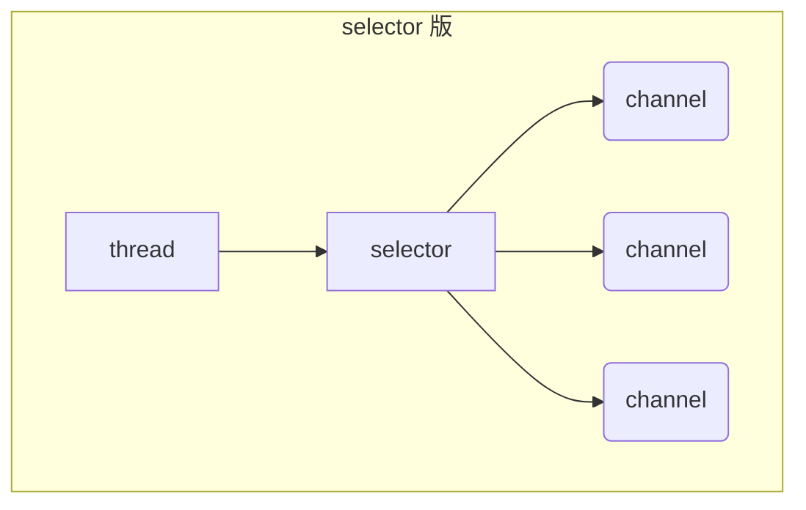

# Netty

视频链接：[黑马程序员Netty全套教程， netty深入浅出Java网络编程重点教程](https://www.bilibili.com/video/BV1py4y1E7oA?vd_source=6e6b2286ee9a603d7bdb2bc5ba80e449)

参考笔记：

- [Nio基础](https://nyimac.gitee.io/2021/04/18/Netty%E5%AD%A6%E4%B9%A0%E4%B9%8BNIO%E5%9F%BA%E7%A1%80/)
- [Netty笔记](https://nyimac.gitee.io/2021/04/25/Netty%E5%9F%BA%E7%A1%80/)

+++

## 一、NIO基础

### 1 三大组件

#### 1.1 Channel & Buffer

channel 有一点类似于 stream，它就是读写数据的**双向通道**，可以从 channel 将数据读入 buffer，也可以将 buffer 的数据写入 channel，而之前的 stream 要么是输入，要么是输出，channel 比 stream 更为底层


常见的 Channel 有

* FileChannel
* DatagramChannel
* SocketChannel
* ServerSocketChannel


buffer 则用来缓冲读写数据，常见的 buffer 有

* ByteBuffer
  * MappedByteBuffer
  * DirectByteBuffer
  * HeapByteBuffer
* ShortBuffer
* IntBuffer
* LongBuffer
* FloatBuffer
* DoubleBuffer
* CharBuffer


#### 1.2 Selector

selector 单从字面意思不好理解，需要结合服务器的设计演化来理解它的用途

1. 多线程版设计

   ```mermaid
   graph TD
   subgraph 多线程版
   t1(thread) --> s1(socket1)
   t2(thread) --> s2(socket2)
   t3(thread) --> s3(socket3)
   end
   ```

   多线程版缺点：

   + 内存占用高
   + 线程上下文切换成本高
   + 只适合连接数少的场景

2. 线程池版设计

   ```mermaid
   graph TD
   subgraph 线程池版
   t4(thread) --> s4(socket1)
   t5(thread) --> s5(socket2)
   t4(thread) -.-> s6(socket3)
   t5(thread) -.-> s7(socket4)
   end
   ```

   线程池版缺点：

   * 阻塞模式下，线程仅能处理一个 socket 连接
   * 仅适合短连接场景

3. selector 版设计

   selector 的作用就是配合一个线程来管理多个 channel，获取这些 channel 上发生的事件，这些 channel 工作在非阻塞模式下，不会让线程吊死在一个 channel 上。适合连接数特别多，但流量低的场景（low traffic）

   ```mermaid
   graph TD
   subgraph selector 版
   thread --> selector
   selector --> c1(channel)
   selector --> c2(channel)
   selector --> c3(channel)
   end
   ```

   

   调用 selector 的 `select()` 会阻塞直到 channel 发生了读写就绪事件，这些事件发生，select 方法就会返回这些事件交给 thread 来处理


### 2 ByteBuffer

有一普通文本文件 data.txt，内容为

```
1234567890abcd
```

使用 FileChannel 来读取文件内容

```java
@Slf4j
public class ChannelDemo1 {
    public static void main(String[] args) {
        // FileChannel  1.输入输出流获取  2.RanllomAccessFile获取
        try (RandomAccessFile file = new RandomAccessFile("helloword/data.txt", "rw")) {
            FileChannel channel = file.getChannel();
            ByteBuffer buffer = ByteBuffer.allocate(10);
            do {
                // 向 buffer 写入
                int len = channel.read(buffer);
                log.debug("读到字节数：{}", len);
                if (len == -1) {
                    break;
                }
                // 切换 buffer 读模式
                buffer.flip();
                while(buffer.hasRemaining()) {
                    log.debug("{}", (char) buffer.get());
                }
                // 切换 buffer 写模式
                buffer.clear();
            } while (true);
        } catch (IOException e) {
            e.printStackTrace();
        }
    }
}
```

输出

```
10:39:03 [DEBUG] [main] c.i.n.ChannelDemo1 - 读到字节数：10
10:39:03 [DEBUG] [main] c.i.n.ChannelDemo1 - 1
10:39:03 [DEBUG] [main] c.i.n.ChannelDemo1 - 2
10:39:03 [DEBUG] [main] c.i.n.ChannelDemo1 - 3
10:39:03 [DEBUG] [main] c.i.n.ChannelDemo1 - 4
10:39:03 [DEBUG] [main] c.i.n.ChannelDemo1 - 5
10:39:03 [DEBUG] [main] c.i.n.ChannelDemo1 - 6
10:39:03 [DEBUG] [main] c.i.n.ChannelDemo1 - 7
10:39:03 [DEBUG] [main] c.i.n.ChannelDemo1 - 8
10:39:03 [DEBUG] [main] c.i.n.ChannelDemo1 - 9
10:39:03 [DEBUG] [main] c.i.n.ChannelDemo1 - 0
10:39:03 [DEBUG] [main] c.i.n.ChannelDemo1 - 读到字节数：4
10:39:03 [DEBUG] [main] c.i.n.ChannelDemo1 - a
10:39:03 [DEBUG] [main] c.i.n.ChannelDemo1 - b
10:39:03 [DEBUG] [main] c.i.n.ChannelDemo1 - c
10:39:03 [DEBUG] [main] c.i.n.ChannelDemo1 - d
10:39:03 [DEBUG] [main] c.i.n.ChannelDemo1 - 读到字节数：-1
```


#### 2.1  ByteBuffer 正确使用姿势

1. 向 buffer 写入数据，例如调用 channel.read(buffer)
2. 调用 flip() 切换至**读模式**
3. 从 buffer 读取数据，例如调用 buffer.get()
4. 调用 clear() 或 compact() 切换至**写模式**
5. 重复 1~4 步骤


#### 2.2 ByteBuffer 结构

ByteBuffer 有以下重要属性

* capacity：容量
* position：读写指针
* limit：读写限制

一开始


写模式下，position 是写入位置，limit 等于容量，下图表示写入了 4 个字节后的状态


flip 动作发生后，position 切换为读取位置，limit 切换为读取限制


读取 4 个字节后，状态


clear 动作发生后，状态


compact 方法，是把未读完的部分向前压缩，然后切换至写模式


##### 💡 调试工具类

```java
public class ByteBufferUtil {
    private static final char[] BYTE2CHAR = new char[256];
    private static final char[] HEXDUMP_TABLE = new char[256 * 4];
    private static final String[] HEXPADDING = new String[16];
    private static final String[] HEXDUMP_ROWPREFIXES = new String[65536 >>> 4];
    private static final String[] BYTE2HEX = new String[256];
    private static final String[] BYTEPADDING = new String[16];

    static {
        final char[] DIGITS = "0123456789abcdef".toCharArray();
        for (int i = 0; i < 256; i++) {
            HEXDUMP_TABLE[i << 1] = DIGITS[i >>> 4 & 0x0F];
            HEXDUMP_TABLE[(i << 1) + 1] = DIGITS[i & 0x0F];
        }

        int i;

        // Generate the lookup table for hex dump paddings
        for (i = 0; i < HEXPADDING.length; i++) {
            int padding = HEXPADDING.length - i;
            StringBuilder buf = new StringBuilder(padding * 3);
            for (int j = 0; j < padding; j++) {
                buf.append("   ");
            }
            HEXPADDING[i] = buf.toString();
        }

        // Generate the lookup table for the start-offset header in each row (up to 64KiB).
        for (i = 0; i < HEXDUMP_ROWPREFIXES.length; i++) {
            StringBuilder buf = new StringBuilder(12);
            buf.append(NEWLINE);
            buf.append(Long.toHexString(i << 4 & 0xFFFFFFFFL | 0x100000000L));
            buf.setCharAt(buf.length() - 9, '|');
            buf.append('|');
            HEXDUMP_ROWPREFIXES[i] = buf.toString();
        }

        // Generate the lookup table for byte-to-hex-dump conversion
        for (i = 0; i < BYTE2HEX.length; i++) {
            BYTE2HEX[i] = ' ' + StringUtil.byteToHexStringPadded(i);
        }

        // Generate the lookup table for byte dump paddings
        for (i = 0; i < BYTEPADDING.length; i++) {
            int padding = BYTEPADDING.length - i;
            StringBuilder buf = new StringBuilder(padding);
            for (int j = 0; j < padding; j++) {
                buf.append(' ');
            }
            BYTEPADDING[i] = buf.toString();
        }

        // Generate the lookup table for byte-to-char conversion
        for (i = 0; i < BYTE2CHAR.length; i++) {
            if (i <= 0x1f || i >= 0x7f) {
                BYTE2CHAR[i] = '.';
            } else {
                BYTE2CHAR[i] = (char) i;
            }
        }
    }

    /**
     * 打印所有内容
     * @param buffer
     */
    public static void debugAll(ByteBuffer buffer) {
        int oldlimit = buffer.limit();
        buffer.limit(buffer.capacity());
        StringBuilder origin = new StringBuilder(256);
        appendPrettyHexDump(origin, buffer, 0, buffer.capacity());
        System.out.println("+--------+-------------------- all ------------------------+----------------+");
        System.out.printf("position: [%d], limit: [%d]\n", buffer.position(), oldlimit);
        System.out.println(origin);
        buffer.limit(oldlimit);
    }

    /**
     * 打印可读取内容
     * @param buffer
     */
    public static void debugRead(ByteBuffer buffer) {
        StringBuilder builder = new StringBuilder(256);
        appendPrettyHexDump(builder, buffer, buffer.position(), buffer.limit() - buffer.position());
        System.out.println("+--------+-------------------- read -----------------------+----------------+");
        System.out.printf("position: [%d], limit: [%d]\n", buffer.position(), buffer.limit());
        System.out.println(builder);
    }

    private static void appendPrettyHexDump(StringBuilder dump, ByteBuffer buf, int offset, int length) {
        if (isOutOfBounds(offset, length, buf.capacity())) {
            throw new IndexOutOfBoundsException(
                    "expected: " + "0 <= offset(" + offset + ") <= offset + length(" + length
                            + ") <= " + "buf.capacity(" + buf.capacity() + ')');
        }
        if (length == 0) {
            return;
        }
        dump.append(
                "         +-------------------------------------------------+" +
                        NEWLINE + "         |  0  1  2  3  4  5  6  7  8  9  a  b  c  d  e  f |" +
                        NEWLINE + "+--------+-------------------------------------------------+----------------+");

        final int startIndex = offset;
        final int fullRows = length >>> 4;
        final int remainder = length & 0xF;

        // Dump the rows which have 16 bytes.
        for (int row = 0; row < fullRows; row++) {
            int rowStartIndex = (row << 4) + startIndex;

            // Per-row prefix.
            appendHexDumpRowPrefix(dump, row, rowStartIndex);

            // Hex dump
            int rowEndIndex = rowStartIndex + 16;
            for (int j = rowStartIndex; j < rowEndIndex; j++) {
                dump.append(BYTE2HEX[getUnsignedByte(buf, j)]);
            }
            dump.append(" |");

            // ASCII dump
            for (int j = rowStartIndex; j < rowEndIndex; j++) {
                dump.append(BYTE2CHAR[getUnsignedByte(buf, j)]);
            }
            dump.append('|');
        }

        // Dump the last row which has less than 16 bytes.
        if (remainder != 0) {
            int rowStartIndex = (fullRows << 4) + startIndex;
            appendHexDumpRowPrefix(dump, fullRows, rowStartIndex);

            // Hex dump
            int rowEndIndex = rowStartIndex + remainder;
            for (int j = rowStartIndex; j < rowEndIndex; j++) {
                dump.append(BYTE2HEX[getUnsignedByte(buf, j)]);
            }
            dump.append(HEXPADDING[remainder]);
            dump.append(" |");

            // Ascii dump
            for (int j = rowStartIndex; j < rowEndIndex; j++) {
                dump.append(BYTE2CHAR[getUnsignedByte(buf, j)]);
            }
            dump.append(BYTEPADDING[remainder]);
            dump.append('|');
        }

        dump.append(NEWLINE +
                "+--------+-------------------------------------------------+----------------+");
    }

    private static void appendHexDumpRowPrefix(StringBuilder dump, int row, int rowStartIndex) {
        if (row < HEXDUMP_ROWPREFIXES.length) {
            dump.append(HEXDUMP_ROWPREFIXES[row]);
        } else {
            dump.append(NEWLINE);
            dump.append(Long.toHexString(rowStartIndex & 0xFFFFFFFFL | 0x100000000L));
            dump.setCharAt(dump.length() - 9, '|');
            dump.append('|');
        }
    }

    public static short getUnsignedByte(ByteBuffer buffer, int index) {
        return (short) (buffer.get(index) & 0xFF);
    }
}
```


#### 2.3 ByteBuffer 常见方法

##### 分配空间

可以使用 allocate 方法为 ByteBuffer 分配空间，其它 buffer 类也有该方法

```java
Bytebuffer buf = ByteBuffer.allocate(16);
```

```java
public static void main(String[] args) {
    System.out.println(ByteBuffer.allocate(16).getClass());
    System.out.println(ByteBuffer.allocateDirect(16).getClass());
    /*
    * class java.nio.HeapByteBuffer     - java 堆内存，读写效率较低，受到 GC 的影响
    * class java.nio.DirectByteBuffer   - 直接内存，读写效率高（少一次拷贝），不会受到 GC 的影响，分配效率低
    * */
}
```


##### 向 buffer 写入数据

有两种办法

* 调用 channel 的 read 方法
* 调用 buffer 自己的 put 方法

```java
int readBytes = channel.read(buf);
```

和

```java
buf.put((byte)127);
```


##### 从 buffer 读取数据

同样有两种办法

* 调用 channel 的 write 方法
* 调用 buffer 自己的 get 方法

```java
int writeBytes = channel.write(buf);
```

和

```java
byte b = buf.get();
```

get 方法会让 position 读指针向后走，如果想重复读取数据

* 可以调用 rewind 方法将 position 重新置为 0
* 或者调用 get(int i) 方法获取索引 i 的内容，它不会移动读指针


##### mark 和 reset

mark 是在读取时，做一个标记，即使 position 改变，只要调用 reset 就能回到 mark 的位置

> **注意**
>
> rewind 和 flip 都会清除 mark 位置


##### 字符串与 ByteBuffer 互转

```java
public static void main(String[] args) {
    // 1. 字符串 转为 ByteBuffer
    ByteBuffer buffer1 = ByteBuffer.allocate(16);
    buffer1.put("Hello Netty".getBytes());
    debugAll(buffer1);

    // 2. Charset
    ByteBuffer buffer2 = StandardCharsets.UTF_8.encode("Hello NIO");
    debugAll(buffer2);

    // 3. wrap
    ByteBuffer buffer3 = ByteBuffer.wrap("Hello".getBytes());
    debugAll(buffer3);

    // 4. 转为字符串
    String str2 = StandardCharsets.UTF_8.decode(buffer2).toString();
    System.out.println(str2);

    // 需要将 buffer1 切换至读模式
    buffer1.flip();
    String str1 = StandardCharsets.UTF_8.decode(buffer1).toString();
    System.out.println(str1);
}
```

输出

```
+--------+-------------------- all ------------------------+----------------+
position: [11], limit: [16]
         +-------------------------------------------------+
         |  0  1  2  3  4  5  6  7  8  9  a  b  c  d  e  f |
+--------+-------------------------------------------------+----------------+
|00000000| 48 65 6c 6c 6f 20 4e 65 74 74 79 00 00 00 00 00 |Hello Netty.....|
+--------+-------------------------------------------------+----------------+
+--------+-------------------- all ------------------------+----------------+
position: [0], limit: [9]
         +-------------------------------------------------+
         |  0  1  2  3  4  5  6  7  8  9  a  b  c  d  e  f |
+--------+-------------------------------------------------+----------------+
|00000000| 48 65 6c 6c 6f 20 4e 49 4f                      |Hello NIO       |
+--------+-------------------------------------------------+----------------+
+--------+-------------------- all ------------------------+----------------+
position: [0], limit: [5]
         +-------------------------------------------------+
         |  0  1  2  3  4  5  6  7  8  9  a  b  c  d  e  f |
+--------+-------------------------------------------------+----------------+
|00000000| 48 65 6c 6c 6f                                  |Hello           |
+--------+-------------------------------------------------+----------------+
Hello NIO
Hello Netty
```


##### ⚠️ Buffer 的线程安全

> Buffer 是**非线程安全的**


#### 2.4 Scattering Reads

分散读取，有一个文本文件 words.txt

```
onetwothree
```

使用如下方式读取，可以将数据填充至多个 buffer

```java
try (FileChannel channel = new RandomAccessFile("words.txt", "r").getChannel()) {
    ByteBuffer b1 = ByteBuffer.allocate(3);
    ByteBuffer b2 = ByteBuffer.allocate(3);
    ByteBuffer b3 = ByteBuffer.allocate(5);
    channel.read(new ByteBuffer[]{ b1, b2, b3 });

    b1.flip();
    b2.flip();
    b3.flip();

    debugAll(b1);
    debugAll(b2);
    debugAll(b3);
} catch (IOException e) {
    e.printStackTrace();
}
```

结果

```
+--------+-------------------- all ------------------------+----------------+
position: [0], limit: [3]
         +-------------------------------------------------+
         |  0  1  2  3  4  5  6  7  8  9  a  b  c  d  e  f |
+--------+-------------------------------------------------+----------------+
|00000000| 6f 6e 65                                        |one             |
+--------+-------------------------------------------------+----------------+
+--------+-------------------- all ------------------------+----------------+
position: [0], limit: [3]
         +-------------------------------------------------+
         |  0  1  2  3  4  5  6  7  8  9  a  b  c  d  e  f |
+--------+-------------------------------------------------+----------------+
|00000000| 74 77 6f                                        |two             |
+--------+-------------------------------------------------+----------------+
+--------+-------------------- all ------------------------+----------------+
position: [0], limit: [5]
         +-------------------------------------------------+
         |  0  1  2  3  4  5  6  7  8  9  a  b  c  d  e  f |
+--------+-------------------------------------------------+----------------+
|00000000| 74 68 72 65 65                                  |three           |
+--------+-------------------------------------------------+----------------+
```


#### 2.5 Gathering Writes

使用如下方式写入，可以将多个 buffer 的数据填充至 channel

```java
try (FileChannel channel = new RandomAccessFile("words2.txt", "rw").getChannel()) {
    ByteBuffer b1 = StandardCharsets.UTF_8.encode("hello");
    ByteBuffer b2 = StandardCharsets.UTF_8.encode("world");
    ByteBuffer b3 = StandardCharsets.UTF_8.encode("你好");

    channel.write(new ByteBuffer[]{ b1, b2, b3 });
} catch (IOException e) {
    e.printStackTrace();
}
```

文件内容

```
helloworld你好
```


#### 2.6 练习

网络上有多条数据发送给服务端，数据之间使用`\n`进行分隔
但由于某种原因这些数据在接收时，被进行了重新组合，例如原始数据有3条为

* Hello,world\n
* I'm zhangsan\n
* How are you?\n

变成了下面的两个 byteBuffer (黏包，半包)

* Hello,world\nI'm zhangsan\nHo
* w are you?\n

现在要求你编写程序，将错乱的数据恢复成原始的按`\n`分隔的数据

```java
public class TestByteBufferExam {
    public static void main(String[] args) {
        ByteBuffer source = ByteBuffer.allocate(32);
        source.put("Hello,world\nI'm zhangsan\nHo".getBytes());
        split(source);

        source.put("w are you?\n".getBytes());
        split(source);
    }

    private static void split(ByteBuffer source) {
        source.flip(); // 切换至读模式
        for (int i = 0; i < source.limit(); i++) {
            // 找到一条完整消息
            if (source.get(i) == '\n') {
                // 消息长度
                int length = i + 1 - source.position();
                // 把这条完整消息存入新的 ByteBuffer
                ByteBuffer target = ByteBuffer.allocate(length);
                // 从 source 读取，写入 target 中
                for (int j = 0; j < length; j++) {
                    target.put(source.get());
                }
                debugAll(target);
            }
        }
        source.compact();
    }
}
```

输出：

```
+--------+-------------------- all ------------------------+----------------+
position: [12], limit: [12]
         +-------------------------------------------------+
         |  0  1  2  3  4  5  6  7  8  9  a  b  c  d  e  f |
+--------+-------------------------------------------------+----------------+
|00000000| 48 65 6c 6c 6f 2c 77 6f 72 6c 64 0a             |Hello,world.    |
+--------+-------------------------------------------------+----------------+
+--------+-------------------- all ------------------------+----------------+
position: [13], limit: [13]
         +-------------------------------------------------+
         |  0  1  2  3  4  5  6  7  8  9  a  b  c  d  e  f |
+--------+-------------------------------------------------+----------------+
|00000000| 49 27 6d 20 7a 68 61 6e 67 73 61 6e 0a          |I'm zhangsan.   |
+--------+-------------------------------------------------+----------------+
+--------+-------------------- all ------------------------+----------------+
position: [13], limit: [13]
         +-------------------------------------------------+
         |  0  1  2  3  4  5  6  7  8  9  a  b  c  d  e  f |
+--------+-------------------------------------------------+----------------+
|00000000| 48 6f 77 20 61 72 65 20 79 6f 75 3f 0a          |How are you?.   |
+--------+-------------------------------------------------+----------------+
```


### 3 文件编程

#### 3.1 FileChannel

##### ⚠️ FileChannel 工作模式

> FileChannel 只能工作在阻塞模式下


##### 获取

不能直接打开 FileChannel，必须通过 FileInputStream、FileOutputStream 或者 RandomAccessFile 来获取 FileChannel，它们都有 getChannel 方法

* 通过 FileInputStream 获取的 channel 只能读
* 通过 FileOutputStream 获取的 channel 只能写
* 通过 RandomAccessFile 是否能读写根据构造 RandomAccessFile 时的读写模式决定


##### 读取

会从 channel 读取数据填充 ByteBuffer，返回值表示读到了多少字节，-1 表示到达了文件的末尾

```java
int readBytes = channel.read(buffer);
```


##### 写入

写入的正确姿势如下，SocketChannel

```java
ByteBuffer buffer = ...;
buffer.put(...); // 存入数据
buffer.flip();   // 切换读模式

while(buffer.hasRemaining()) {
    channel.write(buffer);
}
```

在 while 中调用 channel.write 是因为 write 方法并不能保证一次将 buffer 中的内容全部写入 channel


##### 关闭

channel 必须关闭，不过调用了 FileInputStream、FileOutputStream 或者 RandomAccessFile 的 close 方法会间接地调用 channel 的 close 方法


##### 位置

获取当前位置

```java
long pos = channel.position();
```

设置当前位置

```java
long newPos = ...;
channel.position(newPos);
```

设置当前位置时，如果设置为文件的末尾

* 这时读取会返回 -1 
* 这时写入，会追加内容，但要注意如果 position 超过了文件末尾，再写入时在新内容和原末尾之间会有空洞（00）


##### 大小

使用 size() 方法获取文件的大小


##### 强制写入

操作系统出于性能的考虑，会将数据缓存，不是立刻写入磁盘。可以调用 `force(true)` 方法将文件内容和元数据（文件的权限等信息）立刻写入磁盘


#### 3.2 两个Channel传输数据

```java
private static void method1() {
    try(
            FileChannel from = new FileInputStream("data.txt").getChannel();
            FileChannel to = new FileOutputStream("to.txt").getChannel();) {
        // 效率高，底层会利用操作系统的零拷贝进行优化
        from.transferTo(0, from.size(), to);
    } catch (IOException e) {
        e.printStackTrace();
    }
}
```

超过 2g 大小的文件传输

```java
private static void method2() {
    try(
            FileChannel from = new FileInputStream("data.txt").getChannel();
            FileChannel to = new FileOutputStream("to.txt").getChannel();) {
        // 效率高，底层会利用操作系统的零拷贝进行优化，最多传2G数据
        long size = from.size();
        // left 变量表示还剩多少字节
        for (long left = size; left > 0; ) {
            System.out.println("position:" + (size - left) + " left:" + left);
            left -= from.transferTo(size - left, left, to);
        }
    } catch (IOException e) {
        e.printStackTrace();
    }
}
```

实际传输一个超大文件

```
position:0 left:7769948160
position:2147483647 left:5622464513
position:4294967294 left:3474980866
position:6442450941 left:1327497219
```


#### 3.3 Path

jdk7 引入了 Path 和 Paths 类

* Path 用来表示文件路径
* Paths 是工具类，用来获取 Path 实例

```java
Path source = Paths.get("1.txt"); // 相对路径 使用 user.dir 环境变量来定位 1.txt

Path source = Paths.get("d:\\1.txt"); // 绝对路径 代表了  d:\1.txt

Path source = Paths.get("d:/1.txt"); // 绝对路径 同样代表了  d:\1.txt

Path projects = Paths.get("d:\\data", "projects"); // 代表了  d:\data\projects
```

* `.` 代表了当前路径
* `..` 代表了上一级路径

例如目录结构如下

```
d:
	|- data
		|- projects
			|- a
			|- b
```

代码

```java
Path path = Paths.get("d:\\data\\projects\\a\\..\\b");
System.out.println(path);
System.out.println(path.normalize()); // 正常化路径
```

会输出

```
d:\data\projects\a\..\b
d:\data\projects\b
```


#### 3.4 Files

1. 检查文件是否存在

   ```java
   Path path = Paths.get("helloword/data.txt");
   
   System.out.println(Files.exists(path));
   ```

2. 创建一级目录

   ```java
   Path path = Paths.get("helloword/d1");
   
   Files.createDirectory(path);
   ```

   * 如果目录已存在，会抛异常 FileAlreadyExistsException
   * 不能一次创建多级目录，否则会抛异常 NoSuchFileException

3. 创建多级目录用

   ```java
   Path path = Paths.get("helloword/d1/d2");
   
   Files.createDirectories(path);
   ```

4. 拷贝文件

   ```java
   Path source = Paths.get("helloword/data.txt");
   Path target = Paths.get("helloword/target.txt");
   
   Files.copy(source, target);
   ```

   * 如果文件已存在，会抛异常 FileAlreadyExistsException

   如果希望用 source 覆盖掉 target，需要用 StandardCopyOption 来控制

   ```java
   Files.copy(source, target, StandardCopyOption.REPLACE_EXISTING);
   ```

5. 移动文件

   ```java
   Path source = Paths.get("helloword/data.txt");
   Path target = Paths.get("helloword/data.txt");
   
   Files.move(source, target, StandardCopyOption.ATOMIC_MOVE);
   ```

   * StandardCopyOption.ATOMIC_MOVE 保证文件移动的原子性

6. 删除文件

   ```java
   Path target = Paths.get("helloword/target.txt");
   
   Files.delete(target);
   ```

   * 如果文件不存在，会抛异常 NoSuchFileException

7. 删除目录

   ```java
   Path target = Paths.get("helloword/d1");
   
   Files.delete(target);
   ```

   * 如果目录还有内容，会抛异常 DirectoryNotEmptyException

8. 遍历目录文件

   ```java
   /**
    * 遍历所在目录下所有的文件和目录 并统计目录和文件的数量
    * 
    * @throws IOException
    */
   private static void m1() throws IOException {
       AtomicInteger dirCount = new AtomicInteger();
       AtomicInteger fileCount = new AtomicInteger();
       final String pathName = "X:\\a_sourceCode\\apache-zookeeper-3.5.7\\apache-zookeeper-3.5.7";
       Files.walkFileTree(Paths.get(pathName), new SimpleFileVisitor<Path>() {
           @Override
           public FileVisitResult preVisitDirectory(Path dir, BasicFileAttributes attrs) throws IOException {
               System.out.println(dir);
               dirCount.incrementAndGet();
               return super.preVisitDirectory(dir, attrs);
           }
   
           @Override
           public FileVisitResult visitFile(Path file, BasicFileAttributes attrs) throws IOException {
               System.out.println("=====" + file);
               fileCount.incrementAndGet();
               return super.visitFile(file, attrs);
           }
       });
   
       System.out.println("dir count：" + dirCount);
       System.out.println("file count：" + fileCount);
   }
   ```

9. 统计 jar 的数目

   ```java
   /**
    * 计算所在目录下面的jar包的数量
    *
    * @throws IOException
    */
   private static void m2() throws IOException {
       AtomicInteger jarCount = new AtomicInteger();
       final String pathName = "X:\\newJava\\Maven\\maven_repository";
       Files.walkFileTree(Paths.get(pathName), new SimpleFileVisitor<Path>() {
           @Override
           public FileVisitResult visitFile(Path file, BasicFileAttributes attrs) throws IOException {
               if (file.toString().endsWith(".jar")) {
                   System.out.println(file);
                   jarCount.incrementAndGet();
               }
               return super.visitFile(file, attrs);
           }
       });
       System.out.println("jar count：" + jarCount);
   }
   ```

10. 删除多级目录

    ```java
    /**
     * 删除多级目录
     *
     * @throws IOException
     */
    private static void m3() throws IOException {
        final String pathName = "C:\\Users\\Amadeus\\Desktop\\apache-zookeeper-3.5.7";
        Files.walkFileTree(Paths.get(pathName), new SimpleFileVisitor<Path>() {
            @Override
            public FileVisitResult visitFile(Path file, BasicFileAttributes attrs) throws IOException {
                Files.delete(file);
                return super.visitFile(file, attrs);
            }
    
            @Override
            public FileVisitResult postVisitDirectory(Path dir, IOException exc) throws IOException {
                Files.delete(dir);
                return super.postVisitDirectory(dir, exc);
            }
        });
    }
    ```

    > 删除是危险操作，确保要递归删除的文件夹没有重要内容

11. 拷贝多级目录

    ```java
    /**
     * 拷贝多级目录
     * @throws IOException
     */
    private static void m4() throws IOException {
        final String source = "X:\\a_sourceCode\\apache-zookeeper-3.5.7\\apache-zookeeper-3.5.7";
        final String target = "C:\\Users\\Amadeus\\Desktop\\zookeeper";
        Files.walk(Paths.get(source)).forEach(path -> {
            try {
                String targetName = path.toString().replace(source, target);
                if (Files.isDirectory(path)) {
                    // 是目录 创建目录
                    Files.createDirectory(Paths.get(targetName));
                } else if (Files.isRegularFile(path)) {
                    // 是普通文件 拷贝
                    Files.copy(path, Paths.get(targetName));
                }
            } catch (IOException e) {
                throw new RuntimeException(e);
            }
        });
    }
    ```


### 4 网络编程

#### 4.1 非阻塞VS阻塞

##### 4.1.1 堵塞

* 阻塞模式下，相关方法都会导致线程暂停
  * ServerSocketChannel.accept 会在**没有连接建立时**让线程暂停
  * SocketChannel.read 会在**通道中没有数据可读时**让线程暂停
  * 阻塞的表现其实就是线程暂停了，暂停期间不会占用 cpu，但线程相当于闲置
* 单线程下，阻塞方法之间相互影响，几乎不能正常工作，需要多线程支持
* 但多线程下，有新的问题，体现在以下方面
  * 32 位 jvm 一个线程 320k，64 位 jvm 一个线程 1024k，如果连接数过多，必然导致 OOM，并且线程太多，反而会因为频繁上下文切换导致性能降低
  * 可以采用线程池技术来减少线程数和线程上下文切换，但治标不治本，如果有很多连接建立，但长时间 inactive，会阻塞线程池中所有线程，因此不适合长连接，只适合短连接

**服务器端**：

```java
public class Server {
    public static void main(String[] args) throws IOException {
        // 0. 创建缓冲区
        ByteBuffer buffer = ByteBuffer.allocate(16);
        // 1. 创建服务器
        ServerSocketChannel ssc = ServerSocketChannel.open();
        // 2. 绑定监听接口
        ssc.bind(new InetSocketAddress(8080));
        // 3. 连接集合
        List<SocketChannel> channels = new ArrayList<>();
        while (true) {
            // 4. accept 建立与客户端连接，SocketChannel 用来与客户端之间通信
            System.out.println("before connecting...");
            SocketChannel sc = ssc.accept(); // 堵塞方法，线程停止运行
            System.out.println("after connecting...");
            channels.add(sc);
            for (SocketChannel channel : channels) {
                // 5. 接收客户端发送的数据
                System.out.println("before reading");
                channel.read(buffer); // 堵塞方法，线程停止运行
                buffer.flip();
                debugRead(buffer);
                buffer.clear();
                System.out.println("after reading");
            }
        }
    }
}
```

**客户端**：

```java
@Slf4j
public class Client {
    public static void main(String[] args) throws IOException {
        SocketChannel sc = SocketChannel.open();
        sc.connect(new InetSocketAddress("localhost", 8080));
        System.out.println("waiting...");
    }
}
```

运行结果

- 客户端-服务器建立连接前：服务器端因accept阻塞

  [](https://nyimapicture.oss-cn-beijing.aliyuncs.com/img/20210413213318.png)

- 客户端-服务器建立连接后，客户端发送消息前：服务器端因通道为空被阻塞

  [](https://nyimapicture.oss-cn-beijing.aliyuncs.com/img/20210413213446.png)

- 客户端发送数据后，服务器处理通道中的数据。再次进入循环时，再次被accept阻塞

  [](https://nyimapicture.oss-cn-beijing.aliyuncs.com/img/20210413214109.png)

- 之前的客户端再次发送消息，**服务器端因为被accept阻塞**，无法处理之前客户端发送到通道中的信息

  [](https://nyimapicture.oss-cn-beijing.aliyuncs.com/img/20210413214505.png)


##### 4.1.2 非阻塞

* 非阻塞模式下，相关方法都会不会让线程暂停
  * 在 ServerSocketChannel.accept 在没有连接建立时，会返回 null，继续运行
  * SocketChannel.read 在没有数据可读时，会返回 0，但线程不必阻塞，可以去执行其它 SocketChannel 的 read 或是去执行 ServerSocketChannel.accept 
  * 写数据时，线程只是等待数据写入 Channel 即可，无需等 Channel 通过网络把数据发送出去
* 但非阻塞模式下，即使没有连接建立，和可读数据，线程仍然在不断运行，白白浪费了 cpu
* 数据复制过程中，线程实际还是阻塞的（AIO 改进的地方）

**服务器端，客户端代码不变**：

```java
@Slf4j
public class Server {
    public static void main(String[] args) throws IOException {
        // 使用 NIO 来理解非阻塞模式, 单线程
        // 0. ByteBuffer
        ByteBuffer buffer = ByteBuffer.allocate(16);
        // 1. 创建服务器
        ServerSocketChannel ssc = ServerSocketChannel.open();
        ssc.configureBlocking(false); // 非阻塞模式
        // 2. 绑定监听接口
        ssc.bind(new InetSocketAddress(8080));
        // 3. 连接集合
        List<SocketChannel> channels = new ArrayList<>();
        while (true) {
            // 4. accept 建立与客户端连接，SocketChannel 用来与客户端之间通信
            SocketChannel sc = ssc.accept(); // 非堵塞方法，线程还会继续运行，如果没有连接建立，返回的sc为null
            if (sc != null) {
                log.debug("connected... {}", sc);
                sc.configureBlocking(false); // 非堵塞模式
                channels.add(sc);
            }
            for (SocketChannel channel : channels) {
                // 5. 接收客户端发送的数据
                int read = channel.read(buffer);// 非堵塞方法，线程还会继续运行，如果没有读到数据，read 返回 0
                if (read > 0) {
                    buffer.flip();
                    debugRead(buffer);
                    buffer.clear();
                    log.debug("after read... {}", channel);
                }
            }
        }
    }
}
```


##### 4.1.3 多路复用

单线程可以配合 Selector 完成对多个 Channel 可读写事件的监控，这称之为多路复用

* 多路复用*仅针对网络IO*，*普通文件IO*没法利用多路复用
* 如果不用 Selector 的非阻塞模式，线程大部分时间都在做无用功，而 Selector 能够保证
  * 有可连接事件时才去连接
  * 有可读事件才去读取
  * 有可写事件才去写入
    * 限于网络传输能力，Channel 未必时时可写，一旦 Channel 可写，会触发 Selector 的可写事件


#### 4.2 Selector




好处

* 一个线程配合 selector 就可以监控多个 channel 的事件，事件发生线程才去处理。避免非阻塞模式下所做无用功
* 让这个线程能够被充分利用
* 节约了线程的数量
* 减少了线程上下文切换


##### 4.2.1 创建Selector

```java
Selector selector = Selector.open();
```


##### 4.2.2 绑定 Channel 事件

也称之为注册事件，绑定的事件 selector 才会关心

```java
channel.configureBlocking(false);
SelectionKey key = channel.register(selector, 绑定事件);
```

* channel 必须工作在非阻塞模式
* FileChannel 没有非阻塞模式，因此不能配合 selector 一起使用
* 绑定的事件类型可以有
  * connect - 客户端连接成功时触发
  * accept - 服务器端成功接受连接时触发
  * read - 数据可读入时触发，有因为接收能力弱，数据暂不能读入的情况
  * write - 数据可写出时触发，有因为发送能力弱，数据暂不能写出的情况


##### 4.2.3 监听Channel事件

可以通过下面三种方法来监听是否有事件发生，方法的返回值代表有多少 channel 发生了事件

方法1，阻塞直到绑定事件发生

```java
int count = selector.select();
```

方法2，阻塞直到绑定事件发生，或是超时（时间单位为 ms）

```java
int count = selector.select(long timeout);
```

方法3，不会阻塞，也就是不管有没有事件，立刻返回，自己根据返回值检查是否有事件

```java
int count = selector.selectNow();
```


##### 💡 select 何时不阻塞

> * 事件发生时
>   * 客户端发起连接请求，会触发 accept 事件
>   * 客户端发送数据过来，客户端正常、异常关闭时，都会触发 read 事件，另外如果发送的数据大于 buffer 缓冲区，会触发多次读取事件
>   * channel 可写，会触发 write 事件
>   * 在 linux 下 nio bug 发生时
> * 调用 selector.wakeup()
> * 调用 selector.close()
> * selector 所在线程 interrupt


#### 4.3 处理 accept 事件

要使用 Selector 实现多路复用，服务端代码如下改进

```java
public class SelectServer {
    public static void main(String[] args) {
        ByteBuffer buffer = ByteBuffer.allocate(16);
        // 获得服务器通道
        try(ServerSocketChannel server = ServerSocketChannel.open()) {
            server.bind(new InetSocketAddress(8080));
            // 创建选择器
            Selector selector = Selector.open();
            
            // 通道必须设置为非阻塞模式
            server.configureBlocking(false);
            // 将通道注册到选择器中，并设置感兴趣的事件
            server.register(selector, SelectionKey.OP_ACCEPT);
            while (true) {
                // 若没有事件就绪，线程会被阻塞，反之不会被阻塞。从而避免了CPU空转
                // 返回值为就绪的事件个数
                int ready = selector.select();
                System.out.println("selector ready counts : " + ready);
                
                // 获取所有事件
                Set<SelectionKey> selectionKeys = selector.selectedKeys();
                
                // 使用迭代器遍历事件
                Iterator<SelectionKey> iterator = selectionKeys.iterator();
                while (iterator.hasNext()) {
                    SelectionKey key = iterator.next();
                    
                    // 判断key的类型
                    if(key.isAcceptable()) {
                        // 获得key对应的channel
                        ServerSocketChannel channel = (ServerSocketChannel) key.channel();
                        System.out.println("before accepting...");
                        
        				// 获取连接并处理，而且是必须处理，否则需要取消
                        SocketChannel socketChannel = channel.accept();
                        System.out.println("after accepting...");
                    }
                    // 处理完毕后移除
                    iterator.remove();
                }
            }
        } catch (IOException e) {
            e.printStackTrace();
        }
    }
}Copy
```

**步骤解析**

- 获得选择器Selector

  ```java
  Selector selector = Selector.open();
  ```

- 将**通道设置为非阻塞模式**，并注册到选择器中，并设置感兴趣的事件

  - channel 必须工作在非阻塞模式

  - FileChannel 没有非阻塞模式，因此不能配合 selector 一起使用

  - 绑定的**事件类型**可以有

    - connect - 客户端连接成功时触发
    - accept - 服务器端成功接受连接时触发
    - read - 数据可读入时触发，有因为接收能力弱，数据暂不能读入的情况
    - write - 数据可写出时触发，有因为发送能力弱，数据暂不能写出的情况

    ```java
    // 通道必须设置为非阻塞模式
    server.configureBlocking(false);
    // 将通道注册到选择器中，并设置感兴趣的实践
    server.register(selector, SelectionKey.OP_ACCEPT);
    ```

- 通过Selector监听事件，并获得就绪的通道个数，若没有通道就绪，线程会被阻塞

  - 阻塞直到绑定事件发生

    ```java
    int count = selector.select();
    ```

  - 阻塞直到绑定事件发生，**或是超时**（时间单位为 ms）

    ```java
    int count = selector.select(long timeout);
    ```

  - **不会阻塞**，也就是不管有没有事件，立刻返回，自己根据返回值检查是否有事件

    ```java
    int count = selector.selectNow();
    ```

- 获取就绪事件并**得到对应的通道**，然后进行处理

  ```java
  // 获取所有事件
  Set<SelectionKey> selectionKeys = selector.selectedKeys();
                  
  // 使用迭代器遍历事件
  Iterator<SelectionKey> iterator = selectionKeys.iterator();
  
  while (iterator.hasNext()) {
  	SelectionKey key = iterator.next();
                      
  	// 判断key的类型，此处为Accept类型
  	if(key.isAcceptable()) {
          // 获得key对应的channel
          ServerSocketChannel channel = (ServerSocketChannel) key.channel();
  
          // 获取连接并处理，而且是必须处理，否则需要取消
          SocketChannel socketChannel = channel.accept();
  
          // 处理完毕后移除
          iterator.remove();
  	}
  }
  ```

**事件发生后能否不处理**

事件发生后，**要么处理，要么取消（cancel）**，不能什么都不做，**否则下次该事件仍会触发**，这是因为 nio 底层使用的是水平触发


#### 4.4 处理 read 事件

- 在Accept事件中，若有客户端与服务器端建立了连接，**需要将其对应的SocketChannel设置为非阻塞，并注册到选择其中**；
- 添加Read事件，触发后进行读取操作

```java
public class SelectServer {
    public static void main(String[] args) {
        ByteBuffer buffer = ByteBuffer.allocate(16);
        // 获得服务器通道
        try(ServerSocketChannel server = ServerSocketChannel.open()) {
            server.bind(new InetSocketAddress(8080));
            // 创建选择器
            Selector selector = Selector.open();
            // 通道必须设置为非阻塞模式
            server.configureBlocking(false);
            // 将通道注册到选择器中，并设置感兴趣的实践
            server.register(selector, SelectionKey.OP_ACCEPT);
            // 为serverKey设置感兴趣的事件
            while (true) {
                // 若没有事件就绪，线程会被阻塞，反之不会被阻塞。从而避免了CPU空转
                // 返回值为就绪的事件个数
                int ready = selector.select();
                System.out.println("selector ready counts : " + ready);
                // 获取所有事件
                Set<SelectionKey> selectionKeys = selector.selectedKeys();
                // 使用迭代器遍历事件
                Iterator<SelectionKey> iterator = selectionKeys.iterator();
                while (iterator.hasNext()) {
                    SelectionKey key = iterator.next();
                    // 判断key的类型
                    if(key.isAcceptable()) {
                        // 获得key对应的channel
                        ServerSocketChannel channel = (ServerSocketChannel) key.channel();
                        System.out.println("before accepting...");
                        // 获取连接
                        SocketChannel socketChannel = channel.accept();
                        System.out.println("after accepting...");
                        // 设置为非阻塞模式，同时将连接的通道也注册到选择其中
                        socketChannel.configureBlocking(false);
                        socketChannel.register(selector, SelectionKey.OP_READ);
                    } else if (key.isReadable()) {
                        SocketChannel channel = (SocketChannel) key.channel();
                        System.out.println("before reading...");
                        channel.read(buffer);
                        System.out.println("after reading...");
                        buffer.flip();
                        ByteBufferUtil.debugRead(buffer);
                        buffer.clear();
                    }
                    // 处理完毕后移除
                    iterator.remove();
                }
            }
        } catch (IOException e) {
            e.printStackTrace();
        }
    }
}
```


##### 💡 为何要iterator.remove()

**当处理完一个事件后，一定要调用迭代器的remove方法移除对应事件，否则会出现错误**。原因如下

以我们上面的 **Read事件** 的代码为例

- 当调用了 server.register(selector, SelectionKey.OP_ACCEPT)后，Selector中维护了一个集合，**用于存放SelectionKey以及其对应的通道**

  ```java
  // WindowsSelectorImpl 中的 SelectionKeyImpl数组
  private SelectionKeyImpl[] channelArray = new SelectionKeyImpl[8];
  ```

  ```java
  public class SelectionKeyImpl extends AbstractSelectionKey {
      // Key对应的通道
      final SelChImpl channel;
      ...
  }
  ```

  

- 当**选择器中的通道对应的事件发生后**，selecionKey会被放到另一个集合中，但是**selecionKey不会自动移除**，所以需要我们在处理完一个事件后，通过迭代器手动移除其中的selecionKey。否则会导致已被处理过的事件再次被处理，就会引发错误

  


##### 💡 cancel的作用：断开处理

当客户端与服务器之间的连接**断开时，会给服务器端发送一个读事件**，对异常断开和正常断开需要加以不同的方式进行处理

- **正常断开**

  - 正常断开时，服务器端的channel.read(buffer)方法的返回值为-1，**所以当结束到返回值为-1时，需要调用key的cancel方法取消此事件，并在取消后移除该事件**

    ```java
    int read = channel.read(buffer);
    // 断开连接时，客户端会向服务器发送一个写事件，此时read的返回值为-1
    if(read == -1) {
        // 取消该事件的处理
    	key.cancel();
        channel.close();
    } else {
        ...
    }
    // 取消或者处理，都需要移除key
    iterator.remove();
    ```

  - 异常断开

    - 异常断开时，会抛出IOException异常，在try-catch的**catch块中捕获异常并调用key的cancel方法即可**


##### 💡 消息边界

**不处理消息边界存在的问题**

将缓冲区的大小设置为4个字节，发送2个汉字（你好），通过decode解码并打印时，会出现乱码

```java
ByteBuffer buffer = ByteBuffer.allocate(4);
// 解码并打印
System.out.println(StandardCharsets.UTF_8.decode(buffer));
```

```
你�
��
```

这是因为UTF-8字符集下，1个汉字占用3个字节，此时缓冲区大小为4个字节，**一次读时间无法处理完通道中的所有数据，所以一共会触发两次读事件**。这就导致`你好`的`好`字被拆分为了前半部分和后半部分发送，解码时就会出现问题


**处理消息边界**

传输的文本可能有以下三种情况

- 文本大于缓冲区大小 - 时刻1
  - 此时需要将缓冲区进行扩容
- 发生半包现象 - 时刻2
- 发生粘包现象 - 时刻3


解决思路大致有以下三种

- **固定消息长度**，数据包大小一样，服务器按预定长度读取，当发送的数据较少时，需要将数据进行填充，直到长度与消息规定长度一致。缺点是浪费带宽

- 另一种思路是按分隔符拆分，缺点是效率低，需要一个一个字符地去匹配分隔符

- TLV 格式，即 Type 类型、Length 长度、Value 数据（也就是在消息开头用一些空间存放后面数据的长度），如HTTP请求头中的Content-Type与

  Content-Length。类型和长度已知的情况下，就可以方便获取消息大小，分配合适的 buffer，缺点是 buffer 需要提前分配，如果内容过大，则影响 server 吞吐量

  - Http 1.1 是 TLV 格式
  - Http 2.0 是 LTV 格式


下文的消息边界处理方式为**第二种：按分隔符拆分**

**附件与扩容**

Channel的register方法还有**第三个参数**：`附件`，可以向其中放入一个Object类型的对象，该对象会与登记的Channel以及其对应的SelectionKey绑定，可以从SelectionKey获取到对应通道的附件

```java
public final SelectionKey register(Selector sel, int ops, Object att)
```

可通过SelectionKey的**attachment()方法获得附件**

```
ByteBuffer buffer = (ByteBuffer) key.attachment();
```

我们需要在Accept事件发生后，将通道注册到Selector中时，**对每个通道添加一个ByteBuffer附件**，让每个通道发生读事件时都使用自己的通道，避免与其他通道发生冲突而导致问题

```java
// 设置为非阻塞模式，同时将连接的通道也注册到选择其中，同时设置附件
socketChannel.configureBlocking(false);
ByteBuffer buffer = ByteBuffer.allocate(16);
// 添加通道对应的Buffer附件
socketChannel.register(selector, SelectionKey.OP_READ, buffer);
```

当Channel中的数据大于缓冲区时，需要对缓冲区进行**扩容**操作。此代码中的扩容的判定方法：**Channel调用compact方法后，buffer的position与limit相等，说明缓冲区中的数据并未被读取（容量太小），此时创建新的缓冲区，其大小扩大为两倍。同时还要将旧缓冲区中的数据拷贝到新的缓冲区中，同时调用SelectionKey的attach方法将新的缓冲区作为新的附件放入SelectionKey中**

```java
// 如果缓冲区太小，就进行扩容
if (buffer.position() == buffer.limit()) {
    ByteBuffer newBuffer = ByteBuffer.allocate(buffer.capacity() << 1);
    // 将旧buffer中的内容放入新的buffer中
    newBuffer.put(buffer);
    // 将新buffer作为附件放到key中
    key.attach(newBuffer);
}
```

**改造后的服务器代码如下**

```java
@Slf4j
public class Server {
    public static void main(String[] args) throws IOException {
        // 1. 创建Selector对象，管理多个Channel
        Selector selector = Selector.open();
        ServerSocketChannel ssc = ServerSocketChannel.open();
        ssc.configureBlocking(false);

        // 2. 建立 selector 和 channel 的联系（注册）
        // SelectionKey 就是将来事件发生后，通过它可以知道事件和哪个channel的事件
        SelectionKey sscKey = ssc.register(selector, 0, null);
        // sscKey 只关注 accept 事件
        sscKey.interestOps(SelectionKey.OP_ACCEPT);
        log.debug("register key: {}", sscKey);
        ssc.bind(new InetSocketAddress(8080));

        while (true) {
            // 3. select 方法，没有事件发生，线程堵塞，有事件，线程才会恢复运行
            // select 在事件未处理时，它不会堵塞
            selector.select();
            // 4. 处理事件，selectedKeys 方法内部包含了所有发生的事件
            Set<SelectionKey> keySet = selector.selectedKeys();
            Iterator<SelectionKey> it = keySet.iterator();
            while (it.hasNext()) {
                SelectionKey key = it.next();
                // 处理 key 时，要从 selectedKeys 集合中删除，否则下次处理就会有问题
                it.remove();
                log.debug("key: {}", key);
                // 5. 区分事件类型
                if (key.isAcceptable()) { // 如果是 accept 事件
                    ServerSocketChannel channel = (ServerSocketChannel) key.channel();
                    SocketChannel sc = channel.accept();
                    sc.configureBlocking(false);
                    ByteBuffer buffer = ByteBuffer.allocate(16); // attachment 附件
                    // 将一个 ByteBuffer 作为附件关联到 selectionKey 上
                    SelectionKey scKey = sc.register(selector, 0, buffer);
                    scKey.interestOps(SelectionKey.OP_READ);
                    log.debug("sc {}: ", sc);
                    log.debug("scKey {}: ", scKey);
                } else if (key.isReadable()) { // 如果是 read 事件
                    try {
                        SocketChannel channel = (SocketChannel) key.channel();
                        // 获取 selectionKey 上关联的附件
                        ByteBuffer buffer = (ByteBuffer) key.attachment();
                        int read = channel.read(buffer); // 如果是正常断开，read 方法的返回值是 -1
                        if (read == -1) {
                            key.cancel();
                        } else {
                            split(buffer);
                            if (buffer.position() == buffer.limit()) {
                                ByteBuffer newBuffer = ByteBuffer.allocate(buffer.capacity() << 1);
                                buffer.flip();
                                newBuffer.put(buffer);
                                key.attach(newBuffer);
                            }
                        }
                    } catch (IOException e) {
                        e.printStackTrace();
                        key.cancel(); // 因为客户端断开了，因此需要将 key 取消（从 selector 的 keys 集合中真正删除 key）
                    }
                }
            }
        }
    }

    public static void split(ByteBuffer source) {
        source.flip();
        for (int i = 0; i < source.limit(); i++) {
            // 找到一条完整消息
            if (source.get(i) == '\n') {
                // 消息长度
                int length = i + 1 - source.position();
                // 把这条完整消息存入新的 ByteBuffer
                ByteBuffer target = ByteBuffer.allocate(length);
                // 从 source 读取，写入 target 中
                for (int j = 0; j < length; j++) {
                    target.put(source.get());
                }
                debugAll(target);
            }
        }
        source.compact();
    }
}
```


##### ByteBuffer的大小分配

* 每个 channel 都需要记录可能被切分的消息，因为 **ByteBuffer 不能被多个 channel 共同使用**，因此需要为每个 channel 维护一个独立的 ByteBuffer

* ByteBuffer 不能太大，比如一个 ByteBuffer 1Mb 的话，要支持百万连接就要 1Tb 内存，因此需要设计大小可变的 ByteBuffer

  * 一种思路是首先分配一个较小的 buffer，例如 4k，如果发现数据不够，再分配 8k 的 buffer，将 4k buffer 内容拷贝至 8k buffer，优点是消息连续容易处理，缺点是数据拷贝耗费性能

    参考实现 [http://tutorials.jenkov.com/java-performance/resizable-array.html](http://tutorials.jenkov.com/java-performance/resizable-array.html)

  * 另一种思路是用多个数组组成 buffer，一个数组不够，把多出来的内容写入新的数组，与前面的区别是消息存储不连续解析复杂，优点是避免了拷贝引起的性能损耗


#### 4.5 处理 write 事件

服务器通过Buffer向通道中写入数据时，**可能因为通道容量小于Buffer中的数据大小，导致无法一次性将Buffer中的数据全部写入到Channel中，这时便需要分多次写入**，具体步骤如下

- 执行一次写操作，向将buffer中的内容写入到SocketChannel中，然后判断Buffer中是否还有数据

- 若Buffer中还有数据，则**需要将SockerChannel注册到Seletor中，并关注写事件，同时将未写完的Buffer作为附件一起放入到SelectionKey中**

  ```java
  int write = socket.write(buffer);
  // 通道中可能无法放入缓冲区中的所有数据
  if (buffer.hasRemaining()) {
      // 注册到Selector中，关注可写事件，并将buffer添加到key的附件中
      socket.configureBlocking(false);
      socket.register(selector, SelectionKey.OP_WRITE, buffer);
  }
  ```

- 添加写事件的相关操作`key.isWritable()`，对Buffer再次进行写操作

  每次写后需要判断Buffer中是否还有数据（是否写完）。**若写完，需要移除SelecionKey中的Buffer附件，避免其占用过多内存，同时还需移除对写事件的关注**

  ```java
  SocketChannel socket = (SocketChannel) key.channel();
  // 获得buffer
  ByteBuffer buffer = (ByteBuffer) key.attachment();
  // 执行写操作
  int write = socket.write(buffer);
  System.out.println(write);
  // 如果已经完成了写操作，需要移除key中的附件，同时不再对写事件感兴趣
  if (!buffer.hasRemaining()) {
      key.attach(null);
      key.interestOps(0);
  }
  ```

**整体代码如下**

服务端：

```java
@Slf4j
public class WriteServer {
    public static void main(String[] args) throws IOException {
        ServerSocketChannel ssc = ServerSocketChannel.open();
        ssc.configureBlocking(false);

        Selector selector = Selector.open();
        ssc.register(selector, SelectionKey.OP_ACCEPT);

        ssc.bind(new InetSocketAddress(8080));

        while (true) {
            selector.select();
            Iterator<SelectionKey> it = selector.selectedKeys().iterator();
            while (it.hasNext()) {
                SelectionKey key = it.next();
                it.remove();
                if (key.isAcceptable()) {
                    SocketChannel sc = ssc.accept();
                    sc.configureBlocking(false);
                    SelectionKey scKey = sc.register(selector, 0, null);
                    scKey.interestOps(SelectionKey.OP_READ);

                    // 1. 向客户端发送大量数据
                    StringBuilder sb = new StringBuilder();
                    for (long i = 0; i < 30000000L; i++) {
                        sb.append((char) (i & 127));
                    }
                    ByteBuffer buffer = Charset.defaultCharset().encode(sb.toString());

                    // 2. 返回值代表实际写入的字节数
                    int write = sc.write(buffer);
                    log.debug("write = {}", write);

                    // 3. 判断是否有剩余内容
                    if (buffer.hasRemaining()) {
                        // 4. 关注可写事件
                        scKey.interestOps(scKey.interestOps() + SelectionKey.OP_WRITE);
                        // 5. 把未写完的数据挂到 scKey 上
                        scKey.attach(buffer);
                    }
                } else if (key.isWritable()){
                    ByteBuffer buffer = (ByteBuffer) key.attachment();
                    SocketChannel sc = (SocketChannel) key.channel();
                    int write = sc.write(buffer);
                    log.debug("write = {}", write);
                    // 6. 清理操作
                    // 如果已经完成了写操作，需要移除key中的附件，同时不再对写事件感兴趣
                    if (!buffer.hasRemaining()) {
                        key.attach(null); // 需要清除 buffer
                        key.interestOps(key.interestOps() - SelectionKey.OP_WRITE); // 不需要关注可写事件
                    }
                }
            }
        }
    }
}
```

客户端：

```java
@Slf4j
public class WriteClient {
    public static void main(String[] args) throws IOException {
        SocketChannel sc = SocketChannel.open();
        sc.connect(new InetSocketAddress("localhost", 8080));
        // 3. 接收数据
        int count = 0;
        while (true) {
            ByteBuffer buffer = ByteBuffer.allocate(1024 * 1024);
            count += sc.read(buffer);
            log.debug("count = {}", count);
            buffer.clear();
        }
    }
}
```


##### 💡 write为何要取消

只要向 channel 发送数据时，socket 缓冲可写，这个事件会频繁触发，因此应当只在 socket 缓冲区写不下时再关注可写事件，数据写完之后再取消关注


#### 4.6 优化

##### 💡 利用多线程优化

> 现在都是多核 cpu，设计时要充分考虑别让 cpu 的力量被白白浪费

前面的代码只有一个选择器，没有充分利用多核 cpu，如何改进呢？

充分利用多核CPU，分两组选择器

- 单线程配一个选择器（Boss），**专门处理 accept 事件**；
- 创建 cpu 核心数的线程（Worker），**每个线程配一个选择器，轮流处理 read 事件**。

**实现思路**：

- 创建**一个**负责处理Accept事件的Boss线程，与**多个**负责处理Read事件的Worker线程

- **Boss线程**执行的操作

  - 接受并处理Accepet事件，当Accept事件发生后，调用Worker的register(SocketChannel socket)方法，让Worker去处理Read事件，其中需要**根据标识robin去判断将任务分配给哪个Worker**

    ```java
    // 创建固定数量的Worker
    Worker[] workers = new Worker[2];
    // 用于负载均衡的原子整数
    AtomicInteger robin = new AtomicInteger(0);
    // 负载均衡，轮询分配Worker
    workers[robin.getAndIncrement() % workers.length].register(socket);
    ```

  - register(SocketChannel socket)方法会**通过同步队列完成Boss线程与Worker线程之间的通信**，让SocketChannel的注册任务被Worker线程执行。添加任务后需要调用selector.wakeup()来唤醒被阻塞的Selector

    ```java
    private ConcurrentLinkedQueue<Runnable> queue = new ConcurrentLinkedQueue<>();
    
    // 初始化线程 和 selector
    public void register(SocketChannel sc) throws IOException {
        label:
        if (!this.start) {
            synchronized (this) {
                if (this.start) break label;
                this.selector = Selector.open();
                this.thread = new Thread(this, this.name);
                this.thread.start();
                this.start = true;
            }
        }
        // 向队列添加了任务，但这个任务并没有被执行
        queue.offer(() -> {
            try {
                sc.register(this.selector, SelectionKey.OP_READ, null);
            } catch (ClosedChannelException e) {
                e.printStackTrace();
            }
        });
        // select类似LockSupport中的park，wakeup的原理类似LockSupport中的unpark
        selector.wakeup(); // 唤醒 select 方法
    }
    ```

- **Worker线程执行**的操作
  - **从同步队列中获取注册任务，并处理Read事件**。

实现代码

```java
@Slf4j
public class MultiThreadServer {
    public static void main(String[] args) throws IOException {
        Thread.currentThread().setName("Boss");
        ServerSocketChannel ssc = ServerSocketChannel.open();
        ssc.configureBlocking(false);
        Selector boss = Selector.open();
        SelectionKey bossKey = ssc.register(boss, 0, null);
        bossKey.interestOps(SelectionKey.OP_ACCEPT);
        ssc.bind(new InetSocketAddress(9999));

        // 1. 创建固定数量的 selector 并初始化
        Worker[] workers = new Worker[2];
        for (int i = 0; i < workers.length; i++) {
            workers[i] = new Worker("worker-" + i);
        }
        // 计数器
        AtomicInteger index = new AtomicInteger();
        while (true) {
            boss.select();
            Iterator<SelectionKey> iter = boss.selectedKeys().iterator();
            while (iter.hasNext()) {
                SelectionKey key = iter.next();
                iter.remove();
                if (key.isAcceptable()) {
                    SocketChannel sc = ssc.accept();
                    sc.configureBlocking(false);
                    log.debug("connected... {}", sc.getRemoteAddress());
                    // 2. 关联 selector
                    log.debug("before register... {}", sc.getRemoteAddress());
                    workers[index.getAndIncrement() % workers.length].register(sc);// boss调用 创建 selector，启动 worker
                    log.debug("after register... {}", sc.getRemoteAddress());
                }
            }
        }
    }

    static class Worker implements Runnable {
        private Thread thread;
        private Selector selector;
        private String name;

        private volatile boolean start = false; // 还未初始化

        private ConcurrentLinkedQueue<Runnable> queue = new ConcurrentLinkedQueue<>();

        public Worker(String name) {
            this.name = name;
        }

        // 初始化线程 和 selector
        public void register(SocketChannel sc) throws IOException {
            label:
            if (!this.start) {
                synchronized (this) {
                    if (this.start) break label;
                    this.selector = Selector.open();
                    this.thread = new Thread(this, this.name);
                    this.thread.start();
                    this.start = true;
                }
            }
            // 向队列添加了任务，但这个任务并没有被执行
            queue.offer(() -> {
                try {
                    sc.register(this.selector, SelectionKey.OP_READ, null);
                } catch (ClosedChannelException e) {
                    e.printStackTrace();
                }
            });
            selector.wakeup(); // 唤醒 select 方法
        }

        @Override
        public void run() {
            while (true) {
                try {
                    selector.select(); // worker-0 堵塞，wakeup
                    Runnable task = queue.poll();
                    if (task != null) {
                        task.run(); // 执行了 sc.register(this.selector, SelectionKey.OP_READ, null);
                    }
                    Iterator<SelectionKey> it = selector.selectedKeys().iterator();
                    while (it.hasNext()) {
                        SelectionKey key = it.next();
                        it.remove();
                        if (key.isReadable()) {
                            ByteBuffer buffer = ByteBuffer.allocate(16);
                            SocketChannel channel = (SocketChannel) key.channel();
                            log.debug("read... {}", channel.getRemoteAddress());
                            channel.read(buffer);
                            buffer.flip();
                            debugAll(buffer);
                        }
                    }
                } catch (IOException e) {
                    e.printStackTrace();
                }
            }
        }
    }
}
```


##### 💡 如何拿到 cpu 个数

* `Runtime.getRuntime().availableProcessors()` 如果工作在 docker 容器下，因为容器不是物理隔离的，会拿到物理 cpu 个数，而不是容器申请时的个数
* 这个问题直到 jdk 10 才修复，使用 jvm 参数 UseContainerSupport 配置，默认开启


#### 4.7 UDP

* UDP 是无连接的，client 发送数据不会管 server 是否开启
* server 这边的 receive 方法会将接收到的数据存入 byte buffer，但如果数据报文超过 buffer 大小，多出来的数据会被默默抛弃

首先启动服务器端

```java
public class UdpServer {
    public static void main(String[] args) {
        try (DatagramChannel channel = DatagramChannel.open()) {
            channel.socket().bind(new InetSocketAddress(9999));
            System.out.println("waiting...");
            ByteBuffer buffer = ByteBuffer.allocate(16);
            channel.receive(buffer);
            buffer.flip();
            debug(buffer);
        } catch (IOException e) {
            e.printStackTrace();
        }
    }
}
```

输出

```
waiting...
```

运行客户端

```java
public class UdpClient {
    public static void main(String[] args) {
        try (DatagramChannel channel = DatagramChannel.open()) {
            ByteBuffer buffer = StandardCharsets.UTF_8.encode("hello");
            InetSocketAddress address = new InetSocketAddress("localhost", 9999);
            channel.send(buffer, address);
        } catch (Exception e) {
            e.printStackTrace();
        }
    }
}
```

接下来服务器端输出

```
+--------+-------------------- all ------------------------+----------------+
position: [0], limit: [5]
         +-------------------------------------------------+
         |  0  1  2  3  4  5  6  7  8  9  a  b  c  d  e  f |
+--------+-------------------------------------------------+----------------+
|00000000| 68 65 6c 6c 6f 00 00 00 00 00 00 00 00 00 00 00 |hello...........|
+--------+-------------------------------------------------+----------------+
```


### 5 NIO VS BIO

#### 5.1 stream vs channel

- stream 不会自动缓冲数据，channel 会利用系统提供的发送缓冲区、接收缓冲区（更为底层）
- stream 仅支持阻塞 API，channel 同时支持阻塞、非阻塞 API，**网络 channel 可配合 selector 实现多路复用**
- 二者均为全双工，即读写可以同时进行
  - 虽然Stream是单向流动的，但是它也是全双工的


#### 5.2 IO模型

- 同步：线程自己去获取结果（一个线程）
  - 例如：线程调用一个方法后，需要等待方法返回结果
- 异步：线程自己不去获取结果，而是由其它线程返回结果（至少两个线程）
  - 例如：线程A调用一个方法后，继续向下运行，运行结果由线程B返回

当调用一次 channel.**read** 或 stream.**read** 后，会由用户态切换至操作系统内核态来完成真正数据读取，而读取又分为两个阶段，分别为：

- 等待数据阶段
- 复制数据阶段


参考`UNIX网络编程-卷I`，IO模型主要有以下几种


##### 堵塞IO


- 用户线程进行read操作时，**需要等待操作系统执行实际的read操作**，此期间用户线程是被阻塞的，无法执行其他操作

##### 非堵塞IO


- 用户线程在一个循环中一直调用read方法，若内核空间中还没有数据可读，立即返回
  - **只是在等待阶段非阻塞**
- 用户线程发现内核空间中有数据后，等待内核空间执行复制数据，待复制结束后返回结果

##### 多路复用


**Java中通过Selector实现多路复用**

- 当没有事件时，调用select方法会被阻塞住
- 一旦有一个或多个事件发生后，就会处理对应的事件，从而实现多路复用

**多路复用与阻塞IO的区别**

- 阻塞IO模式下，**若线程因accept事件被阻塞，发生read事件后，仍需等待accept事件执行完成后**，才能去处理read事件
- 多路复用模式下，一个事件发生后，若另一个事件处于阻塞状态，不会影响该事件的执行

##### 异步IO


- 线程1调用方法后理解返回，**不会被阻塞也不需要立即获取结果**
- 当方法的运行结果出来以后，由线程2将结果返回给线程1


#### 5.3 零拷贝

**零拷贝指的是数据无需拷贝到 JVM 内存中**，同时具有以下三个优点

- 更少的用户态与内核态的切换
- 不利用 cpu 计算，减少 cpu 缓存伪共享
- 零拷贝适合小文件传输


##### 传统 IO 问题

传统的 IO 将一个文件通过 socket 写出

```java
File f = new File("helloword/data.txt");
RandomAccessFile file = new RandomAccessFile(file, "r");

byte[] buf = new byte[(int)f.length()];
file.read(buf);

Socket socket = ...;
socket.getOutputStream().write(buf);
```

**内部工作流如下**


- Java 本身并不具备 IO 读写能力，因此 read 方法调用后，要从 Java 程序的**用户态切换至内核态**，去调用操作系统（Kernel）的读能力，将数据读入**内核缓冲区**。这期间用户线程阻塞，操作系统使用 DMA（Direct Memory Access）来实现文件读，其间也不会使用 CPU

  `DMA 也可以理解为硬件单元，用来解放 cpu 完成文件 IO`

- 从**内核态**切换回**用户态**，将数据从**内核缓冲区**读入**用户缓冲区**（即 byte[] buf），这期间 **CPU 会参与拷贝**，无法利用 DMA

- 调用 write 方法，这时将数据从**用户缓冲区**（byte[] buf）写入 **socket 缓冲区，CPU 会参与拷贝**

- 接下来要向网卡写数据，这项能力 Java 又不具备，因此又得从**用户态**切换至**内核态**，调用操作系统的写能力，使用 DMA 将 **socket 缓冲区**的数据写入网卡，不会使用 CPU

可以看到中间环节较多，java 的 IO 实际不是物理设备级别的读写，而是缓存的复制，底层的真正读写是操作系统来完成的

- 用户态与内核态的切换发生了 3 次，这个操作比较重量级
- 数据拷贝了共 4 次


##### NIO优化

通过 **DirectByteBuffer**

- ByteBuffer.allocate(10)
  - 底层对应 HeapByteBuffer，使用的还是 Java 内存
- ByteBuffer.allocateDirect(10)
  - 底层对应DirectByteBuffer，**使用的是操作系统内存**


大部分步骤与优化前相同，唯有一点：**Java 可以使用 DirectByteBuffer 将堆外内存映射到 JVM 内存中来直接访问使用**

- 这块内存不受 JVM 垃圾回收的影响，因此内存地址固定，有助于 IO 读写
- Java 中的 DirectByteBuffer 对象仅维护了此内存的虚引用，内存回收分成两步
  - DirectByteBuffer 对象被垃圾回收，将虚引用加入引用队列
    - 当引用的对象ByteBuffer被垃圾回收以后，虚引用对象Cleaner就会被放入引用队列中，然后调用Cleaner的clean方法来释放直接内存
    - DirectByteBuffer 的释放底层调用的是 Unsafe 的 freeMemory 方法
  - 通过专门线程访问引用队列，根据虚引用释放堆外内存
- **减少了一次数据拷贝，用户态与内核态的切换次数没有减少**


##### 进一步优化1

**以下两种方式都是零拷贝**，即无需将数据拷贝到用户缓冲区中（JVM内存中）

底层采用了 **linux 2.1** 后提供的 **sendFile** 方法，Java 中对应着两个 channel 调用 **transferTo/transferFrom** 方法拷贝数据


- Java 调用 transferTo 方法后，要从 Java 程序的**用户态**切换至**内核态**，使用 DMA将数据读入**内核缓冲区**，不会使用 CPU
- 数据从**内核缓冲区**传输到 **socket 缓冲区**，CPU 会参与拷贝
- 最后使用 DMA 将 **socket 缓冲区**的数据写入网卡，不会使用 CPU

这种方法下

- 只发生了1次用户态与内核态的切换
- 数据拷贝了 3 次


##### 进一步优化2

**linux 2.4** 对上述方法再次进行了优化


- Java 调用 transferTo 方法后，要从 Java 程序的**用户态**切换至**内核态**，使用 DMA将数据读入**内核缓冲区**，不会使用 CPU
- 只会将一些 offset 和 length 信息拷入 **socket 缓冲区**，几乎无消耗
- 使用 DMA 将 **内核缓冲区**的数据写入网卡，不会使用 CPU
- **整个过程仅只发生了1次用户态与内核态的切换，数据拷贝了 2 次**


#### 5.4 AIO

AIO 用来解决数据复制阶段的阻塞问题

- 同步意味着，在进行读写操作时，线程需要等待结果，还是相当于闲置
- 异步意味着，在进行读写操作时，线程不必等待结果，而是将来由操作系统来通过回调方式由另外的线程来获得结果

> 异步模型需要底层操作系统（Kernel）提供支持
>
> - Windows 系统通过 IOCP **实现了真正的异步 IO**
> - Linux 系统异步 IO 在 2.6 版本引入，但其**底层实现还是用多路复用模拟了异步 IO，性能没有优势**


##### 文件AIO

```java
@Slf4j
public class AioFileChannel {
    public static void main(String[] args) {
        try (AsynchronousFileChannel channel = AsynchronousFileChannel.open(Paths.get("data.txt"), StandardOpenOption.READ)) {
            ByteBuffer buffer = ByteBuffer.allocate(16);
            // 参数1 ByteBuffer
            // 参数2 读取的起始位置
            // 参数3 附件
            // 参数4 回调函数
            log.debug("read begin...");
            channel.read(buffer, 0, buffer, new CompletionHandler<Integer, ByteBuffer>() {
                @Override // read 成功
                public void completed(Integer result, ByteBuffer attachment) {
                    log.debug("read completed... {}", result);
                    attachment.flip();
                    debugAll(attachment);
                }

                @Override // read 失败
                public void failed(Throwable exc, ByteBuffer attachment) {
                    exc.printStackTrace();
                }
            });
            log.debug("read end...");
            System.in.read();
        } catch (Exception e) {
            e.printStackTrace();
        }
    }
}
```

输出

```
14:48:05 [DEBUG] [main] c.i.n.c.AioFileChannel - read begin...
14:48:05 [DEBUG] [main] c.i.n.c.AioFileChannel - read end...
14:48:05 [DEBUG] [Thread-8] c.i.n.c.AioFileChannel - read completed... 14
+--------+-------------------- all ------------------------+----------------+
position: [0], limit: [14]
         +-------------------------------------------------+
         |  0  1  2  3  4  5  6  7  8  9  a  b  c  d  e  f |
+--------+-------------------------------------------------+----------------+
|00000000| 31 32 33 34 35 36 37 38 39 30 61 62 63 64 00 00 |1234567890abcd..|
+--------+-------------------------------------------------+----------------+
```


##### 💡 守护线程

默认文件 AIO 使用的线程都是守护线程，所以最后要执行 `System.in.read()` 以避免守护线程意外结束


##### 网络AIO

```java
public class AioServer {
    public static void main(String[] args) throws IOException {
        AsynchronousServerSocketChannel ssc = AsynchronousServerSocketChannel.open();
        ssc.bind(new InetSocketAddress(8080));
        ssc.accept(null, new AcceptHandler(ssc));
        System.in.read();
    }

    private static void closeChannel(AsynchronousSocketChannel sc) {
        try {
            System.out.printf("[%s] %s close\n", Thread.currentThread().getName(), sc.getRemoteAddress());
            sc.close();
        } catch (IOException e) {
            e.printStackTrace();
        }
    }

    private static class ReadHandler implements CompletionHandler<Integer, ByteBuffer> {
        private final AsynchronousSocketChannel sc;

        public ReadHandler(AsynchronousSocketChannel sc) {
            this.sc = sc;
        }

        @Override
        public void completed(Integer result, ByteBuffer attachment) {
            try {
                if (result == -1) {
                    closeChannel(sc);
                    return;
                }
                System.out.printf("[%s] %s read\n", Thread.currentThread().getName(), sc.getRemoteAddress());
                attachment.flip();
                System.out.println(Charset.defaultCharset().decode(attachment));
                attachment.clear();
                // 处理完第一个 read 时，需要再次调用 read 方法来处理下一个 read 事件
                sc.read(attachment, attachment, this);
            } catch (IOException e) {
                e.printStackTrace();
            }
        }

        @Override
        public void failed(Throwable exc, ByteBuffer attachment) {
            closeChannel(sc);
            exc.printStackTrace();
        }
    }

    private static class WriteHandler implements CompletionHandler<Integer, ByteBuffer> {
        private final AsynchronousSocketChannel sc;

        private WriteHandler(AsynchronousSocketChannel sc) {
            this.sc = sc;
        }

        @Override
        public void completed(Integer result, ByteBuffer attachment) {
            // 如果作为附件的 buffer 还有内容，需要再次 write 写出剩余内容
            if (attachment.hasRemaining()) {
                sc.write(attachment);
            }
        }

        @Override
        public void failed(Throwable exc, ByteBuffer attachment) {
            exc.printStackTrace();
            closeChannel(sc);
        }
    }

    private static class AcceptHandler implements CompletionHandler<AsynchronousSocketChannel, Object> {
        private final AsynchronousServerSocketChannel ssc;

        public AcceptHandler(AsynchronousServerSocketChannel ssc) {
            this.ssc = ssc;
        }

        @Override
        public void completed(AsynchronousSocketChannel sc, Object attachment) {
            try {
                System.out.printf("[%s] %s connected\n", Thread.currentThread().getName(), sc.getRemoteAddress());
            } catch (IOException e) {
                e.printStackTrace();
            }
            ByteBuffer buffer = ByteBuffer.allocate(16);
            // 读事件由 ReadHandler 处理
            sc.read(buffer, buffer, new ReadHandler(sc));
            // 写事件由 WriteHandler 处理
            sc.write(Charset.defaultCharset().encode("server hello!"), ByteBuffer.allocate(16), new WriteHandler(sc));
            // 处理完第一个 accpet 时，需要再次调用 accept 方法来处理下一个 accept 事件
            ssc.accept(null, this);
        }

        @Override
        public void failed(Throwable exc, Object attachment) {
            exc.printStackTrace();
        }
    }
}
```

+++

## 二、Netty入门

### 1 概述

#### 1.1 Netty是什么？

```
Netty is an asynchronous event-driven network application framework
for rapid development of maintainable high performance protocol servers & clients.
```

Netty 是一个异步的、基于事件驱动的网络应用框架，用于快速开发可维护、高性能的网络服务器和客户端


#### 1.2 Netty的作者


他还是另一个著名网络应用框架 Mina 的重要贡献者


#### 1.3 Netty的地位

Netty 在 Java 网络应用框架中的地位就好比：Spring 框架在 JavaEE 开发中的地位

以下的框架都使用了 Netty，因为它们有网络通信需求！

* Cassandra - nosql 数据库
* Spark - 大数据分布式计算框架
* Hadoop - 大数据分布式存储框架
* RocketMQ - ali开源的消息队列
* ElasticSearch - 搜索引擎
* gRPC - rpc框架
* Dubbo - rpc框架
* Spring 5.x - flux api 完全抛弃了tomcat，使用 netty 作为服务器端
* Zookeeper - 分布式协调框架


#### 1.4 Netty的优势

* 跟 Netty 相比，NIO 开发工作量大，bug 多
  * 需要自己构建协议
  * 解决 TCP 传输问题，如粘包、半包
  * epoll 空轮询导致 CPU 100%
  * Netty 对 API 进行增强，使之更易用，如 FastThreadLocal => ThreadLocal，ByteBuf => ByteBuffer
* Netty vs 其它网络应用框架
  * Mina 由 apache 维护，将来 3.x 版本可能会有较大重构，破坏 API 向下兼容性，Netty 的开发迭代更迅速，API 更简洁、文档更优秀
  * 久经考验，16年，Netty 版本
    * 2.x 2004
    * 3.x 2008
    * 4.x 2013
    * 5.x 已废弃（没有明显的性能提升，维护成本高）


### 2 HelloWorld

#### 2.1 目标

开发一个简单的服务器端和客户端

* 客户端向服务器端发送 hello, world
* 服务器仅接收，不返回

加入依赖

```xml
<dependency>
    <groupId>io.netty</groupId>
    <artifactId>netty-all</artifactId>
    <version>4.1.39.Final</version>
</dependency>
```


#### 2.2 服务器端

```java
public class HelloServer {
    public static void main(String[] args) {
        // 启动器，负责组装netty组件，启动服务器
        new ServerBootstrap()
                // BossEventLoop, WorkerEventLoop(selector, thread)  group 组
                .group(new NioEventLoopGroup())  // 1
                // 选择服务器的 ServerSocketChannel 实现
                .channel(NioServerSocketChannel.class) // 2
                // boss 负责处理连接，worker(child) 负责处理读写，决定了 worker(child) 能执行哪些操作(handler)
                // channel 代表和客户端进行数据读写的通道 Initializer 初始化，负责添加别的 handler
                .childHandler(new ChannelInitializer<NioSocketChannel>() { // 3
                    @Override
                    protected void initChannel(NioSocketChannel ch) throws Exception {
                        // 添加具体 handler
                        ch.pipeline().addLast(new StringDecoder()); // 将 ByteBuf 转换为字符串 5
                        ch.pipeline().addLast(new ChannelInboundHandlerAdapter() { // 自定义 handler 6
                            @Override // 读事件
                            public void channelRead(ChannelHandlerContext ctx, Object msg) throws Exception {
                                // 打印上一步转换好的字符串
                                System.out.println(msg);
                            }
                        });
                    }
                })
                // 绑定监听端口
                .bind(8080); // 4
    }
}
```

代码解读

* 1 处，创建 NioEventLoopGroup，可以简单理解为 `线程池 + Selector` 后面会详细展开

* 2 处，选择服务 ServerSocketChannel 实现类，其中 NioServerSocketChannel 表示基于 NIO 的服务器端实现，其它实现还有

  

* 3 处，为啥方法叫 childHandler，是接下来添加的处理器都是给 SocketChannel 用的，而不是给 ServerSocketChannel。ChannelInitializer 处理器（仅执行一次)，它的作用是待客户端 SocketChannel 建立连接后，执行 initChannel 以便添加更多的处理器

* 4 处，ServerSocketChannel 绑定的监听端口

* 5 处，SocketChannel 的处理器，解码 ByteBuf => String

* 6 处，SocketChannel 的业务处理器，使用上一个处理器的处理结果


#### 2.3 客户端

```java
public class HelloClient {
    public static void main(String[] args) throws InterruptedException {
        // 启动器类
        new Bootstrap()
                // 添加 EventLoop
                .group(new NioEventLoopGroup()) // 1
                // 选择客户端 channel 实现
                .channel(NioSocketChannel.class) // 2
                // 添加处理器
                .handler(new ChannelInitializer<NioSocketChannel>() { // 3
                    @Override // 在连接建立后被调用
                    protected void initChannel(NioSocketChannel ch) throws Exception {
                        ch.pipeline().addLast(new StringEncoder());  // 8
                    }
                })
                // 连接服务器
                .connect(new InetSocketAddress("localhost", 8080)) // 4
                .sync() // 5
                .channel() // 6
                // 向服务器发送数据
                .writeAndFlush("hello, world"); // 7
    }
}
```

代码解读

* 1 处，创建 NioEventLoopGroup，同 Server

* 2 处，选择客户 SocketChannel 实现类，NioSocketChannel 表示基于 NIO 的客户端实现，其它实现还有

  

* 3 处，添加 SocketChannel 的处理器，ChannelInitializer 处理器（仅执行一次），它的作用是待客户端 SocketChannel 建立连接后，执行 initChannel 以便添加更多的处理器

* 4 处，指定要连接的服务器和端口

* 5 处，Netty 中很多方法都是异步的，如 connect，这时需要使用 sync 方法等待 connect 建立连接完毕

* 6 处，获取 channel 对象，它即为通道抽象，可以进行数据读写操作

* 7 处，写入消息并清空缓冲区

* 8 处，消息会经过通道 handler 处理，这里是将 String => ByteBuf 发出

* 数据经过网络传输，到达服务器端，服务器端 5 和 6 处的 handler 先后被触发，走完一个流程


#### 2.4 流程梳理


##### 💡 提示

> 一开始需要树立正确的观念
>
> * 把 channel 理解为数据的通道
> * 把 msg 理解为流动的数据，最开始输入是 ByteBuf，但经过 pipeline(流水线) 的加工，会变成其它类型对象，最后输出又变成 ByteBuf
> * 把 handler 理解为数据的处理工序
>   * 工序有多道，**合在一起就是 pipeline(传递途径)**，pipeline 负责发布事件（读、读取完成...）传播给每个 handler， handler 对自己感兴趣的事件进行处理（重写了相应事件处理方法）
>     - pipeline 中有多个 handler，处理时会依次调用其中的 handler
>   * handler 分 Inbound 和 Outbound 两类
>     - Inbound 入站
>     - Outbound 出站
> * 把 eventLoop 理解为处理数据的工人
>   * eventLoop 可以管理多个 channel 的 io 操作，并且一旦 eventLoop 负责了某个 channel，就**会将其与channel进行绑定**，以后该 channel 中的 io 操作都由该 eventLoop 负责
>   * eventLoop 既可以执行 io 操作，**也可以进行任务处理**，每个 eventLoop 有自己的任务队列，队列里可以堆放多个 channel 的待处理任务，任务分为普通任务、定时任务
>   * eventLoop 按照 pipeline 顺序，依次按照 handler 的规划（代码）处理数据，可以为每个 handler 指定不同的 eventLoop


### 3 组件

#### 3.1 EventLoop

**事件循环对象** EventLoop

EventLoop 本质是一个**单线程执行器**（同时**维护了一个 Selector**），里面有 run 方法处理一个或多个 Channel 上源源不断的 io 事件

它的继承关系如下

- 继承自 j.u.c.ScheduledExecutorService 因此包含了线程池中所有的方法
- 继承自 netty 自己的 OrderedEventExecutor
  - 提供了 `boolean inEventLoop(Thread thread)` 方法判断一个线程是否属于此 EventLoop
  - 提供了 `EventLoopGroup parent()` 方法来看看自己属于哪个 EventLoopGroup

**事件循环组** EventLoopGroup

EventLoopGroup 是一组 EventLoop，Channel 一般会调用 EventLoopGroup 的 register 方法来绑定其中一个 EventLoop，后续这个 Channel 上的 io 事件都由此 EventLoop 来处理（保证了 io 事件处理时的线程安全）

- 继承自 netty 自己的 EventExecutorGroup
  - 实现了 Iterable 接口提供遍历 EventLoop 的能力
  - 另有 `next` 方法获取集合中下一个 EventLoop

以一个简单的实现为例：

```java
// 内部创建了两个 EventLoop, 每个 EventLoop 维护一个线程
EventLoopGroup group = new NioEventLoopGroup(2);

System.out.println(group.next());
System.out.println(group.next());
System.out.println(group.next());
System.out.println(group.next());
System.out.println(group.next());
```

输出

```
io.netty.channel.nio.NioEventLoop@5f2108b5
io.netty.channel.nio.NioEventLoop@31a5c39e
io.netty.channel.nio.NioEventLoop@5f2108b5
io.netty.channel.nio.NioEventLoop@31a5c39e
io.netty.channel.nio.NioEventLoop@5f2108b5
```

也可以使用 for 循环

```java
DefaultEventLoopGroup group = new DefaultEventLoopGroup(2);
for (EventExecutor eventLoop : group) {
    System.out.println(eventLoop);
}
```

输出

```
io.netty.channel.nio.NioEventLoop@5f2108b5
io.netty.channel.nio.NioEventLoop@31a5c39e
```


##### 演示普通与定时任务

```java
@Slf4j
public class TestEventLoop {
    public static void main(String[] args) {
        // 1. 创建事件循环组
        EventLoopGroup group = new NioEventLoopGroup(2); // io事件、普通任务、定时任务
        //EventLoopGroup group = new DefaultEventLoopGroup(); // 普通任务、定时任务

        // 2. 获取下一个事件循环对象
        System.out.println(group.next());
        System.out.println(group.next());
        System.out.println(group.next());
        System.out.println(group.next());
        System.out.println(group.next());

        // 3. 执行普通任务  可以用来执行耗时较长的任务
        group.next().submit(() -> {
            sleep(1, TimeUnit.SECONDS); // 睡眠1秒
            log.debug("ok");
        });

        // 4. 执行定时任务 3秒之后执行，每1秒执行一次  可以用来执行定时任务
        group.next().scheduleAtFixedRate(() -> {
            log.debug("ok schedule");
        }, 3, 1, TimeUnit.SECONDS);

        log.debug("main");
    }

    private static void sleep(int n, TimeUnit unit) {
        try {
            unit.sleep(n);
        } catch (InterruptedException e) {
            throw new RuntimeException(e);
        }
    }
}
```

输出结果如下

```
io.netty.channel.nio.NioEventLoop@5f2108b5
io.netty.channel.nio.NioEventLoop@31a5c39e
io.netty.channel.nio.NioEventLoop@5f2108b5
io.netty.channel.nio.NioEventLoop@31a5c39e
io.netty.channel.nio.NioEventLoop@5f2108b5
20:26:16 [DEBUG] [main] c.i.n.c.TestEventLoop - main
20:26:17 [DEBUG] [nioEventLoopGroup-2-1] c.i.n.c.TestEventLoop - ok
20:26:19 [DEBUG] [nioEventLoopGroup-2-2] c.i.n.c.TestEventLoop - ok schedule
20:26:20 [DEBUG] [nioEventLoopGroup-2-2] c.i.n.c.TestEventLoop - ok schedule
20:26:21 [DEBUG] [nioEventLoopGroup-2-2] c.i.n.c.TestEventLoop - ok schedule
20:26:22 [DEBUG] [nioEventLoopGroup-2-2] c.i.n.c.TestEventLoop - ok schedule
...
```


##### 💡 关闭EventLoopGroup

优雅关闭 `shutdownGracefully` 方法。该方法会首先切换 `EventLoopGroup` 到关闭状态从而拒绝新的任务的加入，然后在任务队列的任务都处理完成后，停止线程的运行。从而确保整体应用是在正常有序的状态下退出的


##### 处理IO任务

**服务器代码**：

```java
public class MyServer {
    public static void main(String[] args) {
        new ServerBootstrap()
                .group(new NioEventLoopGroup())
                .channel(NioServerSocketChannel.class)
                .childHandler(new ChannelInitializer<SocketChannel>() {
                    @Override
                    protected void initChannel(SocketChannel socketChannel) throws Exception {
                        socketChannel.pipeline().addLast(new ChannelInboundHandlerAdapter() {
                            @Override
                            public void channelRead(ChannelHandlerContext ctx, Object msg) 
                                throws Exception {
                                ByteBuf buf = (ByteBuf) msg;
                                System.out.println(Thread.currentThread().getName() + " " 
                                                   + buf.toString(StandardCharsets.UTF_8));
                            }
                        });
                    }
                })
                .bind(8080);
    }
}
```

**客户端代码**：

```java
public class MyClient {
    public static void main(String[] args) throws IOException, InterruptedException {
        Channel channel = new Bootstrap()
                .group(new NioEventLoopGroup())
                .channel(NioSocketChannel.class)
                .handler(new ChannelInitializer<SocketChannel>() {
                    @Override
                    protected void initChannel(SocketChannel socketChannel) throws Exception {
                        socketChannel.pipeline().addLast(new StringEncoder());
                    }
                })
                .connect(new InetSocketAddress("localhost", 8080))
                .sync()
                .channel();
        System.out.println(channel);
        // 此处打断点调试，调用 channel.writeAndFlush(...);
        System.in.read();
    }
}
```


##### 💡 分工

Bootstrap的group()方法**可以传入两个EventLoopGroup参数**，分别负责处理不同的事件

```java
public class MyServer {
    public static void main(String[] args) {
        new ServerBootstrap()
            	// 细分1
                // boss(第一个参数) 和 worker(第二个参数)
                // boss 只负责 accept 事件
                // worker 只负责 socketChannel 上的读写
                .group(new NioEventLoopGroup(1), new NioEventLoopGroup(2))
            
				...
    }
}
```

三个客户端分别依次发送`one`、`two`、`three`； 

结果

```
20:36:09 [DEBUG] [nioEventLoopGroup-4-1] c.i.n.c.EventLoopServer - one
20:36:20 [DEBUG] [nioEventLoopGroup-4-2] c.i.n.c.EventLoopServer - two
20:36:33 [DEBUG] [nioEventLoopGroup-4-1] c.i.n.c.EventLoopServer - three
20:36:54 [DEBUG] [nioEventLoopGroup-4-1] c.i.n.c.EventLoopServer - three
20:36:56 [DEBUG] [nioEventLoopGroup-4-2] c.i.n.c.EventLoopServer - two
20:36:59 [DEBUG] [nioEventLoopGroup-4-1] c.i.n.c.EventLoopServer - one
20:37:03 [DEBUG] [nioEventLoopGroup-4-2] c.i.n.c.EventLoopServer - two
```

可以看出，一个EventLoop可以**负责多个**Channel，且EventLoop一旦与Channel绑定，则**一直负责**处理该Channel中的事件


*增加自定义EventLoopGroup*：

当有的**任务需要较长的时间处理时，可以使用非NioEventLoopGroup**，避免同一个NioEventLoop中的其他Channel在较长的时间内都无法得到处理

```java
@Slf4j
public class EventLoopServer {
    public static void main(String[] args) {
        // 细分2
        // 创建一个独立的 EventLoopGroup
        EventLoopGroup group = new DefaultEventLoopGroup();
        new ServerBootstrap()
                // 细分1
                // boss(第一个参数) 和 worker(第二个参数)
                // boss 只负责 accept 事件
                // worker 只负责 socketChannel 上的读写
                .group(new NioEventLoopGroup(), new NioEventLoopGroup(2))
                .channel(NioServerSocketChannel.class)
                .childHandler(new ChannelInitializer<NioSocketChannel>() {
                    @Override
                    protected void initChannel(NioSocketChannel ch) throws Exception {
                        ch.pipeline().addLast("handler1", new ChannelInboundHandlerAdapter() {
                            @Override
                            public void channelRead(ChannelHandlerContext ctx, Object msg) throws Exception {
                                ByteBuf buf = (ByteBuf) msg;
                                log.debug(buf.toString(Charset.defaultCharset()));
                                ctx.fireChannelRead(msg); // 将消息传递给下一个handler
                            }
                        })
                        // 该handler绑定自定义的Group
                        .addLast(group, "handler2", new ChannelInboundHandlerAdapter() {
                            @Override
                            public void channelRead(ChannelHandlerContext ctx, Object msg) throws Exception {
                                ByteBuf buf = (ByteBuf) msg;
                                log.debug(buf.toString(Charset.defaultCharset()));
                            }
                        });
                    }
                })
                .bind(8080);
    }
}
```

启动四个客户端发送数据

```
20:45:20 [DEBUG] [nioEventLoopGroup-4-1] c.i.n.c.EventLoopServer - hello1
20:45:20 [DEBUG] [defaultEventLoopGroup-2-1] c.i.n.c.EventLoopServer - hello1
20:45:33 [DEBUG] [nioEventLoopGroup-4-2] c.i.n.c.EventLoopServer - hello2
20:45:33 [DEBUG] [defaultEventLoopGroup-2-2] c.i.n.c.EventLoopServer - hello2
20:45:43 [DEBUG] [nioEventLoopGroup-4-1] c.i.n.c.EventLoopServer - hello3
20:45:43 [DEBUG] [defaultEventLoopGroup-2-3] c.i.n.c.EventLoopServer - hello3
20:45:53 [DEBUG] [nioEventLoopGroup-4-2] c.i.n.c.EventLoopServer - hello4
20:45:53 [DEBUG] [defaultEventLoopGroup-2-4] c.i.n.c.EventLoopServer - hello4
```

可以看出，客户端与服务器之间的事件，被nioEventLoopGroup和defaultEventLoopGroup分别处理


##### 💡 切换线程的实现

**不同的EventLoopGroup切换的实现原理如下**

由上面的图可以看出，当handler中绑定的Group不同时，需要切换Group来执行不同的任务

```java
static void invokeChannelRead(final AbstractChannelHandlerContext next, Object msg) {
    final Object m = next.pipeline.touch(ObjectUtil.checkNotNull(msg, "msg"), next);
    // 获得下一个EventLoop, excutor 即为 EventLoop
    EventExecutor executor = next.executor();
    
    // 如果下一个EventLoop 在当前的 EventLoopGroup中
    if (executor.inEventLoop()) {
        // 使用当前 EventLoopGroup 中的 EventLoop 来处理任务
        next.invokeChannelRead(m);
    } else {
        // 否则让另一个 EventLoopGroup 中的 EventLoop 来创建任务并执行
        executor.execute(new Runnable() {
            public void run() {
                next.invokeChannelRead(m);
            }
        });
    }
}
```

- 如果两个 handler 绑定的是**同一个EventLoopGroup**，那么就直接调用
- 否则，把要调用的代码封装为一个任务对象，由下一个 handler 的 EventLoopGroup 来调用


#### 3.2 Channel

Channel 的常用方法

1. close() 可以用来关闭Channel
2. closeFuture() 用来处理 Channel 的关闭
   - sync 方法作用是同步等待 Channel 关闭
   - 而 addListener 方法是异步等待 Channel 关闭
3. pipeline() 方法用于添加处理器
4. write() 方法将数据写入
   - 因为缓冲机制，数据被写入到 Channel 中以后，不会立即被发送
   - **只有当缓冲满了或者调用了flush()方法后**，才会将数据通过 Channel 发送出去
5. writeAndFlush() 方法将数据写入并**立即发送（刷出）**


##### ChannelFuture

**连接问题**：

**拆分客户端代码**

```java
public class MyClient {
    public static void main(String[] args) throws IOException, InterruptedException {
        ChannelFuture channelFuture = new Bootstrap()
                .group(new NioEventLoopGroup())
                .channel(NioSocketChannel.class)
                .handler(new ChannelInitializer<SocketChannel>() {
                    @Override
                    protected void initChannel(SocketChannel socketChannel) throws Exception {
                        socketChannel.pipeline().addLast(new StringEncoder());
                    }
                })
                // connect 方法为异步非阻塞方法，主线程调用后不会被阻塞，真正去执行连接操作的是NIO线程
            	// NIO线程：NioEventLoop 中的线程
                .connect(new InetSocketAddress("localhost", 8080));
        
        // 该方法用于等待连接真正建立
        channelFuture.sync();
        
        // 获取客户端-服务器之间的Channel对象
        Channel channel = channelFuture.channel();
        channel.writeAndFlush("hello world");
        System.in.read();
    }
}
```

如果我们去掉`channelFuture.sync()`方法，会服务器无法收到`hello world`。

这是因为建立连接(connect)的过程是**异步非阻塞**的，若不通过`sync()`方法阻塞主线程，等待连接真正建立，这时通过 channelFuture.channel() **拿到的 Channel 对象，并不是真正与服务器建立好连接的 Channel**，也就没法将信息正确的传输给服务器端

所以需要通过`channelFuture.sync()`方法，阻塞主线程，**同步处理结果**，等待连接真正建立好以后，再去获得 Channel 传递数据。使用该方法，获取 Channel 和发送数据的线程**都是主线程**


下面还有一种方法，用于**异步**获取建立连接后的 Channel 和发送数据，使得执行这些操作的线程是 NIO 线程（去执行connect操作的线程）

**addListener方法**

通过这种方法可以**在NIO线程中获取 Channel 并发送数据**，而不是在主线程中执行这些操作

```java
public class MyClient {
    public static void main(String[] args) throws IOException, InterruptedException {
        ChannelFuture channelFuture = new Bootstrap()
                .group(new NioEventLoopGroup())
                .channel(NioSocketChannel.class)
                .handler(new ChannelInitializer<SocketChannel>() {
                    @Override
                    protected void initChannel(SocketChannel socketChannel) throws Exception {
                        socketChannel.pipeline().addLast(new StringEncoder());
                    }
                })
                // 该方法为异步非阻塞方法，主线程调用后不会被阻塞，真正去执行连接操作的是NIO线程
                // NIO线程：NioEventLoop 中的线程
                .connect(new InetSocketAddress("localhost", 8080));
        
	    // 当connect方法执行完毕后，也就是连接真正建立后
        // 会在NIO线程中调用operationComplete方法
        channelFuture.addListener(new ChannelFutureListener() {
            @Override
            public void operationComplete(ChannelFuture channelFuture) throws Exception {
                Channel channel = channelFuture.channel();
                channel.writeAndFlush("hello world");
            }
        });
        System.in.read();
    }
}
```


##### CloseFuture

```java
public class ReadClient {
    public static void main(String[] args) throws InterruptedException {
        // 创建EventLoopGroup，使用完毕后关闭
        NioEventLoopGroup group = new NioEventLoopGroup();
        
        ChannelFuture channelFuture = new Bootstrap()
                .group(group)
                .channel(NioSocketChannel.class)
                .handler(new ChannelInitializer<SocketChannel>() {
                    @Override
                    protected void initChannel(SocketChannel socketChannel) throws Exception {
                        socketChannel.pipeline().addLast(new StringEncoder());
                    }
                })
                .connect(new InetSocketAddress("localhost", 8080));
        channelFuture.sync();

        Channel channel = channelFuture.channel();

        // 创建一个线程用于输入并向服务器发送
        new Thread(()->{
            while (true) {
                Scanner scanner = new Scanner(System.in);
                String msg = scanner.next();
                if ("q".equals(msg)) {
                    // 关闭操作是异步的，在NIO线程中执行
                    channel.close();
                    break;
                }
                channel.writeAndFlush(msg);
            }
        }, "inputThread").start();

        // 获得closeFuture对象
        ChannelFuture closeFuture = channel.closeFuture();
        System.out.println("waiting close...");
        
        // 同步等待NIO线程执行完close操作
        closeFuture.sync();
        
        // 关闭之后执行一些操作，可以保证执行的操作一定是在channel关闭以后执行的
        System.out.println("关闭之后执行一些额外操作...");
        
        // 关闭EventLoopGroup   优雅关闭
        group.shutdownGracefully();
    }
}
```

**关闭channel**

当我们要关闭channel时，可以调用channel.close()方法进行关闭。但是该方法也是一个**异步方法**。真正的关闭操作并不是在调用该方法的线程中执行的，而是**在NIO线程中执行真正的关闭操作**；

如果我们想在channel**真正关闭以后**，执行一些额外的操作，可以选择以下两种方法来实现

- 通过channel.closeFuture()方法获得对应的ChannelFuture对象，然后调用**sync()方法**阻塞执行操作的线程，等待channel真正关闭后，再执行其他操作

  ```java
  // 获得closeFuture对象
  ChannelFuture closeFuture = channel.closeFuture();
  
  // 同步等待NIO线程执行完close操作
  closeFuture.sync();
  ```

- 调用**closeFuture.addListener**方法，添加close的后续操作

  ```java
  closeFuture.addListener(new ChannelFutureListener() {
      @Override
      public void operationComplete(ChannelFuture channelFuture) throws Exception {
          // 等待channel关闭后才执行的操作
          System.out.println("关闭之后执行一些额外操作...");
          // 关闭EventLoopGroup
          group.shutdownGracefully();
      }
  });
  ```


##### 💡 异步提升的是什么

* 有些同学看到这里会有疑问：为什么不在一个线程中去执行建立连接、去执行关闭 channel，那样不是也可以吗？非要用这么复杂的异步方式：比如一个线程发起建立连接，另一个线程去真正建立连接

* 还有同学会笼统地回答，因为 netty 异步方式用了多线程、多线程就效率高。其实这些认识都比较片面，多线程和异步所提升的效率并不是所认为的

思考下面的场景，4 个医生给人看病，每个病人花费 20 分钟，而且医生看病的过程中是以病人为单位的，一个病人看完了，才能看下一个病人。假设病人源源不断地来，可以计算一下 4 个医生一天工作 8 小时，处理的病人总数是：`4 * 8 * 3 = 96`


经研究发现，看病可以细分为四个步骤，经拆分后每个步骤需要 5 分钟，如下


因此可以做如下优化，只有一开始，医生 2、3、4 分别要等待 5、10、15 分钟才能执行工作，但只要后续病人源源不断地来，他们就能够满负荷工作，并且处理病人的能力提高到了 `4 * 8 * 12 = 384` 效率几乎是原来的四倍


要点

* 单线程没法异步提高效率，必须配合多线程、多核 cpu 才能发挥异步的优势
* 异步并没有缩短响应时间，反而有所增加
* 合理进行任务拆分，也是利用异步的关键


#### 3.3 Future与Promise

##### 概念

在异步处理时，经常用到这两个接口

netty 中的 Future 与 jdk 中的 Future **同名**，但是是两个接口

netty 的 Future 继承自 jdk 的 Future，而 Promise 又对 netty Future 进行了扩展

- jdk Future 只能同步等待任务结束（或成功、或失败）才能得到结果
- netty Future 可以同步等待任务结束得到结果，也可以异步方式得到结果，但**都是要等任务结束**
- netty Promise 不仅有 netty Future 的功能，而且脱离了任务独立存在，**只作为两个线程间传递结果的容器**

| **功能/名称** | **jdk Future**                 | **netty Future**                                             | **Promise**  |
| ------------- | ------------------------------ | ------------------------------------------------------------ | ------------ |
| cancel        | 取消任务                       | -                                                            | -            |
| isCanceled    | 任务是否取消                   | -                                                            | -            |
| isDone        | 任务是否完成，不能区分成功失败 | -                                                            | -            |
| get           | 获取任务结果，阻塞等待         | -                                                            | -            |
| getNow        | -                              | 获取任务结果，非阻塞，还未产生结果时返回 null                | -            |
| await         | -                              | 等待任务结束，如果任务失败，**不会抛异常**，而是通过 isSuccess 判断 | -            |
| sync          | -                              | 等待任务结束，如果任务失败，抛出异常                         | -            |
| isSuccess     | -                              | 判断任务是否成功                                             | -            |
| cause         | -                              | 获取失败信息，非阻塞，如果没有失败，返回null                 | -            |
| addLinstener  | -                              | 添加回调，异步接收结果                                       | -            |
| setSuccess    | -                              | -                                                            | 设置成功结果 |
| setFailure    | -                              | -                                                            | 设置失败结果 |


##### JDK Future

```java
@Slf4j
public class TestJdkFuture {
    public static void main(String[] args) throws ExecutionException, InterruptedException {
        // 1. 线程池
        ExecutorService service = Executors.newFixedThreadPool(2);
        // 2. 提交任务
        Future<String> future = service.submit(new Callable<String>() {
            @Override
            public String call() throws Exception {
                log.debug("执行操作");
                Thread.sleep(1000); // 睡眠1s
                return "Test JDK Future";
            }
        });
        // 3. 主线程通过 future 来获取结果
        log.debug("等待结果");
        String result = future.get();
        log.debug("结果 = {}", result);
    }
}
```

输出：

```
14:40:10 [DEBUG] [pool-1-thread-1] c.i.n.c.TestJdkFuture - 执行操作
14:40:10 [DEBUG] [main] c.i.n.c.TestJdkFuture - 等待结果
14:40:11 [DEBUG] [main] c.i.n.c.TestJdkFuture - 结果 = Test JDK Future
```


##### Netty Future

**同步处理结果**：

```java
@Slf4j
public class TestNettyFuture {
    public static void main(String[] args) throws ExecutionException, InterruptedException {
        NioEventLoopGroup group = new NioEventLoopGroup();
        EventLoop eventLoop = group.next();
        Future<String> future = eventLoop.submit(new Callable<String>() {
            @Override
            public String call() throws Exception {
                log.debug("执行操作");
                Thread.sleep(1000); // 睡眠1s
                return "Test Netty Future";
            }
        });
        // 同步方式处理结果
        log.debug("等待结果---同步");
        log.debug("结果getNow = {}", future.getNow());
        log.debug("结果get = {}", future.get());
    }
}
```

输出：

```
15:05:10 [DEBUG] [nioEventLoopGroup-2-1] c.i.n.c.TestNettyFuture - 执行操作
15:05:10 [DEBUG] [main] c.i.n.c.TestNettyFuture - 等待结果---同步
15:05:10 [DEBUG] [main] c.i.n.c.TestNettyFuture - 结果getNow = null
15:05:11 [DEBUG] [main] c.i.n.c.TestNettyFuture - 结果get = Test Netty Future
```

**异步处理结果**：

```java
@Slf4j
public class TestNettyFuture {
    public static void main(String[] args) throws ExecutionException, InterruptedException {
        NioEventLoopGroup group = new NioEventLoopGroup();
        EventLoop eventLoop = group.next();
        Future<String> future = eventLoop.submit(new Callable<String>() {
            @Override
            public String call() throws Exception {
                log.debug("执行操作");
                Thread.sleep(1000); // 睡眠1s
                return "Test Netty Future";
            }
        });

        // 异步方式处理结果
        log.debug("等待结果---异步");
        future.addListener(new GenericFutureListener<Future<? super String>>() {
            @Override
            public void operationComplete(Future<? super String> future) throws Exception {
                log.debug("结果getNow = {}", future.getNow());
                log.debug("结果get = {}", future.get());
            }
        });
    }
}
```

输出：

```
15:07:23 [DEBUG] [nioEventLoopGroup-2-1] c.i.n.c.TestNettyFuture - 执行操作
15:07:23 [DEBUG] [main] c.i.n.c.TestNettyFuture - 等待结果---异步
15:07:24 [DEBUG] [nioEventLoopGroup-2-1] c.i.n.c.TestNettyFuture - 结果getNow = Test Netty Future
15:07:24 [DEBUG] [nioEventLoopGroup-2-1] c.i.n.c.TestNettyFuture - 结果get = Test Netty Future
```

Netty中的Future对象，可以通过EventLoop的sumbit()方法得到

- 可以通过Future对象的**get方法**，阻塞地获取返回结果
- 也可以通过**getNow方法**，获取结果，若还没有结果，则返回null，该方法是非阻塞的
- 还可以通过**future.addListener方法**，在Callable方法执行的线程中，异步获取返回结果


##### Netty Promise

Promise相当于一个容器，可以用于存放各个线程中的结果，然后让其他线程去获取该结果

```java
@Slf4j
public class TestNettyPromise {
    public static void main(String[] args) throws ExecutionException, InterruptedException {
        // 1. 获取 EventLoop 对象
        EventLoop eventLoop = new NioEventLoopGroup().next();
        // 2. 可以主动创建 promise，作为结果容器
        DefaultPromise<String> promise = new DefaultPromise<>(eventLoop);
        
        new Thread(() -> {
            // 3. 任意一个线程执行操作，操作完毕后向 promise 填充结果
            log.debug("执行操作");
            try {
                //int i = 1/0;
                TimeUnit.SECONDS.sleep(1); // 睡眠1s
                promise.setSuccess("Test Netty Promise"); // 自定义线程向Promise中存放结果
            } catch (InterruptedException e) {
                e.printStackTrace();
                promise.setFailure(e);
            }
        }).start();

        // 4. 接收结果的线程
        log.debug("等待结果");
        log.debug("结果 = {}", promise.get());
    }
}
```

输出：

```
15:11:31 [DEBUG] [main] c.i.n.c.TestNettyPromise - 等待结果
15:11:31 [DEBUG] [Thread-0] c.i.n.c.TestNettyPromise - 执行操作
15:11:32 [DEBUG] [main] c.i.n.c.TestNettyPromise - 结果 = Test Netty Promise
```


#### 3.4 Handler与Pipeline

ChannelHandler 用来处理 Channel 上的各种事件，分为入站、出站两种。所有 ChannelHandler 被连成一串，就是 Pipeline

* 入站处理器通常是 ChannelInboundHandlerAdapter 的子类，主要用来读取客户端数据，写回结果
* 出站处理器通常是 ChannelOutboundHandlerAdapter 的子类，主要对写回结果进行加工

打个比喻，每个 Channel 是一个产品的加工车间，Pipeline 是车间中的流水线，ChannelHandler 就是流水线上的各道工序，而后面要讲的 ByteBuf 是原材料，经过很多工序的加工：先经过一道道入站工序，再经过一道道出站工序最终变成产品


#####  PipeLine

```java
@Slf4j
public class TestPipeline {
    public static void main(String[] args) {
        new ServerBootstrap()
                .group(new NioEventLoopGroup())
                .channel(NioServerSocketChannel.class)
                .childHandler(new ChannelInitializer<NioSocketChannel>() {
                    @Override
                    protected void initChannel(NioSocketChannel ch) throws Exception {
                        // 在socketChannel的pipeline中添加handler
                        // pipeline中handler是带有head与tail节点的双向链表，的实际结构为
    				   // head <-> h1 <-> ... <-> h6 <->tail
                        // Inbound主要处理入站操作，一般为读操作，发生入站操作时会触发Inbound方法
                        // 入站时，handler是从head向后调用的
                        
                        // 1. 通过 channel 拿到 pipeline
                        ChannelPipeline pipeline = ch.pipeline();
                        // 2. 添加处理器 head <-> h1 <-> h2 <-> h3 <-> h4 <-> h5 <-> h6 <-> tail
                        pipeline.addLast("h1", new ChannelInboundHandlerAdapter() {
                            @Override
                            public void channelRead(ChannelHandlerContext ctx, Object msg) throws Exception {
                                log.debug("1");
                                // 父类该方法内部会调用fireChannelRead
                                // 将数据传递给下一个handler
                                super.channelRead(ctx, msg);  // 1
                            }
                        });
                        pipeline.addLast("h2", new ChannelInboundHandlerAdapter() {
                            @Override
                            public void channelRead(ChannelHandlerContext ctx, Object msg) throws Exception {
                                log.debug("2");
                                super.channelRead(ctx, msg); // 2
                            }
                        });
                        pipeline.addLast("h3", new ChannelInboundHandlerAdapter() {
                            @Override
                            public void channelRead(ChannelHandlerContext ctx, Object msg) throws Exception {
                                log.debug("3");
                                // 执行write操作，使得Outbound的方法能够得到调用
                                ch.writeAndFlush(ctx.alloc().buffer().writeBytes("server...".getBytes())); // 3
                            }
                        });
                        
                        // Outbound主要处理出站操作，一般为写操作，发生出站操作时会触发Outbound方法
                        // 出站时，handler的调用是从tail向前调用的
                        pipeline.addLast("h4", new ChannelOutboundHandlerAdapter() {
                            @Override
                            public void write(ChannelHandlerContext ctx, Object msg, ChannelPromise promise) throws Exception {
                                log.debug("4");
                                super.write(ctx, msg, promise); // 4
                            }
                        });
                        pipeline.addLast("h5", new ChannelOutboundHandlerAdapter() {
                            @Override
                            public void write(ChannelHandlerContext ctx, Object msg, ChannelPromise promise) throws Exception {
                                log.debug("5");
                                super.write(ctx, msg, promise); // 5
                            }
                        });
                        pipeline.addLast("h6", new ChannelOutboundHandlerAdapter() {
                            @Override
                            public void write(ChannelHandlerContext ctx, Object msg, ChannelPromise promise) throws Exception {
                                log.debug("6");
                                super.write(ctx, msg, promise); // 6
                            }
                        });
                    }
                }).bind(8088);
    }
}
```

**运行结果如下**

```
15:30:02 [DEBUG] [nioEventLoopGroup-2-2] c.i.n.c.TestPipeline - 1
15:30:02 [DEBUG] [nioEventLoopGroup-2-2] c.i.n.c.TestPipeline - 2
15:30:02 [DEBUG] [nioEventLoopGroup-2-2] c.i.n.c.TestPipeline - 3
15:30:02 [DEBUG] [nioEventLoopGroup-2-2] c.i.n.c.TestPipeline - 6
15:30:02 [DEBUG] [nioEventLoopGroup-2-2] c.i.n.c.TestPipeline - 5
15:30:02 [DEBUG] [nioEventLoopGroup-2-2] c.i.n.c.TestPipeline - 4
```

通过channel.pipeline().addLast(name, handler)添加handler时，**记得给handler取名字**。这样可以调用pipeline的**addAfter、addBefore等方法更灵活地向pipeline中添加handler**

handler需要放入通道的pipeline中，才能根据放入顺序来使用handler

- pipeline 结构是一个带有head与tail指针的双向链表，其中的节点为handler
  - 要通过`ctx.fireChannelRead(msg)`等方法，**将当前handler的处理结果传递给下一个handler**
- 当有**入站**（Inbound）操作时，会从**head开始向后**调用handler，直到handler不是处理Inbound操作为止
- 当有**出站**（Outbound）操作时，会从**tail开始向前**调用handler，直到handler不是处理Outbound操作为止

**具体结构如下**


* 入站处理器中，`ctx.fireChannelRead(msg)` 是 **调用下一个入站处理器**
  * 如果注释掉 1 处代码，则仅会打印 1
  * 如果注释掉 2 处代码，则仅会打印 1 2
* 3 处的 `ch.writeAndFlush(msg)`也即`ctx.channel().write(msg)` 会 **从尾部开始触发** 后续出站处理器的执行
  * 如果注释掉 3 处代码，则仅会打印 1 2 3
* 类似的，出站处理器中，`ctx.write(msg, promise)` 的调用也会 **触发上一个出站处理器**
  * 如果注释掉 6 处代码，则仅会打印 1 2 3 6
* `ctx.channel().write(msg)` vs `ctx.write(msg)`
  * 都是触发出站处理器的执行
  * `ctx.channel().write(msg)` 从尾部开始查找出站处理器
  * `ctx.write(msg)` 是从当前节点找上一个出站处理器
  * 3 处的 ctx.channel().write(msg) 如果改为 ctx.write(msg) 仅会打印 1 2 3，因为节点3 之前没有其它出站处理器了
  * 6 处的 ctx.write(msg, promise) 如果改为 ctx.channel().write(msg) 会打印 1 2 3 6 6 6... 因为 ctx.channel().write() 是从尾部开始查找，结果又是节点6自己

**调用顺序如下**


##### OutboundHandler

`socketChannel.writeAndFlush()`

当handler中调用该方法进行写操作时，会触发Outbound操作，**此时是从tail向前寻找OutboundHandler**


`ctx.writeAndFlush()`

当handler中调用该方法进行写操作时，会触发Outbound操作，**此时是从当前handler向前寻找OutboundHandler**


##### EmbeddedChannel

EmbeddedChannel可以用于测试各个handler，通过其构造函数按顺序传入需要测试handler，然后调用对应的Inbound和Outbound方法即可

```java
public class TestEmbeddedChannel {
    public static void main(String[] args) {
        // 入站 处理器
        ChannelInboundHandlerAdapter h1 = new ChannelInboundHandlerAdapter() {
            @Override
            public void channelRead(ChannelHandlerContext ctx, Object msg) throws Exception {
                System.out.println("1");
                super.channelRead(ctx, msg);
            }
        };
        ChannelInboundHandlerAdapter h2 = new ChannelInboundHandlerAdapter() {
            @Override
            public void channelRead(ChannelHandlerContext ctx, Object msg) throws Exception {
                System.out.println("2");
                super.channelRead(ctx, msg);
            }
        };
		
        // 出站处理器
        ChannelOutboundHandlerAdapter h3 = new ChannelOutboundHandlerAdapter() {
            @Override
            public void write(ChannelHandlerContext ctx, Object msg, ChannelPromise promise) throws Exception {
                System.out.println("3");
                super.write(ctx, msg, promise);
            }
        };
        ChannelOutboundHandlerAdapter h4 = new ChannelOutboundHandlerAdapter() {
            @Override
            public void write(ChannelHandlerContext ctx, Object msg, ChannelPromise promise) throws Exception {
                System.out.println("4");
                super.write(ctx, msg, promise);
            }
        };

        // 用于测试Handler的Channel
        EmbeddedChannel channel = new EmbeddedChannel(h1, h2, h3, h4);
        
        // 执行Inbound操作 
        channel.writeInbound(ByteBufAllocator.DEFAULT.buffer().writeBytes("hello".getBytes(StandardCharsets.UTF_8)));
        // 执行Outbound操作
        channel.writeOutbound(ByteBufAllocator.DEFAULT.buffer().writeBytes("hello".getBytes(StandardCharsets.UTF_8)));
    }
}
```


#### 3.5 ByteBuf

**调试工具方法**

```java
package cn.itcast.netty.c1;

import io.netty.buffer.ByteBuf;

import static io.netty.buffer.ByteBufUtil.appendPrettyHexDump;
import static io.netty.util.internal.StringUtil.NEWLINE;

public class ByteBufUtil {
    public static void log(ByteBuf buffer) {
        int length = buffer.readableBytes();
        int rows = length / 16 + (length % 15 == 0 ? 0 : 1) + 4;
        StringBuilder buf = new StringBuilder(rows * 80 * 2)
                .append("read index:").append(buffer.readerIndex())
                .append(" write index:").append(buffer.writerIndex())
                .append(" capacity:").append(buffer.capacity())
                .append(NEWLINE);
        appendPrettyHexDump(buf, buffer);
        System.out.println(buf.toString());
    }
}
```

该方法可以帮助我们更为详细地查看ByteBuf中的内容


##### 创建

```java
@Slf4j
public class TestByteBuf {
    public static void main(String[] args) {
        // 创建ByteBuf
        ByteBuf buf = ByteBufAllocator.DEFAULT.buffer();
        System.out.println(buf.getClass());
        ByteBufUtil.log(buf);
        
        // 向buffer中写入数据
        StringBuilder sb = new StringBuilder();
        for (int i = 0; i < 32; i++) {
            sb.append("a");
        }
        buf.writeBytes(sb.toString().getBytes(StandardCharsets.UTF_8));
        
        // 查看写入结果
        ByteBufUtil.log(buf);
    }
}
```

**运行结果**

```bash
class io.netty.buffer.PooledUnsafeDirectByteBuf
read index:0 write index:0 capacity:256

read index:0 write index:32 capacity:256
         +-------------------------------------------------+
         |  0  1  2  3  4  5  6  7  8  9  a  b  c  d  e  f |
+--------+-------------------------------------------------+----------------+
|00000000| 61 61 61 61 61 61 61 61 61 61 61 61 61 61 61 61 |aaaaaaaaaaaaaaaa|
|00000010| 61 61 61 61 61 61 61 61 61 61 61 61 61 61 61 61 |aaaaaaaaaaaaaaaa|
+--------+-------------------------------------------------+----------------+
```

ByteBuf**通过`ByteBufAllocator`选择allocator并调用对应的buffer()方法来创建的**，默认使用**直接内存**作为ByteBuf，容量为256个字节，可以指定初始容量的大小

当ByteBuf的容量无法容纳所有数据时，**ByteBuf会进行扩容操作**

**如果在handler中创建ByteBuf，建议使用`ChannelHandlerContext ctx.alloc().buffer()`来创建**


##### 直接内存与堆内存

通过该方法创建的ByteBuf，使用的是**基于直接内存**的ByteBuf

```java
ByteBuf buffer = ByteBufAllocator.DEFAULT.buffer(16);
```

可以使用下面的代码来创建池化**基于堆**的 ByteBuf

```java
ByteBuf buffer = ByteBufAllocator.DEFAULT.heapBuffer(16);
```

也可以使用下面的代码来创建池化**基于直接内存**的 ByteBuf

```java
ByteBuf buffer = ByteBufAllocator.DEFAULT.directBuffer(16);
```

- 直接内存创建和销毁的代价昂贵，但读写性能高（少一次内存复制），适合配合池化功能一起用
- 直接内存对 GC 压力小，因为这部分内存不受 JVM 垃圾回收的管理，但也要注意及时主动释放

**验证**：

```java
public static void main(String[] args) {
    ByteBuf buffer = ByteBufAllocator.DEFAULT.buffer(16);
    System.out.println(buffer.getClass());

    buffer = ByteBufAllocator.DEFAULT.heapBuffer(16);
    System.out.println(buffer.getClass());

    buffer = ByteBufAllocator.DEFAULT.directBuffer(16);
    System.out.println(buffer.getClass());
}
```

**输出**：

```java
// 使用池化的直接内存
class io.netty.buffer.PooledUnsafeDirectByteBuf
    
// 使用池化的堆内存    
class io.netty.buffer.PooledUnsafeHeapByteBuf
    
// 使用池化的直接内存    
class io.netty.buffer.PooledUnsafeDirectByteBuf
```


##### 池化与非池化

池化的最大意义在于可以**重用** ByteBuf，优点有

- 没有池化，则每次都得创建新的 ByteBuf 实例，这个操作对直接内存代价昂贵，就算是堆内存，也会增加 GC 压力
- 有了池化，则可以重用池中 ByteBuf 实例，并且采用了与 jemalloc 类似的内存分配算法提升分配效率
- 高并发时，池化功能更节约内存，减少内存溢出的可能

池化功能是否开启，可以通过下面的系统环境变量来设置

```
-Dio.netty.allocator.type={unpooled|pooled}
```

- 4.1 以后，**非 Android 平台默认启用池化实现**，Android 平台启用非池化实现
- 4.1 之前，池化功能还不成熟，默认是非池化实现


##### 组成

ByteBuf主要有以下几个组成部分

- 最大容量与当前容量
  - 在构造ByteBuf时，可传入两个参数，分别代表初始容量和最大容量，若未传入第二个参数（最大容量），最大容量默认为Integer.MAX_VALUE
  - 当ByteBuf容量无法容纳所有数据时，会进行扩容操作，若**超出最大容量**，会抛出`java.lang.IndexOutOfBoundsException`异常
- 读写操作不同于ByteBuffer只用position进行控制，ByteBuf分别由读指针和写指针两个指针控制。进行读写操作时，无需进行模式的切换
  - 读指针前的部分被称为废弃部分，是已经读过的内容
  - 读指针与写指针之间的空间称为可读部分
  - 写指针与当前容量之间的空间称为可写部分
  - 当前容量和最大容量之间的空间称为可扩容部分


##### 写入

常用方法如下

| **方法签名**                                                 | **含义**                   | **备注**                                                |
| ------------------------------------------------------------ | -------------------------- | ------------------------------------------------------- |
| writeBoolean(boolean value)                                  | 写入 boolean 值            | **用一字节 01\|00 代表 true\|false**                    |
| writeByte(int value)                                         | 写入 byte 值               |                                                         |
| writeShort(int value)                                        | 写入 short 值              |                                                         |
| writeInt(int value)                                          | 写入 int 值                | Big Endian（大端写入），即 0x250，写入后 00 00 02 50    |
| writeIntLE(int value)                                        | 写入 int 值                | Little Endian（小端写入），即 0x250，写入后 50 02 00 00 |
| writeLong(long value)                                        | 写入 long 值               |                                                         |
| writeChar(int value)                                         | 写入 char 值               |                                                         |
| writeFloat(float value)                                      | 写入 float 值              |                                                         |
| writeDouble(double value)                                    | 写入 double 值             |                                                         |
| writeBytes(ByteBuf src)                                      | 写入 netty 的 ByteBuf      |                                                         |
| writeBytes(byte[] src)                                       | 写入 byte[]                |                                                         |
| writeBytes(ByteBuffer src)                                   | 写入 nio 的 **ByteBuffer** |                                                         |
| int writeCharSequence(CharSequence sequence, Charset charset) | 写入字符串                 | CharSequence为字符串类的父类，第二个参数为对应的字符集  |

> 注意
>
> - 这些方法的未指明返回值的，其返回值都是 ByteBuf，意味着可以链式调用来写入不同的数据
> - 网络传输中，**默认习惯是 Big Endian**，使用 writeInt(int value)

**使用方法**：

```java
public class ByteBufStudy {
    public static void main(String[] args) {
        // 创建ByteBuf
        ByteBuf buffer = ByteBufAllocator.DEFAULT.buffer(16, 20);
        ByteBufUtil.log(buffer);

        // 向buffer中写入数据
        buffer.writeBytes(new byte[]{1, 2, 3, 4});
        ByteBufUtil.log(buffer);

        buffer.writeInt(5);
        ByteBufUtil.log(buffer);

        buffer.writeIntLE(6);
        ByteBufUtil.log(buffer);

        buffer.writeLong(7);
        ByteBufUtil.log(buffer);
    }
}
```

**运行结果**：

```
read index:0 write index:0 capacity:16

read index:0 write index:4 capacity:16
         +-------------------------------------------------+
         |  0  1  2  3  4  5  6  7  8  9  a  b  c  d  e  f |
+--------+-------------------------------------------------+----------------+
|00000000| 01 02 03 04                                     |....            |
+--------+-------------------------------------------------+----------------+

read index:0 write index:8 capacity:16
         +-------------------------------------------------+
         |  0  1  2  3  4  5  6  7  8  9  a  b  c  d  e  f |
+--------+-------------------------------------------------+----------------+
|00000000| 01 02 03 04 00 00 00 05                         |........        |
+--------+-------------------------------------------------+----------------+

read index:0 write index:12 capacity:16
         +-------------------------------------------------+
         |  0  1  2  3  4  5  6  7  8  9  a  b  c  d  e  f |
+--------+-------------------------------------------------+----------------+
|00000000| 01 02 03 04 00 00 00 05 06 00 00 00             |............    |
+--------+-------------------------------------------------+----------------+

read index:0 write index:20 capacity:20
         +-------------------------------------------------+
         |  0  1  2  3  4  5  6  7  8  9  a  b  c  d  e  f |
+--------+-------------------------------------------------+----------------+
|00000000| 01 02 03 04 00 00 00 05 06 00 00 00 00 00 00 00 |................|
|00000010| 00 00 00 07                                     |....            |
+--------+-------------------------------------------------+----------------+
```

还有一类方法是 **set 开头**的一系列方法，也**可以写入数据，但不会改变写指针位置**


##### 扩容

当ByteBuf中的容量无法容纳写入的数据时，会进行扩容操作

```java
ByteBuf buffer = ByteBufAllocator.DEFAULT.buffer(16);
ByteBufUtil.log(buffer);

buffer.writeLong(8);
buffer.writeLong(2);
ByteBufUtil.log(buffer);

buffer.writeLong(10);
ByteBufUtil.log(buffer);
```

```
read index:0 write index:0 capacity:16

read index:0 write index:16 capacity:16
         +-------------------------------------------------+
         |  0  1  2  3  4  5  6  7  8  9  a  b  c  d  e  f |
+--------+-------------------------------------------------+----------------+
|00000000| 00 00 00 00 00 00 00 08 00 00 00 00 00 00 00 02 |................|
+--------+-------------------------------------------------+----------------+

read index:0 write index:24 capacity:64
         +-------------------------------------------------+
         |  0  1  2  3  4  5  6  7  8  9  a  b  c  d  e  f |
+--------+-------------------------------------------------+----------------+
|00000000| 00 00 00 00 00 00 00 08 00 00 00 00 00 00 00 02 |................|
|00000010| 00 00 00 00 00 00 00 0a                         |........        |
+--------+-------------------------------------------------+----------------+
```

**扩容规则**：

- 如果写入后数据大小未超过 512 字节，则选择下一个 16 的整数倍进行扩容
  - 例如写入后大小为 12 字节，则扩容后 capacity 是 16 字节
- 如果写入后数据大小超过 512 字节，则选择下一个 2<sup>n</sup>
  - 例如写入后大小为 513 字节，则扩容后 capacity 是 2<sup>10</sup>=1024 字节（2<sup>9</sup>=512 已经不够了）
- 扩容**不能超过** maxCapacity，否则会抛出`java.lang.IndexOutOfBoundsException`异常

```java
Exception in thread "main" java.lang.IndexOutOfBoundsException: writerIndex(16) + minWritableBytes(8) exceeds maxCapacity(20): PooledUnsafeDirectByteBuf(ridx: 0, widx: 16, cap: 16/20)
	at io.netty.buffer.AbstractByteBuf.ensureWritable0(AbstractByteBuf.java:286)
	at io.netty.buffer.AbstractByteBuf.writeLong(AbstractByteBuf.java:1047)
	at cn.itcast.netty.c1.ByteBufStudy.main(ByteBufStudy.java:33)
```


##### 读取

读取主要是通过一系列read方法进行读取，读取时会根据读取数据的字节数移动读指针

如果需要**重复读取**，需要调用`buffer.markReaderIndex()`对读指针进行标记，并通过`buffer.resetReaderIndex()`将读指针恢复到mark标记的位置

```java
public static void main(String[] args) {
    // 创建ByteBuf
    ByteBuf buffer = ByteBufAllocator.DEFAULT.buffer(16, 20);

    // 向buffer中写入数据
    buffer.writeBytes(new byte[]{1, 2, 3, 4});
    buffer.writeInt(5);

    // 读取4个字节
    System.out.println(buffer.readByte());
    System.out.println(buffer.readByte());
    System.out.println(buffer.readByte());
    System.out.println(buffer.readByte());
    ByteBufUtil.log(buffer);

    // 通过mark与reset实现重复读取
    buffer.markReaderIndex();
    System.out.println(buffer.readInt());
    ByteBufUtil.log(buffer);

    // 恢复到mark标记处
    buffer.resetReaderIndex();
    ByteBufUtil.log(buffer);
}
```

**输出**：

```
1
2
3
4
read index:4 write index:8 capacity:16
         +-------------------------------------------------+
         |  0  1  2  3  4  5  6  7  8  9  a  b  c  d  e  f |
+--------+-------------------------------------------------+----------------+
|00000000| 00 00 00 05                                     |....            |
+--------+-------------------------------------------------+----------------+
5
read index:8 write index:8 capacity:16

read index:4 write index:8 capacity:16
         +-------------------------------------------------+
         |  0  1  2  3  4  5  6  7  8  9  a  b  c  d  e  f |
+--------+-------------------------------------------------+----------------+
|00000000| 00 00 00 05                                     |....            |
+--------+-------------------------------------------------+----------------+
```

还有以 get 开头的一系列方法，这些**方法不会改变读指针的位置**


##### 释放

由于 Netty 中有堆外内存（直接内存）的 ByteBuf 实现，**堆外内存最好是手动来释放**，而不是等 GC 垃圾回收。

- UnpooledHeapByteBuf 使用的是 JVM 内存，只需等 GC 回收内存即可
- UnpooledDirectByteBuf 使用的就是直接内存了，需要特殊的方法来回收内存
- PooledByteBuf 和它的子类使用了池化机制，需要更复杂的规则来回收内存

Netty 这里采用了引用计数法来控制回收内存，每个 ByteBuf 都实现了 ReferenceCounted 接口

- 每个 ByteBuf 对象的初始计数为 1
- 调用 `release` 方法计数减 1，如果计数为 0，ByteBuf 内存被回收
- 调用 `retain` 方法计数加 1，表示调用者没用完之前，其它 handler 即使调用了 release 也不会造成回收
- 当计数为 0 时，底层内存会被回收，这时即使 ByteBuf 对象还在，其各个方法均无法正常使用

**释放规则**：

因为 pipeline 的存在，一般需要将 ByteBuf 传递给下一个 ChannelHandler，如果在每个 ChannelHandler 中都去调用 release，就失去了传递性（如果在这个 ChannelHandler 内这个 ByteBuf 已完成了它的使命，那么便无须再传递）

**基本规则是，谁是最后使用者，谁负责 release**

- 起点，对于 NIO 实现来讲，在`io.netty.channel.nio.AbstractNioByteChannel.NioByteUnsafe.read`方法中首次创建 ByteBuf 放入 pipeline（line 163 pipeline.fireChannelRead(byteBuf)）

- 入站 ByteBuf 处理原则

  - 对原始 ByteBuf 不做处理，调用 ctx.fireChannelRead(msg) 向后传递，这时无须 release
  - **将原始 ByteBuf 转换为其它类型的 Java 对象，这时 ByteBuf 就没用了，必须 release**
  - **如果不调用 ctx.fireChannelRead(msg) 向后传递，那么也必须 release**
  - **注意各种异常，如果 ByteBuf 没有成功传递到下一个 ChannelHandler，必须 release**
  - 假设消息**一直向后传**，那么 TailContext 会负责释放未处理消息（原始的 ByteBuf）

- 出站 ByteBuf 处理原则

  - **出站消息最终都会转为 ByteBuf 输出，一直向前传，由 HeadContext flush 后 release**

- 异常处理原则

  - 有时候不清楚 ByteBuf 被引用了多少次，但又必须彻底释放，可以**循环调用 release 直到返回 true**

    ```java
    while (!buffer.release()) {}
    ```

当ByteBuf**被传到了pipeline的head与tail时**，ByteBuf会被其中的方法彻底释放，但**前提是ByteBuf被传递到了head与tail中**

**TailConext中释放ByteBuf的源码**

```java
protected void onUnhandledInboundMessage(Object msg) {
    try {
        logger.debug("Discarded inbound message {} that reached at the tail of the pipeline. Please check your pipeline configuration.", msg);
    } finally {
        // 具体的释放方法
        ReferenceCountUtil.release(msg);
    }
}
```

判断传过来的是否为ByteBuf，是的话才需要释放

```java
public static boolean release(Object msg) {
	return msg instanceof ReferenceCounted ? ((ReferenceCounted)msg).release() : false;
}
```


##### slice切片

ByteBuf切片是【零拷贝】的体现之一，对原始 ByteBuf 进行切片成多个 ByteBuf，**切片后的 ByteBuf 并没有发生内存复制，还是使用原始 ByteBuf 的内存**，切片后的 ByteBuf 维护独立的 read，write 指针

得到分片后的buffer后，要调用其retain方法，使其内部的引用计数加一。避免原ByteBuf释放，导致切片buffer无法使用

修改原ByteBuf中的值，也会影响切片后得到的ByteBuf


```java
public class TestSlice {
    public static void main(String[] args) {
        ByteBuf buf = ByteBufAllocator.DEFAULT.buffer(10);
        buf.writeBytes(new byte[]{'a','b','c','d','e','f','g','h','i','j',});
        ByteBufUtil.log(buf);

        // 在切片过程中，没有发生复制
        // 将buf分成两部分
        ByteBuf f1 = buf.slice(0, 5);
        ByteBuf f2 = buf.slice(5, 5);

        // 需要让分片的buffer引用计数加一
        // 避免原Buffer释放导致分片buffer无法使用
        f1.retain();
        f2.retain();

        ByteBufUtil.log(f1);
        ByteBufUtil.log(f2);

        System.out.println("============修改原buf中的值==============");
        f1.setByte(0, 'q');
        ByteBufUtil.log(f1);
        ByteBufUtil.log(buf);

        System.out.println("============释放原来的 ByteBuf 内存============");
        buf.release();
        ByteBufUtil.log(f1);

        f1.release();
        f2.release();
    }
}
```

运行结果

```
read index:0 write index:10 capacity:10
         +-------------------------------------------------+
         |  0  1  2  3  4  5  6  7  8  9  a  b  c  d  e  f |
+--------+-------------------------------------------------+----------------+
|00000000| 61 62 63 64 65 66 67 68 69 6a                   |abcdefghij      |
+--------+-------------------------------------------------+----------------+

read index:0 write index:5 capacity:5
         +-------------------------------------------------+
         |  0  1  2  3  4  5  6  7  8  9  a  b  c  d  e  f |
+--------+-------------------------------------------------+----------------+
|00000000| 61 62 63 64 65                                  |abcde           |
+--------+-------------------------------------------------+----------------+
read index:0 write index:5 capacity:5
         +-------------------------------------------------+
         |  0  1  2  3  4  5  6  7  8  9  a  b  c  d  e  f |
+--------+-------------------------------------------------+----------------+
|00000000| 66 67 68 69 6a                                  |fghij           |
+--------+-------------------------------------------------+----------------+

============修改原buf中的值==============
read index:0 write index:5 capacity:5
         +-------------------------------------------------+
         |  0  1  2  3  4  5  6  7  8  9  a  b  c  d  e  f |
+--------+-------------------------------------------------+----------------+
|00000000| 71 62 63 64 65                                  |qbcde           |
+--------+-------------------------------------------------+----------------+
read index:0 write index:10 capacity:10
         +-------------------------------------------------+
         |  0  1  2  3  4  5  6  7  8  9  a  b  c  d  e  f |
+--------+-------------------------------------------------+----------------+
|00000000| 71 62 63 64 65 66 67 68 69 6a                   |qbcdefghij      |
+--------+-------------------------------------------------+----------------+

============释放原来的 ByteBuf 内存============
read index:0 write index:5 capacity:5
         +-------------------------------------------------+
         |  0  1  2  3  4  5  6  7  8  9  a  b  c  d  e  f |
+--------+-------------------------------------------------+----------------+
|00000000| 71 62 63 64 65                                  |qbcde           |
+--------+-------------------------------------------------+----------------+
```


##### duplicate

【零拷贝】的体现之一，就好比截取了原始 ByteBuf 所有内容，并且没有 max capacity 的限制，也是与原始 ByteBuf 使用同一块底层内存，只是读写指针是独立的


##### copy

会将底层内存数据进行深拷贝，因此无论读写，都与原始 ByteBuf 无关


##### CompositeByteBuf

【零拷贝】的体现之一，可以将多个 ByteBuf 合并为一个逻辑上的 ByteBuf，避免拷贝

有两个 ByteBuf 如下

```java
ByteBuf buf1 = ByteBufAllocator.DEFAULT.buffer(5);
buf1.writeBytes(new byte[]{1, 2, 3, 4, 5});

ByteBuf buf2 = ByteBufAllocator.DEFAULT.buffer(5);
buf2.writeBytes(new byte[]{6, 7, 8, 9, 10});

System.out.println(ByteBufUtil.prettyHexDump(buf1));
System.out.println(ByteBufUtil.prettyHexDump(buf2));
```

输出

```
         +-------------------------------------------------+
         |  0  1  2  3  4  5  6  7  8  9  a  b  c  d  e  f |
+--------+-------------------------------------------------+----------------+
|00000000| 01 02 03 04 05                                  |.....           |
+--------+-------------------------------------------------+----------------+

         +-------------------------------------------------+
         |  0  1  2  3  4  5  6  7  8  9  a  b  c  d  e  f |
+--------+-------------------------------------------------+----------------+
|00000000| 06 07 08 09 0a                                  |.....           |
+--------+-------------------------------------------------+----------------+
```

现在需要一个新的 ByteBuf，内容来自于刚才的 buf1 和 buf2，如何实现？


**方法1**：

```java
ByteBuf buf3 = ByteBufAllocator.DEFAULT.buffer(buf1.readableBytes()+buf2.readableBytes());
buf3.writeBytes(buf1);
buf3.writeBytes(buf2);
System.out.println(ByteBufUtil.prettyHexDump(buf3));
```

结果

```
         +-------------------------------------------------+
         |  0  1  2  3  4  5  6  7  8  9  a  b  c  d  e  f |
+--------+-------------------------------------------------+----------------+
|00000000| 01 02 03 04 05 06 07 08 09 0a                   |..........      |
+--------+-------------------------------------------------+----------------+
```

这种方法好不好？回答是不太好，因为进行了数据的内存复制操作


**方法2**：

```java
CompositeByteBuf buf3 = ByteBufAllocator.DEFAULT.compositeBuffer();

// true 表示增加新的 ByteBuf 自动递增 write index, 否则 write index 会始终为 0
buf3.addComponents(true, buf1, buf2);
```

结果是一样的

```
         +-------------------------------------------------+
         |  0  1  2  3  4  5  6  7  8  9  a  b  c  d  e  f |
+--------+-------------------------------------------------+----------------+
|00000000| 01 02 03 04 05 06 07 08 09 0a                   |..........      |
+--------+-------------------------------------------------+----------------+
```

CompositeByteBuf 是一个组合的 ByteBuf，它内部维护了一个 Component 数组，每个 Component 管理一个 ByteBuf，记录了这个 ByteBuf 相对于整体偏移量等信息，代表着整体中某一段的数据。

* 优点，对外是一个虚拟视图，组合这些 ByteBuf 不会产生内存复制
* 缺点，复杂了很多，多次操作会带来性能的损耗


##### Unpooled

Unpooled 是一个工具类，类如其名，提供了非池化的 ByteBuf 创建、组合、复制等操作

这里仅介绍其跟【零拷贝】相关的 `wrappedBuffer` 方法，可以用来包装 ByteBuf

```java
ByteBuf buf1 = ByteBufAllocator.DEFAULT.buffer(5);
buf1.writeBytes(new byte[]{1, 2, 3, 4, 5});
ByteBuf buf2 = ByteBufAllocator.DEFAULT.buffer(5);
buf2.writeBytes(new byte[]{6, 7, 8, 9, 10});

// 当包装 ByteBuf 个数超过一个时, 底层使用了 CompositeByteBuf
ByteBuf buf3 = Unpooled.wrappedBuffer(buf1, buf2);
System.out.println(ByteBufUtil.prettyHexDump(buf3));
```

输出

```
         +-------------------------------------------------+
         |  0  1  2  3  4  5  6  7  8  9  a  b  c  d  e  f |
+--------+-------------------------------------------------+----------------+
|00000000| 01 02 03 04 05 06 07 08 09 0a                   |..........      |
+--------+-------------------------------------------------+----------------+
```

也可以用来包装普通字节数组，底层也不会有拷贝操作

```java
ByteBuf buf4 = Unpooled.wrappedBuffer(new byte[]{1, 2, 3}, new byte[]{4, 5, 6});
System.out.println(buf4.getClass());
System.out.println(ByteBufUtil.prettyHexDump(buf4));
```

输出

```
class io.netty.buffer.CompositeByteBuf
         +-------------------------------------------------+
         |  0  1  2  3  4  5  6  7  8  9  a  b  c  d  e  f |
+--------+-------------------------------------------------+----------------+
|00000000| 01 02 03 04 05 06                               |......          |
+--------+-------------------------------------------------+----------------+
```


##### ByteBuf优势

- 池化思想 - 可以重用池中 ByteBuf 实例，更节约内存，减少内存溢出的可能
- **读写指针分离**，不需要像 ByteBuffer 一样切换读写模式
- 可以**自动扩容**
- 支持链式调用，使用更流畅
- 很多地方体现零拷贝，例如：slice、duplicate、CompositeByteBuf


### 4 双向通信

#### 4.1 练习

实现一个 echo server

客户端发送什么内容，服务端回应什么内容

**服务端**：

```java
public class Server {
    public static void main(String[] args) {
        new ServerBootstrap()
                .group(new NioEventLoopGroup())
                .channel(NioServerSocketChannel.class)
                .childHandler(new ChannelInitializer<NioSocketChannel>() {
                    @Override
                    protected void initChannel(NioSocketChannel ch) throws Exception {
                        ch.pipeline().addLast(new ChannelInboundHandlerAdapter() {
                            @Override
                            public void channelRead(ChannelHandlerContext ctx, Object msg) throws Exception {
                                ByteBuf buffer = (ByteBuf) msg;
                                System.out.println(buffer.toString(Charset.defaultCharset()));
                                // 建议使用 ctx.alloc() 创建 ByteBuf
                                ByteBuf response = ctx.alloc().buffer();
                                response.writeBytes(buffer);
                                ctx.writeAndFlush(response);

                                buffer.release();
                                super.channelRead(ctx, response);
                            }
                        });
                    }
                }).bind(8888);
    }
}
```

**客户端**：

```java
public class Client {
    public static void main(String[] args) throws InterruptedException {
        NioEventLoopGroup group = new NioEventLoopGroup();
        Channel channel = new Bootstrap()
                .group(group)
                .channel(NioSocketChannel.class)
                .handler(new ChannelInitializer<NioSocketChannel>() {
                    @Override
                    protected void initChannel(NioSocketChannel ch) throws Exception {
                        ch.pipeline().addLast(new StringEncoder());
                        ch.pipeline().addLast(new ChannelInboundHandlerAdapter() {
                            @Override
                            public void channelRead(ChannelHandlerContext ctx, Object msg) throws Exception {
                                ByteBuf buf = (ByteBuf) msg;

                                System.out.println(buf.toString(Charset.defaultCharset()));
                                super.channelRead(ctx, buf);
                            }
                        });
                    }
                }).connect("localhost", 8888).sync().channel();

        channel.closeFuture().addListener(future -> {
            group.shutdownGracefully();
        });

        new Thread(() -> {
            Scanner scanner = new Scanner(System.in);
            while (true) {
                String line = scanner.nextLine();
                if ("q".equals(line)) {
                    channel.close();
                    break;
                }
                channel.writeAndFlush(line);
            }
        }).start();
    }
}
```


#### 4.2 💡 读和写的误解

最初在认识上有这样的误区，认为只有在 netty，nio 这样的多路复用 IO 模型时，读写才不会相互阻塞，才可以实现高效的双向通信，但实际上，Java Socket 是全双工的：在任意时刻，线路上存在`A 到 B` 和 `B 到 A` 的双向信号传输。即使是阻塞 IO，读和写是可以同时进行的，只要分别采用读线程和写线程即可，读不会阻塞写、写也不会阻塞读


例如

```java
public class TestServer {
    public static void main(String[] args) throws IOException {
        ServerSocket ss = new ServerSocket(8888);
        Socket s = ss.accept();

        new Thread(() -> {
            try {
                BufferedReader reader = new BufferedReader(new InputStreamReader(s.getInputStream()));
                while (true) {
                    System.out.println(reader.readLine());
                }
            } catch (IOException e) {
                e.printStackTrace();
            }
        }).start();

        new Thread(() -> {
            try {
                BufferedWriter writer = new BufferedWriter(new OutputStreamWriter(s.getOutputStream()));
                // 例如在这个位置加入 thread 级别断点，可以发现即使不写入数据，也不妨碍前面线程读取客户端数据
                for (int i = 0; i < 100; i++) {
                    writer.write(String.valueOf(i));
                    writer.newLine();
                    writer.flush();
                }
            } catch (IOException e) {
                e.printStackTrace();
            }
        }).start();
    }
}
```

客户端

```java
public class TestClient {
    public static void main(String[] args) throws IOException {
        Socket s = new Socket("localhost", 8888);

        new Thread(() -> {
            try {
                BufferedReader reader = new BufferedReader(new InputStreamReader(s.getInputStream()));
                while (true) {
                    System.out.println(reader.readLine());
                }
            } catch (IOException e) {
                e.printStackTrace();
            }
        }).start();

        new Thread(() -> {
            try {
                BufferedWriter writer = new BufferedWriter(new OutputStreamWriter(s.getOutputStream()));
                for (int i = 0; i < 100; i++) {
                    writer.write(String.valueOf(i));
                    writer.newLine();
                    writer.flush();
                }
            } catch (IOException e) {
                e.printStackTrace();
            }
        }).start();
    }
}
```

+++

## 三、Netty进阶


