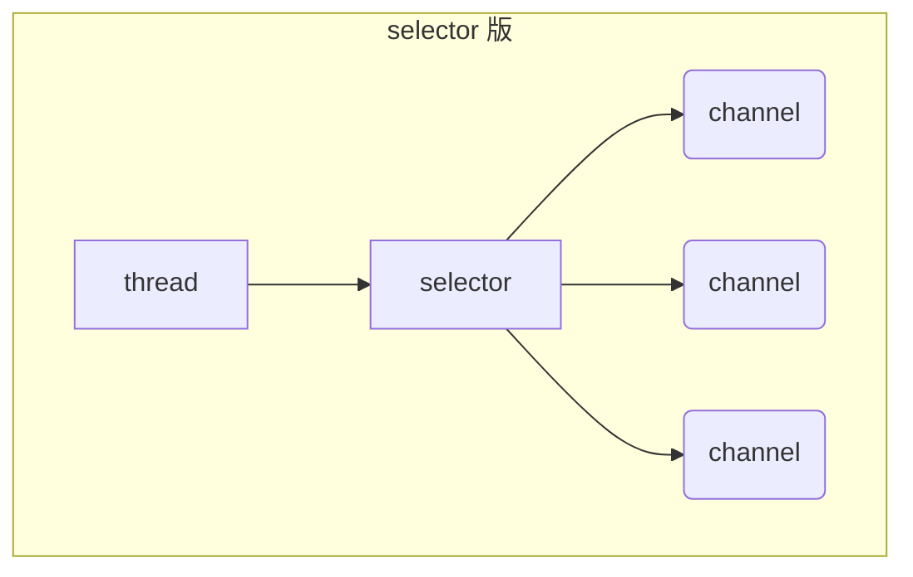

# Netty

视频链接：[黑马程序员Netty全套教程， netty深入浅出Java网络编程重点教程](https://www.bilibili.com/video/BV1py4y1E7oA?vd_source=6e6b2286ee9a603d7bdb2bc5ba80e449)

+++

## 一、NIO基础

### 1 三大组件

#### 1.1 Channel & Buffer

channel 有一点类似于 stream，它就是读写数据的**双向通道**，可以从 channel 将数据读入 buffer，也可以将 buffer 的数据写入 channel，而之前的 stream 要么是输入，要么是输出，channel 比 stream 更为底层


常见的 Channel 有

* FileChannel
* DatagramChannel
* SocketChannel
* ServerSocketChannel


buffer 则用来缓冲读写数据，常见的 buffer 有

* ByteBuffer
  * MappedByteBuffer
  * DirectByteBuffer
  * HeapByteBuffer
* ShortBuffer
* IntBuffer
* LongBuffer
* FloatBuffer
* DoubleBuffer
* CharBuffer


#### 1.2 Selector

selector 单从字面意思不好理解，需要结合服务器的设计演化来理解它的用途

1. 多线程版设计

   ```mermaid
   graph TD
   subgraph 多线程版
   t1(thread) --> s1(socket1)
   t2(thread) --> s2(socket2)
   t3(thread) --> s3(socket3)
   end
   ```

   多线程版缺点：

   + 内存占用高
   + 线程上下文切换成本高
   + 只适合连接数少的场景

2. 线程池版设计

   ```mermaid
   graph TD
   subgraph 线程池版
   t4(thread) --> s4(socket1)
   t5(thread) --> s5(socket2)
   t4(thread) -.-> s6(socket3)
   t5(thread) -.-> s7(socket4)
   end
   ```

   线程池版缺点：

   * 阻塞模式下，线程仅能处理一个 socket 连接
   * 仅适合短连接场景

3. selector 版设计

   selector 的作用就是配合一个线程来管理多个 channel，获取这些 channel 上发生的事件，这些 channel 工作在非阻塞模式下，不会让线程吊死在一个 channel 上。适合连接数特别多，但流量低的场景（low traffic）

   ```mermaid
   graph TD
   subgraph selector 版
   thread --> selector
   selector --> c1(channel)
   selector --> c2(channel)
   selector --> c3(channel)
   end
   ```

   

   调用 selector 的 select() 会阻塞直到 channel 发生了读写就绪事件，这些事件发生，select 方法就会返回这些事件交给 thread 来处理


### 2 ByteBuffer

有一普通文本文件 data.txt，内容为

```
1234567890abcd
```

使用 FileChannel 来读取文件内容

```java
@Slf4j
public class ChannelDemo1 {
    public static void main(String[] args) {
        // FileChannel  1.输入输出流获取  2.RanllomAccessFile获取
        try (RandomAccessFile file = new RandomAccessFile("helloword/data.txt", "rw")) {
            FileChannel channel = file.getChannel();
            ByteBuffer buffer = ByteBuffer.allocate(10);
            do {
                // 向 buffer 写入
                int len = channel.read(buffer);
                log.debug("读到字节数：{}", len);
                if (len == -1) {
                    break;
                }
                // 切换 buffer 读模式
                buffer.flip();
                while(buffer.hasRemaining()) {
                    log.debug("{}", (char) buffer.get());
                }
                // 切换 buffer 写模式
                buffer.clear();
            } while (true);
        } catch (IOException e) {
            e.printStackTrace();
        }
    }
}
```

输出

```
10:39:03 [DEBUG] [main] c.i.n.ChannelDemo1 - 读到字节数：10
10:39:03 [DEBUG] [main] c.i.n.ChannelDemo1 - 1
10:39:03 [DEBUG] [main] c.i.n.ChannelDemo1 - 2
10:39:03 [DEBUG] [main] c.i.n.ChannelDemo1 - 3
10:39:03 [DEBUG] [main] c.i.n.ChannelDemo1 - 4
10:39:03 [DEBUG] [main] c.i.n.ChannelDemo1 - 5
10:39:03 [DEBUG] [main] c.i.n.ChannelDemo1 - 6
10:39:03 [DEBUG] [main] c.i.n.ChannelDemo1 - 7
10:39:03 [DEBUG] [main] c.i.n.ChannelDemo1 - 8
10:39:03 [DEBUG] [main] c.i.n.ChannelDemo1 - 9
10:39:03 [DEBUG] [main] c.i.n.ChannelDemo1 - 0
10:39:03 [DEBUG] [main] c.i.n.ChannelDemo1 - 读到字节数：4
10:39:03 [DEBUG] [main] c.i.n.ChannelDemo1 - a
10:39:03 [DEBUG] [main] c.i.n.ChannelDemo1 - b
10:39:03 [DEBUG] [main] c.i.n.ChannelDemo1 - c
10:39:03 [DEBUG] [main] c.i.n.ChannelDemo1 - d
10:39:03 [DEBUG] [main] c.i.n.ChannelDemo1 - 读到字节数：-1
```


#### 2.1  ByteBuffer 正确使用姿势

1. 向 buffer 写入数据，例如调用 channel.read(buffer)
2. 调用 flip() 切换至**读模式**
3. 从 buffer 读取数据，例如调用 buffer.get()
4. 调用 clear() 或 compact() 切换至**写模式**
5. 重复 1~4 步骤


#### 2.2 ByteBuffer 结构

ByteBuffer 有以下重要属性

* capacity：容量
* position：读写指针
* limit：读写限制

一开始


写模式下，position 是写入位置，limit 等于容量，下图表示写入了 4 个字节后的状态


flip 动作发生后，position 切换为读取位置，limit 切换为读取限制


读取 4 个字节后，状态


clear 动作发生后，状态


compact 方法，是把未读完的部分向前压缩，然后切换至写模式


##### 💡 调试工具类

```java
public class ByteBufferUtil {
    private static final char[] BYTE2CHAR = new char[256];
    private static final char[] HEXDUMP_TABLE = new char[256 * 4];
    private static final String[] HEXPADDING = new String[16];
    private static final String[] HEXDUMP_ROWPREFIXES = new String[65536 >>> 4];
    private static final String[] BYTE2HEX = new String[256];
    private static final String[] BYTEPADDING = new String[16];

    static {
        final char[] DIGITS = "0123456789abcdef".toCharArray();
        for (int i = 0; i < 256; i++) {
            HEXDUMP_TABLE[i << 1] = DIGITS[i >>> 4 & 0x0F];
            HEXDUMP_TABLE[(i << 1) + 1] = DIGITS[i & 0x0F];
        }

        int i;

        // Generate the lookup table for hex dump paddings
        for (i = 0; i < HEXPADDING.length; i++) {
            int padding = HEXPADDING.length - i;
            StringBuilder buf = new StringBuilder(padding * 3);
            for (int j = 0; j < padding; j++) {
                buf.append("   ");
            }
            HEXPADDING[i] = buf.toString();
        }

        // Generate the lookup table for the start-offset header in each row (up to 64KiB).
        for (i = 0; i < HEXDUMP_ROWPREFIXES.length; i++) {
            StringBuilder buf = new StringBuilder(12);
            buf.append(NEWLINE);
            buf.append(Long.toHexString(i << 4 & 0xFFFFFFFFL | 0x100000000L));
            buf.setCharAt(buf.length() - 9, '|');
            buf.append('|');
            HEXDUMP_ROWPREFIXES[i] = buf.toString();
        }

        // Generate the lookup table for byte-to-hex-dump conversion
        for (i = 0; i < BYTE2HEX.length; i++) {
            BYTE2HEX[i] = ' ' + StringUtil.byteToHexStringPadded(i);
        }

        // Generate the lookup table for byte dump paddings
        for (i = 0; i < BYTEPADDING.length; i++) {
            int padding = BYTEPADDING.length - i;
            StringBuilder buf = new StringBuilder(padding);
            for (int j = 0; j < padding; j++) {
                buf.append(' ');
            }
            BYTEPADDING[i] = buf.toString();
        }

        // Generate the lookup table for byte-to-char conversion
        for (i = 0; i < BYTE2CHAR.length; i++) {
            if (i <= 0x1f || i >= 0x7f) {
                BYTE2CHAR[i] = '.';
            } else {
                BYTE2CHAR[i] = (char) i;
            }
        }
    }

    /**
     * 打印所有内容
     * @param buffer
     */
    public static void debugAll(ByteBuffer buffer) {
        int oldlimit = buffer.limit();
        buffer.limit(buffer.capacity());
        StringBuilder origin = new StringBuilder(256);
        appendPrettyHexDump(origin, buffer, 0, buffer.capacity());
        System.out.println("+--------+-------------------- all ------------------------+----------------+");
        System.out.printf("position: [%d], limit: [%d]\n", buffer.position(), oldlimit);
        System.out.println(origin);
        buffer.limit(oldlimit);
    }

    /**
     * 打印可读取内容
     * @param buffer
     */
    public static void debugRead(ByteBuffer buffer) {
        StringBuilder builder = new StringBuilder(256);
        appendPrettyHexDump(builder, buffer, buffer.position(), buffer.limit() - buffer.position());
        System.out.println("+--------+-------------------- read -----------------------+----------------+");
        System.out.printf("position: [%d], limit: [%d]\n", buffer.position(), buffer.limit());
        System.out.println(builder);
    }

    private static void appendPrettyHexDump(StringBuilder dump, ByteBuffer buf, int offset, int length) {
        if (isOutOfBounds(offset, length, buf.capacity())) {
            throw new IndexOutOfBoundsException(
                    "expected: " + "0 <= offset(" + offset + ") <= offset + length(" + length
                            + ") <= " + "buf.capacity(" + buf.capacity() + ')');
        }
        if (length == 0) {
            return;
        }
        dump.append(
                "         +-------------------------------------------------+" +
                        NEWLINE + "         |  0  1  2  3  4  5  6  7  8  9  a  b  c  d  e  f |" +
                        NEWLINE + "+--------+-------------------------------------------------+----------------+");

        final int startIndex = offset;
        final int fullRows = length >>> 4;
        final int remainder = length & 0xF;

        // Dump the rows which have 16 bytes.
        for (int row = 0; row < fullRows; row++) {
            int rowStartIndex = (row << 4) + startIndex;

            // Per-row prefix.
            appendHexDumpRowPrefix(dump, row, rowStartIndex);

            // Hex dump
            int rowEndIndex = rowStartIndex + 16;
            for (int j = rowStartIndex; j < rowEndIndex; j++) {
                dump.append(BYTE2HEX[getUnsignedByte(buf, j)]);
            }
            dump.append(" |");

            // ASCII dump
            for (int j = rowStartIndex; j < rowEndIndex; j++) {
                dump.append(BYTE2CHAR[getUnsignedByte(buf, j)]);
            }
            dump.append('|');
        }

        // Dump the last row which has less than 16 bytes.
        if (remainder != 0) {
            int rowStartIndex = (fullRows << 4) + startIndex;
            appendHexDumpRowPrefix(dump, fullRows, rowStartIndex);

            // Hex dump
            int rowEndIndex = rowStartIndex + remainder;
            for (int j = rowStartIndex; j < rowEndIndex; j++) {
                dump.append(BYTE2HEX[getUnsignedByte(buf, j)]);
            }
            dump.append(HEXPADDING[remainder]);
            dump.append(" |");

            // Ascii dump
            for (int j = rowStartIndex; j < rowEndIndex; j++) {
                dump.append(BYTE2CHAR[getUnsignedByte(buf, j)]);
            }
            dump.append(BYTEPADDING[remainder]);
            dump.append('|');
        }

        dump.append(NEWLINE +
                "+--------+-------------------------------------------------+----------------+");
    }

    private static void appendHexDumpRowPrefix(StringBuilder dump, int row, int rowStartIndex) {
        if (row < HEXDUMP_ROWPREFIXES.length) {
            dump.append(HEXDUMP_ROWPREFIXES[row]);
        } else {
            dump.append(NEWLINE);
            dump.append(Long.toHexString(rowStartIndex & 0xFFFFFFFFL | 0x100000000L));
            dump.setCharAt(dump.length() - 9, '|');
            dump.append('|');
        }
    }

    public static short getUnsignedByte(ByteBuffer buffer, int index) {
        return (short) (buffer.get(index) & 0xFF);
    }
}
```


#### 2.3 ByteBuffer 常见方法

##### 分配空间

可以使用 allocate 方法为 ByteBuffer 分配空间，其它 buffer 类也有该方法

```java
Bytebuffer buf = ByteBuffer.allocate(16);
```

```java
public static void main(String[] args) {
    System.out.println(ByteBuffer.allocate(16).getClass());
    System.out.println(ByteBuffer.allocateDirect(16).getClass());
    /*
    * class java.nio.HeapByteBuffer     - java 堆内存，读写效率较低，受到 GC 的影响
    * class java.nio.DirectByteBuffer   - 直接内存，读写效率高（少一次拷贝），不会受到 GC 的影响，分配效率低
    * */
}
```


##### 向 buffer 写入数据

有两种办法

* 调用 channel 的 read 方法
* 调用 buffer 自己的 put 方法

```java
int readBytes = channel.read(buf);
```

和

```java
buf.put((byte)127);
```


##### 从 buffer 读取数据

同样有两种办法

* 调用 channel 的 write 方法
* 调用 buffer 自己的 get 方法

```java
int writeBytes = channel.write(buf);
```

和

```java
byte b = buf.get();
```

get 方法会让 position 读指针向后走，如果想重复读取数据

* 可以调用 rewind 方法将 position 重新置为 0
* 或者调用 get(int i) 方法获取索引 i 的内容，它不会移动读指针


##### mark 和 reset

mark 是在读取时，做一个标记，即使 position 改变，只要调用 reset 就能回到 mark 的位置

> **注意**
>
> rewind 和 flip 都会清除 mark 位置


##### 字符串与 ByteBuffer 互转

```java
public static void main(String[] args) {
    // 1. 字符串 转为 ByteBuffer
    ByteBuffer buffer1 = ByteBuffer.allocate(16);
    buffer1.put("Hello Netty".getBytes());
    debugAll(buffer1);

    // 2. Charset
    ByteBuffer buffer2 = StandardCharsets.UTF_8.encode("Hello NIO");
    debugAll(buffer2);

    // 3. wrap
    ByteBuffer buffer3 = ByteBuffer.wrap("Hello".getBytes());
    debugAll(buffer3);

    // 4. 转为字符串
    String str2 = StandardCharsets.UTF_8.decode(buffer2).toString();
    System.out.println(str2);

    // 需要将 buffer1 切换至读模式
    buffer1.flip();
    String str1 = StandardCharsets.UTF_8.decode(buffer1).toString();
    System.out.println(str1);
}
```

输出

```
+--------+-------------------- all ------------------------+----------------+
position: [11], limit: [16]
         +-------------------------------------------------+
         |  0  1  2  3  4  5  6  7  8  9  a  b  c  d  e  f |
+--------+-------------------------------------------------+----------------+
|00000000| 48 65 6c 6c 6f 20 4e 65 74 74 79 00 00 00 00 00 |Hello Netty.....|
+--------+-------------------------------------------------+----------------+
+--------+-------------------- all ------------------------+----------------+
position: [0], limit: [9]
         +-------------------------------------------------+
         |  0  1  2  3  4  5  6  7  8  9  a  b  c  d  e  f |
+--------+-------------------------------------------------+----------------+
|00000000| 48 65 6c 6c 6f 20 4e 49 4f                      |Hello NIO       |
+--------+-------------------------------------------------+----------------+
+--------+-------------------- all ------------------------+----------------+
position: [0], limit: [5]
         +-------------------------------------------------+
         |  0  1  2  3  4  5  6  7  8  9  a  b  c  d  e  f |
+--------+-------------------------------------------------+----------------+
|00000000| 48 65 6c 6c 6f                                  |Hello           |
+--------+-------------------------------------------------+----------------+
Hello NIO
Hello Netty
```


##### ⚠️ Buffer 的线程安全

> Buffer 是**非线程安全的**


#### 2.4 Scattering Reads

分散读取，有一个文本文件 words.txt

```
onetwothree
```

使用如下方式读取，可以将数据填充至多个 buffer

```java
try (FileChannel channel = new RandomAccessFile("words.txt", "r").getChannel()) {
    ByteBuffer b1 = ByteBuffer.allocate(3);
    ByteBuffer b2 = ByteBuffer.allocate(3);
    ByteBuffer b3 = ByteBuffer.allocate(5);
    channel.read(new ByteBuffer[]{ b1, b2, b3 });

    b1.flip();
    b2.flip();
    b3.flip();

    debugAll(b1);
    debugAll(b2);
    debugAll(b3);
} catch (IOException e) {
    e.printStackTrace();
}
```

结果

```
+--------+-------------------- all ------------------------+----------------+
position: [0], limit: [3]
         +-------------------------------------------------+
         |  0  1  2  3  4  5  6  7  8  9  a  b  c  d  e  f |
+--------+-------------------------------------------------+----------------+
|00000000| 6f 6e 65                                        |one             |
+--------+-------------------------------------------------+----------------+
+--------+-------------------- all ------------------------+----------------+
position: [0], limit: [3]
         +-------------------------------------------------+
         |  0  1  2  3  4  5  6  7  8  9  a  b  c  d  e  f |
+--------+-------------------------------------------------+----------------+
|00000000| 74 77 6f                                        |two             |
+--------+-------------------------------------------------+----------------+
+--------+-------------------- all ------------------------+----------------+
position: [0], limit: [5]
         +-------------------------------------------------+
         |  0  1  2  3  4  5  6  7  8  9  a  b  c  d  e  f |
+--------+-------------------------------------------------+----------------+
|00000000| 74 68 72 65 65                                  |three           |
+--------+-------------------------------------------------+----------------+
```


#### 2.5 Gathering Writes

使用如下方式写入，可以将多个 buffer 的数据填充至 channel

```java
try (FileChannel channel = new RandomAccessFile("words2.txt", "rw").getChannel()) {
    ByteBuffer b1 = StandardCharsets.UTF_8.encode("hello");
    ByteBuffer b2 = StandardCharsets.UTF_8.encode("world");
    ByteBuffer b3 = StandardCharsets.UTF_8.encode("你好");

    channel.write(new ByteBuffer[]{ b1, b2, b3 });
} catch (IOException e) {
    e.printStackTrace();
}
```

文件内容

```
helloworld你好
```


#### 2.6 练习

网络上有多条数据发送给服务端，数据之间使用`\n`进行分隔
但由于某种原因这些数据在接收时，被进行了重新组合，例如原始数据有3条为

* Hello,world\n
* I'm zhangsan\n
* How are you?\n

变成了下面的两个 byteBuffer (黏包，半包)

* Hello,world\nI'm zhangsan\nHo
* w are you?\n

现在要求你编写程序，将错乱的数据恢复成原始的按`\n`分隔的数据

```java
public class TestByteBufferExam {
    public static void main(String[] args) {
        ByteBuffer source = ByteBuffer.allocate(32);
        source.put("Hello,world\nI'm zhangsan\nHo".getBytes());
        split(source);

        source.put("w are you?\n".getBytes());
        split(source);
    }

    private static void split(ByteBuffer source) {
        source.flip(); // 切换至读模式
        for (int i = 0; i < source.limit(); i++) {
            // 找到一条完整消息
            if (source.get(i) == '\n') {
                // 消息长度
                int length = i + 1 - source.position();
                // 把这条完整消息存入新的 ByteBuffer
                ByteBuffer target = ByteBuffer.allocate(length);
                // 从 source 读取，写入 target 中
                for (int j = 0; j < length; j++) {
                    target.put(source.get());
                }
                debugAll(target);
            }
        }
        source.compact();
    }
}
```

输出：

```
+--------+-------------------- all ------------------------+----------------+
position: [12], limit: [12]
         +-------------------------------------------------+
         |  0  1  2  3  4  5  6  7  8  9  a  b  c  d  e  f |
+--------+-------------------------------------------------+----------------+
|00000000| 48 65 6c 6c 6f 2c 77 6f 72 6c 64 0a             |Hello,world.    |
+--------+-------------------------------------------------+----------------+
+--------+-------------------- all ------------------------+----------------+
position: [13], limit: [13]
         +-------------------------------------------------+
         |  0  1  2  3  4  5  6  7  8  9  a  b  c  d  e  f |
+--------+-------------------------------------------------+----------------+
|00000000| 49 27 6d 20 7a 68 61 6e 67 73 61 6e 0a          |I'm zhangsan.   |
+--------+-------------------------------------------------+----------------+
+--------+-------------------- all ------------------------+----------------+
position: [13], limit: [13]
         +-------------------------------------------------+
         |  0  1  2  3  4  5  6  7  8  9  a  b  c  d  e  f |
+--------+-------------------------------------------------+----------------+
|00000000| 48 6f 77 20 61 72 65 20 79 6f 75 3f 0a          |How are you?.   |
+--------+-------------------------------------------------+----------------+
```


### 3 文件编程

#### 3.1 FileChannel

##### ⚠️ FileChannel 工作模式

> FileChannel 只能工作在阻塞模式下


##### 获取

不能直接打开 FileChannel，必须通过 FileInputStream、FileOutputStream 或者 RandomAccessFile 来获取 FileChannel，它们都有 getChannel 方法

* 通过 FileInputStream 获取的 channel 只能读
* 通过 FileOutputStream 获取的 channel 只能写
* 通过 RandomAccessFile 是否能读写根据构造 RandomAccessFile 时的读写模式决定


##### 读取

会从 channel 读取数据填充 ByteBuffer，返回值表示读到了多少字节，-1 表示到达了文件的末尾

```java
int readBytes = channel.read(buffer);
```


##### 写入

写入的正确姿势如下，SocketChannel

```java
ByteBuffer buffer = ...;
buffer.put(...); // 存入数据
buffer.flip();   // 切换读模式

while(buffer.hasRemaining()) {
    channel.write(buffer);
}
```

在 while 中调用 channel.write 是因为 write 方法并不能保证一次将 buffer 中的内容全部写入 channel


##### 关闭

channel 必须关闭，不过调用了 FileInputStream、FileOutputStream 或者 RandomAccessFile 的 close 方法会间接地调用 channel 的 close 方法


##### 位置

获取当前位置

```java
long pos = channel.position();
```

设置当前位置

```java
long newPos = ...;
channel.position(newPos);
```

设置当前位置时，如果设置为文件的末尾

* 这时读取会返回 -1 
* 这时写入，会追加内容，但要注意如果 position 超过了文件末尾，再写入时在新内容和原末尾之间会有空洞（00）


##### 大小

使用 size() 方法获取文件的大小


##### 强制写入

操作系统出于性能的考虑，会将数据缓存，不是立刻写入磁盘。可以调用 force(true) 方法将文件内容和元数据（文件的权限等信息）立刻写入磁盘


#### 3.2 两个Channel传输数据

```java
private static void method1() {
    try(
            FileChannel from = new FileInputStream("data.txt").getChannel();
            FileChannel to = new FileOutputStream("to.txt").getChannel();) {
        // 效率高，底层会利用操作系统的零拷贝进行优化
        from.transferTo(0, from.size(), to);
    } catch (IOException e) {
        e.printStackTrace();
    }
}
```

超过 2g 大小的文件传输

```java
private static void method2() {
    try(
            FileChannel from = new FileInputStream("data.txt").getChannel();
            FileChannel to = new FileOutputStream("to.txt").getChannel();) {
        // 效率高，底层会利用操作系统的零拷贝进行优化，最多传2G数据
        long size = from.size();
        // left 变量表示还剩多少字节
        for (long left = size; left > 0; ) {
            System.out.println("position:" + (size - left) + " left:" + left);
            left -= from.transferTo(size - left, left, to);
        }
    } catch (IOException e) {
        e.printStackTrace();
    }
}
```

实际传输一个超大文件

```
position:0 left:7769948160
position:2147483647 left:5622464513
position:4294967294 left:3474980866
position:6442450941 left:1327497219
```


#### 3.3 Path

jdk7 引入了 Path 和 Paths 类

* Path 用来表示文件路径
* Paths 是工具类，用来获取 Path 实例

```java
Path source = Paths.get("1.txt"); // 相对路径 使用 user.dir 环境变量来定位 1.txt

Path source = Paths.get("d:\\1.txt"); // 绝对路径 代表了  d:\1.txt

Path source = Paths.get("d:/1.txt"); // 绝对路径 同样代表了  d:\1.txt

Path projects = Paths.get("d:\\data", "projects"); // 代表了  d:\data\projects
```

* `.` 代表了当前路径
* `..` 代表了上一级路径

例如目录结构如下

```
d:
	|- data
		|- projects
			|- a
			|- b
```

代码

```java
Path path = Paths.get("d:\\data\\projects\\a\\..\\b");
System.out.println(path);
System.out.println(path.normalize()); // 正常化路径
```

会输出

```
d:\data\projects\a\..\b
d:\data\projects\b
```


#### 3.4 Files

1. 检查文件是否存在

   ```java
   Path path = Paths.get("helloword/data.txt");
   
   System.out.println(Files.exists(path));
   ```

2. 创建一级目录

   ```java
   Path path = Paths.get("helloword/d1");
   
   Files.createDirectory(path);
   ```

   * 如果目录已存在，会抛异常 FileAlreadyExistsException
   * 不能一次创建多级目录，否则会抛异常 NoSuchFileException

3. 创建多级目录用

   ```java
   Path path = Paths.get("helloword/d1/d2");
   
   Files.createDirectories(path);
   ```

4. 拷贝文件

   ```java
   Path source = Paths.get("helloword/data.txt");
   Path target = Paths.get("helloword/target.txt");
   
   Files.copy(source, target);
   ```

   * 如果文件已存在，会抛异常 FileAlreadyExistsException

   如果希望用 source 覆盖掉 target，需要用 StandardCopyOption 来控制

   ```java
   Files.copy(source, target, StandardCopyOption.REPLACE_EXISTING);
   ```

5. 移动文件

   ```java
   Path source = Paths.get("helloword/data.txt");
   Path target = Paths.get("helloword/data.txt");
   
   Files.move(source, target, StandardCopyOption.ATOMIC_MOVE);
   ```

   * StandardCopyOption.ATOMIC_MOVE 保证文件移动的原子性

6. 删除文件

   ```java
   Path target = Paths.get("helloword/target.txt");
   
   Files.delete(target);
   ```

   * 如果文件不存在，会抛异常 NoSuchFileException

7. 删除目录

   ```java
   Path target = Paths.get("helloword/d1");
   
   Files.delete(target);
   ```

   * 如果目录还有内容，会抛异常 DirectoryNotEmptyException

8. 遍历目录文件

   ```java
   /**
    * 遍历所在目录下所有的文件和目录 并统计目录和文件的数量
    * 
    * @throws IOException
    */
   private static void m1() throws IOException {
       AtomicInteger dirCount = new AtomicInteger();
       AtomicInteger fileCount = new AtomicInteger();
       final String pathName = "X:\\a_sourceCode\\apache-zookeeper-3.5.7\\apache-zookeeper-3.5.7";
       Files.walkFileTree(Paths.get(pathName), new SimpleFileVisitor<Path>() {
           @Override
           public FileVisitResult preVisitDirectory(Path dir, BasicFileAttributes attrs) throws IOException {
               System.out.println(dir);
               dirCount.incrementAndGet();
               return super.preVisitDirectory(dir, attrs);
           }
   
           @Override
           public FileVisitResult visitFile(Path file, BasicFileAttributes attrs) throws IOException {
               System.out.println("=====" + file);
               fileCount.incrementAndGet();
               return super.visitFile(file, attrs);
           }
       });
   
       System.out.println("dir count：" + dirCount);
       System.out.println("file count：" + fileCount);
   }
   ```

9. 统计 jar 的数目

   ```java
   /**
    * 计算所在目录下面的jar包的数量
    *
    * @throws IOException
    */
   private static void m2() throws IOException {
       AtomicInteger jarCount = new AtomicInteger();
       final String pathName = "X:\\newJava\\Maven\\maven_repository";
       Files.walkFileTree(Paths.get(pathName), new SimpleFileVisitor<Path>() {
           @Override
           public FileVisitResult visitFile(Path file, BasicFileAttributes attrs) throws IOException {
               if (file.toString().endsWith(".jar")) {
                   System.out.println(file);
                   jarCount.incrementAndGet();
               }
               return super.visitFile(file, attrs);
           }
       });
       System.out.println("jar count：" + jarCount);
   }
   ```

10. 删除多级目录

    ```java
    /**
     * 删除多级目录
     *
     * @throws IOException
     */
    private static void m3() throws IOException {
        final String pathName = "C:\\Users\\Amadeus\\Desktop\\apache-zookeeper-3.5.7";
        Files.walkFileTree(Paths.get(pathName), new SimpleFileVisitor<Path>() {
            @Override
            public FileVisitResult visitFile(Path file, BasicFileAttributes attrs) throws IOException {
                Files.delete(file);
                return super.visitFile(file, attrs);
            }
    
            @Override
            public FileVisitResult postVisitDirectory(Path dir, IOException exc) throws IOException {
                Files.delete(dir);
                return super.postVisitDirectory(dir, exc);
            }
        });
    }
    ```

    > 删除是危险操作，确保要递归删除的文件夹没有重要内容

11. 拷贝多级目录

    ```java
    /**
     * 拷贝多级目录
     * @throws IOException
     */
    private static void m4() throws IOException {
        final String source = "X:\\a_sourceCode\\apache-zookeeper-3.5.7\\apache-zookeeper-3.5.7";
        final String target = "C:\\Users\\Amadeus\\Desktop\\zookeeper";
        Files.walk(Paths.get(source)).forEach(path -> {
            try {
                String targetName = path.toString().replace(source, target);
                if (Files.isDirectory(path)) {
                    // 是目录 创建目录
                    Files.createDirectory(Paths.get(targetName));
                } else if (Files.isRegularFile(path)) {
                    // 是普通文件 拷贝
                    Files.copy(path, Paths.get(targetName));
                }
            } catch (IOException e) {
                throw new RuntimeException(e);
            }
        });
    }
    ```


### 4 网络编程

#### 4.1 非阻塞VS阻塞

##### 4.1.1 堵塞

* 阻塞模式下，相关方法都会导致线程暂停
  * ServerSocketChannel.accept 会在**没有连接建立时**让线程暂停
  * SocketChannel.read 会在**通道中没有数据可读时**让线程暂停
  * 阻塞的表现其实就是线程暂停了，暂停期间不会占用 cpu，但线程相当于闲置
* 单线程下，阻塞方法之间相互影响，几乎不能正常工作，需要多线程支持
* 但多线程下，有新的问题，体现在以下方面
  * 32 位 jvm 一个线程 320k，64 位 jvm 一个线程 1024k，如果连接数过多，必然导致 OOM，并且线程太多，反而会因为频繁上下文切换导致性能降低
  * 可以采用线程池技术来减少线程数和线程上下文切换，但治标不治本，如果有很多连接建立，但长时间 inactive，会阻塞线程池中所有线程，因此不适合长连接，只适合短连接

**服务器端**：

```java
public class Server {
    public static void main(String[] args) throws IOException {
        // 0. 创建缓冲区
        ByteBuffer buffer = ByteBuffer.allocate(16);
        // 1. 创建服务器
        ServerSocketChannel ssc = ServerSocketChannel.open();
        // 2. 绑定监听接口
        ssc.bind(new InetSocketAddress(8080));
        // 3. 连接集合
        List<SocketChannel> channels = new ArrayList<>();
        while (true) {
            // 4. accept 建立与客户端连接，SocketChannel 用来与客户端之间通信
            System.out.println("before connecting...");
            SocketChannel sc = ssc.accept(); // 堵塞方法，线程停止运行
            System.out.println("after connecting...");
            channels.add(sc);
            for (SocketChannel channel : channels) {
                // 5. 接收客户端发送的数据
                System.out.println("before reading");
                channel.read(buffer); // 堵塞方法，线程停止运行
                buffer.flip();
                debugRead(buffer);
                buffer.clear();
                System.out.println("after reading");
            }
        }
    }
}
```

**客户端**：

```java
@Slf4j
public class Client {
    public static void main(String[] args) throws IOException {
        SocketChannel sc = SocketChannel.open();
        sc.connect(new InetSocketAddress("localhost", 8080));
        System.out.println("waiting...");
    }
}
```

运行结果

- 客户端-服务器建立连接前：服务器端因accept阻塞

  [](https://nyimapicture.oss-cn-beijing.aliyuncs.com/img/20210413213318.png)

- 客户端-服务器建立连接后，客户端发送消息前：服务器端因通道为空被阻塞

  [](https://nyimapicture.oss-cn-beijing.aliyuncs.com/img/20210413213446.png)

- 客户端发送数据后，服务器处理通道中的数据。再次进入循环时，再次被accept阻塞

  [](https://nyimapicture.oss-cn-beijing.aliyuncs.com/img/20210413214109.png)

- 之前的客户端再次发送消息，**服务器端因为被accept阻塞**，无法处理之前客户端发送到通道中的信息

  [](https://nyimapicture.oss-cn-beijing.aliyuncs.com/img/20210413214505.png)


##### 4.1.2 非阻塞

* 非阻塞模式下，相关方法都会不会让线程暂停
  * 在 ServerSocketChannel.accept 在没有连接建立时，会返回 null，继续运行
  * SocketChannel.read 在没有数据可读时，会返回 0，但线程不必阻塞，可以去执行其它 SocketChannel 的 read 或是去执行 ServerSocketChannel.accept 
  * 写数据时，线程只是等待数据写入 Channel 即可，无需等 Channel 通过网络把数据发送出去
* 但非阻塞模式下，即使没有连接建立，和可读数据，线程仍然在不断运行，白白浪费了 cpu
* 数据复制过程中，线程实际还是阻塞的（AIO 改进的地方）

**服务器端，客户端代码不变**：

```java
@Slf4j
public class Server {
    public static void main(String[] args) throws IOException {
        // 使用 NIO 来理解非阻塞模式, 单线程
        // 0. ByteBuffer
        ByteBuffer buffer = ByteBuffer.allocate(16);
        // 1. 创建服务器
        ServerSocketChannel ssc = ServerSocketChannel.open();
        ssc.configureBlocking(false); // 非阻塞模式
        // 2. 绑定监听接口
        ssc.bind(new InetSocketAddress(8080));
        // 3. 连接集合
        List<SocketChannel> channels = new ArrayList<>();
        while (true) {
            // 4. accept 建立与客户端连接，SocketChannel 用来与客户端之间通信
            SocketChannel sc = ssc.accept(); // 非堵塞方法，线程还会继续运行，如果没有连接建立，返回的sc为null
            if (sc != null) {
                log.debug("connected... {}", sc);
                sc.configureBlocking(false); // 非堵塞模式
                channels.add(sc);
            }
            for (SocketChannel channel : channels) {
                // 5. 接收客户端发送的数据
                int read = channel.read(buffer);// 非堵塞方法，线程还会继续运行，如果没有读到数据，read 返回 0
                if (read > 0) {
                    buffer.flip();
                    debugRead(buffer);
                    buffer.clear();
                    log.debug("after read... {}", channel);
                }
            }
        }
    }
}
```


##### 4.1.3 多路复用

单线程可以配合 Selector 完成对多个 Channel 可读写事件的监控，这称之为多路复用

* 多路复用*仅针对网络IO*，*普通文件IO*没法利用多路复用
* 如果不用 Selector 的非阻塞模式，线程大部分时间都在做无用功，而 Selector 能够保证
  * 有可连接事件时才去连接
  * 有可读事件才去读取
  * 有可写事件才去写入
    * 限于网络传输能力，Channel 未必时时可写，一旦 Channel 可写，会触发 Selector 的可写事件


#### 4.2 Selector




好处

* 一个线程配合 selector 就可以监控多个 channel 的事件，事件发生线程才去处理。避免非阻塞模式下所做无用功
* 让这个线程能够被充分利用
* 节约了线程的数量
* 减少了线程上下文切换


##### 4.2.1 创建Selector

```java
Selector selector = Selector.open();
```


##### 4.2.2 绑定 Channel 事件

也称之为注册事件，绑定的事件 selector 才会关心

```java
channel.configureBlocking(false);
SelectionKey key = channel.register(selector, 绑定事件);
```

* channel 必须工作在非阻塞模式
* FileChannel 没有非阻塞模式，因此不能配合 selector 一起使用
* 绑定的事件类型可以有
  * connect - 客户端连接成功时触发
  * accept - 服务器端成功接受连接时触发
  * read - 数据可读入时触发，有因为接收能力弱，数据暂不能读入的情况
  * write - 数据可写出时触发，有因为发送能力弱，数据暂不能写出的情况


##### 4.2.3 监听Channel事件

可以通过下面三种方法来监听是否有事件发生，方法的返回值代表有多少 channel 发生了事件

方法1，阻塞直到绑定事件发生

```java
int count = selector.select();
```

方法2，阻塞直到绑定事件发生，或是超时（时间单位为 ms）

```java
int count = selector.select(long timeout);
```

方法3，不会阻塞，也就是不管有没有事件，立刻返回，自己根据返回值检查是否有事件

```java
int count = selector.selectNow();
```


##### 💡 select 何时不阻塞

> * 事件发生时
>   * 客户端发起连接请求，会触发 accept 事件
>   * 客户端发送数据过来，客户端正常、异常关闭时，都会触发 read 事件，另外如果发送的数据大于 buffer 缓冲区，会触发多次读取事件
>   * channel 可写，会触发 write 事件
>   * 在 linux 下 nio bug 发生时
> * 调用 selector.wakeup()
> * 调用 selector.close()
> * selector 所在线程 interrupt


#### 4.3 处理 accept 事件

要使用 Selector 实现多路复用，服务端代码如下改进

```java
public class SelectServer {
    public static void main(String[] args) {
        ByteBuffer buffer = ByteBuffer.allocate(16);
        // 获得服务器通道
        try(ServerSocketChannel server = ServerSocketChannel.open()) {
            server.bind(new InetSocketAddress(8080));
            // 创建选择器
            Selector selector = Selector.open();
            
            // 通道必须设置为非阻塞模式
            server.configureBlocking(false);
            // 将通道注册到选择器中，并设置感兴趣的事件
            server.register(selector, SelectionKey.OP_ACCEPT);
            while (true) {
                // 若没有事件就绪，线程会被阻塞，反之不会被阻塞。从而避免了CPU空转
                // 返回值为就绪的事件个数
                int ready = selector.select();
                System.out.println("selector ready counts : " + ready);
                
                // 获取所有事件
                Set<SelectionKey> selectionKeys = selector.selectedKeys();
                
                // 使用迭代器遍历事件
                Iterator<SelectionKey> iterator = selectionKeys.iterator();
                while (iterator.hasNext()) {
                    SelectionKey key = iterator.next();
                    
                    // 判断key的类型
                    if(key.isAcceptable()) {
                        // 获得key对应的channel
                        ServerSocketChannel channel = (ServerSocketChannel) key.channel();
                        System.out.println("before accepting...");
                        
        				// 获取连接并处理，而且是必须处理，否则需要取消
                        SocketChannel socketChannel = channel.accept();
                        System.out.println("after accepting...");
                        
                        // 处理完毕后移除
                        iterator.remove();
                    }
                }
            }
        } catch (IOException e) {
            e.printStackTrace();
        }
    }
}Copy
```

**步骤解析**

- 获得选择器Selector

  ```java
  Selector selector = Selector.open();
  ```

- 将**通道设置为非阻塞模式**，并注册到选择器中，并设置感兴趣的事件

  - channel 必须工作在非阻塞模式

  - FileChannel 没有非阻塞模式，因此不能配合 selector 一起使用

  - 绑定的**事件类型**可以有

    - connect - 客户端连接成功时触发
    - accept - 服务器端成功接受连接时触发
    - read - 数据可读入时触发，有因为接收能力弱，数据暂不能读入的情况
    - write - 数据可写出时触发，有因为发送能力弱，数据暂不能写出的情况

    ```java
    // 通道必须设置为非阻塞模式
    server.configureBlocking(false);
    // 将通道注册到选择器中，并设置感兴趣的实践
    server.register(selector, SelectionKey.OP_ACCEPT);
    ```

- 通过Selector监听事件，并获得就绪的通道个数，若没有通道就绪，线程会被阻塞

  - 阻塞直到绑定事件发生

    ```java
    int count = selector.select();
    ```

  - 阻塞直到绑定事件发生，**或是超时**（时间单位为 ms）

    ```java
    int count = selector.select(long timeout);
    ```

  - **不会阻塞**，也就是不管有没有事件，立刻返回，自己根据返回值检查是否有事件

    ```java
    int count = selector.selectNow();
    ```

- 获取就绪事件并**得到对应的通道**，然后进行处理

  ```java
  // 获取所有事件
  Set<SelectionKey> selectionKeys = selector.selectedKeys();
                  
  // 使用迭代器遍历事件
  Iterator<SelectionKey> iterator = selectionKeys.iterator();
  
  while (iterator.hasNext()) {
  	SelectionKey key = iterator.next();
                      
  	// 判断key的类型，此处为Accept类型
  	if(key.isAcceptable()) {
          // 获得key对应的channel
          ServerSocketChannel channel = (ServerSocketChannel) key.channel();
  
          // 获取连接并处理，而且是必须处理，否则需要取消
          SocketChannel socketChannel = channel.accept();
  
          // 处理完毕后移除
          iterator.remove();
  	}
  }
  ```

**事件发生后能否不处理**

事件发生后，**要么处理，要么取消（cancel）**，不能什么都不做，**否则下次该事件仍会触发**，这是因为 nio 底层使用的是水平触发


#### 4.4 处理 read 事件

- 在Accept事件中，若有客户端与服务器端建立了连接，**需要将其对应的SocketChannel设置为非阻塞，并注册到选择其中**；
- 添加Read事件，触发后进行读取操作

```java
public class SelectServer {
    public static void main(String[] args) {
        ByteBuffer buffer = ByteBuffer.allocate(16);
        // 获得服务器通道
        try(ServerSocketChannel server = ServerSocketChannel.open()) {
            server.bind(new InetSocketAddress(8080));
            // 创建选择器
            Selector selector = Selector.open();
            // 通道必须设置为非阻塞模式
            server.configureBlocking(false);
            // 将通道注册到选择器中，并设置感兴趣的实践
            server.register(selector, SelectionKey.OP_ACCEPT);
            // 为serverKey设置感兴趣的事件
            while (true) {
                // 若没有事件就绪，线程会被阻塞，反之不会被阻塞。从而避免了CPU空转
                // 返回值为就绪的事件个数
                int ready = selector.select();
                System.out.println("selector ready counts : " + ready);
                // 获取所有事件
                Set<SelectionKey> selectionKeys = selector.selectedKeys();
                // 使用迭代器遍历事件
                Iterator<SelectionKey> iterator = selectionKeys.iterator();
                while (iterator.hasNext()) {
                    SelectionKey key = iterator.next();
                    // 判断key的类型
                    if(key.isAcceptable()) {
                        // 获得key对应的channel
                        ServerSocketChannel channel = (ServerSocketChannel) key.channel();
                        System.out.println("before accepting...");
                        // 获取连接
                        SocketChannel socketChannel = channel.accept();
                        System.out.println("after accepting...");
                        // 设置为非阻塞模式，同时将连接的通道也注册到选择其中
                        socketChannel.configureBlocking(false);
                        socketChannel.register(selector, SelectionKey.OP_READ);
                    } else if (key.isReadable()) {
                        SocketChannel channel = (SocketChannel) key.channel();
                        System.out.println("before reading...");
                        channel.read(buffer);
                        System.out.println("after reading...");
                        buffer.flip();
                        ByteBufferUtil.debugRead(buffer);
                        buffer.clear();
                    }
                    // 处理完毕后移除
                    iterator.remove();
                }
            }
        } catch (IOException e) {
            e.printStackTrace();
        }
    }
}
```


##### 💡 为何要iterator.remove()

**当处理完一个事件后，一定要调用迭代器的remove方法移除对应事件，否则会出现错误**。原因如下

以我们上面的 **Read事件** 的代码为例

- 当调用了 server.register(selector, SelectionKey.OP_ACCEPT)后，Selector中维护了一个集合，**用于存放SelectionKey以及其对应的通道**

  ```java
  // WindowsSelectorImpl 中的 SelectionKeyImpl数组
  private SelectionKeyImpl[] channelArray = new SelectionKeyImpl[8];
  ```

  ```java
  public class SelectionKeyImpl extends AbstractSelectionKey {
      // Key对应的通道
      final SelChImpl channel;
      ...
  }
  ```

  

- 当**选择器中的通道对应的事件发生后**，selecionKey会被放到另一个集合中，但是**selecionKey不会自动移除**，所以需要我们在处理完一个事件后，通过迭代器手动移除其中的selecionKey。否则会导致已被处理过的事件再次被处理，就会引发错误

  


##### 💡 cancel的作用：断开处理

当客户端与服务器之间的连接**断开时，会给服务器端发送一个读事件**，对异常断开和正常断开需要加以不同的方式进行处理

- **正常断开**

  - 正常断开时，服务器端的channel.read(buffer)方法的返回值为-1，**所以当结束到返回值为-1时，需要调用key的cancel方法取消此事件，并在取消后移除该事件**

    ```java
    int read = channel.read(buffer);
    // 断开连接时，客户端会向服务器发送一个写事件，此时read的返回值为-1
    if(read == -1) {
        // 取消该事件的处理
    	key.cancel();
        channel.close();
    } else {
        ...
    }
    // 取消或者处理，都需要移除key
    iterator.remove();
    ```

  - 异常断开

    - 异常断开时，会抛出IOException异常，在try-catch的**catch块中捕获异常并调用key的cancel方法即可**


##### 💡 消息边界

**不处理消息边界存在的问题**

将缓冲区的大小设置为4个字节，发送2个汉字（你好），通过decode解码并打印时，会出现乱码

```java
ByteBuffer buffer = ByteBuffer.allocate(4);
// 解码并打印
System.out.println(StandardCharsets.UTF_8.decode(buffer));
```

```
你�
��
```

这是因为UTF-8字符集下，1个汉字占用3个字节，此时缓冲区大小为4个字节，**一次读时间无法处理完通道中的所有数据，所以一共会触发两次读事件**。这就导致`你好`的`好`字被拆分为了前半部分和后半部分发送，解码时就会出现问题


**处理消息边界**

传输的文本可能有以下三种情况

- 文本大于缓冲区大小 - 时刻1
  - 此时需要将缓冲区进行扩容
- 发生半包现象 - 时刻2
- 发生粘包现象 - 时刻3


解决思路大致有以下三种

- **固定消息长度**，数据包大小一样，服务器按预定长度读取，当发送的数据较少时，需要将数据进行填充，直到长度与消息规定长度一致。缺点是浪费带宽

- 另一种思路是按分隔符拆分，缺点是效率低，需要一个一个字符地去匹配分隔符

- TLV 格式，即 Type 类型、Length 长度、Value 数据（也就是在消息开头用一些空间存放后面数据的长度），如HTTP请求头中的Content-Type与

  Content-Length。类型和长度已知的情况下，就可以方便获取消息大小，分配合适的 buffer，缺点是 buffer 需要提前分配，如果内容过大，则影响 server 吞吐量

  - Http 1.1 是 TLV 格式
  - Http 2.0 是 LTV 格式


下文的消息边界处理方式为**第二种：按分隔符拆分**

**附件与扩容**

Channel的register方法还有**第三个参数**：`附件`，可以向其中放入一个Object类型的对象，该对象会与登记的Channel以及其对应的SelectionKey绑定，可以从SelectionKey获取到对应通道的附件

```java
public final SelectionKey register(Selector sel, int ops, Object att)
```

可通过SelectionKey的**attachment()方法获得附件**

```
ByteBuffer buffer = (ByteBuffer) key.attachment();
```

我们需要在Accept事件发生后，将通道注册到Selector中时，**对每个通道添加一个ByteBuffer附件**，让每个通道发生读事件时都使用自己的通道，避免与其他通道发生冲突而导致问题

```java
// 设置为非阻塞模式，同时将连接的通道也注册到选择其中，同时设置附件
socketChannel.configureBlocking(false);
ByteBuffer buffer = ByteBuffer.allocate(16);
// 添加通道对应的Buffer附件
socketChannel.register(selector, SelectionKey.OP_READ, buffer);
```

当Channel中的数据大于缓冲区时，需要对缓冲区进行**扩容**操作。此代码中的扩容的判定方法：**Channel调用compact方法后，buffer的position与limit相等，说明缓冲区中的数据并未被读取（容量太小），此时创建新的缓冲区，其大小扩大为两倍。同时还要将旧缓冲区中的数据拷贝到新的缓冲区中，同时调用SelectionKey的attach方法将新的缓冲区作为新的附件放入SelectionKey中**

```java
// 如果缓冲区太小，就进行扩容
if (buffer.position() == buffer.limit()) {
    ByteBuffer newBuffer = ByteBuffer.allocate(buffer.capacity() << 1);
    // 将旧buffer中的内容放入新的buffer中
    newBuffer.put(buffer);
    // 将新buffer作为附件放到key中
    key.attach(newBuffer);
}
```

**改造后的服务器代码如下**

```java
@Slf4j
public class Server {
    public static void main(String[] args) throws IOException {
        // 1. 创建Selector对象，管理多个Channel
        Selector selector = Selector.open();
        ServerSocketChannel ssc = ServerSocketChannel.open();
        ssc.configureBlocking(false);

        // 2. 建立 selector 和 channel 的联系（注册）
        // SelectionKey 就是将来事件发生后，通过它可以知道事件和哪个channel的事件
        SelectionKey sscKey = ssc.register(selector, 0, null);
        // sscKey 只关注 accept 事件
        sscKey.interestOps(SelectionKey.OP_ACCEPT);
        log.debug("register key: {}", sscKey);
        ssc.bind(new InetSocketAddress(8080));

        while (true) {
            // 3. select 方法，没有事件发生，线程堵塞，有事件，线程才会恢复运行
            // select 在事件未处理时，它不会堵塞
            selector.select();
            // 4. 处理事件，selectedKeys 方法内部包含了所有发生的事件
            Set<SelectionKey> keySet = selector.selectedKeys();
            Iterator<SelectionKey> it = keySet.iterator();
            while (it.hasNext()) {
                SelectionKey key = it.next();
                // 处理 key 时，要从 selectedKeys 集合中删除，否则下次处理就会有问题
                it.remove();
                log.debug("key: {}", key);
                // 5. 区分事件类型
                if (key.isAcceptable()) { // 如果是 accept 事件
                    ServerSocketChannel channel = (ServerSocketChannel) key.channel();
                    SocketChannel sc = channel.accept();
                    sc.configureBlocking(false);
                    ByteBuffer buffer = ByteBuffer.allocate(16); // attachment 附件
                    // 将一个 ByteBuffer 作为附件关联到 selectionKey 上
                    SelectionKey scKey = sc.register(selector, 0, buffer);
                    scKey.interestOps(SelectionKey.OP_READ);
                    log.debug("sc {}: ", sc);
                    log.debug("scKey {}: ", scKey);
                } else if (key.isReadable()) { // 如果是 read 事件
                    try {
                        SocketChannel channel = (SocketChannel) key.channel();
                        // 获取 selectionKey 上关联的附件
                        ByteBuffer buffer = (ByteBuffer) key.attachment();
                        int read = channel.read(buffer); // 如果是正常断开，read 方法的返回值是 -1
                        if (read == -1) {
                            key.cancel();
                        } else {
                            split(buffer);
                            if (buffer.position() == buffer.limit()) {
                                ByteBuffer newBuffer = ByteBuffer.allocate(buffer.capacity() << 1);
                                buffer.flip();
                                newBuffer.put(buffer);
                                key.attach(newBuffer);
                            }
                        }
                    } catch (IOException e) {
                        e.printStackTrace();
                        key.cancel(); // 因为客户端断开了，因此需要将 key 取消（从 selector 的 keys 集合中真正删除 key）
                    }
                }
            }
        }
    }

    public static void split(ByteBuffer source) {
        source.flip();
        for (int i = 0; i < source.limit(); i++) {
            // 找到一条完整消息
            if (source.get(i) == '\n') {
                // 消息长度
                int length = i + 1 - source.position();
                // 把这条完整消息存入新的 ByteBuffer
                ByteBuffer target = ByteBuffer.allocate(length);
                // 从 source 读取，写入 target 中
                for (int j = 0; j < length; j++) {
                    target.put(source.get());
                }
                debugAll(target);
            }
        }
        source.compact();
    }
}
```


##### ByteBuffer的大小分配

* 每个 channel 都需要记录可能被切分的消息，因为 **ByteBuffer 不能被多个 channel 共同使用**，因此需要为每个 channel 维护一个独立的 ByteBuffer

* ByteBuffer 不能太大，比如一个 ByteBuffer 1Mb 的话，要支持百万连接就要 1Tb 内存，因此需要设计大小可变的 ByteBuffer

  * 一种思路是首先分配一个较小的 buffer，例如 4k，如果发现数据不够，再分配 8k 的 buffer，将 4k buffer 内容拷贝至 8k buffer，优点是消息连续容易处理，缺点是数据拷贝耗费性能

    参考实现 [http://tutorials.jenkov.com/java-performance/resizable-array.html](http://tutorials.jenkov.com/java-performance/resizable-array.html)

  * 另一种思路是用多个数组组成 buffer，一个数组不够，把多出来的内容写入新的数组，与前面的区别是消息存储不连续解析复杂，优点是避免了拷贝引起的性能损耗


#### 4.5 处理 write 事件

服务器通过Buffer向通道中写入数据时，**可能因为通道容量小于Buffer中的数据大小，导致无法一次性将Buffer中的数据全部写入到Channel中，这时便需要分多次写入**，具体步骤如下

- 执行一次写操作，向将buffer中的内容写入到SocketChannel中，然后判断Buffer中是否还有数据

- 若Buffer中还有数据，则**需要将SockerChannel注册到Seletor中，并关注写事件，同时将未写完的Buffer作为附件一起放入到SelectionKey中**

  ```java
  int write = socket.write(buffer);
  // 通道中可能无法放入缓冲区中的所有数据
  if (buffer.hasRemaining()) {
      // 注册到Selector中，关注可写事件，并将buffer添加到key的附件中
      socket.configureBlocking(false);
      socket.register(selector, SelectionKey.OP_WRITE, buffer);
  }
  ```

- 添加写事件的相关操作`key.isWritable()`，对Buffer再次进行写操作

  每次写后需要判断Buffer中是否还有数据（是否写完）。**若写完，需要移除SelecionKey中的Buffer附件，避免其占用过多内存，同时还需移除对写事件的关注**

  ```java
  SocketChannel socket = (SocketChannel) key.channel();
  // 获得buffer
  ByteBuffer buffer = (ByteBuffer) key.attachment();
  // 执行写操作
  int write = socket.write(buffer);
  System.out.println(write);
  // 如果已经完成了写操作，需要移除key中的附件，同时不再对写事件感兴趣
  if (!buffer.hasRemaining()) {
      key.attach(null);
      key.interestOps(0);
  }
  ```

**整体代码如下**

服务端：

```java
@Slf4j
public class WriteServer {
    public static void main(String[] args) throws IOException {
        ServerSocketChannel ssc = ServerSocketChannel.open();
        ssc.configureBlocking(false);

        Selector selector = Selector.open();
        ssc.register(selector, SelectionKey.OP_ACCEPT);

        ssc.bind(new InetSocketAddress(8080));

        while (true) {
            selector.select();
            Iterator<SelectionKey> it = selector.selectedKeys().iterator();
            while (it.hasNext()) {
                SelectionKey key = it.next();
                it.remove();
                if (key.isAcceptable()) {
                    SocketChannel sc = ssc.accept();
                    sc.configureBlocking(false);
                    SelectionKey scKey = sc.register(selector, 0, null);
                    scKey.interestOps(SelectionKey.OP_READ);

                    // 1. 向客户端发送大量数据
                    StringBuilder sb = new StringBuilder();
                    for (long i = 0; i < 30000000L; i++) {
                        sb.append((char) (i & 127));
                    }
                    ByteBuffer buffer = Charset.defaultCharset().encode(sb.toString());

                    // 2. 返回值代表实际写入的字节数
                    int write = sc.write(buffer);
                    log.debug("write = {}", write);

                    // 3. 判断是否有剩余内容
                    if (buffer.hasRemaining()) {
                        // 4. 关注可写事件
                        scKey.interestOps(scKey.interestOps() + SelectionKey.OP_WRITE);
                        // 5. 把未写完的数据挂到 scKey 上
                        scKey.attach(buffer);
                    }
                } else if (key.isWritable()){
                    ByteBuffer buffer = (ByteBuffer) key.attachment();
                    SocketChannel sc = (SocketChannel) key.channel();
                    int write = sc.write(buffer);
                    log.debug("write = {}", write);
                    // 6. 清理操作
                    // 如果已经完成了写操作，需要移除key中的附件，同时不再对写事件感兴趣
                    if (!buffer.hasRemaining()) {
                        key.attach(null); // 需要清除 buffer
                        key.interestOps(key.interestOps() - SelectionKey.OP_WRITE); // 不需要关注可写事件
                    }
                }
            }
        }
    }
}
```

客户端：

```java
@Slf4j
public class WriteClient {
    public static void main(String[] args) throws IOException {
        SocketChannel sc = SocketChannel.open();
        sc.connect(new InetSocketAddress("localhost", 8080));
        // 3. 接收数据
        int count = 0;
        while (true) {
            ByteBuffer buffer = ByteBuffer.allocate(1024 * 1024);
            count += sc.read(buffer);
            log.debug("count = {}", count);
            buffer.clear();
        }
    }
}
```


##### 💡 write为何要取消

只要向 channel 发送数据时，socket 缓冲可写，这个事件会频繁触发，因此应当只在 socket 缓冲区写不下时再关注可写事件，数据写完之后再取消关注


#### 4.6 优化

##### 💡 利用多线程优化

充分利用多核CPU，分两组选择器

- 单线程配一个选择器（Boss），**专门处理 accept 事件**；
- 创建 cpu 核心数的线程（Worker），**每个线程配一个选择器，轮流处理 read 事件**。

**实现思路**：


