# MySQL_环境搭建篇

讲师：尚硅谷-宋红康（江湖人称：康师傅）

尚硅谷官网：http://www.atguigu.com

视频链接：https://www.bilibili.com/video/BV1iq4y1u7vj?spm_id_from=333.337.search-card.all.click

------

## 一、Windows环境

### 1.MySQL的卸载

#### 步骤1：停止MySQL服务

在卸载之前，先停止MySQL8.0的服务。按键盘上的“Ctrl + Alt + Delete”组合键，打开“任务管理器”对话框，可以在“服务”列表找到“MySQL8.0”的服务，如果现在“正在运行”状态，可以右键单击服务，选择“停止”选项停止MySQL8.0的服务，如图所示。


#### 步骤2：软件的卸载

**方式1：通过控制面板方式**

卸载MySQL8.0的程序可以和其他桌面应用程序一样直接在“控制面板”选择“卸载程序”，并在程序列表中找到MySQL8.0服务器程序，直接双击卸载即可，如图所示。这种方式删除，数据目录下的数据不会跟着删除。

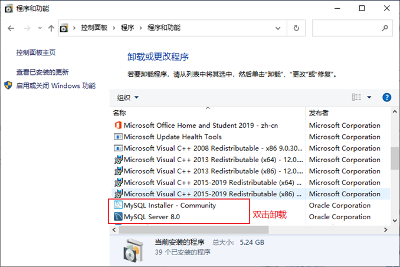

**方式2：通过360或电脑管家等软件卸载**

略

**方式3：通过安装包提供的卸载功能卸载**

你也可以通过安装向导程序进行MySQL8.0服务器程序的卸载。

1. 再次双击下载的mysql-installer-community-8.0.26.0.msi文件，打开安装向导。安装向导会自动检测已安装的MySQL服务器程序。
   
2. 选择要卸载的MySQL服务器程序，单击“Remove”（移除），即可进行卸载。

   

3. 单击“Next”（下一步）按钮，确认卸载。

   

4.  弹出是否同时移除数据目录选择窗口。如果想要同时删除MySQL服务器中的数据，则勾选“Remove the data directory”，如图所示。
   
   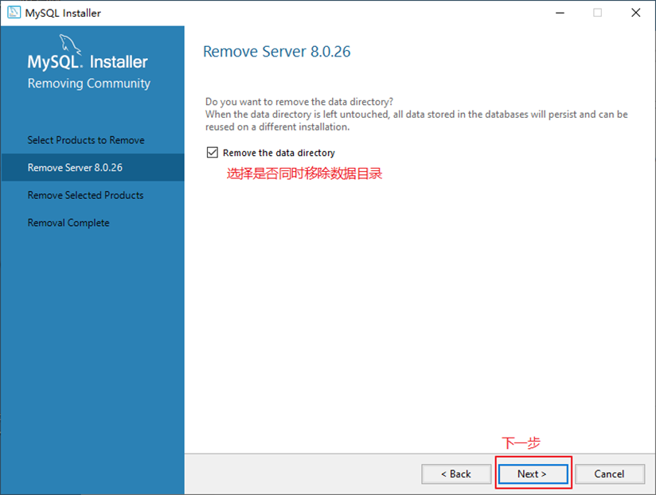
   
5. 执行卸载。单击“Execute”（执行）按钮进行卸载。

   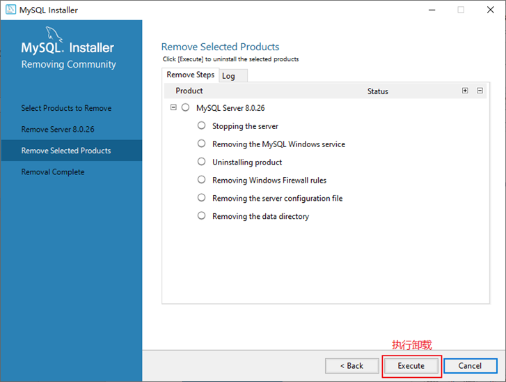

6. 完成卸载。单击“Finish”（完成）按钮即可。如果想要同时卸载MySQL8.0的安装向导程序，勾选“Yes，Uninstall MySQL Installer”即可，如图所示。
   
   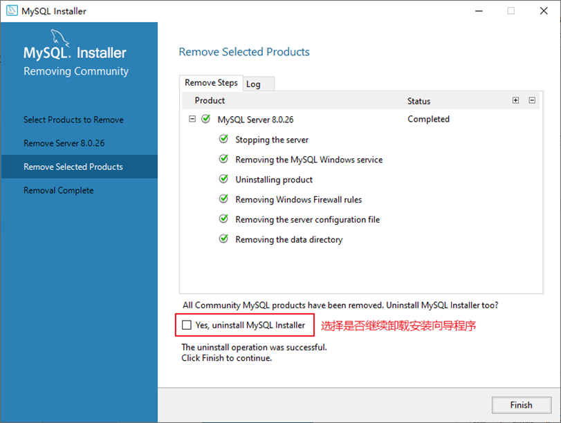


#### 步骤3：残余文件的清理

如果再次安装不成功，可以卸载后对残余文件进行清理后再安装。

1. 服务目录：mysql服务的安装目录
2. 数据目录：默认在C:\ProgramData\MySQL

如果自己单独指定过数据目录，就找到自己的数据目录进行删除即可。

> 注意：请在卸载前做好数据备份
>
> 在操作完以后，需要重启计算机，然后进行安装即可。**如果仍然安装失败，需要继续操作如下步骤4。**


#### 步骤4：清理注册表（选做）

如果前几步做了，再次安装还是失败，那么可以清理注册表。

如何打开注册表编辑器：在系统的搜索框中输入regedit`

```
HKEY_LOCAL_MACHINE\SYSTEM\ControlSet001\Services\Eventlog\Application\MySQL服务 目录删除
HKEY_LOCAL_MACHINE\SYSTEM\ControlSet001\Services\MySQL服务 目录删除
HKEY_LOCAL_MACHINE\SYSTEM\ControlSet002\Services\Eventlog\Application\MySQL服务 目录删除
HKEY_LOCAL_MACHINE\SYSTEM\ControlSet002\Services\MySQL服务 目录删除
HKEY_LOCAL_MACHINE\SYSTEM\CurrentControlSet\Services\Eventlog\Application\MySQL服务 目录删除
HKEY_LOCAL_MACHINE\SYSTEM\CurrentControlSet\Services\MySQL服务删除
```

注册表中的ControlSet001，ControlSet002，不一定是001和002，可能是ControlSet005、006之类


#### 步骤5：删除环境变量配置

找到path环境变量，将其中关于mysql的环境变量删除，**切记不要全部删除**。

例如：删除 D:\develop_tools\mysql\MySQLServer8.0.26\bin; 这个部分


### 2.MySQL的下载、安装、配置

#### 2.1 MySQL的4大版本

- `MySQL Community Server 社区版本`，开源免费，自由下载，但不提供官方技术支持，适用于大多数普通用户。
- `MySQL Enterprise Edition 企业版本`，需付费，不能在线下载，可以试用30天。提供了更多的功能和更完备的技术支持，更适合于对数据库的功能和可靠性要求较高的企业客户。
- `MySQL Cluster 集群版`，开源免费。用于架设集群服务器，可将几个MySQL Server封装成一个Server。需要在社区版或企业版的基础上使用。
- `MySQL Cluster CGE 高级集群版`，需付费。

目前最新版本为 8.0.27 ，发布时间 2021年10月 。此前，8.0.0 在 2016.9.12日就发布了。

本课程中使用 8.0.26版本 。

此外，官方还提供了`MySQL Workbench`（GUITOOL）一款专为MySQL设计的`图形界面管理工具`。MySQLWorkbench又分为两个版本，分别是`社区版`（MySQL Workbench OSS）、`商用版`（MySQL WorkbenchSE）。


#### 2.2 软件的下载

1. **下载地址**

   官网：https://www.mysql.com

2. **打开官网，点击DOWNLOADS**

   然后，点击 MySQL Community(GPL) Downloads

   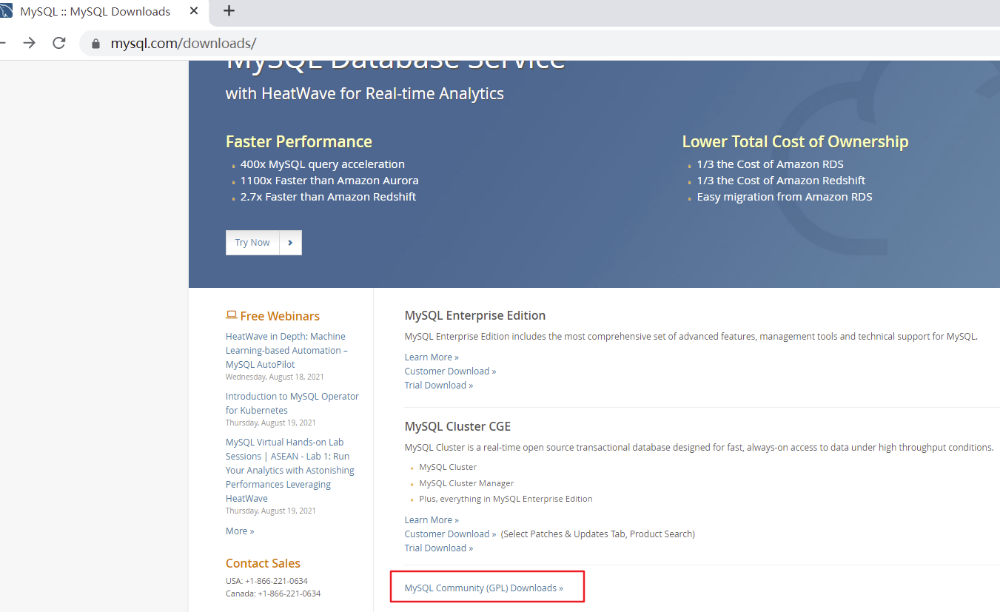

3.  **点击 MySQL Community Server**

   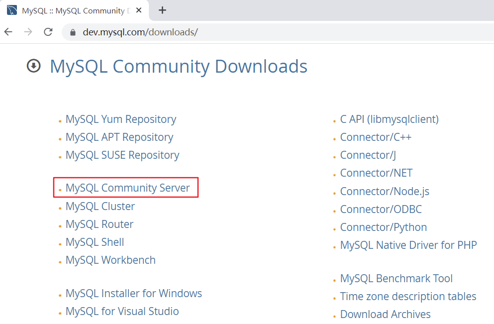

4. **在General Availability(GA) Releases中选择适合的版本**

   Windows平台下提供两种安装文件：MySQL二进制分发版（.msi安装文件）和免安装版（.zip压缩文件）。一般来讲，应当使用二进制分发版，因为该版本提供了图形化的安装向导过程，比其他的分发版使用起来要简单，不再需要其他工具启动就可以运行MySQL。
   
   - 这里在Windows 系统下推荐下载 MSI安装程序 ；点击 Go to Download Page 进行下载即可

     

     

   - Windows下的MySQL8.0安装有两种安装程序

     - **mysql-installer-web-community-8.0.26.0.msi** 下载程序大小：2.4M；安装时需要联网安装组件。
     - **mysql-installer-community-8.0.26.0.msi** 下载程序大小：450.7M；安装时离线安装即可。推荐。
     
   - 如果安装MySQL5.7版本的话，选择 Archives ，接着选择MySQL5.7的相应版本即可。这里下载最近期的MySQL5.7.34版本。
     
     
     
     

#### 2.3 MySQL8.0 版本的安装

MySQL下载完成后，找到下载文件，双击进行安装，具体操作步骤如下。

步骤1：双击下载的mysql-installer-community-8.0.26.0.msi文件，打开安装向导。

步骤2：打开“Choosing a Setup Type”（选择安装类型）窗口，在其中列出了5种安装类型，分别是Developer Default（默认安装类型）、Server only（仅作为服务器）、Client only（仅作为客户端）、Full（完全安装）、Custom（自定义安装）。这里选择“Custom（自定义安装）”类型按钮，单击“Next(下一步)”按钮。


步骤3：打开“Select Products” （选择产品）窗口，可以定制需要安装的产品清单。例如，选择“MySQL Server 8.0.26-X64”后，单击“→”添加按钮，即可选择安装MySQL服务器，如图所示。采用通用的方法，可以添加其他你需要安装的产品。


此时如果直接“Next”（下一步），则产品的安装路径是默认的。如果想要自定义安装目录，则可以选中对应的产品，然后在下面会出现“Advanced Options”（高级选项）的超链接。

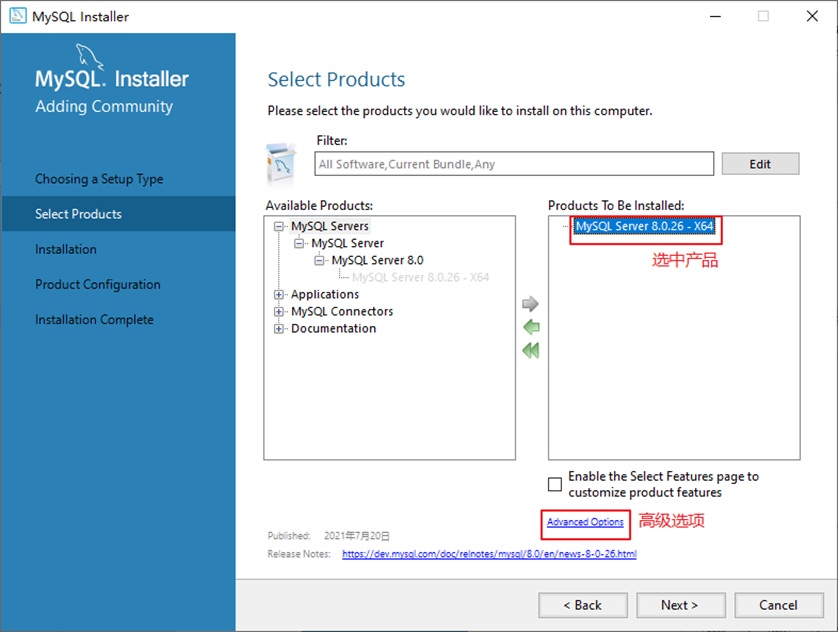

单击“Advanced Options”（高级选项）则会弹出安装目录的选择窗口，如图所示，此时你可以分别设置MySQL的服务程序安装目录和数据存储目录。如果不设置，默认分别在C盘的Program Files目录和ProgramData目录（这是一个隐藏目录）。如果自定义安装目录，请避免“中文”目录。另外，建议服务目录和数据目录分开存放。

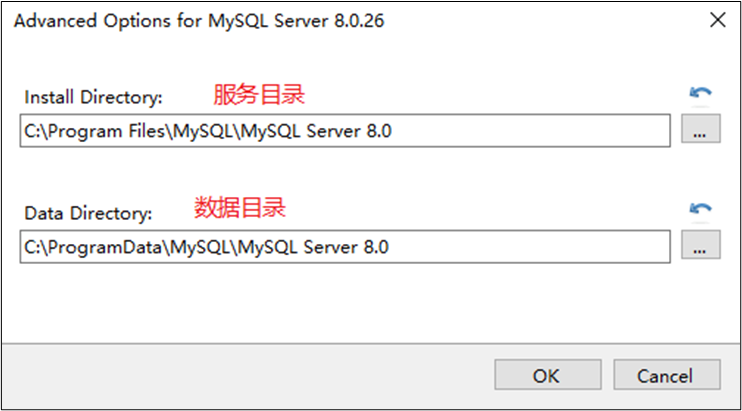

步骤4：在上一步选择好要安装的产品之后，单击“Next”（下一步）进入确认窗口，如图所示。单击“Execute”（执行）按钮开始安装。


步骤5：安装完成后在“Status”（状态）列表下将显示“Complete”（安装完成），如图所示。


#### 2.4 配置MySQL8.0

MySQL安装之后，需要对服务器进行配置。具体的配置步骤如下。

步骤1：在上一个小节的最后一步，单击“Next”（下一步）按钮，就可以进入产品配置窗口。

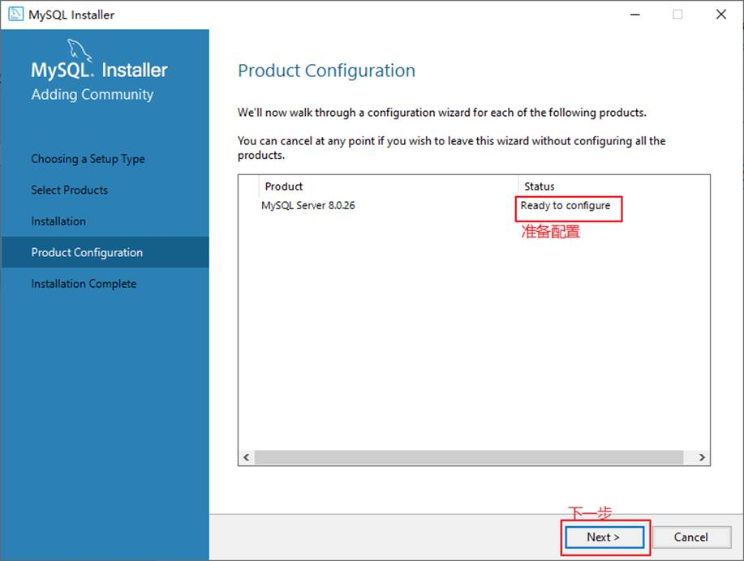

步骤2：单击“Next”（下一步）按钮，进入MySQL服务器类型配置窗口，如图所示。端口号一般选择默认端口号3306。


其中，“Config Type”选项用于设置服务器的类型。单击该选项右侧的下三角按钮，即可查看3个选项，如图所示。

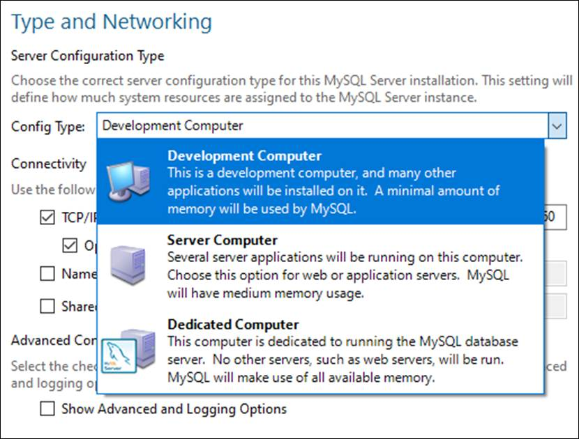

- **Development Machine（开发机器）**：该选项代表典型个人用桌面工作站。此时机器上需要运行多个应用程序，那么MySQL服务器将占用最少的系统资源。
- **Server Machine（服务器）**：该选项代表服务器，MySQL服务器可以同其他服务器应用程序一起运行，例如Web服务器等。MySQL服务器配置成适当比例的系统资源。
- **Dedicated Machine（专用服务器）**：该选项代表只运行MySQL服务的服务器。MySQL服务器配置成使用所有可用系统资源。

步骤3：单击“Next”（下一步）按钮，打开设置授权方式窗口。其中，上面的选项是MySQL8.0提供的新的授权方式，采用SHA256基础的密码加密方法；下面的选项是传统授权方法（保留5.x版本兼容性）。

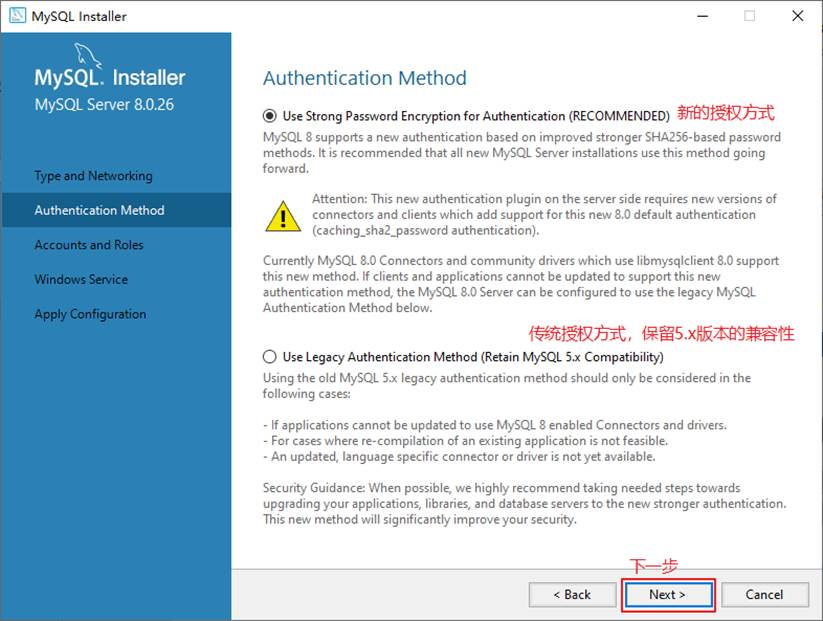

步骤4：单击“Next”（下一步）按钮，打开设置服务器root超级管理员的密码窗口，如图所示，需要输入两次同样的登录密码。也可以通过“Add User”添加其他用户，添加其他用户时，需要指定用户名、允许该用户名在哪台/哪些主机上登录，还可以指定用户角色等。此处暂不添加用户，用户管理在MySQL高级特性篇中讲解。


步骤5：单击“Next”（下一步）按钮，打开设置服务器名称窗口，如图所示。该服务名会出现在Windows服务列表中，也可以在命令行窗口中使用该服务名进行启动和停止服务。本书将服务名设置为“MySQL80”。如果希望开机自启动服务，也可以勾选“Start the MySQL Server at System Startup”选项（推荐）。

下面是选择以什么方式运行服务？

可以选择“Standard System Account”(标准系统用户)或者“Custom User”(自定义用户)中的一个。这里推荐前者。

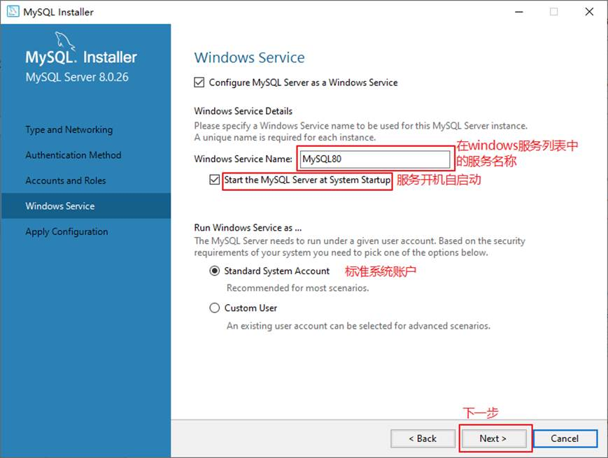

步骤6：单击“Next”（下一步）按钮，打开确认设置服务器窗口，单击“Execute”（执行）按钮。


步骤7：完成配置，如图所示。单击“Finish”（完成）按钮，即可完成服务器的配置


步骤8：如果还有其他产品需要配置，可以选择其他产品，然后继续配置。如果没有，直接选择“Next”（下一步），直接完成整个安装和配置过程。

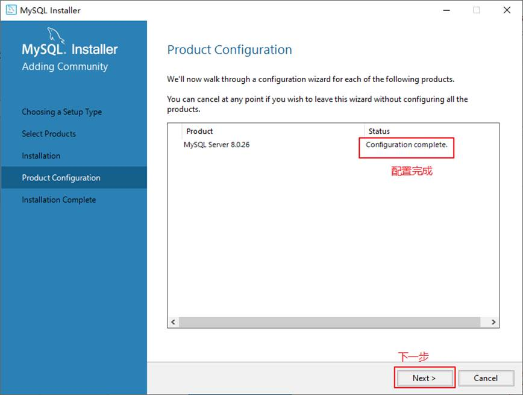

步骤9：结束安装和配置。

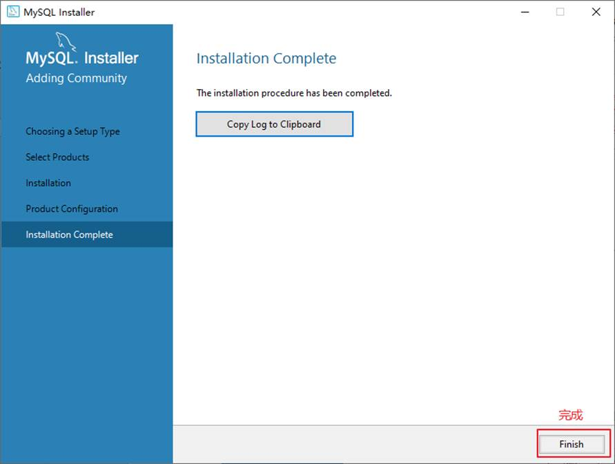


#### 2.5 配置MySQL8.0 环境变量

如果不配置MySQL环境变量，就不能在命令行直接输入MySQL登录命令。

下面说如何配置MySQL的环境
变量：

- 步骤1：在桌面上右击【此电脑】图标，在弹出的快捷菜单中选择【属性】菜单命令。 
- 步骤2：打开【系统】窗口，单击【高级系统设置】链接。
- 步骤3：打开【系统属性】对话框，选择【高级】选项卡，然后单击【环境变量】按钮。 
- 步骤4：打开【环境变量】对话框，在系统变量列表中选择path变量。 
- 步骤5：单击【编辑】按钮，在【编辑环境变量】对话框中，将MySQL应用程序的bin目录（C:\Program Files\MySQL\MySQL Server 8.0\bin）添加到变量值中，用分号将其与其他路径分隔开。 
- 步骤6：添加完成之后，单击【确定】按钮，这样就完成了配置path变量的操作，然后就可以直接输入MySQL命令来登录
  数据库了。


#### 2.6 MySQL5.7 版本的安装、配置

- 安装

  此版本的安装过程与上述过程除了版本号不同之外，其它环节都是相同的。所以这里省略了MySQL5.7.34版本的安装截图。
  
- 配置

  配置环节与MySQL8.0版本确有细微不同。大部分情况下直接选择“Next”即可，不影响整理使用。这里配置MySQL5.7时，**重点强调：与前面安装好的MySQL8.0不能使用相同的端口号。**


#### 2.7 安装失败问题

MySQL的安装和配置是一件非常简单的事，但是在操作过程中也可能出现问题，特别是初学者。

**问题1：无法打开MySQL8.0软件安装包或者安装过程中失败，如何解决？**

在运行MySQL8.0软件安装包之前，用户需要确保系统中已经安装了.Net Framework相关软件，如果缺少此软件，将不能正常地安装MySQL8.0软件。

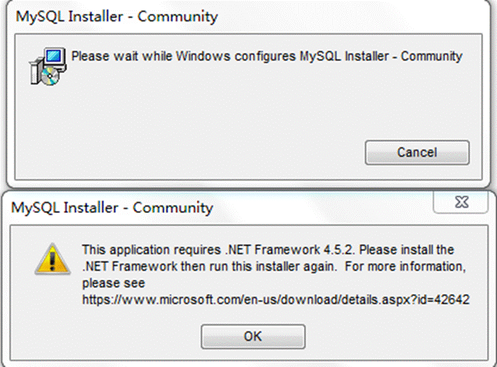

解决方案：到这个地址https://www.microsoft.com/en-us/download/details.aspx?id=42642下载Microsoft .NET Framework 4.5并安装后，再去安装MySQL。

另外，还要确保Windows Installer正常安装。windows上安装mysql8.0需要操作系统提前已安装好Microsoft Visual C++ 2015-2019。

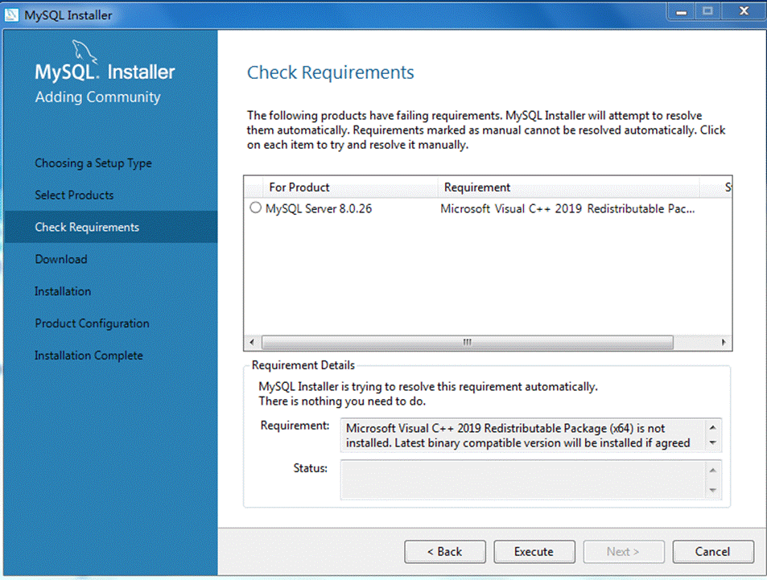

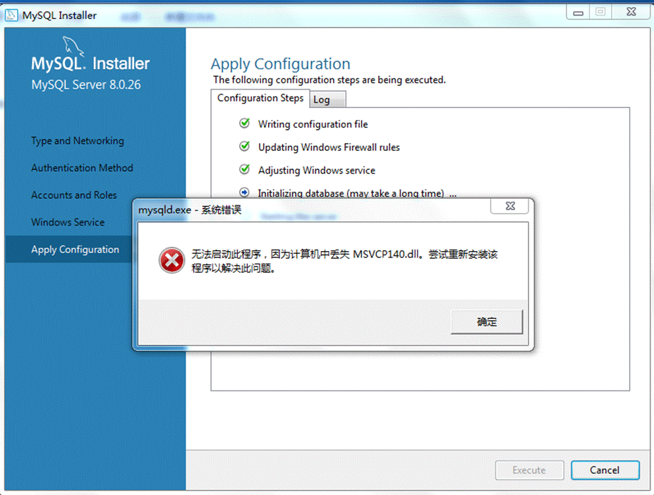


解决方案同样是，提前到微软官网

https://support.microsoft.com/en-us/topic/the-latest-supported-visual-c-downloads-2647da03-1eea-4433-9aff-95f26a218cc0，下载相应的环境。


**问题2：卸载重装MySQL失败？**

该问题通常是因为MySQL卸载时，没有完全清除相关信息导致的。

解决办法是，把以前的安装目录删除。如果之前安装并未单独指定过服务安装目录，则默认安装目录是“C:\Program Files\MySQL”，彻底删除该目录。同时删除MySQL的Data目录，如果之前安装并未单独指定过数据目录，则默认安装目录是“C:\ProgramData\MySQL”，该目录一般为隐藏目录。删除后，重新安装即可。


**问题3：如何在Windows系统删除之前的未卸载干净的MySQL服务列表？**

操作方法如下，在系统“搜索框”中输入“cmd”，按“Enter”（回车）键确认，弹出命令提示符界面。然后输入“sc delete MySQL服务名”,按“Enter”（回车）键，就能彻底删除残余的MySQL服务了。


### 3.MySQL的登录

#### 3.1 服务的启动与停止

MySQL安装完毕之后，需要启动服务器进程，不然客户端无法连接数据库。

在前面的配置过程中，已经将MySQL安装为Windows服务，并且勾选当Windows启动、停止时，MySQL也自动启动、停止。

##### 方式1：使用图形界面工具

- 步骤1：打开windows服务

  - 方式1：计算机（点击鼠标右键）→ 管理（点击）→ 服务和应用程序（点击）→ 服务（点击）
  - 方式2：控制面板（点击）→ 系统和安全（点击）→ 管理工具（点击）→ 服务（点击）
  - 方式3：任务栏（点击鼠标右键）→ 启动任务管理器（点击）→ 服务（点击）
  - 方式4：单击【开始】菜单，在搜索框中输入“services.msc”，按Enter键确认
  
- 步骤2：找到MySQL80（点击鼠标右键）→ 启动或停止（点击）

  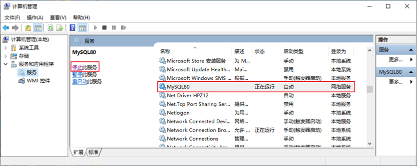


##### 方式2：使用命令行工具

```mysql
# 启动 MySQL 服务命令：
net start MySQL服务名
# 停止 MySQL 服务命令：
net stop MySQL服务名
```

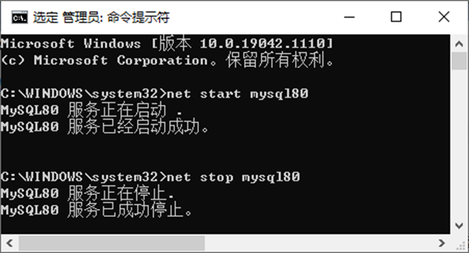

说明：

1. start和stop后面的服务名应与之前配置时指定的服务名一致。
2. 如果当你输入命令后，提示“拒绝服务”，请以`系统管理员身份`打开命令提示符界面重新尝试。


#### 3.2 自带客户端的登录与退出

当MySQL服务启动完成后，便可以通过客户端来登录MySQL数据库。注意：确认服务是开启的。

##### 登录方式1：MySQL自带客户端

开始菜单 → 所有程序 → MySQL → MySQL 8.0 Command Line Client


说明：仅限于root用户


##### 登录方式2：windows命令行

```
#格式
mysql -h 主机名 -P 端口号 -u 用户名 -p密码
```

```mysql
mysql -h localhost -P 3306 -u root -pabc123 # 这里我设置的root用户的密码是abc123
```

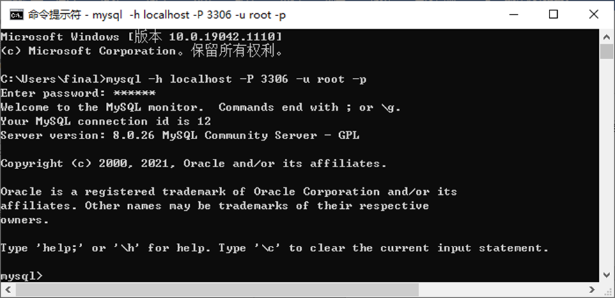

注意：

1. -p与密码之间不能有空格，其他参数名与参数值之间可以有空格也可以没有空格。如：

   ```
   mysql -hlocalhost -P3306 -uroot -pabc123
   ```

2. 密码建议在下一行输入，保证安全

   ```
   mysql -h localhost -P 3306 -u root -p
   Enter password:****
   ```

3. 客户端和服务器在同一台机器上，所以输入localhost或者IP地址127.0.0.1。同时，因为是连接本机： -hlocalhost就可以省略，如果端口号没有修改：-P3306也可以省略
   
   简写成：
   
   ```
   mysql -u root -p
   Enter password:****
   ```

连接成功后，有关于MySQL Server服务版本的信息，还有第几次连接的id标识。

也可以在命令行通过以下方式获取MySQL Server服务版本的信息：

```
c:\> mysql --version
```

或**登录**后，通过以下方式查看当前版本信息：

```
mysql> select version();
```

##### 退出登录

```
exit
或
quit
```


### 4.MySQL演示使用

#### 4.1 MySQL的使用演示

1. 查看所有的数据库

```mysql
show databases;
```

- “information_schema”是 MySQL 系统自带的数据库，主要保存 MySQL 数据库服务器的系统信息，比如数据库的名称、数据表的名称、字段名称、存取权限、数据文件所在的文件夹和系统使用的文件夹，等等
- “performance_schema”是 MySQL 系统自带的数据库，可以用来监控 MySQL 的各类性能指标。
- “sys”数据库是 MySQL 系统自带的数据库，主要作用是以一种更容易被理解的方式展示 MySQL 数据库服务器的各类性能指标，帮助系统管理员和开发人员监控 MySQL 的技术性能。
- “mysql”数据库保存了 MySQL 数据库服务器运行时需要的系统信息，比如数据文件夹、当前使用的字符集、约束检查信息，等等

为什么 Workbench 里面我们只能看到“demo”和“sys”这 2 个数据库呢？

这是因为，Workbench 是图形化的管理工具，主要面向开发人员，“demo”和“sys”这 2 个数据库已经够用了。如果有特殊需求，比如，需要监控 MySQL 数据库各项性能指标、直接操作 MySQL 数据库系统文件等，可以由 DBA 通过 SQL 语句，查看其它的系统数据库。


2. 创建自己的数据库

```mysql
create database 数据库名;

#创建atguigudb数据库，该名称不能与已经存在的数据库重名。
create database atguigudb;
```


3. 使用自己的数据库

```mysql
use 数据库名;

#使用atguigudb数据库
use atguigudb;
```

说明：如果没有使用use语句，后面针对数据库的操作也没有加“数据名”的限定，那么会报“ERROR 1046(3D000): No database selected”（没有选择数据库）

使用完use语句之后，如果接下来的SQL都是针对一个数据库操作的，那就不用重复use了，如果要针对另一个数据库操作，那么要重新use。


4. 查看某个库的所有表格

```mysql
show tables; #要求前面有use语句
show tables from 数据库名;
```


5. 创建新的表格

```mysql
create table 表名称(
字段名 数据类型,
字段名 数据类型
);
```

说明：如果不是最后一个字段，后面就用加逗号，因为逗号的作用是分割每个字段。


6. 查看一个表的数据

```mysql
select * from 数据库表名称;
#查看学生表的数据
select * from student;
```


7. 添加一条记录

```mysql
insert into 表名称 values(值列表);
#添加两条记录到student表中
insert into student values(1,'张三');
insert into student values(2,'李四');
```

报错：

```mysql
mysql> insert into student values(1,'张三');
ERROR 1366 (HY000): Incorrect string value: '\xD5\xC5\xC8\xFD' for column 'name' at row 1
mysql> insert into student values(2,'李四');
ERROR 1366 (HY000): Incorrect string value: '\xC0\xEE\xCB\xC4' for column 'name' at row 1
mysql> show create table student;
```

字符集的问题。


8. 查看表的创建信息

```mysql
show create table 表名称;
#查看student表的详细创建信息
show create table student;
```

```mysql
#结果如下
*************************** 1. row ***************************
Table: student
Create Table: CREATE TABLE `student` (
`id` int(11) DEFAULT NULL,
`name` varchar(20) DEFAULT NULL
) ENGINE=InnoDB DEFAULT CHARSET=latin1
1 row in set (0.00 sec)
```

上面的结果显示student的表格的默认字符集是“latin1”不支持中文。


9. 查看数据库的创建信息

```mysql
show create database 数据库名;
#查看atguigudb数据库的详细创建信息
show create database atguigudb;

#结果如下
*************************** 1. row ***************************
Database: atguigudb
Create Database: CREATE DATABASE `atguigudb` /*!40100 DEFAULT CHARACTER SET latin1 */
1 row in set (0.00 sec)
```

上面的结果显示atguigudb数据库也不支持中文，字符集默认是latin1。


10. 删除表格

```mysql
drop table 表名称;

#删除学生表
drop table student;
```


11. 删除数据库

```mysql
drop database 数据库名;

#删除atguigudb数据库
drop database atguigudb;
```


#### 4.2 MySQL的编码设置

##### MySQL5.7中

**问题再现：命令行操作sql乱码问题**

```mysql
mysql> INSERT INTO t_stu VALUES(1,'张三','男');
ERROR 1366 (HY000): Incorrect string value: '\xD5\xC5\xC8\xFD' for column 'sname' at row 1
```

**问题解决**

步骤1：查看编码命令

```mysql
show variables like 'character_%';
show variables like 'collation_%';
```

步骤2：修改mysql的数据目录下的my.ini配置文件

```ini
[mysql] #大概在63行左右，在其下添加
...
default-character-set=utf8 #默认字符集

[mysqld] # 大概在76行左右，在其下添加
...
character-set-server=utf8
collation-server=utf8_general_ci
```

注意：建议修改配置文件使用notepad++等高级文本编辑器，使用记事本等软件打开修改后可能会导致文件编码修改为“含BOM头”的编码，从而服务重启失败。

步骤3：重启服务

步骤4：查看编码命令

```mysql
show variables like 'character_%';
show variables like 'collation_%';
```

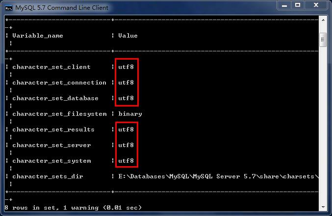

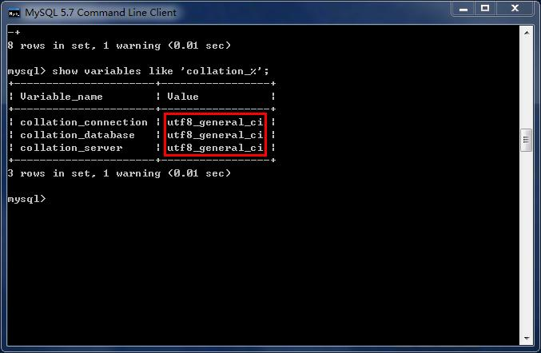

如果是以上配置就说明对了。接着我们就可以新创建数据库、新创建数据表，接着添加包含中文的数据了。


##### MySQL8.0中

在MySQL 8.0版本之前，默认字符集为latin1，utf8字符集指向的是utf8mb3。网站开发人员在数据库设计的时候往往会将编码修改为utf8字符集。如果遗忘修改默认的编码，就会出现乱码的问题。从MySQL 8.0开始，数据库的默认编码改为`utf8mb4`，从而避免了上述的乱码问题。


### 5. MySQL图形化管理工具

MySQL图形化管理工具极大地方便了数据库的操作与管理，常用的图形化管理工具有：MySQL Workbench、phpMyAdmin、Navicat Preminum、MySQLDumper、SQLyog、dbeaver、MySQL ODBC Connector。


#### 工具1. MySQL Workbench

MySQL官方提供的图形化管理工具MySQL Workbench完全支持MySQL 5.0以上的版本。MySQL Workbench分为社区版和商业版，社区版完全免费，而商业版则是按年收费。

MySQL Workbench为数据库管理员、程序开发者和系统规划师提供可视化设计、模型建立、以及数据库管理功能。它包含了用于创建复杂的数据建模ER模型，正向和逆向数据库工程，也可以用于执行通常需要花费大量时间的、难以变更和管理的文档任务。

下载地址：http://dev.mysql.com/downloads/workbench/。

使用：

首先，我们点击 Windows 左下角的“开始”按钮，如果你是 Win10 系统，可以直接看到所有程序。接着，找到“MySQL”，点开，找到“MySQL Workbench 8.0 CE”。点击打开 Workbench，如下图所示：


左下角有个本地连接，点击，录入 Root 的密码，登录本地 MySQL 数据库服务器，如下图所示：


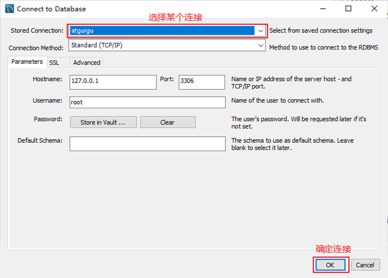

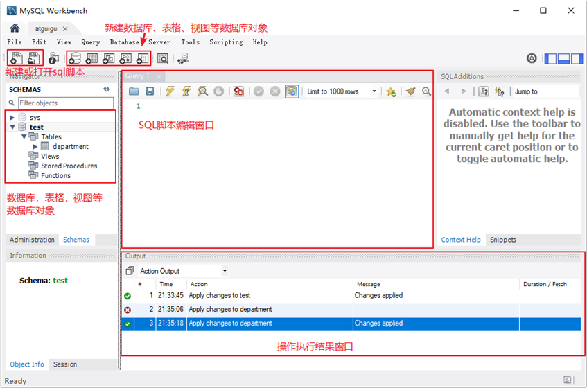

这是一个图形化的界面，我来给你介绍下这个界面。

- 上方是菜单。左上方是导航栏，这里我们可以看到 MySQL 数据库服务器里面的数据库，包括数据表、视图、存储过程和函数；左下方是信息栏，可以显示上方选中的数据库、数据表等对象的信息。
- 中间上方是工作区，你可以在这里写 SQL 语句，点击上方菜单栏左边的第三个运行按钮，就可以执行工作区的 SQL 语句了。
- 中间下方是输出区，用来显示 SQL 语句的运行情况，包括什么时间开始运行的、运行的内容、运行的输出，以及所花费的时长等信息。

好了，下面我们就用 Workbench 实际创建一个数据库，并且导入一个 Excel 数据文件， 来生成一个数据表。数据表是存储数据的载体，有了数据表以后，我们就能对数据进行操作了。


#### 工具2. Navicat

Navicat MySQL是一个强大的MySQL数据库服务器管理和开发工具。它可以与任何3.21或以上版本的MySQL一起工作，支持触发器、存储过程、函数、事件、视图、管理用户等，对于新手来说易学易用。

其精心设计的图形用户界面（GUI）可以让用户用一种安全简便的方式来快速方便地创建、组织、访问和共享信息。Navicat支持中文，有免费版本提供。

下载地址：http://www.navicat.com/


#### 工具3. SQLyog

SQLyog 是业界著名的 Webyog 公司出品的一款简洁高效、功能强大的图形化 MySQL 数据库管理工具。

这款工具是使用C++语言开发的。该工具可以方便地创建数据库、表、视图和索引等，还可以方便地进行插入、更新和删除等操作，同时可以方便地进行数据库、数据表的备份和还原。该工具不仅可以通过SQL文件进行大量文件的导入和导出，还可以导入和导出XML、HTML和CSV等多种格式的数据。

下载地址：http://www.webyog.com/，读者也可以搜索中文版的下载地址。


#### 工具4：dbeaver

DBeaver是一个通用的数据库管理工具和 SQL 客户端，支持所有流行的数据库：MySQL、PostgreSQL、SQLite、Oracle、DB2、SQL Server、Sybase、MS Access、Teradata、Firebird、Apache Hive、Phoenix、Presto等。DBeaver比大多数的SQL管理工具要轻量，而且支持中文界面。DBeaver社区版作为一个免费开源的产品，和其他类似的软件相比，在功能和易用性上都毫不逊色。

唯一需要注意是 DBeaver 是用Java编程语言开发的，所以需要拥有 JDK（Java Development ToolKit）环境。如果电脑上没有JDK，在选择安装DBeaver组件时，勾选“Include Java”即可。

下载地址：https://dbeaver.io/download/


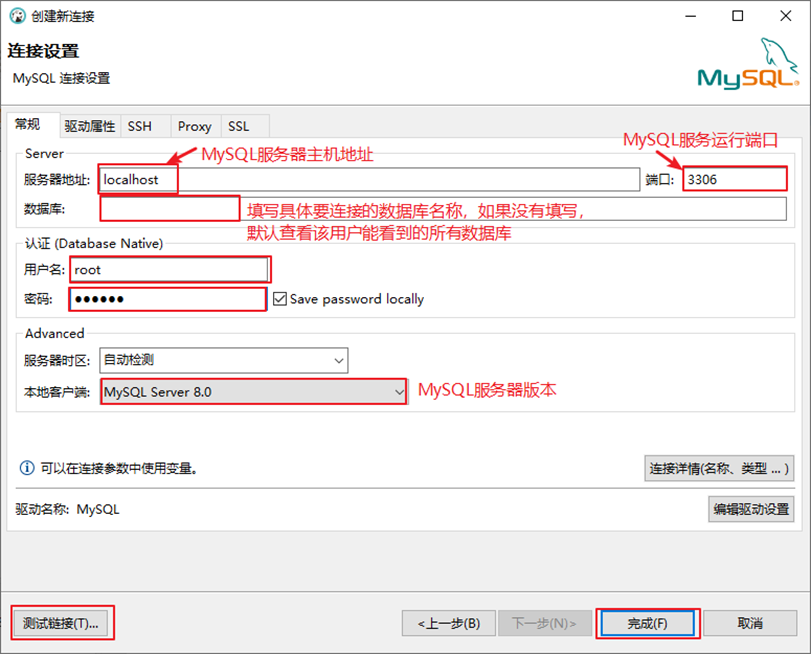


**可能出现连接问题：**

有些图形界面工具，特别是旧版本的图形界面工具，在连接MySQL8时出现“Authentication plugin 'caching_sha2_password' cannot be loaded”错误。

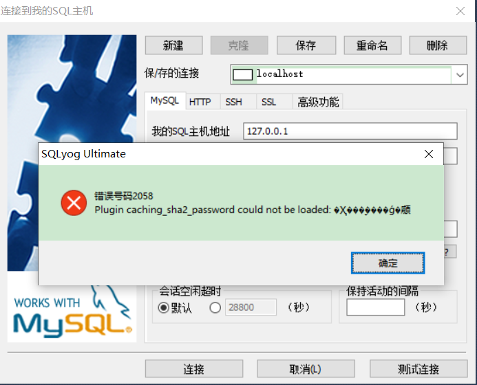

出现这个原因是MySQL8之前的版本中加密规则是mysql_native_password，而在MySQL8之后，加密规则是caching_sha2_password。

解决问题方法有两种：

第一种是升级图形界面工具版本

第二种是把MySQL8
用户登录密码加密规则还原成mysql_native_password。


第二种解决方案如下，用命令行登录MySQL数据库之后，执行如下命令修改用户密码加密规则并更新用户密码，这里修改用户名为“root@localhost”的用户密码规则为“mysql_native_password”，密码值为
“123456”，如图所示。

```mysql
#使用mysql数据库
USE mysql;
#修改'root'@'localhost'用户的密码规则和密码
ALTER USER 'root'@'localhost' IDENTIFIED WITH mysql_native_password BY '123456';
#刷新权限
FLUSH PRIVILEGES;
```


### 6. MySQL目录结构与源码

#### 6.1 主要目录结构

| MySQL的目录结构                             | 说明                                 |
| ------------------------------------------- | ------------------------------------ |
| bin目录                                     | 所有MySQL的可执行文件。如：mysql.exe |
| MySQLInstanceConfig.exe                     | 数据库的配置向导，在安装时出现的内容 |
| data目录                                    | 系统数据库所在的目录                 |
| my.ini文件                                  | MySQL的主要配置文件                  |
| c:\ProgramData\MySQL\MySQL Server 8.0\data\ | 用户创建的数据库所在的目录           |


#### 6.2 MySQL 源代码获取

首先，你要进入 MySQL下载界面。 这里你不要选择用默认的“Microsoft Windows”，而是要通过下拉栏，找到“Source Code”，在下面的操作系统版本里面，选择 Windows（Architecture Independent），然后点击下载。

接下来，把下载下来的压缩文件解压，我们就得到了 MySQL 的源代码。

MySQL 是用 C++ 开发而成的，我简单介绍一下源代码的组成。

mysql-8.0.22 目录下的各个子目录，包含了 MySQL 各部分组件的源代码：


- sql 子目录是 MySQL 核心代码；
- libmysql 子目录是客户端程序 API；
- mysql-test 子目录是测试工具；
- mysys 子目录是操作系统相关函数和辅助函数；

源代码可以用记事本打开查看，如果你有 C++ 的开发环境，也可以在开发环境中打开查看。


如上图所示，源代码并不神秘，就是普通的 C++ 代码，跟你熟悉的一样，而且有很多注释，可以帮助你理解。阅读源代码就像在跟 MySQL 的开发人员对话一样，十分有趣。


### 7. 常见问题的解决(课外内容)

#### 问题1：root用户密码忘记，重置的操作

1. 通过任务管理器或者服务管理，关掉mysqld(服务进程) 

2. 通过命令行+特殊参数开启mysqld 

   `mysqld --
   defaults-file="D:\ProgramFiles\mysql\MySQLServer5.7Data\my.ini" --skip-grant-tables`

3. 此时，mysqld服务进程已经打开。并且不需要权限检查 

4. mysql -uroot 无密码登陆服务器。另启动一个客户端进行 
   
5. 修改权限表 

   1. use mysql; 
   2. update user set authentication_string=password('新密码') where user='root' and Host='localhost'; 
   3. flush privileges; 
   
6. 通过任务管理器，关掉mysqld服务进程。 
7. 再次通过服务管理，打开mysql服务。 
8. 即可用修改后的新密码登陆。


#### 问题2：mysql命令报“不是内部或外部命令”

如果输入mysql命令报“不是内部或外部命令”，把mysql安装目录的bin目录配置到环境变量path中。如下：


#### 问题3：错误ERROR ：没有选择数据库就操作表格和数据

| ERROR 1046 (3D000): No database selected                     |
| ------------------------------------------------------------ |
| 解决方案一：就是使用“USE 数据库名;”语句，这样接下来的语句就默认针对这个数据库进行操作 |
| 解决方案二：就是所有的表对象前面都加上“数据库.”              |


#### 问题4：命令行客户端的字符集问题

```mysql
mysql> INSERT INTO t_stu VALUES(1,'张三','男');
ERROR 1366 (HY000): Incorrect string value: '\xD5\xC5\xC8\xFD' for column 'sname' at row 1
```

原因：服务器端认为你的客户端的字符集是utf-8，而实际上你的客户端的字符集是GBK。

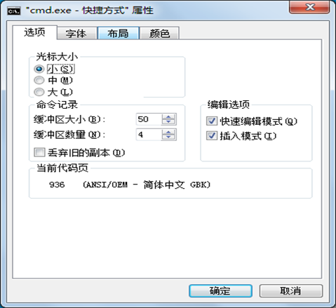

查看所有字符集：`SHOW VARIABLES LIKE 'character_set_%';`

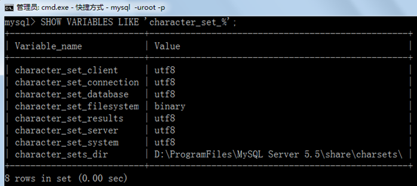

解决方案，设置当前连接的客户端字符集 “`SET NAMES GBK;`”


#### 问题5：修改数据库和表的字符编码

修改编码：

（1)先停止服务，（2）修改my.ini文件（3）重新启动服务

说明：

如果是在修改my.ini之前建的库和表，那么库和表的编码还是原来的Latin1，要么删了重建，要么使用alter语句修改编码。

```mysql
mysql> create database 0728db charset Latin1;
Query OK, 1 row affected (0.00 sec)
```

```mysql
mysql> use 0728db;
Database changed

mysql> create table student (id int , name varchar(20)) charset Latin1;
Query OK, 0 rows affected (0.02 sec)
mysql> show create table student\G
*************************** 1. row ***************************
Table: student
Create Table: CREATE TABLE `student` (
`id` int(11) NOT NULL,
`name` varchar(20) DEFAULT NULL,
PRIMARY KEY (`id`)
) ENGINE=InnoDB DEFAULT CHARSET=latin1
1 row in set (0.00 sec)
mysql> alter table student charset utf8; #修改表字符编码为UTF8
Query OK, 0 rows affected (0.01 sec)
Records: 0 Duplicates: 0 Warnings: 0
mysql> show create table student\G
*************************** 1. row ***************************
Table: student
Create Table: CREATE TABLE `student` (
`id` int(11) NOT NULL,
`name` varchar(20) CHARACTER SET latin1 DEFAULT NULL, #字段仍然是latin1编码
PRIMARY KEY (`id`)
) ENGINE=InnoDB DEFAULT CHARSET=utf8
1 row in set (0.00 sec)
mysql> alter table student modify name varchar(20) charset utf8; #修改字段字符编码为UTF8
Query OK, 0 rows affected (0.05 sec)
Records: 0 Duplicates: 0 Warnings: 0
mysql> show create table student\G
*************************** 1. row ***************************
Table: student
Create Table: CREATE TABLE `student` (
`id` int(11) NOT NULL,
`name` varchar(20) DEFAULT NULL,
PRIMARY KEY (`id`)
) ENGINE=InnoDB DEFAULT CHARSET=utf8
1 row in set (0.00 sec)
mysql> show create database 0728db;;
+--------+-----------------------------------------------------------------+
|Database| Create Database |
+------+-------------------------------------------------------------------+
|0728db| CREATE DATABASE `0728db` /*!40100 DEFAULT CHARACTER SET latin1 */ |
+------+-------------------------------------------------------------------+
1 row in set (0.00 sec)
mysql> alter database 0728db charset utf8; #修改数据库的字符编码为utf8
Query OK, 1 row affected (0.00 sec)mysql> show create database 0728db;
+--------+-----------------------------------------------------------------+
|Database| Create Database |
+--------+-----------------------------------------------------------------+
| 0728db | CREATE DATABASE `0728db` /*!40100 DEFAULT CHARACTER SET utf8 */ |
+--------+-----------------------------------------------------------------+
1 row in set (0.00 sec)
```

------

## 二、Linux环境

### 1 安装前说明

#### 1.1 Linux系统及工具的准备

- 安装并启动好两台虚拟机：`CentOS 7`

  - 掌握克隆虚拟机的操作

    - mac地址
    - 主机名
    - ip地址
    - UUID

  - 安装有`Xshell`和`Xftp`等访问CentOS系统的工具

  - CentOS6和CentOS7在MySQL的使用中的区别

    ```
    1. 防火墙：6是 iptables，7是 firewalld
    
    2. 启动服务的命令：6是 service，7是 systemctl
    ```


#### 1.2 查看是否安装过MySQL

- 如果你是用rpm安装, 检查一下RPM PACKAGE：

  ```SQL
  # -i 忽略大小写
  rpm -qa | grep -i mysql
  ```

- 检查mysql service：

  ```
  systemctl status mysqld.service
  ```

- 如果存在mysql-libs的旧版本包，显示如下：

  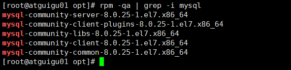

- 如果不存在mysql-lib的版本，显示如下：

  


#### 1.3 MySQL的卸载

**1. 关闭 mysql 服务**

```
systemctl stop mysqld.service
```

**2. 查看当前 mysql 安装状况**

```
rpm -qa | grep -i mysql
或者
yum list installed | grep mysql
```

**3. 卸载上述命令查询出的已安装程序**

```
yum remove mysql-xxx mysql-xxx mysql-xxx mysqk-xxxx
```

务必卸载干净，反复执行`rpm -qa | grep -i mysql`确认是否有卸载残留

**4. 删除 mysql 相关文件**

- 查找相关文件

```
find / -name mysql
```

- 删除上述命令查找出的相关文件

```
rm -rf xxx
```

**5.删除 my.cnf**

```
rm -rf /etc/my.cnf
```


### 2 MySQL的Linux版安装

#### 2.1 MySQL的4大版本

> - **MySQL Community Server 社区版本**，开源免费，自由下载，但不提供官方技术支持，适用于大多数普通用户。
> - **MySQL Enterprise Edition 企业版本**，需付费，不能在线下载，可以试用30天。提供了更多的功能和更完备的技术支持，更适合于对数据库的功能和可靠性要求较高的企业客户。
> - **MySQL Cluster 集群版**，开源免费。用于架设集群服务器，可将几个MySQL Server封装成一个Server。需要在社区版或企业版的基础上使用。
> - **MySQL Cluster CGE 高级集群版**，需付费。

- 截止目前，官方最新版本为 8.0.29。此前，8.0.0 在 2016.9.12日就发布了。
- 本课程中主要使用`8.0.25`版本。同时为了更好的说明MySQL8.0新特性，还会安装`MySQL5.7`版本，作为对比。

此外，官方还提供了`MySQL Workbench`（GUITOOL）一款专为MySQL设计的`ER/数据库建模工具`。它是著名的数据库设计工具DBDesigner4的继任者。MySQLWorkbench又分为两个版本，分别是`社区版`（MySQL Workbench OSS）、`商用版`（MySQL WorkbenchSE）。


#### 2.2 下载MySQL指定版本

**1 下载地址**

官网：https://www.mysql.com

**2 打开官网，点击DOWNLOADS**

然后，点击`MySQL Community(GPL) Downloads`

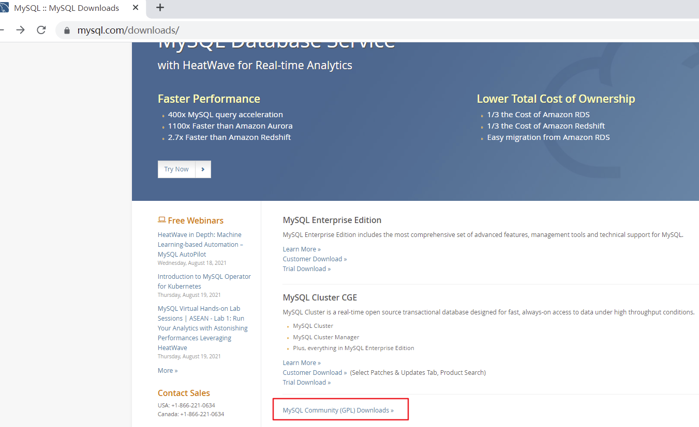

**3 点击 MySQL Community Server**

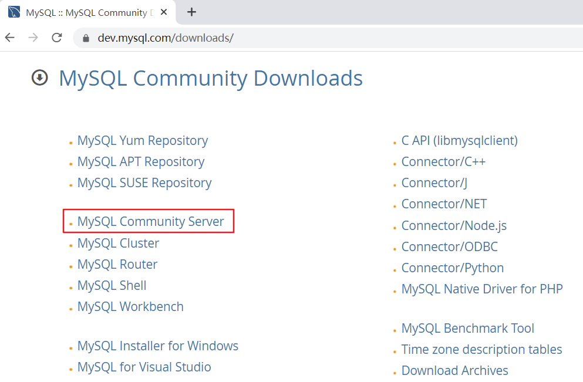

**4 在General Availability(GA) Releases中选择适合的版本**

- 如果安装Windows系统下MySQL，推荐下载`MSI安装程序`；点击`Go to Download Page`进行下载即可

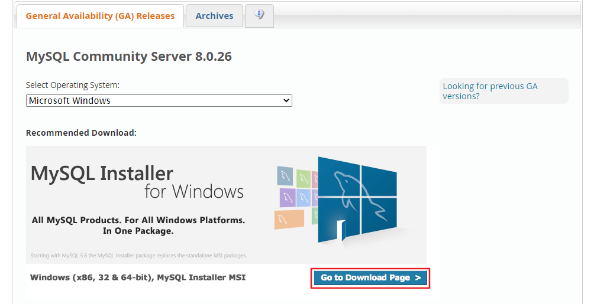

- Windows下的MySQL安装有两种安装程序
  - mysql-installer-web-community-8.0.25.0.msi 下载程序大小：2.4M；安装时需要联网安装组件。
  - mysql-installer-community-8.0.25.0.msi 下载程序大小：435.7M；安装时离线安装即可。推荐。


**5 Linux系统下安装MySQL的几种方式**

5.1 Linux系统下安装软件的常用三种方式：

1. rpm命令

   使用rpm命令安装扩展名为".rpm"的软件包。

   .rpm包的一般格式：

   

2. yum命令

   需联网，从`互联网获取`的yum源，直接使用yum命令安装。

3. 编译安装源码包

   针对`tar.gz`这样的压缩格式，要用tar命令来解压；如果是其它压缩格式，就使用其它命令。

   

5.2 Linux系统下安装MySQL，官方给出多种安装方式

| 安装方式       | 特点                                                 |
| -------------- | ---------------------------------------------------- |
| rpm            | 安装简单，灵活性差，无法灵活选择版本、升级           |
| rpm repository | 安装包极小，版本安装简单灵活，升级方便，需要联网安装 |
| 通用二进制包   | 安装比较复杂，灵活性高，平台通用性好                 |
| 源码包         | 安装最复杂，时间长，参数设置灵活，性能好             |

- 这里不能直接选择CentOS 7系统的版本，所以选择与之对应的`Red Hat Enterprise Linux`
- https://downloads.mysql.com/archives/community/ 直接点Download下载RPM Bundle全量包。包括了所有下面的组件。不需要一个一个下载了。

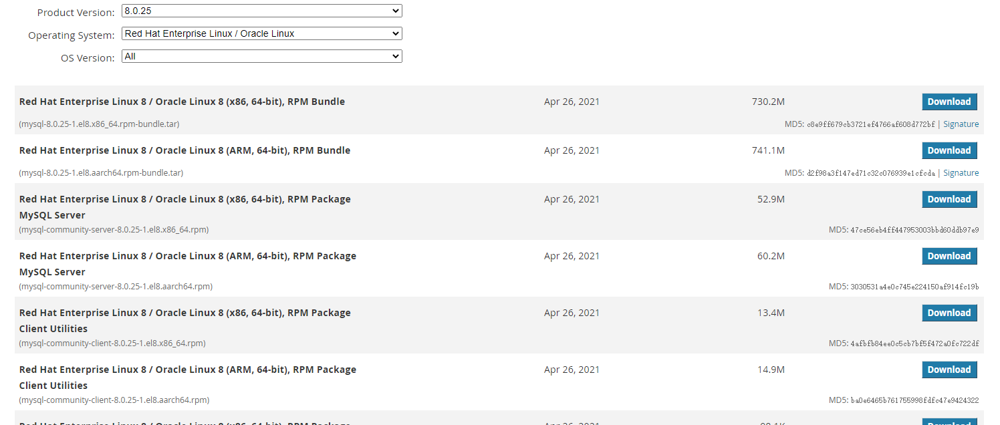

**6. 下载的tar包，用压缩工具打开**

- 解压后rpm安装包 （红框为抽取出来的安装包）

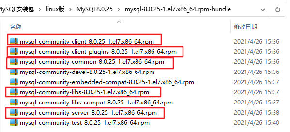


#### 2.3 CentOS7下检查MySQL依赖

1. 检查/tmp临时目录权限（必不可少）

由于mysql安装过程中，会通过mysql用户在/tmp目录下新建tmp_db文件，所以请给/tmp较大的权限。执行：

```
chmod -R 777 /tmp
```

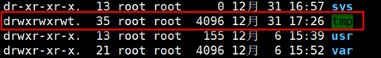

2. 安装前，检查依赖

```
rpm -qa|grep libaio
```

如果存在libaio包如下：


```
rpm -qa|grep net-tools
```

如果存在net-tools包如下：


如果不存在需要到centos安装盘里进行rpm安装。安装linux如果带图形化界面，这些都是安装好的。


#### 2.4 CentOS7下MySQL安装过程

1. **将安装程序拷贝到/opt目录下**

在mysql的安装文件目录下执行：（必须按照顺序执行）

```
rpm -ivh mysql-community-common-8.0.25-1.el7.x86_64.rpm

rpm -ivh mysql-community-client-plugins-8.0.25-1.el7.x86_64.rpm

rpm -ivh mysql-community-libs-8.0.25-1.el7.x86_64.rpm

rpm -ivh mysql-community-client-8.0.25-1.el7.x86_64.rpm

rpm -ivh mysql-community-server-8.0.25-1.el7.x86_64.rpm
```

- 注意: 如在检查工作时，没有检查mysql依赖环境在安装mysql-community-server会报错
- `rpm`是Redhat Package Manage缩写，通过RPM的管理，用户可以把源代码包装成以rpm为扩展名的文件形式，易于安装。
- `-i`, --install 安装软件包
- `-v`, --verbose 提供更多的详细信息输出
- `-h`, --hash 软件包安装的时候列出哈希标记 (和 -v 一起使用效果更好)，展示进度条

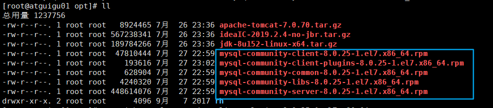

2. **安装过程截图**

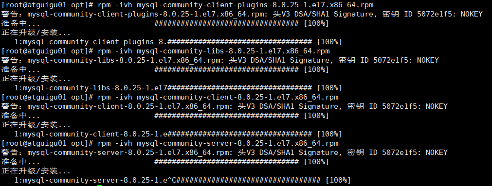

安装过程中可能的报错信息：

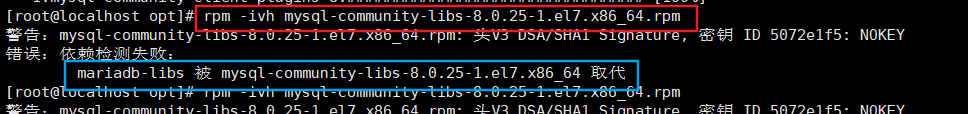

> 一个命令：**yum remove mysql-libs** 解决，清除之前安装过的依赖即可


3. **查看MySQL版本**

执行如下命令，如果成功表示安装mysql成功。类似java -version如果打出版本等信息

```
mysql --version
#或
mysqladmin --version
```

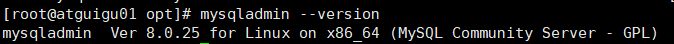

执行如下命令，查看是否安装成功。需要增加 -i 不用去区分大小写，否则搜索不到。

```
rpm -qa|grep -i mysql
```

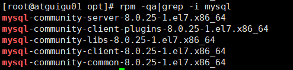

4. **服务的初始化**

为了保证数据库目录与文件的所有者为 mysql 登录用户，如果你是以 root 身份运行 mysql 服务，需要执行下面的命令初始化：

```
mysqld --initialize --user=mysql
```

说明： --initialize 选项默认以“安全”模式来初始化，则会为 root 用户生成一个密码并将`该密码标记为过期`，登录后你需要设置一个新的密码。生成的`临时密码`会往日志中记录一份。

查看密码：

```
cat /var/log/mysqld.log
```

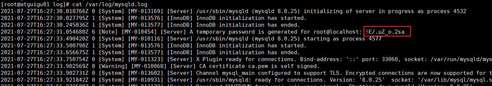

root@localhost: 后面就是初始化的密码

5. **启动MySQL，查看状态**

```
#加不加.service后缀都可以

启动：systemctl start mysqld.service

关闭：systemctl stop mysqld.service

重启：systemctl restart mysqld.service

查看状态：systemctl status mysqld.service
```

> `mysqld`这个可执行文件就代表着`MySQL`服务器程序，运行这个可执行文件就可以直接启动一个服务器进程。

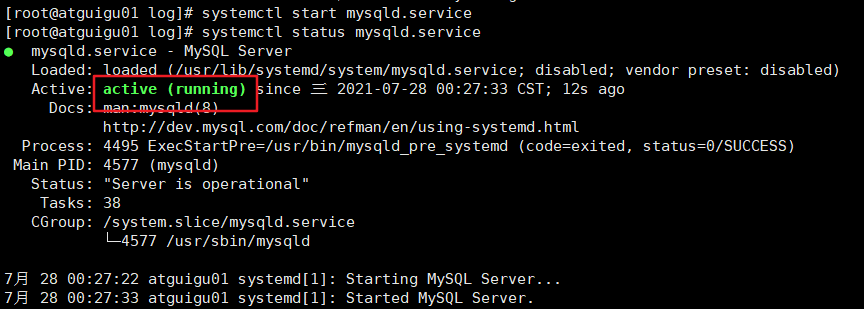

查看进程：

```
ps -ef | grep -i mysql
```

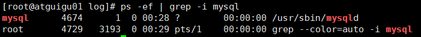

6. **查看MySQL服务是否自启动**

```
systemctl list-unit-files|grep mysqld.service
```


默认是enabled。

- 如不是enabled可以运行如下命令设置自启动

  ```
  systemctl enable mysqld.service
  ```

  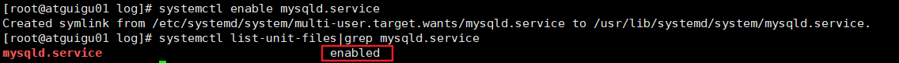

- 如果希望不进行自启动，运行如下命令设置

  ```
  systemctl disable mysqld.service
  ```

  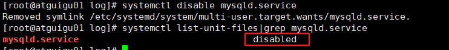

### 3 MySQL登录

#### 3.1 首次登录

通过`mysql -hlocalhost -P3306 -uroot -p`进行登录，在Enter password：录入初始化密码

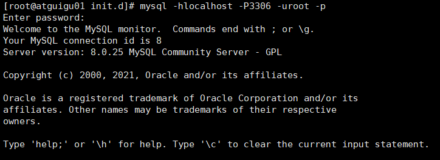

#### 3.2 修改密码

- 因为初始化密码默认是过期的，所以查看数据库会报错

- 修改密码：

  ```mysql
  ALTER USER 'root'@'localhost' IDENTIFIED BY 'new_password';
  ```

- 5.7版本之后（不含5.7），mysql加入了全新的密码安全机制。设置新密码太简单会报错。

  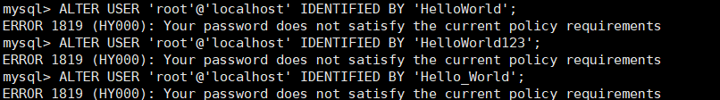

- 改为更复杂的密码规则之后，设置成功，可以正常使用数据库了

  

#### 3.3 设置远程登录

1. **当前问题**

在用SQLyog或Navicat中配置远程连接Mysql数据库时遇到如下报错信息，这是由于Mysql配置了不支持远程连接引起的。

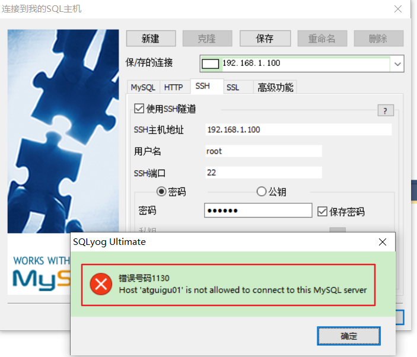

2. **确认网络**

1. 在远程机器上使用ping ip地址 `保证网络畅通`
2. 在远程机器上使用telnet命令 `保证端口号开放` 访问

```
telnet ip地址 端口号
```

拓展：`telnet命令开启`:


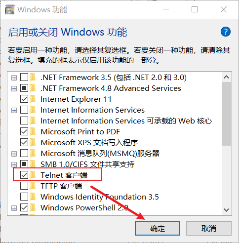

3. **关闭防火墙或开放端口**

方式一：关闭防火墙

- CentOS6：

  ```
  service iptables stop
  ```

- CentOS7：

  ```
  systemctl start firewalld.service
  
  systemctl status firewalld.service
  
  systemctl stop firewalld.service
  
  #设置开机启用防火墙
  systemctl enable firewalld.service
  
  #设置开机禁用防火墙
  systemctl disable firewalld.service
  ```

方式二：开放端口

- 查看开放的端口号

  ```
  firewall-cmd --list-all
  ```

- 设置开放的端口号

  ```
  firewall-cmd --add-service=http --permanent
  
  firewall-cmd --add-port=3306/tcp --permanent
  ```

- 重启防火墙

  ```
  firewall-cmd --reload
  ```


4. **Linux下修改配置**

在Linux系统MySQL下测试：

```mysql
use mysql;
select Host,User from user;
```

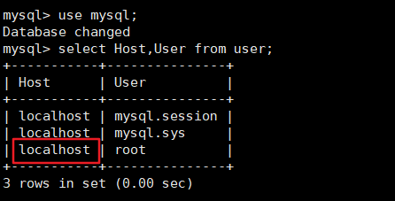

可以看到root用户的当前主机配置信息为localhost。

- **修改Host为通配符%**

Host列指定了允许用户登录所使用的IP，比如user=root Host=192.168.1.1。这里的意思就是说root用户只能通过192.168.1.1的客户端去访问。user=root Host=localhost，表示只能通过本机客户端去访问。而 %
是个`通配符`，如果Host=192.168.1.%，那么就表示只要是IP地址前缀为“192.168.1.”的客户端都可以连接。如果`Host=%`，表示所有IP都有连接权限。

注意：在生产环境下不能为了省事将host设置为%，这样做会存在安全问题，具体的设置可以根据生产环境的IP进行设置。

```
update user set host = '%' where user ='root';
```

Host设置了“%”后便可以允许远程访问。

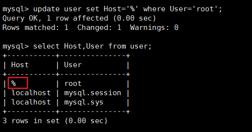

Host修改完成后记得执行flush privileges使配置立即生效：

```mysql
flush privileges;
```


5. **测试**

- 如果是 MySQL5.7 版本，接下来就可以使用SQLyog或者Navicat成功连接至MySQL了。
- 如果是 MySQL8 版本，连接时还会出现如下问题：

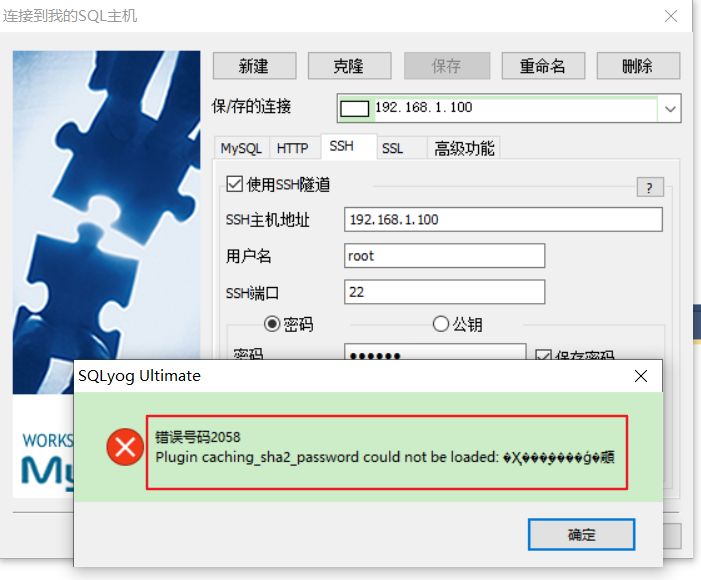

配置新连接报错：错误号码 2058，分析是 mysql 密码加密方法变了。

**解决方法**：Linux下`mysql -u root -p`登录你的 mysql 数据库，然后 执行这条SQL：

```mysql
ALTER USER 'root'@'%' IDENTIFIED WITH mysql_native_password BY 'abc123';
```

然后在重新配置SQLyog的连接，则可连接成功了，OK。


### 4 MySQL8的密码强度评估（了解）

#### 4.1 MySQL不同版本设置密码(可能出现)

- MySQL5.7中：成功

  ```mysql
  mysql> alter user 'root' identified by 'abcd1234';
  Query OK, 0 rows affected (0.00 sec)
  ```

- MySQL8.0中：失败

  ```mysql
  mysql> alter user 'root' identified by 'abcd1234'; # HelloWorld_123
  ERROR 1819 (HY000): Your password does not satisfy the current policy requirements
  ```


#### 4.2 MySQL8之前的安全策略

在MySQL 8.0之前，MySQL使用的是validate_password插件检测、验证账号密码强度，保障账号的安全性。

**安装/启用插件方式1：在参数文件my.cnf中添加参数**

```
[mysqld]

plugin-load-add=validate_password.so

\#ON/OFF/FORCE/FORCE_PLUS_PERMANENT: 是否使用该插件(及强制/永久强制使用)

validate-password=FORCE_PLUS_PERMANENT
```

> 说明1：plugin library中的validate_password文件名的后缀名根据平台不同有所差异。对于Unix和Unix-like系统而言，它的文件后缀名是.so，对于Windows系统而言，它的文件后缀名是.dll。
>
> 说明2：修改参数后必须重启MySQL服务才能生效。
>
> 说明3：参数FORCE_PLUS_PERMANENT是为了防止插件在MySQL运行时的时候被卸载。当你卸载插件时就会报错。如下所示。

```mysql
mysql> SELECT PLUGIN_NAME, PLUGIN_LIBRARY, PLUGIN_STATUS, LOAD_OPTION
       -> FROM INFORMATION_SCHEMA.PLUGINS
       -> WHERE PLUGIN_NAME = 'validate_password';
+------------------------+----------------------------+-----------------------+--------------------------------------+
| PLUGIN_NAME     | PLUGIN_LIBRARY     | PLUGIN_STATUS | LOAD_OPTION                      |
+------------------------+----------------------------+-----------------------+--------------------------------------+
| validate_password | validate_password.so | ACTIVE               | FORCE_PLUS_PERMANENT |
+------------------------+-----------------------------+----------------------+--------------------------------------+
1 row in set (0.00 sec)

mysql> UNINSTALL PLUGIN validate_password;
ERROR 1702 (HY000): Plugin 'validate_password' is force_plus_permanent and can not be unloaded
```

**安装/启用插件方式2：运行时命令安装（推荐）**

```mysql
mysql> INSTALL PLUGIN validate_password SONAME 'validate_password.so';
Query OK, 0 rows affected, 1 warning (0.11 sec)
```

此方法也会注册到元数据，也就是mysql.plugin表中，所以不用担心MySQL重启后插件会失效。


#### 4.3 MySQL8的安全策略

**1. validate_password说明**

MySQL 8.0，引入了服务器组件（Components）这个特性，validate_password插件已用服务器组件重新实现。8.0.25版本的数据库中，默认自动安装validate_password组件。

`未安装插件前，执行如下两个指令`，执行效果：

```mysql
mysql> show variables like 'validate_password%';
Empty set (0.04 sec)

mysql> SELECT * FROM mysql.component;
ERROR 1146 (42S02): Table 'mysql.component' doesn't exist
```

`安装插件后，执行如下两个指令`，执行效果：

```mysql
mysql> SELECT * FROM mysql.component;
+------------------+----------------------------+----------------------------------------------+
| component_id | component_group_id | component_urn                               |
+------------------+----------------------------+----------------------------------------------+
|                  1  |                               1 | file://component_validate_password |
+------------------+----------------------------+-----------------------------------------------+
1 row in set (0.00 sec)
```

```mysql
mysql> show variables like 'validate_password%';
+-------------------------------------------------+--------------+
| Variable_name                                   | Value        |
+-------------------------------------------------+--------------+
| validate_password.check_user_name   |           ON |
| validate_password.dictionary_file         |                |
| validate_password.length                     |             8 |
| validate_password.mixed_case_count   |             1 |
| validate_password.number_count         |             1 |
| validate_password.policy                      | MEDIUM |
| validate_password.special_char_count  |            1 |
+--------------------------------------------------+------------+
7 rows in set (0.01 sec)
```

关于`validate_password`组件对应的系统变量说明：

| 选项                                 | 默认值 | 参数描述                                                     |
| ------------------------------------ | ------ | ------------------------------------------------------------ |
| validate_password_check_user_name    | ON     | 设置为ON的时候表示能将密码设置成当前用户名。                 |
| validate_password_dictionary_file    |        | 用于检查密码的字典文件的路径名，默认为空                     |
| `validate_password_length`           | 8      | 密码的最小长度，也就是说密码长度必须大于或等于8              |
| validate_password_mixed_case_count   | 1      | 如果密码策略是中等或更强的，<br/>validate_password要求密码具有的小写和大<br/>写字符的最小数量。对于给定的这个值密码<br/>必须有那么多小写字符和那么多大写字符。 |
| validate_password_number_count       | 1      | 密码必须包含的数字个数                                       |
| validate_password_policy             | MEDIUM | 密码强度检验等级，可以使用数值0、1、2<br/>或相应的符号值LOW、MEDIUM、STRONG来指定。<br />`0/LOW`：只检查长度。<br/>`1/MEDIUM`：检查长度、数字、大小写、特殊字符。<br />`2/STRONG`：检查长度、数字、大小写、特殊字符、字典文件。 |
| validate_password_special_char_count | 1      | 密码必须包含的特殊字符个数                                   |

> 提示：组件和插件的默认值可能有所不同。例如，MySQL 5.7. validate_password_check_user_name的默认值为OFF。

**2. 修改安全策略**

修改密码验证安全强度

```mysql
SET GLOBAL validate_password_policy=LOW;

SET GLOBAL validate_password_policy=MEDIUM;

SET GLOBAL validate_password_policy=STRONG;

SET GLOBAL validate_password_policy=0; # For LOW

SET GLOBAL validate_password_policy=1; # For MEDIUM

SET GLOBAL validate_password_policy=2; # For HIGH

#注意，如果是插件的话,SQL为set global validate_password_policy=LOW
```

此外，还可以修改密码中字符的长度

```mysql
set global validate_password_length=1;
```

**3. 密码强度测试**

如果你创建密码是遇到“Your password does not satisfy the current policy requirements”，可以通过函数组件去检测密码是否满足条件： 0-100。当评估在100时就是说明使用上了最基本的规则：大写+小写+特殊字符+数字组成的8位以上密码

```mysql
mysql> SELECT VALIDATE_PASSWORD_STRENGTH('medium');
+-------------------------------------------------------------+
| VALIDATE_PASSWORD_STRENGTH('medium') |
+------------------------------------------------------------+
|                                                                   25 |
+-------------------------------------------------------------+
1 row in set (0.00 sec)
```

```mysql
mysql> SELECT VALIDATE_PASSWORD_STRENGTH('K354*45jKd5');
+-------------------------------------------------------------------+
| VALIDATE_PASSWORD_STRENGTH('K354*45jKd5') |
+-------------------------------------------------------------------+
|                                                                         100 |
+-------------------------------------------------------------------+
1 row in set (0.00 sec)
```

注意：如果没有安装validate_password组件或插件的话，那么这个函数永远都返回0。 关于密码复杂度对应的密码复杂度策略。如下表格所示：

| **Password Test**                         | **Return Value** |
| ----------------------------------------- | ---------------- |
| Length < 4                                | 0                |
| Length ≥ 4 and < validate_password.length | 25               |
| Satisfies policy 1 (LOW)                  | 50               |
| Satisfies policy 2 (MEDIUM)               | 75               |
| Satisfies policy 3 (STRONG)               | 100              |


#### 4.4 卸载插件、组件(了解)

**卸载插件**

```mysql
mysql> UNINSTALL PLUGIN validate_password;
Query OK, 0 rows affected, 1 warning (0.01 sec)
```

**卸载组件**

```mysql
mysql> UNINSTALL COMPONENT 'file://component_validate_password';
Query OK, 0 rows affected (0.02 sec)
```


### 5 字符集的相关操作

#### 5.1 修改MySQL5.7字符集

1. 修改步骤

在MySQL 8.0版本之前，默认字符集为`latin1`，utf8字符集指向的是`utf8mb3`。网站开发人员在数据库设计的时候往往会将编码修改为utf8字符集。如果遗忘修改默认的编码，就会出现乱码的问题。从MySQL8.0开始，数据库的默认编码将改为`utf8mb4`，从而避免上述乱码的问题。

**操作1：查看默认使用的字符集**

```mysql
show variables like 'character%';
# 或者
show variables like '%char%';
```

- MySQL8.0中执行：

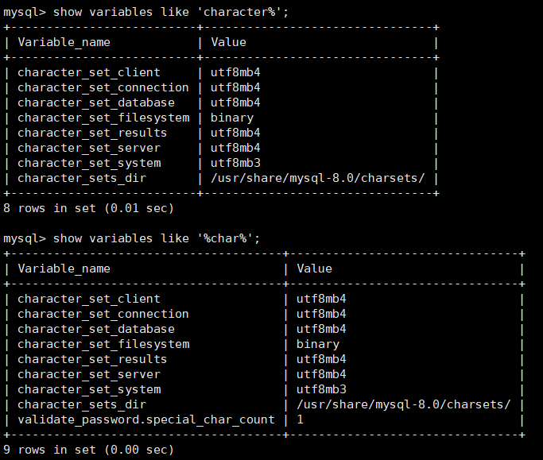

- MySQL5.7中执行：

MySQL 5.7 默认的客户端和服务器都用了`latin1`，不支持中文，保存中文会报错。MySQL5.7截图如下：

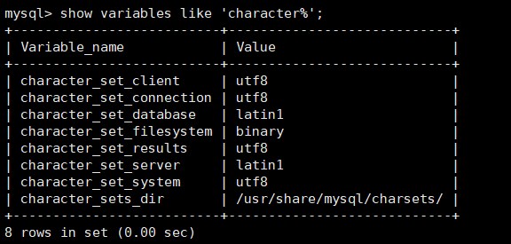

在MySQL5.7中添加中文数据时，报错：

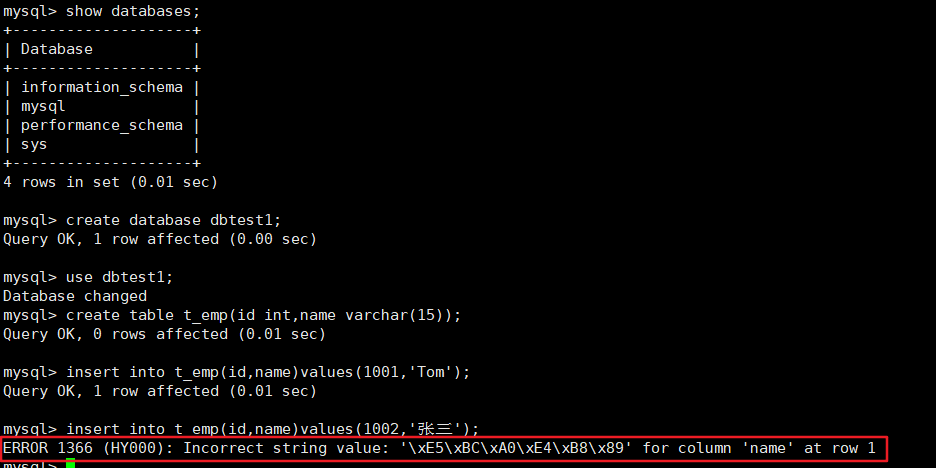

因为默认情况下，创建表使用的是`latin1`。如下：

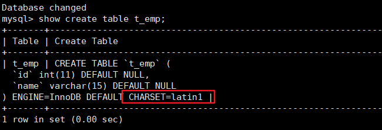

**操作2：修改字符集**

```
vi /etc/my.cnf
```

在MySQL5.7或之前的版本中，在文件最后加上中文字符集配置：

```
character_set_server=utf8
```

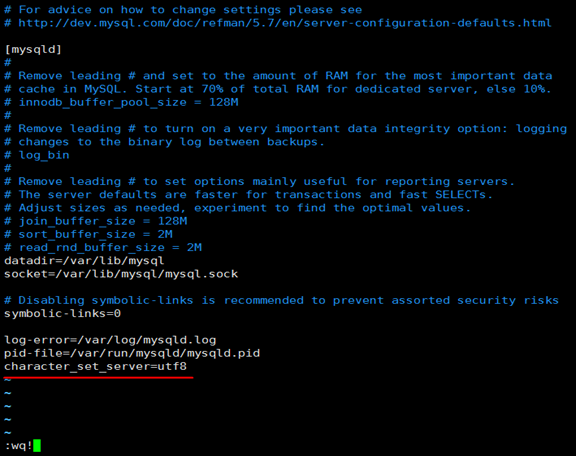

**操作3：重新启动MySQL服务**

```
systemctl restart mysqld
```

> 但是原库、原表的设定不会发生变化，参数修改只对新建的数据库生效。


2. 已有库&表字符集的变更

MySQL5.7版本中，以前创建的库，创建的表字符集还是latin1。

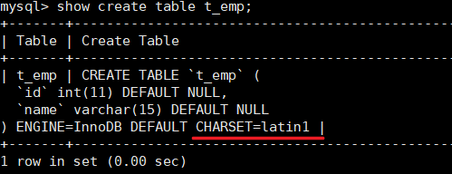

修改已创建数据库的字符集

```mysql
alter database dbtest1 character set 'utf8';
```

修改已创建数据表的字符集

```mysql
alter table t_emp convert to character set 'utf8';
```

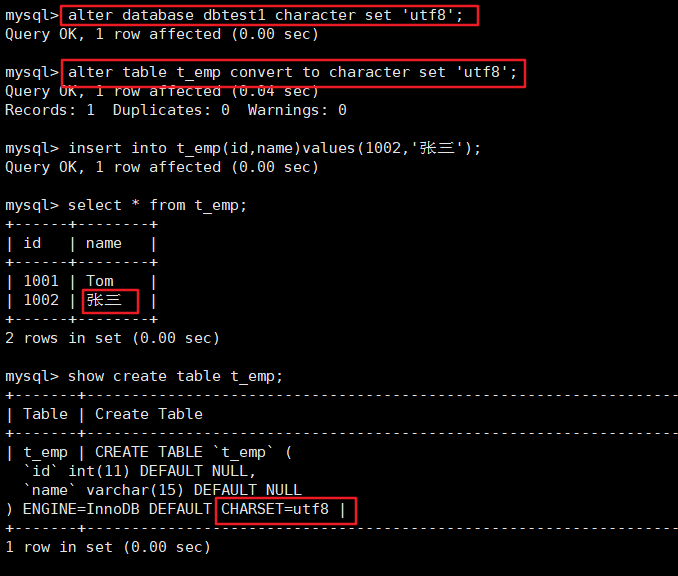

> 注意：但是原有的数据如果是用非'utf8'编码的话，数据本身编码不会发生改变。已有数据需要导出或删除，然后重新插入。


#### 5.2 各级别的字符集

MySQL有4个级别的字符集和比较规则，分别是：

- 服务器级别
- 数据库级别
- 表级别
- 列级别

执行如下SQL语句：

```mysql
show variables like 'character%';
```

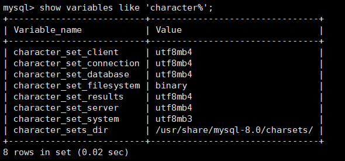

- character_set_server：服务器级别的字符集
- character_set_database：当前数据库的字符集
- character_set_client：服务器解码请求时使用的字符集
- character_set_connection：服务器处理请求时会把请求字符串从character_set_client转为character_set_connection
- character_set_results：服务器向客户端返回数据时使用的字符集

1. **服务器级别**

`character_set_server`：服务器级别的字符集。

我们可以在启动服务器程序时通过启动选项或者在服务器程序运行过程中使用`SET`语句修改这两个变量的值。比如我们可以在配置文件中这样写：

```
[server]
character_set_server=gbk # 默认字符集
collation_server=gbk_chinese_ci #对应的默认的比较规则
```

当服务器启动的时候读取这个配置文件后这两个系统变量的值便修改了。

2. **数据库级别**

`character_set_database`：当前数据库的字符集

我们在创建和修改数据库的时候可以指定该数据库的字符集和比较规则，具体语法如下：

```mysql
CREATE DATABASE 数据库名
	[[DEFAULT] CHARACTER SET 字符集名称]
	[[DEFAULT] COLLATE 比较规则名称];

ALTER DATABASE 数据库名
	[[DEFAULT] CHARACTER SET 字符集名称]
	[[DEFAULT] COLLATE 比较规则名称];
```

3. **表级别**

我们也可以在创建和修改表的时候指定表的字符集和比较规则，语法如下：

```mysql
CREATE TABLE 表名 (列的信息)
	[[DEFAULT] CHARACTER SET 字符集名称]
	[COLLATE 比较规则名称]]

ALTER TABLE 表名
	[[DEFAULT] CHARACTER SET 字符集名称]
	[COLLATE 比较规则名称]
```

**如果创建和修改表的语句中没有指明字符集和比较规则，将使用该表所在数据库的字符集和比较规则作为该表的字符集和比较规则。**

4. **列级别**

对于存储字符串的列，同一个表中的不同的列也可以有不同的字符集和比较规则。我们在创建和修改列定义的时候可以指定该列的字符集和比较规则，语法如下：

```mysql
CREATE TABLE 表名(
	列名 字符串类型 [CHARACTER SET 字符集名称] [COLLATE 比较规则名称],
	其他列...
);

ALTER TABLE 表名 MODIFY 列名 字符串类型 [CHARACTER SET 字符集名称] [COLLATE 比较规则名称];
```

**对于某个列来说，如果在创建和修改的语句中没有指明字符集和比较规则，将使用该列所在表的字符集和比较规则作为该列的字符集和比较规则。**

> 提示：在转换列的字符集时需要注意，如果转换前列中存储的数据不能用转换后的字符集进行表示会发生错误。比方说原先列使用的字符集是utf8，列中存储了一些汉字，现在把列的字符集转换为ascii的话就会出错，因为ascii字符集并不能表示汉字字符。

5. **小结**

我们介绍的这4个级别字符集和比较规则的联系如下：

- 如果`创建或修改列`时没有显式的指定字符集和比较规则，则该列`默认用表的`字符集和比较规则
- 如果`创建表时`没有显式的指定字符集和比较规则，则该表`默认用数据库的`字符集和比较规则
- 如果`创建数据库时`没有显式的指定字符集和比较规则，则该数据库`默认用服务器的`字符集和比较规则

知道了这些规则之后，对于给定的表，我们应该知道它的各个列的字符集和比较规则是什么，从而根据这个列的类型来确定存储数据时每个列的实际数据占用的存储空间大小了。比方说我们向表 t 中插入一条记录：

```mysql
mysql> INSERT INTO t(col) VALUES('我们');
Query OK, 1 row affected (0.00 sec)

mysql> SELECT * FROM t;
+--------+
| s        |
+--------+
| 我们    |
+--------+
1 row in set (0.00 sec)
```

首先列`col`使用的字符集是`gbk`，一个字符`'我'`在`gbk`中的编码为 0xCED2，占用两个字节，两个字符的实际数据就占用4个字节。如果把该列的字符集修改为`utf8`的话，这两个字符就实际占用6个字节


#### 5.3 字符集与比较规则(了解)

1. utf8 与 utf8mb4

`utf8`字符集表示一个字符需要使用1～4个字节，但是我们常用的一些字符使用1～3个字节就可以表示了。而字符集表示一个字符所用的最大字节长度，在某些方面会影响系统的存储和性能，所以设计MySQL的设计者偷偷的定义了两个概念：

- `utf8mb3`：阉割过的`utf8`字符集，只使用1～3个字节表示字符。
- `utf8mb4`：正宗的`utf8`字符集，使用1～4个字节表示字符。


2. 比较规则

上表中，MySQL版本一共支持41种字符集，其中的`Default collation`列表示这种字符集中一种默认的比较规则，里面包含着该比较规则主要作用于哪种语言，比如`utf8_polish_ci`表示以波兰语的规则比较，`utf8_spanish_ci`是以西班牙语的规则比较，`utf8_general_ci`是一种通用的比较规则。

后缀表示该比较规则是否区分语言中的重音、大小写。具体如下：

| 后缀 | 英文释义           | 描述             |
| ---- | ------------------ | ---------------- |
| _ai  | accent insensitive | 不区分重音       |
| _as  | accent sensitive   | 区分重音         |
| _ci  | case insensitive   | 不区分大小写     |
| _cs  | case sensitive     | 区分大小写       |
| _bin | binary             | 以二进制方式比较 |

最后一列`Maxlen`，它代表该种字符集表示一个字符最多需要几个字节。

**常用操作1：**

```mysql
#查看GBK字符集的比较规则
SHOW COLLATION LIKE 'gbk%';

#查看UTF-8字符集的比较规则
SHOW COLLATION LIKE 'utf8%';
```

**常用操作2：**

```mysql
#查看服务器的字符集和比较规则
SHOW VARIABLES LIKE '%_server';

#查看数据库的字符集和比较规则
SHOW VARIABLES LIKE '%_database';

#查看具体数据库的字符集
SHOW CREATE DATABASE dbtest1;

#修改具体数据库的字符集
ALTER DATABASE dbtest1 DEFAULT CHARACTER SET 'utf8' COLLATE 'utf8_general_ci';
```

**常用操作3：**

```mysql
#查看表的字符集
show create table employees;

#查看表的比较规则
show table status from atguigudb like 'employees';

#修改表的字符集和比较规则
ALTER TABLE emp1 DEFAULT CHARACTER SET 'utf8' COLLATE 'utf8_general_ci';
```


#### 5.4 请求到响应过程中字符集的变化

| 系统变量                 | 描述                                                         |
| ------------------------ | ------------------------------------------------------------ |
| character_set_client     | 服务器解码请求时使用的字符集                                 |
| character_set_connection | 服务器处理请求时会把请求字符串从<br/>`character_set_client`转为`character_set_connection` |
| character_set_results    | 服务器向客户端返回数据时使用的字符集                         |

这几个系统变量在我的计算机上的默认值如下（不同操作系统的默认值可能不同）：

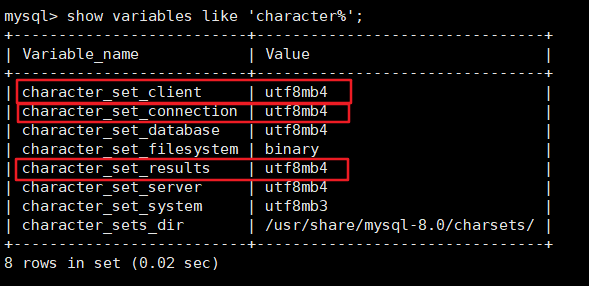

为了体现出字符集在请求处理过程中的变化，我们这里特意修改一个系统变量的值：

```mysql
mysql> set character_set_connection = gbk;
Query OK, 0 rows affected (0.00 sec)
```

现在假设我们客户端发送的请求是下边这个字符串：

```mysql
SELECT * FROM t WHERE s = '我';
```

为了方便大家理解这个过程，我们只分析字符`'我'`在这个过程中字符集的转换。

现在看一下在请求从发送到结果返回过程中字符集的变化：

1. 客户端发送请求所使用的字符集

   一般情况下客户端所使用的字符集和当前操作系统一致，不同操作系统使用的字符集可能不一样，如下：

   - 类`Unix`系统使用的是`utf8`
   - `Windows`使用的是`gbk`

   当客户端使用的是`utf8`字符集，字符`'我'`在发送给服务器的请求中的字节形式就是：`0xE68891`

   > 提示：如果你使用的是可视化工具，比如navicat之类的，这些工具可能会使用自定义的字符集来编码发送到服务器的字符串，而不采用操作系统默认的字符集（所以在学习的时候还是尽量用命令行窗口）。

2. 服务器接收到客户端发送来的请求其实是一串二进制的字节，它会认为这串字节采用的字符集是`character_set_client`，然后把这串字节转换为`character_set_connection`字符集编码的字符。

   由于我的计算机上`character_set_client`的值是`utf8`，首先会按照`utf8`字符集对字节串`0xE68891`进行解码，得到的字符串就是`'我'`，然后按照`character_set_connection`代表的字符集，也就是`gbk`进行编码，得到的结果就是字节串`0xCED2`。

3. 因为表`t`的列`col`采用的是`gbk`字符集，与`character_set_connection`一致，所以直接到列中找字节值为`0xCED2`的记录，最后找到了一条记录。

   > 提示：如果某个列使用的字符集和character_set_connection代表的字符集不一致的话，还需要进行一次字符集转换。

4. 上一步骤找到的记录中的`col`列其实是一个字节串`0xCED2`，`col`列是采用`gbk`进行编码的，所以首先会将这个字节串使用`gbk`进行解码，得到字符串`'我'`，然后再把这个字符串使用`character_set_results`代表的字符集，也就是`utf8`进行编码，得到了新的字节串：`0xE68891`，然后发送给客户端。
5. 由于客户端是用的字符集是`utf8`，所以可以顺利的将`0xE68891`解释成字符`'我'`，从而显示到我们的显示器上，所以我们人类也读懂了返回的结果。

总结图示如下：

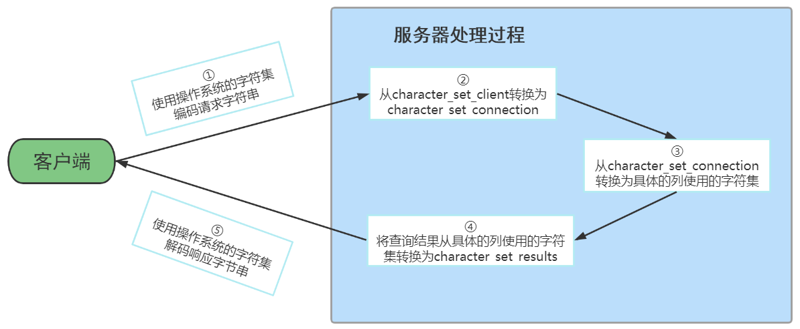


### 6 SQL大小写规范

#### 6.1 Windows和Linux平台区别

在SQL中，关键字和函数名是不用区分字母大小写的，比如 SELECT、WHERE、ORDER、GROUP BY 等关键字，以及 ABS、MOD、ROUND、MAX 等函数名。

不过在SQL中，你还是要确定大小写的规范，因为在 Linux 和 Windows 环境下，你可能会遇到不同的大小写问题。`windows系统默认大小写不敏感`，但是`linux系统是大小写敏感的`。

通过如下命令查看：

```mysql
SHOW VARIABLES LIKE '%lower_case_table_names%';
```

- Windows系统下：

  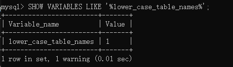

- Linux系统下：

  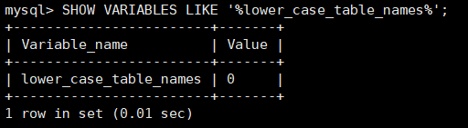

- lower_case_table_names参数值的设置：

  - `默认为0，大小写敏感`。
  - 设置1，大小写不敏感。创建的表，数据库都是以小写形式存放在磁盘上，对于sql语句都是转换为小写对表和数据库进行查找。
  - 设置2，创建的表和数据库依据语句上格式存放，凡是查找都是转换为小写进行。

- 两个平台上SQL大小写的区别具体来说：

  > MySQL在Linux下数据库名、表名、列名、别名大小写规则是这样的：
  >
  > 1. 数据库名、表名、表的别名、变量名是严格区分大小写的；
  > 2. 关键字、函数名称在 SQL 中不区分大小写；
  > 3. 列名（或字段名）与列的别名（或字段别名）在所有的情况下均是忽略大小写的；
  >
  >  
  >
  > **MySQL在Windows的环境下全部不区分大小写**


#### 6.2 Linux下大小写规则设置

当想设置为大小写不敏感时，要在`my.cnf`这个配置文件 [mysqld] 中加入`lower_case_table_names=1`，然后重启服务器。

- 但是要在重启数据库实例之前就需要将原来的数据库和表转换为小写，否则将找不到数据库名。

- 此参数适用于MySQL5.7。在MySQL 8下禁止在重新启动 MySQL 服务时将`lower_case_table_names`设置成不同于初始化 MySQL 服务时设置的`lower_case_table_names`值。如果非要将MySQL8设置为大小写不敏感，具体步骤为：

  > 1. 停止MySQL服务
  > 2. 删除数据目录，即删除 /var/lib/mysql 目录
  > 3. 在MySQL配置文件（ /etc/my.cnf ）中添加 lower_case_table_names=1
  > 4. 启动MySQL服务


#### 6.3 SQL编写建议

如果你的变量名命名规范没有统一，就可能产生错误。这里有一个有关命名规范的建议：

> 1. 关键字和函数名称全部大写；
> 2. 数据库名、表名、表别名、字段名、字段别名等全部小写；
> 3. SQL语句必须以分号结尾。

数据库名、表名和字段名在 Linux MySQL 环境下是区分大小写的，因此建议你统一这些字段的命名规则，比如全部采用小写的方式。

虽然关键字和函数名称在SQL中不区分大小写，也就是如果小写的话同样可以执行。但是同时将关键词和函数名称全部大写，以便于区分数据库名、表名、字段名。


### 7 sql_mode的合理设置

#### 7.1 宽松模式 vs 严格模式

**宽松模式：**

如果设置的是宽松模式，那么我们在插入数据的时候，即便是给了一个错误的数据，也可能会被接受，并且不报错。

`举例`：我在创建一个表时，该表中有一个字段为name，给name设置的字段类型时`char(10)`，如果我在插入数据的时候，其中name这个字段对应的有一条数据的`长度超过了10`，例如'1234567890abc'，超过了设定的字段长度10，那么不会报错，并且取前10个字符存上，也就是说你这个数据被存为了'1234567890'，而'abc'就没有了。但是，我们给的这条数据是错误的，因为超过了字段长度，但是并没有报错，并且mysql自行处理并接受了，这就是宽松模式的效果。

`应用场景`：通过设置sql mode为宽松模式，来保证大多数sql符合标准的sql语法，这样应用在不同数据库之间进行`迁移`时，则不需要对业务sql进行较大的修改。


**严格模式：**

出现上面宽松模式的错误，应该报错才对，所以MySQL5.7版本就将sql_mode默认值改为了严格模式。所以在`生产等环境`中，我们必须采用的是严格模式，进而`开发、测试环境`的数据库也必须要设置，这样在开发测试阶段就可以发现问题。并且我们即便是用的MySQL5.6，也应该自行将其改为严格模式。

`开发经验`：MySQL等数据库总想把关于数据的所有操作都自己包揽下来，包括数据的校验，其实开发中，我们应该在自己`开发的项目程序级别将这些校验给做了`，虽然写项目的时候麻烦了一些步骤，但是这样做之后，我们在进行数据库迁移或者在项目的迁移时，就会方便很多。

改为严格模式后可能会存在的问题：

若设置模式中包含了`NO_ZERO_DATE`，那么MySQL数据库不允许插入零日期，插入零日期会抛出错误而不是警告。例如，表中含字段TIMESTAMP列（如果未声明为NULL或显示DEFAULT子句）将自动分配DEFAULT '0000-00-00 00:00:00'（零时间戳），这显然是不满足sql_mode中的NO_ZERO_DATE而报错。


#### 7.2 宽松模式再举例

**宽松模式举例1：**

```mysql
select * from employees group by department_id limit 10;

set sql_mode = ONLY_FULL_GROUP_BY;

select * from employees group by department_id limit 10;
```

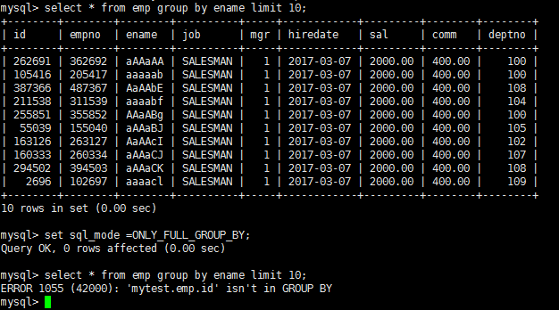

**宽松模式举例2：**

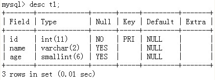


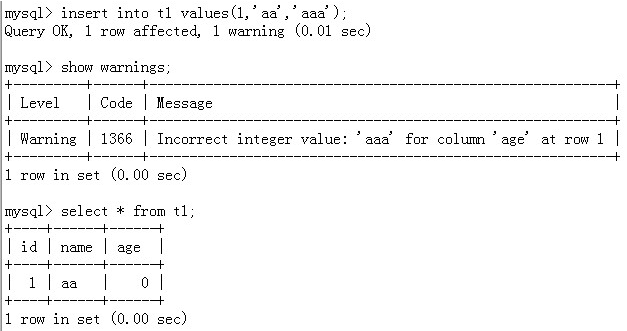

设置 sql_mode 模式为 STRICT_TRANS_TABLES ，然后插入数据：

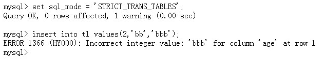

#### 7.3 模式查看和设置

- **查看当前的sql_mode**

  ```mysql
  select @@session.sql_mode
  
  select @@global.sql_mode
  
  #或者
  
  show variables like 'sql_mode';
  ```

  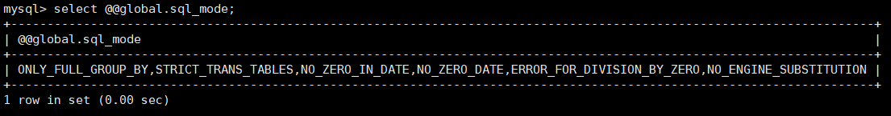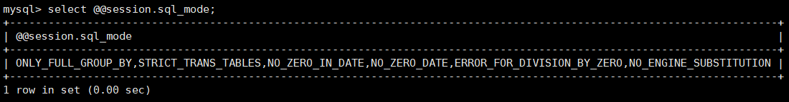

- **临时设置方式：设置当前窗口中设置sql_mode**

  ```mysql
  SET GLOBAL sql_mode = 'modes...'; #全局
  
  SET SESSION sql_mode = 'modes...'; #当前会话
  ```

  举例：

  ```mysql
  #改为严格模式。此方法只在当前会话中生效，关闭当前会话就不生效了。
  set SESSION sql_mode = 'STRICT_TRANS_TABLES';
  ```

  ```mysql
  #改为严格模式。此方法在当前服务中生效，重启MySQL服务后失效。
  set GLOBAL sql_mode='STRICT_TRANS_TABLES';
  ```

- **永久设置方式：在/etc/my.cnf中配置sql_mode**

  在my.cnf文件(windows系统是my.ini文件)，新增：

  ```
  [mysqld]
  sql_mode=ONLY_FULL_GROUP_BY,STRICT_TRANS_TABLES,NO_ZERO_IN_DATE,NO_ZERO_DATE,ERROR_FOR_DIVISION_BY_ZERO,NO_ENGINE_SUBSTITUTION
  ```

  然后`重启MySQL`。

  当然生产环境上是禁止重启MySQL服务的，所以采用`临时设置方式 + 永久设置方式`来解决线上的问题，那么即便是有一天真的重启了MySQL服务，也会永久生效了。
# **MySQL_**基础篇

>讲师：尚硅谷-宋红康（江湖人称：康师傅）
>
>尚硅谷官网：http://www.atguigu.com
>
>视频链接：https://www.bilibili.com/video/BV1iq4y1u7vj?spm_id_from=333.337.search-card.all.click

------

## 一、数据库概述

### 1 为什么要使用数据库

- 持久化(persistence)：**把数据保存到可掉电式存储设备中以供之后使用。**大多数情况下，特别是企业级应用，**数据持久化意味着将内存中的数据保存到硬盘上加以”固化”，**而持久化的实现过程大多通过各种关系数据库来完成。
- 持久化的主要作用是**将内存中的数据存储在关系型数据库中**，当然也可以存储在磁盘文件、XML数据文件中。


### 2 数据库与数据库管理系统

#### 2.1 数据库的相关概念

- **DB：数据库（Database）**

  即存储数据的“仓库”，其本质是一个文件系统。它保存了一系列有组织的数据。

- **DBMS：数据库管理系统（Database Management System）**

  是一种操纵和管理数据库的大型软件，用于建立、使用和维护数据库，对数据库进行统一管理和控制。用户通过数据库管理系统访问数据库中表内的数据。
  
- **SQL：结构化查询语言（Structured Query Language）**

  专门用来与数据库通信的语言。

#### 2.2 数据库与数据库管理系统的关系

数据库管理系统(DBMS)可以管理多个数据库，一般开发人员会针对每一个应用创建一个数据库。为保存应用中实体的数据，一般会在数据库创建多个表，以保存程序中实体用户的数据。

数据库管理系统、数据库和表的关系如图所示：


#### 2.3 常见的数据库管理系统排名(DBMS)

目前互联网上常见的数据库管理软件有Oracle、MySQL、MS SQL Server、DB2、PostgreSQL、Access、
Sybase、Informix这几种。以下是2021年DB-Engines Ranking 对各数据库受欢迎程度进行调查后的统计结果：

查看数据库最新排名: https://db-engines.com/en/ranking

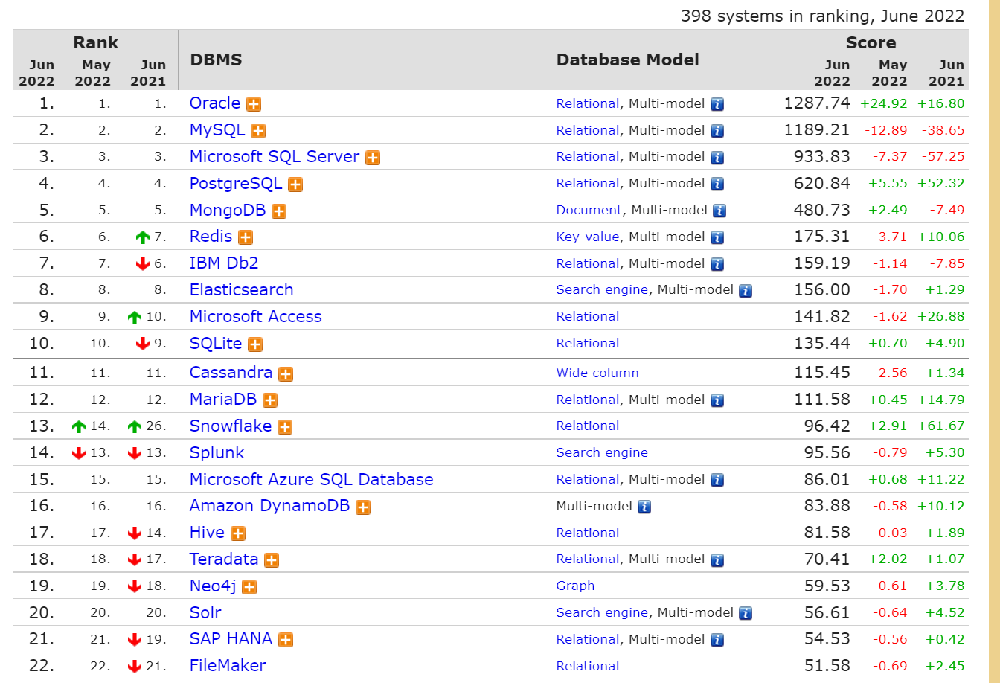

对应的走势图：https://db-engines.com/en/ranking_trend

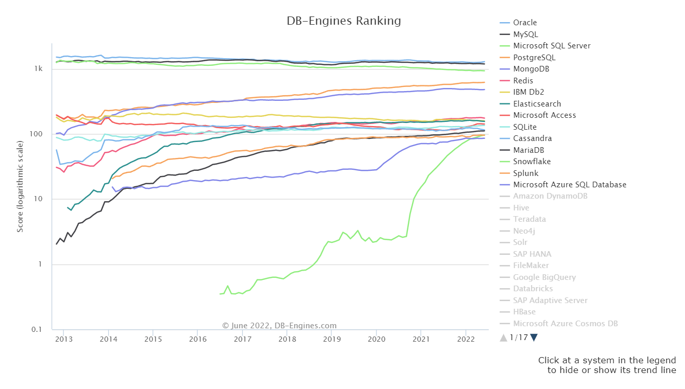

#### 2.4 常见的数据库介绍

**Oracle**

1979 年，Oracle 2 诞生，它是第一个商用的 RDBMS（关系型数据库管理系统）。随着 Oracle 软件的名气越来越大，公司也改名叫 Oracle 公司。

2007年，总计85亿美金收购BEA Systems。

2009年，总计74亿美金收购SUN。此前的2008年，SUN以10亿美金收购MySQL。意味着Oracle 同时拥有了MySQL的管理权，至此 Oracle 在数据库领域中成为绝对的领导者。

2013年，甲骨文超越IBM，成为继Microsoft后全球第二大软件公司。

如今 Oracle 的年收入达到了 400 亿美金，足以证明商用（收费）数据库软件的价值。

**SQL Server**

SQL Server 是微软开发的大型商业数据库，诞生于 1989 年。C#、.net等语言常使用，与WinNT完全集成，也可以很好地与Microsoft BackOffice产品集成。

**DB2**

IBM公司的数据库产品,收费的。常应用在银行系统中。

**PostgreSQL**

PostgreSQL 的稳定性极强，最符合SQL标准，开放源码，具备商业级DBMS质量。PG对数据量大的文本以及SQL处理较快。

**SyBase**

已经淡出历史舞台。提供了一个非常专业数据建模的工具PowerDesigner。

**SQLite**

嵌入式的小型数据库，应用在手机端。 零配置，SQlite3不用安装，不用配置，不用启动，关闭或者配置数据库实例。当系统崩溃后不用做任何恢复操作，再下次使用数据库的时候自动恢复。

**informix**

IBM公司出品，取自Information 和Unix的结合，它是第一个被移植到Linux上的商业数据库产品。仅运行于unix/linux平台，命令行操作。 性能较高，支持集群，适应于安全性要求极高的系统，尤其是银行，证券系统的应用。

### 3 MySQL介绍


#### 3.1 概述

- MySQL是一个**开放源代码的关系型数据库管理系统**，由瑞典MySQL AB（创始人Michael Widenius）公司1995年开发，迅速成为开源数据库的 No.1。
- 2008被 **Sun** 收购（10亿美金），2009年Sun被 **Oracle** 收购。 **MariaDB**应运而生。（MySQL 的创造者担心 MySQL 有闭源的风险，因此创建了 MySQL 的分支项目 MariaDB）
- MySQL6.x 版本之后分为**社区版**和**商业版**。
- MySQL是一种关联数据库管理系统，将数据保存在不同的表中，而不是将所有数据放在一个大仓库内，这样就增加了速度并提高了灵活性。
- MySQL是开源的，所以你不需要支付额外的费用。
- MySQL是可以定制的，采用了 **GPL（GNU General Public License）**协议，你可以修改源码来开发自己的MySQL系统。
- MySQL支持大型的数据库。可以处理拥有上千万条记录的大型数据库。
- MySQL支持大型数据库，支持5000万条记录的数据仓库，32位系统表文件最大可支持 **4GB**，64位系统支持最大的表文件为 **8TB**。
- MySQL使用 **标准的SQL数据语言** 形式。
- MySQL可以允许运行于多个系统上，并且支持多种语言。这些编程语言包括C、C++、Python、Java、Perl、PHP和Ruby等。

#### 3.2 MySQL发展史重大事件

MySQL的历史就是整个互联网的发展史。互联网业务从社交领域、电商领域到金融领域的发展，推动着应用对数据库的需求提升，对传统的数据库服务能力提出了挑战。高并发、高性能、高可用、轻资源、易维护、易扩展的需求，促进了MySQL的长足发展。


#### 3.3 关于MySQL 8.0

**MySQL从5.7版本直接跳跃发布了8.0版本**，可见这是一个令人兴奋的里程碑版本。MySQL 8版本在功能上做了显著的改进与增强，开发者对MySQL的源代码进行了重构，最突出的一点是多MySQL Optimizer优化器进行了改进。不仅在速度上得到了改善，还为用户带来了更好的性能和更棒的体验。


#### 3.4 Why choose MySQL?


为什么如此多的厂商要选用MySQL？大概总结的原因主要有以下几点：

1. 开放源代码，使用成本低。

2. 性能卓越，服务稳定。
3. 软件体积小，使用简单，并且易于维护。
4. 历史悠久，社区用户非常活跃，遇到问题可以寻求帮助。
5. 许多互联网公司在用，经过了时间的验证。


#### 3.5 Oracle vs MySQL

Oracle 更适合大型跨国企业的使用，因为他们对费用不敏感，但是对性能要求以及安全性有更高的要求。

MySQL 由于其**体积小、速度快、总体拥有成本低，可处理上千万条记录的大型数据库，尤其是开放源码这一特点，使得很多互联网公司、中小型网站选择了MySQL作为网站数据库**（Facebook，Twitter，YouTube，阿里巴巴/蚂蚁金服，去哪儿，美团外卖，腾讯）。

### 4 RDBMS 与 非RDBMS

从排名中我们能看出来，关系型数据库绝对是 DBMS 的主流，其中使用最多的 DBMS 分别是 Oracle、MySQL 和 SQL Server。这些都是关系型数据库（RDBMS）。

#### 4.1 关系型数据库(RDBMS)

##### 4.1.1 实质

- 这种类型的数据库是**最古老**的数据库类型，关系型数据库模型是把复杂的数据结构归结为简单的**二元关系**（即二维表格形式）。

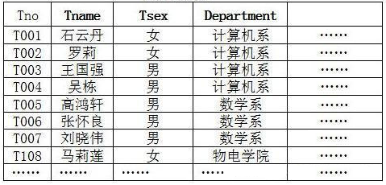

- 关系型数据库以 **行(row)** 和 **列(column)** 的形式存储数据，以便于用户理解。这一系列的行和列被称为 **表(table)** ，一组表组成了一个库(database)。
  
- 表与表之间的数据记录有关系(relationship)。现实世界中的各种实体以及实体之间的各种联系均用**关系模型**来表示。关系型数据库，就是建立在`关系模型`基础上的数据库。
  
- SQL 就是关系型数据库的查询语言。

  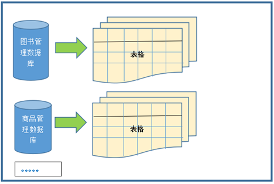

##### 4.1.2 优势

- **复杂查询** 可以用SQL语句方便的在一个表以及多个表之间做非常复杂的数据查询。
- **事务支持** 使得对于安全性能很高的数据访问要求得以实现。

#### 4.2 非关系型数据库(非RDBMS)

##### 4.2.1 介绍

**非关系型数据库**，可看成传统关系型数据库的功能**阉割版本**，基于键值对存储数据，不需要经过SQL层的解析，**性能非常高** 。同时，通过减少不常用的功能，进一步提高性能。

目前基本上大部分主流的非关系型数据库都是免费的。

##### 4.2.2 有哪些非关系型数据库

相比于 SQL，NoSQL 泛指非关系型数据库，包括了榜单上的键值型数据库、文档型数据库、搜索引擎和列存储等，除此以外还包括图形数据库。也只有用 NoSQL 一词才能将这些技术囊括进来。

1. **键值型数据库**

键值型数据库通过 Key-Value 键值的方式来存储数据，其中 Key 和 Value 可以是简单的对象，也可以是复杂的对象。Key 作为唯一的标识符，优点是查找速度快，在这方面明显优于关系型数据库，缺点是无法像关系型数据库一样使用条件过滤（比如 WHERE），如果你不知道去哪里找数据，就要遍历所有的键，这就会消耗大量的计算。

键值型数据库典型的使用场景是作为**内存缓存** 。 **Redis** 是最流行的键值型数据库。


2. **文档型数据库**

此类数据库可存放并获取文档，可以是XML、JSON等格式。在数据库中文档作为处理信息的基本单位，一个文档就相当于一条记录。文档数据库所存放的文档，就相当于键值数据库所存放的“值”。MongoDB是最流行的文档型数据库。此外，还有CouchDB等。

3. **搜索引擎数据库**

虽然关系型数据库采用了索引提升检索效率，但是针对全文索引效率却较低。搜索引擎数据库是应用在搜索引擎领域的数据存储形式，由于搜索引擎会爬取大量的数据，并以特定的格式进行存储，这样在检索的时候才能保证性能最优。核心原理是“倒排索引”。

典型产品：Solr、Elasticsearch、Splunk 等。

4. **列式数据库**

列式数据库是相对于行式存储的数据库，Oracle、MySQL、SQL Server 等数据库都是采用的行式存储（Row-based），而列式数据库是将数据按照列存储到数据库中，这样做的好处是可以大量降低系统的
I/O，适合于分布式文件系统，不足在于功能相对有限。典型产品：HBase等。

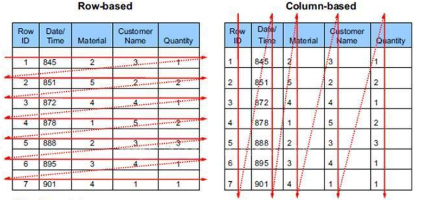

5. **图形数据库**

图形数据库，利用了图这种数据结构存储了实体（对象）之间的关系。图形数据库最典型的例子就是社交网络中人与人的关系，数据模型主要是以节点和边（关系）来实现，特点在于能高效地解决复杂的关系问题。

图形数据库顾名思义，就是一种存储图形关系的数据库。它利用了图这种数据结构存储了实体（对象）之间的关系。关系型数据用于存储明确关系的数据，但对于复杂关系的数据存储却有些力不从心。如社交网络中人物之间的关系，如果用关系型数据库则非常复杂，用图形数据库将非常简单。典型产品：Neo4J、InfoGrid等。


##### 4.2.3 NoSQL功能的演变

由于 SQL 一直称霸 DBMS，因此许多人在思考是否有一种数据库技术能远离 SQL，于是 NoSQL 诞生了，但是随着发展却发现越来越离不开 SQL。到目前为止 NoSQL 阵营中的 DBMS 都会有实现类似 SQL 的功能。下面是“NoSQL”这个名词在不同时期的诠释，从这些释义的变化中可以看出 **NoSQL功能的演变** ：

1970：NoSQL = We have no SQL

1980：NoSQL = Know SQL

2000：NoSQL = No SQL!

2005：NoSQL = Not only SQL

2013：NoSQL = No, SQL!

NoSQL 对 SQL 做出了很好的补充，比如实际开发中，有很多业务需求，其实并不需要完整的关系型数据库功能，非关系型数据库的功能就足够使用了。这种情况下，使用**性能更高**、**成本更低**的非关系型数据库当然是更明智的选择。比如：日志收集、排行榜、定时器等。

#### 4.3 小结

NoSQL 的分类很多，即便如此，在 DBMS 排名中，还是 SQL 阵营的比重更大，影响力前 5 的 DBMS 中有4个是关系型数据库，而排名前 20 的 DBMS 中也有 12 个是关系型数据库。所以说，掌握 SQL 是非常有必要的。整套课程将围绕 SQL 展开。

### 5 关系型数据库设计规则

- 关系型数据库的典型数据结构就是 数据表 ，这些数据表的组成都是结构化的（Structured）。
- 将数据放到表中，表再放到库中。
- 一个数据库中可以有多个表，每个表都有一个名字，用来标识自己。表名具有唯一性。
- 表具有一些特性，这些特性定义了数据在表中如何存储，类似Java和Python中 “类”的设计。

#### 5.1 表、记录、字段

- E-R（entity-relationship，实体-联系）模型中有三个主要概念是：实体集、属性、联系集。

- 一个实体集（class）对应于数据库中的一个表（table）。

  一个实体（instance）则对应于数据库表中的一行（row），也称为一条记录（record）。
  

一个属性（attribute）对应于数据库表中的一列（column），也称为一个字段（field）。


```
ORM思想 (Object Relational Mapping)体现：
数据库中的一个表 <---> Java或Python中的一个类
表中的一条数据 <---> 类中的一个对象（或实体）
表中的一个列 <----> 类中的一个字段、属性(field)
```

#### 5.2 表的关联关系

- 表与表之间的数据记录有关系(relationship)。现实世界中的各种实体以及实体之间的各种联系均用关系模型来表示。
- 四种：一对一关联、一对多关联、多对多关联、自我引用

##### 5.2.1 一对一关联（one-to-one）

- 在实际的开发中应用不多，因为一对一可以创建成一张表。
- 举例：设计 **学生表**：学号、姓名、手机号码、班级、系别、身份证号码、家庭住址、籍贯、紧急联系人、...
  - 拆为两个表：两个表的记录是一一对应关系
  - **基础信息表**（常用信息）：学号、姓名、手机号码、班级、系别
  - **档案信息表** （不常用信息）：学号、身份证号码、家庭住址、籍贯、紧急联系人、...
- 两种建表原则：
  - 外键唯一：主表的主键和从表的外键（唯一），形成主外键关系，外键唯一。
  - 外键是主键：主表的主键和从表的主键，形成主外键关系。


##### 5.2.2 一对多关系（one-to-many）

- 常见实例场景：**客户表和订单表**，**分类表和商品表**，**部门表和员工表**。
- 举例：
  - 员工表：编号、姓名、...、所属部门
  - 部门表：编号、名称、简介
- 一对多建表原则：在从表(多方)创建一个字段，字段作为外键指向主表(一方)的主键


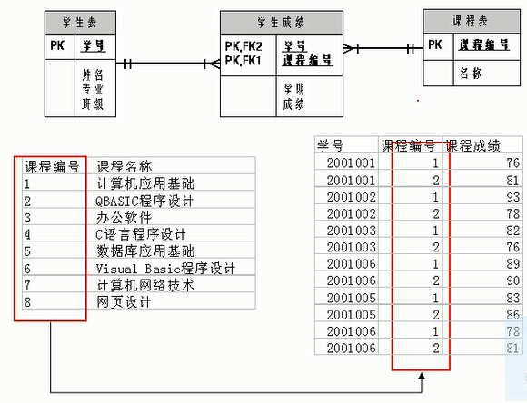


##### 5.2.3 多对多（many-to-many）

要表示多对多关系，必须创建第三个表，该表通常称为**联接表**，它将多对多关系划分为两个一对多关系。将这两个表的主键都插入到第三个表中。

多对多关系建表原则：需要创建第三张表，中间表中至少两个字段，这两个字段分别作为外键指向各自一方的主键。


- 举例1：学生 - 课程

  - **学生信息表**：一行代表一个学生的信息（学号、姓名、手机号码、班级、系别...）；
  - **课程信息表**：一行代表一个课程的信息（课程编号、授课老师、简介...）；
  - **选课信息表**：一个学生可以选多门课，一门课可以被多个学生选择。

  ```
  学号 课程编号
  1    1001
  2    1001
  1    1002
  ```

- 举例2：产品 - 订单

  “**订单**”表和“**产品**”表有一种多对多的关系，这种关系是通过与“**订单明细**”表建立两个一对多关系来定义的。一个订单可以有多个产品，每个产品可以出现在多个订单中。
  
  - **产品表**：“产品”表中的每条记录表示一个产品。
  - **订单表**：“订单”表中的每条记录表示一个订单。
  - **订单明细表**：每个产品可以与“订单”表中的多条记录对应，即出现在多个订单中。一个订单可以与“产品”表中的多条记录对应，即包含多个产品。
  
- 举例3：用户 - 角色

  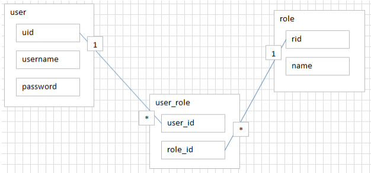

##### 5.2.4 自我引用

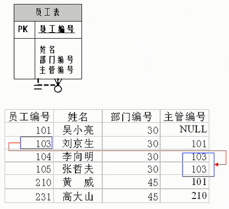

------

## 二、基本的SELECT语句

### 1 SQL概述

#### 1.1 SQL背景知识

- 1946年，世界上第一台电脑诞生，如今，借由这台电脑发展起来的互联网已经自成江湖。在这几十年里，无数的技术、产业在这片江湖里沉浮，有的方兴未艾，有的已经几幕兴衰。但在这片浩荡的波动里，有一门技术从未消失，甚至“老当益壮”，那就是SQL。
  - 1974年，IBM研究员发布了一篇揭开数据库技术的论文《SEQUEL：一门结构化的英语查询语言》，直到今天这门结构化的查询语言并没有太大的变化，相比于其他语言，**SQL的半衰期可以说是非常长**了。
- 不论是前端工程师，还是后端算法工程师，都一定会和数据打交道，都需要了解如何又快又准确地提取自己想要的数据。更别提数据分析师了，他们的工作就是和数据打交道，整理不同的报告，以便指导业务决策。
- SQL（Structured Query Language，结构化查询语言）是使用关系模型的数据库应用语言，**与数据直接打交道**，由 **IBM** 上世纪70年代开发出来。后由美国国家标准局（ANSI）开始着手制定SQL标准，先后有 **SQL-86**，**SQL-89**，**SQL-92**，**SQL-99**等标准。
  - SQL 有两个重要的标准，分别是 SQL92 和 SQL99，它们分别代表了 92 年和 99 年颁布的 SQL 标准，我们今天使用的 SQL 语言依然遵循这些标准。
- 不同的数据库生产厂商都支持SQL语句，但都有特有内容。

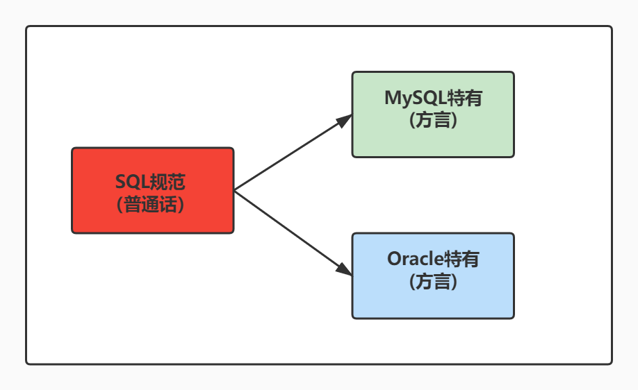

#### 1.2 SQL语言排行榜

自从 SQL 加入了 TIOBE 编程语言排行榜，就一直保持在 Top 10。

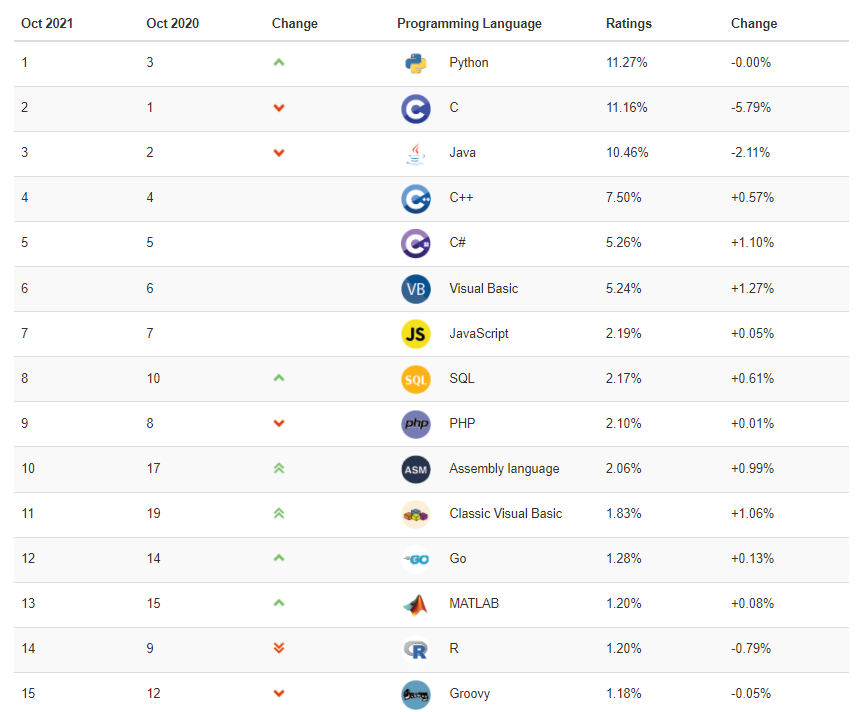

#### 1.3 SQL分类

SQL语言在功能上主要分为如下3大类：

- **DDL（Data Definition Languages、数据定义语言）**，这些语句定义了不同的数据库、表、视图、索引等数据库对象，还可以用来创建、删除、修改数据库和数据表的结构。
  
  主要的语句关键字包括 **CREATE、ALTER、DROP、RENAME、TRUNCATE** 等。
  
- **DML（Data Manipulation Language、数据操作语言）**，用于添加、删除、更新和查询数据库记录，并检查数据完整性。
  
  - 主要的语句关键字包括**INSERT**、**DELETE**、**UPDATE**、**SELECT**等。
  - **SELECT 是 SQL 语言的基础，最为重要。**
  
- **DCL（Data Control Language、数据控制语言）**，用于定义数据库、表、字段、用户的访问权限和安全级别。
  
  主要的语句关键字包括**GRANT**、**REVOKE**、**COMMIT**、**ROLLBACK**、**SAVEPOINT**等。

>因为查询语句使用的非常的频繁，所以很多人把查询语句单拎出来一类：DQL（数据查询语言）。
>
>还有单独将`COMMIT`、`ROLLBACK`取出来称为TCL（Transaction Control Language，事务控制语言）。

### 2 SQL语言的规则与规范

#### 2.1 基本规则

- SQL 可以写在一行或者多行。为了提高可读性，各子句分行写，必要时使用缩进
- 每条命令以 ; 或 \g 或 \G 结束
- 关键字不能被缩写也不能分行
- 关于标点符号
  - 必须保证所有的()、单引号、双引号是成对结束的
  - 必须使用英文状态下的半角输入方式
  - 字符串型和日期时间类型的数据可以使用单引号（' '）表示
  - 列的别名，尽量使用双引号（" "），而且不建议省略as

#### 2.2 SQL大小写规范

- **MySQL 在 Windows 环境下是大小写不敏感的**
- **MySQL 在 Linux 环境下是大小写敏感的**
  - 数据库名、表名、表的别名、变量名是严格区分大小写的
  - 关键字、函数名、列名(或字段名)、列的别名(字段的别名) 是忽略大小写的。
- **推荐采用统一的书写规范：**
  - 数据库名、表名、表别名、字段名、字段别名等都小写
  - SQL 关键字、函数名、绑定变量等都大写

#### 2.3 注释

可以使用如下格式的注释结构

```sql
单行注释：#注释文字(MySQL特有的方式)
单行注释：-- 注释文字(--后面必须包含一个空格。)
多行注释：/* 注释文字 */
```

#### 2.4 命名规则

- 数据库、表名不得超过30个字符，变量名限制为29个
- 必须只能包含`A–Z、a–z、0–9、_`共63个字符
- 数据库名、表名、字段名等对象名中间不要包含空格
- 同一个MySQL软件中，数据库不能同名；同一个库中，表不能重名；同一个表中，字段不能重名
- 必须保证你的字段没有和保留字、数据库系统或常用方法冲突。如果坚持使用，请在SQL语句中使用`（着重号）引起来
- 保持字段名和类型的一致性，在命名字段并为其指定数据类型的时候一定要保证一致性。假如数据类型在一个表里是整数，那在另一个表里可就别变成字符型了

举例：

```sql
#以下两句是一样的，不区分大小写
show databases;
SHOW DATABASES;

#创建表格
#create table student info(...); #表名错误，因为表名有空格
create table student_info(...);

#其中order使用``飘号，因为order和系统关键字或系统函数名等预定义标识符重名了
CREATE TABLE `order`(
    id INT,
	lname VARCHAR(20)
);

select id as "编号", `name` as "姓名" from t_stu; #起别名时，as都可以省略
select id as 编号, `name` as 姓名 from t_stu; #如果字段别名中没有空格，那么可以省略""
select id as 编 号, `name` as 姓 名 from t_stu; #错误，如果字段别名中有空格，那么不能省略""
```

#### 2.5 数据导入

- 方式1：source 文件的全路径名

  举例：source d:\atguigudb.sql;

- 方式2：基于具体的图形化界面的工具可以导入数据

  比如：SQLyog中 选择 “工具” -- “执行sql脚本” -- 选中xxx.sql即可。

在命令行客户端登录mysql，使用source指令导入

```sql
mysql> source d:\mysqldb.sql
```

### 3 基本的SELECT语句

#### 3.0 SELECT...

```sql
SELECT 1; #没有任何子句
SELECT 9/2; #没有任何子句

#5. 最基本的SELECT语句： SELECT 字段1,字段2,... FROM 表名 
SELECT 1 + 1,3 * 2;

SELECT 1 + 1,3 * 2
FROM DUAL; #dual：伪表
```

#### 3.1 SELECT ... FROM

- 语法：

  ```sql
  SELECT  标识选择哪些列
  FROM    标识从哪个表中选择
  ```

- 选择全部列：

  ```sql
  SELECT *
  FROM departments;
  ```

  

  > 一般情况下，除非需要使用表中所有的字段数据，最好不要使用通配符‘*’。使用通配符虽然可以节省输入查询语句的时间，但是获取不需要的列数据通常会降低查询和所使用的应用程序的效率。通配符的优势是，当不知道所需要的列的名称时，可以通过它获取它们。
>
  > 在生产环境下，不推荐你直接使用 **SELECT *** 进行查询。

- 选择特定的列：

  ```sql
  SELECT department_id, location_id
  FROM departments;
  ```

  

  > MySQL中的SQL语句是不区分大小写的，因此SELECT和select的作用是相同的，但是，许多开发人员习惯将关键字大写、数据列和表名小写，读者也应该养成一个良好的编程习惯，这样写出来的代码更容易阅读和维护。

#### 3.2 列的别名

- 重命名一个列

- 便于计算

- 紧跟列名，也可以**在列名和别名之间加入关键字AS，别名使用双引号**，以便在别名中包含空格或特殊的字符并区分大小写。
  
- AS 可以省略

- 建议别名简短，见名知意

- 举例

  ```sql
  SELECT last_name AS name, commission_pct comm
  FROM employees;
  ```

  

  ```sql
  SELECT last_name "Name", salary*12 "Annual Salary"
  FROM employees;
  ```

  

#### 3.3 去除重复行

默认情况下，查询会返回全部行，包括重复行。

```sql
SELECT department_id
FROM employees;
```


**在 SELECT 语句中使用关键字 DISTINCT 去除重复行**

```sql
SELECT DISTINCT department_id
FROM employees;
```


针对于：

```sql
SELECT DISTINCT department_id, salary
FROM employees;
```

这里有两点需要注意：

1. DISTINCT 需要放到所有列名的前面，如果写成`SELECT salary, DISTINCT department_id
   FROM employees`会报错。
2. DISTINCT 其实是对后面所有列名的组合进行去重，你能看到最后的结果是 74 条，因为这 74 个部门id不同，都有 salary 这个属性值。如果你想要看都有哪些不同的部门（department_id），只需要写 DISTINCT department_id 即可，后面不需要再加其他的列名了。

#### 3.4 空值参与运算

- 所有运算符或列值遇到null值，运算的结果都为null

  ```sql
  SELECT employee_id, salary, commission_pct,
  12 * salary * (1 + commission_pct) "annual_sal"
  FROM employees;
  ```

  这里你一定要注意，在 MySQL 里面， 空值不等于空字符串。一个空字符串的长度是 0，而一个空值的长度是空。而且，在 MySQL 里面，空值是占用空间的。
  
- 实际问题的解决方案：引入IFNULL

  ```sql
  SELECT 
  	employee_id,salary "月工资", 
  	salary * (1 + IFNULL(commission_pct,0)) * 12 "年工资", 
  	commission_pct
  FROM `employees`;
  ```

#### 3.5 着重号``

- 错误的：

  ```sql
  mysql> SELECT * FROM ORDER;
  ERROR 1064 (42000): You have an error in your SQL syntax; check the manual that
  corresponds to your MySQL server version for the right syntax to use near 'ORDER' at
  line 1
  ```

- 正确的：

  ```sql
  mysql> SELECT * FROM `ORDER`;
  +----------+------------+
  | order_id | order_name |
  +----------+------------+
  |        1 | shkstart   |
  |        2 | tomcat     |
  |        3 | dubbo      |
  +----------+------------+
  3 rows in set (0.00 sec)
  
  mysql> SELECT * FROM `order`;
  +----------+------------+
  | order_id | order_name |
  +----------+------------+
  |        1 | shkstart   |
  |        2 | tomcat     |
  |        3 | dubbo      |
  +----------+------------+
  3 rows in set (0.00 sec)
  ```

- 结论：

  > 我们需要保证表中的字段、表名等没有和保留字、数据库系统或常用方法冲突。如果真的相同，请在SQL语句中使用一对``（着重号）引起来。

#### 3.6 查询常数

- SELECT 查询还可以对常数进行查询。对的，就是在 SELECT 查询结果中增加一列固定的常数列。这列的取值是我们指定的，而不是从数据表中动态取出的。
  
- 你可能会问为什么我们还要对常数进行查询呢？

- SQL 中的 SELECT 语法的确提供了这个功能，一般来说我们只从一个表中查询数据，通常不需要增加一个固定的常数列，但如果我们想整合不同的数据源，用常数列作为这个表的标记，就需要查询常数。
  
- 比如说，我们想对 employees 数据表中的员工姓名进行查询，同时增加一列字段 corporation ，这个字段固定值为“尚硅谷”，可以这样写：
  
  ```sql
  SELECT '尚硅谷' as corporation, last_name FROM employees;
  ```

### 4 显示表结构

使用DESCRIBE 或 DESC 命令，表示表结构。

```sql
DESCRIBE employees;
或
DESC employees;
```

```sql
mysql> desc employees;
+----------------------+-----------------+------+--------+---------+-------+
| Field                | Type            | Null | Key| Default| Extra|
+----------------------+-----------------+------+--------+---------+-------+
| employee_id          | int(6)          | NO   | PRI    | 0       |       |
| first_name           | varchar(20)     | YES  |        | NULL    |       |
| last_name            | varchar(25)     | NO   |        | NULL    |       |
| email                | varchar(25)     | NO   | UNI    | NULL    |       |
| phone_number         | varchar(20)     | YES  |        | NULL    |       |
| hire_date            | date            | NO   |        | NULL    |       |
| job_id               | varchar(10)     | NO   | MUL    | NULL    |       |
| salary               | double(8,2)     | YES  |        | NULL    |       |
| commission_pct       | double(2,2)     | YES  |        | NULL    |       |
| manager_id           | int(6)          | YES  | MUL    | NULL    |       |
| department_id        | int(4)          | YES  | MUL    | NULL    |       |
+----------------------+-----------------+------+--------+---------+-------+
11 rows in set (0.00 sec)
```

其中，各个字段的含义分别解释如下：

- Field：表示字段名称
- Type：表示字段类型，这里 barcode、goodsname 是文本型的，price 是整数类型的
- Null：表示该列是否可以存储NULL值
- Key：表示该列是否已编制索引。PRI表示该列是表主键的一部分；UNI表示该列是UNIQUE索引的一部分，MUL表示在列中某个给定值允许出现多次。
- Default：表示该列是否有默认值，如果有，那么值是多少。
- Extra：表示可以获取的与给定列有关的附加信息，例如AUTO_INCREMENT等。

### 5 过滤数据

- 背景：

  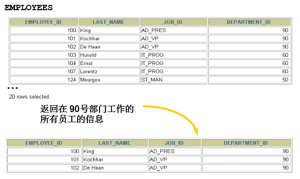

- 语法：

  ```sql
  SELECT 字段1,字段2
  FROM 表名
  WHERE 过滤条件
  ```

  - 使用WHERE 子句，将不满足条件的行过滤掉
  - **WHERE 子句紧随 FROM 子句**

- 举例：

  ```sql
  SELECT employee_id, last_name, job_id, department_id
  FROM employees
  WHERE department_id = 90 ;
  ```

  

------

## 三、运算符

### 1 算术运算符

算术运算符主要用于数学运算，其可以连接运算符前后的两个数值或表达式，对数值或表达式进行加（+）、减（-）、乘（*）、除（/）和取模（%）运算。


#### 1.1 加法与减法运算符

```sql
mysql> SELECT 100, 100 + 0, 100 - 0, 100 + 50, 100 + 50 - 30, 100 + 35.5, 100 - 35.5
FROM dual;
+-----+-----------+----------+------------+-----------------+--------------+--------------+
| 100 | 100 + 0   | 100 - 0  | 100 + 50   | 100 + 50 -30    | 100 + 35.5   | 100 - 35.5   |
+-----+-----------+----------+------------+-----------------+--------------+--------------+
| 100 | 100       | 100      | 150        | 120             | 135.5        | 64.5         |
+-----+-----------+----------+------------+-----------------+--------------+--------------+
1 row in set (0.00 sec)
```

由运算结果可以得出如下结论：

> - 一个整数类型的值对整数进行加法和减法操作，结果还是一个整数；
>
> - 一个整数类型的值对浮点数进行加法和减法操作，结果是一个浮点数；
>
> - 加法和减法的优先级相同，进行先加后减操作与进行先减后加操作的结果是一样的；
>
> - 在Java中，`+`的左右两边如果有字符串，那么表示字符串的拼接。但是在MySQL中`+`只表示数值相加。如果遇到非数值类型，先尝试转成数值，如果转失败，就按0计算。
>   
>  （补充：MySQL中字符串拼接要使用字符串函数CONCAT()实现）

#### 1.2 乘法与除法运算符

```sql
mysql> SELECT 100, 100 * 1, 100 * 1.0, 100 / 1.0, 100 / 2,100 + 2 * 5 / 2,100 /3, 100 DIV 0 
FROM dual;

+-----+---------+-----------+-----------+---------+-----------------+---------+-----------+
| 100 | 100 * 1 | 100 * 1.0 | 100 / 1.0 | 100 / 2 | 100 + 2 * 5 / 2 | 100 /3  | 100 DIV 0 |
+-----+---------+-----------+-----------+---------+-----------------+---------+-----------+
| 100 | 100     | 100.0     | 100.0000  | 50.0000 | 105.0000        | 33.3333 | NULL      |
+-----+---------+-----------+-----------+---------+-----------------+---------+-----------+
1 row in set (0.00 sec)

#计算出员工的年基本工资
SELECT employee_id, salary, salary * 12 annual_sal
FROM employees;
```

由运算结果可以得出如下结论：

> - 一个数乘以整数1和除以整数1后仍得原数；
> - 一个数乘以浮点数1.0和除以浮点数1.0后变成浮点数，数值与原数相等；
> - 一个数除以整数后，不管是否能除尽，结果都为一个浮点数；
> - 一个数除以另一个数，除不尽时，结果为一个浮点数，并保留到小数点后4位；
> - 乘法和除法的优先级相同，进行先乘后除操作与先除后乘操作，得出的结果相同。
> - 在数学运算中，0不能用作除数，在MySQL中，一个数除以0为NULL。

#### 1.3 求模（求余）运算符

```sql
mysql> SELECT 12 % 3, 12 MOD 5 FROM dual;
+--------+----------+
| 12 % 3 | 12 MOD 5 |
+--------+----------+
| 0      | 2        |
+--------+----------+
1 row in set (0.00 sec)

#筛选出employee_id是偶数的员工
SELECT * FROM employees
WHERE employee_id MOD 2 = 0;
```

### 2 比较运算符

比较运算符用来对表达式左边的操作数和右边的操作数进行比较，比较的结果为真则返回1，比较的结果为假则返回0，其他情况则返回NULL。

比较运算符经常被用来作为**SELECT查询语句的条件**来使用，返回符合条件的结果记录。


#### 2.1 等号运算符 =

- 等号运算符（=）判断等号两边的值、字符串或表达式是否相等，如果相等则返回1，不相等则返回0。
- 在使用等号运算符时，遵循如下规则：
  - 如果等号两边的值、字符串或表达式都为字符串，则MySQL会按照字符串进行比较，其比较的是每个字符串中字符的ANSI编码是否相等。
  - 如果等号两边的值都是整数，则MySQL会按照整数来比较两个值的大小。
  - 如果等号两边的值一个是整数，另一个是字符串，则MySQL会将字符串转化为数字进行比较，如果转换数值不成功，则看做0。
  - 如果等号两边的值、字符串或表达式中有一个为NULL，则比较结果为NULL。
- 对比：SQL中赋值符号使用 :=

```sql
mysql> SELECT 1 = 1, 1 = '1', 1 = 0, 'a' = 'a', (5 + 3) = (2 + 6), '' = NULL , NULL = NULL;
+-------+---------+-------+-----------+----------------------+-------------+------------------+
| 1 = 1 | 1 = '1' | 1 = 0 | 'a' = 'a' | (5 + 3) = (2 + 6)    | '' = NULL   | NULL = NULL      |
+-------+---------+-------+-----------+----------------------+-------------+------------------+
| 1     | 1       | 0     | 1         | 1                    | NULL        | NULL             |
+-------+---------+-------+-----------+----------------------+-------------+------------------+
1 row in set (0.00 sec)

mysql> SELECT 1 = 2, 0 = 'abc', 1 = 'abc' FROM dual;
+-------+-----------+-----------+
| 1 = 2 | 0 = 'abc' | 1 = 'abc' |
+-------+-----------+-----------+
| 0     | 1         | 0         |
+-------+-----------+-----------+
1 row in set, 2 warnings (0.00 sec)

#查询salary=10000，注意在Java中比较是==
SELECT 
	employee_id, salary 
FROM 
	employees 
WHERE 
	salary = 10000;
```

#### 2.2 安全等于运算符 <=>

安全等于运算符（<=>）与 等于运算符（=）的作用是相似的， 唯一的区别是`<=>`可以用来对NULL进行判断。在两个操作数均为NULL时，其返回值为1，而不为NULL；当一个操作数为NULL时，其返回值为0，而不为NULL。

```sql
mysql> 
SELECT 1 <=> '1', 1 <=> 0, 'a' <=> 'a', (5 + 3) <=> (2 + 6), '' <=> NULL, NULL <=> NULL 
FROM dual;
+-----------+-----------+-------------+---------------------+-------------+---------------------+
| 1 <=> '1' | 1 <=> 0   | 'a' <=> 'a' | (5 + 3) <=> (2 + 6) | '' <=> NULL | NULL <=> NULL       |
+-----------+-----------+-------------+---------------------+-------------+---------------------+
| 1         | 0         | 1           | 1                   | 0           | 1                   |
+-----------+-----------+-------------+---------------------+-------------+---------------------+
1 row in set (0.00 sec)

#查询commission_pct等于0.40
SELECT employee_id, commission_pct FROM employees WHERE commission_pct = 0.40;
SELECT employee_id, commission_pct FROM employees WHERE commission_pct <=> 0.40;
#如果把0.40改成 NULL 呢？
```

可以看到，使用安全等于运算符时，两边的操作数的值都为NULL时，返回的结果为1而不是NULL，其他返回结果与等于运算符相同。

> 注：<=>为NULL而生

#### 2.3 不等于运算符 <> !=

不等于运算符（<>和!=）用于判断两边的数字、字符串或者表达式的值是否不相等，如果不相等则返回1，相等则返回0。不等于运算符不能判断NULL值。如果两边的值有任意一个为NULL，或两边都为NULL，则结果为NULL。 SQL语句示例如下：

```mysql
mysql> SELECT 1 <> 1, 1 != 2, 'a' != 'b', (3+4) <> (2+6), 'a' != NULL, NULL <> NULL;
+---------+--------+------------+--------------------+--------------+---------------------+
| 1 <> 1  | 1 != 2 | 'a' != 'b' | (3+4) <> (2+6)     | 'a' != NULL  | NULL <> NULL        |
+---------+--------+------------+--------------------+--------------+---------------------+
| 0       | 1      | 1          | 1                  | NULL         | NULL                |
+---------+--------+------------+--------------------+--------------+---------------------+
1 row in set (0.00 sec)
```

此外，还有非符号类型的运算符：


#### 2.4 空运算符 IS NULL

空运算符（IS NULL 或者 ISNULL() ）判断一个值是否为NULL，如果为NULL则返回1，否则返回0。 

SQL语句示例如下：

```sql
mysql> SELECT NULL IS NULL, ISNULL(NULL), ISNULL('a'), 1 IS NULL;
+-------------------+--------------------+---------------+---------------+
| NULL IS NULL      | ISNULL(NULL)       | ISNULL('a')   | 1 IS NULL     |
+-------------------+--------------------+---------------+---------------+
| 1                 | 1                  | 0             | 0             |
+-------------------+--------------------+---------------+---------------+
1 row in set (0.00 sec)

#查询commission_pct等于NULL。比较如下的四种写法
SELECT employee_id,commission_pct FROM employees WHERE commission_pct IS NULL;
SELECT employee_id,commission_pct FROM employees WHERE commission_pct <=> NULL;
SELECT employee_id,commission_pct FROM employees WHERE ISNULL(commission_pct);
SELECT employee_id,commission_pct FROM employees WHERE commission_pct = NULL;#错误写法
```

```mysql
#练习：查询表中commission_pct为null的数据有哪些
SELECT last_name, salary, commission_pct
FROM employees
WHERE commission_pct IS NULL;
#或
SELECT last_name,salary,commission_pct
FROM employees
WHERE ISNULL(commission_pct);
```

#### 2.5 非空运算符 IS NOT NULL

非空运算符（IS NOT NULL）判断一个值是否不为NULL，如果不为NULL则返回1，否则返回0。 

SQL语句示例如下：

```sql
mysql> SELECT NULL IS NOT NULL, 'a' IS NOT NULL, 1 IS NOT NULL;
+--------------------------+----------------------+----------------------+
| NULL IS NOT NULL         | 'a' IS NOT NULL      | 1 IS NOT NULL        |
+--------------------------+----------------------+----------------------+
| 0                        | 1                    | 1                    |
+--------------------------+----------------------+----------------------+
1 row in set (0.01 sec)

#查询commission_pct不等于NULL
SELECT employee_id,commission_pct FROM employees WHERE commission_pct IS NOT NULL;
SELECT employee_id,commission_pct FROM employees WHERE NOT commission_pct <=> NULL;
SELECT employee_id,commission_pct FROM employees WHERE NOT ISNULL(commission_pct);
```

#### 2.6 最小值运算符 LEAST

语法格式为：LEAST(值1，值2，...，值n)。其中，“值n”表示参数列表中有n个值。在有两个或多个参数的情况下，返回最小值。

```sql
mysql> SELECT LEAST (1,0,2), LEAST('b','a','c'), LEAST(1,NULL,2);
+-------------------+----------------------+------------------------+
| LEAST (1,0,2)     | LEAST('b','a','c')   | LEAST(1,NULL,2)        |
+-------------------+----------------------+------------------------+
| 0                 | a                    | NULL                   |
+-------------------+----------------------+------------------------+
1 row in set (0.00 sec)
```

由结果可以看到

- 当参数是整数或者浮点数时，LEAST将返回其中最小的值；
- 当参数为字符串时，返回字
  母表中顺序最靠前的字符；
- 当比较值列表中有NULL时，不能判断大小，返回值为NULL。

#### 2.7 最大值运算符 GREATEST

语法格式为：GREATEST(值1，值2，...，值n)。其中，n表示参数列表中有n个值。当有两个或多个参数时，返回值为最大值。假如任意一个自变量为NULL，则GREATEST()的返回值为NULL。

```sql
mysql> SELECT GREATEST(1,0,2), GREATEST('b','a','c'), GREATEST(1,NULL,2);
+------------------------+---------------------------+------------------------------+
| GREATEST(1,0,2)        | GREATEST('b','a','c')     | GREATEST(1,NULL,2)           |
+------------------------+---------------------------+------------------------------+
| 2                      | c                         | NULL                         |
+------------------------+---------------------------+------------------------------+
1 row in set (0.00 sec)
```

由结果可以看到

- 当参数中是整数或者浮点数时，GREATEST将返回其中最大的值；
- 当参数为字符串时，
  返回字母表中顺序最靠后的字符；
- 当比较值列表中有NULL时，不能判断大小，返回值为NULL。

#### 2.8 BETWEEN AND 运算符

BETWEEN 运算符使用的格式通常为`SELECT D FROM TABLE WHERE C BETWEEN A AND B`，此时，当C大于或等于A，并且C小于或等于B时，结果为1，否则结果为0。

```sql
mysql> SELECT 1 BETWEEN 0 AND 1, 10 BETWEEN 11 AND 12, 'b' BETWEEN 'a' AND 'c';
+----------------------------+---------------------------------+--------------------------------+
| 1 BETWEEN 0 AND 1          | 10 BETWEEN 11 AND 12            | 'b' BETWEEN 'a' AND 'c'        |
+----------------------------+---------------------------------+--------------------------------+
| 1                          | 0                               | 1                              |
+----------------------------+---------------------------------+--------------------------------+
1 row in set (0.00 sec)
```

```sql
# BETWEEN 条件下界1 AND 条件上界2  （查询条件1和条件2范围内的数据，包含边界）
#查询工资在6000 到 8000的员工信息
SELECT employee_id,last_name,salary
FROM employees
#where salary between 6000 and 8000;
WHERE salary >= 6000 && salary <= 8000;

#交换6000 和 8000之后，查询不到数据
SELECT employee_id,last_name,salary
FROM employees
WHERE salary BETWEEN 8000 AND 6000;

#查询工资不在6000 到 8000的员工信息
SELECT employee_id,last_name,salary
FROM employees
WHERE salary NOT BETWEEN 6000 AND 8000;
#where salary < 6000 or salary > 8000;
```

#### 2.9 IN运算符

IN 运算符用于判断给定的值是否是IN列表中的一个值，如果是则返回1，否则返回0。

如果给
定的值为NULL，或者IN列表中存在NULL，则结果为NULL。

```sql
mysql> SELECT 'a' IN ('a','b','c'), 1 IN (2,3), NULL IN ('a','b'), 'a' IN ('a', NULL);
+----------------------+------------+----------------------+----------------------+
| 'a' IN ('a','b','c') | 1 IN (2,3) | NULL IN ('a','b')    | 'a' IN ('a', NULL)   |
+----------------------+------------+----------------------+----------------------+
| 1                    | 0          | NULL                 | 1                    |
+----------------------+------------+----------------------+----------------------+
1 row in set (0.00 sec)

# 查询部门为10,20,30部门的员工信息
SELECT last_name,salary,department_id
FROM employees
# where department_id = 10 or department_id = 20 or department_id = 30;
WHERE department_id IN (10,20,30);
```

#### 2.10 NOT IN运算符

NOT IN运算符用于判断给定的值是否不是IN列表中的一个值，如果不是IN列表中的一个值，则返回1，否则返回0。

```sql
mysql> SELECT 'a' NOT IN ('a','b','c'), 1 NOT IN (2,3);
+--------------------------+---------------------+
| 'a' NOT IN ('a','b','c') | 1 NOT IN (2,3)      |
+--------------------------+---------------------+
| 0                        | 1                   |
+--------------------------+---------------------+
1 row in set (0.00 sec)

# 查询工资不是6000,7000,8000的员工信息
SELECT last_name,salary,department_id
FROM employees
WHERE salary NOT IN (6000,7000,8000);
```

#### 2.11 LIKE运算符

LIKE运算符主要用来匹配字符串，通常用于模糊匹配，如果满足条件则返回1，否则返回0。如果给定的值或者匹配条件为NULL，则返回结果为NULL。

LIKE运算符通常使用如下通配符：

```
“ % ”：匹配0个或多个字符。
“ _ ”：只能匹配一个字符。
```

SQL语句示例如下：

```sql
mysql> SELECT NULL LIKE 'abc', 'abc' LIKE NULL;
+---------------------+----------------------+
| NULL LIKE 'abc'     | 'abc' LIKE NULL      |
+---------------------+----------------------+
| NULL                | NULL                 |
+---------------------+----------------------+
1 row in set (0.00 sec)
```

```sql
#练习：查询last_name中包含字符'a'的员工信息
SELECT last_name
FROM employees
WHERE last_name LIKE '%a%';

#练习：查询last_name中以字符'a'开头的员工信息
SELECT last_name
FROM employees
WHERE last_name LIKE 'a%';

#练习：查询last_name中包含字符'a'且包含字符'e'的员工信息
#写法1：
SELECT last_name
FROM employees
WHERE last_name LIKE '%a%' AND last_name LIKE '%e%';
#写法2：
SELECT last_name
FROM employees
WHERE last_name LIKE '%a%e%' OR last_name LIKE '%e%a%';

#练习：查询第2个字符是'a'的员工信息
SELECT last_name
FROM employees
WHERE last_name LIKE '_a%';

#练习：查询第2个字符是_且第3个字符是'a'的员工信息
#需要使用转义字符: \ 
SELECT last_name
FROM employees
WHERE last_name LIKE '_\_a%';

#或者  (了解) 指定某个符号为转义字符
SELECT last_name
FROM employees
WHERE last_name LIKE '_$_a%' ESCAPE '$';
```

ESCAPE

- 回避特殊符号的：使用转义符。例如：将[%]转为[$%]、[]转为[$]，然后再加上[ESCAPE‘$’]即可。

  ```sql
  SELECT job_id
  FROM jobs
  WHERE job_id LIKE ‘IT\_%‘;
  ```

- 如果使用\表示转义，要省略ESCAPE。如果不是\，则要加上ESCAPE。

  ```sql
  SELECT job_id
  FROM jobs
  WHERE job_id LIKE ‘IT$_%‘ escape ‘$‘;
  ```

#### 2.12 REGEXP运算符

REGEXP运算符用来匹配字符串，语法格式为： expr REGEXP 匹配条件 。

如果expr满足匹配条件，返回1；如果不满足，则返回0。

若expr或匹配条件任意一个为NULL，则结果为NULL。


REGEXP运算符在进行匹配时，常用的有下面几种通配符：

```
1. '^'匹配以该字符后面的字符开头的字符串。
2. '$'匹配以该字符前面的字符结尾的字符串。
3. '.'匹配任何一个单字符。
4. '[...]'匹配在方括号内的任何字符。
例如，"[abc]"匹配"a"或"b"或"c"。为了命名字符的范围，使用一个'-'。"[a-z]"匹配任何小写字母，而"[0-9]"匹配任何数字。
5. '\*'匹配零个或多个在它前面的字符。例如，"x*"匹配任何数量的'x'字符，"[0-9]*"匹配任何数量的数字，而"*"匹配任何数量的任何字符。
```


SQL语句示例如下：

```sql
mysql> SELECT 'shkstart' REGEXP '^s', 'shkstart' REGEXP 't$', 'shkstart' REGEXP 'hk';
+-----------------------------+-----------------------------+-------------------------------+
| 'shkstart' REGEXP '^s'      | 'shkstart' REGEXP 't$'      | 'shkstart' REGEXP 'hk'        |
+-----------------------------+-----------------------------+-------------------------------+
| 1                           | 1                           | 1                             |
+-----------------------------+-----------------------------+-------------------------------+
1 row in set (0.01 sec)

mysql> SELECT 'atguigu' REGEXP 'gu.gu', 'atguigu' REGEXP '[ab]';
+---------------------------------+--------------------------------+
| 'atguigu' REGEXP 'gu.gu'        | 'atguigu' REGEXP '[ab]'        |
+---------------------------------+--------------------------------+
| 1                               | 1                              |
+---------------------------------+--------------------------------+
```

### 3 逻辑运算符

逻辑运算符主要用来判断表达式的真假，在MySQL中，逻辑运算符的返回结果为1、0或者NULL。

MySQL中支持4种逻辑运算符如下：

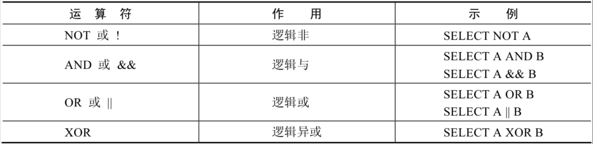

#### 3.1 逻辑非运算符 NOT !

逻辑非（NOT或!）运算符表示当给定的值为0时返回1；当给定的值为非0值时返回0；当给定的值为NULL时，返回NULL。

```sql
mysql> SELECT NOT 1, NOT 0, NOT(1+1), NOT !1, NOT NULL;
+---------+---------+--------------+----------+---------------+
| NOT 1   | NOT 0   | NOT(1+1)     | NOT !1   | NOT NULL      |
+---------+---------+--------------+----------+---------------+
| 0       | 1       | 0            | 1        | NULL          |
+---------+---------+--------------+----------+---------------+
1 row in set, 1 warning (0.00 sec)

SELECT last_name, salary, department_id
FROM employees
#where salary not between 6000 and 8000;
#where commission_pct is not null;
WHERE NOT commission_pct <=> NULL;

SELECT last_name, job_id
FROM employees
WHERE job_id NOT IN ('IT_PROG', 'ST_CLERK', 'SA_REP');
```

#### 3.2 逻辑与运算符 AND &&

逻辑与（AND或&&）运算符是当给定的所有值均为非0值，并且都不为NULL时，返回1；当给定的一个值或者多个值为0时则返回0；否则返回NULL。

```sql
mysql> SELECT 1 AND -1, 0 AND 1, 0 AND NULL, 1 AND NULL;
+------------+------------+----------------+------------------+
| 1 AND -1   | 0 AND 1    | 0 AND NULL     | 1 AND NULL       |
+------------+------------+----------------+------------------+
| 1          | 0          | 0              | NULL             |
+------------+------------+----------------+------------------+
1 row in set (0.00 sec)

SELECT employee_id, last_name, job_id, salary
FROM employees
WHERE salary >=10000
AND job_id LIKE '%MAN%';
```

#### 3.3 逻辑或运算符 OR ||

逻辑或（OR或||）运算符是当给定的值都不为NULL，并且任何一个值为非0值时，则返回1，否则返回0；当一个值为NULL，并且另一个值为非0值时，返回1，否则返回NULL；当两个值都为NULL时，返回NULL。

```sql
mysql> SELECT 1 OR -1, 1 OR 0, 1 OR NULL, 0 || NULL, NULL || NULL;
+-----------+----------+---------------+-------------+-------------------+
| 1 OR -1   | 1 OR 0   | 1 OR NULL     | 0 || NULL   | NULL || NULL      |
+-----------+----------+---------------+-------------+-------------------+
| 1         | 1        | 1             | NULL        | NULL              |
+-----------+----------+---------------+-------------+-------------------+
1 row in set, 2 warnings (0.00 sec)

SELECT employee_id,salary FROM employees
WHERE salary < 9000 OR salary > 12000;

SELECT employee_id, last_name, job_id, salary
FROM employees
WHERE salary >= 10000
OR job_id LIKE '%MAN%';
```

> 注意：OR可以和AND一起使用，但是在使用时要注意两者的优先级，由于AND的优先级高于OR，因此先对AND两边的操作数进行操作，再与OR中的操作数结合。

#### 3.4 逻辑异或运算符 XOR

逻辑异或（XOR）运算符是当给定的值中任意一个值为NULL时，则返回NULL；如果两个非NULL的值都是0或者都不等于0时，则返回0；如果一个值为0，另一个值不为0时，则返回1。

```sql
mysql> SELECT 1 XOR -1, 1 XOR 0, 0 XOR 0, 1 XOR NULL, 1 XOR 1 XOR 1, 0 XOR 0 XOR 0;
+------------+------------+------------+-----------------+---------------------+---------------------+
| 1 XOR -1   | 1 XOR 0    | 0 XOR 0    | 1 XOR NULL      | 1 XOR 1 XOR 1       | 0 XOR 0 XOR 0       |
+------------+------------+------------+-----------------+---------------------+---------------------+
| 0          | 1          | 0          | NULL            | 1                   | 0                   |
+------------+------------+------------+-----------------+---------------------+---------------------+
1 row in set (0.00 sec)

select last_name,department_id,salary
from employees
where department_id in (10,20) XOR salary > 8000;
```

### 4 位运算符

位运算符是在二进制数上进行计算的运算符。位运算符会先将操作数变成二进制数，然后进行位运算，最后将计算结果从二进制变回十进制数。

MySQL支持的位运算符如下：


#### 4.1 按位与运算符 &

按位与（&）运算符将给定值对应的二进制数逐位进行逻辑与运算。

当给定值对应的二进制位的数值都为1时，则该位返回1，否则返回0。(全1为1，有0为0)

```sql
mysql> SELECT 1 & 10, 20 & 30;
+--------+---------+
| 1 & 10 | 20 & 30 |
+--------+---------+
| 0      | 20      |
+--------+---------+
1 row in set (0.00 sec)
```

1的二进制数为0001，10的二进制数为1010，所以1 & 10的结果为0000，对应的十进制数为0。

20的二进制数为10100，30的二进制数为11110，所以20 & 30的结果为10100，对应的十进制数为20。

#### 4.2 按位或运算符 |

按位或（|）运算符将给定的值对应的二进制数逐位进行逻辑或运算。

当给定值对应的二进制位的数值有一个或两个为1时，则该位返回1，否则返回0。(有1为1，全0为0)

```sql
mysql> SELECT 1 | 10, 20 | 30;
+--------+---------+
| 1 | 10 | 20 | 30 |
+--------+---------+
| 11     | 30      |
+--------+---------+
1 row in set (0.00 sec)
```

1的二进制数为0001，10的二进制数为1010，所以1 | 10的结果为1011，对应的十进制数为11。

20的二进制数为10100，30的二进制数为11110，所以20 | 30的结果为11110，对应的十进制数为30。

#### 4.3 按位异或运算符 ^

按位异或（^）运算符将给定的值对应的二进制数逐位进行逻辑异或运算。

当给定值对应的二进制位的数值不同时，则该位返回1，否则返回0。(相同为0，不同为1)

```sql
mysql> SELECT 1 ^ 10, 20 ^ 30;
+--------+---------+
| 1 ^ 10 | 20 ^ 30 |
+--------+---------+
| 11     | 10      |
+--------+---------+
1 row in set (0.00 sec)
```

1的二进制数为0001，10的二进制数为1010，所以1 ^ 10的结果为1011，对应的十进制数为11。

20的二进制数为10100，30的二进制数为11110，所以20 ^ 30的结果为01010，对应的十进制数为10。

再举例：

```sql
mysql> SELECT 12 & 5, 12 | 5, 12 ^ 5 FROM DUAL;
+--------+--------+--------+
| 12 & 5 | 12 | 5 | 12 ^ 5 |
+--------+--------+--------+
| 4      | 13     | 9      |
+--------+--------+--------+
1 row in set (0.00 sec)
```


#### 4.4 按位取反运算符 ~

按位取反（~）运算符将给定的值的二进制数逐位进行取反操作，即将1变为0，将0变为1。

```sql
mysql> SELECT 10 & ~1;
+---------+
| 10 & ~1 |
+---------+
| 10      |
+---------+
1 row in set (0.00 sec)
```

由于按位取反（~）运算符的优先级高于按位与（&）运算符的优先级，所以10 & ~1，首先，对数字1进行按位取反操作，结果除了最低位为0，其他位都为1，然后与10进行按位与操作，结果为10。

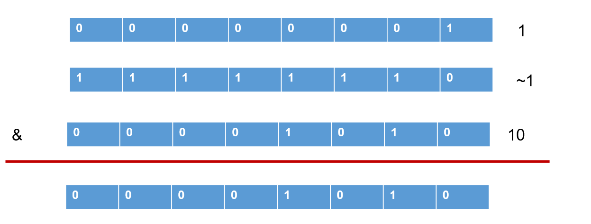

#### 4.5 按位右移运算符 >>

按位右移（>>）运算符将给定的值的二进制数的所有位右移指定的位数。

右移指定的位数后，右边低位的数值被移出并丢弃，左边高位空出的位置用0补齐。

```sql
mysql> SELECT 1 >> 2, 4 >> 2;
+---------+----------+
| 1 >> 2  | 4 >> 2   |
+---------+----------+
| 0       | 1        |
+---------+----------+
1 row in set (0.00 sec)
```

1的二进制数为0000 0001，右移2位为0000 0000，对应的十进制数为0。

4的二进制数为0000 0100，右移2位为0000 0001，对应的十进制数为1。

#### 4.6 按位左移运算符 <<

按位左移（<<）运算符将给定的值的二进制数的所有位左移指定的位数。

左移指定的位数后，左边高位的数值被移出并丢弃，右边低位空出的位置用0补齐。

```sql
mysql> SELECT 1 << 2, 4 << 2;
+---------+---------+
| 1 << 2  | 4 << 2  |
+---------+---------+
| 4       | 16      |
+---------+---------+
1 row in set (0.00 sec)
```

1的二进制数为0000 0001，左移两位为0000 0100，对应的十进制数为4。

4的二进制数为0000 0100，左移两位为0001 0000，对应的十进制数为16。

> 结论：在一定范围内满足：每向左移动1位，相当于乘以2；每向右移动一位，相当于除以2。

### 5 运算符的优先级


数字编号越大，优先级越高，优先级高的运算符先进行计算。可以看到，赋值运算符的优先级最低，使用“()”括起来的表达式的优先级最高。

### 拓展：使用正则表达式查询

正则表达式通常被用来检索或替换那些符合某个模式的文本内容，根据指定的匹配模式匹配文本中符合要求的特殊字符串。例如，从一个文本文件中提取电话号码，查找一篇文章中重复的单词或者替换用户输入的某些敏感词语等，这些地方都可以使用正则表达式。正则表达式强大而且灵活，可以应用于非常复杂的查询。

MySQL中使用 REGEXP 关键字指定正则表达式的字符匹配模式。

下表列出了REGEXP操作符中常用字符匹配
列表。


1. 查询以特定字符或字符串开头的记录：字符‘^’匹配以特定字符或者字符串开头的文本。

   在fruits表中，查询f_name字段以字母‘b’开头的记录，SQL语句如下：

   ```sql
   SELECT * FROM fruits WHERE f_name REGEXP '^b';
   ```

2. 查询以特定字符或字符串结尾的记录：字符‘$’匹配以特定字符或者字符串结尾的文本。

   在fruits表中，查询f_name字段以字母‘y’结尾的记录，SQL语句如下：

   ```sql
   SELECT * FROM fruits WHERE f_name REGEXP 'y$';
   ```

3.  用符号"."来替代字符串中的任意一个字符：字符‘.’匹配任意一个字符。

    在fruits表中，查询f_name字段值包含字母‘a’与‘g’且两个字母之间只有一个字母的记录，SQL语句如下：
   
   ```sql
   SELECT * FROM fruits WHERE f_name REGEXP 'a.g';
   ```
   
4. 使用"\*"和"+"来匹配多个字符：

   - 星号‘\*’匹配前面的字符任意多次，包括0次。
   - 加号‘+’匹配前面的字符至
     少一次。

   在fruits表中，查询f_name字段值以字母‘b’开头且‘b’后面出现字母‘a’的记录，SQL语句如下：

   ```sql
   SELECT * FROM fruits WHERE f_name REGEXP '^ba*';
   ```

   在fruits表中，查询f_name字段值以字母‘b’开头且‘b’后面出现字母‘a’至少一次的记录，SQL语句如下：

   ```sql
   SELECT * FROM fruits WHERE f_name REGEXP '^ba+';
   ```

5. 匹配指定字符串

   正则表达式可以匹配指定字符串，只要这个字符串在查询文本中即可，如要匹配多个字符串，多个字符串之间使用分隔符‘|’隔开。
   
   在fruits表中，查询f_name字段值包含字符串“on”的记录，SQL语句如下：
   
   ```sql
   SELECT * FROM fruits WHERE f_name REGEXP 'on';
   ```
   
   在fruits表中，查询f_name字段值包含字符串“on”或者“ap”的记录，SQL语句如下：
   
   ```sql
   SELECT * FROM fruits WHERE f_name REGEXP 'on|ap';
   ```
   
   之前介绍过，LIKE运算符也可以匹配指定的字符串，但与REGEXP不同，LIKE匹配的字符串如果在文本中间出现，则找不到它，相应的行也不会返回。REGEXP在文本内进行匹配，如果被匹配的字符串在文本中出现，REGEXP将会找到它，相应的行也会被返回。对比结果如下所示。
   
   在fruits表中，使用LIKE运算符查询f_name字段值为“on”的记录，SQL语句如下：
   
   ```sql
   SELECT * FROM fruits WHERE f_name like 'on';
   Empty set(0.00 sec)
   ```
   
6. 匹配指定字符中的任意一个

   方括号“[]”指定一个字符集合，只匹配其中任何一个字符，即为所查找的文本。
   
   在fruits表中，查找f_name字段中包含字母‘o’或者‘t’的记录，SQL语句如下：
   
   ```sql
   SELECT * FROM fruits WHERE f_name REGEXP '[ot]';
   ```
   
   在fruits表中，查询s_id字段中包含4、5或者6的记录，SQL语句如下：
   
   ```sql
   SELECT * FROM fruits WHERE s_id REGEXP '[456]';
   ```
   
7. 匹配指定字符以外的字符

   “\[^字符集合]” 匹配不在指定集合中的任何字符。

   在fruits表中，查询f_id字段中包含字母a~e和数字1~2以外字符的记录，SQL语句如下：

   ```sql
   SELECT * FROM fruits WHERE f_id REGEXP '[^a-e1-2]';
   ```

8. 使用{n,}或者{n,m}来指定字符串连续出现的次数

   “字符串{n,}”表示至少匹配n次前面的字符；“字符串{n,m}”表示匹配前面的字符串不少于n次，不多于m次。
   
   例如，a{2,}表示字母a连续出现至少2次，也可以大于2次；a{2,4}表示字母a连续出现最少2次，最多不能超过4次。
   
   在fruits表中，查询f_name字段值出现字母‘x’至少2次的记录，SQL语句如下：

   ```sql
   SELECT * FROM fruits WHERE f_name REGEXP 'x{2,}';
   ```
   
   在fruits表中，查询f_name字段值出现字符串“ba”最少1次、最多3次的记录，SQL语句如下：

   ```sql
   SELECT * FROM fruits WHERE f_name REGEXP 'ba{1,3}';
   ```

------

## 四、排序与分页

### 1 排序数据

#### 1.1 排序规则

- 使用 ORDER BY 子句排序
  - ASC（ascend）: 升序 默认为升序
  - DESC（descend）: 降序
- ORDER BY 子句在SELECT语句的结尾。

#### 1.2 单列排序

```mysql
SELECT last_name, job_id, department_id, hire_date
FROM employees
ORDER BY hire_date ;
```


```sql
SELECT last_name, job_id, department_id, hire_date
FROM employees
ORDER BY hire_date DESC ;
```


```sql
SELECT employee_id, last_name, salary*12 annsal
FROM employees
ORDER BY annsal;
```


#### 1.3 多列排序

```sql
SELECT last_name, department_id, salary
FROM employees
ORDER BY department_id, salary DESC;
```


- 可以使用不在SELECT列表中的列排序。
- 在对多列进行排序的时候，首先排序的第一列必须有相同的列值，才会对第二列进行排序。如果第一列数据中所有值都是唯一的，将不再对第二列进行排序。

### 2 分页

#### 2.1 背景

- 背景1：查询返回的记录太多了，查看起来很不方便，怎么样能够实现分页查询呢？
- 背景2：表里有 4 条数据，我们只想要显示第 2、3 条数据怎么办呢？

#### 2.2 实现规则

- 分页原理

  所谓分页显示，就是将数据库中的结果集，一段一段显示出来需要的条件。

- MySQL中使用 **LIMIT** 实现分页

- 格式：

  ```sql
  LIMIT [位置偏移量] 行数;
  ```

  第一个“位置偏移量”参数指示MySQL从哪一行开始显示，是一个可选参数，如果不指定“位置偏移量”，将会从表中的第一条记录开始（第一条记录的位置偏移量是0，第二条记录的位置偏移量是1，以此类推）；第二个参数“行数”指示返回的记录条数。
  
- 举例：

  ```sql
  -- 前10条记录：
  SELECT * FROM 表名 LIMIT 0,10;
  或者
  SELECT * FROM 表名 LIMIT 10;
  
  -- 第11至20条记录：
  SELECT * FROM 表名 LIMIT 10,10;
  
  -- 第21至30条记录：
  SELECT * FROM 表名 LIMIT 20,10;
  ```

  > MySQL 8.0中可以使用“LIMIT 3 OFFSET 4”，意思是获取从第5条记录开始后面的3条记录，和“LIMIT 4,3;”返回的结果相同。
  
- 分页显式公式：(当前页数-1) * 每页条数，每页条数

  ```sql
  SELECT * FROM table
  LIMIT (PageNo - 1) * PageSize, PageSize;
  ```

- **注意：LIMIT 子句必须放在整个SELECT语句的最后！**

- 使用 LIMIT 的好处

  约束返回结果的数量可以减少数据表的网络传输量 ，也可以提升查询效率 。如果我们知道返回结果只有1条，就可以使用 LIMIT 1 ，告诉 SELECT 语句只需要返回一条记录即可。这样的好处就是 SELECT 不需要扫描完整的表，只需要检索到一条符合条件的记录即可返回。

#### 2.3 拓展

在不同的 DBMS 中使用的关键字可能不同。在 MySQL、PostgreSQL、MariaDB 和 SQLite 中使用 LIMIT 关键字，而且需要放到 SELECT 语句的最后面。

- 如果是 SQL Server 和 Access，需要使用 TOP 关键字，比如：

  ```mssql
  SELECT TOP 5 name, hp_max FROM heros ORDER BY hp_max DESC
  ```

- 如果是 DB2，使用 FETCH FIRST 5 ROWS ONLY 这样的关键字：

  ```sql
  SELECT name, hp_max FROM heros ORDER BY hp_max DESC FETCH FIRST 5 ROWS ONLY
  ```

- 如果是 Oracle，你需要基于 ROWNUM 来统计行数：

  ```sql
  SELECT rownum,last_name,salary FROM employees WHERE rownum < 5 ORDER BY salary DESC;
  ```

  需要说明的是，这条语句是先取出来前 5 条数据行，然后再按照 hp_max 从高到低的顺序进行排序。但这样产生的结果和上述方法的并不一样。我会在后面讲到子查询，你可以使用

  ```sql
  SELECT rownum, last_name, salary
  FROM (
  	SELECT last_name, salary
  	FROM employees
  	ORDER BY salary DESC)
  WHERE rownum < 10;
  ```

  得到与上述方法一致的结果。

------

## 五、多表查询

多表查询，也称为关联查询，指两个或更多个表一起完成查询操作。

前提条件：这些一起查询的表之间是有关系的（一对一、一对多），它们之间一定是有关联字段，这个关联字段可能建立了外键，也可能没有建立外键。比如：员工表和部门表，这两个表依靠“部门编号”进行关联。

### 1 一个案例引发的多表连接

#### 1.1 案例说明


从多个表中获取数据：

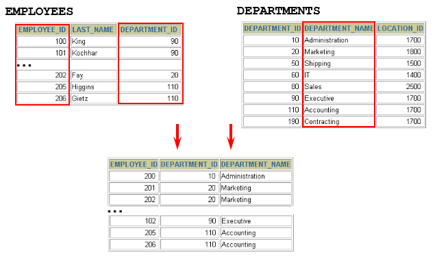

```mysql
#案例：查询员工的姓名及其部门名称
SELECT last_name, department_name
FROM employees, departments;
```

查询结果：

```mysql
+-----------+----------------------+
| last_name | department_name      |
+-----------+----------------------+
| King      | Administration       |
| King 	    | Marketing            |
| King      | Purchasing           |
| King      | Human Resources      |
| King      | Shipping             |
| King      | IT                   |
| King      | Public Relations     |
| King      | Sales                |
| King      | Executive            |
| King      | Finance              |
| King      | Accounting           |
| King      | Treasury             |
...
| Gietz     | IT Support           |
| Gietz     | NOC                  |
| Gietz     | IT Helpdesk          |
| Gietz     | Government Sales     |
| Gietz     | Retail Sales         |
| Gietz     | Recruiting           |
| Gietz     | Payroll              |
+-----------+----------------------+
2889 rows in set (0.01 sec)
```

分析错误情况：

```mysql
SELECT COUNT(employee_id) FROM employees;#输出107行

SELECT COUNT(department_id)FROM departments;#输出27行

SELECT 107*27 FROM dual;#2889
```

我们把上述多表查询中出现的问题称为：笛卡尔积的错误。

#### 1.2 笛卡尔积（或交叉连接）的理解

笛卡尔乘积是一个数学运算。假设我有两个集合 X 和 Y，那么 X 和 Y 的笛卡尔积就是 X 和 Y 的所有可能组合，也就是第一个对象来自于 X，第二个对象来自于 Y 的所有可能。组合的个数即为两个集合中元素个数的乘积数。

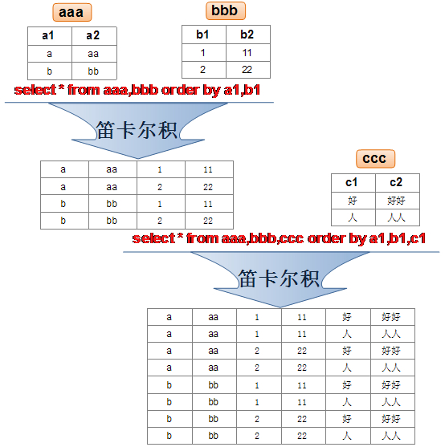

SQL92中，笛卡尔积也称为交叉连接，英文是 CROSS JOIN。在 SQL99 中也是使用 CROSS JOIN表示交叉连接。它的作用就是可以把任意表进行连接，即使这两张表不相关。在MySQL中如下情况会出现笛卡尔积：

```mysql
#查询员工姓名和所在部门名称
SELECT last_name, department_name FROM employees, departments;
SELECT last_name, department_name FROM employees CROSS JOIN departments;
SELECT last_name, department_name FROM employees INNER JOIN departments;
SELECT last_name, department_name FROM employees JOIN departments;
```

#### 1.3 案例分析与问题解决

- 笛卡尔积的错误会在下面条件下产生：

  - 省略多个表的连接条件（或关联条件）
  - 连接条件（或关联条件）无效
  - 所有表中的所有行互相连接

- 为了避免笛卡尔积，可以**在 WHERE 加入有效的连接条件。**

- 加入连接条件后，查询语法：**在 WHERE子句中写入连接条件。**

  ```mysql
  SELECT table1.column, table2.column
  FROM table1, table2
  WHERE table1.column1 = table2.column2; #连接条件
  ```

- 正确写法：

  ```mysql
  #案例：查询员工的姓名及其部门名称
  SELECT last_name, department_name
  FROM employees, departments
  WHERE employees.department_id = departments.department_id;
  ```

- 在表中有相同列时，在列名之前加上表名前缀。

### 2 多表查询分类讲解

#### 2.1 等值连接 vs 非等值连接

##### 2.1.1 等值连接


```mysql
SELECT 
	employees.employee_id, employees.last_name,
	employees.department_id, departments.department_id,
	departments.location_id
FROM employees, departments
WHERE employees.department_id = departments.department_id;
```

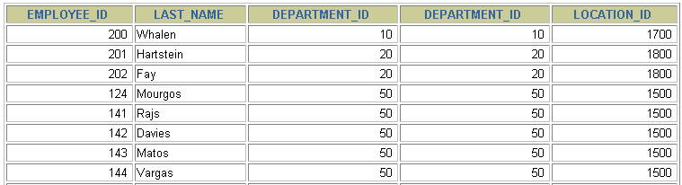

**拓展1：多个连接条件与 AND 操作符**


**拓展2：区分重复的列名**

- **多个表中有相同列时，必须在列名之前加上表名前缀。**
- 在不同表中具有相同列名的列可以用**表名**加以区分。

```sql
SELECT employees.last_name, departments.department_name, employees.department_id
FROM employees, departments
WHERE employees.department_id = departments.department_id;
```

**拓展3：表的别名**

- 使用别名可以简化查询。
- 列名前使用表名前缀可以提高查询效率。

```mysql
SELECT 
	e.employee_id, e.last_name, e.department_id,
	d.department_id, d.location_id
FROM employees e, departments d
WHERE e.department_id = d.department_id;
```

> 需要注意的是，如果我们使用了表的别名，在查询字段中、过滤条件中就只能使用别名进行代替，不能使用原有的表名，否则就会报错。

> `阿里开发规范`：【`强制`】对于数据库中表记录的查询和变更，只要涉及多个表，都需要在列名前加表的别名（或表名）进行限定。
>
> `说明`：对多表进行查询记录、更新记录、删除记录时，如果对操作列没有限定表的别名（或表名），并且操作列在多个表中存在时，就会抛异常。
>
> `正例`：select t1.name from table_first as t1 , table_second as t2 where t1.id = t2.id;
>
> `反例`：在某业务中，由于多表关联查询语句没有加表的别名（或表名）的限制，正常运行两年后，最近在某个表中增加一个同名字段，在预发布环境做数据库变更后，线上查询语句出现出1052 异常：Column 'name' in field list is ambiguous。

**拓展4：连接多个表**


总结：连接 n个表，至少需要n-1个连接条件。比如，连接三个表，至少需要两个连接条件。

```mysql
# 练习：查询出公司员工的 last_name, department_name, city
SELECT 
	e.last_name, d.department_name, l.city
FROM 
	employees e, departments d, locations l
WHERE 
	e.department_id = d.department_id 
AND 
	d.location_id = l.location_id;
```

##### 2.1.2 非等值连接


```mysql
SELECT 
	e.last_name, e.salary, g.grade_level
FROM 
	employees e, job_grades g
WHERE 
	e.salary BETWEEN g.lowest_sal AND g.highest_sal;
```


#### 2.2 自连接 vs 非自连接


当 table1 和 table2 本质上是同一张表，只是用取别名的方式虚拟成两张表以代表不同的意义。然后两个表再进行内连接，外连接等查询。

题目：查询employees表，返回“Xxx works for Xxx”

```mysql
SELECT 
	CONCAT(worker.last_name, ' works for ', manager.last_name)
FROM 
	employees worker, employees manager
WHERE 
	worker.manager_id = manager.employee_id;
```


练习：查询出last_name为 ‘Chen’ 的员工的 manager 的信息。

```mysql
SELECT 
	worker.last_name "员工名", manager.last_name "领导名"
FROM 
	employees worker, employees manager
WHERE
	worker.manager_id = manager.employee_id
AND
	worker.last_name = 'Chen';
```

#### 2.3 内连接 vs 外连接

除了查询满足条件的记录以外，外连接还可以查询某一方不满足条件的记录。

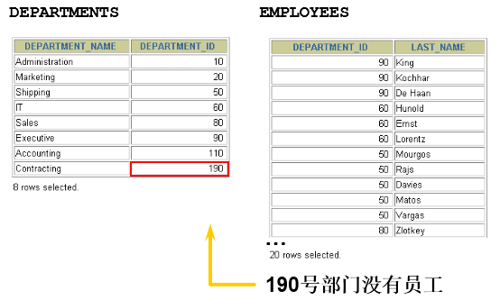

- 内连接: 合并具有同一列的两个以上的表的行，**结果集中不包含一个表与另一个表不匹配的行**

- 外连接: 两个表在连接过程中除了返回满足连接条件的行以外还**返回左（或右）表中不满足条件的行，这种连接称为左（或右）外连接。**没有匹配的行时，结果表中相应的列为空(NULL)。

- 如果是左外连接，则连接条件中左边的表也称为 主表 ，右边的表称为 从表 。

  如果是右外连接，则连接条件中右边的表也称为 主表 ，左边的表称为 从表 。

SQL92：使用(+)创建连接

- 在 SQL92 中采用（+）代表从表所在的位置。即左或右外连接中，**(+) 表示哪个是从表。**

- Oracle 对 SQL92 支持较好，而 MySQL 则不支持 SQL92 的外连接。

  ```mysql
  #左外连接 
  SELECT last_name, department_name
  FROM employees, departments
  WHERE employees.department_id = departments.department_id(+);
  
  #右外连接
  SELECT last_name, department_name
  FROM employees, departments
  WHERE employees.department_id(+) = departments.department_id;
  ```

- 而且在 SQL92 中，只有左外连接和右外连接，没有满（或全）外连接。

### 3 SQL99语法实现多表查询

#### 3.1 基本语法

- 使用JOIN...ON子句创建连接的语法结构：

  ```mysql
  SELECT 
  	table1.column, table2.column, table3.column
  FROM 
  	table1
  JOIN 
  	table2 ON table1 和 table2 的连接条件
  JOIN 
  	table3 ON table2 和 table3 的连接条件
  ```

  它的嵌套逻辑类似我们使用的 FOR 循环：

  ```mysql
  for t1 in table1:
  	for t2 in table2:
  		if condition1:
  			for t3 in table3:
  				if condition2:
  					output t1 + t2 + t3
  ```

  SQL99 采用的这种嵌套结构非常清爽、层次性更强、可读性更强，即使再多的表进行连接也都清晰可见。如果你采用 SQL92，可读性就会大打折扣。

- 语法说明：

  - **可以使用 ON 子句指定额外的连接条件。**
  - 这个连接条件是与其它条件分开的。
  - **ON 子句使语句具有更高的易读性。**
  - 关键字 JOIN、INNER JOIN、CROSS JOIN 的含义是一样的，都表示内连接。

#### 3.2 内连接 (INNER JOIN) 的实现

- 语法：

  ```mysql
  SELECT 字段列表
  FROM A表 INNER JOIN B表
  ON 关联条件
  WHERE 等其他子句;
  ```

  题目1：

  ```mysql
  SELECT 
  	e.employee_id, e.last_name, e.department_id,
  	d.department_id, d.location_id
  FROM 
  	employees e 
  JOIN 
  	departments d
  ON 
  	e.department_id = d.department_id;
  ```

  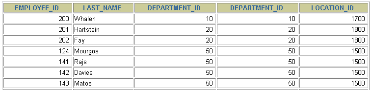

  题目2：

  ```mysql
  SELECT 
  	employee_id, city, department_name
  FROM 
  	employees e
  JOIN departments d ON d.department_id = e.department_id
  JOIN locations l ON d.location_id = l.location_id;
  ```

  

#### 3.3 外连接(OUTER JOIN)的实现

##### 3.3.1 左外连接(LEFT OUTER JOIN)

- 语法：

  ```mysql
  #实现查询结果是A
  SELECT 字段列表
  FROM A表 LEFT JOIN B表
  ON 关联条件
  WHERE 等其他子句;
  ```

- 举例：

  ```mysql
  SELECT 
  	e.last_name, e.department_id, d.department_name
  FROM 
  	employees e
  LEFT OUTER JOIN 
  	departments d
  ON 
  	e.department_id = d.department_id ;
  ```

  

##### 3.3.2 右外连接(RIGHT OUTER JOIN)

- 语法：

  ```mysql
  #实现查询结果是B
  SELECT 字段列表
  FROM A表 RIGHT JOIN B表
  ON 关联条件
  WHERE 等其他子句;
  ```

- 举例：

  ```mysql
  SELECT 
  	e.last_name, e.department_id, d.department_name
  FROM 
  	employees e
  RIGHT OUTER JOIN 
  	departments d
  ON 
  	e.department_id = d.department_id;
  ```

  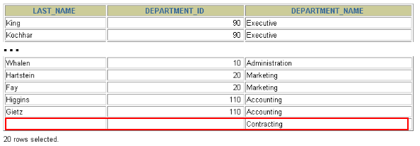

> 需要注意的是，LEFT JOIN 和 RIGHT JOIN 只存在于 SQL99 及以后的标准中，在 SQL92 中不存在，只能用 (+) 表示。

##### 3.3.3 满外连接(FULL OUTER JOIN)

- 满外连接的结果 = 左右表匹配的数据 + 左表没有匹配到的数据 + 右表没有匹配到的数据。
- SQL99是支持满外连接的。使用FULL JOIN 或 FULL OUTER JOIN来实现。
- 需要注意的是，MySQL不支持FULL JOIN，但是可以用 LEFT JOIN UNION RIGHT JOIN代替。

### 4 UNION的使用

**合并查询结果** 利用UNION关键字，可以给出多条SELECT语句，并将它们的结果组合成单个结果集。合并时，两个表对应的列数和数据类型必须相同，并且相互对应。各个SELECT语句之间使用`UNION`或`UNION ALL`关键字分隔。

语法格式：

```mysql
SELECT column,... FROM table1
UNION [ALL]
SELECT column,... FROM table2
```

**UNION操作符**


UNION 操作符返回两个查询的结果集的并集，**去除重复记录**。

**UNION ALL操作符**


UNION ALL操作符返回两个查询的结果集的并集。对于两个结果集的重复部分，**不去重**。

> 注意：执行UNION ALL语句时所需要的资源比UNION语句少。如果明确知道合并数据后的结果数据不存在重复数据，或者不需要去除重复的数据，则尽量使用UNION ALL语句，以提高数据查询的效率。

举例：查询部门编号>90或邮箱包含a的员工信息

```mysql
#方式1
SELECT * FROM employees WHERE email LIKE '%a%' OR department_id>90;
```

```mysql
#方式2
SELECT * FROM employees WHERE email LIKE '%a%'
UNION
SELECT * FROM employees WHERE department_id>90;
```

举例：查询中国用户中男性的信息以及美国用户中年男性的用户信息

```mysql
SELECT id, cname FROM t_chinamale WHERE csex='男'
UNION ALL
SELECT id, tname FROM t_usmale WHERE tGender='male';
```

### 5 七种 SQL JOINS 的实现

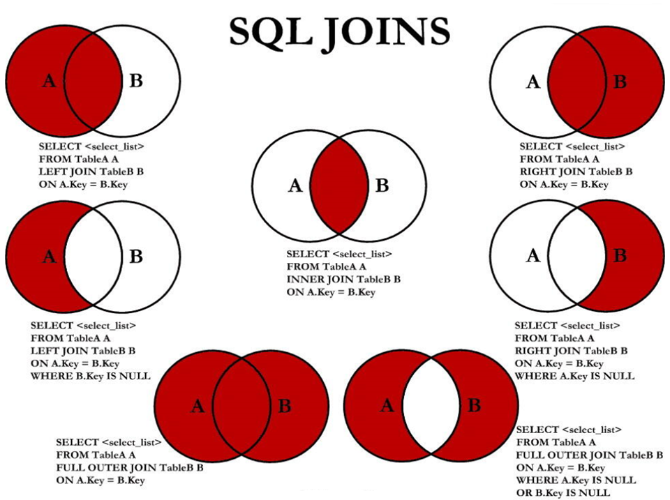

#### 5.1 代码实现

```mysql
#中图：内连接 A∩B
SELECT employee_id, last_name, department_name
FROM employees e JOIN departments d
ON e.`department_id` = d.`department_id`;
```

```mysql
#左上图：左外连接
SELECT employee_id,last_name,department_name
FROM employees e LEFT JOIN departments d
ON e.`department_id` = d.`department_id`;
```

```mysql
#右上图：右外连接
SELECT employee_id,last_name,department_name
FROM employees e RIGHT JOIN departments d
ON e.`department_id` = d.`department_id`;
```

```mysql
#左中图：A - A∩B
SELECT employee_id,last_name,department_name
FROM employees e LEFT JOIN departments d
ON e.`department_id` = d.`department_id`
WHERE d.`department_id` IS NULL;
```

```mysql
#右中图：B-A∩B
SELECT employee_id,last_name,department_name
FROM employees e RIGHT JOIN departments d
ON e.`department_id` = d.`department_id`
WHERE e.`department_id` IS NULL;
```

```mysql
# 左下图：满外连接
# 方式1：左上图 UNION ALL 右中图
SELECT employee_id,department_name
FROM employees e LEFT JOIN departments d
ON e.`department_id` = d.`department_id`
UNION ALL #没有去重操作，效率高
SELECT employee_id,department_name
FROM employees e RIGHT JOIN departments d
ON e.`department_id` = d.`department_id`
WHERE e.`department_id` IS NULL;

# 方式2：左中图 + 右上图 A∪B
SELECT employee_id,last_name,department_name
FROM employees e LEFT JOIN departments d
ON e.`department_id` = d.`department_id`
WHERE d.`department_id` IS NULL
UNION ALL #没有去重操作，效率高
SELECT employee_id,last_name,department_name
FROM employees e RIGHT JOIN departments d
ON e.`department_id` = d.`department_id`;
```

```mysql
#右下图
#左中图 + 右中图 A ∪B- A∩B 或者 (A - A∩B) ∪ （B - A∩B）
SELECT employee_id,last_name,department_name
FROM employees e LEFT JOIN departments d
ON e.`department_id` = d.`department_id`
WHERE d.`department_id` IS NULL
UNION ALL
SELECT employee_id,last_name,department_name
FROM employees e RIGHT JOIN departments d
ON e.`department_id` = d.`department_id`
WHERE e.`department_id` IS NULL;
```

#### 5.2 语法格式小结

- 左中图

  ```mysql
  #实现A - A∩B
  select 字段列表
  from A表 left join B表
  on 关联条件
  where 从表关联字段 is null and 等其他子句;
  ```

- 右中图

  ```mysql
  #实现B - A∩B
  select 字段列表
  from A表 right join B表
  on 关联条件
  where 从表关联字段 is null and 等其他子句;
  ```

- 左下图

  ```mysql
  #实现查询结果是A∪B
  #用左外的A union 右外的B
  select 字段列表
  from A表 left join B表
  on 关联条件
  where 等其他子句
  
  union
  
  select 字段列表
  from A表 right join B表
  on 关联条件
  where 等其他子句;
  ```

- 右下图

  ```mysql
  #实现A∪B - A∩B 或 (A - A∩B) ∪ （B - A∩B）
  #使用左外的 (A - A∩B) union 右外的（B - A∩B）
  select 字段列表
  from A表 left join B表
  on 关联条件
  where 从表关联字段 is null and 等其他子句
  
  union
  
  select 字段列表
  from A表 right join B表
  on 关联条件
  where 从表关联字段 is null and 等其他子句;
  ```

### 6 SQL99语法新特性

#### 6.1 自然连接

SQL99 在 SQL92 的基础上提供了一些特殊语法，比如 **NATURAL JOIN** 用来表示自然连接。我们可以把自然连接理解为 SQL92 中的等值连接。它会帮你自动查询两张连接表中**所有相同的字段**，然后进行**等值连接**。

在SQL92标准中：

```mysql
SELECT 
	employee_id, last_name, department_name
FROM 
	employees e 
JOIN 
	departments d
ON 
	e.`department_id` = d.`department_id`
AND 
	e.`manager_id` = d.`manager_id`;
```

在 SQL99 中你可以写成：

```mysql
SELECT 
	employee_id,last_name,department_name
FROM 
	employees e 
NATURAL JOIN 
	departments d;
```

#### 6.2 USING连接

当我们进行连接的时候，SQL99还支持使用 USING 指定数据表里的**同名字段**进行等值连接。但是只能配合JOIN一起使用。比如：

```mysql
SELECT 
	employee_id, last_name, department_name
FROM 
	employees e 
JOIN 
	departments d
USING 
	(department_id);
```

你能看出与自然连接 NATURAL JOIN 不同的是，USING 指定了具体的相同的字段名称，你需要在USING的括号 () 中填入要指定的同名字段。同时使用 **JOIN...USING** 可以简化 JOIN ON 的等值连接。它与下面的 SQL 查询结果是相同的：

```mysql
SELECT 
	employee_id, last_name, department_name
FROM 
	employees e
JOIN 
	departments d
ON
	e.department_id = d.department_id;
```

### 7 章节小结

表连接的约束条件可以有三种方式：WHERE、ON、USING

- WHERE：适用于所有关联查询
- ON ：只能和JOIN一起使用，只能写关联条件。虽然关联条件可以并到WHERE中和其他条件一起写，但分开写可读性更好。
- USING：只能和JOIN一起使用，而且要求两个关联字段在关联表中名称一致，而且只能表示关联字段值相等

```mysql
#关联条件
#把关联条件写在where后面
SELECT last_name,department_name
FROM employees,departments
WHERE employees.department_id = departments.department_id;

#把关联条件写在on后面，只能和JOIN一起使用
SELECT last_name,department_name
FROM employees INNER JOIN departments
ON employees.department_id = departments.department_id;

SELECT last_name,department_name
FROM employees CROSS JOIN departments
ON employees.department_id = departments.department_id;

SELECT last_name,department_name
FROM employees JOIN departments
ON employees.department_id = departments.department_id;

#把关联字段写在using()中，只能和JOIN一起使用
#而且两个表中的关联字段必须名称相同，而且只能表示=
#查询员工姓名与基本工资
SELECT last_name,job_title
FROM employees INNER JOIN jobs USING(job_id);

#n张表关联，需要n-1个关联条件
#查询员工姓名，基本工资，部门名称
SELECT 
	last_name,job_title,department_name 
FROM 
	employees, departments, jobs
WHERE 
	employees.department_id = departments.department_id
AND 
	employees.job_id = jobs.job_id;
#SQL99
SELECT 
	last_name,job_title,department_name
FROM 
	employees 
INNER JOIN 
	departments 
INNER JOIN 
	jobs
ON 
	employees.department_id = departments.department_id
AND 
	employees.job_id = jobs.job_id;
```

注意：**我们要控制连接表的数量**。多表连接就相当于嵌套 for 循环一样，非常消耗资源，会让 SQL 查询性能下降得很严重，因此不要连接不必要的表。在许多 DBMS 中，也都会有最大连接表的限制。

> 【`强制`】超过三个表禁止join。需要 join 的字段，数据类型保持绝对一致；多表关联查询时，保证被关联的字段需要有索引。
>
> 说明：即使双表 join 也要注意表索引、SQL 性能。
>
> 来源：阿里巴巴《Java开发手册》

### 附录：常用的 SQL 标准有哪些

- 在正式开始讲连接表的种类时，我们首先需要知道 SQL 存在不同版本的标准规范，因为不同规范下的表连接操作是有区别的。
- SQL 有两个主要的标准，分别是 **SQL92** 和 **SQL99**。92 和 99 代表了标准提出的时间，SQL92 就是 92 年提出的标准规范。当然除了 SQL92 和 SQL99 以外，还存在 SQL-86、SQL-89、SQL:2003、SQL:2008、SQL:2011 和 SQL:2016 等其他的标准。
- 这么多标准，到底该学习哪个呢？**实际上最重要的 SQL 标准就是 SQL92 和 SQL99**。一般来说 SQL92 的形式更简单，但是写的 SQL 语句会比较长，可读性较差。而 SQL99 相比于 SQL92 来说，语法更加复杂，但可读性更强。我们从这两个标准发布的页数也能看出，SQL92 的标准有500页，而 SQL99 标准超过了1000页。实际上从 SQL99 之后，很少有人能掌握所有内容，因为确实太多了。就好比我们使用Windows、Linux 和Office的时候，很少有人能掌握全部内容一样。我们只需要掌握一些核心的功能，满足日常工作的需求即可。
- **SQL92 和 SQL99 是经典的 SQL 标准，也分别叫做 SQL-2 和 SQL-3 标准**。也正是在这两个标准发布之后，SQL 影响力越来越大，甚至超越了数据库领域。现如今 SQL 已经不仅仅是数据库领域的主流语言，还是信息领域中信息处理的主流语言。在图形检索、图像检索以及语音检索中都能看到 SQL 语言的使用。

------

## 六、单行函数

### 1 函数的理解

#### 1.1 什么是函数

函数在计算机语言的使用中贯穿始终，函数的作用是什么呢？它可以把我们经常使用的代码封装起来，需要的时候直接调用即可。这样既**提高了代码效率**，又**提高了可维护性**。在 SQL 中我们也可以使用函数对检索出来的数据进行函数操作。使用这些函数，可以极大地**提高用户对数据库的管理效率**。


从函数定义的角度出发，我们可以将函数分成**内置函数**和**自定义函数**。在 SQL 语言中，同样也包括了内置函数和自定义函数。内置函数是系统内置的通用函数，而自定义函数是我们根据自己的需要编写的，本章及下一章讲解的是 SQL 的内置函数。

#### 1.2 不同DBMS函数的差异

我们在使用 SQL 语言的时候，不是直接和这门语言打交道，而是通过它使用不同的数据库软件，即DBMS。**DBMS 之间的差异性很大，远大于同一个语言不同版本之间的差异。**实际上，只有很少的函数是被 DBMS 同时支持的。比如，大多数 DBMS 使用（||）或者（+）来做拼接符，而在 MySQL 中的字符串拼接函数为concat()。大部分 DBMS 会有自己特定的函数，这就意味着**采用 SQL 函数的代码可移植性是很差的**，因此在使用函数的时候需要特别注意。

#### 1.3 MySQL的内置函数及分类

MySQL提供了丰富的内置函数，这些函数使得数据的维护与管理更加方便，能够更好地提供数据的分析与统计功能，在一定程度上提高了开发人员进行数据分析与统计的效率。

MySQL提供的内置函数从**实现的功能角度**可以分为数值函数、字符串函数、日期和时间函数、流程控制函数、加密与解密函数、获取MySQL信息函数、聚合函数等。这里，我将这些丰富的内置函数再分为两类：**单行函数**、**聚合函数（或分组函数）。**

两种SQL函数


单行函数：

- 操作数据对象
- 接受参数返回一个结果
- **只对一行进行变换**
- **每行返回一个结果**
- 可以嵌套
- 参数可以是一列或一个值

### 2 数值函数

#### 2.1 基本函数

| 函数                | 用法                                                         |
| ------------------- | :----------------------------------------------------------- |
| ABS(x)              | 返回x的绝对值                                                |
| SIGN(X)             | 返回x的符号。正数返回1，负数返回-1，0返回0                   |
| PI()                | 返回圆周率的值                                               |
| CEIL(x)，CEILING(x) | 返回大于或等于某个值的最小整数                               |
| FLOOR(x)            | 返回小于或等于某个值的最大整数                               |
| LEAST(e1,e2,e3…)    | 返回列表中的最小值                                           |
| GREATEST(e1,e2,e3…) | 返回列表中的最大值                                           |
| MOD(x,y)            | 返回x除以y后的余数                                           |
| RAND()              | 返回0~1的随机值                                              |
| RAND(x)             | 返回0~1的随机值，其中x的值用作种子值，相同的X值会产生相同的随机数 |
| ROUND(x)            | 返回一个对x的值进行四舍五入后，最接近于x的整数               |
| ROUND(x,y)          | 返回一个对x的值进行四舍五入后最接近x的值，并保留到小数点后面y位 |
| TRUNCATE(x,y)       | 返回数字x截断为y位小数的结果                                 |
| SQRT(x)             | 返回x的平方根。当X的值为负数时，返回NULL                     |

举例：

```mysql
SELECT
ABS(-123), ABS(32), SIGN(-23), SIGN(43),
PI(), CEIL(32.32), CEILING(-43.23), 
FLOOR(32.32), FLOOR(-43.23), MOD(12,5)
FROM DUAL;
```

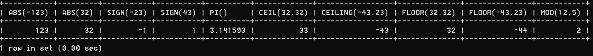

```mysql
SELECT RAND(), RAND(), RAND(10), RAND(10), RAND(-1), RAND(-1)
FROM DUAL;
```


```mysql
SELECT
ROUND(12.33), ROUND(12.343,2), ROUND(12.324,-1), TRUNCATE(12.66,1), TRUNCATE(12.66,-1)
FROM DUAL;
```


#### 2.2 角度与弧度互换函数

| 函数       | 用法                                  |
| :--------- | ------------------------------------- |
| RADIANS(x) | 将角度转化为弧度，其中，参数x为角度值 |
| DEGREES(x) | 将弧度转化为角度，其中，参数x为弧度值 |

```mysql
SELECT 
	RADIANS(30), RADIANS(60), RADIANS(90),
	DEGREES(2*PI()), DEGREES(RADIANS(90))
FROM DUAL;
```

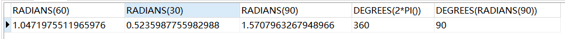

#### 2.3 三角函数

| 函数       | 用法                                                         |
| ---------- | :----------------------------------------------------------- |
| SIN(x)     | 返回x的正弦值，其中，参数x为弧度值                           |
| ASIN(x)    | 返回x的反正弦值，即获取正弦为x的值。如果x的值不在-1到1之间，则返回NULL |
| COS(x)     | 返回x的余弦值，其中，参数x为弧度值                           |
| ACOS(x)    | 返回x的反余弦值，即获取余弦为x的值。如果x的值不在-1到1之间，则返回NULL |
| TAN(x)     | 返回x的正切值，其中，参数x为弧度值                           |
| ATAN(x)    | 返回x的反正切值，即返回正切值为x的值                         |
| ATAN2(m,n) | 返回两个参数的反正切值                                       |
| COT(x)     | 返回x的余切值，其中，X为弧度值                               |

举例：

ATAN2(M,N)函数返回两个参数的反正切值。 与ATAN(X)函数相比，ATAN2(M,N)需要两个参数，例如有两个点point(x1,y1)和point(x2,y2)，使用ATAN(X)函数计算反正切值为ATAN((y2-y1)/(x2-x1))，使用ATAN2(M,N)计算反正切值则为ATAN2(y2-y1,x2-x1)。由使用方式可以看出，当x2-x1等于0时，ATAN(X)函数会报错，而ATAN2(M,N)函数则仍然可以计算。

ATAN2(M,N)函数的使用示例如下：

```mysql
SELECT
	SIN(RADIANS(30)), DEGREES(ASIN(1)), TAN(RADIANS(45)), 
	DEGREES(ATAN(1)), DEGREES(ATAN2(1,1))
FROM DUAL;
```

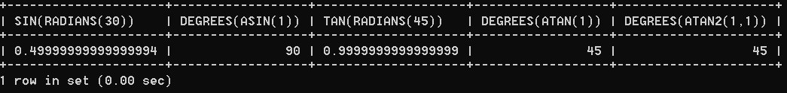

#### 2.4 指数与对数

| 函数                 | 用法                                                 |
| -------------------- | :--------------------------------------------------- |
| POW(x,y)，POWER(X,Y) | 返回x的y次方                                         |
| EXP(X)               | 返回e的X次方，其中e是一个常数，2.718281828459045     |
| LN(X)，LOG(X)        | 返回以e为底的X的对数，当X <= 0 时，返回的结果为NULL  |
| LOG10(X)             | 返回以10为底的X的对数，当X <= 0 时，返回的结果为NULL |
| LOG2(X)              | 返回以2为底的X的对数，当X <= 0 时，返回NULL          |

```mysql
mysql> SELECT POW(2,5),POWER(2,4),EXP(2),LN(10),LOG10(10),LOG2(4)
-> FROM DUAL;
+----------+------------+------------------+-------------------+-----------+---------+
| POW(2,5) | POWER(2,4) | EXP(2)           | LN(10)            | LOG10(10) | LOG2(4) |
+----------+------------+------------------+-------------------+-----------+---------+
| 32       | 16         | 7.38905609893065 | 2.302585092994046 | 1         | 2       |
+----------+------------+------------------+-------------------+-----------+---------+
1 row in set (0.00 sec)
```

#### 2.5 进制间的转换

| 函数            | 用法                     |
| :-------------- | ------------------------ |
| BIN(x)          | 返回x的二进制编码        |
| HEX(x)          | 返回x的十六进制编码      |
| OCT(x)          | 返回x的八进制编码        |
| CONV(x, f1, f2) | 返回f1进制数变成f2进制数 |

```mysql
mysql> SELECT BIN(10), HEX(10), OCT(10), CONV(10,2,8)
-> FROM DUAL;
+---------+---------+---------+--------------+
| BIN(10) | HEX(10) | OCT(10) | CONV(10,2,8) |
+---------+---------+---------+--------------+
| 1010    | A       | 12      | 2            |
+---------+---------+---------+--------------+
1 row in set (0.00 sec)
```

### 3 字符串函数

| 函数                              | 用法                                                         |
| :-------------------------------- | ------------------------------------------------------------ |
| ASCII(S)                          | 返回字符串S中的第一个字符的ASCII码值                         |
| CHAR_LENGTH(s)                    | 返回字符串s的字符数。作用与CHARACTER_LENGTH(s)相同           |
| LENGTH(s)                         | 返回字符串s的字节数，和字符集有关                            |
| CONCAT(s1,s2,......,sn)           | 连接s1,s2,......,sn为一个字符串                              |
| CONCAT_WS(x,s1,s2,......,sn)      | 同CONCAT(s1,s2,...)函数，但是每个字符串之间要加上x           |
| INSERT(str, idx, len, replacestr) | 将字符串str从第idx位置开始，len个字符长的子串替换为字符串replacestr<br/>mysql中的索引下标是从1开始的 |
| REPLACE(str, a, b)                | 用字符串b替换字符串str中所有出现的字符串a                    |
| UPPER(s) 或 UCASE(s)              | 将字符串s的所有字母转成大写字母                              |
| LOWER(s) 或 LCASE(s)              | 将字符串s的所有字母转成小写字母                              |
| LEFT(str,n)                       | 返回字符串str最左边的n个字符                                 |
| RIGHT(str,n)                      | 返回字符串str最右边的n个字符                                 |
| LPAD(str, len, pad)               | 用字符串pad对str最左边进行填充，直到str的长度为len个字符；实现右对齐效果 |
| RPAD(str ,len, pad)               | 用字符串pad对str最右边进行填充，直到str的长度为len个字符；实现左对齐效果 |
| LTRIM(s)                          | 去掉字符串s左侧的空格                                        |
| RTRIM(s)                          | 去掉字符串s右侧的空格                                        |
| TRIM(s)                           | 去掉字符串s开始与结尾的空格                                  |
| TRIM(s1 FROM s)                   | 去掉字符串s开始与结尾的s1                                    |
| TRIM(LEADING s1 FROM s)           | 去掉字符串s开始处的s1                                        |
| TRIM(TRAILING s1 FROM s)          | 去掉字符串s结尾处的s1                                        |
| REPEAT(str, n)                    | 返回str重复n次的结果                                         |
| SPACE(n)                          | 返回n个空格                                                  |
| STRCMP(s1,s2)                     | 比较字符串s1,s2的ASCII码值的大小                             |
| SUBSTR(s,index,len)               | 返回从字符串s的index位置其len个字符，作用与SUBSTRING(s,n,len)、MID(s,n,len)相同 |
| LOCATE(substr,str)                | 返回字符串substr在字符串str中首次出现的位置，作用于POSITION(substr<br/>IN str)、INSTR(str,substr)相同。未找到，返回0 |
| ELT(m,s1,s2,…,sn)                 | 返回指定位置的字符串，如果m=1，则返回s1，如果m=2，则返回s2，如<br/>果m=n，则返回sn |
| FIELD(s,s1,s2,…,sn)               | 返回字符串s在字符串列表中第一次出现的位置                    |
| FIND_IN_SET(s1,s2)                | 返回字符串s1在字符串s2中出现的位置。其中，字符串s2是一个以逗号分<br/>隔的字符串 |
| REVERSE(s)                        | 返回s反转后的字符串                                          |
| NULLIF(value1,value2)             | 比较两个字符串，如果value1与value2相等，则返回NULL，否则返回value1 |

> 注意：MySQL中，字符串的位置是从1开始的。

举例：

```mysql
mysql> SELECT FIELD('mm','hello','msm','amma'), FIND_IN_SET('mm','hello,mm,amma')
-> FROM DUAL;
+----------------------------------+-----------------------------------+
| FIELD('mm','hello','msm','amma') | FIND_IN_SET('mm','hello,mm,amma') |
+----------------------------------+-----------------------------------+
| 0                                | 2                                 |
+----------------------------------+-----------------------------------+
1 row in set (0.00 sec)

mysql> SELECT NULLIF('mysql','mysql'), NULLIF('mysql', '');
+-------------------------+---------------------+
| NULLIF('mysql','mysql') | NULLIF('mysql', '') |
+-------------------------+---------------------+
| NULL                    | mysql               |
+-------------------------+---------------------+
1 row in set (0.00 sec)
```

### 4 日期和时间函数

#### 4.1 获取日期、时间

| 函数                                                         | 用法                           |
| :----------------------------------------------------------- | ------------------------------ |
| **CURDATE()** ，CURRENT_DATE()                               | 返回当前日期，只包含年、月、日 |
| **CURTIME()** ， CURRENT_TIME()                              | 返回当前时间，只包含时、分、秒 |
| **NOW()** / SYSDATE() / CURRENT_TIMESTAMP() / LOCALTIME() /<br/>LOCALTIMESTAMP() | 返回当前系统日期和时间         |
| UTC_DATE()                                                   | 返回UTC（世界标准时间）日期    |
| UTC_TIME()                                                   | 返回UTC（世界标准时间）时间    |

举例：

```mysql
SELECT
	CURDATE(), CURTIME(), NOW(), SYSDATE()+0, 
	UTC_DATE(), UTC_DATE()+0, UTC_TIME(), UTC_TIME()+0
FROM DUAL;
```

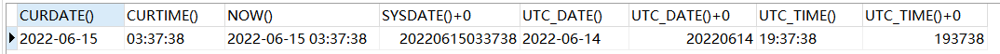

#### 4.2 日期与时间戳的转换

| 函数                     | 用法                                                         |
| ------------------------ | ------------------------------------------------------------ |
| UNIX_TIMESTAMP()         | 以UNIX时间戳的形式返回当前时间。<br />SELECT UNIX_TIMESTAMP() -> 1634348884 |
| UNIX_TIMESTAMP(date)     | 将时间date以UNIX时间戳的形式返回。                           |
| FROM_UNIXTIME(timestamp) | 将UNIX时间戳的时间转换为普通格式的时间                       |

举例：

```mysql
mysql> SELECT UNIX_TIMESTAMP(now());
+-----------------------+
| UNIX_TIMESTAMP(now()) |
+-----------------------+
|            1655235703 |
+-----------------------+
1 row in set (0.00 sec)

mysql> SELECT UNIX_TIMESTAMP(CURDATE());
+---------------------------+
| UNIX_TIMESTAMP(CURDATE()) |
+---------------------------+
|                1655222400 |
+---------------------------+
1 row in set (0.00 sec)

mysql> SELECT UNIX_TIMESTAMP('2011-11-11 11:11:11');
+---------------------------------------+
| UNIX_TIMESTAMP('2011-11-11 11:11:11') |
+---------------------------------------+
|                            1320981071 |
+---------------------------------------+
1 row in set (0.00 sec)

mysql> SELECT FROM_UNIXTIME(1576380910);
+---------------------------+
| FROM_UNIXTIME(1576380910) |
+---------------------------+
| 2019-12-15 11:35:10       |
+---------------------------+
1 row in set (0.00 sec)
```

#### 4.3 获取月份、星期、星期数、天数等函数

| 函数                                     | 用法                                            |
| :--------------------------------------- | ----------------------------------------------- |
| YEAR(date) / MONTH(date) / DAY(date)     | 返回具体的日期值                                |
| HOUR(time) / MINUTE(time) / SECOND(time) | 返回具体的时间值                                |
| MONTHNAME(date)                          | 返回月份：January，...                          |
| DAYNAME(date)                            | 返回星期几：MONDAY，...                         |
| WEEKDAY(date)                            | 返回周几，注意，周1是0，周2是1，。。。周日是6   |
| QUARTER(date)                            | 返回日期对应的季度，范围为1～4                  |
| WEEK(date) ，WEEKOFYEAR(date)            | 返回一年中的第几周                              |
| DAYOFYEAR(date)                          | 返回日期是一年中的第几天                        |
| DAYOFMONTH(date)                         | 返回日期位于所在月份的第几天                    |
| DAYOFWEEK(date)                          | 返回周几，注意：周日是1，周一是2，。。。周六是7 |

举例：

```mysql
SELECT 
	YEAR(CURDATE()), MONTH(CURDATE()), DAY(CURDATE()),
	HOUR(CURTIME()), MINUTE(NOW()), SECOND(SYSDATE())
FROM DUAL;
```

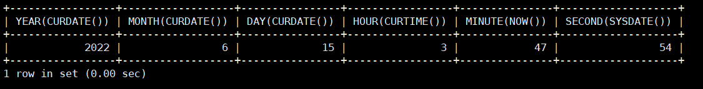

```mysql
SELECT 
	MONTHNAME('2021-10-26'),DAYNAME('2021-10-26'),WEEKDAY('2021-10-26'),
	QUARTER(CURDATE()), WEEK(CURDATE()), DAYOFYEAR(NOW()),
	DAYOFMONTH(NOW()), DAYOFWEEK(NOW())
FROM DUAL;
```

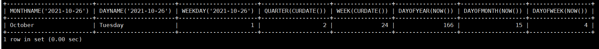

#### 4.4 日期的操作函数

| 函数                    | 用法                                       |
| :---------------------- | ------------------------------------------ |
| EXTRACT(type FROM date) | 返回指定日期中特定的部分，type指定返回的值 |

EXTRACT(type FROM date)函数中type的取值与含义：


```mysql
SELECT 
	EXTRACT(MINUTE FROM NOW()),EXTRACT( WEEK FROM NOW()),
	EXTRACT( QUARTER FROM NOW()),EXTRACT( MINUTE_SECOND FROM NOW())
FROM DUAL;
```

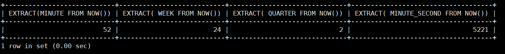

#### 4.5 时间和秒钟转换的函数

| 函数                 | 用法                                                         |
| -------------------- | :----------------------------------------------------------- |
| TIME_TO_SEC(time)    | 将 time 转化为秒并返回结果值。转化的公式为：小时\*3600 + 分钟\*60 + 秒 |
| SEC_TO_TIME(seconds) | 将 seconds 描述转化为包含小时、分钟和秒的时间                |

```mysql
mysql> SELECT TIME_TO_SEC(NOW());
+--------------------+
| TIME_TO_SEC(NOW()) |
+--------------------+
| 78774              |
+--------------------+
1 row in set (0.00 sec)

mysql> SELECT SEC_TO_TIME(78774);
+--------------------+
| SEC_TO_TIME(78774) |
+--------------------+
| 21:52:54           |
+--------------------+
1 row in set (0.12 sec)
```

#### 4.6 计算日期和时间的函数

**第1组：**

| 函数                                                         | 用法                                           |
| ------------------------------------------------------------ | ---------------------------------------------- |
| DATE_ADD(datetime, INTERVAL expr type)，<br/>ADDDATE(date, INTERVAL expr type) | 返回与给定日期时间相差INTERVAL时间段的日期时间 |
| DATE_SUB(date, INTERVAL expr type)，<br/>SUBDATE(date, INTERVAL expr type) | 返回与date相差INTERVAL时间间隔的日期           |

上述函数中type的取值：


举例：

```mysql
SELECT 
	DATE_ADD(NOW(), INTERVAL 1 DAY) AS col1, 
	DATE_ADD('2021-10-21 23:32:12',INTERVAL 1 SECOND) AS col2,
	ADDDATE('2021-10-21 23:32:12',INTERVAL 1 SECOND) AS col3,
	DATE_ADD('2021-10-21 23:32:12',INTERVAL '1_1' MINUTE_SECOND) AS col4,
	DATE_ADD(NOW(), INTERVAL -1 YEAR) AS col5, #可以是负数
	DATE_ADD(NOW(), INTERVAL '1_1' YEAR_MONTH) AS col6 #需要单引号
FROM DUAL;
```

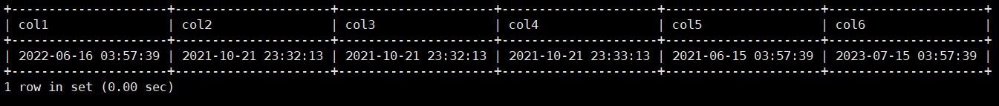

```mysql
SELECT 
	DATE_SUB('2021-01-21',INTERVAL 31 DAY) AS col1,
	SUBDATE('2021-01-21',INTERVAL 31 DAY) AS col2,
	DATE_SUB('2021-01-21 02:01:01',INTERVAL '1 1' DAY_HOUR) AS col3
FROM DUAL;
```


**第2组：**

| 函数                         | 用法                                                         |
| ---------------------------- | :----------------------------------------------------------- |
| ADDTIME(time1, time2)        | 返回time1加上time2的时间。当time2为一个数字时，代表的是**秒**，可以为负数 |
| SUBTIME(time1,time2)         | 返回time1减去time2后的时间。当time2为一个数字时，代表的是**秒**，可以为负数 |
| DATEDIFF(date1,date2)        | 返回date1 - date2的日期间隔天数                              |
| TIMEDIFF(time1, time2)       | 返回time1 - time2的时间间隔                                  |
| FROM_DAYS(N)                 | 返回从0000年1月1日起，N天以后的日期                          |
| TO_DAYS(date)                | 返回日期date距离0000年1月1日的天数                           |
| LAST_DAY(date)               | 返回date所在月份的最后一天的日期                             |
| MAKEDATE(year,n)             | 针对给定年份与所在年份中的天数返回一个日期                   |
| MAKETIME(hour,minute,second) | 将给定的小时、分钟和秒组合成时间并返回                       |
| PERIOD_ADD(time,n)           | 返回time加上n后的时间                                        |

举例：

```mysql
SELECT
	NOW(),							     # 2022-06-15 04:05:09
	ADDTIME(NOW(),20),                                  # 2022-06-15 04:05:29
	SUBTIME(NOW(),30),                                  # 2022-06-15 04:04:39
	SUBTIME(NOW(),'1:1:3'),                             # 2022-06-15 03:04:06
	DATEDIFF(NOW(),'2021-10-01'),                       # 257
	TIMEDIFF(NOW(),'2021-10-25 22:10:10'),              # 838:59:59
	FROM_DAYS(366),                                     # 0001-01-01
	TO_DAYS('0000-12-25'),                              # 359
	LAST_DAY(NOW()),								 # 2022-06-30
	MAKEDATE(YEAR(NOW()),12),                           # 2022-01-12
	MAKETIME(10,21,23),                                 # 10:21:23
	PERIOD_ADD(20200101010101,10)                       # 20200101010111
FROM DUAL;
```

举例：查询 7 天内的新增用户数有多少？

```mysql
SELECT COUNT(*) as num FROM new_user WHERE TO_DAYS(NOW())-TO_DAYS(regist_time)<=7
```

#### 4.7 日期的格式化与解析

| 函数                              | 用法                                       |
| --------------------------------- | :----------------------------------------- |
| DATE_FORMAT(date,fmt)             | 按照字符串fmt格式化日期date值              |
| TIME_FORMAT(time,fmt)             | 按照字符串fmt格式化时间time值              |
| GET_FORMAT(date_type,format_type) | 返回日期字符串的显示格式                   |
| STR_TO_DATE(str, fmt)             | 按照字符串fmt对str进行解析，解析为一个日期 |

上述 **非GET_FORMAT** 函数中fmt参数常用的格式符：

| 格式符 | 说明                                                        | 格式符     | 说明                                                      |
| ------ | ----------------------------------------------------------- | ---------- | --------------------------------------------------------- |
| `%Y`   | 4位数字表示年份                                             | `%y`       | 表示两位数字表示年份                                      |
| `%M`   | 月名表示月份（January,....）                                | `%m`       | 两位数字表示月份（01,02,03。。。）                        |
| `%b`   | 缩写的月名（Jan.，Feb.，....）                              | `%c`       | 数字表示月份（1,2,3,...）                                 |
| `%D`   | 英文后缀表示月中的天数<br/>（1st,2nd,3rd,...）              | `%d`       | 两位数字表示月中的天数(01,02...)                          |
| `%e`   | 数字形式表示月中的天数<br/>（1,2,3,4,5.....）               |            |                                                           |
| `%H`   | 两位数字表示小时，24小时制<br/>（01,02..）                  | `%h`和`%I` | 两位数字表示小时，12小时制<br/>（01,02..）                |
| `%k`   | 数字形式的小时，24小时制(1,2,3)                             | `%l`       | 数字形式表示小时，12小时制<br/>（1,2,3,4....）            |
| `%i`   | 两位数字表示分钟（00,01,02）                                | `%S`和`%s` | 两位数字表示秒(00,01,02...)                               |
| `%W`   | 一周中的星期名称（Sunday...）                               | `%a`       | 一周中的星期缩写（Sun Mon Tues ...）                      |
| `%w`   | 以数字表示周中的天数<br/>(0=Sunday,1=Monday....)            |            |                                                           |
| `%j`   | 以3位数字表示年中的天数(001,002...)                         | `%U`       | 以数字表示年中的第几周（1,2,3。。）其中Sunday为周中第一天 |
| `%u`   | 以数字表示年中的第几周，（1,2,3。。）其中Monday为周中第一天 |            |                                                           |
| `%T`   | 24小时制                                                    | `%r`       | 12小时制                                                  |
| `%p`   | AM或PM                                                      | %%         | 表示%                                                     |

GET_FORMAT函数中 date_type(日期格式) 和 format_type(格式化类型) 参数取值如下：


举例：

```mysql
mysql> SELECT DATE_FORMAT(NOW(), '%H:%i:%s');
+--------------------------------+
| DATE_FORMAT(NOW(), '%H:%i:%s') |
+--------------------------------+
| 04:24:43                       |
+--------------------------------+
1 row in set (0.00 sec)
```

```mysql
SELECT STR_TO_DATE('09/01/2009','%m/%d/%Y')
FROM DUAL;

SELECT STR_TO_DATE('20140422154706','%Y%m%d%H%i%s')
FROM DUAL;

SELECT STR_TO_DATE('2014-04-22 15:47:06','%Y-%m-%d %H:%i:%s')
FROM DUAL;
```

```mysql
mysql> SELECT GET_FORMAT(DATE, 'USA');
+-------------------------+
| GET_FORMAT(DATE, 'USA') |
+-------------------------+
| %m.%d.%Y                |
+-------------------------+
1 row in set (0.00 sec)

SELECT DATE_FORMAT(NOW(), GET_FORMAT(DATE,'USA')),
FROM DUAL;

mysql> SELECT STR_TO_DATE('2020-01-01 00:00:00','%Y-%m-%d');
+-----------------------------------------------+
| STR_TO_DATE('2020-01-01 00:00:00','%Y-%m-%d') |
+-----------------------------------------------+
| 2020-01-01                                    |
+-----------------------------------------------+
1 row in set, 1 warning (0.00 sec)
```

### 5 流程控制函数

流程处理函数可以根据不同的条件，执行不同的处理流程，可以在SQL语句中实现不同的条件选择。MySQL中的流程处理函数主要包括IF()、IFNULL() 和CASE()函数。

| 函数                                                         | 用法                                            |
| ------------------------------------------------------------ | :---------------------------------------------- |
| IF(value,value1,value2)                                      | 如果value的值为TRUE，返回value1，否则返回value2 |
| IFNULL(value1, value2)                                       | 如果value1不为NULL，返回value1，否则返回value2  |
| CASE WHEN 条件1 THEN 结果1 WHEN 条件2 THEN 结果2 .... [ELSE 结果n] END | 相当于Java 的if...else if...else...             |
| CASE expr WHEN 常量值1 THEN 值1 WHEN 常量值2 THEN 值2 .... [ELSE 值n] END | 相当于Java的switch...case...                    |

```mysql
SELECT IF(1 > 0,'正确','错误');
->正确

SELECT IFNULL(null,'Hello Word');
->Hello Word

SELECT CASE
	WHEN 1 > 0 THEN '1 > 0'
	WHEN 2 > 0 THEN '2 > 0'
	ELSE '3 > 0'
END;
->1 > 0

SELECT CASE 2
	WHEN 1 THEN '我是1'
	WHEN 2 THEN '我是2'
	ELSE '你是谁'
END;
->我是2

SELECT 
	employee_id, salary, CASE 
		WHEN salary>=15000 THEN '高薪'
		WHEN salary>=10000 THEN '潜力股'
		WHEN salary>=8000 THEN '屌丝'
		ELSE '草根' END "描述"
FROM employees;

SELECT 
	oid, `status`, CASE `status` 
		WHEN 1 THEN '未付款'
		WHEN 2 THEN '已付款'
		WHEN 3 THEN '已发货'
		WHEN 4 THEN '确认收货'
		ELSE '无效订单' END
FROM t_order;
```

```mysql
/*
练习：查询部门号为 10,20, 30 的员工信息, 若部门号为 10, 则打印其工资的 1.1 倍, 20 号部门, 则打印其
工资的 1.2 倍, 30 号部门打印其工资的 1.3 倍数。
*/
SELECT 
	employee_id,
	last_name,
	salary,
	department_id,
	CASE department_id
		WHEN 10 THEN salary * 1.1
		WHEN 20 THEN salary * 1.2
		WHEN 30 THEN salary * 1.3
	END "details"
FROM 
	employees
WHERE
	department_id IN(10,20,30);
```

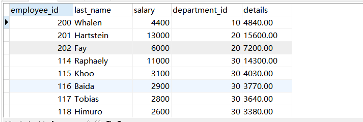

### 6 加密与解密函数

加密与解密函数主要用于对数据库中的数据进行加密和解密处理，以防止数据被他人窃取。这些函数在保证数据库安全时非常有用。

| 函数                        | 用法                                                         |
| --------------------------- | ------------------------------------------------------------ |
| PASSWORD(str)               | 返回字符串str的加密版本，41位长的字符串。加密结果**不可逆**，常用于用户的密码加密 |
| MD5(str)                    | 返回字符串str的md5加密后的值，也是一种加密方式。若参数为NULL，则会返回NULL |
| SHA(str)                    | 从原明文密码str计算并返回加密后的密码字符串，当参数为NULL时，返回NULL。SHA加密算法比MD5更加安全 。 |
| ENCODE(value,password_seed) | 返回使用password_seed作为加密密码加密value                   |
| DECODE(value,password_seed) | 返回使用password_seed作为加密密码解密value                   |

举例：

```mysql
mysql> SELECT PASSWORD('mysql'), PASSWORD(NULL);
+----------------------------------------------------------------------+--------------------------+
| PASSWORD('mysql')                                                    | PASSWORD(NULL)           |
+----------------------------------------------------------------------+--------------------------+
| *E74858DB86EBA20BC33D0AECAE8A8108C56B17FA                            |                          |
+----------------------------------------------------------------------+--------------------------+
1 row in set, 1 warning (0.00 sec)
```

```mysql
SELECT md5('123');
->202cb962ac59075b964b07152d234b70

SELECT SHA('Tom123');
->c7c506980abc31cc390a2438c90861d0f1216d50
```

```mysql
mysql> SELECT ENCODE('mysql', 'mysql');
+--------------------------+
| ENCODE('mysql', 'mysql') |
+--------------------------+
| íg ¼ ìÉ                  |
+--------------------------+
1 row in set, 1 warning (0.01 sec)

mysql> SELECT DECODE(ENCODE('mysql','mysql'),'mysql');
+-----------------------------------------+
| DECODE(ENCODE('mysql','mysql'),'mysql') |
+-----------------------------------------+
| mysql                                   |
+-----------------------------------------+
1 row in set, 2 warnings (0.00 sec)
```

### 7 MySQL信息函数

MySQL中内置了一些可以查询MySQL信息的函数，这些函数主要用于帮助数据库开发或运维人员更好地对数据库进行维护工作。

| 函数                                                       | 用法                                                         |
| ---------------------------------------------------------- | :----------------------------------------------------------- |
| VERSION()                                                  | 返回当前MySQL的版本号                                        |
| CONNECTION_ID()                                            | 返回当前MySQL服务器的连接数                                  |
| DATABASE()，SCHEMA()                                       | 返回MySQL命令行当前所在的数据库                              |
| USER()，CURRENT_USER()、SYSTEM_USER()，<br/>SESSION_USER() | 返回当前连接MySQL的用户名，返回结果格式为<br/>“主机名@用户名” |
| CHARSET(value)                                             | 返回字符串value自变量的字符集                                |
| COLLATION(value)                                           | 返回字符串value的比较规则                                    |

```mysql
mysql> SELECT DATABASE();
+------------+
| DATABASE() |
+------------+
| atguigudb  |
+------------+
1 row in set (0.00 sec)

mysql>  SELECT USER(), CURRENT_USER(), SYSTEM_USER(), SESSION_USER();
+----------------+----------------+----------------+----------------+
| USER()         | CURRENT_USER() | SYSTEM_USER()  | SESSION_USER() |
+----------------+----------------+----------------+----------------+
| root@localhost | root@localhost | root@localhost | root@localhost |
+----------------+----------------+----------------+----------------+
1 row in set (0.00 sec)

mysql>  SELECT CHARSET('ABC');
+----------------+
| CHARSET('ABC') |
+----------------+
| utf8mb4        |
+----------------+
1 row in set (0.00 sec)

mysql>  SELECT COLLATION('ABC');
+--------------------+
| COLLATION('ABC')   |
+--------------------+
| utf8mb4_0900_ai_ci |
+--------------------+
1 row in set (0.00 sec)
```

### 8 其他函数

MySQL中有些函数无法对其进行具体的分类，但是这些函数在MySQL的开发和运维过程中也是不容忽视的。

| 函数                               | 用法                                                         |
| ---------------------------------- | ------------------------------------------------------------ |
| FORMAT(value,n)                    | 返回对数字value进行格式化后的结果数据。n表示 四舍五入 后保留到小数点后n位 |
| CONV(value,from,to)                | 将value的值进行不同进制之间的转换                            |
| INET_ATON(ipvalue)                 | 将以点分隔的IP地址转化为一个数字                             |
| INET_NTOA(value)                   | 将数字形式的IP地址转化为以点分隔的IP地址                     |
| BENCHMARK(n,expr)                  | 将表达式expr重复执行n次。用于测试MySQL处理expr表达式所耗费的时间 |
| CONVERT(value USING<br/>char_code) | 将value所使用的字符编码修改为char_code                       |

举例：

```mysql
# 如果n的值小于或者等于0，则只保留整数部分
mysql> SELECT FORMAT(123.123, 2), FORMAT(123.523, 0), FORMAT(123.123, -2);
+--------------------+--------------------+---------------------+
| FORMAT(123.123, 2) | FORMAT(123.523, 0) | FORMAT(123.123, -2) |
+--------------------+--------------------+---------------------+
| 123.12             | 124                | 123                 |
+--------------------+--------------------+---------------------+
1 row in set (0.00 sec)

mysql> SELECT CONV(16, 10, 2), CONV(8888,10,16), CONV(NULL, 10, 2);
+-----------------+------------------+-------------------+
| CONV(16, 10, 2) | CONV(8888,10,16) | CONV(NULL, 10, 2) |
+-----------------+------------------+-------------------+
| 10000           | 22B8             | NULL              |
+-----------------+------------------+-------------------+
1 row in set (0.00 sec)

mysql> SELECT INET_ATON('192.168.1.100');
+----------------------------+
| INET_ATON('192.168.1.100') |
+----------------------------+
| 3232235876                 |
+----------------------------+
1 row in set (0.00 sec)
# 以“192.168.1.100”为例，计算方式为192乘以256的3次方，加上168乘以256的2次方，加上1乘以256，再加上100。

mysql> SELECT INET_NTOA(3232235876);
+-----------------------+
| INET_NTOA(3232235876) |
+-----------------------+
| 192.168.1.100         |
+-----------------------+
1 row in set (0.00 sec)

mysql> SELECT BENCHMARK(1, MD5('mysql'));
+----------------------------+
| BENCHMARK(1, MD5('mysql')) |
+----------------------------+
| 0                          |
+----------------------------+
1 row in set (0.00 sec)

mysql> SELECT BENCHMARK(1000000, MD5('mysql'));
+----------------------------------+
| BENCHMARK(1000000, MD5('mysql')) |
+----------------------------------+
| 0                                |
+----------------------------------+
1 row in set (0.20 sec)

mysql> SELECT CHARSET('mysql'), CHARSET(CONVERT('mysql' USING 'utf8'));
+------------------+----------------------------------------+
| CHARSET('mysql') | CHARSET(CONVERT('mysql' USING 'utf8')) |
+------------------+----------------------------------------+
| utf8mb4          | utf8                                   |
+------------------+----------------------------------------+
1 row in set, 1 warning (0.00 sec)
```

------

## 七、聚合函数

我们上一章讲到了 SQL 单行函数。实际上 SQL 函数还有一类，叫做聚合（或聚集、分组）函数，它是对一组数据进行汇总的函数，输入的是一组数据的集合，输出的是单个值。

### 1 聚合函数介绍

**什么是聚合函数**

聚合函数作用于一组数据，并对一组数据返回一个值。

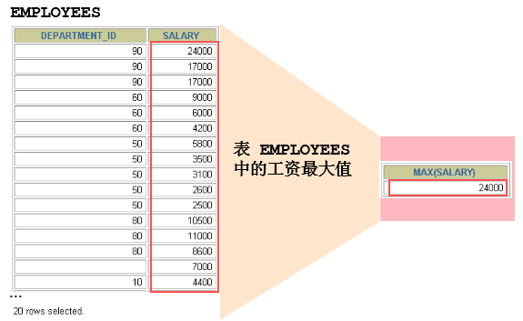

**聚合函数类型**

- AVG()
- SUM()
- MAX()
- MIN()
- COUNT()

**聚合函数语法**


聚合函数不能嵌套调用。比如不能出现类似“AVG(SUM(字段名称))”形式的调用。

#### 1.1 AVG 和 SUM 函数

可以对**数值型数据**使用 AVG 和 SUM 函数。

```mysql
SELECT AVG(salary), MAX(salary), MIN(salary), SUM(salary)
FROM employees
WHERE job_id LIKE '%REP%';
```


#### 1.2 MIN 和 MAX 函数

可以对**任意数据类型**的数据使用 MIN 和 MAX 函数。

```mysql
SELECT MIN(hire_date), MAX(hire_date)
FROM employees;
```


#### 1.3 COUNT 函数

- COUNT(*) 返回表中记录总数，适用于**任意数据类型。**

  ```mysql
  SELECT COUNT(*)
  FROM employees
  WHERE department_id = 50;
  ```

  

- COUNT(expr) 返回**expr不为空**的记录总数。

  ```mysql
  SELECT COUNT(commission_pct)
  FROM employees
  WHERE department_id = 50;
  ```

  

- **问题：用count(*)，count(1)，count(列名)谁好呢?**

  其实，对于MyISAM引擎的表是没有区别的。这种引擎内部有一计数器在维护着行数。

  Innodb引擎的表用count(*)，count(1)直接读行数，复杂度是O(n)，因为innodb真的要去数一遍。但好于具体的count(列名)。

- **问题：能不能使用count(列名)替换count(*)?**

  不要使用 count(列名)来替代 count(\*) ， count(*) 是 SQL92 定义的标准统计行数的语法，跟数据库无关，跟 NULL 和非 NULL 无关。

  说明：count(*)会统计值为 NULL 的行，而 count(列名)不会统计此列为 NULL 值的行。

### 2 GROUP BY

#### 2.1 基本使用

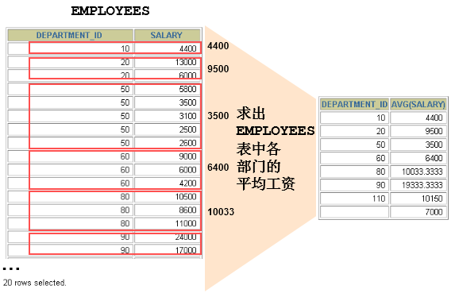

**可以使用GROUP BY子句将表中的数据分成若干组**

```mysql
SELECT column, group_function(column)
FROM table
[WHERE condition]
[GROUP BY group_by_expression]
[ORDER BY column];
```

> 明确：WHERE一定放在FROM后面

**在SELECT列表中所有未包含在组函数中的列都应该包含在 GROUP BY子句中**

```mysql
SELECT department_id, AVG(salary)
FROM employees
GROUP BY department_id;
```


包含在 GROUP BY 子句中的列不必包含在SELECT 列表中

```mysql
SELECT AVG(salary)
FROM employees
GROUP BY department_id;
```


#### 2.2 使用多个列分组


```mysql
SELECT department_id dept_id, job_id, SUM(salary)
FROM employees
GROUP BY department_id, job_id;
# or
SELECT department_id dept_id, job_id, SUM(salary)
FROM employees
GROUP BY job_id, department_id;
```

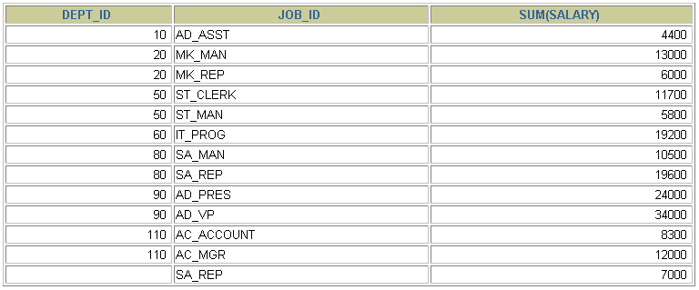

#### 2.3 GROUP BY 中使用 WITH ROLLUP

使用 WITH ROLLUP 关键字之后，在所有查询出的分组记录之后增加一条记录，该记录计算查询出的所有记录的总和，即统计记录数量。

```mysql
SELECT department_id, AVG(salary)
FROM employees
WHERE department_id > 80
GROUP BY department_id WITH ROLLUP;
```

> 注意：当使用ROLLUP时，不能同时使用ORDER BY子句进行结果排序，即ROLLUP和ORDER BY是互相排斥的。

GROUP BY 结论：

- SELECT中出现的非组函数的字段必须声明在GROUP BY 中。反之，GROUP BY中声明的字段可以不出现在SELECT中。
- GROUP BY 声明在FROM后面、WHERE后面，ORDER BY 前面、LIMIT前面
- 当使用ROLLUP时，不能同时使用ORDER BY子句进行结果排序，即ROLLUP和ORDER BY是互相排斥的。

### 3 HAVING

#### 3.1 基本使用


**过滤分组：HAVING子句**

1. 行已经被分组。
2. 使用了聚合函数。
3. 满足HAVING 子句中条件的分组将被显示。
4. HAVING 不能单独使用，必须要跟 GROUP BY 一起使用。


```mysql
SELECT department_id, MAX(salary)
FROM employees
GROUP BY department_id
HAVING MAX(salary) > 10000;
```


非法使用聚合函数：不能在 WHERE 子句中使用聚合函数。如下：

```mysql
# 错误写法
SELECT department_id, AVG(salary)
FROM employees
WHERE AVG(salary) > 8000
GROUP BY department_id;
```


#### 3.2 WHERE和HAVING的对比

**区别1：WHERE 可以直接使用表中的字段作为筛选条件，但不能使用分组中的计算函数作为筛选条件；HAVING 必须要与 GROUP BY 配合使用，可以把分组计算的函数和分组字段作为筛选条件。**

这决定了，在需要对数据进行分组统计的时候，HAVING 可以完成 WHERE 不能完成的任务。这是因为，在查询语法结构中，WHERE 在 GROUP BY 之前，所以无法对分组结果进行筛选。HAVING 在 GROUP BY 之后，可以使用分组字段和分组中的计算函数，对分组的结果集进行筛选，这个功能是 WHERE 无法完成的。另外，WHERE排除的记录不再包括在分组中。

**区别2：如果需要通过连接从关联表中获取需要的数据，WHERE 是先筛选后连接，而 HAVING 是先连接后筛选。**

这一点，就决定了在关联查询中，WHERE 比 HAVING 更高效。因为 WHERE 可以先筛选，用一个筛选后的较小数据集和关联表进行连接，这样占用的资源比较少，执行效率也比较高。HAVING 则需要先把结果集准备好，也就是用未被筛选的数据集进行关联，然后对这个大的数据集进行筛选，这样占用
的资源就比较多，执行效率也较低。

小结如下：

|        | 优点                         | 缺点                                   |
| ------ | ---------------------------- | -------------------------------------- |
| WHERE  | 先筛选数据再关联，执行效率高 | 不能使用分组中的计算函数进行筛选       |
| HAVING | 可以使用分组中的计算函数     | 在最后的结果集中进行筛选，执行效率较低 |

**开发中的选择：**

WHERE 和 HAVING 也不是互相排斥的，我们可以在一个查询里面同时使用 WHERE 和 HAVING。包含分组统计函数的条件用 HAVING，普通条件用 WHERE。这样，我们就既利用了 WHERE 条件的高效快速，又发挥了 HAVING 可以使用包含分组统计函数的查询条件的优点。当数据量特别大的时候，运行效率会有很大的差别。

### 4 SELECT的执行过程

#### 4.1 查询的结构

```mysql
#方式1：SQL92
SELECT ...,....,...
FROM ...,...,....
WHERE 多表的连接条件 AND 不包含组函数的过滤条件
GROUP BY ...,...
HAVING 包含组函数的过滤条件
ORDER BY ... ASC / DESC
LIMIT ...,...

#方式2：SQL99
SELECT ...,....,...
FROM ... JOIN ...
ON 多表的连接条件
JOIN ...
ON ...
WHERE 不包含组函数的过滤条件 AND / OR 不包含组函数的过滤条件
GROUP BY ...,...
HAVING 包含组函数的过滤条件
ORDER BY ... ASC / DESC
LIMIT ...,...

#其中：
#（1）from：从哪些表中筛选
#（2）on：关联多表查询时，去除笛卡尔积
#（3）where：从表中筛选的条件
#（4）group by：分组依据
#（5）having：在统计结果中再次筛选
#（6）order by：排序
#（7）limit：分页
```

#### 4.2 SELECT执行顺序

你需要记住 SELECT 查询时的两个顺序：

1. 关键字的顺序是不能颠倒的：

   ```mysql
   SELECT ... FROM ... WHERE ... GROUP BY ... HAVING ... ORDER BY ... LIMIT...
   ```

2. SELECT 语句的执行顺序（在 MySQL 和 Oracle 中，SELECT 执行顺序基本相同）：

   ```mysql
   FROM -> WHERE -> GROUP BY -> HAVING -> SELECT 的字段 -> DISTINCT -> ORDER BY -> LIMIT
   ```

   

比如你写了一个 SQL 语句，那么它的关键字顺序和执行顺序是下面这样的：

```mysql
SELECT DISTINCT player_id, player_name, count(*) as num # 顺序 5
FROM player JOIN team ON player.team_id = team.team_id  # 顺序 1
WHERE height > 1.80                                     # 顺序 2
GROUP BY player.team_id                                 # 顺序 3
HAVING num > 2                                          # 顺序 4
ORDER BY num DESC                                       # 顺序 6
LIMIT 2                                                 # 顺序 7
```

在 SELECT 语句执行这些步骤的时候，每个步骤都会产生一个**虚拟表**，然后将这个虚拟表传入下一个步骤中作为输入。需要注意的是，这些步骤隐含在 SQL 的执行过程中，对于我们来说是不可见的。

#### 4.3 SQL 的执行原理

- SELECT 是先执行 FROM 这一步的。在这个阶段，如果是多张表联查，还会经历下面的几个步骤：
  1. 首先先通过 CROSS JOIN 求笛卡尔积，相当于得到虚拟表 vt（virtual table）1-1；
  2. 通过 ON 进行筛选，在虚拟表 vt1-1 的基础上进行筛选，得到虚拟表 vt1-2；
  3. 添加外部行。如果我们使用的是左连接、右链接或者全连接，就会涉及到外部行，也就是在虚拟表 vt1-2 的基础上增加外部行，得到虚拟表 vt1-3。

- 当然如果我们操作的是两张以上的表，还会重复上面的步骤，直到所有表都被处理完为止。这个过程得到是我们的原始数据。
- 当我们拿到了查询数据表的原始数据，也就是最终的虚拟表 **vt1**，就可以在此基础上再进行 **WHERE 阶段**。在这个阶段中，会根据 vt1 表的结果进行筛选过滤，得到虚拟表 **vt2**。
- 然后进入第三步和第四步，也就是 **GROUP 和 HAVING 阶段**。在这个阶段中，实际上是在虚拟表 vt2 的基础上进行分组和分组过滤，得到中间的虚拟表 **vt3** 和 **vt4**。
- 当我们完成了条件筛选部分之后，就可以筛选表中提取的字段，也就是进入到 **SELECT和DISTINCT阶段**。
- 首先在 SELECT 阶段会提取想要的字段，然后在 DISTINCT 阶段过滤掉重复的行，分别得到中间的虚拟表**vt5-1**和**vt5-2**。
- 当我们提取了想要的字段数据之后，就可以按照指定的字段进行排序，也就是 ORDER BY 阶段 ，得到虚拟表 **vt6**。
- 最后在 vt6 的基础上，取出指定行的记录，也就是 LIMIT 阶段，得到最终的结果，对应的是虚拟表**vt7**。
- 当然我们在写 SELECT 语句的时候，不一定存在所有的关键字，相应的阶段就会省略。
- 同时因为 SQL 是一门类似英语的结构化查询语言，所以我们在写 SELECT 语句的时候，还要注意相应的关键字顺序，**所谓底层运行的原理，就是我们刚才讲到的执行顺序。**

------

## 八、子查询

子查询指一个查询语句嵌套在另一个查询语句内部的查询，这个特性从MySQL 4.1开始引入。

SQL 中子查询的使用大大增强了 SELECT 查询的能力，因为很多时候查询需要从结果集中获取数据，或者需要从同一个表中先计算得出一个数据结果，然后与这个数据结果（可能是某个标量，也可能是某个集合）进行比较。

### 1 需求分析与问题解决

#### 1.1 实际问题


现有解决方式：

```mysql
#方式一：
SELECT salary FROM employees WHERE last_name = 'Abel';#结果为11000
SELECT last_name, salary FROM employees WHERE salary > 11000;

#方式二：自连接
SELECT 
	e2.last_name, e2.salary
FROM 
	employees e1, employees e2
WHERE 
	e1.last_name = 'Abel'
AND 
	e1.salary < e2.salary;

#方式三：子查询
SELECT 
	last_name, salary
FROM 
	employees
WHERE 
	salary > (
		SELECT salary FROM employees WHERE last_name = 'Abel'
	);
```


#### 1.2 子查询的基本使用

- 子查询的基本语法结构：

  

- 子查询（内查询）在主查询之前一次执行完成。

- 子查询的结果被主查询（外查询）使用 。

- 注意事项：

  1. 子查询要包含在括号内
  2. 将子查询放在比较条件的右侧
  3. 单行操作符对应单行子查询，多行操作符对应多行子查询

#### 1.3 子查询的分类

**分类方式1：**

我们按内查询的结果返回一条还是多条记录，将子查询分为**单行子查询 、 多行子查询**。

- 单行子查询

  

- 多行子查询

  

**分类方式2：**

- 我们按内查询是否被执行多次，将子查询划分为`相关(或关联)子查询`和`不相关(或非关联)子查询`。

- 子查询从数据表中查询了数据结果，如果这个数据结果只执行一次，然后这个数据结果作为主查询的条件进行执行，那么这样的子查询叫做`不相关子查询`。

- 同样，如果子查询需要执行多次，即采用循环的方式，先从外部查询开始，每次都传入子查询进行查询，然后再将结果反馈给外部，这种嵌套的执行方式就称为`相关子查询`。


### 2 单行子查询

#### 2.1 单行比较操作符

| 操作符 | 含义                     |
| ------ | ------------------------ |
| =      | equal to                 |
| >      | greater than             |
| >=     | greater than or equal to |
| <      | less than                |
| <=     | less than or equal to    |
| <>     | not equal to             |

#### 2.2 代码示例

**题目：查询工资大于149号员工工资的员工的信息**


**题目：返回job_id与141号员工相同，salary比143号员工多的员工姓名，job_id和工资**

```mysql
SELECT 
	last_name, job_id, salary
FROM 
	employees
WHERE 
	job_id =
		(SELECT job_id FROM employees WHERE employee_id = 141)
AND 
	salary >
		(SELECT salary FROM employees WHERE employee_id = 143);
```


**题目：返回公司工资最少的员工的last_name, job_id和salary**

```mysql
SELECT 
	last_name, job_id, salary
FROM 
	employees
WHERE 
	salary =
		(SELECT MIN(salary) FROM employees);
```


**题目：查询与141号或174号员工的manager_id和department_id相同的其他员工的employee_id，manager_id，department_id**

```mysql
# 实现方式1：不成对比较
SELECT 
	employee_id, manager_id, department_id
FROM 
	employees
WHERE 
	manager_id IN
		(SELECT manager_id FROM employees WHERE employee_id IN (174,141))
AND 
	department_id IN
		(SELECT department_id FROM employees WHERE employee_id IN (174,141))
AND 
	employee_id NOT IN(174,141);
	
# 实现方式2：成对比较
SELECT 
	employee_id, manager_id, department_id
FROM 
	employees
WHERE 
	(manager_id, department_id) IN
		(SELECT manager_id, department_id FROM employees WHERE employee_id IN (141,174))
AND 
	employee_id NOT IN (141,174);
```

#### 2.3 HAVING 中的子查询

- 首先执行子查询。
- 向主查询中的HAVING 子句返回结果。

**题目：查询最低工资大于50号部门最低工资的部门id和其最低工资**

```mysql
SELECT 
	department_id, MIN(salary)
FROM 
	employees
GROUP BY 
	department_id
HAVING 
	MIN(salary) >
		(SELECT MIN(salary) FROM employees WHERE department_id = 50);
```

#### 2.4 CASE中的子查询

在CASE表达式中使用单列子查询：

**题目：显式员工的employee_id，last_name 和 location。其中，若员工department_id与location_id为1800
的department_id相同，则location为’Canada’，其余则为’USA’。**

```mysql
SELECT 
	employee_id, last_name, (CASE department_id
		WHEN (SELECT department_id FROM departments WHERE location_id = 1800)
		THEN 'Canada' ELSE 'USA' END) location
FROM 
	employees;
```

#### 2.5 子查询中的空值问题

```mysql
SELECT 
	last_name, job_id
FROM 
	employees
WHERE 
	job_id =
		(SELECT job_id FROM employees WHERE last_name = 'Haas');
```


> 子查询不返回任何行

#### 2.6 非法使用子查询

```mysql
SELECT 
	employee_id, last_name
FROM 
	employees
WHERE 
	salary =
		(SELECT MIN(salary) FROM employees GROUP BY department_id);
```


> 多行子查询使用单行比较符

### 3 多行子查询

- 也称为集合比较子查询
- 内查询返回多行
- 使用多行比较操作符

#### 3.1 多行比较操作符

| 操作符 | 含义                                                         |
| ------ | ------------------------------------------------------------ |
| IN     | 等于列表中的**任意一个**                                     |
| ANY    | 需要和单行比较操作符一起使用，和子查询返回的**某一个值**比较 |
| ALL    | 需要和单行比较操作符一起使用，和子查询返回的**所有值**比较   |
| SOME   | 实际上是ANY的别名，作用相同，一般常使用ANY                   |

> 注：体会 ANY 和 ALL 的区别

#### 3.2 代码示例

**题目：返回其它job_id中比job_id为‘IT_PROG’部门任一工资低的员工的员工号、姓名、job_id 以及salary**

```mysql
SELECT
	employee_id, last_name, job_id, salary
from 
	employees
where
	salary < ANY
		(SELECT salary from employees WHERE job_id = 'IT_PROG')
AND
	job_id <> 'IT_PROG';
```


**题目：返回其它job_id中比job_id为‘IT_PROG’部门所有工资都低的员工的员工号、姓名、job_id以及salary**

```mysql
SELECT
	employee_id, last_name, job_id, salary
from 
	employees
where
	salary < ALL
		(SELECT salary from employees WHERE job_id = 'IT_PROG')
AND
	job_id <> 'IT_PROG';
```


**题目：查询平均工资最低的部门id**

```mysql
# 方式一
SELECT 
	department_id
FROM 
	employees
GROUP BY 
	department_id
HAVING 
	AVG(salary) = (
		SELECT MIN(avg_sal) FROM (
			SELECT AVG(salary) avg_sal FROM employees GROUP BY department_id) dept_avg_sal);

# 方式二
SELECT 
	department_id
FROM 
	employees
GROUP BY 
	department_id
HAVING 
	AVG(salary) <= ALL (
		SELECT AVG(salary) avg_sal FROM employees GROUP BY department_id);
```

#### 3.3 空值问题

```mysql
SELECT 
	last_name
FROM 
	employees
WHERE 
	employee_id NOT IN (
		SELECT manager_id FROM employees);
```


### 4 相关子查询

#### 4.1 相关子查询执行流程

如果子查询的执行依赖于外部查询，通常情况下都是因为子查询中的表用到了外部的表，并进行了条件关联，因此每执行一次外部查询，子查询都要重新计算一次，这样的子查询就称之为**关联子查询**。

相关子查询按照一行接一行的顺序执行，主查询的每一行都执行一次子查询。


说明：**子查询中使用主查询中的列**

#### 4.2 代码示例

**题目：查询员工中工资大于本部门平均工资的员工的last_name, salary和其 department_id**

- **方式一：相关子查询**

  

- **方式二：在 FROM 中使用子查询**

  ```mysql
  SELECT 
  	last_name, salary, e1.department_id
  FROM 
  	employees e1,
  	(SELECT 
       	department_id, AVG(salary) dept_avg_sal 
       FROM 
       	employees 
       GROUP BY department_id) e2
  WHERE 
  	e1.`department_id` = e2.department_id
  AND 
  	e2.dept_avg_sal < e1.`salary`;
  ```

  > from型的子查询：子查询是作为from的一部分，子查询要用()引起来，并且要给这个子查询取别名，把它当成一张“临时的虚拟的表”来使用。

在ORDER BY 中使用子查询：

**题目：查询员工的id,salary, 按照department_name 排序**

```mysql
SELECT 
	employee_id, salary
FROM 
	employees e
ORDER BY 
	(SELECT department_name FROM departments d WHERE e.`department_id` = d.`department_id`);
```

**题目：若employees表中employee_id与job_history表中employee_id相同的数目不小于2，输出这些相同id的员工的employee_id, last_name 和其 job_id**

```mysql
SELECT 
	e.employee_id, last_name, e.job_id
FROM 
	employees e
WHERE 
	2 <= 
		(SELECT COUNT(*) FROM job_history WHERE employee_id = e.employee_id);
```

#### 4.3 EXISTS 与 NOT EXISTS关键字

- 关联子查询通常也会和 EXISTS 操作符一起来使用，用来检查在子查询中是否存在满足条件的行。
- **如果在子查询中不存在满足条件的行：**
  - 条件返回 FALSE
  - 继续在子查询中查找
- **如果在子查询中存在满足条件的行：**
  - 不在子查询中继续查找
  - 条件返回 TRUE
- NOT EXISTS关键字表示如果不存在某种条件，则返回TRUE，否则返回FALSE。

**题目：查询公司管理者的employee_id，last_name，job_id，department_id信息**

```mysql
# 方式一
SELECT 
	employee_id, last_name, job_id, department_id
FROM 
	employees e1
WHERE EXISTS 
	(SELECT * FROM employees e2 WHERE e2.manager_id = e1.employee_id);

# 方式二：自连接
SELECT DISTINCT 
	e1.employee_id, e1.last_name, e1.job_id, e1.department_id
FROM 
	employees e1 
JOIN 
	employees e2
ON 
	e1.employee_id = e2.manager_id;
	
# 方式三
SELECT 
	employee_id, last_name, job_id, department_id
FROM 
	employees
WHERE 
	employee_id IN 
		(SELECT DISTINCT manager_id FROM employees);
```

**题目：查询departments表中，不存在于employees表中的部门的department_id和department_name**

```mysql
SELECT 
	department_id, department_name
FROM 
	departments d
WHERE NOT EXISTS 
	(SELECT 'X' FROM employees WHERE department_id = d.department_id);
```

#### 4.4 相关更新

```mysql
UPDATE 
	table1 alias1
SET column = 
	(SELECT 
     	expression 
     FROM 
     	table2 alias2 
     WHERE 
     	alias1.column = alias2.column);
```

使用相关子查询依据一个表中的数据更新另一个表的数据。

**题目：在employees中增加一个department_name字段，数据为员工对应的部门名称**

```mysql
# 1）
ALTER TABLE employees ADD(department_name VARCHAR2(14));

# 2）
UPDATE 
	employees e
SET 
	department_name = 
			(SELECT 
             	department_name
             FROM 
             	departments d
             WHERE 
             	e.department_id = d.department_id);
```

#### 4.4 相关删除

```mysql
DELETE FROM 
	table1 alias1
WHERE 
	column operator 
		(SELECT 
         	expression
         FROM 
         	table2 alias2
         WHERE 
         	alias1.column = alias2.column);
```

使用相关子查询依据一个表中的数据删除另一个表的数据。

**题目：删除表employees中，其与emp_history表皆有的数据**

```mysql
DELETE FROM 
	employees e
WHERE 
	employee_id in
		(SELECT 
         	employee_id
          FROM 
         	emp_history
          WHERE 
         	employee_id = e.employee_id);
```

### 5 抛一个思考题

**问题**：谁的工资比Abel的高？

**解答**：

```mysql
#方式1：自连接
SELECT 
	e2.last_name, e2.salary
FROM 
	employees e1, employees e2
WHERE 
	e1.last_name = 'Abel'
AND 
	e1.`salary` < e2.`salary`;
```

```mysql
#方式2：子查询
SELECT 
	last_name, salary
FROM 
	employees
WHERE 
	salary > (
		SELECT 
        	salary
		FROM 
        	employees
		WHERE 
        	last_name = 'Abel');
```

**问题**：以上两种方式有好坏之分吗？

**解答**：自连接方式好！

题目中可以使用子查询，也可以使用自连接。一般情况建议你使用自连接，因为在许多 DBMS 的处理过程中，对于自连接的处理速度要比子查询快得多。

可以这样理解：子查询实际上是通过未知表进行查询后的条件判断，而自连接是通过已知的自身数据表进行条件判断，因此在大部分 DBMS 中都对自连接处理进行了优化。

------

## 九、创建和管理表

### 1 基础知识

#### 1.1 一条数据存储的过程

**存储数据是处理数据的第一步**。只有正确地把数据存储起来，我们才能进行有效的处理和分析。否则，只能是一团乱麻，无从下手。

那么，怎样才能把用户各种经营相关的、纷繁复杂的数据，有序、高效地存储起来呢？ 在 MySQL 中，一个完整的数据存储过程总共有 4 步，分别是**创建数据库**、**确认字段**、**创建数据表**、**插入数据**。


我们要先创建一个数据库，而不是直接创建数据表呢？

因为从系统架构的层次上看，MySQL 数据库系统从大到小依次是**数据库服务器**、**数据库**、**数据表**、**数据表的行与列**。

MySQL 数据库服务器之前已经安装。所以，我们就从创建数据库开始。

#### 1.2 标识符命名规则

- 数据库名、表名不得超过30个字符，变量名限制为29个
- 必须只能包含 `A–Z、a–z、0–9、 _`共63个字符
- 数据库名、表名、字段名等对象名中间不要包含空格
- 同一个MySQL软件中，数据库不能同名；同一个库中，表不能重名；同一个表中，字段不能重名
- 必须保证你的字段没有和保留字、数据库系统或常用方法冲突。如果坚持使用，请在SQL语句中使用`（着重号）引起来
- 保持字段名和类型的一致性：在命名字段并为其指定数据类型的时候一定要保证一致性，假如数据类型在一个表里是整数，那在另一个表里可就别变成字符型了

#### 1.3 MySQL中的数据类型

| 类型             | 类型举例                                                     |
| ---------------- | ------------------------------------------------------------ |
| 整数类型         | TINYINT、SMALLINT、MEDIUMINT、**INT(或INTEGER)**、BIGINT     |
| 浮点类型         | FLOAT、DOUBLE                                                |
| 定点数类型       | **DECIMAL**                                                  |
| 位类型           | BIT                                                          |
| 日期时间类型     | YEAR、TIME、**DATE**、DATETIME、TIMESTAMP                    |
| 文本字符串类型   | CHAR、**VARCHAR**、TINYTEXT、TEXT、MEDIUMTEXT、LONGTEXT      |
| 枚举类型         | ENUM                                                         |
| 集合类型         | SET                                                          |
| 二进制字符串类型 | BINARY、VARBINARY、TINYBLOB、BLOB、MEDIUMBLOB、LONGBLOB      |
| JSON类型         | JSON对象、JSON数组                                           |
| 空间数据类型     | 单值：GEOMETRY、POINT、LINESTRING、POLYGON<br />集合：MULTIPOINT、MULTILINESTRING、MULTIPOLYGON、GEOMETRYCOLLECTION |

其中，常用的几类类型介绍如下：

| 数据类型      | 描述                                                         |
| ------------- | ------------------------------------------------------------ |
| INT           | 从 -2^31 到 2^31-1的整型数据。存储大小为 4个字节             |
| CHAR(size)    | 定长字符数据。若未指定，默认为1个字符，最大长度255           |
| VARCHAR(size) | 可变长字符数据，根据字符串实际长度保存，**必须指定长度**     |
| FLOAT(M,D)    | 单精度，占用4个字节，M=整数位+小数位，D=小数位。 D<=M<=255，0<=D<=30，默认M+D<=6 |
| DOUBLE(M,D)   | 双精度，占用8个字节，D<=M<=255，0<=D<=30，默认M+D<=15        |
| DECIMAL(M,D)  | 高精度小数，占用M+2个字节，D<=M<=65，0<=D<=30，最大取值范围与DOUBLE相同。 |
| DATE          | 日期型数据，格式'YYYY-MM-DD'                                 |
| BLOB          | 二进制形式的长文本数据，最大可达4G                           |
| TEXT          | 长文本数据，最大可达4G                                       |

### 2 创建和管理数据库

#### 2.1 创建数据库

- 方式1：创建数据库

```mysql
CREATE DATABASE 数据库名;
```

- 方式2：创建数据库并指定字符集

```mysql
CREATE DATABASE 数据库名 CHARACTER SET 字符集;
```

- 方式3：判断数据库是否已经存在，不存在则创建数据库（ 推荐 ）

```mysql
CREATE DATABASE IF NOT EXISTS 数据库名;
```

如果MySQL中已经存在相关的数据库，则忽略创建语句，不再创建数据库。

> 注意：DATABASE 不能改名。一些可视化工具可以改名，它是建新库，把所有表复制到新库，再删旧库完成的。

#### 2.2 使用数据库

- 查看当前所有的数据库

```mysql
SHOW DATABASES; #有一个S，代表多个数据库
```

- 查看当前正在使用的数据库

```mysql
SELECT DATABASE(); #使用的一个 mysql 中的全局函数
```

- 查看指定库下所有的表

```mysql
SHOW TABLES FROM 数据库名;
```

- 查看数据库的创建信息

```mysql
SHOW CREATE DATABASE 数据库名;
# or
SHOW CREATE DATABASE 数据库名\G
```

- 使用/切换数据库

```mysql
USE 数据库名;
```

> 注意：要操作表格和数据之前必须先说明是对哪个数据库进行操作，否则就要对所有对象加上“数据库名.”。

#### 2.3 修改数据库

- 更改数据库字符集

```mysql
ALTER DATABASE 数据库名 CHARACTER SET 字符集; #比如：gbk、utf8等
```

#### 2.4 删除数据库

- 方式1：删除指定的数据库

```mysql
DROP DATABASE 数据库名;
```

- 方式2：删除指定的数据库（ 推荐 ）

```mysql
DROP DATABASE IF EXISTS 数据库名;
```

### 3 创建表

#### 3.1 创建方式1

- **必须具备**：

  - CREATE TABLE权限
  - 存储空间

- **语法格式**：

  ```mysql
  CREATE TABLE [IF NOT EXISTS] 表名(
  	字段1, 数据类型 [约束条件] [默认值],
  	字段2, 数据类型 [约束条件] [默认值],
  	字段3, 数据类型 [约束条件] [默认值],
  	……
  	[表约束条件]
  );
  ```

  > 加上了IF NOT EXISTS关键字，则表示：如果当前数据库中不存在要创建的数据表，则创建数据表；如果当前数据库中已经存在要创建的数据表，则忽略建表语句，不再创建数据表。

- **必须指定**：

  - 表名
  - 列名(或字段名)，数据类型，长度

- **可选指定**：

  - 约束条件
  - 默认值

- 创建表举例1：

  ```mysql
  -- 创建表
  CREATE TABLE emp (
  	-- int类型
  	emp_id INT,
  	-- 最多保存20个中英文字符
  	emp_name VARCHAR(20),
  	-- 总位数不超过15位
  	salary DOUBLE,
  	-- 日期类型
  	birthday DATE
  );
  ```

  ```mysql
  DESC emp;
  ```

  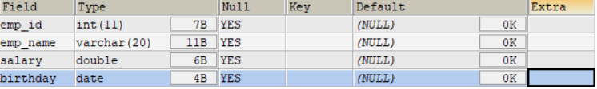

  MySQL在执行建表语句时，将id字段的类型设置为int(11)，这里的11实际上是int类型指定的显示宽度，默认的显示宽度为11。也可以在创建数据表的时候指定数据的显示宽度。

- 创建表举例2：

  ```mysql
  CREATE TABLE dept(
  	-- int类型，自增
  	deptno INT(2) AUTO_INCREMENT,
  	dname VARCHAR(14),
  	loc VARCHAR(13),
  	-- 主键
  	PRIMARY KEY (deptno)
  );
  ```

  ```mysql
  DESC dept;
  ```

  

  > 在MySQL 8.x版本中，不再推荐为INT类型指定显示长度，并在未来的版本中可能去掉这样的语法。

#### 3.2 创建方式2

- 使用 AS subquery 选项，将创建表和插入数据结合起来

  

- 指定的列和子查询中的列要一一对应

- 通过列名和默认值定义列

```mysql
CREATE TABLE emp1 AS SELECT * FROM employees;

CREATE TABLE emp2 AS SELECT * FROM employees WHERE 1=2; -- 创建的emp2是空表
```

```mysql
CREATE TABLE dept80
AS
SELECT employee_id, last_name, salary*12 ANNSAL, hire_date
FROM employees
WHERE department_id = 80;
```

```mysql
DESCRIBE dept80;
```


#### 3.3 查看数据表结构

在MySQL中创建好数据表之后，可以查看数据表的结构。MySQL支持使用 `DESCRIBE/DESC` 语句查看数据表结构，也支持使用 `SHOW CREATE TABLE` 语句查看数据表结构。

语法格式如下：

```mysql
SHOW CREATE TABLE 表名\G

DESC 表名；
DESCRIBE 表名；
```

使用SHOW CREATE TABLE语句不仅可以查看表创建时的详细语句，还可以查看存储引擎和字符编码。

### 4 修改表

修改表指的是修改数据库中已经存在的数据表的结构。

使用 `ALTER TABLE` 语句可以实现：

- 向已有的表中添加列 ADD
- 修改现有表中的列 MODIFY
- 删除现有表中的列 DROP
- 重命名现有表中的列 CHANGE

#### 4.1 追加一个列

语法格式如下：

```mysql
ALTER TABLE 表名 ADD [COLUMN] 字段名 字段类型 【FIRST|AFTER 字段名】;
```

举例：

```mysql
ALTER TABLE dept80
ADD job_id varchar(15);
```

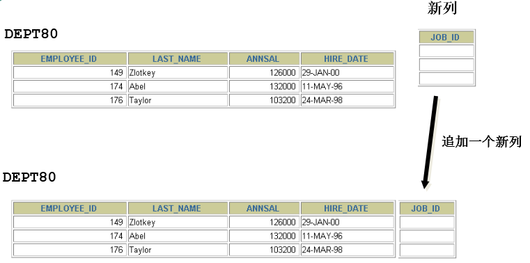

#### 4.2 修改一个列

- 可以修改列的数据类型，长度、默认值和位置

- 修改字段数据类型、长度、默认值、位置的语法格式如下：

  ```mysql
  ALTER TABLE 表名 MODIFY [COLUMN] 字段名1 字段类型 【DEFAULT 默认值】【FIRST|AFTER 字段名2】;
  ```

- 举例：

  ```mysql
  ALTER TABLE dept80
  MODIFY last_name VARCHAR(30);
  ```

  ```mysql
  ALTER TABLE dept80
  MODIFY salary double(9,2) default 1000;
  ```

- 对默认值的修改只影响今后对表的修改

- 此外，还可以通过此种方式修改列的约束。这里暂先不讲。

#### 4.3 重命名一个列

使用 `CHANGE old_column new_column dataType`子句重命名列。语法格式如下：

```mysql
ALTER TABLE 表名 CHANGE [COLUMN] 列名 新列名 新数据类型;
```

举例：

```mysql
ALTER TABLE dept80
CHANGE department_name dept_name varchar(15);
```

#### 4.4 删除一个列

删除表中某个字段的语法格式如下：

```mysql
ALTER TABLE 表名 DROP [COLUMN] 字段名
```

举例：

```mysql
ALTER TABLE dept80
DROP COLUMN job_id;
```

### 5 重命名表

- 方式一：使用RENAME

  ```mysql
  RENAME TABLE emp
  TO myemp;
  ```

- 方式二：

  ```mysql
  ALTER table dept
  RENAME [TO] detail_dept; -- [TO]可以省略
  ```

- 必须是对象的拥有者

### 6 删除表

- 在MySQL中，当一张数据表**没有与其他任何数据表形成关联关系**时，可以将当前数据表直接删除。

- 数据和结构都被删除

- 所有正在运行的相关事务被提交

- 所有相关索引被删除

- 语法格式：

  ```mysql
  DROP TABLE [IF EXISTS] 数据表1 [, 数据表2, …, 数据表n];
  ```

  `IF EXISTS` 的含义为：如果当前数据库中存在相应的数据表，则删除数据表；如果当前数据库中不存在相应的数据表，则忽略删除语句，不再执行删除数据表的操作。

- 举例：

  ```mysql
  DROP TABLE dept80;
  ```

- DROP TABLE 语句不能回滚

### 7 清空表

- TRUNCATE TABLE语句：

  - 删除表中所有的数据
  - 释放表的存储空间

- 举例：

  ```mysql
  TRUNCATE TABLE detail_dept;
  ```

- TRUNCATE语句不能回滚，而使用 DELETE 语句删除数据，可以回滚

- 对比：

  ```mysql
  # DCL 中 COMMIT 和 ROLLBACK
  # COMMIT:提交数据。一旦执行COMMIT，则数据就被永久的保存在了数据库中，意味着数据不可以回滚。
  # ROLLBACK:回滚数据。一旦执行ROLLBACK,则可以实现数据的回滚。回滚到最近的一次COMMIT之后。
  
  # 对比 TRUNCATE TABLE 和 DELETE FROM 
  # 相同点：都可以实现对表中所有数据的删除，同时保留表结构。
  # 不同点：
  #	TRUNCATE TABLE：一旦执行此操作，表数据全部清除。同时，数据是不可以回滚的。
  #	DELETE FROM：一旦执行此操作，表数据可以全部清除（不带WHERE）。同时，数据是可以实现回滚的
  
  /*
  9. DDL 和 DML 的说明
    ① DDL的操作一旦执行，就不可回滚。指令SET autocommit = FALSE对DDL操作失效。(因为在执行完DDL
      操作之后，一定会执行一次COMMIT。而此COMMIT操作不受SET autocommit = FALSE影响的。)
    
    ② DML的操作默认情况，一旦执行，也是不可回滚的。但是，如果在执行DML之前，执行了 
      SET autocommit = FALSE，则执行的DML操作就可以实现回滚。
  */
  ```

  > 阿里开发规范：
  >
  > 【参考】TRUNCATE TABLE 比 DELETE 速度快，且使用的系统和事务日志资源少，但 TRUNCATE 无事务且不触发 TRIGGER，有可能造成事故，故不建议在开发代码中使用此语句。
  >
  > 说明：TRUNCATE TABLE 在功能上与不带 WHERE 子句的 DELETE 语句相同。

### 8 内容拓展

#### 拓展1：阿里巴巴《Java开发手册》之MySQL字段命名

- 【`强制`】表名、字段名必须使用小写字母或数字，禁止出现数字开头，禁止两个下划线中间只出现数字。数据库字段名的修改代价很大，因为无法进行预发布，所以字段名称需要慎重考虑。

  - 正例：aliyun_admin，rdc_config，level3_name
  - 反例：AliyunAdmin，rdcConfig，level_3_name

- 【`强制`】禁用保留字，如 desc、range、match、delayed 等，请参考 MySQL 官方保留字。

- 【`强制`】表必备三字段：id、gmt_create、gmt_modified。

  - 说明：其中 id 必为主键，类型为BIGINT UNSIGNED、单表时自增、步长为 1。gmt_create,gmt_modified 的类型均为 DATETIME 类型，前者现在时表示主动式创建，后者过去分词表示被动式更新
  
- 【`推荐`】表的命名最好是遵循 “业务名称_表的作用”。

  - 正例：alipay_task 、 force_project、 trade_config

- 【`推荐`】库名与应用名称尽量一致。

- 【`参考`】合适的字符存储长度，不但节约数据库表空间、节约索引存储，更重要的是提升检索速度。

  - 正例：无符号值可以避免误存负数，且扩大了表示范围。

    

#### 拓展2：如何理解清空表、删除表等操作需谨慎？！

**表删除**操作将把表的定义和表中的数据一起删除，并且MySQL在执行删除操作时，不会有任何的确认信息提示，因此执行删除操作时应当慎重。在删除表前，最好对表中的数据进行**备份**，这样当操作失误时可以对数据进行恢复，以免造成无法挽回的后果。

同样的，在使用 **ALTER TABLE** 进行表的基本修改操作时，在执行操作过程之前，也应该确保对数据进行完整的**备份**，因为数据库的改变是**无法撤销**的，如果添加了一个不需要的字段，可以将其删除；相同的，如果删除了一个需要的列，该列下面的所有数据都将会丢失。

#### 拓展3：MySQL8新特性—DDL的原子化

在MySQL 8.0版本中，InnoDB表的DDL支持事务完整性，即 **DDL操作要么成功要么回滚** 。DDL操作回滚日志写入到data dictionary数据字典表mysql.innodb_ddl_log（该表是隐藏的表，通过show tables无法看到）中，用于回滚操作。通过设置参数，可将DDL操作日志打印输出到MySQL错误日志中。

分别在MySQL 5.7版本和MySQL 8.0版本中创建数据库和数据表，结果如下：

```mysql
CREATE DATABASE mytest;

USE mytest;

CREATE TABLE book1(
	book_id INT ,
	book_name VARCHAR(255)
);

SHOW TABLES;
```

1. 在MySQL 5.7版本中，测试步骤如下： 删除数据表book1和数据表book2，结果如下：

   ```mysql
   mysql> DROP TABLE book1,book2;
   ERROR 1051 (42S02): Unknown table 'mytest.book2'
   ```

   再次查询数据库中的数据表名称，结果如下：

   ```mysql
   mysql> SHOW TABLES;
   Empty set (0.00 sec)
   ```

   从结果可以看出，虽然删除操作时报错了，但是仍然删除了数据表book1。

2. 在MySQL 8.0版本中，测试步骤如下：删除数据表book1和数据表book2，结果如下：

   ```mysql
   mysql> DROP TABLE book1,book2;
   ERROR 1051 (42S02): Unknown table 'mytest.book2'
   ```

   再次查询数据库中的数据表名称，结果如下：

   ```mysql
   mysql> show tables;
   +------------------+
   | Tables_in_mytest |
   +------------------+
   | book1            |
   +------------------+
   1 row in set (0.00 sec)
   ```

   从结果可以看出，数据表book1并没有被删除。

------

## 十、数据处理之增删改

### 1 插入数据

#### 1.1 实际问题


解决方式：使用 INSERT 语句向表中插入数据。

#### 1.2 方式1：VALUES的方式添加

使用这种语法一次只能向表中插入**一条**数据。

**情况1：为表的所有字段按默认顺序插入数据**

```mysql
INSERT INTO 表名
VALUES (value1, value2, ....);
```

值列表中需要为表的每一个字段指定值，并且值的顺序必须和数据表中字段定义时的顺序相同。

举例：

```mysql
INSERT INTO departments
VALUES (70, 'Pub', 100, 1700);

INSERT INTO departments
VALUES (100, 'Finance', NULL, NULL);
```

**情况2：为表的指定字段插入数据**

```mysql
INSERT INTO 表名(column1 [, column2, …, columnn])
VALUES (value1 [,value2, …, valuen]);
```

为表的指定字段插入数据，就是在INSERT语句中只向部分字段中插入值，而其他字段的值为表定义时的默认值。

在 INSERT 子句中随意列出列名，但是一旦列出，VALUES中要插入的value1，.... valuen需要与column1,...columnn列一一对应。如果类型不同，将无法插入，并且MySQL会产生错误。

举例：

```mysql
INSERT INTO departments(department_id, department_name)
VALUES (80, 'IT');
```

**情况3：同时插入多条记录**

INSERT语句可以同时向数据表中插入多条记录，插入时指定多个值列表，每个值列表之间用逗号分隔开，基本语法格式如下：

```mysql
INSERT INTO table_name
VALUES
(value1 [,value2, …, valuen]),
(value1 [,value2, …, valuen]),
……
(value1 [,value2, …, valuen]);
```

或者

```mysql
INSERT INTO table_name (column1 [, column2, …, columnn])
VALUES
(value1 [,value2, …, valuen]),
(value1 [,value2, …, valuen]),
……
(value1 [,value2, …, valuen]);
```

举例：

```mysql
mysql> INSERT INTO emp(emp_id,emp_name)
	-> VALUES (1001,'shkstart'),
	-> (1002,'atguigu'),	
	-> (1003,'Tom');
Query OK, 3 rows affected (0.00 sec)
Records: 3 Duplicates: 0 Warnings: 0
```

使用INSERT同时插入多条记录时，MySQL会返回一些在执行单行插入时没有的额外信息，这些信息的含义如下：

- Records：表明插入的记录条数。 
- Duplicates：表明插入时被忽略的记录，原因可能是这些记录包含了重复的主键值。
- Warnings：表明有问题的数据值，例如发生数据类型转换。

> 一个同时插入多行记录的INSERT语句等同于多个单行插入的INSERT语句，但是多行的INSERT语句在处理过程中`效率更高`。因为MySQL执行单条INSERT语句插入多行数据比使用多条INSERT语句快，所以在插入多条记录时最好选择使用单条INSERT语句的方式插入。

**小结**：

- **VALUES** 也可以写成 **VALUE** ，但是VALUES是标准写法。
- 字符和日期型数据应包含在单引号中。

#### 1.3 方式2：将查询结果插入到表中

INSERT还可以将SELECT语句查询的结果插入到表中，此时不需要把每一条记录的值一个一个输入，只需要使用一条INSERT语句和一条SELECT语句组成的组合语句即可快速地从一个或多个表中向一个表中插入多行。

基本语法格式如下：

```mysql
INSERT INTO 目标表名
(tar_column1 [, tar_column2, …, tar_columnn])
SELECT
(src_column1 [, src_column2, …, src_columnn])
FROM 源表名
[WHERE condition]
```

- 在 INSERT 语句中加入子查询。
- **不必书写 VALUES 子句**。
- 子查询中的值列表应与 INSERT 子句中的列名对应。

举例：

```mysql
INSERT INTO emp2
SELECT *
FROM employees
WHERE department_id = 90;

INSERT INTO sales_reps(id, name, salary, commission_pct)
SELECT employee_id, last_name, salary, commission_pct
FROM employees
WHERE job_id LIKE '%REP%';
```

### 2 更新数据


- 使用 UPDATE 语句更新数据。语法如下：

  ```mysql
  UPDATE table_name
  SET column1=value1, column2=value2, … , columnn = valuen
  [WHERE condition]
  ```

- 可以一次更新**多条**数据。

- 如果需要回滚数据，需要保证在DML前，进行设置：**SET AUTOCOMMIT = FALSE;**

- 使用 **WHERE** 子句指定需要更新的数据。

  ```mysql
  UPDATE employees
  SET department_id = 70
  WHERE employee_id = 113;
  ```

- 如果省略 WHERE 子句，则表中的所有数据都将被更新。

  ```mysql
  UPDATE copy_emp
  SET department_id = 110;
  ```

- **更新中的数据完整性错误**

  ```mysql
  UPDATE employees
  SET department_id = 55
  WHERE department_id = 110;
  # 修改数据时，是可能存在不成功的情况的。（可能是由于约束的影响造成的）
  ```

  

> 说明：不存在 55 号部门

### 3 删除数据

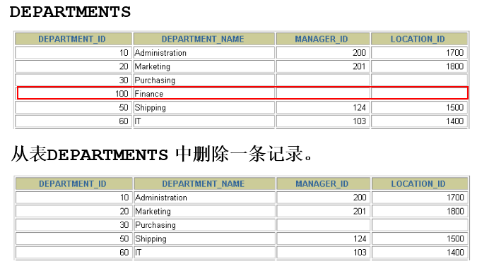

- 使用 DELETE 语句从表中删除数据

  

  ```mysql
  DELETE FROM table_name [WHERE <condition>];
  ```

  table_name指定要执行删除操作的表；“[WHERE ]”为可选参数，指定删除条件，如果没有WHERE子句，DELETE语句将删除表中的所有记录。

- 使用 WHERE 子句删除指定的记录。

  ```mysql
  DELETE FROM departments
  WHERE department_name = 'Finance';
  ```

- 如果省略 WHERE 子句，则表中的全部数据将被删除

  ```mysql
  DELETE FROM copy_emp;
  ```

- **删除中的数据完整性错误**

  ```mysql
  DELETE FROM departments
  WHERE department_id = 60;
  ```

  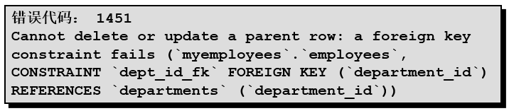

  > 说明：You cannot delete a row that contains a primary key that is used as a foreign key in another table.

### 4 MySQL8新特性：计算列

什么叫计算列呢？简单来说就是某一列的值是通过别的列计算得来的。例如，a列值为1、b列值为2，c列不需要手动插入，定义a+b的结果为c的值，那么c就是计算列，是通过别的列计算得来的。

在MySQL 8.0中，CREATE TABLE 和 ALTER TABLE 中都支持增加计算列。下面以CREATE TABLE为例进行讲解。

举例：定义数据表tb1，然后定义字段id、字段a、字段b和字段c，其中字段c为计算列，用于计算a+b的值。 首先创建测试表tb1，语句如下：

```mysql
CREATE TABLE tb1(
	id INT,
	a INT,
	b INT,
	c INT GENERATED ALWAYS AS (a + b) VIRTUAL
);
```

插入演示数据，语句如下：

```mysql
INSERT INTO tb1(a,b) VALUES (100,200);
```

查询数据表tb1中的数据，结果如下：

```mysql
mysql> SELECT * FROM tb1;
+------+------+------+------+
| id   | a    | b    | c    |
+------+------+------+------+
| NULL | 100  | 200  | 300  |
+------+------+------+------+
1 row in set (0.00 sec)
```

更新数据中的数据，语句如下：

```mysql
mysql> UPDATE tb1 SET a = 500;
Query OK, 0 rows affected (0.00 sec)
Rows matched: 1 Changed: 0 Warnings: 0

mysql> SELECT * FROM tb1;
+------+------+------+------+
| id   | a    | b    | c    |
+------+------+------+------+
| NULL | 500  | 200  | 700  |
+------+------+------+------+
1 row in set (0.00 sec)
```

### 5 综合案例

```mysql
# 1、创建数据库test01_library
CREATE DATABASE IF NOT EXISTS test01_library CHARACTER SET 'utf8';
USE test01_library;

# 2、创建表 books，表结构如下：
CREATE TABLE IF NOT EXISTS books(
	id int,
	`name` VARCHAR(50),
	`authors` VARCHAR(100),
	price FLOAT,
	pubdate YEAR,
	note VARCHAR(100),
	num INT
);
```

| 字段名  | 字段说明 | 数据类型     |
| ------- | -------- | ------------ |
| id      | 书编号   | INT          |
| name    | 书名     | VARCHAR(50)  |
| authors | 作者     | VARCHAR(100) |
| price   | 价格     | FLOAT        |
| pubdate | 出版日期 | YEAR         |
| note    | 说明     | VARCHAR(100) |
| num     | 库存     | INT          |

```mysql
# 3、向books表中插入记录
# 1）不指定字段名称，插入第一条记录
INSERT INTO books 
VALUES(1,'Tal of AAA','Dickes',23,1995,'novel',11);

# 2）指定所有字段名称，插入第二记录
INSERT INTO books(id,`name`,`authors`,price,pubdate,note,num)
VALUES(2,'EmmaT','Jane lura',35,1993,'joke',22);

# 3）同时插入多条记录（剩下的所有记录）
INSERT INTO books
VALUES
(3,'Story of Jane','Jane Tim',40,2001,'novel',0),
(4,'Lovey Day','George Byron',20,2005,'novel',30),
(5,'Old land','Honore Blade',30,2010,'law',0),
(6,'The Battle','Upton Sara',30,1999,'medicine',40),
(7,'Rose Hood','Richard haggard',28,2008,'cartoon',28);
```

| id   | name          | authors         | price | pubdate | note     | num  |
| ---- | ------------- | --------------- | ----- | :------ | -------- | ---- |
| 1    | Tal of AAA    | Dickes          | 23    | 1995    | novel    | 11   |
| 2    | EmmaT         | Jane lura       | 35    | 1993    | joke     | 22   |
| 3    | Story of Jane | Jane Tim        | 40    | 2001    | novel    | 0    |
| 4    | Lovey Day     | George Byron    | 20    | 2005    | novel    | 30   |
| 5    | Old land      | Honore Blade    | 30    | 2010    | law      | 0    |
| 6    | The Battle    | Upton Sara      | 30    | 1999    | medicine | 40   |
| 7    | Rose Hood     | Richard haggard | 28    | 2008    | cartoon  | 28   |

```mysql
# 4、将小说类型(novel)的书的价格都增加5。
UPDATE books SET price = price + 5 WHERE note = 'novel';

# 5、将名称为EmmaT的书的价格改为40，并将说明改为drama。
UPDATE books SET price = 40, note = 'drama' WHERE `name` = 'EmmaT';

# 6、删除库存为0的记录。
DELETE FROM books WHERE num = 0;

# 7、统计书名中包含a字母的书
SELECT name FROM books WHERE `name` LIKE '%a%';

# 8、统计书名中包含a字母的书的数量和库存总量
SELECT COUNT(*), SUM(num) FROM books WHERE `name` LIKE '%a%';

# 9、找出“novel”类型的书，按照价格降序排列
SELECT * FROM books WHERE note = 'novel' ORDER BY price DESC;

# 10、查询图书信息，按照库存量降序排列，如果库存量相同的按照note升序排列
SELECT * FROM books ORDER BY num DESC, note ASC;

# 11、按照note分类统计书的数量
SELECT note, COUNT(*) from books GROUP BY note; 

# 12、按照note分类统计书的库存量，显示库存量超过30本的
SELECT note, SUM(num) "num_sum" from books GROUP BY note HAVING num_sum > 30; 

# 13、查询所有图书，每页显示5本，显示第二页
SELECT * FROM books LIMIT 5,5;

# 14、按照note分类统计书的库存量，显示库存量最多的
SELECT note, SUM(num) "num_sum" 
from books 
GROUP BY note 
ORDER BY num_sum DESC 
LIMIT 0,1;

# 15、查询书名达到10个字符的书，不包括里面的空格
SELECT `name` FROM books WHERE CHAR_LENGTH(REPLACE(`name`,' ','')) >= 10;

# 16、查询书名和类型，其中note值为novel显示小说，law显示法律，medicine显示医药，cartoon显示卡通，joke显示笑话
SELECT `name` AS "书名", note, CASE note 
			WHEN 'novel' THEN '小说' 
			WHEN 'law' THEN '法律' 
			WHEN 'medicine' THEN '医药'
			WHEN 'cartoon' THEN '卡通'
			WHEN 'joke' THEN '笑话'
			ELSE '其他'
			END AS "类型" 
from books;

# 17、查询书名、库存，其中num值超过30本的，显示滞销，大于0并低于10的，显示畅销，为0的显示需要无货
SELECT 
	`name` "书名", 
	num "库存", 
	CASE 
		WHEN num > 30 THEN '滞销'
		WHEN num > 0 AND num < 10 THEN '畅销'
		WHEN num = 0 THEN '无货'
		ELSE '正常'
		END AS "库存状态"
FROM books;

# 18、统计每一种note的库存量，并合计总量
SELECT 
	IFNULL(note,'合计库存总量') AS note, SUM(num) 
FROM 
	books 
GROUP BY 
	note WITH ROLLUP;

# 19、统计每一种note的数量，并合计总量
SELECT 
	IFNULL(note,'合计总量') AS note, COUNT(*) 
FROM 
	books 
GROUP BY 
	note WITH ROLLUP;

# 20、统计库存量前三名的图书
SELECT * FROM books ORDER BY num DESC LIMIT 0,3;

# 21、找出最早出版的一本书
SELECT * FROM books ORDER BY pubdate ASC LIMIT 0,1;

# 22、找出novel中价格最高的一本书
SELECT * FROM books WHERE note = 'novel' ORDER BY price DESC LIMIT 0,1;

# 23、找出书名中字数最多的一本书，不含空格
SELECT * FROM books ORDER BY CHAR_LENGTH(REPLACE(`name`,' ','')) DESC LIMIT 0,1;
```

------

## 十一、MySQL数据类型精讲

### 1 MySQL中的数据类型

| 类型             | 类型举例                                                     |
| :--------------- | ------------------------------------------------------------ |
| 整数类型         | TINYINT、SMALLINT、MEDIUMINT、INT(或INTEGER)、BIGINT         |
| 浮点类型         | FLOAT、DOUBLE                                                |
| 定点数类型       | DECIMAL                                                      |
| 位类型           | BIT                                                          |
| 日期时间类型     | YEAR、TIME、DATE、DATETIME、TIMESTAMP                        |
| 文本字符串类型   | CHAR、VARCHAR、TINYTEXT、TEXT、MEDIUMTEXT、LONGTEXT          |
| 枚举类型         | ENUM                                                         |
| 集合类型         | SET                                                          |
| 二进制字符串类型 | BINARY、VARBINARY、TINYBLOB、BLOB、MEDIUMBLOB、LONGBLOB      |
| JSON类型         | JSON对象、JSON数组                                           |
| 空间数据类型     | 单值类型：GEOMETRY、POINT、LINESTRING、POLYGON；<br/>集合类型：MULTIPOINT、MULTILINESTRING、MULTIPOLYGON、<br/>GEOMETRYCOLLECTION |

常见数据类型的属性，如下：

| MySQL关键字        | 含义                     |
| ------------------ | ------------------------ |
| NULL               | 数据列可包含NULL值       |
| NOT NULL           | 数据列不允许包含NULL值   |
| DEFAULT            | 默认值                   |
| PRIMARY KEY        | 主键                     |
| AUTO_INCREMENT     | 自动递增，适用于整数类型 |
| UNSIGNED           | 无符号                   |
| CHARACTER SET name | 指定一个字符集           |

### 2 整数类型

#### 2.1 类型介绍

整数类型一共有 5 种，包括`TINYINT`、`SMALLINT`、`MEDIUMINT`、`INT（INTEGER）`和`BIGINT`。

它们的区别如下表所示：

| **整数类型** | **字节** | 有符号数取值范围                           | 无符号数取值范围         |
| ------------ | -------- | ------------------------------------------ | ------------------------ |
| TINYINT      | 1        | -128 ~ 127                                 | 0 ~ 255                  |
| SMALLINT     | 2        | -32768 ~ 32767                             | 0 ~ 65535                |
| MEDIUMINT    | 3        | -8388608 ~ 8388607                         | 0 ~ 16777215             |
| INT、INTEGER | 4        | -2147483648 ~ 2147483647                   | 0 ~ 4294967295           |
| BIGINT       | 8        | -9223372036854775808 ~ 9223372036854775807 | 0 ~ 18446744073709551615 |

#### 2.2 可选属性

整数类型的可选属性有三个：

##### 2.2.1 M

**M** : 表示显示宽度，M的取值范围是(0, 255)。例如，int(5)：当数据宽度小于5位的时候在数字前面需要用字符填满宽度。该项功能需要配合“ **ZEROFILL** ”使用，表示用“0”填满宽度，否则指定显示宽度无效。

如果设置了显示宽度，那么插入的数据宽度超过显示宽度限制，会不会截断或插入失败？

答案：不会对插入的数据有任何影响，还是按照类型的实际宽度进行保存，即**显示宽度与类型可以存储的值范围无关 。从MySQL 8.0.17开始，整数数据类型不推荐使用显示宽度属性。**

整型数据类型可以在定义表结构时指定所需要的显示宽度，如果不指定，则系统为每一种类型指定默认的宽度值。

举例：

```mysql
CREATE TABLE test_int1 ( x TINYINT, y SMALLINT, z MEDIUMINT, m INT, n BIGINT );
```

查看表结构 （MySQL5.7中显式如下，MySQL8中不再显式范围）

```mysql
mysql> desc test_int1;
+-------+--------------+------+-----+---------+-------+
| Field | Type         | Null | Key | Default | Extra |
+-------+--------------+------+-----+---------+-------+
| x     | tinyint(4)   | YES  |     | NULL    |       |
| y     | smallint(6)  | YES  |     | NULL    |       |
| z     | mediumint(9) | YES  |     | NULL    |       |
| m     | int(11)      | YES  |     | NULL    |       |
| n     | bigint(20)   | YES  |     | NULL    |       |
+-------+--------------+------+-----+---------+-------+
5 rows in set (0.00 sec)
```

TINYINT有符号数和无符号数的取值范围分别为-128\~127和0~255，由于负号占了一个数字位，因此TINYINT默认的显示宽度为4。同理，其他整数类型的默认显示宽度与其有符号数的最小值的宽度相同。

举例：

```mysql
CREATE TABLE test_int2(
	f1 INT,
	f2 INT(5),
	f3 INT(5) ZEROFILL
)

DESC test_int2;

INSERT INTO test_int2(f1,f2,f3)
VALUES(1, 123, 123);

INSERT INTO test_int2(f1,f2)
VALUES(123456, 123456);

INSERT INTO test_int2(f1,f2,f3)
VALUES(123456, 123456, 123456);

#Out of range value for column 'f2' at row 1
INSERT INTO test_int2(f1) VALUES(4294967296);

mysql> SELECT * FROM test_int2;
+--------+--------+--------+
| f1     | f2     | f3     |
+--------+--------+--------+
| 1      | 123    | 00123  |
| 123456 | 123456 | NULL   |
| 123456 | 123456 | 123456 |
+--------+--------+--------+
3 rows in set (0.00 sec)
```

##### 2.2.2 UNSIGNED

**UNSIGNED** : 无符号类型（非负），所有的整数类型都有一个可选的属性UNSIGNED（无符号属性），无符号整数类型的最小取值为0。所以，如果需要在MySQL数据库中保存非负整数值时，可以将整数类型设置为无符号类型。

int类型默认显示宽度为int(11)，无符号int类型默认显示宽度为int(10)。

```mysql
CREATE TABLE test_int3(
	f1 INT UNSIGNED
);

mysql> desc test_int3;
+-------+------------------+------+-----+---------+-------+
| Field | Type             | Null | Key | Default | Extra |
+-------+------------------+------+-----+---------+-------+
| f1    | int(10) unsigned | YES  |     | NULL    |       |
+-------+------------------+------+-----+---------+-------+
1 row in set (0.00 sec)
```

##### 2.2.3 ZEROFILL

**ZEROFILL** : 0填充,（如果某列是ZEROFILL，那么MySQL会自动为当前列添加UNSIGNED属性），如果指定了ZEROFILL只是表示不够M位时，用0在左边填充，如果超过M位，只要不超过数据存储范围即可。

原来，在 int(M) 中，M 的值跟 int(M) 所占多少存储空间并无任何关系。 int(3)、int(4)、int(8) 在磁盘上都是占用 4 bytes 的存储空间。也就是说，**int(M)，必须和UNSIGNED ZEROFILL一起使用才有意义。**如果整数值超过M位，就按照实际位数存储。只是无须再用字符 0 进行填充。

#### 2.3 适用场景

- `TINYINT`：一般用于枚举数据，比如系统设定取值范围很小且固定的场景。
- `SMALLINT`：可以用于较小范围的统计数据，比如统计工厂的固定资产库存数量等。
- `MEDIUMINT`：用于较大整数的计算，比如车站每日的客流量等。
- `INT`、`INTEGER`：取值范围足够大，一般情况下不用考虑超限问题，用得最多。比如商品编号。
- `BIGINT`：只有当你处理特别巨大的整数时才会用到。比如双十一的交易量、大型门户网站点击量、证券公司衍生产品持仓等。

#### 2.4 如何选择？

在评估用哪种整数类型的时候，你需要考虑 **存储空间** 和 **可靠性** 的平衡问题：一方面，用占用字节数少的整数类型可以节省存储空间；另一方面，要是为了节省存储空间， 使用的整数类型取值范围太小，一旦遇到超出取值范围的情况，就可能引起 **系统错误**，影响可靠性。

举个例子，商品编号采用的数据类型是 INT。原因就在于，客户门店中流通的商品种类较多，而且，每天都有旧商品下架，新商品上架，这样不断迭代，日积月累。

如果使用 SMALLINT 类型，虽然占用字节数比 INT 类型的整数少，但是却不能保证数据不会超出范围65535。相反，使用 INT，就能确保有足够大的取值范围，不用担心数据超出范围影响可靠性的问题。

你要注意的是，在实际工作中，**系统故障产生的成本远远超过增加几个字段存储空间所产生的成本。**因此，我建议你首先确保数据不会超过取值范围，在这个前提之下，再去考虑如何节省存储空间。

### 3 浮点类型

#### 3.1 类型介绍

浮点数和定点数类型的特点是可以**处理小数**，你可以把整数看成小数的一个特例。因此，浮点数和定点数的使用场景，比整数大多了。 MySQL支持的浮点数类型，分别是 FLOAT、DOUBLE、REAL。

- FLOAT 表示单精度浮点数；

- DOUBLE 表示双精度浮点数；

  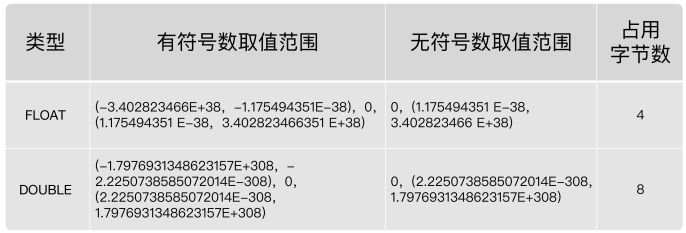

- REAL默认就是 DOUBLE。如果你把 SQL 模式设定为启用“`REAL_AS_FLOAT`”，那么，MySQL 就认为REAL是 FLOAT。如果要启用“REAL_AS_FLOAT”，可以通过以下 SQL 语句实现：
  
  ```mysql
  SET sql_mode = “REAL_AS_FLOAT”;
  ```

**问题1**：FLOAT 和 DOUBLE 这两种数据类型的区别是啥呢？

- FLOAT 占用字节数少，取值范围小；
- DOUBLE 占用字节数多，取值范围也大。

**问题2**：为什么浮点数类型的无符号数取值范围，只相当于有符号数取值范围的一半，也就是只相当于有符号数取值范围大于等于零的部分呢？

MySQL 存储浮点数的格式为：`符号(S)、尾数(M)和阶码(E)`。因此，无论有没有符号，MySQL 的浮点数都会存储表示符号的部分。因此，所谓的无符号数取值范围，其实就是有符号数取值范围大于等于零的部分。

#### 3.2 数据精度说明

对于浮点类型，在MySQL中单精度值使用 4 个字节，双精度值使用 8 个字节。

- MySQL允许使用**非标准语法**（其他数据库未必支持，因此如果涉及到数据迁移，则最好不要这么用）：`FLOAT(M,D)` 或 `DOUBLE(M,D)`。这里，M称为**精度**，D称为**标度**。(M,D)中`M=整数位+小数位，D=小数位`。 `D<=M<=255，0<=D<=30`。

  例如，定义为FLOAT(5,2)的一个列可以显示为 -999.99-999.99。如果超过这个范围会报错。

- FLOAT 和 DOUBLE 类型在不指定(M,D)时，默认会按照实际的精度（由实际的硬件和操作系统决定）来显示。

- 说明：浮点类型，也可以加**UNSIGNED**，但是不会改变数据范围，例如：FLOAT(3,2) UNSIGNED仍然只能表示0-9.99的范围。

- 不管是否显式设置了精度(M,D)，这里MySQL的处理方案如下：

  1. 如果存储时，整数部分超出了范围，MySQL就会报错，不允许存这样的值
  2. 如果存储时，小数点部分若超出范围，就分以下情况：
     - 若四舍五入后，整数部分没有超出范围，则只警告，但能成功操作并四舍五入删除多余的小数位后保存。例如在FLOAT(5,2)列内插入999.009，近似结果是999.01。
     - 若四舍五入后，整数部分超出范围，则MySQL报错，并拒绝处理。如FLOAT(5,2)列内插入
       999.995和-999.995都会报错。

- **从MySQL 8.0.17开始，FLOAT(M,D) 和DOUBLE(M,D)用法在官方文档中已经明确不推荐使用**，将来可能被移除。另外，关于浮点型FLOAT和DOUBLE的UNSIGNED也不推荐使用了，将来也可能被移除。

- 举例

  ```mysql
  CREATE TABLE test_double1(
  	f1 FLOAT,
  	f2 FLOAT(5,2),
  	f3 DOUBLE,
  	f4 DOUBLE(5,2)
  );
  
  DESC test_double1;
  
  INSERT INTO test_double1
  VALUES(123.456, 123.456, 123.4567, 123.45);
  
  #Out of range value for column 'f2' at row 1
  INSERT INTO test_double1
  VALUES(123.456, 1234.456, 123.4567, 123.45);
  
  SELECT * FROM test_double1;
  ```

#### 3.3 精度误差说明

浮点数类型有个缺陷，就是不精准。下面我来重点解释一下为什么 MySQL 的浮点数不够精准。比如，我们设计一个表，有f1这个字段，插入值分别为0.47、0.44、0.19，我们期待的运行结果是：`0.47+0.44+0.19=1.1`。而使用sum之后查询：

```mysql
CREATE TABLE test_double2(
	f1 DOUBLE
);

INSERT INTO test_double2
VALUES(0.47), (0.44), (0.19);

mysql> SELECT SUM(f1) FROM test_double2;
+--------------------+
| SUM(f1)            |
+--------------------+
| 1.0999999999999999 |
+--------------------+
1 row in set (0.00 sec)

mysql> SELECT SUM(f1) = 1.1, 1.1 = 1.1 FROM test_double2;
+---------------+-----------+
| SUM(f1) = 1.1 | 1.1 = 1.1 |
+---------------+-----------+
| 0             | 1         |
+---------------+-----------+
1 row in set (0.00 sec)
```

查询结果是 1.0999999999999999。看到了吗？虽然误差很小，但确实有误差。 你也可以尝试把数据类型改成FLOAT，然后运行求和查询，得到的是， 1.0999999940395355。显然，误差更大了。

那么，为什么会存在这样的误差呢？问题还是出在 MySQL 对浮点类型数据的存储方式上。

MySQL 用 4 个字节存储 FLOAT 类型数据，用 8 个字节来存储 DOUBLE 类型数据。无论哪个，都是采用二进制的方式来进行存储的。比如 9.625，用二进制来表达，就是 1001.101，或者表达成 1.001101×2^3。如果尾数不是 0 或 5（比如 9.624），你就无法用一个二进制数来精确表达。进而，就只好在取值允许的范围内进行四舍五入。

在编程中，如果用到浮点数，要特别注意误差问题，**因为浮点数是不准确的，所以我们要避免使用“=”来判断两个数是否相等**。同时，在一些对精确度要求较高的项目中，千万不要使用浮点数，不然会导致结果错误，甚至是造成不可挽回的损失。那么，MySQL 有没有精准的数据类型呢？当然有，这就是定点数类型： `DECIMAL`。

### 4 定点数类型

#### 4.1 类型介绍

- MySQL中的定点数类型只有 DECIMAL 一种类型。

  | 数据类型                   | 字节数  | 含义               |
  | -------------------------- | ------- | ------------------ |
  | DECIMAL(M,D)、DEC、NUMERIC | M+2字节 | 有效范围由M和D决定 |

  使用 DECIMAL(M,D) 的方式表示高精度小数。其中，M被称为精度，D被称为标度。0<=M<=65，0<=D<=30，D<M。例如，定义DECIMAL(5,2) 的类型，表示该列取值范围是 -999.99 ~ 999.99。
  
- **DECIMAL(M,D) 的最大取值范围与DOUBLE类型一样**，但是有效的数据范围是由M和D决定的。DECIMAL 的存储空间并不是固定的，由精度值M决定，总共占用的存储空间为M+2个字节。也就是说，在一些对精度要求不高的场景下，比起占用同样字节长度的定点数，浮点数表达的数值范围可以更大一些。
  
- 定点数在MySQL内部是以`字符串`的形式进行存储，这就决定了它一定是精准的。

- 当DECIMAL类型不指定精度和标度时，其默认为DECIMAL(10,0)。当数据的精度超出了定点数类型的精度范围时，则MySQL同样会进行四舍五入处理。

- **浮点数 vs 定点数**

  1. 浮点数相对于定点数的优点是在长度一定的情况下，浮点类型取值范围大，但是不精准，适用于需要取值范围大，又可以容忍微小误差的科学计算场景（比如计算化学、分子建模、流体动力学等）
  2. 定点数类型取值范围相对小，但是精准，没有误差，适合于对精度要求极高的场景 （比如涉及金额计算的场景）

- 举例

  ```mysql
  CREATE TABLE test_decimal1(
  	f1 DECIMAL,
  	f2 DECIMAL(5,2)
  );
  
  DESC test_decimal1;
  
  INSERT INTO test_decimal1(f1,f2)
  VALUES(123, 123.456);
  
  #Out of range value for column 'f2' at row 1
  INSERT INTO test_decimal1(f2)
  VALUES(1234.34);
  
  mysql> SELECT * FROM test_decimal1;
  +------+--------+
  | f1   | f2     |
  +------+--------+
  | 123  | 123.46 |
  +------+--------+
  1 row in set (0.00 sec)
  ```

- 举例

  我们运行下面的语句，把test_double2表中字段“f1”的数据类型修改为 DECIMAL(5,2)：

  ```mysql
  ALTER TABLE test_double2 MODIFY f1 DECIMAL(5,2);
  ```

  然后，我们再一次运行求和语句：

  ```mysql
  mysql> SELECT SUM(f1) FROM test_double2;
  +---------+
  | SUM(f1) |
  +---------+
  | 1.10    |
  +---------+
  1 row in set (0.00 sec)
  
  mysql> SELECT SUM(f1) = 1.1 FROM test_double2;
  +---------------+
  | SUM(f1) = 1.1 |
  +---------------+
  | 1             |
  +---------------+
  1 row in set (0.00 sec)
  ```

#### 4.2 开发中经验

> “由于 DECIMAL 数据类型的精准性，在我们的项目中，除了极少数（比如商品编号）用到整数类型外，其他的数值都用的是 DECIMAL，原因就是这个项目所处的零售行业，要求精准，一分钱也不能差。”  ——来自某项目经理

### 5 位类型：BIT

BIT类型中存储的是二进制值，类似`010110`

| 二进制字符串类型 | 长度 | 长度范围     | 占用空间            |
| ---------------- | ---- | ------------ | ------------------- |
| BIT(M)           | M    | 1 <= M <= 64 | 约为(M + 7)/8个字节 |

BIT类型，如果没有指定(M)，默认是1位。这个1位，表示只能存1位的二进制值。这里(M)是表示二进制的位数，位数最小值为1，最大值为64。

```mysql
CREATE TABLE test_bit1(
	f1 BIT,
	f2 BIT(5),
	f3 BIT(64)
);

INSERT INTO test_bit1(f1) VALUES(1);

#Data too long for column 'f1' at row 1
INSERT INTO test_bit1(f1) VALUES(2);

INSERT INTO test_bit1(f2) VALUES(23);
```

注意：在向BIT类型的字段中插入数据时，一定要确保插入的数据在BIT类型支持的范围内。

使用SELECT命令查询位字段时，可以用 BIN() 或 HEX() 函数进行读取

```mysql
mysql> SELECT * FROM test_bit1;
+------------+------------+------------+
| f1         | f2         | f3         |
+------------+------------+------------+
| 0x01       | NULL       | NULL       |
| NULL       | 0x17       | NULL       |
+------------+------------+------------+
2 rows in set (0.00 sec)

mysql> SELECT BIN(f2), HEX(f2) FROM test_bit1;
+---------+---------+
| BIN(f2) | HEX(f2) |
+---------+---------+
| NULL    | NULL    |
| 10111   | 17      |
+---------+---------+
2 rows in set (0.00 sec)

mysql> SELECT f2 + 0 FROM test_bit1;
+--------+
| f2 + 0 |
+--------+
| NULL   |
| 23     |
+--------+
2 rows in set (0.00 sec)
```

可以看到，使用b+0查询数据时，可以直接查询出存储的十进制数据的值。

### 6 日期与时间类型

日期与时间是重要的信息，在我们的系统中，几乎所有的数据表都用得到。原因是客户需要知道数据的时间标签，从而进行数据查询、统计和处理。

MySQL有多种表示日期和时间的数据类型，不同的版本可能有所差异，MySQL8.0版本支持的日期和时间类型主要有：YEAR类型、TIME类型、DATE类型、DATETIME类型 和 TIMESTAMP类型。

- `YEAR` 类型通常用来表示年
- `DATE` 类型通常用来表示年、月、日
- `TIME` 类型通常用来表示时、分、秒
- `DATETIME` 类型通常用来表示年、月、日、时、分、秒
- `TIMESTAMP` 类型通常用来表示带时区的年、月、日、时、分、秒

| 类型      | 名称     | 字节 | 日期格式                | 最小值                      | 最大值                     |
| --------- | -------- | ---- | ----------------------- | --------------------------- | -------------------------- |
| YEAR      | 年       | 1    | YYYY或YY                | 1901                        | 2155                       |
| TIME      | 时间     | 3    | HH:MM:SS                | -838:59:59                  | 838:59:59                  |
| DATE      | 日期     | 3    | YYYY-MM-DD              | 1000-01-01                  | 9999-12-03                 |
| DATETIME  | 日期时间 | 8    | YYYY-MM-DD<br/>HH:MM:SS | 1000-01-01<br/>00:00:00     | 9999-12-31<br/>23:59:59    |
| TIMESTAMP | 日期时间 | 4    | YYYY-MM-DD<br/>HH:MM:SS | 1970-01-01<br/>00:00:00 UTC | 2038-01-19<br/>03:14:07UTC |

可以看到，不同数据类型表示的时间内容不同、取值范围不同，而且占用的字节数也不一样，你要根据实际需要灵活选取。

为什么时间类型 TIME 的取值范围不是 -23:59:59～23:59:59 呢？原因是 MySQL 设计的 TIME 类型，不光表示一天之内的时间，而且可以用来表示一个时间间隔，这个时间间隔可以超过 24 小时。

#### 6.1 YEAR类型

YEAR类型用来表示年份，在所有的日期时间类型中所占用的存储空间最小，只需要`1个字节`的存储空间。

在MySQL中，YEAR有以下几种存储格式：

- 以4位字符串或数字格式表示YEAR类型，其格式为YYYY，最小值为1901，最大值为2155。
- 以2位字符串格式表示YEAR类型，最小值为00，最大值为99。
  - 当取值为01到69时，表示2001到2069；
  - 当取值为70到99时，表示1970到1999；
  - 当取值整数的0或00添加的话，那么是0000年；
  - 当取值是日期/字符串的'0'添加的话，是2000年。

**从MySQL5.5.27开始，2位格式的YEAR已经不推荐使用**。YEAR默认格式就是“YYYY”，没必要写成YEAR(4)，从MySQL 8.0.19开始，不推荐使用指定显示宽度的YEAR(4)数据类型。

```mysql
CREATE TABLE test_year(
	f1 YEAR,
	f2 YEAR(4)
);

mysql> DESC test_year;
+-------+---------+------+-----+---------+-------+
| Field | Type    | Null | Key | Default | Extra |
+-------+---------+------+-----+---------+-------+
| f1    | year(4) | YES  |     | NULL    |       |
| f2    | year(4) | YES  |     | NULL    |       |
+-------+---------+------+-----+---------+-------+
2 rows in set (0.00 sec)

INSERT INTO test_year VALUES('2020','2021');
mysql> SELECT * FROM test_year;
+------+------+
| f1   | f2   |
+------+------+
| 2020 | 2021 |
+------+------+
1 rows in set (0.00 sec)

INSERT INTO test_year VALUES('45','71');
INSERT INTO test_year VALUES(0,'0');
mysql> SELECT * FROM test_year;
+------+------+
| f1   | f2   |
+------+------+
| 2020 | 2021 |
| 2045 | 1971 |
| 0000 | 2000 |
+------+------+
3 rows in set (0.00 sec)
```

#### 6.2 DATE类型

DATE类型表示日期，没有时间部分，格式为`YYYY-MM-DD`，其中，YYYY表示年份，MM表示月份，DD表示日期。需要`3个字节`的存储空间。在向DATE类型的字段插入数据时，同样需要满足一定的格式条件。

- 以 `YYYY-MM-DD` 格式或者 `YYYYMMDD` 格式表示的字符串日期，其最小取值为1000-01-01，最大取值为9999-12-03。YYYYMMDD格式会被转化为YYYY-MM-DD格式。
- 以 `YY-MM-DD` 格式或者 `YYMMDD` 格式表示的字符串日期，此格式中，年份为两位数值或字符串满足YEAR类型的格式条件为：当年份取值为00到69时，会被转化为2000到2069；当年份取值为70到99时，会被转化为1970到1999。
- 使用 CURRENT_DATE() 或者 NOW() 函数，会插入当前系统的日期。

举例：

创建数据表，表中只包含一个DATE类型的字段f1。

```mysql
CREATE TABLE test_date1(
	f1 DATE
);
Query OK, 0 rows affected (0.13 sec)

```

插入数据：

```mysql
INSERT INTO test_date1
VALUES ('2020-10-01'), ('20201001'), (20201001);

INSERT INTO test_date1
VALUES ('00-01-01'), ('000101'), ('69-10-01'), ('691001'), ('70-01-01'), ('700101'),
       ('99-01-01'), ('990101');
       
INSERT INTO test_date1
VALUES (000301), (690301), (700301), (990301);

INSERT INTO test_date1
VALUES (CURRENT_DATE()), (NOW());

SELECT * FROM test_date1;
```

#### 6.3 TIME类型

TIME类型用来表示时间，不包含日期部分。在MySQL中，需要 `3个字节` 的存储空间来存储TIME类型的数据，可以使用“`HH:MM:SS`”格式来表示TIME类型，其中，HH表示小时，MM表示分钟，SS表示秒。

在MySQL中，向TIME类型的字段插入数据时，也可以使用几种不同的格式。 

1. 可以使用带有冒号的字符串，比如'`D HH:MM:SS`'、'`HH:MM:SS`'、'`HH:MM`'、'`D HH:MM`'、'`D HH`'或'`SS`'格式，都能被正确地插入TIME类型的字段中。其中D表示天，其最小值为0，最大值为34。如果使用带有D格式的字符串插入TIME类型的字段时，D会被转化为小时，计算格式为D*24+HH。当使用带有冒号并且不带D的字符串表示时间时，表示当天的时间，比如12:10表示12:10:00，而不是00:12:10。 
2. 可以使用不带有冒号的字符串或者数字，格式为`HHMMSS`或者 `HHMMSS`。如果插入一个不合法的字符串或者数字，MySQL在存储数据时，会将其自动转化为00:00:00进行存储。比如1210，MySQL会将最右边的两位解析成秒，表示00:12:10，而不是12:10:00。 
3. 使用 CURRENT_TIME() 或者 NOW() ，会插入当前系统的时间。

举例：

创建数据表，表中包含一个TIME类型的字段f1。

```mysql
CREATE TABLE test_time1(
	f1 TIME
);
Query OK, 0 rows affected (0.02 sec)

INSERT INTO test_time1
VALUES('2 12:30:29'), ('12:35:29'), ('12:40'), ('2 12:40'),('1 05'), ('45');

INSERT INTO test_time1
VALUES ('123520'), (124011), (1210);

INSERT INTO test_time1
VALUES (NOW()), (CURRENT_TIME());

SELECT * FROM test_time1;
```

#### 6.4 DATETIME类型

DATETIME类型在所有的日期时间类型中占用的存储空间最大，总共需要 `8` 个字节的存储空间。在格式上为DATE类型和TIME类型的组合，可以表示为 `YYYY-MM-DD HH:MM:SS`，其中YYYY表示年份，MM表示月份，DD表示日期，HH表示小时，MM表示分钟，SS表示秒。

在向DATETIME类型的字段插入数据时，同样需要满足一定的格式条件。

- 以 `YYYY-MM-DD HH:MM:SS` 格式或者 `YYYYMMDDHHMMSS` 格式的字符串插入DATETIME类型的字段时，最小值为`1000-01-01 00:00:00`，最大值为`9999-12-03 23:59:59`。
  - 以`YYYYMMDDHHMMSS`格式的数字插入DATETIME类型的字段时，会被转化为`YYYY-MM-DD HH:MM:SS`格式。
- 以 `YY-MM-DD HH:MM:SS` 格式或者 `YYMMDDHHMMSS` 格式的字符串插入DATETIME类型的字段时，两位数的年份规则符合YEAR类型的规则，00到69表示2000到2069；70到99表示1970到1999。
- 使用函数`CURRENT_TIMESTAMP()`和`NOW()`，可以向DATETIME类型的字段插入系统的当前日期和时间。

举例：

创建数据表，表中包含一个DATETIME类型的字段dt。

```mysql
CREATE TABLE test_datetime1(
	dt DATETIME
);
Query OK, 0 rows affected (0.02 sec)

#插入数据：
INSERT INTO test_datetime1
VALUES ('2021-01-01 06:50:30'), ('20210101065030');

INSERT INTO test_datetime1
VALUES ('99-01-01 00:00:00'), ('990101000000'), ('20-01-01 00:00:00'), ('200101000000');

INSERT INTO test_datetime1
VALUES (20200101000000), (200101000000), (19990101000000), (990101000000);

INSERT INTO test_datetime1
VALUES (CURRENT_TIMESTAMP()), (NOW());
```

#### 6.5 TIMESTAMP 类型

TIMESTAMP类型也可以表示日期时间，其显示格式与DATETIME类型相同，都是 `YYYY-MM-DD
HH:MM:SS`，需要4个字节的存储空间。但是TIMESTAMP存储的时间范围比DATETIME要小很多，只能存储“1970-01-01 00:00:01 UTC”到“2038-01-19 03:14:07 UTC”之间的时间。其中，UTC表示世界统一时间，也叫作世界标准时间。

- **存储数据的时候需要对当前时间所在的时区进行转换，查询数据的时候再将时间转换回当前的时区。因此，使用TIMESTAMP存储的同一个时间值，在不同的时区查询时会显示不同的时间。**

向TIMESTAMP类型的字段插入数据时，当插入的数据格式满足YY-MM-DD HH:MM:SS和YYMMDDHHMMSS时，两位数值的年份同样符合YEAR类型的规则条件，只不过表示的时间范围要小很多。

如果向TIMESTAMP类型的字段插入的时间超出了TIMESTAMP类型的范围，则MySQL会抛出错误信息。

举例：

创建数据表，表中包含一个TIMESTAMP类型的字段ts

```mysql
CREATE TABLE test_timestamp1(
	ts TIMESTAMP
);

# 插入数据：
INSERT INTO test_timestamp1
VALUES ('1999-01-01 03:04:50'), ('19990101030405'), ('99-01-01 03:04:05'), ('990101030405');

INSERT INTO test_timestamp1
VALUES ('2020@01@01@00@00@00'), ('20@01@01@00@00@00');

INSERT INTO test_timestamp1
VALUES (CURRENT_TIMESTAMP()), (NOW());

#Incorrect datetime value
INSERT INTO test_timestamp1
VALUES ('2038-01-20 03:14:07');
```

**TIMESTAMP和DATETIME的区别：**

- TIMESTAMP存储空间比较小，表示的日期时间范围也比较小

- 底层存储方式不同，TIMESTAMP底层存储的是毫秒值，距离1970-1-1 0:0:0 0毫秒的毫秒值。

- 两个日期比较大小或日期计算时，TIMESTAMP更方便、更快。

- TIMESTAMP和时区有关。TIMESTAMP会根据用户的时区不同，显示不同的结果。而DATETIME则只能反映出插入时当地的时区，其他时区的人查看数据必然会有误差的。

  ```mysql
  CREATE TABLE temp_time(
  	d1 DATETIME,
  	d2 TIMESTAMP
  );
  
  INSERT INTO temp_time VALUES('2021-9-2 14:45:52', '2021-9-2 14:45:52');
  INSERT INTO temp_time VALUES(NOW(),NOW());
  
  mysql> SELECT * FROM temp_time;
  +---------------------+---------------------+
  | d1                  | d2                  |
  +---------------------+---------------------+
  | 2021-09-02 14:45:52 | 2021-09-02 14:45:52 |
  | 2021-11-03 17:38:17 | 2021-11-03 17:38:17 |
  +---------------------+---------------------+
  2 rows in set (0.00 sec)
  
  #修改当前的时区
  SET time_zone = '+9:00';
  
  mysql> SELECT * FROM temp_time;
  +---------------------+---------------------+
  | d1                  | d2                  |
  +---------------------+---------------------+
  | 2021-09-02 14:45:52 | 2021-09-02 15:45:52 |
  | 2021-11-03 17:38:17 | 2021-11-03 18:38:17 |
  +---------------------+---------------------+
  2 rows in set (0.00 sec)
  ```

#### 6.6 开发中经验

用得最多的日期时间类型，就是 `DATETIME` 。虽然 MySQL 也支持YEAR（年）、TIME（时间）、DATE（日期），以及 TIMESTAMP 类型，但是在实际项目中，尽量用 DATETIME 类型。因为这个数据类型包括了完整的日期和时间信息，取值范围也最大，使用起来比较方便。毕竟，如果日期时间信息分散在好几个字段，很不容易记，而且查询的时候，SQL 语句也会更加复杂。

此外，一般存注册时间、商品发布时间等，不建议使用DATETIME存储，而是使用`时间戳`，因为
DATETIME虽然直观，但不便于计算。

```mysql
mysql> SELECT UNIX_TIMESTAMP();
+------------------+
| UNIX_TIMESTAMP() |
+------------------+
| 1635932762       |
+------------------+
1 row in set (0.00 sec)
```


### 7 文本字符串类型

在实际的项目中，我们还经常遇到一种数据，就是字符串数据。

MySQL中，文本字符串总体上分为`CHAR、VARCHAR、TINYTEXT、TEXT、MEDIUMTEXT、LONGTEXT、ENUM、SET`等类型。


#### 7.1 CHAR 与 VARCHAR 类型

CHAR 和 VARCHAR 类型都可以存储比较短的字符串。

| 字符串(文本)类型 | 特点     | 长度 | 长度范围        | 占用的存储空间        |
| ---------------- | -------- | ---- | --------------- | --------------------- |
| CHAR(M)          | 固定长度 | M    | 0 <= M <= 255   | M个字节               |
| VARCHAR(M)       | 可变长度 | M    | 0 <= M <= 65535 | (实际长度 + 1) 个字节 |

**CHAR类型**：

- CHAR(M) 类型一般需要预先定义字符串长度。如果不指定(M)，则表示长度默认是1个字符。
- 如果保存时，数据的实际长度比CHAR类型声明的长度小，则会在 `右侧填充` 空格以达到指定的长度。当MySQL检索CHAR类型的数据时，CHAR类型的字段会去除尾部的空格。
- 定义CHAR类型字段时，声明的字段长度即为CHAR类型字段所占的存储空间的字节数。

```mysql
CREATE TABLE test_char1(
	c1 CHAR,
	c2 CHAR(5)
);

DESC test_char1;

INSERT INTO test_char1 VALUES('a','Tom');

SELECT c1, CONCAT(c2,'***') FROM test_char1;

INSERT INTO test_char1(c2) VALUES('a ');

SELECT CHAR_LENGTH(c2) FROM test_char1;
```

**VARCHAR类型**：

- VARCHAR(M) 定义时， **必须指定**长度M，否则报错。

- MySQL4.0版本以下，varchar(20)：指的是20字节，如果存放UTF8汉字时，只能存6个（每个汉字3字节）；

  MySQL5.0版本以上，varchar(20)：指的是20字符。

- 检索VARCHAR类型的字段数据时，会保留数据尾部的空格。VARCHAR类型的字段所占用的存储空间为字符串实际长度加1个字节。

```mysql
CREATE TABLE test_varchar1(
	NAME VARCHAR #错误
);

#Column length too big for column 'NAME' (max = 21845);
CREATE TABLE test_varchar2(
NAME VARCHAR(65535) #错误
);

CREATE TABLE test_varchar3(
	NAME VARCHAR(5)
);

INSERT INTO test_varchar3 VALUES('尚硅谷'),('尚硅谷教育');

#Data too long for column 'NAME' at row 1
INSERT INTO test_varchar3 VALUES('尚硅谷IT教育');
```

**哪些情况使用 CHAR 或 VARCHAR 更好**

| 类型       | 特点     | 空间上       | 时间上 | 适用场景             |
| ---------- | -------- | ------------ | ------ | -------------------- |
| CHAR(M)    | 固定长度 | 浪费存储空间 | 效率高 | 存储不大，速度要求高 |
| VARCHAR(M) | 可变长度 | 节省存储空间 | 效率低 | 非CHAR的情况         |

情况1：存储很短的信息。比如门牌号码101，201……这样很短的信息应该用char，因为varchar还要占个byte用于存储信息长度，本来打算节约存储的，结果得不偿失。

情况2：固定长度的。比如使用uuid作为主键，那用char应该更合适。因为他固定长度，varchar动态根据长度的特性就消失了，而且还要占个长度信息。

情况3：十分频繁改变的column。因为varchar每次存储都要有额外的计算，得到长度等工作，如果一个非常频繁改变的，那就要有很多的精力用于计算，而这些对于char来说是不需要的。

情况4：具体存储引擎中的情况：

- **MyISAM** 数据存储引擎和数据列：MyISAM数据表，最好使用固定长度(CHAR)的数据列代替可变长度(VARCHAR)的数据列。这样使得整个表静态化，从而使 **数据检索更快** ，用空间换时间。
- **MEMORY** 存储引擎和数据列：MEMORY数据表目前都使用固定长度的数据行存储，因此无论使用CHAR或VARCHAR列都没有关系，两者都是作为CHAR类型处理的。
- **InnoDB** 存储引擎，建议使用VARCHAR类型。因为对于InnoDB数据表，内部的行存储格式并没有区分固定长度和可变长度列（所有数据行都使用指向数据列值的头指针），而且**主要影响性能的因素是数据行使用的存储总量**，由于char平均占用的空间多于varchar，所以除了简短并且固定长度的，其他考虑varchar。这样节省空间，对磁盘I/O和数据存储总量比较好。

#### 7.2 TEXT类型

在MySQL中，TEXT用来保存文本类型的字符串，总共包含4种类型，分别为TINYTEXT、TEXT、MEDIUMTEXT 和 LONGTEXT 类型。

在向TEXT类型的字段保存和查询数据时，系统自动按照实际长度存储，不需要预先定义长度。这一点和VARCHAR类型相同。

每种TEXT类型保存的数据长度和所占用的存储空间不同，如下：

| 文本字符串类型 | 特点               | 长度 | 长度范围                               | 占用的存储空间 |
| -------------- | ------------------ | ---- | -------------------------------------- | -------------- |
| TINYTEXT       | 小文本、可变长度   | L    | 0 <= L <= 255                          | L + 2 个字节   |
| TEXT           | 文本、可变长度     | L    | 0 <= L <= 65535                        | L + 2 个字节   |
| MEDIUMTEXT     | 中等文本、可变长度 | L    | 0 <= L <= 16777215                     | L + 3 个字节   |
| LONGTEXT       | 大文本、可变长度   | L    | 0 <= L<= 4294967295<br />（相当于4GB） | L + 4 个字节   |

**由于实际存储的长度不确定，MySQL 不允许 TEXT 类型的字段做主键**。遇到这种情况，你只能采用CHAR(M)，或者 VARCHAR(M)。

**举例**：

创建数据表：

```mysql
CREATE TABLE test_text(
	tx TEXT
);

INSERT INTO test_text VALUES('atguigu ');
SELECT CHAR_LENGTH(tx) FROM test_text; #10
```

说明在保存和查询数据时，并没有删除TEXT类型的数据尾部的空格。

**开发中经验**：TEXT文本类型，可以存比较大的文本段，搜索速度稍慢，因此如果不是特别大的内容，建议使用CHAR，VARCHAR来代替。还有TEXT类型不用加默认值，加了也没用。而且text和blob类型的数据删除后容易导致“空洞”，使得文件碎片比较多，所以频繁使用的表不建议包含TEXT类型字段，建议单独分出去，单独用一个表。

### 8 ENUM类型

ENUM类型也叫作枚举类型，ENUM类型的取值范围需要在定义字段时进行指定。设置字段值时，ENUM类型只允许从成员中选取单个值，不能一次选取多个值。

其所需要的存储空间由定义ENUM类型时指定的成员个数决定。

| 文本字符串类型 | 长度 | 长度范围        | 占用的存储空间 |
| -------------- | ---- | --------------- | -------------- |
| ENUM           | L    | 1 <= L <= 65535 | 1或2个字节     |

- 当ENUM类型包含1～255个成员时，需要1个字节的存储空间；
- 当ENUM类型包含256～65535个成员时，需要2个字节的存储空间。
- ENUM类型的成员个数的上限为65535个。

举例：

创建表如下：

```mysql
CREATE TABLE test_enum(
	season ENUM('春','夏','秋','冬','unknow')
);

#添加数据
INSERT INTO test_enum VALUES('春'),('秋');

# 忽略大小写
INSERT INTO test_enum VALUES('UNKNOW');

# 允许按照角标的方式获取指定索引位置的枚举值
INSERT INTO test_enum VALUES('1'), (3);

# Data truncated for column 'season' at row 1
INSERT INTO test_enum VALUES('ab');

# 当ENUM类型的字段没有声明为NOT NULL时，插入NULL也是有效的
INSERT INTO test_enum VALUES(NULL);
```

### 9 SET类型

SET表示一个字符串对象，可以包含0个或多个成员，但成员个数的上限为 `64` 。设置字段值时，可以取取值范围内的 0 个或多个值。

当SET类型包含的成员个数不同时，其所占用的存储空间也是不同的，具体如下：

| 成员个数范围（L表示实际成员个数） | 占用的存储空间 |
| --------------------------------- | -------------- |
| 1 <= L <= 8                       | 1个字节        |
| 9 <= L <= 16                      | 2个字节        |
| 17 <= L <= 24                     | 3个字节        |
| 25 <= L <= 32                     | 4个字节        |
| 33 <= L <= 64                     | 5个字节        |

SET类型在存储数据时成员个数越多，其占用的存储空间越大。注意：SET类型在选取成员时，可以一次选择多个成员，这一点与ENUM类型不同。

举例：

```mysql
# 创建表：
CREATE TABLE test_set(
	s SET ('A', 'B', 'C')
);

# 向表中插入数据：
INSERT INTO test_set (s) VALUES ('A'), ('A,B');

#插入重复的SET类型成员时，MySQL会自动删除重复的成员
INSERT INTO test_set (s) VALUES ('A,B,C,A');

#向SET类型的字段插入SET成员中不存在的值时，MySQL会抛出错误。
INSERT INTO test_set (s) VALUES ('A,B,C,D');

SELECT * FROM test_set;
```

举例：

```mysql
CREATE TABLE temp_mul(
	gender ENUM('男','女'),
	hobby SET('吃饭','睡觉','打豆豆','写代码')
);

INSERT INTO temp_mul VALUES('男','睡觉,打豆豆'); #成功

# Data truncated for column 'gender' at row 1
INSERT INTO temp_mul VALUES('男,女','睡觉,写代码'); #失败

# Data truncated for column 'gender' at row 1
INSERT INTO temp_mul VALUES('妖','睡觉,写代码');#失败

INSERT INTO temp_mul VALUES('男','睡觉,写代码,吃饭'); #成功
```

### 10 二进制字符串类型

MySQL中的二进制字符串类型主要存储一些二进制数据，比如可以存储图片、音频和视频等二进制数据。

MySQL中支持的二进制字符串类型主要包括`BINARY、VARBINARY、TINYBLOB、BLOB、MEDIUMBLOB和LONGBLOB类型`。

#### 10.1 BINARY与VARBINARY类型

- BINARY和VARBINARY类似于CHAR和VARCHAR，只是它们存储的是二进制字符串。
- BINARY(M)为固定长度的二进制字符串，M表示最多能存储的字节数，取值范围是0~255个字符。如果未指定(M)，表示只能存储 `1个字节`。例如BINARY (8)，表示最多能存储8个字节，如果字段值不足(M)个字节，将在右边填充'\0'以补齐指定长度。
- VARBINARY (M)为可变长度的二进制字符串，M表示最多能存储的字节数，总字节数不能超过行的字节长度限制65535，另外还要考虑额外字节开销，VARBINARY类型的数据除了存储数据本身外，还需要1或2个字节来存储数据的字节数。VARBINARY类型必须指定(M) ，否则报错。

| 二进制字符串类型 | 特点     | 值的长度             | 占用空间  |
| ---------------- | -------- | -------------------- | --------- |
| BINARY(M)        | 固定长度 | M （0 <= M <= 255）  | M个字节   |
| VARBINARY(M)     | 可变长度 | M（0 <= M <= 65535） | M+1个字节 |

举例：

```mysql
CREATE TABLE test_binary1(
	f1 BINARY,
	f2 BINARY(3),
	# f3 VARBINARY,
	f4 VARBINARY(10)
);

INSERT INTO test_binary1(f1,f2) VALUES('a','a');
INSERT INTO test_binary1(f1,f2) VALUES('尚','尚');#失败

INSERT INTO test_binary1(f2,f4) VALUES('ab','ab');

mysql> SELECT LENGTH(f2),LENGTH(f4)
-> FROM test_binary1;
+------------+------------+
| LENGTH(f2) | LENGTH(f4) |
+------------+------------+
| 3          | NULL       |
| 3          | 2          |
+------------+------------+
2 rows in set (0.00 sec)
```

#### 10.2 BLOB类型

BLOB是一个`二进制大对象`，可以容纳可变数量的数据。

MySQL中的BLOB类型包括TINYBLOB、BLOB、MEDIUMBLOB和LONGBLOB 4种类型，它们可容纳值的最大长度不同。可以存储一个二进制的大对象，比如 `图片、音频和视频` 等。

需要注意的是，在实际工作中，往往不会在MySQL数据库中使用BLOB类型存储大对象数据，通常会将图片、音频和视频文件存储到`服务器的磁盘上`，并将图片、音频和视频的访问路径存储到MySQL中。

| 二进制字符串类型 | 值的长度 | 长度范围                                | 占用空间     |
| ---------------- | -------- | --------------------------------------- | ------------ |
| TINYBLOB         | L        | 0 <= L <= 255                           | L + 1 个字节 |
| BLOB             | L        | 0 <= L <= 65535<br />（相当于64KB）     | L + 2 个字节 |
| MEDIUMBLOB       | L        | 0 <= L <= 16777215 <br />（相当于16MB） | L + 3 个字节 |
| LONGBLOB         | L        | 0 <= L <= 4294967295<br />（相当于4GB） | L + 4 个字节 |

举例：

```mysql
CREATE TABLE test_blob1(
	id INT,
	img MEDIUMBLOB
);

INSERT INTO test_blob1(id) VALUES (1001);

SELECT * FROM test_blob1;
```

**TEXT和BLOB的使用注意事项**：

在使用text和blob字段类型时要注意以下几点，以便更好的发挥数据库的性能。

1. BLOB和TEXT值也会引起自己的一些问题，特别是执行了大量的删除或更新操作的时候。删除这种值会在数据表中留下很大的"`空洞`"，以后填入这些"空洞"的记录可能长度不同。为了提高性能，建议定期使用 OPTIMIZE TABLE 功能对这类表进行`碎片整理`。
2. 如果需要对大文本字段进行模糊查询，MySQL 提供了`前缀索引`。但是仍然要在不必要的时候避免检索大型的BLOB或TEXT值。例如，SELECT * 查询就不是很好的想法，除非你能够确定作为约束条件的WHERE子句只会找到所需要的数据行。否则，你可能毫无目的地在网络上传输大量的值。
3. 把BLOB或TEXT列`分离到单独的表`中。在某些环境中，如果把这些数据列移动到第二张数据表中，可以让你把原数据表中的数据列转换为固定长度的数据行格式，那么它就是有意义的。这会`减少主表中的碎片`，使你得到固定长度数据行的性能优势。它还使你在主数据表上运行 SELECT * 查询的时候不会通过网络传输大量的BLOB或TEXT值。


### 11 JSON 类型

JSON（JavaScript Object Notation）是一种轻量级的`数据交换格式`。简洁和清晰的层次结构使得 JSON 成为理想的数据交换语言。它易于人阅读和编写，同时也易于机器解析和生成，并有效地提升网络传输效率。**JSON 可以将JavaScript 对象中表示的一组数据转换为字符串，然后就可以在网络或者程序之间轻松地传递这个字符串，并在需要的时候将它还原为各编程语言所支持的数据格式。**

在MySQL 5.7中，就已经支持JSON数据类型。在MySQL 8.x版本中，JSON类型提供了可以进行自动验证的JSON文档和优化的存储结构，使得在MySQL中存储和读取JSON类型的数据更加方便和高效。 

创建数据表，表中包含一个JSON类型的字段 js 。

```mysql
CREATE TABLE test_json(
	js json
);

INSERT INTO test_json (js)
VALUES ('{"name":"songhk", "age":18, "address":{"province":"beijing","city":"beijing"}}');

SELECT * FROM test_json;
```


当需要检索JSON类型的字段中数据的某个具体值时，可以使用“->”和“->>”符号。

```mysql
SELECT 
	js -> '$.name' AS NAME,
	js -> '$.age' AS age,
	js -> '$.address.province' AS province,
	js -> '$.address.city' AS city
FROM 
	test_json;
	
+----------+------+-----------+-----------+
| NAME     | age  | province  | city      |
+----------+------+-----------+-----------+
| "songhk" | 18   | "beijing" | "beijing" |
+----------+------+-----------+-----------+
1 row in set (0.00 sec)
```

通过“->”和“->>”符号，从JSON字段中正确查询出了指定的JSON数据的值。


### 12 空间类型

MySQL 空间类型扩展支持地理特征的生成、存储和分析。这里的地理特征表示世界上具有位置的任何东西，可以是一个实体，例如一座山；可以是空间，例如一座办公楼；也可以是一个可定义的位置，例如一个十字路口等等。MySQL中使用`Geometry（几何）`来表示所有地理特征。Geometry指一个点或点的集合，代表世界上任何具有位置的事物。

MySQL的空间数据类型（Spatial Data Type）对应于OpenGIS类，包括单值类型：GEOMETRY、POINT、LINESTRING、POLYGON以及集合类型：MULTIPOINT、MULTILINESTRING、MULTIPOLYGON、GEOMETRYCOLLECTION 。

- Geometry是所有空间集合类型的基类，其他类型如POINT、LINESTRING、POLYGON都是Geometry的子类。
  - Point，顾名思义就是点，有一个坐标值。例如`POINT(121.213342 31.234532)`，`POINT(30 10)`，坐标值支持DECIMAL类型，经度（longitude）在前，维度（latitude）在后，用空格分隔。
  - LineString，线，由一系列点连接而成。如果线从头至尾没有交叉，那就是简单的（simple）；如果起点和终点重叠，那就是封闭的（closed）。例如`LINESTRING(30 10,10 30,40 40)`，点与点之间用逗号分隔，一个点中的经纬度用空格分隔，与POINT格式一致。
  - Polygon，多边形。可以是一个实心平面形，即没有内部边界，也可以有空洞，类似纽扣。最简单的就是只有一个外边界的情况，例如`POLYGON((0 0,10 0,10 10, 0 10))`。

下面展示几种常见的几何图形元素：


- MultiPoint、MultiLineString、MultiPolygon、GeometryCollection 这4种类型都是集合类，是多个Point、LineString或Polygon组合而成。

下面展示的是多个同类或异类几何图形元素的组合：


### 13 小结及选择建议

在定义数据类型时，如果确定是`整数`，就用`INT`；如果是`小数`，一定用定点数类型`DECIMAL(M,D)`；如果是日期与时间，就用`DATETIME`。

这样做的好处是，首先确保你的系统不会因为数据类型定义出错。不过，凡事都是有两面的，可靠性好，并不意味着高效。比如，TEXT 虽然使用方便，但是效率不如 CHAR(M) 和 VARCHAR(M)。

关于字符串的选择，建议参考如下阿里巴巴的《Java开发手册》规范：

**阿里巴巴《Java开发手册》之MySQL数据库**：

- 任何字段如果为非负数，必须是 UNSIGNED
- 【**强制**】小数类型为 DECIMAL，禁止使用 FLOAT 和 DOUBLE。
  - 说明：在存储的时候，FLOAT 和 DOUBLE 都存在精度损失的问题，很可能在比较值的时候，得到不正确的结果。如果存储的数据范围超过 DECIMAL 的范围，建议将数据拆成整数和小数并分开存储。
- 【**强制**】如果存储的字符串长度几乎相等，使用 CHAR 定长字符串类型。
- 【**强制**】VARCHAR 是可变长字符串，不预先分配存储空间，长度不要超过 5000。如果存储长度大于此值，定义字段类型为 TEXT，独立出来一张表，用主键来对应，避免影响其它字段索引效率。

------

## 十二、约束

### 1 约束(constraint)概述

#### 1.1 为什么需要约束

数据完整性（Data Integrity）是指数据的精确性（Accuracy）和可靠性（Reliability）。它是防止数据库中存在不符合语义规定的数据和防止因错误信息的输入输出造成无效操作或错误信息而提出的。

为了保证数据的完整性，SQL规范以约束的方式对**表数据进行额外的条件限制**。从以下四个方面考虑：

- `实体完整性（Entity Integrity）`：例如，同一个表中，不能存在两条完全相同无法区分的记录
- `域完整性（Domain Integrity）`：例如：年龄范围0-120，性别范围“男/女”
- `引用完整性（Referential Integrity）`：例如：员工所在部门，在部门表中要能找到这个部门
- `用户自定义完整性（User-defined Integrity）`：例如：用户名唯一、密码不能为空等，本部门经理的工资不得高于本部门职工的平均工资的5倍。

#### 1.2 什么是约束

约束是表级的强制规定。

可以在**创建表时规定约束（通过 CREATE TABLE 语句）**，或者在表**创建之后通过 ALTER TABLE 语句规定约束**。

#### 1.3 约束的分类

- **根据约束数据列的限制**，约束可分为：

  - **单列约束**：每个约束只约束一列
  - **多列约束**：每个约束可约束多列数据

- **根据约束的作用范围**，约束可分为：

  - **列级约束**：只能作用在一个列上，跟在列的定义后面
  - **表级约束**：可以作用在多个列上，不与列一起，而是单独定义

  |            | 声明位置     | 支持的约束类型             | 是否可以起约束名     |
  | ---------- | ------------ | -------------------------- | -------------------- |
  | 列级约束： | 列的后面     | 语法都支持，但外键没有效果 | 不可以               |
  | 表级约束： | 所有列的下面 | 默认和非空不支持，其他支持 | 可以（主键没有效果） |

- **根据约束起的作用**，约束可分为：

  - **NOT NULL 非空约束，规定某个字段不能为空**
  - **UNIQUE 唯一约束，规定某个字段在整个表中是唯一的**
  - **PRIMARY KEY 主键(非空且唯一)约束**
  - **FOREIGN KEY 外键约束**
  - **CHECK 检查约束**
  - **DEFAULT 默认值约束**

>注意： MySQL不支持check约束，但可以使用check约束，而没有任何效果

- 查看某个表已有的约束

```mysql
#information_schema数据库名（系统库）
#table_constraints表名称（专门存储各个表的约束）
SELECT * FROM information_schema.table_constraints
WHERE table_name = '表名称';
```

### 2 非空约束

#### 2.1 作用

限定某个字段/某列的值不允许为空

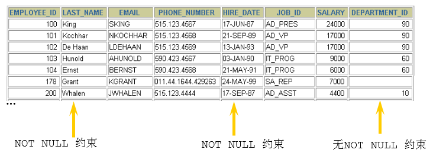

#### 2.2 关键字

**NOT NULL**

#### 2.3 特点

- 默认，所有的类型的值都可以是NULL，包括INT、FLOAT等数据类型
- 非空约束只能出现在表对象的列上，只能某个列单独限定非空，不能组合非空
- 一个表可以有很多列都分别限定了非空
- 空字符串''不等于NULL，0也不等于NULL

#### 2.4 添加非空约束

1. 建表时

   ```mysql
   CREATE TABLE 表名称(
   	字段名 数据类型,
   	字段名 数据类型 NOT NULL,
   	字段名 数据类型 NOT NULL
   );
   ```

   举例：

   ```mysql
   CREATE TABLE emp(
   	id INT(10) NOT NULL,
   	`name` VARCHAR(20) NOT NULL,
   	sex CHAR NULL
   );
   
   CREATE TABLE student(
   	sid int,
   	sname varchar(20) not null,
   	tel char(11) ,
   	cardid char(18) not null
   );
   
   insert into student values(1,'张三','13710011002','110222198912032545'); #成功
   
   # ERROR 1048 (23000): Column 'cardid' cannot be null
   insert into student values(2,'李四','13710011002',null);#身份证号为空
   
   insert into student values(2,'李四',null,'110222198912032546');#成功，tel允许为空
   
   # ERROR 1048 (23000): Column 'sname' cannot be null
   insert into student values(3,null,null,'110222198912032547');#失败
   ```

2. 建表后

   ```mysql
   alter table 表名称 modify column 字段名 数据类型 not null;
   ```

   举例：

   ```mysql
   ALTER TABLE emp MODIFY sex VARCHAR(30) NOT NULL;
   
   alter table student modify sid varchar(20) not null;
   ```

#### 2.5 删除非空约束

```mysql
# 去掉null，相当于修改某个非注解字段，该字段允许为空
alter table 表名称 modify 字段名 数据类型 NULL;
# 或
# 去掉not null，相当于修改某个非注解字段，该字段允许为空
alter table 表名称 modify 字段名 数据类型;
```

举例：

```mysql
ALTER TABLE emp MODIFY sex VARCHAR(30) NULL;

ALTER TABLE emp MODIFY NAME VARCHAR(15) DEFAULT 'abc' NULL;
```

### 3 唯一性约束

#### 3.1 作用

用来限制某个字段/某列的值不能重复。

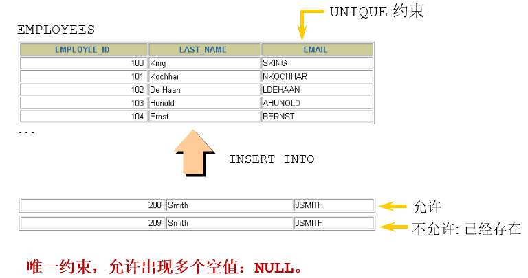

#### 3.2 关键字

**UNIQUE**

#### 3.3 特点

- 同一个表可以有多个唯一约束。
- 唯一约束可以是某一个列的值唯一，也可以多个列组合的值唯一。
- 唯一性约束允许列值为空。
- 在创建唯一约束的时候，如果不给唯一约束命名，就默认和列名相同。
- **MySQL会给唯一约束的列上默认创建一个唯一索引。**

#### 3.4 添加唯一约束

1. 建表时

   ```mysql
   create table 表名称(
   	字段名 数据类型,
   	字段名 数据类型 unique,
   	字段名 数据类型 unique key,
   	字段名 数据类型
   );
   
   create table 表名称(
   	字段名 数据类型,
   	字段名 数据类型,
   	字段名 数据类型,
   	[constraint 约束名] unique key(字段名)
   );
   ```

   举例：

   ```mysql
   create table student(
   	sid int,
   	sname varchar(20),
   	tel char(11) unique,
   	cardid char(18) unique key
   );
   
   CREATE TABLE t_course(
   	cid INT UNIQUE,
   	cname VARCHAR(100) UNIQUE,
   	description VARCHAR(200)
   );
   
   CREATE TABLE `user`(
   	id INT NOT NULL,
   	`name` VARCHAR(25),
   	`password` VARCHAR(16),
   	-- 使用表级约束语法
   	CONSTRAINT uk_name_pwd UNIQUE(`name`,`password`)
   );
   ```

   > 表示用户名和密码组合不能重复

   ```mysql
   insert into student values(1,'张三','13710011002','101223199012015623');
   insert into student values(2,'李四','13710011003','101223199012015624');
   
   mysql> select * from student;
   +-----+----------+-------------------+-------------------------------+
   | sid | sname    |     tel           | cardid                        |
   +-----+----------+-------------------+-------------------------------+
   | 1   | 张三      | 13710011002       | 101223199012015623            |
   | 2   | 李四      | 13710011003       | 101223199012015624            |
   +-----+----------+-------------------+-------------------------------+
   2 rows in set (0.00 sec)
   
   # ERROR 1062 (23000): Duplicate entry '101223199012015624' for key 'cardid'
   insert into student values(3,'王五','13710011004','101223199012015624'); #身份证号重复
   
   # ERROR 1062 (23000): Duplicate entry '13710011003' for key 'tel'
   insert into student values(3,'王五','13710011003','101223199012015625');
   ```

2. 建表后指定唯一键约束

   ```mysql
   #字段列表中如果是一个字段，表示该列的值唯一。如果是两个或更多个字段，那么复合唯一，即多个字段的组合是唯一的
   #方式1：
   alter table 表名称 add unique key(字段列表);
   
   #方式2：
   alter table 表名称 modify 字段名 字段类型 unique;
   ```

   举例：

   ```mysql
   ALTER TABLE `user` ADD UNIQUE(`name`,`password`);
   
   ALTER TABLE `user` ADD CONSTRAINT uk_name_pwd UNIQUE(`name`,`password`);
   
   ALTER TABLE `user` MODIFY `name` VARCHAR(20) UNIQUE;
   ```

   ```mysql
   create table student(
   	sid int primary key,
   	sname varchar(20),
   	tel char(11) ,
   	cardid char(18)
   );
   alter table student add unique key(tel);
   alter table student add unique key(cardid);
   ```

#### 3.5 关于复合唯一约束

```mysql
create table 表名称(
	字段名 数据类型,
	字段名 数据类型,
	字段名 数据类型,
	unique key(字段列表)
         # 字段列表中写的是多个字段名，多个字段名用逗号分隔，表示那么是复合唯一，即多个字段的组合是唯一的
);
```

举例：

```mysql
#学生表
create table student(
	sid int, #学号
	sname varchar(20), #姓名
	tel char(11) unique key, #电话
	cardid char(18) unique key #身份证号
);
#课程表
create table course(
	cid int, #课程编号
	cname varchar(20) #课程名称
);
#选课表
create table student_course(
	id int,
	sid int,
	cid int,
	score int,
	unique key(sid,cid) #复合唯一
);

insert into student values(1,'张三','13710011002','101223199012015623');#成功
insert into student values(2,'李四','13710011003','101223199012015624');#成功
insert into course values(1001,'Java'),(1002,'MySQL');#成功

mysql> select * from student;
+-----+---------+-------------------+-------------------------------+
| sid | sname   |   tel             |   cardid                      |
+-----+---------+-------------------+-------------------------------+
| 1   | 张三    | 13710011002        | 101223199012015623            |
| 2   | 李四    | 13710011003        | 101223199012015624            |
+-----+---------+-------------------+-------------------------------+
2 rows in set (0.00 sec)

mysql> select * from course;
+-------+-----------+
| cid   | cname     |
+-------+-----------+
| 1001  | Java      |
| 1002  | MySQL     |
+-------+-----------+
2 rows in set (0.00 sec)

insert into student_course values
(1, 1, 1001, 89),
(2, 1, 1002, 90),
(3, 2, 1001, 88),
(4, 2, 1002, 56);#成功

mysql> select * from student_course;
+----+------+-------+-------+
| id | sid  | cid   | score |
+----+------+-------+-------+
| 1  | 1    | 1001  | 89    |
| 2  | 1    | 1002  | 90    |
| 3  | 2    | 1001  | 88    |
| 4  | 2    | 1002  | 56    |
+----+------+-------+-------+
4 rows in set (0.00 sec)

insert into student_course values (5, 1, 1001, 88);#失败
#ERROR 1062 (23000): Duplicate entry '1-1001' for key 'sid' 违反sid-cid的复合唯一
```

#### 3.5 删除唯一约束

- 添加唯一性约束的列上也会自动创建唯一索引。
- 删除唯一约束只能通过删除唯一索引的方式删除。
- 删除时需要指定唯一索引名，唯一索引名就和唯一约束名一样。
- 如果创建唯一约束时未指定名称，如果是单列，就默认和列名相同；如果是组合列，那么默认和()中排在第一个的列名相同。也可以自定义唯一性约束名。

```mysql
#查看都有哪些约束
SELECT * FROM information_schema.table_constraints WHERE table_name = '表名'; 

ALTER TABLE `user` DROP INDEX uk_name_pwd;
```

> 注意：可以通过`show index from 表名称;`查看表的索引

### 4 PRIMARY KEY 约束

#### 4.1 作用

用来唯一标识表中的一行记录。

#### 4.2 关键字

**primary key**

#### 4.3 特点

- 主键约束相当于**唯一约束+非空约束**的组合，主键约束列不允许重复，也不允许出现空值。

  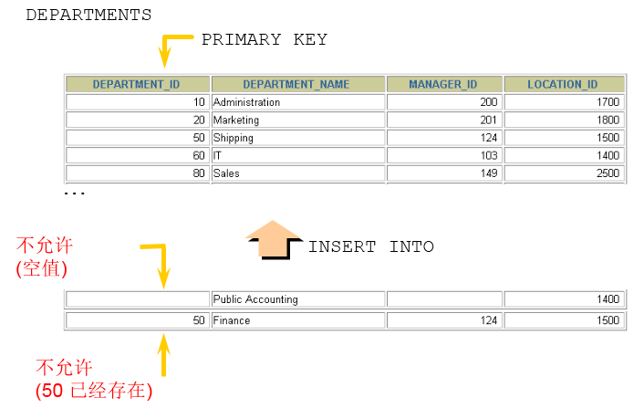

- 一个表最多只能有一个主键约束，建立主键约束可以在列级别创建，也可以在表级别上创建。

- 主键约束对应着表中的一列或者多列（复合主键）

- 如果是多列组合的复合主键约束，那么这些列都不允许为空值，并且组合的值不允许重复。

- **MySQL的主键名总是PRIMARY**，就算自己命名了主键约束名也没用。

- 当创建主键约束时，系统默认会在所在的列或列组合上建立对应的**主键索引**（能够根据主键查询的，就根据主键查询，效率更高）。如果删除主键约束了，主键约束对应的索引就自动删除了。

- 需要注意的一点是，不要修改主键字段的值。因为主键是数据记录的唯一标识，如果修改了主键的值，就有可能会破坏数据的完整性。

#### 4.4 添加主键约束

1. 建表时指定主键约束

   ```mysql
   create table 表名称(
   	字段名 数据类型 primary key, #列级模式
   	字段名 数据类型,
   	字段名 数据类型
   );
   
   create table 表名称(
   	字段名 数据类型,
   	字段名 数据类型,
   	字段名 数据类型,
   	[constraint 约束名] primary key(字段名) #表级模式
   );
   ```

   举例：

   ```mysql
   create table temp(
   	id int primary key,
   	name varchar(20)
   );
   
   mysql> desc temp;
   +-------+----------------+------ +-----+-----------+-------+
   | Field | Type           | Null  | Key | Default   | Extra |
   +-------+----------------+-------+-----+-----------+-------+
   | id    | int(11)        | NO    | PRI | NULL      |       |
   | name  | varchar(20)    | YES   |     | NULL      |       |
   +-------+----------------+-------+-----+-----------+-------+
   2 rows in set (0.00 sec)
   
   insert into temp values(1,'张三');#成功
   insert into temp values(2,'李四');#成功
   
   mysql> select * from temp;
   +----+-------+
   | id | name  |
   +----+-------+
   | 1  | 张三  |
   | 2  | 李四  |
   +----+-------+
   2 rows in set (0.00 sec)
   
   # ERROR 1062 (23000): Duplicate（重复） entry（键入，输入） '1' for key 'PRIMARY'
   insert into temp values(1,'张三');#失败
   
   # ERROR 1062 (23000): Duplicate entry '1' for key 'PRIMARY'
   insert into temp values(1,'王五');#失败
   
   insert into temp values(3,'张三');#成功
   
   mysql> select * from temp;
   +----+--------+
   | id | name   |
   +----+--------+
   | 1  | 张三   |
   | 2  | 李四   |
   | 3  | 张三   |
   +----+--------+
   3 rows in set (0.00 sec)
   
   insert into temp values(4,null);#成功
   # ERROR 1048 (23000): Column 'id' cannot be null
   insert into temp values(null,'李琦');#失败
   
   mysql> select * from temp;
   +----+--------+
   | id | name   |
   +----+---------+
   | 1  | 张三    |
   | 2  | 李四    |
   | 3  | 张三    |
   | 4  | NULL   |
   +----+---------+
   4 rows in set (0.00 sec)
   
   #演示一个表建立两个主键约束
   create table temp(
   	id int primary key,
   	name varchar(20) primary key
   );
   # ERROR 1068 (42000): Multiple（多重的） primary key defined（定义）
   ```

   再举例：

   - 列级约束

     ```mysql
     CREATE TABLE emp4(
     	id INT PRIMARY KEY AUTO_INCREMENT ,
     	NAME VARCHAR(20)
     );
     ```

   - 表级约束

     ```mysql
     CREATE TABLE emp5(
     	id INT NOT NULL AUTO_INCREMENT,	
     	`name` VARCHAR(20),
     	pwd VARCHAR(15),
     	CONSTRAINT emp5_id_pk PRIMARY KEY(id)
     );
     ```

2. 建表后增加主键约束

   ```mysql
   #字段列表可以是一个字段，也可以是多个字段，如果是多个字段的话，是复合主键
   ALTER TABLE 表名称 ADD PRIMARY KEY(字段列表); 
   
   ALTER TABLE student ADD PRIMARY KEY (sid);
   
   ALTER TABLE emp5 ADD PRIMARY KEY(`name`,pwd);
   ```

#### 4.5 关于复合主键

```mysql
create table 表名称(
	字段名 数据类型,
	字段名 数据类型,
	字段名 数据类型,
	primary key(字段名1,字段名2) #表示字段1和字段2的组合是唯一的，也可以有更多个字段
);
```

```mysql
#学生表
create table student(
	sid int primary key, #学号
	sname varchar(20) #学生姓名
);
#课程表
create table course(
	cid int primary key, #课程编号
	cname varchar(20) #课程名称
);
#选课表
create table student_course(
	sid int,
	cid int,
	score int,
	primary key(sid,cid) #复合主键
);
```

```mysql
insert into student values(1,'张三'),(2,'李四');
insert into course values(1001,'Java'),(1002,'MySQL');

mysql> select * from student;
+-----+---------+
| sid | sname   |
+-----+---------+
| 1   | 张三    |
| 2   | 李四    |
+-----+---------+
2 rows in set (0.00 sec)

mysql> select * from course;
+-------+----------+
| cid   | cname    |
+-------+----------+
| 1001  | Java     |
| 1002  | MySQL    |
+-------+----------+
2 rows in set (0.00 sec)
```

```mysql
insert into student_course values(1, 1001, 89),(1,1002,90),(2,1001,88),(2,1002,56);

mysql> select * from student_course;
+-----+--------+-------+
| sid | cid    | score |
+-----+--------+-------+
| 1   | 1001   | 89    |
| 1   | 1002   | 90    |
| 2   | 1001   | 88    |
| 2   | 1002   | 56    |
+-----+--------+-------+
4 rows in set (0.00 sec)
```

```mysql
# ERROR 1062 (23000): Duplicate entry '1-1001' for key 'PRIMARY'
insert into student_course values(1, 1001, 100);

mysql> desc student_course;
+--------+---------+-------+-----+--- ------+--------+
| Field  | Type    | Null  | Key  | Default | Extra  |
+--------+---------+-------+------+---------+--------+
| sid    | int(11) | NO    | PRI  | NULL    |        |
| cid    | int(11) | NO    | PRI  | NULL    |        |
| score  | int(11) | YES   |      | NULL    |        |
+--------+---------+-------+------+---------+--------+
3 rows in set (0.00 sec)
```

再举例

```mysql
CREATE TABLE emp6(
	id INT NOT NULL,
	NAME VARCHAR(20),
	pwd VARCHAR(15),
	CONSTRAINT emp7_pk PRIMARY KEY(NAME,pwd)
);
```

#### 4.6 删除主键约束

```mysql
alter table 表名称 drop primary key;
```

举例：

```mysql
ALTER TABLE student DROP PRIMARY KEY;

ALTER TABLE emp5 DROP PRIMARY KEY;
```

>说明：删除主键约束，不需要指定主键名，因为一个表只有一个主键，删除主键约束后，非空还存在。

### 5 自增列：AUTO_INCREMENT

#### 5.1 作用

某个字段的值自增

#### 5.2 关键字

**auto_increment**

#### 5.3 特点和要求

1. 一个表最多只能有一个自增长列
2. 当需要产生唯一标识符或顺序值时，可设置自增长
3. 自增长列约束的列必须是键列（主键列，唯一键列）
4. 自增约束的列的数据类型必须是整数类型
5. 如果自增列指定了 0 和 null，会在当前最大值的基础上自增；如果自增列手动指定了具体值，直接赋值为具体值。

错误演示：

```mysql
create table employee(
	eid int auto_increment, #不是键列
	ename varchar(20)
);
# ERROR 1075 (42000): Incorrect table definition; there can be only one auto column and it must be defined as a key
```

```mysql
create table employee(
	eid int primary key,
	ename varchar(20) unique key auto_increment
);
# ERROR 1063 (42000): Incorrect column specifier for column 'ename' 因为ename不是整数类型
```

#### 5.4 如何指定自增约束

1. 建表时

   ```mysql
   create table 表名称(
   	字段名 数据类型 primary key auto_increment,
   	字段名 数据类型 unique key not null,
   	字段名 数据类型 unique key,
   	字段名 数据类型 not null default 默认值,
   );
   
   create table 表名称(
   	字段名 数据类型 default 默认值 ,
   	字段名 数据类型 unique key auto_increment,
   	字段名 数据类型 not null default 默认值,,
   	primary key(字段名)
   );
   ```

   ```mysql
   create table employee(
   	eid int primary key auto_increment,
   	ename varchar(20)
   );
   
   mysql> desc employee;
   +---------+------------------+------+------+-----------+----------------------+
   | Field   | Type             | Null | Key  | Default   |        Extra         |
   +---------+------------------+------+------+-----------+----------------------+
   | eid     | int(11)          | NO   | PRI  | NULL      | auto_increment       |
   | ename   | varchar(20)      | YES  |      | NULL      |                      |
   +---------+------------------+------+------+-----------+----------------------+
   2 rows in set (0.00 sec)
   ```

2. 建表后

   ```mysql
   alter table 表名称 modify 字段名 数据类型 auto_increment;
   ```

   ```mysql
   create table employee(
   	eid int primary key ,
   	ename varchar(20)
   );
   
   alter table employee modify eid int auto_increment;
   
   mysql> desc employee;
   +---------+------------------+-------+------+----------+---------------------+
   | Field   | Type             | Null  | Key  | Default  |        Extra        |
   +---------+------------------+-------+------+----------+---------------------+
   | eid     | int(11)          | NO    | PRI  | NULL     | auto_increment      |
   | ename   | varchar(20)      | YES   |      | NULL     |                     |
   +---------+------------------+-------+------+----------+---------------------+
   2 rows in set (0.00 sec)

#### 5.5 如何删除自增约束

```mysql
#alter table 表名称 modify 字段名 数据类型 auto_increment;#给这个字段增加自增约束
alter table 表名称 modify 字段名 数据类型; #去掉auto_increment相当于删除

alter table employee modify eid int;

mysql> desc employee;
+---------+------------------+-------+------+----------+---------------------+
| Field   | Type             | Null  | Key  | Default  |        Extra        |
+---------+------------------+-------+------+----------+---------------------+
| eid     | int(11)          | NO    | PRI  | NULL     |                     |
| ename   | varchar(20)      | YES   |      | NULL     |                     |
+---------+------------------+-------+------+----------+---------------------+
2 rows in set (0.00 sec)
```

#### 5.6 MySQL 8.0新特性—自增变量的持久化

在MySQL 8.0之前，自增主键AUTO_INCREMENT的值如果大于max(primary key)+1，在MySQL重启后，会重置AUTO_INCREMENT=max(primary key)+1，这种现象在某些情况下会导致业务主键冲突或者其他难以发现的问题。下面通过案例来对比不同的版本中自增变量是否持久化。

在**MySQL 5.7**版本中，测试步骤如下：创建的数据表中包含自增主键的id字段，语句如下：

```mysql
CREATE TABLE test1(
	id INT PRIMARY KEY AUTO_INCREMENT
);

# 插入4个空值，执行如下：
INSERT INTO test1 VALUES(0),(0),(0),(0);

# 查询数据表test1中的数据，结果如下：
mysql> SELECT * FROM test1;
+----+
| id |
+----+
| 1  |
| 2  |
| 3  |
| 4  |
+----+
4 rows in set (0.00 sec)

# 删除id为4的记录，语句如下：
DELETE FROM test1 WHERE id = 4;

# 再次插入一个空值，语句如下：
INSERT INTO test1 VALUES(0);

# 查询此时数据表test1中的数据，结果如下：
mysql> SELECT * FROM test1;
+----+
| id |
+----+
| 1  |
| 2  |
| 3  |
| 5  |
+----+
4 rows in set (0.00 sec)

# 从结果可以看出，虽然删除了id为4的记录，但是再次插入空值时，并没有重用被删除的4，而是分配了5。
# 删除id为5的记录，结果如下：
DELETE FROM test1 where id=5;

# `重启数据库`，重新插入一个空值。
INSERT INTO test1 values(0);

# 再次查询数据表test1中的数据，结果如下：
mysql> SELECT * FROM test1;
+----+
| id |
+----+
| 1  |
| 2  |
| 3  |
| 4  |
+----+
4 rows in set (0.00 sec)
```

从结果可以看出，新插入的0值分配的是4，按照重启前的操作逻辑，此处应该分配6。出现上述结果的主要原因是自增主键没有持久化。在MySQL 5.7系统中，对于自增主键的分配规则，是由InnoDB数据字典内部一个`计数器`来决定的，而该计数器只在`内存中维护`，并不会持久化到磁盘中。当数据库重启时，该计数器会被初始化。


在MySQL 8.0版本中，上述测试步骤最后一步的结果如下：

```mysql
mysql> SELECT * FROM test1;
+----+
| id |
+----+
| 1  |
| 2  |
| 3  |
| 6  |
+----+
4 rows in set (0.00 sec)
```

从结果可以看出，自增变量已经持久化了。

MySQL 8.0将自增主键的计数器持久化到`重做日志`中。每次计数器发生改变，都会将其写入重做日志中。如果数据库重启，InnoDB会根据重做日志中的信息来初始化计数器的内存值。

### 6 FOREIGN KEY 约束

#### 6.1 作用

限定某个表的某个字段的引用完整性。

比如：员工表的员工所在部门的选择，必须在部门表能找到对应的部分。

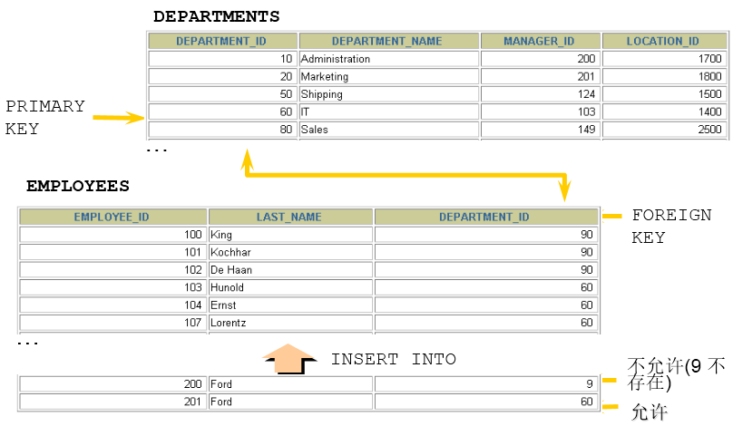

#### 6.2 关键字

**FOREIGN KEY**

#### 6.3 主表和从表/父表和子表

主表（父表）：被引用的表，被参考的表

从表（子表）：引用别人的表，参考别人的表

例如：员工表的员工所在部门这个字段的值要参考部门表：部门表是主表，员工表是从表。

例如：学生表、课程表、选课表：选课表的学生和课程要分别参考学生表和课程表，学生表和课程表是主表，选课表是从表。

#### 6.4 特点

1. 从表的外键列，必须引用/参考主表的主键或唯一约束的列

   为什么？因为被依赖/被参考的值必须是唯一的

2. 在创建外键约束时，**如果不给外键约束命名，默认名不是列名，而是自动产生一个外键名**（例如`student_ibfk_1`），也可以指定外键约束名。
   
3. 创建(CREATE)表时就指定外键约束的话，先创建主表，再创建从表

4. 删表时，先删从表（或先删除外键约束），再删除主表

5. 当主表的记录被从表参照时，主表的记录将不允许删除，如果要删除数据，需要先删除从表中依赖该记录的数据，然后才可以删除主表的数据

6. 在“从表”中指定外键约束，并且一个表可以建立多个外键约束

7. 从表的外键列与主表被参照的列名字可以不相同，但是数据类型必须一样，逻辑意义一致。如果类型不一样，创建子表时，就会出现错误`“ERROR 1005 (HY000): Can't create
   table'database.tablename'(errno: 150)”`。

   例如：都是表示部门编号，都是int类型。

8. **当创建外键约束时，系统默认会在所在的列上建立对应的普通索引**。但是索引名是外键的约束名。（根据外键查询效率很高）

9. 删除外键约束后，必须`手动`删除对应的索引

#### 6.5 添加外键约束

1. 建表时

   ```mysql
   create table 主表名称(
   	字段1 数据类型 primary key,
   	字段2 数据类型
   );
   
   create table 从表名称(
   	字段1 数据类型 primary key,
   	字段2 数据类型,
   	[CONSTRAINT <外键约束名称>] FOREIGN KEY (从表的某个字段) references 主表名(被参考字段)
   );
   #(从表的某个字段)的数据类型必须与主表名(被参考字段)的数据类型一致，逻辑意义也一样
   #(从表的某个字段)的字段名可以与主表名(被参考字段)的字段名一样，也可以不一样
   
   -- FOREIGN KEY: 在表级指定子表中的列
   -- REFERENCES: 标示在父表中的列
   ```

   ```mysql
   create table dept( #主表
   	did int primary key, #部门编号
   	dname varchar(50) #部门名称
   );
   
   create table emp(#从表
   	eid int primary key, #员工编号
   	ename varchar(5), #员工姓名
   	deptid int, #员工所在的部门
   	foreign key (deptid) references dept(did) #在从表中指定外键约束
   	#emp表的deptid和和dept表的did的数据类型一致，意义都是表示部门的编号
   );
   
   说明：
   （1）主表dept必须先创建成功，然后才能创建emp表，指定外键成功。
   （2）删除表时，先删除从表emp，再删除主表dept
   ```

2. 建表后

   一般情况下，表与表的关联都是提前设计好了的，因此，会在创建表的时候就把外键约束定义好。不过，如果需要修改表的设计（比如添加新的字段，增加新的关联关系），但没有预先定义外键约束，那么，就要用修改表的方式来补充定义。

   格式：

   ```mysql
   ALTER TABLE 从表名 
   ADD [CONSTRAINT 约束名] FOREIGN KEY (从表的字段) REFERENCES 主表名(被引用字段) [on update xx][on delete xx];
   ```

   举例：

   ```mysql
   ALTER TABLE emp1
   ADD [CONSTRAINT emp_dept_id_fk] FOREIGN KEY(dept_id) REFERENCES dept(dept_id);
   ```

   ```mysql
   create table dept(
   	did int primary key, #部门编号
   	dname varchar(50) #部门名称
   );
   
   create table emp(
   	eid int primary key, #员工编号
   	ename varchar(5), #员工姓名
   	deptid int #员工所在的部门
   );
   #这两个表创建时，没有指定外键的话，那么创建顺序是随意
   
   alter table emp add foreign key (deptid) references dept(did);
   ```

#### 6.6 演示问题

1. 失败：不是键列

   ```mysql
   create table dept(
   	did int , #部门编号
   	dname varchar(50) #部门名称
   );
   create table emp(
   	eid int primary key, #员工编号
   	ename varchar(5), #员工姓名
   	deptid int, #员工所在的部门
   	foreign key (deptid) references dept(did)
   );
   #ERROR 1215 (HY000): Cannot add foreign key constraint 原因是dept的did不是键列
   ```

2. 失败：数据类型不一致

   ```mysql
   create table dept(
   	did int primary key, #部门编号
   	dname varchar(50) #部门名称
   );
   create table emp(
   	eid int primary key, #员工编号
   	ename varchar(5), #员工姓名
   	deptid char, #员工所在的部门
   	foreign key (deptid) references dept(did)
   );
   #ERROR 1215 (HY000): Cannot add foreign key constraint 原因是从表的deptid字段和主表的did字段的数据类型不一致，并且要它俩的逻辑意义一致
   ```

3. 成功，两个表字段名一样

   ```mysql
   create table dept(
   	did int primary key, #部门编号
   	dname varchar(50) #部门名称
   );
   
   create table emp(
   	eid int primary key, #员工编号
   	ename varchar(5), #员工姓名
   	did int, #员工所在的部门
   	foreign key (did) references dept(did)
   	#emp表的deptid和和dept表的did的数据类型一致，意义都是表示部门的编号
   	#是否重名没问题，因为两个did在不同的表中
   );
   ```

4. 添加、删除、修改问题

   ```mysql
   create table dept(
   	did int primary key, #部门编号
   	dname varchar(50) #部门名称
   );
   
   create table emp(
   	eid int primary key, #员工编号
   	ename varchar(5), #员工姓名
   	deptid int, #员工所在的部门
   	foreign key (deptid) references dept(did)
   	#emp表的deptid和和dept表的did的数据类型一致，意义都是表示部门的编号
   );
   ```

   ```mysql
   insert into dept values(1001,'教学部');
   insert into dept values(1003, '财务部');
   
   insert into emp values(1,'张三',1001); #添加从表记录成功，在添加这条记录时，要求部门表有1001部门
   insert into emp values(2,'李四',1005); #添加从表记录失败
   # ERROR 1452 (23000): Cannot add（添加） or update（修改） a child row: a foreign key constraint fails (`atguigudb`.`emp`, CONSTRAINT `emp_ibfk_1` FOREIGN KEY (`deptid`) REFERENCES `dept` (`did`)) 从表emp添加记录失败，因为主表dept没有1005部门
   
   mysql> select * from dept;
   +------+--------+
   | did  | dname  |
   +------+--------+
   | 1001 | 教学部  |
   | 1003 | 财务部  |
   +------+--------+
   2 rows in set (0.00 sec)
   
   mysql> select * from emp;
   +-----+-------+--------+
   | eid | ename | deptid |
   +-----+-------+--------+
   | 1   | 张三   | 1001   |
   +-----+-------+--------+
   1 row in set (0.00 sec)
   ```

   ```mysql
   update emp set deptid = 1002 where eid = 1;#修改从表失败
   # ERROR 1452 (23000): Cannot add（添加） or update（修改） a child row（子表的记录）: a foreign key constraint fails（外键约束失败） (`atguigudb`.`emp`, CONSTRAINT `emp_ibfk_1` FOREIGN KEY (`deptid`) REFERENCES `dept` (`did`)) #部门表did字段现在没有1002的值，所以员工表中不能修改员工所在部门deptid为1002
   
   update dept set did = 1002 where did = 1003;#修改主表成功 因为部门表的1003部门没有被emp表引用，所以可以修改
   ```

   ```mysql
   delete from dept where did=1001; #删除主表失败
   # ERROR 1451 (23000): Cannot delete（删除） or update（修改） a parent row（父表记录）: a foreign key constraint fails (`atguigudb`.`emp`, CONSTRAINT `emp_ibfk_1` FOREIGN KEY (`deptid`) REFERENCES `dept` (`did`)) #因为部门表did的1001字段已经被emp引用了，所以部门表的1001字段对应的记录就不能被删除
   ```

总结：约束关系是针对双方的

- 添加了外键约束后，主表的修改和删除数据受约束
- 添加了外键约束后，从表的添加和修改数据受约束
- 在从表上建立外键，要求主表必须存在
- 删除主表时，要求从表先删除，或将从表中外键引用该主表的关系先删除

#### 6.7 约束等级

- `Cascade方式`：在父表上update/delete记录时，同步update/delete掉子表的匹配记录
- `Set null方式`：在父表上update/delete记录时，将子表上匹配记录的列设为null，但是要注意子表的外键列不能为not null
- `No action方式`：如果子表中有匹配的记录，则不允许对父表对应候选键进行update/delete操作
- `Restrict方式`：同no action，都是立即检查外键约束
- `Set default方式`（在可视化工具SQLyog中可能显示空白）：父表有变更时，子表将外键列设置成一个默认的值，但Innodb不能识别

如果没有指定等级，就相当于Restrict方式。

对于外键约束，最好是采用: `ON UPDATE CASCADE ON DELETE RESTRICT`的方式。

##### 6.7.1 演示1：on update cascade on delete set null

```mysql
create table dept(
	did int primary key, #部门编号
	dname varchar(50) #部门名称
);

create table emp(
	eid int primary key, #员工编号
	ename varchar(5), #员工姓名
	deptid int, #员工所在的部门
	foreign key (deptid) references dept(did) on update cascade on delete set null
	#把修改操作设置为级联修改等级，把删除操作设置为set null等级
);

insert into dept values(1001,'教学部');
insert into dept values(1002, '财务部');
insert into dept values(1003, '咨询部');

insert into emp values(1,'张三',1001); #在添加这条记录时，要求部门表有1001部门
insert into emp values(2,'李四',1001);
insert into emp values(3,'王五',1002);

select * from dept;
select * from emp;
```

```mysql
#修改主表成功，从表也跟着修改，修改了主表被引用的字段1002为1004，从表的引用字段就跟着修改为1004了
update dept set did = 1004 where did = 1002;

mysql> select * from dept;
+------+----------+
| did  | dname    |
+------+----------+
| 1001 | 教学部    |
| 1003 | 咨询部    |
| 1004 | 财务部    |  #原来是1002，修改为1004
+-------+---------+
3 rows in set (0.00 sec)

mysql> select * from emp;
+-----+-------+--------+
| eid | ename | deptid |
+-----+-------+--------+
| 1   | 张三  | 1001   |
| 2   | 李四  | 1001   |
| 3   | 王五  | 1004   | #原来是1002，跟着修改为1004
+-----+-------+--------+
3 rows in set (0.00 sec)
```

```mysql
#删除主表的记录成功，从表对应的字段的值被修改为null
delete from dept where did = 1001;

mysql> select * from dept;
+------+-----------+
| did  | dname     |  #记录1001部门被删除了
+------+-----------+
| 1003 | 咨询部     |
| 1004 | 财务部     |
+------+-----------+
2 rows in set (0.00 sec)

mysql> select * from emp;
+-----+---------+---------+
| eid | ename   | deptid  |
+-----+---------+---------+
| 1   | 张三    | NULL    | #原来引用1001部门的员工，deptid字段变为null
| 2   | 李四    | NULL    |
| 3   | 王五    | 1004    |
+-----+--------+----------+
3 rows in set (0.00 sec)
```

##### 6.7.2演示2：on update set null on delete cascade

```mysql
create table dept(
	did int primary key, #部门编号
	dname varchar(50) #部门名称
);

create table emp(
	eid int primary key, #员工编号
	ename varchar(5), #员工姓名
	deptid int, #员工所在的部门
	foreign key (deptid) references dept(did) on update set null on delete cascade
	#把修改操作设置为set null等级，把删除操作设置为级联删除等级
);

insert into dept values(1001,'教学部');
insert into dept values(1002, '财务部');
insert into dept values(1003, '咨询部');

insert into emp values(1,'张三',1001); #在添加这条记录时，要求部门表有1001部门
insert into emp values(2,'李四',1001);
insert into emp values(3,'王五',1002);

mysql> select * from dept;
+------+----------+
| did  | dname    |
+------+----------+
| 1001 | 教学部    |
| 1002 | 财务部    |
| 1003 | 咨询部    |  
+------+----------+
3 rows in set (0.00 sec)

mysql> select * from emp;
+-----+-------+--------+
| eid | ename | deptid |
+-----+-------+--------+
| 1   | 张三  | 1001    |
| 2   | 李四  | 1001    |
| 3   | 王五  | 1002    | 
+-----+-------+--------+
3 rows in set (0.00 sec)
```

```mysql
#修改主表，从表对应的字段设置为null
update dept set did = 1004 where did = 1002;

mysql> select * from dept;
+------+----------+
| did  | dname    |
+------+----------+
| 1001 | 教学部    |
| 1003 | 咨询部    |
| 1004 | 财务部    | #原来did是1002
+------+----------+
3 rows in set (0.00 sec)

mysql> select * from emp;
+-----+-------+--------+
| eid | ename | deptid |
+-----+-------+--------+
| 1   | 张三  | 1001    |
| 2   | 李四  | 1001    |
| 3   | 王五  | NULL    |  # 原来deptid是1002，因为部门表1002被修改了，1002没有对应的了，就设置为null
+-----+-------+--------+
3 rows in set (0.00 sec)
```

```mysql
#删除主表的记录成功，主表的1001行被删除了，从表相应的记录也被删除了
delete from dept where did=1001;

mysql> select * from dept;
+------+----------+
| did  | dname    |  #部门表中1001部门被删除
+------+----------+
| 1003 | 咨询部    |
| 1004 | 财务部    | 
+-------+---------+
3 rows in set (0.00 sec)

mysql> select * from emp;
+-----+-------+--------+
| eid | ename | deptid | #原来1001部门的员工也被删除了
+-----+-------+--------+
| 3   | 王五   | NULL   |  
+-----+-------+--------+
3 rows in set (0.00 sec)
```

##### 6.7.3 演示：on update cascade on delete cascade

```mysql
create table dept(
	did int primary key, #部门编号
	dname varchar(50) #部门名称
);

create table emp(
	eid int primary key, #员工编号
	ename varchar(5), #员工姓名
	deptid int, #员工所在的部门
	foreign key (deptid) references dept(did) on update cascade on delete cascade
	#把修改操作设置为级联修改等级，把删除操作也设置为级联删除等级
);

insert into dept values(1001,'教学部');
insert into dept values(1002, '财务部');
insert into dept values(1003, '咨询部');

insert into emp values(1,'张三',1001); #在添加这条记录时，要求部门表有1001部门
insert into emp values(2,'李四',1001);
insert into emp values(3,'王五',1002);
```

```mysql
#修改主表，从表对应的字段自动修改
update dept set did = 1004 where did = 1002;

mysql> select * from dept;
+------+----------+
| did  | dname    |
+------+----------+
| 1001 | 教学部    |
| 1003 | 咨询部    |
| 1004 | 财务部    |  #原来是1002，修改为1004
+------+----------+
3 rows in set (0.00 sec)

mysql> select * from emp;
+-----+-------+--------+
| eid | ename | deptid |
+-----+-------+--------+
| 1   | 张三  | 1001   |
| 2   | 李四  | 1001   |
| 3   | 王五  | 1004   | #原来是1002，跟着修改为1004 级联修改
+-----+------+--------+
3 rows in set (0.00 sec)
```

```mysql
#删除主表的记录成功，主表的1001行被删除了，从表相应的记录也被删除了
delete from dept where did=1001;

mysql> select * from dept;
+------+----------+
| did  | dname    |  #部门表中1001部门被删除
+------+----------+
| 1003 | 咨询部    |
| 1004 | 财务部    | 
+------+----------+
3 rows in set (0.00 sec)

mysql> select * from emp;
+-----+-------+--------+
| eid | ename | deptid | #原来1001部门的员工也被删除了
+-----+-------+--------+
| 3   | 王五   | 1004  |  
+-----+-------+--------+
3 rows in set (0.00 sec)
```

#### 6.8 删除外键约束

流程如下：

```mysql
# (1)第一步先查看约束名和删除外键约束
SELECT * FROM information_schema.table_constraints WHERE table_name = '表名称';  #查看某个表的约束名

ALTER TABLE 从表名 DROP FOREIGN KEY 外键约束名;

#（2）第二步查看索引名和删除索引。（注意，只能手动删除）
SHOW INDEX FROM 表名称;  #查看某个表的索引名

ALTER TABLE 从表名 DROP INDEX 索引名;
```

举例：

```mysql
mysql> SELECT * FROM information_schema.table_constraints WHERE table_name = 'emp';

mysql> alter table emp drop foreign key emp_ibfk_1;
Query OK, 0 rows affected (0.02 sec)
Records: 0 Duplicates: 0 Warnings: 0

mysql> show index from emp;

mysql> alter table emp drop index deptid;
Query OK, 0 rows affected (0.01 sec)
Records: 0 Duplicates: 0 Warnings: 0

mysql> show index from emp;
```

#### 6.9 开发场景

**问题1：如果两个表之间有关系（一对一、一对多），比如：员工表和部门表（一对多），它们之间是否一定要建外键约束？**

答：不是的

**问题2：建和不建外键约束有什么区别？**

答：

- 建外键约束，你的操作（创建表、删除表、添加、修改、删除）会受到限制，从语法层面受到限制。例如：在员工表中不可能添加一个员工信息，它的部门的值在部门表中找不到。
- 不建外键约束，你的操作（创建表、删除表、添加、修改、删除）不受限制，要保证数据的`引用完整性`，只能`依靠程序员的自觉`，或者是`在Java程序中进行限定`。例如：在员工表中，可以添加一个员工的信息，它的部门指定为一个完全不存在的部门。

**问题3：那么建和不建外键约束和查询有没有关系？**

答：没有


>在 MySQL 里，外键约束是有成本的，需要消耗系统资源。对于大并发的 SQL 操作，有可能会不适合。比如大型网站的中央数据库，可能会`因为外键约束的系统开销而变得非常慢`。所以，MySQL允许你不使用系统自带的外键约束，在`应用层面` 完成检查数据一致性的逻辑。也就是说，即使你不用外键约束，也要想办法通过应用层面的附加逻辑，来实现外键约束的功能，确保数据的一致性。

#### 6.10 阿里开发规范

【`强制`】不得使用外键与级联，一切外键概念必须在应用层解决。

说明：（概念解释）学生表中的 student_id 是主键，那么成绩表中的 student_id 则为外键。如果更新学生表中的 student_id，同时触发成绩表中的 student_id 更新，即为级联更新。外键与级联更新适用于`单机低并发`，不适合`分布式`、`高并发集群`；级联更新是强阻塞，存在数据库`更新风暴`的风险；外键影响数据库的`插入速度`。

### 7 CHECK 约束

#### 7.1 作用

检查某个字段的值是否符号xx要求，一般指的是值的范围

#### 7.2 关键字

**CHECK**

#### 7.3 说明：MySQL 5.7 不支持

MySQL5.7 可以使用check约束，但check约束对数据验证没有任何作用。添加数据时，没有任何错误或警告

但是**MySQL 8.0中可以使用check约束了**。

```mysql
create table employee(
	eid int primary key,
	ename varchar(5),
	gender char check(gender = '男' OR gender = '女')
);

insert into employee values(1, '张三', '女');

mysql> select * from employee;
+-----+----------+----------+
| eid | ename    | gender   |
+-----+----------+----------+
| 1   | 张三      | 女       |
+-----+----------+----------+
1 row in set (0.00 sec)
```

```mysql
# 再举例
CREATE TABLE temp(
	id INT AUTO_INCREMENT,
	`name` VARCHAR(20),
	age INT CHECK(age > 20),
	PRIMARY KEY(id)
);

# 再举例
age tinyint check(age >20) 
sex char(2) check(sex in(‘男’,’女’))

# 再举例
CHECK(height>=0 AND height<3)
```

### 8 DEFAULT约束

#### 8.1 作用

给某个字段/某列指定默认值，一旦设置默认值，在插入数据时，如果此字段没有显式赋值，则赋值为默认值。

#### 8.2 关键字

**DEFAULT**

#### 8.3 如何给字段加默认值

1. 建表时

   ```mysql
   create table 表名称(
   	字段名 数据类型 primary key,
   	字段名 数据类型 unique key not null,
   	字段名 数据类型 unique key,
   	字段名 数据类型 not null default 默认值,
   );
   
   create table 表名称(
   	字段名 数据类型 default 默认值 ,
   	字段名 数据类型 not null default 默认值,
   	字段名 数据类型 not null default 默认值,
   	primary key(字段名),
   	unique key(字段名)
   );
   
   说明：默认值约束一般不在唯一键和主键列上加
   ```

   ```mysql
   create table employee(
   	eid int primary key,
   	ename varchar(20) not null,
   	gender char default '男',
   	tel char(11) not null default '' #默认是空字符串
   );
   
   mysql> desc employee;
   +--------+-------------+------+-----+---------+-------+
   | Field  | Type        | Null | Key | Default | Extra |
   +--------+-------------+------+-----+---------+-------+
   | eid    | int(11)     | NO   | PRI | NULL    |       |
   | ename  | varchar(20) | NO   |     | NULL    |       |
   | gender | char(1)     | YES  |     | 男      |       |
   | tel    | char(11)    | NO   |     |         |       |
   +--------+-------------+------+-----+---------+-------+
   4 rows in set (0.00 sec)
   
   insert into employee values(1,'汪飞','男','13700102535'); #成功
   insert into employee(eid,ename) values(2,'天琪'); #成功
   
   mysql> select * from employee;
   +-----+--------+--------+-------------+
   | eid |ename   | gender | tel         |
   +-----+--------+--------+-------------+
   | 1   | 汪飞    | 男     | 13700102535 |
   | 2   | 天琪    | 男     |             |
   +-----+--------+--------+-------------+
   2 rows in set (0.00 sec)
   
   insert into employee(eid,ename) values(3,'二虎');
   #ERROR 1062 (23000): Duplicate entry '' for key 'tel'
   #如果tel有唯一性约束的话会报错，如果tel没有唯一性约束，可以添加成功
   ```

   ```mysql
   CREATE TABLE myemp(
   	id INT AUTO_INCREMENT PRIMARY KEY,
   	`name` VARCHAR(15),
   	salary DOUBLE(10,2) DEFAULT 2000
   );
   ```

2. 建表后

   ```mysql
   alter table 表名称 modify 字段名 数据类型 default 默认值;
   
   #如果这个字段原来有非空约束，你还保留非空约束，那么在加默认值约束时，还得保留非空约束，否则非空约束就被删除了
   #同理，在给某个字段加非空约束也一样，如果这个字段原来有默认值约束，你想保留，也要在modify语句中保留默认值约束，否则就删除了
   alter table 表名称 modify 字段名 数据类型 default 默认值 not null;
   ```

   ```mysql
   create table employee(
   	eid int primary key,
   	ename varchar(20),
   	gender char,
   	tel char(11) not null
   );
   
   mysql> desc employee;
   +--------+---------------+------+-----+-----------+--------+
   | Field  | Type          | Null | Key | Default   | Extra  |
   +--------+---------------+------+-----+-----------+--------+
   | eid    | int(11)       | NO   | PRI | NULL      | 	   |
   | ename  | varchar(20)   | YES  |     | NULL      | 	   |
   | gender | char(1)       | YES  |     | NULL      | 	   |
   | tel    | char(11)      | NO   |     | NULL      |        |
   +--------+---------------+------+-----+-----------+---------+
   4 rows in set (0.00 sec)
   
   alter table employee modify gender char default '男'; #给gender字段增加默认值约束
   alter table employee modify tel char(11) default ''; #给tel字段增加默认值约束；非空约束去除
   
   mysql> desc employee;
   +--------+---------------+------+-----+-----------+--------+
   | Field  | Type          | Null | Key | Default   | Extra  |
   +--------+---------------+------+-----+-----------+--------+
   | eid    | int(11)       | NO   | PRI | NULL      | 	   |
   | ename  | varchar(20)   | YES  |     | NULL      | 	   |
   | gender | char(1)       | YES  |     | 男        |         | 
   | tel    | char(11)      | YES  |     |           |         |
   +--------+---------------+------+-----+-----------+--------+
   4 rows in set (0.00 sec)
   
   alter table employee modify tel char(11) default '' not null;#给tel字段增加默认值约束，并保留非空约束
   
   mysql> desc employee;
   +--------+---------------+------+-----+-----------+--------+
   | Field  | Type          | Null | Key | Default   | Extra  |
   +--------+---------------+------+-----+-----------+--------+
   | eid    | int(11)       | NO   | PRI | NULL      |    	   |
   | ename  | varchar(20)   | YES  |     | NULL      |        |
   | gender | char(1)       | YES  |     | 男        |        | 
   | tel    | char(11)      | NO   |     |           |        |
   +--------+---------------+------+-----+-----------+--------+
   4 rows in set (0.00 sec)
   ```

#### 8.4 如何删除默认值约束

```mysql
alter table 表名称 modify 字段名 数据类型 ;#删除默认值约束，也不保留非空约束

alter table 表名称 modify 字段名 数据类型 not null; #删除默认值约束，保留非空约束
```

```mysql
alter table employee modify gender char; #删除gender字段默认值约束，如果有非空约束，也一并删除
alter table employee modify tel char(11) not null;#删除tel字段默认值约束，保留非空约束

mysql> desc employee;
+--------+---------------+------+-----+-----------+---------+
| Field  | Type          | Null | Key | Default   | Extra   |
+--------+---------------+------+-----+-----------+---------+
| eid    | int(11)       | NO   | PRI | NULL      | 	    |
| ename  | varchar(20)   | YES  |     | NULL      | 	    |
| gender | char(1)       | YES  |     | NULL      |   	    |
| tel    | char(11)      | NO   |     | NULL      |         |
+--------+---------------+------+-----+-----------+---------+
4 rows in set (0.00 sec)
```

### 9 面试

**面试1、为什么建表时，加 not null default '' 或 default 0**

答：不想让表中出现null值。

**面试2、为什么不想要 null 的值**

1. 不好比较。null是一种特殊值，比较时只能用专门的 is null 和 is not null来比较。碰到运算符，通常返回null。
2. 效率不高。影响提高索引效果。因此，我们往往在建表时 not null default '' 或 default 0

**面试3、带AUTO_INCREMENT约束的字段值是从1开始的吗？**

在MySQL中，默认AUTO_INCREMENT的初始值是1，每新增一条记录，字段值自动加1。设置自增属性（AUTO_INCREMENT）的时候，还可以指定第一条插入记录的自增字段的值，这样新插入的记录的自增字段值从初始值开始递增，如在表中插入第一条记录，同时指定id值为5，则以后插入的记录的id值就会从6开始往上增加。添加主键约束时，往往需要设置字段自动增加属性。

**面试4、并不是每个表都可以任意选择存储引擎？** 

外键约束（FOREIGN KEY）不能跨引擎使用。

MySQL支持多种存储引擎，每一个表都可以指定一个不同的存储引擎，需要注意的是：外键约束是用来保证数据的参照完整性的，如果表之间需要关联外键，却指定了不同的存储引擎，那么这些表之间是不能创建外键约束的。所以说，存储引擎的选择也不完全是随意的。

------

## 十三、视图

### 1 常见的数据库对象

| **对象**            | **描述**                                                     |
| ------------------- | ------------------------------------------------------------ |
| 表(TABLE)           | 表是存储数据的逻辑单元，以行和列的形式存在，列就是字段，行就是记录 |
| 数据字典            | 就是系统表，存放数据库相关信息的表。系统表的数据通常由数据库系统维护，程序员通常不应该修改，只可查看 |
| 约束(CONSTRAINT)    | 执行数据校验的规则，用于保证数据完整性的规则                 |
| 视图(VIEW)          | 一个或者多个数据表里的数据的逻辑显示，视图并不存储数据       |
| 索引(INDEX)         | 用于提高查询性能，相当于书的目录                             |
| 存储过程(PROCEDURE) | 用于完成一次完整的业务处理，没有返回值，但可通过传出参数将多个值传给调用环境 |
| 存储函数(FUNCTION)  | 用于完成一次特定的计算，具有一个返回值                       |
| 触发器(TRIGGER)     | 相当于一个事件监听器，当数据库发生特定事件后，触发器被触发，完成相应的处理 |

### 2 视图概述

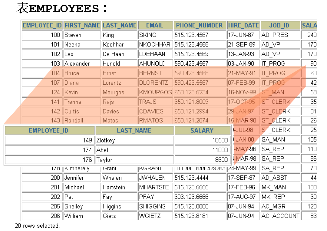

#### 2.1 为什么使用视图？

视图一方面可以帮我们使用表的一部分而不是所有的表，另一方面也可以针对不同的用户制定不同的查询视图。比如，针对一个公司的销售人员，我们只想给他看部分数据，而某些特殊的数据，比如采购的价格，则不会提供给他。再比如，人员薪酬是个敏感的字段，那么只给某个级别以上的人员开放，其他人的查询视图中则不提供这个字段。

刚才讲的只是视图的一个使用场景，实际上视图还有很多作用。最后，我们总结视图的优点。

#### 2.2 视图的理解

- 视图是一种`虚拟表`，本身是`不具有数据`的，占用很少的内存空间，它是 SQL 中的一个重要概念。

- **视图建立在已有表的基础上**, 视图赖以建立的这些表称为**基表**。

  

- 视图的创建和删除只影响视图本身，不影响对应的基表。但是当对视图中的数据进行增加、删除和修改操作时，数据表中的数据会相应地发生变化，反之亦然。

- 向视图提供数据内容的语句为 SELECT 语句，可以将视图理解为**存储起来的SELECT语句**

  - 在数据库中，视图不会保存数据，数据真正保存在数据表中。当对视图中的数据进行增加、删除和修改操作时，数据表中的数据会相应地发生变化；反之亦然。

- 视图，是向用户提供基表数据的另一种表现形式。通常情况下，小型项目的数据库可以不使用视图，但是在大型项目中，以及数据表比较复杂的情况下，视图的价值就凸显出来了，它可以帮助我们把经常查询的结果集放到虚拟表中，提升使用效率。理解和使用起来都非常方便。

### 3 创建视图

- **在 CREATE VIEW 语句中嵌入子查询**

  ```mysql
  CREATE [OR REPLACE]
  [ALGORITHM = {UNDEFINED | MERGE | TEMPTABLE}]
  VIEW 视图名称 [(字段列表)]
  AS 查询语句
  [WITH [CASCADED|LOCAL] CHECK OPTION]
  ```

- 精简版

  ```mysql
  CREATE VIEW 视图名称 AS 查询语句
  ```

#### 3.1 创建单表视图

举例：

```mysql
CREATE VIEW empvu80
AS
SELECT employee_id, last_name, salary
FROM employees
WHERE department_id = 80;
```

查询视图：

```mysql
SELECT * FROM empvu80;
```

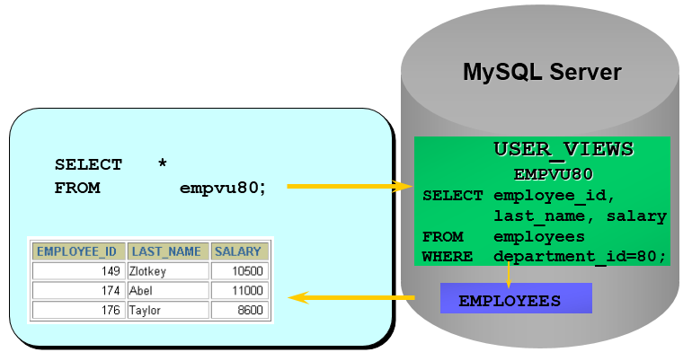

举例：

```mysql
CREATE VIEW emp_year_salary (ename,year_salary)
AS
SELECT ename, salary*12*(1+IFNULL(commission_pct,0))
FROM t_employee;
```

举例：

```mysql
CREATE VIEW salvu50
AS
SELECT employee_id ID_NUMBER, last_name NAME,salary*12 ANN_SALARY
FROM employees
WHERE department_id = 50;
```

> 说明1：实际上就是我们在SQL查询语句的基础上封装了视图 VIEW，这样就会基于SQL语句的结果集形成一张虚拟表。
>
> 说明2：在创建视图时，没有在视图名后面指定字段列表，则视图中字段列表默认和SELECT语句中的字段列表一致。如果SELECT语句中给字段取了别名，那么视图中的字段名和别名相同。

#### 3.2 创建多表联合视图

举例：

```mysql
CREATE VIEW empview
AS
SELECT employee_id emp_id, last_name NAME, department_name
FROM employees e,departments d
WHERE e.department_id = d.department_id;
```

```mysql
CREATE VIEW emp_dept
AS
SELECT ename, dname
FROM t_employee LEFT JOIN t_department
ON t_employee.did = t_department.did;
```

```mysql
CREATE VIEW dept_sum_vu
(name, minsal, maxsal, avgsal)
AS
SELECT d.department_name, MIN(e.salary), MAX(e.salary), AVG(e.salary)
FROM employees e, departments d
WHERE e.department_id = d.department_id
GROUP BY d.department_name;
```

**利用视图对数据进行格式化**

我们经常需要输出某个格式的内容，比如我们想输出员工姓名和对应的部门名，对应格式为`emp_name(department_name)`，就可以使用视图来完成数据格式化的操作：

```mysql
CREATE VIEW emp_depart
AS
SELECT CONCAT(last_name, '(', department_name, ')') AS emp_dept
FROM employees e JOIN departments d
WHERE e.department_id = d.department_id;
```

#### 3.3 基于视图创建视图

当我们创建好一张视图之后，还可以在它的基础上继续创建视图。

举例：联合“emp_dept”视图和“emp_year_salary”视图查询员工姓名、部门名称、年薪信息创建“emp_dept_ysalary”视图。

```mysql
CREATE VIEW emp_dept_ysalary
AS
SELECT emp_dept.ename, dname, year_salary
FROM emp_dept INNER JOIN emp_year_salary
ON emp_dept.ename = emp_year_salary.ename;
```

### 4 查看视图

语法1：查看数据库的表对象、视图对象

```mysql
SHOW TABLES;
```

语法2：查看视图的结构

```mysql
DESC / DESCRIBE 视图名称;
```

语法3：查看视图的属性信息

```mysql
# 查看视图信息（显示数据表的存储引擎、版本、数据行数和数据大小等）
SHOW TABLE STATUS LIKE '视图名称'\G
```

执行结果显示，注释Comment为VIEW，说明该表为视图，其他的信息为NULL，说明这是一个虚表。

语法4：查看视图的详细定义信息

```mysql
SHOW CREATE VIEW 视图名称;
```

### 5 更新视图的数据

#### 5.1 一般情况

MySQL支持使用INSERT、UPDATE和DELETE语句对视图中的数据进行插入、更新和删除操作。当视图中的数据发生变化时，数据表中的数据也会发生变化，反之亦然。

举例：UPDATE操作

```mysql
mysql> SELECT ename,tel FROM emp_tel WHERE ename = '孙洪亮';
+---------+------------------+
| ename   | tel              |
+---------+------------------+
| 孙洪亮   | 13789098765      |
+---------+------------------+
1 row in set (0.01 sec)

mysql> UPDATE emp_tel SET tel = '13789091234' WHERE ename = '孙洪亮';
Query OK, 1 row affected (0.01 sec)
Rows matched: 1 Changed: 1 Warnings: 0

mysql> SELECT ename,tel FROM emp_tel WHERE ename = '孙洪亮';
+---------+------------------+
| ename   | tel              |
+---------+------------------+
| 孙洪亮   | 13789091234      |
+---------+------------------+
1 row in set (0.00 sec)

mysql> SELECT ename,tel FROM t_employee WHERE ename = '孙洪亮';
+---------+------------------+
| ename   | tel              |
+---------+------------------+
| 孙洪亮   | 13789091234      |
+---------+------------------+
1 row in set (0.00 sec)
```

举例：DELETE操作

```mysql
mysql> SELECT ename,tel FROM emp_tel WHERE ename = '孙洪亮';
+---------+------------------+
| ename   | tel              |
+---------+------------------+
| 孙洪亮   | 13789091234      |
+---------+------------------+
1 row in set (0.00 sec)

mysql> DELETE FROM emp_tel WHERE ename = '孙洪亮';
Query OK, 1 row affected (0.01 sec)

mysql> SELECT ename,tel FROM emp_tel WHERE ename = '孙洪亮';
Empty set (0.00 sec)

mysql> SELECT ename,tel FROM t_employee WHERE ename = '孙洪亮';
Empty set (0.00 sec)
```

#### 5.2 不可更新的视图

要使视图可更新，视图中的行和底层基本表中的行之间必须存在`一对一`的关系。另外当视图定义出现如下情况时，视图不支持更新操作：

- 在定义视图的时候指定了“ALGORITHM = TEMPTABLE”，视图将不支持INSERT和DELETE操作；
- 视图中不包含基表中所有被定义为非空又未指定默认值的列，视图将不支持INSERT操作；
- 在定义视图的SELECT语句中使用了`JOIN联合查询`，视图将不支持INSERT和DELETE操作；
- 在定义视图的SELECT语句后的字段列表中使用了`数学表达式`或`子查询`，视图将不支持INSERT，也不支持UPDATE使用了数学表达式、子查询的字段值；
- 在定义视图的SELECT语句后的字段列表中使用`DISTINCT`、`聚合函数`、`GROUP BY`、`HAVING`、`UNION`等，视图将不支持INSERT、UPDATE、DELETE；
- 在定义视图的SELECT语句中包含了子查询，而子查询中引用了FROM后面的表，视图将不支持INSERT、UPDATE、DELETE；
- 视图定义基于一个`不可更新视图`；
- 常量视图。

举例：

```mysql
mysql> CREATE OR REPLACE VIEW emp_dept
       -> (ename,salary,birthday,tel,email,hiredate,dname)
       -> AS SELECT ename,salary,birthday,tel,email,hiredate,dname
       -> FROM t_employee INNER JOIN t_department
       -> ON t_employee.did = t_department.did ;
Query OK, 0 rows affected (0.01 sec)

mysql> INSERT INTO emp_dept(ename,salary,birthday,tel,email,hiredate,dname)
       -> VALUES('张三',15000,'1995-01-08','18201587896',
       -> 'zs@atguigu.com','2022-02-14','新部门');
       
#ERROR 1393 (HY000): Can not modify more than one base table through a join view
'atguigu_chapter9.emp_dept'
```

从上面的SQL执行结果可以看出，在定义视图的SELECT语句中使用了JOIN联合查询，视图将不支持更新操作。

> 虽然可以更新视图数据，但总的来说，视图作为`虚拟表`，主要用于`方便查询`，不建议更新视图的数据。**对视图数据的更改，都是通过对实际数据表里数据的操作来完成的。**

### 6 修改、删除视图

#### 6.1 修改视图

方式1：使用**CREATE OR REPLACE VIEW** 子句**修改视图**

```mysql
CREATE OR REPLACE VIEW vu_emp1
AS
SELECT employee_id, last_name, salary, email
FROM emps
WHERE salary > 7000;
```

> 说明：CREATE VIEW 子句中各列的别名应和子查询中各列相对应。

方式2：ALTER VIEW

修改视图的语法是：

```mysql
ALTER VIEW 视图名称 AS 查询语句
```

```mysql
ALTER VIEW vu_emp1
AS 
SELECT employee_id, last_name, salary, email, hire_date
FROM emps;
```

#### 6.2 删除视图

- 删除视图只是删除视图的定义，并不会删除基表的数据。

- 删除视图的语法是：

  ```mysql
  DROP VIEW IF EXISTS 视图名称;
  
  DROP VIEW IF EXISTS 视图名称1, 视图名称2, 视图名称3, ...;
  ```

- 举例：`DROP VIEW empvu80;`

- 说明：基于视图a、b创建了新的视图c，如果将视图a或者视图b删除，会导致视图c的查询失败。这样的视图c需要手动删除或修改，否则影响使用。

### 7 总结

#### 7.1 视图优点

1. **操作简单**

将经常使用的查询操作定义为视图，可以使开发人员不需要关心视图对应的数据表的结构、表与表之间的关联关系，也不需要关心数据表之间的业务逻辑和查询条件，而只需要简单地操作视图即可，极大简化了开发人员对数据库的操作。

2. **减少数据冗余**

视图跟实际数据表不一样，它存储的是查询语句。所以，在使用的时候，我们要通过定义视图的查询语句来获取结果集。而视图本身不存储数据，不占用数据存储的资源，减少了数据冗余。

3. **数据安全**

MySQL将用户对数据的`访问限制`在某些数据的结果集上，而这些数据的结果集可以使用视图来实现。用户不必直接查询或操作数据表。这也可以理解为视图具有`隔离性`。视图相当于在用户和实际的数据表之间加了一层虚拟表。

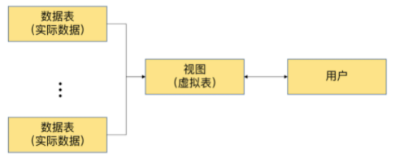

同时，MySQL可以根据权限将用户对数据的访问限制在某些视图上**，用户不需要查询数据表，可以直接通过视图获取数据表中的信息**。这在一定程度上保障了数据表中数据的安全性。

4. **适应灵活多变的需求**

当业务系统的需求发生变化后，如果需要改动数据表的结构，则工作量相对较大，可以使用视图来减少改动的工作量。这种方式在实际工作中使用得比较多。

5. **能够分解复杂的查询逻辑**

数据库中如果存在复杂的查询逻辑，则可以将问题进行分解，创建多个视图获取数据，再将创建的多个视图结合起来，完成复杂的查询逻辑。

#### 7.2 视图不足

如果我们在实际数据表的基础上创建了视图，那么，**如果实际数据表的结构变更了，我们就需要及时对相关的视图进行相应的维护**。特别是嵌套的视图（就是在视图的基础上创建视图），维护会变得比较复杂，`可读性不好`，容易变成系统的潜在隐患。因为创建视图的 SQL 查询可能会对字段重命名，也可能包含复杂的逻辑，这些都会增加维护的成本。

实际项目中，如果视图过多，会导致数据库维护成本的问题。

所以，在创建视图的时候，你要结合实际项目需求，综合考虑视图的优点和不足，这样才能正确使用视图，使系统整体达到最优。

------

## 十四、存储过程与函数

MySQL从5.0版本开始支持存储过程和函数。存储过程和函数能够将复杂的SQL逻辑封装在一起，应用程序无须关注存储过程和函数内部复杂的SQL逻辑，而只需要简单地调用存储过程和函数即可。

### 1 存储过程概述

#### 1.1 理解

**含义**：存储过程的英文是`Stored Procedure`。它的思想很简单，就是一组经过`预先编译`的SQL语句的封装。

执行过程：存储过程预先存储在 MySQL 服务器上，需要执行的时候，客户端只需要向服务器端发出调用存储过程的命令，服务器端就可以把预先存储好的这一系列 SQL 语句全部执行。

**好处**：

1. 简化操作，提高了sql语句的重用性，减少了开发程序员的压力
2. 减少操作过程中的失误，提高效率
3. 减少网络传输量（客户端不需要把所有的 SQL 语句通过网络发给服务器）
4. 减少了 SQL 语句暴露在网上的风险，也提高了数据查询的安全性

**和视图、函数的对比**：

它和视图有着同样的优点，清晰、安全，还可以减少网络传输量。不过它和视图不同，视图是`虚拟表`，通常不对底层数据表直接操作，而存储过程是程序化的SQL，可以`直接操作底层数据表`，相比于面向集合的操作方式，能够实现一些更复杂的数据处理。

一旦存储过程被创建出来，使用它就像使用函数一样简单，我们直接通过调用存储过程名即可。相较于函数，存储过程是`没有返回值`的。

#### 1.2 分类

存储过程的参数类型可以是IN、OUT和INOUT。根据这点分类如下：

1. 没有参数（无参数无返回）
2. 仅仅带 IN 类型（有参数无返回）
3. 仅仅带 OUT 类型（无参数有返回）
4. 既带 IN 又带 OUT（有参数有返回）
5. 带 INOUT（有参数有返回）

> 注意：IN、OUT、INOUT 都可以在一个存储过程中带多个。

### 2 创建存储过程

#### 2.1 语法分析

语法：

```mysql
CREATE PROCEDURE 存储过程名( IN | OUT | INOUT 参数名 参数类型, ...)
[characteristics ...]
BEGIN
	存储过程体
	
END
```

类似于Java中的方法：

```java
修饰符 返回类型 方法名(参数类型 参数名, ...){
	方法体;
}
```

说明：

1. 参数前面的符号的意思

   - `IN` ：当前参数为输入参数，也就是表示入参；

     存储过程只是读取这个参数的值。如果没有定义参数种类，默认就是`IN`，表示输入参数。

   - `OUT` ：当前参数为输出参数，也就是表示出参；

     执行完成之后，调用这个存储过程的客户端或者应用程序就可以读取这个参数返回的值了。

   - `INOUT` ：当前参数既可以为输入参数，也可以为输出参数。

2. 形参类型可以是 MySQL 数据库中的任意类型。

3. `characteristics`表示创建存储过程时指定的对存储过程的约束条件，其取值信息如下：

   ```mysql
   LANGUAGE SQL
   | [NOT] DETERMINISTIC
   | { CONTAINS SQL | NO SQL | READS SQL DATA | MODIFIES SQL DATA }
   | SQL SECURITY { DEFINER | INVOKER }
   | COMMENT 'string'
   ```

   - `LANGUAGE SQL`：说明存储过程执行体是由SQL语句组成的，当前系统支持的语言为SQL。
   - `[NOT] DETERMINISTIC`：指明存储过程执行的结果是否确定。DETERMINISTIC表示结果是确定的。每次执行存储过程时，相同的输入会得到相同的输出。NOT DETERMINISTIC表示结果是不确定的，相同的输入可能得到不同的输出。如果没有指定任意一个值，默认为NOT DETERMINISTIC。
   - `{ CONTAINS SQL | NO SQL | READS SQL DATA | MODIFIES SQL DATA }`：指明子程序使用SQL语句的限制。
     - `CONTAINS SQL`表示当前存储过程的子程序包含SQL语句，但是并不包含读写数据的SQL语句；
     - `NO SQL`表示当前存储过程的子程序中不包含任何SQL语句；
     - `READS SQL DATA`表示当前存储过程的子程序中包含读数据的SQL语句；
     - `MODIFIES SQL DATA`表示当前存储过程的子程序中包含写数据的SQL语句。
     - 默认情况下，系统会指定为CONTAINS SQL。
   - `SQL SECURITY { DEFINER | INVOKER }`：执行当前存储过程的权限，即指明哪些用户能够执行当前存储过程。
     - `DEFINER` 表示只有当前存储过程的创建者或者定义者才能执行当前存储过程；
     - `INVOKER` 表示拥有当前存储过程的访问权限的用户能够执行当前存储过程。
     - 如果没有设置相关的值，则MySQL默认指定值为DEFINER。
   - `COMMENT 'string'`：注释信息，可以用来描述存储过程。

4. 存储过程体中可以有多条 SQL 语句，如果仅仅一条SQL 语句，则可以省略 BEGIN 和 END

   编写存储过程并不是一件简单的事情，可能存储过程中需要复杂的 SQL 语句。

   1. `BEGIN…END`：BEGIN…END 中间包含了多个语句，每个语句都以（;）号为结束符。
   2. `DECLARE`：DECLARE 用来声明变量，使用的位置在于 BEGIN…END 语句中间，而且需要在其他语句使用之前进行变量的声明。
   3. `SET`：赋值语句，用于对变量进行赋值。
   4. `SELECT… INTO`：把从数据表中查询的结果存放到变量中，也就是为变量赋值。

5. 需要设置新的结束标记

   ```mysql
   DELIMITER 新的结束标记
   ```

   因为MySQL默认的语句结束符号为分号‘;’。为了避免与存储过程中SQL语句结束符相冲突，需要使用`DELIMITER`改变存储过程的结束符。

   比如：“`DELIMITER //`”语句的作用是将MySQL的结束符设置为//，并以“`END //`”结束存储过程。存储过程定义完毕之后再使用“`DELIMITER ;`”恢复默认结束符。DELIMITER也可以指定其他符号作为结束符。

   当使用DELIMITER命令时，应该避免使用反斜杠（‘\’）字符，因为反斜线是MySQL的转义字符。

   ```mysql
   DELIMITER $
   
   CREATE PROCEDURE 存储过程名(IN | OUT | INOUT 参数名 参数类型, ...)
   [characteristics ...]
   BEGIN
   	sql语句1;
   	sql语句2;
   	
   END $
   ```

#### 2.2 代码举例

举例1：**创建存储过程select_all_data()，查看 emps 表的所有数据**

```mysql
DELIMITER $

CREATE PROCEDURE select_all_data()
BEGIN
	SELECT * FROM emps;
END $

DELIMITER ;
```

举例2：**创建存储过程avg_employee_salary()，返回所有员工的平均工资。**

```mysql
DELIMITER //

CREATE PROCEDURE avg_employee_salary ()
BEGIN
	SELECT AVG(salary) AS avg_salary FROM emps;
END //

DELIMITER ;
```

举例3：**创建存储过程show_max_salary()，用来查看“emps”表的最高薪资值。**

```mysql
DELIMITER //

CREATE PROCEDURE show_max_salary()
LANGUAGE SQL
NOT DETERMINISTIC
CONTAINS SQL
SQL SECURITY DEFINER
COMMENT '查看最高薪资'
BEGIN
	SELECT MAX(salary) FROM emps;
END //

DELIMITER ;
```

举例4：**创建存储过程show_min_salary()，查看“emps”表的最低薪资值。并将最低薪资通过OUT参数“ms”输出**

```mysql
DELIMITER //

CREATE PROCEDURE show_min_salary(OUT ms DOUBLE)
BEGIN
	SELECT MIN(salary) INTO ms 
	FROM emps;
END //

DELIMITER ;
```

举例5：**创建存储过程show_someone_salary()，查看“emps”表的某个员工的薪资，并用IN参数empname输入员工姓名。**

```mysql
DELIMITER //

CREATE PROCEDURE show_someone_salary(IN empname VARCHAR(20))
BEGIN
	SELECT salary FROM emps WHERE ename = empname;
END //

DELIMITER ;
```

举例6：**创建存储过程show_someone_salary2()，查看“emps”表的某个员工的薪资，并用IN参数empname输入员工姓名，用OUT参数empsalary输出员工薪资。**

```mysql
DELIMITER //

CREATE PROCEDURE show_someone_salary2(IN empname VARCHAR(20), OUT empsalary DOUBLE)
BEGIN
	SELECT salary INTO empsalary
	FROM emps WHERE ename = empname;
END //

DELIMITER ;
```

举例7：**创建存储过程show_mgr_name()，查询某个员工领导的姓名，并用INOUT参数“empname”输入员工姓名，输出领导的姓名。**

```mysql
DELIMITER //

CREATE PROCEDURE show_mgr_name(INOUT empname VARCHAR(20))
BEGIN
	SELECT ename INTO empname FROM emps
	WHERE eid = (SELECT MID FROM emps WHERE ename=empname);
END //

DELIMITER ;
```

### 3 调用存储过程

#### 3.1 调用格式

存储过程有多种调用方法。存储过程必须使用CALL语句调用，并且存储过程和数据库相关，如果要执行其他数据库中的存储过程，需要指定数据库名称，例如CALL dbname.procname。

```mysql
CALL 存储过程名(实参列表)
```

**格式：**

1. 调用in模式的参数：

   ```mysql
   CALL sp1('值');
   ```

2. 调用out模式的参数：

   ```mysql
   SET @name;
   CALL sp1(@name);
   SELECT @name;
   ```

3. 调用inout模式的参数：

   ```mysql
   SET @name='值';
   CALL sp1(@name);
   SELECT @name;
   ```

#### 3.2 代码举例

**举例1：**

```mysql
DELIMITER //

CREATE PROCEDURE CountProc(IN sid INT, OUT num INT)
BEGIN
	SELECT COUNT(*) INTO num
	FROM fruits WHERE s_id = sid;
END //

DELIMITER ;
```

调用存储过程：

```mysql
mysql> CALL CountProc (101, @num);
Query OK, 1 row affected (0.00 sec)
```

查看返回结果：

```mysql
mysql> SELECT @num;
```

该存储过程返回了指定`s_id=101`的水果商提供的水果种类，返回值存储在num变量中，使用SELECT查看，返回结果为3。

**举例2**：创建存储过程，实现累加运算，计算 1+2+…+n 等于多少。具体的代码如下：

```mysql
DELIMITER //

CREATE PROCEDURE `add_num`(IN n INT)
BEGIN
	DECLARE i INT;
	DECLARE sum INT;
	SET i = 1;
	SET sum = 0;
	WHILE i <= n DO
		SET sum = sum + i;
		SET i = i +1;
	END WHILE;
	SELECT sum;
END //
DELIMITER ;
```

如果你用的是 Navicat 工具，那么在编写存储过程的时候，Navicat 会自动设置 DELIMITER 为其他符号，我们不需要再进行 DELIMITER 的操作。

直接使用`CALL add_num(50);`即可。这里我传入的参数为 50，也就是统计 1+2+…+50 的积累之和。

#### 3.3 如何调试

在 MySQL 中，存储过程不像普通的编程语言（比如VC++、Java等）那样有专门的集成开发环境。因此，你可以通过 SELECT 语句，把程序执行的中间结果查询出来，来调试一个 SQL 语句的正确性。调试成功之后，把 SELECT 语句后移到下一个 SQL 语句之后，再调试下一个 SQL 语句。这样`逐步推进`，就可以完成对存储过程中所有操作的调试了。当然，你也可以把存储过程中的 SQL 语句复制出来，逐段单独
调试。

### 4 存储函数的使用

前面学习了很多函数，使用这些函数可以对数据进行的各种处理操作，极大地提高用户对数据库的管理效率。MySQL支持自定义函数，定义好之后，调用方式与调用MySQL预定义的系统函数一样。

#### 4.1 语法分析

学过的函数：LENGTH、SUBSTR、CONCAT等

语法格式：

```mysql
CREATE FUNCTION 函数名(参数名 参数类型, ...)
RETURNS 返回值类型
[characteristics ...]
BEGIN
	函数体 #函数体中肯定有 RETURN 语句
END
```

说明：

1. 参数列表：指定参数为IN、OUT或INOUT只对PROCEDURE是合法的，FUNCTION中总是默认为IN参数。

2. `RETURNS type`语句表示函数返回数据的类型；

   RETURNS子句只能对FUNCTION做指定，对函数而言这是`强制`的。它用来指定函数的返回类型，而且函数体必须包含一个`RETURN value`语句。

3. characteristic 创建函数时指定的对函数的约束。取值与创建存储过程时相同，这里不再赘述。

4. 函数体也可以用`BEGIN…END`来表示SQL代码的开始和结束。如果函数体只有一条语句，也可以省略`BEGIN…END`。

#### 4.2 调用存储函数

在MySQL中，存储函数的使用方法与MySQL内部函数的使用方法是一样的。换言之，用户自己定义的存储函数与MySQL内部函数是一个性质的。区别在于，存储函数是`用户自己定义`的，而内部函数是MySQL的`开发者定义`的。

```mysql
SELECT 函数名(实参列表)
```

#### 4.3 代码举例

**举例1：**创建存储函数，名称为email_by_name()，参数定义为空，该函数查询Abel的email，并返回，数据类型为字符串型。

```mysql
DELIMITER //

CREATE FUNCTION email_by_name()
RETURNS VARCHAR(25)
DETERMINISTIC
CONTAINS SQL
BEGIN
	RETURN (SELECT email FROM employees WHERE last_name = 'Abel');
END //

DELIMITER ;
```

调用：

```mysql
SELECT email_by_name();
```


**举例2**：**创建存储函数，名称为email_by_id()，参数传入emp_id，该函数查询emp_id的email，并返回，数据类型为字符串型。**

```mysql
DELIMITER //

CREATE FUNCTION email_by_id(emp_id INT)
RETURNS VARCHAR(25)
DETERMINISTIC
CONTAINS SQL
BEGIN
	RETURN (SELECT email FROM employees WHERE employee_id = emp_id);
END //

DELIMITER ;
```

调用：

```mysql
SET @emp_id = 102;
SELECT email_by_id(102);
```

**举例3**：创建存储函数count_by_id()，参数传入dept_id，该函数查询dept_id部门的员工人数，并返回，数据类型为整型。

```mysql
DELIMITER //

CREATE FUNCTION count_by_id(dept_id INT)
RETURNS INT
LANGUAGE SQL
NOT DETERMINISTIC
READS SQL DATA
SQL SECURITY DEFINER
COMMENT '查询部门平均工资'
BEGIN
	RETURN (SELECT COUNT(*) FROM employees WHERE department_id = dept_id);
END //
DELIMITER ;
```

调用：

```
SET @dept_id = 50;
SELECT count_by_id(@dept_id);
```

> **注意**：
>
> 若在创建存储函数中报错“`you might want to use the less safe
> log_bin_trust_function_creators variable`”，有两种处理方法：
>
> - 方式1：加上必要的函数特性“[NOT] DETERMINISTIC”和“{CONTAINS SQL | NO SQL | READS SQL DATA |
>   MODIFIES SQL DATA}”
>
> - 方式2：
>
>   ```mysql
>   mysql> SET GLOBAL log_bin_trust_function_creators = 1;
>   ```

#### 4.4 对比存储函数和存储过程

|          | 关键字    | 调用语法        | 返回值            | 应用场景                         |
| -------- | --------- | --------------- | ----------------- | -------------------------------- |
| 存储过程 | PROCEDURE | CALL 存储过程() | 理解为有0个或多个 | 一般用于更新                     |
| 存储函数 | FUNCTION  | SELECT 函数()   | 只能是一个        | 一般用于查询结果为一个值并返回时 |

此外，**存储函数可以放在查询语句中使用，存储过程不行**。反之，存储过程的功能更加强大，包括能够执行对表的操作（比如创建表，删除表等）和事务操作，这些功能是存储函数不具备的。

### 5 存储过程和函数的查看、修改、删除

#### 5.1 查看

创建完之后，怎么知道我们创建的存储过程、存储函数是否成功了呢？

MySQL存储了存储过程和函数的状态信息，用户可以使用SHOW STATUS语句或SHOW CREATE语句来查看，也可直接从系统的information_schema数据库中查询。这里介绍3种方法。

1. **使用SHOW CREATE语句查看存储过程和函数的创建信息**

   基本语法结构如下：

   ```mysql
   SHOW CREATE {PROCEDURE | FUNCTION} 存储过程名或函数名
   ```

   举例：

   ```mysql
   SHOW CREATE FUNCTION test_db.CountProc\G
   ```

2. **使用SHOW STATUS语句查看存储过程和函数的状态信息**

   基本语法结构如下：

   ```mysql
   SHOW {PROCEDURE | FUNCTION} STATUS [LIKE 'pattern']
   ```

   这个语句返回子程序的特征，如数据库、名字、类型、创建者及创建和修改日期。

   `[LIKE 'pattern']`：匹配存储过程或函数的名称，可以省略。当省略不写时，会列出MySQL数据库中存在的所有存储过程或函数的信息。 

   举例：SHOW STATUS语句示例，代码如下：

   ```mysql
   mysql> SHOW PROCEDURE STATUS LIKE 'SELECT%' \G
   *************************** 1. row ***************************
   			Db: test_db
   			Name: SelectAllData
   			Type: PROCEDURE
   			Definer: root@localhost
   			Modified: 2021-10-16 15:55:07
   			Created: 2021-10-16 15:55:07
   			Security_type: DEFINER
   			Comment:
   			character_set_client: utf8mb4
   			collation_connection: utf8mb4_general_ci
   			Database Collation: utf8mb4_general_ci
   1 row in set (0.00 sec)
   ```

3. **从information_schema.Routines表中查看存储过程和函数的信息**

   MySQL中存储过程和函数的信息存储在information_schema数据库下的Routines表中。可以通过查询该表的记录来查询存储过程和函数的信息。其基本语法形式如下：

   ```mysql
   SELECT * FROM information_schema.Routines
   WHERE ROUTINE_NAME='存储过程或函数的名' [AND ROUTINE_TYPE = {'PROCEDURE | FUNCTION'}];
   ```

   说明：如果在MySQL数据库中存在存储过程和函数名称相同的情况，最好指定ROUTINE_TYPE查询条件来指明查询的是存储过程还是函数。

   举例：从Routines表中查询名称为CountProc的存储函数的信息，代码如下：

   ```mysql
   SELECT * FROM information_schema.Routines
   WHERE ROUTINE_NAME='count_by_id' AND ROUTINE_TYPE = 'FUNCTION' \G
   ```


#### 5.2 修改

修改存储过程或函数，不影响存储过程或函数功能，只是修改相关特性。使用ALTER语句实现。

```mysql
ALTER {PROCEDURE | FUNCTION} 存储过程或函数的名 [characteristic ...]
```

其中，characteristic指定存储过程或函数的特性，其取值信息与创建存储过程、函数时的取值信息略有不同。

```mysql
{ CONTAINS SQL | NO SQL | READS SQL DATA | MODIFIES SQL DATA }
| SQL SECURITY { DEFINER | INVOKER }
| COMMENT 'string'
```

- `CONTAINS SQL`，表示子程序包含SQL语句，但不包含读或写数据的语句。
- `NO SQL`，表示子程序中不包含SQL语句。
- `READS SQL DATA`，表示子程序中包含读数据的语句。
- `MODIFIES SQL DATA`，表示子程序中包含写数据的语句。
- `SQL SECURITY { DEFINER | INVOKER }`，指明谁有权限来执行。
  - `DEFINER`，表示只有定义者自己才能够执行。
  - `INVOKER`，表示调用者可以执行。
- `COMMENT 'string'`，表示注释信息。

> 修改存储过程使用ALTER PROCEDURE语句，修改存储函数使用ALTER FUNCTION语句。但是，这两个语句的结构是一样的，语句中的所有参数也是一样的。

**举例1**：

**修改存储过程CountProc的定义。将读写权限改为MODIFIES SQL DATA，并指明调用者可以执行，**代码如下：

```mysql
ALTER PROCEDURE CountProc
MODIFIES SQL DATA
SQL SECURITY INVOKER ;
```

**查询修改后的信息**：

```mysql
SELECT specific_name, sql_data_access, security_type
FROM information_schema.`ROUTINES`
WHERE routine_name = 'CountProc' AND routine_type = 'PROCEDURE';
```

结果显示，存储过程修改成功。从查询的结果可以看出，访问数据的权限（SQL_DATA_ ACCESS）已经变成MODIFIES SQL DATA，安全类型（SECURITY_TYPE）已经变成INVOKER。


**举例2：**

修改存储函数CountProc的定义。将读写权限改为READS SQL DATA，并加上注释信息“FIND NAME”，代码如下：

```mysql
ALTER FUNCTION CountProc
READS SQL DATA
COMMENT 'FIND NAME' ;
```

存储函数修改成功。从查询的结果可以看出，访问数据的权限（SQL_DATA_ACCESS）已经变成READS SQL DATA，函数注释（ROUTINE_COMMENT）已经变成FIND NAME。


#### 5.3 删除

删除存储过程和函数，可以使用DROP语句，其语法结构如下：

```mysql
DROP {PROCEDURE | FUNCTION} [IF EXISTS] 存储过程或函数的名
```

`IF EXISTS`：如果程序或函数不存储，它可以防止发生错误，产生一个用SHOW WARNINGS查看的警告。

举例：

```mysql
DROP PROCEDURE IF EXISTS CountProc;

DROP FUNCTION CountProc;
```


### 6 关于存储过程使用的争议

尽管存储过程有诸多优点，但是对于存储过程的使用，**一直都存在着很多争议**，比如有些公司对于大型项目要求使用存储过程，而有些公司在手册中明确禁止使用存储过程，为什么这些公司对存储过程的使用需求差别这么大呢？

#### 6.1 优点

1. **存储过程可以一次编译多次使用**。存储过程只在创建时进行编译，之后的使用都不需要重新编译，这就提升了 SQL 的执行效率。
2. **可以减少开发工作量**。将代码`封装`成模块，实际上是编程的核心思想之一，这样可以把复杂的问题拆解成不同的模块，然后模块之间可以`重复使用`，在减少开发工作量的同时，还能保证代码的结构清晰。
3. **存储过程的安全性强**。我们在设定存储过程的时候可以`设置对用户的使用权限`，这样就和视图一样具有较强的安全性。
4. **可以减少网络传输量**。因为代码封装到存储过程中，每次使用只需要调用存储过程即可，这样就减少了网络传输量。
5. **良好的封装性**。在进行相对复杂的数据库操作时，原本需要使用一条一条的 SQL 语句，可能要连接多次数据库才能完成的操作，现在变成了一次存储过程，只需要`连接一次即可`。

#### 6.2 缺点

基于上面这些优点，不少大公司都要求大型项目使用存储过程，比如微软、IBM 等公司。但是国内的阿里并不推荐开发人员使用存储过程，这是为什么呢？

> 阿里开发规范
>
> 【强制】禁止使用存储过程，存储过程难以调试和扩展，更没有移植性。

存储过程虽然有诸如上面的好处，但缺点也是很明显的。

1. **可移植性差**。存储过程不能跨数据库移植，比如在 MySQL、Oracle 和 SQL Server 里编写的存储过程，在换成其他数据库时都需要重新编写。
2. **调试困难**。只有少数 DBMS 支持存储过程的调试。对于复杂的存储过程来说，开发和维护都不容易。虽然也有一些第三方工具可以对存储过程进行调试，但要收费。
3. **存储过程的版本管理很困难**。比如数据表索引发生变化了，可能会导致存储过程失效。我们在开发软件的时候往往需要进行版本管理，但是存储过程本身没有版本控制，版本迭代更新的时候很麻烦。
4. **它不适合高并发的场景**。高并发的场景需要减少数据库的压力，有时数据库会采用分库分表的方式，而且对可扩展性要求很高，在这种情况下，存储过程会变得难以维护，`增加数据库的压力`，显然就不适用了。

> 小结：存储过程既方便，又有局限性。尽管不同的公司对存储过程的态度不一，但是对于我们开发人员来说，不论怎样，掌握存储过程都是必备的技能之一。

------

## 十五、变量、流程控制与游标

### 1 变量

在MySQL数据库的存储过程和函数中，可以使用变量来存储查询或计算的中间结果数据，或者输出最终的结果数据。

在 MySQL 数据库中，变量分为`系统变量`以及`用户自定义变量`。

#### 1.1 系统变量

##### 1.1.1 系统变量分类

变量由系统定义，不是用户定义，属于`服务器`层面。启动MySQL服务，生成MySQL服务实例期间，MySQL将为MySQL服务器内存中的系统变量赋值，这些系统变量定义了当前MySQL服务实例的属性、特征。这些系统变量的值要么是`编译MySQL时参数`的默认值，要么是`配置文件`（例如my.ini等）中的参数值。大家可以通过网址 https://dev.mysql.com/doc/refman/8.0/en/server-system-variables.html 查看MySQL文档的系统变量。


系统变量分为全局系统变量（需要添加`global`关键字）以及会话系统变量（需要添加`session`关键字），有时也把全局系统变量简称为全局变量，有时也把会话系统变量称为local变量。**如果不写，默认会话级别。**静态变量（在 MySQL 服务实例运行期间它们的值不能使用 set 动态修改）属于特殊的全局系统变量。


每一个MySQL客户机成功连接MySQL服务器后，都会产生与之对应的会话。会话期间，MySQL服务实例会在MySQL服务器内存中生成与该会话对应的会话系统变量，这些会话系统变量的初始值是全局系统变量值的复制。如下图：

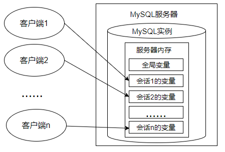

- 全局系统变量针对于所有会话（连接）有效，但`不能跨重启`
- 会话系统变量仅针对于当前会话（连接）有效。会话期间，当前会话对某个会话系统变量值的修改，不会影响其他会话同一个会话系统变量的值。
- 会话1对某个全局系统变量值的修改会导致会话2中同一个全局系统变量值的修改。

在MySQL中有些系统变量只能是全局的，例如 max_connections 用于限制服务器的最大连接数；有些系统变量作用域既可以是全局又可以是会话，例如 character_set_client 用于设置客户端的字符集；有些系统变量的作用域只能是当前会话，例如 pseudo_thread_id 用于标记当前会话的 MySQL 连接 ID。

##### 1.1.2 查看系统变量

- **查看所有或部分系统变量**

  ```mysql
  #查看所有全局变量
  SHOW GLOBAL VARIABLES;
  
  #查看所有会话变量
  SHOW SESSION VARIABLES;
  或
  SHOW VARIABLES;
  ```

  ```mysql
  #查看满足条件的部分系统变量。
  SHOW GLOBAL VARIABLES LIKE '%标识符%';
  
  #查看满足条件的部分会话变量
  SHOW SESSION VARIABLES LIKE '%标识符%';
  ```

  举例：

  ```mysql
  SHOW GLOBAL VARIABLES LIKE 'admin_%';
  ```

- **查看指定系统变量**

  作为 MySQL 编码规范，MySQL 中的系统变量以`两个“@”`开头，其中“@@global”仅用于标记全局系统变量，“@@session”仅用于标记会话系统变量。“@@”首先标记会话系统变量，如果会话系统变量不存在，则标记全局系统变量。

  ```mysql
  #查看指定的系统变量的值
  SELECT @@global.变量名;
  
  #查看指定的会话变量的值
  SELECT @@session.变量名;
  #或者
  SELECT @@变量名;
  ```

- **修改系统变量的值**

  有些时候，数据库管理员需要修改系统变量的默认值，以便修改当前会话或者MySQL服务实例的属性、特征。具体方法：

  方式1：修改MySQL`配置文件`，继而修改MySQL系统变量的值（该方法需要重启MySQL服务）

  方式2：在MySQL服务运行期间，使用“set”命令重新设置系统变量的值

  ```mysql
  #为某个系统变量赋值
  #方式1：
  SET @@global.变量名=变量值;
  #方式2：
  SET GLOBAL 变量名=变量值;
  
  #为某个会话变量赋值
  #方式1：
  SET @@session.变量名=变量值;
  #方式2：
  SET SESSION 变量名=变量值;
  ```

  举例：

  ```mysql
  SELECT @@global.autocommit;
  SET GLOBAL autocommit=0;
  
  SELECT @@session.tx_isolation;
  SET @@session.tx_isolation='read-uncommitted';
  
  SET GLOBAL max_connections = 1000;
  SELECT @@global.max_connections;
  ```

#### 1.2 用户变量

##### 1.2.1 用户变量分类

用户变量是用户自己定义的，作为 MySQL 编码规范，MySQL 中的用户变量以`一个“@”`开头。根据作用范围不同，又分为`会话用户变量`和`局部变量`。

- 会话用户变量：作用域和会话变量一样，只对`当前连接`会话有效。
- 局部变量：只在 BEGIN 和 END 语句块中有效。局部变量只能在`存储过程和函数`中使用。

##### 1.2.2 会话用户变量

- 变量的定义

```mysql
#方式1：“=”或“:=”
SET @用户变量 = 值;
SET @用户变量 := 值;

#方式2：“:=” 或 INTO关键字
SELECT @用户变量 := 表达式 [FROM 等子句];
SELECT 表达式 INTO @用户变量 [FROM 等子句];
```

- 查看用户变量的值 （查看、比较、运算等）

```mysql
SELECT @用户变量;
```

- 举例

```mysql
SET @a = 1;
SELECT @a;

SELECT @num := COUNT(*) FROM employees;
SELECT @num;

SELECT AVG(salary) INTO @avgsalary FROM employees;
SELECT @avgsalary;

SELECT @big; #查看某个未声明的变量时，将得到NULL值
```

##### 1.2.3 局部变量

定义：可以使用`DECLARE`语句定义一个局部变量

作用域：仅仅在定义它的 BEGIN ... END 中有效

位置：只能放在 BEGIN ... END 中，而且只能放在第一句

```mysql
BEGIN
	#声明局部变量
	DECLARE 变量名1 变量数据类型 [DEFAULT 变量默认值];
	DECLARE 变量名2,变量名3,... 变量数据类型 [DEFAULT 变量默认值];
	
	#为局部变量赋值
	SET 变量名1 = 值;
	SELECT 值 INTO 变量名2 [FROM 子句];
	
	#查看局部变量的值
	SELECT 变量1,变量2,变量3;
END
```

1. **定义变量**

```mysql
DECLARE 变量名 数据类型 [default 值]; # 如果没有DEFAULT子句，初始值为NULL

# 举例
DECLARE myparam INT DEFAULT 100;
```

2. **变量赋值**

方式1：一般用于赋简单的值

```mysql
SET 变量名 = 值;
SET 变量名 := 值;
```

方式2：一般用于赋表中的字段值

```mysql
SELECT 字段名或表达式 INTO 变量名 FROM 表;
```

3. **使用变量**（查看、比较、运算等）

```mysql
SELECT 局部变量名;
```

举例1：声明局部变量，并分别赋值为employees表中employee_id为102的last_name和salary

```mysql
DELIMITER //

CREATE PROCEDURE set_value()
BEGIN
	DECLARE emp_name VARCHAR(25);
	DECLARE sal DOUBLE(10,2);
	
	SELECT last_name,salary INTO emp_name,sal
	FROM employees
	WHERE employee_id = 102;
	
	SELECT emp_name,sal;
END //

DELIMITER ;
```

举例2：声明两个变量，求和并打印 （分别使用会话用户变量、局部变量的方式实现）

```mysql
#方式1：使用用户变量
SET @m=1;
SET @n=1;
SET @sum=@m+@n;

SELECT @sum;
```

```mysql
#方式2：使用局部变量
DELIMITER //

CREATE PROCEDURE add_value()
BEGIN
	#局部变量
	DECLARE m INT DEFAULT 1;
	DECLARE n INT DEFAULT 3;
	DECLARE `sum` INT;
	
	SET `sum` = m+n;
	SELECT `sum`;
END //

DELIMITER ;
```

举例3：创建存储过程“different_salary”查询某员工和他领导的薪资差距，并用IN参数emp_id接收员工id，用OUT参数dif_salary输出薪资差距结果。

```mysql
DELIMITER //

CREATE PROCEDURE different_salary(IN emp_id INT, OUT dif_salary = UBLE)
BEGIN
	# 局部变量
	DECLARE emp_sal, mgr_sal DOUBLE DEFAULT 0.0;
	DECLARE mgr_id;
	
	SELECT salary INTO emp_sal FROM employees WHERE employee_id = emp_id;
	SELECT manager_id INTO mgr_id FROM employees WHERE employee_id = emp_id;
	SELECT salary INTO mgr_sal;FROM employees WHERE employee_id = mgr_id;
	
	SET dif_salary = mgr_sal - emp_sal;
END //

DELIMITER
```

```mysql
#调用
SET @emp_id = 102;
CALL different_salary(@emp_id, @diff_sal);

#查看
SELECT @diff_sal;
```

##### 1.2.4 对比会话用户变量与局部变量

|              | 作用域                | 定义位置            | 语法                        |
| ------------ | --------------------- | ------------------- | --------------------------- |
| 会话用户变量 | 当前会话              | 会话的任何地方      | 加@符号，不用指定类型       |
| 局部变量     | 定义它的BEGIN...END中 | BEGIN END的第一句话 | 一般不用加@吗，需要指定类型 |

### 2 定义条件与处理程序

`定义条件`是事先定义程序执行过程中可能遇到的问题，`处理程序`定义了在遇到问题时应当采取的处理方式，并且保证存储过程或函数在遇到警告或错误时能继续执行。这样可以增强存储程序处理问题的能力，避免程序异常停止运行。

说明：定义条件和处理程序在存储过程、存储函数中都是支持的。

#### 2.1 案例分析

案例分析：创建一个名称为“UpdateDataNoCondition”的存储过程。代码如下：

```mysql
DELIMITER //

CREATE PROCEDURE UpdateDataNoCondition()
	BEGIN
		SET @x = 1;
		UPDATE employees SET email = NULL WHERE last_name = 'Abel';
		SET @x = 2;
		UPDATE employees SET email = 'aabbel' WHERE last_name = 'Abel';
		SET @x = 3;
	END //
	
DELIMITER ;
```

调用存储过程：

```mysql
mysql> CALL UpdateDataNoCondition();
ERROR 1048 (23000): Column 'email' cannot be null
mysql> SELECT @x;
+------+
| @x   |
+------+
| 1    |
+------+
1 row in set (0.00 sec)

```

可以看到，此时@x变量的值为1。结合创建存储过程的SQL语句代码可以得出：在存储过程中未定义条件和处理程序，且当存储过程中执行的SQL语句报错时，MySQL数据库会抛出错误，并退出当前SQL逻辑，不再向下继续执行。

#### 2.2 定义条件

定义条件就是给MySQL中的错误码命名，这有助于存储的程序代码更清晰。它将一个`错误名字`和`指定的错误条件`关联起来。这个名字可以随后被用在定义处理程序的`DECLARE HANDLER`语句中。

定义条件使用DECLARE语句，语法格式如下：

```mysql
DECLARE 错误名称 CONDITION FOR 错误码（或错误条件）;
```

错误码的说明：

- `MySQL_error_code` 和 `sqlstate_value` 都可以表示MySQL的错误。
  - MySQL_error_code是数值类型错误代码。
  - sqlstate_value是长度为5的字符串类型错误代码。
- 例如，在ERROR 1418 (HY000)中，1418是MySQL_error_code，'HY000'是sqlstate_value。
- 例如，在ERROR 1142（42000）中，1142是MySQL_error_code，'42000'是sqlstate_value。

**举例1：定义“Field_Not_Be_NULL”错误名与MySQL中违反非空约束的错误类型是“ERROR 1048 (23000)”对应。**

```mysql
#使用MySQL_error_code
DECLARE Field_Not_Be_NULL CONDITION FOR 1048;

#使用sqlstate_value
DECLARE Field_Not_Be_NULL CONDITION FOR SQLSTATE '23000';
```

**举例2：定义"ERROR 1148(42000)"错误，名称为command_not_allowed。**

```mysql
#使用MySQL_error_code
DECLARE command_not_allowed CONDITION FOR 1148;

#使用sqlstate_value
DECLARE command_not_allowed CONDITION FOR SQLSTATE '42000';
```

#### 2.3 定义处理程序

可以为SQL执行过程中发生的某种类型的错误定义特殊的处理程序。定义处理程序时，使用DECLARE语句的语法如下：

```mysql
DECLARE 处理方式 HANDLER FOR 错误类型 处理语句
```

- **处理方式**：处理方式有3个取值：CONTINUE、EXIT、UNDO。
  - `CONTINUE` ：表示遇到错误不处理，继续执行。
  - `EXIT` ：表示遇到错误马上退出。
  - `UNDO` ：表示遇到错误后撤回之前的操作。MySQL中暂时不支持这样的操作。
- **错误类型**（即条件）可以有如下取值：
  - `SQLSTATE '字符串错误码'` ：表示长度为5的sqlstate_value类型的错误代码；
  - `MySQL_error_code` ：匹配数值类型错误代码；
  - `错误名称` ：表示DECLARE ... CONDITION定义的错误条件名称。
  - `SQLWARNING` ：匹配所有以01开头的SQLSTATE错误代码；
  - `NOT FOUND` ：匹配所有以02开头的SQLSTATE错误代码；
  - `SQLEXCEPTION` ：匹配所有没有被SQLWARNING或NOT FOUND捕获的SQLSTATE错误代码；
- **处理语句**：如果出现上述条件之一，则采用对应的处理方式，并执行指定的处理语句。语句可以是像“`SET 变量 = 值`”这样的简单语句，也可以是使用`BEGIN ... END`编写的复合语句。

定义处理程序的几种方式，代码如下：

```mysql
#方法1：捕获sqlstate_value
DECLARE CONTINUE HANDLER FOR SQLSTATE '42S02' SET @info = 'NO_SUCH_TABLE';

#方法2：捕获mysql_error_value
DECLARE CONTINUE HANDLER FOR 1146 SET @info = 'NO_SUCH_TABLE';

#方法3：先定义条件，再调用
DECLARE no_such_table CONDITION FOR 1146;
DECLARE CONTINUE HANDLER FOR NO_SUCH_TABLE SET @info = 'NO_SUCH_TABLE';

#方法4：使用SQLWARNING
DECLARE EXIT HANDLER FOR SQLWARNING SET @info = 'ERROR';

#方法5：使用NOT FOUND
DECLARE EXIT HANDLER FOR NOT FOUND SET @info = 'NO_SUCH_TABLE';

#方法6：使用SQLEXCEPTION
DECLARE EXIT HANDLER FOR SQLEXCEPTION SET @info = 'ERROR';
```

#### 2.4 案例解决

在存储过程中，定义处理程序，捕获sqlstate_value值，当遇到MySQL_error_code值为1048时，执行CONTINUE操作，并且将@proc_value的值设置为-1。

```mysql
DELIMITER //

CREATE PROCEDURE UpdateDataNoCondition()
BEGIN
	#定义处理程序
	DECLARE CONTINUE HANDLER FOR 1048 SET @proc_value = -1;
	SET @x = 1;
	UPDATE employees SET email = NULL WHERE last_name = 'Abel';
	SET @x = 2;
	UPDATE employees SET email = 'aabbel' WHERE last_name = 'Abel';
	SET @x = 3;
END //

DELIMITER ;
```

调用存储过程：

```mysql
mysql> CALL UpdateDataWithCondition();
Query OK, 0 rows affected (0.01 sec)

mysql> SELECT @x, @proc_value;
+------+-----------------+
| @x   | @proc_value     |
+------+-----------------+
| 3    | -1              |
+------+-----------------+
1 row in set (0.00 sec)
```


**举例**：

创建一个名称为“InsertDataWithCondition”的存储过程，代码如下。

在存储过程中，定义处理程序，捕获sqlstate_value值，当遇到sqlstate_value值为23000时，执行EXIT操作，并且将@proc_value的值设置为-1。

```mysql
#准备工作
CREATE TABLE departments
AS
SELECT * FROM atguigudb.`departments`;

ALTER TABLE departments ADD CONSTRAINT uk_dept_name UNIQUE(department_id);
```

```mysql
DELIMITER //

CREATE PROCEDURE InsertDataWithCondition()
BEGIN
	DECLARE duplicate_entry CONDITION FOR SQLSTATE '23000' ;
	DECLARE EXIT HANDLER FOR duplicate_entry SET @proc_value = -1;
	
	SET @x = 1;
	INSERT INTO departments(department_name) VALUES('测试');
	SET @x = 2;
	INSERT INTO departments(department_name) VALUES('测试');
	SET @x = 3;
END //

DELIMITER ;
```

调用存储过程：

```mysql
mysql> CALL InsertDataWithCondition();
Query OK, 0 rows affected (0.01 sec)

mysql> SELECT @x, @proc_value;
+------+------------------+
| @x   | @proc_value      |
+------+------------------+
| 2    | -1               |
+------+------------------+
1 row in set (0.00 sec)
```


### 3 流程控制

解决复杂问题不可能通过一个SQL语句完成，我们需要执行多个SQL操作。流程控制语句的作用就是控制存储过程中SQL语句的执行顺序，是我们完成复杂操作必不可少的一部分。只要是执行的程序，流程就分为三大类：

- `顺序结构`：程序从上往下依次执行
- `分支结构`：程序按条件进行选择执行，从两条或多条路径中选择一条执行
- `循环结构`：程序满足一定条件下，重复执行一组语句

针对于MySQL的流程控制语句主要有 3 类。注意：只能用于存储程序。

- `条件判断语句`：IF 语句和 CASE 语句
- `循环语句`：LOOP、WHILE 和 REPEAT 语句
- `跳转语句`：ITERATE 和 LEAVE 语句

#### 3.1 分支结构之 IF

- IF 语句的语法结构是：


```mysql
IF 表达式1 THEN 操作1
[ELSEIF 表达式2 THEN 操作2] ……
[ELSE 操作N]
END IF
```

根据表达式的结果为TRUE或FALSE执行相应的语句。这里“[]”中的内容是可选的。

- 特点：1 不同的表达式对应不同的操作; 2 使用在begin end中
- **举例1**：

```mysql
IF val IS NULL THEN 
	SELECT 'val is null';
ELSE 
	SELECT 'val is not null';
END IF;
```

- **举例2**：声明存储过程“update_salary_by_eid1”，定义IN参数emp_id，输入员工编号。判断该员工薪资如果低于8000元并且入职时间超过5年，就涨薪500元；否则就不变。

```mysql
DELIMITER //

CREATE PROCEDURE update_salary_by_eid1(IN emp_id INT)
BEGIN
	DECLARE sal DOUBLE;
	DECLARE hire_year DOUBLE;
	
	SELECT 
		salary, DATEDIFF(CURDATE(), hire_date)/365 INTO sal, hire_year
	FROM 
		employees 
	WHERE 
		employee_id = emp_id;
		
	IF sal < 8000 AND hire_year > 5 THEN
		UPDATE employees SET salary = salary + 500 WHERE employee_id = emp_id;
	END IF;
END //

DELIMITER ;
```

- **举例3**：声明存储过程“update_salary_by_eid2”，定义IN参数emp_id，输入员工编号。判断该员工薪资如果低于9000元并且入职时间超过5年，就涨薪500元；否则就涨薪100元。

```mysql
DELIMITER //

CREATE PROCEDURE update_salary_by_eid2(IN emp_id INT)
BEGIN
	DECLARE sal DOUBLE;
	DECLARE hire_year DOUBLE;
	
	SELECT 
		salary, DATEDIFF(CURDATE(), hire_date)/365 INTO sal, hire_year
	FROM 
		employees 
	WHERE 
		employee_id = emp_id;
		
	IF sal < 9000 AND hire_year > 5 
	THEN
		UPDATE employees SET salary = salary + 500 WHERE employee_id = emp_id;
	ELSE
		UPDATE employees SET salary = salary + 100 WHERE employee_id = emp_id;
	END IF;
END //

DELIMITER ;
```

- **举例4**：声明存储过程“update_salary_by_eid3”，定义IN参数emp_id，输入员工编号。判断该员工薪资如果低于9000元，就更新薪资为9000元；薪资如果大于等于9000元且低于10000的，但是奖金比例为NULL的，就更新奖金比例为0.01；其他的涨薪100元。

```mysql
DELIMITER //

CREATE PROCEDURE update_salary_by_eid3(IN emp_id INT)
BEGIN
	DECLARE sal DOUBLE;
	DECLARE com_pct DECIMAL(3,2);
	
	SELECT 
		salary, commission_pct INTO sal, com_pct
	FROM 
		employees 
	WHERE 
		employee_id = emp_id;
		
	IF sal < 9000 THEN
		UPDATE employees SET salary = 9000 WHERE employee_id = emp_id;
	ELSEIF sal < 10000 AND com_pct IS NULL THEN
		UPDATE employees SET commission_pct = 0.01 WHERE employee_id = emp_id;
	ELSE
		UPDATE employees SET salary = salary + 100 WHERE employee_id = emp_id;
	END IF;
END //

DELIMITER ;
```

#### 3.2 分支结构之 CASE

CASE 语句的语法结构1：

```mysql
#情况一：类似于switch
CASE 表达式
WHEN 值1 THEN 结果1或语句1(如果是语句，需要加分号)
WHEN 值2 THEN 结果2或语句2(如果是语句，需要加分号)
...
ELSE 结果n或语句n(如果是语句，需要加分号)
END [case]（如果是放在begin...end中需要加上case，如果放在select后面不需要）
```

CASE 语句的语法结构2：

```mysql
#情况二：类似于多重if
CASE
WHEN 条件1 THEN 结果1或语句1(如果是语句，需要加分号)
WHEN 条件2 THEN 结果2或语句2(如果是语句，需要加分号)
...
ELSE 结果n或语句n(如果是语句，需要加分号)
END [case]（如果是放在begin end中需要加上case，如果放在select后面不需要）
```

**举例1**：使用CASE流程控制语句的第1种格式，判断val值等于1、等于2，或者两者都不等。

```mysql
CASE val
	WHEN 1 THEN SELECT 'val is 1';
	WHEN 2 THEN SELECT 'val is 2';
	ELSE SELECT 'val is not 1 or 2';
END CASE;
```

**举例2**：使用CASE流程控制语句的第2种格式，判断val是否为空、小于0、大于0或者等于0。

```mysql
CASE
	WHEN val IS NULL THEN SELECT 'val is null';
	WHEN val < 0 THEN SELECT 'val is lesser than 0';
	WHEN val > 0 THEN SELECT 'val is greater than 0';
	ELSE SELECT 'val is 0';
END CASE;
```

**举例3**：声明存储过程“update_salary_by_eid4”，定义IN参数emp_id，输入员工编号。判断该员工薪资如果低于9000元，就更新薪资为9000元；薪资大于等于9000元且低于10000的，但是奖金比例为NULL的，就更新奖金比例为0.01；其他的涨薪100元。

```mysql
DELIMITER //

CREATE PROCEDURE update_salary_by_eid4(IN emp_id INT)
BEGIN
	DECLARE sal DOUBLE;
	DECLARE com_pct DECIMAL(3,2);
	
	SELECT 
		salary, commission_pct INTO sal, com_pct
	FROM 
		employees 
	WHERE 
		employee_id = emp_id;
		
	CASE
	WHEN sal < 9000 THEN
		UPDATE employees SET salary = 9000 WHERE employee_id = emp_id;
	WHEN sal < 10000 AND com_pct IS NULL THEN
		UPDATE employees SET commission_pct = 0.01 WHERE employee_id = emp_id;
	ELSE
		UPDATE employees SET salary = salary + 100 WHERE employee_id = emp_id;
	END CASE;
END //

DELIMITER ;
```

**举例4**：声明存储过程update_salary_by_eid5，定义IN参数emp_id，输入员工编号。判断该员工的入职年限，如果是0年，薪资涨50；如果是1年，薪资涨100；如果是2年，薪资涨200；如果是3年，薪资涨300；如果是4年，薪资涨400；其他的涨薪500。

```mysql
DELIMITER //

CREATE PROCEDURE update_salary_by_eid5(IN emp_id INT)
BEGIN
	DECLARE hire_year DOUBLE;
	
	SELECT 
		DATEDIFF(CURDATE(), hire_date)/365 INTO hire_year
	FROM 
		employees 
	WHERE 
		employee_id = emp_id;
		
	CASE hire_year
	WHEN 0 THEN
		UPDATE employees SET salary = salary + 50 WHERE employee_id = emp_id;
	WHEN 1 THEN
		UPDATE employees SET salary = salary + 100 WHERE employee_id = emp_id;
	WHEN 2 THEN
		UPDATE employees SET salary = salary + 200 WHERE employee_id = emp_id;
	WHEN 3 THEN
		UPDATE employees SET salary = salary + 300 WHERE employee_id = emp_id;
	WHEN 4 THEN
		UPDATE employees SET salary = salary + 400 WHERE employee_id = emp_id;
	ELSE
		UPDATE employees SET salary = salary + 500 WHERE employee_id = emp_id;
	END CASE;
END //

DELIMITER ;
```

#### 3.3 循环结构之 LOOP

LOOP循环语句用来重复执行某些语句。LOOP内的语句一直重复执行直到循环被退出（使用LEAVE子句），跳出循环过程。

LOOP语句的基本格式如下：

```mysql
[loop_label:] LOOP
	循环执行的语句
END LOOP [loop_label]
```

其中，loop_label表示LOOP语句的标注名称，该参数可以省略。

**举例1**：使用LOOP语句进行循环操作，id值小于10时将重复执行循环过程。

```mysql
DECLARE id INT DEFAULT 0;
add_loop:LOOP
	SET id = id + 1;
	IF id >= 10 THEN
		LEAVE add_loop;
	END IF;
END LOOP add_loop;
```

**举例2**：当市场环境变好时，公司为了奖励大家，决定给大家涨工资。声明存储过程“update_salary_loop()”，声明OUT参数num，输出循环次数。存储过程中实现循环给大家涨薪，薪资涨为原来的1.1倍。直到全公司的平均薪资达到12000结束。并统计循环次数。

```mysql
DELIMITER //

CREATE PROCEDURE update_salary_loop(OUT num INT)
BEGIN
	#声明变量
	DECLARE avg_sal DOUBLE ; #记录员工的平均工资
	DECLARE loop_count INT DEFAULT 0;#记录循环的次数
	
	#① 初始化条件
	#获取员工的平均工资
	SELECT AVG(salary) INTO avg_sal FROM employees;
	
	loop_lab:LOOP
		#② 循环条件
		#结束循环的条件
		IF avg_sal >= 12000
			THEN LEAVE loop_lab;
		END IF;
		
		#③ 循环体
		#如果低于12000，更新员工的工资
		UPDATE employees SET salary = salary * 1.1;
		
		#④ 迭代条件
		#更新avg_sal变量的值
		SELECT AVG(salary) INTO avg_sal FROM employees;
		#记录循环次数
		SET loop_count = loop_count + 1;
		
	END LOOP loop_lab;
			
	#给num赋值
	SET num = loop_count;	
END //

DELIMITER ;
```

#### 3.4 循环结构之 WHILE

WHILE语句创建一个带条件判断的循环过程。WHILE在执行语句执行时，先对指定的表达式进行判断，如果为真，就执行循环内的语句，否则退出循环。WHILE语句的基本格式如下：

```mysql
[while_label:] WHILE 循环条件 DO
	循环体
END WHILE [while_label];
```

while_label为WHILE语句的标注名称；如果循环条件结果为真，WHILE语句内的语句或语句群被执行，直至循环条件为假，退出循环。

**举例1**：WHILE语句示例，i值小于10时，将重复执行循环过程，代码如下：

```mysql
DELIMITER //

CREATE PROCEDURE test_while()
BEGIN
	DECLARE i INT DEFAULT 0;
	
	WHILE i < 10 DO
		SET i = i + 1;
	END WHILE;
	
	SELECT i;
END //

DELIMITER ;

#调用
CALL test_while();
```

**举例2**：市场环境不好时，公司为了渡过难关，决定暂时降低大家的薪资。声明存储过程“update_salary_while()”，声明OUT参数num，输出循环次数。存储过程中实现循环给大家降薪，薪资降为原来的90%。直到全公司的平均薪资达到5000结束。并统计循环次数。

```mysql
DELIMITER //

CREATE PROCEDURE update_salary_while(OUT num INT)
BEGIN
	DECLARE avg_sal DOUBLE;
	DECLARE while_count INT DEFAULT 0;
	
	SELECT AVG(salary) INTO avg_sal FROM employees;
	
	WHILE avg_sal > 5000 DO
		UPDATE employees SET salary = salary * 0.9;
		SET while_count = while_count + 1;
		SELECT AVG(salary) INTO avg_sal FROM employees;
	END WHILE;

	SET num = while_count;
END //

DELIMITER ;
```

#### 3.5 循环结构之 REPEAT

REPEAT语句创建一个带条件判断的循环过程。与WHILE循环不同的是，REPEAT循环首先会执行一次循环，然后在 UNTIL 中进行表达式的判断，如果满足条件就退出，即 END REPEAT；如果条件不满足，则会就继续执行循环，直到满足退出条件为止。

REPEAT语句的基本格式如下：

```mysql
[repeat_label:] REPEAT
	循环体的语句
UNTIL 结束循环的条件表达式
END REPEAT [repeat_label]
```

repeat_label为REPEAT语句的标注名称，该参数可以省略；REPEAT语句内的语句或语句群被重复，直至expr_condition为真。

**举例1**：

```mysql
DELIMITER //

CREATE PROCEDURE test_repeat()
BEGIN

	DECLARE i INT DEFAULT 0;
	
	REPEAT
		SET i = i + 1;
	UNTIL i >= 10
	END REPEAT;

	SELECT i;
END //

DELIMITER ;
```

**举例2**：当市场环境变好时，公司为了奖励大家，决定给大家涨工资。声明存储过程“update_salary_repeat()”，声明OUT参数num，输出循环次数。存储过程中实现循环给大家涨薪，薪资涨为原来的1.15倍。直到全公司的平均薪资达到13000结束。并统计循环次数。

```mysql
DELIMITER //

CREATE PROCEDURE update_salary_repeat(OUT num INT)
BEGIN
	DECLARE avg_sal DOUBLE ; #记录员工的平均工资
	DECLARE repeat_count INT DEFAULT 0;#记录循环的次数
	
	repeat_label:REPEAT
		UPDATE employees SET salary = salary * 1.15;
		
		SET loop_count = loop_count + 1;
		
		SELECT AVG(salary) INTO avg_sal FROM employees;
	UNTIL avg_sal >= 13000;
	END REPEAT repeat_label;

	#给num赋值
	SET num = loop_count;	
END //

DELIMITER ;
```


**对比三种循环结构**：

1. 这三种循环都可以省略名称，但如果循环中添加了循环控制语句（LEAVE或ITERATE）则必须添加名称。

2. LOOP：一般用于实现简单的"死"循环；

   WHILE：先判断后执行；

   REPEAT：先执行后判断，无条件至少执行一次。

#### 3.6 跳转语句之 LEAVE

LEAVE语句：可以用在循环语句内，或者以 BEGIN 和 END 包裹起来的程序体内，表示跳出循环或者跳出程序体的操作。如果你有面向过程的编程语言的使用经验，你可以把 LEAVE 理解为 break。

基本格式如下：

```mysql
LEAVE 标记名
```

其中，label参数表示循环的标志。LEAVE和BEGIN ... END或循环一起被使用。

**举例1**：创建存储过程 “leave_begin()”，声明INT类型的IN参数num。给BEGIN...END加标记名，并在BEGIN...END中使用IF语句判断num参数的值。

- 如果num<=0，则使用LEAVE语句退出BEGIN...END；
- 如果num=1，则查询“employees”表的平均薪资；
- 如果num=2，则查询“employees”表的最低薪资；
- 如果num>2，则查询“employees”表的最高薪资。

IF语句结束后查询“employees”表的总人数。

```mysql
DELIMITER //

CREATE PROCEDURE leave_begin(IN num INT)
begin_label:BEGIN
	IF num <= 0 THEN
		LEAVE begin_label;
	ELSEIF num = 1 THEN
		SELECT AVG(salary) FROM employees;
	ELSEIF num = 2 THEN
		SELECT MIN(salary) FROM employees;
	ELSE
		SELECT MAX(salary) FROM employees;
	END IF;
	
	SELECT COUNT(*) FROM employees;

END //

DELIMITER ;
```

**举例2**：当市场环境不好时，公司为了渡过难关，决定暂时降低大家的薪资。声明存储过程“leave_while()”，声明OUT参数num，输出循环次数，存储过程中使用WHILE循环给大家降低薪资为原来薪资的90%，直到全公司的平均薪资小于等于10000，并统计循环次数。

```mysql
DELIMITER //

CREATE PROCEDURE leave_while(OUT num INT)
BEGIN
	DECLARE cnt INT DEFAULT 0;#记录循环次数
	DECLARE avg_sal DOUBLE;#记录平均工资
	
	SELECT AVG(salary) INTO avg_sal FROM employees;#① 初始化条件
	
	while_label:WHILE TRUE DO #② 循环条件
		#③ 循环体
		IF avg_sal <= 10000 THEN 
			LEAVE while_label;
		END IF;
		
		UPDATE employees SET salary = 0.9 * salary;
		SET cnt = cnt + 1;
		
		SELECT AVG(salary) INTO avg_sal FROM employees;#④ 迭代条件
	END WHILE while_label;
	
	SET num = cnt;
END //

DELIMITER ;
```

#### 3.7 跳转语句之 ITERATE

ITERATE语句：只能用在循环语句（LOOP、REPEAT和WHILE语句）内，表示重新开始循环，将执行顺序转到语句段开头处。如果你有面向过程的编程语言的使用经验，你可以把 ITERATE 理解为 continue，意思为“再次循环”。

语句基本格式如下：

```mysql
ITERATE label
```

label参数表示循环的标志。ITERATE语句必须跟在循环标志前面。

**举例**：定义局部变量num，初始值为0。循环结构中执行num + 1操作。

- 如果num < 10，则继续执行循环；
- 如果num > 15，则退出循环结构；

```mysql
DELIMITER $$

CREATE PROCEDURE test_iterate()
BEGIN
	DECLARE num INT DEFAULT 0;
	
	my_loop:LOOP
		SET num = num + 1;
		
		IF num < 10 THEN
			ITERATE my_loop;
		ELSEIF num > 15 THEN
			LEAVE my_loop;
		END IF;
		
		SELECT 'MySQL is very hard!';
	END LOOP my_loop;
END $$

DELIMITER ;
```

### 4 游标

#### 4.1 什么是游标（或光标）

虽然我们也可以通过筛选条件 WHERE 和 HAVING，或者是限定返回记录的关键字 LIMIT 返回一条记录，但是，却无法在结果集中像指针一样，向前定位一条记录、向后定位一条记录，或者是`随意定位到某一条记录`，并对记录的数据进行处理。

这个时候，就可以用到游标。游标，提供了一种灵活的操作方式，让我们能够对结果集中的每一条记录进行定位，并对指向的记录中的数据进行操作的数据结构。**游标让 SQL 这种面向集合的语言有了面向过程开发的能力**。

在 SQL 中，游标是一种临时的数据库对象，可以指向存储在数据库表中的数据行指针。`这里游标充当了指针的作用`，我们可以通过操作游标来对数据行进行操作。

MySQL中游标可以在存储过程和函数中使用。

比如，我们查询了 employees 数据表中工资高于15000的员工都有哪些：

```mysql
SELECT employee_id, last_name, salary FROM employees
WHERE salary > 15000;
```

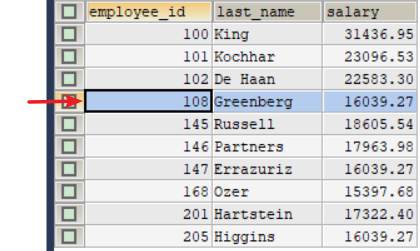

这里我们就可以通过游标来操作数据行，如图所示此时游标所在的行是“108”的记录，我们也可以在结果集上滚动游标，指向结果集中的任意一行。

#### 4.2 使用游标步骤

游标必须在声明处理程序之前被声明，并且变量和条件还必须在声明游标或处理程序之前被声明。

如果我们想要使用游标，一般需要经历四个步骤。不同的 DBMS 中，使用游标的语法可能略有不同。

**第一步，声明游标**

在MySQL中，使用DECLARE关键字来声明游标，其语法的基本形式如下：

```mysql
DECLARE cursor_name CURSOR FOR 查询语句;
```

这个语法适用于 MySQL，SQL Server，DB2 和 MariaDB。如果是用 Oracle 或者 PostgreSQL，需要写成：

```mysql
DECLARE cursor_name CURSOR IS 查询语句;
```

要使用 SELECT 语句来获取数据结果集，而此时还没有开始遍历数据，这里 select_statement 代表的是SELECT语句，返回一个用于创建游标的结果集。

比如：

```mysql
DECLARE cur_emp CURSOR FOR
SELECT employee_id, salary FROM employees;

DECLARE cursor_fruit CURSOR FOR
SELECT f_name, f_price FROM fruits;
```

**第二步，打开游标**

打开游标的语法如下：

```mysql
OPEN cursor_name

OPEN cur_emp;
```

当我们定义好游标之后，如果想要使用游标，必须先打开游标。打开游标的时候 SELECT 语句的查询结果集就会送到游标工作区，为后面游标的`逐条读取`结果集中的记录做准备。

**第三步，使用游标（从游标中取得数据）**

语法如下：

```mysql
FETCH cursor_name INTO var_name [, var_name] ...
```

这句的作用是使用 cursor_name 这个游标来读取当前行，并且将数据保存到 var_name 这个变量中，游标指针指到下一行。如果游标读取的数据行有多个列名，则在 INTO 关键字后面赋值给多个变量名即可。

注意：var_name必须在声明游标之前就定义好。

```mysql
FETCH cur_emp INTO emp_id, emp_sal;
```

注意：`游标的查询结果集中的字段数，必须跟 INTO 后面的变量数一致`，否则，在存储过程执行的时候，MySQL 会提示错误。

**第四步，关闭游标**

```mysql
CLOSE cursor_name
```

有 OPEN 就会有 CLOSE，也就是打开和关闭游标。当我们使用完游标后需要关闭掉该游标。因为`游标会占用系统资源`，如果不及时关闭，`游标会一直保持到存储过程结束`，影响系统运行的效率。而关闭游标的操作，会释放游标占用的系统资源。

关闭游标之后，我们就不能再检索查询结果中的数据行，如果需要检索只能再次打开游标。

```mysql
CLOSE cur_emp;
```

#### 4.3 举例

创建存储过程“get_count_by_limit_total_salary()”，声明IN参数 limit_total_salary，DOUBLE类型；声明OUT参数total_count，INT类型。函数的功能可以实现累加薪资最高的几个员工的薪资值，直到薪资总和达到limit_total_salary参数的值，返回累加的人数给total_count。

```mysql
DECLARE //

CREATE PROCEDURE get_count_by_limit_total_salary(
    						IN limit_total_salary DOUBLE, 
						    OUT total_count INT)
BEGIN
	DECLARE sum_salary DOUBLE DEFAULT 0; #记录累加的总工资
	DECLARE cursor_salary DOUBLE DEFAULT 0; #记录某一个工资值
	DECLARE emp_count INT DEFAULT 0; #记录循环个数
	
	#1.定义游标
	DECLARE emp_cursor CURSOR FOR SELECT salary FROM employees ORDER BY salary DESC;
	
	#2.打开游标
	OPEN emp_cursor;
	
	REPEAT
		#3.使用游标（从游标中获取数据）
		FETCH emp_cursor INTO cursor_salary;
		SET sum_salary = sum_salary + cursor_salary;
		SET emp_count = emp_count + 1;
	UNTIL sum_salary >= limit_total_salary
	END REPEAT;
	
	SET total_count = emp_count;
	
	#4.关闭游标
	CLOSE emp_cursor;
END //

DECLARE ;
```

#### 4.4 小结

游标是 MySQL 的一个重要的功能，为`逐条读取`结果集中的数据，提供了完美的解决方案。跟在应用层面实现相同的功能相比，游标可以在存储程序中使用，效率高，程序也更加简洁。

但同时也会带来一些性能问题，比如在使用游标的过程中，会对数据行进行`加锁`，这样在业务并发量大的时候，不仅会影响业务之间的效率，还会`消耗系统资源`，造成内存不足，这是因为游标是在内存中进行的处理。

建议：养成用完之后就关闭的习惯，这样才能提高系统的整体效率。


### 补充：MySQL 8.0的新特性—全局变量的持久化

在MySQL数据库中，全局变量可以通过SET GLOBAL语句来设置。例如，设置服务器语句超时的限制，可以通过设置系统变量max_execution_time来实现：

```mysql
SET GLOBAL MAX_EXECUTION_TIME=2000;
```

使用SET GLOBAL语句设置的变量值只会`临时生效`。`数据库重启`后，服务器又会从MySQL配置文件中读取变量的默认值。 MySQL 8.0版本新增了`SET PERSIST`命令。例如，设置服务器的最大连接数为1000：

```mysql
SET PERSIST global max_connections = 1000;
```

MySQL会将该命令的配置保存到数据目录下的`mysqld-auto.cnf`文件中，下次启动时会读取该文件，用其中的配置来覆盖默认的配置文件。

举例：

查看全局变量max_connections的值，结果如下：

```mysql
mysql> show variables like '%max_connections%';
+---------------------------------+--------+
| Variable_name                   | Value  |
+---------------------------------+--------+
| max_connections                 | 151    |
| mysqlx_max_connections          | 100    |
+---------------------------------+--------+
2 rows in set, 1 warning (0.00 sec)
```

设置全局变量max_connections的值：

```mysql
mysql> set persist max_connections=1000;
Query OK, 0 rows affected (0.00 sec)
```

`重启MySQL服务器`，再次查询max_connections的值：

```mysql
mysql> show variables like '%max_connections%';
+---------------------------------+----------+
| Variable_name                   | Value   |
+---------------------------------+---------+
| max_connections                 | 1000    |
| mysqlx_max_connections          | 100     |
+---------------------------------+---------+
2 rows in set, 1 warning (0.00 sec)
```

------

## 十六、触发器

在实际开发中，我们经常会遇到这样的情况：有 2 个或者多个相互关联的表，如`商品信息`和`库存信息`分别存放在 2 个不同的数据表中，我们在添加一条新商品记录的时候，为了保证数据的完整性，必须同时在库存表中添加一条库存记录。

这样一来，我们就必须把这两个关联的操作步骤写到程序里面，而且要用`事务`包裹起来，确保这两个操作成为一个`原子操作`，要么全部执行，要么全部不执行。要是遇到特殊情况，可能还需要对数据进行手动维护，这样就很`容易忘记其中的一步`，导致数据缺失。

这个时候，咱们可以使用触发器。**你可以创建一个触发器，让商品信息数据的插入操作自动触发库存数据的插入操作。**这样一来，就不用担心因为忘记添加库存数据而导致的数据缺失了。

### 1 触发器概述

- MySQL从`5.0.2`版本开始支持触发器。MySQL的触发器和存储过程一样，都是嵌入到MySQL服务器的一段程序。
- 触发器是由`事件来触发`某个操作，这些事件包括`INSERT`、`UPDATE`、`DELETE`事件。所谓事件就是指用户的动作或者触发某项行为。如果定义了触发程序，当数据库执行这些语句时候，就相当于事件发生了，就会`自动`激发触发器执行相应的操作。
- 当对数据表中的数据执行插入、更新和删除操作，需要自动执行一些数据库逻辑时，可以使用触发器来实现。


### 2 触发器的创建

#### 2.1 创建触发器语法

创建触发器的语法结构是：

```mysql
CREATE TRIGGER 触发器名称
{ BEFORE|AFTER } { INSERT|UPDATE|DELETE } ON 表名
FOR EACH ROW
触发器执行的语句块;
```

说明：

- `表名`：表示触发器监控的对象。
- `BEFORE|AFTER`：表示触发的时间。
  - BEFORE 表示在事件之前触发；
  - AFTER 表示在事件之后触发。
- `INSERT|UPDATE|DELETE`：表示触发的事件。
  - INSERT 表示插入记录时触发；
  - UPDATE 表示更新记录时触发；
  - DELETE 表示删除记录时触发。
- `触发器执行的语句块`：可以是单条SQL语句，也可以是由BEGIN…END结构组成的复合语句块。

#### 2.2 代码举例

**举例1：**

1. 创建数据表：

```mysql
CREATE TABLE test_trigger (
	id INT PRIMARY KEY AUTO_INCREMENT,
	t_note VARCHAR(30)
);

CREATE TABLE test_trigger_log (
	id INT PRIMARY KEY AUTO_INCREMENT,
	t_log VARCHAR(30)
);
```

2. 创建触发器：创建名称为before_insert的触发器，向test_trigger数据表插入数据之前，向test_trigger_log数据表中插入before_insert的日志信息。

```mysql
DELIMITER //

CREATE TRIGGER before_insert
BEFORE INSERT ON test_trigger
FOR EACH ROW
BEGIN
	INSERT INTO test_trigger_log(t_log) VALUES('before_insert');
END //

DELIMITER ;
```

3. 向test_trigger数据表中插入数据

```mysql
INSERT INTO test_trigger (t_note) VALUES ('测试 BEFORE INSERT 触发器');
```

4. 查看test_trigger_log数据表中的数据

```mysql
mysql> SELECT * FROM test_trigger_log;
+----+------------------+
| id   | t_log             |
+----+------------------+
| 1   | before_insert |
+----+------------------+
1 row in set (0.00 sec)
```


**举例2：**

1. 创建名称为after_insert的触发器，向test_trigger数据表插入数据之后，向test_trigger_log数据表中插入after_insert的日志信息。

```mysql
DELIMITER //

CREATE TRIGGER after_insert
AFTER INSERT ON test_trigger
FOR EACH ROW
BEGIN
	INSERT INTO test_trigger_log (t_log) VALUES('after_insert');
END //

DELIMITER ;
```

2. 向test_trigger数据表中插入数据。

```mysql
INSERT INTO test_trigger (t_note) VALUES ('测试 AFTER INSERT 触发器');
```

3. 查看test_trigger_log数据表中的数据

```mysql
mysql> SELECT * FROM test_trigger_log;
+----+------------------+
| id | t_log            |
+----+------------------+
| 1  | before_insert    |
| 2  | before_insert    |
| 3  | after_insert     |
+----+------------------+
3 rows in set (0.00 sec)
```


**举例3：**

定义触发器“salary_check_trigger”，基于员工表“employees”的INSERT事件，在INSERT之前检查将要添加的新员工薪资是否大于他领导的薪资，如果大于领导薪资，则报sqlstate_value为'HY000'的错误，从而使得添加失败。

```mysql
DELIMITER //

CREATE TRIGGER salary_check_trigger
BEFORE INSERT ON employees
FOR EACH ROW
BEGIN
	DECLARE mgr_sal DOUBLE;
	
	SELECT e.salary INTO mgr_sal FROM employees e WHERE e.employee_id = NEW.manager_id;
	
	IF NEW.salary > mgr_sal THEN
		SIGNAL SQLSTATE 'HY000' SET MESSAGE_TEXT = '薪资高于领导薪资错误';
	END IF;
END //

DELIMITER ;
```

> 上面触发器声明过程中的NEW关键字代表INSERT添加语句的新记录。


### 3 查看、删除触发器

#### 3.1 查看触发器

查看触发器是查看数据库中已经存在的触发器的定义、状态和语法信息等。

**方式1：**查看当前数据库的所有触发器的定义

```mysql
SHOW TRIGGERS\G
```

**方式2：**查看当前数据库中某个触发器的定义

```mysql
SHOW CREATE TRIGGER 触发器名
```

**方式3：**从系统库information_schema的TRIGGERS表中查询“salary_check_trigger”触发器的信息。

```mysql
SELECT * FROM information_schema.TRIGGERS;
```

#### 3.2 删除触发器

触发器也是数据库对象，删除触发器也用DROP语句，语法格式如下：

```mysql
DROP TRIGGER IF EXISTS 触发器名称;
```

### 4 触发器的优缺点

#### 4.1 优点

**1、触发器可以确保数据的完整性。**

假设我们用`进货单头表`（demo.importhead）来保存进货单的总体信息，包括进货单编号、供货商编号、仓库编号、总计进货数量、总计进货金额和验收日期。

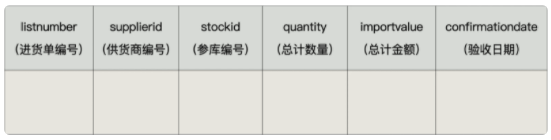

用`进货单明细表`（demo.importdetails）来保存进货商品的明细，包括进货单编号、商品编号、进货数量、进货价格和进货金额。

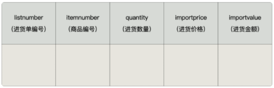

每当我们录入、删除和修改一条进货单明细数据的时候，进货单明细表里的数据就会发生变动。这个时候，在进货单头表中的总计数量和总计金额就必须重新计算，否则，进货单头表中的总计数量和总计金额就不等于进货单明细表中数量合计和金额合计了，这就是数据不一致。

为了解决这个问题，我们就可以使用触发器，**规定每当进货单明细表有数据插入、修改和删除的操作时，自动触发 2 步操作：**

1. 重新计算进货单明细表中的数量合计和金额合计；
2. 用第一步中计算出来的值更新进货单头表中的合计数量与合计金额。

这样一来，进货单头表中的合计数量与合计金额的值，就始终与进货单明细表中计算出来的合计数量与合计金额的值相同，数据就是一致的，不会互相矛盾。


**2、触发器可以帮助我们记录操作日志。**

利用触发器，可以具体记录什么时间发生了什么。比如，记录修改会员储值金额的触发器，就是一个很好的例子。这对我们还原操作执行时的具体场景，更好地定位问题原因很有帮助。


**3、触发器还可以用在操作数据前，对数据进行合法性检查。**

比如，超市进货的时候，需要库管录入进货价格。但是，人为操作很容易犯错误，比如说在录入数量的时候，把条形码扫进去了；录入金额的时候，看串了行，录入的价格远超售价，导致账面上的巨亏……这些都可以通过触发器，在实际插入或者更新操作之前，对相应的数据进行检查，及时提示错误，防止错误数据进入系统。


#### 4.2 缺点

**1、触发器最大的一个问题就是可读性差。**

因为触发器存储在数据库中，并且由事件驱动，这就意味着触发器有可能`不受应用层的控制`。这对系统维护是非常有挑战的。

比如，创建触发器用于修改会员储值操作。如果触发器中的操作出了问题，会导致会员储值金额更新失败。我用下面的代码演示一下：

```mysql
mysql> update demo.membermaster set memberdeposit = 20 where memberid = 2;
ERROR 1054 (42S22): Unknown column 'aa' in 'field list'
```

结果显示，系统提示错误，字段“aa”不存在。

这是因为，触发器中的数据插入操作多了一个字段，系统提示错误。可是，如果你不了解这个触发器，很可能会认为是更新语句本身的问题，或者是会员信息表的结构出了问题。说不定你还会给会员信息表添加一个叫“aa”的字段，试图解决这个问题，结果只能是白费力。


**2、相关数据的变更，可能会导致触发器出错。**

特别是数据表结构的变更，都可能会导致触发器出错，进而影响数据操作的正常运行。这些都会由于触发器本身的隐蔽性，影响到应用中错误原因排查的效率。


#### 4.3 注意点

注意，如果在子表中定义了外键约束，并且外键指定了ON UPDATE/DELETE CASCADE/SET NULL子句，此时修改父表被引用的键值或删除父表被引用的记录行时，也会引起子表的修改和删除操作，此时基于子表的UPDATE和DELETE语句定义的触发器并不会被激活。

例如：基于子表员工表（t_employee）的DELETE语句定义了触发器t1，而子表的部门编号（did）字段定义了外键约束引用了父表部门表（t_department）的主键列部门编号（did），并且该外键加了“ON DELETE SET NULL”子句，那么如果此时删除父表部门表（t_department）在子表员工表（t_employee）有匹配记录的部门记录时，会引起子表员工表（t_employee）匹配记录的部门编号（did）修改为NULL，但是此时不会激活触发器t1。只有直接对子表员工表（t_employee）执行DELETE语句时才会激活触发器
t1。

------

## 十七、MySQL8 其它新特性

### 1 MySQL8新特性概述

`MySQL从5.7版本直接跳跃发布了8.0版本`，可见这是一个令人兴奋的里程碑版本。MySQL 8版本在功能上做了显著的改进与增强，开发者对MySQL的源代码进行了重构，最突出的一点是多MySQL Optimizer优化器进行了改进。不仅在速度上得到了改善，还为用户带来了更好的性能和更棒的体验。


#### 1.1 MySQL8.0 新增特性

1. **更简便的NoSQL支持**

  NoSQL泛指非关系型数据库和数据存储。随着互联网平台的规模飞速发展，传统的关系型数据库已经越来越不能满足需求。从5.6版本开始，MySQL就开始支持简单的NoSQL存储功能。MySQL 8对这一功能做了优化，以更灵活的方式实现NoSQL功能，不再依赖模式（schema）。

2. **更好的索引** 

  在查询中，正确地使用索引可以提高查询的效率。MySQL 8中新增了`隐藏索引`和`降序索引`。隐藏索引可以用来测试去掉索引对查询性能的影响。在查询中混合存在多列索引时，使用降序索引可以提高查询的性能。

3. **更完善的JSON支持**

  MySQL从5.7开始支持原生JSON数据的存储，MySQL 8对这一功能做了优化，增加了聚合函数 `JSON_ARRAYAGG()` 和 `JSON_OBJECTAGG()` ，将参数聚合为JSON数组或对象，新增了行内操作符 `->>`，是列路径运算符 `->` 的增强，对JSON排序做了提升，并优化了JSON的更新操作。

4. **安全和账户管理** 

  MySQL 8中新增了`caching_sha2_password`授权插件、角色、密码历史记录和FIPS模式支持，这些特性提高了数据库的安全性和性能，使数据库管理员能够更灵活地进行账户管理工作。

5. **InnoDB的变化** 

  `InnoDB是MySQL默认的存储引擎`，是事务型数据库的首选引擎，支持事务安全表（ACID），支持行锁定和外键。在MySQL 8 版本中，InnoDB在自增、索引、加密、死锁、共享锁等方面做了大量的`改进和优化`，并且支持原子数据定义语言（DDL），提高了数据安全性，对事务提供更好的支持。

6. **数据字典** 

  在之前的MySQL版本中，字典数据都存储在元数据文件和非事务表中。从MySQL 8开始新增了事务数据字典，在这个字典里存储着数据库对象信息，这些数据字典存储在内部事务表中。

7. **原子数据定义语句** 

  MySQL 8开始支持原子数据定义语句（Automic DDL），即`原子DDL`。目前，只有InnoDB存储引擎支持原子DDL。原子数据定义语句（DDL）将与DDL操作相关的数据字典更新、存储引擎操作、二进制日志写入结合到一个单独的原子事务中，这使得即使服务器崩溃，事务也会提交或回滚。使用支持原子操作的存储引擎所创建的表，在执行DROP TABLE、CREATE TABLE、ALTER TABLE、RENAME TABLE、TRUNCATE TABLE、CREATE TABLESPACE、DROP TABLESPACE等操作时，都支持原子操作，即事务要么完全操作成功，要么失败后回滚，不再进行部分提交。对于从MySQL 5.7复制到MySQL 8版本中的语句，可以添加`IF EXISTS`或`IF NOT EXISTS`语句来避免发生错误。

8. **资源管理** 

  MySQL 8开始支持创建和管理资源组，允许将服务器内运行的线程分配给特定的分组，以便线程根据组内可用资源执行。组属性能够控制组内资源，启用或限制组内资源消耗。数据库管理员能够根据不同的工作负载适当地更改这些属性。目前，CPU时间是可控资源，由“虚拟CPU”这个概念来表示，此术语包含CPU的核心数，超线程，硬件线程等等。服务器在启动时确定可用的虚拟CPU数量。拥有对应权限的数据库管理员可以将这些CPU与资源组关联，并为资源组分配线程。资源组组件为MySQL中的资源组管理提供了SQL接口。资源组的属性用于定义资源组。MySQL中存在两个默认组，系统组和用户组，默认的组不能被删除，其属性也不能被更改。对于用户自定义的组，资源组创建时可初始化所有的属性，除去名字和类型，其他属性都可在创建之后进行更改。在一些平台下，或进行了某些MySQL的配置时，资源管理的功能将受到限制，甚至不可用。例如，如果安装了线程池插件，或者使用的是macOS系统，资源管理将处于不可用状态。在FreeBSD和Solaris系统中，资源线程优先级将失效。在Linux系统中，只有配置了CAP_SYS_NICE属性，资源管理优先级才能发挥作用。

9. **字符集支持** 

  MySQL 8中默认的字符集由`latin1`更改为`utf8mb4`，并首次增加了日语所特定使用的集合，utf8mb4_ja_0900_as_cs。

10. **优化器增强** 

  MySQL优化器开始支持隐藏索引和降序索引。隐藏索引不会被优化器使用，验证索引的必要性时不需要删除索引，先将索引隐藏，如果优化器性能无影响就可以真正地删除索引。降序索引允许优化器对多个列进行排序，并且允许排序顺序不一致。

11. **公用表表达式** 

   公用表表达式（Common Table Expressions）简称为CTE，MySQL现在支持递归和非递归两种形式的CTE。CTE通过在SELECT语句或其他特定语句前`使用WITH语句对临时结果集`进行命名。

   基础语法如下：

   ```mysql
   WITH cte_name (col_name1, col_name2 ...) AS (Subquery)
   SELECT * FROM cte_name;
   ```

   Subquery代表子查询，子查询前使用WITH语句将结果集命名为cte_name，在后续的查询中即可使用cte_name进行查询。

12. **窗口函数** 

   MySQL 8开始支持窗口函数。在之前的版本中已存在的大部分`聚合函数`在MySQL 8中也可以作为窗口函数来使用。

   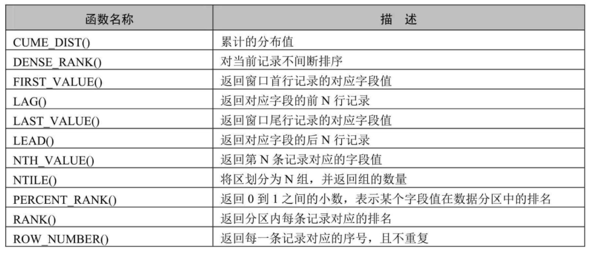

13. **正则表达式支持** 

   MySQL在8.0.4以后的版本中采用支持Unicode的国际化组件库实现正则表达式操作，这种方式不仅能提供完全的Unicode支持，而且是多字节安全编码。MySQL增加了REGEXP_LIKE()、EGEXP_INSTR()、REGEXP_REPLACE()和 REGEXP_SUBSTR()等函数来提升性能。另外，regexp_stack_limit和regexp_time_limit 系统变量能够通过匹配引擎来控制资源消耗。

14. **内部临时表** 

   `TempTable存储引擎取代MEMORY存储引擎成为内部临时表的默认存储引擎`。TempTable存储引擎为`VARCHAR`和`VARBINARY`列提供高效存储。internal_tmp_mem_storage_engine会话变量定义了内部临时表的存储引擎，可选的值有两个，TempTable和MEMORY，其中TempTable为默认的存储引擎。temptable_max_ram系统配置项定义了TempTable存储引擎可使用的最大内存数量。

15. **日志记录** 

   在MySQL 8中错误日志子系统由一系列MySQL组件构成。这些组件的构成由系统变量log_error_services来配置，能够实现日志事件的过滤和写入。

16. **备份锁** 

   新的备份锁允许在线备份期间执行数据操作语句，同时阻止可能造成快照不一致的操作。新备份锁由 LOCK INSTANCE FOR BACKUP 和 UNLOCK INSTANCE 语法提供支持，执行这些操作需要备份管理员特权。

17. **增强的MySQL复制** 

   MySQL 8复制支持对`JSON文档`进行部分更新的`二进制日志记录`，该记录`使用紧凑的二进制格式`，从而节省记录完整JSON文档的空间。当使用基于语句的日志记录时，这种紧凑的日志记录会自动完成，并且可以通过将新的binlog_row_value_options系统变量值设置为PARTIAL_JSON来启用。


#### 1.2 MySQL8.0移除的旧特性

在MySQL 5.7版本上开发的应用程序如果使用了MySQL8.0 移除的特性，语句可能会失败，或者产生不同的执行结果。为了避免这些问题，对于使用了移除特性的应用，应当尽力修正避免使用这些特性，并尽可能使用替代方法。


1. **查询缓存** `查询缓存已被移除`，删除的项有：

  1. 语句：FLUSH QUERY CACHE 和 RESET QUERY CACHE。
  2. 系统变量：query_cache_limit、query_cache_min_res_unit、query_cache_size、query_cache_type、query_cache_wlock_invalidate。
  3. 状态变量：Qcache_free_blocks、Qcache_free_memory、Qcache_hits、Qcache_inserts、Qcache_lowmem_prunes、Qcache_not_cached、Qcache_queries_in_cache、Qcache_total_blocks。
  4. 线程状态：checking privileges on cached query、checking query cache for query、invalidating query cache entries、sending cached result to client、storing result in query cache、waiting for query cache lock。

2. **加密相关** 

  删除的加密相关的内容有：ENCODE()、DECODE()、ENCRYPT()、DES_ENCRYPT()和DES_DECRYPT()函数，配置项des-key-file，系统变量have_crypt，FLUSH语句的DES_KEY_FILE选项，HAVE_CRYPT CMake选项。 对于移除的ENCRYPT()函数，考虑使用SHA2()替代，对于其他移除的函数，使用AES_ENCRYPT()和AES_DECRYPT()替代。

3. **空间函数相关** 

  在MySQL 5.7版本中，多个空间函数已被标记为过时。这些过时函数在MySQL 8中都已被移除，只保留了对应的ST_和MBR函数。

4. **\N和NULL** 

  在SQL语句中，解析器不再将\N视为NULL，所以在SQL语句中应使用NULL代替\N。这项变化不会影响使用LOAD DATA INFILE或者SELECT...INTO OUTFILE操作文件的导入和导出。在这类操作中，NULL仍等同于\N。

5. **mysql_install_db** 

  在MySQL分布中，已移除了mysql_install_db程序，数据字典初始化需要调用带着--initialize或者--initialize-insecure选项的mysqld来代替实现。另外，--bootstrap和INSTALL_SCRIPTDIR CMake也已被删除。

6. **通用分区处理程序** 

  通用分区处理程序已从MySQL服务中被移除。为了实现给定表分区，表所使用的存储引擎需要自有的分区处理程序。提供本地分区支持的MySQL存储引擎有两个，即InnoDB和NDB，而在
  MySQL 8中只支持InnoDB。

7. **系统和状态变量信息** 

  在INFORMATION_SCHEMA数据库中，对系统和状态变量信息不再进行维护。GLOBAL_VARIABLES、SESSION_VARIABLES、GLOBAL_STATUS、SESSION_STATUS表都已被删除。另外，系统变量show_compatibility_56也已被删除。被删除的状态变量有Slave_heartbeat_period、Slave_last_heartbeat、Slave_received_heartbeats、Slave_retried_transactions、Slave_running。以上被删除的内容都可使用性能模式中对应的内容进行替代。

8. **mysql_plugin工具** 

  mysql_plugin工具用来配置MySQL服务器插件，现已被删除，可使用--plugin-load或--plugin-load-add选项在服务器启动时加载插件或者在运行时使用INSTALL PLUGIN语句加载插件来替代该工具。


### 2 新特性1：窗口函数

#### 2.1 使用窗口函数前后对比

假设我现在有这样一个数据表，它显示了某购物网站在每个城市每个区的销售额：

```mysql
CREATE TABLE sales(
	id INT PRIMARY KEY AUTO_INCREMENT,
	city VARCHAR(15),
	county VARCHAR(15),
	sales_value DECIMAL
);

INSERT INTO sales(city,county,sales_value)
VALUES
('北京','海淀',10.00),
('北京','朝阳',20.00),
('上海','黄埔',30.00),
('上海','长宁',10.00);

# 查询
mysql> select * from sales;
+----+--------+--------+-------------+
| id | city   | county | sales_value |
+----+--------+--------+-------------+
|  1 | 北京    | 海淀   |       10    |
|  2 | 北京    | 朝阳   |       20    |
|  3 | 上海    | 黄埔   |       30    |
|  4 | 上海    | 长宁   |       10    |
+----+--------+--------+-------------+
4 rows in set (0.00 sec)
```

**需求：**现在计算这个网站在每个城市的销售总额、在全国的销售总额、每个区的销售额占所在城市销售额中的比率，以及占总销售额中的比率。

如果用分组和聚合函数，就需要分好几步来计算。

**第一步，计算总销售金额，并存入临时表 a：**

```mysql
CREATE TEMPORARY TABLE a -- 创建临时表
SELECT SUM(sales_value) AS sales_value -- 计算总计金额
FROM sales;
```

查看一下临时表 a ：

```mysql
mysql> select * from a;
+-------------+
| sales_value |
+-------------+
|          70 |
+-------------+
1 row in set (0.00 sec)
```

**第二步，计算每个城市的销售总额并存入临时表 b：**

```mysql
CREATE TEMPORARY TABLE b -- 创建临时表
SELECT city, SUM(sales_value) AS sales_value -- 计算城市销售合计
FROM sales
GROUP BY city;
```

查看临时表 b ：

```mysql
mysql> select * from b;
+--------+-------------+
| city   | sales_value |
+--------+-------------+
| 北京    |          30 |
| 上海    |          40 |
+--------+-------------+
2 rows in set (0.00 sec)
```

**第三步，计算各区的销售占所在城市的总计金额的比例，和占全部销售总计金额的比例。我们可以通过下面的连接查询获得需要的结果：**

```mysql
SELECT s.city AS 城市, s.county AS 区, s.sales_value AS 区销售额,
b.sales_value AS 市销售额, s.sales_value/b.sales_value AS 市比率,
a.sales_value AS 总销售额, s.sales_value/a.sales_value AS 总比率
FROM sales s
JOIN b ON (s.city=b.city) -- 连接市统计结果临时表
JOIN a -- 连接总计金额临时表
ORDER BY s.city, s.county;

+--------+--------+--------------+--------------+-----------+--------------+-----------+
| 城市    | 区     | 区销售额      | 市销售额      | 市比率     | 总销售额      | 总比率     |
+--------+--------+--------------+--------------+-----------+--------------+-----------+
| 上海   | 长宁    |         10   |         40   |    0.2500 |           70 |    0.1429 |
| 上海   | 黄埔    |         30   |         40   |    0.7500 |           70 |    0.4286 |
| 北京   | 朝阳    |         20   |         30   |    0.6667 |           70 |    0.2857 |
| 北京   | 海淀    |         10   |         30   |    0.3333 |           70 |    0.1429 |
+--------+--------+--------------+--------------+-----------+--------------+-----------+
4 rows in set (0.00 sec)
```

结果显示：市销售金额、市销售占比、总销售金额、总销售占比都计算出来了。

同样的查询，如果用窗口函数，就简单多了。我们可以用下面的代码来实现：

```mysql
mysql> SELECT city AS 城市, county AS 区, sales_value AS 区销售额,
       -> SUM(sales_value) OVER(PARTITION BY city) AS 市销售额, -- 计算市销售额
       -> sales_value/SUM(sales_value) OVER(PARTITION BY city) AS 市比率,
       -> SUM(sales_value) OVER() AS 总销售额, -- 计算总销售额
       -> sales_value/SUM(sales_value) OVER() AS 总比率
       -> FROM sales
       -> ORDER BY city, county;
+--------+--------+--------------+--------------+-----------+--------------+-----------+
| 城市    | 区     | 区销售额      | 市销售额      | 市比率     | 总销售额      | 总比率     |
+--------+--------+--------------+--------------+-----------+--------------+-----------+
| 上海   | 长宁    |           10 |           40 |    0.2500 |           70 |    0.1429 |
| 上海   | 黄埔    |           30 |           40 |    0.7500 |           70 |    0.4286 |
| 北京   | 朝阳    |           20 |           30 |    0.6667 |           70 |    0.2857 |
| 北京   | 海淀    |           10 |           30 |    0.3333 |           70 |    0.1429 |
+--------+--------+--------------+--------------+-----------+--------------+-----------+
4 rows in set (0.00 sec)
```

结果显示，我们得到了与上面那种查询同样的结果。

使用窗口函数，只用了一步就完成了查询。而且，由于没有用到临时表，执行的效率也更高了。很显然，**在这种需要用到分组统计的结果对每一条记录进行计算的场景下，使用窗口函数更好**。


#### 2.2 窗口函数分类

MySQL从8.0版本开始支持窗口函数。窗口函数的作用类似于在查询中对数据进行分组，不同的是，分组操作会把分组的结果聚合成一条记录，而窗口函数是将结果置于每一条数据记录中。

窗口函数可以分为`静态窗口函数`和`动态窗口函数`。

- 静态窗口函数的窗口大小是固定的，不会因为记录的不同而不同；
- 动态窗口函数的窗口大小会随着记录的不同而变化。

MySQL官方网站窗口函数的网址:https://dev.mysql.com/doc/refman/8.0/en/window-function-descriptions.html#function_row-number。


窗口函数总体上可以分为序号函数、分布函数、前后函数、首尾函数和其他函数，如下表：

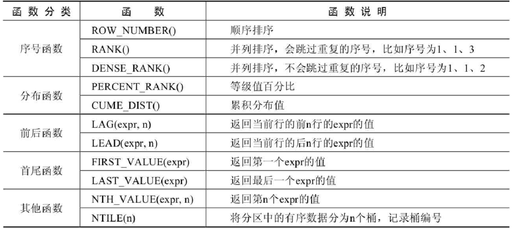

#### 2.3 语法结构

窗口函数的语法结构是：

```mysql
函数 OVER（[PARTITION BY 字段名 ORDER BY 字段名 ASC|DESC]）
```

或者是

```mysql
函数 OVER 窗口名 … WINDOW 窗口名 AS （[PARTITION BY 字段名 ORDER BY 字段名 ASC|DESC]）
```

- OVER 关键字指定函数窗口的范围。
  - 如果省略后面括号中的内容，则窗口会包含满足WHERE条件的所有记录，窗口函数会基于所有满足WHERE条件的记录进行计算。
  - 如果OVER关键字后面的括号不为空，则可以使用如下语法设置窗口。
- 窗口名：为窗口设置一个别名，用来标识窗口。
- PARTITION BY子句：指定窗口函数按照哪些字段进行分组。分组后，窗口函数可以在每个分组中分别执行。
- ORDER BY子句：指定窗口函数按照哪些字段进行排序。执行排序操作使窗口函数按照排序后的数据记录的顺序进行编号。
- FRAME子句：为分区中的某个子集定义规则，可以用来作为滑动窗口使用。

#### 2.4 分类讲解

创建表：

```mysql
CREATE TABLE goods(
	id INT PRIMARY KEY AUTO_INCREMENT,
	category_id INT,
	category VARCHAR(15),
	NAME VARCHAR(30),
	price DECIMAL(10,2),
	stock INT,
	upper_time DATETIME
);
```

添加数据：

```mysql
INSERT INTO goods(category_id,category,NAME,price,stock,upper_time)
VALUES
(1, '女装/女士精品', 'T恤', 39.90, 1000, '2020-11-10 00:00:00'),
(1, '女装/女士精品', '连衣裙', 79.90, 2500, '2020-11-10 00:00:00'),
(1, '女装/女士精品', '卫衣', 89.90, 1500, '2020-11-10 00:00:00'),
(1, '女装/女士精品', '牛仔裤', 89.90, 3500, '2020-11-10 00:00:00'),
(1, '女装/女士精品', '百褶裙', 29.90, 500, '2020-11-10 00:00:00'),
(1, '女装/女士精品', '呢绒外套', 399.90, 1200, '2020-11-10 00:00:00'),
(2, '户外运动', '自行车', 399.90, 1000, '2020-11-10 00:00:00'),
(2, '户外运动', '山地自行车', 1399.90, 2500, '2020-11-10 00:00:00'),
(2, '户外运动', '登山杖', 59.90, 1500, '2020-11-10 00:00:00'),
(2, '户外运动', '骑行装备', 399.90, 3500, '2020-11-10 00:00:00'),
(2, '户外运动', '运动外套', 799.90, 500, '2020-11-10 00:00:00'),
(2, '户外运动', '滑板', 499.90, 1200, '2020-11-10 00:00:00');
```

下面针对goods表中的数据来验证每个窗口函数的功能。

##### 2.4.1 序号函数

1. **ROW_NUMBER()函数**

ROW_NUMBER()函数能够对数据中的序号进行顺序显示。

举例：查询 goods 数据表中每个商品分类下价格降序排列的各个商品信息。

```mysql
mysql> select 
    -> ROW_NUMBER() OVER(PARTITION BY category_id ORDER BY price DESC) AS row_num,
    -> id, category_id, category, NAME, price, stock
    -> from goods;
```

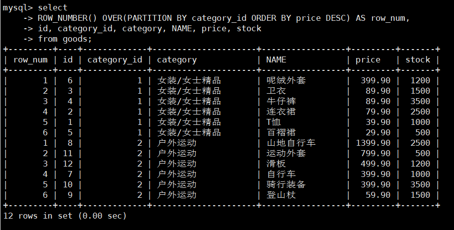


举例：查询 goods 数据表中每个商品分类下价格最高的3种商品信息。

```mysql
SELECT *
FROM (
SELECT 
ROW_NUMBER() OVER(PARTITION BY category_id ORDER BY price DESC) AS row_num,
id, category_id, category, NAME, price, stock
FROM goods) t
WHERE row_num <= 3;

+------------+----+---------------+---------------------+-----------------+---------+---------+
| row_num    | id | category_id   | category            | NAME            | price   | stock   |
+------------+----+---------------+---------------------+-----------------+---------+---------+
|       1    |  6 |       1       | 女装/女士精品        | 呢绒外套          |  399.90 |  1200   |
|       2    |  3 |       1       | 女装/女士精品        | 卫衣             |   89.90  |  1500   |
|       3    |  4 |       1       | 女装/女士精品        | 牛仔裤            |   89.90 |  3500   |
|       1    |  8 |       2       | 户外运动            | 山地自行车         | 1399.90 |  2500   |
|       2    | 11 |       2       | 户外运动            | 运动外套           |  799.90 |   500   |
|       3    | 12 |       2       | 户外运动            | 滑板              |  499.90  |  1200   |
+------------+----+----------------+--------------------+------------------+---------+---------+
6 rows in set (0.00 sec)
```

在名称为“女装/女士精品”的商品类别中，有两款商品的价格为89.90元，分别是卫衣和牛仔裤。两款商品的序号都应该为2，而不是一个为2，另一个为3。此时，可以使用RANK()函数和DENSE_RANK()函数解决。


2. **RANK()函数**

使用RANK()函数能够对序号进行并列排序，并且会跳过重复的序号，比如序号为1、1、3。

举例：使用RANK()函数获取 goods 数据表中各类别的价格从高到低排序的各商品信息。

```mysql
SELECT 
RANK() OVER(PARTITION BY category_id ORDER BY price DESC) AS rank_num,
id, category_id, category, NAME, price, stock
FROM goods;
```

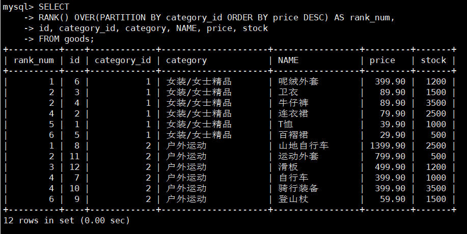


举例：使用RANK()函数获取 goods 数据表中类别为“女装/女士精品”的价格最高的4款商品信息。

```mysql
SELECT *
FROM(
	SELECT 
        RANK() OVER(PARTITION BY category_id ORDER BY price DESC) AS rank_num,
	id, category_id, category, NAME, price, stock
	FROM goods) t
WHERE category_id = 1 AND rank_num <= 4;
```

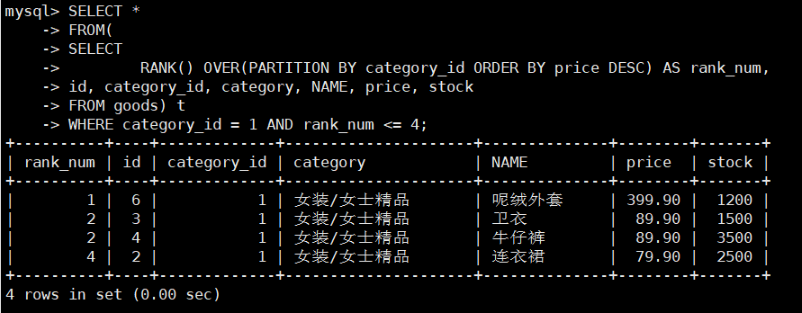

可以看到，使用RANK()函数得出的序号为1、2、2、4，相同价格的商品序号相同，后面的商品序号是不连续的，跳过了重复的序号。


3. **DENSE_RANK()函数**

DENSE_RANK()函数对序号进行并列排序，并且不会跳过重复的序号，比如序号为1、1、2。

举例：使用DENSE_RANK()函数获取 goods 数据表中各类别的价格从高到低排序的各商品信息。

```mysql
SELECT 
DENSE_RANK() OVER(PARTITION BY category_id ORDER BY price DESC) AS den_num,
id, category_id, category, NAME, price, stock
FROM goods;
```

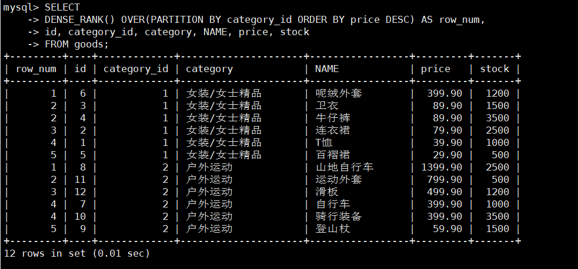


举例：使用DENSE_RANK()函数获取 goods 数据表中类别为“女装/女士精品”的价格最高的4款商品信息。

```mysql
SELECT *
FROM(
	SELECT 
	DENSE_RANK() OVER(PARTITION BY category_id ORDER BY price DESC) AS den_num,
	id, category_id, category, NAME, price, stock
	FROM goods) t
WHERE category_id = 1 AND den_num <= 3;
```

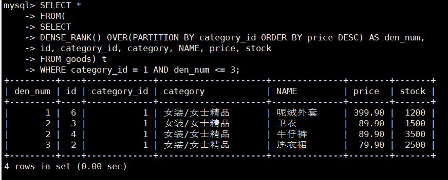

可以看到，使用DENSE_RANK()函数得出的行号为1、2、2、3，相同价格的商品序号相同，后面的商品序号是连续的，并且没有跳过重复的序号。


##### 2.4.2 分布函数

1. **PERCENT_RANK()函数**

PERCENT_RANK()函数是等级值百分比函数。按照如下方式进行计算。

```
(rank - 1) / (rows - 1)
```

其中，rank的值为使用RANK()函数产生的序号，rows的值为当前窗口的总记录数。

举例：计算 goods 数据表中名称为“女装/女士精品”的类别下的商品的PERCENT_RANK值。

```mysql
#写法一：
SELECT 
	RANK() OVER (PARTITION BY category_id ORDER BY price DESC) AS r,
	PERCENT_RANK() OVER (PARTITION BY category_id ORDER BY price DESC) AS pr,
	id, category_id, category, NAME, price, stock
FROM goods
WHERE category_id = 1;

#写法二：
SELECT 
	RANK() OVER w AS r,
	PERCENT_RANK() OVER w AS pr,
	id, category_id, category, NAME, price, stock
FROM goods
WHERE category_id = 1 WINDOW w AS (PARTITION BY category_id ORDER BY price DESC);
```

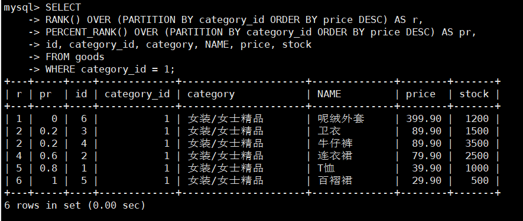


2. **CUME_DIST()函数**

CUME_DIST()函数主要用于查询小于或等于某个值的比例。

举例：查询goods数据表中小于或等于当前价格的比例。

```mysql
SELECT 
	CUME_DIST() OVER(PARTITION BY category_id ORDER BY price ASC) AS cd,
	id, category, NAME, price
FROM goods;
```

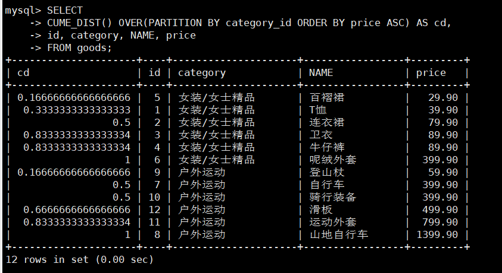


##### 2.4.3 前后函数

1. **LAG(expr,n)函数**

LAG(expr,n)函数返回当前行的前n行的expr的值。

举例：查询goods数据表中前一个商品价格与当前商品价格的差值。

```mysql
SELECT 
	id, category, NAME, price, pre_price, price - pre_price AS diff_price
FROM (
	SELECT id, category, NAME, price, LAG(price,1) OVER w AS pre_price
	FROM goods
WINDOW w AS (PARTITION BY category_id ORDER BY price ASC)) t;
```

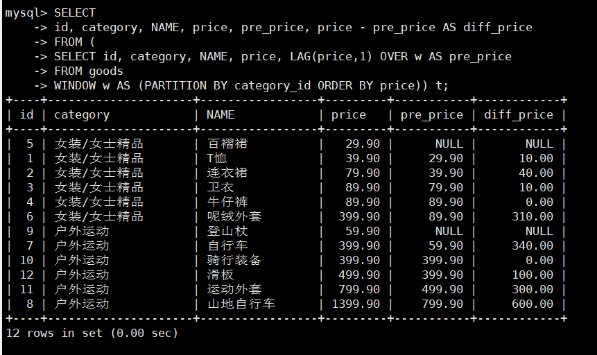


2. **LEAD(expr,n)函数**

LEAD(expr,n)函数返回当前行的后n行的expr的值

举例：查询goods数据表中后一个商品价格与当前商品价格的差值。

```mysql
SELECT 
	id, category, NAME, behind_price, price,behind_price - price AS diff_price
FROM(
	SELECT id, category, NAME, price,LEAD(price, 1) OVER w AS behind_price
	FROM goods WINDOW w AS (PARTITION BY category_id ORDER BY price)) t;
```

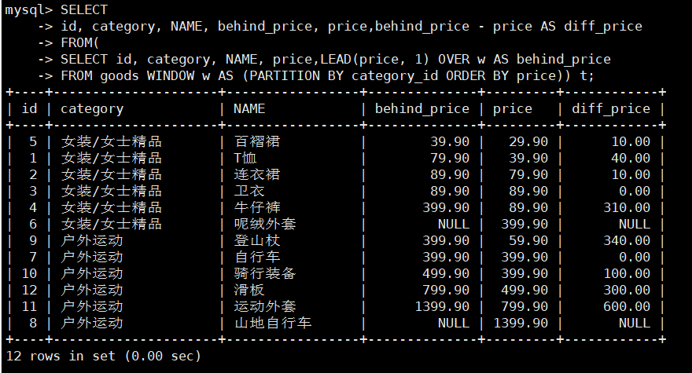


##### 2.4.4 首尾函数

1. **FIRST_VALUE(expr)函数**

FIRST_VALUE(expr)函数返回第一个expr的值。

举例：按照价格排序，查询第1个商品的价格信息。

```mysql
SELECT 
	id, category, NAME, price, stock,FIRST_VALUE(price) OVER w AS first_price
FROM goods 
WINDOW w AS (PARTITION BY category_id ORDER BY price);
```

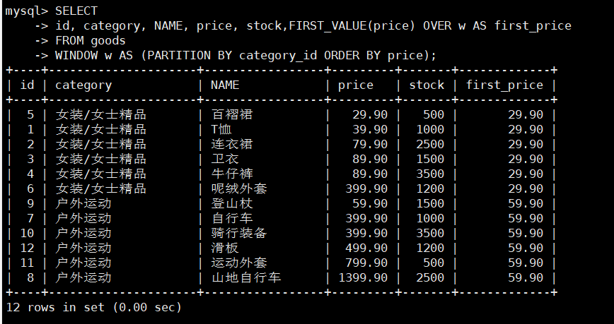


2. **LAST_VALUE(expr)函数**

LAST_VALUE(expr)函数返回最后一个expr的值。

举例：按照价格排序，查询最后一个商品的价格信息。

```mysql
SELECT 
	id, category, NAME, price, stock, LAST_VALUE(price) OVER w AS last_price
FROM goods 
WINDOW w AS (PARTITION BY category_id ORDER BY price);
```

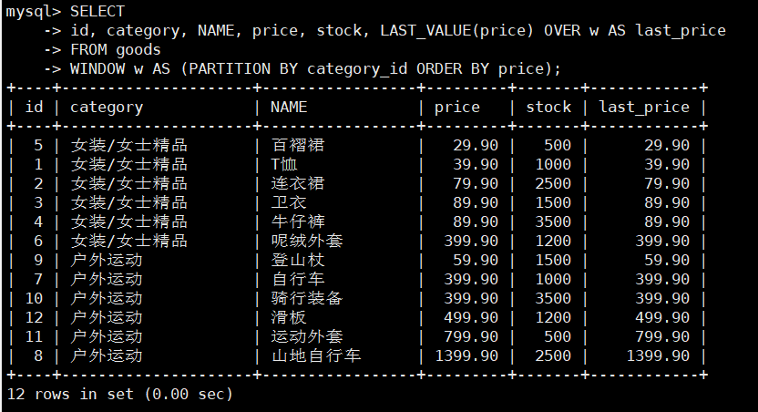


##### 2.4.5 其他函数

1. **NTH_VALUE(expr,n)函数**

NTH_VALUE(expr,n)函数返回第n个expr的值。

举例：查询goods数据表中排名第2和第3的价格信息。

```mysql
SELECT 
	id, category, NAME, price, 
	NTH_VALUE(price,2) OVER w AS second_price,
	NTH_VALUE(price,3) OVER w AS third_price
FROM goods 
WINDOW w AS (PARTITION BY category_id ORDER BY price);
```

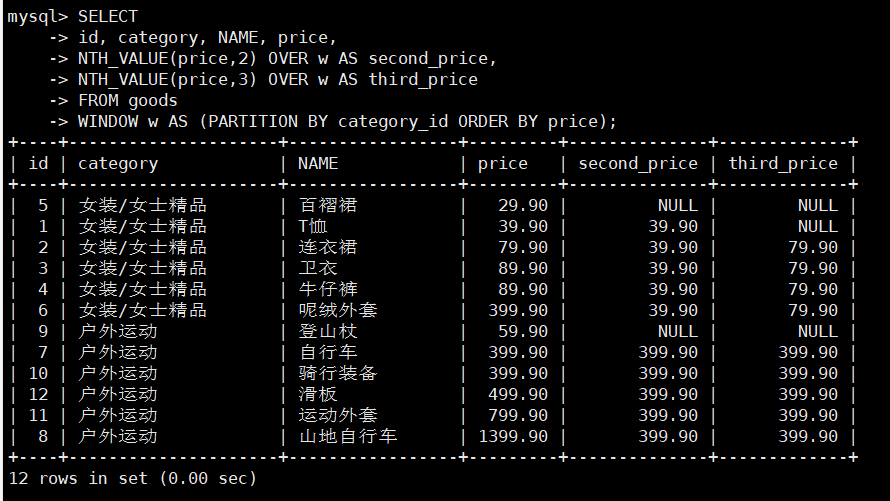


2. **NTILE(n)函数**

NTILE(n)函数将分区中的有序数据分为n个桶，记录桶编号。

举例：将goods表中的商品按照价格分为3组。

```mysql
SELECT 
	NTILE(3) OVER w AS nt,
	id, category, NAME, price
FROM goods 
WINDOW w AS (PARTITION BY category_id ORDER BY price);
```

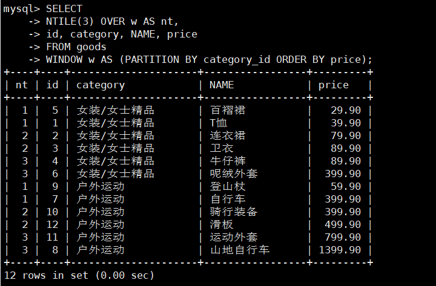

#### 2.5 小结

窗口函数的特点是可以分组，而且可以在分组内排序。另外，窗口函数不会因为分组而减少原表中的行数，这对我们在原表数据的基础上进行统计和排序非常有用。


### 3 新特性2：公用表表达式

公用表表达式（或通用表表达式）简称为CTE（Common Table Expressions）。CTE是一个命名的临时结果集，作用范围是当前语句。CTE可以理解成一个可以复用的子查询，当然跟子查询还是有点区别的，CTE可以引用其他CTE，但子查询不能引用其他子查询。所以，可以考虑代替子查询。

依据语法结构和执行方式的不同，公用表表达式分为`普通公用表表达式`和`递归公用表表达式`2 种。

#### 3.1 普通公用表表达式

普通公用表表达式的语法结构是：

```mysql
WITH CTE名称
AS （子查询）
SELECT | DELETE | UPDATE 语句;
```

普通公用表表达式类似于子查询，不过，跟子查询不同的是，它可以被多次引用，而且可以被其他的普通公用表表达式所引用。

举例：查询员工所在的部门的详细信息。

```mysql
SELECT * FROM departments
WHERE department_id IN (
	SELECT DISTINCT department_id
	FROM employees
	);
```

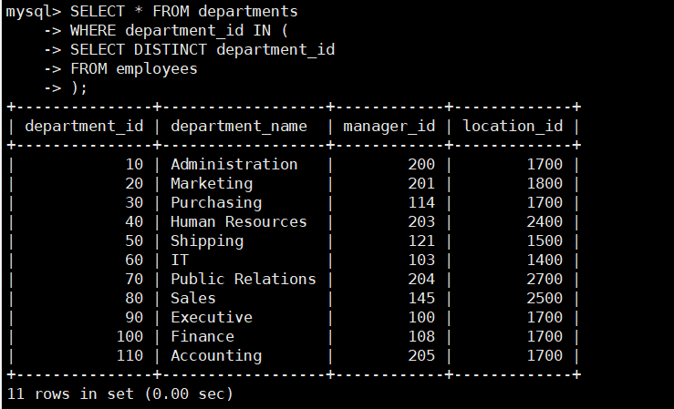

这个查询也可以用普通公用表表达式的方式完成：

```mysql
WITH emp_dept_id
AS (SELECT DISTINCT department_id FROM employees)

SELECT *
FROM departments d JOIN emp_dept_id e
ON d.department_id = e.department_id;
```

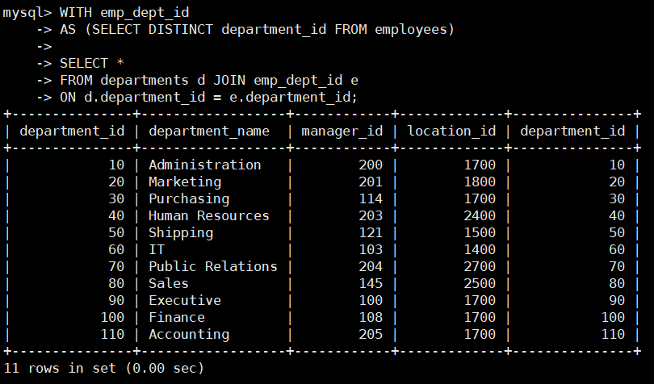

例子说明，公用表表达式可以起到子查询的作用。以后如果遇到需要使用子查询的场景，你可以在查询之前，先定义公用表表达式，然后在查询中用它来代替子查询。而且，跟子查询相比，公用表表达式有一个优点，就是定义过公用表表达式之后的查询，可以像一个表一样多次引用公用表表达式，而子查询则不能。


#### 3.2 递归公用表表达式

递归公用表表达式也是一种公用表表达式，只不过，除了普通公用表表达式的特点以外，它还有自己的特点，就是**可以调用自己。**它的语法结构是：

```mysql
WITH RECURSIVE CTE名称 
AS （子查询）
SELECT|DELETE|UPDATE 语句;
```

递归公用表表达式由 2 部分组成，分别是种子查询和递归查询，中间通过关键字 UNION [ALL]进行连接。这里的**种子查询，意思就是获得递归的初始值**。这个查询只会运行一次，以创建初始数据集，之后递归查询会一直执行，直到没有任何新的查询数据产生，递归返回。


**案例：**针对于我们常用的employees表，包含employee_id，last_name 和 manager_id 三个字段。如果a是b的管理者，那么，我们可以把b叫做a的下属，如果同时b又是c的管理者，那么c就是b的下属，是a的下下属。

下面我们尝试用查询语句列出所有具有下下属身份的人员信息。

如果用我们之前学过的知识来解决，会比较复杂，至少要进行 4 次查询才能搞定：

- 第一步，先找出初代管理者，就是不以任何别人为管理者的人，把结果存入临时表；
- 第二步，找出所有以初代管理者为管理者的人，得到一个下属集，把结果存入临时表；
- 第三步，找出所有以下属为管理者的人，得到一个下下属集，把结果存入临时表。
- 第四步，找出所有以下下属为管理者的人，得到一个结果集。

如果第四步的结果集为空，则计算结束，第三步的结果集就是我们需要的下下属集了，否则就必须继续进行第四步，一直到结果集为空为止。比如上面的这个数据表，就需要到第五步，才能得到空结果集。而且，最后还要进行第六步：把第三步和第四步的结果集合并，这样才能最终获得我们需要的结果集。


如果用递归公用表表达式，就非常简单了。我介绍下具体的思路。

- 用递归公用表表达式中的种子查询，找出初代管理者。字段 n 表示代次，初始值为 1，表示是第一代管理者。
- 用递归公用表表达式中的递归查询，查出以这个递归公用表表达式中的人为管理者的人，并且代次的值加 1。直到没有人以这个递归公用表表达式中的人为管理者了，递归返回。
- 在最后的查询中，选出所有代次大于等于 3 的人，他们肯定是第三代及以上代次的下属了，也就是下下属了。这样就得到了我们需要的结果集。

这里看似也是 3 步，实际上是一个查询的 3 个部分，只需要执行一次就可以了。而且也不需要用临时表保存中间结果，比刚刚的方法简单多了。

**代码实现：**

```mysql
WITH RECURSIVE cte
AS
(
SELECT 
    employee_id, last_name,manager_id,1 AS n FROM employees WHERE employee_id = 100
    -- 种子查询，找到第一代领导
UNION ALL
SELECT 
    a.employee_id, a.last_name, a.manager_id, n+1 
FROM employees AS a JOIN cte
ON (a.manager_id = cte.employee_id) -- 递归查询，找出以递归公用表表达式的人为领导的人
)

SELECT employee_id, last_name FROM cte WHERE n >= 3;
```

总之，递归公用表表达式对于查询一个有共同的根节点的树形结构数据，非常有用。它可以不受层级的限制，轻松查出所有节点的数据。如果用其他的查询方式，就比较复杂了。


#### 3.3 小结

公用表表达式的作用是可以替代子查询，而且可以被多次引用。递归公用表表达式对查询有一个共同根节点的树形结构数据非常高效，可以轻松搞定其他查询方式难以处理的查询。
# MySQL_高级__架构篇

> 讲师：尚硅谷-宋红康（江湖人称：康师傅）
>
> 尚硅谷官网：[http://www.atguigu.com](http://www.atguigu.com/)
>
> 视频链接：https://www.bilibili.com/video/BV1iq4y1u7vj?spm_id_from=333.337.search-card.all.click

------

## 一、MySQL的数据目录

### 1 MySQL8的主要目录结构

```mysql
find / -name mysql
```

安装好MySQL 8之后，我们查看如下的目录结构：

#### 1.1 数据库文件的存放路径

**MySQL数据库文件的存放路径：/var/lib/mysql/**

```mysql
mysql> show variables like 'datadir';
+-------------------+-------------------+
| Variable_name     | Value             |
+-------------------+-------------------+
| datadir           | /var/lib/mysql/   |
+-------------------+-------------------+
1 row in set (0.04 sec)
```

从结果中可以看出，在我的计算机上MySQL的数据目录就是`/var/lib/mysql/`。


#### 1.2 相关命令目录

**相关命令目录：/usr/bin（mysqladmin、mysqlbinlog、mysqldump等命令）和/usr/sbin。**


#### 1.3 配置文件目录

**配置文件目录：/usr/share/mysql-8.0（命令及配置文件），/etc/mysql（如my.cnf）**

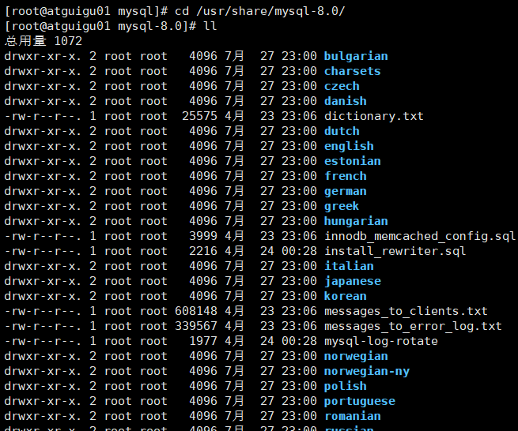

### 2 数据库和文件系统的关系

#### 2.1 查看默认数据库

查看一下在我的计算机上当前有哪些数据库：

```mysql
mysql> SHOW DATABASES;
```

可以看到有4个数据库是属于MySQL自带的系统数据库。

- `mysql`

  MySQL系统自带的核心数据库，它存储了MySQL的用户账户和权限信息，一些存储过程、事件的定义信息，一些运行过程中产生的日志信息，一些帮助信息以及时区信息等。

- `information_schema`

  MySQL系统自带的数据库，这个数据库保存着MySQL服务器`维护的所有其他数据库的信息`，比如有哪些表、哪些视图、哪些触发器、哪些列、哪些索引。这些信息并不是真实的用户数据，而是一些描述性信息，有时候也称之为`元数据`。在系统数据库`information_schema`中提供了一些以`innodb_sys`开头的表，用于表示内部系统表。

  ```mysql
  mysql> USE information_schema;
  Database changed
  
  mysql> SHOW TABLES LIKE 'innodb_sys%';
  +-----------------------------------------------------------+
  | Tables_in_information_schema (innodb_sys%)                |
  +-----------------------------------------------------------+
  | INNODB_SYS_DATAFILES                                      |
  | INNODB_SYS_VIRTUAL                                        |
  | INNODB_SYS_INDEXES                                        |
  | INNODB_SYS_TABLES                                         |
  | INNODB_SYS_FIELDS                                         |
  | INNODB_SYS_TABLESPACES                                    |
  | INNODB_SYS_FOREIGN_COLS                                   |
  | INNODB_SYS_COLUMNS                                        |
  | INNODB_SYS_FOREIGN                                        |
  | INNODB_SYS_TABLESTATS                                     |  
  +-----------------------------------------------------------+
  ```

- `performance_schema`

  MySQL系统自带的数据库，这个数据库里主要保存MySQL服务器运行过程中的一些状态信息，可以用来`监控 MySQL 服务的各类性能指标`。包括统计最近执行了哪些语句，在执行过程的每个阶段都花费了多长时间，内存的使用情况等信息。

- `sys`

  MySQL系统自带的数据库，这个数据库主要是通过`视图`的形式把`information_schema`和`performance_schema`结合起来，帮助系统管理员和开发人员监控 MySQL 的技术性能。


#### 2.2 数据库在文件系统中的表示

看一下我的计算机上的数据目录下的内容：

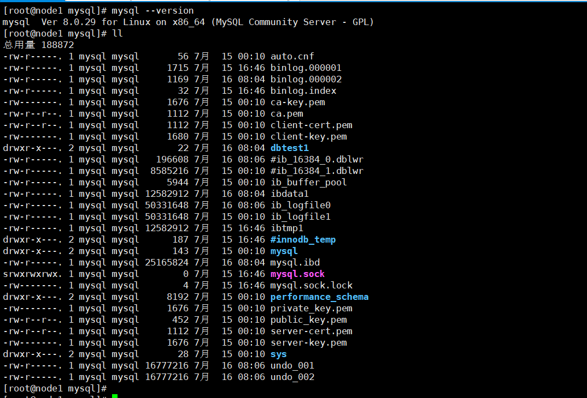

这个数据目录下的文件和子目录比较多，除了`information_schema`这个系统数据库外，其他的数据库在`数据目录`下都有对应的子目录。

以我的`dbtest1`数据库为例，在MySQL5.7中打开：


在MySQL8.0中打开：


#### 2.3 表在文件系统中的表示

##### 2.3.1 InnoDB存储引擎模式

1. **表结构**

为了保存表结构，`InnoDB`在`数据目录`下对应的数据库子目录下创建了一个专门用于`描述表结构的文件`，文件名是这样：

```
表名.frm
```

比方说我们在`atguigu`数据库下创建一个名为`test`的表：

```mysql
mysql> USE atguigu;
Database changed

mysql> CREATE TABLE test (
	-> 		c1 INT
	-> );
Query OK, 0 rows affected (0.03 sec)
```

那在数据库`atguigu`对应的子目录下就会创建一个名为`test.frm`的用于描述表结构的文件。.frm文件的格式在不同的平台上都是相同的。这个后缀名为.frm是以`二进制格式`存储的，我们直接打开是乱码的。

2. **表中数据和索引**

**1 系统表空间（system tablespace）**

默认情况下，InnoDB会在数据目录下创建一个名为`ibdata1`、大小为`12M`的文件，这个文件就是对应的`系统表空间`在文件系统上的表示。怎么才12M？注意这个文件是`自扩展文件`，当不够用的时候它会自己增加文件大小。

当然，如果你想让系统表空间对应文件系统上多个实际文件，或者仅仅觉得原来的`ibdata1`这个文件名难听，那可以在MySQL启动时配置对应的文件路径以及它们的大小，比如我们这样修改一下my.cnf配置文件：

```properties
[server]
innodb_data_file_path=data1:512M;data2:512M:autoextend
```

**2 独立表空间(file-per-table tablespace)**

在MySQL5.6.6以及之后的版本中，InnoDB并不会默认的把各个表的数据存储到系统表空间中，而是为`每一个表建立一个独立表空间`，也就是说我们创建了多少个表，就有多少个独立表空间。使用`独立表空间`来存储表数据的话，会在该表所属数据库对应的子目录下创建一个表示该独立表空间的文件，文件名和表名相同，只不过添加了一个`.ibd`的扩展名而已，所以完整的文件名称长这样：

```
表名.ibd
```

比如：我们使用了`独立表空间`去存储`atguigu`数据库下的`test`表的话，那么在该表所在数据库对应的`atguigu`目录下会为`test`表创建这两个文件：

```
test.frm
test.ibd
```

其中`test.ibd`文件就用来存储`test`表中的数据和索引。

**3 系统表空间与独立表空间的设置**

我们可以自己指定使用`系统表空间`还是`独立表空间`来存储数据，这个功能由启动参数`innodb_file_per_table`控制，比如说我们想刻意将表数据都存储到`系统表空间`时，可以在启动MySQL服务器的时候这样配置：

```properties
[server]
innodb_file_per_table=0  # 0：代表使用系统表空间； 1：代表使用独立表空间
```

默认情况：

```mysql
mysql> show variables like 'innodb_file_per_table';
+----------------------------+--------+
| Variable_name              | Value  |
+----------------------------+--------+
| innodb_file_per_table      | ON     |
+----------------------------+--------+
1 row in set (0.01 sec)
```

**4 其他类型的表空间**

随着MySQL的发展，除了上述两种老牌表空间之外，现在还新提出了一些不同类型的表空间，比如通用表空间（general tablespace）、临时表空间（temporary tablespace）等。


##### 2.3.2 MyISAM存储引擎模式

1. **表结构**

在存储表结构方面，`MyISAM`和`InnoDB`一样，也是在`数据目录`下对应的数据库子目录下创建了一个专门用于描述表结构的文件：

```
表名.frm
```

2. **表中数据和索引**

在MyISAM中的索引全部都是`二级索引`，该存储引擎的`数据和索引是分开存放`的。所以在文件系统中也是使用不同的文件来存储数据文件和索引文件，同时表数据都存放在对应的数据库子目录下。假如`test`表使用MyISAM存储引擎的话，那么在它所在数据库对应的`atguigu`目录下会为`test`表创建这三个文件：

```
test.frm 存储表结构
test.MYD 存储数据 (MYData)
test.MYI 存储索引 (MYIndex)
```

举例：创建一个`MyISAM`表，使用`ENGINE`选项显式指定引擎。因为`InnoDB`是默认引擎。

```mysql
CREATE TABLE `student_myisam` (
	`id` bigint NOT NULL AUTO_INCREMENT,
	`name` varchar(64) DEFAULT NULL,
	`age` int DEFAULT NULL,
	`sex` varchar(2) DEFAULT NULL,
	PRIMARY KEY (`id`)
) ENGINE=MYISAM AUTO_INCREMENT=0 DEFAULT CHARSET=utf8mb3;
```

#### 2.4 小结

举例：`数据库a`，`表b`。

1. 如果表b采用`InnoDB`，data/a中会产生1个或者2个文件：

   - `b.frm`：描述表结构文件，字段长度等
   - 如果采用`系统表空间`模式的，数据信息和索引信息都存储在`ibdata1`中
   - 如果采用`独立表空间`存储模式，data/a中还会产生`b.ibd`文件（存储数据信息和索引信息）

   此外：

   1. MySQL5.7中会在data/a的目录下生成`db.opt`文件用于保存数据库的相关配置。比如：字符集、比较规则。

      而MySQL8.0不再提供db.opt文件。

   2. MySQL8.0中不再单独提供b.frm，而是合并在b.ibd文件中。

2. 如果表b采用`MyISAM`，data/a中会产生3个文件：

   - MySQL5.7中：`b.frm`：描述表结构文件，字段长度等。

     MySQL8.0中：`b_xxx.sdi`：描述表结构文件，字段长度等

   - `b.MYD`(MYData)：数据信息文件，存储数据信息(如果采用独立表存储模式)

   - `b.MYI`(MYIndex)：存放索引信息文件

------

## 二、用户与权限管理

### 1 用户管理

#### 1.1 登录MySQL服务器

启动MySQL服务后，可以通过mysql命令来登录MySQL服务器，命令如下：

```
mysql –h hostname|hostIP –P port –u username –p DatabaseName –e "SQL语句"
```

下面详细介绍命令中的参数：

- `-h参数` 后面接主机名或者主机IP，hostname为主机，hostIP为主机IP。
- `-P参数` 后面接MySQL服务的端口，通过该参数连接到指定的端口。MySQL服务的默认端口是3306，不使用该参数时自动连接到3306端口，port为连接的端口号。
- `-u参数` 后面接用户名，username为用户名。
- `-p参数` 会提示输入密码。
- `DatabaseName参数` 指明登录到哪一个数据库中。如果没有该参数，就会直接登录到MySQL数据库中，然后可以使用USE命令来选择数据库。
- `-e参数` 后面可以直接加SQL语句。登录MySQL服务器以后即可执行这个SQL语句，然后退出MySQL服务器。

举例：

```
mysql -uroot -p -hlocalhost -P3306 mysql -e "select host,user from user"
```


#### 1.2 创建用户

CREATE USER语句的基本语法形式如下：

```mysql
CREATE USER 用户名 [IDENTIFIED BY '密码'][, 用户名 [IDENTIFIED BY '密码']];
```

- 用户名参数表示新建用户的账户，由`用户（User）`和`主机名（Host）`构成；
- “[]”表示可选，也就是说，可以指定用户登录时需要密码验证，也可以不指定密码验证，这样用户可以直接登录。不过，不指定密码的方式不安全，不推荐使用。如果指定密码值，这里需要使用`IDENTIFIED BY`指定明文密码值。
- `CREATE USER`语句可以同时创建多个用户。

举例：

```mysql
CREATE USER zhang3 IDENTIFIED BY '123123'; # 默认host是 %

CREATE USER 'xk'@'localhost' IDENTIFIED BY '123456';
```


#### 1.3 修改用户

修改用户名：

```mysql
UPDATE mysql.user SET `user`='li4' WHERE `user`='wang5';

FLUSH PRIVILEGES;
```

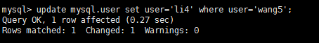

#### 1.4 删除用户

**方式1：使用DROP方式删除（推荐）**

使用DROP USER语句来删除用户时，必须用于DROP USER权限。DROP USER语句的基本语法形式如下：

```mysql
DROP USER user [ , user] … ;
```

举例：

```mysql
DROP USER li4; # 默认删除host为%的用户

DROP USER 'kangshifu'@'localhost';
```


**方式2：使用DELETE方式删除**

```mysql
DELETE FROM mysql.user WHERE `host`=’hostname’ AND `user`=’username’;
```

执行完DELETE命令后要使用FLUSH命令来使用户生效，命令如下：

```mysql
FLUSH PRIVILEGES;
```

举例：

```mysql
DELETE FROM mysql.user WHERE `host`='localhost' AND `user`='kangshifu';

FLUSH PRIVILEGES;
```

> 注意：不推荐通过`DELETE FROM USER u WHERE user='li4'`进行删除，系统会有残留信息保留。而drop user命令会删除用户以及对应的权限，执行命令后你会发现mysql.user表和mysql.db表的相应记录都消失了。

#### 1.5 设置当前用户密码

`旧的写法如下：`

```mysql
# 修改当前用户的密码：（MySQL5.7测试有效）
SET PASSWORD = PASSWORD('123456');
```

这里介绍`推荐的写法`：

1. **使用ALTER USER命令来修改当前用户密码**

   用户可以使用ALTER命令来修改自身密码，如下语句代表修改当前登录用户的密码。基本语法如下：

   ```mysql
   ALTER USER USER() IDENTIFIED BY 'new_password';
   ```

2. **使用SET语句来修改当前用户密码**

   使用root用户登录MySQL后，可以使用SET语句来修改密码，具体SQL语句如下：

   ```mysql
   SET PASSWORD = 'new_password';
   ```

   该语句会自动将密码加密后再赋给当前用户。


#### 1.6 修改其它用户密码

1. **使用ALTER语句来修改普通用户的密码**

  可以使用ALTER USER语句来修改普通用户的密码。基本语法形式如下：

  ```mysql
  ALTER USER user [IDENTIFIED BY '新密码'] [,user[IDENTIFIED BY '新密码']] … ;
  ```

2. **使用SET命令来修改普通用户的密码** 

  使用root用户登录到MySQL服务器后，可以使用SET语句来修改普通用户的密码。SET语句的代码如下：

  ```mysql
  SET PASSWORD FOR 'username'@'hostname' = 'new_password';
  ```

3. **使用UPDATE语句修改普通用户的密码（不推荐）**

  ```mysql
  UPDATE MySQL.user SET authentication_string=PASSWORD("123456")
  WHERE User = "username" AND Host = "hostname";
  ```


#### 1.7 MySQL8密码管理(了解)

1. 密码过期策略

- 在MySQL中，数据库管理员可以`手动设置`账号密码过期，也可以建立一个`自动`密码过期策略。
- 过期策略可以是`全局的`，也可以为`每个账号`设置单独的过期策略。

```mysql
ALTER USER 'username'@'hostname' PASSWORD EXPIRE;
```

练习：

```mysql
ALTER USER 'kangshifu'@'localhost' PASSWORD EXPIRE;
```

- **方式1：使用SQL语句更改该变量的值并持久化**

  ```mysql
  SET PERSIST default_password_lifetime = 180; # 建立全局策略，设置密码每隔180天过期
  ```

- **方式2：配置文件my.cnf中进行维护**

  ```mysql
  [mysqld]
  default_password_lifetime=180 #建立全局策略，设置密码每隔180天过期
  ```

**手动设置指定时间过期方式2：单独设置**

每个账号既可延用全局密码过期策略，也可单独设置策略。在`CREATE USER`和`ALTER USER`语句上加入`PASSWORD EXPIRE`选项可实现单独设置策略。下面是一些语句示例。

```mysql
#设置kangshifu账号密码每90天过期：
CREATE USER 'kangshifu'@'localhost' PASSWORD EXPIRE INTERVAL 90 DAY;
ALTER USER 'kangshifu'@'localhost' PASSWORD EXPIRE INTERVAL 90 DAY;

#设置密码永不过期：
CREATE USER 'kangshifu'@'localhost' PASSWORD EXPIRE NEVER;
ALTER USER 'kangshifu'@'localhost' PASSWORD EXPIRE NEVER;

#延用全局密码过期策略：
CREATE USER 'kangshifu'@'localhost' PASSWORD EXPIRE DEFAULT;
ALTER USER 'kangshifu'@'localhost' PASSWORD EXPIRE DEFAULT;
```


2. 密码重用策略

- **手动设置密码重用方式1：全局**

  - **方式1：使用SQL**

    ```mysql
    SET PERSIST password_history = 6; #设置不能选择最近使用过的6个密码
    
    SET PERSIST password_reuse_interval = 365; #设置不能选择最近一年内的密码
    ```

    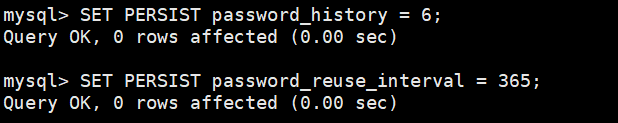

  - **方式2：my.cnf配置文件**

    ```
    [mysqld]
    password_history=6
    password_reuse_interval=365
    ```

- **手动设置密码重用方式2：单独设置**

  ```mysql
  #不能使用最近5个密码：
  CREATE USER 'kangshifu'@'localhost' PASSWORD HISTORY 5;
  ALTER USER 'kangshifu'@'localhost' PASSWORD HISTORY 5;
  
  #不能使用最近365天内的密码：
  CREATE USER 'kangshifu'@'localhost' PASSWORD REUSE INTERVAL 365 DAY;
  ALTER USER 'kangshifu'@'localhost' PASSWORD REUSE INTERVAL 365 DAY;
  
  #既不能使用最近5个密码，也不能使用365天内的密码
  CREATE USER 'kangshifu'@'localhost' 
  PASSWORD HISTORY 5
  PASSWORD REUSE INTERVAL 365 DAY;
  
  ALTER USER 'kangshifu'@'localhost'
  PASSWORD HISTORY 5
  PASSWORD REUSE INTERVAL 365 DAY;
  ```


### 2 权限管理

#### 2.1 权限列表

MySQL到底都有哪些权限呢？

```mysql
 show privileges;
```


- `CREATE 和 DROP 权限`:可以创建新的数据库和表，或删除（移掉）已有的数据库和表。如果将MySQL数据库中的DROP权限授予某用户，用户就可以删除MySQL访问权限保存的数据库。
- `SELECT、INSERT、UPDATE 和 DELETE 权限`:允许在一个数据库现有的表上实施操作。
- `SELECT 权限`:只有在它们真正从一个表中检索行时才被用到。
- `INDEX 权限`:允许创建或删除索引，INDEX适用于已有的表。如果具有某个表的CREATE权限，就可以在CREATE TABLE语句中包括索引定义。
- `ALTER 权限`:可以使用ALTER TABLE来更改表的结构和重新命名表。
- `CREATE ROUTINE 权限`:用来创建保存的程序（函数和程序），ALTER ROUTINE权限用来更改和删除保存的程序。
- `EXECUTE 权限`:用来执行保存的程序。
- `GRANT 权限`:允许授权给其他用户，可用于数据库、表和保存的程序。 
- `FILE 权限`:使用户可以使用LOAD DATA INFILE和SELECT ... INTO OUTFILE语句读或写服务器上的文件，任何被授予FILE权限的用户都能读或写MySQL服务器上的任何文件（说明用户可以读任何数据库目录下的文件，因为服务器可以访问这些文件）。

#### 2.2 授予权限的原则

权限控制主要是出于安全因素，因此需要遵循以下几个`经验原则`：

1. 只授予能`满足需要的最小权限`，防止用户干坏事。比如用户只是需要查询，那就只给select权限就可以了，不要给用户赋予update、insert或者delete权限。
2. 创建用户的时候`限制用户的登录主机`，一般是限制成指定IP或者内网IP段。
3. 为每个用户`设置满足密码复杂度的密码`。
4. `定期清理不需要的用户`，回收权限或者删除用户。

#### 2.3 授予权限

给用户授权的方式有 2 种，分别是通过把`角色赋予用户给用户授权`和`直接给用户授权`。用户是数据库的使用者，我们可以通过给用户授予访问数据库中资源的权限，来控制使用者对数据库的访问，消除安全隐患。

授权命令：

```mysql
GRANT 权限1,权限2,…权限n ON 数据库名称.表名称 TO 用户名@用户地址 [IDENTIFIED BY ‘密码口令’];
```

- 该权限如果发现没有该用户，则会直接新建一个用户。

- 比如：给li4用户用本地命令行方式，授予atguigudb这个库下的所有表的插删改查的权限。

  ```mysql
  GRANT SELECT,INSERT,DELETE,UPDATE ON atguigudb.* TO li4@localhost;
  ```

- 授予通过网络方式登录的joe用户，对所有库所有表的全部权限，密码设为123。注意这里唯独不包括grant的权限

  ```mysql
  GRANT ALL PRIVILEGES ON *.* TO 'joe'@'%' IDENTIFIED BY '123';
  ```

> 我们在开发应用的时候，经常会遇到一种需求，就是要根据用户的不同，对数据进行横向和纵向的分组。
>
> - 所谓横向的分组，就是指用户可以接触到的数据的范围，比如可以看到哪些表的数据；
> - 所谓纵向的分组，就是指用户对接触到的数据能访问到什么程度，比如能看、能改，甚至是删除。


#### 2.4 查看权限

**查看当前用户权限**

```mysql
SHOW GRANTS;
# 或
SHOW GRANTS FOR CURRENT_USER;
# 或
SHOW GRANTS FOR CURRENT_USER();
```

**查看某用户的全局权限**

```mysql
SHOW GRANTS FOR 'user'@'主机地址';
```


#### 2.5 收回权限

收回权限就是取消已经赋予用户的某些权限。**收回用户不必要的权限可以在一定程度上保证系统的安全性。**MySQL中使用`REVOKE语句`取消用户的某些权限。使用REVOKE收回权限之后，用户账户的记录将从db、host、tables_priv和columns_priv表中删除，但是用户账户记录仍然在user表中保存（删除user表中的账户记录使用DROP USER语句）。

**注意：在将用户账户从user表删除之前，应该收回相应用户的所有权限。**

- 收回权限命令

  ```mysql
  REVOKE 权限1,权限2,…权限n ON 数据库名称.表名称 FROM 用户名@用户地址;
  ```

- 举例

  ```mysql
  #收回全库全表的所有权限
  REVOKE ALL PRIVILEGES ON *.* FROM joe@'%';
  
  #收回mysql库下的所有表的插删改查权限
  REVOKE SELECT,INSERT,UPDATE,DELETE ON mysql.* FROM 'joe'@'localhost';
  ```

- 注意：`须用户重新登录后才能生效`


### 3 权限表

#### 3.1 user表

user表是MySQL中最重要的一个权限表，记录用户账号和权限信息，有49个字段。如下图：


这些字段可以分成4类，分别是`范围列（或用户列）`、`权限列`、`安全列`和`资源控制列`。


1. **范围列（或用户列）**

- host：表示连接类型
  - `%`:表示所有远程通过TCP方式的连接
  - `IP地址`:如(192.168.1.2、127.0.0.1)通过制定ip地址进行的TCP方式的连接
  - `机器名`:通过制定网络中的机器名进行的TCP方式的连接
  - `::1`:IPv6的本地ip地址，等同于IPv4的 127.0.0.1
  - `localhost`:本地方式通过命令行方式的连接，比如`mysql -u xxx -p xxx`方式的连接。
- user：表示用户名，同一用户通过不同方式链接的权限是不一样的。
- password：密码
  - 所有密码串通过`password(明文字符串)`生成的密文字符串。MySQL 8.0 在用户管理方面增加了角色管理，默认的密码加密方式也做了调整，由之前的`SHA1`改为了`SHA2`，不可逆。同时加上 MySQL 5.7 的禁用用户和用户过期的功能，MySQL 在用户管理方面的功能和安全性都较之前版本大大的增强了。
  - mysql 5.7 及之后版本的密码保存到`authentication_string`字段中不再使用password字段。

2. **权限列**

- `Grant_priv`字段：表示是否拥有GRANT权限
- `Shutdown_priv`字段：表示是否拥有停止MySQL服务的权限
- `Super_priv`字段：表示是否拥有超级权限
- `Execute_priv`字段：表示是否拥有EXECUTE权限。拥有EXECUTE权限，可以执行存储过程和函数。
- `Select_priv`,`Insert_priv`等：为该用户所拥有的权限。

3. **安全列**

安全列只有6个字段，其中两个是ssl相关的（ssl_type、ssl_cipher），用于`加密`；两个是x509相关的（x509_issuer、x509_subject），用于`标识用户`；另外两个Plugin字段用于`验证用户身份`的插件，该字段不能为空。如果该字段为空，服务器就使用内建授权验证机制验证用户身份。

4. **资源控制列**

资源控制列的字段用来`限制用户使用的资源`，包含4个字段，分别为：

1. `max_questions`，用户每小时允许执行的查询操作次数； 
2. `max_updates`，用户每小时允许执行的更新操作次数；
3. `max_connections`，用户每小时允许执行的连接操作次数；
4. `max_user_connections`，用户允许同时建立的连接次数。

查看字段：

```mysql
DESC mysql.user;
```

查看用户, 以列的方式显示数据：

```mysql
SELECT * FROM mysql.user \G
```

查询特定字段：

```mysql
SELECT host, `user`, authentication_string, select_priv, insert_priv, drop_priv FROM mysql.user;
```

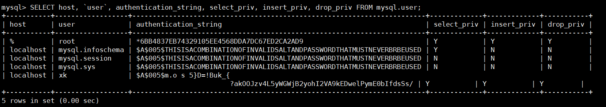

#### 3.2 db表

使用DESCRIBE查看db表的基本结构：

```mysql
DESCRIBE mysql.db;
```

1. **用户列**

db表用户列有3个字段，分别是Host、User、Db。这3个字段分别表示主机名、用户名和数据库名。表示从某个主机连接某个用户对某个数据库的操作权限，这3个字段的组合构成了db表的主键。

2. **权限列**

Create_routine_priv和Alter_routine_priv这两个字段决定用户是否具有创建和修改存储过程的权限。


#### 3.3 tables_priv表和columns_priv表

tables_priv表用来`对表设置操作权限`，columns_priv表用来对表的`某一列设置权限`。tables_priv表和columns_priv表的结构分别如图：

```mysql
desc mysql.tables_priv;

desc mysql.columns_priv;
```

tables_priv表有8个字段，分别是Host、Db、User、Table_name、Grantor、Timestamp、Table_priv和Column_priv，各个字段说明如下：

- `Host`、`Db`、`User`和`Table_name`四个字段分别表示主机名、数据库名、用户名和表名。
- Grantor表示修改该记录的用户。
- Timestamp表示修改该记录的时间。
- `Table_priv`表示对象的操作权限。包括Select、Insert、Update、Delete、Create、Drop、Grant、References、Index和Alter。
- Column_priv字段表示对表中的列的操作权限，包括Select、Insert、Update和References。


#### 3.4 procs_priv表

procs_priv表可以对`存储过程和存储函数设置操作权限`，表结构如图：

```mysql
desc mysql.procs_priv;
```

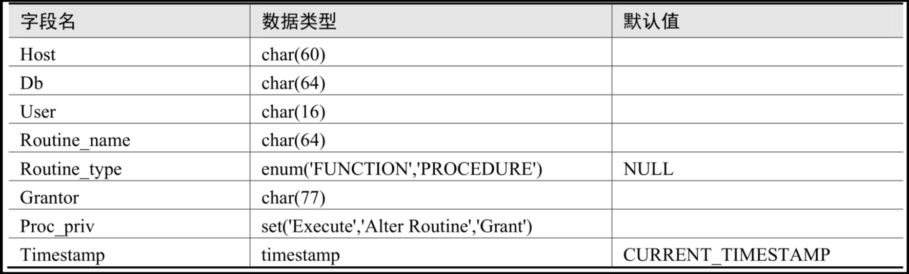


### 4 访问控制(了解)

#### 4.1 连接核实阶段

- 当用户试图连接MySQL服务器时，服务器基于用户的身份以及用户是否能提供正确的密码验证身份来确定接受或者拒绝连接。即客户端用户会在连接请求中提供用户名、主机地址、用户密码，MySQL服务器接收到用户请求后，会**使用user表中的host、user和authentication_string这3个字段匹配客户端提供信息。**
- 服务器只有在user表记录的Host和User字段匹配客户端主机名和用户名，并且提供正确的密码时才接受连接。**如果连接核实没有通过，服务器就完全拒绝访问；否则，服务器接受连接，然后进入阶段2等待用户请求。**

#### 4.2 请求核实阶段

- 一旦建立了连接，服务器就进入了访问控制的阶段2，也就是请求核实阶段。对此连接上进来的每个请求，服务器检查该请求要执行什么操作、是否有足够的权限来执行它，这正是需要授权表中的权限列发挥作用的地方。这些权限可以来自user、db、table_priv和column_priv表。
- 确认权限时，MySQL首先`检查user表`，如果指定的权限没有在user表中被授予，那么MySQL就会继续`检查db表`，db表是下一安全层级，其中的权限限定于数据库层级，在该层级的SELECT权限允许用户查看指定数据库的所有表中的数据；如果在该层级没有找到限定的权限，则MySQL继续`检查tables_priv表`以及`columns_priv表`，如果所有权限表都检查完毕，但还是没有找到允许的权限操作，MySQL将`返回错误信息`，用户请求的操作不能执行，操作失败。

> 提示：MySQL通过向下层级的顺序（从user表到columns_priv表）检查权限表，但并不是所有的权限都要执行该过程。例如，一个用户登录到MySQL服务器之后只执行对MySQL的管理操作，此时只涉及管理权限，因此MySQL只检查user表。另外，如果请求的权限操作不被允许，MySQL也不会继续检查下一层级的表


### 5 角色管理

#### 5.1 角色的理解

引入角色的目的是`方便管理拥有相同权限的用户`。**恰当的权限设定，可以确保数据的安全性，这是至关重要的。**


#### 5.2 创建角色

创建角色使用`CREATE ROLE`语句，语法如下：

```mysql
CREATE ROLE 'role_name'[@'host_name'] [,'role_name'[@'host_name']] ...
```

角色名称的命名规则和用户名类似。如果`host_name省略，默认为%，role_name不可省略，不可为空`。

练习：我们现在需要创建一个经理的角色，就可以用下面的代码：

```mysql
CREATE ROLE 'manager'@'localhost';
```

#### 5.3 给角色赋予权限

创建角色之后，默认这个角色是没有任何权限的，我们需要给角色授权。给角色授权的语法结构是：

```mysql
GRANT privileges ON table_name TO 'role_name'[@'host_name'];
```

上述语句中privileges代表权限的名称，多个权限以逗号隔开。可使用SHOW语句查询权限名称，下图列出了部分权限列表。

```mysql
SHOW PRIVILEGES\G;
```

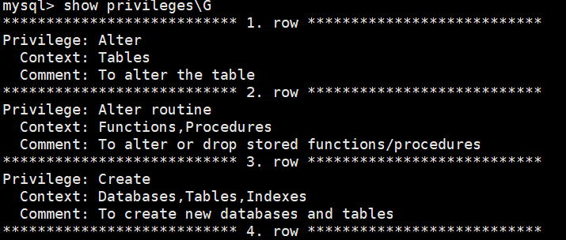

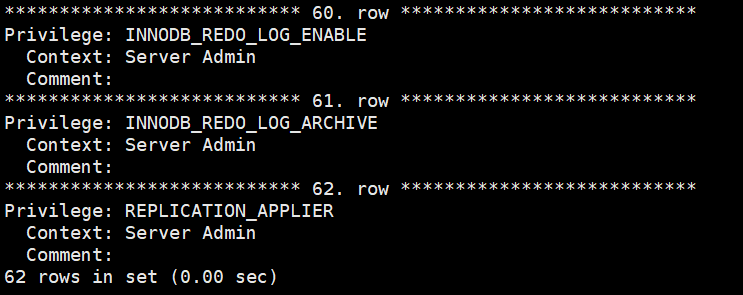

**练习：我们现在想给经理角色授予商品信息表、盘点表和应付账款表的只读权限，就可以用下面的代码来实现：**

```mysql
GRANT SELECT ON demo.settlement TO 'manager';
GRANT SELECT ON demo.goodsmaster TO 'manager';
GRANT SELECT ON demo.invcount TO 'manager';
```

#### 5.4 查看角色的权限

赋予角色权限之后，我们可以通过 SHOW GRANTS 语句，来查看权限是否创建成功了：

```mysql
mysql> SHOW GRANTS FOR 'manager';
+---------------------------------------------------------------------------------+
| Grants for manager@%                                                            |
+---------------------------------------------------------------------------------+
| GRANT USAGE ON *.* TO `manager`@`%`                                             |
| GRANT SELECT ON `demo`.`goodsmaster` TO `manager`@`%`                           |
| GRANT SELECT ON `demo`.`invcount` TO `manager`@`%`                              |
| GRANT SELECT ON `demo`.`settlement` TO `manager`@`%`                            |
+---------------------------------------------------------------------------------+

```

只要你创建了一个角色，系统就会自动给你一个“`USAGE`”权限，意思是`连接登录数据库的权限`。代码的最后三行代表了我们给角色“manager”赋予的权限，也就是对商品信息表、盘点表和应付账款表的只读权限。

结果显示，库管角色拥有商品信息表的只读权限和盘点表的增删改查权限。

#### 5.5 回收角色的权限

角色授权后，可以对角色的权限进行维护，对权限进行添加或撤销。添加权限使用GRANT语句，与角色授权相同。撤销角色或角色权限使用REVOKE语句。

修改了角色的权限，会影响拥有该角色的账户的权限。

撤销角色权限的SQL语法如下：

```mysql
REVOKE privileges ON tablename FROM 'rolename';
```

练习：撤销school_write角色的权限。 

1. 使用如下语句撤销school_write角色的权限。

   ```mysql
   REVOKE INSERT, UPDATE, DELETE ON school.* FROM 'school_write';
   ```

2. 撤销后使用SHOW语句查看school_write对应的权限，语句如下。

   ```mysql
   SHOW GRANTS FOR 'school_write';
   ```

#### 5.6 删除角色

当我们需要对业务重新整合的时候，可能就需要对之前创建的角色进行清理，删除一些不会再使用的角色。删除角色的操作很简单，你只要掌握语法结构就行了。

```mysql
DROP ROLE role [, role2]...
```

注意，`如果你删除了角色，那么用户也就失去了通过这个角色所获得的所有权限`。

练习：执行如下SQL删除角色school_read。

```mysql
DROP ROLE 'school_read';
```

#### 5.7 给用户赋予角色

角色创建并授权后，要赋给用户并处于`激活状态`才能发挥作用。给用户添加角色可使用GRANT语句，语法形式如下：

```mysql
GRANT role [,role2,...] TO `user` [,`user2`,...];
```

在上述语句中，role代表角色，user代表用户。可将多个角色同时赋予多个用户，用逗号隔开即可。

练习：给kangshifu用户添加角色school_read权限。

1. 使用GRANT语句给kangshifu添加school_read权限，SQL语句如下。

   ```mysql
   GRANT 'school_read' TO 'kangshifu'@'localhost';
   ```

2. 添加完成后使用SHOW语句查看是否添加成功，SQL语句如下。

   ```mysql
   SHOW GRANTS FOR 'kangshifu'@'localhost';
   ```

3. 使用kangshifu用户登录，然后查询当前角色，如果角色未激活，结果将显示NONE。SQL语句如下。

   ```mysql
   SELECT CURRENT_ROLE();
   ```

   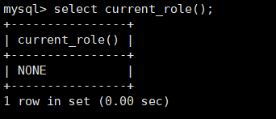

#### 5.8 激活角色

**方式1：使用set default role 命令激活角色**

举例：

```mysql
SET DEFAULT ROLE ALL TO 'kangshifu'@'localhost';
```

举例：使用`SET DEFAULT ROLE`为下面4个用户默认激活所有已拥有的角色如下：

```mysql
SET DEFAULT ROLE ALL TO
	'dev1'@'localhost',
	'read_user1'@'localhost',
	'read_user2'@'localhost',
	'rw_user1'@'%';
```

**方式2：将activate_all_roles_on_login设置为ON**

默认情况：

```mysql
mysql> show variables like 'activate_all_roles_on_login';
+-----------------------------------+-------+
| Variable_name                   | Value |
+-----------------------------------+-------+
| activate_all_roles_on_login | OFF   |
+-----------------------------------+-------+
1 row in set (0.00 sec)
```

设置：

```mysql
SET GLOBAL activate_all_roles_on_login=ON;
```

这条SQL语句的意思是，对`所有角色永久激活`。运行这条语句之后，用户才真正拥有了赋予角色的所有权限。

#### 5.9 撤销用户的角色

撤销用户角色的SQL语法如下：

```mysql
REVOKE role FROM user;
```

练习：撤销kangshifu用户的school_read角色。

1. 撤销的SQL语句如下

```mysql
REVOKE 'school_read' FROM 'kangshifu'@'localhost';
```

2. 撤销后，执行如下查询语句，查看kangshifu用户的角色信息

```mysql
SHOW GRANTS FOR 'kangshifu'@'localhost';
```

执行发现，用户kangshifu之前的school_read角色已被撤销。

#### 5.10 设置强制角色(mandatory role)

**方式1：服务启动前设置**

```
[mysqld]
mandatory_roles='role1,role2@localhost,r3@%.atguigu.com'
```

**方式2：运行时设置**

```mysql
SET PERSIST mandatory_roles = 'role1,role2@localhost,r3@%.example.com'; #系统重启后仍然有效

SET GLOBAL mandatory_roles = 'role1,role2@localhost,r3@%.example.com'; #系统重启后失效
```

------

## 三、逻辑架构

### 1 逻辑架构剖析

#### 1.1 服务器处理客户端请求

首先MySQL是典型的C/S架构，即`Clinet/Server 架构`，服务端程序使用的mysqld。

不论客户端进程和服务器进程是采用哪种方式进行通信，最后实现的效果是：**客户端进程向服务器进程发送一段文本（SQL语句），服务器进程处理后再向客户端进程发送一段文本（处理结果）**。

那服务器进程对客户端进程发送的请求做了什么处理，才能产生最后的处理结果呢？这里以查询请求为例展示：

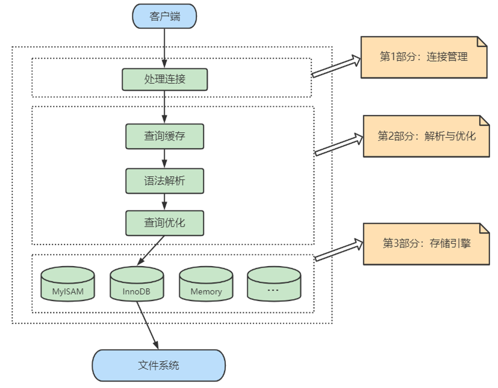

下面具体展开看一下：

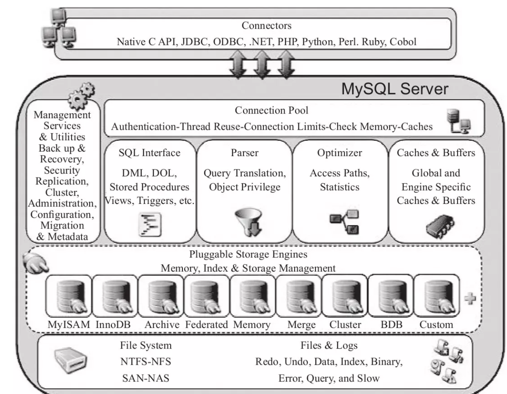


#### 1.2 Connectors

Connectors，指的是不同语言中与SQL的交互。MySQL首先是一个网络程序，在TCP之上定义了自己的应用层协议。所以要使用MySQL，我们可以编写代码，跟MySQL Server`建立TCP连接`，之后按照其定义好的协议进行交互。或者比较方便的方法是调用SDK，比如Native C API、JDBC、PHP等各语言MySQL Connecotr，或者通过ODBC。但**通过SDK来访问MySQL，本质上还是在TCP连接上通过MySQL协议跟MySQL进行交互**。

**接下来的MySQL Server结构可以分为如下三层**：


#### 1.3 第1层：连接层

系统（客户端）访问`MySQL`服务器前，做的第一件事就是建立`TCP`连接。

经过三次握手建立连接成功后，`MySQL`服务器对`TCP`传输过来的账号密码做身份认证、权限获取。

- **用户名或密码不对，会收到一个`Access denied for user`错误，客户端程序结束执行**
- **用户名密码认证通过，会从权限表查出账号拥有的权限与连接关联，之后的权限判断逻辑，都将依赖于此时读到的权限**

`TCP`连接收到请求后，必须要分配给一个线程专门与这个客户端的交互。所以还会有个线程池，去走后面的流程。每一个连接从线程池中获取线程，省去了创建和销毁线程的开销。

所以**连接管理**的职责是负责认证、管理连接、获取权限信息。


#### 1.4 第2层：服务层

第二层架构主要完成大多数的核心服务功能，如SQL接口，并完成`缓存的查询`，SQL的分析和优化及部分内置函数的执行。所有跨存储引擎的功能也在这一层实现，如过程、函数等。

在该层，服务器会`解析查询`并创建相应的内部`解析树`，并对其完成相应的`优化`：如确定查询表的顺序，是否利用索引等，最后生成相应的执行操作。

如果是SELECT语句，服务器还会`查询内部的缓存`。如果缓存空间足够大，这样在解决大量读操作的环境中能够很好的提升系统的性能。

- **SQL Interface: SQL接口**

  - 接收用户的SQL命令，并且返回用户需要查询的结果。比如`SELECT ... FROM`就是调用SQL Interface
  - MySQL支持DML（数据操作语言）、DDL（数据定义语言）、存储过程、视图、触发器、自定义函数等多种SQL语言接口

- **Parser: 解析器**

  - 在解析器中对`SQL`语句进行语法分析、语义分析。将SQL语句分解成数据结构，并将这个结构传递到后续步骤，以后SQL语句的传递和处理就是基于这个结构的。如果在分解构成中遇到错误，那么就说明这个SQL语句是不合理的。
  - 在SQL命令传递到解析器的时候会被解析器验证和解析，并为其创建`语法树`，并根据数据字典丰富查询语法树，会`验证该客户端是否具有执行该查询的权限`。创建好语法树后，MySQL还会对SQL查询进行语法上的优化，进行查询重写。

- **Optimizer: 查询优化器**

  - SQL语句在语法解析之后、查询之前会使用查询优化器确定 SQL 语句的执行路径，生成一个`执行计划`。

  - 这个执行计划表明应该`使用哪些索引`进行查询（全表检索还是使用索引检索），表之间的连接顺序如何，最后会按照执行计划中的步骤调用存储引擎提供的方法来真正的执行查询，并将查询结果返回给用户。

  - 它使用“`选取-投影-连接`”策略进行查询。例如：

    ```mysql
    SELECT id, name FROM student WHERE gender = '女';
    ```

    这个SELECT查询先根据WHERE语句进行`选取`，而不是将表全部查询出来以后再进行gender过滤。这个SELECT查询先根据id和name进行属性`投影`，而不是将属性全部取出以后再进行过滤，将这两个查询条件`连接`起来生成最终查询结果。

  - **Caches & Buffers： 查询缓存组件**

    - MySQL内部维持着一些Cache和Buffer，比如Query Cache用来缓存一条SELECT语句的执行结果，如果能够在其中找到对应的查询结果，那么就不必再进行查询解析、优化和执行的整个过程了，直接将结果反馈给客户端。
    - 这个缓存机制是由一系列小缓存组成的。比如表缓存，记录缓存，key缓存，权限缓存等。
    - 这个查询缓存可以在`不同客户端之间共享`。
    - 从MySQL 5.7.20开始，不推荐使用查询缓存，并在`MySQL 8.0中删除`。

  > 小故事：如果我问你9+8×16-3×2×17的值是多少，你可能会用计算器去算一下，最终结果35。如果再问你一遍9+8×16-3×2×17的值是多少，你还用再傻呵呵的再算一遍吗？我们刚刚已经算过了，直接说答案就好了。


#### 1.5 第3层：引擎层

插件式存储引擎层（Storage Engines），**真正的负责了MySQL中数据的存储和提取，对物理服务器级别维护的底层数据执行操作**，服务器通过API与存储引擎进行通信。不同的存储引擎具有的功能不同，这样我们可以根据自己的实际需要进行选取。

MySQL 8.0.25默认支持的存储引擎如下：

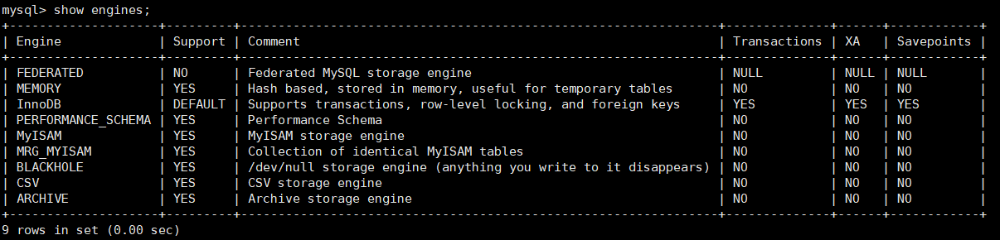


#### 1.6 存储层

所有的数据，数据库、表的定义，表的每一行的内容，索引，都是存在`文件系统`上，以`文件`的方式存在的，并完成与存储引擎的交互。当然有些存储引擎比如InnoDB，也支持不使用文件系统直接管理裸设备，但现代文件系统的实现使得这样做没有必要了。在文件系统之下，可以使用本地磁盘，可以使用DAS、NAS、SAN等各种存储系统。


#### 1.7 小结

MySQL架构图本节开篇所示。下面为了熟悉SQL执行流程方便，我们可以简化如下：

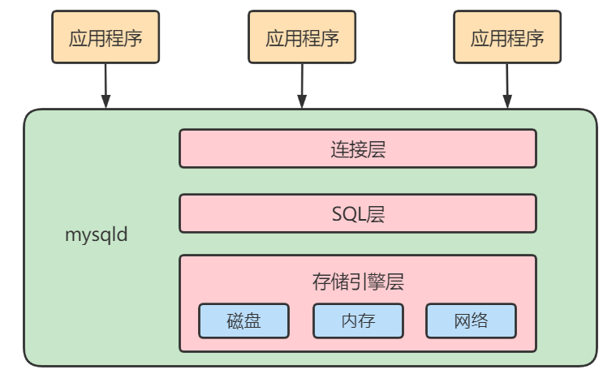

简化为三层结构：

1. 连接层：客户端和服务器端建立连接，客户端发送SQL至服务器端；
2. SQL层（服务层）：对SQL语句进行查询处理；与数据库文件的存储方式无关；
3. 存储引擎层：与数据库文件打交道，负责数据的存储和读取。


### 2 SQL执行流程

#### 2.1 MySQL中的SQL执行流程

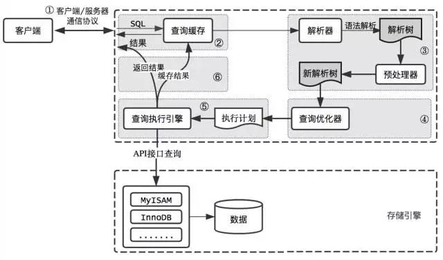

**MySQL的查询流程：**

1. **查询缓存**：Server如果在查询缓存中发现了这条SQL语句，就会直接将结果返回给客户端；如果没有，就进入到解析器阶段。需要说明的是，因为查询缓存往往效率不高，所以在MySQL8.0之后就抛弃了这个功能。

  大多数情况查询缓存就是个鸡肋，为什么呢？

  ```mysql
  SELECT employee_id,last_name FROM employees WHERE employee_id = 101;
  ```

查询缓存是提前把查询结果缓存起来，这样下次不需要执行就可以直接拿到结果。需要说明的是，在MySQL中的查询缓存，不是缓存查询计划，而是查询对应的结果。这就意味着查询匹配的`鲁棒性大大降低`，只有`相同的查询操作才会命中查询缓存`。两个查询请求在任何字符上的不同（例如：空格、注释、大小写），都会导致缓存不会命中。因此MySQL的`查询缓存命中率不高`。

同时，如果查询请求中包含某些系统函数、用户自定义变量和函数、一些系统表，如mysql、information_schema、performance_schema数据库中的表，那这个请求就不会被缓存。以某些系统函数举例，可能同样的函数的两次调用会产生不一样的结果，比如函数`NOW()`，每次调用都会产生最新的当前时间，如果在一个查询请求中调用了这个函数，那即使查询请求的文本信息都一样，那不同时间的两次查询也应该得到不同的结果，如果在第一次查询时就缓存了，那第二次查询的时候直接使用第一次查询的结果就是错误的！

此外，既然是缓存，那就有它`缓存失效的时候`。MySQL的缓存系统会监测涉及到的每张表，只要该表的结构或者数据被修改，如对该表使用了`INSERT`、`UPDATE`、`DELETE`、`TRUNCATE TABLE`、`ALTER
  TABLE`、`DROP TABLE`或`DROP DATABASE`语句，那使用该表的所有高速缓存查询都将变为无效并从高速缓存中删除！对于`更新压力大的数据库`来说，查询缓存的命中率会非常低。


2. **解析器**：在解析器中对SQL语句进行语法分析、语义分析。

   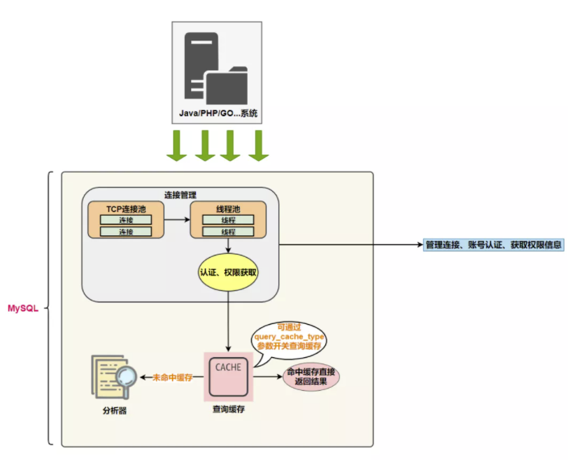

   如果没有命中查询缓存，就要开始真正执行语句了。首先，MySQL需要知道你要做什么，因此需要对SQL语句做解析。SQL语句的分析分为词法分析与语法分析。

   解析器先做“`词法分析`”。你输入的是由多个字符串和空格组成的一条SQL语句，MySQL需要识别出里面的字符串分别是什么，代表什么。MySQL从你输入的"select"这个关键字识别出来，这是一个查询语句。它也要把字符串“T”识别成“表名 T”，把字符串“ID”识别成“列 ID”。

   接着，要做“`语法分析`”。根据词法分析的结果，语法分析器（比如：Bison）会根据语法规则，判断你输入的这个 SQL 语句是否`满足MySQL语法`。
   
   ```mysql
   select department_id, job_id, avg(salary) from employees group by department_id;
   ```

   如果SQL语句正确，则会生成一个这样的语法树：
   
   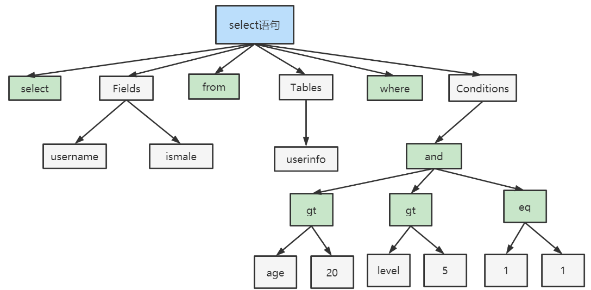
   
   下图是SQL分词分析的过程步骤:
   
   
   
   至此解析器的工作任务也基本圆满了。


3. **优化器**：在优化器中会确定SQL语句的执行路径，比如是根据`全表检索`，还是根据`索引检索`等。

   经过解释器，MySQL就知道你要做什么了。在开始执行之前，还要先经过优化器的处理。**一条查询可以有很多种执行方式，最后都返回相同的结果。优化器的作用就是找到这其中最好的执行计划**。

   比如：优化器是在表里面有多个索引的时候，决定使用哪个索引；或者在一个语句有多表关联 (join) 的时候，决定各个表的连接顺序，还有表达式简化、子查询转为连接、外连接转为内连接等。
   
   举例：如下语句是执行两个表的join：
   
   ```mysql
   select 
   	* 
   from 
   	test1 
   join 
   	test2 using(ID)
   where
   	test1.name='zhangwei' and test2.name='mysql高级课程';
   ```
   
   ```
   方案1：可以先从表 test1 里面取出 name='zhangwei'的记录的 ID 值，再根据 ID 值关联到表 test2，再判断 test2 里面 name的值是否等于 'mysql高级课程'。
   
   方案2：可以先从表 test2 里面取出 name='mysql高级课程' 的记录的 ID 值，再根据 ID 值关联到 test1，再判断 test1 里面 name的值是否等于 zhangwei。
   
   这两种执行方法的逻辑结果是一样的，但是执行的效率会有不同，而优化器的作用就是决定选择使用哪一个方案。优化器阶段完成后，这个语句的执行方案就确定下来了，然后进入执行器阶段。
   
   如果你还有一些疑问，比如优化器是怎么选择索引的，有没有可能选择错等。后面讲到索引我们再谈。
   ```
   
   在查询优化器中，可以分为`逻辑查询`优化阶段和`物理查询`优化阶段。
   
   逻辑查询优化就是通过改变SQL语句的内容来使得SQL查询更高效，同时为物理查询优化提供更多的候选执行计划。通常采用的方式是对SQL语句进行`等价变换`，对查询进行`重写`，而查询重写的数学基础就是关系代数。对条件表达式进行等价谓词重写、条件简化，对视图进行重写，对子查询进行优化，对连接语义进行了外连接消除、嵌套连接消除等。
   
   物理查询优化是基于关系代数进行的查询重写，而关系代数的每一步都对应着物理计算，这些物理计算往往存在多种算法，因此需要计算各种物理路径的代价，从中选择代价最小的作为执行计划。在这个阶段里，对于单表和多表连接的操作，需要高效地`使用索引`，提升查询效率。


4. **执行器**：

   截止到现在，还没有真正去读写真实的表，仅仅只是产出了一个执行计划。于是就进入了`执行器阶段`。

   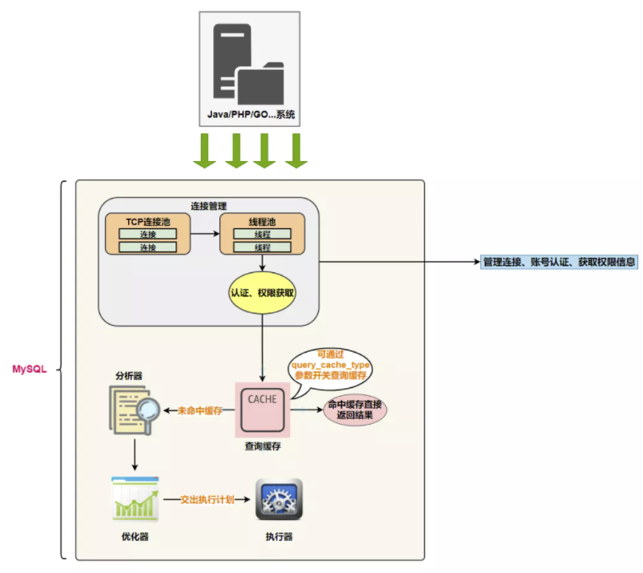

   在执行之前需要判断该用户是否`具备权限`。如果没有，就会返回权限错误。如果具备权限，就执行SQL查询并返回结果。在MySQL8.0以下的版本，如果设置了查询缓存，这时会将查询结果进行缓存。

   ```mysql
   select * from test where id=1;
   ```

   比如：表test中，ID字段没有索引，那么执行器的执行流程是这样的：

   ```
   调用 InnoDB 引擎接口取这个表的第一行，判断 ID 值是不是1，如果不是则跳过，如果是则将这行存在结果集中；
   调用引擎接口取“下一行”，重复相同的判断逻辑，直到取到这个表的最后一行。
   
   执行器将上述遍历过程中所有满足条件的行组成的记录集作为结果集返回给客户端。
   ```

   至此，这个语句就执行完成了。对于有索引的表，执行的逻辑也差不多。


SQL语句在MySQL中的流程是：`SQL语句→查询缓存→解析器→优化器→执行器`。

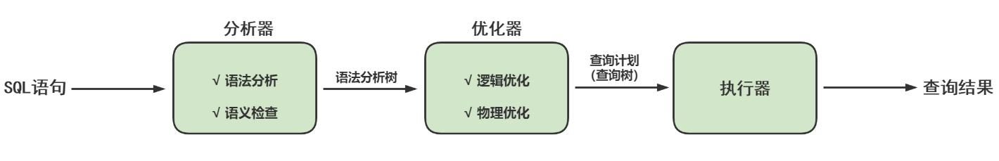


#### 2.2 MySQL8中SQL执行原理

1. **确认 profiling 是否开启**

了解查询语句底层执行的过程：`select @profiling`或者`show variables like '%profiling'`查看是否开启计划。开启它可以让MySQL收集在SQL

执行时所使用的资源情况，命令如下：

```mysql
mysql> select @@profiling;

mysql> show variables like 'profiling';
```

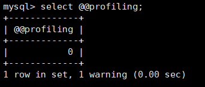

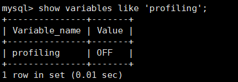

profiling=0代表关闭，我们需要把 profiling 打开，即设置为 1：

```mysql
set profiling=1;
```


2. **多次执行相同SQL查询**

然后我们执行一个 SQL 查询（你可以执行任何一个 SQL 查询）：

```mysql
select * from employees;
```


3. **查看profiles**

查看当前会话所产生的所有 profiles：

```mysql
show profiles; # 显示最近的几次查询
```

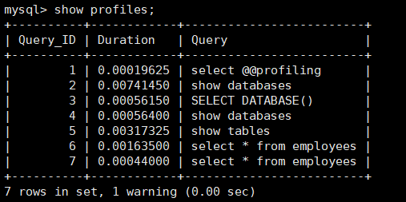

4. **查看profile**

显示执行计划，查看程序的执行步骤：

```mysql
show profile;
```

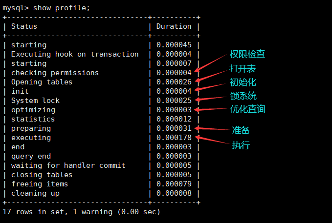

当然你也可以查询指定的 Query ID，比如：

```mysql
show profile for query 7;
```

查询 SQL 的执行时间结果和上面是一样的。

此外，还可以查询更丰富的内容：

```mysql
show profile cpu, block io for query 6;
```

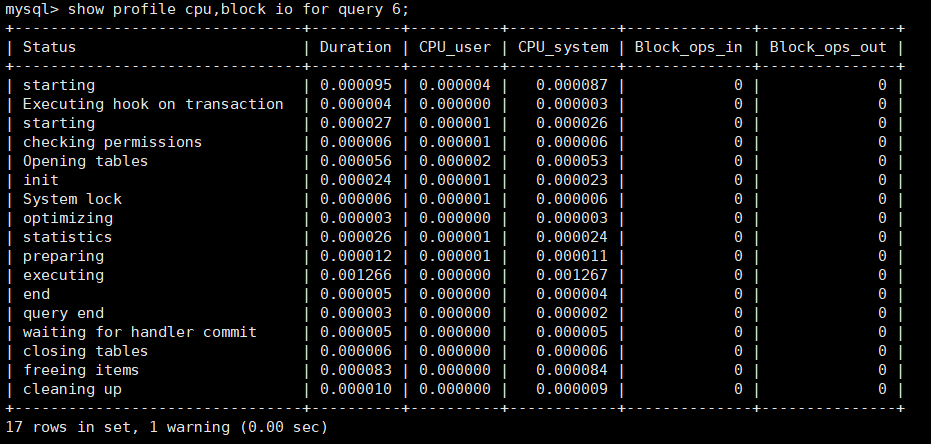

继续：

```mysql
 show profile cpu,block io for query 7;
```

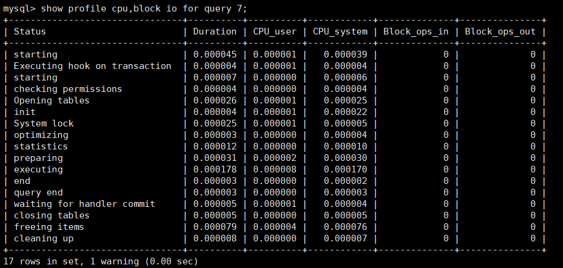

1、除了查看cpu、io阻塞等参数情况，还可以查询下列参数的利用情况。

```mysql
Syntax:
SHOW PROFILE [type [, type] ... ]
	[FOR QUERY n]
	[LIMIT row_count [OFFSET offset]]

type: {
	| ALL -- 显示所有参数的开销信息
	| BLOCK IO -- 显示IO的相关开销
	| CONTEXT SWITCHES -- 上下文切换相关开销
	| CPU -- 显示CPU相关开销信息
	| IPC -- 显示发送和接收相关开销信息
	| MEMORY -- 显示内存相关开销信息
	| PAGE FAULTS -- 显示页面错误相关开销信息
	| SOURCE -- 显示和Source_function,Source_file,Source_line 相关的开销信息
	| SWAPS -- 显示交换次数相关的开销信息
}
```

2、发现两次查询当前情况都一致，说明没有缓存。

`在 8.0 版本之后，MySQL 不再支持缓存的查询`。一旦数据表有更新，缓存都将清空，因此只有数据表是静态的时候，或者数据表很少发生变化时，使用缓存查询才有价值，否则如果数据表经常更新，反而增加了 SQL 的查询时间。


#### 2.3 MySQL5.7中SQL执行原理

上述操作在MySQL5.7中测试，发现前后两次相同的sql语句，执行的查询过程仍然是相同的。不是会使用缓存吗？这里我们需要`显式开启查询缓存模式`。在MySQL5.7中如下设置：

1. 配置文件中开启查询缓存

   在 /etc/my.cnf 中新增一行：

   ```properties
   query_cache_type=1
   ```

2. 重启mysql服务

   ```mysql
   systemctl restart mysqld
   ```

3. 开启查询执行计划

   由于重启过服务，需要重新执行如下指令，开启profiling。

   ```mysql
    set profiling=1;
   ```

4. 执行语句两次：

   ```mysql
   mysql> select * from locations;
   
   mysql> select * from locations;
   ```

5. 查看profiles

   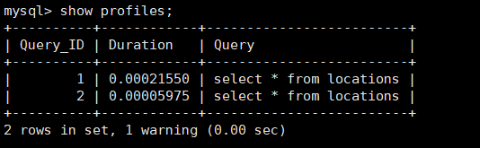

6. 查看profile

   显示执行计划，查看程序的执行步骤：

   ```mysql
   mysql> show profile for query 1;
   ```

   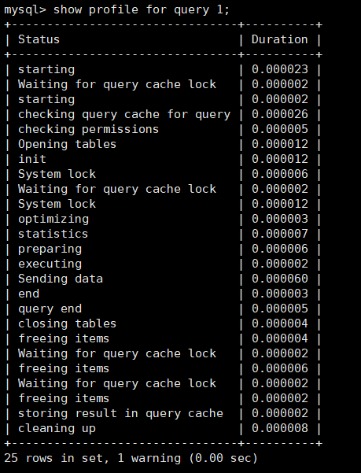

   ```mysql
   mysql> show profile for query 2;
   ```

   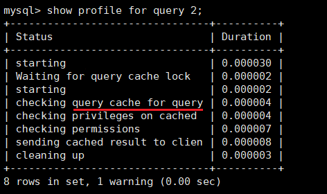

   结论不言而喻。执行编号2时，比执行编号1时少了很多信息，从截图中可以看出查询语句直接从缓存中获取数据。


#### 2.4 SQL语法顺序

随着Mysql版本的更新换代，其优化器也在不断的升级，优化器会分析不同执行顺序产生的性能消耗不同而动态调整执行顺序。

需求：查询每个部门年龄高于20岁的人数且高于20岁人数不能少于2人，显示人数最多的第一名部门信息

下面是经常出现的查询顺序：

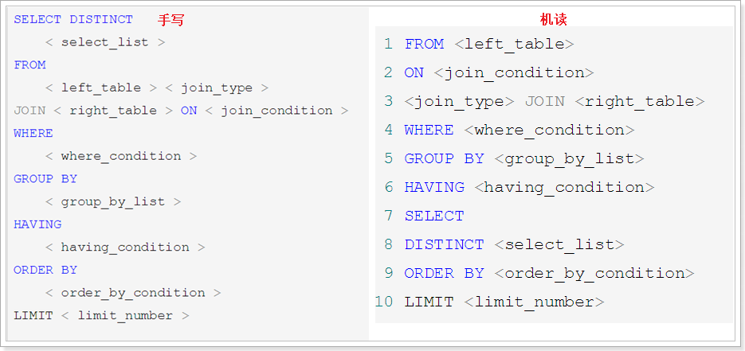


#### 2.5 Oracle中的SQL执行流程

Oracle中采用了`共享池`来判断SQL语句是否存在缓存和执行计划，通过这一步骤我们可以知道应该采用硬解析还是软解析。

我们先来看下 SQL 在 Oracle 中的执行过程：

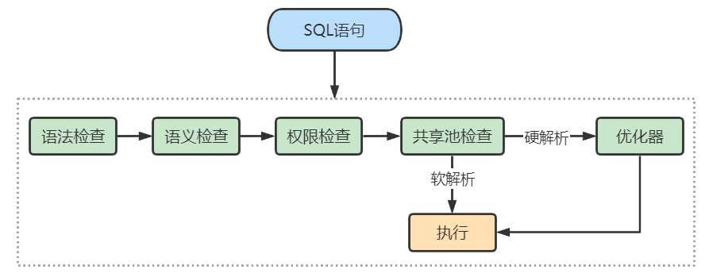

从上面这张图中可以看出，SQL 语句在 Oracle 中经历了以下的几个步骤。

1. **语法检查**：检查 SQL 拼写是否正确，如果不正确，Oracle 会报语法错误。

2. **语义检查**：检查 SQL 中的访问对象是否存在。比如我们在写 SELECT 语句的时候，列名写错了，系统就会提示错误。语法检查和语义检查的作用是保证 SQL 语句没有错误。

3. **权限检查**：看用户是否具备访问该数据的权限。

4. **共享池检查**：共享池（Shared Pool）是一块内存池，**最主要的作用是缓存 SQL 语句和该语句的执行计划**。Oracle通过检查共享池是否存在SQL语句的执行计划，来判断进行软解析，还是硬解析。

   那软解析和硬解析又该怎么理解呢？

   在共享池中，Oracle首先对SQL语句进行`Hash运算`，然后根据Hash值在库缓存（Library Cache）中查找，如果`存在 SQL 语句的执行计划`，就直接拿来执行，直接进入“执行器”的环节，这就是`软解析`。

   如果没有找到SQL语句和执行计划，Oracle就需要创建解析树进行解析，生成执行计划，进入“优化器”这个步骤，这就是`硬解析`。

5. **优化器**：优化器中就是要进行硬解析，也就是决定怎么做，比如创建解析树，生成执行计划。

6. **执行器**：当有了解析树和执行计划之后，就知道了SQL该怎么被执行，这样就可以在执行器中执行语句了。

共享池是 Oracle 中的术语，包括了库缓存，数据字典缓冲区等。我们上面已经讲到了库缓存区，它主要缓存 SQL 语句和执行计划。而`数据字典缓冲区`存储的是 Oracle 中的对象定义，比如表、视图、索引等对象。当对 SQL 语句进行解析的时候，如果需要相关的数据，会从数据字典缓冲区中提取。

`库缓存`这一个步骤，决定了 SQL 语句是否需要进行硬解析。为了提升 SQL 的执行效率，我们应该尽量避免硬解析，因为在 SQL 的执行过程中，创建解析树，生成执行计划是很消耗资源的。

你可能会问，如何避免硬解析，尽量使用软解析呢？在 Oracle 中，`绑定变量`是它的一大特色。绑定变量就是在 SQL 语句中使用变量，通过不同的变量取值来改变SQL的执行结果。这样做的好处是能`提升软解析的可能性`，不足之处在于可能会导致生成的执行计划不够优化，因此是否需要绑定变量还需要视情况而定。

举个例子，我们可以使用下面的查询语句：

```sql
select * from player where player_id = 10001;
```

你也可以使用绑定变量，如：

```sql
select * from player where player_id = :player_id;
```

这两个查询语句的效率在 Oracle 中是完全不同的。如果你在查询 player_id = 10001 之后，还会查询 10002、10003 之类的数据，那么每一次查询都会创建一个新的查询解析。而第二种方式使用了绑定变量，那么在第一次查询之后，在共享池中就会存在这类查询的执行计划，也就是软解析。

因此，**我们可以通过使用绑定变量来减少硬解析，减少 Oracle 的解析工作量**。但是这种方式也有缺点，使用动态 SQL 的方式，因为参数不同，会导致 SQL 的执行效率不同，同时 SQL 优化也会比较困难。


**Oracle的架构图：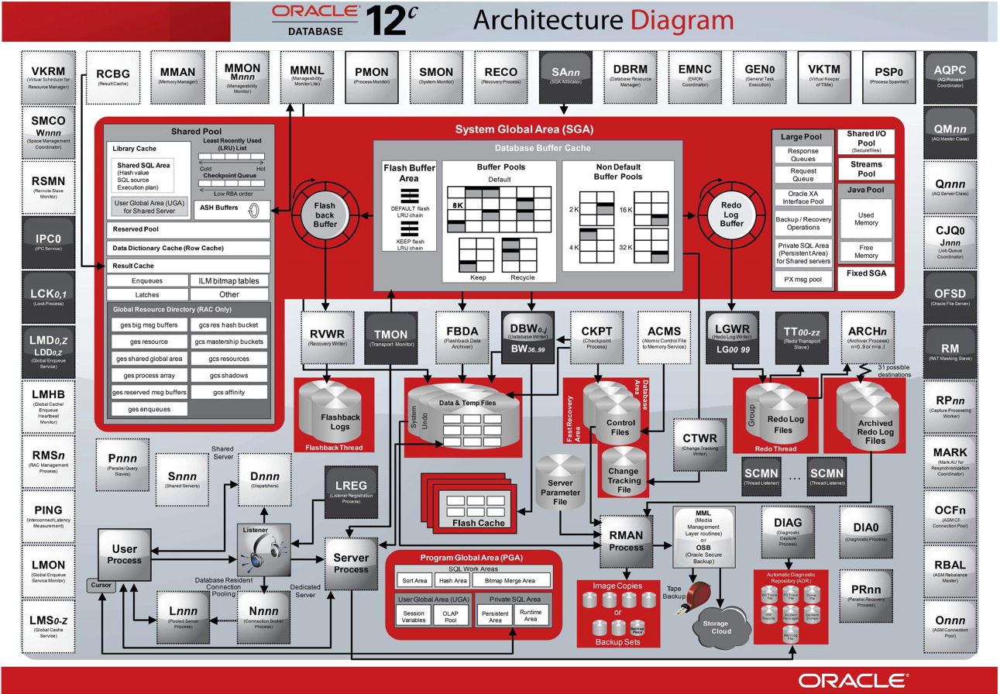**


**简图：**

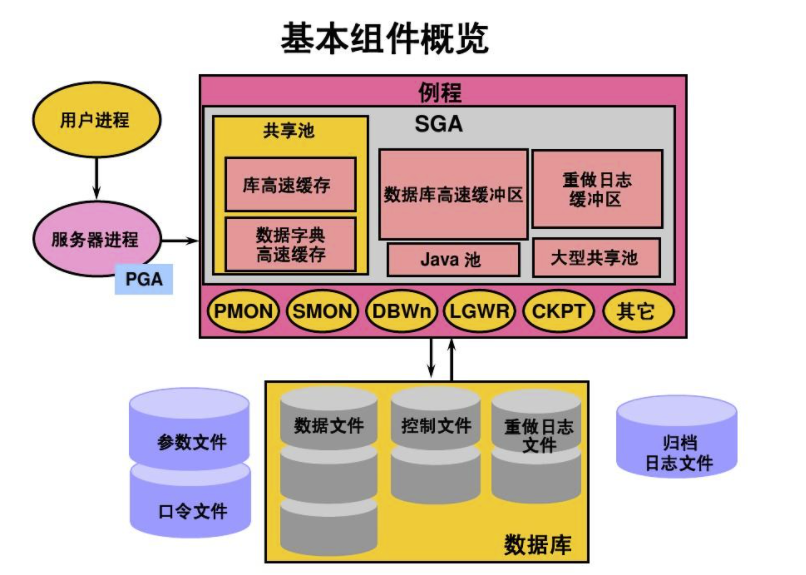

> 小结：Oracle 和 MySQL 在进行 SQL 的查询上面有软件实现层面的差异。Oracle 提出了共享池的概念，通过共享池来判断是进行软解析，还是硬解析。


### 3 数据库缓冲池(buffer pool)

`InnoDB`存储引擎是以页为单位来管理存储空间的，我们进行的增删改查操作其实本质上都是在访问页面（包括读页面、写页面、创建新页面等操作）。而磁盘 I/O 需要消耗的时间很多，而在内存中进行操作，效率则会高很多，为了能让数据表或者索引中的数据随时被我们所用，DBMS 会**申请占用内存来作为数据缓冲池**，在真正访问页面之前，需要把在磁盘上的页缓存到内存中的`Buffer Pool`之后才可以访问。

这样做的好处是可以让磁盘活动最小化，从而`减少与磁盘直接进行 I/O 的时间`。要知道，这种策略对提升 SQL 语句的查询性能来说至关重要。如果索引的数据在缓冲池里，那么访问的成本就会降低很多。


#### 3.1 缓冲池 VS 查询缓存

**缓冲池和查询缓存是一个东西吗？不是。**

1. **缓冲池（Buffer Pool）**

首先我们需要了解在 InnoDB 存储引擎中，缓冲池都包括了哪些。

在 InnoDB 存储引擎中有一部分数据会放到内存中，缓冲池则占了这部分内存的大部分，它用来存储各种数据的缓存，如下图所示：

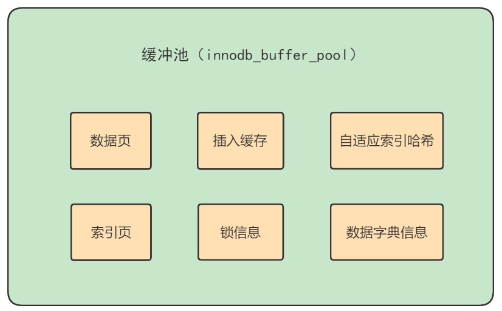

从图中，你能看到 InnoDB 缓冲池包括了数据页、索引页、插入缓冲、锁信息、自适应 Hash 和数据字典信息等。

**缓存池的重要性：**

对于使用`InnoDB`作为存储弓擎的表来说，不管是用于存储用户数据的索引(包括聚簇索引和二级索引)，还是各种系统数据，都是以`页`的形式存放在`表空间`中的，而所谓的表空间只不过是InnoDB对文件系统上一个或几个实际文件的抽象，也就是说我们的数据说到底还是存储在磁盘上的。但是各位也都知道，磁盘的速度慢的跟乌龟一样，怎么能配得上“`快如风，疾如电”的CPU呢`？这里，缓冲池可以帮助我们消除CPU和磁盘之间的`鸿沟`。所以InnoDB存储引擎在处理客户端的请求时，当需要访问某个页的数据时，就会把`完整的页的数据全部加载到内存`中，也就是说即使我们只需要访问一个页的一条记录，那也需要先把整个页的数据加载到内存中。将整个页加载到内存中后就可以进行读写访问了，在进行完读写访问之后并不着急把该页对应的内存空间释放掉，而是将其`缓存`起来，这样将来有请求再次访问该页面时，就可以`省去磁盘IO`的开销了。

**缓存原则：**

“`位置 * 频次`”这个原则，可以帮我们对 I/O 访问效率进行优化。

首先，位置决定效率，提供缓冲池就是为了在内存中可以直接访问数据。

其次，频次决定优先级顺序。因为缓冲池的大小是有限的，比如磁盘有200G，但是内存只有16G，缓冲池大小只有1G，就无法将所有数据都加载到缓冲池里，这时就涉及到优先级顺序，会`优先对使用频次高的热数据进行加载`。

**缓冲池的预读特性：**

了解了缓冲池的作用之后，我们还需要了解缓冲池的另一个特性：`预读`。

缓冲池的作用就是提升I/0效率，而我们进行读取数据的时候存在一个“局部性原理”，也就是说我们使用了一些数据，`大概率还会使用它周围的一些数据`，因此采用“预读”的机制提前加载，可以减少未来可能的磁盘I/0操作。


2. **查询缓存**

那么什么是查询缓存呢？

查询缓存是提前把`查询结果缓存`起来，这样下次不需要执行就可以直接拿到结果。需要说明的是，在MySQL中的查询缓存，不是缓存查询计划，而是查询对应的结果。因为命中条件苛刻，而且只要数据表发生变化，查询缓存就会失效，因此命中率低。

缓冲池服务于数据库整体的IO操作，它们的共同点都是通过缓存的机制来提升效率。


#### 3.2 缓冲池如何读取数据

缓冲池管理器会尽量将经常使用的数据保存起来，在数据库进行页面读操作的时候，首先会判断该页面是否在缓冲池中，如果存在就直接读取，如果不存在，就会通过内存或磁盘将页面存放到缓冲池中再进行读取。

缓存在数据库中的结构和作用如下图所示：


**如果我们执行 SQL 语句的时候更新了缓存池中的数据，那么这些数据会马上同步到磁盘上吗？**

实际上，当我们对数据库中的记录进行修改的时候，首先会修改缓冲池中页里面的记录信息，然后数据库会`以一定的频率刷新`到磁盘上。注意并不是每次发生更新操作，都会立刻进行磁盘回写。缓冲池会采用一种叫做`checkpoint 的机制`将数据回写到磁盘上，这样做的好处就是提升了数据库的整体性能。

比如，当`缓冲池不够用`时，需要释放掉一些不常用的页， 此时就可以强行采用 checkpoint 的方式，将不常用的脏页回写到磁盘上，然后再从缓冲池中将这些页释放掉。这里脏页(dirty page)指的是缓冲池中被修改过的页，与磁盘上的数据页不一致。


#### 3.3 查看/设置缓冲池的大小

如果你使用的是MySQL MyISAM存储引擎，它只缓存索引，不缓存数据，对应的键缓存参数为`key_buffer_size`，你可以用它进行查看。

如果你使用的是InnoDB存储引擎，可以通过查看`innodb_buffer_pool_size`变量来查看缓冲池的大小。命令如下：

```mysql
show variables like 'innodb_buffer_pool_size';
```

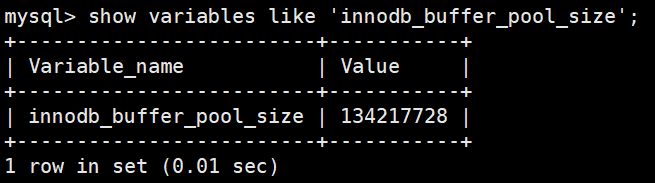

你能看到此时InnoDB的缓冲池大小只有 134217728/1024/1024=128MB。我们可以修改缓冲池大小，比如改为256MB，方法如下：

```mysql
set global innodb_buffer_pool_size = 268435456;
```

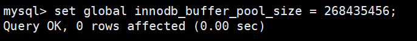

或者：

```mysql
[server]
innodb_buffer_pool_size = 268435456
```

然后再来看下修改后的缓冲池大小，此时已成功修改成了 256 MB：

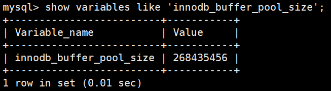


#### 3.4 多个Buffer Pool实例

Buffer Pool本质是InnoDB向操作系统申请的一块连续的内存空间，在多线程环境下，访问Buffer Pool中的数据都需要`加锁`处理。在Buffer Pool特别大而且多线程并发访问特别高的情况下，单一的Buffer Pool可能会影响请求的处理速度。所以在Buffer Pool特别大的时候，我们可以把它们`拆分成若千个小的Buffer Pool`，每个Buffer Pool都称为一个`实例`，它们都是独立的，独立的去申请内存空间，独立的管理各种链表。所以在多线程并发访问时并不会相互影响，从而提高并发处理能力。

我们可以在服务器启动的时候通过设置`innodb_buffer_pool_instances`的值来修改Buffer Pool实例的个数，比方说这样:

```mysql
[server]
innodb_buffer_pool_instances = 2
```

这样就表明我们要创建2个`Buffer Pool`实例。 

我们看下如何查看缓冲池的个数，使用命令：

```mysql
show variables like 'innodb_buffer_pool_instances';
```

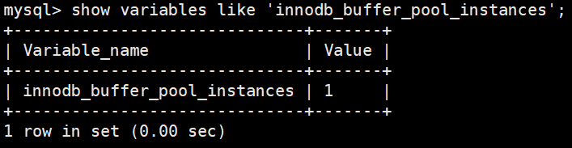

那每个`Buffer Pool`实例实际占多少内存空间呢？其实使用这个公式算出来的：

```
innodb_buffer_pool_size/innodb_buffer_pool_instances
```

也就是总共的大小除以实例的个数，结果就是每个`Buffer Pool`实例占用的大小。

不过也不是说Buffer Pool实例创建的越多越好，分别`管理各个Buffer Pool也是需要性能开销`的，InnoDB规定:当
`innodb_buffer_pool_size`的值小于1G的时候设置多个实例是无效的，InnoDB会默认把
innodb_buffer_pool_instances 的值修改为1。而我们鼓励在Buffer Pool大于或等于1G的时候设置多个Buffer Pool实例。


#### 3.5 引申问题

Buffer Pool是MySQL内存结构中十分核心的一个组成，你可以先把它想象成一个黑盒子。

**黑盒下的更新数据流程**

当我们查询数据的时候，会先去Buffer Pool中查询。如果Buffer Pool中不存在，存储引擎会先将数据从磁盘加载到Buffer Pool中，然后将数据返回给客户端；同理，当我们更新某个数据的时候，如果这个数据不存在于Buffer Pool，同样会先数据加载进来，然后修改修改内存的数据。被修改过的数据会在之后统一一刷入磁盘。


这个过程看似没啥问题，实则是有问题的。假设我们修改Buffer Pool中的数据成功，但是还没来得及将数据刷入磁盘MySQL就挂了怎么办?按照上图的逻辑，此时更新之后的数据只存在于Buffer Pool中，如果此时MySQL宕机了，这部分数据将会永久地丢失;

我更新到一半突然发生错误了，想要回滚到更新之前的版本，该怎么办？连数据持久化的保证、事务回滚都做不到还谈什么崩溃恢复？

答案：**Redo Log & Undo Log**

------

## 四、存储引擎

为了管理方便，人们把`连接管理`、`查询缓存`、`语法解析`、`查询优化`这些并不涉及真实数据存储的功能划分为`MySQL server`的功能，把真实存取数据的功能划分为`存储引擎`的功能。所以在`MySQL server`完成了查询优化后，只需按照生成的执行计划调用底层存储引擎提供的API，获取到数据后返回给客户端就好了。

MySQL中提到了存储引擎的概念。简而言之，`存储引擎就是指表的类型`。其实存储引擎以前叫做`表处理器`，后来改名为`存储引擎`，它的功能就是接收上层传下来的指令，然后对表中的数据进行提取或写入操作。

### 1 查看存储引擎

- 查看mysql提供什么存储引擎：

  ```mysql
  show engines;
  ```

  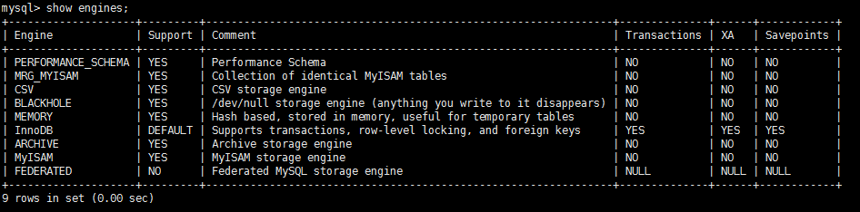

  ```mysql
  show engines\G;
  ```

  显式如下：

  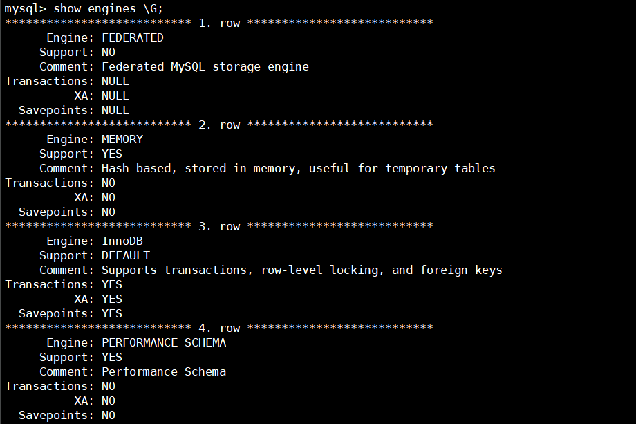

  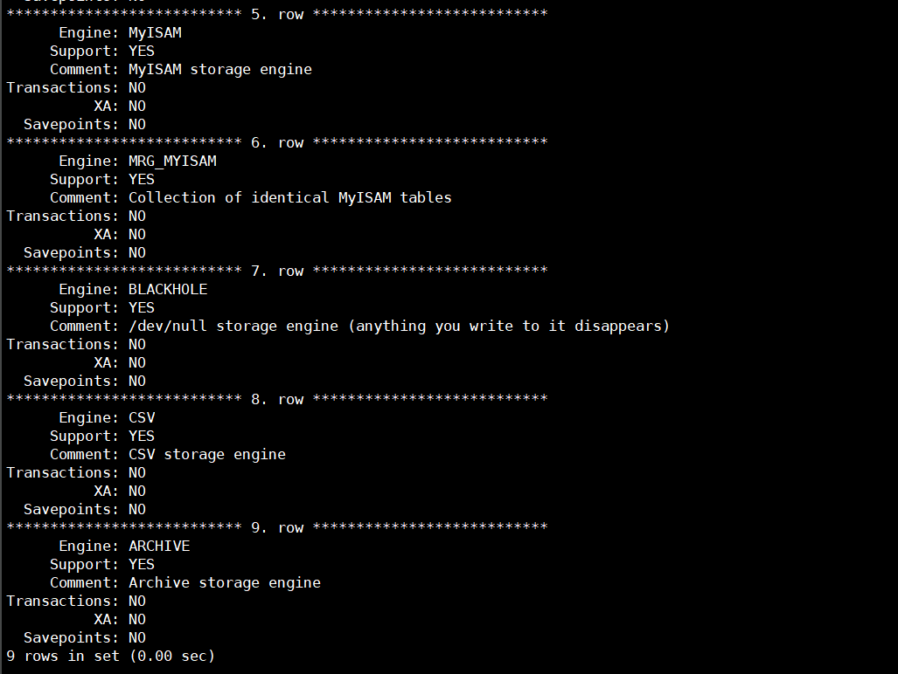


### 2 设置系统默认的存储引擎

- 查看默认的存储引擎：

  ```mysql
  show variables like '%storage_engine%';
  #或
  SELECT @@default_storage_engine;
  ```

  

- 修改默认的存储引擎

  如果在创建表的语句中没有显式指定表的存储引擎的话，那就会默认使用`InnoDB`作为表的存储引擎。如果我们想改变表的默认存储引擎的话，可以这样写启动服务器的命令行：

  ```mysql
  SET DEFAULT_STORAGE_ENGINE=MyISAM;
  ```

  或者修改`my.cnf`文件：

  ```properties
  default-storage-engine=MyISAM
  ```

  ```mysql
  # 重启服务
  systemctl restart mysqld.service
  ```


### 3 设置表的存储引擎

存储引擎是负责对表中的数据进行提取和写入工作的，我们可以为`不同的表设置不同的存储引擎`，也就是说不同的表可以有不同的物理存储结构，不同的提取和写入方式。

#### 3.1 创建表时指定存储引擎

我们之前创建表的语句都没有指定表的存储引擎，那就会使用默认的存储引擎`InnoDB`。如果我们想显式的指定一下表的存储引擎，那可以这么写：

```mysql
CREATE TABLE 表名(
	建表语句;
) ENGINE = 存储引擎名称;  
```


#### 3.2 修改表的存储引擎

如果表已经建好了，我们也可以使用下边这个语句来修改表的存储引擎：

```mysql
ALTER TABLE 表名 ENGINE = 存储引擎名称;
```

比如我们修改一下`engine_demo_table`表的存储引擎：

```mysql
mysql> ALTER TABLE engine_demo_table ENGINE = InnoDB;
Query OK, 0 rows affected (0.05 sec)
Records: 0 Duplicates: 0 Warnings: 0
```

这时我们再查看一下`engine_demo_table`的表结构：

```mysql
mysql> SHOW CREATE TABLE engine_demo_table\G
*************************** 1. row ***************************
	Table: engine_demo_table
Create Table: CREATE TABLE `engine_demo_table` (
	`i` int(11) DEFAULT NULL
) ENGINE=InnoDB DEFAULT CHARSET=utf8
1 row in set (0.01 sec)
```


### 4 引擎介绍

#### 4.1 InnoDB引擎：具备外键支持功能的事务存储引擎

- MySQL从3.23.34a开始就包含InnoDB存储引擎。`大于等于5.5之后，默认采用InnoDB引擎。`
- InnoDB是MySQL的`默认事务型引擎`，它被设计用来处理大量的短期(short-lived)事务。可以确保事务的完整提交(Commit)和回滚(Rollback)。
- 除了增加和查询外，还需要更新、删除操作，那么，应优先选择InnoDB存储引擎。
- **除非有非常特别的原因需要使用其他的存储引擎，否则应该优先考虑InnoDB引擎。**
- 数据文件结构：（在《第一章、MySQL数据目录》章节已讲）
  - 表名.frm 存储表结构（MySQL8.0时，合并在表名.ibd中）
  - 表名.ibd 存储数据和索引 
- InnoDB是`为处理巨大数据量的最大性能设计`。
  - 在以前的版本中，字典数据以元数据文件、非事务表等来存储。现在这些元数据文件被删除了。比如：`.frm`，`.par`，`.trn`，`.isl`，`.db.opt`等都在MySQL8.0中不存在了。
- 对比MyISAM的存储引擎，`InnoDB写的处理效率差一些`，并且会占用更多的磁盘空间以保存数据和索引。
- MyISAM只缓存索引，不缓存真实数据；InnoDB不仅缓存索引还要缓存真实数据，`对内存要求较高`，而且内存大小对性能有决定性的影响。


#### 4.2 MyISAM引擎：主要的非事务处理存储引擎

- MyISAM提供了大量的特性，包括全文索引、压缩、空间函数(GIS)等，但MyISAM`不支持事务、行级锁、外键`，有一个毫无疑问的缺陷就是`崩溃后无法安全恢复`。
- `5.5之前默认的存储引擎`
- 优势是访问的`速度快`，对事务完整性没有要求或者以SELECT、INSERT为主的应用
- 针对数据统计有额外的常数存储。故而 count(*) 的查询效率很高
- 数据文件结构：（在《第一章、MySQL数据目录》章节已讲）
  - 表名.frm 存储表结构
  - 表名.MYD 存储数据 (MYData)
  - 表名.MYI 存储索引 (MYIndex)
- 应用场景：只读应用或者以读为主的业务


#### 4.3 Archive 引擎：用于数据存档

- `archive`是`归档`的意思，仅仅支持`插入`和`查询`两种功能(行被插入后不能再修改)。
- 在MySQL5.5以后`支持索引`功能。
- 拥有很好的压缩机制，使用`zlib压缩库`，在记录请求的时候实时的进行压缩，经常被用来作为仓库使用。
- 创建ARCHIVE表时，存储引擎会创建名称以表名开头的文件。数据文件的扩展名为`.ARZ`。
- 根据英文的测试结论来看，同样数据量下，`Archive表比MyISAM表要小大约75%，比支持事务处理的InnoDB表小大约83%。`
- ARCHIVE存储引擎采用了`行级锁`。该ARCHIVE引擎支持`AUTO_INCREMENT`列属性。AUTO_ INCREMENT列可以具有唯一索引或非唯一索引。尝试在任何其他列上创建索引会导致错误。
- Archive表`适合日志和数据采集(档案)`类应用；**适合存储大量的独立的作为历史记录的数据**。拥有`很高的插入速度`，但是对查询的支持较差。
- **下表展示了ARCHIVE存储引擎功能**

| **特征**                                                | **支持**     |
| ------------------------------------------------------- | ------------ |
| B树索引                                                 | 不支持       |
| `备份/时间点恢复`（在服务器中实现，而不是在存储引擎中） | 支持         |
| 集群数据库支持                                          | 不支持       |
| 聚集索引                                                | 不支持       |
| `压缩数据`                                              | 支持         |
| 数据缓存                                                | 不支持       |
| 加密数据（加密功能在服务器中实现）                      | 支持         |
| 外键支持                                                | 不支持       |
| 全文检索索引                                            | 不支持       |
| 地理空间数据类型支持                                    | 支持         |
| 地理空间索引支持                                        | 不支持       |
| 哈希索引                                                | 不支持       |
| 索引缓存                                                | 不支持       |
| `锁粒度`                                                | 行锁         |
| MVCC                                                    | 不支持       |
| 存储限制                                                | 没有任何限制 |
| 交易                                                    | 不支持       |
| `更新数据字典的统计信息`                                | 支持         |


#### 4.4 Blackhole引擎：丢弃写操作，读操作会返回空内容

- Blackhole引擎没有实现任何存储机制，它会`丢弃所有插入的数据`，不做任何保存。
- 但服务器会记录Blackhole表的日志，所以可以用于复制数据到备库，或者简单地记录到日志。但这种应用方式会碰到很多问题，因此并不推荐。


#### 4.5 CSV引擎：存储数据时，以逗号分隔各个数据项

- CSV引擎可以将`普通的CSV文件作为MySQL的表来处理`，但不支持索引。
- CSV引擎可以作为`一种数据交换的机制`，非常有用。
- CSV存储的数据直接可以在操作系统里，用文本编辑器，或者excel读取。
- 对于数据的快速导入、导出是有明显优势的。

创建CSV表时，服务器会创建一个纯文本数据文件，其名称以表名开头并带有`.CSV`扩展名。当你将数据存储到表中时，存储引擎将其以逗号分隔值格式保存到数据文件中。

使用案例如下

```mysql
mysql>  CREATE TABLE test11 (i INT NOT NULL, c CHAR(10) NOT NULL) ENGINE = CSV;
Query OK, 0 rows affected (0.01 sec)

mysql> INSERT INTO test11 VALUES(1,'record one'), (2,'record two');
Query OK, 2 rows affected (0.00 sec)
Records: 2  Duplicates: 0  Warnings: 0

mysql> SELECT * FROM test11;
+---+---------------+
| i | c             |
+---+---------------+
| 1 | record one    |
| 2 | record two    |
+---+---------------+
2 rows in set (0.00 sec)
```

创建CSV表还会创建相应的`元文件`，用于`存储表的状态`和`表中存在的行数`。此文件的名称与表的名称相同，后缀为`CSM`。如图所示

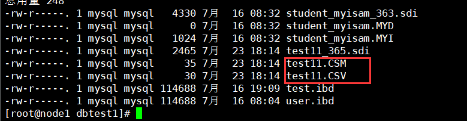

如果检查`test11.CSV`通过执行上述语句创建的数据库目录中的文件，其内容使用Notepad++打开如下：

```
"1","record one"
"2","record two"
```

这种格式可以被 Microsoft Excel 等电子表格应用程序读取，甚至写入。使用Microsoft Excel打开如图所示


#### 4.6 Memory引擎：置于内存的表

**概述：**Memory采用的逻辑介质是`内存`，`响应速度很快`，但是当mysqld守护进程崩溃的时候`数据会丢失`。另外，要求存储的数据是数据长度不变的格式，比如，Blob和Text类型的数据不可用(长度不固定的)。

**主要特征：**

- Memory同时`支持哈希（HASH）索引`和`B+树索引`。
  - 哈希索引相等的比较快，但是对于范围的比较慢很多。
  - 默认使用哈希(HASH)索引，其速度要比使用B型树(BTREE)索引快。
  - 如果希望使用B树索引，可以在创建索引时选择使用。

- Memory表至少比MyISAM表要`快一个数量级`。
- MEMORY`表的大小是受到限制`的。表的大小主要取决于两个参数，分别是`max_rows`和`max_heap_table_size`。其中，max_rows可以在创建表时指定；max_heap_table_size的大小默认为16MB，可以按需要进行扩大。
- 数据文件与索引文件分开存储。
  - 每个基于MEMORY存储引擎的表实际对应-个磁盘文件，该文件的文件名与表名相同，类型为`frm类型`，该文件中只存储表的结构，而其`数据文件都是存储在内存中的`。
  - 这样有利于数据的快速处理，提供整个表的处理效率。

- 缺点：其数据易丢失，生命周期短。基于这个缺陷，选择MEMORY存储引擎时需要特别小心。

**使用Memory存储引擎的场景：**

1. `目标数据比较小`，而且非常`频繁的进行访问`，在内存中存放数据，如果太大的数据会造成`内存溢出`。可以通过参数 max_heap_table_size 控制Memory表的大小，限制Memory表的最大的大小。
2. 如果`数据是临时的`，而且`必须立即可用`得到，那么就可以放在内存中。
3. 存储在Memory表中的数据如果突然间`丢失的话也没有太大的关系`。


#### 4.7 Federated引擎：访问远程表

Federated引擎是访问其他MySQL服务器的一个`代理`，尽管该引擎看起来提供了一种很好的`跨服务器的灵活性`，但也经常带来问题，因此`默认是禁用的`。


#### 4.8 Merge引擎：管理多个MyISAM表构成的表集合


#### 4.9 NDB引擎：MySQL集群专用存储引擎

也叫做NDB Cluster存储引擎，主要用于`MySQL Cluster 分布式集群`环境，类似于Oracle的 RAC 集群。


#### 4.10 引擎对比

MySQL中同一个数据库，不同的表可以选择不同的存储引擎。如下表对常用存储引擎做出了对比。

| 特点           | MyISAM                                                   | InnoDB                                                       | MEMORY | MERGE | NDB  |
| -------------- | -------------------------------------------------------- | ------------------------------------------------------------ | ------ | ----- | ---- |
| 存储限制       | 有                                                       | 64TB                                                         | 有     | 没有  | 有   |
| `事务安全`     |                                                          | 支持                                                         |        |       |      |
| `锁机制`       | 表锁，即使操作一条记录也会锁住整个表，不适合高并发的操作 | 行锁，操作时只锁某一行，不对其它行有影响，适合高并发的操作   | 表锁   | 表锁  | 行锁 |
| B树索引        | 支持                                                     | 支持                                                         | 支持   | 支持  | 支持 |
| 哈希索引       |                                                          |                                                              | 支持   |       | 支持 |
| 全文索引       | 支持                                                     |                                                              |        |       |      |
| 集群索引       |                                                          | 支持                                                         |        |       |      |
| 数据缓存       |                                                          | 支持                                                         | 支持   |       | 支持 |
| `索引缓存`     | 只缓存索引，不缓存真实数据                               | 不仅缓存索引还要缓存真实数据，对内存要求较高，而且内存大小对性能有决定性的影响 | 支持   | 支持  | 支持 |
| 数据可压缩     | 支持                                                     |                                                              |        |       |      |
| 空间使用       | 低                                                       | 高                                                           | N/A    | 低    | 低   |
| 内存使用       | 低                                                       | 高                                                           | 中等   | 低    | 高   |
| 批量插入的速度 | 高                                                       | 低                                                           | 高     | 高    | 高   |
| `支持外键`     |                                                          | 支持                                                         |        |       |      |

其实这些东西大家没必要立即就给记住，列出来的目的就是想让大家明白不同的存储引擎支持不同的功能。

其实我们最常用的就是`InnoDB`和`MyISAM`，有时会提一下`Memory`。其中`InnoDB`是`MySQL`默认的存储引擎。


### 5 MyISAM和InnoDB

**很多人对 InnoDB 和 MyISAM 的取舍存在疑问，到底选择哪个比较好呢？**

- MySQL5.5之前的默认存储引擎是MyISAM，5.5之后改为了InnoDB。

- 首先对于InnoDB存储引擎，提供了良好的事务管理、崩溃修复能力和并发控制。因为InnoDB存储引擎`支持事务`，所以对于要求事务完整性的场合需要选择InnoDB，比如数据操作除了插入和查询以外还包含有很多更新、删除操作，像财务系统等对数据准确性要求较高的系统。`缺点是其读写效率稍差，占用的数据空间相对比较大`。
- 其次对于MyISAM存储引擎，如果是`小型应用`，系统以`读操作和插入操作为主`，只有很少的更新、删除操作，并且对事务的要求没有那么高，则可以选择这个存储引擎。MyISAM存储弓|擎的优势在于`占用空间小，处理速度快`; 缺点是`不支持事务`的完整性和并发性。
- 这两种弓引|擎各有特点，当然你也可以在MySQL中，针对不同的数据表，可以选择不同的存储引擎。

| **对比项**     | **MyISAM**                                               | **InnoDB**                                                   |
| -------------- | -------------------------------------------------------- | ------------------------------------------------------------ |
| 外键           | 不支持                                                   | 支持                                                         |
| 事务           | 不支持                                                   | 支持                                                         |
| 行表级         | 表锁，即使操作一条记录也会锁住整个表，不适合高并发的操作 | 行锁，操作时只锁某一行，不对其它行有影响，适合高并发的操作   |
| 缓存           | 只缓存索引，不缓存真实数据                               | 不仅缓存索引还要缓存真实数据，对内存要求较高，而且内存大小对性能有决定性的影响 |
| 自带系统表使用 | Y                                                        | N                                                            |
| 关注点         | 性能：节省资源、消耗少、简单业务                         | 事务：并发写、事务、更大资源                                 |
| 默认安装       | Y                                                        | Y                                                            |
| 默认使用       | N                                                        | Y                                                            |


### 6 阿里巴巴、淘宝用哪个


- **Percona** 为 MySQL 数据库服务器进行了改进，在功能和性能上较 MySQL 有很显著的提升。
- 该版本提升了在高负载情况下的 InnoDB 的性能、为 DBA 提供一些非常有用的性能诊断工具；另外有更多的参数和命令来控制服务器行为。
- 该公司新建了一款存储引擎叫`Xtradb`完全可以替代`Innodb`，并且在性能和并发上做得更好
- 阿里巴巴大部分mysql数据库其实使用的percona的原型加以修改。


### 课外补充

#### 1、InnoDB表的优势

- InnoDB存储引擎在实际应用中拥有诸多优势，比如操作便利、提高了数据库的性能、维护成本低等。如果由于硬件或软件的原因导致服务器崩溃，那么在重启服务器之后不需要进行额外的操作。InnoDB崩溃恢复功能自动将之前提交的内容定型，然后撤销没有提交的进程，重启之后继续从崩溃点开始执行。
- InnoDB存储引擎在主内存中维护缓冲池，高频率使用的数据将在内存中直接被处理。这种缓存方式应用于多种信息，加速了处理进程。
- 在专用服务器上，物理内存中高达80%的部分被应用于缓冲池。如果需要将数据插入不同的表中，可以设置外键加强数据的完整性。更新或者删除数据，关联数据将会被自动更新或删除。如果试图将数据插入从表，但在主表中没有对应的数据，插入的数据将被自动移除。如果磁盘或内存中的数据出现崩溃，在使用脏数据之前，校验和机制会发出警告。当每个表的主键都设置合理时，与这些列有关的操作会被自动优化。插入、更新和删除操作通过做改变缓冲自动机制进行优化。`InnoDB不仅支持当前读写，也会缓冲改变的数据到数据流磁盘`。
- InnoDB的性能优势不只存在于长时运行查询的大型表。在同一列多次被查询时，自适应哈希索引会提高查询的速度。使用InnoDB可以压缩表和相关的索引，可以`在不影响性能和可用性的情况下创建或删除索引`。对于大型文本和BLOB数据，使用动态行形式，这种存储布局更高效。通过查询INFORMATION_SCHEMA库中的表可以监控存储引擎的内部工作。在同一个语句中，InnoDB表可以与其他存储引擎表混用。即使有些操作系统限制文件大小为2GB，InnoDB仍然可以处理。`当处理大数据量时，InnoDB兼顾CPU，以达到最大性能`。


#### 2、InnoDB和ACID模型

ACID模型是一系列数据库设计规则，这些规则着重强调可靠性，而可靠性对于商业数据和任务关键型应用非常重要。MySQL包含类似InnoDB存储引擎的组件，与ACID模型紧密相连，这样出现意外时，数据不会崩溃，结果不会失真。如果依赖ACID模型，可以不使用一致性检查和崩溃恢复机制。如果拥有额外的软件保护，极可靠的硬件或者应用可以容忍一小部分的数据丢失和不一致，可以将MySQL设置调整为只依赖部分ACID特性，以达到更高的性能。下面讲解InnoDB存储引擎与ACID模型相同作用的四个方面。

1. **原子方面** ACID的原子方面主要涉及InnoDB事务，与MySQL相关的特性主要包括：
   - 自动提交设置。
   - COMMIT语句。
   - ROLLBACK语句。
   - 操作INFORMATION_SCHEMA库中的表数据。
2. **一致性方面** ACID模型的一致性主要涉及保护数据不崩溃的内部InnoDB处理过程，与MySQL相关的特性主要包括：
   - InnoDB双写缓存。
   - InnoDB崩溃恢复。
3. **隔离方面** 隔离是应用于事务的级别，与MySQL相关的特性主要包括：
   - 自动提交设置。
   - SET ISOLATION LEVEL语句。
   - InnoDB锁的低级别信息。
4. **持久性方面** ACID模型的耐久性主要涉及与硬件配置相互影响的MySQL软件特性。由于硬件复杂多样化，耐久性方面没有具体的规则可循。与MySQL相关的特性有：
   - InnoDB双写缓存，通过innodb_doublewrite配置项配置。
   - 配置项innodb_flush_log_at_trx_commit。
   - 配置项sync_binlog。
   - 配置项innodb_file_per_table。
   - 存储设备的写入缓存。
   - 存储设备的备用电池缓存。
   - 运行MySQL的操作系统。
   - 持续的电力供应。
   - 备份策略。
   - 对分布式或托管的应用，最主要的在于硬件设备的地点以及网络情况。


#### 3、InnoDB架构

1. **缓冲池** 缓冲池是主内存中的一部分空间，用来缓存已使用的表和索引数据。缓冲池使得经常被使用的数据能够直接在内存中获得，从而提高速度。
2. **更改缓存** 更改缓存是一个特殊的数据结构，当受影响的索引页不在缓存中时，更改缓存会缓存辅助索引页的更改。索引页被其他读取操作时会加载到缓存池，缓存的更改内容就会被合并。不同于集群索引，辅助索引并非独一无二的。当系统大部分闲置时，清除操作会定期运行，将更新的索引页刷入磁盘。更新缓存合并期间，可能会大大降低查询的性能。在内存中，更新缓存占用一部分InnoDB缓冲池。在磁盘中，更新缓存是系统表空间的一部分。更新缓存的数据类型由innodb_change_buffering配置项管
理。
3. **自适应哈希索引** 自适应哈希索引将负载和足够的内存结合起来，使得InnoDB像内存数据库一样运行，不需要降低事务上的性能或可靠性。这个特性通过innodb_adaptive_hash_index选项配置，或者通过--skip-innodb_adaptive_hash_index命令行在服务启动时关闭。
4. **重做日志缓存** 重做日志缓存存放要放入重做日志的数据。重做日志缓存大小通过innodb_log_buffer_size配置项配置。重做日志缓存会定期地将日志文件刷入磁盘。大型的重做日志缓存使得大型事务能够正常运行而不需要写入磁盘。
5. **系统表空间** 系统表空间包括InnoDB数据字典、双写缓存、更新缓存和撤销日志，同时也包括表和索引数据。多表共享，系统表空间被视为共享表空间。
6. **双写缓存** 双写缓存位于系统表空间中，用于写入从缓存池刷新的数据页。只有在刷新并写入双写缓存后，InnoDB才会将数据页写入合适的位置。
7. **撤销日志** 撤销日志是一系列与事务相关的撤销记录的集合，包含如何撤销事务最近的更改。如果其他事务要查询原始数据，可以从撤销日志记录中追溯未更改的数据。撤销日志存在于撤销日志片段中，这些片段包含于回滚片段中。
8. **每个表一个文件的表空间** 每个表一个文件的表空间是指每个单独的表空间创建在自身的数据文件中，而不是系统表空间中。这个功能通过innodb_file_per_table配置项开启。每个表空间由一个单独的.ibd数据文件代表，该文件默认被创建在数据库目录中。
9. **通用表空间** 使用CREATE TABLESPACE语法创建共享的InnoDB表空间。通用表空间可以创建在MySQL数据目录之外能够管理多个表并支持所有行格式的表。
10. **撤销表空间** 撤销表空间由一个或多个包含撤销日志的文件组成。撤销表空间的数量由innodb_undo_tablespaces配置项配置。
11. **临时表空间** 用户创建的临时表空间和基于磁盘的内部临时表都创建于临时表空间。innodb_temp_data_file_path配置项定义了相关的路径、名称、大小和属性。如果该值为空，默认会在innodb_data_home_dir变量指定的目录下创建一个自动扩展的数据文件。
12. **重做日志** 重做日志是基于磁盘的数据结构，在崩溃恢复期间使用，用来纠正数据。正常操作期间，重做日志会将请求数据进行编码，这些请求会改变InnoDB表数据。遇到意外崩溃后，未完成的更改会自动在初始化期间重新进行。
# MySQL_高级__索引及调优篇

> 讲师：尚硅谷-宋红康（江湖人称：康师傅）
>
> 尚硅谷官网：[http://www.atguigu.com](http://www.atguigu.com/)
>
> 视频链接：https://www.bilibili.com/video/BV1iq4y1u7vj?spm_id_from=333.337.search-card.all.click

------

## 五、索引的数据结构

### 1 为什么使用索引

索引是存储引擎用于快速找到数据记录的一种数据结构，就好比一本教课书的目录部分，通过目录中找到对应文章的页码，便可快速定位到需要的文章。MySQL中也是一样的道理，进行数据查找时，首先查看查询条件是否命中某条索引，符合则`通过索引查找`相关数据，如果不符合则需要`全表扫描`，即需要一条一条地查找记录，直到找到与条件符合的记录。

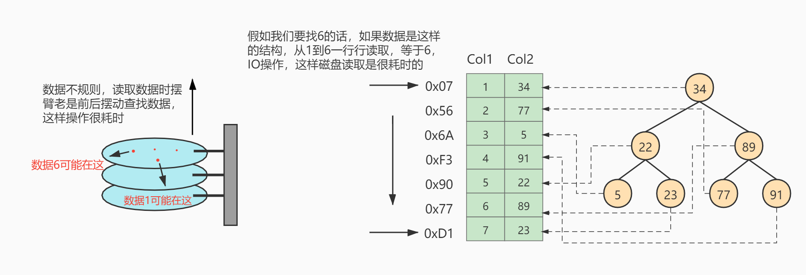

如上图所示，数据库没有索引的情况下，数据`分布在硬盘不同的位置上面`，读取数据时，摆臂需要前后摆动查找数据，这样操作非常消耗时间。如果`数据顺序摆放`，那么也需要从1到6行按顺序读取，这样就相当于进行了6次IO操作，`依旧非常耗时`。如果我们不借助任何索引结构帮助我们快速定位数据的话，我们查找Col2=89这条记录，就要逐行去查找、去比较。从Col2=34开始，进行比较，发现不是，继续下一行。我们当前的表只有不到10行数据，但如果表很大的话，有`上千万条数据`，就意味着要做`很多很多次磁盘IO`才能找到。现在要查找Col2=89这条记录。CPU必须先去磁盘查找这条记录，找到之后加载到内存，再对数据进行处理。这个过程最耗时间的就是磁盘I/O(涉及到磁盘的旋转时间(速度较快)、磁头的寻道时间(速度慢、费时))。


假如给数据使用`二叉树`这样的数据结构进行存储，如下图所示。

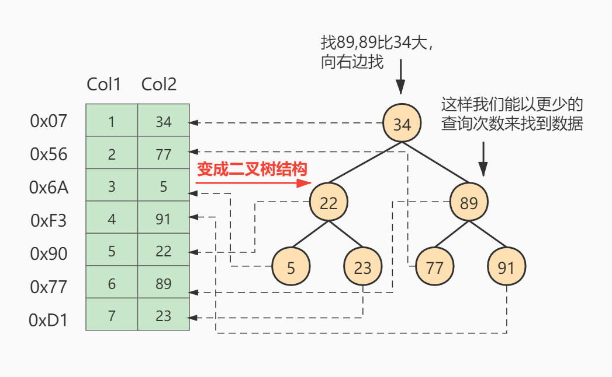

对字段Col2添加了索引，就相当于在硬盘上为Col2维护了一个索引的数据结构，即这个`二叉搜索树`。二叉搜索树的每个结点存储的是`(K,V)结构`，key是Col2，value是该key所在行的文件指针(地址)。比如：该二叉搜索树的根节点就是:`(34,0x07)`。现在对Col2添加了索引，这时再去查找Col2=89这条记录的时候会先去查找该二叉搜索树(二叉树的遍历查找)。读34到内存，89>34；继续右侧数据，读89到内存，89==89；找到数据返回。找到之后就根据当前结点的value快速定位到要查找的记录对应的地址。我们可以发现，只需要`查找两次`就可以定位到记录的地址，查询速度就提高了。


这就是我们为什么要建索引，目的就是为了`减少磁盘I/O的次数`，加快查询速率。


### 2 索引及其优缺点

#### 2.1 索引概述

MySQL官方对索引的定义为：**索引（Index）是帮助MySQL高效获取数据的数据结构。**

索引的本质：索引是数据结构。你可以简单理解为“排好序的快速查找数据结构”，满足特定查找算法。这些数据结构以某种方式指向数据， 这样就可以在这些数据结构的基础上实现`高级查找算法`。

`索引是在存储引擎中实现的`，因此每种存储引擎的索引不一定完全相同，并且每种存储引擎不一定支持所有索引类型。同时，存储引擎可以定义每个表的`最大索引数`和`最大索引长度`。所有存储引擎支持每个表至少16个索引，总索引长度至少为256字节。有些存储引擎支持更多的索引数和更大的索引长度。


#### 2.2 优点

1. 类似大学图书馆建书目索引，提高数据检索的效率，`降低数据库的IO成本`，这也是创建索引最主要的原因。
2. 通过创建唯一索引，可以`保证数据库表中每一行数据的唯一性`。
3. 在实现数据的参考完整性方面，可以`加速表和表之间的连接`。换句话说，对于有依赖关系的子表和父表联合查询时，可以提高查询速度。
4. 在使用分组和排序子句进行数据查询时，可以显著`减少查询中分组和排序的时间`，降低了CPU的消耗。


#### 2.3 缺点

增加索引也有许多不利的方面，主要表现在如下几个方面：

- 创建索引和维护索引要`耗费时间`，并且随着数据量的增加，所耗费的时间也会增加。
- 索引需要占`磁盘空间`，除了数据表占数据空间之外，每一个索引还要占一定的物理空间，`存储在磁盘上`，如果有大量的索引，索引文件就可能比数据文件更快达到最大文件尺寸。 
- 虽然索引大大提高了查询速度，同时却会`降低更新表的速度`。当对表中的数据进行增加、删除和修改的时候，索引也要动态地维护，这样就降低了数据的维护速度。

因此，选择使用索引时，需要综合考虑索引的优点和缺点。

> **提示：**
>
> 索引可以提高查询的速度，但是会影响插入记录的速度。这种情况下，最好的办法是先删除表中的索引，然后插入数据，插入完成后再创建索引。


### 3 InnoDB中索引的推演

#### 3.1 索引之前的查找

先来看一个精确匹配的例子：

```mysql
SELECT [列名列表] FROM 表名 WHERE 列名 = xxx;
```

1. 在一个页中的查找

   假设目前表中的记录比较少，所有的记录都可以被存放到一个页中，在查找记录的时候可以根据搜索条件的不同分为两种情况:

   - 已主键为搜索条件

     可以在页目录中使用`二分法`快速定位到对应的槽，然后再遍历该槽对应分组中的记录即可快速找到指定的记录。

   - 以其他列作为搜索条件

     因为在数据页中并没有对非主键列建立所谓的页目录，所以我们无法通过二分法快速定位相应的槽。这种情况下只能从`最小记录`开始`依次遍历`单链表中的每条记录，然后对比每条记录是不是符合搜索条件。很显然，这种查找的效率是非常低的。

   

2. 在很多页中查找

   大部分情况下我们表中存放的记录都是非常多的，需要好多的数据页来存储这些记录。在很多页中查找记录的话可以分为两个步骤:

   1. 定位到记录所在的页。

   2. 从所在的页内中查找相应的记录。

   在没有索引的情况下，不论是根据主键列或者其他列的值进行查找，由于我们并不能快速的定位到记录所在的页，所以只能`从第一个页`沿着`双向链表`一直往下找，在每一个页中根据我们上面的查找方式去查找指定的记录。因为要遍历所有的数据页，所以这种方式显然是`超级耗时`的。如果一个表有一亿条记录呢？此时`索引`应运而生。

   

#### 3.2 设计索引

建一个表：

```mysql
mysql> CREATE TABLE index_demo(
	-> 		c1 INT,
	-> 		c2 INT,
	->	 	c3 CHAR(1),
	-> 		PRIMARY KEY(c1)
	-> ) ROW_FORMAT = Compact;
```

这个新建的`index_demo`表中有2个INT类型的列，1个CHAR(1)类型的列，而且我们规定了c1列为主键，这个表使用`Compact`行格式来实际存储记录的。这里我们简化了index_demo表的行格式示意图：

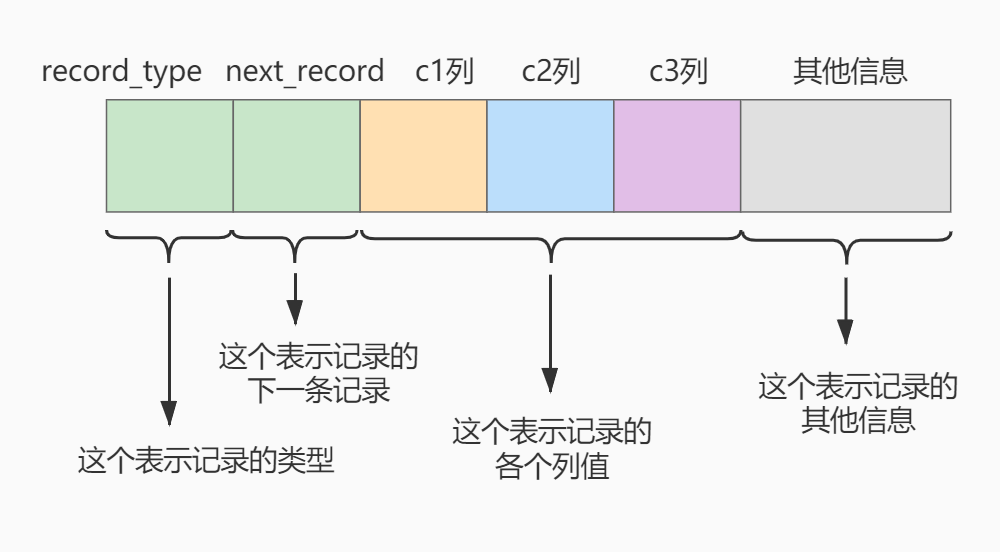

我们只在示意图里展示记录的这几个部分：

- `record_type`：记录头信息的一项属性，表示记录的类型，`0`表示普通记录、`2`表示最小记录、`3`表示最大记录、`1`暂时还没用过，下面讲。
- `next_record`：记录头信息的一项属性，表示下一条地址相对于本条记录的地址偏移量，我们用箭头来表明下一条记录是谁。
- `各个列的值`：这里只记录在`index_demo`表中的三个列，分别是`c1`、`c2`和`c3`。
- `其他信息`：除了上述3种信息以外的所有信息，包括其他隐藏列的值以及记录的额外信息。

将记录格式示意图的其他信息项暂时去掉并把它竖起来的效果就是这样：

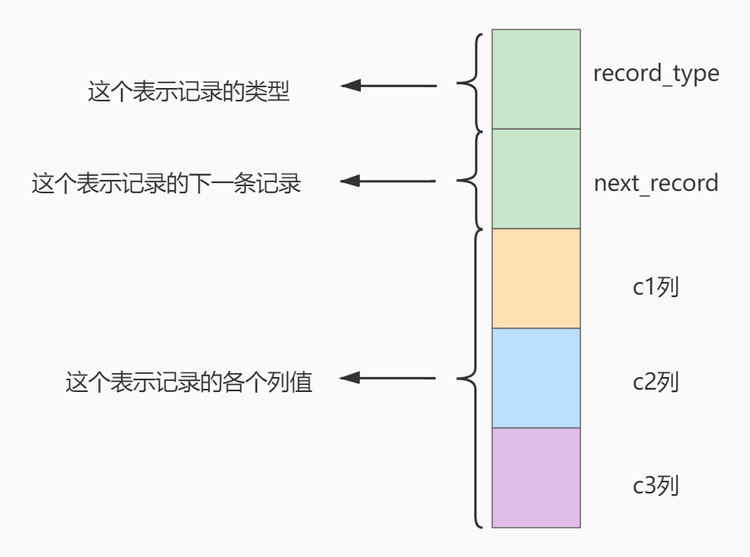

把一些记录放到页里的示意图就是：

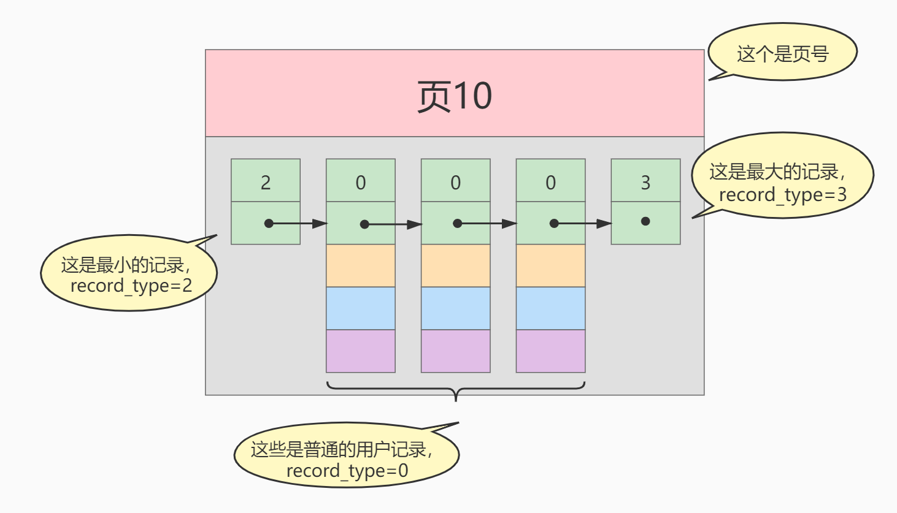

##### 3.2.1 一个简单的索引设计方案

我们在根据某个搜索条件查找一些记录时为什么要遍历所有的数据页呢？因为各个页中的记录并没有规律，我们并不知道我们的搜索条件匹配哪些页中的记录，所以不得不依次遍历所有的数据页。所以如果我们`想快速的定位到需要查找的记录在哪些数据页`中该咋办？我们可以为快速定位记录所在的数据页而`建立一个目录 `，建这个目录必须完成下边这些事：

- **下一个数据页中用户记录的主键值必须大于上一个页中用户记录的主键值。**

  假设:每个数据页最多能存放3条记录(实际上一个数据页非常大,可以存放下好多记录)。有了这个假设之后我们向index_ demo表插入3条记录:

  ```mysql
  INSERT INTO index_demo VALUES(1,4,'u'), (3,9,'d'), (5,3,'y');
  ```

  那么这些记录已经按主键值的大小串联成一个单向链表了，如图所示：

  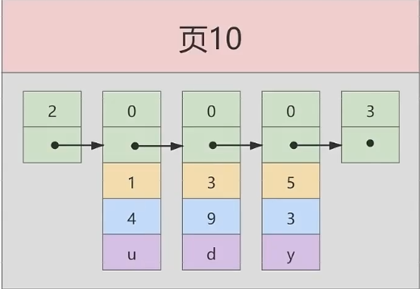

   从图中可以看出来，`index_demo`表中的3条记录都被插入到了编号为10的数据页中了。此时我们再来插入一条记录:

  ```mysql
  INSERT INTO index_demo VALUES(4,4,'a');
  ```

  因为页10最多只能放3条记录，所以我们不得不再分配一个新页:

  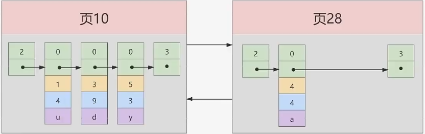

  注意，新分配的`数据页编号`可能并不是连续的。它们只是通过维护着上一个页和下一个页的编号而建立了`链表关系`。另外，`页10`中用户记录最大的主键值是`5`，而页28中有一条记录的主键值是`4`，因为`5>4`，所以这就不符合下一个数据页中用户记录的主键值必须大于上一个页中用户记录的主键值的要求，所以在插入主键值为4的记录的时候需要伴随着一次记录移动，也就是把主键值为5的记录移动到页28中，然后再把主键值为4的记录插入到页10中，这个过程的示意图如下: 

  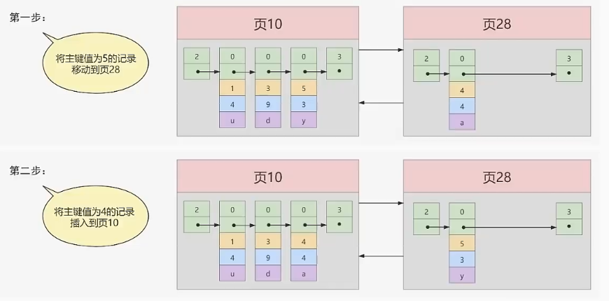

  这个过程表明了在对页中的记录进行增删改操作的过程中，我们必须通过一些诸如记录移动的操作来始终保证这个状态一直成立：下一个数据页中用户记录的主键值必须大于上一个页中用户记录的主键值。这个过程我们称为页分裂。

  

- **给所有的页建立一个目录项。**

由于数据页的`编号可能是不连续的`，所以在向index_demo表中插入许多条记录后，可能是这样的效果:

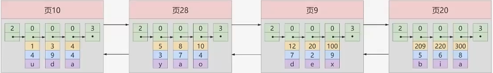

因为这些`16KB`的页在物理存储上是`不连续`的，所以如果想从这么多页中根据主键值`快速定位某些记录所在的页`，我们需要给它们做个`目录`，每个页对应一个目录项，每个目录项包括下边两个部分:

- 页的用户记录中最小的主键值，我们用key来表示。
- 页号，我们用`page_no`表示。

所以我们为上边几个页做好的目录就像这样子：

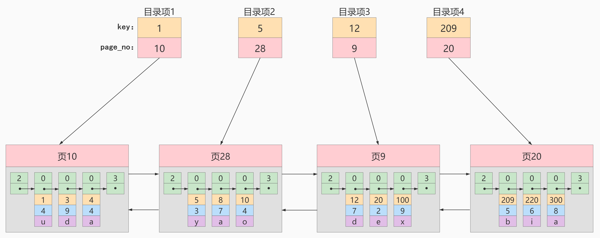

以`页28`为例，它对应`目录项2`，这个目录项中包含着该页的页号`28`以及该页中用户记录的`最小主键值5`。我们只需要把几个目录项在物理存储器上连续存储（比如：数组），就可以实现根据主键值快速查找某条记录的功能了。比如：查找主键值为`20`的记录，具体查找过程分两步：

- 先从目录项中根据`二分法`快速确定出主键值为`20`的记录在`目录项3`中（因为`12 < 20 < 209`），它对应的页是`页9`。
- 再根据前边说的在页中查找记录的方式去`页9`中定位具体的记录。

至此，针对数据页做的简易目录就搞定了。这个目录有一个别名，称为`索引`。


##### 3.2.2 InnoDB中的索引方案

###### **迭代1次：目录项纪录的页**

我们把前边使用到的目录项放到数据页中的样子就是这样：

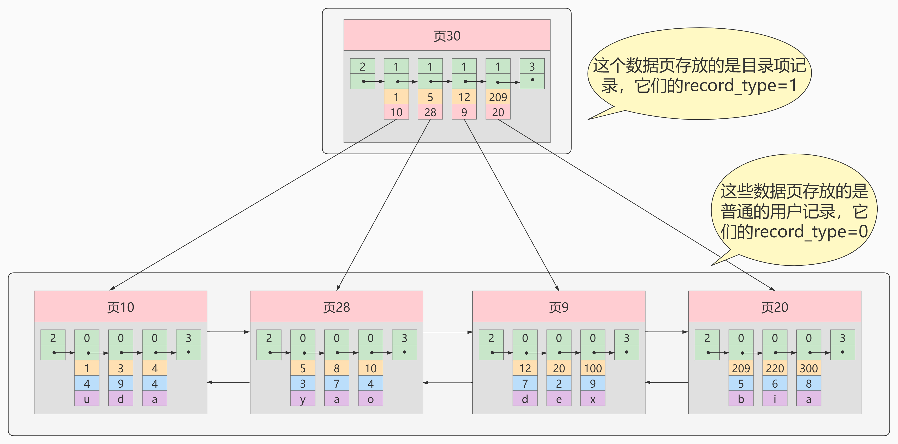

从图中可以看出来，我们新分配了一个编号为30的页来专门存储目录项记录。这里再次强调`目录项记录`和普通的`用户记录`的**不同点**：

- `目录项记录`的`record_type`值是1，而`普通用户记录`的`record_type`值是0。
- 目录项记录只有`主键值和页的编号`两个列，而普通的用户记录的列是用户自己定义的，可能包含`很多列`，另外还有InnoDB自己添加的隐藏列。
- 了解：记录头信息里还有一个叫`min_rec_mask`的属性，只有在存储`目录项记录`的页中的主键值最小的`目录项记录`的`min_rec_mask`值为`1`，其他别的记录的`min_rec_mask`值都是`0`。

**相同点**：两者用的是一样的数据页，都会为主键值生成`Page Directory`（页目录），从而在按照主键值进行查找时可以使用`二分法`来加快查询速度。

现在以查找主键为`20`的记录为例，根据某个主键值去查找记录的步骤就可以大致拆分成下边两步：

- 先到存储`目录项记录`的页，也就是页30中通过`二分法`快速定位到对应目录项，因为`12 < 20 < 209`，所以定位到对应的记录所在的页就是页9。
- 再到存储用户记录的页9中根据`二分法`快速定位到主键值为`20`的用户记录。


###### **迭代2次：多个目录项纪录的页**

虽然说`目录项记录`中只存储主键值和对应的页号，比用户记录需要的存储空间小多了，但是不论怎么说一个页只有`16KB`大小，能存放的`目录项记录`也是有限的，那如果表中的数据太多，以至于一个数据页不足以存放所有的`目录项记录`，如何处理呢?

这里我们假设一个存储目录项记录的页`最多只能存放4条目录项记录`，所以如果此时我们再向上图中插入一条主键值为`320`的用户记录的话，那就需要分配一个新的存储`目录项记录`的页：

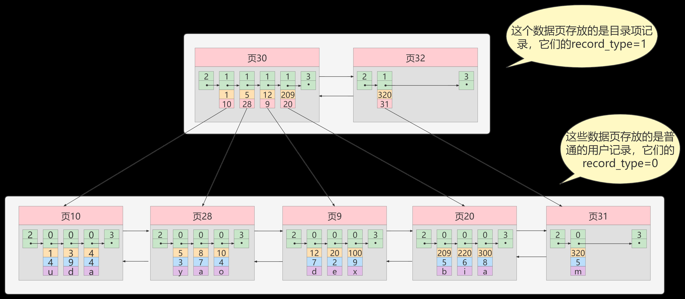

从图中可以看出，我们插入了一条主键值为320的用户记录之后需要两个新的数据页：

- 为存储该用户记录而新生成了`页31`。
- 因为原先存储目录项记录的`页30的容量已满`（我们前边假设只能存储4条目录项记录），所以不得不需要一个新的`页32`来存放`页31`对应的目录项。

现在因为存储目录项记录的页不止一个，所以如果我们想根据主键值查找一条用户记录大致需要3个步骤，以查找主键值为`20`的记录为例：

1. 确定`目录项记录页`

  我们现在的存储目录项记录的页有两个，即`页30`和`页32`，又因为页30表示的目录项的主键值的范围是`[1, 320)`，页32表示的目录项的主键值不小于`320`，所以主键值为`20`的记录对应的目录项记录在`页30`中。

2. 通过目录项记录页`确定用户记录真实所在的页`。

  在一个存储`目录项记录`的页中通过主键值定位一条目录项记录的方式说过了。

3. 在真实存储用户记录的页中定位到具体的记录。


###### **迭代3次：目录项记录页的目录页**

问题来了，在这个查询步骤的第1步中我们需要定位存储目录项记录的页，但是这些`页是不连续的`，如果我们表中的数据非常多则会`产生很多存储目录项记录的页`，那我们怎么根据主键值快速定位一个存储目录项记录的页呢? 那就为这些存储目录项记录的页再生成一个`更高级的目录`，就像是一个多级目录一样，`大目录里嵌套小目录`，小目录里才是实际的数据，所以现在各个页的示意图就是这样子：

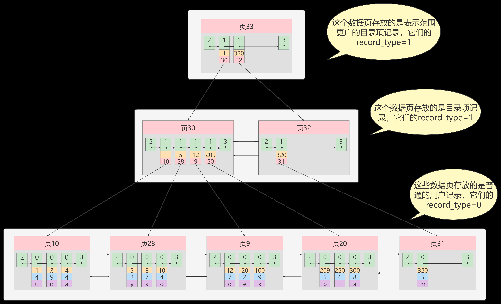

如图，我们生成了一个存储更高级目录项的`页33`，这个页中的两条记录分别代表页30和页32，如果用户记录的主键值在`[1, 320)`之间，则到页30中查找更详细的目录项记录，如果主键值`不小于320`的话，就到页32中查找更详细的目录项记录。


随着表中记录的增加，这个目录的层级会继续增加，如果简化一下，那么我们可以用下边这个图来描述它：

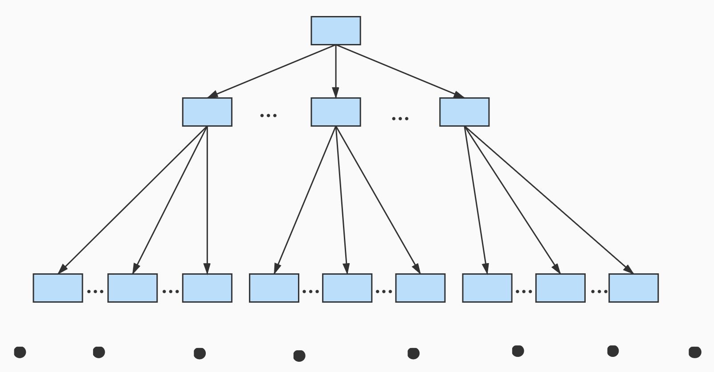

这个数据结构，它的名称是`B+树`。


###### **B+Tree**

不论是存放`用户记录`的数据页，还是存放`目录项记录`的数据页，我们都把它们存放到B+树这个数据结构中了，所以我们也称这些数据页为`节点`。从图中可以看出，我们的实际用户记录其实都存放在B+树的最底层的节点上，这些节点也被称为`叶子节点`，其余用来`存放目录项`的节点称为`非叶子节点`或者`内节点`，其中B+树最上边的那个节点也称为`根节点`。


一个B+树的节点其实可以分成好多层，规定最下边的那层，也就是存放我们用户记录的那层为第`0`层，之后依次往上加。之前我们做了一个非常极端的假设：存放用户记录的页`最多存放3条记录`，存放目录项`记录的页`最多存放4条记录。其实真实环境中一个页存放的记录数量是非常大的，假设所有存放用户记录的叶子节点代表的数据页可以存放`100条用户记录`，所有存放目录项记录的内节点代表的数据页可以存放`1000条目录项记录`，那么：

- 如果B+树只有1层，也就是只有1个用于存放用户记录的节点，最多能存放`100`条记录。
- 如果B+树有2层，最多能存放`1000×100=10,0000`条记录。
- 如果B+树有3层，最多能存放`1000×1000×100=1,0000,0000`条记录。
- 如果B+树有4层，最多能存放`1000×1000×1000×100=1000,0000,0000`条记录。相当多的记录！！！

你的表里能存放`1000,0000,0000`条记录吗？所以一般情况下，我们`用到的B+树都不会超过4层`，那我们通过主键值去查找某条记录最多只需要做4个页面内的查找（查找3个目录项页和一个用户记录页），又因为在每个页面内有所谓的`Page Directory`（页目录），所以在页面内也可以通过`二分法`实现快速定位记录。


#### 3.3 常见索引概念

索引按照物理实现方式，索引可以分为2种：聚簇（聚集）和非聚簇（非聚集）索引。我们也把非聚集索引称为二级索引或者辅助索引。

##### 3.3.1 聚簇索引

**聚簇索引**并不是一种单独的索引类型，而是**一种数据存储方式**(所有的用户记录都存储在了叶子节点)，也就是所谓的`索引即数据，数据即索引`。

> 术语"聚簇"表示数据行和相邻的键值聚簇的存储在一起。

**特点：**

1. 使用记录主键值的大小进行记录和页的排序，这包括三个方面的含义：

   - `页内`的记录是按照主键的大小顺序排成一个`单向链表`。
   - 各个存放`用户记录的页`也是根据页中用户记录的主键大小顺序排成一个`双向链表`。
   - 存放`目录项记录的页`分为不同的层次，在同一层次中的页也是根据页中目录项记录的主键大小顺序排成一个`双向链表`。

2. B+树的`叶子节点`存储的是完整的用户记录。

   所谓完整的用户记录，就是指这个记录中存储了所有列的值（包括隐藏列）。

我们把具有这两种特性的B+树称为`聚簇索引`，所有完整的用户记录都存放在这个`聚簇索引`的叶子节点处。这种聚簇索引并不需要我们在MySQL语句中显式的使用`INDEX`语句去创建，`InnoDB`存储引擎会`自动`的为我们创建聚簇索引。


**优点：**

- `数据访问更快`，因为聚簇索引将索引和数据保存在同一个B+树中，因此从聚簇索引中获取数据比非聚簇索引更快
- 聚簇索引对于主键的`排序查找`和`范围查找`速度非常快
- 按照聚簇索引排列顺序，查询显示一定范围数据的时候，由于数据都是紧密相连，数据库不用从多个数据块中提取数据，所以`节省了大量的IO操作`。

**缺点：**

- `插入速度严重依赖于插入顺序`，按照主键的顺序插入是最快的方式，否则将会出现页分裂，严重影响性能。因此，对于InnoDB表，我们一般都会定义一个`自增的ID列为主键`
- `更新主键的代价很高`，因为将会导致被更新的行移动。因此，对于InnoDB表，我们一般定义`主键为不可更新`
- `二级索引访问需要两次索引查找`，第一次找到主键值，第二次根据主键值找到行数据

**限制：**

- 对于MySQL数据库目前只有InnoDB数据引擎支持聚簇索引，而MyISAM并不支持聚簇索引。
- 由于数据物理存储排序方式只能有一种，所以每个MySQL的`表只能有一个聚簇索引`。一般情况下就是该表的主键。
- 如果没有定义主键，Innodb会选择`非空的唯一索引`代替。如果没有这样的索引，Innodb会隐式的定义一个主键来作为聚簇索引。
- 为了充分利用聚簇索引的聚簇的特性，所以innodb表的主键列尽量`选用有序的顺序id`，而不建议用无序的id，比如`UUID、MD5、HASH、字符串`列作为主键无法保证数据的顺序增长。


##### 3.3.2 二级索引（辅助索引、非聚簇索引）

上边介绍的`聚簇索引`只能在搜索条件是`主键值`时才能发挥作用，因为B+树中的数据都是按照主键进行排序的。那如果我们想以别的列作为搜索条件该怎么办呢？肯定不能是从头到尾沿着链表依次遍历记录一遍。

答案:我们可以`多建几棵B+树`，不同的B+树中的数据采用不同的排序规则。比方说我们用`c2`列的大小作为数据页、页中记录的排序规则，再建一棵B+树，效果如下图所示:

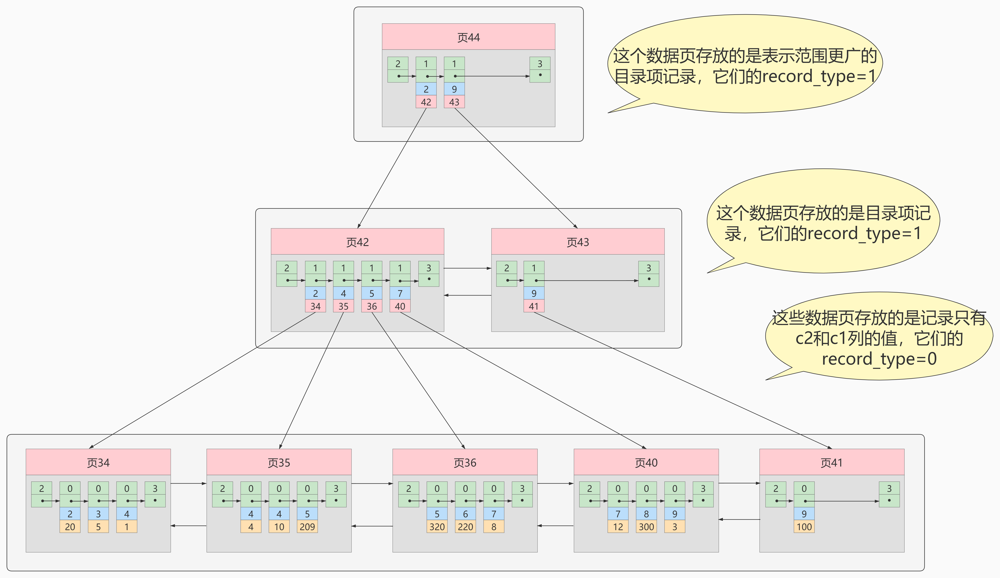

这个B+树与上边介绍的聚簇索引有几处不同:

- 使用记录c2列的大小进行记录和页的排序，这包括三个方面的含义:
  - 页内的记录是按照c2列的大小顺序排成一个`单向链表`。
  - 各个存放`用户记录的页`也是根据页中记录的c2列大小顺序排成一个双向链表。
  - 存放`目录项记录的页分`为不同的层次，在同一层次中的页也是根据页中目录项记录的c2列大小顺序排成一个`双向链表`。
- B+树的叶子节点存储的并不是完整的用户记录，而只是`c2列+主键`这两个列的值。
- 目录项记录中不再是`主键+页号`的搭配，而变成了`c2列+页号`的搭配。

所以如果我们现在想通过c2列的值查找某些记录的话就可以使用我们刚刚建好的这个B+树了。以查找c2列的值为`4`的记录为例，查找过程如下：

1. 确定`目录项记录页`

   根据`根页面`，也就是`页44`，可以快速定位到`目录项记录`所在的页为`页42` (因为`2 < 4 < 9`)。

2. 通过`目录项记录页`确定用户记录真实所在的页。

   在`页42`中可以快速定位到实际存储用户记录的页，但是由于`c2`列并没有唯一性约束，所以`c2`列值为`4`的记录可能分布在多个数据页中，又因为`2<4≤4`，所以确定实际存储用户记录的页在`页34`和`页35`中。

3. 在真实存储用户记录的页中定位到具体的记录。

   到`页34`和`页35`中定位到具体的记录。

4. 但是这个B+树的叶子节点中的记录只存储了`c2`和`c1`(也就是`主键`)两个列，所以我们必须再根据主键值去聚簇索引中再查找一遍完整的用户记录。

**概念**：**回表 **我们根据这个以c2列大小排序的B+树只能确定我们要查找记录的主键值，所以如果我们想根据c2列的值查找到完整的用户记录的话，仍然需要到`聚簇索引`中再查一遍，这个过程称为`回表`。也就是根据c2列的值查询一条完整的用户记录需要使用到`2`棵B+树！

**问题**：为什么我们还需要一次`回表`操作呢？直接把完整的用户记录放到叶子节点不OK吗？

**回答**：

如果把完整的用户记录放到叶子节点是可以不用回表。但是`太占地方`了，相当于每建立一棵B+树都需要把所有的用户记录再都拷贝一遍，这就有点太浪费存储空间了。

因为这种按照`非主键列`建立的B+树需要一次回表操作才可以定位到完整的用户记录，所以这种B+树也被称为二级索引(英文名

`secondary index`)，或者`辅助索引`。由于我们使用的是c2列的大小作为B+树的排序规则，所以我们也称这个B+树是为c2列建立的索引。

非聚簇索引的存在不影响数据在聚簇索引中的组织，所以一张表可以有多个非聚簇索引。

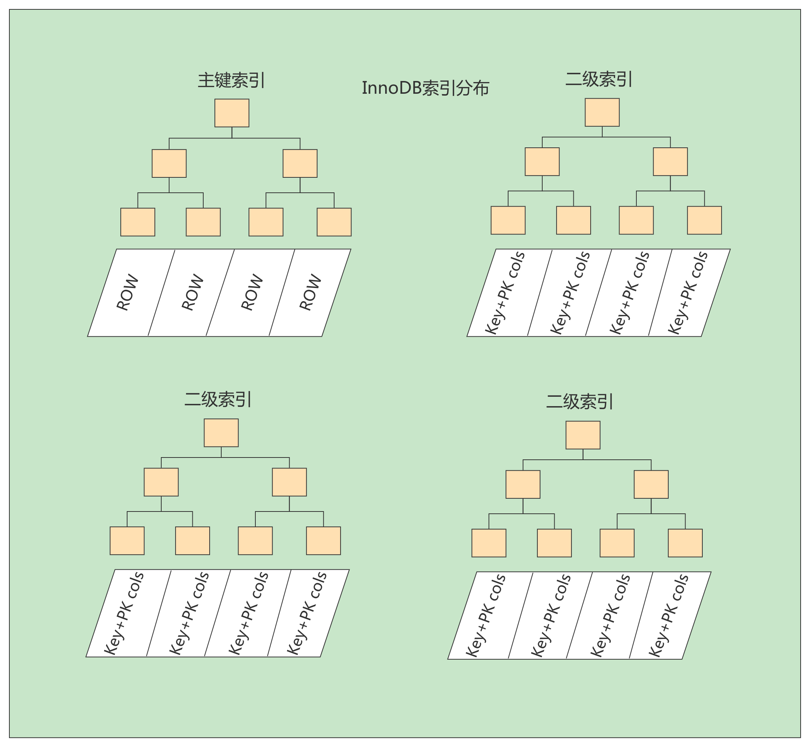

小结：聚簇索引与非聚簇索引的原理不同，在使用上也有一些区别：

1. 聚簇索引的`叶子节点`存储的就是我们的`数据记录`，非聚簇索引的叶子节点存储的是`数据位置`。非聚簇索引不会影响数据表的物理存储顺序。
2. 一个表只能有一个聚簇索引，因为只能有一种排序存储的方式，但可以有多个非聚簇索引，也就是多个索引目录提供数据检索。使用聚簇索引的时候，数据的查询效率高，但如果对数据进行插入，删除，更新等操作，效率会比非聚簇索引低。


#####  3.3.3 联合索引

我们也可以同时以多个列的大小作为排序规则，也就是同时为多个列建立索引，比方说我们想让B+树按照`c2和c3列`的大小进行排序，这个包含两层含义：

- 先把各个记录和页按照c2列进行排序。
- 在记录的c2列相同的情况下，采用c3列进行排序

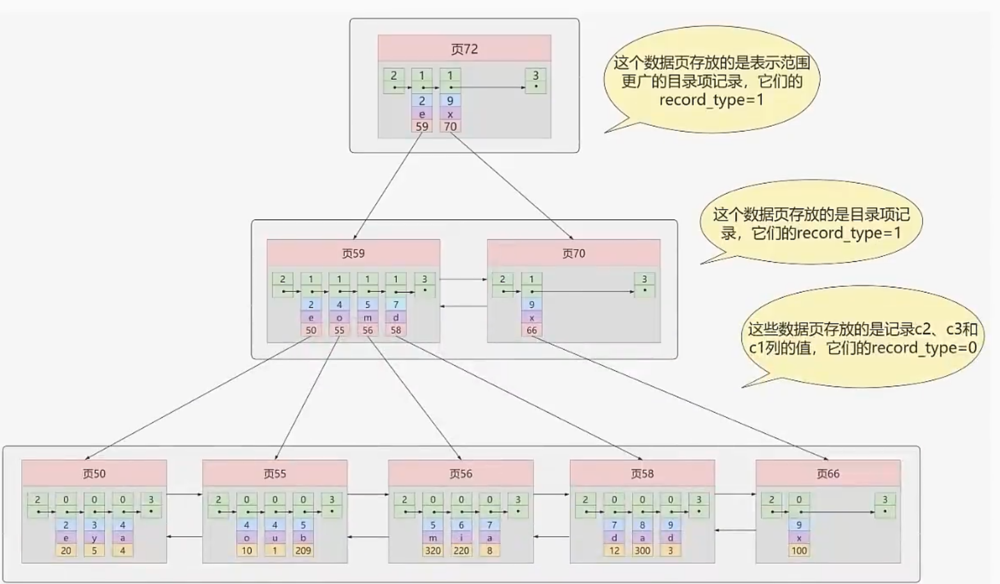

如图所示，我们需要注意以下几点：

- 每条`目录项记录`都由`c2`、`c3`、`页号`这三个部分组成，各条记录先按照c2列的值进行排序，如果记录的c2列相同，则按照c3列的值进行排序。
- B+树`叶子节点`处的用户记录由`c2、c3和主键c1列`组成。

注意一点，以c2和c3列的大小为排序规则建立的B+树称为`联合索引`，本质上也是一个二级索引。它的意思与分别为c2和c3列分别建立索引的表述是不同的，不同点如下：

- 建立`联合索引`只会建立如上图一样的1棵B+树。
- 为c2和c3列分别建立索引会分别以c2和c3列的大小为排序规则建立2棵B+树。


#### 3.4 InnoDB的B+树索引的注意事项

##### 3.4.1 根页面位置万年不动

我们前边介绍B+树索引的时候，为了大家理解上的方便，先把存储用户记录的叶子节点都画出来，然后接着画存储目录项记录的内节点，实际上B+树的形成过程是这样的：

- 每当为某个表创建一个B+树索引(聚簇索引不是人为创建的，默认就有)的时候，都会为这个索引创建一个`根节点`页面。最开始表中没有数据的时候，每个B+树索引对应的`根节点`中既没有用户记录，也没有目录项记录。
- 随后向表中插入用户记录时，先把用户记录存储到这个`根节点`中。
- 当根节点中的`可用空间用完时`继续插入记录，此时会将根节点中的所有记录复制到一个新分配的页，比如`页a`中，然后对这个新页进行`页分裂`的操作，得到另一个新页，比如`页b`。这时新插入的记录根据键值(也就是聚簇索引中的主键值，二级索引中对应的索引列的值)的大小就会被分配到`页a`或者`页b`中，而`根节点`便升级为存储目录项记录的页。

这个过程特别注意的是：一个B+树索引的根节点自诞生之日起，便不会再移动。这样只要我们对某个表建立一个索引，那么它的根节点的页号便会被记录到某个地方，然后凡是`InnoDB`存储引擎需要用到这个索引的时候，都会从那个固定的地方取出根节点的页号，从而来访问这个索引。


##### 3.4.2 内节点中目录项记录的唯一性

我们知道B+树索引的内节点中目录项记录的内容是`索引列+页号`的搭配，但是这个搭配对于二级索引来说有点儿不严谨。还拿`index_demo`表为例。假设这个表中的数据是这样的：

| `c1` | `c2` | `c3` |
| ---- | ---- | ---- |
| 1    | 1    | 'u'  |
| 3    | 1    | 'd'  |
| 5    | 1    | 'y'  |
| 7    | 1    | 'a'  |

如果二级索引中目录项记录的内容只是`索引列+页号`的搭配的话，那么为`c2`列建立索引后的B+树应该长这样:

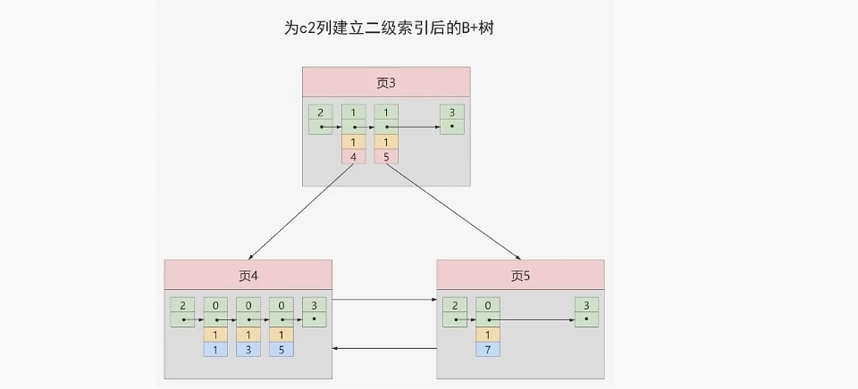

如果我们想新插入一行记录，其中`c1、c2、c3`的值分别是:`9、1、'c'`，那么在修改这个为c2列建立的二级索引对应的B+树时便碰到了个大问题：由于`页3`中存储的目录项记录是由`c2列+页号`的值构成的，`页3`中的两条目录项记录对应的c2列的值都是`1`，而我们`新插入的这条记录`的c2列的值也是1，那我们这条新插入的记录到底应该放到`页4`中，还是应该放到`页5`中啊？

答案是:对不起，懵了。

为了让新插入记录能找到自己在那个页里，**我们需要保证在B+树的同一层内节点的目录项记录除页号这个字段以外是唯一的**。所以对于二级索引的内节点的目录项记录的内容实际上是由三个部分构成的：

- 索引列的值
- 主键值
- 页号

也就是我们把主键值也添加到二级索引内节点中的目录项记录了，这样就能保证B+树每一层节点中各条目录项记录除页号这个字段外是唯一的，所以我们为c2列建立二级索引后的示意图实际上应该是这样子的:

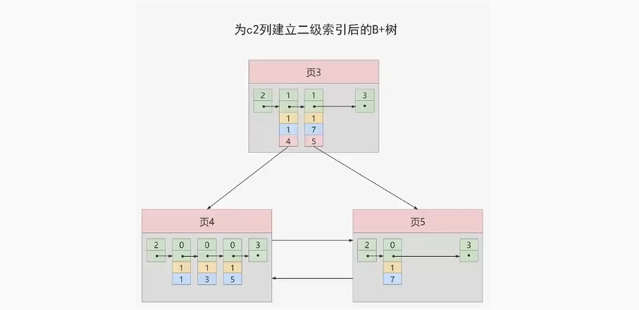

这样我们再插入记录`(9，1，'c')`时，由于页3中存储的目录项记录是由`c2列+主键+页号`的值构成的，可以先把新记录的`c2`列的值和`页3`中各目录项记录的`c2`列的值作比较，如果`c2`列的值相同的话，可以接着比较主键值，因为B+树同一层中不同目录项记录的`c2列+主键`的值肯定是不一样的，所以最后肯定能定位唯一的一条目录项记录，在本例中最后确定新记录应该被插入到`页5`中。


##### 3.4.3 一个页面最少存储2条记录

一个B+树只需要很少的层级就可以轻松存储数亿条记录，查询速度相当不错！这是因为B+树本质上就是一个大的多层级目录，每经过一个目录时都会过滤掉许多无效的子目录，直到最后访问到存储真实数据的目录。那如果一个大的目录中只存放一个子目录是个啥效果呢？那就是目录层级非常非常非常多，而且最后的那个存放真实数据的目录中只能存放一条记录。费了半天劲只能存放一条真实的用户记录？所以`InnoDB的一个数据页至少可以存放两条记录`。


### 4 MyISAM中的索引方案

**B树索引适用存储引擎如表所示：**

| 索引 / 存储引擎 | MyISAM | InnoDB | Memory |
| --------------- | ------ | ------ | ------ |
| B-Tree索引      | 支持   | 支持   | 支持   |

即使多个存储引擎支持同一种类型的索引，但是他们的实现原理也是不同的。Innodb和MyISAM默认的索引是B+tree索引；而Memory默认的索引是Hash索引。

MyISAM引擎使用`B+Tree`作为索引结构，叶子节点的data域存放的是`数据记录的地址`。


#### 4.2 MyISAM索引的原理

下图是MyISAM索引的原理图。

我们知道`InnoDB中索引即数据`，也就是聚簇索引的那棵B+树的叶子节点中已经把所有完整的用户记录都包含了,
而`MyISAM`的索引方案虽然也使用树形结构，但是却`将索引和数据分开存储`：

- 将表中的记录`按照记录的插入顺序`单独存储在一个文件中，称之为`数据文件`。这个文件并不划分为若干个数据页，有多少记录就往这个文件中塞多少记录就成了。由于在插入数据的时候并`没有刻意按照主键大小排序`，所以我们并不能在这些数据上使用二分法进行查找。
- 使用`MyISAM`存储引擎的表会把索引信息另外存储到一个称为`索引文件`的另一个文件中。`MyISAM`会单独为表的主键创建一个索引，只不过在索引的叶子节点中存储的不是完整的用户记录，而是`主键值+数据记录地址`的组合。

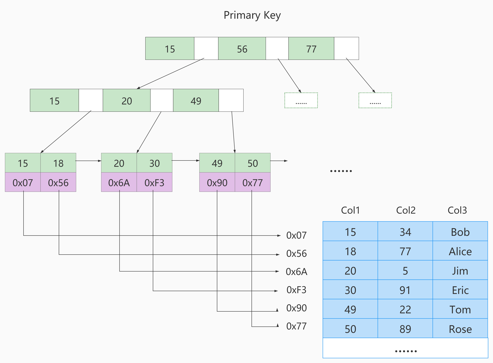

这里设表共有三列，假设我们以Col1为主键，上图是一个MyISAM表的主索引(Primary key)示意。可以看出**MyISAM的索引文件仅仅保存数据记录的地址**。在MyISAM中，主键索引和二级索引(Secondary key)在结构上没有任何区别，只是主键索引要求key是唯一的，而二级索引的key可以重复。

如果我们在Col2上建立一个二级索引，则此索引的结构如下图所示：

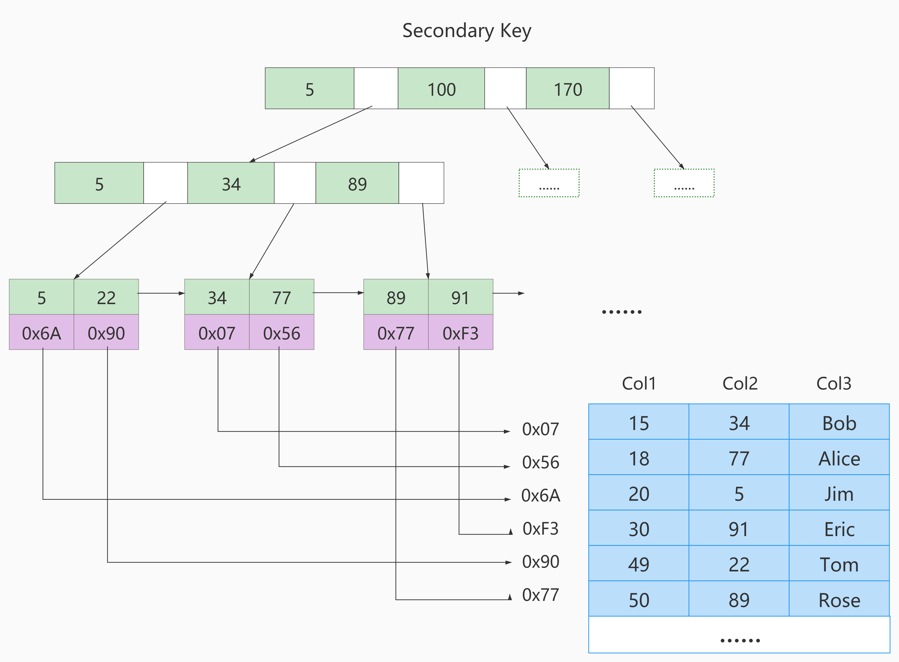

同样也是一棵B+Tree，data域保存数据记录的地址。因此，MyISAM中索引检索的算法为：首先按照B+Tree搜索算法搜索索引，如果指定的Key存在，则取出其data域的值，然后以data域的值为地址，读取相应数据记录。


#### 4.3 MyISAM 与 InnoDB对比

**MyISAM的索引方式都是“非聚簇”的，与InnoDB包含1个聚簇索引是不同的。小结两种引擎中索引的区别：**

1. 在InnoDB存储引擎中，我们只需要根据主键值对`聚簇索引`进行一次查找就能找到对应的记录，而在`MyISAM`中却需要进行一次`回表`操作，意味着MyISAM中建立的索引相当于全部都是`二级索引`。
2. InnoDB的数据文件本身就是索引文件，而MyISAM索引文件和数据文件是`分离的`，索引文件仅保存数据记录的地址。
3. InnoDB的非聚簇索引data域存储相应记录`主键的值`，而MyISAM索引记录的是`地址`。换句话说，InnoDB的所有非聚簇索引都引用主键作为data域。
4. MyISAM的回表操作是十分`快速`的，因为是拿着地址偏移量直接到文件中取数据的，反观InnoDB是通过获取主键之后再去聚簇索引里找记录，虽然说也不慢，但还是比不上直接用地址去访问。
5. InnoDB要求表`必须有主键`（`MyISAM可以没有`）。如果没有显式指定，则MySQL系统会自动选择一个可以非空且唯一标识数据记录的列作为主键。如果不存在这种列，则MySQL自动为InnoDB表生成一个隐含字段作为主键，这个字段长度为6个字节，类型为长整型。

**小结：**

了解不同存储引擎的索引实现方式对于正确使用和优化索引都非常有帮助。比如：

举例1：知道了InnoDB的索引实现后，就很容易明白`为什么不建议使用过长的字段作为主键`，因为所有二级索引都引用主键索引，过长的主键索引会令二级索引变得过大。

举例2：用非单调的字段作为主键在InnoDB中不是个好主意，因为InnoDB数据文件本身是一棵B+Tree, 非单调的主键会造成在插入新记录时，数据文件为了维持B+Tree的特性而频繁的分裂调整，十分低效，而使用`自增字段作为主键则是一个很好的选择`。

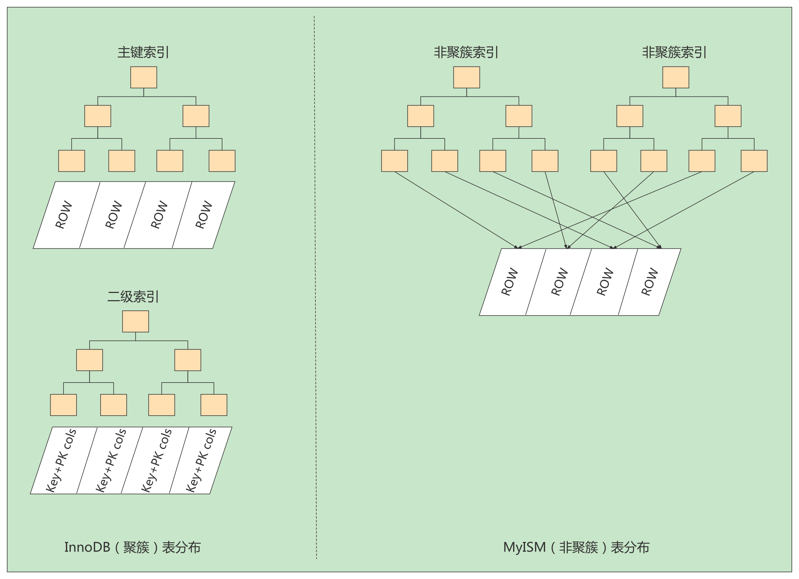


### 5 索引的代价

索引是个好东西，可不能乱建，它在空间和时间上都会有消耗：

- **空间上的代价**

  每建立一个索引都要为它建立一棵B+树，每一棵B+树的每一个节点都是一个数据页，一个页默认会占用 `16KB`的存储空间，一棵很大的B+树由许多数据页组成，那就是很大的一片存储空间。

- **时间上的代价**

  每次对表中的数据进行`增、删、改`操作时，都需要去修改各个B+树索引。而且我们讲过，B+树每层节点都是按照索引列的值`从小到大的顺序排序`而组成了`双向链表`。不论是叶子节点中的记录，还是内节点中的记录（也就是不论是用户记录还是目录项记录）都是按照索引列的值从小到大的顺序而形成了一个单向链表。而增、删、改操作可能会对节点和记录的排序造成破坏，所以存储引擎需要额外的时间进行一些`记录移位`，`页面分裂`、`页面回收`等操作来维护好节点和记录的排序。如果我们建了许多索引，每个索引对应的B+树都要进行相关的维护操作，会给性能拖后腿。

> 一个表上索引建的越多，就会占用越多的存储空间，在增删改记录的时候性能就越差。为了能建立又好又少的索引，我们得学学这些索引在哪些条件下起作用的。


### 6 MySQL数据结构选择的合理性

从MySQL的角度讲，不得不考虑一个现实问题就是磁盘IO。如果我们能让索引的数据结构尽量减少硬盘的IO操作，所消耗的时间也就越小。可以说，`磁盘的IO操作次数`对索引的使用效率至关重要。

查找都是索引操作，一般来说索引非常大，尤其是关系型数据库，当数据量比较大的时候，索引的大小有可能几个G甚至更多，为了减少索引在内存的占用，**数据库索引是存储在外部磁盘上的**。当我们利用索引查询的时候，不可能把整个索引全部加载到内存，只能`逐一加载`，那么MySQL衡量查询效率的标准就是磁盘IO次数。


#### 6.1 全表遍历

这里都懒得说了。


#### 6.2 Hash结构

Hash本身是一个函数，又被称为散列函数，它可以帮助我们大幅提升检索数据的效率。

Hash算法是通过某种确定性的算法(比如MD5、SHA1、SHA2、SHA3)将输入转变为输出。`相同的输入永远可以得到相同的输出`，假设输入内容有微小偏差，在输出中通常会有不同的结果。

**举例**：如果你想要验证两个文件是否相同，那么你不需要把两份文件直接拿来比对，只需要让对方把Hash函数计算得到的结果告诉你即可，然后在本地同样对文件进行Hash函数的运算，最后通过比较这两个Hash函数的结果是否相同，就可以知道这两个文件是否相同。

**加速查找速度的数据结构，常见的有两类**：

1. 树，例如平衡二叉搜索树，查询/插入/修改/删除的平均时间复杂度都是`O(1og2N)`;
2. 哈希，例如HashMap, 查询/插入/修改/删除的平均时间复杂度都是`O(1)`;

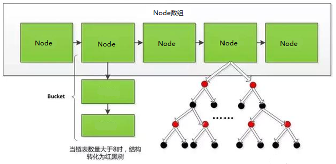

采用Hash进行检索效率非常高，基本上一次检索就可以找到数据，而B+树需要自顶向下依次查找，多次访问节点才能找到数据，中间需要多次I/0操作，从效率来说Hash比B+树更快。

在哈希的方式下，一个元素k处于h(k)中，即利用哈希函数h，根据关键字k计算出槽的位置。函数h将关键字域映射到`哈希表T[0...m-1]`的槽位上。

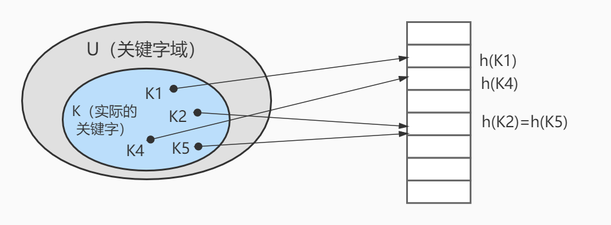

上图中哈希函数h有可能将两个不同的关键字映射到相同的位置，这叫做`碰撞`，在数据库中一般采用`链接法`来解决。在链接法中，将散列到同一槽位的元素放在一个链表中，如下图所示：

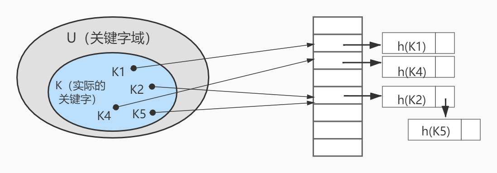

实验：体会数组和hash表的查找方面的效率区别

```java
// 算法复杂度为 O(n)
@Test
public void test1(){
	int[] arr = new int[100000];
	for(int i = 0; i < arr.length; i++){
		arr[i] = i + 1;
	}

	long start = System.currentTimeMillis();
	for(int j = 1; j<=100000;j++){
		int temp = j;
		for(int i = 0; i < arr.length; i++){
			if(temp == arr[i]){
				break;
			}
		}
	}
	long end = System.currentTimeMillis();
	System.out.println("time： " + (end - start)); //time： 823
}
```

```java
//算法复杂度为 O(1)
@Test
public void test2(){
	HashSet<Integer> set = new HashSet<>(100000);
	for(int i = 0;i < 100000;i++){
		set.add(i + 1);
	}

	long start = System.currentTimeMillis();
	for(int j = 1; j<=100000;j++) {
		int temp = j;
		boolean contains = set.contains(temp);
	}
	long end = System.currentTimeMillis();
	System.out.println("time： " + (end - start)); //time： 5
}
```

**Hash结构效率高，那为什么索引结构要设计成树型呢？**

- **原因1**：Hash索引仅能满足(=)、(<>)和IN查询。如果进行`范围查询`，哈希型的索引，时间复杂度会退化为0(n)；而树型的“有序”特性，依然能够保持0(log2N)的高效率。
- **原因2**：Hash索引还有一个缺陷，数据的存储是`没有顺序的`，在ORDER BY的情况下，使用Hash索引还需要对数据重新排序。
- **原因3**：对于联合索引的情况，Hash值是将联合索引键合并后一起来计算的，无法对单独的一个键或者几个索引键进行查询。
- **原因4**：对于等值查询来说，通常Hash索引的效率更高，不过也存在一种情况，就是`索引列的重复值如果很多，效率就会降低`。这是因为遇到Hash冲突时，需要遍历桶中的行指针来进行比较，找到查询的关键字，非常耗时。所以，Hash索引通常不会用到重复值多的列上，比如列为性别、年龄的情况等。

**Hash索引适用存储引擎如表所示：**

| 索引 / 存储引擎 | MyISAM | MyISAM | Memory |
| --------------- | ------ | ------ | ------ |
| HASH索引        | 不支持 | 不支持 | `支持` |

**Hash索引的适用性：**

Hash索引存在着很多限制，相比之下在数据库中B+树索引的使用面会更广，不过也有一些场景采用Hash索引效率更高，比如在键值型(Key-Value)数据库中，**Redis存储的核心就是Hash表**。

MySQL中的Memory存储引擎支持Hash存储，如果我们需要用到查询的临时表时，就可以选择Memory存储引擎，把某个字段设置为Hash索引，比如字符串类型的字段，进行Hash计算之后长度可以缩短到几个字节。当字段的重复度低，而且经常需要进行`等值查询`的时候，采用Hash索引是个不错的选择。

另外，InnoDB本身不支持Hash索引，但是提供`自适应Hash索引`(Adaptive Hash Index)。什么情况下才会使用自适应Hash索引呢?如果某个数据经常被访问，当满足一定条件的时候，就会将这个数据页的地址存放到Hash表中。这样下次查询的时候，就可以直接找到这个页面的所在位置。这样让B+树也具备了Hash索引的优点。


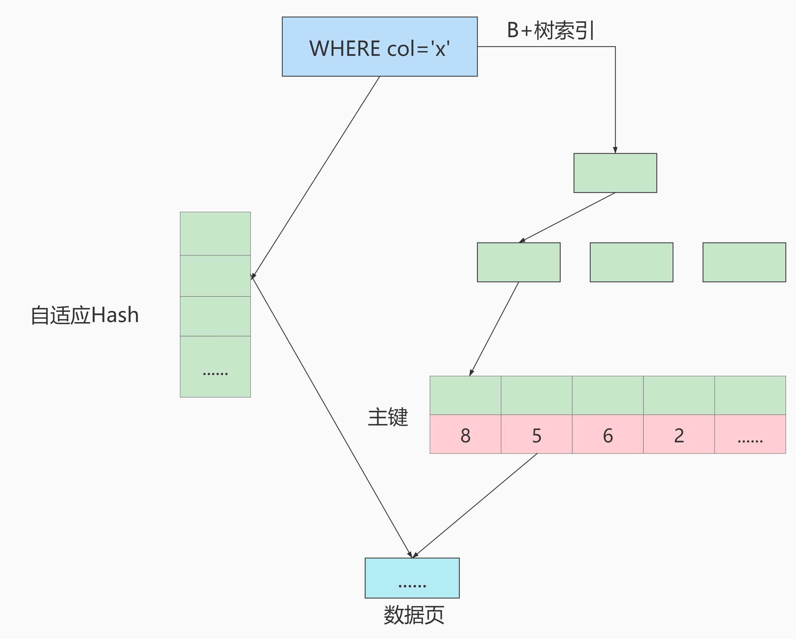

采用自适应 Hash 索引目的是方便根据 SQL 的查询条件加速定位到叶子节点，特别是当 B+ 树比较深的时
候，通过自适应 Hash 索引可以明显提高数据的检索效率。

我们可以通过`innodb_adaptive_hash_index`变量来查看是否开启了自适应 Hash，比如：

```mysql
 show variables like '%adaptive_hash_index';
```

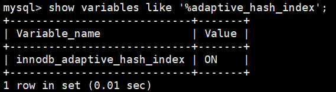

#### 6.3 二叉搜索树

如果我们利用二叉树作为索引结构，那么磁盘的IO次数和索引树的高度是相关的。

**1. 二叉搜索树的特点**

- 一个节点只能有两个子节点，也就是一个节点度不能超过2
- 左子节点<本节点；右子节点>=本节点，比我大的向右，比我小的向左

**2. 查找规则**

我们先来看下最基础的二叉搜索树(Binary Search Tree)，搜索某个节点和插入节点的规则一样，我们假设搜索插入的数值为key:

1. 如果key大于根节点，则在右子树中进行查找;
2. 如果key小于根节点，则在左子树中进行查找;
3. 如果key等于根节点，也就是找到了这个节点，返回根节点即可。

举个例子，我们对数列(34, 22, 89，5，23, 77 91)创造出来的二分查找树如下图所示：

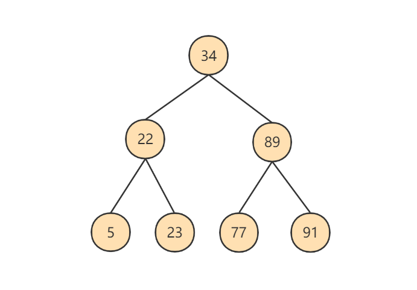

但是存在特殊的情况，就是有时候二叉树的深度非常大。比如我们给出的数据顺序是(5,22,23,34,77,89,91)，创造出来的二分搜索树如下图所示：

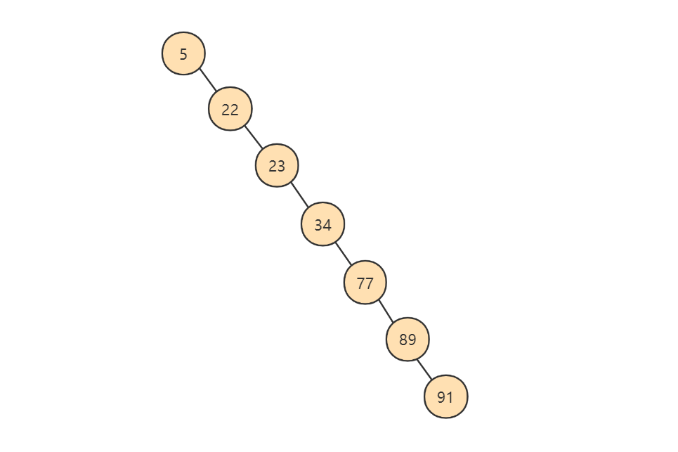

上面第二棵树也属于二分查找树，但是性能上已经退化成了一条链表，查找数据的时间复杂度变成了`O(n)`。你能看出来第一个树的深度是3，也就是说最多只需3次比较，就可以找到节点，而第二个树的深度是7，最多需要7次比较才能找到节点。

为了提高查询效率，就需要`减少磁盘IO数`。为了减少磁盘IO的次数，就需要尽量`降低树的高度`，需要把原来“瘦高”的树结构变的“矮胖”，树的每层的分叉越多越好。


#### 6.4 AVL树

为了解决上面二叉查找树退化成链表的问题，人们提出了`平衡二叉搜索树(Balanced Binary Tree)`，又称为AVL树(有别于AVL算法)，它在二叉搜索树的基础上增加了约束，具有以下性质:

**它是一棵空树或它的左右两个子树的高度差的绝对值不超过1，并且左右两个子树都是一棵平衡二叉树。**

这里说一-下，常见的平衡二叉树有很多种，包括了`平衡二叉搜索树、红黑树、数堆、伸展树`。平衡二叉搜索树是最早提出来的自平衡二叉搜索树，当我们提到平衡二叉树时一般指的就是平衡二叉搜索树。事实上，第一棵树就属于平衡二叉搜索树，搜索时间复杂度就是`O(log2n)`。

数据查询的时间主要依赖于磁盘IO的次数，如果我们采用二叉树的形式，即使通过平衡二叉搜索树进行了改进，树的深度也是O(log2n)，当n比较大时，深度也是比较高的，比如下图的情况：

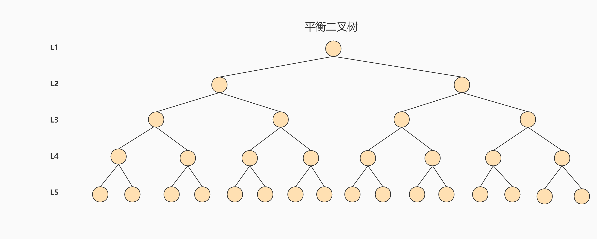

`每访问一次节点就需要进行一次磁盘IO操作`，对于上面的树来说，我们需要进行5次IO操作。虽然平衡二叉树的效率高，但是树的深度也同样高，这就意味着磁盘IO操作次数多，会影响整体数据查询的效率。

针对同样的数据，如果我们把二叉树改成`M叉树`（M>2）呢？当 M=3 时，同样的 31 个节点可以由下面的三叉树来进行存储：

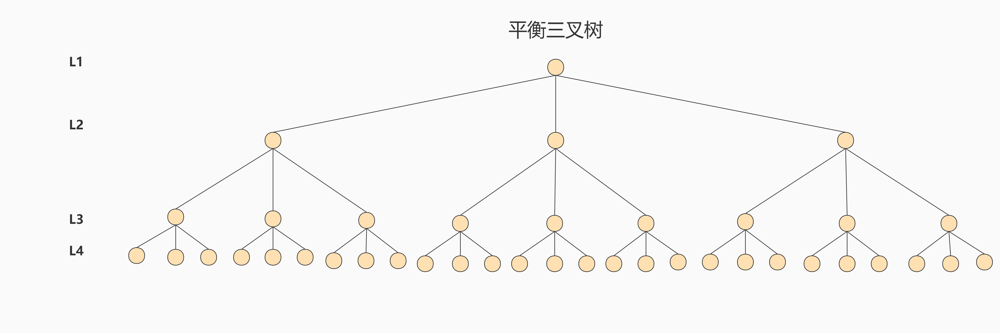

你能看到此时树的高度降低了，当数据量N大的时候，以及树的分叉数M大的时候，M叉树的高度会远小于二叉树的高度(M>2)。所以，我们需要把`树从“瘦高"变”矮胖”`。


#### 6.5 B-Tree

B树的英文是Balance Tree，也就是`多路平衡查找树`。简写为B-Tree (注意横杠表示这两个单词连起来的意思，不是减号)。它的高度远小于平衡二叉树的高度。

B 树的结构如下图所示：

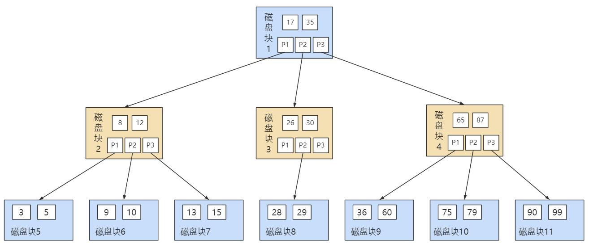

B树作为多路平衡查找树，它的每一个节点最多可以包括M个子节点，`M称为B树的阶`。每个磁盘块中包括了`关键字`和`子节点的指针`。如果一个磁盘块中包括了x个关键字，那么指针数就是x+1。对于一个100阶的B树来说，如果有3层的话最多可以存储约100万的索引数据。对于大量的索引数据来说，采用B树的结构是非常适合的，因为树的高度要远小于二叉树的高度。

一个 M 阶的 B 树（M>2）有以下的特性：

1. 根节点的儿子数的范围是 [2,M]。
2. 每个中间节点包含 k-1 个关键字和 k 个孩子，孩子的数量 = 关键字的数量+1，k的取值范围为
    [ceil(M/2), M]。
3. 叶子节点包括k-1个关键字（叶子节点没有孩子），k 的取值范围为 [ceil(M/2), M]。
4. 假设中间节点节点的关键字为：Key[1], Key[2], …, Key[k-1]，且关键字按照升序排序，即 Key[i]
   < Key[i+1]。此时 k-1 个关键字相当于划分了k个范围，也就是对应着 k 个指针，即为：P[1], P[2], …, P[k]，其中 P[1] 指向关键字小于 Key[1] 的子树，P[i] 指向关键字属于 (Key[i-1], Key[i]) 的子树，P[k]指向关键字大于 Key[k-1] 的子树。
5. 所有叶子节点位于同一层。

上面那张图所表示的 B 树就是一棵 3 阶的 B 树。我们可以看下磁盘块2，里面的关键字为（8，12），它
有 3 个孩子 (3，5)，(9，10) 和 (13，15)，你能看到 (3，5) 小于 8，(9，10) 在 8 和 12 之间，而 (13，15)
大于 12，刚好符合刚才我们给出的特征。

然后我们来看下如何用 B 树进行查找。假设我们想要`查找的关键字是 9`，那么步骤可以分为以下几步：

1. 我们与根节点的关键字 (17，35）进行比较，9 小于 17 那么得到指针 P1；
2. 按照指针 P1 找到磁盘块 2，关键字为（8，12），因为 9 在 8 和 12 之间，所以我们得到指针 P2；
3. 按照指针 P2 找到磁盘块 6，关键字为（9，10），然后我们找到了关键字 9。

你能看出来在B树的搜索过程中，我们比较的次数并不少，但如果把数据读取出来然后在内存中进行比较，这个时间就是可以忽略不计的。而读取磁盘块本身需要进行 I/O 操作，消耗的时间比在内存中进行比较所需要的时间要多，是数据查找用时的重要因素。`B 树相比于平衡二叉树来说磁盘 I/O 操作要少`，在数据查询中比平衡二叉树效率要高。所以`只要树的高度足够低，IO次数足够少，就可以提高查询性能`。

**小结：**

1. B树在插入和删除节点的时候如果导致树不平衡，就通过自动调整节点的位置来保持树的自平衡。
2. 关键字集合分布在整棵树中，即叶子节点和非叶子节点都存放数据。搜索有可能在非叶子节点结束
3. 其搜索性能等价于在关键字全集内做一次二分查找。

**再举例1：**

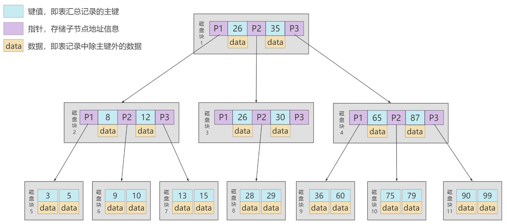


#### 6.6 B+Tree

B+树也是一种多路搜索树，`基于B树做出了改进`，主流的DBMS都支持B+树的索引方式，比如MySQL。相比于B-Tree，`B+Tree适合文件索引系统`。

MySQL官网说明：

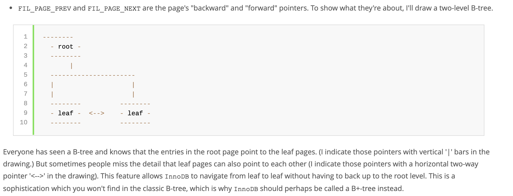

B+ 树和 B 树的差异：

1. 有 k 个孩子的节点就有 k 个关键字。也就是孩子数量 = 关键字数，而 B 树中，孩子数量 = 关键字数
    +1。
2. 非叶子节点的关键字也会同时存在在子节点中，并且是在子节点中所有关键字的最大（或最小）。
3. 非叶子节点仅用于索引，不保存数据记录，跟记录有关的信息都放在叶子节点中。而 B 树中，`非叶子节点既保存索引，也保存数据记录`。
4. 所有关键字都在叶子节点出现，叶子节点构成一个有序链表，而且叶子节点本身按照关键字的大小从小到大顺序链接。


B+树和B树有个根本的差异在于，B+树的中间节点并不直接存储数据。这样的好处都有什么呢?

首先，**B+树查询效率更稳定**。因为B+树每次只有访问到叶子节点才能找到对应的数据，而在B树中，非叶子节点也会存储数据，这样就会造成查询效率不稳定的情况，有时候访问到了非叶子节点就可以找到关键字，而有时需要访问到叶子节点才能找到关键字。

其次，**B+树的查询效率更高**。这是因为通常B+树比B树更`矮胖`(阶数更大，深度更低)，查询所需要的磁盘IO也会更少。同样的磁盘页大小，B+树可以存储更多的节点关键字。

不仅是对单个关键字的查询上，**在查询范围上，B+树的效率也比B树高**。这是因为所有关键字都出现在B+树的叶子节点中，叶子节点之间会有指针，数据又是递增的，这使得我们范围查找可以通过指针连接查找。而在B树中则需要通过中序遍历才能完成查询范围的查找，效率要低很多。

> B 树和 B+ 树都可以作为索引的数据结构，在 MySQL 中采用的是 B+ 树。
>
> 但B树和B+树各有自己的应用场景，不能说B+树完全比B树好，反之亦然。


**思考题：为了减少IO，索引树会一次性加载吗？**

> 1. 数据库索引是存储在磁盘上的，如果数据量很大，必然导致索引的大小也会很大，超过几个G。
> 2. 当我们利用索引查询时候，是不可能将全部几个G的索引都加载进内存的，我们能做的只能是：逐一加载每一个磁盘页，因为磁盘页对应着索引树的节点。

**思考题：B+树的存储能力如何？为何说一般查找行记录，最多只需1~3次磁盘IO**

> InnoDB存储引擎中页的大小为16KB，一般表的主键类型为INT(占用4个字节)或BIGINT(占用8个字节)，指针类型也一般为4或8个字节，也就是说一个页(B+Tree中的一个节点)中大概存储16KB/(8B+8B)=1K个键值(因为是估值，为方便计算，这里的K取值为10^3。也就是说一个深度为3的B+Tree索引可以维护10^3 * 10^3 * 10^3= 10亿条记录。(这里假定一个数据页也存储10^3条行记录数据了)
>
> 实际情况中每个节点可能不能填充满，因此在数据库中，`B+Tree的高度一般都在2~4层`。MySQL的InnoDB存储引擎在设计时是将根节点常驻内存的，也就是说查找某一键值的行记录时最多只需要1~3次磁盘IO操作。

**思考题：为什么说B+树比B-树更适合实际应用中操作系统的文件索引和数据库索引？**

> 1. B+树的磁盘读写代价更低
>
>    B+树的内部结点并没有指向关键字具体信息的指针。因此其内部结点相对B树更小。如果把所有同一内部结点的关键字存放在同一盘块中，那么盘块所能容纳的关键字数量也越多。一次性读入内存中的需要查找的关键字也就越多。相对来说IO读写次数也就降低了。
>
> 2. B+树的查询效率更加稳定
>
>    由于非叶子结点并不是最终指向文件内容的结点，而只是叶子结点中关键字的索引。所以任何关键字的查找必须走一条从根结点到叶子结点的路。所有关键字查询的路径长度相同，导致每一个数据的查询效率相当。

**思考题：Hash 索引与 B+ 树索引的区别**

> 我们之前讲到过B+树索引的结构，Hash索引结构和B+树的不同，因此在索引使用上也会有差别。
>
> 1. Hash索引`不能进行范围查询`，而B+树可以。这是因为Hash索引|指向的数据是无序的，而B+树的叶子节点是个有序的链表。
> 2. Hash索引`不支持联合索引的最左侧原则`(即联合索引的部分索引无法使用)，而B+树可以。对于联合索引来说，Hash索引在计算Hash值的时候是将索引键合并后再一起计算Hash值，所以不会针对每个索引单独计算Hash值。因此如果用到联合索引的一个或者几个索引时，联合索引无法被利用。
> 3. Hash索引`不支持ORDER BY排序`，因为Hash索引指向的数据是无序的，因此无法起到排序优化的作用，而B+树索引数据是有序的，可以起到对该字段ORDER BY排序优化的作用。同理，我们也无法用Hash索引进行`模糊查询`，而B+树使用LIKE进行模糊查询的时候，LIKE后面后模糊查询(比如%结尾)的话就可以起到优化作用。
> 4. `InnoDB不支持哈希索引`

**思考题：Hash 索引与 B+ 树索引是在建索引的时候手动指定的吗？**

> 如果使用的是MySQL的话，我们需要了解MySQL的存储引擎都支持哪些索引结构，如下图所示(参考来源https://ev.mysql.com/doc/refman/8.0/en/create-index.html)。如果是其他的DBMS，可以参考相关的DBMS文档。
>
> | **Storage Engine** | **Premissible Index Types**    |
> | ------------------ | ------------------------------ |
> | InnoDB             | B+TREE                         |
> | MyISAM             | B+TREE                         |
> | MEMORY / HEAP      | HASH、B+TREE                   |
> | NDB                | HASH、B+TREE(see note in text) |
>
> 你能看到，针对InnoDB和MyISAM存储引擎，都会默认采用B+树索引，无法使用Hash索引。InnoDB提供的自适应Hash是不需要手动指定的。如果是Memory/Heap和NDB存储引擎，是可以进行选择Hash索引的。


#### 6.7 R树

R-Tree在MySQL很少使用，仅支持`geometry数据类型`，支持该类型的存储引擎只有myisam、bdb、innodb、ndb、archive几种。举个R树在现实领域中能够解决的例子：查找20英里以内所有的餐厅。如果没有R树你会怎么解决？一般情况下我们会把餐厅的坐标(x,y)分为两个字段存放在数据库中，一个字段记录经度，另一个字段记录纬度。这样的话我们就需要遍历所有的餐厅获取其位置信息，然后计算是否满足要求。如果一个地区有100家餐厅的话，我们就要进行100次位置计算操作了，如果应用到谷歌、百度地图这种超大数据库中，这种方法便必定不可行了。R树就很好的`解决了这种高维空间搜索问题`。它把B树的思想很好的扩展到了多维空间，采用了B树分割空间的思想，并在添加、删除操作时采用合并、分解结点的方法，保证树的平衡性。因此，R树就是一棵用来`存储高维数据的平衡树`。相对于B-Tree，R-Tree的优势在于范围查找。

| 索引 / 存储引擎 | MyISAM | MyISAM | Memory   |
| --------------- | ------ | ------ | -------- |
| R-Tree索引      | 支持   | 支持   | `不支持` |


#### 6.8 小结

使用索引可以帮助我们从海量的数据中快速定位想要查找的数据，不过索引也存在一些不足，比如占用存储空间、降低数据库写操作的性能等，如果有多个索引还会增加索引选择的时间。当我们使用索引时，需要平衡索引的利(提升查询效率)和弊(维护索引所需的代价)。

在实际工作中，我们还需要基于需求和数据本身的分布情况来确定是否使用索引，`尽管索引不是万能的`，但`数据量大的时候不使用索引是不可想象的`，毕竟索引的本质，是帮助我们提升数据检索的效率。


#### 附录：算法的时间复杂度

同一问题可用不同算法解决，而一个算法的质量优劣将影响到算法乃至程序的效率。算法分析的目的在于选择合适算法和改进算法。

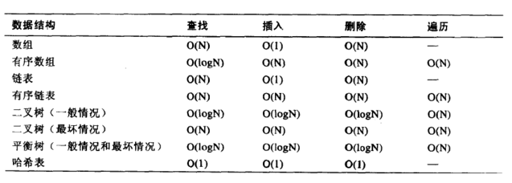

------

## 六、InnoDB数据存储结构

### 1 数据库的存储结构:页

索引结构给我们提供了高效的索引方式，不过索引信息以及数据记录都是保存在文件上的，确切说是存储在页结构中。另一方面，索引是在存储引擎中实现的，MySQL服务器上的**存储引擎**负责对表中数据的读取和写入工作。不同存储引擎中**存放的格式**一般是不同的，甚至有的存储引擎比如Memory都不用磁盘来存储数据。

由于`InnoDB`是`MySQL的默认存储引擎`，所以本章剖析InnoDB存储引擎的数据存储结构。


#### 1.1 磁盘与内存交互基本单位:页

InnoDB将数据划分为若干个页，InnoDB中页的大小默认为**16KB**。

以`页`作为磁盘和内存之间交互的`基本单位`，也就是一次最少从磁盘中读取16KB的内容到内存中，一次最少把内存中的16KB内容刷新到磁盘中。也就是说，**在数据库中，不论读一行，还是读多行，都是将这些行所在的页进行加载。也就是说，数据库管理存储空间的基本单位是页(Page)，数据库I/O操作的最小单位是页。**一个页中可以存储多个行记录。

> 记录是按照行来存储的，但是数据库的读取并不以行为单位，否则一次读取(也就是一次I/O操作)只能处理一行数据，效率会非常低。

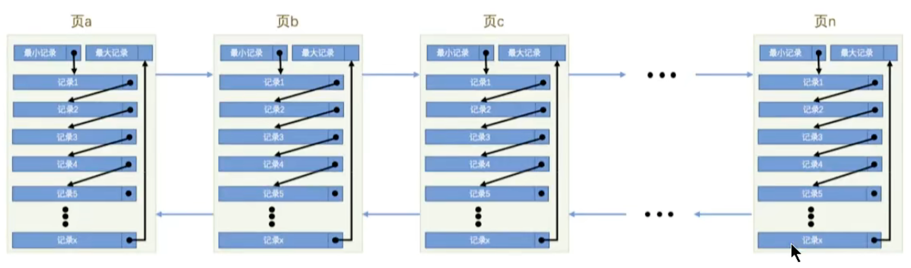

#### 1.2 页结构概述

页a、页b、页c … 页n这些页可以不`在物理结构上相连`，只要通过`双向链表`相关联即可。每个数据页中的记录会按照主键值从小到大的顺序组成一个`单向链表`，每个数据页都会为存储在它里边的记录生成一个`页目录`，在通过主键查找某条记录的时候可以在页目录`中使用二分法`快速定位到对应的槽，然后再遍历该槽对应分组中的记录即可快速找到指定的记录。


#### 1.3 页的大小

不同的数据库管理系统（简称DBMS）的页大小不同。比如在MySQL的InnoDB存储引擎中，默认页的大小是**16KB**，可以通过下面的命令来进行查看:

```mysql
show variables like '%innodb_page_size%';
```


SQL Server中页的大小为 `8KB`，而在oracle中用术语"`块`"(Block)来代表"页”，Oralce支持的块大小为2KB，4KB，8KB，16K8，32KB和64KB。

#### 1.4 页的上层结构

另外在数据库中，还存在区（Extent)、段(Segment)和表空间（Tablespace)的概念。行、页、区、段、表空间的关系如下图所示:


- 区(Extent)是比页大一级的存储结构，在InnoDB存储引擎中，一个区会分配`64个连续的页`。因为InnoDB中的页大小默认是16KB，所以一个区的大小是64*16KB= 1MB。

- 段(Segment)由一个或多个区组成，区在文件系统是一个连续分配的空间（在InnoDB中是连续的64个页)，不过在段中不要求区与区之间是相邻的。`段是数据库中的分配单位，不同类型的数据库对象以不同的段形式存在。` 当创建数据表、索引的时候，就会相应创建对应的段，比如创建一张表时会创建一个表段，创建一个索引时会创建一个索引段。

- 表空间(Tablespace)是一个逻辑容器，表空间存储的对象是段，在一个表空间中可以有一个或多个段，但是一个段只能属于一个表空间。数据库由一个或多个表空间组成，表空间从管理上可以划分为系统表空间，`用户表空间`、`撤销表空间`、`临时表空间`等。


### 2 页的内部结构

页如果按类型划分的话，常见的有`数据页（保存B+树节点）`、`系统页`、`Undo页`和`事务数据页`等。数据页是我们最常使用的页。

数据页的`16KB`大小的存储空间被划分为七个部分，分别是文件头(File Header)、页头(Page Header)、最大最小记录(Infimum+supremum)、用户记录(User Records)、空闲空间(Free Space)、页目录(Page Directory)和文件尾(File Tailer) 。


页结构的示意图如下所示:

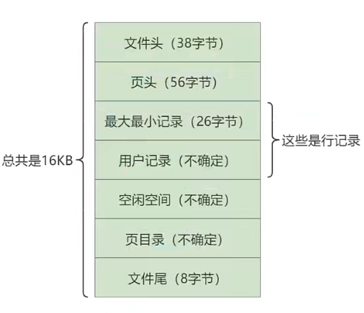


这7个部分作用分别如下，简单梳理如下表所示:

| 名称               | 占用大小 | 说明                                 |
| ------------------ | -------- | ------------------------------------ |
| 1.File Header      | 38字节   | 文件头，描述页的信息                 |
| 3.Page Header      | 56字节   | 页头，页的状态信息                   |
| 2.lnfimum-Supremum | 26字节   | 最大和最小记录，这是两个虚拟的行记录 |
| 2.User Records     | 不确定   | 用户记录，存储行记录内容             |
| 2.Free Space       | 不确定   | 空闲记录，页中还没有被使用的空间     |
| 3.Page Directory   | 不确定   | 页目录，存储用户记录的相对位置       |
| 1.File Trailer     | 8字节    | 文件尾，校验页是否完整               |


我们可以把这7个结构分成3个部分

#### 2.1 第一部分：文件通用部分

**File Header(文件头部）和File Trailer (文件尾部)**

首先是`文件通用部分`，也就是`文件头`和`文件尾`。

##### 2.1.1 文件头部信息


- FIL_PAGE_OFFSET (4字节)

  每一个页都有一个单独的页号，就跟你的身份证号码一样，InnoDB通过页号可以唯一定位一个页。

- FIL_PAGE_TYPE (2字节)

  这个代表当前页的类型。

  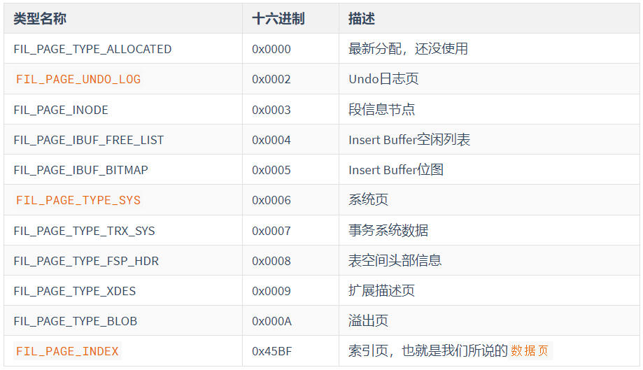

- FIL_PAGE_PREV (4字节) 和 FIL_PAGE_NEXT (4字节)

  InnoDB都是以页为单位存放数据的，如果数据分散到多个不连续的页中存储的话需要把这些页关联起来，FIL_PAGE_PREV和FIL_PAGE_NEXT就分别代表本页的上一个和下一个页的页号。这样通过建立一个双向链表把许许多多的页就都串联起来了，保证这些页之间不需要是物理上的连续，而是逻辑上的连续。

  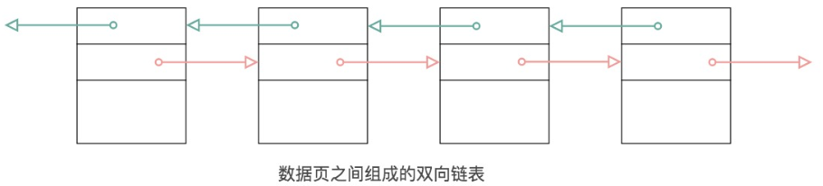

  

- FIL_PAGE_SPACE_OR_CHKSUM (4字节)

  代表当前页面的校验和（checksum）

  **什么是校验和？**

  就是对于一个很长的字节串来说，我们会通过某种算法来计算一个比较短的值来代表这个很长的字节串，这个比较短的值就称为校验和。

  在比较两个很长的字节串之前，先比较这两个长字节串的校验和，如果校验和都不一样，则两个长字节串肯定是不同的，所以省去了直接比较两个比较长的字节串的时间损耗。

  

  文件头部和文件尾部都有属性：FIL_PAGE_SPACE_OR_CHKSUM

  **作用**：

  InnoDB存储引擎以页为单位把数据加载到内存中处理，如果该页中的数据在内存中被修改了，那么在修改后的某个时间需要把数据同步到磁盘中。但是在同步了一半的时候断电了，造成了该页传输的不完整。

  为了检测一个页是否完整（也就是在同步的时候有没有发生只同步一半的尴尬情况），这时可以通过文件尾的校验和（checksum值）与文件头的校验和做比对，如果两个值不相等则证明页的传输有问题，需要重新进行传输，否则认为页的传输已经完成。

  **具体的**：

  每当一个页面在内存中修改了，在同步之前就要把它的校验和算出来，因为File Header在页面的前边，所以校验和会被首先同步到磁盘，当完全写完时，校验和也会被写到页的尾部，如果完全同步成功，则页的首部和尾部的校验和应该是一致的。如果写了一半儿断电了，那么在File Header中的校验和就代表着已经修改过的页，而在File Trailer中的校验和代表着原先的页，二者不同则意味着同步中间出了错。这里，校验方式就是采用`Hash`算法进行校验。

- FIL_PAGE_LSN（8字节）

  页面被最后修改时对应的日志序列位置（英文名是：Log Sequence Number）。


##### 2.1.2 文件尾部信息

- 前4个字节代表页的校验和：

  这个部分是和File Header中的校验和相对应的。

- 后4个字节代表页面被最后修改时对应的日志序列位置（LSN）：

  这个部分也是为了校验页的完整性的，如果首部和尾部的LSN值校验不成功的话，就说明同步过程出现了问题。


#### 2.2 第二部分：记录部分

**Free Space(空闲空间)、User Records(用户记录)、Infimum(最小记录)、Supremum(最大记录)**

第二个部分是记录部分，页的主要作用是存储记录，所以“最大和最小记录”和“用户记录”部分占了页结构的主要空间。

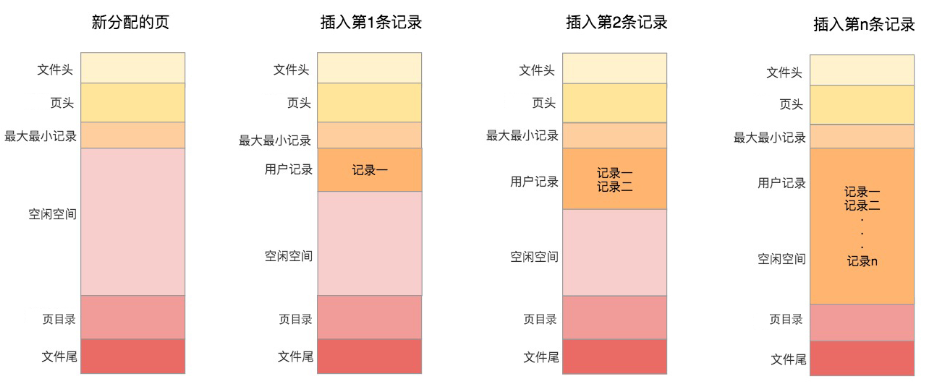

##### 2.2.1 Free Space(空闲空间)

我们自己存储的记录会按照指定的`行格式`存储到`User Records`部分。但是在一开始生成页的时候，其实并没有User Records这个部分，`每当我们插入一条记录，都会从Free Space部分，也就是尚未使用的存储空间中申请一个记录大小的空间划分到User Records部分`，当Free Space部分的空间全部被User Records部分替代掉之后，也就意味着这个页使用完了，如果还有新的记录插入的话，就需要去`申请新的页`了。


##### 2.2.2 User Records(用户记录)

User Records中的这些记录按照指定的`行格式`一条一条摆在User Records部分，相互之间形成单链表。

**用户记录里的一条条数据如何记录？**

这里需要讲讲记录行格式的`记录头信息`


##### 2.2.3 Infimum + Supremum (最小最大记录)

**记录可以比较大小吗？**

是的，记录可以比大小，对于一条完整的记录来说，比较记录的大小就是`比较主键`的大小。比方说我们插入的4行记录的主键值分别是：1、2、3、4，这也就意味着这4条记录是从小到大依次递增。

InnoDB规定的最小记录与最大记录这两条记录的构造十分简单，都是由5字节大小的记录头信息和8字节大小的一个固定的部分组成的，如图所示：

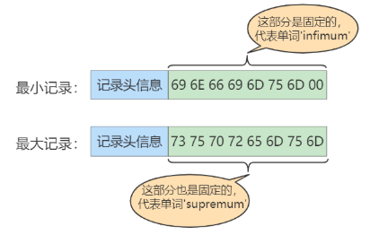

这两条记录`不是我们自己定义的记录`，所以它们并不存放在页的User Records部分，他们被单独放在一个称为`Infimum+Supremum`的部分，如图所示：

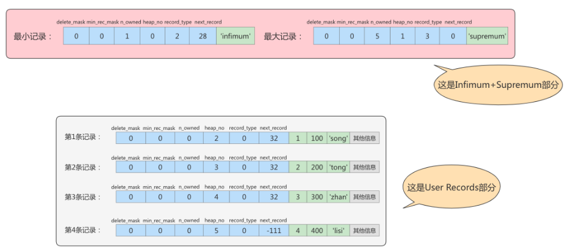


#### 2.3 第三部分

**Page Directory(页目录)、Page Header(页面头部)**


##### 2.3.1 Page Directory(页目录)

**为什么需要页目录？**

在页中，记录是以`单向链表`的形式进行存储的。单向链表的特点就是插入、删除非常方便，但是`检索效率不高`，最差的情况下需要遍历链表上的所有节点才能完成检索。因此在页结构中专门设计了页目录这个模块，`专门给记录做一个目录`，通过`二分查找法`的方式进行检索，提升效率。

**需求**：根据`主键值`查找页中的某条记录，如何实现快速查找呢？

```mysql
SELECT * FROM page_demo WHERE c1 = 3;
```

**方式1：顺序查找**

从Infimum记录（最小记录）开始，沿着链表一直往后找，总有一天会找到（或者找不到），在找的时候还能投机取巧，因为链表中各个记录的值是按照从小到大顺序排列的，所以当链表的某个节点代表的记录的主键值大于你想要查找的主键值时，你就可以停止查找了，因为该节点后边的节点的主键值依次递增。

> 如果一个页中存储了非常多的记录，这么查找性能很差。


**方式2：使用页目录，二分法查找**

1. 将所有的记录`分成几个组`，这些记录包括最小记录和最大记录，但不包括标记为“已删除”的记录。

2. 第1组，也就是最小记录所在的分组只有1个记录；

    最后一组，就是最大记录所在的分组，会有1-8条记录；

    其余的组记录数量在4-8条之间。

    这样做的好处是，除了第 1 组（最小记录所在组）以外，其余组的记录数会`尽量平分`。

3. 在每个组中最后一条记录的头信息中会存储该组一共有多少条记录，作为`n_owned`字段。

4. `页目录用来存储每组最后一条记录的地址偏移量`，这些地址偏移量会按照`先后顺序存储`起来，每组的地址偏移量也被称之为`槽（slot）`，每个槽相当于指针指向了不同组的最后一个记录。

举例1：

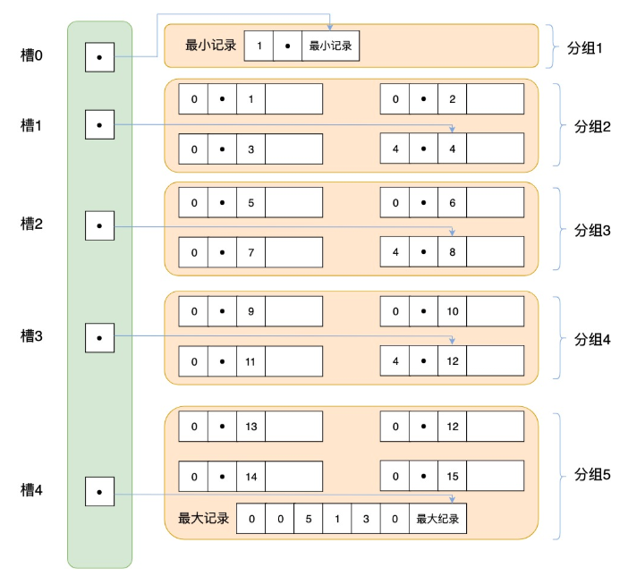

举例2：

现在的page_demo表中正常的记录共有6条，InnoDB会把它们分成两组，第一组中只有一个最小记录，第二组中是剩余的5条记录。如下图：

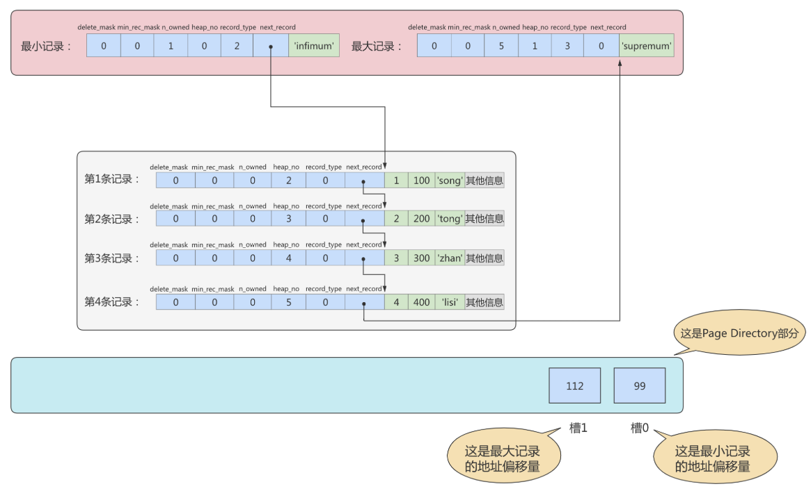

从这个图中我们需要注意这么几点：

- 现在页目录部分中有两个槽，也就意味着我们的记录被分成了两个组，槽1中的值是112，代表最大记录的地址偏移量（就是从页面的0字节开始数，数112个字节）；槽0中的值是99，代表最小记录的地址偏移量。
- 注意最小和最大记录的头信息中的n_owned属性
  - 最小记录的n_owned值为1，这就代表着以最小记录结尾的这个分组中只有1条记录，也就是最小记录本身。
  - 最大记录的n_owned值为5，这就代表着以最大记录结尾的这个分组中只有5条记录，包括最大记录本身还有我们自己插入的4条记录。

用箭头指向的方式替代数字，这样更易于我们理解，修改后如下：


再换个角度看一下：（单纯从逻辑上看一下这些记录和页目录的关系）

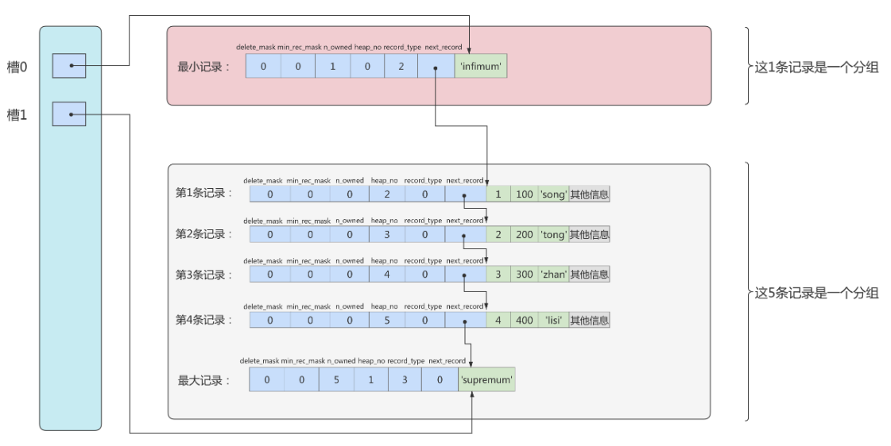

**问题一：页目录分组的个数如何确定？**

为什么最小记录的n_owned值为1，而最大记录的n_owned值为5呢？


InnoDB规定：

- 对于最小记录所在的分组只能有1条记录
- 最大记录所在的分组拥有的记录条数只能在 1~8 条之间
- 剩下的分组中记录的条数范围只能在是 4~8 条之间。


分组是按照下边的步骤进行的：

- 初始情况下一个数据页里只有最小记录和最大记录两条记录，它们分属于两个分组。
- 之后每插入一条记录，都会从页目录中找到主键值比本记录的主键值大并且差值最小的槽，然后把该槽对应的记录的n_owned值加1，表示本组内又添加了一条记录，直到该组中的记录数等于8个。
- 在一个组中的记录数等于8个后再插入一条记录时，会将组中的记录拆分成两个组，一个组中4条记录，另一个5条记录。这个过程会在页目录中新增一个槽来记录这个新增分组中最大的那条记录的偏移量。


**问题二：页目录结构下如何快速查找记录？**

现在向page_demo表中添加更多的数据。如下：

```mysql
INSERT INTO page_demo 
VALUES
(5, 500, 'zhou'), 
(6, 600, 'chen'), 
(7, 700, 'deng'), 
(8, 800, 'yang'), 
(9, 900, 'wang'), 
(10, 1000, 'zhao'), 
(11, 1100, 'qian'), 
(12, 1200, 'feng'), 
(13, 1300, 'tang'), 
(14, 1400, 'ding'), 
(15, 1500, 'jing'), 
(16, 1600, 'quan');
```

添加了12条记录，现在页里一共有18条记录了（包括最小和最大记录），这些记录被分成了5个组，如图所示：

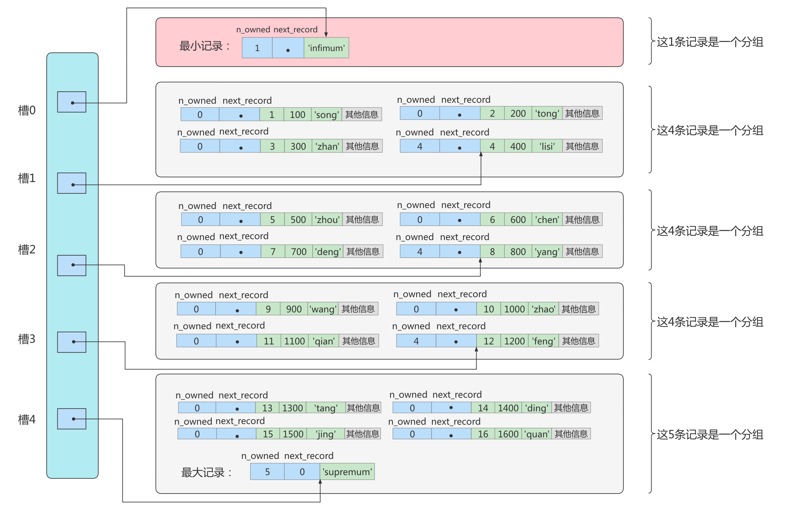

这里只保留了16条记录的记录头信息中的n_owned和next_record属性，省略了各个记录之间的箭头。

现在看怎么从这个页目录中查找记录。因为各个槽代表的记录的主键值都是从小到大排序的，所以我们可以使用二分法来进行快速查找。5个槽的编号分别是：0、1、2、3、4，所以初始情况下最低的槽就是low=0，最高的槽就是high=4。比方说我们想找主键值为6的记录，过程是这样的：

1. 计算中间槽的位置：(0+4)/2=2，所以查看槽2对应记录的主键值为8，又因为8 > 6，所以设置high=2，low保持不变。
2. 重新计算中间槽的位置：(0+2)/2=1，所以查看槽1对应的主键值为4，又因为4 < 6，所以设置low=1，high保持不变。
3. 因为high - low的值为1，所以确定主键值为6的记录在槽2对应的组中。此刻我们需要找到槽2中主键值最小的那条记录，然后沿着单向链表遍历槽2中的记录。

但是我们前边又说过，每个槽对应的记录都是该组中主键值最大的记录，这里槽2对应的记录是主键值为8的记录，怎么定位一个组中最小的记录呢？别忘了各个槽都是挨着的，我们可以很轻易的拿到槽1对应的记录（主键值为4），该条记录的下一条记录就是槽2中主键值最小的记录，该记录的主键值为5。所以我们可以从这条主键值为5的记录出发，遍历槽2中的各条记录，直到找到主键值为6的那条记录即可。

由于一个组中包含的记录条数只能是1~8条，所以遍历一个组中的记录的代价是很小的。


**小结**：

在一个数据页中查找指定主键值的记录的过程分为两步：

1. 通过二分法确定该记录所在的槽，并找到该槽所在分组中主键值最小的那条记录。
2. 通过记录的next_record属性遍历该槽所在的组中的各个记录。


##### 2.3.2 Page Header(页面头部)

为了能得到一个数据页中存储的记录的状态信息，比如本页中已经存储了多少条记录，第一条记录的地址是什么，页目录中存储了多少个槽等等，特意在页中定义了一个叫Page Header的部分，这个部分占用固定的56个字节，专门存储各种状态信息。


- PAGE_DIRECTION

  假如新插入的一条记录的主键值比上一条记录的主键值大，我们说这条记录的插入方向是右边，反之则是左边。用来表示最后一条记录插入方向的状态就是PAGE_DIRECTION。

- PAGE_N_DIRECTION

  假设连续几次插入新记录的方向都是一致的，InnoDB会把沿着同一个方向插入记录的条数记下来，这个条数就用PAGE_N_DIRECTION这个状态表示。当然，如果最后一条记录的插入方向改变了的话，这个状态的值会被清零重新统计。


#### 2.4 从数据页角度看B + 树如何查询

一棵B+树按照节点类型可以分成两部分:

1. 叶子节点，B+树最底层的节点，节点的高度为0，存储行记录。
2. 非叶子节点，节点的高度大于0，存储索引键和页面指针，并不存储行记录本身。

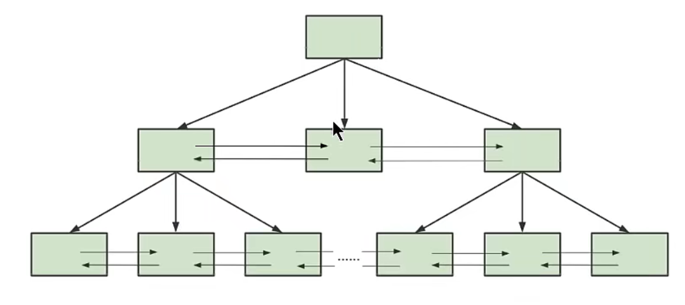

当我们从页结构来理解B+树的结构的时候，可以帮我们理解一些通过索引进行检索的原理:

**1.B+树是如何进行记录检索的?**

如果通过B+树的索引查询行记录，首先是从B+树的根开始，逐层检索，直到找到叶子节点，也就是找到对应的数据页为止，将数据页加载到内存中，页目录中的槽(slot)采用`二分查找`的方式先找到一个粗略的记录分组然后再在分组中通过`链表遍历`的方式查找记录。


**2.普通索引和唯一索引在查询效率上有什么不同?**

我们创建索引的时候可以是普通索引，也可以是唯一索引，那么这两个索引在查询效率上有什么不同呢?

唯一索引就是在普通索引上增加了约束性，也就是关键字唯一，找到了关键字就停止检索。而普通索引，可能会存在用户记录中的关键字相同的情况，根据页结构的原理，当我们读取一条记录的时候，不是单独将这条记录从磁盘中读出去，而是将这个记录所在的页加载到内存中进行读取。InnoDB存储引擎的页大小为16KB，在一个页中可能存储着上千个记录，因此在普通索引的字段上进行查找也就是在内存中多几次“`判断下一条记录`”的操作，对于CPU来说，这些操作所消耗的时间是可以忽略不计的。所以对一个索引字段进行检索，采用普通索引还是唯一索引在检索效率上基本上没有差别。


### 3 InnoDB行格式(或记录格式)

我们平时的数据以行为单位来向表中插入数据，这些记录在磁盘上的存放方式也被称为`行格式`或者`记录格式`。

InnoDB存储引擎设计了4种不同类型的`行格式`，分别是`Compact（紧密）`、`Redundant（冗余）`、`Dynamic（动态）`和`Compressed（压缩）`行格式。

查看MySQL8 与 MySQL5.7的默认行格式:

```mysql
mysql> select @@innodb_default_row_format;
+-----------------------------------------+
| @@innodb_default_row_format             |
+-----------------------------------------+
| dynamic                                 |
+-----------------------------------------+
1 row in set (0.00 sec)

# 查询单张表行格式
mysql> show table status like 'departments' \G
*************************** 1. row ***************************
           Name: departments
         Engine: InnoDB
        Version: 10
 #行格式  Row_format: Dynamic
           Rows: 27
 Avg_row_length: 606
    Data_length: 16384
Max_data_length: 0
   Index_length: 49152
      Data_free: 0
 Auto_increment: NULL
    Create_time: 2022-03-23 14:56:38
    Update_time: 2022-03-23 14:56:38
     Check_time: NULL
      Collation: utf8_general_ci
       Checksum: NULL
 Create_options:
        Comment:
1 row in set (0.01 sec)
```


#### 3.1 指定行格式的语法

在创建或修改表的语句中指定行格式：

```mysql
CREATE TABLE 表名 (列的信息) ROW_FORMAT=行格式名称

ALTER TABLE 表名 ROW_FORMAT=行格式名称
```

举例：

```mysql
mysql> CREATE TABLE record_test_table (
    ->     col1 VARCHAR(8),
    ->     col2 VARCHAR(8) NOT NULL,
    ->     col3 CHAR(8),
    ->     col4 VARCHAR(8)
    -> ) CHARSET=ascii ROW_FORMAT=COMPACT;
Query OK, 0 rows affected (0.03 sec)
```

向表中插入两条记录：

```mysql
INSERT INTO record_test_table(col1, col2, col3, col4) 
VALUES
('zhangsan', 'lisi', 'wangwu', 'songhk'), 
('tong', 'chen', NULL, NULL);
```


#### 3.2 COMPACT行格式

在MySQL5.1版本中，默认设置为Compact行格式。一条完整的记录其实可以被分为`记录的额外信息`和`记录的真实数据`两大部分。

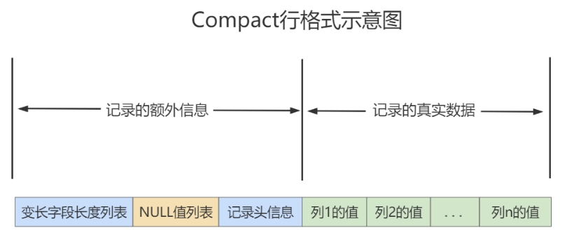

##### 3.2.1 变长字段长度列表

MySQL支持一些变长的数据类型，比如VARCHAR(M)、VARBINARY(M)、TEXT类型，BLOB类型，这些数据类型修饰列称为`变长字段`，变长字段中存储多少字节的数据不是固定的，所以我们在存储真实数据的时候需要顺便把这些数据占用的字节数也存起来。`在Compact行格式中，把所有变长字段的真实数据占用的字节长度都存放在记录的开头部位，从而形成一个变长字段长度列表`。

> 注意：这里面存储的变长长度和字段`顺序是反过来的`。比如两个varchar字段在表结构的顺序是a(10)，b(15)。那么在变长字段长度列表中存储的长度顺序就是15，10，是反过来的。

以record_test_table表中的第一条记录举例：因为record_test_table表的col1、col2、col4列都是VARCHAR(8)类型的，所以这三个列的值的长度都需要保存在记录开头处，注意record_test_table表中的各个列都使用的是ascii字符集（每个字符只需要1个字节来进行编码）


又因为这些长度值需要按照列的逆序存放，所以最后变长字段长度列表的字节串用十六进制表示的效果就是（各个字节之间实际上没有空格，用空格隔开只是方便理解）：06 04 08 

把这个字节串组成的变长字段长度列表填入上边的示意图中的效果就是：


##### 3.2.2 NULL值列表

Compact行格式会把可以为NULL的列统一管理起来，存在一个标记为NULL值列表中。如果表中没有允许存储NULL的列，则NULL值列表也不存在了。

**为什么定义NULL值列表？**

之所以要存储NULL是因为数据都是需要对齐的，如果`没有标注出来NULL值`的位置，就有可能在查询数据的时候`出现混乱`。如果`使用一个特定的符号`放到相应的数据位表示空置的话，虽然能达到效果，但是这样很`浪费空间`，所以直接就在行数据得头部开辟出一块空间专门用来记录该行数据哪些是非空数据，哪些是空数据，格式如下：

1. 二进制位的值为1时，代表该列的值为NULL。
2. 二进制位的值为0时，代表该列的值不为NULL。

例如：字段 a、b、c，其中a是主键，在某一行中存储的数依次是`a=1、b=null、c=2`。那么Compact行格式中的NULL值列表中存储：01。第一个0表示c不为null，第二个1表示b是null。这里之所以没有a是因为数据库会自动跳过主键，因为主键肯定是非NULL且唯一的，在NULL值列表的数据中就会自动跳过主键。


record_test_table的两条记录的NULL值列表就如下：

第一条记录：('zhangsan', 'lisi', 'wangwu', 'songhk')


第二条记录：('tong', 'chen', NULL, NULL)


##### 3.2.3 记录头信息

```mysql
mysql> CREATE TABLE page_demo(
    ->     c1 INT,
    ->     c2 INT,
    ->     c3 VARCHAR(10000),
    ->     PRIMARY KEY (c1)
    -> ) CHARSET=ascii ROW_FORMAT=Compact;
Query OK, 0 rows affected (0.03 sec)
```

这个表中记录的行格式示意图：


这些记录头信息中各个属性如下：


简化后的行格式示意图：


插入数据：

```mysql
INSERT INTO page_demo 
VALUES
(1, 100, 'song'), 
(2, 200, 'tong'), 
(3, 300, 'zhan'), 
(4, 400, 'lisi');
```

图示如下：


- **delete_mask**

  这个属性标记着当前记录是否被删除，占用1个二进制位。

  - 值为0：代表记录并没有被删除
  - 值为1：代表记录被删除掉了

  **被删除的记录为什么还在页中存储呢？**

  你以为它删除了，可它还在真实的磁盘上。这些被删除的记录之所以不立即从磁盘上移除，是因为移除它们之后其他的记录在磁盘上需要`重新排列，导致性能消耗`。所以只是打一个删除标记而已，所有被删除掉的记录都会组成一个所谓的`垃圾链表`，在这个链表中的记录占用的空间称之为`可重用空间`，之后如果有新记录插入到表中的话，可能把这些被删除的记录占用的存储空间覆盖掉。

- **min_rec_mask**

  B+树的每层非叶子节点中的最小记录都会添加该标记，min_rec_mask值为1。

  我们自己插入的四条记录的min_rec_mask值都是0，意味着它们都不是B+树的非叶子节点中的最小记录。

- **record_type**

  这个属性表示当前记录的类型，一共有4种类型的记录：

  - 0：表示普通记录
  - 1：表示B+树非叶节点记录
  - 2：表示最小记录
  - 3：表示最大记录

  从图中我们也可以看出来，我们自己插入的记录就是普通记录，它们的record_type值都是0，而最小记录和最大记录的record_type值分别为2和3。至于record_type为1的情况，我们在索引的数据结构章节讲过。

- **heap_no**

  这个属性表示当前记录在本页中的位置。

  从图中可以看出来，我们插入的4条记录在本页中的位置分别是：2、3、4、5。

  **怎么不见heap_no值为0和1的记录呢？**

  MySQL会自动给每个页里加了两个记录，由于这两个记录并不是我们自己插入的，所以有时候也称为`伪记录`或者`虚拟记录`。这两个伪记录一个代表`最小记录`，一个代表`最大记录`。最小记录和最大记录的heap_no值分别是0和1，也就是说它们的位置最靠前。

- **n_owned**

  页目录中每个组中最后一条记录的头信息中会存储该组一共有多少条记录，作为 n_owned 字段。

  详情见page directory。

- **next_record**

  记录头信息里该属性非常重要，它表示从当前记录的真实数据到下一条记录的真实数据的`地址偏移量`。

  比如：第一条记录的next_record值为32，意味着从第一条记录的真实数据的地址处向后找32个字节便是下一条记录的真实数据。

  注意，下一条记录指得并不是按照我们插入顺序的下一条记录，而是按照主键值由小到大的顺序的下一条记录。而且规定Infimum记录（也就是最小记录）的下一条记录就是本页中主键值最小的用户记录，而本页中主键值最大的用户记录的下一条记录就是 Supremum记录（也就是最大记录）。

  下图用箭头代替偏移量表示next_record。

  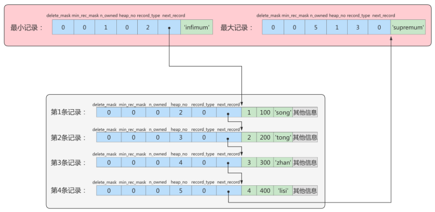

  **演示：删除操作**

  删除操作：从表中删除掉一条记录，这个链表也是会跟着变化：

  ```mysql
  mysql> DELETE FROM page_demo WHERE c1 = 2;
  Query OK, 1 row affected (0.02 sec)
  ```

  删掉第2条记录后的示意图就是：

  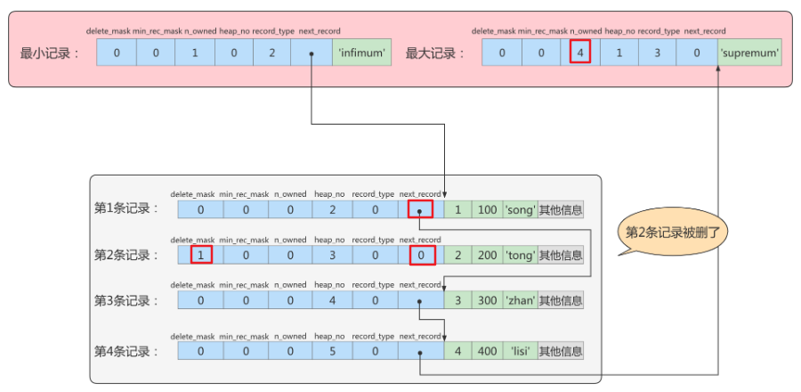

  从图中可以看出来，删除第2条记录前后主要发生了这些变化：
  - 第2条记录并没有从存储空间中移除，而是把该条记录的delete_mask值设置为1。
  - 第2条记录的next_record值变为了0，意味着该记录没有下一条记录了。
  - 第1条记录的next_record指向了第3条记录。
  - 最大记录的n_owned值从 5 变成了 4。

  所以，不论我们怎么对页中的记录做增删改操作，InnoDB始终会维护一条记录的单链表，链表中的各个节点是按照主键值由小到大的顺序连接起来的。

   

  **演示：添加操作**

  添加操作：主键值为2的记录被我们删掉了，但是存储空间却没有回收，如果我们再次把这条记录插入到表中，会发生什么事呢？

  ```mysql
  mysql> INSERT INTO page_demo VALUES(2, 200, 'tong');
  Query OK, 1 row affected (0.00 sec)
  ```

  我们看一下记录的存储情况：

  

  直接复用了原来被删除记录的存储空间。

  说明：当数据页中存在多条被删除掉的记录时，这些记录的next_record属性将会把这些被删除掉的记录组成一个垃圾链表，以备之后重用这部分存储空间。

##### 3.2.4 记录的真实数据

记录的真实数据除了我们自己定义的列的数据以外，还会有三个隐藏列：


实际上这几个列的真正名称其实是：DB_ROW_ID、DB_TRX_ID、DB_ROLL_PTR。

- 一个表没有手动定义主键，则会选取一个Unique键作为主键，如果连Unique键都没有定义的话，则会为表默认添加一个名为row_id的隐藏列作为主键。所以row_id是在没有自定义主键以及Unique键的情况下才会存在的。
- 事务ID和回滚指针在后面的《第14章_MySQL事务日志》章节中讲解。

举例：分析Compact行记录的内部结构：

```mysql
CREATE TABLE mytest(
col1 VARCHAR(10),
col2 VARCHAR(10),
col3 CHAR(10),
col4 VARCHAR(10)
)ENGINE=INNODB CHARSET=LATIN1 ROW_FORMAT=COMPACT;

INSERT INTO mytest
VALUES('a','bb','bb','ccc');
 
INSERT INTO mytest
VALUES('d','ee','ee','fff');
 
INSERT INTO mytest
VALUES('d',NULL,NULL,'fff');
```

在Windows操作系统下，可以选择通过程序UltraEdit打开表空间文件mytest.ibd这个二进制文件。内容如下：

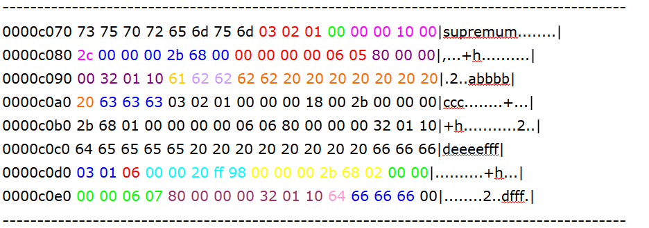

该行记录从0000c078开始，若整理一下，相信大家会有更好的理解：

```
03 02 01                     				/*变长字段长度列表，逆序*/
00                             				     /*NULL标志位，第一行没有NULL值*/
00 00 10 00 2c             			          /*Record Header，固定5字节长度*/
00 00 00 2b 68 00       				/*RowID InnoDB自动创建，6字节*/
00 00 00 00 06 05       				 /*TransactionID*/
80 00 00 00 32 01 10  					 /*Roll Pointer*/
61                             					 /*列1数据'a'*/
62 62                         					 /*列2数据'bb'*/
62 62 20 20 20 20 20 20 20 20			/*列3数据'bb'*/
63 63 63                     					/*列4数据'ccc'*/
```

注意1：InnoDB每行有隐藏列TransactionID和Roll Pointer。

注意2：固定长度CHAR字段在未能完全占用其长度空间时，会用0x20来进行填充。


接着再来分析下Record Header的最后两个字节，这两个字节代表next_recorder，0x2c代表下一个记录的偏移量，即当前记录的位置加上偏移量0x2c就是下条记录的起始位置。


第二行将不做整理，除了RowID不同外，它和第一行大同小异，现在来分析有NULL值的第三行：

```
03 01                       /*变长字段长度列表，逆序*/
06                          /*NULL标志位，第三行有NULL值  0110*/
00 00 20 ff 98              /*Record Header*/
00 00 00 2b 68 02           /*RowID*/
00 00 00 00 06 07           /*TransactionID*/
80 00 00 00 32 01 10        /*Roll Pointer*/
64                          /*列1数据'd'*/
66 66 66                    /*列4数据'fff'*/
```

第三行有NULL值，因此NULL标志位不再是00而是06，转换成二进制为00000110，为1的值代表第2列和第3列的数据为NULL。在其后存储列数据的部分，用户会发现没有存储NULL列，而只存储了第1列和第4列非NULL的值。

因此这个例子很好地说明了：不管是CHAR类型还是VARCHAR类型，在compact格式下NULL值都不占用任何存储空间。


#### 3.3 Dynamic和Compressed行格式

##### 3.3.1 行溢出

**InnoDB存储引擎可以将一条记录中的某些数据存储在真正的数据页面之外。**

很多DBA喜欢MySQL数据库提供的VARCHAR(M)类型，认为可以存放65535字节。这是真的吗？如果我们使用ascii字符集的话，一个字符就代表一个字节，我们看看VARCHAR(65535)是否可用。

```mysql
CREATE  TABLE  varchar_size_demo(
 c  VARCHAR(65535)
 )  CHARSET=ascii  ROW_FORMAT=Compact;
# 结果如下：
ERROR 1118 (42000): Row size too large. The maximum row size for the used table type, not counting BLOBs, is 65535. This includes storage overhead, check the manual. You have  to  change  some  columns  to  TEXT or  BLOBs
```

报错信息表达的意思是：MySQL对一条记录占用的最大存储空间是有限制的，除BLOB或者TEXT类型的列之外，其他所有的列（不包括隐藏列和记录头信息）占用的字节长度加起来不能超过65535个字节。

这个65535个字节除了列本身的数据之外，还包括一些其他的数据，以Compact行格式为例，比如说我们为了存储一个VARCHAR(M)类型的列，除了真实数据占有空间以外，还需要记录的额外信息。

如果该VARCHAR类型的列没有NOT NULL属性，那最多只能存储65532个字节的数据，因为变长字段的长度占用2个字节，NULL值标识需要占用1个字节。

```mysql
CREATE  TABLE  varchar_size_demo(
    c  VARCHAR(65532)
)  CHARSET=ascii  ROW_FORMAT=Compact;

#如果有not null属性，那么就不需要NULL值标识，也就可以多存储一个字节，即65533个字节
CREATE  TABLE  varchar_size_demo( 
  c  VARCHAR(65533)  not  null
)  CHARSET=ascii  ROW_FORMAT=Compact; 
```

通过上面的案例，我们可以知道一个页的大小一般是16KB，也就是16384字节，而一个VARCHAR(M)类型的列就最多可以存储65533个字节，这样就可能出现一个页存放不了一条记录，这种现象称为`行溢出`。 

在Compact和Reduntant行格式中，对于占用存储空间非常大的列，在记录的真实数据处只会存储该列的一部分数据，把剩余的数据分散存储在几个其他的页中进行分页存储，然后记录的真实数据处用20个字节存储指向这些页的地址（当然这20个字节中还包括这些分散在其他页面中的数据的占用的字节数），从而可以找到剩余数据所在的页。

这称为页的扩展，举例如下：

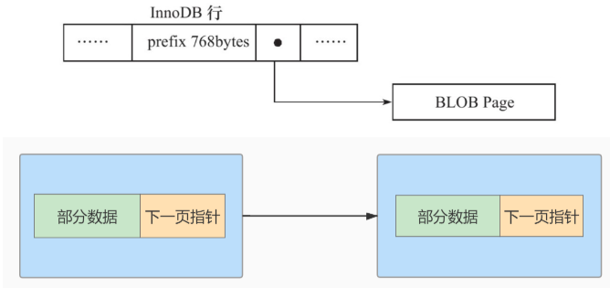

##### 3.3.2 Dynamic和Compressed行格式

在MySQL8.0中，默认行格式就是Dynamic，Dynamic、Compressed行格式和Compact行格式挺像，只不过在处理行溢出数据时有分歧：

- Compressed和Dynamic两种记录格式对于存放在BLOB中的数据采用了完全的行溢出的方式。如图，在数据页中只存放20个字节的指针（溢出页的地址），实际的数据都存放在Off Page（溢出页）中。
- Compact和Redundant两种格式会在记录的真实数据处存储一部分数据（存放768个前缀字节）。

Compressed行记录格式的另一个功能就是，存储在其中的行数据会以zlib的算法进行压缩，因此对于BLOB、TEXT、VARCHAR这类大长度类型的数据能够进行非常有效的存储。


#### 3.4 Redundant行格式

Redundant是MySQL5.0版本之前InnoDB的行记录存储方式，MySQL5.0支持Redundant是为了兼容之前版本的页格式。

现在我们把表record_test_table的行格式修改为Redundant：

```mysql
ALTER TABLE record_test_table ROW_FORMAT=Redundant;
Query OK, 0 rows affected (0.05 sec)
Records: 0  Duplicates: 0  Warnings: 0
```


从上图可以看到，不同于Compact行记录格式，Redundant行格式的首部是一个字段长度偏移列表，同样是按照列的顺序`逆序放置`的。

下边我们从各个方面看一下Redundant行格式有什么不同的地方。

##### 3.4.1 字段长度偏移列表

注意Compact行格式的开头是`变长字段长度列表`，而Redundant行格式的开头是`字段长度偏移列表`，与变长字段长度列表有两处不同：

- 少了“变长”两个字：Redundant行格式会把该条记录中所有列（包括隐藏列）的长度信息都按照逆序存储到字段长度偏移列表。
- 多了“偏移”两个字：这意味着计算列值长度的方式不像Compact行格式那么直观，它是采用两个相邻数值的差值来计算各个列值的长度。

举例：比如第一条记录的字段长度偏移列表就是：2B 25 1F 1B 13 0C 06

因为它是逆序排放的，所以按照列的顺序排列就是：

06 0C 13 17 1A 24 25

按照两个相邻数值的差值来计算各个列值的长度的意思就是：


第一列(row_id)的长度就是 0x06个字节，也就是6个字节。

第二列(transaction_id)的长度就是 (0x0C - 0x06)个字节，也就是6个字节。

第三列(roll_pointer)的长度就是 (0x13 - 0x0C)个字节，也就是7个字节。

第四列(col1)的长度就是 (0x1B - 0x13)个字节，也就是8个字节。

第五列(col2)的长度就是 (0x1F - 0x1B)个字节，也就是4个字节。

第六列(col3)的长度就是 (0x25 - 0x1F)个字节，也就是6个字节。

第七列(col4)的长度就是 (0x2B - 0x25)个字节，也就是6个字节。


##### 3.4.2 记录头信息(record header)

不同于Compact行格式，Redundant行格式中的记录头信息固定占用6个字节（48位），每位的含义见下表。

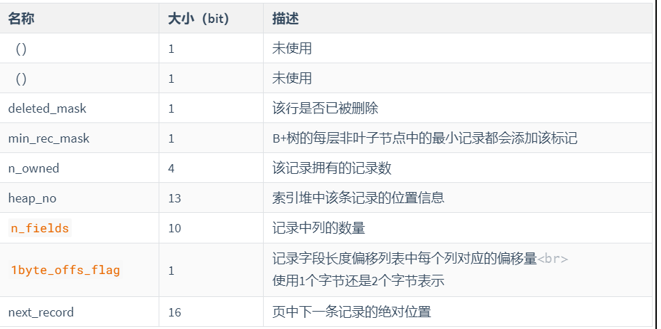

- 与Compact行格式的记录头信息对比来看，有两处不同：

  - Redundant行格式多了n_field和1byte_offs_flag这两个属性。
  - Redundant行格式没有record_type这个属性。

  其中，n_fields：代表一行中列的数量，占用10位，这也很好地解释了为什么MySQL一个行支持最多的列为1023。

  另一个值为1byte_offs_flags，该值定义了偏移列表占用1个字节还是2个字节。当它的值为1时，表明使用1个字节存储。当它的值为0时，表明使用2个字节存储。

- 1byte_offs_flag的值是怎么选择的

  我们前边说过每个列对应的偏移量可以占用1个字节或者2个字节来存储，那到底什么时候用1个字节，什么时候用2个字节呢？其实是根据该条Redundant行格式记录的真实数据占用的总大小来判断的：

  - 当记录的真实数据占用的字节数值不大于127（十六进制0x7F，二进制01111111）时，每个列对应的偏移量占用1个字节。
  - 当记录的真实数据占用的字节数大于127，但不大于32767（十六进制0x7FFF，二进制0111111111111111）时，每个列对应的偏移量占用2个字节。

- 有没有记录的真实数据大于32767的情况呢？有，不过此时的记录已经存放到了溢出页中，在本页中只保留前768个字节和20个字节的溢出页面地址。因为字段长度偏移列表处只需要记录每个列在本页面中的偏移就好了，所以每个列使用2个字节来存储偏移量就够了。

  大家可以看出来，Redundant行格式还是比较简单粗暴的，直接使用整个记录的真实数据长度来决定使用1个字节还是2个字节存储列对应的偏移量。只要整条记录的真实数据占用的存储空间大小大于127，即使第一个列的值占用存储空间小于127，那对不起，也需要使用2个字节来表示该列对应的偏移量。简单粗暴，就是这么简单粗暴（所以这种行格式有些过时了）。

  为了在解析记录时知道每个列的偏移量是使用1个字节还是2个字节表示的，Redundant行格式特意在`记录头信息`里放置了一个称之为1byte_offs_flag的属性：

- Redundant行格式中NULL值的处理

  因为Redundant行格式并没有NULL值列表，所以Redundant行格式在字段长度偏移列表中的各个列对应的偏移量处做了一些特殊处理 —— 将列对应的偏移量值的第一个比特位作为是否为NULL的依据，该比特位也可以被称之为NULL比特位。也就是说在解析一条记录的某个列时，首先**看一下该列对应的偏移量的NULL比特位是不是为1**。如果为1，那么该列的值就是NULL，否则不是NULL。

  这也就解释了上边介绍为什么只要记录的真实数据大于127（十六进制0x7F，二进制01111111）时，就采用2个字节来表示一个列对应的偏移量，主要是第一个比特位是所谓的NULL比特位，用来标记该列的值是否为NULL。

  但是还有一点要注意，对于值为NULL的列来说，该列的类型是否为定长类型决定了NULL值的实际存储方式，我们接下来分析一下record_test_table表的第二条记录，它对应的字段长度偏移列表如下：

  A4 A4 1A 17 13 0C 06

  按照列的顺序排放就是：

  06 0C 13 17 1A A4 A4

  我们分情况看一下：

  - 如果存储NULL值的字段是定长类型的，比方说`CHAR(M)`数据类型的，则NULL值也将占用记录的真实数据部分，并把该字段对应的数据使用0x00字节填充。

  如图第二条记录的c3列的值是NULL，而c3列的类型是`CHAR(10)`，占用记录的真实数据部分10字节，所以我们看到在Redundant行格式中使用0x00000000000000000000来表示NULL值。

  另外，c3列对应的偏移量为0xA4，它对应的二进制实际是：10100100，可以看到最高位为1，意味着该列的值是NULL。将最高位去掉后的值变成了0100100，对应的十进制值为36，而c2列对应的偏移量为0x1A，也就是十进制的26。36 - 26 = 10，也就是说最终c3列占用的存储空间为10个字节。

  - 如果该存储NULL值的字段是变长数据类型的，则不在记录的真实数据处占用任何存储空间。

  比如record_test_table表的c4列是VARCHAR(10)类型的，VARCHAR(10)是一个变长数据类型，c4列对应的偏移量为0xA4，与c3列对应的偏移量相同，这也就意味着它的值也为NULL，将0xA4的最高位去掉后对应的十进制值也是36，36 - 36 = 0，也就意味着c4列本身不占用任何记录的实际数据处的空间。

除了以上的几点之外，Redundant行格式和Compact行格式还是大致相同的。


### 4 区、段与碎片区

#### 4.1 为什么要有区?

`B+`树的每一层中的页都会形成一个双向链表，如果是以`页为单位`来分配存储空间的话，双向链表相邻的两个页之间的`物理位置可能离得非常远`。我们介绍B+树索引的适用场景的时候特别提到范围查询只需要定位到最左边的记录和最右边的记录,然后沿着双向链表一直扫描就可以了，而如果链表中相邻的两个页物理位置离得非常远，就是所谓的`随机IO`。再一次强调，磁盘的速度和内存的速度差了好几个数量级，`随机IO是非常慢的`，所以我们应该尽量让链表中相邻的页的物理位置也相邻，这样进行范围查询的时候才可以使用所谓的`顺序IO`。

> 这样利用了磁盘的预读特性

引入`区`的概念，一个区就是在物理位置上**连续**的`64个页`。因为InnoDB 中的页大小默认是16KB，所以一个区的大小是64*16KB=`1MB`。在表中`数据量大`的时候，为某个索引分配空间的时候就不再按照页为单位分配了，而是按照`区为单位`分配，甚至在表中的数据特别多的时候，可以一次性分配多个连续的区。虽然可能造成`一点点空间的浪费`（数据不足以填充满整个区)，但是从性能角度看，可以消除很多的随机I/O，`功大于过`!

> 这里是连续的64个页， 但是具体的两个页之间还是用指针相连的。保证一大块区域连续。

 

#### 4.2 为什么要有段?

对于范围查询，其实是对B+树叶子节点中的记录进行顺序扫描，而如果不区分叶子节点和非叶子节点，统统把节点代表的页面放到申请到的区中的话，进行范围扫描的效果就大打折扣了。所以InnoDB对B+树的`叶子节点`和`非叶子节点`进行了区别对待，也就是说叶子节点有自己独有的区，非叶子节点也有自己独有的区。存放叶子节点的区的集合就算是一个`段(segment)`，存放非叶子节点的区的集合也算是一个段。也就是说一个索引会生成2个段，一个`叶子节点段`，一个`非叶子节点段`。

除了索引的叶子节点段和非叶子节点段之外，InnoDB中还有为存储一些特殊的数据而定义的段，比如回滚段。所以，常见的段有`数据段`、`索引段`、`回滚段`。数据段即为B+树的叶子节点，索引段即为B+树的非叶子节点。

在InnoDB存储引擎中，对段的管理都是由引擎自身所完成，DBA不能也没有必要对其进行控制。这从一定程度上简化了DBA对于段的管理。

段其实不对应表空间中某一个连续的物理区域，而是一个逻辑上的概念，由若干个零散的页面以及一些完整的区组成。

> 零散的页面，看碎片区


#### 4.3 为什么要有碎片区?

默认情况下，一个使用InnoDB存储引擎的表只有一个聚簇索引，一个索引会生成2个段，而段是以区为单位申请存储空间的，一个区默认占用1M (64*16Kb=1024Kb）存储空间，所以**默认情况下一个只存了几条记录的小表也需要2M的存储空间么?**以后每次添加一个索引都要多申请2M的存储空间么?这对于存储记录比较少的表简直是天大的浪费。这个问题的症结在于到现在为止我们介绍的区都是非常**纯粹的**，也就是一个区被整个分配给某一个段，或者说区中的所有页面都是为了存储同一个段的数据而存在的，即使段的数据填不满区中所有的页面，那余下的页面也不能挪作他用。

为了考虑以完整的区为单位分配给某个段对于`数据量较小`的表太浪费存储空间的这种情况，InnoDB提出了一个`碎片(fragment)区`的概念。在一个碎片区中，并不是所有的页都是为了存储同一个段的数据而存在的，而是碎片区中的页可以用于不同的目的，比如有些页用于段A，有些页用于段B，有些页甚至哪个段都不属于。`碎片区直属于表空间`，并不属于任何一个段。

所以此后为某个段分配存储空间的策略是这样的：

- 在刚开始向表中插入数据的时候，段是从某个碎片区以单个页面为单位来分配存储空间的；
- 当某个段已经占用了`32个碎片区`页面之后，就会申请以完整的区为单位来分配存储空间。

所以现在段不能仅定义为是某些区的集合，更精确的应该是**某些零散的页面**以及**一些完整的区**的集合。


#### 4.4 区的分类

区大体上可以分为4种类型:

- `空闲的区(FREE)`：现在还没有用到这个区中的任何页面。
- `有剩余空间的碎片区(FREE_FRAG)`：表示碎片区中还有可用的页面。
- `没有剩余空间的碎片区(FULL_FRAG)`：表示碎片区中的所有页面都被使用，没有空闲页面。
- `附属于某个段的区(FSEG)`：每一个索引都可以分为叶子节点段和非叶子节点段。

处于`FREE`、`FREE_FRAG`以及`FULL_FRAG`这三种状态的区都是独立的，直属于表空间。而处于FSEG状态的区是附属于某个段的。

> 如果把表空间比作是一个集团军，段就相当于师，区就相当于团。一般的团都是隶属于某个师的，就像是处于`FSEG`的区全都隶属于某个段，而处于`FREE`、`FREE_FRAG`以及`FULL_FRAG`这三种状态的区却直接隶属于表空间，就像独立团直接听命于军部一样。


#### 4.5 扩展

那么，计算机怎样才能判断一个数据接下来可能被用到？

> 时间局部性（Temporal Locality）

时间局部性：如果一个信息项正在被访问，那么在近期它很可能还会被再次访问。

// 这是可以理解的，用过的数据当然可能再次被用到。

> 空间局部性（Spatial Locality）

空间局部性：在最近的将来将用到的信息很可能与现在正在使用的信息在空间地址上是临近的。

// 正在使用的某个数据地址旁边的数据，当然也是很可能被用到的，比如某个数组、集合等等。

> 顺序局部性（Order Locality）

顺序局部性：在典型程序中，除转移类指令外，大部分指令是顺序进行的。顺序执行和非顺序执行的比例大致是5:1。此外，对大型数组访问也是顺序的。

指令的顺序执行、数组的连续存放等是产生顺序局部性的原因。

// 正在执行的某个指令以及还在排队等候处理的指令，大部分是按照顺序来执行的。

> 磁盘预读原理

内存比磁盘的读写速度要快很多，但内存容量要远小于磁盘，而数据、程序的执行要调入内存后才能执行，所以内存和磁盘要经常进行I/O操作，I/O操作是个费事的过程，虽然现代系统已经有了通道（I/O处理机）技术的支持，但这远远不够（CPU的处理速度远远大于磁盘I/O的速度）。

**所以磁盘读取的时候会顺带加载附近的数据到缓存**

>  磁盘读取（详细）

磁盘存取，磁盘I/O涉及机械操作。磁盘是由大小相同且同轴的圆形盘片组成，磁盘可以转动(各个磁盘须同时转动)。磁盘的一侧有磁头支架，磁头支架固定了一组磁头，每个磁头负责存取一个磁盘的内容。磁头不动，磁盘转动，但磁臂可以前后动，用于读取不同磁道上的数据。磁道就是以盘片为中心划分出来的一系列同心环。磁道又划分为一个个小段，叫扇区，是磁盘的最小存储单元。 

磁盘读取时，系统将数据逻辑地址传给磁盘，磁盘的控制电路会解析出物理地址（哪个磁道，哪个扇区），于是磁头需要前后移动到相应的磁道——寻道，消耗的时间叫——寻道时间，磁盘旋转将对应的扇区转到磁头下（磁头找到对应磁道的对应扇区），消耗的时间叫——旋转时间，这一系列操作是非常耗时。


##### 4.5.1 重点

为了尽量减少I/O操作，计算机系统一般采取预读的方式，预读的长度一般为页（page）的整倍数。页是计算机管理存储器的逻辑块，硬件及操作系统往往将主存和磁盘存储区分割为连续的大小相等的块，每个存储块称为一页（在许多操作系统中，页得大小通常为4k），主存和磁盘以页为单位交换数据。当程序要读取的数据不在主存中时，会触发一个缺页异常，此时系统会向磁盘发出读盘信号，磁盘会找到数据的起始位置并向后`连续读取一页或几页载入内存中`，然后异常返回，程序继续运行。

计算机系统是分页读取和存储的，一般一页为4KB（8个扇区，每个扇区125B，8*125B=4KB），每次读取和存取的最小单元为一页，而**`磁盘预读时通常会读取页的整倍数`**。根据文章上述的【局部性原理】①当一个数据被用到时，其附近的数据也通常会马上被使用。②程序运行期间所需要的数据通常比较集中。由于磁盘顺序读取的效率很高（不需要寻道时间，只需很少的旋转时间），所以即使只需要读取一个字节，磁盘也会读取一页的数据。

至于磁盘分页，参考计算机操作系统的分页，分段存储管理——逻辑地址和物理地址被分为大小相同的页面，逻辑地址中叫页，物理地址中叫块。

##### 4.5.2 为什么使用B-Tree/B+Tree

二叉查找树进化品种的红黑树等数据结构也可以用来实现索引，但是文件系统及数据库系统普遍采用B-Tree/B+Tree作为索引结构。

一般来说，索引本身也很大，不可能全部存储在内存中，因此索引往往以索引文件的形式存储的磁盘上。这样的话，索引查找过程中就要产生磁盘I/O消耗，相对于内存存取，I/O存取的消耗要高几个数量级，所以评价一个数据结构作为索引的优劣最重要的指标就是在查找过程中磁盘I/O操作次数的渐进复杂度。换句话说，索引的结构组织要尽量减少查找过程中磁盘I/O的存取次数。

分析B-Tree/B+Tree检索一次最多需要访问节点：

h=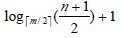

数据库系统巧妙利用了磁盘预读原理，将`一个节点的大小设为等于一个页`，这样每个节点只需要一次I/O就可以完全载入。为了达到这个目的，在实际实现B-Tree还需要使用如下技巧：

      每次新建节点时，直接申请一个页的空间，这样就保证一个节点物理上也存储在一个页里，加之计算机存储分配都是按页对齐的，就实现了一个node只需一次I/O。

B-Tree中一次检索最多需要h-1次I/O（根节点常驻内存），渐进复杂度为O（h）=O（logmN）。一般实际应用中，m是非常大的数字，通常超过100，因此h非常小（通常不超过3）。

综上所述，用B-Tree作为索引结构效率是非常高的。

而红黑树这种结构，h明显要深的多。由于逻辑上很近的节点（父子）物理上可能很远，无法利用局部性，所以红黑树的I/O渐进复杂度也为O（h），效率明显比B-Tree差很多。

**B树与B+Tree**

B-Tree：如果一次检索需要访问4个节点，数据库系统设计者利用磁盘预读原理，把节点的大小设计为一个页，那读取一个节点只需要一次I/O操作，完成这次检索操作，最多需要3次I/O(根节点常驻内存)。数据记录越小，每个节点存放的数据就越多，树的高度也就越小，I/O操作就少了，检索效率也就上去了。

B+Tree：非叶子节点只存key，大大滴减少了非叶子节点的大小，那么每个节点就可以存放更多的记录，树更矮了，I/O操作更少了。所以B+Tree拥有更好的性能。


### 5 表空间

表空间可以看做是InnoDB存储引擎逻辑结构的最高层，所有的数据都存放在表空间中。

表空间是一个`逻辑容器`，表空间存储的对象是段，在一个表空间中可以有一个或多个段，但是一个段只能属于一个表空间。表空间数据库由一个或多个表空间组成，表空间从管理上可以划分为`系统表空间` (System
tablespace)、`独立表空间`(File-per-table tablespace)、`撤销表空间`(Undo Tablespace)和`临时表空间`(Temporary Tablespace）等。


#### 5.1 独立表空间

独立表空间，即每张表有一个独立的表空间，也就是数据和索引信息都会保存在自己的表空间中。独立的表空间(即:单表)可以在不同的数据库之间进行`迁移`。

空间可以回收(DROPTABLE操作可自动回收表空间;其他情况，表空间不能自己回收)。如果对于统计分析或是日志表，删除大量数据后可以通过: `alter table TableName engine=innodb`;回收不用的空间。对于使用独立表空间的表，不管怎么删除，表空间的碎片不会太严重的影响性能，而且还有机会处理。

**独立表空间结构**

独立表空间由段、区、页组成。前面已经讲解过了。

**真实表空间对应的文件大小**

我们到数据目录里看，会发现一个新建的表对应的`.ibd`文件只占用了`96K`，才6个页面大小(MySQL5.7中)，这是因为一开始表空间占用的空间很小，因为表里边都没有数据。不过别忘了这些.ibd文件是`自扩展的`，随着表中数据的增多，表空间对应的文件也逐渐增大。

**查看InnoDB的表空间类型:**

```mysql
# 查看是否独立表空间
mysql> show variables like 'innodb_file_per_table';
+----------------------------+-------+
| Variable_name              | Value |
+----------------------------+-------+
| innodb_file_per_table      | ON    |
+----------------------------+-------+
1 row in set, 1 warning (0.00 sec)
```

MySQL8.0中 7个页面大小。原因.idb 还存了表结构。。。表结构.frm取消了

你能看到innodb_ file_ per_ _table=ON,这就意味着每张表都会单独保存为一个`.ibd`文件。


#### 5.2 系统表空间

系统表空间的结构和独立表空间基本类似，只不过由于整个MySQL进程只有一个系统表空间，在系统表空间中会额外记录一些有关整个系统信息的页面，这部分是独立表空间中没有的。

**lnnoDB数据字典**

每当我们向一个表中插入一条记录的时候，`MySQL校验过程`如下:

先要校验一下插入语句对应的表存不存在，插入的列和表中的列是否符合，如果语法没有问题的话，还需要知道该表的聚簇索引和所有二级索引对应的根页面是哪个表空间的哪个页面，然后把记录插入对应索引的B+树中。所以说，MySQL除了保存着我们插入的用户数据之外，还需要保存许多额外的信息，比方说:

```txt
-某个表属于哪个表空间，表里边有多少列
-表对应的每一个列的类型是什么
-该表有多少索引，每个索引对应哪几个字段，该索引对应的根页面在哪个表空间的哪个页面
-该表有哪些外键，外键对应哪个表的哪些列
-某个表空间对应文件系统上文件路径是什么
- ...
```


上述这些数据并不是我们使用`INSERT`语句插入的用户数据，实际上是为了更好的管理我们这些用户数据而不得已引入的一些额外数据，这些数据也称为`元数据`。InnoDB存储引擎特意定义了一些列的`内部系统表`(internalsystem table)来记录这些这些元数据:

| 表名             | 描述                                                 |
| ---------------- | ---------------------------------------------------- |
| `SYS_TABLES`     | 整个InnoDB存储引擎中所有的表的信息                   |
| `SYS_COLUMNS`    | 整个InnoDB存储引擎中所有的列的信息                   |
| `SYS_INDEXES`    | 整个InnoDB存储引擎中所有的索引的信息                 |
| `SYS_FIELDS`     | 整个InnoDB存储引擎中所有的索引对应的列的信息         |
| SYS_FOREIGN      | 整个InnoDB存储引擎中所有的外键的信息                 |
| SYS_FOREIGN_COLS | 整个InnoDB存储引擎中所有的外键对应列的信息           |
| SYS_TABLESPACES  | 整个InnoDB存储引擎中所有的表空间信息                 |
| SYS_DATAFILES    | 整个InnoDB存储引擎中所有的表空间对应文件系统的文件路 |
| SYS_VIRTUAL      | 整个InnoDB存储引擎中所有的虚拟生成列的信息           |

这些系统表也被称为`数据字典`，它们都是以`B+`树的形式保存在系统表空间的某些页面中，其中`SYS_TABLES`.
`SYS_COLUNNS`、`SYS_INDEXES`、`SYS_FIELDS`这四个表尤其重要，称之为基本系统表(basic system tables) 


注意:用户是`不能直接访问`InnoDB的这些内部系统表，除非你直接去解析系统表空间对应文件系统上的文件。不过考虑到查看这些表的内容可能有助于大家分析问题，所以在系统数据库`information_schema`中提供了一些以innodb_sys开头的表:

```mysql
mysql> USE information_schema ;
Database changed
mysql> SHOW TABLES LIKE 'innodb_sys%';
+--------------------------------------------+
| Tables_in_information_schema (innodb_sys%) |
+--------------------------------------------+
| INNODB_SYS_DATAFILES                       |
| INNODB_SYS_VIRTUAL                         |
| INNODB_SYS_INDEXES                         |
| INNODB_SYS_TABLES                          |
| INNODB_SYS_FIELDS                          |
| INNODB_SYS_TABLESPACES                     |
| INNODB_SYS_FOREIGN_COLS                    |
| INNODB_SYS_COLUMNS                         |
| INNODB_SYS_FOREIGN                         |
| INNODB_SYS_TABLESTATS                      |
+--------------------------------------------+
10 rows in set (0.00 sec)
```


在`information_schema`数据库中的这些以`INNODB_SYS`开头的表并不是真正的内部系统表(内部系统表就是我们上边以SYS开头的那些表)，而是在存储引擎启动时读取这些以`SYS`开头的系统表，然后填充到这些以
`INNODB_SYS`开头的表中。以`INNODB_SYS`开头的表和以`SYS`开头的表中的字段并不完全一样，但供大家参考已经足矣。


### 附录：数据页加载的三种方式

InnoDB从磁盘中读取数据的`最小单位`是数据页。而你想得到的id = xoxx的数据，就是这个数据页众多行中的一行。

对于MySQL存放的数据，逻辑概念上我们称之为表，在磁盘等物理层面而言是`按数据页`形式进行存放的，当其加载到MysQL中我们称之为`缓存页`。

如果缓冲池中没有该页数据，那么缓冲池有以下三种读取数据的方式,每种方式的读取效率都是不同的:

#### 1 内存读取

如果该数据存在于内存中，基本上执行时间在1ms左右，效率还是很高的。

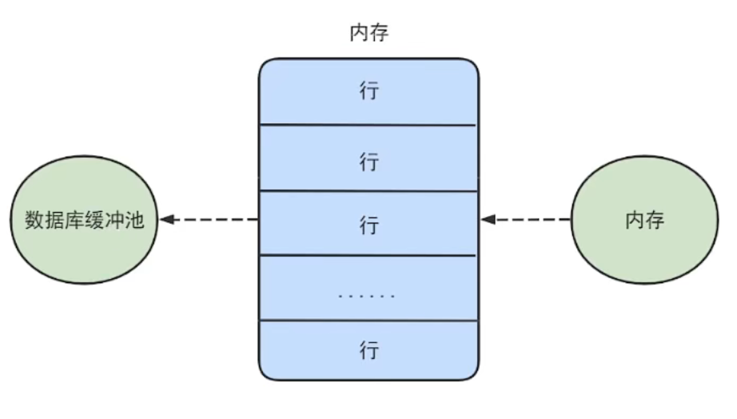

#### 2 随机读取

如果数据没有在内存中，就需要在磁盘上对该页进行查找，整体时间预估在`10ms`左右，这10ms 中有6ms是磁盘的实际繁忙时间(包括了`寻道和半圈旋转时间`），有3ms是对可能发生的排队时间的估计值，另外还有1ms的传输时间，将页从磁盘服务器缓冲区传输到数据库缓冲区中。这10ms 看起来很快，但实际上对于数据库来说消耗的时间已经非常长了，因为这还只是一个页的读取时间。

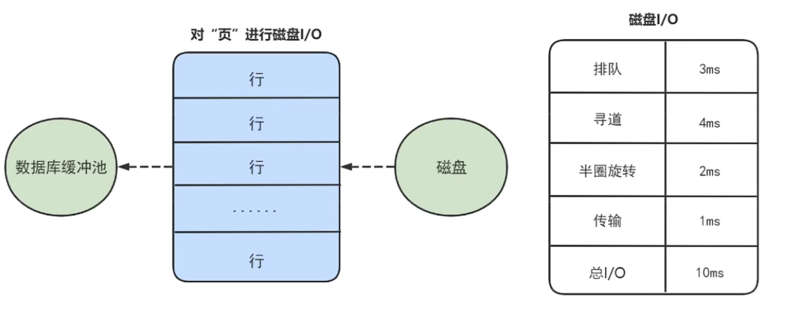

#### 3 顺序读取

顺序读取其实是一种批量读取的方式，因为我们请求的`数据在磁盘上往往都是相邻存储的`，顺序读取可以帮我们批量读取页面，这样的话，一次性加载到缓冲池中就不需要再对其他页面单独进行磁盘I/O操作了。如果一个磁盘的吞吐量是40MB/S，那么对于一个16KB大小的页来说，一次可以顺序读取2560 (40MB/16KB)个页，相当于一个页的读取时间为0.4ms。采用批量读取的方式，即使是从磁盘上进行读取，效率也比从内存中只单独读取一个页的效率要高。

------

## 七、索引的创建与设计原则

### 1 索引的声明与使用

#### 1.1 索引的分类

MySQL的索引包括普通索引、唯一性索引、全文索引、单列索引、多列索引和空间索引等。

- 从`功能逻辑`上说，索引主要有 4 种，分别是普通索引、唯一索引、主键索引、全文索引。

- 按`照物理实现方式`，索引可以分为 2 种：聚簇索引和非聚簇索引。 

- 按照`作用字段个数`进行划分，分成单列索引和联合索引。

1. **普通索引**

   在创建普通索引时，不附加任何限制条件，只是用于提高查询效率。这类索引可以创建在`任何数据类型`中，其值是否唯一和非空，要由字段本身的完整性约束条件决定。建立索引以后，可以通过索引进行查询。例如，在表`student`的字段`name`上建立一个普通索引，查询记录时就可以根据该索引进行查询。

2. **唯一性索引**

   使用`UNIQUE参数`可以设置索引为唯一性索引，在创建唯一性索引时，限制该索引的值必须是唯一的，但允许有空值。在一张数据表里可以有多个唯一索引。

   例如，在表`student`的字段`email`中创建唯一性索引，那么字段email的值就必须是唯一的。通过唯一性索引，可以更快速地确定某条记录。

3. **主键索引**

   主键索引就是一种特殊的唯一性索引，在唯一索引的基础上增加了不为空的约束，也就是`NOT NULL+UNIQUE`，一张表里最多只有一个主键索引。

   Why？这是由主键索引的物理实现方式决定的，因为数据存储在文件中只能按照一种顺序进行存储。

4. **单列索引**

   在表中的单个字段上创建索引。单列索引只根据该字段进行索引。单列索引可以是普通索引，也可以是唯一性索引，还可以是全文索引。只要保证该索引只对应一个字段即可。一个表可以`有多个`单列索引。

5. **多列(组合、联合)索引** 

   多列索引是在表的`多个字段组合`上创建一个索引。该索引指向创建时对应的多个字段，可以通过这几个字段进行查询，但是只有查询条件中使用了这些字段中的第一个字段时才会被使用。例如，在表中的字段id、name和gender上建立一个多列索引`idx_id_name_gender`，只有在查询条件中使用了字段id时该索引才会被使用。使用组合索引时遵循`最左前缀集合`。

6. **全文索引**

   全文索引(也称全文检索)是目前`搜索引擎`使用的一种关键技术。它能够利用[`分词技术`]等多种算法智能分析出文本文字中关键词的频率和重要性，然后按照一定的算法规则智能地筛选出我们想要的搜索结果。全文索引非常适合大型数据集，对于小的数据集，它的用处比较小。

   使用参数`FULLTEXT`可以设置索引为全文索引。在定义索引的列上支持值的全文查找，允许在这些索引列中插入重复值和空值。全文索引只能创建在`CHAR`、`VARCHAR`或`TEXT`类型及其系列类型的字段上，**查询数据量较大的字符串类型的字段时，使用全文索引可以提高查询速度**。例如，表`student`的字段`information`是TEXT类型，该字段包含了很多文字信息。在字段information上建立全文索引后，可以提高查询字段information的速度。

   全文索引典型的有两种类型：`自然语言的全文索引`和`布尔全文索引`。

   - 自然语言搜索引擎将计算每一个文档对象和查询的相关度。这里，相关度是基于匹配的关键词的个数，以及关键词在文档中出现的次数。**在整个索引中出现次数越少的词语，匹配时的相关度就越高**。相反，非常常见的单词将不会被搜索，如果一个词语的在超过50%的记录中都出现了，那么自然语言的搜索将不会搜索这类词语。

   MySQL数据库从3.23.23版开始支持全文索引，但MySQL5.6.4以前`只有Myisam支持`，5.6.4版本以后`innodb才支持`，但是官方版本不支持中文分词，需要第三方分词插件。在5.7.6版本，MySQL内置了`ngram全文解析器`，用来支持亚洲语种的分词。测试或使用全文索引时，要先看一下自己的MySQL版本、存储引擎和数据类型是否支持全文索引。

   随着大数据时代的到来，关系型数据库应对全文索引的需求已力不从心，逐渐被solr、ElasticSearch等专门的搜索引擎所替代。

7. **补充：空间索引**

   使用`参数SPATIAL`可以设置索引为`空间索引`。空间索引只能建立在空间数据类型上，这样可以提高系统获取空间数据的效率。MySQL中的空间数据类型包括`GEONETRY`、`POINT`、`LINESTRING`和`POLYGON`等。目前只有MyISAM存储引擎支持空间检索，而且索引的字段不能为空值。对于初学者来说，这类索引很少会用到。

**小结：不同的存储引擎支持的索引类型也不一样 **

- **InnoDB**：支持 B-tree、Full-text 等索引，不支持 Hash索引；
- **MyISAM**：支持 B-tree、Full-text 等索引，不支持 Hash 索引； 
- Memory：支持 B-tree、Hash 等索引，不支持 Full-text 索引；

- NDB：支持 Hash 索引，不支持 B-tree、Full-text 等索引； 

- Archive：不支持 B-tree、Hash、Full-text 等索引；


#### 1.2 创建索引

MySQL支持多种方法在单个或多个列上创建索引:在创建表的定义语句`CREATE TABLE`中指定索引列，使用`ALTER TABLE`语句在存在的表上创建索引，或者使用`CREATE INDEX`语句在已存在的表上添加索引。

##### 1.2.1 创建表的时候创建索引

使用CREATE TABLE创建表时，除了可以定义列的数据类型外，还可以定义主键约束、外键约束或者唯一性约束，而不论创建哪种约束，在定义约束的同时相当于在指定列上创建了一个索引。

举例：

```mysql
#隐式的方式创建索引。在声明有主键约束、唯一性约束、外键约束的字段上，会自动的添加相关的索引
CREATE TABLE dept(
	dept_id INT PRIMARY KEY AUTO_INCREMENT,
	dept_name VARCHAR( 20 )
);
```

```mysql
CREATE TABLE emp(
	emp_id INT PRIMARY KEY AUTO_INCREMENT,
	emp_name VARCHAR( 20 ) UNIQUE,
	dept_id INT,
	CONSTRAINT emp_dept_id_fk FOREIGN KEY(dept_id) REFERENCES dept(dept_id)
);
```

但是，如果显式创建表时创建索引的话，基本语法格式如下：

```mysql
CREATE TABLE table_name [col_name data_type]
[UNIQUE | FULLTEXT | SPATIAL] [INDEX | KEY] [index_name] (col_name  [length]) [ASC | DESC]
```

- `UNIQUE`、`FULLTEXT`和`SPATIAL`为可选参数，分别表示唯一索引、全文索引和空间索引；
- `INDEX`与`KEY`为同义词，两者的作用相同，用来指定创建索引；
- `index_name`指定索引的名称，为可选参数，如果不指定，那么MySQL默认col_name为索引名；
- `col_name`为需要创建索引的字段列，该列必须从数据表中定义的多个列中选择；
- `length`为可选参数，表示索引的长度，只有字符串类型的字段才能指定索引长度；
- `ASC`或`DESC`指定升序或者降序的索引值存储。

###### **1.创建普通索引**

在book表中的year_publication字段上建立普通索引，SQL语句如下：

```mysql
CREATE TABLE book(
	book_id INT ,
	book_name VARCHAR(100),
	authors VARCHAR(100),
	info VARCHAR(100) ,
	comment VARCHAR(100),
	year_publication YEAR,
	INDEX idx_bname (book_name)
);

#通过命令查看索引
#方式1：
SHOW CREATE TABLE book;
#方式2：
SHOW INDEX FROM book;
```


###### **2.创建唯一索引**

举例：

```mysql
# 创建唯一索引
# 声明有唯一索引的字段，在添加数据时，要保证唯一性，但是可以添加null
CREATE TABLE book1(
	book_id INT ,
	book_name VARCHAR(100),
	`authors` VARCHAR(100),
	info VARCHAR(100) ,
	`comment` VARCHAR(100),
	year_publication YEAR,
	#声明索引
	UNIQUE INDEX uk_idx_cmt(`comment`)
);

show index from book1;
```


###### **3.主键索引**

设定为主键后数据库会自动建立索引，innodb为聚簇索引，语法：

- 随表一起建索引

```mysql
CREATE TABLE book2(
	book_id INT PRIMARY KEY,
	book_name VARCHAR(100),
	`authors` VARCHAR(100),
	info VARCHAR(100) ,
	`comment` VARCHAR(100),
	year_publication YEAR
);

SHOW INDEX FROM book2;
```

- 删除主键索引


```mysql
ALTER TABLE book2 DROP PRIMARY KEY;
```

- 修改主键索引：必须先删除掉(drop)原索引，再新建(add)索引


###### **4.创建单列索引**

```mysql
CREATE TABLE book3(
	book_id INT ,
	book_name VARCHAR(100),
	`authors` VARCHAR(100),
	info VARCHAR(100) ,
	`comment` VARCHAR(100),
	year_publication YEAR,
	#声明索引
	UNIQUE INDEX idx_bname(book_name)
);

SHOW INDEX FROM book3;
```


###### **5.创建组合索引**

举例：创建表test3，在表中的id、name和age字段上建立组合索引，SQL语句如下：

```mysql
CREATE TABLE book4(
	book_id INT ,
	book_name VARCHAR(100),
	`authors` VARCHAR(100),
	info VARCHAR(100) ,
	`comment` VARCHAR(100),
	year_publication YEAR,
	#声明索引
	INDEX mul_bid_bname_info(book_id,book_name,info)
);

show index from book4;
```


###### **6.创建全文索引**

FULLTEXT全文索引可以用于全文搜索，并且只为`CHAR`、`VARCHAR`和`TEXT`列创建索引。索引总是对整个列进行，不支持局部(前缀)索引。

举例1：创建表test4，在表中的info字段上建立全文索引，SQL语句如下：

```mysql
CREATE TABLE test4(
	id INT NOT NULL,
	name CHAR(30) NOT NULL,
	age INT NOT NULL,
	info VARCHAR(255),
	FULLTEXT INDEX futxt_idx_info(info)
) ENGINE=MyISAM;
```

> 在MySQL5.7及之后版本中可以不指定最后的ENGINE了，因为在此版本中InnoDB支持全文索引。

举例2：

```mysql
CREATE TABLE articles (
	id INT UNSIGNED AUTO_INCREMENT PRIMARY KEY,
	title VARCHAR (200),
	body TEXT,
	FULLTEXT index (title, body)
) ENGINE = INNODB ;
```

创建了一个给title和body字段添加全文索引的表。

举例3：

```mysql
CREATE TABLE `papers` (
	`id` int(10) unsigned NOT NULL AUTO_INCREMENT,
	`title` varchar(200) DEFAULT NULL,
	`content` text,
	PRIMARY KEY (`id`),
	FULLTEXT KEY `title` (`title`,`content`)
) ENGINE=MyISAM DEFAULT CHARSET=utf8;
```

不同于like方式的的查询：

```mysql
SELECT * FROM papers WHERE content LIKE ‘%查询字符串%’;
```

全文索引用match+against方式查询：

```mysql
SELECT * FROM papers WHERE MATCH(title, content) AGAINST (‘查询字符串’);
```

> 注意点
> 1. 使用全文索引前，搞清楚版本支持情况；
> 2. 全文索引比 like + % 快 N 倍，但是可能存在精度问题；
> 3. 如果需要全文索引的是大量数据，建议先添加数据，再创建索引。


###### **7.创建空间索引**

空间索引创建中，要求空间类型的字段必须为`非空`。

举例：创建表test5，在空间类型为GEOMETRY的字段上创建空间索引，SQL语句如下：

```mysql
CREATE TABLE test5(
	geo GEOMETRY NOT NULL,
	SPATIAL INDEX spa_idx_geo(geo)
) ENGINE=MyISAM;
```


##### 1.2.2 在已经存在的表上创建索引

在已经存在的表中创建索引可以使用`ALTER TABLE`语句或者`CREATE INDEX`语句。

###### **1.使用ALTER TABLE语句创建索引** 

`ALTER TABLE`语句创建索引的基本语法如下：

```mysql
ALTER TABLE table_name ADD [UNIQUE | FULLTEXT | SPATIAL] [INDEX | KEY]
[index_name] (col_name[length],...) [ASC | DESC]

ALTER TABLE book ADD INDEX index_name(book_name);
ALTER TABLE book ADD UNIQUE uk_idx_bname(book_name);
ALTER TABLE book ADD UNIQUE mul_bid_na(book_name, author);
```


###### **2.使用CREATE INDEX创建索引** 

`CREATE INDEX`语句可以在已经存在的表上添加索引，在MySQL中，`CREATE INDEX`被映射到一个`ALTER TABLE`语句上，基本语法结构为：

```mysql
CREATE [UNIQUE | FULLTEXT | SPATIAL] INDEX index_name
ON table_name (col_name[length],...) [ASC | DESC]

create 索引类型 索引名称 on 表名(字段);

create index idx_cmt on book(comment);
create unique index idx_cmt on book(comment);
create index idx_cmt on book(comment,author);
```


#### 1.3 删除索引

1. **使用ALTER TABLE删除索引** ALTER TABLE删除索引的基本语法格式如下：

   ```mysql
   ALTER TABLE table_name DROP INDEX index_name;
   ```

   > 提示
   >
   > 添加AUTO_INCREMENT约束字段的唯一索引不能被删除。

2. **使用DROP INDEX语句删除索引** DROP INDEX删除索引的基本语法格式如下：

   ```mysql
   DROP INDEX index_name ON table_name;
   ```

> 在需要大量删除表数据，修改表数据时，可以考虑先删除索引。等修改完数据之后再插入

>  提示
>
>  删除表中的列时，如果要删除的列为索引的组成部分，则该列也会从索引中删除。如果组成索引的所有列都被删除，则整个索引将被删除。


### 2 MySQL8.0索引新特性

#### 2.1 支持降序索引

降序索引以降序存储键值。虽然在语法上，从MySQL 4版本开始就已经支持降序索引的语法了，但实际上该DESC定义是被忽略的，直到MySQL8.x版本才开始真正支持降序索引(仅限于InnoDB存储引擎)。

MySQL在8.0**版本之前创建的仍然是升序索引，使用时进行反向扫描，这大大降低了数据库的效率**。在某些场景下，降序索引意义重大。例如，如果一个查询，需要对多个列进行排序，且顺序要求不一致，那么使用降序索引将会避免数据库使用额外的文件排序操作，从而提高性能。

举例：分别在MySQL5.7 版本和MySQL8.0 版本中创建数据表ts1，结果如下：

```mysql
CREATE TABLE ts1(a int, b int, index idx_a_b(a, b desc) ) ;
```


在MySQL5.7 版本中查看数据表ts1的结构，结果如下：

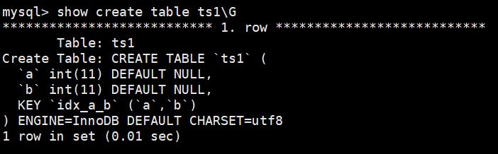

从结果可以看出，索引仍然是默认的升序。

在MySQL8.0 版本中查看数据表ts1的结构，结果如下：

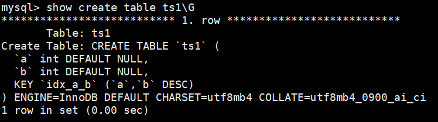

从结果可以看出，索引已经是降序了。下面继续测试降序索引在执行计划中的表现。

分别在MySQL5.7 版本和MySQL8.0 版本的数据表ts1中插入800条随机数据，执行语句如下：

```mysql
CREATE TABLE ts1(a int, b int, index idx_a_b(a,b desc));
```

```mysql
DELIMITER //
CREATE PROCEDURE ts_insert () 
BEGIN
	DECLARE i INT DEFAULT 1;
	WHILE i <= 800 
	DO
		INSERT INTO ts1 SELECT rand()* 80000, rand()* 80000;
		SET i = i + 1;
	END WHILE;
	COMMIT;
END // 
DELIMITER;

#调用
CALL ts_insert ();
```


在MySQL 5.7版本中查看数据表ts1的执行计划，结果如下：

```mysql
mysql> explain select * from ts1 order by a, b desc limit 5;
+----+------+----------+-----------------------------+
| id | rows | filtered | Extra                       |
+----+------+----------+-----------------------------+
|  1 | 1598 |   100.00 | Using index; Using filesort |
+----+------+----------+-----------------------------+
1 row in set, 1 warning (0.01 sec)
```

从结果可以看出，执行计划中扫描数为1598，而且使用了Using filesort。

>  提示 
>
>  Using filesort是MySQL中一种速度比较慢的外部排序，能避免是最好的。多数情况下，管理员可以通过优化索引来尽量避免出现Using filesort，从而提高数据库执行速度。

在MySQL 8.0版本中查看数据表ts1的执行计划。

```mysql
mysql> explain select * from ts1 order by a, b desc limit 5;
+----+---------+-----+----------+-------------+
| id | key     |rows | filtered | Extra       |
+----+---------+-----+----------+-------------+
|  1 | idx_a_b |   5 |   100.00 | Using index |
+----+---------+-----+----------+-------------+
1 row in set, 1 warning (0.03 sec)
```

从结果可以看出，执行计划中扫描数为5，而且没有使用Using filesort。

> 注意 
>
> 降序索引只对查询中特定的排序顺序有效，如果使用不当，反而查询效率更低。例如，上述查询排序条件改为order by a desc, b desc，MySQL5.7的执行计划要明显好于MySQL8.0。

将排序条件修改为order by a desc, b desc后，下面来对比不同版本中执行计划的效果。在MySQL5.7版本中查看数据表ts1的执行计划，结果如下：

```mysql
EXPLAIN SELECT * FROM ts1 ORDER BY a DESC,b DESC LIMIT 5;
```

在MySQL 8.0版本中查看数据表ts1的执行计划。

从结果可以看出，修改后MySQL 5.7的执行计划要明显好于MySQL 8.0。


#### 2.2 隐藏索引

在MySQL 5.7版本及之前，只能通过显式的方式删除索引。此时，如果发现删除索引后出现错误，又只能通过显式创建索引的方式将删除的索引创建回来。如果数据表中的数据量非常大，或者数据表本身比较大，这种操作就会消耗系统过多的资源，操作成本非常高。

从MySQL 8.x开始支持`隐藏索引（invisible indexes）`，只需要将待删除的索引设置为隐藏索引，使查询优化器不再使用这个索引（即使使用force index（强制使用索引），优化器也不会使用该索引）确认将索引设置为隐藏索引后系统不受任何响应，就可以彻底删除索引。`这种通过先将索引设置为隐藏索引，再删除索引的方式就是软删除`。

同时，你想验证某个索引删除之后的`查询性能影响`，就可以暂时先隐藏该索引。

>  注意:
>
>  主键不能被设置为隐藏索引。当表中没有显式主键时，表中第一个唯一非空索引会成为隐式主键，也不能设置为隐藏索引。

索引默认是可见的，在使用CREATE TABLE，CREATE INDEX或者ALTERTABLE等语句时可以通过`VISIBLE`或者`INVISIBLE`关键词设置索引的可见性。


**1.创建表时直接创建**

在MySQL中创建隐藏索引通过SQL语句INVISIBLE来实现，其语法形式如下：

```mysql
CREATE TABLE tablename(
	propname1 type1[CONSTRAINT1],
	propname2 type2[CONSTRAINT2],
	……
	propnamen typen,
	INDEX [indexname](propname1 [(length)]) INVISIBLE
);
```

上述语句比普通索引多了一个关键字INVISIBLE，用来标记索引为不可见索引。


**2.在已经存在的表上创建**

可以为已经存在的表设置隐藏索引，其语法形式如下：

```mysql
CREATE INDEX indexname
ON tablename(propname[(length)]) INVISIBLE;
```


**3.通过ALTER TABLE语句创建**

语法形式如下：

```mysql
ALTER TABLE tablename
ADD INDEX indexname (propname [(length)]) INVISIBLE;
```


**4.切换索引可见状态** 

已存在的索引可通过如下语句切换可见状态：

```mysql
ALTER TABLE tablename ALTER INDEX index_name INVISIBLE; #切换成隐藏索引  可见 --> 不可见
ALTER TABLE tablename ALTER INDEX index_name VISIBLE; #切换成非隐藏索引   不可见 --> 可见
```

如果将index_name索引切换成可见状态，通过explain查看执行计划，发现优化器选择了index_name索引

>  注意 
>
>  当索引被隐藏时，它的内容仍然是和正常索引一样实时更新的。如果一个索引需要长期被隐藏，那么可以将其删除，因为索引的存在会影响插入、更新和删除的性能。

通过设置隐藏索引的可见性可以查看索引对调优的帮助。


**5.使隐藏索引对查询优化器可见**

> 只是有个全局的地方设置可见性，没什么用

在MySQL 8.x版本中，为索引提供了一种新的测试方式，可以通过查询优化器的一个开关（use_invisible_indexes）来打开某个设置，使隐藏索引对查询优化器可见。如果 use_invisible_indexes设置为off(默认)，优化器会忽略隐藏索引。如果设置为on，即使隐藏索引不可见，优化器在生成执行计划时仍会考虑使用隐藏索引。

1. 在MySQL命令行执行如下命令查看查询优化器的开关设置。

```mysql
mysql> select @@optimizer_switch \G
*************************** 1. row ***************************
@@optimizer_switch: index_merge=on,index_merge_union=on,index_merge_sort_union=on,index_merge_intersection=on,engine_condition_pushdown=on,index_condition_pushdown=on,mrr=on,mrr_cost_based=on,block_nested_loop=on,batched_key_access=off,materialization=on,semijoin=on,loosescan=on,firstmatch=on,duplicateweedout=on,subquery_materialization_cost_based=on,use_index_extensions=on,condition_fanout_filter=on,derived_merge=on,`use_invisible_indexes=off`,skip_scan=on,hash_join=on,subquery_to_derived=off,prefer_ordering_index=on,hypergraph_optimizer=off,derived_condition_pushdown=on
1 row in set (0.12 sec)
```

在输出的结果信息中找到如下属性配置。

```properties
use_invisible_indexes=off
```

此属性配置值为off，说明隐藏索引默认对查询优化器不可见。


2. 使隐藏索引对查询优化器可见，需要在MySQL命令行执行如下命令：

```mysql
mysql> set session optimizer_switch="use_invisible_indexes=on" ;
Query OK, 0 rows affected (0.06 sec)
```

SQL语句执行成功，再次查看查询优化器的开关设置。

```mysql
mysql> select @@optimizer_switch \G
*************************** 1. row ***************************
@@optimizer_switch: index_merge=on,index_merge_union=on,index_merge_sort_union=on,index_merge_intersection=on,engine_condition_pushdown=on,index_condition_pushdown=on,mrr=on,mrr_cost_based=on,block_nested_loop=on,batched_key_access=off,materialization=on,semijoin=on,loosescan=on,firstmatch=on,duplicateweedout=on,subquery_materialization_cost_based=on,use_index_extensions=on,condition_fanout_filter=on,derived_merge=on,`use_invisible_indexes=on`,skip_scan=on,hash_join=on,subquery_to_derived=off,prefer_ordering_index=on,hypergraph_optimizer=off,derived_condition_pushdown=on
1 row in set (0.03 sec)
```

此时，在输出结果中可以看到如下属性配置。

```mysql
use_invisible_indexes=on
```

use_invisible_indexes属性的值为on，说明此时隐藏索引对查询优化器可见。


3. 使用EXPLAIN查看以字段invisible_column作为查询条件时的索引使用情况。

```mysql
explain select * from classes where cname = '高一2班';
```

查询优化器会使用隐藏索引来查询数据。


4. 如果需要使隐藏索引对查询优化器不可见，则只需要执行如下命令即可。

```mysql
mysql> set session optimizer_switch="use_invisible_indexes=off";
Query OK, 0 rows affected (0.00 sec)
```

再次查看查询优化器的开关设置。

```mysql
mysql> select @@optimizer_switch \G
```

此时，use_invisible_indexes属性的值已经被设置为“off”。


### 3 索引的设计原则

为了使索引的使用效率更高，在创建索引时，必须考虑在哪些字段上创建索引和创建什么类型的索引。索**引设计不合理或者缺少索引都会对数据库和应用程序的性能造成障碍**。高效的索引对于获得良好的性能非常重要。设计索引时，应该考虑相应准则。

#### 3.1 数据准备

**第1步：创建数据库、创建表**

```mysql
CREATE DATABASE atguigudb1;
USE atguigudb1;

#1.创建学生表和课程表
CREATE TABLE `student_info` (
	`id` INT( 11 ) AUTO_INCREMENT,
	`student_id` INT NOT NULL ,
	`name` VARCHAR( 20 ) DEFAULT NULL,
	`course_id` INT NOT NULL ,
	`class_id` INT( 11 ) DEFAULT NULL,
	`create_time` DATETIME DEFAULT CURRENT_TIMESTAMP ON UPDATE CURRENT_TIMESTAMP,
	PRIMARY KEY (`id`)
) ENGINE=INNODB AUTO_INCREMENT= 1 DEFAULT CHARSET=utf8;

CREATE TABLE `course` (
	`id` INT( 11 ) AUTO_INCREMENT,
	`course_id` INT NOT NULL ,
	`course_name` VARCHAR( 40 ) DEFAULT NULL,
	PRIMARY KEY (`id`)
) ENGINE=INNODB AUTO_INCREMENT= 1 DEFAULT CHARSET=utf8;
```


**第2步：创建模拟数据必需的存储函数**

```mysql
#函数 1 ：创建随机产生字符串函数
DELIMITER //
CREATE FUNCTION rand_string(n INT)
	RETURNS VARCHAR( 255 ) #该函数会返回一个字符串
BEGIN
	DECLARE chars_str VARCHAR( 100 ) DEFAULT
'abcdefghijklmnopqrstuvwxyzABCDEFJHIJKLMNOPQRSTUVWXYZ';
	DECLARE return_str VARCHAR( 255 ) DEFAULT '';
	DECLARE i INT DEFAULT 0 ;
    WHILE i < n DO
        SET return_str =CONCAT(return_str,SUBSTRING(chars_str,FLOOR( 1 +RAND()* 52 ), 1 ));
        SET i = i + 1 ;
    END WHILE;
    RETURN return_str;
END //
DELIMITER ;
```

```mysql
#函数 2 ：创建随机数函数
DELIMITER //
CREATE FUNCTION rand_num (from_num INT, to_num INT) RETURNS INT( 11 )
BEGIN
	DECLARE i INT DEFAULT 0;
	SET i = FLOOR(from_num +RAND()*(to_num - from_num+ 1 ));
	RETURN i;
END //
DELIMITER ;
```

创建函数，假如报错：

```mysql
This function has none of DETERMINISTIC......
```

由于开启过慢查询日志bin-log, 我们就必须为我们的function指定一个参数。

主从复制，主机会将写操作记录在bin-log日志中。从机读取bin-log日志，执行语句来同步数据。如果使用函数来操作数据，会导致从机和主键操作时间不一致。所以，默认情况下，mysql不开启创建函数设置。

- 查看mysql是否允许创建函数：

  ```mysql
  show variables like 'log_bin_trust_function_creators';
  ```

- 命令开启：允许创建函数设置：

  ```mysql
  set global log_bin_trust_function_creators= 1 ;  # 不加global只是当前窗口有效。
  ```

- mysqld重启，上述参数又会消失。永久方法：

  - windows下：my.ini[mysqld]加上：

    ```properties
    log_bin_trust_function_creators= 1
    ```

  - linux下：/etc/my.cnf下my.cnf[mysqld]加上：

    ```properties
    log_bin_trust_function_creators= 1
    ```


**第3步：创建插入模拟数据的存储过程**

```mysql
#存储过程 1 ：创建插入课程表存储过程
DELIMITER //
CREATE PROCEDURE insert_course( max_num INT )
BEGIN
    DECLARE i INT DEFAULT 0 ;
    SET autocommit = 0 ;  #设置手动提交事务
    REPEAT #循环
    SET i = i + 1 ;  #赋值
    INSERT INTO course (course_id, course_name ) VALUES
    (rand_num( 10000 , 10100 ), rand_string( 6 ));
    UNTIL i = max_num
    END REPEAT;
	COMMIT;  #提交事务
END //
DELIMITER ;
```

```mysql
#存储过程 2 ：创建插入学生信息表存储过程
DELIMITER //
CREATE PROCEDURE insert_stu( max_num INT )
BEGIN
DECLARE i INT DEFAULT 0 ;
	SET autocommit = 0 ;  #设置手动提交事务
	REPEAT #循环
    	SET i = i + 1 ;  #赋值
   		INSERT INTO student_info (course_id, class_id ,student_id ,NAME ) VALUES
    (rand_num( 10000 , 10100 ),rand_num( 10000 , 10200 ),rand_num( 1 , 200000 ),rand_string( 6 ));
        UNTIL i = max_num
	END REPEAT;
	COMMIT;  #提交事务
END //
DELIMITER ;
```


**第4步：调用存储过程**

```mysql
CALL insert_course( 100 );
CALL insert_stu( 1000000 );
```


#### 3.2 哪些情况适合创建索引

##### **1.字段的数值有唯一性的限制**

索引本身可以起到约束的作用，比如唯一索引、主键索引都是可以起到唯一性约束的，因此在我们的数据表中，如果`某个字段是唯一性的`，就可以直接`创建唯一性索引`，或者`主键索引`。这样可以更快速地通过该索引来确定某条记录。

例如，学生表中`学号`是具有唯一性的字段，为该字段建立唯一性索引可以很快确定某个学生的信息，如果使用姓名的话，可能存在同名现象，从而降低查询速度。

> 业务上具有唯一特性的字段，即使是组合字段，也必须建成唯一索引。（来源：Alibaba）
>
> 说明：不要以为唯一索引影响了 insert 速度，这个速度损耗可以忽略，但提高查找速度是明显的。

##### **2.频繁作为 WHERE 查询条件的字段**

某个字段在SELECT语句的 WHERE 条件中经常被使用到，那么就需要给这个字段创建索引了。尤其是在数据量大的情况下，创建普通索引就可以大幅提升数据查询的效率。

**比如`student_info`数据表（含 100 万条数据），假设我们想要查询`student_id=123110`的用户信息。**

```mysql
#student_id字段上没有索引的：
SELECT course_id, class_id, NAME, create_time, student_id 
FROM student_info
WHERE student_id = 123110; #276ms

#给student_id字段添加索引
ALTER TABLE student_info ADD INDEX idx_sid(student_id);

#student_id字段上有索引的：
SELECT course_id, class_id, NAME, create_time, student_id 
FROM student_info
WHERE student_id = 123110; #43ms
```

##### **3.经常 GROUP BY 和 ORDER BY 的列**

索引就是让数据按照某种顺序进行存储或检索，因此当我们使用 GROUP BY 对数据进行分组查询，或者使用 ORDER BY 对数据进行排序的时候，就需要`对分组或者排序的字段进行索引`。如果待排序的列有多个，那么可以在这些列上建立`组合索引`。

**比如，按照`student_id`对学生选修的课程进行分组，显示不同的`student_id`和`课程数量`，显示100个即可。**

```mysql
#student_id字段上有索引的：
SELECT student_id, COUNT(*) AS num 
FROM student_info 
GROUP BY student_id LIMIT 100; #41ms

#删除idx_sid索引
DROP INDEX idx_sid ON student_info;

#student_id字段上没有索引的：
SELECT student_id, COUNT(*) AS num 
FROM student_info 
GROUP BY student_id LIMIT 100; #866ms

#再测试：
SHOW INDEX FROM student_info;

#添加单列索引
ALTER TABLE student_info ADD INDEX idx_sid(student_id);
ALTER TABLE student_info ADD INDEX idx_cre_time(create_time);

SELECT student_id, COUNT(*) AS num FROM student_info 
GROUP BY student_id 
ORDER BY create_time DESC 
LIMIT 100;  #5212ms

#添加联合索引
ALTER TABLE student_info
ADD INDEX idx_sid_cre_time(student_id,create_time DESC);

SELECT student_id, COUNT(*) AS num FROM student_info 
GROUP BY student_id 
ORDER BY create_time DESC 
LIMIT 100;  #257ms

#再进一步：
ALTER TABLE student_info
ADD INDEX idx_cre_time_sid(create_time DESC,student_id);

DROP INDEX idx_sid_cre_time ON student_info;

SELECT student_id, COUNT(*) AS num FROM student_info 
GROUP BY student_id 
ORDER BY create_time DESC 
LIMIT 100;  #3790ms
```

##### **4.UPDATE、DELETE 的 WHERE 条件列**

对数据按照某个条件进行查询后再进行 UPDATE 或 DELETE 的操作，如果对 WHERE 字段创建了索引，就能大幅提升效率。原理是因为我们需要先根据 WHERE 条件列检索出来这条记录，然后再对它进行更新或删除。 **如果进行更新的时候，更新的字段是`非索引字段`，提升的效率会更明显，这是因为非索引字段更新不需要对索引进行维护**。

```mysql
UPDATE student_info SET student_id = 10002 
WHERE `name` = '462eed7ac6e791292a79';  #0.633s

#添加索引
ALTER TABLE student_info ADD INDEX idx_name(`name`);

UPDATE student_info SET student_id = 10001 
WHERE `name` = '462eed7ac6e791292a79'; #0.001s
```

##### **5.DISTINCT 字段需要创建索引**

有时候我们需要对某个字段进行去重，使用 DISTINCT，那么对这个字段创建索引，也会提升查询效率。

比如，我们想要查询课程表中不同的 student_id 都有哪些，如果我们没有对 student_id 创建索引，执行SQL语句：

```mysql
SELECT DISTINCT( student_id) FROM 'student_info `;
```

运行结果（ 600637 条记录，运行时间 0.683s）：

```mysql
# 加索引语句
SELECT DISTINCT( student_id) FROM 'student_info `;
```

如果我们对 student_id 创建索引，再执行 SQL 语句：

运行结果（ 600637 条记录，运行时间 0.010s）：

你能看到 SQL 查询效率有了提升，同时显示出来的 student_id 还是按照`递增的顺序`进行展示的。这是因为索引会对数据按照某种顺序进行排序，所以在去重的时候也会快很多。 因为紧挨着所以去重特别方便

##### **6.多表 JOIN 连接操作时，创建索引注意事项**

首先，`连接表的数量尽量不要超过 3 张`，因为每增加一张表就相当于增加了一次嵌套的循环，数量级增长会非常快，严重影响查询的效率。

其次，对`WHERE 条件创建索引，`因为 WHERE 才是对数据条件的过滤。如果在数据量非常大的情况下，没有 WHERE 条件过滤是非常可怕的。

最后，`对用于连接的字段创建索引，`并且该字段在多张表中的`类型必须一致`。比如 course_id 在student_info 表和 course 表中都为 int(11) 类型，而不能一个为 int 另一个为 varchar 类型。

举个例子，如果我们只对 student_id 创建索引，执行 SQL 语句：

```mysql
SELECT s.course_id, NAME, s.student_id, c.course_name 
FROM student_info s JOIN course c
ON s.course_id = c.course_id
WHERE NAME = '462eed7ac6e791292a79';
```

运行结果（1 条数据，运行时间 0.189s）：

这里我们对 name 创建索引，再执行上面的 SQL 语句，运行时间为 0.002s。

##### **7.使用列的类型小的创建索引**

我们这里所说的`类型大小`指的就是该类型表示的数据范围的大小。

我们在定义表结构的时候要显式的指定列的类型，以整数类型为例，有`TINYINT`、`MEDIUMINT`、`INT`、`BIGINT`等，它们占用的存储空间依次递增，能表示的整数范围当然也是依次递增。如果我们想要对某个整数列建立索引的话，在表示的整数范围允许的情况下，尽量让索引列使用较小的类型，比如我们能使用`INT`就不要使用`BIGINT`，能使用`MEDIUMINT`就不要使用`INT`。这是因为:

- 数据类型越小，在查询时进行的比较操作越快
- 数据类型越小，索引占用的存储空间就越少，在一个数据页内就可以放下更多的记录，从而减少磁盘I/0带来的性能损耗，也就意味着可以把更多的数据页缓存在内存中，从而加快读写效率。

这个建议对于表的`主键来说更加适用`，因为不仅是聚簇索引中会存储主键值，其他所有的二级索引的节点处都会存储一份记录的主键值，如果主键使用更小的数据类型，也就意味着节省更多的存储空间和更高效的I/O。

##### **8.使用字符串前缀创建索引**

假设我们的字符串很长，那存储一个字符串就需要占用很大的存储空间。在我们需要为这个字符串列建立索引时，那就意味着在对应的B+树中有这么两个问题:

- B+树索引中的记录需要把该列的完整字符串存储起来，更费时。而且字符串越长，`在索引中占用的存储空间越大。`
- 如果B+树索引中索引列存储的字符串很长，那在做字符串`比较时会占用更多的时间。`

我们可以通过截取字段的前面一部分内容建立索引，这个就叫`前缀索引`。这样在查找记录时虽然不能精确的定位到记录的位置，但是能定位到相应前缀所在的位置，然后根据前缀相同的记录的主键值回表查询完整的字符串值。既`节约空间`，又`减少了字符串的比较时间`，还大体能解决排序的问题。

例如，TEXT和BLOG类型的字段，进行全文检索会很浪费时间，如果只检索字段前面的若干字符，这样可以提高检索速度。

创建一张商户表，因为地址字段比较长，在地址字段上建立前缀索引

```mysql
create table shop(address varchar( 120 ) not null);

alter table shop add index(address( 12 ));
```

问题是，截取多少呢？截取得多了，达不到节省索引存储空间的目的；截取得少了，重复内容太多，字段的散列度(选择性)会降低。**怎么计算不同的长度的选择性呢**？

先看一下字段在全部数据中的选择度：

```mysql
select count(distinct address) / count(*) from shop;
```

通过不同长度去计算，与全表的选择性对比：

公式：

```mysql
count(distinct left(列名, 索引长度)) / count(*)
```

例如：

```mysql
select count(distinct left(address, 10 )) / count(*) as sub10, -- 截取前 10 个字符的选择度
count(distinct left(address, 15 )) / count(*) as sub11, -- 截取前 15 个字符的选择度
count(distinct left(address, 20 )) / count(*) as sub12, -- 截取前 20 个字符的选择度
count(distinct left(address, 25 )) / count(*) as sub13 -- 截取前 25 个字符的选择度
from shop;
```

**引申另一个问题：索引列前缀对排序的影响**

如果使用了索引列前缀，比方说前边只把address列的前12个字符放到了二级索引中，下边这个查询可能就有点儿尴尬了:

```mysql
SELECT * FROM shop
ORDER BY address  # 这个地方order by 就不准了 如果用前12个建立索引的话
LIMIT 12;
```

因为二级索引中不包含完整的address列信息，所以无法对前12个字符相同，后边的字符不同的记录进行排序，也就是使用索引列前缀的方式`无法支持使用索引排序`，只能使用文件排序。

> **拓展：Alibaba《Java开发手册》**
>
> 【`强制`】在 varchar 字段上建立索引时，必须指定索引长度，没必要对全字段建立索引，根据实际文本区分度决定索引长度。
>
> 说明：索引的长度与区分度是一对矛盾体，一般对字符串类型数据，长度为 20 的索引，区分度会高达`90%以上`，可以使用`count(distinct left(列名, 索引长度))/count(*)`的区分度来确定。


##### **9.区分度高(散列性高)的列适合作为索引**

`列的基数`指的是某一列中不重复数据的个数，比方说某个列包含值2，5，8，2，5，8，2，5，8，虽然有`9`条记录，但该列的基数却是`3`。也就是说，**在记录行数一定的情况下，列的基数越大，该列中的值越分散；列的基数越小，该列中的值越集中**。这个列的基数指标非常重要，直接影响我们是否能有效的利用索引。最好为列的基数大的列建立索引，为基数太小列的建立索引效果可能不好。

可以使用公式 `select count(distinct a)/count(*) from t1`计算区分度，越接近1越好，一般超过33%就算是比较高效的索引了。

拓展:联合索引把区分度高(散列性高)的列放在前面。

##### **10.使用最频繁的列放到联合索引的左侧**

这样也可以较少的建立一些索引。同时，由于"最左前缀原则"，可以增加联合索引的使用率。

##### **11.在多个字段都要创建索引的情况下，联合索引优于单值索引**


#### 3.3 限制索引的数目

在实际工作中，我们也需要注意平衡，索引的数目不是越多越好。我们需要限制每张表上的索引数量，建议单张表索引数量`不超过6个`。原因:

1. 每个索引都需要占用`磁盘空间`，索引越多，需要的磁盘空间就越大。

2. 索引会影响`INSERT`、`DELETE`、`UPDATE`等语句的性能，因为表中的数据更改的同时，索引也会进行调整和更新，会造成负担。

3. 优化器在选择如何优化查询时，会根据统一信息，对每一个可以用到的`索引来进行评估`，以生成出一个最好的执行计划，如果同时有很多个索引都可以用于查询，会增加MySQL优化器生成执行计划时间，降低查询性能。


#### 3.4 哪些情况不适合创建索引

##### 1.**在where中使用不到的字段，不要设置索引**

WHERE条件(包括GROUP BY、ORDER BY)里用不到的字段不需要创建索引，索引的价值是快速定位，如果起不到定位的字段通常是不需要创建索引的。举个例子:

```mysql
SELECT course_id,student_id, create_time
FROM student_info
WHERE student_id = 41251;
```

因为我们是按照student_id来进行检索的，所以不需要对其他字段创建索引，即使这些字段出现在SELECT 字段中。

##### 2.**数据量小的表最好不要使用索引**

如果表记录太少，比如少于1000个，那么是不需要创建索引的。表记录太少，是否创建索引`对查询效率的影响并不大`。甚至说，查询花费的时间可能比遍历索引的时间还要短，索引可能不会产生优化效果。

举例：创建表 1 ：

```mysql
CREATE TABLE t_without_index(
	a INT PRIMARY KEY AUTO_INCREMENT,
	b INT
);
```

提供存储过程 1 ：

```mysql
#创建存储过程
DELIMITER //
CREATE PROCEDURE t_wout_insert()
BEGIN
	DECLARE i INT DEFAULT 1 ;
	WHILE i <= 900
	DO
		INSERT INTO t_without_index(b) SELECT RAND()* 10000 ;
		SET i = i + 1 ;
	END WHILE;
	COMMIT;
END //
DELIMITER ;

#调用
CALL t_wout_insert();
```

创建表 2 ：

```mysql
CREATE TABLE t_with_index(
	a INT PRIMARY KEY AUTO_INCREMENT,
	b INT,
	INDEX idx_b(b)
);
```


创建存储过程 2 ：

```mysql
#创建存储过程
DELIMITER //
CREATE PROCEDURE t_with_insert()
BEGIN
	DECLARE i INT DEFAULT 1 ;
	WHILE i <= 900
	DO
		INSERT INTO t_with_index(b) SELECT RAND()* 10000 ;
		SET i = i + 1 ;
	END WHILE;
	COMMIT;
	END //
DELIMITER ;

#调用
CALL t_with_insert();
```

查询对比：

你能看到运行结果相同，但是在数据量不大的情况下，索引就发挥不出作用了。

```mysql
mysql> select * from t_without_index where b = 9879 ;
+------+------+
| a    | b    |
+------+------+
| 1242 | 9879 |
+------+------+
1 row in set (0.00 sec)

mysql> select * from t_with_index where b = 9879 ;
+-----+------+
| a   | b    |
+-----+------+
| 112 | 9879 |
+-----+------+
1 row in set (0.00 sec)
```

你能看到运行结果相同，但是在数据量不大的情况下，索引就发挥不出作用了。

> 结论：在数据表中的数据行数比较少的情况下，比如不到 1000 行，是不需要创建索引的。

##### 3.**有大量重复数据的列上不要建立索引**

在条件表达式中经常用到的不同值较多的列上建立索引，但字段中如果有大量重复数据，也不用创建索引。比如在学生表的"`性别`"字段上只有“男”与“·女"两个不同值，因此无须建立索引。如果建立索引，不但不会提高查询效率，反而会`严重降低数据更新速度`。

**举例1**：要在 100 万行数据中查找其中的 50 万行（比如性别为男的数据），一旦创建了索引，你需要先访问 50 万次索引，然后再访问 50 万次数据表，这样加起来的开销比不使用索引可能还要大。

**举例2**：假设有一个学生表，学生总数为100万人，男性只有10个人，也就是占总人口的10万分之1。

学生表 student_gender 结构如下。其中数据表中的 student_gender 字段取值为 0 或 1，0代表女性，1代表男性。

```mysql
CREATE TABLE student_gender(
	student_id INT( 11 ) NOT NULL,
	student_name VARCHAR( 50 ) NOT NULL,
	student_gender TINYINT( 1 ) NOT NULL,
	PRIMARY KEY(student_id)
)ENGINE = INNODB;	
```


如果我们要筛选出这个学生表中的男性，可以使用：

```mysql
SELECT * FROM student_gender WHERE student_gender = 1;
```

运行结果（ 10 条数据，运行时间 0.696s）：

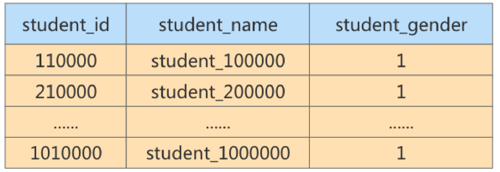

你能看到在未创建索引的情况下，运行的效率并不高。如果针对 student_gender字段创建索引呢?

```mysql
SELECT * FROM student gender WHERE student_gender = 1
```


同样是10条数据，运行结果相同，时间却缩短到了0.052s，大幅提升了查询的效率。

其实通过这两个实验你也能看出来，索引的价值是帮你快速定位。如果想要定位的数据有很多，那么索引就失去了它的使用价值，比如通常情况下的性别字段。

> 在这个例子中，索引可以快速定位出男生是有用的。

> 结论：当数据重复度大，比如`高于10% `的时候，也不需要对这个字段使用索引。


##### 4.**避免对经常更新的表创建过多的索引**

第一层含义: 频繁`更新的字段`不一定要创建索引。因为更新数据的时候，也需要更新索引，如果索引太多，在更新索引的时候也会造成负担，从而影响效率。

第二层含义: 避免对`经常更新的表`创建过多的索引，并且索引中的列尽可能少。此时，虽然提高了查询速度，同时却会降低更新表的速度。


##### 5.**不建议用无序的值作为索引**

例如身份证、UUID(在索引比较时需要转为ASCII，并且插入时可能造`成页分裂`)、MD5、HASH、无序长字符串等。


##### 6.**删除不再使用或者很少使用的索引**

表中的数据被大量更新，或者数据的使用方式被改变后，原有的一些索引可能不再需要。数据库管理员应当定期找出这些索引，将它们删除，从而减少索引对更新操作的影响。


##### 7.**不要定义冗余或重复的索引**

**1.冗余索引**

举例：建表语句如下

```mysql
CREATE TABLE person_info(
    id INT UNSIGNED NOT NULL AUTO_INCREMENT,
    name VARCHAR( 100 ) NOT NULL,
    birthday DATE NOT NULL,
    phone_number CHAR( 11 ) NOT NULL,
    country varchar( 100 ) NOT NULL,
    PRIMARY KEY (id),
    KEY idx_name_birthday_phone_number (name( 10 ), birthday, phone_number),
    KEY idx_name (name( 10 ))
);		
```

我们知道，通过`idx_name_birthday_phone_number`索引就可以对`name`列进行快速搜索，再创建一个专门针对`name`列的索引就算是一个`冗余索引`，维护这个索引只会增加维护的成本，并不会对搜索有什么好处。

**2.重复索引**

另一种情况，我们可能会对某个列`重复建立索引`，比方说这样：

```mysql
CREATE TABLE repeat_index_demo (
col1 INT PRIMARY KEY,
col2 INT,
	UNIQUE uk_idx_c1 (col1),
	INDEX idx_c1 (col1)
);
```

我们看到，col 1 既是主键、又给它定义为一个唯一索引，还给它定义了一个普通索引，可是主键本身就会生成聚簇索引，所以定义的唯一索引和普通索引是重复的，这种情况要避免。


#### 3.5 小结

索引是一把`双刃剑`，可提高查询效率，但也会降低插入和更新的速度并占用磁盘空间。

选择索引的最终目的是为了使查询的速度变快，上面给出的原则是最基本的准则，但不能拘泥于上面的准则，在以后的学习和工作中进行不断的实践，根据应用的实际情况进行分析和判断，选择最合适的索引方式。

------

## 八、性能分析工具的使用

在数据库调优中，我们的目标就是`响应时间更快，吞吐量更大`。利用宏观的监控工具和微观的日志分析可以帮我们快速找到调优的思路和方式。

### 1 数据库服务器的优化步骤

当我们遇到数据库调优问题的时候，该如何思考呢？这里把思考的流程整理成下面这张图。

整个流程划分成了`观察（Show status）`和`行动（Action）`两个部分。字母S的部分代表观察（会使用相应的分析工具），字母A代表的部分是行动（对应分析可以采取的行动）。


我们可以通过观察了解数据库整体的运行状态，通过性能分析工具可以让我们了解执行慢的SQL都有哪些，查看具体的SQL执行计划，甚至是SQL执行中的每一步的成本代价，这样才能定位问题所在，找到了问题，再采取相应的行动。  

**详细解释一下这张图:**

首先在S1部分，我们需要观察服务器的状态是否存在周期性的波动。如果`存在周期性波动`，有可能是周期性节点的原因，比如双十一、促销活动等。这样的话，我们可以通过A1这一步骤解决，也就是加缓存，或者更改缓存失效策略。

如果缓存策略没有解决，或者不是周期性波动的原因，我们就需要进一步`分析查询延迟和卡顿的原因`。接下来进入S2这一步，我们需要`开启慢查询`。慢查询可以帮我们定位执行慢的SQL语句。我们可以通过设置`long_query_time`参数定义“慢”的阈值，如果SQL执行时间超过了`long_query_time`，则会认为是慢查询。当收集上来这些慢查询之后，我们就可以通过分析工具对慢查询日志进行分析。

在S3这一步骤中，我们就知道了执行慢的SQL，这样就可以针对性地用`EXPLAIN`查看对应SQL语句的执行计划，或者使用`show profile`查看SQL中每一个步骤的时间成本。这样我们就可以了解SQL查询慢是因为执行时间长，还是等待时间长。


如果是SQL等待时间长，我们进入A2步骤。在这一步骤中，我们可以`调优服务器的参数`，比如适当增加数据库缓冲池等。如果是SQL执行时间长，就进入A3步骤，这一步中我们需要考虑是索引设计的问题？还是查询关联的数据表过多?还是因为数据表的字段设计问题导致了这一现象。然后在这些维度上进行对应的调整。

如果A2和A3都不能解决问题，我们需要考虑数据库自身的SQL查询性能是否已经达到了瓶颈，如果确认没有达到性能瓶颈，就需要重新检查，重复以上的步骤。如果已经达到了`性能瓶颈`，进入A4阶段，需要考虑`增加服务器`，采用读写分离的架构，或者考虑对数据库进行`分库分表`，比如垂直分库、垂直分表和水平分表等。

以上就是数据库调优的流程思路。如果我们发现执行SQL时存在不规则延迟或卡顿的时候，就可以采用分析工具帮我们定位有问题的SQL，这三种分析工具你可以理解是SQL调优的三个步骤:`慢查询`、`EXPLAIN`和`SHOWPROFILING`。

**小结**：


 

### 2 查看系统性能参数

在MySQL中，可以使用`SHOW STATUS`语句查询一些MySQL数据库服务器的`性能参数`、`执行频率`。

SHOW STATUS语句语法如下：

```mysql
SHOW [GLOBAL|SESSION] STATUS LIKE '参数';
```

一些常用的**性能参数**如下：

- Connections：连接MySQL服务器的次数
- Uptime：MySQL服务器的上线时间
- Slow_queries：慢查询的次数
  
  默认十秒以上
  
- Innodb_rows_read：Select查询返回的行
- Innodb_rows_inserted：执行INSERT操作插入的行数
- Innodb_rows_updated：执行UPDATE操作更新的行数
- Innodb_rows_deleted：执行DELETE操作删除的行数
- Com_select：查询操作的次数
- Com_insert：插入操作的次数。对于批量插入的 INSERT 操作，只累加一次
- Com_update：更新操作的次数
- Com_delete：删除操作的次数

例如：

- 若查询MySQL服务器的连接次数，则可以执行如下语句:

  ```mysql
  show status like 'Connections'; 
  ```

- 若查询服务器工作时间，则可以执行如下语句:

  ```mysql
  show status like 'Uptime'; 
  ```

- 若查询MySQL服务器的慢查询次数，则可以执行如”下语句:

  ```mysql
  show status like 'Slow_queries'; 
  ```

  慢查询次数参数可以结合慢查询日志找出慢查询语句，然后针对慢查询语句进行`表结构优化`或者`查询语句优化`。再比如，如下的指令可以查看相关的指令情况:

  ```mysql
  show status like 'Innodb_rows_%';
  ```


### 3 统计SQL的查询成本：last_query_cost

一条SQL查询语句在执行前需要确定查询执行计划，如果存在多种执行计划的话，MySQL会计算每个执行计划所需要的成本，从中选择`成本最小`的一个作为最终执行的执行计划。

如果我们想要查看某条SQL语句的查询成本，可以在执行完这条SQL语句之后，通过查看当前会话中的`last_query_cost`变量值来得到当前查询的成本。它通常也是我们`评价一个查询的执行效率`的一个常用指标。这个查询成本对应的是`SQL语句所需要读取的页的数量`。


我们依然使用第8章的 student_info 表为例：

```mysql
CREATE TABLE `student_info` (
	`id` INT(11) NOT NULL AUTO_INCREMENT,
	`student_id` INT NOT NULL ,
	`name` VARCHAR(20) DEFAULT NULL, 
	`course_id` INT NOT NULL ,
	`class_id` INT(11) DEFAULT NULL,
	`create_time` DATETIME DEFAULT CURRENT_TIMESTAMP ON UPDATE CURRENT_TIMESTAMP,
	 PRIMARY KEY (`id`)
) ENGINE=INNODB AUTO_INCREMENT=1 DEFAULT CHARSET=utf8;
```

如果我们想要查询 id=900001 的记录，然后看下查询成本，我们可以直接在聚簇索引上进行查找：

```mysql
SELECT student_id, class_id, NAME, create_time FROM student_info WHERE id = 900001;
```

运行结果（1条记录，运行时间为 `0.042s`）

然后再看下查询优化器的成本，实际上我们只需要检索一个页即可：

```mysql
mysql> SHOW STATUS LIKE 'last_query_cost';
+---------------------+------------------+
| Variable_name       | Value            |
+---------------------+------------------+
| Last_query_cost     | 1.000000         |
+---------------------+------------------+
```

如果我们想要查询 id 在 900001 到 9000100 之间的学生记录呢？

```mysql
SELECT student_id, class_id, name, create_time FROM student_info
WHERE id BETWEEN 900001 AND 900100;
```

运行结果（100 条记录，运行时间为 `0.046s`）

然后再看下查询优化器的成本，这时我们大概需要进行 20 个页的查询。

```mysql
mysql> SHOW STATUS LIKE 'last_query_cost';
+---------------------+----------------+
| Variable_name       |   Value        |
+---------------------+----------------+
| Last_query_cost     | 21.134453      |
+---------------------+----------------+
```

你能看到页的数量是刚才的 20 倍，但是查询的效率并没有明显的变化，实际上这两个SQL查询的时间基本上一样，就是因为采用了顺序读取的方式将页面一次性加载到缓冲池中，然后再进行查找。虽然`页数量（last_query_cost）增加了不少`，但是通过缓冲池的机制，`并没有增加多少查询时间`。

**使用场景：**它对于比较开销是非常有用的，特别是我们有好几种查询方式可选的时候。

> SQL查询是一个动态的过程，从页加载的角度来看，我们可以得到以下两点结论:
>
> 1. `位置决定效率`。如果页就在数据库`缓冲池`中，那么效率是最高的，否则还需要从`磁盘`中进行读取，当然针对单个页的读取来说，如果页存在于内存中，会比在磁盘中读取效率高很多。
>
> 2. `批量决定效率`。如果我们从磁盘中对单一页进行随机读，那么效率是很低的(差不多10ms)，而采用顺序读取的方式，批量对页进行读取，平均一页的读取效率就会提升很多，甚至要快于单个页面在内存中的随机读取。
>
> 所以说，遇到/O并不用担心，方法找对了，效率还是很高的。我们首先要考虑数据存放的位置，如果是经常使用的数据就要尽量放到`缓冲池`中，其次我们可以充分利用磁盘的吞吐能力，一次性批量读取数据，这样单个页的读取效率也就得到了提升。


### 4 定位执行慢的SQL：慢查询日志

MySQL的慢查询日志，用来记录在MySQL中`响应时间超过阀值`的语句，具体指运行时间超过`long_query_time`值的SQL语句，则会被记录到慢查询日志中。long_query_time的默认值为`10`，意思是运行10秒以上(不含10秒)的语句，认为是超出了我们的最大忍耐时间值。

它的主要作用是，帮助我们发现那些执行时间特别长的SQL查询，并且有针对性地进行优化，从而提高系统的整体效率。当我们的数据库服务器发生阻塞、运行变慢的时候，检查一下慢查询日志，找到那些慢查询，对解决问题很有帮助。比如一条sq|执行超过5秒钟，我们就算慢SQL，希望能收集超过5秒的sql，结合`explain`进行全面分析。

默认情况下，MySQL数据库`没有开启慢查询日志`，需要我们手动来设置这个参数。**如果不是调优需要的话，一般不建议启动该参数**，因为开启慢查询日志会或多或少带来一定的性能影响。

慢查询日志支持将日志记录写入文件。

#### 4.1 开启慢查询日志参数

**1.开启slow_query_log**

```mysql
mysql > show variables like '%slow_query_log%';
mysql > set global slow_query_log='ON';
```

然后我们再来查看下慢查询日志是否开启，以及慢查询日志文件的位置：


你能看到这时慢查询分析已经开启，同时文件保存在`/var/lib/mysql/atguigu02-slow.log`文件中。


**2.修改long_query_time阈值**

接下来我们来看下慢查询的时间阈值设置，使用如下命令：

```mysql
mysql > show variables like '%long_query_time%';
```

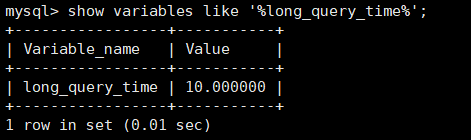

这里如果我们想把时间缩短，比如设置为 1 秒，可以这样设置：

```mysql
# 测试发现：设置global的方式对当前session的long_query_time失效。对新连接的客户端有效。所以可以一并执行下述语句
mysql> set global long_query_time = 1 ;
mysql> show global variables like '%long-query_time%';

# 即更改global 也更改了session变量
mysql> set long_query_time=1;
mysql> show variables like '%long_query_time%';  
```


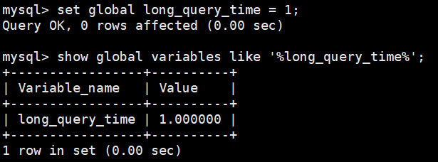

**补充:配置文件中一并设置参数**

如下的方式相较于前面的命令行方式，可以看作是永久设置的方式。

修改`my.cnf`文件，`[mysqld]下`增加或修改参数`long_query_time`、`slow_query_log`和`slow_query_log_file`后，然后重启MySQL服务器。

```properties
[mysqld]
slow_query_log=ON #开启慢查询日志的开关
slow_query_log_file=/var/lib/mysql/my-slow.log #慢查询日志的目录和文件名信息
long_query_time=3 #设置慢查询的阈值为3秒，超出此设定值的SQL即被记录到慢查询日志
log_output=FILE
```

如果不指定存储路径，慢查询日志将默认存储到MySQL数据库的数据文件夹下。如果不指定文件名，默认文件名为hostname-slow.log。


#### 4.2 查看慢查询数目

查询当前系统中有多少条慢查询记录  

```mysql
SHOW GLOBAL STATUS LIKE '%Slow_queries%';
```


#### 4.3 案例演示

**步骤1. 建表**  

```mysql
CREATE TABLE `student` (
	`id` INT(11) NOT NULL AUTO_INCREMENT,
	`stuno` INT NOT NULL ,
	`name` VARCHAR(20) DEFAULT NULL,
	`age` INT(3) DEFAULT NULL,
	`classId` INT(11) DEFAULT NULL,
	PRIMARY KEY (`id`)
) ENGINE=INNODB AUTO_INCREMENT=1 DEFAULT CHARSET=utf8;
```

**步骤2：设置参数 log_bin_trust_function_creators**  

创建函数，假如报错：

```mysql
This function has none of DETERMINISTIC......
```

命令开启：允许创建函数设置：

```mysql
set global log_bin_trust_function_creators=1; # 不加global只是当前窗口有效。
```

**步骤3：创建函数**

随机产生字符串：（同上一章）

```mysql
DELIMITER //
CREATE FUNCTION rand_string(n INT)
	RETURNS VARCHAR(255) #该函数会返回一个字符串
BEGIN
    DECLARE chars_str VARCHAR(100) DEFAULT
    	'abcdefghijklmnopqrstuvwxyzABCDEFJHIJKLMNOPQRSTUVWXYZ';
    DECLARE return_str VARCHAR(255) DEFAULT '';
    DECLARE i INT DEFAULT 0;
	WHILE i < n DO
        	SET return_str =CONCAT(return_str,SUBSTRING(chars_str,FLOOR(1+RAND()*52),1));
        	SET i = i + 1;
	END WHILE;
	RETURN return_str;
END //
DELIMITER ;

#测试
SELECT rand_string(10);
```

产生随机数值：（同上一章）

```mysql
DELIMITER //
CREATE FUNCTION rand_num (from_num INT ,to_num INT) RETURNS INT(11)
BEGIN
	DECLARE i INT DEFAULT 0;
	SET i = FLOOR(from_num +RAND()*(to_num - from_num+1)) ;
	RETURN i;
END //
DELIMITER ;

#测试：
SELECT rand_num(10,100);
```

**步骤4：创建存储过程**

```mysql
DELIMITER //
CREATE PROCEDURE insert_stu1( `start` INT , max_num INT)
BEGIN
DECLARE i INT DEFAULT 0;
    SET autocommit = 0; #设置手动提交事务
    REPEAT #循环
    	SET i = i + 1; #赋值
    	INSERT INTO student (stuno, NAME ,age ,classId ) VALUES
    	((`start`+i), rand_string(6),rand_num(10,100),rand_num(10,1000));
    UNTIL i = max_num
    END REPEAT;
    COMMIT; #提交事务
END //

DELIMITER ;
```

**步骤5：调用存储过程**

```mysql
#调用刚刚写好的函数, 4000000条记录,从100001号开始
CALL insert_stu1(100001, 4000000);
```


#### 4.4 测试及分析

**1.测试**

```mysql
mysql> SELECT * FROM student WHERE stuno = 3455655;
+------------+-----------+----------+-------+---------+
|    id      |  stuno    |  name    |  age | classId  |
+------------+-----------+----------+------+----------+
| 3523633    | 3455655   | oQmLUr   |  19  |    39    |
+------------+-----------+----------+------+----------+
1 row in set (2.09 sec)

mysql> SELECT * FROM student WHERE name = 'oQmLUr';
+-----------+------------+------------+-------+----------+
|    id     |  stuno     |  name      |  age  | classId  |
+-----------+------------+------------+-------+----------+
| 1154002   | 1243200    | OQMlUR     |  266  |   28     |
| 1405708   | 1437740    | OQMlUR     |  245  |   439    |
| 1748070   | 1680092    | OQMlUR     |  240  |   414    |
| 2119892   | 2051914    | oQmLUr     |  17   |   32     |
| 2893154   | 2825176    | OQMlUR     |  245  |   435    |
| 3523633   | 3455655    | oQmLUr     |  19   |   39     |
+-----------+------------+------------+-------+----------+
6 rows in set (2.39 sec)
```

从上面的结果可以看出来，查询学生编号为“3455655”的学生信息花费时间为2.09秒。查询学生姓名为“oQmLUr”的学生信息花费时间为2.39秒。已经达到了秒的数量级，说明目前查询效率是比较低的，下面的小节我们分析一下原因。


**2.分析**

```mysql	
show status like 'slow_queries';
```

> **补充说明:**
>
> 除了上述变量，控制慢查询日志的还有一个系统变量:`min_examined_row_limit`。这个变量的意思是，查询`扫描过的最少记录数`。这个变量和查询执行时间，共同组成了判别一个查询是否是慢查询的条件。如果查询扫描过的记录数大于等于这个变量的值，并且查询执行时间超过long_query_time的值，那么，这个查询就被记录到慢查询日志中; 反之，则不被记录到慢查询日志中。
>
> ```mysql
> mysql> show variables like 'min%';
> +--------------------------------+-------+
> | Variable_name                  | Value |
> +--------------------------------+-------+
> | min_examined_row_limit         | 0     |
> +--------------------------------+-------+
> 1 row in set (0.00 sec)
> ```
>
> 这个值默认是0。与long_query_time=10合在一起，表示只要查询的执行时间超过10秒钟，哪怕一个记录也没有扫描过，都要被记录到慢查询日志中。你也可以根据需要，通过修改“my.ini"文件，来修改查询时长，或者通过SET指令，用SQL语句修改“min_examined_row_limit”的值。


#### 4.5 慢查询日志分析工具：mysqldumpslow

在生产环境中，如果要手工分析日志，查找、分析SQL，显然是个体力活，MySQL提供了日志分析工具`mysqldumpslow`。

查看mysqldumpslow的帮助信息  

```mysql
mysqldumpslow --help
```

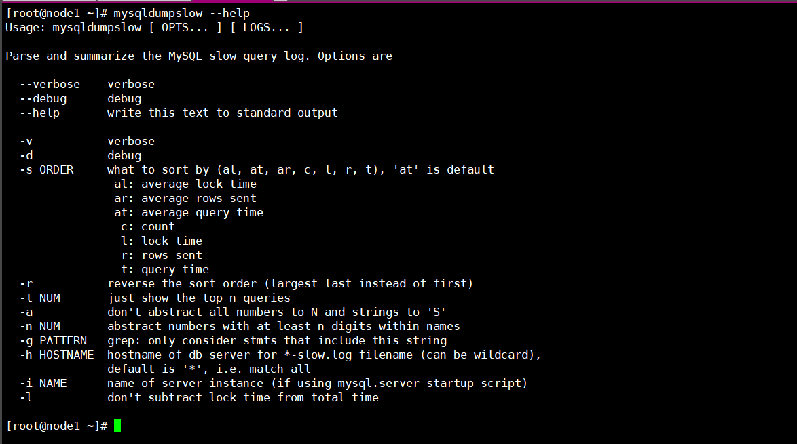

mysqldumpslow 命令的具体参数如下：

- -a: 不将数字抽象成N，字符串抽象成S
- **-s: 是表示按照何种方式排序：**
  - c: 访问次数
  - l: 锁定时间
  - r: 返回记录
  - **t: 查询时间**
  - al：平均锁定时间
  - ar：平均返回记录数
  - at：平均查询时间 （默认方式）
  - ac：平均查询次数
- **-t: 即为返回前面多少条的数据；**  
- **-g: 后边搭配一个正则匹配模式，大小写不敏感的**  

举例：我们想要按照查询时间排序，查看前五条 SQL 语句，这样写即可：

```mysql	
mysqldumpslow -s t -t 5 /var/lib/mysql/atguigu01-slow.log
```

```bash
[root@bogon ~]# mysqldumpslow -s t -t 5 /var/lib/mysql/atguigu01-slow.log

Reading mysql slow query log from /var/lib/mysql/atguigu01-slow.log
Count: 1 Time=2.39s (2s) Lock=0.00s (0s) Rows=13.0 (13), root[root]@localhost
	SELECT * FROM student WHERE name = 'S'

Count: 1 Time=2.09s (2s) Lock=0.00s (0s) Rows=2.0 (2), root[root]@localhost
	SELECT * FROM student WHERE stuno = N
	
Died at /usr/bin/mysqldumpslow line 162, <> chunk 2.
```

**工作常用参考：**

```mysql
#得到返回记录集最多的10个SQL
mysqldumpslow -s r -t 10 /var/lib/mysql/atguigu-slow.log

#得到访问次数最多的10个SQL
mysqldumpslow -s c -t 10 /var/lib/mysql/atguigu-slow.log

#得到按照时间排序的前10条里面含有左连接的查询语句
mysqldumpslow -s t -t 10 -g "left join" /var/lib/mysql/atguigu-slow.log

#另外建议在使用这些命令时结合 | 和more 使用 ，否则有可能出现爆屏情况
mysqldumpslow -s r -t 10 /var/lib/mysql/atguigu-slow.log | more
```


#### 4.6 关闭慢查询日志

**除了调优需要开，正常还是不要开了**

MySQL服务器停止慢查询日志功能有两种方法：

**方式1：永久性方式**

修改my.cnf或者my.ini文件,把[mysqld]组下的slow_query_log值设置为OFF，修改保存后，再重启MySQL服务，即可生效；

```properties
[mysqld]
slow_query_log=OFF
```

或者，把slow_query_log一项注释掉或删除

```properties
[mysqld]
#slow_query_log =OFF
```

重启MySQL服务，执行如下语句查询慢日志功能。

```mysql
SHOW VARIABLES LIKE '%slow%'; #查询慢查询日志所在目录
SHOW VARIABLES LIKE '%long_query_time%'; #查询超时时长
```


**方式2：临时性方式**  

使用SET语句来设置。 

1. 停止MySQL慢查询日志功能，具体SQL语句如下。  

```mysql
SET GLOBAL slow_query_log=off;
```

2. **重启MySQL服务**，使用SHOW语句查询慢查询日志功能信息，具体SQL语句如下

```mysql
SHOW VARIABLES LIKE '%slow%';
#以及
SHOW VARIABLES LIKE '%long_query_time%';
```


#### 4.7 删除慢查询日志

```mysql
mysql> show variables like '%slow_query_log%';
+-------------------------+----------------------------------+
| Variable_name           | Value                            |
+-------------------------+----------------------------------+
| slow_query_log          | OFF                              |
| slow_query_log_file     | /var/lib/mysql/my-slow.log       |
+-------------------------+----------------------------------+
2 rows in set (0.07 sec)
```

从执行结果可以看出，慢查询日志的目录默认为MySQL的数据目录，在该目录下`手动删除慢查询日志文件`即可。

使用命令`mysqladmin flush-logs`来重新生成查询日志文件，具体命令如下，执行完毕会在数据目录下重新生成慢查询日志文件。

```mysql
# 不使用这个命令，没办法自己创建
mysqladmin -uroot -p flush-logs slow 

## 这个命令可以重置其他日志 例如undo日志
```

> 提示
>
> 慢查询日志都是使用`mysqladmin flush-logs`命令来删除重建的。使用时-定要注意，一旦执行了这个命令，慢查询日志都只存在新的日志文件中，如果需要旧的查询日志，就必须事先备份。


### 5 查看SQL执行成本：SHOW PROFILE

`show profile`在《逻辑架构》章节中讲过，这里作为复习。

Show Profile是MySQL提供的可以用来分析当前会话中SQL都做了什么、执行的资源消耗情况的工具，可用于sql调优的测量。`默认情况下处于关闭状态`，并保存最近15次的运行结果。

我们可以在会话级别开启这个功能

```mysql
mysql> show variables like 'profiling';
+--------------------+---------+
| Variable_name      | Value   |
+--------------------+---------+
| profiling          | OFF     |
+--------------------+---------+
1 row in set (0.34 sec)
```

通过设置 `profiling='ON’` 来开启 show profile：

```mysql
mysql> set profiling = 'ON';
Query OK, 0 rows affected, 1 warning (0.06 sec)

mysql> show variables like 'profiling';
+--------------------+---------+
| Variable_name      | Value   |
+--------------------+---------+
| profiling          | ON      |
+--------------------+---------+
1 row in set (0.34 sec)
```

然后执行相关的查询语句。接着看下当前会话都有哪些 profiles，使用下面这条命令：  

```mysql
mysql> show profiles;
+-------------+---------------+--------------------------------------------+
| Query_ID    |   Duration    | Query                                      |
+-------------+---------------+--------------------------------------------+
|           1 | 0.13515975    | show variables like 'profiling'            |
|           2 | 0.06386950    | select * from student_info limit 10        |
+-------------+---------------+--------------------------------------------+
2 rows in set, 1 warning (0.01 sec)
```

你能看到当前会话一共有 2 个查询。如果我们想要查看最近一次查询的开销，可以使用：

```mysql
mysql> show profile;
```

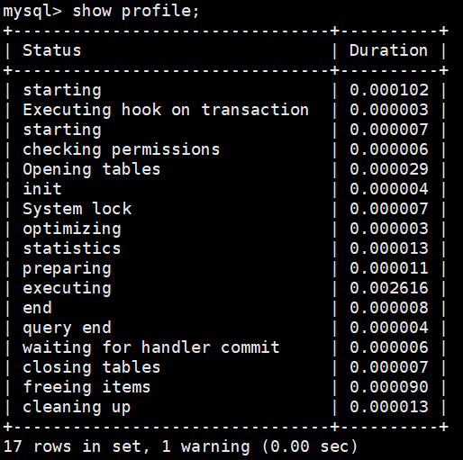

我们也可以查看指定的Query lD的开销，比如`show profile for query 2`查询结果是一样的。在SHOWPROFILE中我们可以查看不同部分的开销，比如cpu、block.io等:

```mysql
mysql> show profile cpu, block io for query 2;
```

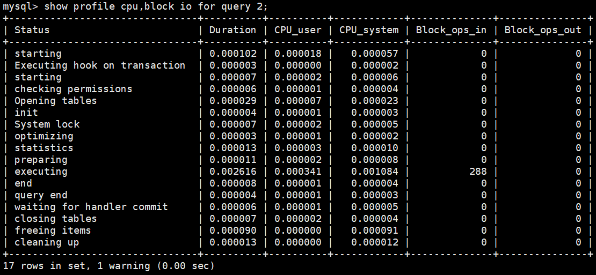

> 如果是executing比较长就可能是代码哪里没写好，使用explain继续查询问题

**show profile的常用查询参数：**

1. ALL：显示所有的开销信息。 

2. BLOCK IO：显示块IO开销。

3. CONTEXT SWITCHES：上下文切换开销。 

4. CPU：显示CPU开销信息。 

5. IPC：显示发送和接收开销信息。 

6. MEMORY：显示内存开销信息。 

7. PAGE FAULTS：显示页面错误开销信息。 

8. SOURCE：显示和Source_function，Source_file，Source_line相关的开销信息。 

9. SWAPS：显示交换次数开销信息。


**日常开发需注意的结论:**

1. `converting HEAP to MyISAM`：查询结果太大，内存不够，数据往磁盘上搬了。
2. `creating tmp table`：创建临时表。先拷贝数据到临时表，用完后再删除临时表。
3. `Copying to tmp table on disk`：把内存中临时表复制到磁盘上，警惕!
4. `locked`。

如果在show profile诊断结果中出现了以上4条结果中的任何一条，则sql语句需要优化。

**注意:**

不过`SHOW PROFILE`命令将被弃用，我们可以从information_schema中的profiling数据表进行查看。


### 6 分析查询语句：EXPLAIN

#### 6.1 概述

**定位了查询慢的SQL之后，我们就可以使用EXPLAIN或DESCRIBE工具做针对性的分析查询语句。**DESCRIBE语句的使用方法与EXPLAIN语句是一样的，并且分析结果也是一样的。

MySQL中有专门负责优化SELECT语句的优化器模块，主要功能: 通过计算分析系统中收集到的统计信息，为客户端请求的Query提供它认为最优的`执行计划`（他认为最优的数据检索方式，但不见得是DBA认为是最优的，这部分最耗费时间)。

这个执行计划展示了接下来具体执行查询的方式，比如多表连接的顺序是什么，对于每个表采用什么访问方法来具体执行查询等等。MySQL为我们提供了`EXPLAIN`语句来帮助我们查看某个查询语句的具体执行计划，大家看懂`EXPLAIN`语句的各个输出项，可以有针对性的提升我们查询语句的性能。

**EXPLAIN能做什么?**

- 表的读取顺序
- 数据读取操作的操作类型
- 哪些索引可以使用
- **哪些索引被实际使用**
- 表之间的引用
- **每张表有多少行被优化器查询**

**官网介绍**

https://dev.mysql.com/doc/refman/5.7/en/explain-output.html

https://dev.mysql.com/doc/refman/8.0/en/explain-output.html  

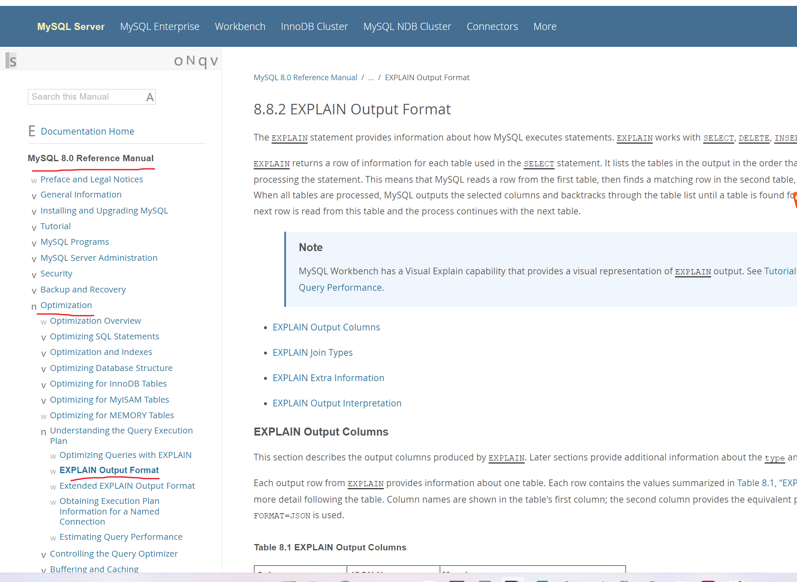

**版本情况**

- MySQL5.6.3以前只能`EXPLAIN SELECT`；MYSQL5.6.3以后就可以 `EXPLAIN SELECT`，`UPDATE`，`DELETE`
- 在5.7以前的版本中，想要显示`partitions` 需要使用`explain partitions`命令；想要显示`filtered`需要使用 `explain extended` 命令。在5.7版本后，默认explain直接显示partitions和filtered中的信息。

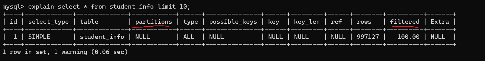


#### 6.2 基本语法

EXPLAIN 或 DESCRIBE语句的语法形式如下：

```mysql
EXPLAIN SELECT select_options
# 或者 两个是一样的
DESCRIBE SELECT select_options
```

如果我们想看看某个查询的执行计划的话，可以在具体的查询语句前边加一个`EXPLAIN` ，就像这样：

```mysql
mysql> EXPLAIN SELECT 1;
```

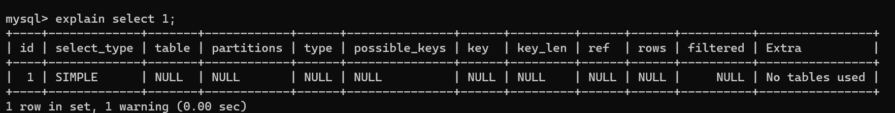

`EXPLAIN` 语句输出的各个列的作用如下：

| 列名            | 描述                                                     |
| --------------- | -------------------------------------------------------- |
| `id`            | 在一个大的查询语句中每个SELECT关键字都对应一个`唯一的id` |
| `select_type`   | SELECT关键字对应的那个查询的类型                         |
| `table`         | 表名                                                     |
| `partitions`    | 匹配的分区信息                                           |
| `type`          | 针对单表的访问方法（重要）                               |
| `possible_keys` | 可能用到的索引                                           |
| `key`           | 实际上使用的索引                                         |
| `key_len`       | 实际使用到的索引长度                                     |
| `ref`           | 当使用索引列等值查询时，与索引列进行等值匹配的对象信息   |
| `rows`          | 预估的需要读取的记录条数                                 |
| `filtered`      | 某个表经过搜索条件过滤后剩余记录条数的百分比             |
| `Extra`         | 一些额外的信息                                           |

在这里把它们都列出来只是为了描述一个轮廓，让大家有一个大致的印象。

#### 6.3 数据准备

**1.建表**

```mysql
CREATE TABLE s1 (
	id INT AUTO_INCREMENT,
	key1 VARCHAR(100), 
	key2 INT, 
	key3 VARCHAR(100), 
	key_part1 VARCHAR(100),
	key_part2 VARCHAR(100),
	key_part3 VARCHAR(100),
	common_field VARCHAR(100),
	PRIMARY KEY (id),
	INDEX idx_key1 (key1),
	UNIQUE INDEX idx_key2 (key2),
	INDEX idx_key3 (key3),
	INDEX idx_key_part(key_part1, key_part2, key_part3)
) ENGINE=INNODB CHARSET=utf8;
```

```mysql
CREATE TABLE s2 (
    id INT AUTO_INCREMENT,
    key1 VARCHAR(100),
    key2 INT,
    key3 VARCHAR(100),
    key_part1 VARCHAR(100),
    key_part2 VARCHAR(100),
    key_part3 VARCHAR(100),
    common_field VARCHAR(100),
    PRIMARY KEY (id),
    INDEX idx_key1 (key1),
    UNIQUE INDEX idx_key2 (key2),
    INDEX idx_key3 (key3),
    INDEX idx_key_part(key_part1, key_part2, key_part3)
) ENGINE=INNODB CHARSET=utf8;
```


**2. 设置参数 log_bin_trust_function_creators**

创建函数，假如报错，需开启如下命令：允许创建函数设置：

```mysql
set global log_bin_trust_function_creators=1; # 不加global只是当前窗口有效。
```


**3. 创建函数**

```mysql
DELIMITER //
CREATE FUNCTION rand_string1 ( n INT ) 
	RETURNS VARCHAR ( 255 ) #该函数会返回一个字符串
BEGIN
	DECLARE
		chars_str VARCHAR ( 100 ) DEFAULT 'abcdefghijklmnopqrstuvwxyzABCDEFJHIJKLMNOPQRSTUVWXYZ';
	DECLARE
		return_str VARCHAR ( 255 ) DEFAULT '';
	DECLARE
		i INT DEFAULT 0;
	WHILE i < n DO
		SET return_str = CONCAT(return_str, SUBSTRING(chars_str, FLOOR(1+RAND ()* 52), 1));
		SET i = i + 1;
	END WHILE;
	RETURN return_str;
END // 
DELIMITER ;
```


**4. 创建存储过程**

创建往s1表中插入数据的存储过程：  

```mysql
DELIMITER //
CREATE PROCEDURE insert_s1 (IN min_num INT (10), IN max_num INT (10))
BEGIN
    DECLARE i INT DEFAULT 0;
    SET autocommit = 0;
    REPEAT
    	SET i = i + 1;
    	INSERT INTO s1 VALUES(
    		(min_num + i),
    		rand_string1(6),
    		(min_num + 30 * i + 5),
    		rand_string1(6),
    		rand_string1(10),
    		rand_string1(5),
    		rand_string1(10),
    		rand_string1(10)
        	);
    UNTIL i = max_num
    END REPEAT;
    COMMIT;
END //
DELIMITER ;
```

创建往s2表中插入数据的存储过程：  

```mysql
DELIMITER //
CREATE PROCEDURE insert_s2 (IN min_num INT ( 10 ), IN max_num INT ( 10 )) 
BEGIN
	DECLARE i INT DEFAULT 0;
	SET autocommit = 0;
	REPEAT
 	 SET i = i + 1;
		INSERT INTO s2 VALUES(
				( min_num + i ),
				rand_string1 ( 6 ),
				( min_num + 30 * i + 5 ),
				rand_string1 ( 6 ),
				rand_string1 ( 10 ),
				rand_string1 ( 5 ),
				rand_string1 ( 10 ),
				rand_string1 ( 10 ));
	UNTIL i = max_num 
	END REPEAT;
	COMMIT;
END // 
DELIMITER ;
```

**5. 调用存储过程**

s1表数据的添加：加入1万条记录：

```mysql
CALL insert_s1(10001,10000); # id 10002~20001
```

s2表数据的添加：加入1万条记录：

```mysql
CALL insert_s2(10001,10000);# id 10002~20001
```


#### 6.4 EXPLAIN各列作用

为了让大家有比较好的体验，我们调整了下`EXPLAIN`输出列的顺序。

##### 6.4.1 table

表名

不论我们的查询语句有多复杂，里边儿`包含了多少个表`，到最后也是需要对每个表进行`单表访问`的，所以MySQL规定**EXPLAIN语句输出的每条记录都对应着某个单表的访问方法**，该条记录的table列代表着该表的表名（有时不是真实的表名字，可能是简称）

```mysql
# table：表名
# 查询的每一行记录都对应着一个单表
explain select count(*) from s1;
```

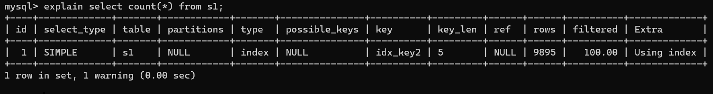

```mysql
#s1:驱动表  s2:被驱动表
EXPLAIN SELECT * FROM s1 INNER JOIN s2;
# 驱动表和被驱动表是优化器决定的，他认为哪个比较好久用哪个
```

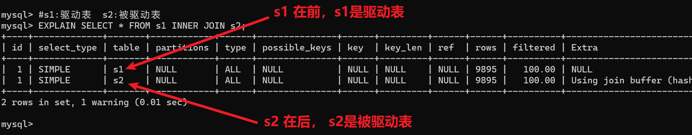

> 用到多少个表，就会有多少条记录


##### 6.4.2 id

我们写的查询语句一般都以`SELECT`关键字开头，比较简单的查询语句里只有一个`SELECT`关键字，比如下边这个查询语句：

```mysql
SELECT * FROM s1 WHERE key1 = 'a';
```

稍微复杂一点的连接查询中也只有一个`SELECT`关键字，比如：

```mysql
SELECT * FROM s1 INNER JOIN s2
ON s1.key1 = s2.key1
WHERE s1.common_field = 'a';
```


**查询语句中每出现一个`SELECT`关键字，MySQL就会为它分配一个唯一的`id`值**。这个`id`值就是`EXPLAIN`语句的第一个列，比如下边这个查询中只有一个`SELECT`关键字，所以`EXPLAIN`的结果中也就只有一条`id`列为`1`的记录:

```mysql
mysql> EXPLAIN SELECT * FROM s1 WHERE key1 = 'a';
```

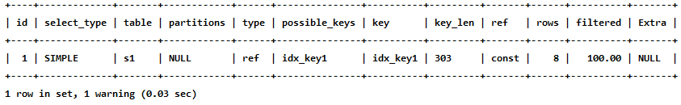

对于连接查询来说，一个`SELECT`关键字后边的`FROM`子句中可以跟随多个表，所以在连接查询的执行计划中，每个表都会对应一条记录，但是这些记录的id值都是相同的，比如:

```mysql
mysql> EXPLAIN SELECT * FROM s1 INNER JOIN s2;
```

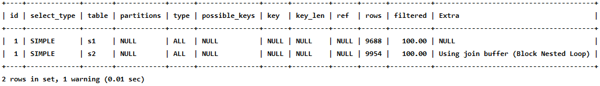

可以看到，上述连接查询中参与连接的s1和s2表分别对应一条记录，但是这两条记录对应的`id值都是1`。这里需要大家记住的是，**在连接查询的执行计划中，每个表都会对应一条记录，这些记录的id列的值是相同的**，出现在前边的表表示`驱动表`，出现在后边的表表示`被驱动表`。所以从上边的EXPLAIN输出中我们可以看出，查询优化器准备让s1表作为驱动表，让s2表作为被驱动表来执行查询。

对于包含子查询的查询语句来说，就可能涉及多个`SELECT`关键字，所以在**包含子查询的查询语句的执行计划中，每个`SELECT`关键字都会对应一个唯一的`id`值**，比如这样：

```mysql
mysql> EXPLAIN SELECT * FROM s1 WHERE key1 IN (SELECT key1 FROM s2) OR key3 = 'a';
```

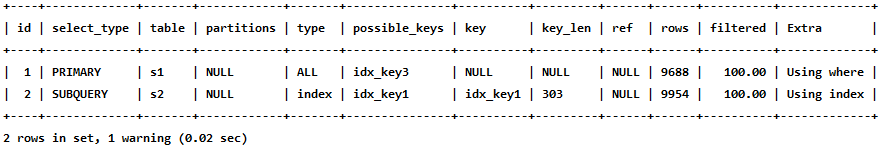

从输出结果中我们可以看到，s1表在外层查询中，外层查询有一个独立的`SELECT`关键字，所以第一条记录的id值就是1, s2表在子查询中，子查询有一个`独立的SELECT关键字`，所以第二条记录的id值就是2。

但是这里大家需要特别注意，**查询优化器可能对涉及子查询的查询语句进行重写，从而转换为连接查询**。所以如果我们想知道查询优化器对某个包含子查询的语句是否进行了重写，直接查看执行计划就好了，比如说:

```mysql
 # 查询优化器可能对涉及子查询的查询语句进行重写, 转变为多表查询的操作
 EXPLAIN SELECT * FROM s1 WHERE key1 IN (SELECT key2 FROM s2 WHERE common_field = 'a');
```

运行结果：id 只有一个，原因是查询优化器做了优化

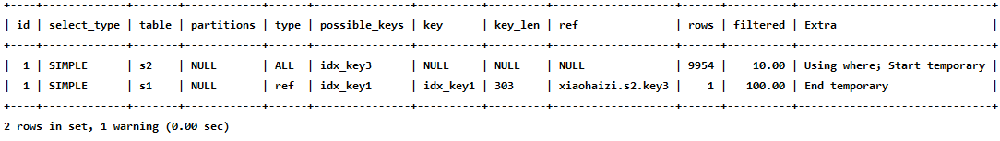

可以看到，虽然我们的查询语句是一个子查询，但是执行计划中s1和s2表对应的记录的`id`值全部是1，这就表明了`查询优化器将子查询转换为了连接查询`。

对于包含`UNION`子句的查询语句来说，每个`SELECT`关键字对应一个`id`值也是没错的，不过还是有点儿特别的东西，比方说下边这个查询: 

```mysql
# Union去重
# union 去重，union all 不去重
EXPLAIN SELECT * FROM s1 UNION SELECT * FROM s2;
```

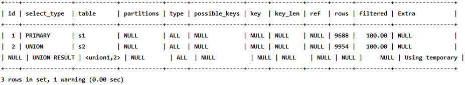

这个语句的执行计划的第三条记录是什么？为何`id`值是`NULL`，而且table列也很奇怪? `UNION`！它会把多个查询的结果集合并起来并对结果集中的记录`进行去重`，怎么去重呢? MySQL使用的是内部的`临时表`。正如上边的查询计划中所示，UNION子句是为了把id为1的查询和id为2的查询的结果集合并起来并去重，所以在内部创建了一个名为`<union1，2>`的临时表(就是执行计划第三条记录的table列的名称)，id为`NULL`表明这个临时表是为了合并两个查询的结果集而创建的。

跟UNION对比起来，`UNION ALL`就不需要为最终的结果集进行去重，它只是单纯的把多个查询的结果集中的记录合并成一个并返回给用户，所以也就不需要使用临时表。所以在包含`UNION ALL`子句的查询的执行计划中，就没有那个id为NULL的记录，如下所示:

```mysql
# union all 不去重  所以不需要放在临时表里面
mysql> EXPLAIN SELECT * FROM s1 UNION ALL SELECT * FROM s2;
```

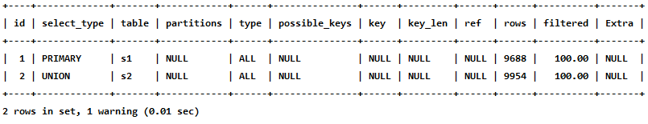

**小结:**  

- **id如果相同，可以认为是一组，从上往下顺序执行**
- **在所有组中，id值越大，优先级越高，越先执行**
- **关注点：id号每个号码，表示一趟独立的查询, 一个sql的查询趟数越少越好**


##### 6.4.3 select_type

一条大的查询语句里边可以包含若干个SELECT关键字，`每个SELECT关键字代表着一个小的查询语句`，而每个SELECT关键字的FROM子句中都可以包含若干张表(这些表用来做连接查询)，`每一张表都对应着执行计划输出中的一条记录`，对于在同一个SELECT关键字中的表来说，它们的id值是相同的。

MySQL为每一个SELECT关键字代表的小查询都定义了一个称之为`select_type`的属性，意思是我们只要知道了某个小查询的`select_type属性`，就知道了这个`小查询在整个大查询中扮演了一个什么角色`，我们看一下
`select_type`都能取哪些值，请看官方文档：

| **名称**               | **描述**                                                     |
| ---------------------- | ------------------------------------------------------------ |
| SIMPLE                 | Simple SELECT (not using UNION or subqueries)                |
| PRIMARY                | Outermost SELECT                                             |
| UNION                  | Second or later SELECT statement in a UNION                  |
| UNION RESULT           | Result of a UNION                                            |
| SUBQUERY               | First SELECT in subquery                                     |
| DEPENDENT     SUBQUERY | First SELECT in subquery, dependent on outer query           |
| DEPENDENT UNION        | Second or later SELECT statement in a UNION, dependent on outer query |
| DERIVED                | Derived table                                                |
| MATERIALIZED           | Materialized subquery                                        |
| UNCACHEABLE SUBQUERY   | A subquery for which the result cannot be cached and must be re-evaluated for each row of the outer query |
| UNCACHEABLE UNION      | The second or later select in a UNION that belongs to an uncacheable  subquery (see UNCACHEABLE SUBQUERY) |

- `SIMPLE`

查询语句中不包含`UNION`或者`子查询`的查询都算作是`SIMPLE`类型，比方说下边这个单表查询的`select_type`的值就是`SIMPLE`；

```mysql
 # 查询语句中不包含`UNION`或者子查询的查询都算作是`SIMPLE`类型
 EXPLAIN SELECT * FROM s1;
 
  #连接查询也算是`SIMPLE`类型
 EXPLAIN SELECT * FROM s1 INNER JOIN s2;
```

- `PRIMARY` 与 `UNION`与 `UNION RESULT`

  MySQL选择使用临时表来完成`UNION`查询的去重工作，针对该临时表的查询的`select_type`就是`UNION RESULT`，例子上边有。

  ```mysql
  #对于包含`UNION`或者`UNION ALL`或者子查询的大查询来说，它是由几个小查询组成的，其中最左边的那个查询的`select_type`值就是`PRIMARY`
  
  #对于包含`UNION`或者`UNION ALL`的大查询来说，它是由几个小查询组成的，其中除了最左边的那个小查询以外，其余的小查询的`select_type`值就是`UNION`
  
  #`MySQL`选择使用临时表来完成`UNION`查询的去重工作，针对该临时表的查询的`select_type`就是`UNION RESULT` 	
  ```
  
  测试sql:

  ```mysql
 EXPLAIN SELECT * FROM s1 UNION SELECT * FROM s2;
  ```
  
  

  ```mysql
EXPLAIN SELECT * FROM s1 UNION ALL SELECT * FROM s2;
  ```
  
  

- `SUBQUERY`

  如果包含子查询的查询语句不能够转为对应的`semi-join`的形式，并且该子查询是不相关子查询，并且查询优化器决定采用将该子查询物化的方案来执行该子查询时，该子查询的第个`SELECT`关键字代表的那个查询的`select_type`就是 `SUBQUERY`，比如下边这个查询:

  ```mysql
   #子查询：
   #如果包含子查询的查询语句不能够转为对应的`semi-join`的形式，并且该子查询是不相关子查询。
   #该子查询的第一个`SELECT`关键字代表的那个查询的`select_type`就是`SUBQUERY`
   EXPLAIN SELECT * FROM s1 WHERE key1 IN (SELECT key1 FROM s2) OR key3 = 'a';
  ```

  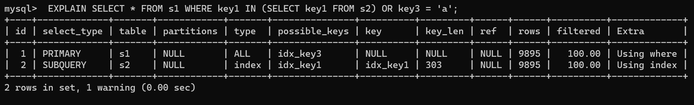

- `DEPENDENT SUBQUERY`

  如果包含子查询的查询语句不能够转为对应的`semi-join`的形式，并且该子查询是相关子查询，则该子查询的第一个`SELECT`关键字代表的那个查询的`select_type`就是`DEPENDENT SUBQUERY`，比如下边这个查询:

  dependent subquery

  ```mysql
   #如果包含子查询的查询语句不能够转为对应的`semi-join`的形式，并且该子查询是相关子查询，
   #则该子查询的第一个`SELECT`关键字代表的那个查询的`select_type`就是`DEPENDENT SUBQUERY`
   EXPLAIN SELECT * FROM s1 
   WHERE key1 IN (SELECT key1 FROM s2 WHERE s1.key2 = s2.key2) OR key3 = 'a';
   #注意的是，select_type为`DEPENDENT SUBQUERY`的查询可能会被执行多次。
  ```

  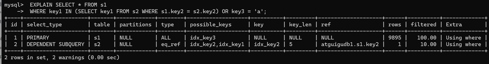

- `DEPENDENT UNION`

  ```mysql
   #在包含`UNION`或者`UNION ALL`的大查询中，如果各个小查询都依赖于外层查询的话，那除了
   #最左边的那个小查询之外，其余的小查询的`select_type`的值就是`DEPENDENT UNION`。
   EXPLAIN SELECT * FROM s1 
   WHERE key1 IN (SELECT key1 FROM s2 WHERE key1 = 'a' UNION SELECT key1 FROM s1 WHERE key1 = 'b');
   
   # 这里优化器会重构成exist
  ```

  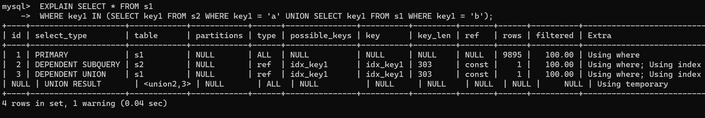

- `DERIVED`

  derived : 衍生，派生

  ```mysql
   #对于包含`派生表`的查询，该派生表对应的子查询的`select_type`就是`DERIVED`
   EXPLAIN SELECT * 
   FROM (SELECT key1, COUNT(*) AS c FROM s1 GROUP BY key1) AS derived_s1 WHERE c > 1;
  ```

  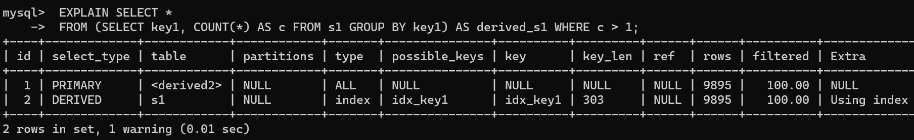

- `MATERIALIZED`

  materialized: 英 [məˈtɪəri:əˌlaɪzd] 具体化

  ```mysql
  #当查询优化器在执行包含子查询的语句时，选择将子查询物化之后与外层查询进行连接查询时，
  #该子查询对应的`select_type`属性就是`MATERIALIZED`
  EXPLAIN SELECT * FROM s1 WHERE key1 IN (SELECT key1 FROM s2); #子查询被转为了物化表 
  ```
  
  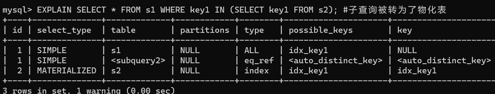
  
  > 不理解： 为啥上面的子查询，没有物化
  >
  > ```mysql
  > EXPLAIN SELECT * FROM s1 WHERE key1 IN (SELECT key1 FROM s2) OR key3 = 'a';
  > # 这个怎么不物化
  > ```
  >
  
- `UNCACHEABLE SUBQUERY`

  不常用，就不多说了。

- `UNCACHEABLE UNION`

  不常用，就不多说了。


##### 6.4.4 partitions (可略)

- 代表分区表中的命中情况，非分区表，该项为NULL。一般情况下我们的查询语句的执行计划的partitions列的值都是NULL。
- https://dev.mysql.com/doc/refman/5.7/en/alter-table-partition-operations.html
- 如果想详细了解，可以如下方式测试。创建分区表：

```mysql
-- 创建分区表，
-- 按照id分区，id<100 p0分区，其他p1分区
CREATE TABLE user_partitions (
    id INT auto_increment,
    NAME VARCHAR(12),
    PRIMARY KEY(id))
    PARTITION BY RANGE(id)(
    	PARTITION p0 VALUES less than(100),
    	PARTITION p1 VALUES less than MAXVALUE);
```

```mysql
DESC SELECT * FROM user_partitions WHERE id>200;
```

查询id大于200（200>100，p1分区）的记录，查看执行计划，partitions是p1，符合我们的分区规则


##### 6.4.5 type ☆

执行计划的一条记录就代表着MySQL对某个表的`执行查询时的访问方法`，又称"访问类型”，其中的`type`列就表明了这个访问方法是啥，是较为重要的一个指标。比如，看到`type`列的值是`ref`，表明MySQL即将使用`ref`访问方法来执行对`s1`表的查询。

完整的访问方法如下：`system`，`const`，`eq_ref`，`ref`，`fulltext`，`ref_or_null`，`index_merge`，`unique_subquery`，`index_subquery`，`range`，`index`，`ALL`。

我们详细解释一下：

- `system`  

  当表中`只有一条记录`并且该表使用的存储引擎的统计数据是精确的，比如MyISAM、Memory，那么对该表的访问方法就是`system`。比方说我们新建一个`MyISAM`表，并为其插入一条记录：

  ```mysql
  mysql> CREATE TABLE t(i int) Engine=MyISAM;
  Query OK, 0 rows affected (0.05 sec)
  
  mysql> INSERT INTO t VALUES(1);
  Query OK, 1 row affected (0.01 sec)
  ```

  然后我们看一下查询这个表的执行计划：

  ```mysql
  mysql> EXPLAIN SELECT * FROM t;
  ```

  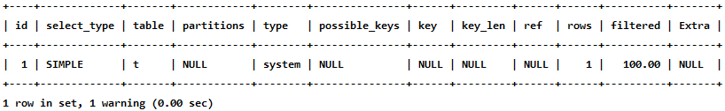

  > 这里如果是innodb会变成ALL，因为innodb系统不会存条数字段。MyISAM会存储这么一个字段。

- `const`

  ```mysql
   #当我们根据主键或者唯一二级索引列与常数进行等值匹配时，对单表的访问方法就是`const`
   EXPLAIN SELECT * FROM s1 WHERE id = 10005;
  ```

  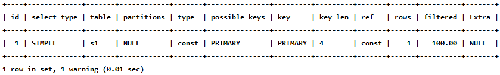

- `eq_ref`

  ```mysql
   #  在连接查询时，如果被驱动表是通过主键或者唯一二级索引列等值匹配的方式进行访问的
   #（如果该主键或者唯一二级索引是联合索引的话，所有的索引列都必须进行等值比较），则
   #  对该被驱动表的访问方法就是`eq_ref`
   EXPLAIN SELECT * FROM s1 INNER JOIN s2 ON s1.id = s2.id;
  ```

  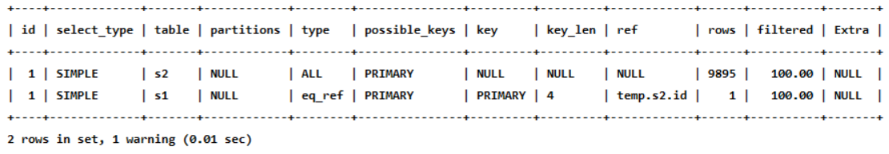

  从执行计划的结果中可以看出，MySQL打算将s2作为驱动表，s1作为被驱动表，重点关注s1的访问方法是`eq_ref`，表明在访问s1表的时候可以`通过主键的等值匹配`来进行访问。
  
- `ref`

  ```mysql
   #当通过普通的二级索引列与常量进行等值匹配时来查询某个表，那么对该表的访问方法就可能是`ref`
   EXPLAIN SELECT * FROM s1 WHERE key1 = 'a';
  ```

  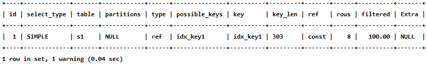

  > tips: 类型相同才可以走索引
  >
  > ```mysql
  > EXPLAIN SELECT * FROM s1 WHERE key2 = 10066;
  > # 这个是不会走索引的 因为key2 是字符串
  > # 类型不一样，mysql会加函数，进行隐式转换，一旦加上函数，就不会走索引了。
  > ```

- `fulltext`

  全文索引

  

- `ref_or_null`

  ```mysql
   #当对普通二级索引进行等值匹配查询，该索引列的值也可以是`NULL`值时，那么对该表的访问方法
   #就可能是`ref_or_null`
   EXPLAIN SELECT * FROM s1 WHERE key1 = 'a' OR key1 IS NULL;
  ```

  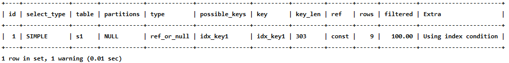

- `index_merge`

  ```mysql
   #单表访问方法时在某些场景下可以使用`Intersection`、`Union`、
   #`Sort-Union`这三种索引合并的方式来执行查询
   EXPLAIN SELECT * FROM s1 WHERE key1 = 'a' OR key3 = 'a';
  ```

  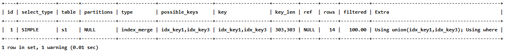

  从执行计划的 `type` 列的值是 `index_merge` 就可以看出，MySQL 打算使用索引合并的方式来执行
  对 `s1` 表的查询。  

- `unique_subquery`

  ```mysql
   #`unique_subquery`是针对在一些包含`IN`子查询的查询语句中，如果查询优化器决定将`IN`子查询
   # 转换为`EXISTS`子查询，而且子查询可以使用到主键进行等值匹配的话，那么该子查询执行计划的`type`
   # 列的值就是`unique_subquery`
   EXPLAIN SELECT * FROM s1 
   WHERE key2 IN (SELECT id FROM s2 WHERE s1.key1 = s2.key1) OR key3 = 'a';
  ```

  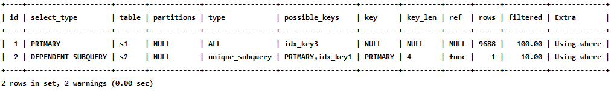

- `index_subquery`

  ```mysql
  EXPLAIN SELECT * FROM s1 WHERE common_field IN (SELECT key3 FROM s2 where
  s1.key1 = s2.key1) OR key3 = 'a';
  ```

  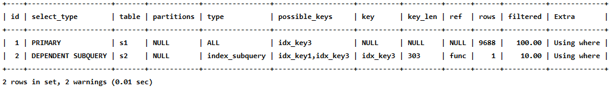

- `range`

  ```mysql
  #如果使用索引获取某些`范围区间`的记录，那么就可能使用到`range`访问方法
  EXPLAIN SELECT * FROM s1 WHERE key1 IN ('a', 'b', 'c');
  ```

  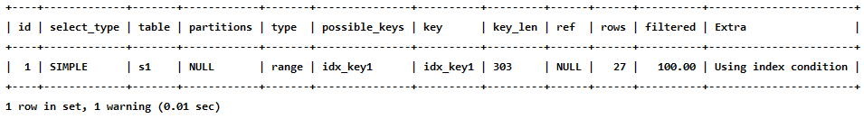

  ```mysql
  #同上
  EXPLAIN SELECT * FROM s1 WHERE key1 > 'a' AND key1 < 'b';
  ```

  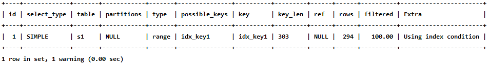

- `index`

  

  ```mysql
  #当我们可以使用索引覆盖，但需要扫描全部的索引记录时，该表的访问方法就是`index`
  EXPLAIN SELECT key_part2 FROM s1 WHERE key_part3 = 'a';
  ```

  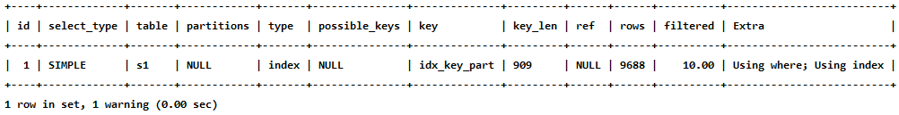

  > 索引覆盖，`INDEX idx_key_part(key_part1, key_part2, key_part3）`这3个构成一个复合索引
  >
  > key_part3 在复合索引里面，查询的字段也在索引里面，干脆就直接遍历索引查出数据
  >
  > 思考：好处，索引存的数据少，数据少页就少，这样可以减少IO。

- `ALL`

  ```mysql
  mysql> EXPLAIN SELECT * FROM s1;
  ```

  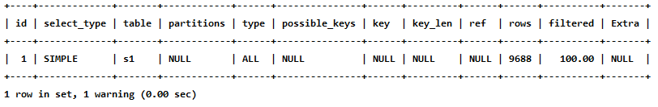

  一般来说，这些访问方法中除了`All`这个访问方法外，其余的访问方法都能用到索引，除了`index_merge`访问方法外，其余的访问方法都最多只能用到一个索引。


**小结:**

**结果值从最好到最坏依次是：**

<font color='grem'>system > const > eq_ref > ref ></font>

<font color='red'>fulltext > ref_or_null > index_merge >unique_subquery > index_subquery > range > </font>

<font color='grebn'>index > ALL </font>

**SQL 性能优化的目标：至少要达到 range 级别，要求是 ref 级别，最好是 consts级别。（阿里巴巴开发手册要求）**  


##### **6.4.6 possible_keys和key**

在EXPLAIN语句输出的执行计划中，`possible_keys`列表示在某个查询语句中，对某个表执行`单表查询时可能用`到的索引有哪些。一般查询涉及到的字段上若存在索引，则该索引将被列出，但不一定被查询使用。`key`列表示`实际用到`的索引有哪些，如果为NULL，则没有使用索引。比方说下边这个查询:


```mysql
mysql> EXPLAIN SELECT * FROM s1 WHERE key1 > 'z' AND key3 = 'a';
```

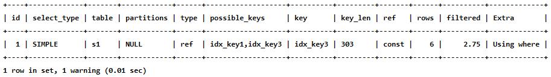

上述执行计划的possible_keys列的值是`idx_key1,idx_key3`，表示该查询可能使用到`idx_key1`, `idx_key3`两个索引，然后key列的值是`idx_key3`，表示经过查询优化器计算使用不同索引的成本后，最后决定使用`idx_key3`。

> 索引只能用一个。所以他要选一个出来用。查看上面`index_merge  ` or 的话  会走索引合并。


##### **6.4.7 key_len ☆**

-  key_len：实际使用到的索引长度(即：字节数)；

-  key_len越小索引效果越好，这是前面学到的；只是，短一点效率更高；
-  **但是在联合索引里面，命中一次key_len加一次长度。越长代表精度越高，效果越好**；
-  主要针对于联合索引，有一定的参考意义。


```mysql
EXPLAIN SELECT * FROM s1 WHERE id = 10005;
## 结果key_len =4
```

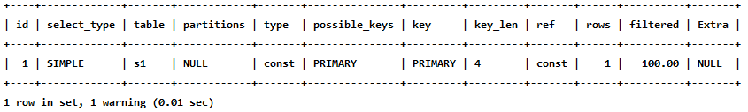


```mysql
mysql> EXPLAIN SELECT * FROM s1 WHERE key2 = 10126;
## 结果key_len = 5
```

key2 是int 类型unique索引。因为还可能有一个null值，所以null占一个字段。4+1=5

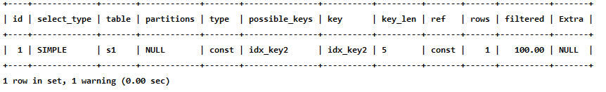


```mysql
mysql> EXPLAIN SELECT * FROM s1 WHERE key1 = 'a';

## 结果key_len = 303 
```

原因： `idx_key_part(key_part1, key_part2, key_part3）`是3个100的字段合起来的。每一个字段可以为空，所以是101*3 = 303

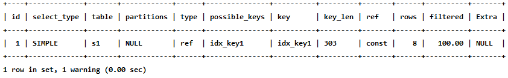


```mysql
mysql> EXPLAIN SELECT * FROM s1 WHERE key_part1 = 'a';
```

结果key_len是303

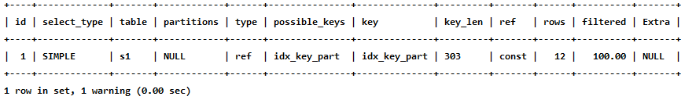


```mysql
mysql> EXPLAIN SELECT * FROM s1 WHERE key_part1 = 'a' AND key_part2 = 'b';
```

结果key_606

**这里命中了两次联合索引，精度更高，效果更好**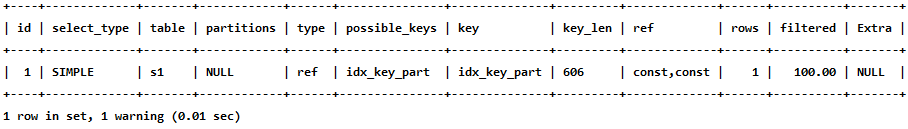


**练习：**

**key_len的长度计算公式：**


```mysql
varchar(10)变长字段且允许NULL = 10 * ( character set：utf8=3,gbk=2,latin1=1)+1(NULL)+2(变长字段)

varchar(10)变长字段且不允许NULL = 10 * ( character set：utf8=3,gbk=2,latin1=1)+2(变长字段)

char(10)固定字段且允许NULL = 10 * ( character set：utf8=3,gbk=2,latin1=1)+1(NULL)

char(10)固定字段且不允许NULL = 10 * ( character set：utf8=3,gbk=2,latin1=1)
```


##### 6.4.8 ref


```mysql
# ref：当使用索引列等值查询时，与索引列进行等值匹配的对象信息。
# 比如只是一个常数或者是某个列。
mysql> EXPLAIN SELECT * FROM s1 WHERE key1 = 'a';
# 类型是type=ref，与const（常量）比较
```

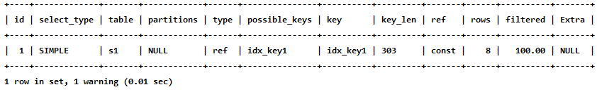


```mysql
mysql> EXPLAIN SELECT * FROM s1 INNER JOIN s2 ON s1.id = s2.id;
# 类型是type =eq_ref ，与 atguigudb1.s1.id  比较
```

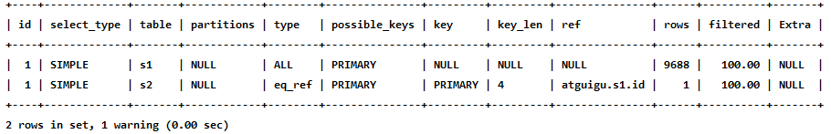


```mysql
mysql> EXPLAIN SELECT * FROM s1 INNER JOIN s2 ON s2.key1 = UPPER(s1.key1);                         
# 与一个方法比较`func`
```

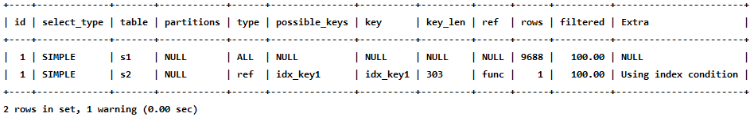


##### 6.4.9 rows ☆


```mysql
 #  rows：预估的需要读取的记录条数
 # `值越小越好`
 # 通常与filtered 一起使用
 EXPLAIN SELECT * FROM s1 WHERE key1 > 'z';
```

rows 值越小，代表，数据越有可能在一个页里面，这样IO就会更小。

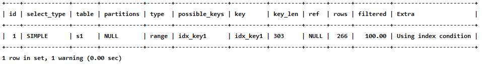


##### 6.4.10 filtered

**越大越好**

filtered 的值指返回结果的行占需要读到的行(rows 列的值)的百分比。

如果使用的是索引执行的单表扫描，那么计算时需要估计出满足除使用到对应索引的搜索条件外的其他搜索条件的记录有多少条。

```mysql
 EXPLAIN SELECT * FROM s1 WHERE key1 > 'z' AND common_field = 'a';
```

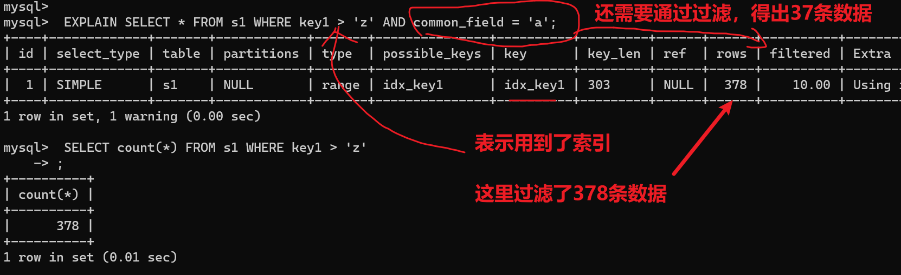

**对于单表查询来说，这个filtered列的值没什么意义**，我们`更关注在连接查询中驱动表对应的执行计划记录的filtered值`，它决定了被驱动表要执行的次数(即：rows * filtered)


```mysql
EXPLAIN SELECT * FROM s1 INNER JOIN s2 ON s1.key1 = s2.key1 WHERE s1.common_field = 'a';
```

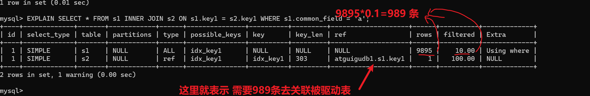


##### 6.4.11 Extra ☆

顾名思义，`Extra`列是用来说明一些额外信息的，包含不适合在其他列中显示但十分重要的额外信息。我们可以通过这些额外信息来`更准确的理解MySQL到底将如何执行给定的查询语句`。MySQL提供的额外信息有好几十个，一下捡重点介绍

- `No tables used` 

  当查询语句的没有FROM子句时将会提示该额外信息，比如:


```mysql
mysql> EXPLAIN SELECT 1;				
```

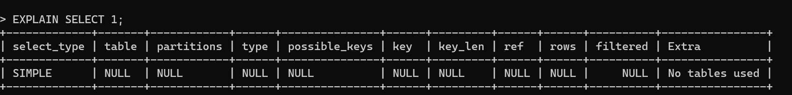

- `Impossible WHERE`

 查询语句的`WHERE`子句永远为`FALSE`时将会提示该额外信息

```mysql
mysql> EXPLAIN SELECT * FROM s1 WHERE 1 != 1;
```

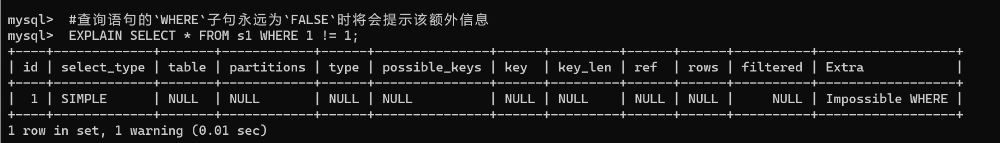

- Using where

  不用读取表中所有信息，仅通过索引就可以获取所需数据，这发生在对表的全部的请求列都是同一个索引的部分的时候，表示mysql服务器将在存储引|擎检索行后再进行过滤。表明使用了where过滤。 
  
  当我们使用全表扫描来执行对某个表的查询，并且该语句的`WHERE`子句中有针对该表的搜索条件时，在`Extra`列中会提示上述额外信息。


```mysql
EXPLAIN SELECT * FROM s1 WHERE common_field = 'a';
```

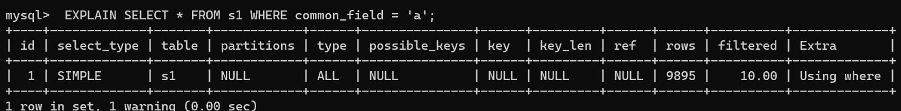

当使用索引访问来执行对某个表的查询，并且该语句的WHERE子句中有除了该索引包含的列之外的其他搜索条件时，在`Extra`列中也会提示上述额外信息。比如下边这个查询虽然使用`idx_key1`索引执行查询，但是搜索条件中除了包含`key1`的搜索条件`key1 = 'a'`，还包含`common_field`的搜索条件，所以`Extra`列会显示`Using where`的提示: 

当条件除了索引，还有其他条件，也会是这个提示

```mysql
 #当使用索引访问来执行对某个表的查询，并且该语句的`WHERE`子句中
 #有除了该索引包含的列之外的其他搜索条件时，在`Extra`列中也会提示上述额外信息。
 explain SELECT * FROM s1 WHERE key1 = 'fUhcQU' and  common_field = 'uDHCOnalcF';
```

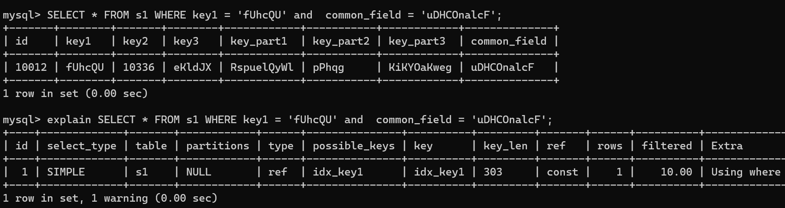

- `No matching min/max row`

当查询列表处有`MIN`或者`MAX`聚合函数，但是并没有符合`WHERE`子句中的搜索条件的记录时，将会提示该额外信息

```mysql
 # 数据库不存在 QLjKYOx
 EXPLAIN SELECT MIN(key1) FROM s1 WHERE key1 = 'QLjKYOx';
```

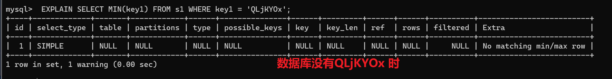

```mysql
 # 数据库存在 QLjKYO
 EXPLAIN SELECT MIN(key1) FROM s1 WHERE key1 = 'QLjKYO';
```

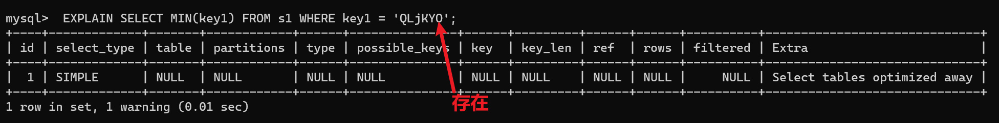

- `Using index`

当我们的查询列表以及搜索条件中只包含属于某个索引的列，也就是在可以使用覆盖索引的情况下，在`Extra`列将会提示该额外信息。

比方说下边这个查询中只需要用到`idx_key1`而不需要回表操作：

```mysql
EXPLAIN SELECT key1 FROM s1 WHERE key1 = 'a';
```

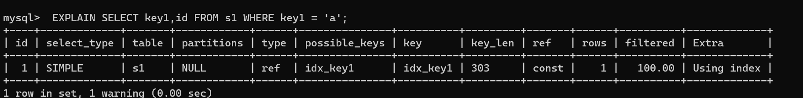

- `Using index condition`

  有些搜索条件中虽然出现了索引列，但却不能使用到索引看课件理解索引条件下推

  ```mysql
  SELECT * FROM s1 WHERE key1 > 'z' AND key1 LIKE '%a';
  mysql> EXPLAIN SELECT * FROM s1 WHERE key1 > 'z' AND key1 LIKE '%a';
  ```

  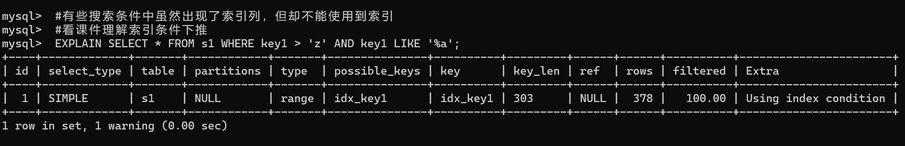

  > 步骤1：这里key1 > 'z' 走了索引，查出了378条数据。
  >
  > 步骤2：key1 LIKE '%a'; 这个条件依然是 key1 索引，所以接下来只要在遍历这378个索引。哪些符合'%a'
  >
  > 步骤3：通过步骤2过滤出了有效索引。这就是`Using index condition`。
  >
  > 步骤4：把符合条件的索引，进行回表查询。

  完整的说明：

  其中的`key1 > 'z'`可以使用到索引，但是`key1 LIKE '%a '`却无法使用到索引，在以前版本的MySQL中，是按照下边步骤来执行这个查询的：

  - 先根据key1 > 'z'这个条件，从二级索引`idx_key1`中获取到对应的二级索引记录。
  - 根据上一步骤得到的二级索引记录中的主键值进行回表，找到完整的用户记录再检测该记录是否符合`key1 LIKE '%a'`这个条件，将符合条件的记录加入到最后的结果集。

  但是虽然`key1 LIKE ‘%a'`不能组成范围区间参与`range`访问方法的执行，但这个条件毕竟只涉及到了`key1`列，所以MySQL把上边的步骤改进了一下:

  - 先根据`key1 > 'z'`这个条件，定位到二级索引`idx_key1`中对应的二级索引记录。

  - 对于指定的二级索引记录，先不着急回表，而是先检测一下该记录是否满足`key1 LIKE ‘%a'`这个条件，如果这个条件不满足，则该二级索引记录压根儿就没必要回表。

  - 对于满足`key1 LIKE '%a'`这个条件的二级索引记录执行回表操作。

  我们说回表操作其实是一个`随机IO`，比较耗时，所以上述修改虽然只改进了一点点，但是可以省去好多回表操作的成本。MySQL把他们的这个改进称之为`索引条件下推` (英文名:`Index Condition Pushdown`)。如果在查询语句的执行过程中将要使用`索引条件下推`这个特性，在Extra列中将会显示`Using index condition`

- `Using join buffer (Block Nested Loop)`  

  没有索引的字段进行表关联。

  在连接查询执行过程中，当被驱动表不能有效的利用索引加快访问速度，MySQL一般会为其分配一块名叫`join buffer`的内存块来加快查询速度，也就是我们所讲的`基于块的嵌套循环算法`

  ```mysql
  mysql> EXPLAIN SELECT * FROM s1 INNER JOIN s2 ON s1.common_field = s2.common_field;
  ```

  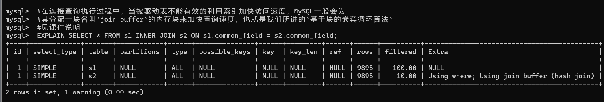

- `Not exists`

  当我们使用左（外）连接时，如果`WHERE`子句中包含要求被驱动表的某个列等于`NULL`值的搜索条件，而且那个列又是不允许存储`NULL`值的，那么在该表的执行计划的Extra列就会提示`Not exists`额外信息

  ```mysql
  EXPLAIN SELECT * FROM s1 LEFT JOIN s2 ON s1.key1 = s2.key1 WHERE s2.id IS NULL;
  # 都表关联了，，关联字段怎么会等于 is null
  ```

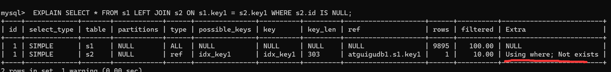

- `Using intersect(...)、Using union(...)和Using sort_union(...)`  

  - 如果执行计划的`Extra`列出现了`Using intersect(...)`提示，说明准备使用`Intersect`索引

  - 合并的方式执行查询，括号中的`...`表示需要进行索引合并的索引名称；

  - 如果出现了`Using union(...)`提示，说明准备使用`Union`索引合并的方式执行查询；

  - 出现了`Using sort_union(...)`提示，说明准备使用`Sort-Union`索引合并的方式执行查询。

    ```mysql
     EXPLAIN SELECT * FROM s1 WHERE key1 = 'a' OR key3 = 'a';
    ```

  

- `Zero limit`

  ```mysql
  #当我们的`LIMIT`子句的参数为`0`时，表示压根儿不打算从表中读出任何记录，将会提示该额外信息
  EXPLAIN SELECT * FROM s1 LIMIT 0;
  ```

  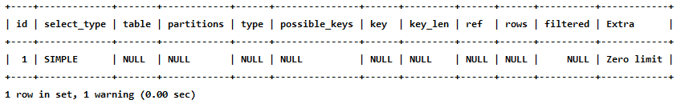

- `Using filesort`

  有一些情况下对结果集中的记录进行排序是可以使用到索引的，比如下边这个查询: 

  ```mysql
  EXPLAIN SELECT * FROM s1 ORDER BY key1 LIMIT 10;
  ```

  这个查询语句可以利用`idx_key1`索引直接取出key1列的10条记录，然后再进行回表操作就好了。但是很多情况下排序操作无法使用到索引，只能在内存中(记录较少的时候)或者磁盘中(记录较多的时候)进行排序，MySQL把这种在内存中或者磁盘上进行排序的方式统称为`文件排序`（英文名: `filesort`)。如果某个查询需要使用文件排序的方式执行查询，就会在执行计划的Extra列中显示`Using filesort`提示

  ```mysql
  EXPLAIN SELECT * FROM s1 ORDER BY common_field LIMIT 10;
  ```

- `Using temporary`  

  在许多查询的执行过程中，MySQL可能会借助临时表来完成一些功能，比如去重、排序之类的，比如我们在执行许多包含`DISTINCT`、`GROUP BY`、`UNION`等子句的查询过程中，如果不能有效利用索引来完成查询，MySQL很有可能寻求通过建立内部的临时表来执行查询。如果查询中使用到了内部的临时表，在执行计划的`Extra`列将会显示`Using temporary`提示。

  ```mysql
  EXPLAIN SELECT DISTINCT common_field FROM s1;
  ```

  

  ```mysql
   #执行计划中出现`Using temporary`并不是一个好的征兆，因为建立与维护临时表要付出很大成本的，所以
   #我们`最好能使用索引来替代掉使用临时表`。比如：扫描指定的索引idx_key1即可
   EXPLAIN SELECT key1, COUNT(*) AS amount FROM s1 GROUP BY key1;
  ```

  

##### 6.4.12 小结

- EXPLAIN不考虑各种Cache
- EXPLAIN不能显示MySQL在执行查询时所作的优化工作
- EXPLAIN不会告诉你关于触发器、存储过程的信息或用户自定义函数对查询的影响情况
- 部分统计信息是估算的，并非精确值


### 7 EXPLAIN的进一步使用

#### 7.1 EXPLAIN四种输出格式

这里谈谈EXPLAIN的输出格式。EXPLAIN可以输出四种格式：`传统格式`，`JSON格式`，`TREE格式`以及 `可视化输出`。用户可以根据需要选择适用于自己的格式。

##### 7.1.1 传统格式

传统格式简单明了，输出是一个表格形式，概要说明查询计划。

```mysql
EXPLAIN SELECT 
	s1.key1, 
	s2.key1 
FROM 
	s1 
LEFT JOIN 
	s2 
ON 
	s1.key1 = s2.key1 
WHERE 
	s2.common_field IS NOT NULL;
```


##### 7.1.2 JSON格式

第1种格式中介绍的`EXPLAIN`语句输出中缺少了一个衡量执行计划好坏的重要属性——`成本`。而JSON格式是四种格式里面输出信息`最详尽的格式`，里面包含了执行的成本信息。

- JSON格式：在EXPLAIN单词和真正的查询语句中间加上`FORMAT=JSON`。

  ```mysql
  EXPLAIN FORMAT=JSON SELECT ....  
  ```

- EXPLAIN的Column与JSON的对应关系:(来源于MySQL 5.7文档)

  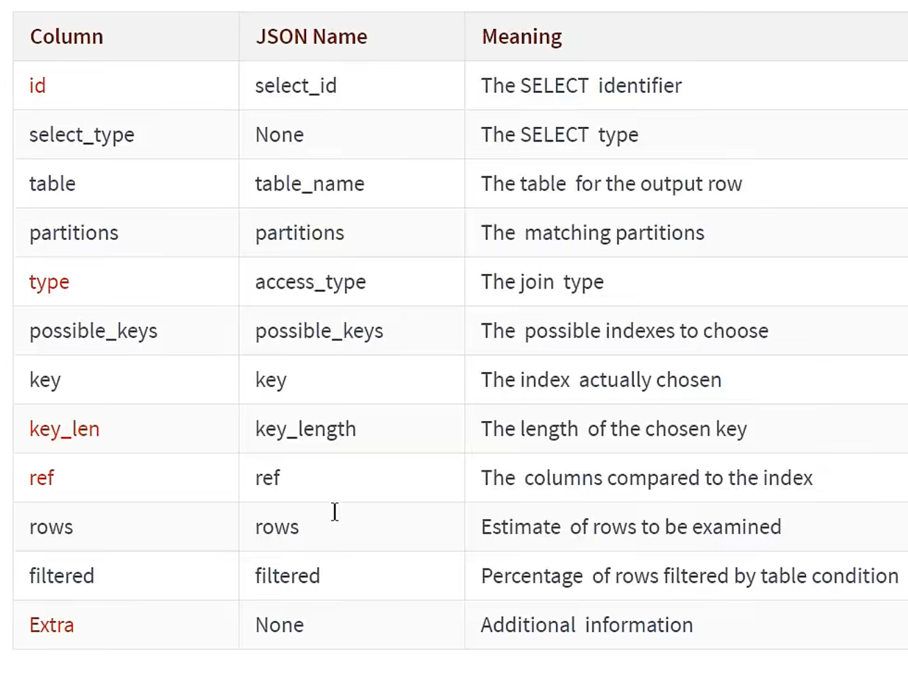

这样我们就可以得到一个json格式的执行计划，里面包含该计划花费的成本，比如这样:

```mysql
mysql> EXPLAIN FORMAT=JSON SELECT * FROM s1 INNER JOIN s2 ON s1.key1 = s2.key2 WHERE s1.common_field = 'a' \G
*************************** 1. row ***************************
EXPLAIN: {
  "query_block": {
    "select_id": 1,
    "cost_info": {
      "query_cost": "1360.07"
    },
    "nested_loop": [
      {
        "table": {
          "table_name": "s1",
          "access_type": "ALL",
          "possible_keys": [
            "idx_key1"
          ],
          "rows_examined_per_scan": 9895,
          "rows_produced_per_join": 989,
          "filtered": "10.00",
          "cost_info": {
            "read_cost": "914.80",
            "eval_cost": "98.95",
            "prefix_cost": "1013.75",
            "data_read_per_join": "1M"
          },
          "used_columns": [
            "id",
            "key1",
            "key2",
            "key3",
            "key_part1",
            "key_part2",
            "key_part3",
            "common_field"
          ],
          "attached_condition": "((`atguigudb1`.`s1`.`common_field` = 'a') and (`atguigudb1`.`s1`.`key1` is not null))"
        }
      },
      {
        "table": {
          "table_name": "s2",
          "access_type": "eq_ref",
          "possible_keys": [
            "idx_key2"
          ],
          "key": "idx_key2",
          "used_key_parts": [
            "key2"
          ],
          "key_length": "5",
          "ref": [
            "atguigudb1.s1.key1"
          ],
          "rows_examined_per_scan": 1,
          "rows_produced_per_join": 989,
          "filtered": "100.00",
          "index_condition": "(cast(`atguigudb1`.`s1`.`key1` as double) = cast(`atguigudb1`.`s2`.`key2` as double))",
          "cost_info": {
            "read_cost": "247.38",
            "eval_cost": "98.95",
            "prefix_cost": "1360.08",
            "data_read_per_join": "1M"
          },
          "used_columns": [
            "id",
            "key1",
            "key2",
            "key3",
            "key_part1",
            "key_part2",
            "key_part3",
            "common_field"
          ]
        }
      }
    ]
  }
}
1 row in set, 2 warnings (0.01 sec)
```

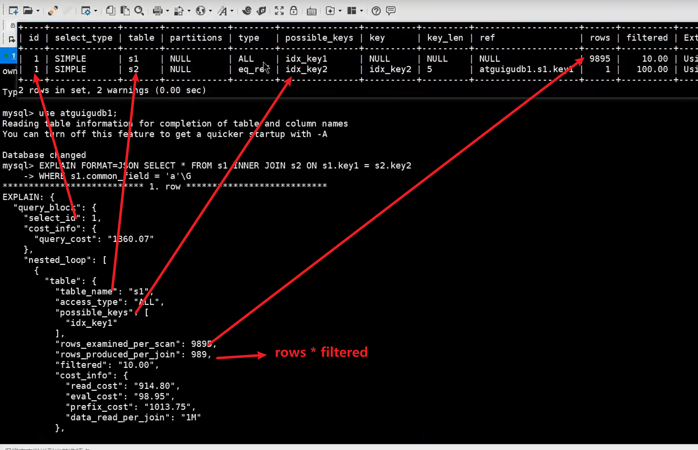

我们使用`#`后边跟随注释的形式为大家解释了`EXPLAIN FORMAT=JSON`语句的输出内容，但是大家可能有疑问"`cost_info`"里边的成本看着怪怪的，它们是怎么计算出来的？先看`s1`表的"`cost_info`"部分：

```json
"cost_info": {
    "read_cost": "914.80",
    "eval_cost": "98.95",
    "prefix_cost": "1013.75",
    "data_read_per_join": "1M"
}  
```

- `read_cost` 是由下边这两部分组成的：  

  - IO 成本
  - 检测`rows × (1 - filter)`条记录的`CPU`成本

  > 小贴士：rows和filter都是我们前边介绍执行计划的输出列，在JSON格式的执行计划中，rows相当于rows_examined_per_scan，filtered名称不变。  

- `eval_cost` 是这样计算的  

  检测 `rows × filter` 条记录的成本。  

- `prefix_cost` 就是单独查询 `s1` 表的成本，也就是：

  `read_cost + eval_cost  `

- `data_read_per_join` 表示在此次查询中需要读取的数据量。

对于 s2 表的 "cost_info" 部分是这样的：

```json
"cost_info": {
    "read_cost": "247.38",
    "eval_cost": "98.95",
    "prefix_cost": "1360.08",
    "data_read_per_join": "1M"
}
```

由于 `s2` 表是被驱动表，所以可能被读取多次，这里的 `read_cost` 和 `eval_cost` 是访问多次 `s2` 表后累加起来的值，大家主要关注里边儿的 `prefix_cost` 的值代表的是整个连接查询预计的成本，也就是单次查询 `s1` 表和多次查询 `s2` 表后的成本的和，也就是:

```text
247.38 + 98.95 + 1013.75 = 1360.08
```


##### 7.1.3 TREE格式

TREE格式是8.0.16版本之后引入的新格式，主要根据查询的 `各个部分之间的关系` 和 `各部分的执行顺序` 来描述如何查询  

```mysql
mysql> EXPLAIN FORMAT=tree SELECT * FROM s1 INNER JOIN s2 ON s1.key1 = s2.key2 WHERE s1.common_field = 'a'\G
*************************** 1. row ***************************
EXPLAIN: -> Nested loop inner join  (cost=1360.08 rows=990)
    -> Filter: ((s1.common_field = 'a') and (s1.key1 is not null))  (cost=1013.75 rows=990)
        -> Table scan on s1  (cost=1013.75 rows=9895)
    -> Single-row index lookup on s2 using idx_key2 (key2=s1.key1), with index condition: (cast(s1.key1 as double) = cast(s2.key2 as double))  (cost=0.25 rows=1)

1 row in set, 1 warning (0.00 sec)
```


##### 7.1.4 可视化输出

可视化输出，可以通过MySQL Workbench可视化查看MySQL的执行计划。通过点击Workbench的放大镜图标，即可生成可视化的查询计划。


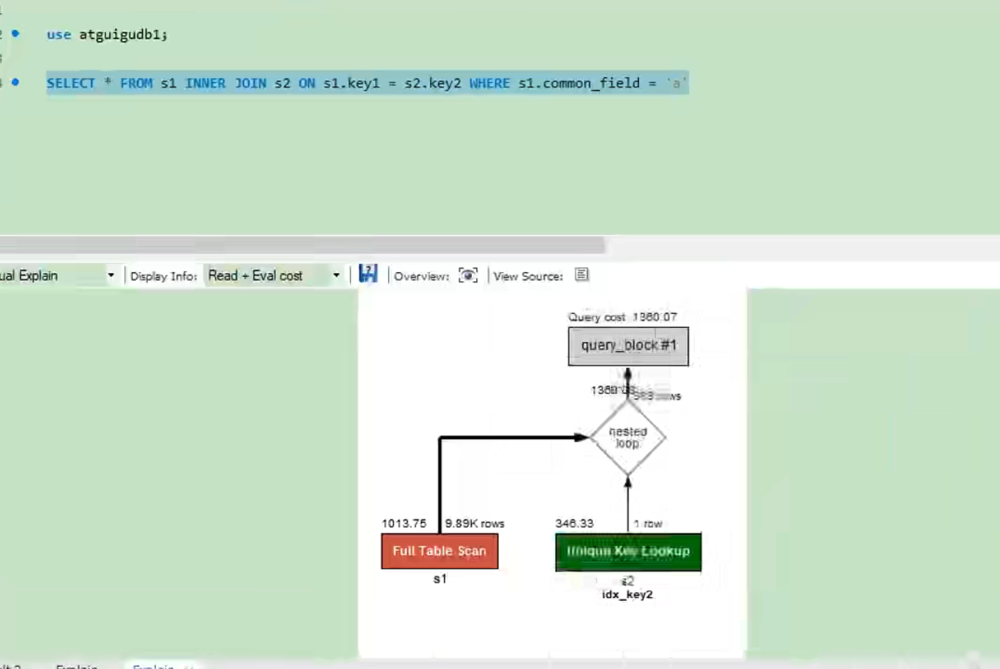

上图按从左到右的连接顺序显示表。红色框表示`全表扫描`，而绿色框表示使用`索引查找`。对于每个表，显示使用的索引。还要注意的是，每个表格的框上方是每个表访问所发现的行数的估计值以及访问该表的成本。


#### 7.2 SHOW WARNINGS的使用

在我们使用`EXPLAIN`语句查看了某个查询的执行计划后，紧接着还可以使用`SHOW WARNINGS`语句查看与这个查询的执行计划有关的一些扩展信息，比如这样：

```mysql
EXPLAIN SELECT
	s1.key1, 
	s2.key1 
FROM 
	s1 
LEFT JOIN 
	s2 
ON 
	s1.key1 = s2.key1 
WHERE
	s2.common_field IS NOT NULL;
```

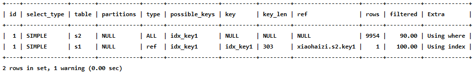

使用完explain后紧接着使用`SHOW WARNINGS \G`

```mysql
mysql> SHOW WARNINGS\G
*************************** 1. row ***************************
Level: Note
Code: 1003
Message: /* select#1 */ select `atguigudb1`.`s1`.`key1` AS `key1`,`atguigudb1`.`s2`.`key1` AS `key1` from `atguigudb1`.`s1` join `atguigudb1`.`s2` where ((`atguigudb1`.`s1`.`key1` = `atguigudb1`.`s2`.`key1`) and (`atguigudb1`.`s2`.`common_field` is not null))
1 row in set (0.00 sec)
```

> 可以看到查询优化器真正执行的语句
>
> 粘出来并不一定可以运行

大家可以看到`SHOW WARNINGS`展示出来的信息有三个字段，分别是`Level`、`Code`、`Message`。我们最常见的就是Code为1003的信息，当Code值为1003时，Message字段展示的信息类似于`查询优化器`将我们的查询语句**重写后的语句**。比如我们上边的查询本来是一个左(外)连接查询，但是有一个`s2.common_field IS NOT NULL`的条件，这就会导致查询优化器把左(外）连接查询优化为内连接查询，从 `SHOW WARNINGS`的`Message`字段也可以看出来，原本的`LEFT JOIN`(左外连接)已经变成了`JOIN(内连接)`。


### 8 分析优化器执行计划：trace

`OPTIMIZER_TRACE`是MySQL 5.6引入的一项跟踪功能，它可以跟踪优化器做出的各种决策(比如访问表的方法、各种开销计算、各种转换等)，并将跟踪结果记录到`INFORMATION_SCHEMA.OPTIMIZER_TRACE`表中。

此功能默认关闭。开启trace，并设置格式为JSON，同时设置trace最大能够使用的内存大小，避免解析过程中因为默认内存过小而不能够完整展示。

```mysql
SET optimizer_trace="enabled=on",end_markers_in_json=on;

set optimizer_trace_max_mem_size=1000000;
```

开启后，可分析如下语句：

- SELECT
- INSERT
- REPLACE  
- UPDATE
- DELETE
- EXPLAIN
- SET
- DECLARE
- CASE
- IF
- RETURN
- CALL  

测试：执行如下SQL语句

```mysql
select * from student where id < 10;
```

最后，查询`information_schema.optimizer_trace`就可以知道MySQL是如何执行SQL的 :

```mysql
select * from information_schema.optimizer_trace\G
```

```mysql
mysql> select * from information_schema.optimizer_trace\G
*************************** 1. row ***************************
# 第1部分：查询语句
QUERY: select * from student where id < 10
# 第2部分：QUERY字段对应语句的跟踪信息
TRACE: {
  "steps": [
    {
      "join_preparation": { /*预备工作*/
        "select#": 1,
        "steps": [
          {
            "expanded_query": "/* select#1 */ select `student`.`id` AS `id`,`student`.`stuno` AS `stuno`,`student`.`name` AS `name`,`student`.`age` AS `age`,`student`.`classId` AS `classId` from `student` where (`student`.`id` < 10)"
          }
        ] /* steps */
      } /* join_preparation */
    },
    {
      "join_optimization": {/*进行优化*/
        "select#": 1,
        "steps": [
          {
            "condition_processing": {/*条件处理*/
              "condition": "WHERE",
              "original_condition": "(`student`.`id` < 10)",
              "steps": [
                {
                  "transformation": "equality_propagation",
                  "resulting_condition": "(`student`.`id` < 10)"
                },
                {
                  "transformation": "constant_propagation",
                  "resulting_condition": "(`student`.`id` < 10)"
                },
                {
                  "transformation": "trivial_condition_removal",
                  "resulting_condition": "(`student`.`id` < 10)"
                }
              ] /* steps */
            } /* condition_processing */
          },
          {
            "substitute_generated_columns": {/*替换生成的列*/
            } /* substitute_generated_columns */
          },
          {
            "table_dependencies": [   /* 表的依赖关系*/
              {
                "table": "`student`",
                "row_may_be_null": false,
                "map_bit": 0,
                "depends_on_map_bits": [
                ] /* depends_on_map_bits */
              }
            ] /* table_dependencies */
          },
          {
            "ref_optimizer_key_uses": [ /* 使用键*/
            ] /* ref_optimizer_key_uses */
          },
          {
            "rows_estimation": [ /*行判断*/
              {
                "table": "`student`",
                "range_analysis": {
                  "table_scan": {
                    "rows": 3945207,
                    "cost": 404306
                  } /* table_scan */,/*表扫描*/
                  "potential_range_indexes": [
                    {
                      "index": "PRIMARY",
                      "usable": true,
                      "key_parts": [
                        "id"
                      ] /* key_parts */
                    }
                  ] /* potential_range_indexes */,
                  "setup_range_conditions": [ 
                  ] /* 设置条件范围 */,
                  "group_index_range": {
                    "chosen": false,
                    "cause": "not_group_by_or_distinct"
                  } /* group_index_range */,
                  "skip_scan_range": {
                    "potential_skip_scan_indexes": [
                      {
                        "index": "PRIMARY",
                        "usable": false,
                        "cause": "query_references_nonkey_column"
                      }
                    ] /* potential_skip_scan_indexes */
                  } /* skip_scan_range */,
                  "analyzing_range_alternatives": {/*分析范围选项*/
                    "range_scan_alternatives": [
                      {
                        "index": "PRIMARY",
                        "ranges": [
                          "id < 10"
                        ] /* ranges */,
                        "index_dives_for_eq_ranges": true,
                        "rowid_ordered": true,
                        "using_mrr": false,
                        "index_only": false,
                        "in_memory": 0.159895,
                        "rows": 9,
                        "cost": 1.79883,
                        "chosen": true
                      }
                    ] /* range_scan_alternatives */,
                    "analyzing_roworder_intersect": {
                      "usable": false,
                      "cause": "too_few_roworder_scans"
                    } /* analyzing_roworder_intersect */
                  } /* analyzing_range_alternatives */,
                  "chosen_range_access_summary": {/*选择范围访问摘要*/
                    "range_access_plan": {
                      "type": "range_scan",
                      "index": "PRIMARY",
                      "rows": 9,
                      "ranges": [
                        "id < 10"
                      ] /* ranges */
                    } /* range_access_plan */,
                    "rows_for_plan": 9,
                    "cost_for_plan": 1.79883,
                    "chosen": true
                  } /* chosen_range_access_summary */
                } /* range_analysis */
              }
            ] /* rows_estimation */
          },
          {
            "considered_execution_plans": [/*考虑执行计划*/
              {
                "plan_prefix": [
                ] /* plan_prefix */,
                "table": "`student`",
                "best_access_path": {/*最佳访问路径*/
                  "considered_access_paths": [
                    {
                      "rows_to_scan": 9,
                      "access_type": "range",
                      "range_details": {
                        "used_index": "PRIMARY"
                      } /* range_details */,
                      "resulting_rows": 9,
                      "cost": 2.69883,
                      "chosen": true
                    }
                  ] /* considered_access_paths */
                } /* best_access_path */,
                "condition_filtering_pct": 100, /*行过滤百分比*/
                "rows_for_plan": 9,
                "cost_for_plan": 2.69883,
                "chosen": true
              }
            ] /* considered_execution_plans */
          },
          {
            "attaching_conditions_to_tables": { /*将条件附加到表上*/
              "original_condition": "(`student`.`id` < 10)",
              "attached_conditions_computation": [
              ] /* attached_conditions_computation */,
              "attached_conditions_summary": [ /*附加条件概要*/
                {
                  "table": "`student`",
                  "attached": "(`student`.`id` < 10)"
                }
              ] /* attached_conditions_summary */
            } /* attaching_conditions_to_tables */
          },
          {
            "finalizing_table_conditions": [
              {
                "table": "`student`",
                "original_table_condition": "(`student`.`id` < 10)",
                "final_table_condition   ": "(`student`.`id` < 10)"
              }
            ] /* finalizing_table_conditions */
          },
          {
            "refine_plan": [ /*精简计划*/
              {
                "table": "`student`"
              }
            ] /* refine_plan */
          }
        ] /* steps */
      } /* join_optimization */
    },
    {
      "join_execution": {  /*执行*/
        "select#": 1,
        "steps": [
        ] /* steps */
      } /* join_execution */
    }
  ] /* steps */
}
/
/*第3部分：跟踪信息过长时，被截断的跟踪信息的字节数。*/
MISSING_BYTES_BEYOND_MAX_MEM_SIZE: 0 /*丢失的超出最大容量的字节*/
/*第4部分：执行跟踪语句的用户是否有查看对象的权限。当不具有权限时，该列信息为1且TRACE字段为空，一般在
调用带有SQL SECURITY DEFINER的视图或者是存储过程的情况下，会出现此问题。*/
INSUFFICIENT_PRIVILEGES: 0 /*缺失权限*/
1 row in set (0.01 sec)
```


### 9 MySQL监控分析视图-sys schema

关于MySQL的性能监控和问题诊断，我们一般都从performance_schema中去获取想要的数据，在MySQL5.7.7版本中新增sys schema，它将performance_schema和information_schema中的数据以更容易理解的方式总结归纳为”视图”，其目的就是为了`降低查询performance_schema的复杂度`，让DBA能够快速的定位问题。下面看看这些库中都有哪些监控表和视图，掌握了这些，在我们开发和运维的过程中就起到了事半功倍的效果。

#### 9.1 Sys schema视图摘要

1. **主机相关**：以host_summary开头，主要汇总了IO延迟的信息。
2. **Innodb相关**：以innodb开头，汇总了innodb buffer信息和事务等待innodb锁的信息。
3. **I/O相关**：以io开头，汇总了等待I/O、I/O使用量情况。
4. **内存使用情况**：以memory开头，从主机、线程、事件等角度展示内存的使用情况
5. **连接与会话信息**：processlist和session相关视图，总结了会话相关信息。
6. **表相关**：以schema_table开头的视图，展示了表的统计信息。
7. **索引信息**：统计了索引的使用情况，包含冗余索引和未使用的索引情况。
8. **语句相关**：以statement开头，包含执行全表扫描、使用临时表、排序等的语句信息。
9. **用户相关**：以user开头的视图，统计了用户使用的文件I/O、执行语句统计信息。
10. **等待事件相关信息**：以wait开头，展示等待事件的延迟情况。

#### 9.2 Sys schema视图使用场景

**索引情况**  

```mysql
#1. 查询冗余索引
select * from sys.schema_redundant_indexes;
#2. 查询未使用过的索引
select * from sys.schema_unused_indexes;
#3. 查询索引的使用情况
select index_name,rows_selected,rows_inserted,rows_updated,rows_deleted
from sys.schema_index_statistics where table_schema='dbname' ;
```

**表相关**  

```mysql
# 1. 查询表的访问量
select table_schema,table_name,sum(io_read_requests+io_write_requests) as io from
sys.schema_table_statistics group by table_schema,table_name order by io desc;
# 2. 查询占用bufferpool较多的表
select object_schema,object_name,allocated,data
from sys.innodb_buffer_stats_by_table order by allocated limit 10;
# 3. 查看表的全表扫描情况
select * from sys.statements_with_full_table_scans where db='dbname';
```

**语句相关**

```mysql
#1. 监控SQL执行的频率
select db,exec_count,query from sys.statement_analysis
order by exec_count desc;
#2. 监控使用了排序的SQL
select db,exec_count,first_seen,last_seen,query
from sys.statements_with_sorting limit 1;
#3. 监控使用了临时表或者磁盘临时表的SQL
select db,exec_count,tmp_tables,tmp_disk_tables,query
from sys.statement_analysis where tmp_tables>0 or tmp_disk_tables >0
order by (tmp_tables+tmp_disk_tables) desc;
```

**IO 相关**

```mysql
#1. 查看消耗磁盘IO的文件
select file,avg_read,avg_write,avg_read+avg_write as avg_io
from sys.io_global_by_file_by_bytes order by avg_read limit 10;
```

**Innodb 相关**

```mysql
#1. 行锁阻塞情况
select * from sys.innodb_lock_waits;
```

> 风险提示:
>
> 通过sys库去查询时，MySQL会消耗大量资源去收集相关信息，严重的可能会导致业务请求被阻塞，从而引起故障。建议生产上`不要频繁`的去查询sys或者performance_schema、information_schema来完成监控、巡检等工作。


------

## 九、索引优化及SQL查询优化

都有哪些维度可以进行数据库调优？简言之:

- 索引失效、没有充分利用到索引 -- 索引建立
- 关联查询太多JOIN (设计缺陷或不得已的需求) -- SQL优化
- 服务器调优及各个参数设置(缓冲、线程数等) -- 调整my.cnf
- 数据过多 -- 分库分表

关于数据库调优的知识点非常分散。不同的DBMS，不同的公司，不同的职位，不同的项目遇到的问题都不尽相同。这里我们分为三个章节进行细致讲解。

虽然SQL查询优化的技术有很多，但是大方向上完全可以分成`物理查询优化`和`逻辑查询优化`两大块。

- 物理查询优化是通过`索引`和`表连接方式`等技术来进行优化，这里重点需要掌握索引的使用。
- 逻辑查询优化就是通过SQL`等价变换`提升查询效率，直白一点就是说，换一种查询写法执行效率可能更高。


### 1 数据准备

`学员表`插`50万`条，`班级表`插`1万`条。

**步骤1：建表**  

```mysql
CREATE TABLE `class` (
	`id` INT(11) NOT NULL AUTO_INCREMENT,
	`className` VARCHAR(30) DEFAULT NULL,
	`address` VARCHAR(40) DEFAULT NULL,
	`monitor` INT NULL ,
	PRIMARY KEY (`id`)
) ENGINE=INNODB AUTO_INCREMENT=1 DEFAULT CHARSET=utf8;

CREATE TABLE `student` (
	`id` INT(11) NOT NULL AUTO_INCREMENT,
	`stuno` INT NOT NULL ,
	`name` VARCHAR(20) DEFAULT NULL,
	`age` INT(3) DEFAULT NULL,
	`classId` INT(11) DEFAULT NULL,
	PRIMARY KEY (`id`)
	#CONSTRAINT `fk_class_id` FOREIGN KEY (`classId`) REFERENCES `class` (`id`)
) ENGINE=INNODB AUTO_INCREMENT=1 DEFAULT CHARSET=utf8;
```

**步骤2：设置参数**

命令开启：允许创建函数设置：

```mysql
set global log_bin_trust_function_creators=1; # 不加global只是当前窗口有效。  
```

**步骤3：创建函数**

保证每条数据都不同  

```mysql
#随机产生字符串
DELIMITER //
CREATE FUNCTION rand_string(n INT) RETURNS VARCHAR(255)
BEGIN
	DECLARE chars_str VARCHAR(100) DEFAULT
	'abcdefghijklmnopqrstuvwxyzABCDEFJHIJKLMNOPQRSTUVWXYZ';
	DECLARE return_str VARCHAR(255) DEFAULT '';
	DECLARE i INT DEFAULT 0;
	WHILE i < n DO
		SET return_str =CONCAT(return_str,SUBSTRING(chars_str,FLOOR(1+RAND()*52),1));
		SET i = i + 1;
	END WHILE;
	RETURN return_str;
END //
DELIMITER ;

#假如要删除
#drop function rand_string;
```

随机产生班级编号  

```mysql
#用于随机产生多少到多少的编号
DELIMITER //
CREATE FUNCTION rand_num (from_num INT ,to_num INT) RETURNS INT(11)
BEGIN
	DECLARE i INT DEFAULT 0;
	SET i = FLOOR(from_num +RAND()*(to_num - from_num+1)) ;
	RETURN i;
END //
DELIMITER ;

#假如要删除
#drop function rand_num;
```

**步骤4：创建存储过程**  

```mysql
#创建往stu表中插入数据的存储过程
DELIMITER //
CREATE PROCEDURE insert_stu( START INT , max_num INT )
BEGIN
	DECLARE i INT DEFAULT 0;
	SET autocommit = 0; #设置手动提交事务
	REPEAT #循环
		SET i = i + 1; #赋值
		INSERT INTO student (stuno, name ,age ,classId ) VALUES
		((START+i),rand_string(6),rand_num(1,50),rand_num(1,1000));
	UNTIL i = max_num
	END REPEAT;
COMMIT; #提交事务
END //
DELIMITER ;
#假如要删除
#drop PROCEDURE insert_stu;
```

创建往class表中插入数据的存储过程  

```mysql
#执行存储过程，往class表添加随机数据
DELIMITER //
CREATE PROCEDURE `insert_class`( max_num INT )
BEGIN
DECLARE i INT DEFAULT 0;
	SET autocommit = 0;
	REPEAT
		SET i = i + 1;
		INSERT INTO class ( classname,address,monitor ) VALUES
		(rand_string(8),rand_string(10),rand_num(1,100000));
	UNTIL i = max_num
	END REPEAT;
COMMIT;
END //
DELIMITER ;
#假如要删除
#drop PROCEDURE insert_class;
```

**步骤5：调用存储过程**

```mysql
#执行存储过程，往class表添加1万条数据
CALL insert_class(10000);

#执行存储过程，往stu表添加50万条数据
CALL insert_stu(100000,500000);
CALL insert_stu(600000,1000000);
```

**步骤6：删除某表上的索引**

创建存储过程

```mysql
DELIMITER //
CREATE PROCEDURE `proc_drop_index`(dbname VARCHAR(200), tablename VARCHAR(200))
BEGIN
    DECLARE done INT DEFAULT 0;
    DECLARE ct INT DEFAULT 0;
    DECLARE _index VARCHAR(200) DEFAULT '';
    DECLARE _cur CURSOR FOR SELECT index_name FROM
    information_schema.STATISTICS WHERE table_schema=dbname AND table_name=tablename AND
    seq_in_index=1 AND index_name <>'PRIMARY' ;
    #每个游标必须使用不同的declare continue handler for not found set done=1来控制游标的结束
    DECLARE CONTINUE HANDLER FOR NOT FOUND set done=2 ;
    #若没有数据返回,程序继续,并将变量done设为2
    OPEN _cur;
    FETCH _cur INTO _index;
    WHILE _index<>'' DO
        SET @str = CONCAT("drop index " , _index , " on " , tablename );
        PREPARE sql_str FROM @str ;
        EXECUTE sql_str;
        DEALLOCATE PREPARE sql_str;
        SET _index='';
        FETCH _cur INTO _index;
    END WHILE;
    CLOSE _cur;
END //
DELIMITER ;
```

执行存储过程  

```mysql
CALL proc_drop_index("dbname","tablename");
```


### 2 索引失效案例

MySQL中`提高性能`的一个最有效的方式是对数据表`设计合理的索引`。索引提供了高效访问数据的方法，并且加快查询的速度，因此索引对查询的速度有着至关重要的影响。

- 使用索引可以`快速地定位`表中的某条记录，从而提高数据库查询的速度，提高数据库的性能。
- 如果查询时没有使用索引，查询语句就会`扫描表中的所有记录`。在数据量大的情况下，这样查询的速度会很慢。

大多数情况下都（默认）采用`B+树`来构建索引。只是空间列类型的索引使用`R-树`，并且MEMORY表还支持`hash索引`。

其实，用不用索引，最终都是优化器说了算。优化器是基于什么的优化SQL？基于`cost开销(CostBaseOptimizer)`，它不是基于`规则(Rule-BasedOptimizer)`，也不是基于`语义`。怎么样开销小就怎么来。另外，**SQL语句是否使用索引，跟数据库版本、数据量、数据选择度都有关系。**

> 开销不是基于时间


#### 2.1 全值匹配我最爱

意思是创建联合索引多个索引同时生效。

系统中经常出现的sql语句如下:

```mysql
EXPLAIN SELECT SQL_NO_CACHE * FROM student WHERE age=30;
EXPLAIN SELECT SQL_NO_CACHE * FROM student WHERE age=30 and classId=4;
EXPLAIN SELECT SQL_NO_CACHE * FROM student WHERE age=30 and classId=4 AND name = 'abcd';
```


建立索引前执行:(关注执行时间)

```mysql
mysql> SELECT SQL_NO_CACHE * FROM student WHERE age=30 and classId=4 AND name = 'abcd' ;
Empty set，1 warning ( 0.28 sec)
```


建立索引

```mysql
CREATE INDEX idx_age ON student(age ) ;

CREATE INDEX idx_age_classid ON student( age , classId);

CREATE INDEX idx_age_classid_name ON student( age , classId , name) ;
```

建立索引后执行:

```mysql
mysql> SELECT SQL_NO_CACHE * FROM student WHERE age=30 and classId=4 AND name = 'abcd';
Empty set,1 warning (0.01 sec)
```

可以看到，创建索引前的查询时间是0.28秒，创建索引后的查询时间是0.01秒，索引帮助我们极大的提高了查询效率。


#### 2.2 最佳左前缀法则

在MySQL建立联合索引时会遵守最佳左前缀匹配原则，即最左优先，在检索数据时从联合索引的最左边开始匹配。

举例1:

```mysql
EXPLAIN SELECT SQL_NO_CACHE * FROM student WHERE student.age=30 AND student.name = 'abcd';
# 走`idx_age_classid_name`   使用了Using index condition
```

举例2:

```mysql
EXPLAIN SELECT SQL_NO_CACHE * FROM student WHERE student.classid=1 AND student.name = 'abcd' ;
# 没有索引匹配上。 
```

举例3:

**索引idx_age_classid_name还能否正常使用?**

```mysql
EXPLAIN SELECT SQL_NO_CACHE * FROM student WHERE classid=4 and student.age=30 AND student.name = 'abcd' ;
```

如果索引了多列，要遵守最左前缀法则。指的是查询从索引的最左前列开始并且不跳过索引中的列。

```mysql
mysq1> EXPLAIN SELECT SQL_NO_CACHE* FROM student WHERE student.age=30 AND student.name ='abcd';
```


**结论:**MySQL可以为多个字段创建索引，一个索引可以包括16个字段。对于多列索引，**过滤条件要使用索引必须按照索引建立时的顺序，依次满足，一旦跳过某个字段，索引后面的字段都无法被使用。**如果查询条件中没有使用这些字段中第1个字段时，多列(或联合）索引不会被使用。

> **拓展：Alibaba《Java开发手册》**
>
> 索引文件具有 B-Tree 的最左前缀匹配特性，如果左边的值未确定，那么无法使用此索引。 


#### 2.3 主键插入顺序

对于一个使用`InnoDB`存储引擎的表来说，表中的数据实际上都是存储在`聚簇索引`的叶子节点的。而记录又是存储在数据页中的，数据页和记录又是按照记录`主键值从小到大`的顺序进行排序，所以如果我们`插入`的记录的`主键值是依次增大`的话，那我们每插满一个数据页就换到下一个数据页继续插，而如果我们插入的主键值忽大忽小的话，就比较麻烦了，假设某个数据页存储的记录已经满了，它存储的主键值在`1~100`之间:


如果此时再插入一条主键值为`9`的记录，那它插入的位置就如下图：


可这个数据页已经满了，再插进来咋办呢？我们需要把当前`页面分裂`成两个页面，把本页中的一些记录移动到新创建的这个页中。页面分裂和记录移位意味着什么？意味着：`性能损耗`！所以如果我们想尽量避免这样无谓的性能损耗，最好让插入的记录的`主键值依次递增`，这样就不会发生这样的性能损耗了。所以我们建议：让主键具有`AUTO_INCREMENT`，让存储引擎自己为表生成主键，而不是我们手动插入，比如`person_info`表：

```mysql
CREATE TABLE person_info(
    id INT UNSIGNED NOT NULL AUTO_INCREMENT,
    name VARCHAR(100) NOT NULL,
    birthday DATE NOT NULL,
    phone_number CHAR(11) NOT NULL,
    country varchar(100) NOT NULL,
    PRIMARY KEY (id),
    KEY idx_name_birthday_phone_number (name(10), birthday, phone_number)
);
```

我们自定义的主键列`id`拥有`AUTO_INCREMENT`属性，在插入记录时存储引擎会自动为我们填入自增的主键值。这样的主键占用空间小，顺序写入，减少页分裂。


#### 2.4 计算、函数、类型转换(自动或手动)导致索引失效

这两条sql哪种写法更好

```mysql
EXPLAIN SELECT SQL_NO_CACHE * FROM student WHERE student.name LIKE 'abc%';

EXPLAIN SELECT SQL_NO_CACHE * FROM student WHERE LEFT(student.name, 3) = 'abc';
# 这个索引失效。因为用上函数了。
```

创建索引  

```mysql
CREATE INDEX idx_name ON student (name) ;
```

第一种：索引优化生效  

```mysql
mysql> EXPLAIN SELECT SQL_NO_CACHE * FROM student WHERE student.name LIKE 'abc%';
```

```mysql
mysql> SELECT SQL_NO_CACHE * FROM student WHERE student.name LIKE 'abc%';
+---------+---------+--------+-----+---------+
| id      | stuno   | name   | age | classId |
+---------+---------+--------+-----+---------+
| 5301379 | 1233401 | AbCHEa | 164 | 259     |
| 7170042 | 3102064 | ABcHeB | 199 | 161     |
| 1901614 | 1833636 | ABcHeC | 226 | 275     |
| 5195021 | 1127043 | abchEC | 486 | 72      |
| 4047089 | 3810031 | AbCHFd | 268 | 210     |
| 4917074 | 849096  | ABcHfD | 264 | 442     |
| 1540859 | 141979  | abchFF | 119 | 140     |
| 5121801 | 1053823 | AbCHFg | 412 | 327     |
| 2441254 | 2373276 | abchFJ | 170 | 362     |
| 7039146 | 2971168 | ABcHgI | 502 | 465     |
| 1636826 | 1580286 | ABcHgK | 71  | 262     |
| 374344  | 474345  | abchHL | 367 | 212     |
| 1596534 | 169191  | AbCHHl | 102 | 146     |
...
| 5266837 | 1198859 | abclXe | 292 | 298     |
| 8126968 | 4058990 | aBClxE | 316 | 150     |
| 4298305 | 399962  | AbCLXF | 72  | 423     |
| 5813628 | 1745650 | aBClxF | 356 | 323     |
| 6980448 | 2912470 | AbCLXF | 107 | 78      |
| 7881979 | 3814001 | AbCLXF | 89  | 497     |
| 4955576 | 887598  | ABcLxg | 121 | 385     |
| 3653460 | 3585482 | AbCLXJ | 130 | 174     |
| 1231990 | 1283439 | AbCLYH | 189 | 429     |
| 6110615 | 2042637 | ABcLyh | 157 | 40      |
+---------+---------+--------+-----+---------+
401 rows in set, 1 warning (0.01 sec)
```

第二种：索引优化失效  

```mysql
mysql> EXPLAIN SELECT SQL_NO_CACHE * FROM student WHERE LEFT(student.name,3) = 'abc';

# type为“ALL”，表示没有使用到索引，查询时间为 3.62 秒，查询效率较之前低很多。  
```

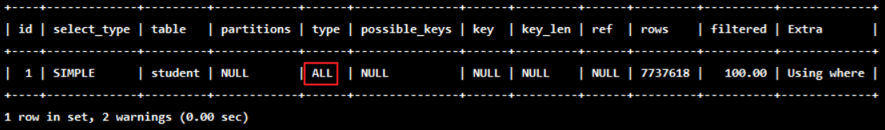

```mysql
mysql> SELECT SQL_NO_CACHE * FROM student WHERE LEFT(student.name,3) = 'abc';
+---------+---------+--------+-----+---------+
| id      | stuno   | name   | age | classId |
+---------+---------+--------+-----+---------+
| 5301379 | 1233401 | AbCHEa | 164 | 259     |
| 7170042 | 3102064 | ABcHeB | 199 | 161     |
| 1901614 | 1833636 | ABcHeC | 226 | 275     |
| 5195021 | 1127043 | abchEC | 486 | 72      |
| 4047089 | 3810031 | AbCHFd | 268 | 210     |
| 4917074 | 849096  | ABcHfD | 264 | 442     |
| 1540859 | 141979  | abchFF | 119 | 140     |
| 5121801 | 1053823 | AbCHFg | 412 | 327     |
| 2441254 | 2373276 | abchFJ | 170 | 362     |
| 7039146 | 2971168 | ABcHgI | 502 | 465     |
| 1636826 | 1580286 | ABcHgK | 71  | 262     |
| 374344  | 474345  | abchHL | 367 | 212     |
| 1596534 | 169191  | AbCHHl | 102 | 146     |
...
| 5266837 | 1198859 | abclXe | 292 | 298     |
| 8126968 | 4058990 | aBClxE | 316 | 150     |
| 4298305 | 399962  | AbCLXF | 72  | 423     |
| 5813628 | 1745650 | aBClxF | 356 | 323     |
| 6980448 | 2912470 | AbCLXF | 107 | 78      |
| 7881979 | 3814001 | AbCLXF | 89  | 497     |
| 4955576 | 887598  | ABcLxg | 121 | 385     |
| 3653460 | 3585482 | AbCLXJ | 130 | 174     |
| 1231990 | 1283439 | AbCLYH | 189 | 429     |
| 6110615 | 2042637 | ABcLyh | 157 | 40      |
+---------+---------+--------+-----+---------+
401 rows in set, 1 warning (3.62 sec)
```

**再举例：**

- student表的字段stuno上设置有索引  

  ```mysql
  CREATE INDEX idx_sno ON student(stuno);
  
  EXPLAIN SELECT SQL_NO_CACHE id, stuno, NAME FROM student WHERE stuno+1 = 900001;
  # 计算导致索引失效
  ```

  运行结果：  

  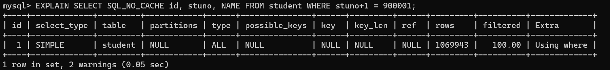

  类型是ALL原因是计算导致了索引失效。

  

- 索引优化生效(没有计算)：  

  ```mysql
  EXPLAIN SELECT SQL_NO_CACHE id, stuno, NAME FROM student WHERE stuno = 900000;
  ```

  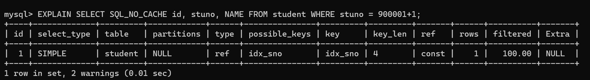

**再举例：**

- student表的字段name上设置有索引  

  ```mysql
  CREATE INDEX idx_name ON student (name);
  ```

- 索引失效：

  ```mysql
  EXPLAIN SELECT id,stuno，name FROM student WHERE SUBSTRING( name, 1, 3)='abc';
  ```

  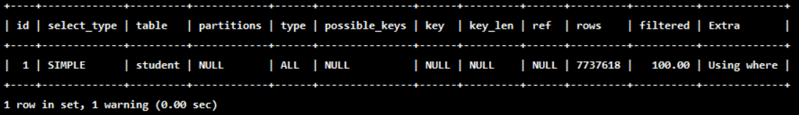

- 索引优化生效

  ```mysql
  EXPLAIN SELECT id, stuno, NAME FROM student WHERE NAME LIKE 'abc%';
  ```

  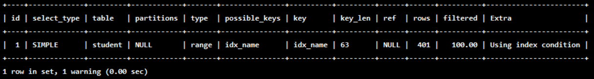

  

#### 2.5 类型转换导致索引失效

下列哪个sql语句可以用到索引。（假设name字段上设置有索引）

```mysql
# 未使用到索引
EXPLAIN SELECT SQL_NO_CACHE * FROM student WHERE name=123;
# name=123发生类型转换，索引失效
```

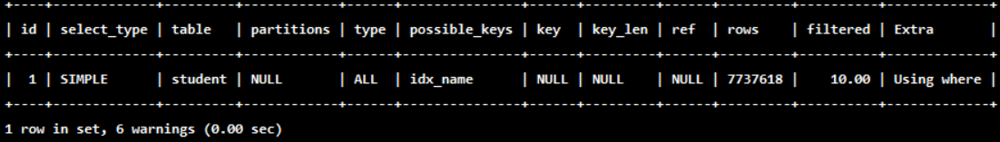

```mysql
# 使用到索引
EXPLAIN SELECT SQL_NO_CACHE * FROM student WHERE name='123';

# 使用到索引 name=123发生类型转换，索引失效。
EXPLAIN SELECT SQL_NO_CACHE * FROM student WHERE name=123;
```

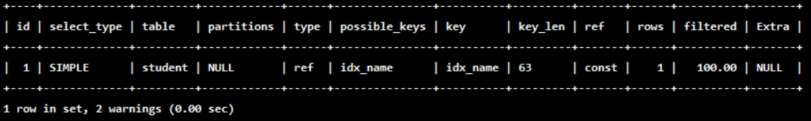


#### 2.6 范围条件右边的列索引失效

```mysql
ALTER TABLE student DROP INDEX idx_name;
ALTER TABLE student DROP INDEX idx_age;
ALTER TABLE student DROP INDEX idx_age_classid;

show index from student;

EXPLAIN SELECT SQL_NO_CACHE * FROM student WHERE student.age=30 AND student.classId > 20 AND student.name = 'abc';
```

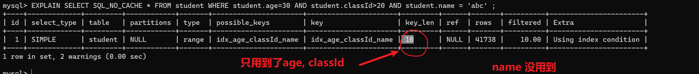

因为用上了范围查找，在范围查找的索引后面的索引就失效了。

> Tips：因为范围条件导致的索引失效，可以考虑把确定的索引放在前面。
>
> 例如上面这个例子，
>
> ```mysql
> create index idx_age_name_cid on student(age, name, classId);
> ```
>
> 这里name放在了范围查找classId前面。。索引就能生效了。
>
> - 将范围查询条件放置语句最后：
>
> ```mysql
> EXPLAIN SELECT SQL_NO_CACHE * FROM student WHERE student.age=30 AND student.name =
> 'abc' AND student.classId>20 ;
> ```

**哪些属于范围？**

1. 大于等于，大于，小于等于，小于
2. `between`

> 应用开发中范围查询，例如：金额查询，日期查询往往都是范围查询。创建联合索引时考虑放在后面。(创建的联合索引中，务必把范围涉及到的字段写在最后)


#### 2.7 不等于(!=或者<>)索引失效

- 为name字段创建索引

  ```mysql
  CREATE INDEX idx_name ON student(NAME);
  ```

- 查看索引是否失效

  ```mysql
  EXPLAIN SELECT SQL_NO_CACHE * FROM student WHERE student.name != 'abc';
  ```

  

>  没救 索引只能查到知道的东西


#### 2.8 is null可以使用索引，is not null无法使用索引

```mysql
EXPLAIN SELECT SQL_NO_CACHE * FROM student WHERE age IS NULL;
```

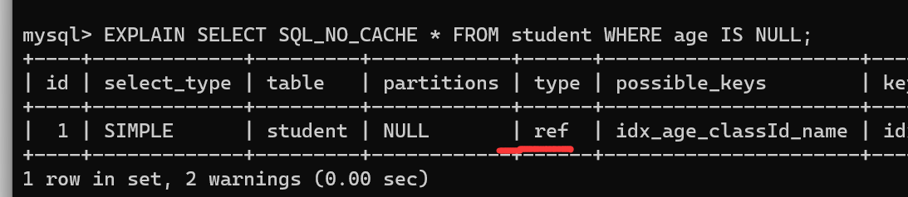

```mysql
# is not null 索引失效
EXPLAIN SELECT SQL_NO_CACHE * FROM student WHERE age IS NOT NULL;
```

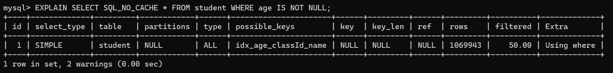

> 结论：最好在设计数据表的时候就将`字段设置为 NOT NULL 约束`，比如你可以将INT类型的字段，默认值设置为0。将字符类型的默认值设置为空字符串。
>
> 拓展: 同理，在查询中使用`not like`也无法使用索引，导致全表扫描。


#### 2.9 like以通配符%开头索引失效  

在使用LIKE关键字进行查询的查询语句中，如果匹配字符串的第一个字符为“%”，索引就不会起作用。只有“%"不在第一个位置，索引才会起作用。

> **拓展：Alibaba《Java开发手册》**
>
> 【强制】页面搜索严禁左模糊或者全模糊，如果需要请走搜索引擎来解决。 


#### 2.10 OR 前后存在非索引的列，索引失效

在WHERE子句中，如果在OR前的条件列进行了索引，而在OR后的条件列没有进行索引，那么索引会失效。也就是说，**OR前后的两个条件中的列都是索引时，查询中才使用索引**。

因为OR的含义就是两个只要满足一个即可，`因此只有一个条件列进行了索引是没有意义的`，只要有条件列没有进行索引，就会进行全表扫描，因此索引的条件列也会失效。


#### 2.11 数据库和表的字符集统一使用utf8mb4

统一使用utf8mb4(5.5.3版本以上支持)兼容性更好，统一字符集可以避免由于字符集转换产生的乱码。不同的`字符集`进行比较前需要进行`转换`会造成索引失效。


#### 2.12练习及一般性建议

**练习**:假设:index(a,b,c)


**一般性建议:**

- 对于单列索引，尽量选择针对当前query过滤性更好的索引
- 在选择组合索引的时候，当前query中过滤性最好的字段在索引字段顺序中，位置越靠前越好。
- 在选择组合索引的时候，尽量选择能够包含当前query中的where子句中更多字段的索引。
- 在选择组合索引的时候，如果某个字段可能出现范围查询时，尽量把这个字段放在索引次序的最后面。

**总之，书写SQL语句时，尽量避免造成索引失效的情况。**


### 3 关联查询优化

#### 3.1 数据准备

```mysql
#分类
CREATE TABLE IF NOT EXISTS `type`(
	`id` INT(10) UNSIGNED NOT NULL AUTO_INCREMENT,
	`card` INT(10) UNSIGNED NOT NULL,
	PRIMARY KEY ( `id` )
);

#图书
CREATE TABLE IF NOT EXISTS `book`(
	`bookid` INT(10) UNSIGNED NOT NULL AUTO_INCREMENT,
	`card`INT(10) UNSIGNED NOT NULL,
	PRIMARY KEY (`bookid`)
);
```

```mysql
#向分类表中添加20条记录
INSERT INTO type (card) VALUES (FLOOR(1 +(RAND() * 20)));
#向图书表中添加20条记录
INSERT INTO book(card) VALUES (FLOOR(1 +(RAND() * 20)) );
```


#### 3.2 采用左外连接

下面开始 EXPLAIN 分析  

```mysql
EXPLAIN SELECT SQL_NO_CACHE * FROM `type` LEFT JOIN book ON type.card = book.card;
```

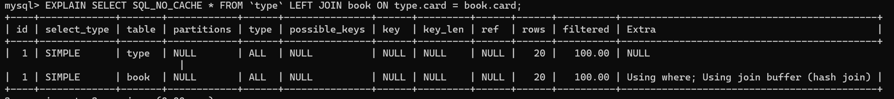

结论：type有All

添加索引优化 

```mysql
ALTER TABLE book ADD INDEX Y(card); #【被驱动表】，可以避免全表扫描

EXPLAIN SELECT SQL_NO_CACHE * FROM `type` LEFT JOIN book ON type.card = book.card;
```

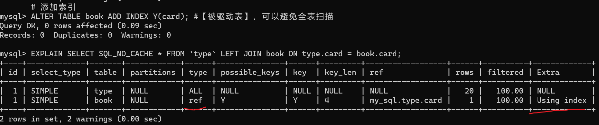

可以看到第二行的 type 变为了 ref，rows 也变成了优化比较明显。这是由左连接特性决定的。LEFT JOIN条件用于确定如何从右表搜索行，左边一定都有，所以`右边是我们的关键点，一定需要建立索引`。

> 如果只能添加一边的索引，那就给`被驱动表`添加上索引。

```mysql
ALTER TABLE `type` ADD INDEX X (card); #【驱动表】，无法避免全表扫描

EXPLAIN SELECT SQL_NO_CACHE * FROM `type` LEFT JOIN book ON type.card = book.card;
```

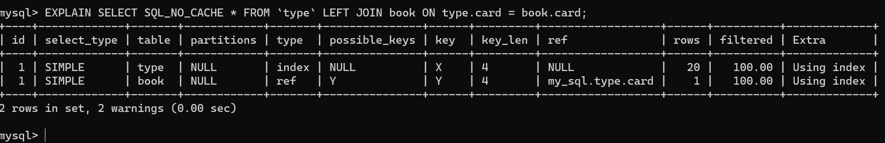

接着：

```mysql
DROP INDEX Y ON book;
EXPLAIN SELECT SQL_NO_CACHE * FROM `type` LEFT JOIN book ON type.card = book.card;
```

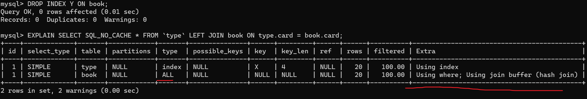

> 去掉被驱动索引，又变成了 join buffer


#### 3.3 采用内连接

**前置知识**

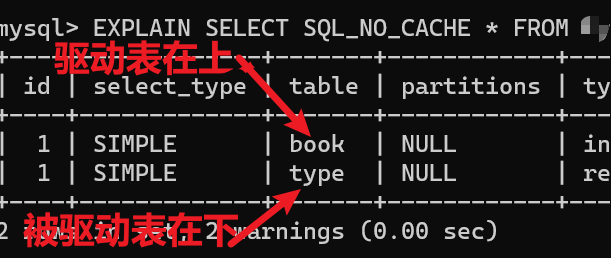


```mysql
drop index X on type;
drop index Y on book;#（如果已经删除了可以不用再执行该操作）
```

换成 inner join（MySQL自动选择驱动表）  

```mysql
EXPLAIN SELECT SQL_NO_CACHE * FROM type INNER JOIN book ON type.card=book.card;
```

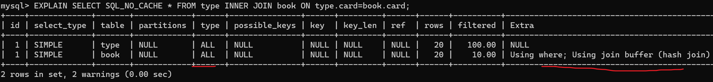

添加索引优化  

```mysql
ALTER TABLE book ADD INDEX Y (card);

EXPLAIN SELECT SQL_NO_CACHE * FROM type INNER JOIN book ON type.card=book.card;
```

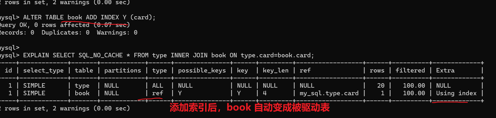

```mysql
# type 加索引
ALTER TABLE type ADD INDEX X (card);
# 观察执行情况
EXPLAIN SELECT SQL_NO_CACHE * FROM type INNER JOIN book ON type.card=book.card;
```

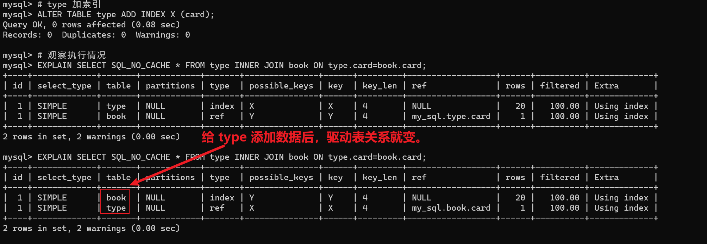

> 这里刚给type加了索引后，驱动表和被驱动表还是原来的样子。
>
> 给type继续加了一些数据后
>
> 优化器会判断，哪个数据比较少。就作为驱动表

**结论：**

- `内连接`主被驱动表是由优化器决定的。优化器认为哪个成本比较小，就采用哪种作为驱动表。

- 如果两张表只有一个有索引，那有索引的表作为`被驱动表`。
  - 原因：驱动表要全查出来。有没有索引你都得全查出来。
- 两个索引都存在的情况下，数据量大的作为`被驱动表`（小表驱动大表）
  - 原因：驱动表要全部查出来，而大表可以通过索引加快查找


#### 3.4 join语句原理

join方式连接多个表，本质就是各个表之间数据的循环匹配。MySQL5.5版本之前，MySQL只文持一种表间关联方式，就是嵌套循环(`Nested Loop Join`)。如果关联表的数据量很大，则join关联的执行时间会非常长。在MySQL5.5以后的版本中，MySQL通过引入`BNLJ`算法来优化嵌套执行。

##### 1.驱动表和被驱动表

驱动表就是主表，被驱动表就是从表、非驱动表。

- 对于内连接来说:

  ```mysql
  SELECT * FROM A JOIN B ON ...
  ```

  A一定是驱动表吗？不一定，优化器会根据你查询语句做优化，决定先查哪张表。先查询的那张表就是驱动表，反之就是被驱动表。通过explain关键字可以查看。

  - 对于内连接来说：

    ```mysql
    SELECT * FROM A JOIN B ON ...
    ```
    
    **A一定是驱动表吗？**

    不一定，优化器会根据你查询语句做优化，决定先查哪张表。先查询的那张表就是驱动表，反之就是被驱动表。通过explain关键字可以查看。

  - 对于外连接来说：
  
    ```mysql
    SELECT * FROM A LEFT JOIN B ON ...
    #或
    SELECT *FROM B RIGHT JOIN A ON ...
    ```
  
    通常，大家会认为A就是驱动表，B就是被驱动表。但也未必。测试如下:
  
    ```mysql
    CREATE TABLE a(f1 INT,f2 INT,INDEX(f1))ENGINE=INNODB;
    
    CREATE TABLE b(f1 INT,f2 INT)ENGINE=INNODB;
    
    INSERT INTO a VALUES(1,1),(2,2),(3,3),(4,4),(5,5),(6,6);
    
    INSERT INTO b VALUES (3,3),(4,4),(5,5),(6,6),(7,7),(8,8);
    
    #测试1
    EXPLAIN SELECT* FROM a LEFT JOIN b ON (a.f1=b.f1)WHERE (a.f2=b.f2);
    
    #测试2
    EXPLAIN SELECT * FROM a LEFT JOIN b oN (a.f1=b.f1) AND (a.f2=b.f2);
    ```

    **测试1结果：**

    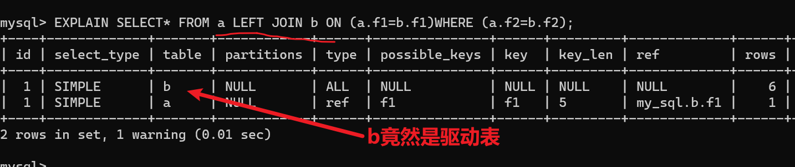

    得出这种结论太不可思议了，跟上一个show warnings看看：
  
    
  
    **测试2结果：**
  
    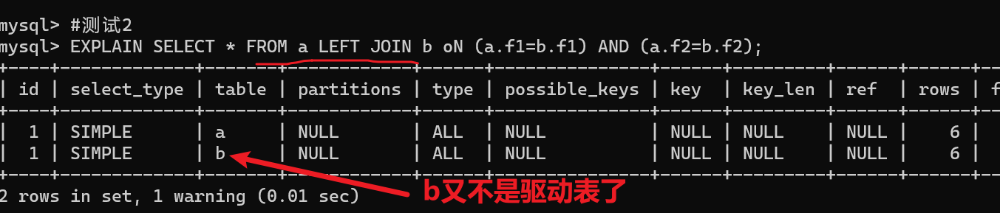
  
    继续show warnings \G
  
    

##### 2.Simple Nested-Loop Join(简单嵌套循环连接)

算法相当简单，从表A中取出一条数据1，遍历表B，将匹配到的数据放到result...以此类推，驱动表A中的每一条记录与被驱动表B的记录进行判断:


这个例子是在没有索引的情况，做了全表扫描

可以看到这种方式效率是非常低的，以上述表A数据100条，表B数据1000条计算，则A*B=10万次。开销统计如下:


当然mysql肯定不会这么粗暴的去进行表的连接，所以就出现了后面的两种对Nested-Loop Join优化算法。


##### 3.Index Nested-Loop Join(索引嵌套循环连接)

Index Nested-Loop Join其优化的思路主要是为了`减少内层表数据的匹配次数`，所以要求被驱动表上必须`有索引`才行。通过外层表匹配条件直接与内层表索引进行匹配，避免和内层表的每条记录去进行比较，这样极大的减少了对内层表的匹配次数。


驱动表中的每条记录通过被驱动表的索引进行访问，因为索引查询的成本是比较固定的，故mysql优化器都倾向于使用记录数少的表作为驱动表(外表)。


如果被驱动表加索引，效率是非常高的，但如果索引不是主键索引，所以还得进行一次回表查询。相比，被驱动表的索引是主键索引，效率会更高。


##### 4.Block Nested-Loop Join(块嵌套循环连接)

如果存在索引，那么会使用index的方式进行join，如果join的列没有索引，被驱动表要扫描的次数太多了。每次访问被驱动表，其表中的记录都会被加载到内存中，然后再从驱动表中取一条与其匹配，匹配结束后清除内存，然后再从驱动表中加载一条记录，然后把被驱动表的记录在加载到内存匹配这样周而复始，大大增加了IO的次数。为了减少被驱动表的IO次数，就出现了Block Nested-Loop Join的方式。

不再是逐条获取驱动表的数据，而是一块一块的获取，引入了`join buffer缓冲区`，将`驱动表join`相关的部分数据列(大小受join buffer的限制)缓存到join buffer中，然后全表扫描被驱动表，被驱动表的每一条记录一次性和**join**
**buffer**中的所有驱动表记录进行匹配（`内存中操作`)，将简单嵌套循环中的多次比较合并成一次，降低了被驱动表的访问频率。

> 注意:
>
> 这里缓存的不只是关联表的列, select后面的列也会缓存起来。**（存的是驱动表）**
>
> 在一个有N个join关联的sql中会分配N-1个join buffer。所以查询的时候尽量减少不必要的字段，可以让joinbuffer中可以存放更多的列。

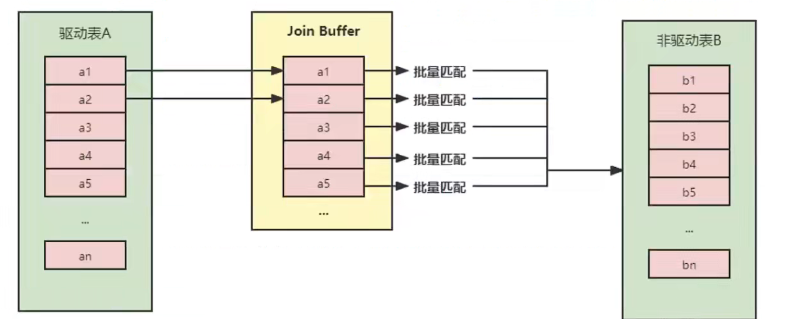


参数设置：

- block_nested_loop

  通过`show variables like '%optimizer_switch%'`查看`block_nested_loop`状态。默认是开启的。

- join_buffer_size

  驱动表能不能一次加载完，要看join buffer能不能存储所有的数据，默认情况下`join_buffer_size=256k`。

  ```mysql
  mysql> show variables like '%join_buffer%';
  +------------------+--------+
  | Variable_name    | Value  |
  +------------------+--------+
  | join_buffer_size | 262144 |
  +------------------+--------+
  1 row in set (0.00 sec)
  ```

  join_buffer_size的最大值在32位系统可以申请4G，而在64位操做系统下可以申请大于4G的Join Buffer空间(64位Windows除外，其大值会被截断为4GB并发出警告)。


##### 5.Join小结

1、**整体效率比较:INLJ > BNLJ > SNLJ**

2、永远用小结果集驱动大结果集(其本质就是减少外层循环的数据数量)(小的度量单位指的是`表行数*每行大小`)

```mysql
# straight_join 不然优化器优化谁是驱动表  驱动表 straight_join 被驱动表
# 这个例子是说t2 的列比较多，，相同的join buffer 加的会比较少。所以不适合用t2 作为  ！！！驱动表
select t1.b,t2.* from t1 straight_join t2 on (t1.b=t2.b) where t2.id<=180;#推荐

select t1.b,t2.* from t2 straight_join t1 on (t1.b=t2.b) where t2.id<=100;#不推荐
```

3、为被驱动表匹配的条件增加索引(减少内层表的循环匹配次数)

4、增大join buffer size的大小(一次缓存的数据越多，那么内层包的扫表次数就越少)

5、减少`驱动表`不必要的字段查询（字段越少，join buffer 所缓存的数据就越多)

6、在决定哪个表做驱动表的时候，应该是两个表按照各自的条件过滤，过滤完成之后，计算参与join的各个字段的总数据量，数据量小的那个表，就是“小表”，应该作为驱动表。


#### 3.5 小结

- 保证被驱动表的JOIN字段已经创建了索引
- 需要JOIN 的字段，数据类型保持绝对一致。
- LEFT JOIN 时，选择小表作为驱动表，`大表作为被驱动表`。减少外层循环的次数。
- INNER JOIN 时，MySQL会自动将`小结果集的表选为驱动表`。选择相信MySQL优化策略。
- 能够直接多表关联的尽量直接关联，不用子查询。(减少查询的趟数)
- 不建议使用子查询，建议将子查询SQL拆开结合程序多次查询，或使用 JOIN 来代替子查询。
- 衍生表建不了索引


#### 3.6 Hash Join

**从MySQL的8.0.20版本开始将废弃BNLJ，因为从MySQL8.0.18版本开始就加入了hash join默认都会使用hash join**

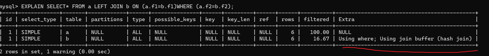

- Nested Loop:
  对于被连接的数据子集较小的情况，Nested Loop是个较好的选择。

- Hash Join是做`大数据集连接`时的常用方式，优化器使用两个表中较小(相对较小)的表利用Join Key在内存中建立`散列表`，然后扫描较大的表并探测散列表，找出与Hash表匹配的行。

  - 这种方式适用于较小的表完全可以放于内存中的情况，这样总成本就是访问两个表的成本之和。
  - 在表很大的情况下并不能完全放入内存，这时优化器会将它分割成`若干不同的分区`，不能放入内存的部分就把该分区写入磁盘的临时段，此时要求有较大的临时段从而尽量提高I/O的性能。

  - 它能够很好的工作于没有索引的大表和并行查询的环境中，并提供最好的性能。大多数人都说它是Join的重型升降机。Hash Join只能应用于等值连接(如WHERE A.COL1=B.COL2)，这是由Hash的特点决定的。

  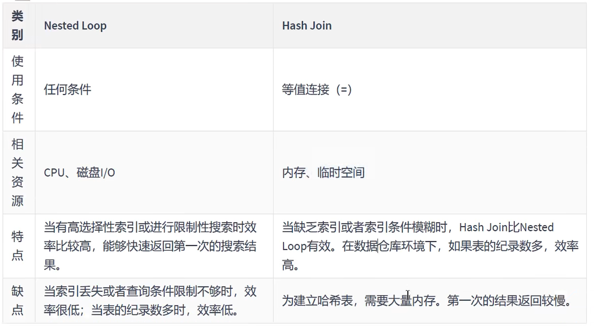


### 4 子查询优化

MySQL从4.1版本开始支持子查询，使用子查询可以进行SELECT语句的嵌套查询，即一个SELECT查询的结果作为另一个SELECT语句的条件。`子查询可以一次性完成很多逻辑上需要多个步骤才能完成的SQL操作`。

**子查询是MySQL的一项重要的功能，可以帮助我们通过一个SQL语句实现比较复杂的查询。但是，子查询的执行效率不高。**原因:

1. 执行子查询时MySQL需要为内层查询语句的查询结果`建立一个临时表`，然后外层查询语句从临时表中查询记录。查询完毕后，再`撤销这些临时表`。这样会消耗过多的CPU和IO资源，产生大量的慢查询。

2. 子查询的结果集存储的临时表，不论是内存临时表还是磁盘临时表都`不会存在索引`，所以查询性能会受到一定的影响。

3. 对于返回结果集比较大的子查询，其对查询性能的影响也就越大。

**在MySQL中，可以使用连接（JOIN）查询来替代子查询**。连接查询不需要`建立临时表`，其`速度比子查询要快`，如果查询中使用索引的话，性能就会更好。

举例1:查询学生表中是班长的学生信息

- 使用子查询

  ```mysql
  #创建班级表中班长的索引
  CREATE INDEX idx_monitor ON class ( monitor ) ;
  
  EXPLAIN SELECT *FROM student stu1
  WHERE stu1.`stuno` IN(
  	SELECT monitor
  	FROM class c
  	WHERE monitor IS NOT NULL);
  ```

- 推荐:使用多表查询

  ```mysql
  EXPLAIN SELECT stu1.* FROM student stu1 JOIN class c
  ON stu1.`stuno` = c. `monitor`
  WHERE c. `monitor` IS NOT NULL;
  ```


举例2:取所有不为班长的同学 不推荐

- 子查询

  ```mysql
  EXPLAIN SELECT SQL_NO_CACHE a.* FROM student a
  WHERE a.stuno NOT IN (
  SELECT monitor FROM class bWHERE monitor IS NOT NULL);
  ```

- 修改成多表查询

  ```mysql
  EXPLAIN SELECT SQL_NO_CACHE a.*
  FROM student a LEFT OUTER JOIN class b ON a. stuno =b.monitor
  WHERE b.monitor IS NULL;
  ```

> 结论: 尽量不要使用NOT IN或者NOT EXISTS，用`LEFT JOIN Xxx ON xx WHERE xx IS NULL`替代


### 5 排序优化

#### 5.1排序优化

**问题:** 在WHERE条件字段上加索引，但是为什么在ORDER BY字段上还要加索引呢?

**回答:**

在MySQL中，支持两种排序方式，分别是`FileSort`和`Index`排序。

- Index排序中，索引可以保证数据的有序性，不需要再进行排序，`效率更高`。
- FileSort排序则一般在`内存中`进行排序，占用`CPU较多`。如果待排结果较大，会产生临时文件I/O到磁盘进行排序的情况，效率较低。

**优化建议:**

1. SQL中，可以在WHERE子句和ORDER BY子句中使用索引，目的是在WHERE子句中`避免全表扫描`，在ORDER BY子句`避免使用FileSort排序`。当然，某些情况下全表扫描，或者FileSort排序不一定比索引慢。但总的来说，我们还是要避免，以提高查询效率。
2. 尽量使用Index完成ORDER BY排序。如果WHERE和ORDER BY后面是相同的列就使用单索引列；如果不同就使用联合索引。
3. 无法使用Index时，需要对FileSort方式进行调优。


#### 5.2测试

删除student表和class表中已创建的索引。

```mysql
#方式1:
DROP INDEX idx_monitor ON class;

DROP INDEX idx_cid ON student;
DROP INDEX idx_age ON student;DROP INDEX idx_name ON student ;
DROP INDEX idx_age_name_classid ON student ;DROP INDEX idx_age_classid_name ON student ;

#方式2:
call proc_drop_index( 'atguigudb2' , 'student' );
call proc_drop_index( 'atguigudb2' , 'class' );
```

以下是否能使用到索引，能否去掉`using filesort`

**过程一:**

```mysql
EXPLAIN SELECT SQL_NO_CACHE * FROM student ORDER BY age, classid;

EXPLAIN SELECT SQL_NO_CACHE * FROM student ORDER BY age, classid limit 10;
```

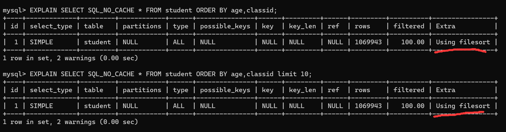


**过程二: order by时不limit，索引失效**

```mysql
#创建索引
CREATE INDEX idx_age_classid_name ON student (age, classid, `name`);
#不限制,索引失效
EXPLAIN SELECT SQL_NO_CACHE * FROM student ORDER BY age ,classid ;
```

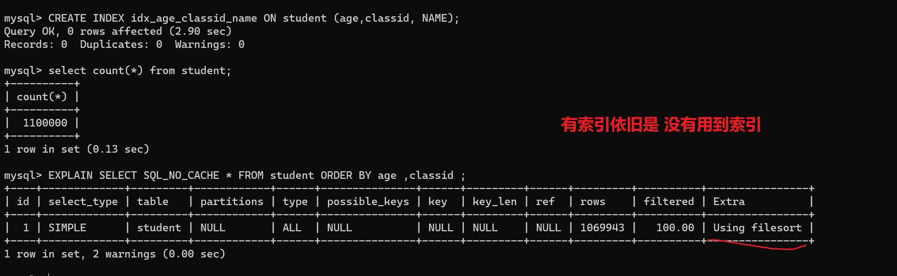

> 这里优化器觉得，还需要回表。会费时间更大，不走索引。

使用覆盖索引试试看

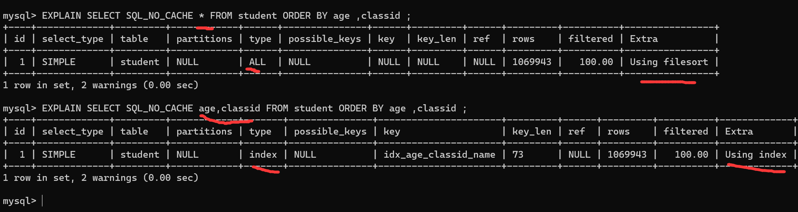

> 不用回表，优化器觉得走索引快。就使用了索引。

增加limit 条件

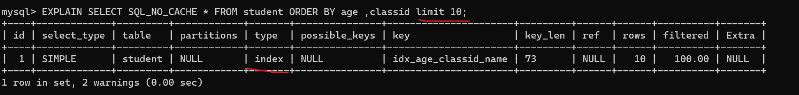

> 增加limit 减少回表的数量，优化器觉得走索引快，会使用索引


**过程三: order by时顺序错误，索引失效**

```mysql
CREATE INDEX idx_age_classid_stuno ON student (age,classid,stuno) ;

#以下哪些索引失效?

# 不会走，最左前缀原则
EXPLAIN SELECT* FROM student ORDER BY classid LIMIT 10;

# 不会走，最左前缀原则
EXPLAIN SELECT* FROM student ORDER BY classid,NAME LIMIT 10;

# 走
EXPLAIN SELECT* FROM student ORDER BY age,classid, stuno LIMIT 10;
# 走
EXPLAIN SELECT *FROM student ORDER BY age,classid LIMIT 10;
# 走
EXPLAIN SELECT * FROM student ORDER BY age LIMIT 10;
```


**过程四: order by时规则不一致,索引失效（顺序错，不索引; 方向反，不索引)**

```mysql
# age desc 方向反 索引失效
EXPLAIN SELECT * FROM student ORDER BY age DESC, classid ASC LIMIT 10;

# 没有最左前缀 索引失效
EXPLAIN SELECT * FROM student ORDER BY classid DESC, NAME DESC LIMIT 10;

# age asc 没问题 classid desc 降序， 优化器认为，文件排序比较快索引失效
# 方向反了不走索引
EXPLAIN SELECT * FROM student ORDER BY age ASC, classid DESC LIMIT 10;

# Backward index scan 走索引了，，倒着走索引
EXPLAIN SELECT * FROM student ORDER BY age DESC, classid DESC LIMIT 10; 
```


**过程五:无过滤,不索引**

```mysql
EXPLAIN SELECT * FROM student WHERE age=45 ORDER BY classid;

EXPLAIN SELECT * FROM student WHERE age=45 ORDER BY classid , name;
```

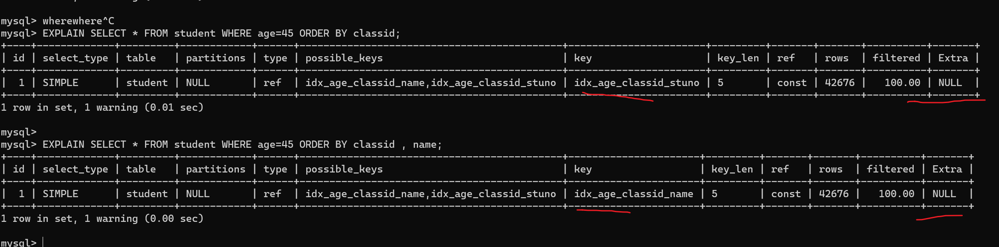

```mysql
EXPLAIN SELECT *FROM student WHERE classid=45 order by age;

EXPLAIN SELECT * FROM student WHERE classid=45 order by age limit 10;
```

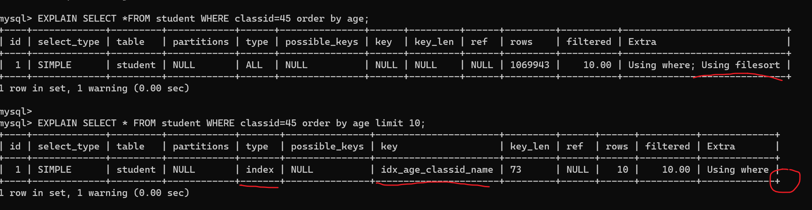

这里第一条排序走Using filesort 很好理解

第二条为啥不是 `Using filesort ` 呢？

这里type = index，key=idx_age_classid_name。 这说明了优化器预估对idx_age_classid_name索引进行完整的遍历。由于索引本身就是根据age升序存储的。。所以只要在遍历的过程中，遇到前十个classid=45。就可以停止遍历。回表返回数据。（根据上完课自己想的，无法验证，不知道有没有偏差）


**小结:**

```mysql
INDEX a_b_c( a, b,c)

order by 能使用索引最左前缀
- ORDER BY a
- ORDER BY a, b
- ORDER BY a , b, c
- ORDER BY a DESC, b DESC,c DESC

# 如果WHERE使用索引的最左前缀定义为常量，则order by 能使用索引
- WHERE a = const ORDER BY b, c
- WHERE a = const AND b = const ORDER BY c
- WHERE a = const ORDER BY b, c
- WHERE a = const AND b > const ORDER BY b , c

# 不能使用索引进行排序
- ORDER BY a ASC, b DESC, c DESC/*排序不一致*/
- WHERE g = const ORDER BY b,c/*丢失a索引*/
- WHERE a = const ORDER BY c/*丢失b索引*/
- WHERE a = const ORDER BY a, d /*d不是索引的一部分*/
- WHERE a in (...) ORDER BY b,c /*对于排序来说，多个相等条件也是范围查询*/
```

> 索引只会用到一个，没办法一个索引用来where 一个索引用来 order by。
>
> 但是可以建立联合索引。


#### 5.3案例实战

ORDER BY子句，尽量使用Index方式排序，避免使用FileSort方式排序。

执行案例前先清除student上的索引，只留主键:

```mysql
DROP INDEX idx_age ON student;
DROP INDEX idx_age_classid_stuno ON student;
DROP INDEX idx_age_classid_name ON student;

#或者
call proc_drop_index( 'my_sql' , ' student' ) ;
show index from student;
```

**场景:查询年龄为30岁的，且学生编号小于101000的学生，按用户名称排序**

```mysql
EXPLAIN SELECT SQL_NO_CACHE * FROM student WHERE age = 30 AND stuno <101000 ORDER BY `name`;
```


```mysql
mysql>  SELECT SQL_NO_CACHE * FROM student WHERE age = 30 AND stuno <101000 ORDER BY NAME;
+-----+--------+--------+------+---------+
| id  | stuno  | name   | age  | classId |
+-----+--------+--------+------+---------+
| 417 | 100417 | bBAYtX |   30 |     159 |
....
| 372 | 100372 | xwODCc |   30 |     764 |
+-----+--------+--------+------+---------+
18 rows in set, 1 warning (3.17 sec)
```

> 结论: type是ALL，即最坏的情况。Extra里还出现了`Using filqsort`,也是最坏的情况。优化是必须的。

优化思路：

**方案一:为了去掉filesort我们可以把索引建成**

```mysql
#创建新索引
CREATE INDEX idx_age_name ON student(age, `name`);

EXPLAIN SELECT SQL_NO_CACHE * FROM student WHERE age = 30 AND stuno <101000 ORDER BY NAME;
```


**方案二:尽量让where的过滤条件和排序使用上索引**

```mysql
DROP INDEX idx_age_name ON student;
# 建一个三个字段的组合索引
create index idx_age_stuno_name on student(age,stuno,name);

EXPLAIN SELECT SQL_NO_CACHE * FROM student WHERE age = 30 AND stuno <101000 ORDER BY NAME;
```

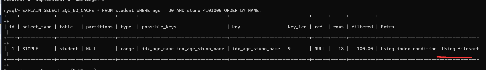

下面这个方案虽然使用了` Using filesort` 但是速度反而更快了。


原因:

所有的排序都是在条件过滤之后才执行的。所以，如果条件过滤掉大部分数据的话，剩下几百几千条数据进行排序其实并不是很消耗性能，即使索引优化了排序，但实际提升性能很有限。相对的stuno<101000这个条件，如果没有用到索引的话，要对几万条的数据进行扫描，这是非常消耗性能的，所以索引放在这个字段上性价比最高，是最优选择。

> 结论:
>
> 1. 两个索引同时存在，mysql自动选择最优的方案。(对于这个例子mysql选择idx_age_stuno_name)。但是，`随着数据量的变化，选择的索引也会随之变化的。`
>
> 2. **当【范围条件】和【group by或者order by】的字段出现二选一时，优先观察条件字段的过滤数量，如果过滤的数据足够多，而需要排序的数据并不多时，优先把索引放在范围字段上。反之，亦然。**

思考:这里我们使用如下索引，是否可行?

```mysql
DROP INDEX idx_age_stuno_name ON student;

# 当然可以了，因为3个也只是用到了两个索引
CREATE INDEX idx_age_stuno ON student(age, stuno) ;
```

 

#### 5.4 filesort算法:双路排序和单路排序

排序的字段若如果不在索引列上，则`filesort`会有两种算法: **双路排序**和**单路排序**

**双路排序（慢)**

- `MySQL 4.1之前是使用双路排序`，字面意思就是两次扫描磁盘，最终得到数据，读取行指针和`order by列`，对他们进行排序，然后扫描已经排序好的列表，按照列表中的值重新从列表中读取对应的数据输出
- 从磁盘取排序字段，在buffer进行排序，再从`磁盘取其他字段`。

取一批数据，要对磁盘进行两次扫描，众所周知，IO是很耗时的，所以在mysql4.1之后，出现了第二种改进的算法，就是单路排序。

**单路排序**（快)

从磁盘读取查询需要的`所有列`，按照order by列在buffer对它们进行排序，然后扫描排序后的列表进行输出，它的效率更快一些，避免了第二次读取数据。并且把随机IO变成了顺序IO，但是它会使用更多的空间，因为它把每一行都保存在内存中了。

**结论及引申出的问题**

- 由于单路是后出的，总体而言好过双路
- 但是用单路有问题
  - 在sort_buffer中，单路比多路要`多占用更多空间`，因为单路是把所有字段都取出，所以有可能取出的数据的总大小超出了`sort_buffer`的容量，导致每次只能取`sort_buffer`容量大小的数据，进行排序〈创建tmp文件，多路合并)，排完再取sort_buffer容量大小，再排......从而多次I/O。
  - 单路本来想省一次IO操作，`反而导致了大量的IO操作`，反而得不偿失。

**优化策略**

**1. 尝试提高sort_buffer_size**

- 不管用哪种算法，提高这个参数都会提高效率，要根据系统的能力去提高，因为这个参数是针对每个进程(connection)的1M-8M之间调整。MySQL5.7，InnoDB存储引擎默认值是1048576字节，1MB。
  
  ```mysql
  mysql> SHOW VARIABLES LIKE '%sort_buffer_size%';
  +-------------------------+---------+
  | Variable_name           | Value   |
  +-------------------------+---------+
  | innodb_sort_buffer_size | 1048576 |
  | myisam_sort_buffer_size | 8388608 |
  | sort_buffer_size        | 262144  |
  +-------------------------+---------+
  3 rows in set (0.00 sec)
  ```

**2. 尝试提高max_length_for_sort_data**

- 提高这个参数，会增加用改进算法的概率。

  ```mysql
  mysql> SHow VARIABLES LIKE '%max_length_for_sort_data%';
  +--------------------------+-------+
  | Variable_name            | Value |
  +--------------------------+-------+
  | max_length_for_sort_data | 4096  |
  +--------------------------+-------+
  1 row in set (0.00 sec)
  ```

- 但是如果设的太高，数据总容量超出`sort_buffer_size`的概率就增大，明显症状是高的磁盘IO活动和低的处理器使用率。如果需要返回的列的总长度大于`max_length_for_sort_data`使用`双路算法`，否则使用单路算法。1024-8192字节之间调整

**3. Order by时select *是一个大忌。最好只Query需要的字段。**原因:

- 当Query的字段大小总和小于`max_length_for_sort_data`，而且排序字段不是TEXT|BLOB类型时，会用改进后的算法――单路排序，否则用老算法――多路排序。
- 两种算法的数据都有可能超出sort_buffer_size的容量，超出之后，会创建tmp文件进行合并排序，导致多次IO，但是用单路排序算法的风险会更大一些，所以要提高`sort_buffer_size`。


### 6 GROUP BY优化

- group by使用索引的原则几乎跟order by一致，group by即使没有过滤条件用到索引，也可以直接使用索引。
- group by先排序再分组，遵照索引建的最佳左前缀法则
- 当无法使用索引列，增大`max_length_for_sort_data`和`sort_buffer_size`参数的设置
- where效率高于having，能写在where限定的条件就不要写在having中了
- 减少使用order by，和业务沟通能不排序就不排序，或将排序放到程序端去做。Order by、group by、distinct这些语句较为耗费CPU，数据库的CPU资源是极其宝贵的。
- 包含了order by、group by、distinct这些查询的语句，where条件过滤出来的结果集请保持在1000行以内，否则SQL会很慢。


### 7 优化分页查询

一般分页查询时，通过创建覆盖索引能够比较好地提高性能。一个常见又非常头疼的问题就是limit 2000000, 10，此时需要MySQL排序前2000010记录，仅仅返回2000000 - 2000010的记录，其他记录丢弃，查询排序的代价非常大。

```mysql
EXPLAIN SELECT * FROM student LIMIT 2088800, 10;
```

**优化思路一**

在索引上完成排序分页操作，最后根据主键关联回原表查询所需要的其他列内容。

```mysql
EXPLAIN SELECT * FROM student t, (SELECT id FROM student ORDER BY id LIMIT 2000000,10) a WHERE t.id = a.id;
```


**优化思路二**(几乎没法用)

该方案适用于主键自增的表，可以把Limit查询转换成某个位置的查询。

```mysql
EXPLAIN SELECT * FROM student WHERE id > 2080880 LIMIT 10;
```

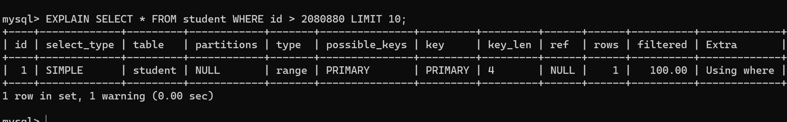

> 不靠谱，生产中id可能会删除，查询的条件也不可能这么简单。


### 8 优先考虑覆盖索引

#### 8.1 什么是覆盖索引？

**理解方式一**：索引是高效找到行的一个方法，但是一般数据库也能使用索引找到一个列的数据，因此它不必读取整个行。毕竟索引叶子节点存储了它们索引的数据；当能通过读取索引就可以得到想要的数据，那就不需要读取行了。**一个索引包含了满足查询结果的数据就叫做覆盖索引。**

**理解方式二：**非聚簇复合索引的一种形式，它包括在查询里的SELECT、JOIN和WHERE子句用到的所有列（即建索引的字段正好是覆盖查询条件中所涉及的字段）。

简单说就是，`索引列+主键`包含`SELECT 到 FROM之间查询的列`。


**举例一:**覆盖索引长什么样子。`索引列+主键`

```mysql
DROP INDEX idx_age_stuno ON student ;
CREATE INDEX idx_age_name ON student (age , NAME);

EXPLAIN SELECT * FROM student WHERE age <>20;
```

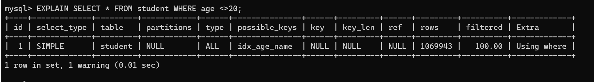

```mysql
EXPLAIN SELECT id, age, NAME FROM student WHERE age <> 28;
```


上述都使用到了声明的索引，下面的情况则不然，在查询列中多了一列classid，显示未使用到索引:

```mysql
EXPLAIN SELECT id, age, NAME, classid FROM student WHERE age <> 28;
```


**举例二**：

```mysql
EXPLAIN SELECT *FROM student WHERE NAME LIKE '%abc';
```

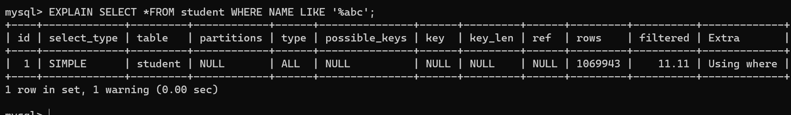

```mysql
CREATE INDEX idx_age_name ON student (age , NAME);
EXPLAIN SELECT id, age ,NAME FROM student WHERE NAME LIKE '%abc ';
```

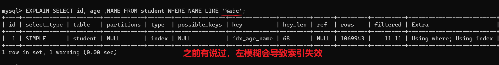

```mysql
# 索引覆盖失效
EXPLAIN SELECT id, age, NAME, classid FROM student WHERE NAME LIKE '%abc ';
```

查询多了classid，结果是未使用到索引

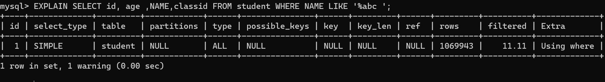

> 之前有说过，不等于与左模糊会导致索引失效。但是这里为什么又用上了呢？
>
> 原因是优化器发现，数据已经都在索引了。直接遍历索引就可以返回数据。而遍历索引，肯定是比遍历全表数据量少的。这样IO就可以更少。
>
> 一切都是成本的考量。


#### 8.2 覆盖索引的利弊

**好处：**

**1. 避免Innodb表进行索引的二次查询（回表）**

Innodb是以聚集索引的顺序来存储的，对于Innodb来说，二级索引在叶子节点中所保存的是行的主键信息，如果是用二级索引查询数据，在查找到相应的键值后，还需通过主键进行二次查询才能获取我们真实所需要的数据。

在覆盖索引中，二级索引的键值中可以获取所要的数据，`避免了对主键的二次查询，减少了IO操作`，提升了查询效率。

**2. 可以把随机IO变成顺序IO加快查询效率**

由于覆盖索引是按键值的顺序存储的，对于IO密集型的范围查找来说，对比随机从磁盘读取每一行的数据IO要少的多，因此利用覆盖索引在访问时也可以把磁盘的`随机读取的IO`转变成索引查找的`顺序IO`。

**3.数据在索引里面数据量少更紧凑**

索引肯定是比原来的数据，数据量少。。这样就可以减少IO.

**由于覆盖索引可以减少树的搜索次数，显著提升查询性能，所以使用覆盖索引是一个常用的性能优化手段。**


**弊端：**

- `索引字段的维护`总是有代价的。因此，在建立冗余索引来支持覆盖索引时就需要权衡考虑了。这是业务DBA，或者称为业务数据架构师的工作。


### 9 如何给字符串添加索引

有一张教师表，表定义如下：  

```mysql
create table teacher(
	ID bigint unsigned primary key,
	email varchar(64),
	...
)engine=innodb;
```

讲师要使用邮箱登录，所以业务代码中一定会出现类似于这样的语句：  

```mysql
mysql> select col1, col2 from teacher where email='xxx';
```

如果email这个字段上没有索引，那么这个语句就只能做`全表扫描`。


#### 9.1 前缀索引

MySQL是支持前缀索引的。默认地，如果你创建索引的语句不指定前缀长度，那么索引就会包含整个字符串

```mysql
mysql> alter table teacher add index index1(email);
#或
mysql> alter table teacher add index index2(email(6))
```

这两种不同的定义在数据结构和存储上有什么区别呢？下图就是这两个索引的示意图  


以及  

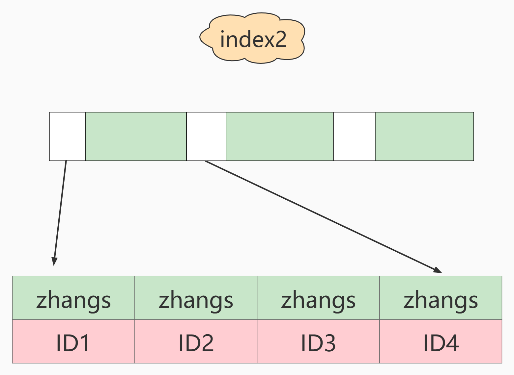

**如果使用的是index1**（即email整个字符串的索引结构），执行顺序是这样的：

1. 从index1索引树找到满足索引值是'zhangssxyz@xxx.com'的这条记录，取得ID2的值；
2. 到主键上查到主键值是ID2的行，判断email的值是正确的，将这行记录加入结果集；
3. 取index1索引树上刚刚查到的位置的下一条记录，发现已经不满足email='zhangssxyz@xxx.com'的条件了，循环结束。

这个过程中，只需要回主键索引取一次数据，所以系统认为只扫描了一行。

**如果使用的是index2**（即email(6)索引结构），执行顺序是这样的：

1. 从index2索引树找到满足索引值是'zhangs'的记录，找到的第一个是ID1；
2. 到主键上查到主键值是ID1的行，判断出email的值不是'zhangssxyz@xxx.com'，这行记录丢弃；
3. 取index2上刚刚查到的位置的下一条记录，发现仍然是'zhangs'，取出ID2，再到ID索引上取整行然后判断，这次值对了，将这行记录加入结果集；
4. 重复上一步，直到在idxe2上取到的值不是’zhangs’时，循环结束。

也就是说使用**前缀索引，定义好长度，就可以做到既节省空间，又不用额外增加太多的查询成本。**前面已经讲过区分度，区分度越高越好。因为区分度越高，意味着重复的键值越少。


#### 9.2 前缀索引对覆盖索引的影响

>  结论：
>
>  使用前缀索引就用不上覆盖索引对查询性能的优化了，这也是你在选择是否使用前缀索引时需要考虑的一个因素。


### 10 索引下推

Index Condition Pushdown(ICP)是MySQL 5.6中新特性，是一种在存储引擎层使用索引过滤数据的一种优化方式。ICP可以减少存储引擎访问基表的次数以及MySQL服务器访问存储引擎的次数。

- 如果没有ICP，存储引擎会遍历索引以定位基表中的行，并将它们返回给MySQL服务器，由MySQL服务器评估`WHERE`后面的条件是否保留行。
- 启用ICP后，如果部分`WHERE`条件可以仅使用索引中的列进行筛选，则MySQL服务器会把这部分`WHERE`条件放到存储引擎筛选。然后，存储引擎通过使用索引条目来筛选数据，并且只有在满足这一条件时才从表中读取行。
  - 好处: ICP可以减少存储引擎必须访问基表的次数和MySQL服务器必须访问存储引擎的次数。
  - 但是，ICP的`加速效果`取决于在存储引擎内通过`ICP筛选`掉的数据的比例。

#### 10.1 使用前后对比

**在不使用ICP索引扫描的过程：**

storage层：只将满足index key条件的索引记录对应的整行记录取出，返回给server层

server 层：对返回的数据，使用后面的where条件过滤，直至返回最后一行。

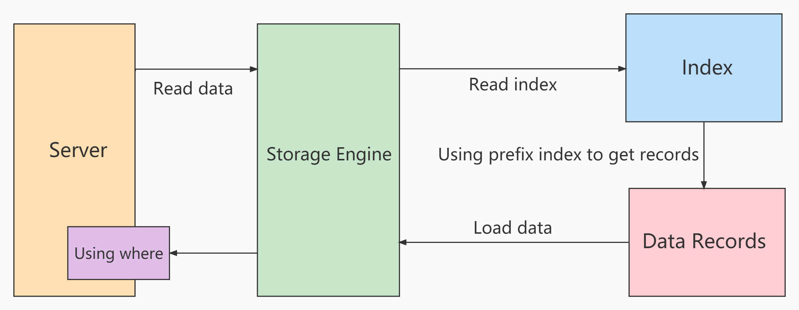

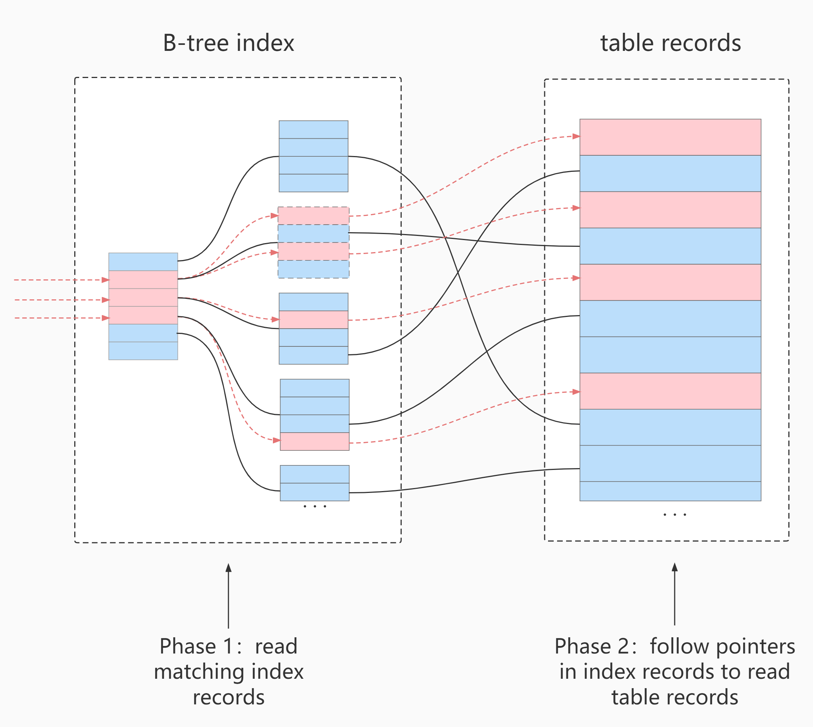

**使用ICP扫描的过程：**

- storage层：

  首先将index key条件满足的索引记录区间确定，然后在索引上使用index filter进行过滤。将满足的index
  filter条件的索引记录才去回表取出整行记录返回server层。不满足index filter条件的索引记录丢弃，不回表、也不会返回server层。
  
- server 层：

  对返回的数据，使用table filter条件做最后的过滤。

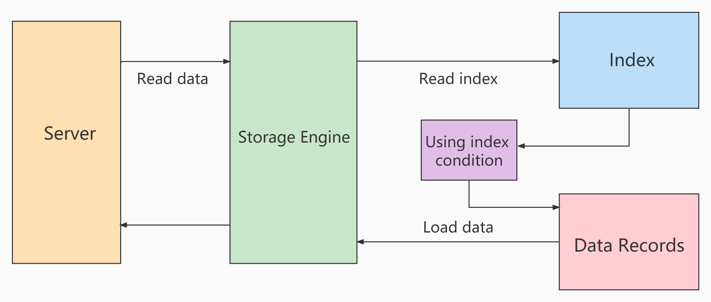

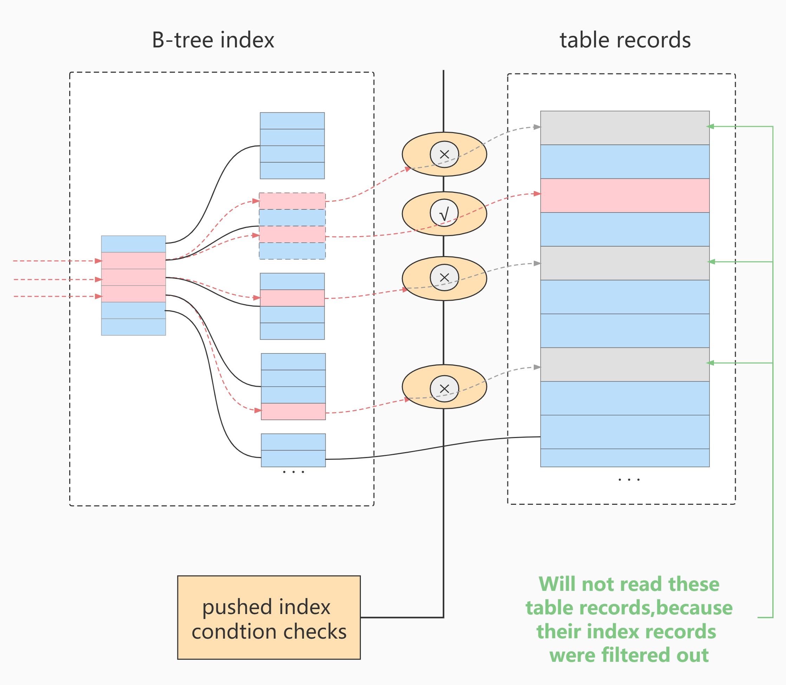

**使用前后的成本差别**

使用前，存储层多返回了需要被index filter过滤掉的整行记录

使用ICP后，直接就去掉了不满足index filter条件的记录，省去了他们回表和传递到server层的成本。

ICP的`加速效果`取决于在存储引擎内通过`ICP筛选掉`的数据的比例


例子：

key1 有索引

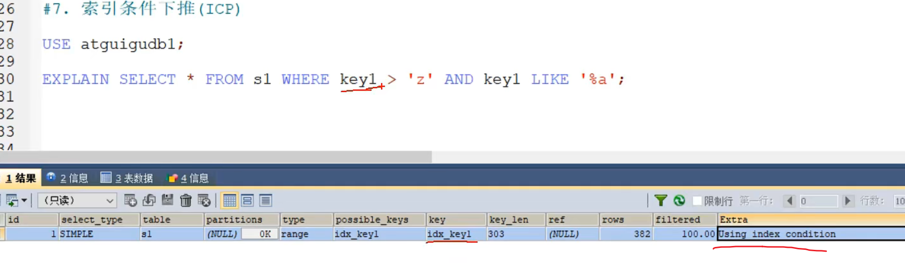

> 这里条件like '%a' 其实可以在索引里面，算出来哪些符合条件。。。。过滤出符合条件的，再回表。这样回表的数据可以减少很多。还有一个好处，没有索引下推，就需要把数据都回表查出来，，这些数据可能在不同的页当中，又会产生IO
>
> 条件下推，下推到下一个条件符不符合。


#### 10.2 ICP的开启/关闭

- 默认情况下启用索引条件下推。可以通过设置系统变量`optimizer_switch`控制:`index_condition_pushdown`

  ```mysql
  #关闭索引下推
  SET optimizer_switch = 'index_condition_pushdown=off ' ;
  
  #打开索引下推
  SET optimizer_switch = 'index_condition_pushdown=on ' ;
  ```

- 当使用索引条件下推时，`EXPLAIN`语句输出结果中Extra列内容显示为`Using index condition`。


#### 10.3 ICP使用案例

建表

```mysql
CREATE TABLE `people` (
	`id` INT NOT NULL AUTO_INCREMENT,
	`zipcode` VARCHAR ( 20 ) COLLATE utf8_bin DEFAULT NULL,
	`firstname` varchar(20)COLLATE utf8_bin DEFAULT NULL,
	`lastname` varchar(20) COLLATE utf8_bin DEFAULT NULL,
	`address` varchar (50)COLLATE utf8_bin DEFAULT NULL,
	PRIMARY KEY ( `id`),
	KEY `zip_last_first` ( `zipcode` , `lastname`, `firstname`)
)ENGINE=InnoDB AUTO_INCREMENT=5 DEFAULT CHARSET=utf8mb3 COLLATE=utf8_bin;
```


插入数据

```mysql
INSERT INTO `people` VALUES
( '1', '000001','三','张','北京市'),
 ( '2', '000002 ','四','李','南京市'),
 ( '3', '000003', '五','王','上海市'),
 ( '4 ', '000001','六','赵','天津市');
```


为该表定义联合索引zip_last_first (zipcode，lastname，firstname)。如果我们知道了一个人的邮编，但是不确定这个人的姓氏，我们可以进行如下检索:

```mysql
SELECT * FROM people
WHERE zipcode= '000001'
AND lastname LIKE '%张%'
AND address LIKE '%北京市%';
```

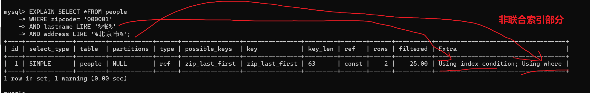

执行查看SQL的查询计划，Extra中显示了`Using index condition`，这表示使用了索引下推。另外，`Using where`表示条件中包含需要过滤的非索引列的数据，即`address LIKE '%北京市%'`这个条件并不是索引列，需要在服务端过滤掉。


#### 10.4 开启和关闭ICP的性能对比

创建存储过程，主要目的就是插入很多000001的数据，这样查询的时候为了在存储引擎层做过滤，减少IO，也为了减少缓冲池（缓存数据页，没有IO）的作用。

```MYSQL
DELIMITER //
CREATE PROCEDURE insert_people( max_num INT )
BEGIN
DECLARE i INT DEFAULT 0;
	SET autocommit = 0;
	REPEAT
	SET i = i + 1;
	INSERT INTo people ( zipcode, firstname , lastname , address ) VALUES ( '000001','六', '赵','天津市');

	UNTIL i = max_num
	END REPEAT;
	COMMIT;
END //
DELIMITER ;
```

调用存储过程

```mysql
call insert_people(1000000);
```

首先打开`profiling`。

```mysql
#查看
mysql> show variables like 'profiling%';
+------------------------+-------+
| Variable_name          | Value |
+------------------------+-------+
| profiling              | OFF   |
| profiling_history_size | 15    |
+------------------------+-------+
```

```mysql
set profiling=1;
```


执行SQL语句，此时默认打开索引下推。

```mysql
SELECT * FROM people WHERE zipcode= '000001' AND lastname LIKE '%张%';
```


再次执行sQL语句，不使用索引下推

```mysql
SELECT /*+ no_icp (people) */ * FROM people WHERE zipcode='000001' AND lastname LIKE '%张%';
```


查看当前会话所产生的所有profiles

```mysql
show profiles\G ;
```

结果如下。

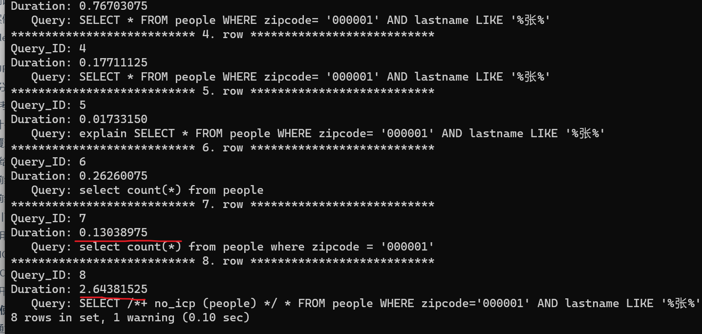


多次测试效率对比来看，使用ICP优化的查询效率会好一些。这里建议多存储一些数据效果更明显。


#### 10.5 ICP的使用条件

1. 如果表访问的类型为`range`、`ref`、`eq_ref`和r`ef_or_null`可以使用ICP

2. ICP可以用于`InnoDB`和`MyISAM`表，包括分区表`InnoDB`和`MyISAM`表

3. 对于`InnoDB`表，`ICP`仅用于二级索引。ICP的目标是减少全行读取次数，从而减少I/o操作。

4. 当SQL使用覆盖索引时，不支持ICP。因为这种情况下使用ICP不会减少I/O。

   索引覆盖不能使用，一个原因是，索引覆盖，不需要回表。ICP作用是减小回表，ICP需要回表

5. 相关子查询的条件不能使用ICP

6. MySQL 5.6版本的不支持分区表的ICP功能，5.7版本的开始支持。


### 11 普通索引 vs 唯一索引

**从性能的角度考虑，你选择唯一索引还是普通索引呢？选择的依据是什么呢？**

假设，我们有一个主键列为ID的表，表中有字段k，并且在k上有索引，假设字段k上的值都不重复。

这个表的建表语句是  

```mysql
mysql> create table test(
	id int primary key,
	k int not null,
	name varchar(16),
	index (k)
)engine=InnoDB;
```

表中R1~R5的(ID,k)值分别为(100,1)、(200,2)、(300,3)、(500,5)和(600,6) 

 

#### 11.1 查询过程

假设，执行查询的语句是 `select id from test where k=5`。

- 对于普通索引来说，查找到满足条件的第一个记录(5,500)后，需要查找下一个记录，直到碰到第一个不满足k=5条件的记录。
- 对于唯一索引来说，由于索引定义了唯一性，查找到第一个满足条件的记录后，就会停止继续检
  索。

那么，这个不同带来的性能差距会有多少呢？答案是 `微乎其微`。


#### 11.2 更新过程

为了说明普通索引和唯一索引对更新语句性能的影响这个问题，介绍一下change buffer。

当需要更新一个数据页时，如果数据页在内存中就直接更新，而如果这个数据页还没有在内存中的话，
在不影响数据一致性的前提下， `InooDB会将这些更新操作缓存在change buffer中` ，这样就不需要从磁
盘中读入这个数据页了。在下次查询需要访问这个数据页的时候，将数据页读入内存，然后执行change
buffer中与这个页有关的操作。通过这种方式就能保证这个数据逻辑的正确性。

将change buffer中的操作应用到原数据页，得到最新结果的过程称为 merge 。除了 访问这个数据页 会触
发merge外，系统有 `后台线程会定期` merge。在 `数据库正常关闭（shutdown）` 的过程中，也会执行merge
操作。

如果能够将更新操作先记录在change buffer， `减少读磁盘` ，语句的执行速度会得到明显的提升。而且，
数据读入内存是需要占用 buffer pool 的，所以这种方式还能够 `避免占用内存` ，提高内存利用率。
`唯一索引的更新就不能使用change buffer` ，实际上也只有普通索引可以使用。

**如果要在这张表中插入一个新记录(4,400)的话，InnoDB的处理流程是怎样的？**


#### 11.3 change buffer的使用场景

1. 普通索引和唯一索引应该怎么选择？

   其实，这两类索引在查询能力上是没差别的，主要考虑的是对`更新性能`的影响。所以，建议你`尽量选择普通索引`。

2. 在实际使用中会发现，`普通索引`和`change buffer`的配合使用，对于`数据量大`的表的更新优化还是很明显的。

3. 如果所有的更新后面，都马上`伴随着对这个记录的查询`，那么你应该`关闭change buffer`。而在其他情况下，change buffer都能提升更新性能。

4. 由于唯一索引用不上change buffer的优化机制，因此如果`业务可以接受`，从性能角度出发建议优先考虑非唯一索引。但是如果"业务可能无法确保"的情况下，怎么处理呢？

   - 首先，`业务正确性优先`。我们的前提是“业务代码已经保证不会写入重复数据”的情况下，讨论性能
     问题。如果业务不能保证，或者业务就是要求数据库来做约束，那么没得选，必须创建唯一索引。
     这种情况下，本节的意义在于，如果碰上了大量插入数据慢、内存命中率低的时候，给你多提供一
     个排查思路。

   - 然后，在一些“`归档库`”的场景，你是可以考虑使用唯一索引的。比如，线上数据只需要保留半年，然后历史数据保存在归档库。这时候，归档数据已经是确保没有唯一键冲突了。要提高归档效率，可以考虑把表里面的唯一索引改成普通索引。  


### 12 其它查询优化策略

#### 12.1 EXISTS 和 IN 的区分

**问题：**

不太理解哪种情况下应该使用EXISTS，哪种情况应该用IN。选择的标准是看能否使用表的索引吗？

**回答：**

索引是个前提，其实选择与否还是要看表的大小。你可以将选择的标准理解为`小表驱动大表`。在这种方式下效率是最高的。

比如下面这样:

```mysql
SELECT * FROM A WHERE cc IN (SELECT cc FROM B)

SELECT * FROM A WHERE EXISTS (SELECT cc FROM B WHERE B.cc=A.cc)
```

当A小于B时，用EXISTS。因为EXISTS的实现，相当于外表循环，实现的逻辑类似于:

```mysql
for i in A
	for j in B
		if j.cc == i.cc then ...
```


当B小于A时用IN，因为实现的逻辑类似于:

```mysql
for i in B
	for j in A
		if j.cc == i.cc then ...
```

哪个表小就用哪个表来驱动，A表小就用EXISTS，B表小就用IN。


#### 12.2 COUNT(*)与COUNT(具体字段)效率

问: 

在MySQL中统计数据表的行数，可以使用三种方式: `SELECT COUNT(*)`、`SELECT COUNT(1)`和`SELECT COUNT(具体字段)`，使用这三者之间的查询效率是怎样的?

答:

前提: 如果你要统计的是某个字段的非空数据行数，则另当别论，毕竟比较执行效率的前提是结果一样才可以。

**环节1:** 

`COUNT(*)`和`COUNT(1)`都是对所有结果进行`COUNT`，`COUNT(*)`和`COUNT(1)`本质上并没有区别(二者执行时间可能略有差别，不过你还是可以把它俩的执行效率看成是相等的)。如果有WHERE子句，则是对所有符合筛选条件的数据行进行统计; 如果没有WHERE子句，则是对数据表的数据行数进行统计。

**环节2:** 

如果是MyISAM存储引擎，统计数据表的行数只需要`o(1)`的复杂度，这是因为每张MyISAM的数据表都有一个meta信息存储了`row_count`值，而一致性则由表级锁来保证。

如果是InnoDB存储引擎，因为InnoDB支持事务，采用行级锁和MVCC机制，所以无法像MyISAM一样，维护一个row_count变量，因此需要采用`扫描全表`，是o(n)复杂度，进行`循环 + 计数`的方式来完成统计。

**环节（重点）3:**

在InnoDB引擎中，如果采用`COUNT(具体字段)`来统计数据行数，要尽量采用二级索引。因为主键采用的索引是聚簇索引，聚簇索引包含的信息多，明显会大于二级索引(非聚簇索引)。对于`COUNT(*)`和`COUNT(1)`来说，它们不需要查找具体的行，只是统计行数，系统会`自动`采用占用空间更小的二级索引来进行统计。

如果有多个二级索引，会使用`key_len`小的二级索引进行扫描。当没有二级索引的时候，才会采用主键索引来进行统计。


#### 12.3 关于SELECT(*)

在表查询中，建议明确字段，不要使用 * 作为查询的字段列表，推荐使用SELECT <字段列表> 查询。原因：

1. MySQL 在解析的过程中，会通过 `查询数据字典` 将"*"按序转换成所有列名，这会大大的耗费资源和时间。
2. 无法使用 `覆盖索引`


#### 12.4 LIMIT 1 对优化的影响

针对的是会扫描全表的SQL语句，如果你可以确定结果集只有一条，那么加上 LIMIT 1 的时候，当找到一条结果的时候就不会继续扫描了，这样会加快查询速度。

如果数据表已经对字段建立了唯一索引，那么可以通过索引进行查询，不会全表扫描的话，就不需要加上 `LIMIT 1` 了。


#### 12.5 多使用COMMIT

只要有可能，在程序中尽量多使用COMMIT，这样程序的性能得到提高，需求也会因为COMMIT所释放的资源而减少。

COMMIT 所释放的资源：

- 回滚段上用于恢复数据的信息
- 被程序语句获得的锁
- redo / undo log buffer 中的空间
- 管理上述 3 种资源中的内部花费


### 13 淘宝数据库，主键如何设计的？

聊一个实际问题：淘宝的数据库，主键是如何设计的？

某些错的离谱的答案还在网上年复一年的流传着，甚至还成为了所谓的MySQL军规。其中，一个最明显的错误就是关于MySQL的主键设计。

大部分人的回答如此自信：用8字节的 BIGINT 做主键，而不要用INT。`错`！

这样的回答，只站在了数据库这一层，而没有`从业务的角度`思考主键。主键就是一个自增ID吗？站在2022年的新年档口，用自增做主键，架构设计上可能`连及格都拿不到`。

#### 13.1 自增ID的问题

自增ID做主键，简单易懂，几乎所有数据库都支持自增类型，只是实现上各自有所不同而已。自增ID除了简单，其他都是缺点，总体来看存在以下几方面的问题：

1. **可靠性不高**

   存在自增ID回溯的问题，这个问题直到最新版本的MySQL 8.0才修复。

2. **安全性不高**

   对外暴露的接口可以非常容易猜测对应的信息。比如：/User/1/这样的接口，可以非常容易猜测用户ID的值为多少，总用户数量有多少，也可以非常容易地通过接口进行数据的爬取。

3. **性能差**

   自增ID的性能较差，需要在数据库服务器端生成。

4. **交互多**

   业务还需要额外执行一次类似`last_insert_id()`的函数才能知道刚才插入的自增值，这需要多一次的网络交互。在海量并发的系统中，多1条SQL，就多一次性能上的开销。

5. **局部唯一性**

   最重要的一点，自增ID是局部唯一，只在当前数据库实例中唯一，而不是全局唯一，在任意服务器间都是唯一的。对于目前分布式系统来说，这简直就是噩梦。


#### 13.2 业务字段做主键

为了能够唯一地标识一个会员的信息，需要为`会员信息表`设置一个主键。那么，怎么为这个表设置主键，才能达到我们理想的目标呢？这里我们考虑业务字段做主键。

表数据如下：


在这个表里，哪个字段比较合适呢？

- **选择卡号（cardno）**

  会员卡号（cardno）看起来比较合适，因为会员卡号不能为空，而且有唯一性，可以用来标识一条会员记录。

```mysql
mysql> CREATE TABLE demo.membermaster
-> (
-> cardno CHAR(8) PRIMARY KEY, -- 会员卡号为主键
-> membername TEXT,
-> memberphone TEXT,
-> memberpid TEXT,
-> memberaddress TEXT,
-> sex TEXT,
-> birthday DATETIME
-> );
Query OK, 0 rows affected (0.06 sec)
```

不同的会员卡号对应不同的会员，字段“cardno”唯一地标识某一个会员。如果都是这样，会员卡号与会员一一对应，系统是可以正常运行的。

但实际情况是，`会员卡号可能存在重复使用`的情况。比如，张三因为工作变动搬离了原来的地址，不再到商家的门店消费了（退还了会员卡），于是张三就不再是这个商家门店的会员了。但是，商家不想让这个会员卡空着，就把卡号是“10000001”的会员卡发给了王五。

从系统设计的角度看，这个变化只是修改了会员信息表中的卡号是“10000001”这个会员信息，并不会影响到数据一致性。也就是说，修改会员卡号是“10000001”的会员信息，系统的各个模块，都会获取到修改后的会员信息，不会出现“有的模块获取到修改之前的会员信息，有的模块获取到修改后的会员信息，而导致系统内部数据不一致”的情况。因此，从`信息系统层面`上看是没问题的。

但是从使用`系统的业务层面`来看，就有很大的问题了，会对商家造成影响。

比如，我们有一个销售流水表（trans），记录了所有的销售流水明细。2021年12月01日，张三在门店购买了一本书，消费了89元。那么，系统中就有了张三买书的流水记录，如下所示：  


接着，我们查询一下2020年12月01日的会员销售记录：

```mysql
mysql> SELECT b.membername,c.goodsname,a.quantity,a.salesvalue,a.transdate
-> FROM demo.trans AS a
-> JOIN demo.membermaster AS b
-> JOIN demo.goodsmaster AS c
-> ON (a.cardno = b.cardno AND a.itemnumber=c.itemnumber);
+------------+-----------+----------+------------+---------------------+
| membername | goodsname | quantity | salesvalue | transdate           |
+------------+-----------+----------+------------+---------------------+
| 张三       | 书         | 1.000    | 89.00      | 2020-12-01 00:00:00 |
+------------+-----------+----------+------------+---------------------+
1 row in set (0.00 sec)
```

如果会员卡“10000001”又发给了王五，我们会更改会员信息表。导致查询时：  

```mysql
mysql> SELECT b.membername,c.goodsname,a.quantity,a.salesvalue,a.transdate
-> FROM demo.trans AS a
-> JOIN demo.membermaster AS b
-> JOIN demo.goodsmaster AS c
-> ON (a.cardno = b.cardno AND a.itemnumber=c.itemnumber);
+------------+-----------+----------+------------+---------------------+
| membername | goodsname | quantity | salesvalue | transdate           |
+------------+-----------+----------+------------+---------------------+
| 王五        | 书        | 1.000    | 89.00      | 2020-12-01 00:00:00 |
+------------+-----------+----------+------------+---------------------+
1 row in set (0.01 sec)
```

这次得到的结果是：王五在2020年12月01日，买了一本书，消费89元。显然是错误的！结论：千万不能把会员卡号当做主键。

- **选择会员电话 或 身份证号**

会员电话可以做主键吗？不行的。在实际操作中，手机号也存在`被运营商收回`，重新发给别人用的情况。

那身份证号行不行呢？好像可以。因为身份证决不会重复，身份证号与一个人存在一一对应的关系。可问题是，身份证号属于`个人隐私`，顾客不一定愿意给你。要是强制要求会员必须登记身份证号，会把很多客人赶跑的。其实，客户电话也有这个问题，这也是我们在设计会员信息表的时候，允许身份证号和电话都为空的原因。

**所以，建议尽量不要用跟业务有关的字段做主键。毕竟，作为项目设计的技术人员，我们谁也无法预测在项目的整个生命周期中，哪个业务字段会因为项目的业务需求而有重复，或者重用之类的情况出现。**

> 经验：
>
> 刚开始使用 MySQL 时，很多人都很容易犯的错误是喜欢用业务字段做主键，想当然地认为了解业务需求，但实际情况往往出乎意料，而更改主键设置的成本非常高。


#### 13.3 淘宝的主键设计

在淘宝的电商业务中，订单服务是一个核心业务。请问，`订单表的主键`淘宝是如何设计的呢？是自增ID吗？

打开淘宝，看一下订单信息：  


从上图可以发现，订单号不是自增ID！我们详细看下上述4个订单号：  

```mysql
1550672064762308113
1481195847180308113
1431156171142308113
1431146631521308113
```

订单号是19位的长度，且订单的最后6位都是一样的，都是308113。且订单号的前面14位部分是单调递增的。大胆猜测，淘宝的订单ID设计应该是：  

```mysql
订单ID = 时间 + 去重字段 + 用户ID后6位尾号
```

这样的设计能做到全局唯一，且对分布式系统查询及其友好。


#### 13.4 推荐的主键设计

`非核心业务`：对应表的主键自增ID，如告警、日志、监控等信息。

`核心业务`：**主键设计至少应该是全局唯一且是单调递增**。全局唯一保证在各系统之间都是唯一的，单调递增是希望插入时不影响数据库性能。

这里推荐最简单的一种主键设计：UUID。

**UUID的特点：**

全局唯一，占用36字节，数据无序，插入性能差。  

**认识UUID：**

- 为什么UUID是全局唯一的？
- 为什么UUID占用36个字节？
- 为什么UUID是无序的？

MySQL数据库的UUID组成如下所示：

```text
UUID = 时间 + UUID版本（16字节）- 时钟序列（4字节） - MAC地址（12字节）
```

我们以UUID值e0ea12d4-6473-11eb-943c-00155dbaa39d举例:

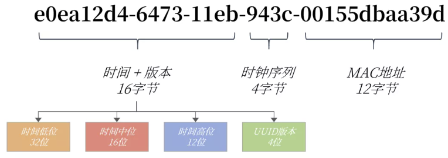

`为什么UUID是全局唯一的？`

在UUID中时间部分占用60位，存储的类似TIMESTAMP的时间戳，但表示的是从1582-10-15 00：00：00.00到现在的100ns的计数。可以看到UUID存储的时间精度比TIMESTAMPE更高，时间维度发生重复的概率降低到1/100ns。

时钟序列是为了避免时钟被回拨导致产生时间重复的可能性。MAC地址用于全局唯一。

`为什么UUID占用36个字节？`

UUID根据字符串进行存储，设计时还带有无用"-"字符串，因此总共需要36个字节。

`为什么UUID是随机无序的呢？`

因为UUID的设计中，将时间低位放在最前面，而这部分的数据是一直在变化的，并且是无序。

**改造UUID**

若将时间高低位互换，则时间就是单调递增的了，也就变得单调递增了。MySQL 8.0可以更换时间低位和时间高位的存储方式，这样UUID就是有序的UUID了。

MySQL 8.0还解决了UUID存在的空间占用的问题，除去了UUID字符串中无意义的"-"字符串，并且将字符串用二进制类型保存，这样存储空间降低为了16字节。

可以通过MySQL8.0提供的uuid_to_bin函数实现上述功能，同样的，MySQL也提供了bin_to_uuid函数进行转化：

```mysql
SET @uuid = UUID();
SELECT @uuid,uuid_to_bin(@uuid),uuid_to_bin(@uuid,TRUE);
# uuid_to_bin(@uuid) 转成16进制存储
# uuid_to_bin(@uuid,TRUE); 调换 时间高位 和 时间低位 的顺序，就可以保证uuid有序了
```


**通过函数uuid_to_bin(@uuid,true)将UUID转化为有序UUID了。**全局唯一 + 单调递增，这不就是我们想要的主键！

**有序UUID性能测试**

16字节的有序UUID，相比之前8字节的自增ID，性能和存储空间对比究竟如何呢？

我们来做一个测试，插入1亿条数据，每条数据占用500字节，含有3个二级索引，最终的结果如下所示：


从上图可以看到插入1亿条数据有序UUID是最快的，而且在实际业务使用中有序UUID在`业务端就可以生成`。还可以进一步减少SQL的交互次数。

另外，虽然有序UUID相比自增ID多了8个字节，但实际只增大了3G的存储空间，还可以接受。

> 在当今的互联网环境中，非常不推荐自增ID作为主键的数据库设计。更推荐类似有序UUID的全局唯一的实现。
>
> 另外在真实的业务系统中，主键还可以加入业务和系统属性，如用户的尾号，机房的信息等。这样的主键设计就更为考验架构师的水平了。

**如果不是MySQL8.0 肿么办？**

手动赋值字段做主键！

比如，设计各个分店的会员表的主键，因为如果每台机器各自产生的数据需要合并，就可能会出现主键重复的问题。

可以在总部 MySQL 数据库中，有一个管理信息表，在这个表中添加一个字段，专门用来记录当前会员编号的最大值。

门店在添加会员的时候，先到总部 MySQL 数据库中获取这个最大值，在这个基础上加1，然后用这个值作为新会员的“id”，同时，更新总部 MySQL 数据库管理信息表中的当前会员编号的最大值。

这样一来，各个门店添加会员的时候，都对同一个总部 MySQL 数据库中的数据表字段进行操作，就解决了各门店添加会员时会员编号冲突的问题。

------

## 十、数据库的设计规范

### 1 为什么需要数据库设计

**我们在设计数据表的时候，要考虑很多问题**。比如: 

- 用户都需要什么数据？需要在数据表中保存哪些数据？
- 如何保证数据表中数据的`正确性`，当插入、删除、更新的时候该进行怎样的`约束检查`？
- 如何降低数据表的`数据冗余度`，保证数据表不会因为用户量的增长而迅速扩张？
- 如何让负责数据库维护的人员`更方便`地使用数据库？
- 使用数据库的应用场景也各不相同，可以说针对不同的情况，设计出来的数据表可能`千差万别`。

**现实情况中，面临的场景**:

当数据库运行了一段时间之后，我们才发现数据表设计的有问题。重新调整数据表的结构，就需要做数据迁移,
还有可能影响程序的业务逻辑，以及网站正常的访问。

**如果是糟糕的数据库设计可能会造成以下问题**：

- 数据冗余、信息重复，存储空间浪费
- 数据更新、插入、删除的异常
- 无法正确表示信息
- 丢失有效信息
- 程序性能差

**良好的数据库设计则有以下优点**:

- 节省数据的存储空间
- 能够保证数据的完整性
- 方便进行数据库应用系统的开发

总之，开始设置数据库的时候，我们就需要重视数据表的设计。为了建立`冗余较小`、`结构合理`的数据库，设计数据库时必须遵循一定的规则。


### 2 范式

#### 2.1 范式简介

**在关系型数据库中，关于数据表设计的基本原则、规则就称为范式**。可以理解为，一张数据表的设计结构需要满足的某种设计标准的`级别`。要想设计一个结构合理的关系型数据库，必须满足一定的范式。

范式的英文名称是`Normal Form`，简称`NF`。它是英国人 E.F.Codd 在上个世纪70年代提出关系数据库模型后总结出来的。范式是关系数据库理论的基础，也是我们在设计数据库结构过程中所要遵循的`规则`和`指导方法`。


#### 2.2 范式都包括哪些

目前关系型数据库有六种常见范式，按照范式级别，从低到高分别是：**第一范式（1NF）、第二范式（2NF）、第三范式（3NF）、巴斯-科德范式（BCNF）、第四范式(4NF）和第五范式（5NF，又称完美范式）**。

数据库的范式设计越高阶，冗余度就越低，同时高阶的范式一定符合低阶范式的要求，满足最低要求的范式是第一范式(1NF)。在第一范式的基础上进一步满足更多规范要求的称为第二范式(2NF)，其余范式以次类推。

一般来说，在关系型数据库设计中，最高也就遵循到`BCNF`，普遍还是`3NF`。但也不绝对，有时候为了提高某些查询性能，我们还需要破坏范式规则，也就是`反规范化`。


#### 2.3 键和相关属性的概念

范式的定义会使用到主键和候选键，数据库中的键(Key)由一个或者多个属性组成。数据表中常用的几种键和属性的定义：

- `超键`：能唯一标识元组的属性集叫做超键。
- `候选键`：如果超键不包括多余的属性，那么这个超键就是候选键。
- `主键`：用户可以从候选键中选择一个作为主键。
- `外键`：如果数据表R1中的某属性集不是R1的主键，而是另一个数据表R2的主键，那么这个属性集就是数据表R1的外键。
- `主属性`：包含在任一候选键中的属性称为主属性。
- `非主属性`：与主属性相对，指的是不包含在任何一个候选键中的属性。

通常，我们也将候选键称之为“`码`”，把主键也称为“`主码`”。因为键可能是由多个属性组成的，针对单个属性，我们还可以用主属性和非主属性来进行区分。

**举例**：

这里有两个表：

`球员表(player)`：球员编号 | 姓名 | 身份证号 | 年龄 | 球队编号

`球队表(team)`：球队编号 | 主教练 | 球队所在地

- `超键`：对于球员表来说，超键就是包括球员编号或者身份证号的任意组合，比如（球员编号）（球员编号，姓名）（身份证号，年龄）等。
- `候选键`：就是最小的超键，对于球员表来说，候选键就是（球员编号）或者（身份证号）。
- `主键`：我们自己选定，也就是从候选键中选择一个，比如（球员编号）。
- `外键`：球员表中的球队编号。
- `主属性`、`非主属性`：在球员表中，主属性是（球员编号）（身份证号），其他的属性（姓名）（年龄）（球队编号）都是非主属性。


#### 2.4 第一范式(1st NF)

第一范式主要是确保数据表中每个字段的值必须具有`原子性`，也就是说数据表中每个字段的值为`不可再次拆分的`最小数据单元。

我们在设计某个字段的时候，对于字段X来说，不能把字段X拆分成字段X-1和字段X-2。事实上，任何的DBMS都会满足第一范式的要求，不会将字段进行拆分。


**举例1**：

假设一家公司要存储员工的姓名和联系方式。它创建一个如下表：

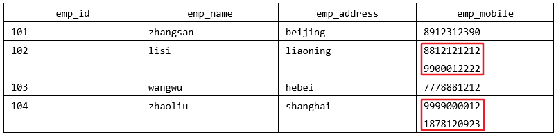

该表不符合1NF，因为规则说“表的每个属性必须具有原子（单个）值”，lisi和zhaoliu员工的emp_mobile值违反了该规则。为了使表符合1NF，我们应该有如下表数据：

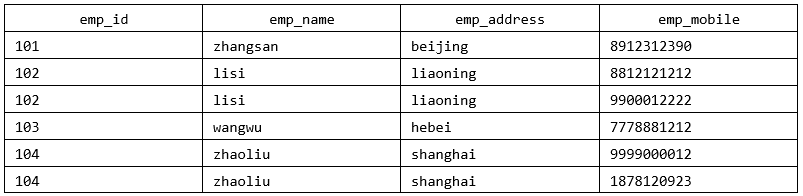


**举例2**：

user 表的设计不符合第一范式

| **字段名称** | **字段类型** | **是否是主键** | **说明**                            |
| ------------ | ------------ | -------------- | ----------------------------------- |
| id           | INT          | 是             | 主键id                              |
| username     | VARCHAR(30)  | 否             | 用户名                              |
| password     | VARCHAR(50)  | 否             | 密码                                |
| user_info    | VARCHAR(255) | 否             | 用户信息 (包含真实姓名、电话、住址) |

其中，user_info字段为用户信息，可以进一步拆分成更小粒度的字段，不符合数据库设计对第一范式的要求。将user_info拆分后如下：

| **字段名称** | **字段类型** | **是否是主键** | **说明** |
| ------------ | ------------ | -------------- | -------- |
| id           | INT          | 是             | 主键id   |
| username     | VARCHAR(30)  | 否             | 用户名   |
| password     | VARCHAR(50)  | 否             | 密码     |
| real_name    | VARCHAR(30)  | 否             | 真实姓名 |
| phone        | VARCHAR(12)  | 否             | 联系电话 |
| address      | VARCHAR(100) | 否             | 家庭住址 |


**举例3**：

属性的原子性是`主观的`。例如，Employees关系中雇员姓名应当使用1个（fullname）、2个（firstname和lastname）还是3个（firstname、middlename和lastname）属性表示呢？答案取决于应用程序。如果应用程序需要分别处理雇员的姓名部分（如：用于搜索目的），则有必要把它们分开。否则，不需要。

表1：

| **姓名** | **年龄** | **地址**               |
| -------- | -------- | ---------------------- |
| 张三     | 20       | 广东省广州市三元里78号 |
| 李四     | 24       | 广东省深圳市龙华新区   |

表2：

| **姓名** | **年龄** | **省** | **市** | **地址**   |
| -------- | -------- | ------ | ------ | ---------- |
| 张三     | 20       | 广东   | 广州   | 三元里78号 |
| 李四     | 24       | 广东   | 深圳   | 龙华新区   |


#### 2.5 第二范式(2nd NF)

第二范式要求，在满足第一范式的基础上，还要**满足数据表里的每一条数据记录，都是可唯一标识的。而且所有非主键字段，都必须完全依赖主键，不能只依赖主键的一部分**。如果知道主键的所有属性的值，就可以检索到任何元组(行)的任何属性的任何值。(要求中的主键，其实可以拓展替换为候选键)。


**举例1**：

`成绩表`（学号，课程号，成绩）关系中，（学号，课程号）可以决定成绩，但是学号不能决定成绩，课程号也不能决定成绩，所以“（学号，课程号）→ 成绩”就是`完全依赖关系`。


**举例2**：

`比赛表 player_game`，里面包含球员编号、姓名、年龄、比赛编号、比赛时间和比赛场地等属性，这里候选键和主键都为（球员编号，比赛编号），我们可以通过候选键（或主键）来决定如下的关系：

```
(球员编号, 比赛编号) → (姓名, 年龄, 比赛时间, 比赛场地，得分)
```

但是这个数据表不满足第二范式，因为数据表中的字段之间还存在着如下的对应关系：

```
(球员编号) → (姓名，年龄)
(比赛编号) → (比赛时间, 比赛场地)
```

对于非主属性来说，并非完全依赖候选键。这样会产生怎样的问题呢？

1. `数据冗余`：如果一个球员可以参加 m 场比赛，那么球员的姓名和年龄就重复了 m-1 次。一个比赛也可能会有 n 个球员参加，比赛的时间和地点就重复了 n-1 次。
2. `插入异常`：如果我们想要添加一场新的比赛，但是这时还没有确定参加的球员都有谁，那么就没法插入。
3. `删除异常`：如果我要删除某个球员编号，如果没有单独保存比赛表的话，就会同时把比赛信息删除掉。
4. `更新异常`：如果我们调整了某个比赛的时间，那么数据表中所有这个比赛的时间都需要进行调整，否则就会出现一场比赛时间不同的情况。

为了避免出现上述的情况，我们可以把球员比赛表设计为下面的三张表。

| **表名**                    | **属性（字段）**                   |
| --------------------------- | ---------------------------------- |
| 球员 player 表              | 球员编号、姓名和年龄等属性         |
| 比赛 game 表                | 比赛编号、比赛时间和比赛场地等属性 |
| 球员比赛关系 player_game 表 | 球员编号、比赛编号和得分等属性     |

这样的话，每张数据表都符合第二范式，也就避免了异常情况的发生。

> 1NF 告诉我们字段属性需要是原子性的，而 2NF 告诉我们一张表就是一个独立的对象，一张表只表达一个意思。


**举例3**：

定义了一个名为 Orders 的关系，表示订单和订单行的信息：

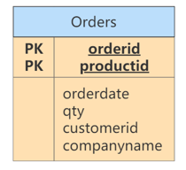

违反了第二范式，因为有非主键属性仅依赖于候选键（或主键）的一部分。例如，可以仅通过orderid找到订单的 orderdate，以及 customerid 和 companyname，而没有必要再去使用productid。

修改：

Orders表和OrderDetails表如下，此时符合第二范式。

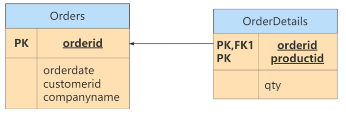

> 小结：
>
> 第二范式(2NF)要求实体的属性完全依赖主关键字。如果存在不完全依赖，那么这个属性和主关键字的这一部分应该分离出来形成一个新的实体，新实体与元实体之间是一对多的关系。


#### 2.6 第三范式(3rd NF)

第三范式是在第二范式的基础上，确保数据表中的每一个非主键字段都和主键字段直接相关，也就是说，**要求数据表中的所有非主键字段不能依赖于其他非主键字段**。(即，不能存在非主属性A依赖于非主属性B，非主属性B依赖于主键C的情况，即存在“A→B→C”的决定关系)通俗地讲，该规则的意思是所有`非主键属性`之间不能有依赖关系，必须`相互独立`。

这里的主键可以扩展为候选键。


**举例1**：

`部门信息表`：每个部门有部门编号（dept_id）、部门名称、部门简介等信息。

`员工信息表`：每个员工有员工编号、姓名、部门编号。列出部门编号后就不能再将部门名称、部门简介等与部门有关的信息再加入员工信息表中。

如果不存在部门信息表，则根据第三范式（3NF）也应该构建它，否则就会有大量的数据冗余。


**举例2**：

| **字段名称**  | **字段类型**  | **是否是主键** | **说明**       |
| ------------- | ------------- | -------------- | -------------- |
| id            | INT           | 是             | 商品id（主键） |
| category_id   | INT           | 否             | 商品类别id     |
| category_name | VARCHAR(30)   | 否             | 商品类别名称   |
| goods_name    | VARCHAR(30)   | 否             | 商品名称       |
| price         | DECIMAL(10,2) | 否             | 商品价格       |

商品类别名称依赖于商品类别编号，不符合第三范式。

修改：

表1：符合第三范式的`商品类别表`的设计

| **字段名称**  | **字段类型** | **是否是主键** | **说明**       |
| ------------- | ------------ | -------------- | -------------- |
| id            | INT          | 是             | 商品id（主键） |
| category_name | VARCHAR(30)  | 否             | 商品类别名称   |

表2：符合第三范式的`商品表`的设计

| **字段名称** | **字段类型**  | **是否是主键** | **说明**       |
| ------------ | ------------- | -------------- | -------------- |
| id           | INT           | 是             | 商品id（主键） |
| category_id  | INT           | 否             | 商品类别id     |
| goods_name   | VARCHAR(30)   | 否             | 商品名称       |
| price        | DECIMAL(10,2) | 否             | 商品价格       |

商品表goods通过商品类别id字段（category_id）与商品类别表goods_category进行关联。


**举例3**：

`球员player表`：球员编号、姓名、球队名称和球队主教练。现在，我们把属性之间的依赖关系画出来，如下图所示：

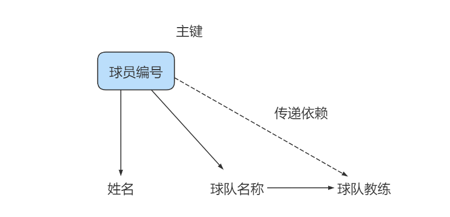

你能看到球员编号决定了球队名称，同时球队名称决定了球队主教练，非主属性球队主教练就会传递依赖于球员编号，因此不符合 3NF 的要求。

如果要达到 3NF 的要求，需要把数据表拆成下面这样：

| **表名** | **属性（字段）**         |
| -------- | ------------------------ |
| 球员表   | 球员编号、姓名和球队名称 |
| 球队表   | 球队名称、球队主教练     |


**举例4**：

修改第二范式中的举例3。

此时的Orders关系包含 orderid、orderdate、customerid 和 companyname 属性，主键定义为 orderid。customerid 和companyname均依赖于主键——orderid。例如，你需要通过orderid主键来查找代表订单中客户的customerid，同样，你需要通过 orderid 主键查找订单中客户的公司名称（companyname）。然而， customerid和companyname也是互相依靠的。为满足第三范式，可以改写如下：

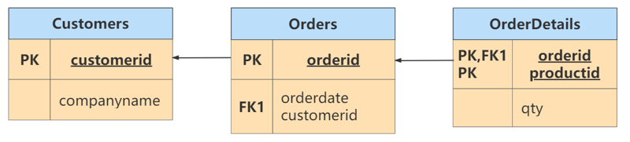

> 符合3NF后的数据模型通俗地讲，2NF和3NF通常以这句话概括：“每个非键属性依赖于键，依赖于整个键，并且除了键别无他物”。


#### 2.7 小结

关于数据表的设计，有三个范式要遵循。

1. 第一范式(1NF)，确保每列保持原子性

   数据库的每一列都是不可分割的原子数据项，不可再分的最小数据单元，而不能是集合、数组、记录等非原子数据项。

2. 第二范式(2NF)，确保每列都和主键完全依赖

   尤其在复合主键的情况下，非主键部分不应该依赖于部分主键。

3. 第三范式(3NF) 确保每列都和主键列直接相关，而不是间接相关


**范式的优点**：

数据的标准化有助于消除数据库中的`数据冗余`，第三范式(3NF)通常被认为在性能、扩展性和数据完整性方面达到了最好的平衡。

**范式的缺点**：

范式的使用，可能`降低查询的效率`。因为范式等级越高，设计出来的数据表就越多、越精细，数据的冗余度就越低，进行数据查询的时候就可能需要`关联多张表`，这不但代价昂贵，也可能使一些`索引策略无效`。


范式只是提出了设计的标准，实际上设计数据表时，未必一定要符合这些标准。开发中，我们会出现为了性能和读取效率违反范式化的原则，通过`增加少量的冗余`或重复的数据来提高数据库的`读性能`，减少关联查询，join 表的次数，实现`空间换取时间`的目的。因此在实际的设计过程中要理论结合实际，灵活运用。

> 范式本身没有优劣之分，只有适用场景不同。**没有完美的设计，只有合适的设计**，我们在数据表的设计中，还需要根据需求将范式和反范式混合使用。


### 3 反范式化

#### 3.1 概述

有的时候不能简单按照规范要求设计数据表，因为有的数据看似冗余，其实对业务来说十分重要。这个时候，我们就要遵循`业务优先`的原则，首先满足业务需求，再尽量减少冗余。

如果数据库中的数据量比较大，系统的UV和PV访问频次比较高，则完全按照MySQL的三大范式设计数据表，读数据时会产生大量的关联查询，在一定程度上会影响数据库的读性能。如果我们想对查询效率进行优化，`反范式优化`也是一种优化思路。此时，可以通过在数据表中`增加冗余字段`来提高数据库的读性能。


**规范化 vs 性能**

> 1. 为满足某种商业目标，数据库性能比规范化数据库更重要
> 2. 在数据规范化的同时，要综合考虑数据库的性能
> 3. 通过在给定的表中添加额外的字段，以大量减少需要从中搜索信息所需的时间
> 4. 通过在给定的表中插入计算列，以方便查询


#### 3.2 应用举例

**举例1**：

员工的信息存储在`employees`表中，部门信息存储在`departments`表中。通过employees表中的department_id字段与departments表建立关联关系。如果要查询一个员工所在部门的名称：

```mysql
select employee_id, department_name
from employees e join departments d
on e.department_id = d.department_id;
```

如果经常需要进行这个操作，连接查询就会浪费很多时间。可以在 employees 表中增加一个冗余字段department_name，这样就不用每次都进行连接操作了。


**举例2**：

反范式化的`goods商品信息表`设计如下：

| **字段名称**  | **字段类型**  | **是否是主键** | **说明**       |
| ------------- | ------------- | -------------- | -------------- |
| id            | INT           | 是             | 商品id（主键） |
| category_id   | INT           | 否             | 商品类别id     |
| category_name | VARCHAR(30)   | 否             | 商品类别名称   |
| goods_name    | VARCHAR(30)   | 否             | 商品名称       |
| price         | DECIMAL(10,2) | 否             | 商品价格       |


**举例3**：

我们有 2 个表，分别是`商品流水表（atguigu.trans）`和`商品信息表（atguigu.goodsinfo）`。商品流水表里有 400 万条流水记录，商品信息表里有 2000 条商品记录。

商品流水表：


商品信息表：


两个表是符合第三范式要求的。但是，在我们项目的实施过程中，对流水的查询频率很高，而且为了获取商品名称，基本都会用到与商品信息表的连接查询。

为了减少连接，我们可以直接把商品名称字段加到流水表里面。这样一来，我们就可以直接从流水表中获取商品名称字段了。虽然增加了冗余字段，但是避免了关联查询，提升了查询的效率。

新的商品流水表如下所示：

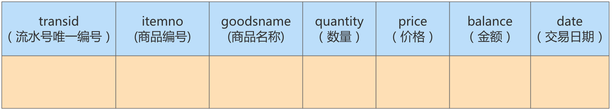


**举例4**：

`课程评论表 class_comment`，对应的字段名称及含义如下：

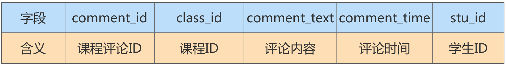

`学生表 student`，对应的字段名称及含义如下：


在实际应用中，我们在显示课程评论的时候，通常会显示这个学生的昵称，而不是学生ID，因此当我们想要查询某个课程的前 1000 条评论时，需要关联 class_comment 和 student这两张表来进行查询。

**实验数据：模拟两张百万量级的数据表**

为了更好地进行 SQL 优化实验，我们需要给学生表和课程评论表随机模拟出百万量级的数据。我们可以通过存储过程来实现模拟数据。

**反范式优化实验对比**

如果我们想要查询课程 ID 为 10001 的前 1000 条评论，需要写成下面这样：

```mysql
SELECT p.comment_text, p.comment_time, stu.stu_name
FROM class_comment AS p LEFT JOIN student AS stu
ON p.stu_id = stu.stu_id
WHERE p.class_id = 10001
ORDER BY p.comment_id DESC
LIMIT 1000;
```

运行结果（1000 条数据行）：

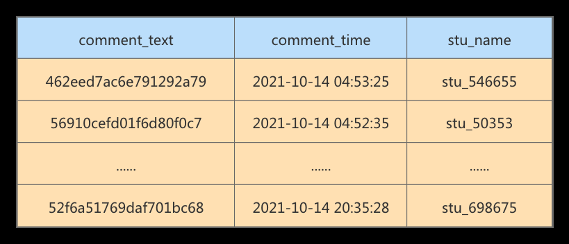

运行时长为 0.395 秒，对于网站的响应来说，这已经很慢了，用户体验会非常差。

如果我们想要提升查询的效率，可以允许适当的数据冗余，也就是在商品评论表中增加用户昵称字段，在 class_comment 数据表的基础上增加 stu_name 字段，就得到了 class_comment2 数据表。

这样一来，只需单表查询就可以得到数据集结果：

```mysql
SELECT comment_text, comment_time, stu_name
FROM class_comment2
WHERE class_id = 10001
ORDER BY comment_id DESC LIMIT 1000;
```

运行结果（1000 条数据）：


优化之后只需要扫描一次聚集索引即可，运行时间为 0.039 秒，查询时间是之前的 1/10。 你能看到，在数据量大的情况下，查询效率会有显著的提升。


#### 3.3 反范式的新问题

反范式可以通过空间换时间，提升查询的效率，但是反范式也会带来一些新问题：

- 存储`空间变大`了
- 一个表中字段做了修改，另一个表中冗余的字段也需要做同步修改，否则`数据不一致`
- 若采用存储过程来支持数据的更新、删除等额外操作，如果更新频繁，会非常`消耗系统资源`
- 在`数据量小`的情况下，反范式不能体现性能的优势，可能还会让数据库的设计更加`复杂`


#### 3.4 反范式的适用场景

当冗余信息有价值或者能`大幅度提高查询效率`的时候，我们才会采取反范式的优化。

1. **增加冗余字段的建议**

增加冗余字段一定要符合如下两个条件。只有满足这两个条件，才可以考虑增加冗余字段。

1 这个冗余字段`不需要经常进行修改`;

2 这个冗余字段`查询的时候不可或缺`。

2. **历史快照、历史数据的需要**

在现实生活中，我们经常需要一些冗余信息，比如订单中的收货人信息，包括姓名、电话和地址等。每次发生的`订单收货信息`都属于`历史快照`，需要进行保存，但用户可以随时修改自己的信息，这时保存这些冗余信息是非常有必要的。

反范式优化也常用在`数据仓库`的设计中，因为数据仓库通常`存储历史数据`，对增删改的实时性要求不强，对历史数据的分析需求强。这时适当允许数据的冗余度，更方便进行数据分析。


简单总结下数据仓库和数据库在使用上的区别:

1. 数据库设计的目的在于`捕获数据`，而数据仓库设计的目的在于`分析数据`；
2. 数据库对数据的`增删改实时性`要求强，需要存储在线的用户数据，而数据仓库存储的一般是`历史数据`；
3. 数据库设计需要`尽量避免冗余`，但为了提高查询效率也允许一定的`冗余度`，而数据仓库在设计上更偏向采用反范式设计。


### 4 BCNF(巴斯范式)

人们在3NF的基础上进行了改进，提出了**巴斯范式(BCNF)，也叫做巴斯-科德范式(Boyce-Codd Normal**
**Form)**。BCNF被认为没有新的设计规范加入，只是对第三范式中设计规范要求更强，使得数据库冗余度更小。所以，称为是`修正的第三范式`，或`扩充的第三范式`，BCNF不被称为第四范式。

若一个关系达到了第三范式，并且它只有一个候选键，或者它的每个候选键都是单属性，则该关系自然达到BC范式。

一般来说，一个数据库设计符合3NF或BCNF就可以了。

1. **案例**

我们分析如下表的范式情况：

  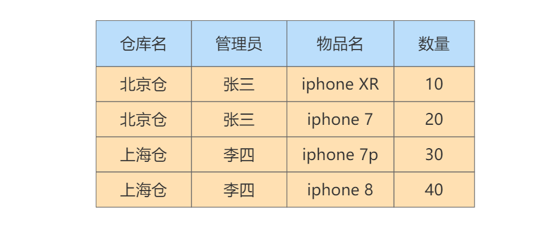


在这个表中，一个仓库只有一个管理员，同时一个管理员也只管理一个仓库。我们先来梳理下这些属性之间的依赖关系。

仓库名决定了管理员，管理员也决定了仓库名，同时（仓库名，物品名）的属性集合可以决定数量这个属性。这样，我们就可以找到数据表的候选键。

  - `候选键`：是（管理员，物品名）和（仓库名，物品名），然后我们从候选键中选择一个作为`主键`，比如（仓库名，物品名）。
  - `主属性`：包含在任一候选键中的属性，也就是仓库名，管理员和物品名。
  - `非主属性`：数量这个属性。

2. **是否符合三范式**

如何判断一张表的范式呢？我们需要根据范式的等级，从低到高来进行判断。

  - 首先，数据表每个属性都是原子性的，符合 1NF 的要求；
  - 其次，数据表中非主属性”数量“都与候选键全部依赖，（仓库名，物品名）决定数量，（管理员，物品名）决定数量。因此，数据表符合 2NF 的要求；
  - 最后，数据表中的非主属性，不传递依赖于候选键。因此符合 3NF 的要求。

3. **存在的问题**

既然数据表已经符合了 3NF 的要求，是不是就不存在问题了呢？我们来看下面的情况：

  1. 增加一个仓库，但是还没有存放任何物品。根据数据表实体完整性的要求，主键不能有空值，因此会出现`插入异常`；
  2. 如果仓库更换了管理员，我们就可能会`修改数据表中的多条记录`；
  3. 如果仓库里的商品都卖空了，那么此时仓库名称和相应的管理员名称也会随之被删除。

你能看到，即便数据表符合 3NF 的要求，同样可能存在插入，更新和删除数据的异常情况。

4. **问题解决**

首先我们需要确认造成异常的原因：主属性仓库名对于候选键（管理员，物品名）是部分依赖的关系，这样就有可能导致上面的异常情况。因此引入BCNF，**它在 3NF 的基础上消除了主属性对候选键的部分依赖或者传递依赖关系**。

  - 如果在关系R中，U为主键，A属性是主键的一个属性，若存在A->Y，Y为主属性，则该关系不属于BCNF。

    根据 BCNF 的要求，我们需要把仓库管理关系 warehouse_keeper 表拆分成下面这样：

    `仓库表`：（仓库名，管理员）

    `库存表`：（仓库名，物品名，数量）

    这样就不存在主属性对于候选键的部分依赖或传递依赖，上面数据表的设计就符合 BCNF。


**再举例**：

有一个`学生导师表`，其中包含字段：学生ID，专业，导师，专业GPA，这其中学生ID和专业是联合主键。

  | **StudentId** | **Major** | **Advisor** | **MajGPA** |
  | ------------- | --------- | ----------- | ---------- |
  | 1             | 人工智能  | Edward      | 4.0        |
  | 2             | 大数据    | William     | 3.8        |
  | 1             | 大数据    | William     | 3.7        |
  | 3             | 大数据    | Joseph      | 4.0        |

这个表的设计满足三范式，但是这里存在另一个依赖关系，“专业”依赖于“导师”，也就是说每个导师只做一个专业方面的导师，只要知道了是哪个导师，我们自然就知道是哪个专业的了。

所以这个表的部分主键Major依赖于非主键属性Advisor，那么我们可以进行以下的调整，拆分成2个表：

学生导师表：

  | **StudentId** | **Advisor** | **MajGPA** |
  | ------------- | ----------- | ---------- |
  | 1             | Edward      | 4.0        |
  | 2             | William     | 3.8        |
  | 1             | William     | 3.7        |
  | 3             | Joseph      | 4.0        |

导师表：

  | **Advisor** | **Major** |
  | ----------- | --------- |
  | Edward      | 人工智能  |
  | William     | 大数据    |
  | Joseph      | 大数据    |


### 5 第四范式

多值依赖的概念：

- `多值依赖`即属性之间的一对多关系，记为K——>——>A。
- `函数依赖`事实上是单值依赖，所以不能表达属性值之间的一对多关系。
- `平凡的多值依赖`：全集U=K+A，一个K可以对应于多个A，即K——>——>A。此时整个表就是一组一对多关系。
- `非平凡的多值依赖`：全集U=K+A+B，一个K可以对应于多个A,也可以对应于多个B, A与B互相独立，即K——>——>A, K——>——>B。整个表有多组一对多关系，且有：“一”部分是相同的属性集合，“多”部分是互相独立的属性集合。

第四范式即在满足巴斯-科德范式(BCNF)的基础上，消除非平凡且非函数依赖的多值依赖(即把同一表内的多对多关系删除)。


**举例1**：

职工表(职工编号，职工孩子姓名，职工选修课程)。

在这个表中，同一个职工可能会有多个职工孩子姓名。同样，同一个职工也可能会有多个职工选修课程，即这里存在着多值事实，不符合第四范式。

如果要符合第四范式，只需要将上表分为两个表，使它们只有一个多值事实，例如：`职工表一`(职工编号，职工孩子姓名)，`职工表二`(职工编号，职工选修课程)，两个表都只有一个多值事实，所以符合第四范式。


**举例2**：

比如我们建立课程、教师、教材的模型。我们规定，每门课程有对应的一组教师，每门课程也有对应的一组教材，一门课程使用的教材和教师没有关系。我们建立的关系表如下：

课程ID，教师ID，教材ID；这三列作为联合主键。

为了表述方便，我们用Name代替ID，这样更容易看懂：

| **Course** | **Teacher** | **Book**   |
| ---------- | ----------- | ---------- |
| 英语       | Bill        | 人教版英语 |
| 英语       | Bill        | 美版英语   |
| 英语       | Jay         | 美版英语   |
| 高数       | William     | 人教版高数 |
| 高数       | Dave        | 美版高数   |

这个表除了主键，就没有其他字段了，所以肯定满足BC范式，但是却存在`多值依赖`导致的异常。

假如我们下学期想采用一本新的英版高数教材，但是还没确定具体哪个老师来教，那么我们就无法在这个表中维护Course高数和Book英版高数教材的的关系。

解决办法是我们把这个多值依赖的表拆解成2个表，分别建立关系。这是我们拆分后的表：

| **Course** | **Teacher** |
| ---------- | ----------- |
| 英语       | Bill        |
| 英语       | Jay         |
| 高数       | William     |
| 高数       | Dave        |

以及

| **Course** | **Book**   |
| ---------- | ---------- |
| 英语       | 人教版英语 |
| 英语       | 美版英语   |
| 高数       | 人教版高数 |
| 高数       | 美版高数   |


### 6 第五范式、域键范式

除了第四范式外，我们还有更高级的第五范式（又称完美范式）和域键范式（DKNF）。

在满足第四范式（4NF）的基础上，消除不是由候选键所蕴含的连接依赖。**如果关系模式R中的每一个连接依赖均由R的候选键所隐含，则称此关系模式符合第五范式**。

函数依赖是多值依赖的一种特殊的情况，而多值依赖实际上是连接依赖的一种特殊情况。但连接依赖不像函数依赖和多值依赖可以由`语义直接导出`，而是在`关系连接运算`时才反映出来。存在连接依赖的关系模式仍可能遇到数据冗余及插入、修改、删除异常等问题。

第五范式处理的是`无损连接问题`，这个范式基本`没有实际意义`，因为无损连接很少出现，而且难以察觉。而域键范式试图定义一个`终极范式`，该范式考虑所有的依赖和约束类型，但是实用价值也是最小的，只存在理论研究中。


### 7 实战案例

商超进货系统中的`进货单表`进行剖析:

进货单表:

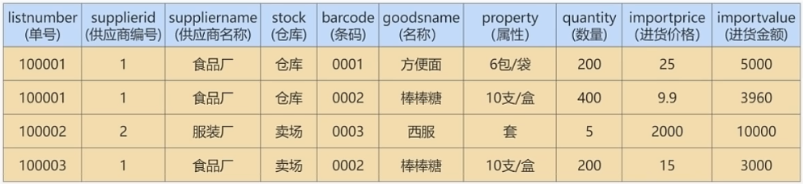

这个表中的字段很多，表里的数据量也很惊人。大量重复导致表变得庞大，效率极低。如何改造？

> 在实际工作场景中，这种由于数据表结构设计不合理，而导致的数据重复的现象并不少见。往往是系统虽然能够运行，承载能力却很差，稍微有点流量，就会出现内存不足、CUP使用率飙升的情况，甚至会导致整个项目失败。

#### 7.1 迭代一次：考虑 1NF

第一范式要求：**所有的字段都是基本数据字段，不可进一步拆分**。这里需要确认，所有的列中，每个字段只包含一种数据。

这张表里，我们把“property”这一字段，拆分成“specification(规格)”和"unit(单位)”，这2个字段如下:

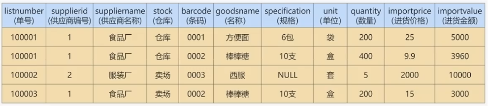


#### 7.2 迭代二次：考虑 2NF

第二范式要求，在满足第一范式的基础上，**还要满足数据表里的每一条数据记录，都是可唯一标识的。而且所有字段，都必须完全依赖主键，不能只依赖主键的一部分**。

第1步，就是要确定这个表的主键。通过观察发现，字段"listnumber(单号)"+"barcode(条码)”可以唯一标识每一条记录，可以作为主键。

第2步，确定好了主键以后，判断哪些字段完全依赖主键，哪些字段只依赖于主键的一部分。把只依赖于主键一部分的字段拆分出去，形成新的数据表。

首先，进货单明细表里面的“goodsname(名称)” “specification(规格)” “unit(单位)” 这些信息是商品的属性，只依赖于“barcode(条码)”，不完全依赖主键，可以拆分出去。我们把这3个字段加上它们所依赖的字段“barcode(条码)”，拆分形成一个新的数据表“`商品信息表`”。

这样一来，原来的数据表就被拆分成了两个表。

商品信息表：

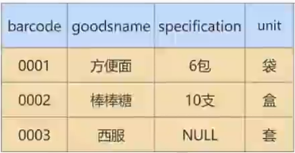

进货单表：


此外，字段“supplierid(供应商编号)” “suppliername(供应商名称)” “stock(仓库)” 只依赖于“listnumber(单号)”，不完全依赖于主键，所以，我们可以把“supplierid” “suppliername” “stock”这3个字段拆出去，再加上它们依赖的字段"istnumber(单号)”，就形成了一个新的表“`进货单头表`”。剩下的字段，会组成新的表，我们叫它“`进货单明细表`”

原来的数据表就拆分成了3个表。

进货单头表：

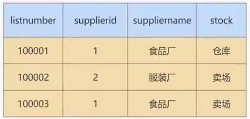

进货单明细表：

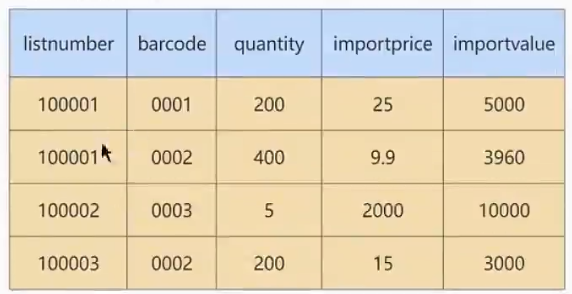

商品信息表：

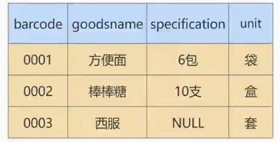

现在，我们再来分析一下拆分后的3个表，保证这3个表都满足第二范式的要求。

第3步，在“商品信息表”中，字段“barcode”是有可能存在重复的，比如，用户门店可能有散装称重商品和自产商品，会存在条码共用的情况。所以，所有的字段都不能唯一标识表里的记录。这个时候，我们必须给这个表加上一个主键，比如说是`自增字段“itemnumber”`。

现在，我们就可以把进货单明细表里面的字段“barcode'都替换成字段“itemnumber”，这就得到了新的如下表。

进货单明细表：

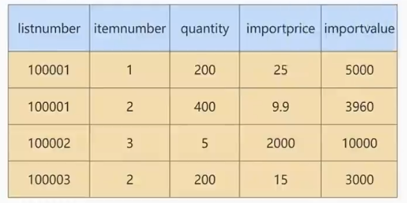

商品信息表：

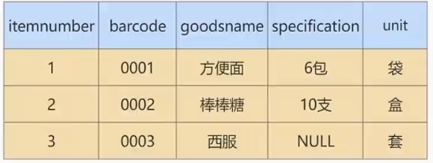

拆分后的3个数据表就全部满足了第二范式的要求。


#### 7.3 迭代三次：考虑 3NF

我们的进货单头表，还有数据冗余的可能。因为“suppliername”依赖“supplierid”，这个时候，我们就可以按照第三范式的原则进行拆分了。我们就进一步拆分下进货单头表，把它拆解成两张表：

供货商表：

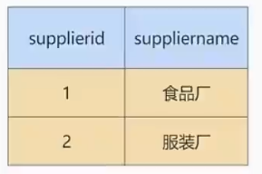

进货单头表：

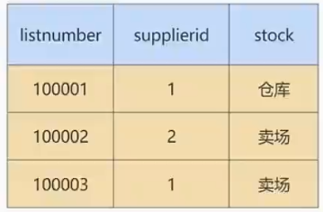

这2个表都满足第三范式的要求了。


#### 7.4 反范式化：业务优先的原则

在进货单明细表中，quantity * importprice = importvalue，“importprice” “quantity”和“importvalue”存在依赖关系，可以通过任意两个计算出第三个来，这就是存在冗余字段。如果严格按照第三范式的要求，现在我们应该进行进一步的优化，优化的办法是删除其中一个字段，只保留另外两个，这样就没有冗余字段了。

可是，真的可以这样做吗？要回答这个问题，我们就要先了解下实际工作中的业务优先原则。

所谓的业务优先原则，就是指一切以业务需求为主，技术服务于业务。**完全按照理论的设计不一定就是最优，还要根据实际情况来决定**。这里我们就来分析一下不同选择的利与弊。

对于 quantity * importprice = importvalue，看起来“importvalue"似乎是冗余字段，但并不会导致数据不一致。可是，如果我们把这个字段取消，是会影响业务的。

因为有的时候，供货商会经常进行一些促销活动，按金额促销，那他们拿来的进货单只有金额，没有价格。而"importprice'反而是通过"importvalue / quantity”计算出来的，经过四舍五入，会产生较大的误差。这样日积月累，最终会导致查询结果出现较大偏差，影响系统的可靠性。

举例：进货金额(importvalue)是25.5元，数量(quantity)是34，那么进货价格(importprice)就等于25.5 / 34=0.74元，但是如果用这个计算出来的进货价格(importprice)来计算进货金额，那么，进货金额(importvalue)就等于0.74*34=25.16元，其中相差了25.5-25.16=0.34元。

所以，本着业务优先的原则，在不影响系统可靠性的前提下，可保留数据冗余字段。

因此，最后我们可以把进货单表拆分成下面的4个表：

供货商表：


进货单头表：


进货单明细表：


商品信息表：


### 8 ER模型

数据库设计是牵一发而动全身的。那有没有什么办法提前看到数据库的全貌呢？比如需要哪些数据表、数据表中应该有哪些字段，数据表与数据表之间有什么关系、通过什么字段进行连接，等等。这样我们才能进行整体的梳理和设计。

其实，ER(Entity-Relationship 实体-关系)模型就是一个这样的工具。ER模型也叫作`实体关系模型`，是用来描述现实生活中客观存在的事物、事物的属性，以及事物之间关系的一种数据模型。**在开发基于数据库的信息系统的设计阶段，通常使用ER模型来描述信息需求和信息特性，帮助我们理清业务逻辑，从而设计出优秀的数据库**。


#### 8.1 ER包括哪些要素？

**ER 模型中有三个要素，分别是实体、属性和关系**。

- `实体`：可以看做是数据对象，往往对应于现实生活中的真实存在的个体。在 ER 模型中，用`矩形`来表示。实体分为两类，分别是`强实体`和`弱实体`。强实体是指不依赖于其他实体的实体；弱实体是指对另一个实体有很强的依赖关系的实体。
- `属性`：则是指实体的特性。比如超市的地址、联系电话、员工数等。在 ER 模型中用`椭圆形`来表示。
- `关系`：则是指实体之间的联系。比如超市把商品卖给顾客，就是一种超市与顾客之间的联系。在 ER 模型中用`菱形`来表示。

注意：实体和属性不容易区分。这里提供一个原则：我们要从系统整体的角度出发去看，**可以独立存在的是实体，不可再分的是属性**。也就是说，属性不能包含其他属性。


#### 8.2 关系的类型

在 ER 模型的 3 个要素中，关系又可以分为 3 种类型，分别是一对一、一对多、多对多。

- `一对一`：指实体之间的关系是一一对应的，比如个人与身份证信息之间的关系就是一对一的关系。一个人只能有一个身份证信息，一个身份证信息也只属于一个人。
- `一对多`：指一边的实体通过关系，可以对应多个另外一边的实体。相反，另外一边的实体通过这个关系，则只能对应唯一的一边的实体。比如说，我们新建一个班级表，而每个班级都有多个学生，每个学生则对应一个班级，班级对学生就是一对多的关系。
- `多对多`：指关系两边的实体都可以通过关系对应多个对方的实体。比如在进货模块中，供货商与超市之间的关系就是多对多的关系，一个供货商可以给多个超市供货，一个超市也可以从多个供货商那里采购商品。再比如一个选课表，有许多科目，每个科目有很多学生选，而每个学生又可以选择多个科目，这就是多对多的关系。


#### 8.3 建模分析

ER 模型看起来比较麻烦，但是对我们把控项目整体非常重要。如果你只是开发一个小应用，或许简单设计几个表够用了，一旦要设计有一定规模的应用，在项目的初始阶段，建立完整的 ER 模型就非常关键了。开发应用项目的实质，其实就是`建模`。

我们设计的案例是`电商业务`，由于电商业务太过庞大且复杂，所以我们做了业务简化，比如针对
SKU（StockKeepingUnit，库存量单位）和SPU（Standard Product Unit，标准化产品单元）的含义上，我们直接使用了SKU，并没有提及SPU的概念。本次电商业务设计总共有8个实体，如下所示。

- 地址实体
- 用户实体
- 购物车实体
- 评论实体
- 商品实体
- 商品分类实体
- 订单实体
- 订单详情实体

其中，`用户`和`商品分类`是强实体，因为它们不需要依赖其他任何实体。而其他属于弱实体，因为它们虽然都可以独立存在，但是它们都依赖用户这个实体，因此都是弱实体。知道了这些要素，我们就可以给电商业务创建 ER 模型了，如图：

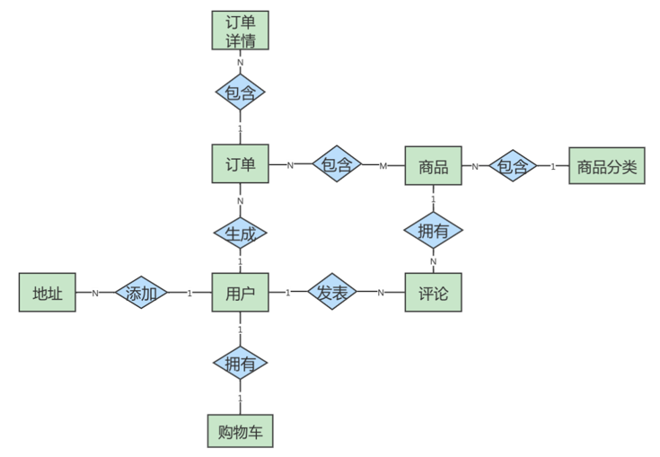

在这个图中，地址和用户之间的添加关系，是一对多的关系，而商品和商品详情示一对1的关系，商品和订单是多对多的关系。这个 ER 模型，包括了 8 个实体之间的 8种关系。

1. 用户可以在电商平台添加多个地址；
2. 用户只能拥有一个购物车；
3. 用户可以生成多个订单；
4. 用户可以发表多条评论；
5. 一件商品可以有多条评论；
6. 每一个商品分类包含多种商品；
7. 一个订单可以包含多个商品，一个商品可以在多个订单里；
8. 订单中又包含多个订单详情，因为一个订单中可能包含不同种类的商品。


#### 8.4 ER 模型的细化

有了这个 ER 模型，我们就可以从整体上`理解`电商的业务了。刚刚的 ER 模型展示了电商业务的框架，但是只包括了订单，地址，用户，购物车，评论，商品，商品分类和订单详情这八个实体，以及它们之间的关系，还不能对应到具体的表，以及表与表之间的关联。我们需要把`属性加上`，用`椭圆`来表示，这样我们得到的 ER 模型就更加完整了。

因此，我们需要进一步去设计一下这个 ER 模型的各个局部，也就是细化下电商的具体业务流程，然后把它们综合到一起，形成一个完整的 ER 模型。这样可以帮助我们理清数据库的设计思路。

接下来，我们再分析一下各个实体都有哪些属性，如下所示。

1. `地址实体` 包括用户编号、省、市、地区、收件人、联系电话、是否是默认地址。
2. `用户实体` 包括用户编号、用户名称、昵称、用户密码、手机号、邮箱、头像、用户级别。
3. `购物车实体` 包括购物车编号、用户编号、商品编号、商品数量、图片文件url。
4. `订单实体` 包括订单编号、收货人、收件人电话、总金额、用户编号、付款方式、送货地址、下单时间。
5. `订单详情实体` 包括订单详情编号、订单编号、商品名称、商品编号、商品数量。
6. `商品实体` 包括商品编号、价格、商品名称、分类编号、是否销售，规格、颜色。
7. `评论实体` 包括评论id、评论内容、评论时间、用户编号、商品编号。
8. `商品分类实体` 包括类别编号、类别名称、父类别编号。

这样细分之后，我们就可以重新设计电商业务了，ER 模型如图：

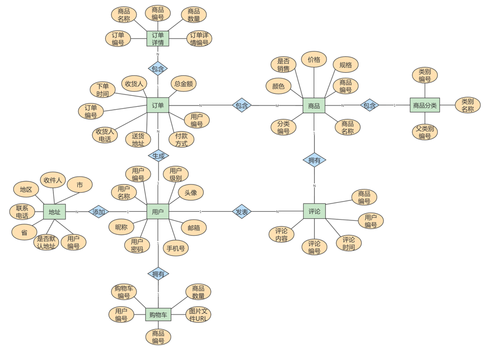


#### 8.5 ER 模型图转换成数据表

通过绘制 ER 模型，我们已经理清了业务逻辑，现在，我们就要进行非常重要的一步了：把绘制好的 ER 模型，转换成具体的数据表，下面介绍下转换的原则：

1. 一个`实体`通常转换成一个`数据表`；
2. 一个`多对多的关系`，通常也转换成一个`数据表`；
3. 一个`1对1`，或者`1对多`的关系，往往通过表的`外键`来表达，而不是设计一个新的数据表；
4. `属性`转换成表的`字段`。

下面结合前面的ER模型，具体讲解一下怎么运用这些转换的原则，把 ER 模型转换成具体的数据表，从而把抽象出来的数据模型，落实到具体的数据库设计当中。


其实，任何一个基于数据库的应用项目，都可以通过这种`先建立 ER 模型`，再`转换成数据表`的方式，完成数据库的设计工作。创建 ER 模型不是目的，目的是把业务逻辑梳理清楚，设计出优秀的数据库。我建议你不是为了建模而建模，要利用创建 ER 模型的过程来整理思路，这样创建 ER 模型才有意义。

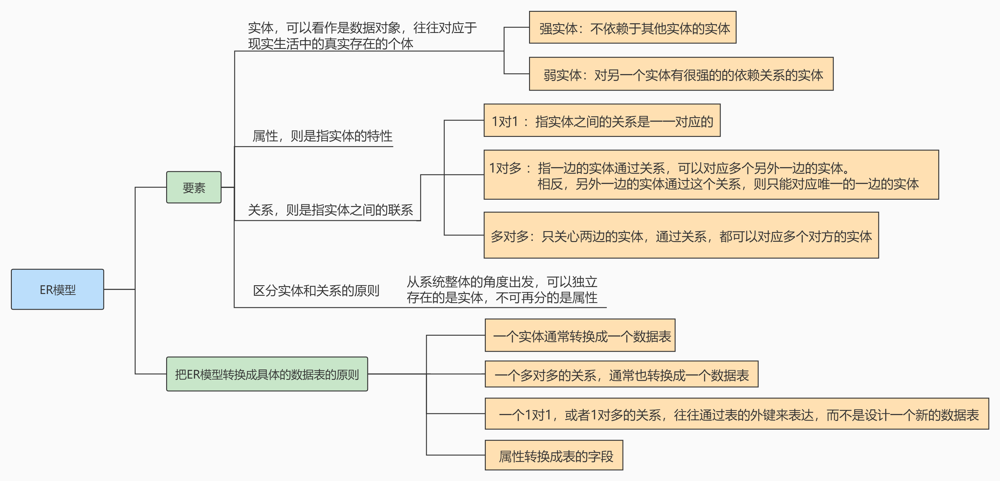


### 9 数据表的设计原则

综合以上内容，总结出数据表设计的一般原则："三少一多"

1. **数据表的个数越少越好**

   RDBMS的核心在于对实体和联系的定义，也就是E-R图(Entity Relationship Diagram)，数据表越少，证明实体和联系设计得越简洁，既方便理解又方便操作。

2. **数据表中的字段个数越少越好**

   字段个数越多，数据冗余的可能性越大。设置字段个数少的前提是各个字段相互独立，而不是某个字段的取值可以由其他字段计算出来。当然字段个数少是相对的，我们通常会在`数据冗余`和`检索效率`中进行平衡。

3. **数据表中联合主键的字段个数越少越好**

   设置主键是为了确定唯一性，当一个字段无法确定唯一性的时候，就需要采用联合主键的方式(也就是用多个字段来定义一个主键)。`联合主键中的字段越多，占用的索引空间越大`，不仅会加大理解难度，还会增加运行时间和索引空间，因此联合主键的字段个数越少越好。

4. **使用主键和外键越多越好**

   数据库的设计实际上就是定义各种表，以及各种字段之间的关系。这些关系越多，证明这些`实体之间的冗余度越低，利用度越高`。这样做的好处在于不仅保证了数据表之间的`独立性`，还能提升相互之间的关联使用率。

“三少一多”原则的核心就是`简单可复用`。简单指的是用更少的表、更少的字段、更少的联合主键字段来完成数据表的设计。可复用则是通过主键、外键的使用来增强数据表之间的复用率。因为一个主键可以理解是一张表的代表。键设计得越多，证明它们之间的利用率越高。

> 注意：这个原则并不是绝对的，有时候我们需要牺牲数据的冗余度来换取数据处理的效率。


### 10 数据库对象编写建议

#### 10.1 关于库

1. 【强制】库的名称必须控制在32个字符以内，只能使用英文字母、数字和下划线，建议以英文字母开头。

2. 【强制】库名中英文`一律小写`，不同单词采用`下划线`分割。须见名知意。

3. 【强制】库的名称格式：业务系统名称_子系统名。

4. 【强制】库名禁止使用关键字（如type,order等）。

5. 【强制】创建数据库时必须`显式指定字符集`，并且字符集只能是utf8或者utf8mb4。

  创建数据库SQL举例：`CREATE DATABASE crm_fund DEFAULT CHARACTER SET 'utf8'`;

6. 【建议】对于程序连接数据库账号，遵循`权限最小原则` 

  使用数据库账号只能在一个DB下使用，不准跨库。程序使用的账号`原则上不准有drop权限`。

7. 【建议】临时库以`tmp_`为前缀，并以日期为后缀；备份库以`bak_`为前缀，并以日期为后缀。


#### 10.2 关于表、列

1. 【强制】表和列的名称必须控制在32个字符以内，表名只能使用英文字母、数字和下划线，建议以`英文字母开头`。

2. 【强制】`表名、列名一律小写`，不同单词采用下划线分割。须见名知意。

3. 【强制】表名要求有模块名强相关，同一模块的表名尽量使用`统一前缀`。比如：crm_fund_item

4. 【强制】创建表时必须`显式指定字符集`为utf8或utf8mb4。

5. 【强制】表名、列名禁止使用关键字（如type,order等）。

6. 【强制】创建表时必须`显式指定表存储引擎`类型。如无特殊需求，一律为InnoDB。

7. 【强制】建表必须有comment。即备注信息。

8. 【强制】字段命名应尽可能使用表达实际含义的英文单词或`缩写`。如：公司 ID，不要使用corporation_id, 而用corp_id 即可。

9. 【强制】布尔值类型的字段命名为`is_描述`。如member表上表示是否为enabled的会员的字段命名为 is_enabled。

10. 【强制】禁止在数据库中存储图片、文件等大的二进制数据

    通常文件很大，短时间内造成数据量快速增长，数据库进行数据库读取时，通常会进行大量的随机IO操作，文件很大时，IO操作很耗时。通常存储于文件服务器，数据库只存储文件地址信息。

11. 【建议】建表时关于主键：`表必须有主键`

    1. 强制要求主键为id，类型为int或bigint，且为 auto_increment 建议使用unsigned无符号型。
    2. 标识表里每一行主体的字段不要设为主键，建议设为其他字段如user_id，order_id等，并建立unique key索引。因为如果设为主键且主键值为随机插入，则会导致innodb内部页分裂和大量随机I/O，性能下降。

12. 【建议】核心表（如用户表）必须有行数据的`创建时间字段`（create_time）和`最后更新时间字段`（update_time），便于查问题。

13. 【建议】表中所有字段尽量都是`NOT NULL`属性，业务可以根据需要定义`DEFAULT值`。

    因为使用NULL值会存在每一行都会占用额外存储空间、数据迁移容易出错、聚合函数计算结果偏差等问题。

14. 【建议】所有存储相同数据的`列名和列类型必须一致`（一般作为关联列，如果查询时关联列类型不一致会自动进行数据类型隐式转换，会造成列上的索引失效，导致查询效率降低）。

15. 【建议】中间表（或临时表）用于保留中间结果集，名称以`tmp_`开头。

    备份表用于备份或抓取源表快照，名称以`bak_`开头。中间表和备份表定期清理。

16. 【示范】一个较为规范的建表语句：

    ```mysql
    CREATE TABLE user_info (
    `id` int unsigned NOT NULL AUTO_INCREMENT COMMENT '自增主键',
    `user_id` bigint(11) NOT NULL COMMENT '用户id',
    `username` varchar(45) NOT NULL COMMENT '真实姓名',
    `email` varchar(30) NOT NULL COMMENT '用户邮箱',
    `nickname` varchar(45) NOT NULL COMMENT '昵称',
    `birthday` date NOT NULL COMMENT '生日',
    `sex` tinyint(4) DEFAULT '0' COMMENT '性别',
    `short_introduce` varchar(150) DEFAULT NULL COMMENT '一句话介绍自己，最多50个汉字',
    `user_resume` varchar(300) NOT NULL COMMENT '用户提交的简历存放地址',
    `user_register_ip` int NOT NULL COMMENT '用户注册时的源ip',
    `create_time` timestamp NOT NULL DEFAULT CURRENT_TIMESTAMP COMMENT '创建时间',
    `update_time` timestamp NOT NULL DEFAULT CURRENT_TIMESTAMP ON UPDATE
    CURRENT_TIMESTAMP COMMENT '修改时间',
    `user_review_status` tinyint NOT NULL COMMENT '用户资料审核状态，1为通过，2为审核中，3为未通过，4为还未提交审核',
        
    PRIMARY KEY (`id`),
    UNIQUE KEY `uniq_user_id` (`user_id`),
    KEY `idx_username`(`username`),
    KEY `idx_create_time_status`(`create_time`,`user_review_status`)
    ) ENGINE=InnoDB DEFAULT CHARSET=utf8 COMMENT='网站用户基本信息'
    ```

17. 【建议】创建表时，可以使用可视化工具。这样可以确保表、字段相关的约定都能设置上。

实际上，我们通常很少自己写 DDL 语句，可以使用一些可视化工具来创建和操作数据库和数据表。

可视化工具除了方便，还能直接帮我们将数据库的结构定义转化成 SQL 语言，方便数据库和数据表结构的导出和导入。


#### 10.3 关于索引

1. 【强制】InnoDB表必须主键为id int/bigint auto_increment，且主键值`禁止被更新`。

2. 【强制】InnoDB和MyISAM存储引擎表，索引类型必须为`BTREE`。

3. 【建议】主键的名称以`pk_`开头，唯一键以`uni_`或`uk_`开头，普通索引以`idx_`开头，一律使用小写格式，以字段的名称或缩写作为后缀。

4. 【建议】多单词组成的columnname，取前几个单词首字母，加末单词组成column_name。

  如：sample 表 member_id 上的索引：idx_sample_mid。

5. 【建议】单个表上的索引个数`不能超过6个`。

6. 【建议】在建立索引时，多考虑建立`联合索引`，并把区分度最高的字段放在最前面。

7. 【建议】在多表 JOIN 的SQL里，保证被驱动表的连接列上有索引，这样JOIN 执行效率最高。

8. 【建议】建表或加索引时，保证表里互相不存在`冗余索引`。 

   比如：如果表里已经存在key(a,b)，则key(a)为冗余索引，需要删除。


#### 10.4 SQL编写

1. 【强制】程序端SELECT语句必须指定具体字段名称，禁止写成 *。

2. 【建议】程序端insert语句指定具体字段名称，不要写成INSERT INTO t1 VALUES(…)。

3. 【建议】除静态表或小表（100行以内），DML语句必须有WHERE条件，且使用索引查找。

4. 【建议】INSERT INTO…VALUES(XX),(XX),(XX).. 这里XX的值不要超过5000个。值过多虽然上线很快，但会引起主从同步延迟。

5. 【建议】SELECT语句不要使用UNION，推荐使用UNION ALL，并且UNION子句个数限制在5个以内。

6. 【建议】线上环境，多表 JOIN 不要超过5个表。

7. 【建议】减少使用ORDER BY，和业务沟通能不排序就不排序，或将排序放到程序端去做。

   ORDER BY、GROUP BY、DISTINCT 这些语句较为耗费CPU，数据库的CPU资源是极其宝贵的。

8. 【建议】包含了ORDER BY、GROUP BY、DISTINCT 这些查询的语句，WHERE 条件过滤出来的结果集请保持在1000行以内，否则SQL会很慢。

9. 【建议】对单表的多次alter操作必须合并为一次

   对于超过100W行的大表进行alter table，必须经过DBA审核，并在业务低峰期执行，多个alter需整合在一起。因为alter table会产生`表锁`，期间阻塞对于该表的所有写入，对于业务可能会产生极大影响。

10. 【建议】批量操作数据时，需要控制事务处理间隔时间，进行必要的sleep。

11. 【建议】事务里包含SQL不超过5个。

    因为过长的事务会导致锁数据较久，MySQL内部缓存、连接消耗过多等问题。

12. 【建议】事务里更新语句尽量基于主键或UNIQUE KEY，如UPDATE… WHERE id=XX;

    否则会产生间隙锁，内部扩大锁定范围，导致系统性能下降，产生死锁。

------

## 十一、数据库其它调优策略

### 1 数据库调优的措施

#### 1.1 调优的目标

- 尽可能`节省系统资源`，以便系统可以提供更大负荷的服务。（吞吐量更大）
- 合理的结构设计和参数调整，以提高用户操作`响应的速度`。（响应速度更快）
- 减少系统的瓶颈，提高MySQL数据库整体的性能。


#### 1.2 如何定位调优问题

不过随着用户量的不断增加，以及应用程序复杂度的提升，我们很难用“`更快`”去定义数据库调优的目标，因为用户在不同时间段访问服务器遇到的瓶颈不同，比如双十一促销的时候会带来大规模的`并发访问`；还有用户在进行不同业务操作的时候，数据库的`事务处理`和`SQL查询`都会有所不同。因此我们还需要更加精细的定位，去确定调优的目标。

如何确定呢？一般情况下，有如下几种方式：

- **用户的反馈（主要）**

  用户是我们的服务对象，因此他们的反馈是最直接的。虽然他们不会直接提出技术建议，但是有些问题往往是用户第一时间发现的。我们要重视用户的反馈，找到和数据相关的问题。

- **日志分析（主要）**

  我们可以通过查看数据库日志和操作系统日志等方式找出异常情况，通过它们来定位遇到的问题。

- **服务器资源使用监控**

  通过监控服务器的CPU、内存、I/O等使用情况，可以实时了解服务器的性能使用，与历史情况进行对比。

- **数据库内部状况监控**

  在数据库的监控中，`活动会话（Active Session)监控`是一个重要的指标。通过它，你可以清楚地了解数据库当前是否处于非常繁忙的状态，是否存在sQL堆积等。

- **其它**

  除了活动会话监控以外，我们也可以对`事务、锁等待`等进行监控，这些都可以帮助我们对数据库的运行状态有更全面的认识。


#### 1.4 调优的维度和步骤

我们需要调优的对象是整个数据库管理系统，它不仅包括 SQL 查询，还包括数据库的部署配置、架构等。从这个角度来说，我们思考的维度就不仅仅局限在 SQL 优化上了。通过如下的步骤我们进行梳理：

**第1步：选择适合的 DBMS**

如果对`事务性处理`以及`安全性要求高`的话，可以选择商业的数据库产品。这些数据库在事务处理和查询性能上都比较强，比如采用SQL Server、Oracle，那么`单表存储上亿条数据`是没有问题的。如果数据表设计得好，即使不采用`分库分表`的方式，查询效率也不差。

除此以外，你也可以采用开源的MySQL进行存储，它有很多存储引擎可以选择，如果进行事务处理的话可以选择InnoDB，非事务处理可以选择MylSAM。

NoSQL阵营包括`键值型数据库`、`文档型数据库`、`搜索引擎`、`列式存储`和`图形数据库`。这些数据库的优缺点和使用场景各有不同，比如列式存储数据库可以大幅度降低系统的I/O，适合于分布式文件系统，但如果数据需要频繁地增删改，那么列式存储就不太适用了。

**DBMS的选择关系到了后面的整个设计过程，所以第一步就是要选择适合的DBMS。**如果已经确定好了DBMS，那么这步可以跳过。


**第2步：优化表设计**

选择了DBMS之后，我们就需要进行表设计了。而数据表的设计方式也直接影响了后续的SQL查询语句。RDBMS中，每个对象都可以定义为一张表，表与表之间的关系代表了对象之间的关系。如果用的是MySQL，我们还可以根据不同表的使用需求，选择不同的存储引擎。除此以外，还有一些优化的原则可以参考：

1. 表结构要尽量`遵循三范式的原则`。这样可以让数据结构更加清晰规范，减少冗余字段，同时也减少了在更新，插入和删除数据时等异常情况的发生。
2. 如果`查询`应用比较多，尤其是需要进行`多表联查`的时候，可以采用`反范式`进行优化。反范式采用`空间换时间`的方式，通过增加冗余字段提高查询的效率。
3. `表字段的数据类型`选择，关系到了查询效率的高低以及存储空间的大小。一般来说，如果字段可以采用数值类型就不要采用字符类型；字符长度要尽可能设计得短一些。针对字符类型来说，当确定字符长度固定时，就可以采用CHAR类型；当长度不固定时，通常采用VARCHAR类型。

数据表的结构设计很基础，也很关键。**好的表结构可以在业务发展和用户量增加的情况下依然发挥作用，不好的表结构设计会让数据表变得非常臃肿，查询效率也会降低**。


**第3步：优化逻辑查询**

当我们建立好数据表之后，就可以对数据表进行增删改查的操作了。这时我们首先需要考虑的是逻辑查询优化。

SQL查询优化，可以分为`逻辑查询优化`和`物理查询优化`。逻辑查询优化就是通过改变SQL语句的内容让SQL执行效率更高效，采用的方式是对SQL语句进行等价变换，对查询进行重写。

**SQL的查询重写包括了子查询优化、等价谓词重写、视图重写、条件简化、连接消除和嵌套连接消除等**。

比如我们在讲解EXISTS子查询和IN子查询的时候，会根据`小表驱动大表`的原则选择适合的子查询。在WHERE子句中会尽量避免对字段进行函数运算，它们会让字段的索引失效。

举例：查询评论内容开头为abc的内容都有哪些，如果在WHERE子句中使用了函数，语句就会写成下面这样：

```mysql
SELECT 
	comment_id, comment_text, comment_time 
FROM 
	product_comment 
WHERE 
	SUBSTRING(comment_text, 1, 3) = 'abc';
```

采用重写的方式进行等价替换：

```mysql
SELECT
	comment_id, comment_text, comment_time
FROM
	product_comment
WHERE
	comment_text LIKE 'abc%';
```


**第4步：优化物理查询**

物理查询优化是在确定了逻辑查询优化之后，采用物理优化技术（比如索引等），通过计算代价模型对各种可能的访问路径进行估算，从而找到执行方式中代价最小的作为执行计划。`在这个部分中，我们需要掌握的重点是对索引的创建和使用`。

但索引不是万能的，我们需要根据实际情况来创建索引。那么都有哪些情况需要考虑呢？我们在前面几章中已经进行了细致的剖析。

SQL查询时需要对不同的数据表进行查询，因此在物理查询优化阶段也需要确定这些查询所采用的路径，具体的情况包括:

1. `单表扫描`：对于单表扫描来说，我们可以全表扫描所有的数据，也可以局部扫描。
2. `两张表的连接`：常用的连接方式包括了嵌套循环连接、HASH连接和合并连接。
3. `多张表的连`：多张数据表进行连接的时候，`顺序`很重要，因为不同的连接路径查询的效率不同，搜索空间也会不同。我们在进行多表连接的时候，搜索空间可能会达到`很高的数据量级`，巨大的搜索空间显然会占用更多的资源，因此我们需要通过调整连接顺序，将搜索空间调整在一个可接受的范围内。


**第5步：使用 Redis 或 Memcached 作为缓存**

除了可以对 SQL 本身进行优化以外，我们还可以请外援提升查询的效率。

因为数据都是存放到数据库中，我们需要从数据库层中取出数据放到内存中进行业务逻辑的操作，当用户量增大的时候，如果频繁地进行数据查询，会消耗数据库的很多资源。如果我们将常用的数据直接放到内存中，就会大幅提升查询的效率。

键值存储数据库可以帮我们解决这个问题。

常用的键值存储数据库有 Redis 和 Memcached，它们都可以将数据存放到内存中。

从可靠性来说，`Redis支持持久化`，可以让我们的数据保存在硬盘上，不过这样一来性能消耗也会比较大。而Memcached仅仅是内存存储，不支持持久化。

从支持的数据类型来说，Redis比Memcached要多，它不仅支持key-value类型的数据，还支持List、Set、Hash等数据结构。当我们有持久化需求或者是更高级的数据处理需求的时候，就可以使用Redis。如果是简单的key-value存储，则可以使用Memcached。

**通常我们对于查询响应要求高的场景(响应时间短，吞吐量大)，可以考虑内存数据库，毕竟术业有专攻**。传统的RDBMS都是将数据存储在硬盘上，而内存数据库则存放在内存中，查询起来要快得多。不过使用不同的工具，也增加了开发人员的使用成本。


**第6步：库级优化**

库级优化是站在数据库的维度上进行的优化策略，比如控制一个库中的数据表数量。另外，单一-的数据库总会遇到各种限制，不如取长补短，利用"外援"的方式。通过`主从架构`优化我们的读写策略，通过对数据库进行垂直或者水平切分，突破单一数据库或数据表的访问限制，提升查询的性能。


1、读写分离

如果读和写的业务量都很大，并且它们都在同一个数据库服务器中进行操作，那么数据库的性能就会出现瓶颈，这时为了提升系统的性能，优化用户体验，我们可以采用`读写分离`的方式降低主数据库的负载，比如用主数据库(master)完成写操作，用从数据库(slave)完成读操作。

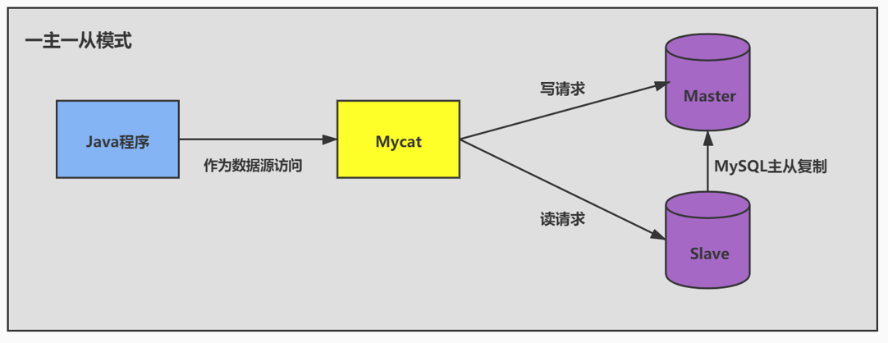

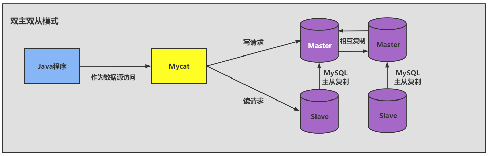

2、数据分片

对`数据库分库分表`。当数据量级达到千万级以上时，有时候我们需要把一个数据库切成多份，放到不同的数据库服务器上，减少对单一数据库服务器的访问压力。如果你使用的是MySQL，就可以使用MySQL自带的分区表功能，当然你也可以考虑自己做`垂直拆分(分库)`、`水平拆分(分表)`、`垂直+水平拆分`(分库分表)。

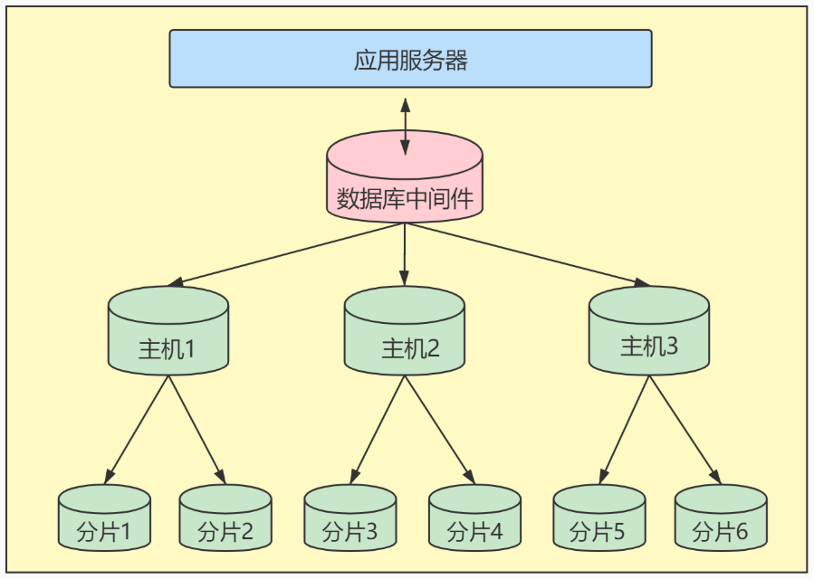

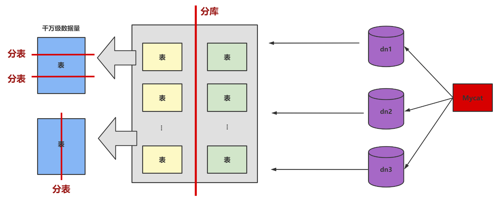

> 但需要注意的是，分拆在提升数据库性能的同时，也会增加维护和使用成本。


### 2 优化MySQL服务器

优化MySQL服务器主要从两个方面来优化，一方面是对`硬件`进行优化；另一方面是对MySQL`服务的参数`进行优化。这部分的内容需要较全面的知识，一般只有`专业的数据库管理员`才能进行这一类的优化。对于可以定制参数的操作系统，也可以针对MySQL进行操作系统优化。


#### 2.1 优化服务器硬件

**服务器的硬件性能直接决定着MySQL数据库的性能**。硬件的性能瓶颈直接决定MySQL数据库的运行速度和效率。针对性能瓶颈提高硬件配置，可以提高MySQL数据库查询、更新的速度。

1. **配置较大的内存**

   足够大的内存是提高MySQL数据库性能的方法之一。内存的速度比磁盘IO快得多，可以通过增加系统的`缓冲区容量`使数据在内存中停留的时间更长，以减少磁盘IO。

2. **配置高速磁盘系统**

   以减少读盘的等待时间，提高响应速度。磁盘的IO能力，也就是它的寻道能力，目前的`SCSI`高速旋转的是7200转/分钟，这样的速度，一旦访问的用户量上去，磁盘的压力就会过大，如果是每天的网站pv(page view)在150w，这样的一般的配置就无法满足这样的需求了。现在`SSD`盛行，在SSD上随机访问和顺序访问性能几乎差不多，使用SSD可以减少随机IO带来的性能损耗。

3. **合理分布磁盘IO**

   把磁盘IO分散在多个设备上，以减少资源竞争，提高并行操作能力。

4. **配置多处理器**

   MySQL是多线程的数据库，多处理器可同时执行多个线程。


#### 2.2 优化MySQL的参数

通过优化MySQL的参数可以提高资源利用率，从而达到提高MySQL服务器性能的目的。

MySQL服务的配置参数都在`my.cnf`或者`my.ini`文件的[mysqld]组中。配置完参数以后，需要重新启动MySQL服务才会生效。

下面对几个对性能影响比较大的参数进行详细绍。

- `innodb_buffer_pool_size`：这个参数是Mysql数据库最重要的参数之一，表示InnoDB类型的`表和索引的最大缓存`。它不仅仅缓存`索引数据`，还会缓存`表的数据`。这个值越大，查询的速度就会越快。但是这个值太大会影响操作系统的性能。

- `key_buffer_size`：表示`索引缓冲区的大小`。索引缓冲区是所有的`线程共享`。增加索引缓冲区可以得到更好处理的索引（对所有读和多重写）。当然，这个值不是越大越好，它的大小取决于内存的大小。如果这个值太大，就会导致操作系统频繁换页，也会降低系统性能。对于内存在`4GB`左右的服务器该参数可设置为`256M`或`384M`。

- `table_cache`：表示`同时打开的表的个数`。这个值越大，能够同时打开的表的个数越多。物理内存越大，设置就越大。默认为2402，调到512-1024最佳。这个值不是越大越好，因为同时打开的表太多会影响操作系统的性能。

- `query_cache_size`：表示`查询缓冲区的大小`。可以通过在MySQL控制台观察，如果Qcache_lowmem_prunes的值非常大，则表明经常出现缓冲不够的情况，就要增加Query_cache_size的值；如果Qcache_hits的值非常大，则表明查询缓冲使用非常频繁，如果该值较小反而会影响效率，那么可以考虑不用查询缓存；Qcache_free_blocks，如果该值非常大，则表明缓冲区中碎片很多。MySQL8.0之后失效。该参数需要和query_cache_type配合使用。

- `query_cache_type`的值是0时，所有的查询都不使用查询缓存区。但是query_cache_type=0并不会导致MySQL释放query_cache_size所配置的缓存区内存。

  - 当query_cache_type=1时，所有的查询都将使用查询缓存区，除非在查询语句中指定`SQL_NO_CACHE`，

    如`SELECT SQL_NO_CACHE * FROM tbl_name`。

  - 当query_cache_type=2时，只有在查询语句中使用`SQL_CACHE`关键字，查询才会使用查询缓存区。使用查询缓存区可以提高查询的速度，这种方式只适用于修改操作少且经常执行相同的查询操作的情况。

- `sort_buffer_size`：表示每个`需要进行排序的线程分配的缓冲区的大小`。增加这个参数的值可以提高`ORDER BY`或`GROUP BY`操作的速度。默认数值是2 097 144字节（约2MB）。对于内存在4GB左右的服务器推荐设置为6-8M，如果有100个连接，那么实际分配的总共排序缓冲区大小为`100×6=600MB`。

- `join_buffer_size = 8M`：表示`联合查询操作所能使用的缓冲区大小`，和sort_buffer_size一样，该参数对应的分配内存也是每个连接独享。

- `read_buffer_size`：表示`每个线程连续扫描时为扫描的每个表分配的缓冲区的大小（字节）`。当线程从表中连续读取记录时需要用到这个缓冲区。`SET SESSION read_buffer_size=n`可以临时设置该参数的值。默认为64K，可以设置为4M。

- `innodb_flush_log_at_trx_commit`：表示`何时将缓冲区的数据写入日志文件`，并且将日志文件写入磁盘中。该参数对于innoDB引擎非常重要。该参数有3个值，分别为0、1和2。该参数的默认值为1。

  - 值为`0`时，表示`每秒1次`的频率将数据写入日志文件并将日志文件写入磁盘。每个事务的commit并不会触发前面的任何操作。该模式速度最快，但不太安全，mysqld进程的崩溃会导致上一秒钟所有事务数据的丢失。
  - 值为`1`时，表示`每次提交事务时`将数据写入日志文件并将日志文件写入磁盘进行同步。该模式是最安全的，但也是最慢的一种方式。因为每次事务提交或事务外的指令都需要把日志写入（flush）硬盘。
  - 值为`2`时，表示`每次提交事务时`将数据写入日志文件，`每隔1秒`将日志文件写入磁盘。该模式速度较快，也比0安全，只有在操作系统崩溃或者系统断电的情况下，上一秒钟所有事务数据才可能丢失。

- `innodb_log_buffer_size`：这是 InnoDB 存储引擎的`事务日志所使用的缓冲区`。为了提高性能，也是先将信息写入 Innodb Log Buffer中，当满足 innodb_flush_log_trx_commit 参数所设置的相应条件（或者日志缓冲区写满）之后，才会将日志写到文件（或者同步到磁盘）中。

- `max_connections`：表示`允许连接到MySQL数据库的最大数量`，默认值是 151 。如果状态变量connection_errors_max_connections 不为零，并且一直增长，则说明不断有连接请求因数据库连接数已达到允许最大值而失败，这是可以考虑增大max_connections的值。在Linux平台下，性能好的服务器，支持 500-1000 个连接不是难事，需要根据服务器性能进行评估设定。这个连接数`不是越大越好`，因为这些连接会浪费内存的资源。过多的连接可能会导致MySQL服务器僵死。

- `back_log`：用于`控制MySQL监听TCP端口时设置的积压请求栈大小`。如果MySql的连接数达到max_connections时，新来的请求将会被存在堆栈中，以等待某一连接释放资源，该堆栈的数量即back_log，如果等待连接的数量超过back_log，将不被授予连接资源，将会报错。5.6.6 版本之前默认值为 50，之后的版本默认为 50 +（max_connections / 5），对于Linux系统推荐设置为小于512的整数，但最大不超过900。

  如果需要数据库在较短的时间内处理大量连接请求，可以考虑适当增大back_log的值。

- `thread_cache_size`：线程池缓存线程数量的大小，当客户端断开连接后将当前线程缓存起来，当在接到新的连接请求时快速响应无需创建新的线程。这尤其对那些使用短连接的应用程序来说可以极大的提高创建连接的效率。那么为了提高性能可以增大该参数的值。默认为60，可以设置为120。

  可以通过如下几个MySQL状态值来适当调整线程池的大小：

  ```mysql
  mysql> show global status like 'Thread%';
  +--------------------------+---------+
  | Variable_name            | Value   |
  +--------------------------+---------+
  | Threads_cached           |       2 |
  | Threads_connected        |       1 |
  | Threads_created          |       3 |
  | Threads_running          |       2 |
  +--------------------------+---------+
  4 rows in set (0.01 sec)
  ```

  当 Threads_cached 越来越少，但 Threads_connected 始终不降，且 Threads_created 持续升高，可适当增加 thread_cache_size 的大小。

- `wait_timeout`：指定`一个请求的最大连接时间`，对于4GB左右内存的服务器可以设置为5-10。

- `interactive_timeout`：表示服务器在关闭连接前等待行动的秒数。

这里给出一份my.cnf的参考配置：

```ini
[mysqld]
port = 3306 
serverid = 1 
socket = /tmp/mysql.sock

`skip-locking` 
# 避免MySQL的外部锁定，减少出错几率增强稳定性。 
`skip-name-resolve` 
# 禁止MySQL对外部连接进行DNS解析，使用这一选项可以消除MySQL进行DNS解析的时间。但需要注意，如果开启该选项，则所有远程主机连接授权都要使用IP地址方式，否则MySQL将无法正常处理连接请求！
`back_log = 384
key_buffer_size = 256M 
max_allowed_packet = 4M 
thread_stack = 256K
table_cache = 128K
sort_buffer_size = 6M
read_buffer_size = 4M
read_rnd_buffer_size=16M 
join_buffer_size = 8M 
myisam_sort_buffer_size = 64M
table_cache = 512 
thread_cache_size = 64 
query_cache_size = 64M
tmp_table_size = 256M 
max_connections = 768 
max_connect_errors = 10000000
wait_timeout = 10 
thread_concurrency = 8` 
#该参数取值为服务器逻辑CPU数量\*2，在本例中，服务器有2颗物理CPU，而每颗物理CPU又支持H.T超线程，所以实际取值为4*2=8 
skip-networking 
#开启该选项可以彻底关闭MySQL的TCP/IP连接方式，如果WEB服务器是以远程连接的方式访问MySQL数据库服务器则不要开启该选项！否则将无法正常连接！ 
table_cache=1024
innodb_additional_mem_pool_size=4M 
#默认为2M 
innodb_flush_log_at_trx_commit=1
innodb_log_buffer_size=2M 
#默认为1M 
innodb_thread_concurrency=8 
#你的服务器CPU有几个就设置为几。建议用默认一般为8 
tmp_table_size=64M 
#默认为16M，调到64-256最佳

thread_cache_size=120 
query_cache_size=32M
```

很多情况还需要具体情况具体分析! 


**举例**：

下面是一个电商平台，类似京东或天猫这样的平台。商家购买服务，入住平台，开通之后，商家可以在系统中上架各种商品，客户通过手机App、微信小程序等渠道购买商品，商家接到订单以后安排快递送货。

`刚刚上线`的时候，系统运行状态良好。但是，随着入住的`商家不断增多`，使用系统的用户量越来越多，每天的订单数据达到了5万条以上。这个时候，系统开始出现问题，`CPU使用率不断飙升`。终于，双十一或者618活动高峰的时候，CPU使用率达到`99%`，这实际上就意味着，系统的计算资源已经耗尽，再也无法处理任何新的订单了。
换句话说，系统已经崩溃了。

这个时候，我们想到了对系统参数进行调整，因为参数的值决定了资源配置的方式和投放的程度。

为了解决这个问题，一共调整3个系统参数，分别是：

- InnoDB_flush_log_at_trx_commit
- InnoDB_buffer_pool_size
- InnoDB_buffer_pool_instances

下面我们就说一说调整这三个参数的原因是什么。

**1、调整系统参数 InnoDB_flush_log_at_trx_commit**

这个参数适用于InnoDB存储引擎，电商平台系统中的表用的存储引擎都是InnoDB。默认的值是1，意思是每次提交事务的时候，都把数据写入日志，并把日志写入磁盘。这样做的好处是数据安全性最佳，不足之处在于每次提交事务，都要进行磁盘写入的操作。在大并发的场景下，过于频繁的磁盘读写会导致CPU资源浪费，系统效率变低。

这个参数的值还有2个可能的选项，分别是0和2。我们把这个参数的值改成了2。这样就不用每次提交事务的时候都启动磁盘读写了，在大并发的场景下，可以改善系统效率，降低CPU使用率。即便出现故障，损失的数据也比较小。

**2、调整系统参数 InnoDB_buffer_pool_size**

这个参数的意思是，InnoDB存储引擎使用`缓存来存储索引和数据`。这个值越大，可以加载到缓存区的索引和数据量就越多，需要的`磁盘读写就越少`。

因为我们的MySQL服务器是数据库`专属服务器`，只用来运行MySQL数据库服务，没有其他应用了，而我们的计算机是64位机器，内存也有128G。于是我们把这个参数的值调整为64G。这样一来，磁盘读写次数可以大幅降低，我们就可以充分利用内存，释放出一些CPU的资源。

**3、调整系统参数 InnoDB_buffer_pool_instances** 

这个参数可以将InnoDB的缓存区分成几个部分，这样可以提高系统的`并行处理能力`，因为可以允许多个进程同时处理不同部分的缓存区。

我们把InnoDB_buffer_pool_instances的值修改为64，意思就是把InnoDB的缓存区分成64个分区，这样就可以同时有`多个进程`进行数据操作，CPU的效率就高多了。修改好了系统参数的值，要重启MySQL数据库服务器。

> 总结一下就是遇到CPU资源不足的问题，可以从下面2个思路去解决。
>
> - 疏通拥堵路段，消除瓶颈，让等待的时间更短;
> - 开拓新的通道，增加并行处理能力。


### 3 优化数据库结构

一个好的`数据库设计方案`对于数据库的性能常常会起到`事半功倍`的效果。合理的数据库结构不仅可以使数据库占用更小的磁盘空间，而且能够使查询速度更快。数据库结构的设计需要考虑`数据冗余`、`查询和更新的速度`、`字段`的数据类型是否合理等多方面的内容。

#### 3.1 拆分表：冷热数据分离

拆分表的思路是，把1个包含很多字段的表拆分成2个或者多个相对较小的表。这样做的原因是，这些表中某些字段的操作频率很高(`热数据`)，经常要进行查询或者更新操作，而另外一些字段的使用频率却很低(`冷数据`)，`冷热数据分离`，可以减小表的宽度。如果放在一个表里面，每次查询都要读取大记录，会消耗较多的资源。

MySQL限制每个表最多存储`4096`列，并且每一行数据的大小不能超过`65535字节`。表越宽，把表装载进内存缓冲池时所占用的内存也就越大，也会消耗更多的IO。

**冷热数据分离的目的是**：

1. 减少磁盘IO，保证热数据的内存缓存命中率；
2. 更有效的利用缓存，避免读入无用的冷数据。


举例1：`会员members表`存储会员登录认证信息，该表中有很多字段，如id、姓名、密码、地址、电话、个人描述字段。其中地址、电话、个人描述等字段并不常用，可以将这些不常用的字段分解出另一个表。将这个表取名叫members_detail，表中有member_id、address、telephone、description等字段。这样就把会员表分成了两个表，分别为`members表`和`members_detail表`。

创建这两个表的SQL语句如下：

```mysql
CREATE TABLE members (
	id int(11) NOT NULL AUTO_INCREMENT,
	username varchar(50) DEFAULT NULL,
	`password` varchar(50) DEFAULT NULL,
	last_login_time datetime DEFAULT NULL,
	last_login_ip varchar(100) DEFAULT NULL,
	PRIMARY KEY(Id)
);
CREATE TABLE members_detail (
	member_id int(11) NOT NULL DEFAULT 0,
	address varchar(255) DEFAULT NULL,
	telephone varchar(255) DEFAULT NULL,
	description text
);
```

如果需要查询会员的基本信息或详细信息，那么可以用会员的id来查询。如果需要将会员的基本信息和详细信息同时显示，那么可以将members表和members_detail表进行联合查询，查询语句如下：

```mysql
SELECT * FROM members LEFT JOIN members_detail on 
members.id = members_detail.member_id;
```

通过这种分解可以提高表的查询效率。对于字段很多且有些字段使用不频繁的表，可以通过这种分解的方式来优化数据库的性能。


#### 3.2 增加中间表

对于需要经常联合查询的表，可以建立中间表以提高查询效率。通过建立中间表，**把需要经常联合查询的数据插入中间表中，然后将原来的联合查询改为对中间表的查询，以此来提高查询效率**。

首先，分析经常联合查询表中的字段；然后，使用这些字段建立一个中间表，并将原来联合查询的表的数据插入中间表中；最后，使用中间表来进行查询。

举例1：`学生信息表`和`班级表`的SQL语句如下：

```mysql
CREATE TABLE `class` (
	`id` INT(11) NOT NULL AUTO_INCREMENT,
	`className` VARCHAR(30) DEFAULT NULL,
	`address` VARCHAR(40) DEFAULT NULL,
	`monitor` INT NULL ,
	PRIMARY KEY (`id`)
) ENGINE=INNODB AUTO_INCREMENT=1 DEFAULT CHARSET=utf8;

CREATE TABLE `student` (
	`id` INT(11) NOT NULL AUTO_INCREMENT,
	`stuno` INT NOT NULL ,
	`name` VARCHAR(20) DEFAULT NULL,
	`age` INT(3) DEFAULT NULL,
	`classId` INT(11) DEFAULT NULL,
	PRIMARY KEY (`id`)
) ENGINE=INNODB AUTO_INCREMENT=1 DEFAULT CHARSET=utf8;
```

现在有一个模块需要经常查询带有学生名称（name）、学生所在班级名称（className）、学生班级班长（monitor）的学生信息。根据这种情况可以创建一个`temp_student`表。temp_student表中存储学生名称（stu_name）、学生所在班级名称（className）和学生班级班长（monitor）信息。创建表的语句如下：

```mysql
CREATE TABLE `temp_student` (
	`id` INT(11) NOT NULL AUTO_INCREMENT,
	`stu_name` INT NOT NULL ,
	`className` VARCHAR(20) DEFAULT NULL,
	`monitor` INT(3) DEFAULT NULL,
	PRIMARY KEY (`id`)
) ENGINE=INNODB AUTO_INCREMENT=1 DEFAULT CHARSET=utf8;
```

接下来，从学生信息表和班级表中查询相关信息存储到临时表中：

```mysql
insert into temp_student(stu_name,className,monitor)
		select s.name,c.className,c.monitor
		from student as s, class as c
		where s.classId = c.id
```

以后，可以直接从temp_student表中查询学生名称、班级名称和班级班长，而不用每次都进行联合查询。这样可以提高数据库的查询速度。

> 如果用户信息修改了，是不是会导致temp_vip中的数据不一致的问题呢？如何同步数据呢？
>
> 方式一：清空数据 -> 重新添加数据
>
> 方式二：使用视图


#### 3.3 增加冗余字段

设计数据库表时应尽量遵循范式理论的规约，尽可能减少冗余字段，让数据库设计看起来精致、优雅。但是，合理地加入冗余字段可以提高查询速度。

表的规范化程度越高，表与表之间的关系就越多，需要连接查询的情况也就越多。尤其在数据量大，而且需要频繁进行连接的时候，为了提升效率，我们也可以考虑增加冗余字段来减少连接。

这部分内容在《第11章_数据库的设计规范》章节中`反范式化小节`中具体展开讲解了。这里省略。


#### 3.4 优化数据类型

改进表的设计时，可以考虑优化字段的数据类型。这个问题在大家刚从事开发时基本不算是问题。但是，随着你的经验越来越丰富，参与的项目越来越大，数据量也越来越多的时候，你就不能只从系统稳定性的角度来思考问题了，还要考虑到系统整体的稳定性和效率。此时，**优先选择符合存储需要的最小的数据类型**。

列的`字段越大`，建立索引时所需要的`空间也就越大`，这样一页中所能存储的索引节点的`量也就越少`，在遍历时所需要的`IO次数也就越多，索引的性能 也就越差`。


具体来说：

**情况1：对整数类型数据进行优化。**

遇到整数类型的字段可以用`INT型`。这样做的理由是，INT 型数据有足够大的取值范围，不用担心数据超出取值范围的问题。刚开始做项目的时候，首先要保证系统的稳定性，这样设计字段类型是可以的。但在数据量很大的时候，数据类型的定义，在很大程度上会影响到系统整体的执行效率。

对于`非负型`的数据（如自增ID、整型IP）来说，要优先使用无符号整型`UNSIGNED`来存储。因为无符号相对于有符号，同样的字节数，存储的数值范围更大。如tinyint有符号为-128-127，无符号为0-255，多出一倍的存储空间。


**情况2：既可以使用文本类型也可以使用整数类型的字段，要选择使用整数类型。**

跟文本类型数据相比，大整数往往占用`更少的存储空间`，因此，在存取和比对的时候，可以占用更少的内存空间。所以，在二者皆可用的情况下，尽量使用整数类型，这样可以提高查询的效率。如：将IP地址转换成整型数据。


**情况3：避免使用TEXT、BLOB数据类型**

MySQL`内存临时表`不支持TEXT、BLOB这样的大数据类型，如果查询中包含这样的数据，在排序等操作时，就不能使用内存临时表，必须使用`磁盘临时表`进行。并且对于这种数据，MySQL还是要进行`二次查询`，会使SQL性能变得很差，但是不是说一定不能使用这样的数据类型。

如果一定要使用，建议把BLOB或是TEXT列`分离到单独的扩展表`中，查询时一定不要使用`select *`，而只需要取出必要的列，不需要TEXT列的数据时不要对该列进行查询。


**情况4：避免使用ENUM类型**

修改ENUM值需要使用ALTER语句。

ENUM类型的`ORDER BY`操作效率低，需要额外操作。使用TINYINT来代替ENUM类型。


**情况5：使用TIMESTAMP存储时间**

TIMESTAMP存储的时间范围`1970-01-01 00:00:01 ~ 2038-01-19 03:14:07`。TIMESTAMP使用4字节，DATETIME使用8个字节，同时TIMESTAMP具有自动赋值以及自动更新的特性。


**情况6：用DECIMAL代替FLOAT和DOUBLE存储精确浮点数**

1、非精度浮点：float  double

2、精度浮点：decimal

Decimal类型为精准浮点数，在计算时不会丢失精度，尤其是财务相关的金融类数据。占用空间由定义的宽度决定，每4个字节可以存储9位数字，并且小数点要占用一个字节。可用于存储比bigint更大的整型数据。


**总之，遇到数据量大的项目时，一定要在充分了解业务需求的前提下，合理优化数据类型，这样才能充分发挥资源的效率，使系统达到最优。**


#### 3.5 优化插入记录的速度

插入记录时，影响插入速度的主要是索引、唯一性校验、一次插入记录条数等。根据这些情况可以分别进行优化。这里我们分为MyISAM引擎和InnoDB存储引擎来讲。

1. **MyISAM引擎的表**：

   - **禁用索引**

     对于非空表，插入记录时，MySQL会根据表的索引对插入的记录建立索引。如果插入大量数据，建立索引就会降低插入记录的速度。为了解决这种情况，可以在插入记录之前禁用索引，数据插入完毕后再开启索引。

     禁用索引的语句如下:

     ```mysql
     ALTER TABLE `table_name` DISABLE KEYS;
     ```

     重新开启索引的语句如下：

     ```mysql
     ALTER TABLE `table_name` ENABLE KEYS;
     ```

     若对于空表批量导入数据，则不需要进行此操作，因为MyISAM引擎的表是在导入数据之后才建立索引的。

   - **禁用唯一性检查**

     插入数据时，MySQL会对插入的记录进行唯一性校验。这种唯一性校验会降低插入记录的速度。为了降低这种情况对查询速度的影响，可以在插入记录之前禁用唯一性检查，等到记录插入完毕后再开启。

     禁用唯一性检查的语句如下:

     ```mysql
     SET UNIQUE_CHECKS = 0;
     ```

     开启唯一性检查的语句如下：

     ```mysql
     SET UNIQUE_CHECKS = 1;
     ```

   - **使用批量插入**

     插入多条记录时，可以使用一条INSERT语句插入一条记录，也可以使用一条INSERT语句插入多条记录。

     插入一条记录的INSERT语句情形如下:

     ```mysql
     insert into student values(1,'zhangsan',18,1);
     insert into student values(2,'lisi',17,1);
     insert into student values(3,'wangwu',17,1);
     insert into student values(4,'zhaoliu',19,1);
     ```

     使用一条INSERT语句插入多条记录的情形如下：

     ```mysql
     insert into student values
     (1,'zhangsan',18,1),
     (2,'lisi',17,1),
     (3,'wangwu',17,1),
     (4,'zhaoliu',19,1);
     ```

     第2种情形的插入速度要比第1种情形快。

   - **使用LOAD DATA INFILE 批量导入**

     当需要批量导入数据时，如果能用LOAD DATA INFILE语句，就尽量使用。因为LOAD DATA INFILE语句导入数据的速度比INSERT语句快。

     

2. **InnoDB引擎的表**： 

   - **禁用唯一性检查**
   
     插入数据之前执行`set unique_checks=0`来禁止对唯一索引的检查，数据导入完成之后再运行`set
     unique_checks=1`。这个和MyISAM引擎的使用方法一样。
   
   - **禁用外键检查**
   
     插入数据之前执行禁止对外键的检查，数据插入完成之后再恢复对外键的检查。
   
     禁用外键检查的语句如下：
   
     ```mysql
     SET foreign_key_checks=0;
     ```
   
     恢复外键检查的语句如下：
   
     ```mysql
     SET foreign_key_checks=1;
     ```
   
   - **禁止自动提交**
   
     插入数据之前禁止事务的自动提交，数据导入完成之后，执行恢复自动提交操作。
   
     禁止自动提交的语句如下：
   
     ```mysql
     set autocommit = 0;
     ```
   
     恢复自动提交的语句如下：
   
     ```mysql
     set autocommit = 1;
     ```
   
     

#### 3.6 使用非空约束

**在设计字段的时候，如果业务允许，建议尽量使用非空约束**。这样做的好处是：

1. 进行比较和计算时，省去要对NULL值的字段判断是否为空的开销，提高存储效率。
2. 非空字段也容易创建索引。因为索引NULL列需要额外的空间来保存，所以要占用更多的空间。使用非空约束，就可以节省存储空间(每个字段1个bit)。


#### 3.7 分析表、检查表与优化表

MySQL提供了分析表、检查表和优化表的语句。`分析表`主要是分析关键字的分布，`检查表`主要是检查表是否存在错误，`优化表`主要是消除删除或者更新造成的空间浪费。

1. **分析表**

   MySQL中提供了ANALYZE TABLE语句分析表，ANALYZE TABLE语句的基本语法如下：

   ```mysql
   ANALYZE [LOCAL | NO_WRITE_TO_BINLOG] TABLE tbl_name [,tbl_name]…
   ```

   默认的，MySQL服务会将ANALYZE TABLE语句写到binlog中，以便在主从架构中，从服务能够同步数据。可以添加参数LOCAL或者 NO_WRITE_TO_BINLOG取消将语句写到binlog中。

   使用`ANALYZE TABLE`分析表的过程中，数据库系统会自动对表加一个`只读锁`。在分析期间，只能读取表中的记录，不能更新和插入记录。ANALYZE TABLE语句能够分析InnoDB和MyISAM类型的表，但是不能作用于视图。

   ANALYZE TABLE分析后的统计结果会反应到`cardinality`的值，该值统计了表中某一键所在的列不重复的值的个数。**该值越接近表中的总行数，则在表连接查询或者索引查询时，就越优先被优化器选择使用**。也就是索引列的cardinality的值与表中数据的总条数差距越大，即使查询的时候使用了该索引作为查询条件，存储引擎实际查询的时候使用的概率就越小。下面通过例子来验证下。cardinality可以通过
   SHOW INDEX FROM 表名查看。

2. **检查表**

   MySQL中可以使用`CHECK TABLE`语句来检查表。CHECK TABLE语句能够检查InnoDB和MyISAM类型的表是否存在错误。CHECK TABLE语句在执行过程中也会给表加上`只读锁`。

   对于MyISAM类型的表，CHECK TABLE语句还会更新关键字统计数据。而且，CHECK TABLE也可以检查视图是否有错误，比如在视图定义中被引用的表已不存在。该语句的基本语法如下：

   ```mysql
   CHECK TABLE tbl_name [, tbl_name] ... [option] ...
   option = {QUICK | FAST | MEDIUM | EXTENDED | CHANGED}
   ```

   其中，tbl_name是表名；option参数有5个取值，分别是QUICK、FAST、MEDIUM、EXTENDED和CHANGED。各个选项的意义分别是：

   - `QUICK`：不扫描行，不检查错误的连接。
   - `FAST`：只检查没有被正确关闭的表。
   - `CHANGED`：只检查上次检查后被更改的表和没有被正确关闭的表。
   - `MEDIUM`：扫描行，以验证被删除的连接是有效的。也可以计算各行的关键字校验和，并使用计算出的校验和验证这一点。
   - `EXTENDED`：对每行的所有关键字进行一个全面的关键字查找。这可以确保表是100%一致的，但是花的时间较长。

   option只对MyISAM类型的表有效，对InnoDB类型的表无效。比如：

   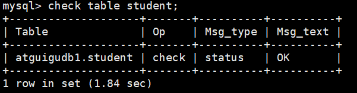

   该语句对于检查的表可能会产生多行信息。最后一行有一个状态的 Msg_type 值，Msg_text 通常为 OK。如果得到的不是 OK，通常要对其进行修复；是 OK 说明表已经是最新的了。表已经是最新的，意味着存储引擎对这张表不必进行检查。

3. **优化表**

   **方式1：OPTIMIZE TABLE**

   MySQL中使用`OPTIMIZE TABLE`语句来优化表。但是，OPTILMIZE TABLE语句只能优化表中的`VARCHAR`、`BLOB`或`TEXT`类型的字段。一个表使用了这些字段的数据类型，若已经`删除`了表的一大部分数据，或者已经对含有可变长度行的表（含有VARCHAR、BLOB或TEXT列的表）进行了很多`更新`，则应使用OPTIMIZE TABLE来重新利用未使用的空间，并整理数据文件的`碎片`。

   OPTIMIZE TABLE 语句对InnoDB和MyISAM类型的表都有效。该语句在执行过程中也会给表加上`只读锁`。

   OPTILMIZE TABLE语句的基本语法如下：

   ```mysql
   OPTIMIZE [LOCAL | NO_WRITE_TO_BINLOG] TABLE tbl_name [, tbl_name] ...
   ```

   LOCAL | NO_WRITE_TO_BINLOG 关键字的意义和分析表相同，都是指定不写入二进制日志。

   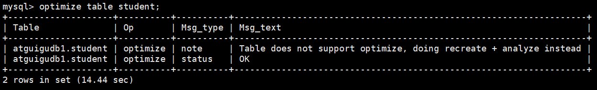

   执行完毕，Msg_text显示

   > ‘numysql.SYS_APP_USER’, ‘optimize’, ‘note’, ‘Table does not support optimize, doing recreate + analyze instead’

   原因是我服务器上的MySQL是InnoDB存储引擎。

   到底优化了没有呢？看官网！

   https://dev.mysql.com/doc/refman/8.0/en/optimize-table.html

   在MyISAM中，是先分析这张表，然后会整理相关的MySQL datafile，之后回收未使用的空间；

   在InnoDB中，回收空间是简单通过Alter table进行整理空间。在优化期间，MySQL会创建一个临时表，优化完成之后会删除原始表，然后会将临时表rename成为原始表。

   > 说明：在多数的设置中，根本不需要运行OPTIMIZE TABLE。即使对可变长度的行进行了大量的更新，也不需要经常运行，`每周一次`或`每月一次`即可，并且只需要对`特定的表`运行。
   
   **方式2：使用mysqlcheck命令**
   
   ```mysql
   mysqlcheck -o DatabaseName TableName -u root -p******;
   ```
   
   mysqlcheck是Linux中的rompt，-o是代表Optimize。


#### 3.8 小结

上述这些方法都是有利有弊的。比如：

- 修改数据类型，节省存储空间的同时，你要考虑到数据不能超过取值范围；
- 增加冗余字段的时候，不要忘了确保数据一致性；
- 把大表拆分，也意味着你的查询会增加新的连接，从而增加额外的开销和运维的成本。

因此，你一定要结合实际的业务需求进行权衡。


### 4 大表优化

当MySQL单表记录数过大时，数据库的CRUD性能会明显下降，一些常见的优化措施如下:

#### 4.1 限定查询的范围

**禁止不带任何限制数据范围条件的查询语句**。比如：我们当用户在查询订单历史的时候，我们可以控制在一个月的范围内。


#### 4.2 读/写分离

经典的数据库拆分方案，主库负责写，从库负责读。

- 一主一从模式：

  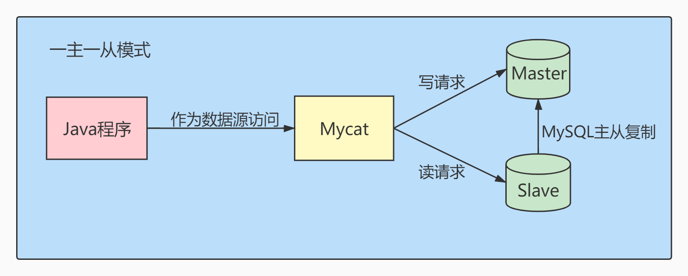

- 双主双从模式：

  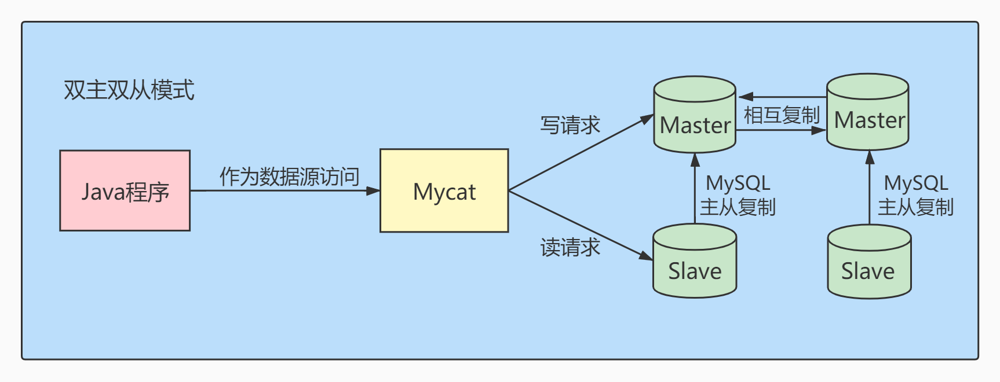


#### 4.3 垂直拆分

当数据量级达到`千万级`以上时，有时候我们需要把一个数据库切成多份，放到不同的数据库服务器上，减少对单一数据库服务器的访问压力。

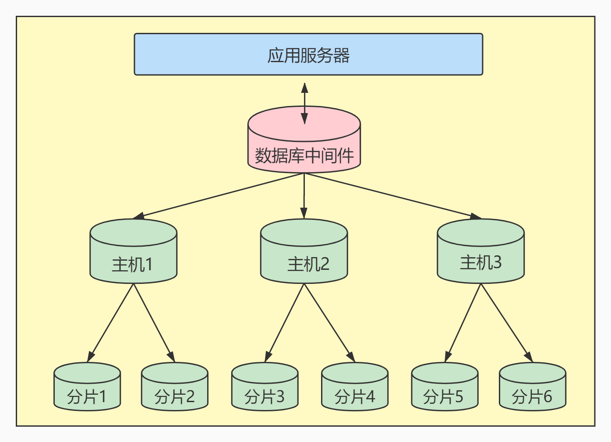

- 如果数据库中的数据表过多，可以采用`垂直分库`的方式，将关联的数据表部署在同一个数据库上。
- 如果数据表中的列过多，可以采用`垂直分表`的方式，将一张数据表分拆成多张数据表，把经常一起使用的列放到同一张表里。


**垂直拆分的优点**：

可以使得列数据变小，在查询时减少读取的Block数，减少I/O次数。此外，垂直分区可以简化表的结构，易于维护。

**垂直拆分的缺点**：

主键会出现冗余，需要管理冗余列，并会引起 JOIN 操作。此外，垂直拆分会让事务变得更加复杂。


#### 4.4 水平拆分

- 尽量控制单表数据量的大小，建议控制在`1000万以内`。1000万并不是MySQL数据库的限制，过大会造成修改表结构、备份、恢复都会有很大的问题。此时可以用`历史数据归档`(应用于日志数据)，`水平分表`(应用于业务数据)等手段来控制数据量大小。
- 这里我们主要考虑业务数据的水平分表策略。将大的数据表按照`某个属性维度`分拆成不同的小表，每张小表保持相同的表结构。比如你可以按照年份来划分，把不同年份的数据放到不同的数据表中。2017年、2018年和2019年的数据就可以分别放到三张数据表中。
- 水平分表仅是解决了单一表数据过大的问题，但由于表的数据还是在同一台机器上，其实对于提升MySQL并发能力没有什么意义，所以`水平拆分最好分库`，从而达到分布式的目的。

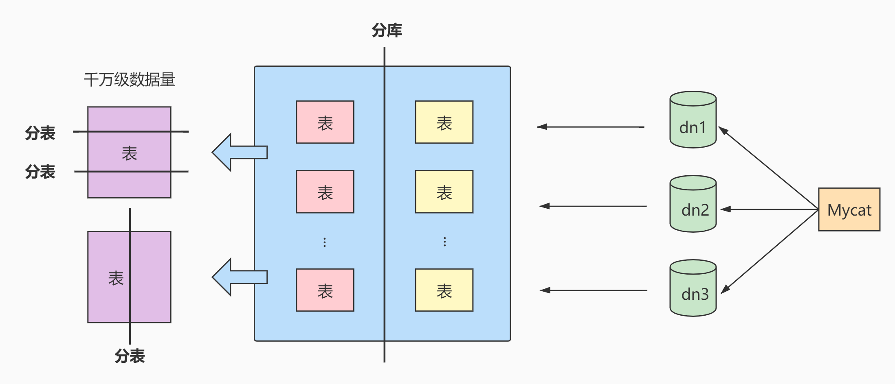

水平拆分能够支持非常大的数据量存储，应用端改造也少，但`分片事务难以解决，跨节点Join性能较差，逻辑复杂`。《Java工程师修炼之道》的作者推荐**尽量不要对数据进行分片，因为拆分会带来逻辑、部署、运维的各种复杂度**，一般的数据表在优化得当的情况下支撑千万以下的数据量是没有太大问题的。如果实在要分片，尽量选择客户端分片架构，这样可以减少一次和中间件的网络IO。

下面补充一下数据库分片的两种常见方案：

- **客户端代理：分片逻辑在应用端，封装在jar包中，通过修改或者封装JDBC层来实现**。当当网的**Sharding-JDBC**、阿里的TDDL是两种比较常用的实现。
- **中间件代理：在应用和数据中间加了一个代理层。分片逻辑统一维护在中间件服务中**。我们现在谈的**Mycat**、360的Atlas、网易的DDB等等都是这种架构的实现。


### 5 其它调优策略

#### 5.1 服务器语句超时处理

在MySQL 8.0中可以设置`服务器语句超时的限制`，单位可以达到`毫秒级别`。当中断的执行语句超过设置的毫秒数后，服务器将终止查询影响不大的事务或连接，然后将错误报给客户端。

设置服务器语句超时的限制，可以通过设置系统变量`MAX_EXECUTION_TIME`来实现。默认情况下，MAX_EXECUTION_TIME的值为0，代表没有时间限制。例如：

```mysql
SET GLOBAL MAX_EXECUTION_TIME=2000;
```

```mysql
SET SESSION MAX_EXECUTION_TIME=2000; #指定该会话中SELECT语句的超时时间
```


#### 5.2 创建全局通用表空间

MySQL8.0使用`CREATE TABLESPACE`语句来创建一个全局通用表空间。全局表空间可以被所有的数据库的表共享，而且相比于独享表空间，使用手动创建共享表空间可以节约元数据方面的内存。可以在创建表的时候，指定属于哪个表空间，也可以对已有表进行表空间修改等。

下面创建名为atguigu1的共享表空闲，SQL语句如下：

```mysql
CREATE TABLESPACE atguigu1 ADD DATAFILE 'atguigu1.ibd' file_block_size=16k;
```

指定表空间，SQL语句如下：

```mysql
CREATE TABLE test(id INT,NAME VARCHAR(10)) ENGINE=INNODB DEFAULT CHARSET utf8mb4 TABLESPACE atguigu1;
```

也可以通过`ALTER TABLE`语句指定表空间，SQL语句如下：

```mysql
ALTER TABLE test TABLESPACE atguigu1;
```

如何删除创建的共享表空间？因为是共享表空间，所以不能直接通过`drop table tbname`删除，这样操作并不能回收空间。当确定共享表空间的数据都没用，并且依赖该表空间的表均已经删除时，可以通过`drop tablespace`删除共享表空间来释放空间，如果依赖该共享表空间的表存在，就会删除失败。


#### 5.3 MySQL 8.0新特性：隐藏索引对调优的帮助

不可见索引的特性对于性能调试非常有用。在MySQL8.0中，索引可以被“隐藏”和“显示”。**当一个索引被隐藏时，它不会被查询优化器所使用**。也就是说，管理员可以隐藏一个索引，然后观察对数据库的影响。如果数据库性能有所下降，就说明这个索引是有用的，于是将其“恢复显示”即可；如果数据库性能看不出变化，就说明这个索引是多余的，可以删掉了。

需要注意的是当索引被隐藏时，它的内容仍然是和正常索引一样`实时更新`的。如果一个索引需要长期被隐藏，那么可以将其删除，因为索引的存在会影响插入、更新和删除的性能。

数据表中的主键不能被设置为invisible。
# MySQL_高级__事务篇

> 讲师：尚硅谷-宋红康（江湖人称：康师傅）
>
> 尚硅谷官网：[http://www.atguigu.com](http://www.atguigu.com/)
>
> 视频链接：https://www.bilibili.com/video/BV1iq4y1u7vj?spm_id_from=333.337.search-card.all.click

------

## 十二、事务基础知识

事务是数据库区别于文件系统的重要特性之一，当我们有了事务就会让数据库始终保持`一致性`，同时我们还能通过事务的机制`恢复到某个时间点`，这样可以保证已提交到数据库的修改不会因为系统崩溃而丢失。

### 1 数据库事务概述

#### 1.1 存储引擎支持情况

`SHOW ENGINES`命令来查看当前 MySQL 支持的存储引擎都有哪些，以及这些存储引擎是否支持事务。

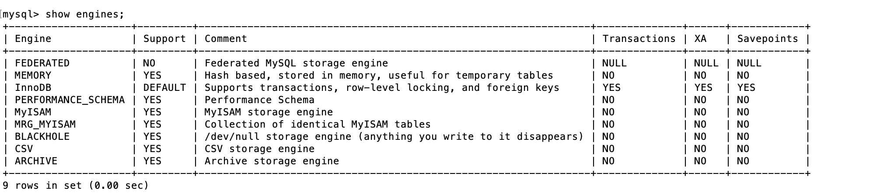

能看出在 MySQL 中，只有InnoDB 是支持事务的。


#### 1.2 基本概念

**事务：**一组逻辑操作单元，使数据从一种状态变换到另一种状态。

**事务处理的原则**：保证所有事务都作为`一个工作单元`来执行，即使出现了故障，都不能改变这种执行方式。当在一个事务中执行多个操作时，要么所有的事务都被提交(`commit`)，那么这些修改就`永久`地保存下来；要么数据库管理系统将`放弃`所作的所有`修改`，整个事务回滚(`rollback`)到最初状态。

```mysql
#案例:AA用户给BB用户转账100
update account set money = money - 100 where name = 'AA';

#服务器宕机
update account set money = money + 100 where name = 'BB';
```


#### 1.3 事务的ACID特性

- **原子性（atomicity）：**

  原子性是指事务是一个不可分割的工作单位，要么全部提交，要么全部失败回滚。即要么转账成功，要么转账失败，是不存在中间的状态。如果无法保证原子性会怎么样？就会出现数据不一致的情形，A账户减去100元，而B账户增加100元操作失败，系统将无故丢失100元。

- **一致性（consistency）：**

  （国内很多网站上对一致性的阐述有误，具体你可以参考Wikipedia对[Consistency](https://en.wikipedia.org/wiki/ACID)的阐述）

  根据定义，一致性是指事务执行前后，数据从一个`合法性状态`变换到另外一个`合法性状态`。这种状态是`语义上`的而不是语法上的，跟具体的业务有关。

  那什么是合法的数据状态呢？满足`预定的约束`的状态就叫做合法的状态。通俗一点，这状态是由你自己来定义的（比如满足现实世界中的约束）。满足这个状态，数据就是一致的，不满足这个状态，数据就是不一致的！如果事务中的某个操作失败了，系统就会自动撤销当前正在执行的事务，返回到事务操作之前的状态。

  **举例1：**A账户有200元，转账300元出去，此时A账户余额为-100元。你自然就发现了此时数据是不一致的，为什么呢？因为你定义了一个状态，余额这列必须>=0。

  **举例2：**A账户20o元，转账50元给B账户，A账户的钱扣了，但是B账户因为各种意外，余额并没有增加。你也知道此时数据是不一致的，为什么呢？因为你定义了一个状态，要求A+B的总余额必须不变。

  **举例3：**在数据表中我们将`姓名`字段设置为`唯一性约束`，这时当事务进行提交或者事务发生回滚的时候，如果数据表中的姓名不唯一，就破坏了事务的一致性要求。

- **隔离型（isolation）：**  

  事务的隔离性是指一个事务的执行`不能被其他事务干扰`，即一个事务内部的操作及使用的数据对`并发`的其他事务是隔离的，并发执行的各个事务之间不能互相干扰。

  如果无法保证隔离性会怎么样？假设A账户有200元，B账户0元。A账户往B账户转账两次，每次金额为50元，分别在两个事务中执行。如果无法保证隔离性，会出现下面的情形：

  ```mysql
  UPDATE accounts SET money = money - 50 WHERE NAME = 'AA';
  
  UPDATE accounts SET money = money + 50 WHERE NAME = 'BB';
  ```

  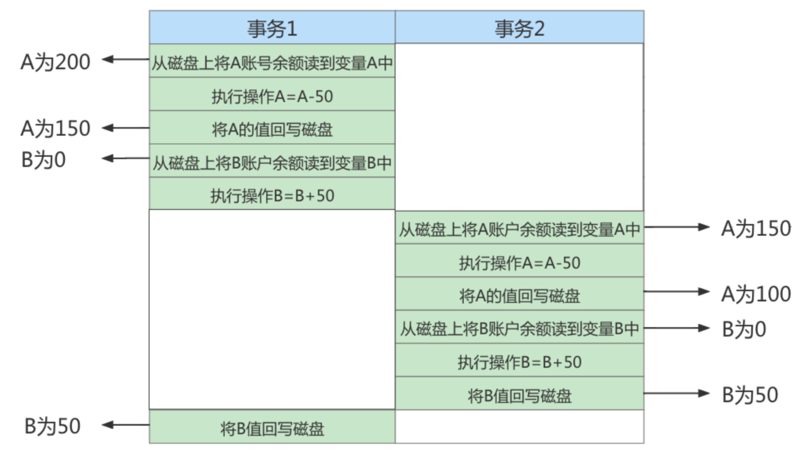

- **持久性（durability）：**

  持久性是指一个事务一旦被提交，它对数据库中数据的改变就是`永久性的`，接下来的其他操作和数据库故障不应该对其有任何影响。

  持久性是通过`事务日志`来保证的。日志包括了`重做日志`和`回滚日志`。当我们通过事务对数据进行修改的时候，首先会将数据库的变化信息记录到`重做日志`中，然后再对数据库中对应的行进行修改。这样做的好处是，即使数据库系统崩溃，数据库重启后也能找到没有更新到数据库系统中的重做日志，重新执行，从而使事务具有持久性。


> 总结
>
> ACID是事务的四大特性，在这四个特性中，原子性是基础，隔离性是手段，一致性是约束条件，而持久性是我们的目的。
> 
>数据库事务，其实就是数据库设计者为了方便起见，把需要保证`原子性`、`隔离性`、`一致性`和`持久性`的一个或多个数据库操作称为一个事务。


#### 1.4 事务的状态

我们现在知道`事务`是一个抽象的概念，它其实对应着一个或多个数据库操作，MySQL根据这些操作所执行的不同阶段把`事务`大致划分成几个状态：

- **活动的（active）**

  事务对应的数据库操作正在执行过程中时，我们就说该事务处在`活动的`状态。

- **部分提交的（partially committed）**

  当事务中的最后一个操作执行完成，但由于操作都在内存中执行，所造成的影响并`没有刷新到磁盘`时，我们就说该事务处在`部分提交的`状态。

- **失败的（failed）**

  当事务处在`活动的`或者`部分提交的`状态时，可能遇到了某些错误（数据库自身的错误、操作系统错误或者直接断电等）而无法继续执行，或者人为的停止当前事务的执行，我们就说该事务处在`失败的`状态。

- **中止的（aborted）**

  如果事务执行了一部分而变为`失败的`状态，那么就需要把已经修改的事务中的操作还原到事务执行前的状态。换句话说，就是要撤销失败事务对当前数据库造成的影响。我们把这个撤销的过程称之为`回滚`。当`回滚`操作执行完毕时，也就是数据库恢复到了执行事务之前的状态，我们就说该事务处在了`中止的`状态。

  **举例**：

  ```mysql
  UPDATE accounts SET money = money - 50 WHERE NAME = 'AA';
  
  UPDATE accounts SET money = money + 50 WHERE NAME = 'BB';
  ```

- **提交的（committed）**

  当一个处在`部分提交的`状态的事务将修改过的数据都`同步到磁盘`之后，我们就可以说该事务处在了`提交的`状态。

一个基本的状态转换图如下所示  

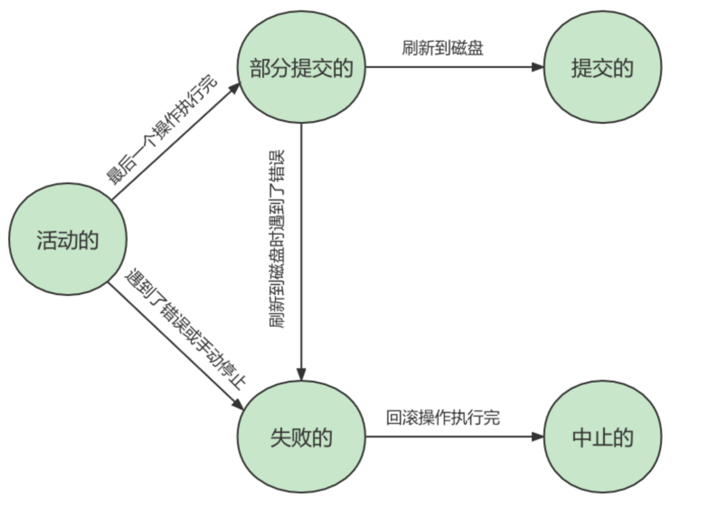

图中可见，只有当事务处于`提交的`或者`中止的`状态时，一个事务的生命周期才算是结束了。对于已经提交的事务来说，该事务对数据库所做的修改将永久生效，对于处于中止状态的事务，该事务对数据库所做的所有修改都会被回滚到没执行该事务之前的状态。


### 2 如何使用事务

使用事务有两种方式，分别为`显式事务`和`隐式事务`。

#### 2.1 显式事务

**步骤1**：`START TRANSACTION`或者`BEGIN`，作用是显式开启一个事务

```mysql
mysql> BEGIN;
#或者
mysql> START TRANSACTION;
```

`START TRANSACTION`语句相较于`BEGIN`特别之处在于，后边能跟随几个`修饰符`：

1. `READ ONLY`：标识当前事务是一个`只读事务`，也就是属于该事务的数据库操作只能读取数据，而不能修改数据。

   > 补充：只读事务中只是不允许修改那些其他事务也能访问到的表中的数据，对于临时表来说(我们使用CREATE TMEPORARY TABLE创建的表)，由于它们只能在当前会话中可见，所以只读事务其实也是可以对临时表进行增、删、改操作的。

2. `READ WRITE`：标识当前事务是一个`读写事务`，也就是属于该事务的数据库操作既可以读取数据，也可以修改数据。

3. `WITH CONSISTENT SNAPSHOT`：启动一致性读。

**比如**：

```mysql
START TRANSACTION READ ONLY; # 开启一个只读事务
```

```mysql
START TRANSACTION READ ONLY, WITH CONSISTENT SNAPSHOT; # 开启只读事务和一致性读
```

```mysql
START TRANSACTION READ WRITE, WITH CONSISTENT SNAPSHOT; # 开启读写事务和一致性读
```

注意：

- `READ ONLY`和`READ WRITE`是用来设置所谓的事务`访问模式`的，就是以只读还是读写的方式来访问数据库中的数据，一个事务的访问模式不能同时既设置为`只读`的也设置为`读写`的，所以不能同时把`READ ONLY`和`READ WRITE`放到`START TRANSACTION`语句后边。
- 如果我们不显式指定事务的访问模式，那么该事务的访问模式就是`读写`模式。

**步骤2**：一系列事务中的操作（主要是DML，不含DDL）

**步骤3**：提交事务或中止事务（即回滚事务）

```mysql
# 提交事务。当提交事务后，对数据库的修改是永久性的。
mysql> COMMIT;
```

```mysql
# 回滚事务。即撤销正在进行的所有没有提交的修改
mysql> ROLLBACK;

# 将事务回滚到某个保存点。
mysql> ROLLBACK TO [SAVEPOINT]
```

其中关于SAVEPOINT相关操作有：

```mysql
# 在事务中创建保存点，方便后续针对保存点进行回滚。一个事务中可以存在多个保存点
SAVEPOINT 保存点名称;

# 删除某个保存点
RELEASE SAVEPOINT 保存点名称;
```


#### 2.2 隐式事务

MySQL中有一个系统变量`autocommit`：  

```mysql
mysql> SHOW VARIABLES LIKE 'autocommit';
+-------------------+---------+
| Variable_name     | Value   |
+-------------------+---------+
| autocommit        | ON      |
+-------------------+---------+
1 row in set (0.01 sec)
```

默认情况下，如果我们不显式的使用`START TRANSACTION`或者`BEGIN`语句开启一个事务，那么每一条语句都算是一个独立的事务，这种特性称之为事务的`自动提交`。也就是说，不以`START TRANSACTION`或者`BEGIN`语句显式的开启一个事务，那么下边这两条语句就相当于放到两个独立的事务中去执行：

```mysql
UPDATE account SET balance = balance - 10 WHERE id = 1; #此时这条DML操作是一个独立的事务

UPDATE account SET balance = balance + 10 WHERE id = 2; #此时这条DML操作是一个独立的事务
```

当然，如果我们想关闭这种`自动提交`的功能，可以使用下边两种方法之一：

- 显式的的使用`START TRANSACTION`或者`BEGIN`语句开启一个事务。这样在本次事务提交或者回滚前会暂时关闭掉自动提交的功能。

- 把系统变量`autocommit`的值设置为`OFF`，就像这样：

  ```mysql
  SET autocommit = OFF;
  # 或
  SET autocommit = 0;
  ```

  这样的话，我们写入的多条语句就算是属于同一个事务了，直到我们显式的写出`COMMIT`语句来把这个事务提交掉，或者显式的写出`ROLLBACK`语句来把这个事务回滚掉。

> 补充: Oracle默认不自动提交，需要手写COMMIT命令，而MySQL默认自动提交。


#### 2.3 隐式提交数据的情况

- **数据定义语言（Data definition language，缩写为：DDL）**

  数据库对象，指的就是`数据库`、`表`、`视图`、`存储过程`等结构。当我们使用`CREATE`、`ALTER`、`DROP`等语句去修改数据库对象时，就会隐式的提交前边语句所属于的事务。即:

  ```mysql
  BEGIN;
  
  SELECT ...; # 事务中的一条语句
  UPDATE ...; # 事务中的一条语句
  ...; # 事务中的其他语句
  
  CREATE TABLE ...; # 此语句会隐式提交前边语句所属于的事务
  ```

- **隐式使用或修改mysql数据库中的表**

  当我们使用`ALTER USER`、`CREATE USER`、`DROP USER`、`GRANT`、`RENAME USER`、`REVOKE`、`SET
  PASSWORD`等语句时也会隐式的提交前边语句所属于的事务。

- **事务控制或关于锁定的语句**
  1. 当我们在一个事务还没提交或者回滚时就又使用`START TRANSACTION`或者`BEGIN`语句开启了另一个事务时，会`隐式的提交`上一个事务。即：
  
     ```mysql
     BEGIN;
     
     SELECT ...; # 事务中的一条语句
     UPDATE ...; # 事务中的一条语句
     ...; # 事务中的其他语句
     
     BEGIN; # 此语句会隐式提交前边语句所属于的事务
     ```
  
  2. 当前的`autocommit`系统变量的值为`OFF`，我们手动把它调为`ON`时，也会`隐式的提交`前边语句所属的事务。
  
  3. 使用`LOCK TABLES`、`UNLOCK TABLES`等关于锁定的语句也会`隐式的提交`前边语句所属的事务。
  
- **加载数据的语句**

  使用`LOAD DATA`语句来批量往数据库中导入数据时，也会`隐式的提交`前边语句所属的事务。

- **关于MySQL复制的一些语句**

  使用`START SLAVE`、`STOP SLAVE`、`RESET SLAVE`、`CHANGE MASTER TO`等语句时会隐式的提交前边语句所属的事务。

- **其它的一些语句**

  使用`ANALYZE TABLE`、`CACHE INDEX`、`CHECK TABLE`、`FLUSH`、`LOAD INDEX INTO CACHE`、`OPTIMIZE TABLE`、`REPAIR TABLE`、`RESET`等语句也会隐式的提交前边语句所属的事务。


#### 2.4 使用举例1：提交与回滚

我们看下在 MySQL 的默认状态下，下面这个事务最后的处理结果是什么。

**情况1**：

```mysql
CREATE TABLE user(name varchar(20), PRIMARY KEY (name)) ENGINE=InnoDB;

BEGIN;
INSERT INTO user SELECT '张三'; # 此时不会自动提交数据
COMMIT;

BEGIN;
INSERT INTO user SELECT '李四'; # 此时不会自动提交数据
INSERT INTO user SELECT '李四'; # 受主键的影响，不能添加成功
ROLLBACK;

SELECT * FROM user;
```

运行结果（1 行数据）：

```mysql
mysql> commit;
Query OK, 0 rows affected (0.00 秒)
mysql> BEGIN;
Query OK, 0 rows affected (0.00 秒)
mysql> INSERT INTO user SELECT '李四';
Query OK, 1 rows affected (0.00 秒)
mysql> INSERT INTO user SELECT '李四';
Duplicate entry '李四' for key 'user.PRIMARY'
mysql> ROLLBACK;
Query OK, 0 rows affected (0.01 秒)
mysql> select * from user;

+--------+
| name   |
+--------+
| 张三    |
+--------+
1 行于数据集 (0.01 秒)
```

**情况2**：

```mysql
CREATE TABLE user (name varchar(20), PRIMARY KEY (name)) ENGINE=InnoDB;

BEGIN;
INSERT INTO user SELECT '张三'; # 此时不会自动提交数据
COMMIT;

INSERT INTO user SELECT '李四'; # 默认情况下(即autocommit为true)，DML操作也会自动提交数据
INSERT INTO user SELECT '李四'; # 事务的失败的状态
ROLLBACK;
```

运行结果（2 行数据）：

```mysql
mysql> SELECT * FROM user;
+--------+
| name   |
+--------+
| 张三    |
| 李四    |
+--------+
2 行于数据集 (0.01 秒)
```

**情况3**：

```mysql
CREATE TABLE user(name varchar(255), PRIMARY KEY (name)) ENGINE=InnoDB;

SET @@completion_type = 1;

BEGIN;
INSERT INTO user SELECT '张三';
COMMIT;

INSERT INTO user SELECT '李四';
INSERT INTO user SELECT '李四';
ROLLBACK;

SELECT * FROM user;
```

运行结果（1 行数据）：

```mysql
mysql> SELECT * FROM user;
+--------+
| name   |
+--------+
| 张三   |
+--------+
1 行于数据集 (0.01 秒)
```

你能看到相同的SQL代码，只是在事务开始之前设置了`SET @@completion_type = 1;`，结果就和我们第一次处理的一样，只有一个“张三”。这是为什么呢？

这里我讲解下MySQL中`completion_type`参数的作用，实际上这个参数有3种可能：

1. `completion=0`, 这是`默认情况`。当我们执行COMMIT的时候会提交事务，在执行下一个事务时，还需要使用`START TRANSACTION`或者`BEGIN`来开启。
2. `completion=1`，这种情况下，当我们提交事务后，相当于执行了`COMMIT AND CHAIN`，也就是开启一个`链式事务`，即当我们提交事务之后会开启一个相同隔离级别的事务。
3. `completion=2`，这种情况下`COMMIT=COMMIT AND RELEASE`，也就是当我们提交后，会自动与服务器断开连接。

> 当我们设置 autocommit=0 时，不论是否采用 START TRANSACTION 或者 BEGIN 的方式来开启事务，都需要用 COMMIT 进行提交，让事务生效，使用 ROLLBACK 对事务进行回滚。
>
> 当我们设置 autocommit=1 时，每条 SQL 语句都会自动进行提交。
>
> 不过这时，如果你采用 START
> TRANSACTION 或者 BEGIN 的方式来显式地开启事务，那么这个事务只有在 COMMIT 时才会生效，在 ROLLBACK 时才会回滚。


#### 2.5 使用举例2：测试不支持事务的engine

```mysql
#举例2：体会INNODB 和 MyISAM
CREATE TABLE test1(i INT) ENGINE = INNODB;

CREATE TABLE test2(i INT) ENGINE = MYISAM;

#针对于innodb表
BEGIN
INSERT INTO test1 VALUES (1);
ROLLBACK;

SELECT * FROM test1;


#针对于myisam表:不支持事务
BEGIN
INSERT INTO test2 VALUES (1);
ROLLBACK;

SELECT * FROM test2;
```


#### 2.6 使用举例3：SAVEPOINT

```mysql
#举例3：体会savepoint
CREATE TABLE user3(NAME VARCHAR(15),balance DECIMAL(10,2));

BEGIN
INSERT INTO user3(NAME,balance) VALUES('张三',1000);
COMMIT;

SELECT * FROM user3;

BEGIN;
UPDATE user3 SET balance = balance - 100 WHERE NAME = '张三';

UPDATE user3 SET balance = balance - 100 WHERE NAME = '张三';

SAVEPOINT s1;#设置保存点

UPDATE user3 SET balance = balance + 1 WHERE NAME = '张三';

ROLLBACK TO s1; #回滚到保存点


SELECT * FROM user3;

ROLLBACK; #回滚操作

SELECT * FROM user3;
```


### 3 事务隔离级别

MySQL是一个`客户端／服务器`架构的软件，对于同一个服务器来说，可以有若干个客户端与之连接，每个客户端与服务器连接上之后，就可以称为一个会话（`Session`）。每个客户端都可以在自己的会话中向服务器发出请求语句，一个请求语句可能是某个事务的一部分，也就是对于服务器来说可能同时处理多个事务。事务有`隔离性`的特性，理论上在某个事务`对某个数据进行访问时`，其他事务应该进行`排队`，当该事务提交之后，其他事务才可以继续访问这个数据。但是这样对`性能影响太大`，我们既想保持事务的隔离性，又想让服务器在处理访问同一数据的多个事务时`性能尽量高些`，那就看二者如何权衡取舍了。

#### 3.1 数据准备

我们需要创建一个表：

```mysql
CREATE TABLE student (
	studentno INT,
	name VARCHAR(20),
	class varchar(20),
	PRIMARY KEY (studentno)
) Engine=InnoDB CHARSET=utf8;
```

然后向这个表里插入一条数据：

```mysql
INSERT INTO student VALUES(1, '小谷', '1班');
```

现在表里的数据就是这样的：

```mysql
mysql> select * from student;
+-------------+--------+-------+
| studentno   | name   | class |
+-------------+--------+-------+
| 1           | 小谷    | 1班   |
+-------------+--------+-------+
1 row in set (0.00 sec)
```


#### 3.2 数据并发问题

针对事务的隔离性和并发性，我们怎么做取舍呢？先看一下访问相同数据的事务在`不保证串行执行`（也就是执行完一个再执行另一个）的情况下可能会出现哪些问题：

1. **脏写（Dirty Write）**

   对于两个事务Session A、Session B，如果事务Session A`修改了`另一个`未提交`事务Session B`修改过`的数据，那就意味着发生了`脏写`。

   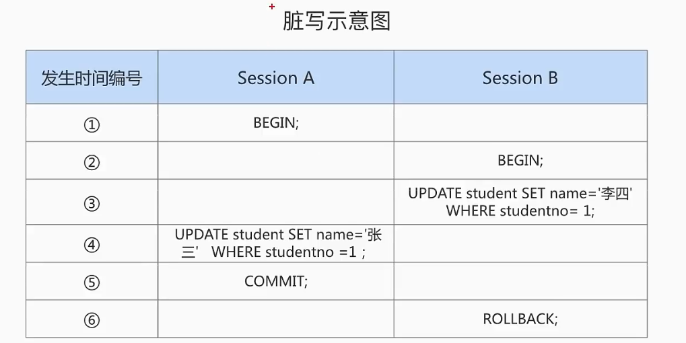

   Session A和Session B各开启了一个事务，Session B中的事务先将studentno列为1的记录的name列更新为'李四'，然后Session A中的事务接着又把这条studentno列为1的记录的name列更新为'张三。如果之后Session B中的事务进行了回滚，那么Session A中的更新也将不复存在，这种现象就称之为脏写。这时Session A中的事务就没有效果了，明明把数据更新了，最后也提交事务了，最后看到的数据什么变化也没有。这里大家对事务的隔离级比较了解的话，会发现默认隔离级别下，上面Session A中的更新语句会处于等待状态，这里只是跟大家说明一下会出现这样现象。

2. **脏读（Dirty Read）**

   对于两个事务Session A、Session B，Session A`读取`了已经被Session B`更新`但还`没有被提交`的字段。之后若Session B`回滚`，Session A`读取`的内容就是`临时且无效`的。

   

   Session A和Session B各开启了一个事务，Session B中的事务先将studentno列为1的记录的name列更新为'张三'，然后Session A中的事务再去查询这条studentno为1的记录，如果读到列name的值为'张三'，而Session B中的事务稍后进行了回滚，那么Session A中的事务相当于读到了一个不存在的数据，这种现象就称之为`脏读`。

3. **不可重复读（Non-Repeatable Read）**

   对于两个事务Session A、Session B，Session A`读取`了一个字段，然后Session B`更新`了该字段。之后Session A`再次读取`同一个字段，`值就不同`了。那就意味着发生了不可重复读。

   

   我们在Session B中提交了几个`隐式事务`（注意是隐式事务，意味着语句结束事务就提交了），这些事务都修改了studentno列为1的记录的列name的值，每次事务提交之后，如果Session A中的事务都可以查看到最新的值，这种现象也被称之为`不可重复读`。

4. **幻读（Phantom）**

   对于两个事务Session A、Session B，Session A从一个表中`读取`了一个字段, 然后Session B在该表中`插入`了一些新的行。之后, 如果Session A`再次读取`同一个表, 就会多出几行。那就意味着发生了幻读。

   
   
   Session A中的事务先根据条件studentno > 0这个条件查询表student，得到了name列值为'张三'的记录；之后Session B中提交了一个`隐式事务`，该事务向表student中插入了一条新记录；之后Session A中的事务再根据相同的条件studentno > 0查询表student，得到的结果集中包含Session B中的事务新插入的那条记录，这种现象也被称之为`幻读`。我们把新插入的那些记录称之为`幻影记录`。
   
   **注意1**：
   
   有的同学会有疑问，那如果Session B中`删除了`一些符合`studentno > 0`的记录而不是插入新记录，那Session A之后再根据`studentno > 0`的条件读取的`记录变少`了，这种现象算不算`幻读`呢？这种现象`不属于幻读`，幻读强调的是一个事务按照某个`相同条件多次读取`记录时，后读取时读到了之前`没有读到的记录`。
   
   **注意2**：
   
   那对于先前已经读到的记录，之后又读取不到这种情况，算啥呢？这相当于对每一条记录都发生了`不可重复读`的现象。幻读只是重点强调了读取到了之前读取没有获取到的记录。

 

#### 3.3 SQL中的四种隔离级别

上面介绍了几种并发事务执行过程中可能遇到的一些问题，这些问题有轻重缓急之分，我们给这些问题按照严重性来排一下序：

```
脏写 > 脏读 > 不可重复读 > 幻读
```

我们愿意舍弃一部分隔离性来换取一部分性能在这里就体现在：设立一些隔离级别，隔离级别越低，并发问题发生的就越多。`SQL标准`中设立了`4个隔离级别`：

- `READ UNCOMMITTED`：读未提交，在该隔离级别，所有事务都可以看到其他未提交事务的执行结果。不能避免脏读、不可重复读、幻读。
- `READ COMMITTED`：读已提交，它满足了隔离的简单定义：一个事务只能看见已经提交事务所做的改变。这是大多数数据库系统的默认隔离级别（但不是MySQL默认的）。可以避免脏读，但不可重复读、幻读问题仍然存在。
- `REPEATABLE READ`：可重复读，事务A在读到一条数据之后，此时事务B对该数据进行了修改并提交，那么事务A再读该数据，读到的还是原来的内容。可以避免脏读、不可重复读，但幻读问题仍然存在。这是MySQL的默认隔离级别。
- `SERIALIZABLE`：可串行化，确保事务可以从一个表中读取相同的行。在这个事务持续期间，禁止其他事务对该表执行插入、更新和删除操作。所有的并发问题都可以避免，但性能十分低下。能避免脏读、不可重复读和幻读。

`SQL标准`中规定，针对不同的隔离级别，并发事务可以发生不同严重程度的问题，具体情况如下：


`脏写`怎么没涉及到？因为脏写这个问题太严重了，不论是哪种隔离级别，都不允许脏写的情况发生。

不同的隔离级别有不同的现象，并有不同的锁和并发机制，隔离级别越高，数据库的并发性能就越差，4种事务隔离级别与并发性能的关系如下：

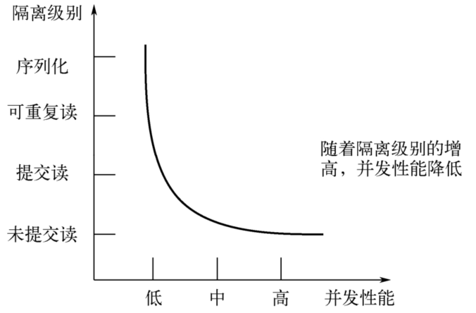


#### 3.4 MySQL支持的四种隔离级别

不同的数据库厂商对SQL标准中规定的四种隔离级别支持不一样。比如，`Oracle`就只支持`READ COMMITTED`(`默认隔离级别`)和`SERIALIZABLE隔离级别`。MySQL虽然支持4种隔离级别，但与SQL标准中所规定的各级隔离级别允许发生的问题却有些出入，MySQL在REPEATABLE READ隔离级别下，是可以禁止幻读问题的发生的，禁止幻读的原因我们在第十五章讲解。

MySQL的默认隔离级别为`REPEATABLE READ`，我们可以手动修改一下事务的隔离级别。

```mysql
# 查看隔离级别，MySQL 5.7.20的版本之前：
mysql> SHOW VARIABLES LIKE 'tx_isolation';
+--------------------+----------------------------+
| Variable_name      | Value                      |
+--------------------+----------------------------+
| tx_isolation       | REPEATABLE-READ            |
+--------------------+----------------------------+
1 row in set (0.00 sec)

# MySQL 5.7.20版本之后，引入transaction_isolation来替换tx_isolation
# 查看隔离级别，MySQL 5.7.20的版本及之后：
mysql> SHOW VARIABLES LIKE 'transaction_isolation';
+-----------------------------+----------------------------+
| Variable_name               | Value                      |
+-----------------------------+----------------------------+
| transaction_isolation       | REPEATABLE-READ            |
+-----------------------------+----------------------------+
1 row in set (0.00 sec)

#或者不同MySQL版本中都可以使用的：
SELECT @@transaction_isolation;
```


#### 3.5 如何设置事务的隔离级别

**通过下面的语句修改事务的隔离级别**：

```mysql
SET [GLOBAL|SESSION] TRANSACTION ISOLATION LEVEL 隔离级别;
#其中，隔离级别格式：
> READ UNCOMMITTED
> READ COMMITTED
> REPEATABLE READ
> SERIALIZABLE
```

或者：

```mysql
SET [GLOBAL|SESSION] TRANSACTION_ISOLATION = '隔离级别'
#其中，隔离级别格式：
> READ-UNCOMMITTED
> READ-COMMITTED
> REPEATABLE-READ
> SERIALIZABLE
```

**关于设置时使用GLOBAL或SESSION的影响**：

- 使用`GLOBAL`关键字（在全局范围影响）：

  ```mysql
  SET GLOBAL TRANSACTION ISOLATION LEVEL SERIALIZABLE;
  #或
  SET GLOBAL TRANSACTION_ISOLATION = 'SERIALIZABLE';
  ```

  则：

  - 当前已经存在的会话无效
  - 只对执行完该语句之后产生的会话起作用

- 使用`SESSION`关键字（在会话范围影响）：

  ```mysql
  SET SESSION TRANSACTION ISOLATION LEVEL SERIALIZABLE;
  #或
  SET SESSION TRANSACTION_ISOLATION = 'SERIALIZABLE';
  ```

  则：

  - 对当前会话的所有后续的事务有效
  - 如果在事务之间执行，则对后续的事务有效
  - 该语句可以在已经开启的事务中间执行，但不会影响当前正在执行的事务

如果在服务器启动时想改变事务的默认隔离级别，可以修改启动参数`transaction_isolation`的值。比如，在启动服务器时指定了`transaction_isolation=SERIALIZABLE`，那么事务的默认隔离级别就从原来的`REPEATABLE-READ`变成了`SERIALIZABLE`。

> 小结：
>
> 数据库规定了多种事务隔离级别，不同隔离级别对应不同的干扰程度，隔离级别越高，数据一致性就越好，但并发性越弱。


#### 3.6 不同隔离级别举例

**数据准备**：

```mysql
DROP TABLE IF EXISTS account;

CREATE TABLE account(
	id INT PRIMARY KEY AUTO_INCREMENT,
	name VARCHAR(25),
	balance DECIMAL(10, 2)    
);

INSERT INTO account(id, name, account) VALUES
(1, '张三', '100'),
(2, '李四', '0');
```


**演示1：读未提交之脏读**

设置隔离级别为未提交读：

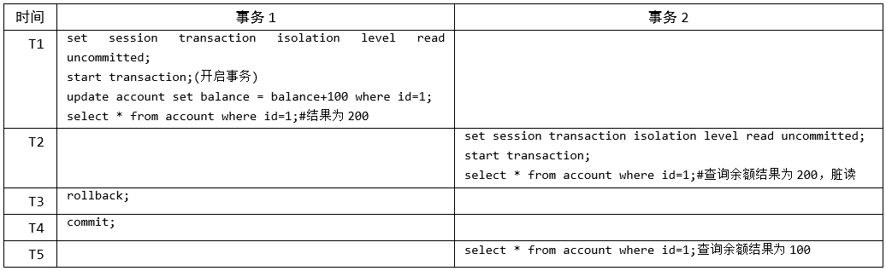

事务1和事务2的执行流程如下：

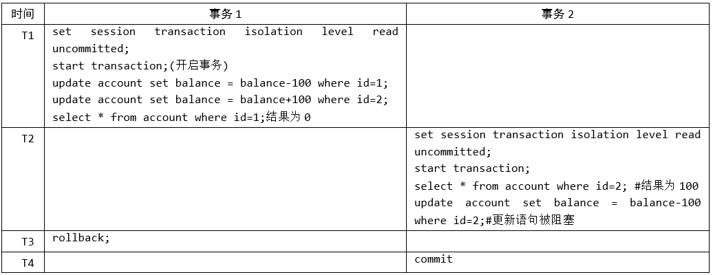

**演示2：读已提交**

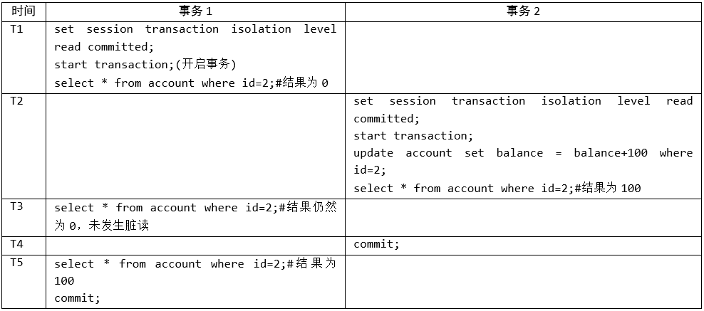

**演示3：可重复读**

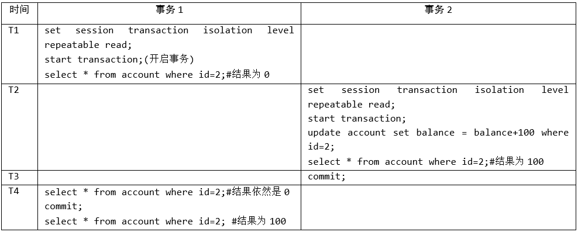

**演示4：幻读**

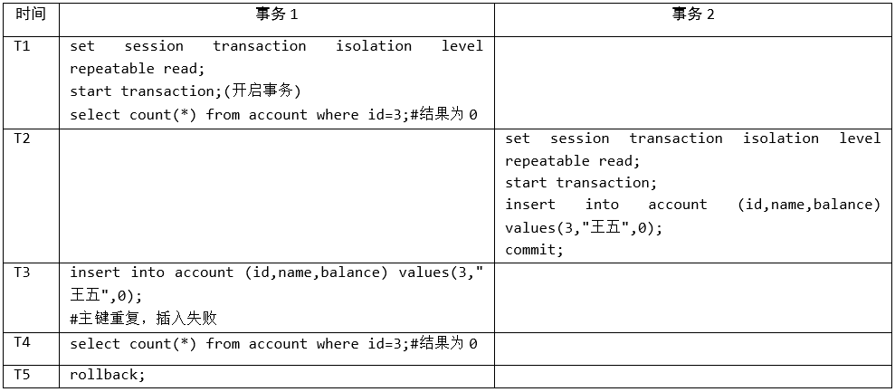

这里要灵活的`理解读取`的意思，第一次select是读取，第二次的insert其实也属于隐式的读取，只不过是在mysql的机制中读取的，插入数据也是要先读取一下有没有主键冲突才能决定是否执行插入。

幻读，并不是说两次读取获取的结果集不同，幻读侧重的方面是某一次的select操作得到的结果所表征的数据状态无法支撑后续的业务操作。更为具体一些：select某记录是否存在，不存在，准备插入此记录，但执行insert时发现此记录已存在，无法插入，此时就发生了幻读。

在REPEATABLE-READ隔离级别下，step1、step2是会正常执行的，step3则会报错主键冲突，对于事务1的业务来说是执行失败的，这里事务1就是发生了幻读，因为事务1在step1中读取的数据状态并不能支撑后续的业务操作，事务1：“见鬼了，我刚才读到的结果应该可以支持我这样操作才对啊，为什么现在不可以”。事务1不敢相信的又执行了step4，发现和setp1读取的结果是一样的(RR下的MVCC机制)。此时，幻读无疑已经发生，事务1无论读取多少次，都查不到id=3的记录，但它的确无法插入这条他通过读取来认定不存在的记录(此数据已被事务2插入)，对于事务1来说，它幻读了。

其实REPEATABLE-READ也是可以避免幻读的，通过对select操作手动加`行X锁(独占锁)`(SELECT .. FOR UPDATE这也正是SERIALIZABLE隔离级别下会隐式为你做的事情)。同时，即便当前记录不存在，比如id=3是不存在的，当前事务也会获得一把记录锁(因为InnoDB的行锁锁定的是索引，故记录实体存在与否没关系，存在就加`行X锁`，不存在就加`间隙锁`)，其他事务则无法插入此索引的记录，故杜绝了幻读。

在`SERIALIZABLE隔离级别下`，step1执行时是会隐式的添加`行(X)锁/gap(X)锁`的，从而step2会被阻塞,
step3会正常执行，待事务1提交后，事务2才能继续执行(主键冲突执行失败)，对于事务1来说业务是正确的，成功的阻塞扼杀了扰乱业务的事务2，对于事务1来说他前期读取的结果是可以支撑其后续业务的。

所以MySQL的幻读并非什么读取两次返回结果集不同，而是事务在插入事先检测不存在的记录时，惊奇的发现这些数据已经存在了，之前的检测读获取到的数据如同鬼影一般。


### 4 事务的常见分类

从事务理论的角度来看，可以把事务分为以下几种类型：

1. 扁平事务（Flat Transactions）
2. 带有保存点的扁平事务（Flat Transactions with Savepoints）
3. 链事务（Chained Transactions）
4. 嵌套事务（Nested Transactions）
5. 分布式事务（Distributed Transactions）


1. `扁平事务`是事务类型中最简单的一种，但是在实际生产环境中，这可能是使用最频繁的事务，在扁平事务中，所有操作都处于同一层次，其由BEGIN WORK开始，由COMMIT WORK或ROLLBACK WORK结束，其间的操作是原子的，要么都执行，要么都回滚，因此，扁平事务是应用程序成为原子操作的基本组成模块。扁平事务虽然简单，但是在实际环境中使用最为频繁，也正因为其简单，使用频繁，故每个数据库系统都实现了对扁平事务的支持。扁平事务的主要限制是不能提交或者回滚事务的某一部分，或分几个步骤提交。

   扁平事务一般有三种不同的结果:

   1. 事务成功完成。在平常应用中约占所有事务的96%。
   2. 应用程序要求停止事务。比如应用程序在捕获到异常时会回滚事务，约占事务的3%。
   3. 外界因素强制终止事务。如连接超时或连接断开，约占所有事务的1%。

2. `带有保存点的扁平事务`除了支持扁平事务支持的操作外，还允许在事务执行过程中回滚到同一事务中较早的一个状态。这是因为某些事务可能在执行过程中出现的错误并不会导致所有的操作都无效，放弃整个事务不合乎要求，开销太大。

   `保存点(Savepoint)`用来通知事务系统应该记住事务当前的状态，以便当之后发生错误时，事务能回到保存点当时的状态。对于扁平的事务来说，隐式的设置了一个保存点，然而在整个事务中，只有这一个保存点，因此，回滚只能会滚到事务开始时的状态。

3. `链事务`是指一个事务由多个子事务链式组成，它可以被视为保存点模式的一个变种。带有保存点的扁平事务，当发生系统崩溃时，所有的保存点都将消失，这意味着当进行恢复时，事务需要从开始处重新执行，而不能从最近的一个保存点继续执行。`链事务的思想`是：在提交一个事务时，释放不需要的数据对象，将必要的处理上下文隐式地传给下一个要开始的事务，前一个子事务的提交操作和下一个子事务的开始操作合并成一个原子操作，这意味着下一个事务将看到上一个事务的结果，就好像在一个事务中进行一样。这样，**在提交子事务时就可以释放不需要的数据对象，而不必等到整个事务完成后才释放**。其工作方式如下：

   

   链事务与带有保存点的扁平事务的不同之处体现在：

   1. 带有保存点的扁平事务能回滚到任意正确的保存点，而链事务中的回滚仅限于当前事务，即只能恢复到最近的一个保存点。
   2. 对于锁的处理，两者也不相同，链事务在执行COMMIT后即释放了当前所持有的锁，而带有保存点的扁平事务不影响迄今为止所持有的锁。

4. `嵌套事务`是一个层次结构框架，由一个顶层事务(Top-Level Transaction)控制着各个层次的事务，顶层事务之下嵌套的事务被称为子事务(Subtransaction)，其控制着每一个局部的变换，子事务本身也可以是嵌套事务。因此，嵌套事务的层次结构可以看成是一棵树。

5. `分布式事务`通常是在一个分布式环境下运行的扁平事务，因此，需要根据数据所在位置访问网络中不同节点的数据库资源。例如，一个银行用户从招商银行的账户向工商银行的账户转账1000元，这里需要用到分布式事务，因为不能仅调用某一家银行的数据库就完成任务。

------

## 十三、MySQL事务日志

事务有4种特性：原子性、一致性、隔离性和持久性。那么事务的四种特性到底是基于什么机制实现呢？

- 事务的隔离性由`锁机制`实现。
- 而事务的原子性、一致性和持久性由事务的redo日志和undo日志来保证。
  - REDO LOG称为`重做日志`，提供再写入操作，恢复提交事务修改的页操作，用来保证事务的持久性。
  - UNDO LOG称为`回滚日志`，回滚行记录到某个特定版本，用来保证事务的原子性、一致性。

有的DBA或许会认为UNDO是REDO的逆过程，其实不然。REDO和UNDO都可以视为是一种`恢厦操作`。但是：

- redo log：是存储引擎层(innodb)生成的日志，记录的是"`物理级别`"上的页修改操作，比如页号xx、偏移量ywy写入了'zzz'数据。主要为了保证数据的可靠性;

- undo log：是存储引擎层(innodb)生成的日志，记录的是`逻辑操作`日志，比如对某一行数据进行了INSERT语句操作，那么undo log就记录一条与之相反的DELETE操作。主要用于`事务的回滚`(undo log记录的是每个修改操作的`逆操作`)和`一致性非锁定读`(undo log回滚行记录到某种特定的版本---MVCC，即多版本并发控制)。


### 1 Redo日志

InnoDB存储引擎是以`页为单位`来管理存储空间的。在真正访问页面之前，需要把在`磁盘上`的页缓存到内存中的`Buffer Pool`之后才可以访问。所有的变更都必须`先更新缓冲池`中的数据，然后缓冲池中的`脏页`会以一定的频率被刷入磁盘(`checkPoint机制`)，通过缓冲池来优化CPU和磁盘之间的鸿沟，这样就可以保证整体的性能不会下降太快。

#### 1.1 为什么需要REDO日志

一方面，缓冲池可以帮助我们消除CPU和磁盘之间的鸿沟，checkpoint机制可以保证数据的最终落盘，然而由于checkpoint`并不是每次变更的时候就触发`的，而是master线程隔一段时间去处理的。所以最坏的情况就是事务提交后，刚写完缓冲池，数据库宕机了，那么这段数据就是丢失的，无法恢复。

另一方面，事务包含`持久性`的特性，就是说对于一个已经提交的事务，在事务提交后即使系统发生了崩溃，这个事务对数据库中所做的更改也不能丢失。

那么如何保证这个持久性呢？`一个简单的做法`：在事务提交完成之前把该事务所修改的所有页面都刷新到磁盘，但是这个简单粗暴的做法有些问题：

- **修改量与刷新磁盘工作量严重不成比例**

  有时候我们仅仅修改了某个页面中的一个字节，但是我们知道在InnoDB中是以页为单位来进行磁盘IO的，也就是说我们在该事务提交时不得不将一个完整的页面从内存中刷新到磁盘，我们又知道一个页面默认是16KB大小，只修改一个字节就要刷新16KB的数据到磁盘上显然是太小题大做了。

- **随机IO刷新较慢**

  一个事务可能包含很多语句，即使是一条语句也可能修改许多页面，假如该事务修改的这些页面可能并不相邻，这就意味着在将某个事务修改的Buffer Pool中的页面`刷新到磁盘`时需要进行很多的`随机IO`，随机IO比顺序IO要慢，尤其对于传统的机械硬盘来说。


`另一个解决的思路`：我们只是想让已经提交了的事务对数据库中数据所做的修改永久生效，即使后来系统崩溃，在重启后也能把这种修改恢复出来。所以我们其实没有必要在每次事务提交时就把该事务在内存中修改过的全部页面刷新到磁盘，只需要把`修改`了哪些东西`记录一下`就好。比如，某个事务将系统表空间中`第10号`页面中偏移量为`100`处的那个字节的值`1`改成`2`。我们只需要记录一下：将第0号表空间的10号页面的偏移量为100处的值更新为2。

InnoDB引擎的事务采用了WAL技术(`Write-Ahead Logging`)，这种技术的思想就是先写日志，再写磁盘，只有日志写入成功，才算事务提交成功，这里的日志就是redo log。当发生宕机且数据未刷到磁盘的时候，可以通过redo log来恢复，保证ACID中的D(持久性)，这就是redo log的作用。

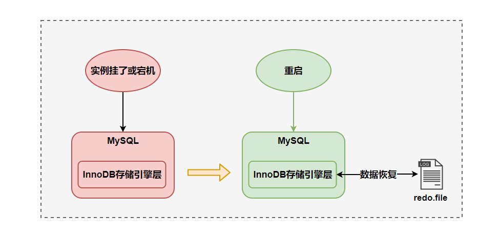


#### 1.2 REDO日志的好处、特点

1. 好处：

   - **redo日志降低了刷盘频率**
   - **redo日志占用的空间非常小**(存储表空间ID、页号、偏移量以及需要更新的值，所需的存储空间是很小的，刷盘快。)

2. 特点：

   - **redo日志是顺序写入磁盘的**

     在执行事务的过程中，每执行一条语句，就可能产生若干条redo日志，这些日志是按照产生的`顺序写入磁盘`的，也就是使用顺序IO，效率比随机IO快。

   - **事务执行过程中，redo log不断记录**

     redo log跟bin log的区别，redo log是`存储引擎层`产生的，而bin log是`数据阵层`产生的。假设一个事务，对表做10万行的记录插入，在这个过程中，一直不断的往redo log顺序记录，而bin log不会记录，直到这个事务提交，才会一次写入到bin log文件中。


#### 1.3 redo的组成

Redo log可以简单分为以下两个部分：

- `重做日志的缓冲(redo log buffer)`，保存在内存中，是易失的。

  在服务器启动时就向操作系统申请了一大片称之为redo log buffer的`连续内存`空间，翻译成中文就是redo日志缓冲区。这片内存空间被划分成若干个连续的`redo log block`。一个redo log block占用`512字节`大小。

  

  参数设置：

  **innodb_log_buffer_size**：redo log buffer大小，默认`16M`，最大值是`4096M`，最小值为`1M`。

  ```mysql
  mysql> show variables like '%innodb_log_buffer_size%';
  +------------------------------+--------------+
  | Variable_name                | Value        |
  +------------------------------+--------------+
  | innodb_log_buffer_size       | 16777216     |
  +------------------------------+--------------+
  ```

- `重做日志文件(redo log file)`，保存在硬盘中，是持久的。

  REDO日志文件如图所示，其中的`ib_logfile0`和`ib_logfile1`即为redo log日志。

  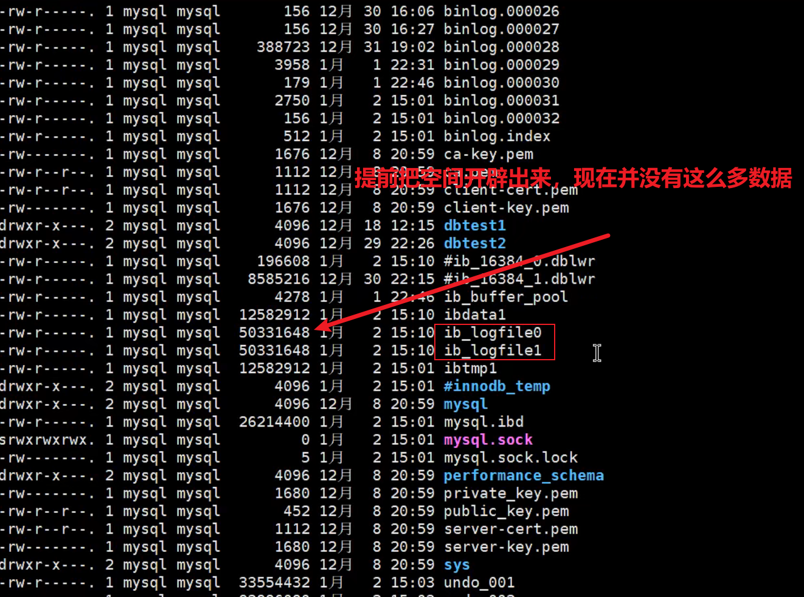


#### 1.4 redo的整体流程

以一个更新事务为例，redo log流转过程，如下图所示：

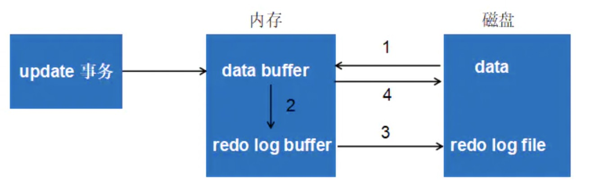

- 第1步：先将原始数据从磁盘中读入内存中来，修改数据的内存拷贝
- 第2步：生成一条重做日志并写入redo log buffer，记录的是数据被修改后的值
- 第3步：当事务commit时，将redo log buffer中的内容刷新到redo log file，对redo log file采用追加写的方式
- 第4步：定期将内存中修改的数据刷新到磁盘中

> 体会：
>
> Write-Ahead Log(预先日志持久化)：在持久化一个数据页之前，先将内存中相应的日志页持久化。


#### 1.5 redo log的刷盘策略

redo log的写入并不是直接写入磁盘的，InnoDB引擎会在写redo log的时候先写redo log buffer，之后以`一定的频率`刷入到真正的redo log file中。这里的一定频率怎么看待呢？这就是我们要说的刷盘策略。

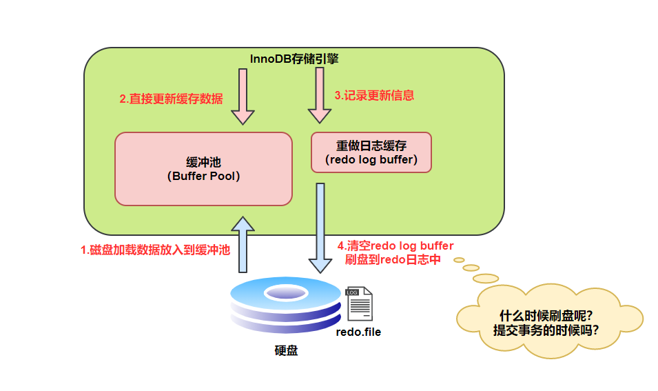

注意，redo log buffer刷盘到redo log file的过程并不是真正的刷到磁盘中去，只是刷入到`文件系统缓存`（page cache）中去（这是现代操作系统为了提高文件写入效率做的一个优化），真正的写入会交给系统自己来决定（比如page cache足够大了）。那么对于InnoDB来说就存在一个问题，如果交给系统来同步，同样如果系统宕机，那么数据也丢失了（虽然整个系统宕机的概率还是比较小的）。

针对这种情况，InnoDB给出`innodb_flush_log_at_trx_commit`参数，该参数控制commit提交事务时，如何将redo log buffer中的日志刷新到redo log file中。它支持三种策略：

- `设置为0`：表示每次事务提交时不进行刷盘操作。（系统默认master thread每隔1s进行一次重做日志的同步）
- `设置为1`：表示每次事务提交时都将进行同步，刷盘操作（`默认值`）
- `设置为2`：表示每次事务提交时都只把redo log buffer内容写入page cache，不进行同步。由OS自己决定什么时候同步到磁盘文件。


另外，InnoDB存储引擎有一个后台线程，每隔1秒，就会把`redo log buffer`中的内容写到文件系统缓存(`page cache`)，然后调用刷盘操作。

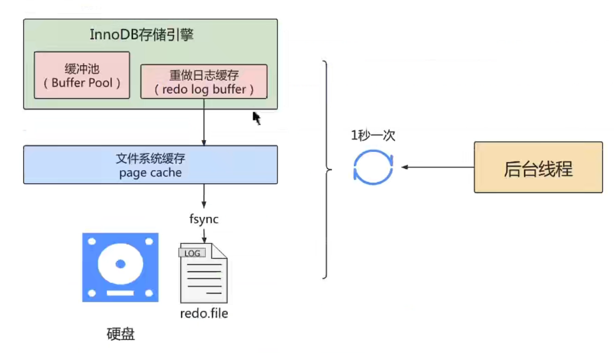

也就是说，一个没有提交事务的`redo log`记录，也可能会刷盘。因为在事务执行过程redo log记录是会写入`redo log buffer`中，这些redo log记录会被`后台线程`刷盘。

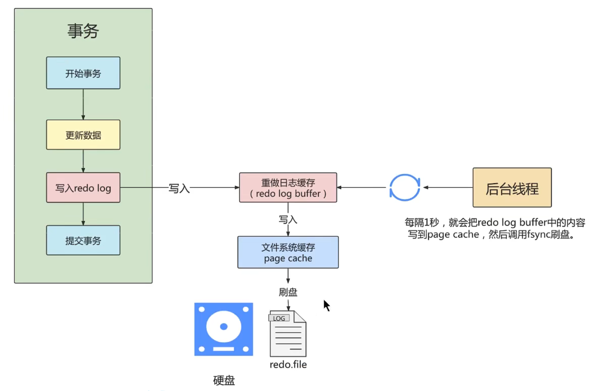

除了后台线程每秒`1次`的轮询操作，还有一种情况，当`redo log buffer`占用的空间即将达到`innodb_log_buffer_size`(这个参数默认是16M)的一半的时候，后台线程会主动刷盘。


#### 1.6 不同刷盘策略演示

##### 1.6.1 流程图

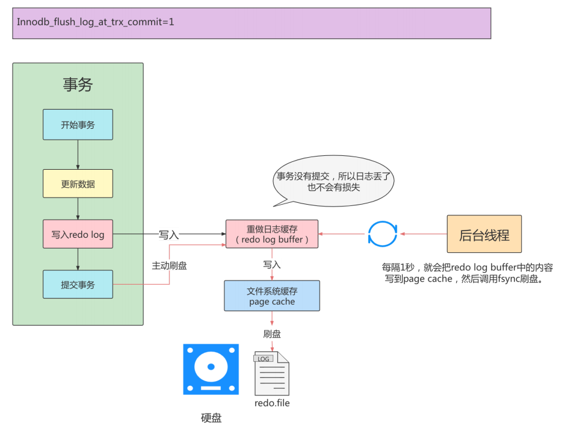

除了1秒刷盘，提交了也刷盘。效率差一些。

> 小结：**innodb_flush_log_at_trx_commit=1**
>
> 为`1`时，只要事务提交成功，`redo log`记录就一定在硬盘里，**不会有任何数据丢失。**
>
> 如果事务执行期间`MySQL`挂了或宕机，这部分日志丢了，但是事务并没有提交，所以日志丢了也不会有损失。可以保证ACID的D，数据绝对不会丢失，但是`效率最差`的。
>
> 建议使用默认值，虽然操作系统宕机的概率理论小于数据库宕机的概率，但是一般既然使用了事务，那么数据的安全相对来说更重要些。


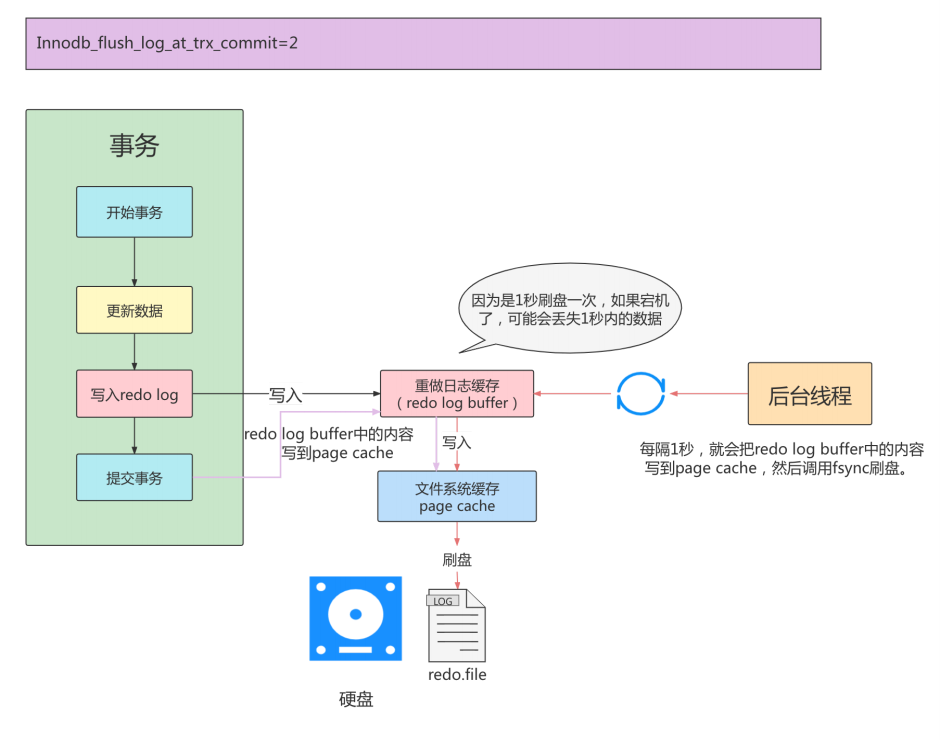

除了1s 强制刷盘，page cache由系统决定啥时候刷盘

> 小结: **innodb_flush_log_at_trx_commit=2**
>
> 为`2`时，只要事务提交成功，`redo log buffer`中的内容只写入文件系统缓存(`page cache`)。
>
> 如果仅仅只是`MySQL`挂了不会有任何数据丢失，但是操作系统宕机可能会有`1`秒数据的丢失，这种情况下无法满足ACID中的D。但是数值2肯定是效率最高的。


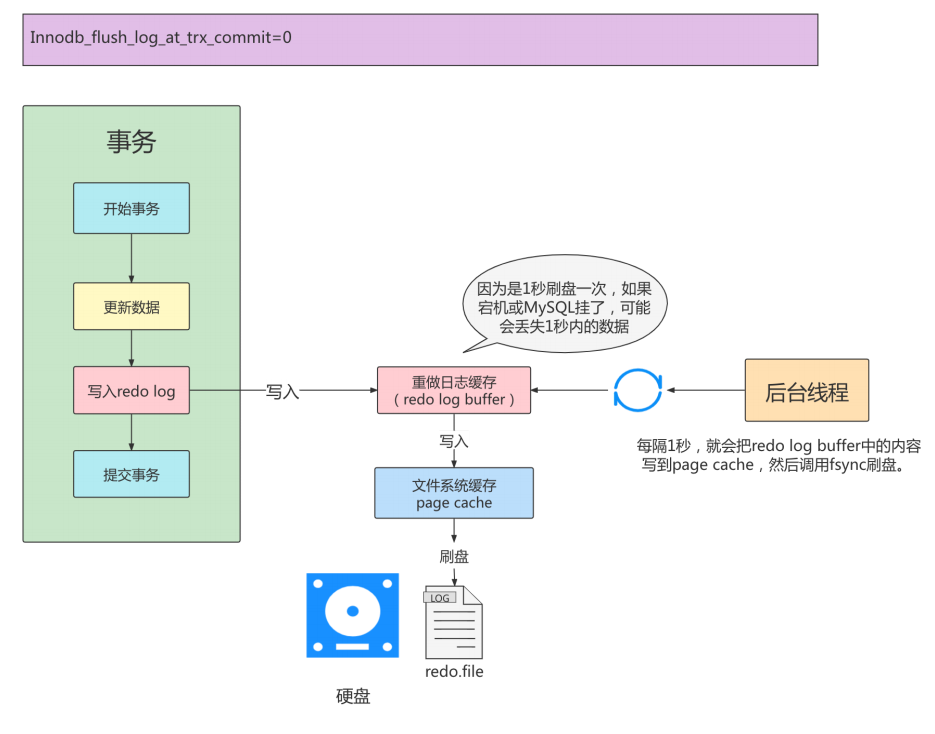

> 小结: **innodb_flush_log_at_trx_commit=0**
>
> 为`0`时，master thread中每1秒进行一次重做日志的fsync操作，因此实例crash最多丢失1秒钟内的事务。(master thread是负责将缓冲池中的数据异步刷新到磁盘，保证数据的一致性)
>
> 数值`0`的话，是一种折中的做法，它的IO效率理论是高于1的，低于2的，这种策略也有丢失数据的风险，也无法保证D。


##### 1.6.2 举例

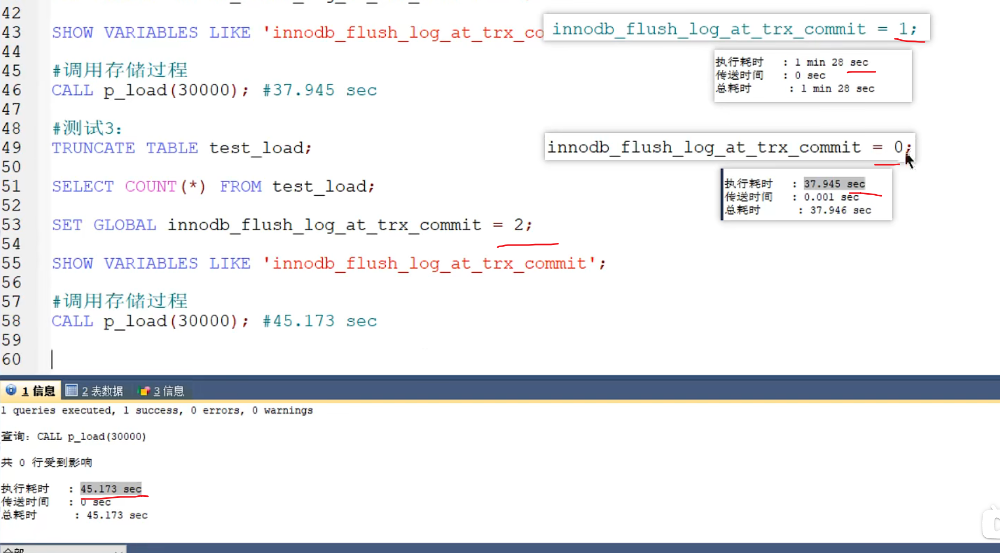

可以看到：

- 1 最慢，但最安全

- 0 最快，最不安全
- 2 折中。


#### 1.7 写入redo log buffer过程

##### 1.7.1 补充概念：Mini-Transaction

MySQL把对底层页面中的一次原子访问的过程称之为一个`Mini-Transaction`，简称`mtr`，比如，向某个索引对应的B+树中插入一条记录的过程就是一个`Mini-Transaction`。一个所谓的`mtr`可以包含一组redo日志，在进行崩溃恢复时这一组`redo`日志作为一个不可分割的整体。

一个事务可以包含若干条语句，每一条语句其实是由若干个`mtr`组成，每一个`mtr`又可以包含若干条redo日志，画个图表示它们的关系就是这样：

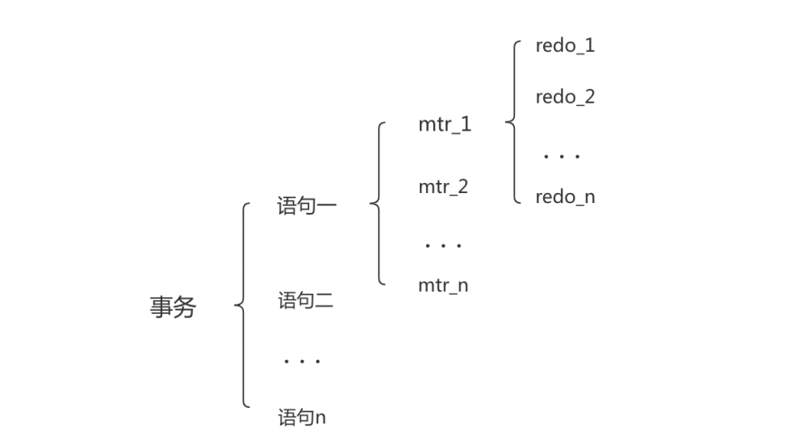

##### 1.7.2 redo日志写入log buffer

向`log buffer`中写入redo日志的过程是顺序的，也就是先往前边的block中写，当该block的空闲空间用完之后再往下一个block中写。当我们想往`log buffer`中写入redo日志时，第一个遇到的问题就是应该写在哪个`block`的哪个偏移量处，所以`InnoDB`的设计者特意提供了一个称之为`buf_free`的全局变量，该变量指明后续写入的redo日志应该写入到`log buffer`中的哪个位置，如图所示：

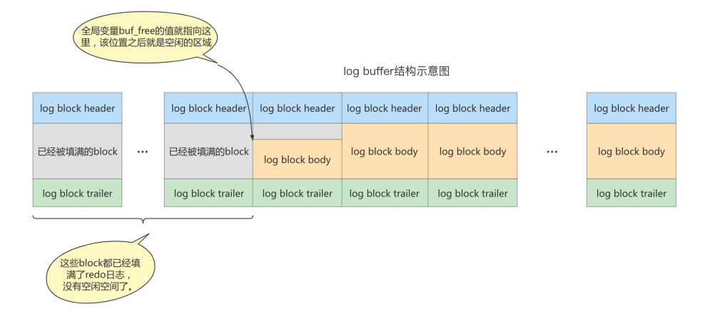

一个mtr执行过程中可能产生若干条redo日志，`这些redo日志是一个不可分割的组`，所以其实并不是每生成一条redo日志，就将其插入到log buffer中，而是每个mtr运行过程中产生的日志先暂时存到一个地方，当该mtr结束的时候，将过程中产生的一组redo日志再全部复制到log buffer中。我们现在假设有两个名为`T1`、`T2`的事务，每个事务都包含2个mtr，我们给这几个mtr命名一下：

- 事务`T1`的两个`mtr`分别称为`mtr_T1_1`和`mtr_T1_2`。
- 事务`T2`的两个`mtr`分别称为`mtr_T2_1`和`mtr_T2_2`。

每个mtr都会产生一组redo日志，用示意图来描述一下这些mtr产生的日志情况：

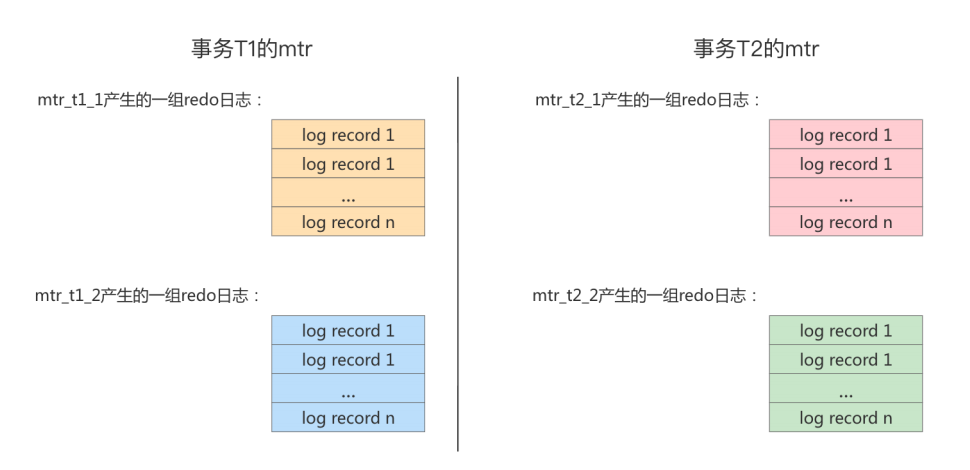

不同的事务可能是`并发`执行的，所以`T1`、`T2`之间的`mtr`可能是`交替执行`的。每当一个mtr执行完成时，伴随该mtr生成的一组redo日志就需要被复制到log buffer中，也就是说不同事务的mtr可能是交替写入log buffer的，我们画个示意图(为了美观，我们把一个mtr中产生的所有的redo日志当作一个整体来画)：

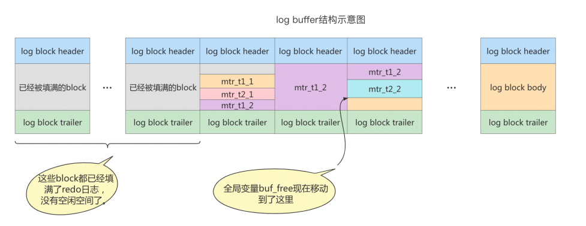

有的mtr产生的redo日志量非常大，比如`mtr_t1_2`产生的redo日志占用空间比较大，占用了3个block来存储。


##### 1.7.3 redo log block的结构图

一个redo log block是由`日志头`、`日志体`、`日志尾`组成。日志头占用12字节，日志尾占用8字节，所以一个block真正能存储的数据就是512-12-8=492字节。


> **为什么一个block设计成512字节?**
>
> 这个和磁盘的扇区有关，机械磁盘默认的扇区就是512字节，如果你要写入的数据大于512字节，那么要写入的扇区肯定不止一个，这时就要涉及到盘片的转动，找到下一个扇区，假设现在需要写入两个扇区A和B，如果扇区A写入成功，而扇区B写入失败，那么就会出现`非原子性`的写入，而如果每次只写入和扇区的大小一样的512字节，那么每次的写入都是原子性的。

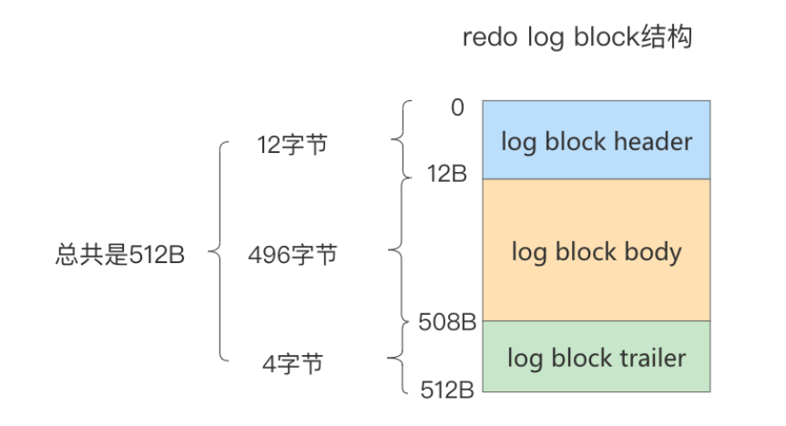

真正的redo日志都是存储到占用`496`字节大小的`log block body`中，图中的`log block header`和`logblock trailer`存储的是一些管理信息。我们来看看这些所谓的`管理信息`都有什么。

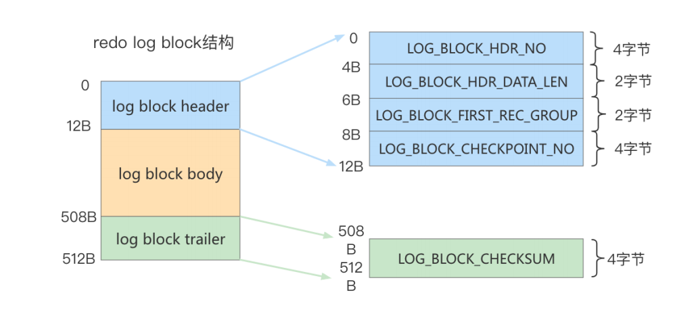

- `log block header`的属性分别如下:
  - `LOG_BLOCK_HDR_NO`：log buffer是由log block组成，在内部log buffer就好似一个数组，因此LOG_BLOCK_HDR_NO用来标记这个数组中的位置。其是递增并且循环使用的，占用4个字节，但是由于第一位用来判断是否是flush bit,所以最大的值为2G。
  - `LOG_BLOCK_HDR_DATA_LEN`：表示block中已经使用了多少字节，初始值为`12`(因为`log block body`从第12个字节处开始)。随着往block中写入的redo日志越来也多，本属性值也跟着增长。如果`log
    block body`已经被全部写满，那么本属性的值被设置为512。
  - `LOG_BLOCK_FIRST_REC_GROUP`：一条redo日志也可以称之为一条redo日志记录(redo log record)，一个mtr会生产多条redo日志记录，这些redo日志记录被称之为一个redo日志记录组(redo log record group)。LOG_BLOCK_FIRST_REC_GROUP就代表该block中第一个mtr生成的redo日志记录组的偏移量(其实也就是这个block里第一个mtr生成的第一条redo日志的偏移量)。如果该值的大小和LOG_BLOCK_HDR_DATA_LEN相同，则表示当前log block不包含新的日志。
  - `LOG_BLOCK_CHECKPOINT_NO`：占用4字节，表示该log block最后被写入时的`checkpoint`。
- `log block trailer`中属性的意思如下：
  - `LOG_BLOCK_CHECKSUM`：表示block的校验值，用于正确性校验(其值和LOG_BLOCK_HDR_NO相同)，我们暂时不关心它。


#### 1.8 redo log file

##### 1.8.1 相关参数设置

- `innodb_log_group_home_dir`：指定redo log文件组所在的路径，默认值为`./`，表示在数据库的数据目录下。MySQL的默认数据目录（`var/lib/mysql`）下默认有两个名为`ib_logfile0`和`ib_logfile1`的文件，log buffer中的日志默认情况下就是刷新到这两个磁盘文件中。此redo日志文件位置还可以修改。

- `innodb_log_files_in_group`：指明redo log file的个数，命名方式如：ib_logfile0，iblogfile1 ... iblogfilen。默认2个，最大100个。

  ```mysql
  mysql> show variables like 'innodb_log_files_in_group';
  +----------------------------------+--------+
  | Variable_name                    | Value  |
  +----------------------------------+--------+
  | innodb_log_files_in_group        | 2      |
  +----------------------------------+--------+
  #ib_logfile0
  #ib_logfile1
  ```

- `innodb_flush_log_at_trx_commit`：控制redo log刷新到磁盘的策略，默认为1。

- `innodb_log_file_size`：单个redo log文件设置大小，默认值为`48M`。最大值为512G，注意最大值指的是整个redo log系列文件之和，即（innodb_log_files_in_group * innodb_log_file_size）不能大于最大值512G。

  ```mysql
  mysql> show variables like 'innodb_log_file_size';
  +---------------------------+--------------+
  | Variable_name             | Value        |
  +---------------------------+--------------+
  | innodb_log_file_size      | 50331648     |
  +---------------------------+--------------+
  ```

  根据业务修改其大小，以便容纳较大的事务。编辑my.cnf文件并重启数据库生效，如下所示：

  ```bash
  [root@localhost ~]# vim /etc/my.cnf
  innodb_log_file_size=200M
  ```

> 在数据库实例更新比较频繁的情况下，可以适当加大redo log组数和大小。但也不推荐redo log设置过大，在MySQL崩溃恢复时会重新执行REDO日志中的记录。


##### 1.8.2 日志文件组

从上边的描述中可以看到，磁盘上的`redo`日志文件不只一个，而是以一个`日志文件组`的形式出现的。这些文件以`ib_logfile[数字]`（`数字`可以是`0、1、2...`）的形式进行命名，每个的redo日志文件大小都是一样的。

在将redo日志写入日志文件组时，是从`ib_logfile0`开始写，如果`ib_logfile0`写满了，就接着`ib_logfile1`写。同理,`ib_logfile1`写满了就去写`ib_logfile2`，依此类推。如果写到最后一个文件该咋办?那就重新转到`ib_logfile0`继续写，所以整个过程如下图所示:

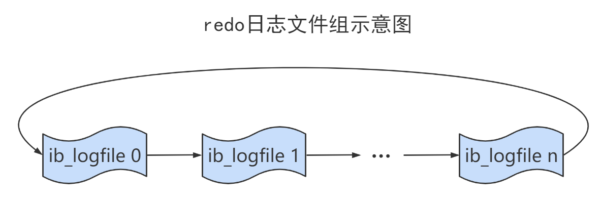

总共的redo日志文件大小其实就是：`innodb_log_file_size × innodb_log_files_in_group`。

采用循环使用的方式向redo日志文件组里写数据的话，会导致后写入的redo日志覆盖掉前边写的redo日志？当然！所以InnoDB的设计者提出了checkpoint的概念。


##### 1.8.3 checkpoint

在整个日志文件组中还有两个重要的属性，分别是write pos、checkpoint

- `write pos`是当前记录的位置，一边写一边后移
- `checkpoint`是当前要擦除的位置，也是往后推移

每次刷盘redo log记录到日志文件组中，write pos位置就会后移更新。每次MySQL加载日志文件组恢复数据时，会清空加载过的redo log记录，并把checkpoint后移更新。write pos和checkpoint之间的还空着的部分可以用来写入新的redo log记录。

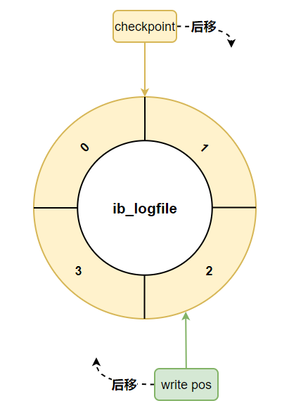

如果write pos追上checkpoint，表示`日志文件组`满了，这时候不能再写入新的redo log记录，MySQL得停下来，清空一些记录，把checkpoint推进一下。

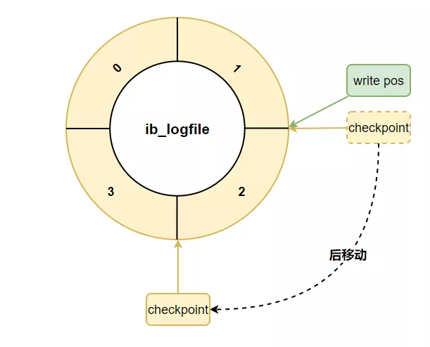


#### 1.9 redo log小结

相信大家都知道redo log的作用和它的刷盘时机、存储形式：

**InnoDB的更新操作采用的是Write Ahead Log(预先日志持久化)策略，即先写日志，再写入磁盘。**


### 2 Undo日志

redo log是事务持久性的保证，undo log是事务原子性的保证。在事务中`更新数据`的`前置操作`其实是要先写入一个`undo log`。

#### 2.1 如何理解undo日志

事务需要保证`原子性`，也就是事务中的操作要么全部完成，要么什么也不做。但有时候事务执行到一半会出现一些情况，比如：

- 情况一：事务执行过程中可能遇到各种错误，比如`服务器本身的错误`，`操作系统错误`，甚至是突然`断电`导致的错误。
- 情况二：程序员可以在事务执行过程中手动输入`ROLLBACK`语句结束当前事务的执行。

以上情况出现，我们需要把数据改回原先的样子，这个过程称之为`回滚`，这样就可以造成一个假象：这个事务看起来什么都没做，所以符合`原子性`要求。

每当我们要对一条记录做改动时(这里的`改动`可以指`INSERT`、`DELETE`、`UPDATE`)，都需要"留一手"——把回滚时所需的东西记下来。比如:

- 你`插入一条记录时`，至少要把这条记录的主键值记下来，之后回滚的时候只需要把这个主键值对应的`记录删掉`就好了。(对于每个INSERT, InnoDB存储引擎会完成一个DELETE)

- 你`删除了一条记录`，至少要把这条记录中的内容都记下来，这样之后回滚时再把由这些内容组成的记录`插入`到表中就好了。(对于每个DELETE，InnoDB存储引擎会执行一个INSERT)
- 你`修改了一条记录`，至少要把修改这条记录前的旧值都记录下来，这样之后回滚时再把这条记录`更新为旧值`就好了。(对于每个UPDATE，InnoDB存储引擎会执行一个相反的UPDATE，将修改前的行放回去)

MySQL把这些为了回滚而记录的这些内容称之为`撤销日志`或者`回滚日志(`即`undo log`)。注意，由于查询操作( `SELECT`）并不会修改任何用户记录，所以在杳询操作行时，并不需要记录相应的undo日志。

此外，undo log 会产生`redo log`，也就是undo log的产生会伴随着redo log的产生，这是因为undo log也需要持久性的保护。


#### 2.2 undo日志的作用

- **作用1：回滚数据**

  用户对undo日志可能`有误解`: undo用于将数据库物理地恢复到执行语句或事务之前的样子。但事实并非如此。undo是`逻辑日志`，因此只是将数据库逻辑地恢复到原来的样子。所有修改都被逻辑地取消了，但是数据结构和页本身在回滚之后可能大不相同。

  这是因为在多用户并发系统中，可能会有数十、数百甚至数千个并发事务。数据库的主要任务就是协调对数据记录的并发访问。比如，一个事务在修改当前一个页中某几条记录，同时还有别的事务在对同一个页中另几条记录进行修改。因此，不能将一个页回滚到事务开始的样子，因为这样会影响其他事务正在进行的工作。

- **作用2：MVCC**

  undo的另一个作用是MVCC，即在InnoDB存储引擎中MVCC的实现是通过undo来完成。当用户读取一行记录时，若该记录已经被其他事务占用，当前事务可以通过undo读取之前的行版本信息，以此实现非锁定读取。


#### 2.3 undo的存储结构

##### 2.3.1 回滚段与undo页

InnoDB对undo log的管理采用段的方式，也就是`回滚段（rollback segment）`。每个回滚段记录了`1024`个`undo log segment`，而在每个undo log segment段中进行`undo页`的申请。

- 在`InnoDB1.1版本之前`（不包括1.1版本），只有一个rollback segment，因此支持同时在线的事务限制为`1024`。虽然对绝大多数的应用来说都已经够用。

- 从1.1版本开始InnoDB支持最大`128个rollback segment`，故其支持同时在线的事务限制提高到了`128*1024`。

  ```mysql
  mysql> show variables like 'innodb_undo_logs';
  +------------------------+--------+
  | Variable_name          | Value  |
  +------------------------+--------+
  | innodb_undo_logs       | 128    |
  +------------------------+--------+
  ```


虽然InnoDB1.1版本支持了128个rollback segment，但是这些rollback segment都存储于共享表空间ibdata中。从lnnoDB1.2版本开始，可通过参数对rollback segment做进一步的设置。这些参数包括：

- `innodb_undo_directory`：设置rollback segment文件所在的路径。这意味着rollback segment可以存放在共享表空间以外的位置，即可以设置为独立表空间。该参数的默认值为“`./`”，表示当前InnoDB存储引擎的目录。
- `innodb_undo_logs`：设置rollback segment的个数，默认值为128。在InnoDB1.2版本中，该参数用来替换之前版本的参数innodb_rollback_segments。
- `innodb_undo_tablespaces`：设置构成rollback segment文件的数量，这样rollback segment可以较为平均地分布在多个文件中。设置该参数后，会在路径innodb_undo_directory看到undo为前缀的文件，该文件就代表rollback segment文件。

undo log相关参数一般很少改动。

**undo页的重用**

当我们开启一个事务需要写undo log的时候，就得先去undo log segment中去找到一个空闲的位置，当有空位的时候，就去申请undo页，在这个申请到的undo页中进行undo log的写入。我们知道mysql默认一页的大小是16k。

为每一个事务分配一个页，是非常浪费的(除非你的事务非常长)，假设你的应用的TPS(每秒处理的事务数目)为1000，那么1s就需要1000个页，大概需要16M的存储，1分钟大概需要1G的存储。如果照这样下去除非MySQL清理的非常勤快，否则随着时间的推移，磁盘空间会增长的非常快，而且很多空间都是浪费的。

于是undo页就被设计的可以`重用`了，当事务提交时，并不会立刻删除undo页。因为重用，所以这个undo页可能混杂着其他事务的undo log。undo log在commit后，会被放到一个`链表`中，然后判断undo页的使用空间是否`小于3/4`，如果小于3/4的话，则表示当前的undo页可以被重用，那么它就不会被回收，其他事务的undo log可以记录在当前undo页的后面。由于undo log是`离散的`，所以清理对应的磁盘空间时，效率不高。

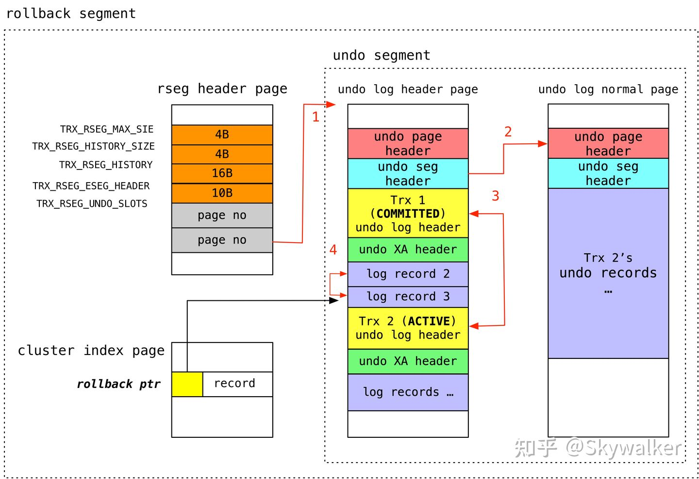


##### 2.3.2 回滚段与事务

1. 每个事务只会使用一个回滚段，一个回滚段在同一时刻可能会服务于多个事务。

2. 当一个事务开始的时候，会制定一个回滚段，在事务进行的过程中，当数据被修改时，原始的数据会被复制到回滚段。

3. 在回滚段中，事务会不断填充盘区，直到事务结束或所有的空间被用完。如果当前的盘区不够用，事务会在段中请求扩展下一个盘区，如果所有已分配的盘区都被用完，事务会覆盖最初的盘区或者在回滚段允许的情况下扩展新的盘区来使用。

4. 回滚段存在于undo表空间中，在数据库中可以存在多个undo表空间，但同一时刻只能使用一个undo表空间。

  ```mysql
  mysql> show variables like 'innodb_undo_tablespaces';
  +----------------------------------+-------+
  | Variable_name                    | Value |
  +----------------------------------+-------+
  | innodb_undo_tablespaces          |   2   |
  +----------------------------------+-------+
  1 row in set (0.00 sec)
  
  # undo log的数量，最少为2，undo log的truncate操作有purge协调线程发起。
  # 在truncate某个undo log表空间的过程中，保证有一个可用的undo log可用。
  ```

5. 当事务提交时，InnoDB存储引擎会做以下两件事情：

  - 将undo log放入列表中，以供之后的purge操作

    purge: 清除，清洗

  - 判断undo log所在的页是否可以重用，若可以分配给下个事务使用


##### 2.3.3 回滚段中的数据分类

1. `未提交的回滚数据(uncommitted undo information)`：

   该数据所关联的事务并未提交，用于实现读一致性，所以该数据不能被其他事务的数据覆盖。

2. `已经提交但未过期的回滚数据(committed undo information)`：

   该数据关联的事务已经提交，但是仍受到undo retention参数的保持时间的影响。

3. `事务已经提交并过期的数据(expired undo information)`：

   事务已经提交，而且数据保存时间已经超过undo retention参数指定的时间，属于已经过期的数据。当回滚段满了之后，会优先覆盖"事务已经提交并过期的数据"。

事务提交后并不能马上删除undo log及undo log所在的页。这是因为可能还有其他事务需要通过undo log来得到行记录之前的版本。故事务提交时将undo log放入一个链表中，是否可以最终删除undo log及undo log所在页由purge线程来判断。


#### 2.4 undo的类型

在InnoDB存储引擎中，undo log分为：

- **insert undo log**

  insert undo log是指在insert操作中产生的undo log。因为insert操作的记录，只对事务本身可见，对其他事务不可见(这是事务隔离性的要求)，故该undo log可以在事务提交后直接删除。不需要进行purge操作。

- **update undo log**

  update undo log记录的是对delete和update操作产生的undo log。该undo log可能需要提供MVCC机制，因此**不能**在事务**提交时就进行删除**。提交时放入undo log链表，等待purge线程进行最后的删除。


#### 2.5 undo log的生命周期

##### 2.5.1 简要生成过程

以下是undo+redo事务的简化过程

假设有2个数值，分别为A=1和B=2，然后将A修改为3，B修改为4

```tex
1.  start transaction;
2．记录A=1到undo log;
3.  update A = 3;
4．记录A=3 到redo log;
5．记录 B=2到undo loq;
6.  update B = 4;
7．记录B = 4到redo log;
8．将redo log刷新到磁盘;
9.  commit
```

- 在1-8步骤的任意一步系统宕机，事务未提交，该事务就不会对磁盘上的数据做任何影响。
- 如果在8-9之间宕机。
  - redo log 进行恢复；
  - undo log 发现有事务没完成进行回滚。
- 若在9之后系统宕机，内存映射中变更的数据还来不及刷回磁盘，那么系统恢复之后，可以根据redo log把数据刷回磁盘。

**只有Buffer Pool的流程**：

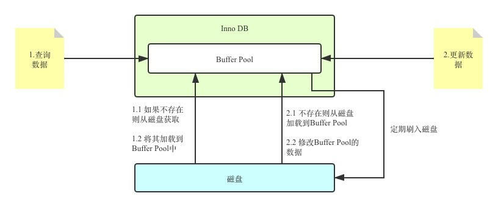

**有了Redo Log和Undo Log之后**：

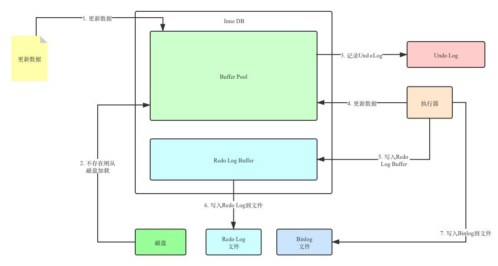

在更新Buffer Pool中的数据之前，我们需要先将该数据事务开始之前的状态写入Undo Log中。假设更新到一半出错了，我们就可以通过Undo Log来回滚到事务开始前。


##### 2.5.2 详细生成过程

对于InnoDB引擎来说，每个行记录除了记录本身的数据之外，还有几个隐藏的列:

- `DB_ROW_ID`: 如果没有为表显式的定义主键，并且表中也没有定义唯一索引，那么InnoDB会自动为表添加一个row_id的隐藏列作为主键。

- `DB_TRX_ID`：每个事务都会分配一个事务ID，当对某条记录发生变更时，就会将这个事务的事务ID写入trx_id中。

  > 疑问，就一个字段，如果有两个事务怎么办。两个事务会不会有锁呢？

- `DB_ROLL_PTR`:回滚指针，本质上就是指向undo log的指针。


**当我们执行INSERT时**：

```mysql
begin;
INSERT INTO user (name) VALUES ("tom");
```

插入的数据都会生成一条insert undo log，并且数据的回滚指针会指向它。undo log会记录undo log的序号、插入主键的列和值...，那么在进行rollback的时候，通过主键直接把对应的数据删除即可。


**当我们执行UPDATE时**：

对于更新的操作会产生update undo log，并且会分更新主键的和不更新主键的，假设现在执行:

```mysql
UPDATE user SET name= "Sun" WHERE id=1;
```

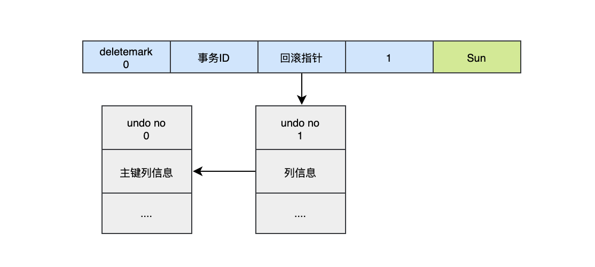

这时会把老的记录写入新的undo log，让回滚指针指向新的undo log，它的undo no是1，并且新的undo log会指向老的undo log (undo no=0)。

假设现在执行:

```mysql
UPDATE user SET id=2 WHERE id=1;
```

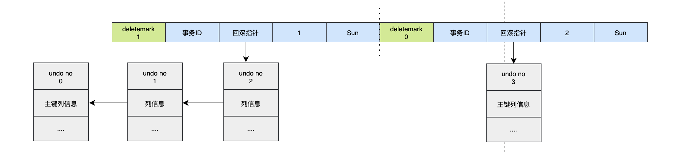

对于更新主键的操作，会先把原来的数据deletemark标识打开，这时并没有真正的删除数据，真正的删除会交给清理线程去判断，然后在后面插入一条新的数据，新的数据也会产生undo log，并且undo log的序号会递增。

可以发现每次对数据的变更都会产生一个undo log，当一条记录被变更多次时，那么就会产生多条undo log,undo log记录的是变更前的日志，并且每个undo log的序号是递增的，那么当要回滚的时候，按照序号`依次向前推`，就可以找到我们的原始数据了。


##### 2.5.3 undo log是如何回滚的

以上面的例子来说，假设执行rollback，那么对应的流程应该是这样：

1. 通过undo no=3的日志把id=2的数据删除
2. 通过undo no=2的日志把id=1的数据的deletemark还原成0
3. 通过undo no=1的日志把id=1的数据的name还原成Tom
4. 通过undo no=0的日志把id=1的数据删除


##### 2.5.4 undo log的删除

- 针对于insert undo log

  因为insert操作的记录，只对事务本身可见，对其他事务不可见。故该undo log可以在事务提交后直接删除，不需要进行purge操作。

- 针对于update undo log

  该undo log可能需要提供MVCC机制，因此不能在事务提交时就进行删除。提交时放入undo log链表，等待purge线程进行最后的删除。

> 补充:
>
> purge线程两个主要作用是：`清理undo页`和`清除page里面带有Delete_Bit标识的数据`行。在InnoDB中，事务中的Delete操作实际上并不是真正的删除掉数据行，而是一种Delete Mark操作，在记录上标识Delete_Bit，而不删除记录。是一种"假删除"，只是做了个标记，真正的删除工作需要后台purge线程去完成。


#### 2.6 小结

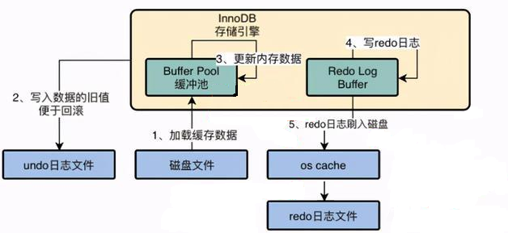

undo log 是逻辑日志，对事务回滚时，只是将数据库逻辑地恢复到原来的样子。

redo log 是物理日志，记录的是数据页的物理变化，undo log不是redo log的逆过程。

------

## 十四、锁

事务的`隔离性`由这章讲述的`锁`来实现。

### 1 概述

`锁`是计算机协调多个进程或线程`并发访问某一资源`的机制。在程序开发中会存在多线程同步的问题，当多个线程并发访问某个数据的时候，尤其是针对一些敏感的数据（比如订单、金额等），我们就需要保证这个数据在任何时刻`最多只有一个线程`在访问，保证数据的`完整性`和`一致性`。在开发过程中加锁是为了保证数据的一致性，这个思想在数据库领域中同样很重要。

在数据库中，除传统的计算资源（如CPU、RAM、I/O等）的争用以外，数据也是一种供许多用户共享的资源。为保证数据的一致性，需要对`并发操作进行控制`，因此产生了`锁`。同时`锁机制`也为实现MySQL的各个隔离级别提供了保证。`锁冲突`也是影响数据库`并发访问性能`的一个重要因素。所以锁对数据库而言显得尤其重要，也更加复杂。


### 2 MySQL并发事务访问相同记录

并发事务访问相同记录的情况大致可以划分为3种：

#### 2.1 读-读情况

`读-读`情况，即并发事务相继`读取相同的记录`。读取操作本身不会对记录有任何影响，并不会引起什么问题，所以允许这种情况的发生。


#### 2.2 写-写情况

`写-写`情况，即并发事务相继对相同的记录做出改动。

在这种情况下会发生`脏写`的问题，任何一种隔离级别都不允许这种问题的发生。所以在多个未提交事务相继对一条记录做改动时，需要让它们`排队执行`，这个排队的过程其实是通过`锁`来实现的。这个所谓的锁其实是一个`内存中的结构`，在事务执行前本来是没有锁的，也就是说一开始是没有`锁结构`和记录进行关联的，如图所示：


当一个事务想对这条记录做改动时，首先会看看内存中有没有与这条记录关联的`锁结构`，当没有的时候就会在内存中生成一个`锁结构`与之关联。比如，事务`T1`要对这条记录做改动，就需要生成一个`锁结构`与之关联：


在锁结构里有很多信息，为了简化理解，只把两个比较重要的属性拿了出来:

- `trx信息`：代表这个锁结构是哪个事务生成的。

- `is_waiting`：代表当前事务是否在等待。

当事务`T1`改动了这条记录后，就生成了一个`锁结构`与该记录关联，因为之前没有别的事务为这条记录加锁，所以`is_waiting`属性就是`false`，我们把这个场景就称之为`获取锁成功`，或者`加锁成功`，然后就可以继续执行操作了。


在事务`T1`提交之前，另一个事务`T2`也想对该记录做改动，那么先看看有没有锁结构与这条记录关联，发现有一个锁结构与之关联后，然后也生成了一个锁结构与这条记录关联，不过锁结构的`is_waiting`属性值为`true`，表示当前事务需要等待，我们把这个场景就称之为`获取锁失败`，或者`加锁失败`，图示:

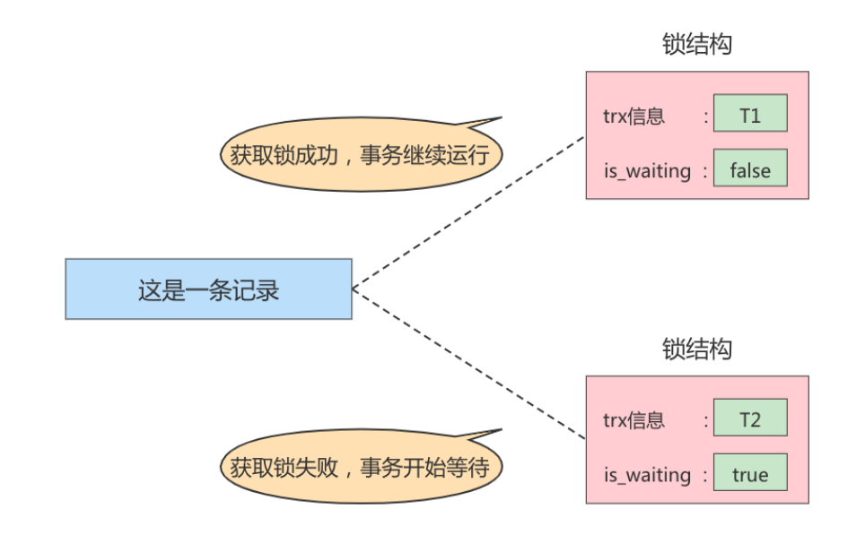

在事务T1提交之后，就会把该事务生成的`锁结构释放`掉，然后看看还有没有别的事务在等待获取锁，发现了事务T2还在等待获取锁，所以把事务T2对应的锁结构的`is_waiting`属性设置为`false`，然后把该事务对应的线程唤醒，让它继续执行，此时事务T2就算获取到锁了。效果图就是这样:

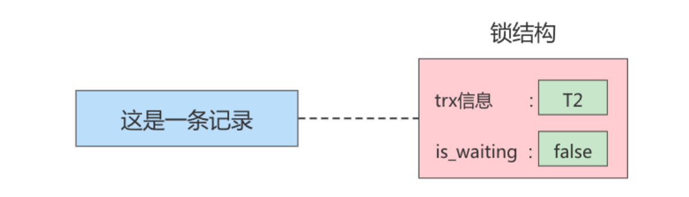

小结几种说法：

- **不加锁**

  意思就是不需要在内存中生成对应的`锁结构`，可以直接执行操作。

- **获取锁成功，或者加锁成功**

  意思就是在内存中生成了对应的`锁结构`，而且锁结构的`is_waiting`属性为`false`，也就是事务可以继续执行操作。

- **获取锁失败，或者加锁失败，或者没有获取到锁**

  意思就是在内存中生成了对应的`锁结构`，不过锁结构的`is_waiting`属性为`true`，也就是事务`需要等待，不可以继续执行操作。


#### 2.3 读-写或写-读情况

`读-写`或`写-读`，即一个事务进行读取操作，另一个进行改动操作。这种情况下可能发生`脏读`、`不可重复读`、`幻读`的问题。

各个数据库厂商对`SQL标准`的支持都可能不一样。比如MySQL在`REPEATABLE READ`隔离级别上就已经解决了`幻读`问题。


#### 2.4 并发问题的解决方案

怎么解决`脏读`、`不可重复读`、`幻读`这些问题呢？其实有两种可选的解决方案：

- **方案一：读操作利用多版本并发控制（`MVCC`，下章讲解），写操作进行`加锁`。**

  所谓的`MVCC`，就是生成一个`ReadView`，通过ReadView找到符合条件的记录版本（历史版本由`undo日志`构建)。查询语句只能`读`到在生成ReadView之前`已提交事务所做的更改`，在生成ReadView之前未提交的事务或者之后才开启的事务所做的更改是看不到的。而`写操作`肯定针对的是`最新版本的记录`，读记录的历史版本和改动记录的最新版本本身并不冲突，也就是采用MVCC时，`读-写`操作并不冲突。

  > 普通的SELECT语句在READ COMMITTED和REPEATABLE READ隔离级别下会使用到MVCC读取记录。
  >
  > - 在`READ COMMITTED`隔离级别下，一个事务在执行过程中每次执行SELECT操作时都会生成一个ReadView，ReadView的存在本身就保证了`事务不可以读取到未提交的事务所做的更改`，也就是避免了脏读现象；
  > - 在`REPEATABLE READ`隔离级别下，一个事务在执行过程中只有`第一次执行SELECT操作`才会生成一个ReadView，之后的SELECT操作都`复用`这个ReadView，这样也就避免了不可重复读和幻读的问题。

- **方案二：读、写操作都采用`加锁`的方式。**

  如果我们的一些业务场景不允许读取记录的旧版本，而是每次都必须去`读取记录的最新版本`。比如，在银行存款的事务中，你需要先把账户的余额读出来，然后将其加上本次存款的数额最后再写到数据库中。在将账户余额读取出来后，就不想让别的事务再访问该余额，直到本次存款事务执行完成，其他事务才可以访问账户的余额。这样在读取记录的时候就需要对其进行`加锁`操作，这样也就意味着`读`操作和`写`操作也像`写-写`操作那样`排队`执行。

  - `脏读`的产生是因为当前事务读取了另一个未提交事务写的一条记录，如果另一个事务在写记录的时候就给这条记录加锁，那么当前事务就无法继续读取该记录了，所以也就不会有脏读问题的产生了。
  - `不可重复读`的产生是因为当前事务先读取一条记录，另外一个事务对该记录做了改动之后并提交之后，当前事务再次读取时会获得不同的值，如果在当前事务读取记录时就给该记录加锁那么另一个事务就无法修改该记录，自然也不会发生不可重复读了。
  - `幻读`问题的产生是因为当前事务读取了一个范围的记录，然后另外的事务向该范围内插入了新记录，当前事务再次读取该范围的记录时发现了新插入的新记录。采用加锁的方式解决幻读问题就有一些麻烦，因为当前事务在第一次读取记录时幻影记录并不存在，所以读取的时候加锁就有点尴尬（因为你并不知道给谁加锁)。

- **小结对比发现**：

  - 采用`MVCC`方式的话，`读-写`操作彼此并不冲突，`性能更高`。
  - 采用`加锁`方式的话，`读-写`操作彼此需要`排队执行`，影响性能。

  一般情况下我们当然愿意采用`MVCC`来解决`读-写`操作并发执行的问题，但是业务在某些特殊情况下，要求必须采用`加锁`的方式执行。下面就讲解下MySQL中不同类别的锁。


### 3 锁的不同角度分类

锁的分类图，如下：


#### 3.1 从数据操作的类型划分：读锁、写锁

对于数据库中并发事务的`读-读`情况并不会引起什么问题。对于`写-写`、`读-写`或`写-读`这些情况可能会引起一些问题，需要使用`MVCC`或者`加锁`的方式来解决它们。在使用`加锁`的方式解决问题时，由于既要允许`读-读`情况不受影响，又要使`写-写`、`读-写`或`写-读`情况中的操作相互阻塞，所以MySQL实现一个由两种类型的锁组成的锁系统来解决。这两种类型的锁通常被称为**共享锁(Shared Lock，S Lock)**和**排他锁(Exclusive Lock，X Lock)，**也叫**读锁(read lock)**和**写锁(write lock)**。

- `读锁`：也称为`共享锁`、英文用`S`表示。针对同一份数据，多个事务的读操作可以同时进行而不会互相影响，相互不阻塞的。
- `写锁`：也称为`排他锁`、英文用`X`表示。当前写操作没有完成前，它会阻断其他写锁和读锁。这样就能确保在给定的时间里，只有一个事务能执行写入，并防止其他用户读取正在写入的同一资源。

**需要注意的是对于 InnoDB 引擎来说，读锁和写锁可以加在表上，也可以加在行上。**

**举例(行级读写锁)**：如果一个事务T1已经获得了某个行r的读锁，那么此时另外的一个事务T2是可以去获得这个行r的读锁的，因为读取操作并没有改变行r的数据；但是，如果某个事务T3想获得行r的写锁，则它必须等待事务T1、T2释放掉行r上的读锁才行。

总结：这里的兼容是指对同一张表或记录的锁的兼容性情况。

|      | X锁    | S锁      |
| ---- | ------ | -------- |
| X锁  | 不兼容 | 不兼容   |
| S锁  | 不兼容 | **兼容** |


##### 3.1.1 锁定读

在采用`加锁`方式解决`脏读`、`不可重复读`、`幻读`这些问题时，读取一条记录时需要获取该记录的`S锁`，其实是不严谨的，有时候需要在读取记录时就获取记录的`X锁`，来禁止别的事务读写该记录，为此MySQL提出了两种比较特殊的`SELECT`语句格式：

- 对读取的记录加`S锁`:

```mysql
SELECT ... LOCK IN SHARE MODE;
#或
SELECT ... FOR SHARE; #(8.0新增语法)
```


在普通的SELECT语句后边加`LOCK IN SHARE MODE`，如果当前事务执行了该语句，那么它会为读取到的记录加S锁，这样允许别的事务继续获取这些记录的S锁(比方说别的事务也使用`SELECT ... LOCK IN SHAREMODE`语句来读取这些记录)，但是不能获取这些记录的X锁(比如使用`SELECT ... FOR UPDATE`语句来读取这些记录，或者直接修改这些记录)。如果别的事务想要获取这些记录的`x锁`，那么它们会阻塞，直到当前事务提交之后将这些记录上的`S锁`释放掉。

- 对读取的记录加`X锁`:

```mysql
SELECT ... FOR UPDATE;
```

在普通的SELECT语句后边加`FOR UPDATE`，如果当前事务执行了该语句，那么它会为读取到的记录加`X锁`，这样既不允许别的事务获取这些记录的`S锁`(比方说别的事务使用`SELECT ... LOCK IN SHARE MODE`语句来读取这些记录)，也不允许获取这些记录的`X锁`(比如使用`SELECT ... FOR UPDATE`语句来读取这些记录，或者直接修改这些记录)。如果别的事务想要获取这些记录的`S锁`或者`X锁`，那么它们会阻塞，直到当前事务提交之后将这些记录上的`X锁`释放掉。


**MySQL8.0新特性:**

在5.7及之前的版本，SELECT ... FOR UPDATE，如果获取不到锁，会一直等待，直到`innodb_lock_wait_timeout`超时。在8.0版本中，SELECT ... FOR UPDATE，SELECT ...FOR SHARE添加`NOWAIT`、`SKIP LOCKED`语法，跳过锁等待，或者跳过锁定。

- 通过添加NOWAIT、SKIP LOCKED语法，能够立即返回。如果查询的行已经加锁:
  - 那么NOWAIT会立即报错返回（等不到锁立即返回）
  - 而SKIP LOCKED也会立即返回，只是返回的结果中不包含被锁定的行。

```mysql
SELECT ... FOR UPDATE NOWAIT
```

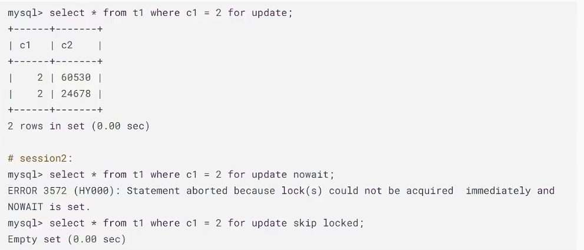

测试：

```mysql
CREATE TABLE `account` (
  `id` int NOT NULL AUTO_INCREMENT,
  `name` varchar(32) DEFAULT NULL,
  `balance` decimal(10,2) DEFAULT NULL,
  PRIMARY KEY (`id`)
) ENGINE=InnoDB AUTO_INCREMENT=4 DEFAULT CHARSET=utf8mb3;

insert into account(name, balance) VALUES 
("张三", 40),
("李四", 0),
("王五", 100);
```


##### 3.1.2 写操作

平常所用到的`写操作`无非是`DELETE`、`UPDATE`、`INSERT`这三种：

- **DELETE**：对一条记录做DELETE操作的过程其实是先在`B+树`中定位到这条记录的位置，然后获取这条记录的`X锁`，再执行`delete mark`操作。我们也可以把这个定位待删除记录在B+树中位置的过程看成是一个获取`X锁`的`锁定读`。

- **UPDATE**：在对一条记录做UPDATE操作时分为三种情况：

  - 情况1：未修改该记录的`键值`，并且被更新的列占用的存储空间在修改前后`未发生变化`。

    则先在`B+`树中定位到这条记录的位置，然后再获取一下记录的`X锁`，最后在原记录的位置进行修改操作。我们也可以把这个定位待修改记录在B+树中位置的过程看成是一个获取`X锁`的`锁定读`。

  - 情况2：未修改该记录的`键值`，并且至少有一个被更新的列占用的存储空间在修改前后发生变化。

    则先在B+树中定位到这条记录的位置，然后获取一下记录的X锁，将该记录彻底删除掉（就是把记录彻底移入垃圾链表)，最后再插入一条新记录。这个定位待修改记录在B+树中位置的过程看成是一个获取`X锁`的`锁定读`，新插入的记录由`INSERT`操作提供的`隐式锁`进行保护。

  - 情况3：修改了该记录的键值，则相当于在原记录上做`DELETE`操作之后再来一次`INSERT`操作，加锁操作就需要按照`DELETE`和`INSERT`的规则进行了。

- **INSERT**：一般情况下，新插入一条记录的操作并不加锁，通过一种称之为`隐式锁`的结构来保护这条新插入的记录在本事务提交前不被别的事务访问。


#### 3.2 从数据操作的粒度划分：表级锁、页级锁、行锁

为了尽可能提高数据库的并发度，每次锁定的数据范围越小越好，理论上每次只锁定当前操作的数据的方案会得到最大的并发度，但是管理锁是很`耗资源`的事情（涉及获取、检查、释放锁等动作)(`越小消耗越大`)。因此数据库系统需要在`高并发响应`和`系统性能`两方面进行平衡，这样就产生了“`锁粒度(Lock granularity)`”的概念。

对一条记录加锁影响的也只是这条记录而已，我们就说这个锁的粒度比较细；其实一个事务也可以在`表级别`进行加锁，自然就被称之为`表级锁`或者`表锁`，对一个表加锁影响整个表中的记录，我们就说这个锁的粒度比较粗。锁的粒度主要分为表级锁、页级锁和行锁。

##### 3.2.1 表锁（Table Lock）

该锁会锁定整张表，它是MySQL中最基本的锁策略，`并不依赖于存储引擎`(不管你是MySQL的什么存储引擎，对于表锁的策略都是一样的)，并且表锁是`开销最小`的策略(因为粒度比较大)。由于表级锁一次会将整个表锁定，所以可以很好的`避免死锁`问题。当然，锁的粒度大所带来最大的负面影响就是出现锁资源争用的概率也会最高，导致`并发率大打折扣`。


###### 3.2.1.1 表级别的S锁、X锁

在对某个表执行SELECT、INSERT、DELETE、UPDATE语句时，InnoDB存储引擎是不会为这个表添加表级别的`S锁`或者`X锁`的。在对某个表执行一些诸如`ALTER TABLE`、`DROP TABLE`这类的`DDL`语句时，其他事务对这个表并发执行诸如SELECT、INSERT、DELETE、UPDATE的语句会发生阻塞。同理，某个事务中对某个表执行SELECT、INSERT、DELETE、UPDATE语句时，在其他会话中对这个表执行`DDL`语句也会发生阻塞。这个过程其实是通过在`server层`使用一种称之为`元数据锁`（英文名：`Metadata Locks`，简称`MDL`）结构来实现的。

一般情况下，不会使用InnoDB存储引擎提供的表级别的`S锁`和`X锁`。只会在一些特殊情况下，比方说`崩溃恢复`过程中用到。比如，在系统变量`autocommit=0，innodb_table_locks = 1`时，`手动`获取InnoDB存储引擎提供的表t的`S锁`或者`X锁`可以这么写：

- `LOCK TABLES t READ`：InnoDB存储引擎会对表`t`加表级别的`S锁`。
- `LOCK TABLES t WRITE`：InnoDB存储引擎会对表`t`加表级别的`X锁`。

不过尽量避免在使用InnoDB存储引擎的表上使用`LOCK TABLES`这样的手动锁表语句，它们并不会提供什么额外的保护，只是会降低并发能力而已。InnoDB的厉害之处还是实现了更细粒度的`行锁`，关于InnoDB表级别的`S锁`和`X锁`大家了解一下就可以了。

```mysql
# 查看自动提交
mysql> show variables like '%autocommit%';
+-------------------+---------+
| Variable_name     | Value   |
+-------------------+---------+
| autocommit        | OFF     |
+-------------------+---------+
1 row in set (0.00 sec)

# 查看innodb表锁是否打开
mysql> show variables like '%innodb_table%';
+-------------------------+-------+
| Variable_name           | Value |
+-------------------------+-------+
| innodb_table_locks      | ON    |
+-------------------------+-------+
1 row in set (0.00 sec)

# 临时关闭自动提交
mysql> set @@autocommit=0;
```

```mysql
show open tables where in_use > 0; # 查看哪些表被锁了

lock tables student read; # 加读锁
lock tables student write;# 加写锁

unlock tables; # 释放锁
```

**总结：**

MyISAM在执行查询语句（SELECT）前，会给涉及的所有表加读锁，在执行增删改操作前，会给涉及的表加写锁。

`InnoDB`存储引擎是不会为这个表添加表级别的`读锁`或者`写锁`的。（有行锁，谁TM用表锁啊）

MySQL的表级锁有两种模式：（以MyISAM表进行操作的演示）

- 表共享读锁（Table Read Lock）
- 表独占写锁（Table Write Lock）

| **锁类型** | **自己可读** | **自己可写** | **自己可操作其他表** | **他人可读** | **他人可写** |
| ---------- | ------------ | ------------ | -------------------- | ------------ | ------------ |
| 读锁       | 是           | 否           | 否                   | 是           | 否，等       |
| 写锁       | 是           | 是           | 否                   | 否，等       | 否，等       |


###### 3.2.1.2 意向锁（intention lock）

InnoDB支持`多粒度锁（multiple granularity locking）`，它允许`行级锁`与`表级锁`共存，而**意向锁**就是其中的一种`表锁`。

1. 意向锁的存在是为了`协调行锁和表锁`的关系，支持多粒度（表锁与行锁）的锁并存。
2. 意向锁是一种`不与行级锁冲突表级锁`，这一点非常重要。
3. 表明“某个事务正在某些行持有了锁或该事务准备去持有锁”。

意向锁分为两种：

- **意向共享锁**（intention shared lock, IS）：事务有意向对表中的某些行加**共享锁**（S锁）

  ```mysql
  -- 事务要获取某些行的 S 锁，必须先获得表的 IS 锁。
  -- 会自动加，不用管
  SELECT column FROM table ... LOCK IN SHARE MODE;
  ```

- **意向排他锁**（intention exclusive lock, IX）：事务有意向对表中的某些行加**排他锁**（X锁）

  ```mysql
  -- 事务要获取某些行的 X 锁，必须先获得表的 IX 锁。
  -- 会自动加，不用管
  SELECT column FROM table ... FOR UPDATE;
  ```

即：意向锁是由存储引擎`自己维护的`，用户无法手动操作意向锁，在为数据行加`共享/排他`锁之前，InooDB会先获取该数据行`所在数据表的对应意向锁`。


**意向锁要解决的问题**

现在有两个事务，分别是T1和T2，其中T2试图在该表级别上应用共享或排它锁，如果没有意向锁存在，那么T2就需要去检查各个页或行是否存在锁；如果存在意向锁，那么此时就会受到由T1控制的`表级别意向锁的阻塞`。T2在锁定该表前不必检查各个页或行锁，而只需检查表上的意向锁。简单来说就是给更大一级别的空间示意里面是否已经上过锁。

在数据表的场景中，**如果我们给某一行数据加上了排它锁，数据库会自动给更大一级的空间，比如数据页或数据表加上意向锁，告诉其他人这个数据页或数据表已经有人上过排它锁了**(不这么做的话，想上表锁的那个程序，还要遍历有没有航所)，这样当其他人想要获取数据表排它锁的时候，只需要了解是否有人已经获取了这个数据表的意向排他锁即可。

- 如果事务想要获得数据表中某些记录的共享锁，就需要在数据表上`添加意向共享锁`。
- 如果事务想要获得数据表中某些记录的排他锁，就需要在数据表上`添加意向排他锁`。

这时，意向锁会告诉其他事务已经有人锁定了表中的某些记录。

举例：创建表teacher，插入6条数据，事务的隔离级别默认为`Repeatable-Read`，如下所示。

```mysql
CREATE TABLE `teacher` (
	`id` INT NOT NULL,
	`name` VARCHAR ( 255 ) NOT NULL,
	PRIMARY KEY ( `id` )
) ENGINE = INNODB DEFAULT CHARSET = utf8mb4 COLLATE = utf8mb4_0900_ai_ci;

INSERT INTO `teacher` VALUES
( '1', 'zhangsan ' ),
( '2', 'lisi' ) ,
( '3' ,'wangwu' ) ,
( '4', 'zhaoliu' ),
( '5', 'songhongkang' ),
( '6', 'leifengyang' ) ;

SELECT @@transaction_isolation;
```

假设事务A获取了某一行的排他锁，并未提交，语句如下所示。

```mysql
begin ;

SELECT * FROM teacher WHERE id = 6 FOR UPDATE;
```

事务B想要获取teacher表的表读锁，语句如下。

```mysql
begin;

LOCK TABLES teacher READ;
```

因为共享锁与排他锁互斥，所以事务B在试图对teacher表加共享锁的时候，必须保证两个条件。

1. 当前没有其他事务持有teacher表的排他锁；
2. 当前没有其他事务持有teacher表中任意一行的排他锁。

为了检测是否满足第二个条件，事务B必须在确保teacher表不存在任何排他锁的前提下，去检测表中的每一行是否存在排他锁。很明显这是一个效率很差的做法，但是有了意向锁之后，情况就不一样了。

意向锁是怎么解决这个问题的呢？首先，我们需要知道意向锁之间的兼容互斥性，如下所示。

|                 | 意向共享锁(lS) | 意向排他锁(IX) |
| --------------- | -------------- | -------------- |
| 意向共享锁(IS)  | 兼容           | 兼容           |
| 意向排他锁（IX) | 兼容           | 兼容           |

即意向锁之间是互相兼容的，虽然意向锁和自家兄弟互相兼容，但是它会与普通的排他/共享锁互斥。

|              | 意向共享锁(lS) | 意向排他锁(IX) |
| ------------ | -------------- | -------------- |
| 共享锁(S)表  | 兼容           | 互斥           |
| 排他锁（X)表 | 互斥           | 互斥           |

注意这里的排他/共享锁指的都是表锁，意向锁不会与行级的共享/排他锁互斥。回到刚才teacher表的例子。

事务A获取了某一行的排他锁，并未提交:

```mysql
# 事务A
BEGIN;
SELECT *FROM teacher WHERE id = 6 FOR UPDATE;
```

此时teacher表存在两把锁: teacher表上的意向排他锁与id为6的数据行上的排他锁。事务B想要获取teacher表的共享锁。

```mysql
# 事务B
BEGIN;
LOCK TABLES teacher READ;
```

此时事务B检测事务A持有teacher表的意向排他锁，就可以得知事务A必然持有该表中某些数据行的排他锁，那么事务B对teacher表的加锁请求就会被排斥（阻塞)，而无需去检测表中的每一行数据是否存在排他锁。


**意向锁的并发性**

意向锁不会与行级的`共享/排他`锁互斥！正因为如此，意向锁并不会影响到多个事务对不同数据行加排他锁时的并发性。（不然我们直接用普通的表锁就行了）

我们扩展一下上面teacher表的例子来概括一下意向锁的作用（一条数据从被锁定到被释放的过程中，可能存在多种不同锁，但是这里我们只着重表现意向锁）。

事务A先获取了某一行的排他锁，并未提交：

```mysql
BEGIN;
SELECT * FROM teacher WHERE id = 6 FOR UPDATE;
```

事务A获取了teacher表上的意向排他锁，事务A获取了id为6的数据行上的排他锁。之后事务B想要获取teacher表的共享锁。

```mysql
BEGIN;
LOCK TABLES teacher READ;
```

事务B检测到事务A持有teacher表的意向排他锁。事务B对teacher表的加锁请求被阻塞(排斥)。最后事务C也想获取teacher表中某一行的排他锁。

```mysql
BEGIN;
SELECT * FROM teacher WHERE id = 5 FOR UPDATE;
```

事务C申请teacher表的意向排他锁。事务C检测到事务A持有teacher表的意向排他锁。因为意向锁之间并不互斥，所以事务C获取到了teacher表的意向排他锁。因为id为5的数据行上不存在任何排他锁，最终事务C成功获取到了该数据行上的排他锁。


**从上面的案例可以得到如下结论**：

1. InnoDB支持`多粒度锁`，特定场景下，行级锁可以与表级锁共存。
2. 意向锁之间互不排斥，但除了 IS 与 S 兼容外，`意向锁会与 共享锁 / 排他锁 互斥`。
3. IX，IS是表级锁，不会和行级的X，S锁发生冲突。只会和表级的X，S发生冲突。
4. 意向锁在保证并发性的前提下，实现了`行锁和表锁共存`且`满足事务隔离性`的要求。


###### 3.2.1.3 自增锁（AUTO-INC锁）

在使用MySQL过程中，我们可以为表的某个列添加`AUTO_INCREMENT`属性。举例：

```mysql
CREATE TABLE `teacher` (
	`id` int NOT NULL AUTO_INCREMENT,
	`name` varchar(255) NOT NULL,
	PRIMARY KEY (`id`)
) ENGINE=InnoDB DEFAULT CHARSET=utf8mb4 COLLATE=utf8mb4_0900_ai_ci;
```

由于这个表的id字段声明了AUTO_INCREMENT，意味着在书写插入语句时不需要为其赋值，SQL语句修改如下所示。

```mysql
INSERT INTO `teacher` (name) VALUES ('zhangsan'), ('lisi');
```

上边的插入语句并没有为id列显式赋值，所以系统会自动为它赋上递增的值，结果如下所示。

```mysql
mysql> select * from teacher;
+-----+-------------+
|  id |       name  |
+-----+-------------+
|   1 | zhangsan    |
|   2 | lisi        |
+-----+-------------+
2 rows in set (0.00 sec)
```

现在我们看到的上面插入数据只是一种简单的插入模式，所有插入数据的方式总共分为三类，分别是“`Simple inserts`”，“`Bulk inserts`”和“`Mixed-mode inserts`”。

1. **“Simple inserts”（简单插入）**

   可以`预先确定要插入的行数`（当语句被初始处理时）的语句。包括没有嵌套子查询的单行和多行`INSERT...VALUES()`和`REPLACE`语句。比如我们上面举的例子就属于该类插入，已经确定要插入的行数。

2. **“Bulk inserts”（批量插入）**

   `事先不知道要插入的行数`（和所需自动递增值的数量）的语句。比如`INSERT ... SELECT`，`REPLACE ... SELECT`和`LOAD DATA`语句，但不包括纯INSERT。InnoDB在每处理一行，为AUTO_INCREMENT列分配一个新值。

3. **“Mixed-mode inserts”（混合模式插入）**

   这些是“Simple inserts”语句但是指定部分新行的自动递增值。例如`INSERT INTO teacher (id,name) VALUES (1,'a'), (NULL,'b'), (5,'c'), (NULL,'d');` 只是指定了部分id的值。另一种类型的“混合模式插入”是`INSERT ... ON DUPLICATE KEY UPDATE`。

对于上面数据插入的案例，MySQL中采用了`自增锁`的方式来实现，**AUTO-INC锁是当向使用含有AUTO_INCREMENT列的表中插入数据时需要获取的一种特殊的表级锁**，在执行插入语句时就在表级别加一个AUTO-INC锁，然后为每条待插入记录的AUTO_INCREMENT修饰的列分配递增的值，在该语句执行结束后，再把AUTO-INC锁释放掉。**一个事务在持有AUTO-INC锁的过程中，其他事务的插入语句都要被阻塞**，可以保证`一个语句`中分配的递增值是`连续`的。也正因为此，其并发性显然并不高，**当我们向一个有AUTO_INCREMENT关键字的主键插入值的时候，每条语句都要对这个表锁进行竞争**，这样的并发潜力其实是很低下的，所以innodb通过`innodb_autoinc_lock_mode`的不同取值来提供不同的锁定机制，来显著提高SQL语句的可伸缩性和性能。


`innodb_autoinc_lock_mode`有三种取值，分别对应与不同锁定模式：

1. `innodb_autoinc_lock_mode = 0(“传统”锁定模式)`

   在此锁定模式下，所有类型的insert语句都会获得一个特殊的表级AUTO-INC锁，用于插入具有AUTO_INCREMENT列的表。这种模式其实就如我们上面的例子，即每当执行insert的时候，都会得到一个表级锁(AUTO-INC锁)，使得语句中生成的auto_increment为顺序，且在binlog中重放的时候，可以保证master与slave中数据的auto_increment是相同的。因为是表级锁，当在同一时间多个事务中执行insert的时候，对于AUTO-INC锁的争夺会`限制并发`能力。

2. `innodb_autoinc_lock_mode = 1(“连续”锁定模式)`

   在MySQL 8.0之前，连续锁定模式是`默认`的。

   在这个模式下，“bulk inserts”仍然使用AUTO-INC表级锁，并保持到语句结束。这适用于所有INSERT ...
   SELECT，REPLACE ... SELECT和LOAD DATA语句。同一时刻只有一个语句可以持有AUTO-INC锁。

   对于“Simple inserts”（要插入的行数事先已知），则通过在`mutex（轻量锁）`的控制下获得所需数量的自动递增值来避免表级AUTO-INC锁，它只在分配过程的持续时间内保持，而不是直到语句完成。不使用表级AUTO-INC锁，除非AUTO-INC锁由另一个事务保持。如果另一个事务保持AUTO-INC锁，则“Simple inserts”等待AUTO-INC锁，如同它是一个“bulk inserts”。

3. `innodb_autoinc_lock_mode = 2(“交错”锁定模式)`

   从MySQL 8.0开始，交错锁模式是`默认`设置。

   在这种锁定模式下，所有类INSERT语句都不会使用表级AUTO-INC锁，并且可以同时执行多个语句。这是最快和最可扩展的锁定模式，但是当使用基于语句的复制或恢复方案时，`从二进制日志重播SQL语句时，这是不安全的。(主从复制id可能不一致)`；
   
   在此锁定模式下，自动递增值`保证`在所有并发执行的所有类型的insert语句中是`唯一`且`单调递增`的。但是，由于多个语句可以同时生成数字（即，跨语句交叉编号），**为任何给定语句插入的行生成的值可能不是连续的**。
   
   如果执行的语句是“simple inserts”，其中要插入的行数已提前知道，除了“Mixed-mode inserts"之外，为单个语句生成的数字不会有间隙。然而，当执行“bulk inserts"时,在由任何给定语句分配的自动递增值中可能存在间隙。


###### 3.2.1.4 元数据锁（MDL锁）

MySQL5.5引入了meta data lock，简称MDL锁，属于表锁范畴。MDL 的作用是，保证读写的正确性。比如，如果一个查询正在遍历一个表中的数据，而执行期间另一个线程对这个`表结构做变更`，增加了一列，那么查询线程拿到的结果跟表结构对不上，肯定是不行的。

因此，**当对一个表做增删改查操作的时候，加MDL读锁；当要对表做结构变更操作的时候，加MDL写锁**。

读锁之间不互斥，因此你可以有多个线程同时对一张表增删改查。读写锁之间、写锁之间是互斥的，用来保证变更表结构操作的安全性，解决了DML和DDL操作之间的一致性问题。`不需要显式使用`，在访问一个表的时候会被自动加上。

**举例:元数据锁的使用场景模拟**

**会话A**：从表中查询数据

```mysql
mysql> begin;
Query 0K,0 rows affected (8.00 sec)
# 默认加了MDL 读锁
mysql> select count( 1 ) from teacher;
```

```mysql
begin;
# 这个时候就会阻塞在这里，有其他事务在读数据。
# 修改表结构 需要加MDL 写锁
alter table teacher add age int;
```

并发问题：

```mysql
事务A   加  读锁
事务B   加  写锁 # 这个时候会阻塞在这里。

事务C   加  读锁 # 这个时候也会阻塞在这里。
```


##### 3.2.2 InnoDB中的行锁

行锁(Row Lock)也称为记录锁，顾名思义，就是锁住某一行（某条记录row)。需要的注意的是，MySQL服务器层并没有实现行锁机制，**行级锁只在存储引擎层实现。**

**优点**: 锁定力度小，`发生锁冲突概率低`，可以实现的`并发度高`。

**缺点**: 对于`锁的开销比大`，加锁会比较慢，容易出现`死锁`情况。

InnoDB与MylSAM的最大不同有两点：一是支持事务(TRANSACTION)；二是采用了行级锁。

首先我们创建表如下:

```mysql
CREATE TABLE student (
	id INT,
	name VARCHAR(20) ,
	class varchar( 10) ,
	PRIMARY KEY ( id)
) Engine=InnoDB CHARSET=utf8;
```


向这个表里插入几条记录:

```mysql
INSERT INTO student VALUES 
( 1,'张三','一班'),
(3,'李四','一班') ,
( 8,'王五','二班') ,
( 15,'赵六','二班') ,
(20,'钱七','三班');
```

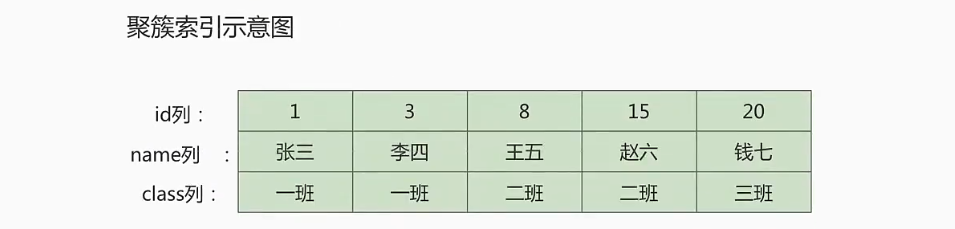

这里把B+树的索引结构做了一个超级简化，只把索引中的记录给拿了出来，下面看看都有哪些常用的行锁类型。


###### 3.2.2.1 记录锁（Record Locks）

记录锁也就是仅仅把一条记录锁上，官方的类型名称为：`LOCK_REC_NOT_GAP`。比如我们把id值为8的那条记录加一个记录锁的示意图如图所示。仅仅是锁住了id值为8的记录，对周围的数据没有影响。

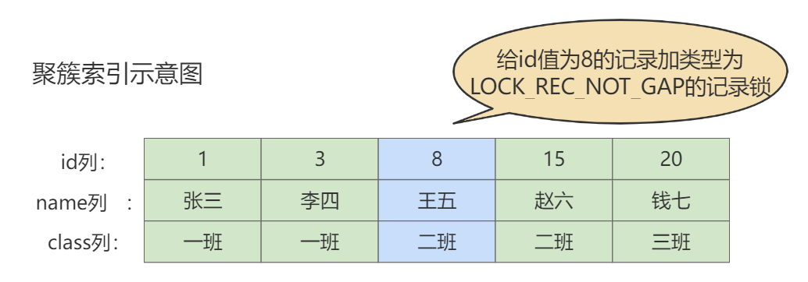

举例如下：

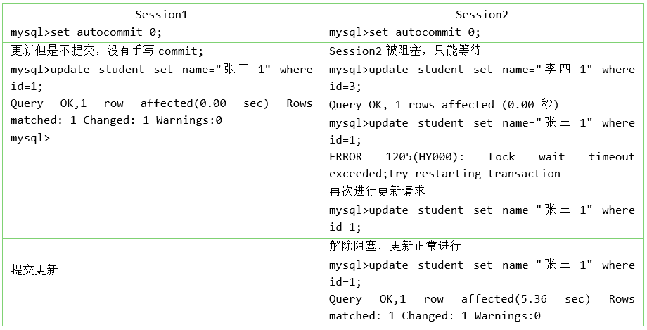

记录锁是有S锁和X锁之分的，称之为`S型记录锁`和`X型记录锁`。

- 当一个事务获取了一条记录的S型记录锁后，其他事务也可以继续获取该记录的S型记录锁，但不可以继续获取X型记录锁；
- 当一个事务获取了一条记录的X型记录锁后，其他事务既不可以继续获取该记录的S型记录锁，也不可以继续获取X型记录锁。


###### 3.2.2.2 间隙锁（Gap Locks）

`MySQL`在`REPEATABLE READ`隔离级别下是可以解决幻读问题的，解决方案有两种，可以使用`MVCC`方案解决，也可以采用`加锁`方案解决。但是在使用加锁方案解决时有个大问题，就是事务在第一次执行读取操作时，那些幻影记录尚不存在，我们无法给这些`幻影记录`加上`记录锁`。InnoDB提出了一种称之为`Gap Locks`的锁，官方的类型名称为：`LOCK_GAP`，我们可以简称为`gap锁`。比如，把id值为8的那条记录加一个gap锁的示意图如下。

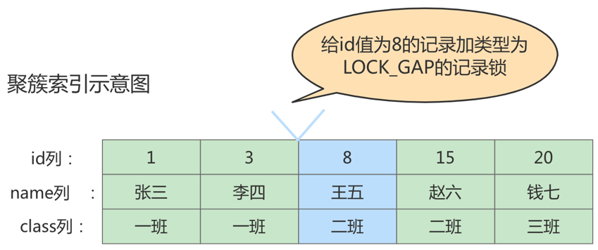

图中id值为8的记录加了gap锁，意味着`不允许别的事务在id值为8的记录前边的间隙插入新记录`，其实就是id列的值(3, 8)这个区间的新记录是不允许立即插入的。比如，有另外一个事务再想插入一条id值为4的新记录，它定位到该条新记录的下一条记录的id值为8，而这条记录上又有一个gap锁，所以就会阻塞插入操作，直到拥有这个gap锁的事务提交了之后，id列的值在区间(3,8)中的新记录才可以被插入。

**gap锁的提出仅仅是为了防止插入幻影记录而提出的**。虽然有共享`gap锁`和`独占gap锁`这样的说法，但是它们起到的作用是相同的。而且如果对一条记录加了gap锁（不论是共享gap锁还是独占gap锁)，并不会限制其他事务对这条记录加记录锁或者继续加gap锁。

> 这里间隙锁，会加到小的数据上。。比如查询 4~8 的id 间隙锁会放到8记录里面。

```mysql
mysql> select * from student;
+----+--------+--------+
| id | name   | class  |
+----+--------+--------+
|  1 | 张三   | 一班    |
|  3 | 李四   | 一班    |
|  8 | 王五   | 二班    |
| 15 | 赵六   | 二班    |
| 20 | 钱七   | 三班    |
+----+--------+--------+
5 rows in set (0.01 sec)
```

| **session 1**                                         | **session 2**                                  |
| ----------------------------------------------------- | ---------------------------------------------- |
| select * from student where id =8 lock in share mode; |                                                |
|                                                       | select * from student where id = 8 for update; |

这里好会阻塞住，是前面的行锁知识点。

| **session 1**                                         | **session 2**                                 |
| ----------------------------------------------------- | --------------------------------------------- |
| select * from student where id =5 lock in share mode; |                                               |
|                                                       | select * from student where id =5 for update; |

这里session 2并不会被堵住。因为表里并没有id=5这个记录，因此session 1加的是间隙锁(3,8)。而session 2也是在这个间隙加的间隙锁。它们有共同的目标，即：保护这个间隙，不允许插入值。但，它们之间是不冲突的。

注意，给一条记录加了`gap锁`只是`不允许`其他事务往这条记录前边的间隙`插入新记录`，那对于最后一条记录之后 的间隙，也就是student表中id值为`20`的记录之后的间隙该咋办呢？也就是说给哪条记录加`gap锁`才能阻止其他事务插入id值在`(20，+∞)`这个区间的新记录呢？这时候我们在讲数据页时介绍的两条伪记录派上用场了:

- `Infimum`记录，表示该页面中最小的记录。
- `Supremum`记录，表示该页面中最大的记录。

为了实现阻止其他事务插入id值在(20, +∞)这个区间的新记录，我们可以给索引中的最后一条记录，也就是id值为20的那条记录所在页面的Supremum记录加上一个gap锁，如图所示

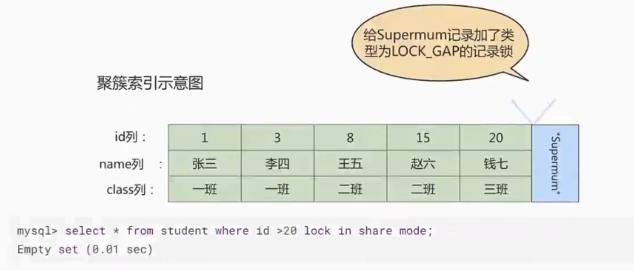

这样就可以阻止其他事务插入id值在(20, +∞)这个区间的新记录。

| **session 1**                                         | **session 2**                                                |
| ----------------------------------------------------- | ------------------------------------------------------------ |
| select * from student where id =5 lock in share mode; |                                                              |
|                                                       | insert into student(id, name, class) values (6, 'tom', '三班')； |

这里就会阻塞了，因为加了间隙锁。

间隙锁的引入，可能会导致同样的语句锁住更大的范围，这其实是影响了并发度的。下面的例子会产生`死锁`:

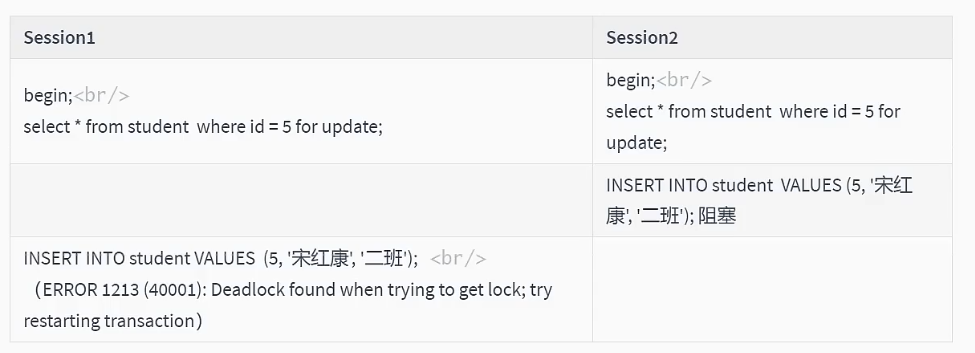


###### 3.2.2.3 临键锁（Next-Key Locks）

有时候我们既想`锁住某条记录`，又想`阻止`其他事务在该记录前边的`间隙插入新记录`，所以InnoDB就提出了一种称之为`Next-Key Locks`的锁，官方的类型名称为：`LOCK_ORDINARY`，我们也可以简称为`next-key锁`。Next-Key Locks是在存储引擎`innodb`、事务级别在`可重复读`的情况下使用的数据库锁，innodb默认的锁就是`Next-Key locks`。比如，我们把id值为8的那条记录加一个next-key锁的示意图如下:

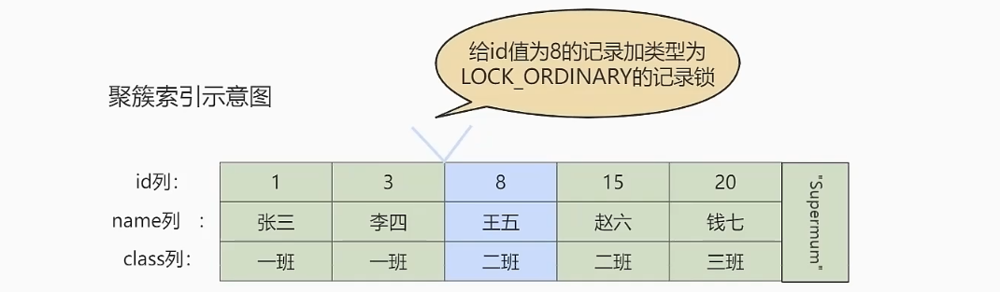

`next-key锁`的本质就是一个`记录锁`和一个`gap锁`的合体，它既能保护该条记录，又能阻止别的事务将新记录插入被保护记录前边的`间隙`。

```mysql
begin;
select * from student where id <=8 and id > 3 for update;
```


###### 3.2.2.4 插入意向锁（Insert Intention Locks）

我们说一个事务在`插入`一条记录时需要判断一下插入位置是不是被别的事务加了`gap锁`（`next-key锁`也包含`gap锁`），如果有的话，插入操作需要等待，直到拥有`gap锁`的那个事务提交。但是**InnoDB规定事务在等待的时候也需要在内存中生成一个锁结构**，表明有事务想在某个`间隙`中`插入`新记录，但是现在在等待。InnoDB就把这种类型的锁命名为`Insert Intention Locks`，官方的类型名称为：`LOCK_INSERT_INTENTION`，我们称为`插入意向锁`。插入意向锁是一种`Gap锁`，不是意向锁，在insert操作时产生。

插入意向锁是在插入一条记录行前，由`INSERT操作产生的一种间隙锁`。该锁用以表示插入意向，当多个事务在同一区间(gap)插入位置不同的多条数据时，事务之间不需要互相等待。假设存在两条值分别为4和7的记录，两个不同的事务分别试图插入值为5和6的两条记录，每个事务在获取插入行上独占的(排他)锁前，都会获取(4, 7)之间的间隙锁，但是因为数据行之间并不冲突，所以两个事务之间并不会产生冲突(阻塞等待)。
总结来说，插入意向锁的特性可以分成两部分:

1. 插入意向锁是一种特殊的间隙锁---间隙锁可以锁定开区间内的部分记录。
2. 插入意向锁之间`互不排斥`，所以即使多个事务在同一区间插入多条记录，只要记录本身(主键、唯一索引)不冲突，那么事务之间就不会出现冲突等待。

注意，虽然插入意向锁中含有意向锁三个字，但是它并不属于意向锁而属于间隙锁，因为意向锁是表锁而插入意向锁是`行锁`。

比如，把id值为8的那条记录加一个插入意向锁的示意图如下: 

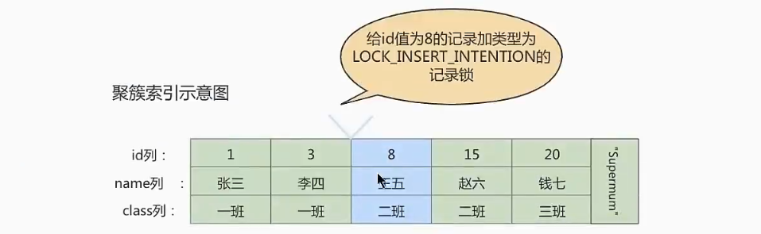

比如，现在T1为id值为8的记录加了一个gap锁，然后T2和T3分别想向student表中插入id值分别为4、5的两条记录，所以现在为id值为8的记录加的锁的示意图就如下所示: 

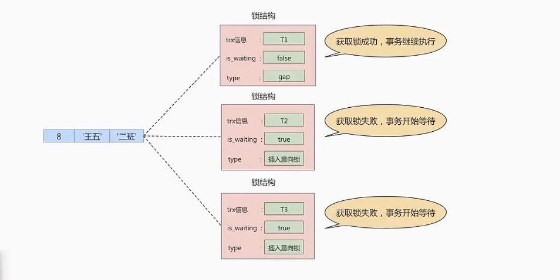

从图中可以看到，由于T1持有gap锁，所以T2和T3需要生成一个插入意向锁的锁结构并且处于等待状态。当T1提交后会把它获取到的锁都释放掉，这样T2和T3就能获取到对应的插入意向锁了(本质上就是把插入意向锁对应锁结构的is_waiting属性改为false)，T2和T3之间也并不会相互阻塞，它们可以同时获取到id值为8的插入意向锁,
然后执行插入操作。事实上**插入意向锁并不会阻止别的事务继续获取该记录上任何类型的锁**。


##### 3.2.3 页锁

页锁就是在`页的粒度`上进行锁定，锁定的数据资源比行锁要多，因为一个页中可以有多个行记录。当我们使用页锁的时候，会出现数据浪费的现象，但这样的浪费最多也就是一个页上的数据行。**页锁的开销介于表锁和行锁之间，会出现死锁。锁定粒度介于表锁和行锁之间，并发度一般**。

每个层级的锁数量是有限制的，因为锁会占用内存空间，`锁空间的大小是有限的`。当某个层级的锁数量超过了这个层级的阈值时，就会进行`锁升级`。锁升级就是用更大粒度的锁替代多个更小粒度的锁，比如InnoDB中行锁升级为表锁，这样做的好处是占用的锁空间降低了，但同时数据的并发度也下降了。


#### 3.3 从对待锁的态度划分：乐观锁、悲观锁

从对待锁的态度来看锁的话，可以将锁分成乐观锁和悲观锁，从名字中也可以看出这两种锁是两种看待`数据并发的思维方式`。需要注意的是，乐观锁和悲观锁并不是锁，而是锁的`设计思想`。

##### 3.3.1 悲观锁（Pessimistic Locking）

悲观锁是一种思想，顾名思义，就是很悲观，对数据被其他事务的修改持保守态度，会通过数据库自身的锁机制来实现，从而保证数据操作的排它性。

悲观锁总是假设最坏的情况，每次去拿数据的时候都认为别人会修改，所以每次在拿数据的时候都会上锁，这样别人想拿这个数据就会`阻塞`直到它拿到锁（**共享资源每次只给一个线程使用，其它线程阻塞，用完后再把资源转让给其它线程**）。比如行锁，表锁等，读锁，写锁等，都是在做操作之前先上锁，当其他线程想要访问数据时，都需要阻塞挂起。Java中`synchronized`和`ReentrantLock`等独占锁就是悲观锁思想的实现。

**秒杀案例**：

商品秒杀过程中，库存数量的减少，避免出现`超卖`的情况。比如，商品表中有一个字段为quantity表示当前该商品的库存量。假设商品为华为mate40，id为1001, quantity=100个。如果不使用锁的情况下，操作方法如下所示

```mysql
#第1步:查出商品库存
select quantity from items where id = 1001;
#第2步:如果库存大于0，则根据商品信息生产订单
insert into orders (item_id) values(1001) ;
#第3步:修改商品的库存，num表示购买数量
update items set quantity = quantity-num where id = 1001;
```

这样写的话，在并发量小的公司没有大的问题，但是如果在高并发环境下可能出现以下问题：


其中线程B此时已经下单并且减完库存，这个时候线程A依然去执行step3，就造成了超卖。

我们使用悲观锁可以解决这个问题，商品信息从查询出来到修改，中间有一个生成订单的过程，使用悲观锁的原理就是，当我们在查询items信息后就把当前的数据锁定，直到我们修改完毕后再解锁。那么整个过程中，因为数据被锁定了，就不会出现有第三者来对其进行修改了。而这样做的前提是**需要将要执行的SQL语句放在同一个事务中，否则达不到锁定数据行的目的**。

修改如下：

```mysql
#第1步:查出商品库存
select quantity from items where id = 1001 for update;
#第2步:如果库存大于0，则根据商品信息生产订单
insert into orders (item_id) values(1001) ;
#第3步:修改商品的库存，num表示购买数量
update items set quantity = quantity-num where id = 1001;
```

`select
... for update`是MySQL中悲观锁。此时在items表中，id为1001的那条数据就被我们锁定了，其他的要执行`select quantity from items where id = 1001 for update;`语句的事务必须等本次事务提交之后才能执行。这样我们可以保证当前的数据不会被其它事务修改。

注意，当执行`select quantity from items where id = 1001 for update;`语句之后，如果在其他事务中执行`select
quantity from items where id= 1001;`语句，并不会受第一个事务的影响，仍然可以正常查询出数据。

注意：**`select ... for update`语句执行过程中所有扫描的行都会被锁上，因此在MySQL中用悲观锁必须确定使用了索引，而不是全表扫描，否则将会把整个表锁住。**

悲观锁不适用的场景较多，它存在一些不足，因为悲观锁大多数情况下依靠数据库的锁机制来实现，以保证程序的并发访问性，同时这样对数据库性能开销影响也很大，特别是`长事务`而言，这样的`开销往往无法承受`，这时就需要乐观锁。


##### 3.3.2 乐观锁（Optimistic Locking）

乐观锁认为对同一数据的并发操作不会总发生，属于小概率事件，不用每次都对数据上锁，但是在更新的时候会判断一下在此期间别人有没有去更新这个数据，也就是**不采用数据库自身的锁机制，而是通过程序来实现**。在程序上，我们可以采用`版本号机制`或者`CAS机制`实现。**乐观锁适用于多读的应用类型，这样可以提高吞吐量**。在Java中`java.util.concurrent.atomic`包下的原子变量类就是使用了乐观锁的一种实现方式：CAS实现的。

1. **乐观锁的版本号机制**

   在表中设计一个`版本字段 version`，第一次读的时候，会获取 version 字段的取值。然后对数据进行更新或删除操作时，会执行`UPDATE ... SET version=version+1 WHERE version=version`。此时如果已经有事务对这条数据进行了更改，修改就不会成功。

   这种方式类似我们熟悉的SVN、CVS版本管理系统，当我们修改了代码进行提交时，首先会检查当前版本号与服务器上的版本号是否一致，如果一致就可以直接提交，如果不一致就需要更新服务器上的最新代码，然后再进行提交。

2. **乐观锁的时间戳机制**

   时间戳和版本号机制一样，也是在更新提交的时候，将当前数据的时间戳和更新之前取得的时间戳进行比较，如果两者一致则更新成功，否则就是版本冲突。

你能看到乐观锁就是程序员自己控制数据并发操作的权限，基本是通过给数据行增加一个戳（版本号或者时间戳），从而证明当前拿到的数据是否最新。

**秒杀案例**：

依然使用上面秒杀的案例，执行流程如下：

```mysql
#第1步:查出商品库存
select quantity from items where id = 1001;
#第2步:如果库存大于0，则根据商品信息生产订单
insert into orders (item_id) values(1001) ;
#第3步:修改商品的库存，num表示购买数量
update items set quantity = quantity-num, version = version+1 where id = 1001 and version = #{version};
```

注意，如果数据表是`读写分离`的表，当matser表中写入的数据没有及时同步到slave表中时，会造成更新一直失败的问题。此时需要`强制读取master表`中的数据(即将select语句放到事务中即可，这时候查询的就是master主库了。)

如果我们对同一条数据进行`频繁的修改`的话，那么就会出现这么一种场景，每次修改都只有一个事务能更新成功，在业务感知上面就有大量的失败操作。我们把代码修改如下:

```mysql
#第1步:查出商品库存
select quantity from items where id = 1001;
#第2步:如果库存大于0，则根据商品信息生产订单
insert into orders (item_id) values(1001) ;
#第3步:修改商品的库存，num表示购买数量
update items set quantity = quantity-num where id = 1001 and quantity-num > 0;
```

这样就会使每次修改都能成功，而且不会出现超卖的现象。


##### 3.3.3 两种锁的适用场景

从这两种锁的设计思想中，我们总结一下乐观锁和悲观锁的适用场景：

1. `乐观锁`适合`读操作多`的场景，相对来说写的操作比较少。它的优点在于`程序实现`，`不存在死锁`问题，不过适用场景也会相对乐观，因为它阻止不了除了程序以外的数据库操作。
2. `悲观锁`适合`写操作多`的场景，因为写的操作具有`排它性`。采用悲观锁的方式，可以在数据库层面阻止其他事务对该数据的操作权限，防止`读-写`和`写-写`的冲突。

我们把乐观锁和悲观锁总结如下图所示。


#### 3.4 按加锁的方式划分：显式锁、隐式锁

##### 3.4.1 隐式锁

一个事务在执行`INSERT`操作时，如果即将插入的`间隙`已经被其他事务加了`gap锁`，那么本次`INSERT`操作会阻塞，并且当前事务会在该间隙上加一个`插入意向锁`，否则一般情况下`INSERT`操作是不加锁的。那如果一个事务首先插入了一条记录(此时并没有在内存生产与该记录关联的锁结构)，然后另一个事务: 

- 立即使用`SELECT ... LOCK IN SHARE MODE`语句读取这条记录，也就是要获取这条记录的`S锁`，或者使用`SELECT ... FOR UPDATE`语句读取这条记录，也就是要获取这条记录的`X锁`，怎么办？

  如果允许这种情况的发生，那么可能产生脏读问题。

- 立即修改这条记录，也就是要获取这条记录的`X锁`，怎么办？

  如果允许这种情况的发生，那么可能产生`脏写`问题。

这时候我们前边提过的`事务id`又要起作用了。我们把聚簇索引和二级索引中的记录分开看一下：

- 情景一：对于聚簇索引记录来说，有一个`trx_id`隐藏列，该隐藏列记录着最后改动该记录的`事务id`。那么如果在当前事务中新插入一条聚簇索引记录后，该记录的`trx_id`隐藏列代表的的就是当前事务的`事务id`，如果其他事务此时想对该记录添加`S锁`或者`X锁`时，首先会看一下该记录的`trx_id`隐藏列代表的事务是否是当前的活跃事务，如果是的话，那么就帮助当前事务创建一个`X锁`（也就是为当前事务创建一个锁结构，`is_waiting`属性是`false`），然后自己进入等待状态（也就是为自己也创建一个锁结构，`is_waiting`属性是`true`）。
- 情景二：对于二级索引记录来说，本身并没有`trx_id`隐藏列，但是在二级索引页面的`Page Header`部分有一个`PAGE_MAX_TRX_ID`属性，该属性代表对该页面做改动的最大的`事务id`，如果`PAGE_MAX_TRX_ID`属性值小于当前最小的活跃`事务id`，那么说明对该页面做修改的事务都已经提交了，否则就需要在页面中定位到对应的二级索引记录，然后回表找到它对应的聚簇索引记录，然后再重复`情景一`的做法。

即：一个事务对新插入的记录可以不显式的加锁(生成一个锁结构)，但是由于`事务id`的存在，相当于加了一个`隐式锁`。别的事务在对这条记录加`S锁`或者`X锁`时，由于`隐式锁`的存在，会先帮助当前事务生成一个锁结构，然后自己再生成一个锁结构后进入等待状态。隐式锁是一种`延迟加锁`的机制，从而来减少加锁的数量。

隐式锁在实际内存对象中并不含有这个锁信息。只有当产生锁等待时，隐式锁转化为显式锁。

InnoDB 的 insert 操作，对插入的记录不加锁，但是此时如果另一个线程进行当前读，类似以下的用例，session 2会锁等待session 1，那么这是如何实现的呢？

**session 1**:

```mysql
mysql> begin;
Query OK, 0 rows affected (0.00 sec)
mysql> insert INTO student VALUES(34,"周八","二班");
Query OK, 1 row affected (0.00 sec)
```

**session 2**:

```mysql
mysql> begin;
Query OK, 0 rows affected (0.00 sec)
mysql> select * from student lock in share mode; #执行完，当前事务被阻塞
```

执行下述语句，输出结果：

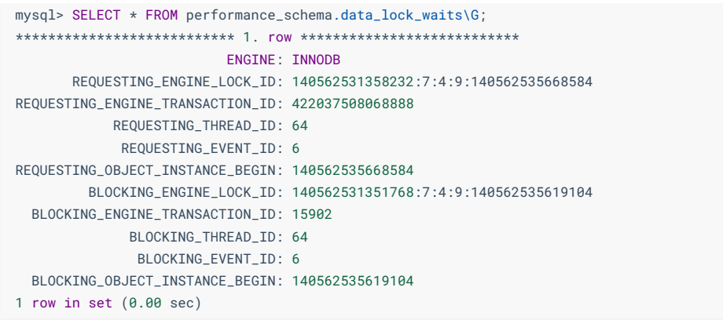

**隐式锁的逻辑过程如下**：

A. InnoDB的每条记录中都一个隐含的trx_id字段，这个字段存在于聚簇索引的B+Tree中。

B. 在操作一条记录前，首先根据记录中的trx_id检查该事务是否是活动的事务(未提交或回滚)。如果是活动的事务，首先将`隐式锁`转换为`显式锁`(就是为该事务添加一个锁)。

C. 检查是否有锁冲突，如果有冲突，创建锁，并设置为waiting状态。如果没有冲突不加锁，跳到E。

D. 等待加锁成功，被唤醒，或者超时。

E. 写数据，并将自己的trx_id写入trx_id字段。


##### 3.4.2 显式锁

通过特定的语句进行加锁，我们一般称之为显示加锁，例如：

**显示加共享锁**：

```mysql
select .... lock in share mode;
```

**显示加排它锁**：

```mysql
select .... for update;
```


#### 3.5 其它锁之：全局锁

全局锁就是对`整个数据库实例`加锁。当你需要让整个库处于`只读状态`的时候，可以使用这个命令，之后其他线程的以下语句会被阻塞：数据更新语句（数据的增删改）、数据定义语句（包括建表、修改表结构等）和更新类事务的提交语句。全局锁的典型使用`场景`是：做`全库逻辑备份`。

全局锁的命令：

```mysql
Flush tables with read lock;
```


#### 3.6 其它锁之：死锁

##### 3.6.1 概念

两个事务都持有对方需要的锁，并且在等待对方释放，并且双方都不会释放自己的锁。

**举例1**：

|      | 事务1                                                        | 事务2                                   |
| ---- | ------------------------------------------------------------ | --------------------------------------- |
| 1    | start transaction;<br/>update account set money=10 where id=1; | start transaction;                      |
| 2    |                                                              | update account set money=10 where id=2; |
| 3    | update account set money=20 where id=2;                      |                                         |
| 4    |                                                              | update account set money=20 where id=1; |

这时候，事务1在等待事务2释放id=2的行锁，而事务2在等待事务1释放id=1的行锁。事务1和事务2在互相等待对方的资源释放，就是进入了死锁状态。

**举例2**：

用户A给用户B转账100，在此同时，用户B也给用户A转账100。这个过程，可能导致死锁。

```mysql
# 事务1
update account set balance = balance - 100 where name = 'A';  #操作1
update account set balance = balance + 100 where name = 'B'; #操作3

# 事务2
update account set balance = balance - 100 where name = 'B';  #操作2
update account set balance = balance + 100 where name = 'A'; #操作4
```


##### 3.6.2 产生死锁的条件

1. 两个或者两个以上事务
2. 每个事务都已经持有锁并且申请新的锁
3. 锁资源同时只能被同一个事务持有或者不兼容
4. 事务之间因为持有锁和申请锁导致彼此循环等待

> 死锁的关键在于：两个(或以上)的Session加锁的顺序不一致。


##### 3.6.3 如何处理死锁

`方式1`：等待，直到超时(`innodb_lock_wait_timeout`=50s)。

即当两个事务互相等待时，当一个事务等待时间超过设置的阈值时，就将其`回滚`，另外事务继续进行。这种方法简单有效，在innodb中，参数`innodb_lock_wait_timeout`用来设置超时时间。

缺点：对于在线服务来说，这个等待时间往往是无法接受的。

那将此值修改短一些，比如1s，0.1s是否合适？不合适，容易误伤到普通的锁等待。


`方式2`：使用死锁检测进行死锁处理

方式1检测死锁太过被动，innodb还提供了`wait-for graph算法`来主动进行死锁检测，每当加锁请求无法立即满足需要并进入等待时，`wait-for graph`算法都会被触发。

这是一种较为`主动的死锁检测机制`，要求数据库保存`锁的信息链表`和`事务等待链表`两部分信息。

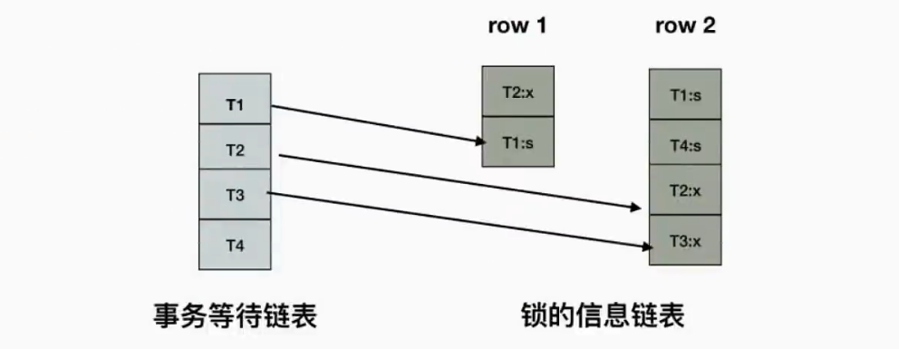

基于这两个信息，可以绘制wait-for graph（等待图）


> 死锁检测的原理是构建一个以事务为顶点、锁为边的有向图，判断有向图是否存在环，存在即有死锁。

一旦检测到回路、有死锁，这时候InnoDB存储引擎会选择`回滚undo量最小的事务`，让其他事务继续执行(`innodb_deadlock_detect=on`表示开启这个逻辑)。

缺点：每个新的被阻塞的线程，都要判断是不是由于自己的加入导致了死锁，这个操作时间复杂度是0(n)。如果100个并发线程同时更新同一行，意味着要检测100*100=1万次，1万个线程就会有1千万次检测。

**如何解决**？

- 方式1：关闭死锁检测，但意味着可能会出现大量的超时，会导致业务有损。
- 方式2：控制并发访问的数量。比如在中间件中实现对于相同行的更新，在进入引擎之前排队，这样在InnoDB内部就不会有大量的死锁检测工作。

**进一步的思路**:

可以考虑通过将一行改成逻辑上的多行来减少`锁冲突`。比如，连锁超市账户总额的记录，可以考虑放到多条记录上。账户总额等于这多个记录的值的总和。

 

##### 3.6.4 如何避免死锁

- 合理设计索引，使业务SQL尽可能通过索引定位更少的行，减少锁竞争。
- 调整业务逻辑SQL执行顺序，避免update/delete长时间持有锁的SQL在事务前面。
- 避免大事务，尽量将大事务拆成多个小事务来处理，小事务缩短锁定资源的时间，发生锁冲突的几率也更小。
- 在并发比较高的系统中，不要显式加锁，特别是是在事务里显式加锁。如select ... for update语句，如果是在事务里运行了start transaction或设置了autocommit等于0，那么就会锁定所查找到的记录。
- 降低隔离级别。如果业务允许，将隔离级别调低也是较好的选择，比如将隔离级别从RR调整为RC，可以避免掉很多因为gap锁造成的死锁


### 4 锁的内存结构

我们前边说对一条记录加锁的本质就是在内存中创建一个`锁结构`与之关联，那么是不是一个事务对多条记录加锁，就要创建多个`锁结构`呢？比如：

 ```mysql
 # 事务1
 SELECT * FROM `user` LOCK IN SHARE MODE;
 ```

理论上创建多个`锁结构`没问题，但是如果一个事务要获取10000条记录的锁，生成10000个锁结构也太崩溃了！所以决定在对不同记录加锁时，如果符合下边这些条件的记录会放到一个`锁结构`中。

- 在同一个事务中进行加锁操作
- 被加锁的记录在同一个页面中
- 加锁的类型是一样的
- 等待状态是一样的


`InnoDB`存储引擎中的`锁结构`如下：

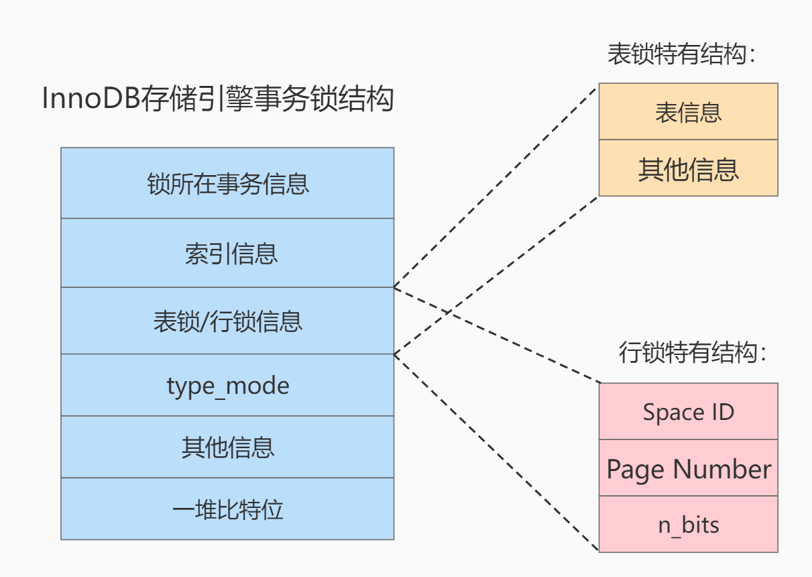

结构解析：

1. **锁所在的事务信息**：

   不论是`表锁`还是`行锁`，都是在事务执行过程中生成的，哪个事务生成了这个`锁结构`，这里就记录这个事务的信息。

   此`锁所在的事务信息`在内存结构中只是一个指针，通过指针可以找到内存中关于该事务的更多信息，比方说事务id等。

2. **索引信息**：

   对于`行锁`来说，需要记录一下加锁的记录是属于哪个索引的。这里也是一个指针。

3. **表锁／行锁信息**：

   `表锁结构`和`行锁结构`在这个位置的内容是不同的：

   - 表锁：

     记载着是对哪个表加的锁，还有其他的一些信息。

   - 行锁：

     记载了三个重要的信息：

     - `Space ID`：记录所在表空间。

     - `Page Number`：记录所在页号。

     - `n_bits`：对于行锁来说，一条记录就对应着一个比特位，一个页面中包含很多记录，用不同的比特位来区分到底是哪一条记录加了锁。为此在行锁结构的末尾放置了一堆比特位，这个`n_bits`属性代表使用了多少比特位。

       > n_bits的值一般都比页面中记录条数多一些。主要是为了之后在页面中插入了新记录后也不至于重新分配锁结构。

4. **type_mode**：

   这是一个32位的数，被分成了`lock_mode`、`lock_type`和`rec_lock_type`三个部分，如图所示：

   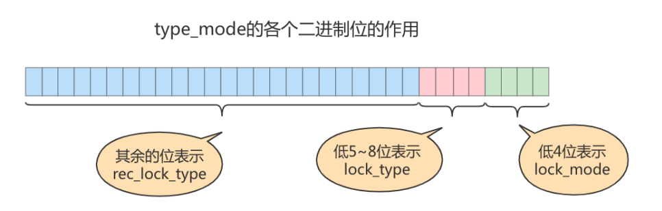

   - 锁的模式（`lock_mode`），占用低4位，可选的值如下：

     - `LOCK_IS`（十进制的`0`）：表示共享意向锁，也就是`IS锁`。
     - `LOCK_IX`（十进制的`1`）：表示独占意向锁，也就是`IX锁`。
     - `LOCK_S`（十进制的`2`）：表示共享锁，也就是`S锁`。
     - `LOCK_X`（十进制的`3`）：表示独占锁，也就是`X锁`。
     - `LOCK_AUTO_INC`（十进制的`4`）：表示`AUTO-INC锁`。

     在InnoDB存储引擎中，LOCK_IS，LOCK_IX，LOCK_AUTO_INC都算是表级锁的模式，LOCK_S和LOCK_X既可以算是表级锁的模式，也可以是行级锁的模式。

   - 锁的类型（`lock_type`），占用第5～8位，不过现阶段只有第5位和第6位被使用：

     - `LOCK_TABLE`（十进制的`16`），也就是当第5个比特位置为1时，表示表级锁。
     - `LOCK_REC`（十进制的`32`），也就是当第6个比特位置为1时，表示行级锁。

   - 行锁的具体类型（`rec_lock_type`），使用其余的位来表示。只有在`lock_type`的值为`LOCK_REC`时，也就是只有在该锁为行级锁时，才会被细分为更多的类型：

     - `LOCK_ORDINARY`（十进制的`0`）：表示`next-key锁`。**临键锁**。
     - `LOCK_GAP`（十进制的`512`）：也就是当第10个比特位置为1时，表示`gap锁`。**间隙锁**。
     - `LOCK_REC_NOT_GAP`（十进制的`1024`）：也就是当第11个比特位置为1时，表示正经`记录锁`。
     - `LOCK_INSERT_INTENTION`（十进制的`2048`）：也就是当第12个比特位置为1时，表示插入意向锁。
     - 其他的类型：还有一些不常用的类型我们就不多说了。

   - `is_waiting`属性呢？基于内存空间的节省，所以把`is_waiting`属性放到了`type_mode`这个32位的数字中：

     - `LOCK_WAIT`（十进制的`256`）：当第9个比特位置为`1`时，表示`is_waiting`为`true`，也就是当前事务尚未获取到锁，处在等待状态；当这个比特位为`0`时，表示`is_waiting`为`false`，也就是当前事务获取锁成功。

5. **其他信息**：

   为了更好的管理系统运行过程中生成的各种锁结构而设计了各种哈希表和链表。

6. **一堆比特位**：

   如果是`行锁结构`的话，在该结构末尾还放置了一堆比特位，比特位的数量是由上边提到的`n_bits`属性表示的。InnoDB数据页中的每条记录在`记录头信息`中都包含一个`heap_no`属性，伪记录`Infimum`的`heap_no`值为`0`，`Supremum`的`heap_no`值为`1`，之后每插入一条记录，`heap_no`值就增1。`锁结构`最后的一堆比特位就对应着一个页面中的记录，一个比特位映射一个`heap_no`，即一个比特位映射到页内的一条记录。


### 5 锁监控

关于MySQL锁的监控，我们一般可以通过检查`InnoDB_row_lock`等状态变量来分析系统上的行锁的争夺情况

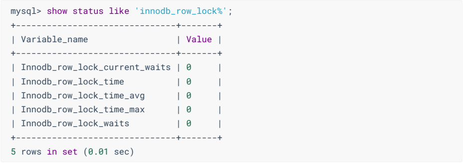

对各个状态量的说明如下：

- Innodb_row_lock_current_waits：当前正在等待锁定的数量；
- `Innodb_row_lock_time`：从系统启动到现在锁定总时间长度；（等待总时长）
- `Innodb_row_lock_time_avg`：每次等待所花平均时间；（等待平均时长）
- Innodb_row_lock_time_max：从系统启动到现在等待最长的一次所花的时间；
- `Innodb_row_lock_waits`：系统启动后到现在总共等待的次数；（等待总次数）

对于这5个状态变量，比较重要的3个见上面（橙色）。

尤其是当等待次数很高，而且每次等待时长也不小的时候，我们就需要分析系统中为什么会有如此多的等待，然后根据分析结果着手指定优化计划。

**其他监控方法**：

MySQL把事务和锁的信息记录在了`information_schema`库中，涉及到的三张表分别是`INNODB_TRX`、`INNODB_LOCKS`和`INNODB_LOCK_WAITS`。

`MySQL5.7及之前`，可以通过`information_schema.INNODB_LOCKS`查看事务的锁情况，但只能看到阻塞事务的锁；如果事务并未被阻塞，则在该表中看不到该事务的锁情况。

MySQL8.0删除了information_schema.INNODB_LOCKS，添加了`performance_schema.data_locks`，可以通过performance_schema.data_locks查看事务的锁情况，和MySQL5.7及之前不同，performance_schema.data_locks不但可以看到阻塞该事务的锁，还可以看到该事务所持有的锁。

同时，information_schema.INNODB_LOCK_WAITS也被`performance_schema.data_lock_waits`所代替。


我们模拟一个锁等待的场景，以下是从这三张表收集的信息锁等待场景，我们依然使用记录锁中的案例，当事务2进行等待时，查询情况如下：

1. 查询正在被锁阻塞的sql语句。

   ```mysql
   SELECT * FROM information_schema.INNODB_TRX \G
   ```

   重要属性代表含义已在上述中标注。

2. 查询锁等待情况

   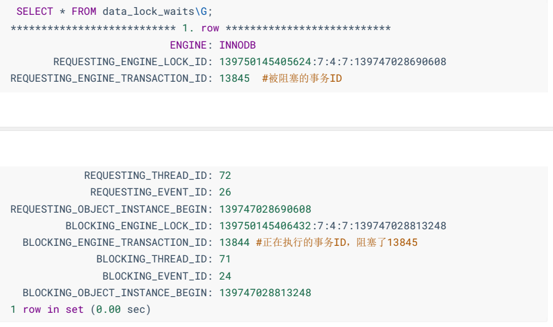

3. 查询锁的情况

   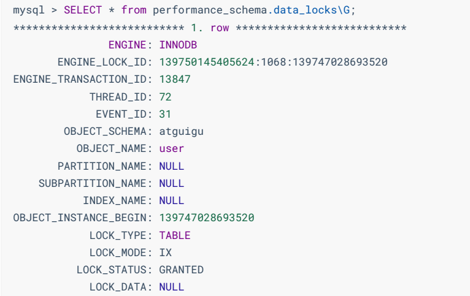

   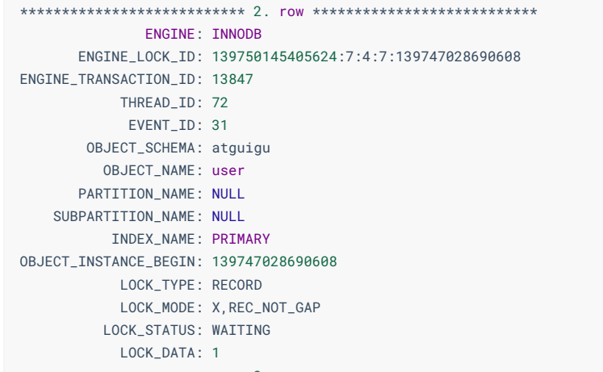

   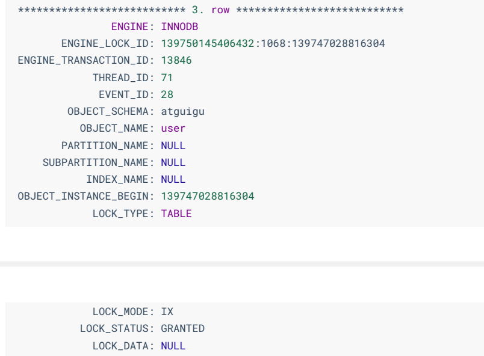

   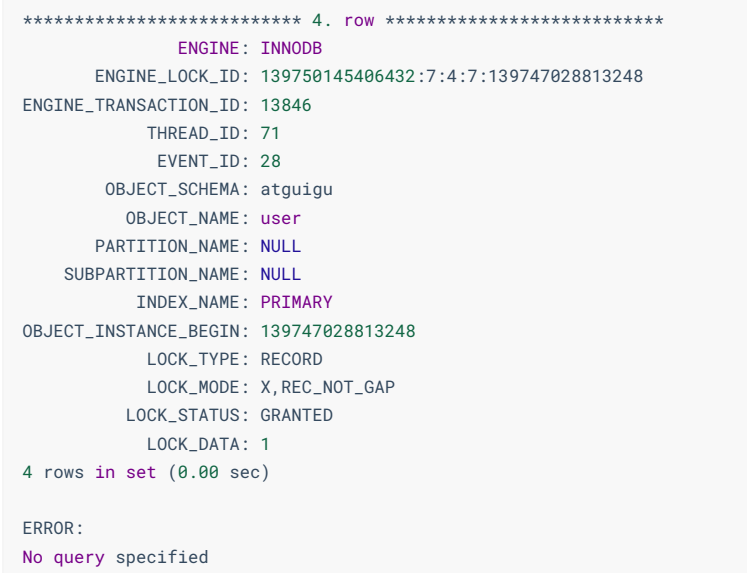

从锁的情况可以看出来，两个事务分别获取了IX锁，我们从意向锁章节可以知道，IX锁互相时兼容的。所以这里不会等待，但是事务1同样持有X锁，此时事务2也要去同一行记录获取X锁，他们之间不兼容，导致等待的情况发生。


### 6 附录

**间隙锁加锁规则（共11个案例）**

间隙锁是在可重复读隔离级别下才会生效的：next-key lock实际上是由间隙锁加行锁实现的，如果切换到读提交隔离级别(read-committed)的话，就好理解了，过程中去掉间隙锁的部分，也就是只剩下行锁的部分。而在读提交隔离级别下间隙锁就没有了，为了解决可能出现的数据和日志不一致问题，需要把binlog格式设置为 row。也就是说，许多公司的配置为：读提交隔离级别加binlog_format=row。业务不需要可重复读的保证，这样考虑到读提交下操作数据的锁范围更小（没有间隙锁），这个选择是合理的。

`next-key lock的加锁规则`

总结的加锁规则里面，包含了两个“原则”、两个“优化”和一个“bug”。

1. 原则1：加锁的基本单位是next-key lock。next-key lock是前开后闭区间。
2. 原则2：查找过程中访问到的对象才会加锁。任何辅助索引上的锁，或者非索引列上的锁，最终都要回溯到主键上，在主键上也要加一把锁。
3. 优化1：索引上的等值查询，给唯一索引加锁的时候，next-key lock退化为行锁。也就是说如果InnoDB扫描的是一个主键、或是一个唯一索引的话，那InnoDB只会采用行锁方式来加锁
4. 优化2：索引上（不一定是唯一索引）的等值查询，向右遍历时且最后一个值不满足等值条件的时候，next-keylock退化为间隙锁。
5. 一个bug：唯一索引上的范围查询会访问到不满足条件的第一个值为止。

我们以表test作为例子，建表语句和初始化语句如下：其中id为主键索引

```mysql
CREATE TABLE `test` (
	`id` int(11) NOT NULL,
	`col1` int(11) DEFAULT NULL,
	`col2` int(11) DEFAULT NULL,
	PRIMARY KEY (`id`),
	KEY `c` (`c`)
) ENGINE=InnoDB;

insert into test values
(0,0,0),
(5,5,5),
(10,10,10),
(15,15,15),
(20,20,20),
(25,25,25);
```


**案例一：唯一索引等值查询间隙锁**

| **sessionA**                                         | **sessionB**                                  | **sessionC**                                              |
| ---------------------------------------------------- | --------------------------------------------- | --------------------------------------------------------- |
| begin;<br/>update test set col2 = col2+1 where id=7; |                                               |                                                           |
|                                                      | insert into test values(8,8,8)<br />(blocked) |                                                           |
|                                                      |                                               | update test set col2 = col2+1 where id=10;<br/>(Query OK) |

由于表 test 中没有 id=7 的记录

根据原则1，加锁单位是next-key lock， session A加锁范围就是(5,10]；

同时根据优化2，这是一个等值查询(id=7)，而id=10不满足查询条件，next-key lock退化成间隙锁，因此最终加锁的范围是(5,10)


**案例二：非唯一索引等值查询锁**

| **sessionA**                                                 | **sessionB**                                         | **sessionC**                                 |
| ------------------------------------------------------------ | ---------------------------------------------------- | -------------------------------------------- |
| begin;<br/>select id from test where col1 = 5 lock in share mode; |                                                      |                                              |
|                                                              | update test col2 = col2+1 where id=5;<br/>(Query OK) |                                              |
|                                                              |                                                      | insert into test values(7,7,7)<br/>(blocked) |

这里 sessionA 要给索引 col1 上 col1=5 的这一行加上读锁。

1. 根据原则1，加锁单位是next-key lock，左开右闭，5是闭上的，因此会给(0,5]加上next-key lock。
2. 要注意 c 是普通索引，因此仅访问 c=5 这一条记录是不能马上停下来的（可能有col1=5的其他记录），需要向右遍历，查到c=10才放弃。根据原则2，访问到的都要加锁，因此要给(5,10]加next-key lock。
3. 但是同时这个符合优化2：等值判断，向右遍历，最后一个值不满足 col1=5 这个等值条件，因此退化成间隙锁 (5,10)。
4. 根据原则2，只有访问到的对象才会加锁，这个查询使用覆盖索引，并不需要访问主键索引，所以主键索引上没有加任何锁，这就是为什么session B 的 update 语句可以执行完成。

但 session C 要插入一个 (7,7,7) 的记录，就会被 session A 的间隙锁 (5,10) 锁住，这个例子说明，锁是加在索引上的。

执行 for update 时，系统会认为你接下来要更新数据，因此会顺便给主键索引上满足条件的行加上行锁。

如果你要用 lock in share mode来给行加读锁避免数据被更新的话，就必须得绕过覆盖索引的优化，因为覆盖索引不会访问主键索引，不会给主键索引上加锁。


**案例三：主键索引范围查询锁**

上面两个例子是等值查询的，这个例子是关于范围查询的，也就是说下面的语句

```mysql
select * from test where id=10 for update
select * from tets where id>=10 and id<11 for update;
```

这两条查语句肯定是等价的，但是它们的加锁规则不太一样

| **sessionA**                                                 | **sessionB**                                                 | **sessionC**                                           |
| :----------------------------------------------------------- | :----------------------------------------------------------- | :----------------------------------------------------- |
| begin;<br/>select * from test where id>= 10 and id<11 for update; |                                                              |                                                        |
|                                                              | insert into test values(8,8,8)<br/>(Query OK)<br/>insert into test values(13,13,13);<br/>(blocked) |                                                        |
|                                                              |                                                              | update test set clo2=col2+1 where id=15;<br/>(blocked) |

1. 开始执行的时候，要找到第一个 id=10 的行，因此本该是 next-key lock(5,10]。 根据优化1，主键id上的等值条件，退化成行锁，只加了id=10这一行的行锁。
2. 它是范围查询，范围查找就往后继续找，找到id=15这一行停下来，不满足条件，因此需要加next-key lock(10,15]。

session A这时候锁的范围就是主键索引上，行锁 id=10 和 next-key lock(10,15]。**首次session A定位查找id=10的行的时候，是当做等值查询来判断的，而向右扫描到id=15的时候，用的是范围查询判断**。


**案例四：非唯一索引范围查询锁**

与案例三不同的是，案例四中查询语句的 where 部分用的是字段c，它是普通索引

这两条查语句肯定是等价的，但是它们的加锁规则不太一样

| **sessionA**                                                 | **sessionB**                            | **sessionC**                                           |
| :----------------------------------------------------------- | :-------------------------------------- | :----------------------------------------------------- |
| begin;<br/>select * from test where col1>= 10 and col1<11 for update; |                                         |                                                        |
|                                                              | insert into test values(8,8,8)(blocked) |                                                        |
|                                                              |                                         | update test set clo2=col2+1 where id=15;<br/>(blocked) |

在第一次用col1=10定位记录的时候，索引c上加了(5,10]这个next-key lock后，由于索引 col1 是非唯一索引，没有优化规则，也就是说不会蜕变为行锁，因此最终 sesion A 加的锁是，索引c上的 (5,10] 和
(10,15] 这两个next-key lock。

这里需要扫描到 col1=15 才停止扫描，是合理的，因为 InnoDB 要扫到 col1=15，才知道不需要继续往后找了。


**案例五：唯一索引范围查询锁bug**

| **sessionA**                                                 | **sessionB**                                           | **sessionC**                                     |
| :----------------------------------------------------------- | :----------------------------------------------------- | :----------------------------------------------- |
| begin;<br/>select * from test where id> 10 and id<=15 for update; |                                                        |                                                  |
|                                                              | update test set clo2=col2+1 where id=20;<br/>(blocked) |                                                  |
|                                                              |                                                        | insert into test values(16,16,16);<br/>(blocked) |

session A是一个范围查询，按照原则1的话，应该是索引id上只加 (10,15] 这个 next-key lock，并且因为 id 是唯一键，所以循环判断到id=15这一行就应该停止了。

但是实现上，InnoDB会往前扫描到第一个不满足条件的行为止，也就是id=20。而且由于这是个范围扫描，因此索引id上的(15,20]这个next-key lock也会被锁上。照理说，这里锁住id=20这一行的行为，其实是没有必要的。因为扫描到id=15，就可以确定不用往后再找了。


**案例六：非唯一索引上存在"等值"的例子**

这里，我给表t插入一条新记录：`insert into t values(30,10,30);`也就是说，现在表里面有两个c=10的行

**但是它们的主键值 id 是不同的（分别是10和30），因此这两个c=10的记录之间，也是有间隙的**。

| **sessionA**                               | **sessionB**                                     | **sessionC**                                          |
| :----------------------------------------- | :----------------------------------------------- | :---------------------------------------------------- |
| begin;<br/>delete from test where col1=10; |                                                  |                                                       |
|                                            | insert into test values(12,12,12);<br/>(blocked) |                                                       |
|                                            |                                                  | update test set col2=col2+1 where c=15;<br/>(blocked) |

这次我们用delete语句来验证。注意，delete语句加锁的逻辑，其实跟`select ... for update`是类似的，也就是我在文章开始总结的两个“原则”、两个“优化”和一个“bug”。

这时，session A在遍历的时候，先访问第一个col1=10的记录。同样地，根据原则1，这里加的是(col1=5,id=5)到(col1=10,id=10)这个next-key lock。

由于c是普通索引，所以继续向右查找，直到碰到(col1=15,id=15)这一行循环才结束。根据优化2，这是一个等值查询，向右查找到了不满足条件的行，所以会退化成 (col1=10,id=10) 到 (col1=15,id=15) 的间隙锁。

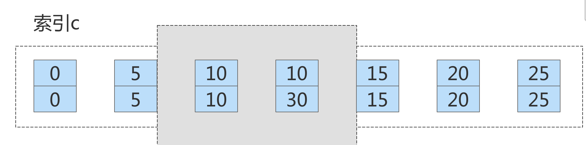

这个delete语句在索引c上的加锁范围，就是上面图中蓝色区域覆盖的部分。这个蓝色区域左右两边都是虚线，表示开区间，即(col1=5,id=5)和(col1=15,id=15)这两行上都没有锁


**案例七：limit语句加锁**

案例六也有一个对照案例，场景如下所示：

| **sessionA**                                       | **sessionB**                                      |
| -------------------------------------------------- | ------------------------------------------------- |
| begin;<br/>delete from test where col1=10 limit 2; |                                                   |
|                                                    | insert into test values(12,12,12);<br/>(Query OK) |

session A的delete语句加了limit 2。你知道表t里c=10的记录其实只有两条，因此加不加limit 2，删除的效果都是一样的。但是加锁效果却不一样

这是因为，案例七里的 delete 语句明确加了limit 2的限制，因此在遍历到 (col1=10, id=30) 这一行之后，满足条件的语句已经有两条，循环就结束了。因此，索引 col1 上的加锁范围就变成了从（col1=5,id=5)
到（col1=10,id=30) 这个前开后闭区间，如下图所示：

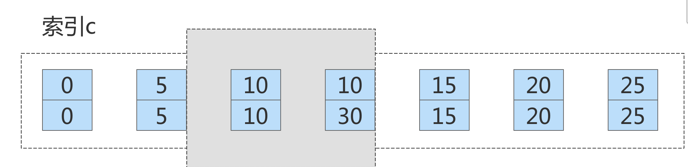

这个例子对我们实践的指导意义就是，在删除数据的时候尽量加limit。

这样不仅可以控制删除数据的条数，让操作更安全，还可以减小加锁的范围。


**案例八：一个死锁的例子**

| **sessionA**                                                 | **sessionB**                                                 |
| ------------------------------------------------------------ | ------------------------------------------------------------ |
| begin;<br/>select id from test where col1=10 lock in share mode; |                                                              |
|                                                              | update test set col2=col2+1 where c=10;<br/>(blocked)        |
| insert into test values(8,8,8);                              |                                                              |
|                                                              | ERROR 1213(40001):Deadlock found when trying to getlock;try restarting transaction |

1. session A启动事务后执行查询语句加lock in share mode，在索引 col1 上加了next-key lock(5,10]和间隙锁(10,15)（索引向右遍历退化为间隙锁；
2. session B的 update 语句也要在索引 c 上加 next-key lock(5,10]，进入锁等待；实际上分成了两步，先是加 (5,10) 的间隙锁，加锁成功；然后加 col1=10 的行锁，因为sessionA上已经给这行加上了读锁，此时申请死锁时会被阻塞
3. 然后session A要再插入 (8,8,8) 这一行，被session B的间隙锁锁住。由于出现了死锁，InnoDB让session B回滚


**案例九：order by索引排序的间隙锁1**

如下面一条语句

```mysql
begin;
select * from test where id>9 and id<12 order by id desc for update;
```

下图为这个表的索引id的示意图。


1. 首先这个查询语句的语义是`order by id desc`，要拿到满足条件的所有行，优化器必须先找到“第一个 id<12 的值”。
2. 这个过程是通过索引树的搜索过程得到的，在引擎内部，其实是要找到 id=12 的这个值，只是最终没找到，但找到了(10,15)这个间隙。(id=15不满足条件，所以next-key lock退化为了间隙锁(10,15))

3. 然后向左遍历，在遍历过程中，就不是等值查询了，会扫描到 id=5 这一行，又因为区间是左开右闭的，所以会加一个next-key lock(0,5]。也就是说，在执行过程中，通过树搜索的方式定位记录的时候，用的是“等值查询”的方法。


**案例十：order by索引排序的间隙锁2**

| **sessionA**                                                 | **sessionB**                                  |
| ------------------------------------------------------------ | --------------------------------------------- |
| begin;<br/>select * from test where col1>=15 and c<=20 order by col1 desc lock in share mode; |                                               |
|                                                              | insert into test values(6,6,6);<br/>(blocked) |

1. 由于是`order by col1 desc`，第一个要定位的是索引 col1 上“最右边的” col1=20 的行。这是一个非唯一索引的等值查询：

  左开右闭区间，首先加上next-key lock (15,20]。向右遍历，col1=25不满足条件，退化为间隙锁；所以会加上间隙锁(20,25)和next-key lock(15,20]。

2. 在索引 col1 上向左遍历，要扫描到 col1=10 才停下来。同时又因为左开右闭区间，所以next-key
    lock会加到(5,10]，这正是阻塞session B的 insert 语句的原因。

3. 在扫描过程中，col1=20、col1=15、col1=10这三行都存在值，由于是 select *，所以会在主键
    id 上加三个行锁。因此，session A的select语句锁的范围就是：

  1. 索引 col1 上(5, 25) ；
  2. 主键索引上id=15、20两个行锁。


**案例十一：update修改数据的例子-先插入后删除**

| **sessionA**                                                 | **sessionB**                                                 |
| ------------------------------------------------------------ | ------------------------------------------------------------ |
| begin;<br/>select col1 from test where col1>5 lock in share mode; |                                                              |
|                                                              | update test set col1=1 where col1=5<br/>(Query OK)<br/>update test set col1=5 where col1=1;<br/>(blocked) |

注意：根据 col1>5 查到的第一个记录是col1=10，因此不会加(0,5]这个next-key lock。

session A的加锁范围是索引 col1 上的(5,10]、(10,15]、(15,20]、(20,25]和(25,supremum]。

之后session B的第一个update语句，要把col1=5改成col1=1，你可以理解为两步：

1. 插入 (col1=1, id=5) 这个记录；
2. 删除 (col1=5, id=5) 这个记录。

通过这个操作，session A的加锁范围变成了图中所示的样子：

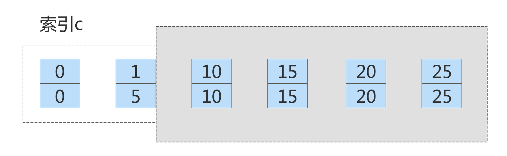

好，接下来session B要执行`update t set col1 = 5 where col1 = 1`这个语句了，一样地可以拆成两步：

1. 插入 (col1=5, id=5) 这个记录；
2. 删除 (col1=1, id=5) 这个记录。第一步试图在已经加了间隙锁的 (1,10) 中插入数据，所以就被堵住了。

------

## 十五、多版本并发控制(MVCC)

### 1 什么是MVCC

MVCC（MultiVersion Concurrency Control），多版本并发控制。顾名思义，MVCC是通过数据行的多个版本管理来实现数据库的`并发控制`。这项技术使得在InnoDB的事务隔离级别下执行`一致性读`操作有了保证。换言之，就是为了查询一些正在被另一个事务更新的行，并且可以看到它们被更新之前的值，这样在做查询的时候就不用等待另一个事务释放锁。

MVCC没有正式的标准，在不同的DBMS中MVCC的实现方式可能是不同的，也不是普遍使用的(大家可以参考相关的DBMS文档)。这里讲解InnoDB中MVCC的实现机制（MySQL其它的存储引擎并不支持它)。


### 2 快照读与当前读

MVCC在MySQL InnoDB中的实现主要是为了提高数据库并发性能，用更好的方式去处理`读-写冲突`，做到即使有读写冲突时，也能做到`不加锁`，`非阻塞并发读`，而这个读指的就是`快照读`，而非`当前读`。当前读实际上是一种加锁的操作，是悲观锁的实现。而MVCC本质是采用乐观锁思想的一种方式。

#### 2.1 快照读

快照读又叫一致性读，读取的是快照数据。**不加锁的简单的 SELECT 都属于快照读**，即不加锁的非阻塞读；比如这样：

```mysql
SELECT * FROM player WHERE ...
```

之所以出现快照读的情况，是基于提高并发性能的考虑，快照读的实现是基于MVCC，它在很多情况下，避免了加锁操作，降低了开销。

既然是基于多版本，那么快照读可能读到的并不一定是数据的最新版本，而有可能是之前的历史版本。

快照读的前提是隔离级别不是串行级别，串行级别下的快照读会退化成当前读。


#### 2.2 当前读

当前读读取的是记录的最新版本（最新数据，而不是历史版本的数据），读取时还要保证其他并发事务不能修改当前记录，会对读取的记录进行加锁。加锁的SELECT，或者对数据进行增删改都会进行当前读。比如：

```mysql
SELECT * FROM student LOCK IN SHARE MODE; # 共享锁
```

```mysql
SELECT * FROM student FOR UPDATE; # 排他锁
```

```mysql
INSERT INTO student values ... # 排他锁
```

```mysql
DELETE FROM student WHERE ... # 排他锁
```

```mysql
UPDATE student SET ... # 排他锁
```


### 3 复习

#### 3.1 再谈隔离级别

我们知道事务有 4 个隔离级别，可能存在三种并发问题：


在MySQL中，默认的隔离级别是可重复读，可以解决脏读和不可重复读的问题，如果仅从定义的角度来看，它并不能解决幻读问题。如果我们想要解决幻读问题，就需要采用串行化的方式，也就是将隔离级别提升到最高，但这样一来就会大幅降低数据库的事务并发能力。

MVCC可以不采用锁机制，而是通过乐观锁的方式来解决不可重复读和幻读问题！它可以在大多数情况下替代行级锁，降低系统的开销。


#### 3.2 隐藏字段、Undo Log版本链

回顾一下undo日志的版本链，对于使用`InnoDB`存储引擎的表来说，它的聚簇索引记录中都包含两个必要的隐藏列。

- `trx_id`：每次一个事务对某条聚簇索引记录进行改动时，都会把该事务的`事务id`赋值给`trx_id`隐藏列。
- `roll_pointer`：每次对某条聚簇索引记录进行改动时，都会把旧的版本写入到`undo日志`中，然后这个隐藏列就相当于一个指针，可以通过它来找到该记录修改前的信息。

**举例：student表数据如下**

```mysql
mysql> select * from student;
+----+--------+--------+
| id | name   | class  |
+----+--------+--------+
|  1 | 张三    | 一班   |
+----+--------+--------+
1 row in set (0.01 sec)
```

假设插入该记录的`事务id`为`8`，那么此刻该条记录的示意图如下所示:

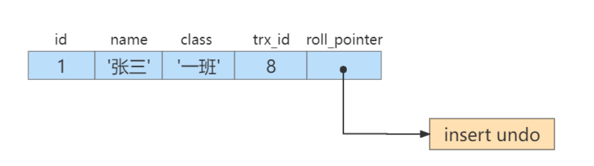

> insert undo只在事务回滚时起作用，当事务提交后，该类型的undo日志就没用了，它占用的Undo Log Segment也会被系统回收（也就是该undo日志占用的Undo页面链表要么被重用，要么被释放）。

假设之后两个事务id分别为`10`、`20`的事务对这条记录进行`UPDATE`操作，操作流程如下：

| **发生时间顺序** | **事务10**                                 | **事务20**                                 |
| ---------------- | ------------------------------------------ | ------------------------------------------ |
| 1                | BEGIN;                                     |                                            |
| 2                |                                            | BEGIN;                                     |
| 3                | UPDATE student SET name="李四" WHERE id=1; |                                            |
| 4                | UPDATE student SET name="王五" WHERE id=1; |                                            |
| 5                | COMMIT;                                    |                                            |
| 6                |                                            | UPDATE student SET name="钱七" WHERE id=1; |
| 7                |                                            | UPDATE student SET name="宋八" WHERE id=1; |
| 8                |                                            | COMMIT;                                    |

> 能不能在两个事务中交叉更新同一条记录呢？
>
> 不能！这不就是一个事务修改了另一个未提交事务修改过的数据，脏写。
>
> InnoDB使用锁来保证不会有脏写情况的发生，也就是在第一个事务更新了某条记录后，就会给这条记录加锁，另一个事务再次更新时就需要等待第一个事务提交了，把锁释放之后才可以继续更新。

每次对记录进行改动，都会记录一条undo日志，每条undo日志也都有一个`roll_pointer`属性（`INSERT`操作对应的undo日志没有该属性，因为该记录并没有更早的版本），可以将这些`undo日志`都连起来，串成一个链表：

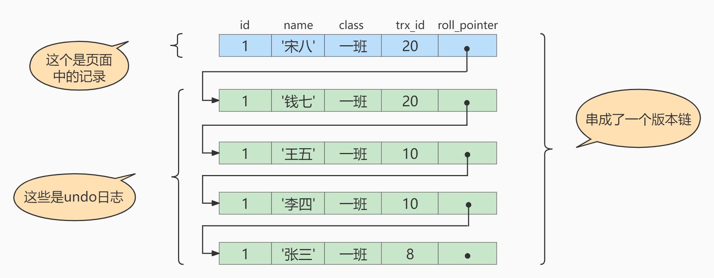

对该记录每次更新后，都会将旧值放到一条`undo日志`中，就算是该记录的一个旧版本，随着更新次数的增多，所有的版本都会被`roll_pointer`属性连接成一个链表，我们把这个链表称之为`版本链`，版本链的头节点就是当前记录最新的值。

每个版本中还包含生成该版本时对应的`事务id`。


### 4 MVCC实现原理之ReadView

MVCC的实现依赖于：**隐藏字段、Undo Log、Read View**。

#### 4.1 什么是ReadView

在MVCC机制中，多个事务对同一个行记录进行更新会产生多个历史快照，这些历史快照保存在Undo Log里。如果一个事务想要查询这个行记录，需要读取哪个版本的行记录呢?这时就需要用到ReadView了，它帮我们解决了行的可见性问题。

ReadView就是事务在使用MVCC机制进行快照读操作时产生的读视图。当事务启动时，会生成数据库系统当前的一个快照，InnoDB为每个事务构造了一个数组，用来记录并维护系统当前`活跃事务的ID`(“活跃"指的就是，启动了但还没提交)。


#### 4.2 设计思路

使用`READ UNCOMMITTED`隔离级别的事务，由于可以读到未提交事务修改过的记录，所以直接读取记录的最新版本就好了。

使用`SERIALIZABLE`隔离级别的事务，InnoDB规定使用加锁的方式来访问记录。

使用`READ COMMITTED`和`REPEATABLE READ`隔离级别的事务，都必须保证读到`已经提交了的`事务修改过的记录。假如另一个事务已经修改了记录但是尚未提交，是不能直接读取最新版本的记录的，核心问题就是需要判断一下版本链中的哪个版本是当前事务可见的，这是ReadView要解决的主要问题。

这个ReadView中主要包含4个比较重要的内容，分别如下：

1. `creator_trx_id`，创建这个 Read View 的事务 ID。

   > 说明：只有在对表中的记录做改动时（执行INSERT、DELETE、UPDATE这些语句时）才会为事务分配事务id，否则在一个只读事务中的事务id值都默认为0。

2. `trx_ids`，表示在生成ReadView时当前系统中活跃的读写事务的`事务id列表`。

3. `up_limit_id`，活跃的事务中最小的事务ID。

4. `low_limit_id`，表示生成ReadView时系统中应该分配给下一个事务的`id`值。low_limit_id是系统最大的事务id值，这里要注意是系统中的事务id，需要区别于正在活跃的事务ID。

   > 注意：low_limit_id并不是trx_ids中的最大值，事务id是递增分配的。比如，现在有id为1，2，3这三个事务，之后id为3的事务提交了。那么一个新的读事务在生成ReadView时，trx_ids就包括1和2，up_limit_id的值就是1，low_limit_id的值就是4。

**举例**：

trx_ids 为 trx2、trx3、trx5 和 trx8 的集合，系统的最大事务ID(low_limit_id)为 trx8+1 (如果之前没有其他的新增事务)，活跃的最小事务ID (up_limit_id)为 trx2。

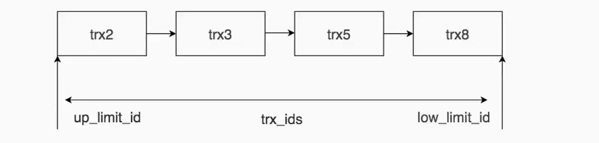


#### 4.3 ReadView的规则

有了这个ReadView，这样在访问某条记录时，只需要按照下边的步骤判断记录的某个版本是否可见。

- 如果被访问版本的trx_id属性值与ReadView中的`creator_trx_id`值相同，意味着当前事务在访问它自己修改过的记录，所以该版本可以被当前事务访问。
- 如果被访问版本的trx_id属性值小于ReadView中的`up_limit_id`值，表明生成该版本的事务在当前事务生成ReadView前已经提交，所以该版本可以被当前事务访问。
- 如果被访问版本的trx_id属性值大于或等于ReadView中的`low_limit_id`值，表明生成该版本的事务在当前事务生成ReadView后才开启，所以该版本不可以被当前事务访问。
- 如果被访问版本的trx_id属性值在ReadView的`up_limit_id`和`low_limit_id`之间，那就需要判断一下trx_id属性值是不是在`trx_ids`列表中。
  - 如果在，说明创建ReadView时生成该版本的事务还是活跃的，该版本不可以被访问。
  - 如果不在，说明创建ReadView时生成该版本的事务已经被提交，该版本可以被访问。


#### 4.4 MVCC整体操作流程

了解了这些概念之后，我们来看下当查询一条记录的时候，系统如何通过MVCC找到它：

1. 首先获取事务自己的版本号，也就是事务ID；
2. 获取ReadView；
3. 查询得到的数据，然后与 ReadView 中的事务版本号进行比较；
4. 如果不符合 ReadView 规则，就需要从 Undo Log 中获取历史快照；
5. 最后返回符合规则的数据。

如果某个版本的数据对当前事务不可见的话，那就顺着版本链找到下一个版本的数据，继续按照上边的步骤判断可见性，依此类推，直到版本链中的最后一个版本。如果最后一个版本也不可见的话，那么就意味着该条记录对该事务完全不可见，查询结果就不包含该记录。

> lnnoDB中，MVCC是通过Undo Log + Read View进行数据读取，Undo Log保存了历史快照，而Read View规则帮我们判断当前版本的数据是否可见。

在隔离级别为读已提交（Read Committed）时，一个事务中的每一次 SELECT 查询都会重新获取一次Read View。

如表所示：

| **事务**                           | **说明**          |
| ---------------------------------- | ----------------- |
| begin;                             |                   |
| select * from student where id >2; | 获取一次Read View |
| .........                          |                   |
| select * from student where id >2; | 获取一次Read View |
| commit;                            |                   |

> 注意，此时同样的查询语句都会重新获取一次Read View，这时如果Read View不同，就可能产生不可重复读或者幻读的情况。

当隔离级别为可重复读的时候，就避免了不可重复读，这是因为一个事务只在第一次 SELECT 的时候会获取一次 Read View，而后面所有的 SELECT 都会复用这个 Read View，如下表所示：


### 5 举例说明

假设现在student表中只有一条由`事务id`为`8`的事务插入的一条记录:

```mysql
mysql> select * from student;
+----+--------+--------+
| id | name   | class  |
+----+--------+--------+
|  1 | 张三    | 一班   |
+----+--------+--------+
1 row in set (0.01 sec)
```

MVCC只能在READ COMMITTED和REPEATABLE READ两个隔离级别下工作。接下来看一下`READ COMMITTED`和`REPEATABLE READ`所谓的生成ReadView的时机不同到底不同在哪里。


#### 5.1 READ COMMITTED隔离级别下

**READ COMMITTED：每次读取数据前都生成一个ReadView。**

现在有两个`事务id`分别为`10`、`20`的事务在执行：

```mysql
# Transaction 10
BEGIN;
UPDATE student SET name="李四" WHERE id=1;
UPDATE student SET name="王五" WHERE id=1;

# Transaction 20
BEGIN;
# 更新了一些别的表的记录
...
```

> 说明：事务执行过程中，只有在第一次真正修改记录时（比如使用INSERT、DELETE、UPDATE语句)，才会被分配一个单独的事务id，这个事务id是递增的。所以我们才在事务2中更新些别的表的记录，目的是让它分配事务id。

此刻，表student 中`id`为`1`的记录得到的版本链表如下所示：


假设现在有一个使用`READ COMMITTED`隔离级别的事务开始执行：

```mysql
# 使用READ COMMITTED隔离级别的事务
BEGIN;

# SELECT1：Transaction 10、20未提交
SELECT * FROM student WHERE id = 1; # 得到的列name的值为'张三'
```

这个`SELECT1`的执行过程如下:

- 步骤1：在执行`SELECT`语句时会先生成一个`ReadView`, ReadView的`trx_ids`列表的内容就是`[10，20]`，`up_limit_id`为`10`, `low_limit_id`为`21`, `creator_trx_id`为`0`。

- 步骤2：从版本链中挑选可见的记录，从图中看出，最新版本的列`name`的内容是'`王五`'，该版本的`trx_id`值为`10`，在`trx_ids`列表内，所以不符合可见性要求，根据`roll_pointer`跳到下一个版本。

- 步骤3：下一个版本的列`name`的内容是'`李四`'，该版本的`trx_id`值也为`10`，也在`trx_ids`列表内，所以也不符合要求，继续跳到下一个版本。

- 步骤4：下一个版本的列`name`的内容是'`张三`'，该版本的`trx_id`值为8，小于ReadView中的`up_limit_id`值`10`，所以这个版本是符合要求的，最后返回给用户的版本就是这条列`name`为‘`张三`'的记录。


之后，我们把`事务id`为`10`的事务提交一下：

```mysql
# Transaction 10
BEGIN;
UPDATE student SET name="李四" WHERE id=1;
UPDATE student SET name="王五" WHERE id=1;
COMMIT;
```

然后再到`事务id`为`20`的事务中更新一下表`student`中`id`为`1`的记录：

```mysql
# Transaction 20
BEGIN;

# 更新了一些别的表的记录
...
UPDATE student SET name="钱七" WHERE id=1;
UPDATE student SET name="宋八" WHERE id=1;
```

此刻，表student中`id`为`1`的记录的版本链就长这样：

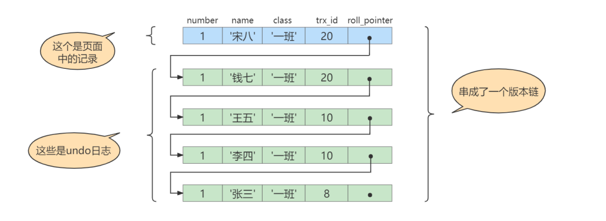

然后再到刚才使用`READ COMMITTED`隔离级别的事务中继续查找这个`id`为`1`的记录，如下：

```mysql
# 使用READ COMMITTED隔离级别的事务
BEGIN;

# SELECT1：Transaction 10、20均未提交
SELECT * FROM student WHERE id = 1; # 得到的列name的值为'张三'

# SELECT2：Transaction 10提交，Transaction 20未提交
SELECT * FROM student WHERE id = 1; # 得到的列name的值为'王五'
```

这个`SELECT2`的执行过程如下：

- 步骤1：在执行`SELECT`语句时会又会单独生成一个`ReadView`，该ReadView的trx_ids列表的内容就是[`20`]，`up_limitid_id`为`20`，`low_limit_id`为`21`，`creator_trx_id`为`0`。

- 步骤2：从版本链中挑选可见的记录，从图中看出，最新版本的列`name`的内容是‘`宋八`‘，该版本的`trx_id`值为`20`，在`trx_ids`列表内，所以不符合可见性要求，根据`roll_pointer`跳到下一个版本。

- 步骤3：下一个版本的列`name`的内容是‘`钱七`'，该版本的`trx_id`值为`28`，也在`trx_ids`列表内，所以也不符合要求，继续跳到下一个版本。

- 步骤4：下一个版本的列`name`的内容是'`王五`'，该版本的`trx_id`值为`10`，小于`ReadView`中的`up_limit_id`值20，所以这个版本是符合要求的，最后返回给用户的版本就是这条列`name`为'`王五`'的记录。


以此类推，如果之后事务id为20的记录也提交了，再次在使用READ COMMITTED隔离级别的事务中查询表student中id值为1的记录时，得到的结果就是‘宋八'了，具体流程我们就不分析了。

> 强调: 使用READ COMMITTED隔离级别的事务在每次查询开始时都会生成一个独立的ReadView。


#### 5.2 REPEATABLE READ隔离级别下

使用`REPEATABLE READ`隔离级别的事务来说，只会在第一次执行查询语句时生成一个`ReadView`，之后的查询就不会重复生成了。

比如，系统里有两个`事务id`分别为`10`、`20`的事务在执行：

```mysql
# Transaction 10
BEGIN;
UPDATE student SET name="李四" WHERE id=1;
UPDATE student SET name="王五" WHERE id=1;

# Transaction 20
BEGIN;
# 更新了一些别的表的记录
...
```

此刻，表student中`id`为`1`的记录得到的版本链表如下所示：


假设现在有一个使用`REPEATABLE READ`隔离级别的事务开始执行：

```mysql
# 使用REPEATABLE READ隔离级别的事务
BEGIN;

# SELECT1：Transaction 10、20未提交
SELECT * FROM student WHERE id = 1; # 得到的列name的值为'张三'
```

这个`SELECT1`的执行过程如下（`第一个ReadView和读已提交是一样的)`:

- 步骤1：在执行`SELECT`语句时会先生成一个`ReadView` , ReadView的`trx_ids`列表的内容就是`[10，20]`，`up_limit_id`为`10`，`low_limit_id`为`21`，`creator_trx_id`为`0`。

- 步骤2：从版本链中挑选可见的记录，从图中看出，最新版本的列`name`的内容是'`王五`'，该版本的`trx_id`值为`10`，在`trx_ids`列表内，所以不符合可见性要求，根据`roll_pointer`跳到下一个版本。

- 步骤3：下一个版本的列`name`的内容是'`李四`'，该版本的`trx_id`值也为`10`，也在`trx_ids`列表内，所以也不符合要求，继续跳到下一个版本。

- 步骤4：下一个版本的列`name`的内容是'`张三`'，该版本的`trx_id`值为8，小于ReadView中的`up_limit_id`值`10`，所以这个版本是符合要求的，最后返回给用户的版本就是这条列`name`为‘`张三`'的记录。


之后，我们把`事务id`为`10`的事务提交一下，就像这样：

```mysql
# Transaction 10
BEGIN;
UPDATE student SET name="李四" WHERE id=1;
UPDATE student SET name="王五" WHERE id=1;
COMMIT;
```

然后再到`事务id`为`20`的事务中更新一下表`student`中`id`为`1`的记录：

```mysql
# Transaction 20
BEGIN;
# 更新了一些别的表的记录
...
UPDATE student SET name="钱七" WHERE id=1;
UPDATE student SET name="宋八" WHERE id=1;
```

此刻，表student 中 id 为 1 的记录的版本链长这样：

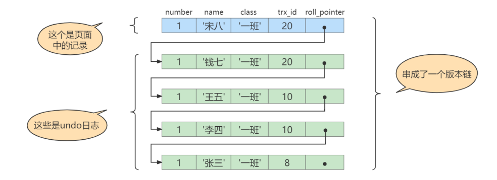

然后再到刚才使用`REPEATABLE READ`隔离级别的事务中继续查找这个`id`为`1`的记录，如下：

```mysql
# 使用REPEATABLE READ隔离级别的事务
BEGIN;

# SELECT1：Transaction 10、20均未提交
SELECT * FROM student WHERE id = 1; # 得到的列name的值为'张三'

# SELECT2：Transaction 10提交，Transaction 20未提交
SELECT * FROM student WHERE id = 1; # 得到的列name的值仍为'张三'
```

这个`SELECT2`的执行过程如下：

- 步骤1：在执行`SELECT`语句时会继续使用之前的`ReadView`，该ReadView的trx_ids列表的内容就是[10，20]，`up_limit_id`为10，`low_limit_id`为21，`creator_trx_id`为0。
- 步骤2：然后从版本链中挑选可见的记录，从图中可以看出，最新版本的列`name`的内容是`'宋八'`，该版本的`trx_id`值为`20`，在`trx_ids`列表内，所以不符合可见性要求，根据`roll_pointer`跳到下一个版本。
- 步骤3：下一个版本的列`name`的内容是`'钱七'`，该版本的`trx_id`值为`20`，也在`trx_ids`列表内，所以也不符合要求，继续跳到下一个版本。
- 步骤4：下一个版本的列`name`的内容是`'王五'`，该版本的`trx_id`值为`10`，而`trx_ids`列表中是包含值为`10`的`事务id`的，所以该版本也不符合要求，同理下一个列`name`的内容是`'李四'`的版本也不符合要求。继续跳到下一个版本。
- 步骤5：下一个版本的列`name`的内容是`'张三'`，该版本的`trx_id`值为`8`，小于`ReadView`中的`up_limit_id`值`10`，所以这个版本是符合要求的，最后返回给用户的版本就是这条列`c`为`'张三'`的记录。


两次`SELECT`查询得到的结果是重复的，记录的列`c`值都是`'张三'`，这就是`可重复读`的含义。如果我们之后再把`事务id`为`20`的记录提交了，然后再到刚才使用`REPEATABLE READ`隔离级别的事务中继续查找这个`id`为`1`的记录，得到的结果还是`'张三'`，具体执行过程大家可以自己分析一下。


#### 5.3 如何解决幻读

接下来说明InnoDB是如何解决幻读的。

假设现在表`student`中只有一条数据，数据内容中，主键id=1，隐藏的trx_id=10，它的`undo log`如下图所示。


假设现在有事务A和事务B并发执行，`事务 A`的事务id为`20`，`事务 B`的事务id为`30`。

- **步骤1：事务 A 开始第一次查询数据，查询的 SQL 语句如下。**

  ```mysql
  select * from student where id >= 1;
  ```

  在开始查询之前，MySQL会为事务 A产生一个ReadView，此时`ReadView`的内容如下：`trx_ids=
  [20,30]`, `up_limit_id=20`, `low_limit_id=31`, `creator_trx_id=20`。

  由于此时表`student`中只有一条数据，且符合`where id>=1`条件，因此会查询出来。然后根据`ReadView`机制，发现该行数据的trx_id=10，小于事务 A的ReadView里`up_limit_id`，这表示这条数据是事务 A开启之前，其他事务就已经提交了的数据，因此事务 A可以读取到。

  结论：事务 A的第一次查询，能读取到一条数据，id=1。

- **步骤2：接着事务 B(trx_id=30)，往表 student 中新插入两条数据，并提交事务。**

  ```mysql
  insert into student(id,name) values(2,'李四');
  insert into student(id,name) values(3,'王五');
  ```

  此时表student 中就有三条数据了，对应的 undo 如下图所示：

  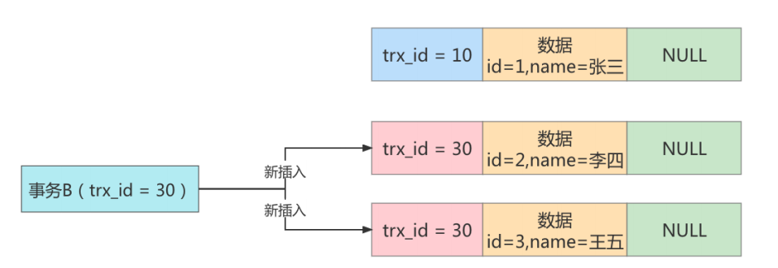

- **步骤3**：接着事务 A开启第二次查询，根据可重复读隔离级别的规则，此时事务 A并不会再重新生成ReadView。此时表student中的 3 条数据都满足`where id>=1`的条件，因此会先查出来。然后根据ReadView机制，判断每条数据是不是都可以被事务 A看到。

  1. 首先 id=1 的这条数据，前面已经说过了，可以被事务 A看到。
  2. 然后是 id=2 的数据，它的 trx_id=30，此时事务 A发现，这个值处于 up_limit_id 和 low_limit_id 之间，因此还需要再判断 30 是否处于 trx_ids 数组内。由于事务 A的 trx_ids=[20,30]，因此在数组内，这表示 id=2 的这条数据是与事务 A在同一时刻启动的其他事务提交的，所以这条数据不能让事务 A看到。
  3. 同理，id=3 的这条数据，trx_id 也为 30，因此也不能被事务 A看见。

  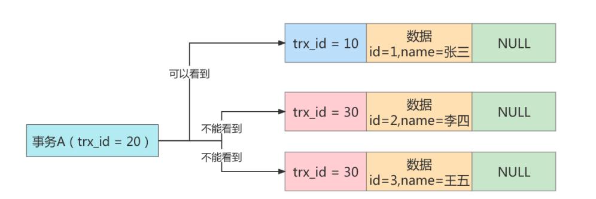

  结论：最终事务 A的第二次查询，只能查询出 id=1 的这条数据。这和事务 A的第一次查询的结果是一样的，因此没有出现幻读现象，所以说在 MySQL 的可重复读隔离级别下，不存在幻读问题。


### 6 总结

这里介绍了`MVCC`在`READ COMMITTD`、`REPEATABLE READ`这两种隔离级别的事务在执行快照读操作时访问记录的版本链的过程。这样使不同事务的`读-写`、`写-读`操作并发执行，从而提升系统性能。

核心点在于 ReadView 的原理，`READ COMMITTD`、`REPEATABLE READ`这两个隔离级别的一个很大不同就是生成ReadView的时机不同：

- `READ COMMITTD`在每一次进行普通SELECT操作前都会生成一个ReadView
- `REPEATABLE READ`只在第一次进行普通SELECT操作前生成一个ReadView，之后的查询操作都重复使用这个ReadView就好了。

> 说明：我们之前说执行DELETE语句或者更新主键的UPDATE语句并不会立即把对应的记录完全从页面中删除，而是执行一个所谓的delete mark操作，相当于只是对记录打上了一个删除标志位，这主要就是为MVCC服务的。

通过MVCC我们可以解决：

1. `读写之间阻塞的问题`。通过MVCC可以让读写互相不阻塞，即读不阻塞写，写不阻塞读，这样就可以提升事务并发处理能力。

2. `降低了死锁的概率`。这是因为MVCC采用了乐观锁的方式，读取数据时并不需要加锁，对于写操作，也只锁定必要的行。

3. `解决快照读的问题`。当我们查询数据库在某个时间点的快照时，只能看到这个时间点之前事务提交更新的结果，而不能看到这个时间点之后事务提交的更新结果。

# MySQL_高级__日志与备份篇

> 讲师：尚硅谷-宋红康（江湖人称：康师傅）
>
> 尚硅谷官网：[http://www.atguigu.com](http://www.atguigu.com/)
>
> 视频链接：https://www.bilibili.com/video/BV1iq4y1u7vj?spm_id_from=333.337.search-card.all.click

------

## 十六、其它数据库日志

我们在讲解数据库事务时，讲过两种日志：重做日志、回滚日志。

对于线上数据库应用系统，突然遭遇`数据库宕机`怎么办？在这种情况下，`定位宕机的原因`就非常关键。我们可以查看数据库的`错误日志`。因为日志中记录了数据库运行中的诊断信息，包括了错误、警告和注释等信息。比如：从日志中发现某个连接中的SQL操作发生了死循环，导致内存不足，被系统强行终止了。明确了原因，处理起来也就轻松了，系统很快就恢复了运行。

除了发现错误，日志在数据复制、数据恢复、操作审计，以及确保数据的永久性和一致性等方面，都有着不可替代的作用。


**千万不要小看日志**。很多看似奇怪的问题，答案往往就藏在日志里。很多情况下，只有通过查看日志才能发现问题的原因，真正解决问题。所以，一定要学会查看日志，养成检查日志的习惯，对提升你的数据库应用开发能力至关重要。

MySQL8.0 官网日志地址：https://dev.mysql.com/doc/refman/8.0/en/server-logs.html


### 1 MySQL支持的日志

#### 1.1 日志类型

MySQL有不同类型的日志文件，用来存储不同类型的日志，分为`二进制日志`、`错误日志`、`通用查询日志`和`慢查询日志`，这也是常用的4种。MySQL 8又新增两种支持的日志：`中继日志`和`数据定义语句日志`。使用这些日志文件，可以查看MySQL内部发生的事情。

**这6类日志分别为**：

- **慢查询日志**：记录所有执行时间超过long_query_time的所有查询，方便我们对查询进行优化。
- **通用查询日志**：记录所有连接的起始时间和终止时间，以及连接发送给数据库服务器的所有指令，对我们复原操作的实际场景、发现问题，甚至是对数据库操作的审计都有很大的帮助。
- **错误日志**：记录MySQL服务的启动、运行或停止MySQL服务时出现的问题，方便我们了解服务器的状态，从而对服务器进行维护。
- **二进制日志**：记录所有更改数据的语句，可以用于主从服务器之间的数据同步，以及服务器遇到故障时数据的无损失恢复。
- **中继日志**：用于主从服务器架构中，从服务器用来存放主服务器二进制日志内容的一个中间文件。从服务器通过读取中继日志的内容，来同步主服务器上的操作。
- **数据定义语句日志**：记录数据定义语句执行的元数据操作。

除二进制日志外，其他日志都是`文本文件`。默认情况下，所有日志创建于`MySQL数据目录`中。


#### 1.2 日志的弊端

- 日志功能会`降低MySQL数据库的性能`。例如，在查询非常频繁的MysQL数据库系统中，如果开启了通用查询日志和慢查询日志，MySQL数据库会花费很多时间记录日志。
- 日志会`占用大量的磁盘空间`。对于用户量非常大、操作非常频繁的数据库，日志文件需要的存储空间设置比数据库文件需要的存储空间还要大。


### 2 慢查询日志(slow query log)

前面章节《八、性能分析工具的使用》已经详细讲述。


### 3 通用查询日志(general query log)

通用查询日志用来`记录用户的所有操作`，包括启动和关闭MySQL服务、所有用户的连接开始时间和截止时间、发给 MySQL 数据库服务器的所有 SQL 指令等。当我们的数据发生异常时，**查看通用查询日志，还原操作时的具体场景**，可以帮助我们准确定位问题。

#### 3.1 问题场景

在电商系统中，购买商品并且使用微信支付完成以后，却发现支付中心的记录并没有新增，此时用户再次使用支付宝支付，就会出现`重复支付`的问题。但是当去数据库中查询数据的时候，会发现只有一条记录存在。那么此时给到的现象就是只有一条支付记录，但是用户却支付了两次。

我们对系统进行了仔细检查，没有发现数据问题，因为用户编号和订单编号以及第三方流水号都是对的。可是用户确实支付了两次，这个时候，我们想到了检查通用查询日志，看看当天到底发生了什么。

查看之后，发现: 1月1日下午2点，用户使用微信支付完以后，但是由于网络故障，支付中心没有及时收到微信支付的回调通知，导致当时没有写入数据。1月1日下午2点30，用户又使用支付宝支付，此时记录更新到支付中心。1月1日晚上9点，微信的回调通知过来了，但是支付中心已经存在了支付宝的记录，所以只能覆盖记录了。

由于网络的原因导致了重复支付。至于解决问题的方案就很多了，这里省略。

可以看到通用查询日志可以帮助我们了解操作发生的具体时间和操作的细节，对找出异常发生的原因极其关键。


#### 3.2 查看当前状态

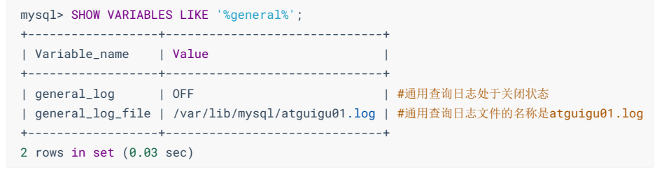

**说明1**：系统变量general_log的值是OFF，即通用查询日志处于关闭状态。在MySQL中，这个参数的`默认值是关闭的`。因为一旦开启记录通用查询日志，MySQL会记录所有的连接起止和相关的SQL操作，这样会消耗系统资源并且占用磁盘空间。我们可以通过手动修改变量的值，在`需要的时候开启日志`。

**说明2**：通用查询日志文件的名称是atguigu01.log。存储路径是/var/lib/mysq/，默认也是数据路径。这样我们就知道在哪里可以查看通用查询日志的内容了。


#### 3.3 启动日志

**方式1：永久性方式**

修改my.cnf或者my.ini配置文件来设置。在[mysqld]组下加入log选项，并重启MySQL服务。格式如下：

```ini
[mysqld]
general_log=ON
general_log_file=[path[filename]] #日志文件所在目录路径，filename为日志文件名
```

如果不指定目录和文件名，通用查询日志将默认存储在MySQL数据目录中的hostname.log文件中，hostname表示主机名。

**方式2：临时性方式**

```mysql
SET GLOBAL general_log=on; # 开启通用查询日志
```

```mysql
SET GLOBAL general_log_file=’path/filename’; # 设置日志文件保存位置
```

对应的，关闭操作SQL命令如下：

```mysql
SET GLOBAL general_log=off; # 关闭通用查询日志
```

查看设置后情况：

```mysql
SHOW VARIABLES LIKE 'general_log%';
```


#### 3.4 查看日志

通用查询日志是以`文本文件`的形式存储在文件系统中的，可以使用`文本编辑器`直接打开日志文件。每台MySQL服务器的通用查询日志内容是不同的。

- 在Windows操作系统中，使用文本文件查看器；
- 在Linux系统中，可以使用vi工具或者gedit工具查看；
- 在Mac OSX系统中，可以使用文本文件查看器或者vi等工具查看。

从`SHOW VARIABLES LIKE 'general_log%';`结果中可以看到通用查询日志的位置。

通过通用查询日志，可以了解用户对MySQL进行的操作。比如，MySQL启动信息和用户root连接服务器和执行查询表的记录。

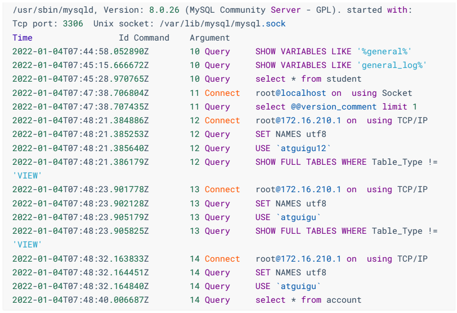

在通用查询日志里面，我们可以清楚地看到，什么时候开启了新的客户端登陆数据库，登录之后做了什么 SQL 操作，针对的是哪个数据表等信息。


#### 3.5 停止日志

**方式1：永久性方式**

修改`my.cnf`或者`my.ini`文件，把[mysqld]组下的`general_log`值设置为`OFF`或者把general_log一项注释掉。修改保存后，再`重启MySQL服务`，即可生效。

**举例1**：

```ini
[mysqld]
general_log=OFF
```

**举例2**：

```ini
[mysqld]
# general_log=ON
```

**方式2：临时性方式**

使用SET语句停止MySQL通用查询日志功能：

```mysql
SET GLOBAL general_log=off;
```

查询通用日志功能：

```mysql
SHOW VARIABLES LIKE 'general_log%';
```


#### 3.6 删除\刷新日志

如果数据的使用非常频繁，那么通用查询日志会占用服务器非常大的磁盘空间。数据管理员可以删除很长时间之前的查询日志，以保证MySQL服务器上的硬盘空间。

**手动删除文件**

```mysql
SHOW VARIABLES LIKE 'general_log%';
```

可以看出，通用查询日志的目录默认为MySQL数据目录。在该目录下手动删除通用查询日志atguigu01.log。

使用如下命令重新生成查询日志文件，具体命令如下。刷新MySQL数据目录，发现创建了新的日志文件。前提一定要开启通用日志。

```bash
mysqladmin -uroot -p flush-logs
```


### 4 错误日志(error log)

错误日志记录了MySQL服务器启动、停止运行的时间，以及系统启动、运行和停止过程中的诊断信息，包括`错误`、`警告`和`提示`等。

通过错误日志可以查看系统的运行状态，便于即时发现故障、修复故障。如果MySQL服务`出现异常`，错误日志是发现问题、解决故障的`首选`。

#### 4.1 启动日志

在MySQL数据库中，错误日志功能是`默认开启`的。而且，错误日志`无法被禁止`。

默认情况下，错误日志存储在MySQL数据库的数据文件夹下，名称默认为`mysqld.log`（Linux系统）或`hostname.err`（mac系统）。如果需要制定文件名，则需要在my.cnf或者my.ini中做如下配置：

```ini
[mysqld]
log-error=[path/[filename]] #path为日志文件所在的目录路径，filename为日志文件名
```

修改配置项后，需要重启MySQL服务以生效。


#### 4.2 查看日志

MySQL错误日志是以文本文件形式存储的，可以使用文本编辑器直接查看。

查询错误日志的存储路径：

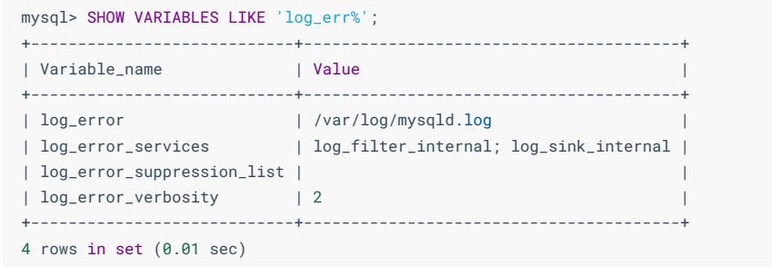

执行结果中可以看到错误日志文件是mysqld.log，位于MySQL默认的数据目录下。

下面我们查看一下错误日志的内容。

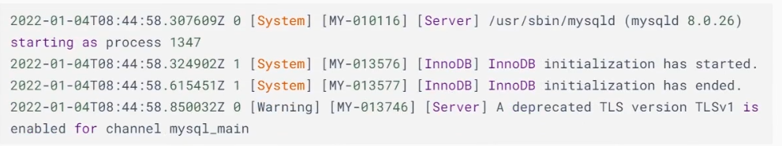

可以看到，错误日志文件中记录了服务器启动的时间，以及存储引擎InnoDB启动和停止的时间等。我们在做初始化时候生成的数据库初始密码也是记录在error.log中。


#### 4.3 删除\刷新日志

对于很久以前的错误日志，数据库管理员查看这些错误日志的可能性不大，可以将这些错误日志删除，以保证MySQL服务器上的`硬盘空间`。MySQL的错误日志是以文本文件的形式存储在文件系统中的，可以`直接删除`。

- 第一步（方式一）：删除操作

  ```bash
  rm -rf /var/log/mysqld.log
  ```

  在运行状态下删除错误日志文件后，MySQL并不会自动创建日志文件。

- 第一步（方式二）：重命名文件

  ```bash
  mv /var/log/mysqld.log /var/log/mysqld.log.old
  ```

- 第二步：重建日志

  ```bash
  mysqladmin -uroot -p flush-logs
  ```

  

  可能会报错：

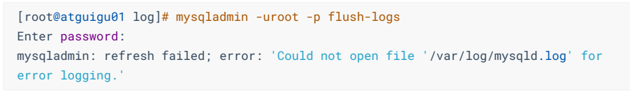

官网提示：

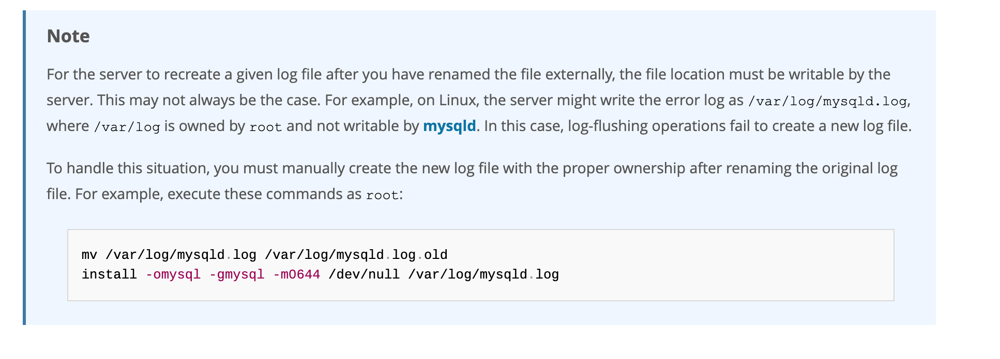

补充操作：

```bash
install -omysql -gmysql -m0644 /dev/null /var/log/mysqld.log
```

`flush-logs`指令操作：

- MySQL 5.5.7以前的版本，flush-logs将错误日志文件重命名为filename.err_old，并创建新的日志文件。
- 从MySQL 5.5.7开始，flush-logs只是重新打开日志文件，并不做日志备份和创建的操作。
- 如果日志文件不存在，MySQL启动或者执行flush-logs时会自动创建新的日志文件。重新创建错误日志，大小为0字节。


#### 4.4 MySQL8.0新特性

MySQL8.0里对错误日志的改进。MySQL8.0的错误日志可以理解为一个全新的日志，在这个版本里，接受了来自社区的广泛批评意见，在这些意见和建议的基础上生成了新的日志。

下面这些是来自社区的意见:

- 默认情况下内容过于冗长
- 遗漏了有用的信息
- 难以过滤某些信息
- 没有标识错误信息的子系统源
- 没有错误代码，解析消息需要识别错误
- 引导消息可能会丢失
- 固定格式

针对这些意见，MySQL做了如下改变：

- 采用组件架构，通过不同的组件执行日志的写入和过滤功能
- 写入错误日志的全部信息都具有唯一的错误代码从10000开始
- 增加了一个新的消息分类《system》用于在错误日志中始终可见的非错误但服务器状态更改事件的消息
- 增加了额外的附加信息，例如关机时的版本信息，谁发起的关机等等
- 两种过滤方式，Internal和Dragnet
- 三种写入形式，经典、JSON和syseventlog

> 小结:
>
> 通常情况下，管理员不需要查看错误日志。但是，MySQL服务器发生异常时，管理员可以从错误日志中找到发生异常的时间、原因，然后根据这些信息来解决异常。


### 5 二进制日志(bin log)

binlog可以说是MySQL中比较`重要`的日志了，在日常开发及运维过程中，经常会遇到。

binlog即binary log，二进制日志文件，也叫作变更日志（update log）。它记录了数据库所有执行的`DDL`和`DML`等数据库更新事件的语句，但是不包含没有修改任何数据的语句（如数据查询语句select、show等）。

它以`事件形式`记录并保存在`二进制文件`中。通过这些信息，我们可以再现数据更新操作的全过程。

> 如果想要记录所有语句（例如，为了识别有问题的查询)，需要使用通用查询日志。

binlog主要应用场景：

- 一是用于`数据恢复`，如果MySQL数据库意外停止，可以通过二进制日志文件来查看用户执行了哪些操作，对数据库服务器文件做了哪些修改，然后根据二进制日志文件中的记录来恢复数据库服务器。
- 二是用于`数据复制`，由于日志的延续性和时效性，master把它的二进制日志传递给slaves来达到master-slave数据一致的目的。

可以说MySQL**数据库的数据备份、主备、主主、主从**都离不开binlog，需要依靠binlog来同步数据，保证数据一致性。

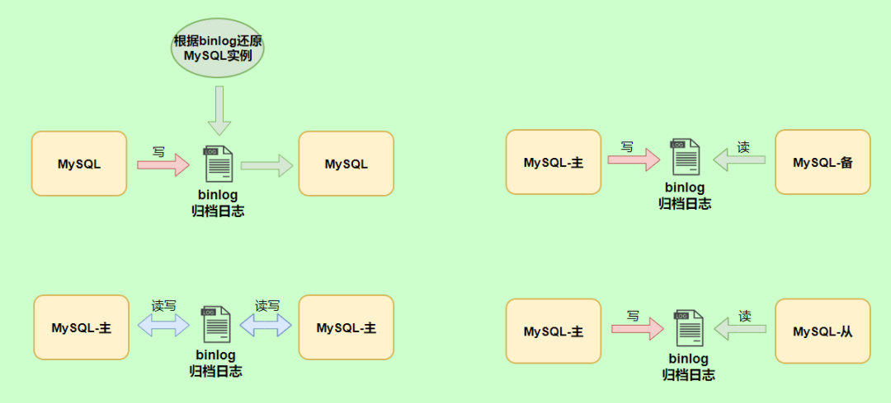


#### 5.1 查看默认情况

查看记录二进制日志是否开启：在MySQL8中默认情况下，二进制文件是开启的。

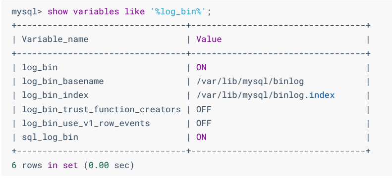

- `log_bin_basename`：是binlog日志的基本文件名，后面会追加标识来表示每一个文件
- `log_bin_index`：是binlog文件的索引文件，这个文件管理了所有的binlog文件的目录
- `log_bin_trust_function_creators`：限制存储过程，前面我们已经讲过了，这是因为二进制日志的一个重要功能是用于主从复制，而存储函数有可能导致主从的数据不一致。所以当开启二进制日志后，需要限制存储函数的创建、修改、调用
- `log_bin_use_v1_row_events`：此只读系统变量已弃用。ON表示使用版本1二进制日志行，OFF表示使用版本2二进制日志行(MySQL 5.6的默认值为2)。


#### 5.2 日志参数设置

**方式1：永久性方式**

修改MySQL的`my.cnf`或`my.ini`文件可以设置二进制日志的相关参数：

```ini
[mysqld]
#启用二进制日志
log-bin=atguigu-bin
binlog_expire_logs_seconds=600
max_binlog_size=100M
```

> 提示:
>
> 1. log-bin=mysql-bin #打开日志(主机需要打开)，这个mysql-bin也可以自定义，这里也可以加上路径，
>    如:/home/www/mysql_bin_log/mysql-bin
>
> 2. binlog_expire_logs_seconds：此参数控制二进制日志文件保留的时长，单位是`秒`，默认2592000 30天
>
>    -- 14400 4小时; 86400 1天; 259200 3天;
>
> 3. max_binlog_size：控制单个二进制日志大小，当前日志文件大小超过此变量时，执行切换动作。此参数的`最大和默认值是1GB`，该设置并`不能严格控制Binlog的大小`，尤其是Binlog比较靠近最大值而又遇到一个比较大事务时，为了保证事务的完整性，可能不做切换日志的动作只能将该事务的所有SQL都记录进当前日志，直到事务结束。一般情况下可采取默认值。

重新启动MySQL服务，查询二进制日志的信息，执行结果：

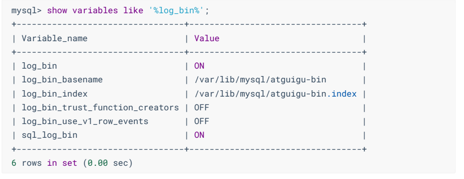

**设置带文件夹的bin-log日志存放目录**

如果想改变日志文件的目录和名称，可以对my.cnf或my.ini中的log_bin参数修改如下：

```ini
[mysqld]
log-bin="/var/lib/mysql/binlog/atguigu-bin"
```

注意：新建的文件夹需要使用mysql用户，使用下面的命令即可。

```bash
chown -R -v mysql:mysql binlog
```

> 提示：数据库文件最好不要与日志文件放在同一个磁盘上！这样，当数据库文件所在的磁盘发生故障时，可以使用日志文件恢复数据。


**方式2：临时性方式**

如果不希望通过修改配置文件并重启的方式设置二进制日志的话，还可以使用如下指令，需要注意的是在mysql8中只有`会话级别`的设置，没有了global级别的设置。

```mysql
# global 级别
mysql> set global sql_log_bin=0;
ERROR 1228 (HY000): Variable 'sql_log_bin' is a SESSION variable and can`t be used with SET GLOBAL

# session级别
mysql> SET sql_log_bin=0;
Query OK, 0 rows affected (0.01 秒)
```


#### 5.3 查看日志

当MySQL创建二进制日志文件时，先创建一个以“filename”为名称、以“.index”为后缀的文件，再创建一个以“filename”为名称、以“.000001”为后缀的文件。

MySQL服务`重新启动一次`，以“.000001”为后缀的文件就会增加一个，并且后缀名按1递增。即日志文件的个数与MySQL服务启动的次数相同；如果日志长度超过了`max_binlog_size`的上限（默认是1GB），就会创建一个新的日志文件。

查看当前的二进制日志文件列表及大小。指令如下：

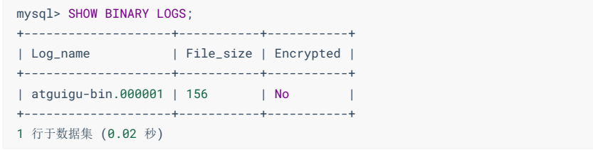

所有对数据库的修改都会记录在binglog中。但binlog是二进制文件，无法直接查看，借助`mysqlbinlog`命令工具了。指令如下：在查看执行，先执行一条SQL语句，如下：

```mysql
update student set name='张三_back' where id=1;
```

```bash
mysqlbinlog  "/var/lib/mysql/lqhdb-binlog.000001"
```

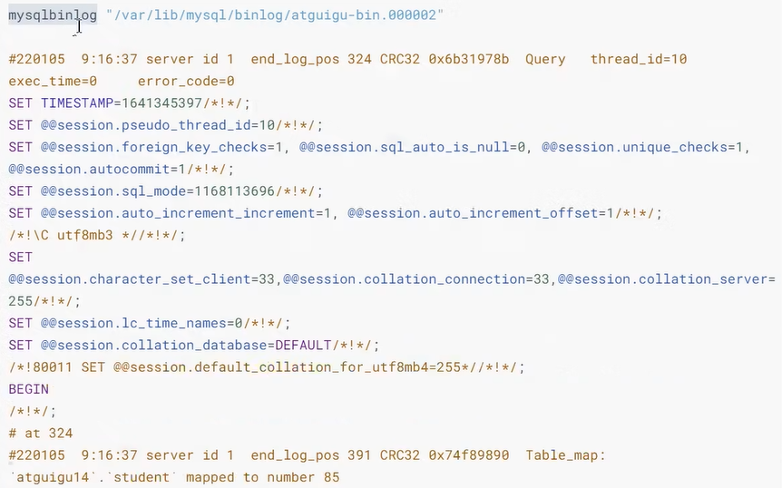

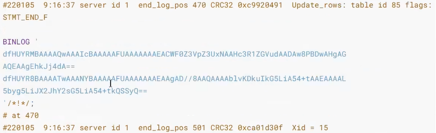

执行结果可以看到，这是一个简单的日志文件，日志中记录了用户的一些操作，这里并没有出现具体的SQL语句，这是因为binlog关键字后面的内容是经过编码后的二进制日志。

这里一个update语句包含如下事件

- `Query`事件：负责开始一个事务(BEGIN)
- `Table_map`事件：负责映射需要的表
- `Update_rows`事件：负责写入数据
- `Xid`事件：负责结束事务


下面命令将行事件以`伪SQL的形式`表现出来

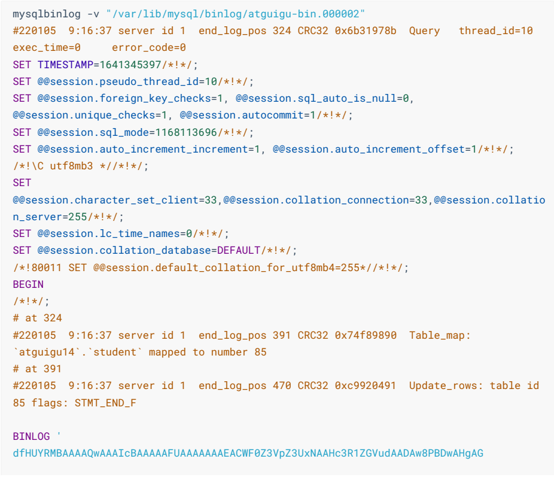

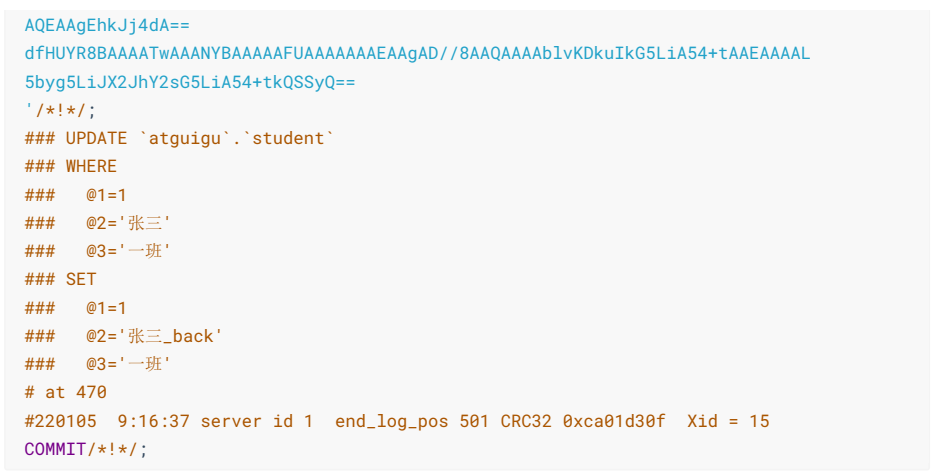

前面的命令同时显示binlog格式的语句，使用如下命令不显示它

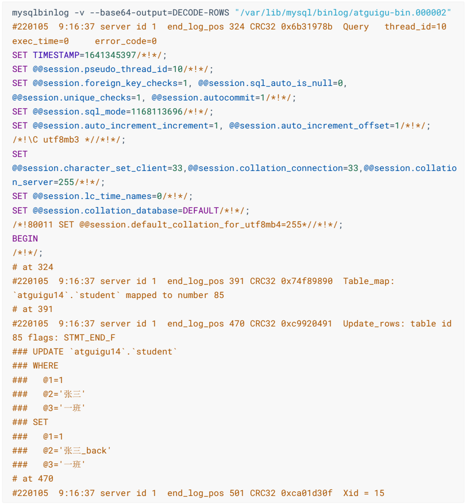

关于mysqlbinlog工具的使用技巧还有很多，例如只解析对某个库的操作或者某个时间段内的操作等。简单分享几个常用的语句，更多操作可以参考官方文档。

```mysql
# 可查看参数帮助
mysqlbinlog --no-defaults --help

# 查看最后100行
mysqlbinlog --no-defaults --base64-output=decode-rows -vv atguigu-bin.000002 |tail -100

# 根据position查找
mysqlbinlog --no-defaults --base64-output=decode-rows -vv atguigu-bin.000002 |grep -A20 '4939002'
```

上面这种办法读取出binlog日志的全文内容比较多，不容易分辨查看到pos点信息，下面介绍一种更为方便的查询命令：

```mysql
show binlog events [IN 'log_name'] [FROM pos] [LIMIT [offset,] row_count];
```

- `IN 'log_name'`：指定要查询的binlog文件名（不指定就是第一个binlog文件）
- `FROM pos`：指定从哪个pos起始点开始查起（不指定就是从整个文件首个pos点开始算）
- `LIMIT [offset]`：偏移量(不指定就是0)
- `row_count`：查询总条数（不指定就是所有行）

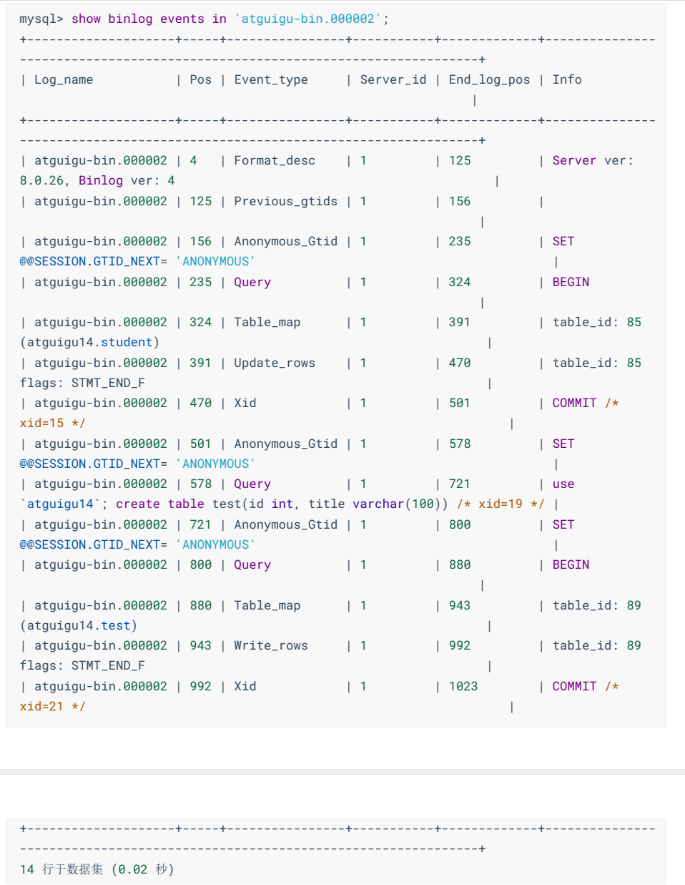

上面我们讲了这么多都是基于binlog的默认格式，binlog格式查看

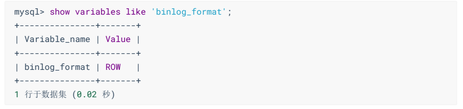

除此之外，binlog还有2种格式，分别是**Statement**和**Mixed**

- **Statement**：

  每一条会修改数据的sql都会记录在binlog中。

  优点：不需要记录每一行的变化，减少了binlog日志量，节约了IO，提高性能。

- **Row**：

  5.1.5版本的MySQL才开始支持row level的复制，它不记录sql语句上下文相关信息，仅保存哪条记录被修改。

  优点：row level的日志内容会非常清楚的记录下每一行数据修改的细节。而且不会出现某些特定情况下的存储过程，或function，以及trigger的调用和触发无法被正确复制的问题。

- **Mixed**：

  从5.1.8版本开始，MySQL提供了Mixed格式，实际上就是Statement与Row的结合。

  详细情况，下章讲解。


#### 5.4 使用日志恢复数据

如果MySQL服务器启用了二进制日志，在数据库出现意外丢失数据时，可以使用MySQLbinlog工具从指定的时间点开始(例如，最后一次备份)直到现在或另一个指定的时间点的日志中恢复数据。

mysqlbinlog恢复数据的语法如下：

```mysql
mysqlbinlog [option] filename|mysql –uuser -ppass;
```

这个命令可以这样理解：使用mysqlbinlog命令来读取filename中的内容，然后使用mysql命令将这些内容恢复到数据库中。

- `filename`：是日志文件名。
- `option`：可选项，比较重要的两对option参数是--start-date、--stop-date 和 --start-position、--stop-position。
  - `--start-date 和 --stop-date`：可以指定恢复数据库的起始时间点和结束时间点。
  - `--start-position和--stop-position`：可以指定恢复数据的开始位置和结束位置。

> 注意：使用mysqlbinlog命令进行恢复操作时，必须是编号小的先恢复，例如atguigu-bin.000001必须在atguigu-bin.000002之前恢复。


#### 5.5 删除二进制日志

MySQL的二进制文件可以配置自动删除，同时MySQL也提供了安全的手动删除二进制文件的方法。

`PURGE MASTER LOGS`只删除指定部分的二进制日志文件，`RESET MASTER`删除所有的二进制日志文件。具体如下：

**1、PURGE MASTER LOGS：删除指定日志文件**

PURGE MASTER LOGS语法如下：

```mysql
PURGE {MASTER | BINARY} LOGS TO ‘指定日志文件名’
PURGE {MASTER | BINARY} LOGS BEFORE ‘指定日期’
```

**举例**:

使用PURGE MASTER LOGS语句删除创建时间比binlog.000005早的所有日志

(1) 多次重新启动MysSQL服务，便于生成多个日志文件。然后用SHOW语句显示二进制日志文件列表

```mysql
SHOW BINARY LOGS;
```

(2）执行PURGE MASTER LOGS语句删除创建时间比binlog.000005早的所有日志

```mysql
PURGE MASTER LOGS T0 "binlog.000005";
```

(3）显示二进制日志文件列表

```mysql
SHGW BINARY LOGS;
```

比binlog.000005早的所有日志文件都已经被删除了。
。

**举例**:

使用PURGE MASTER LOGS语句删除2020年10月25号前创建的所有日志文件。具体步骤如下:

(1) 显示二进制日志文件列表

```mysql
SHOW BINARY LOGS;
```

(2）执行mysqlbinlog命令查看二进制日志文件binlog.000005的内容

```mysql
mysqlbinlog --no-defaults "/var/lib/mysql/binlog/atguigu-bin.000005"
```

结果可以看出20220105为日志创建的时间，即2022年1月05日。

(3）使用PURGE MASTER LOGS语句删除2022年1月05日前创建的所有日志文件

```mysql
PURGE MASTER LOGS before "20220105";
```

(4）显示二进制日志文件列表

```mysql
SHOW BINARY LOGS;
```

2022年01月05号之前的二进制日志文件都已经被删除，最后一个没有删除，是因为当前在用，还未记录最后的时间，所以未被删除。


**2、RESET MASTER:删除所有二进制日志文件**

使用`RESET MASTER`语句，清空所有的binlog日志。MySQL会重新创建二进制文件，新的日志文件扩展名将重新从00001开始编号。`慎用`！

```mysql
reset master;
```

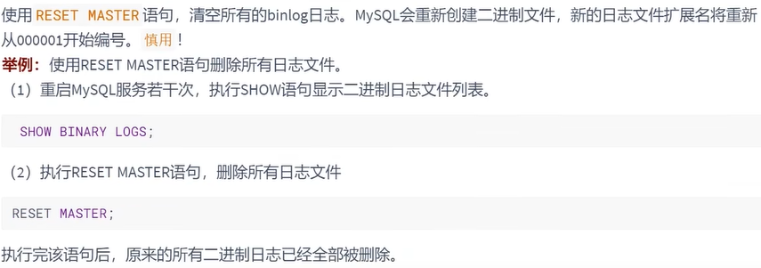


#### 5.6 其它场景

二进制日志可以通过数据库的`全量备份`和二进制日志中保存的`增量信息`，完成数据库的`无损失恢复`。但是，如果遇到数据量大、数据库和数据表很多（比如分库分表的应用）的场景，用二进制日志进行数据恢复，是很有挑战性的，因为起止位置不容易管理。

在这种情况下，一个有效的解决办法是`配置主从数据库服务器`，甚至是`一主多从`的架构，把二进制日志文件的内容通过中继日志，同步到从数据库服务器中，这样就可以有效避免数据库故障导致的数据异常等问题。


### 6 再谈二进制日志(binlog)

#### 6.1 写入机制

binlog的写入时机也非常简单，事务执行过程中，先把日志写到`binlog cache`，事务提交的时候，再把binlog cache写到binlog文件中。因为一个事务的binlog不能被拆开，无论这个事务多大，也要确保一次性写入，所以系统会给每个线程分配一个块内存作为binlog cache。

我们可以通过`binlog_cache_size`参数控制单个线程binlog cache大，如果存储内容超过了这个参数，就要暂存到磁盘(Swap)。binlog日志刷盘流程如下：


> - 上图的write，是指把日志写入到文件系统的page cache，并没有把数据持久化到磁盘，所以速度比较快。
> - 上图的fsync，才是将数据持久化到磁盘的操作

write和fsync的时机，可以由参数`sync_binlog`控制，默认是`0`。为0的时候，表示每次提交事务都只write，由系统自行判断什么时候执行fsync。虽然性能得到提升，但是机器宕机，page cache里面的binglog会丢失。如下图：

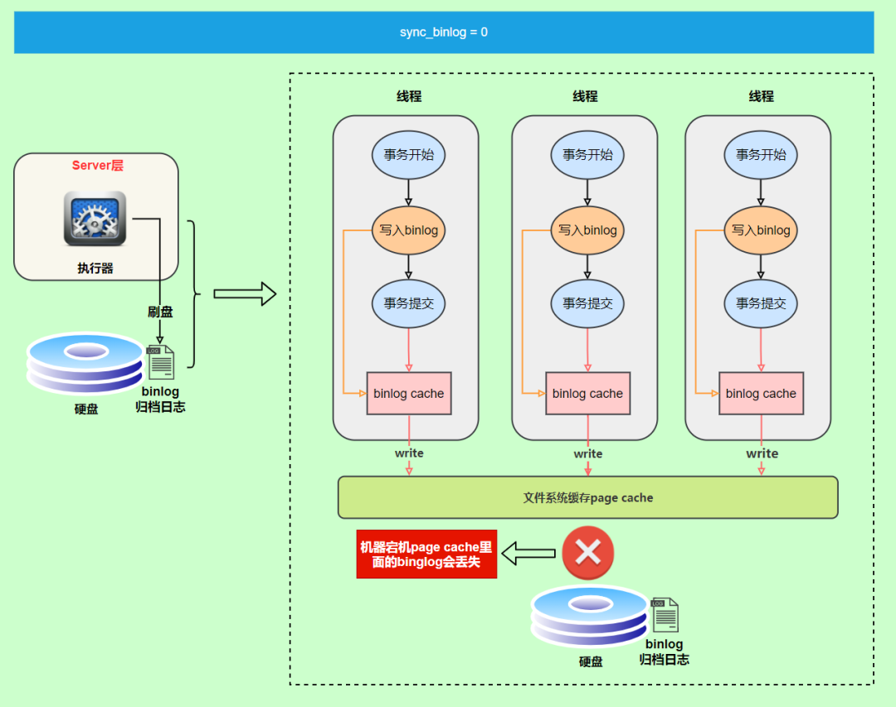

为了安全起见，可以设置为`1`，表示每次提交事务都会执行fsync，就如同**redo log刷盘流程**一样。最后还有一种折中方式，可以设置为N(N>1)，表示每次提交事务都write，但累积N个事务后才fsync。

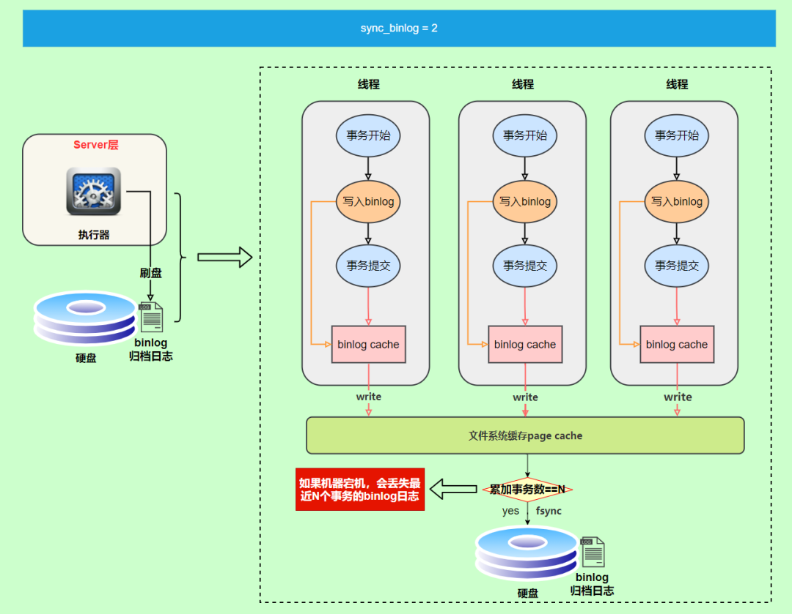

在出现IO瓶颈的场景里，将sync_binlog设置成一个比较大的值，可以提升性能。同样的，如果机器宕机，会丢失最近N个事务的binlog日志。


#### 6.2 binlog与redolog对比

- redo log它是`物理日志`，记录内容是“在某个数据页上做了什么修改”，属于 InnoDB 存储引擎层产生的。
- 而 binlog是`逻辑日志`，记录内容是语句的原始逻辑，类似于“给 ID=2 这一行的 c 字段加 1”，属于MySQL Server层。
- 虽然它们都属于持久化的保证，但是则重点不同。
  - redo log让InnoDB存储引擎拥有了崩溃恢复能力。
  - binlog保证了MySQL集群架构的数据一致性。


#### 6.3 两阶段提交

在执行更新语句过程，会记录redo log与binlog两块日志，以基本的事务为单位，redo log在事务执行过程中可以不断写入，而binlog只有在提交事务时才写入，所以redo log与binlog的`写入时机`不一样。

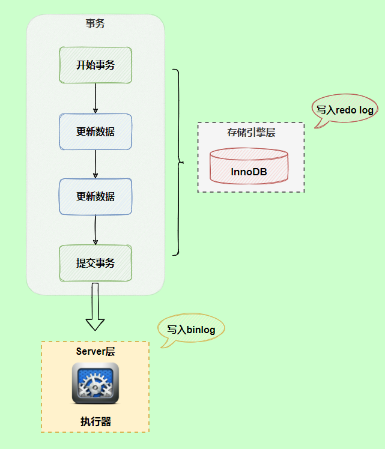

**redo log与binlog两份日志之间的逻辑不一致，会出现什么问题？**

以update语句为例，假设id=2的记录，字段c值是0，把字段c值更新成1，SQL语句为`update Tset c=1 where id=2`。

假设执行过程中写完redo log日志后，binlog日志写期间发生了异常，会出现什么情况呢?

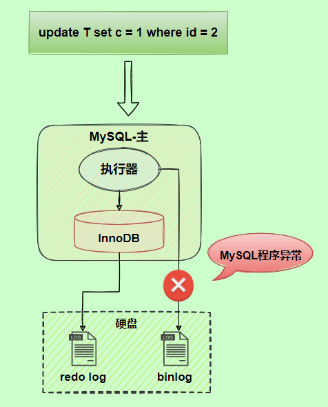

由于binlog没写完就异常，这时候binlog里面没有对应的修改记录。因此之后用binlog日志恢复数据时，就会少这一次更新，恢复出来的这一行c值是0，而原库因为redo log日志恢复，这一行c值是1，最终数据不一致。

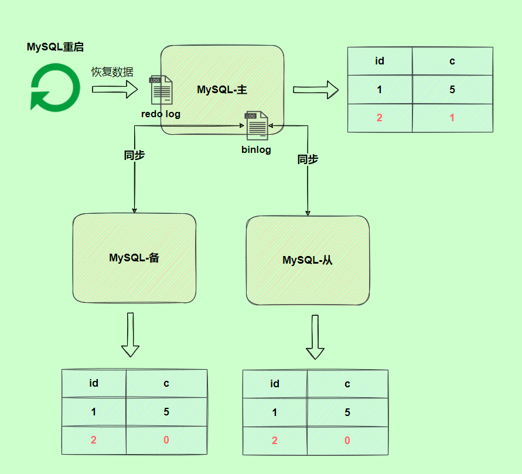

为了解决两份日志之间的逻辑一致问题，InnoDB存储引擎使用**两阶段提交**方案。原理很简单，将redo log的写入拆成了两个步骤prepare和commit，这就是**两阶段提交**。

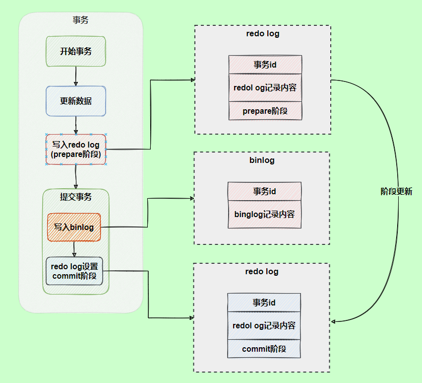

使用**两阶段提交**后，写入binlog时发生异常也不会有影响，因为MySQL根据redo log日志恢复数据时，发现redolog还处于prepare阶段，并且没有对应binlog日志，就会回滚该事务。

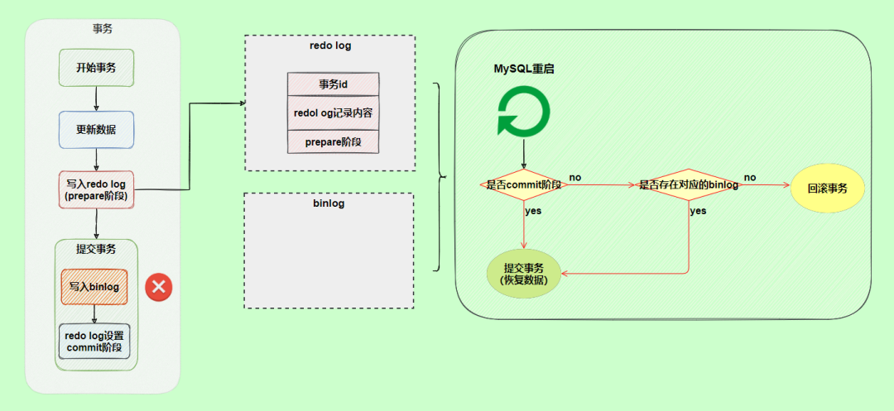

另一个场景，redo log设置commit阶段发生异常，那会不会回滚事务呢？

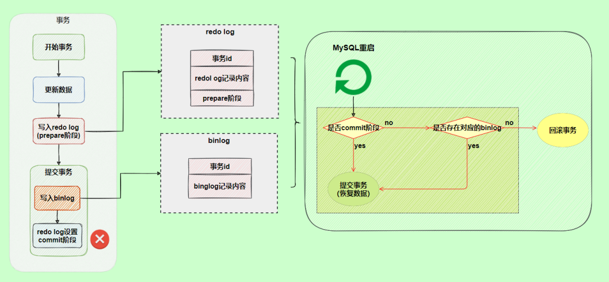

并不会回滚事务，它会执行上图框住的逻辑，虽然redo log是处于prepare阶段，但是能通过事务id找到对应的binlog日志，所以MySQL认为是完整的，就会提交事务恢复数据。


### 7 中继日志(relay log)

#### 7.1 介绍

**中继日志只在主从服务器架构的从服务器上存在**。从服务器为了与主服务器保持一致，要从主服务器读取二进制日志的内容，并且把读取到的信息写入`本地的日志文件`中，这个从服务器本地的日志文件就叫`中继日志`。然后，从服务器读取中继日志，并根据中继日志的内容对从服务器的数据进行更新，完成主
从服务器的`数据同步`。

搭建好主从服务器之后，中继日志默认会保存在从服务器的数据目录下。

文件名的格式是：`从服务器名 -relay-bin.序号`。中继日志还有一个索引文件：`从服务器名 -relay-bin.index`，用来定位当前正在使用的中继日志。


#### 7.2 查看中继日志

中继日志与二进制日志的格式相同，可以用`mysqlbinlog`工具进行查看。下面是中继日志的一个片段：

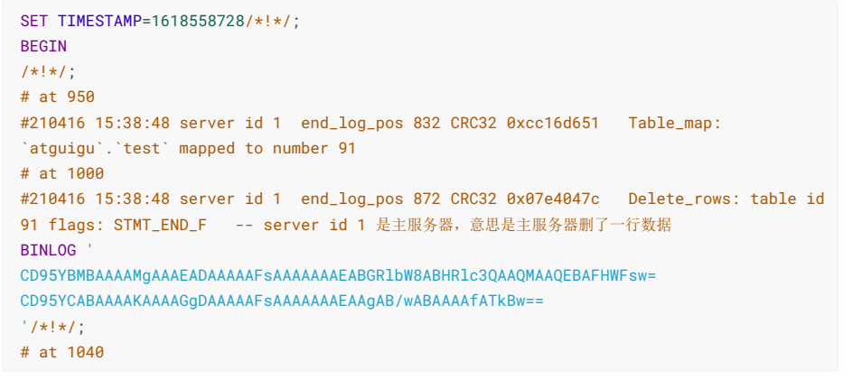

这一段的意思是，主服务器（“server id 1”）对表 atguigu.test 进行了 2 步操作：

```
定位到表 atguigu.test 编号是 91 的记录，日志位置是 832；
删除编号是 91 的记录，日志位置是 872。
```


#### 7.3 恢复的典型错误

如果从服务器宕机，有的时候为了系统恢复，要重装操作系统，这样就可能会导致你的`服务器名称`与之前`不同`。而中继日志里是`包含从服务器名`的。在这种情况下，就可能导致你恢复从服务器的时候，无法从宕机前的中继日志里读取数据，以为是日志文件损坏了，其实是名称不对了。

解决的方法也很简单，把从服务器的名称改回之前的名称。

------

## 十七、主从复制

### 1 主从复制概述

#### 1.1 如何提升数据库并发能力

在实际工作中，我们常常将`Redis`作为缓存与`MySQL`配合来使用，当有请求的时候，首先会从缓存中进行查找，如果存在就直接取出。如果不存在再访问数据库，这样就`提升了读取的效率`，也减少了对后端数据库的`访问压力`。Redis的缓存架构是`高并发架构`中非常重要的一环。

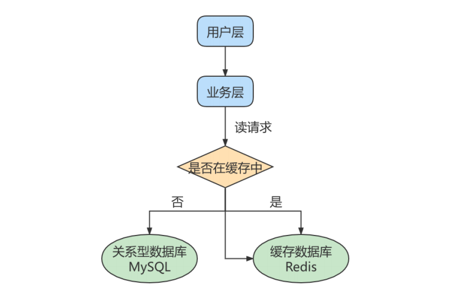

此外，一般应用对数据库而言都是“`读多写少`”，也就说对数据库读取数据的压力比较大，有一个思路就是采用数据库集群的方案，做`主从架构`、进行`读写分离`，这样同样可以提升数据库的并发处理能力。但并不是所有的应用都需要对数据库进行主从架构的设置，毕竟设置架构本身是有成本的。

如果我们的目的在于提升数据库高并发访问的效率，那么首先考虑的是如何`优化SQL和索引`，这种方式简单有效；其次才是采用`缓存的策略`，比如使用 Redis将热点数据保存在内存数据库中，提升读取的效率；最后才是对数据库采用`主从架构`，进行读写分离。

按照上面的方式进行优化，使用和维护的成本是由低到高的。


#### 1.2 主从复制的作用

主从同步设计不仅可以提高数据库的吞吐量，还有以下3个方面的作用。

**第1个作用：读写分离。**我们可以通过主从复制的方式来`同步数据`，然后通过读写分离提高数据库并发处理能力。

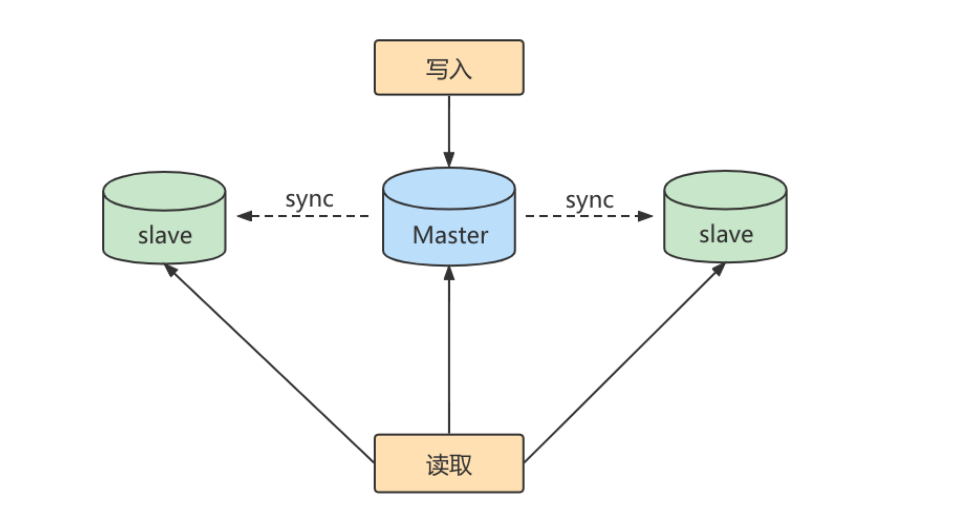

其中一个是Master主库，负责写入数据，我们称之为：写库。

其他都是Slave从库，负责读取数据，我们称之为：读库。

当主库进行更新的时候，会自动将数据复制到从库中，而我们在客户端读取数据的时候，会从从库进行读取。

面对“读多写少”的需求，采用读写分离的方式，可以实现`更高的并发访问`。同时，我们还能对从服务器进行`负载均衡`，让不同的读请求按照策略均匀地分发到不同的从服务器上，让`读取更加顺畅`。读取顺畅的另一个原因，就是`减少了锁表`的影响，比如我们让主库负责写，当主库出现写锁的时候，不会影响到从库进行SELECT的读取。

**第2个作用就是数据备份。**我们通过主从复制将主库上的数据复制到从库上，相当于一种`热备份机制`，也就是在主库正常运行的情况下进行的备份，不会影响到服务。

**第3个作用是具有高可用性。**数据备份实际上是一种冗余的机制，通过这种冗余的方式可以换取数据库的高可用性，也就是当服务器出现`故障`或`宕机`的情况下，可以`切换`到从服务器上，保证服务的正常运行。

关于高可用性的程度，我们可以用一个指标衡量，即正常可用时间/全年时间。比如要达到全年99.999%的时间都可用，就意味着系统在一年中的不可用时间不得超过`365 * 24 * 60 * (1 - 99.999%) = 5.256`分钟(含系统崩溃的时间、日常维护操作导致的停机时间等)，其他时间都需要保持可用的状态。

实际上，更高的高可用性，意味着需要付出更高的成本代价。在现实中我们需要结合业务需求和成本来进行选择。


### 2 主从复制的原理

`Slave`会从`Master`读取`binlog`来进行数据同步。

#### 2.1 原理剖析

**三个线程**

实际上主从同步的原理就是基于binlog进行数据同步的。在主从复制过程中，会基于`3个线程`来操作，一个主库线程，两个从库线程。

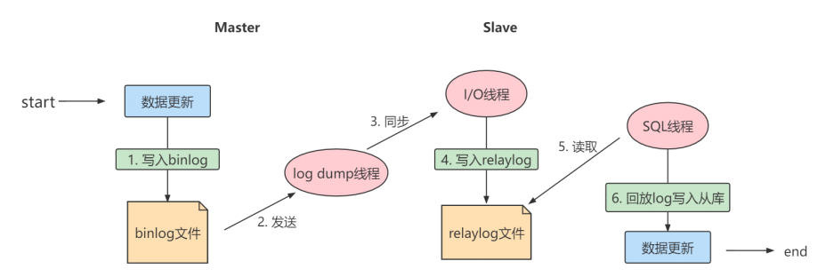

`二进制日志转储线程`（Binlog dump thread）是一个主库线程。当从库线程连接的时候，主库可以将二进制日志发送给从库，当主库读取事件（Event）的时候，会在 Binlog 上`加锁`，读取完成之后，再将锁释放掉。

`从库 I/O 线程`会连接到主库，向主库发送请求更新 Binlog。这时从库的 I/O 线程就可以读取到主库的二进制日志转储线程发送的 Binlog 更新部分，并且拷贝到本地的中继日志（Relay log）。

`从库 SQL 线程`会读取从库中的中继日志，并且执行日志中的事件，将从库中的数据与主库保持同步。

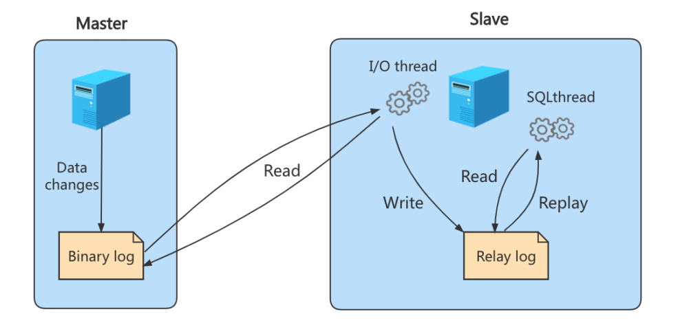

> 注意：
>
> 不是所有版本的MySQL都默认开启服务器的二进制日志。在进行主从同步的时候，我们需要先检查服务器是否已经开启了二进制日志。
>
> 除非特殊指定，默认情况下从服务器会执行所有主服务器中保存的事件。也可以通过配置，使从服务器执行特定的事件。

**复制三步骤**

步骤1：`Master`将写操作记录到二进制日志（`binlog`）。

步骤2：`Slave`将`Master`的binary log events拷贝到它的中继日志（`relay log`）；

步骤3：`Slave`重做中继日志中的事件，将改变应用到自己的数据库中。MySQL复制是异步的且串行化的，而且重启后从`接入点`开始复制。

**复制的问题**

复制的最大问题：`延时`


#### 2.2 复制的基本原则

- 每个`Slave`只有一个`Master`
- 每个`Slave`只能有一个唯一的服务器ID
- 每个`Master`可以有多个`Slave`


### 3 一主一从架构搭建

一台`主机`用于处理所有`写请求`，一台`从机`负责所有`读请求`，架构图如下：

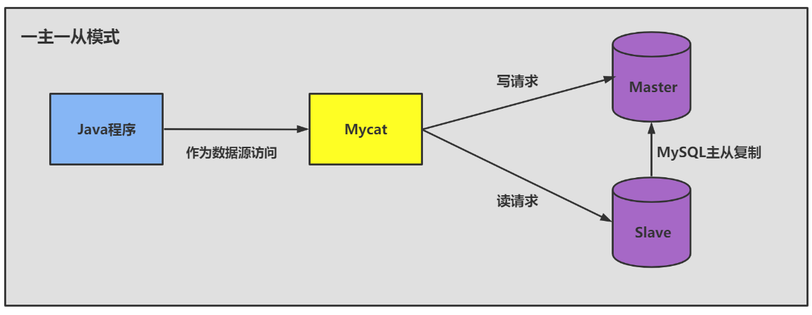


#### 3.1 准备工作

1. 准备`2台`CentOS虚拟机
2. 每台虚拟机上需要安装好MySQL(可以是MySQL8.0)

说明：前面我们讲过如何克隆一台CentOS。大家可以在一台CentOS上安装好MySQL，进而通过克隆的方式复制出1台包含MySQL的虚拟机。

注意：克隆的方式需要修改新克隆出来主机的：1、`MAC地址` 2、`hostname` 3、`IP地址` 4、`UUID`。

此外，克隆的方式生成的虚拟机（包含MySQL Server），则克隆的虚拟机MySQL Server的UUID相同，必须修改，否则在有些场景会报错。比如：`show slave status\G`，报如下的错误：

```
Last_IO_Error: Fatal error: The slave I/O thread stops because master and slave have
equal MySQL server UUIDs; these UUIDs must be different for replication to work.
```

修改MySQL Server的UUID方式：

```bash
vim /var/lib/mysql/auto.cnf

systemctl restart mysqld
```


#### 3.2 主机配置文件

建议mysql版本一致且后台以服务运行，主从所有配置项都配置在`[mysqld]`节点下，且都是小写字母。

具体参数配置如下：

- 必选

  ```ini
  #[必须]主服务器唯一ID
  server-id=1
  #[必须]启用二进制日志,指名路径。比如：自己本地的路径/log/mysqlbin
  log-bin=atguigu-bin
  ```

- 可选

  ```ini
  #[可选] 0（默认）表示读写（主机），1表示只读（从机）
  read-only=0
  
  #设置日志文件保留的时长，单位是秒
  binlog_expire_logs_seconds=6000
  
  #控制单个二进制日志大小。此参数的最大和默认值是1GB
  max_binlog_size=200M
  
  #[可选]设置不要复制的数据库
  binlog-ignore-db=test
  
  #[可选]设置需要复制的数据库,默认全部记录。比如：binlog-do-db=atguigu_master_slave
  binlog-do-db=需要复制的主数据库名字
  
  #[可选]设置binlog格式
  binlog_format=STATEMENT
  ```

重启后台mysql服务，使配置生效。

> 注意：
>
> 先搭建完主从复制，再创建数据库。
>
> MySQL主从复制起始时，从机不继承主机数据。


**binlog格式设置**：

**格式1**：`STATEMENT模式`（基于SQL语句的复制(statement-based replication, SBR)）

```ini
binlog_format=STATEMENT
```

每一条会修改数据的sql语句会记录到binlog中。这是默认的binlog格式。

- SBR 的优点：
  - 历史悠久，技术成熟
  - 不需要记录每一行的变化，减少了binlog日志量，文件较小
  - binlog中包含了所有数据库更改信息，可以据此来审核数据库的安全等情况
  - binlog可以用于实时的还原，而不仅仅用于复制
  - 主从版本可以不一样，从服务器版本可以比主服务器版本高
- SBR 的缺点：
  - 不是所有的UPDATE语句都能被复制，尤其是包含不确定操作的时候
- 使用以下函数的语句也无法被复制：LOAD_FILE()、UUID()、USER()、FOUND_ROWS()、SYSDATE() (除非启动时启用了 --sysdate-is-now 选项)
  - INSERT ... SELECT 会产生比 RBR 更多的行级锁
  - 复制需要进行全表扫描(WHERE语句中没有使用到索引)的 UPDATE 时，需要比 RBR 请求更多的行级锁
  - 对于有 AUTO_INCREMENT 字段的 InnoDB表而言，INSERT 语句会阻塞其他 INSERT 语句
  - 对于一些复杂的语句，在从服务器上的耗资源情况会更严重，而 RBR 模式下，只会对那个发生变化的记录产生影响
  - 执行复杂语句如果出错的话，会消耗更多资源
  - 数据表必须几乎和主服务器保持一致才行，否则可能会导致复制出错


**格式2**：`ROW模式`（基于行的复制(row-based replication, RBR)）

```ini
binlog_format=ROW
```

5.1.5版本的MySQL才开始支持，不记录每条sql语句的上下文信息，仅记录哪条数据被修改了，修改成什么样了。

- RBR 的优点：
  - 任何情况都可以被复制，这对复制来说是最`安全可靠`的。（比如：不会出现某些特定情况下的存储过程、function、trigger的调用和触发无法被正确复制的问题）
  - 多数情况下，从服务器上的表如果有主键的话，复制就会快了很多
  - 复制以下几种语句时的行锁更少：INSERT ... SELECT、包含 AUTO_INCREMENT 字段的 INSERT、没有附带条件或者并没有修改很多记录的 UPDATE 或 DELETE 语句
  - 执行 INSERT，UPDATE，DELETE 语句时锁更少
  - 从服务器上采用`多线程`来执行复制成为可能
- RBR 的缺点：
  - binlog 大了很多
  - 复杂的回滚时 binlog 中会包含大量的数据
  - 主服务器上执行 UPDATE 语句时，所有发生变化的记录都会写到 binlog 中，而 SBR 只会写一次，这会导致频繁发生 binlog 的并发写问题
  - 无法从 binlog 中看到都复制了些什么语句


**格式3**：`MIXED模式`（混合模式复制(mixed-based replication, MBR)）

```ini
binlog_format=MIXED
```

从5.1.8版本开始，MySQL提供了Mixed格式，实际上就是Statement与Row的结合。

在Mixed模式下，一般的语句修改使用statment格式保存binlog。如一些函数，statement无法完成主从复制的操作，则采用row格式保存binlog。

MySQL会根据执行的每一条具体的sql语句来区分对待记录的日志形式，也就是在Statement和Row之间选择一种。


#### 3.3 从机配置文件

要求主从所有配置项都配置在`my.cnf`的`[mysqld]`栏位下，且都是小写字母。

- 必选

  ```ini
  #[必须]从服务器唯一ID
  server-id=2
  ```

- 可选

  ```mysql
  #[可选]启用中继日志
  relay-log=mysql-relay
  ```

重启后台mysql服务，使配置生效。

> 注意：主从机都关闭防火墙
>
> service iptables stop #CentOS 6
>
> systemctl stop firewalld.service #CentOS 7


#### 3.4 主机：建立账户并授权

```mysql
#在主机MySQL里执行授权主从复制的命令
GRANT REPLICATION SLAVE ON *.* TO 'slave1'@'从机器数据库IP' IDENTIFIED BY 'abc123'; #MySQL5.5, MySQL5.7
```

**注意：如果使用的是MySQL8，需要如下的方式建立账户，并授权slave**：

```mysql
CREATE USER 'slave1'@'%' IDENTIFIED BY '123456';

GRANT REPLICATION SLAVE ON *.* TO 'slave1'@'%';

#此语句必须执行。否则见下面。
ALTER USER 'slave1'@'%' IDENTIFIED WITH mysql_native_password BY '123456';

flush privileges;
```

> 注意：在从机执行show slave status\G时报错：
>
> Last_IO_Error: error connecting to master 'slave1@192.168.1.150:3306' - retry-time: 60 retries: 1 message: Authentication plugin 'caching_sha2_password' reported error: Authentication requires
> secure connection.

查询Master的状态，并记录下File和Position的值。

```mysql
show master status;
```

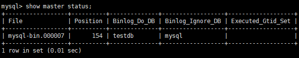

- 记录下File和Position的值


> 注意：执行完此步骤后**不要再操作主服务器MySQL**，防止主服务器状态值变化。


#### 3.5 从机：配置需要复制的主机

**步骤1**：从机上复制主机的命令

```mysql
CHANGE MASTER TO
MASTER_HOST='主机的IP地址',
MASTER_USER='主机用户名',
MASTER_PASSWORD='主机用户名的密码',
MASTER_LOG_FILE='mysql-bin.具体数字',
MASTER_LOG_POS=具体值;
```

**举例**：

```mysql
CHANGE MASTER TO
MASTER_HOST='192.168.1.150',
MASTER_USER='slave1',
MASTER_PASSWORD='123456',
MASTER_LOG_FILE='mysql-bin.000007',
MASTER_LOG_POS=154;
```

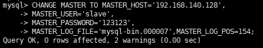

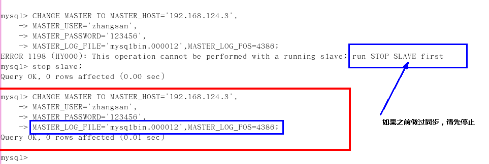

**步骤2**：

```mysql
#启动slave同步
START SLAVE;
```

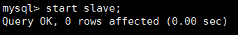

如果报错：

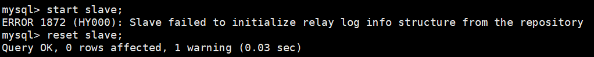

可以执行如下操作，删除之前的relay_log信息。然后重新执行 CHANGE MASTER TO ...语句即可。

```mysql
reset slave; #删除SLAVE数据库的relaylog日志文件，并重新启用新的relaylog文件
```

接着，查看同步状态：

```mysql
SHOW SLAVE STATUS\G;
```

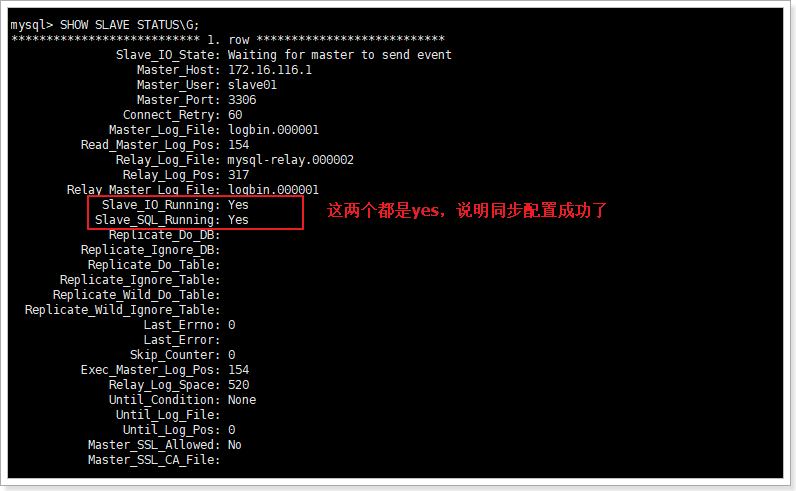

> 上面两个参数都是Yes，则说明主从配置成功！

显式如下的情况，就是不正确的。可能错误的原因有：

1. 网络不通
2. 账户密码错误
3. 防火墙
4. mysql配置文件问题
5. 连接服务器时语法
6. 主服务器mysql权限

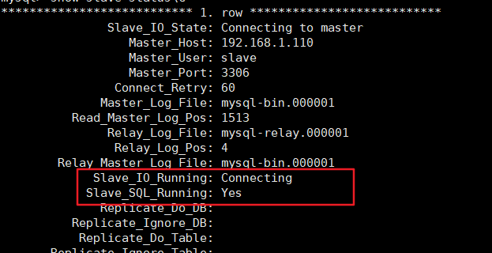


#### 3.6 测试

主机新建库、新建表、insert记录，从机复制：

```mysql
CREATE DATABASE atguigu_master_slave;

CREATE TABLE mytbl(id INT,NAME VARCHAR(16));

INSERT INTO mytbl VALUES(1, 'zhang3');

INSERT INTO mytbl VALUES(2,@@hostname);
```


#### 3.7 停止主从同步

- 停止主从同步命令：

  ```mysql
  stop slave;
  ```

- 如何重新配置主从

  如果停止从服务器复制功能，再使用需要重新配置主从。否则会报错如下：

  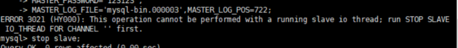

  重新配置主从，需要在从机上执行：

  ```mysql
  stop slave;
  
  reset master; #删除Master中所有的binglog文件，并将日志索引文件清空，重新开始所有新的日志文件(慎用)
  ```


#### 3.8 后续

**搭建主从复制：双主双从**

一个主机m1用于处理所有写请求，它的从机s1和另一台主机m2还有它的从机s2负责所有读请求。当m1主机宕机后，m2主机负责写请求，m1、m2互为备机。结构图如下：


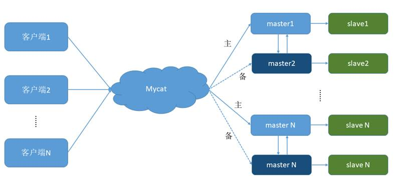


### 4 同步数据一致性问题

**主从同步的要求**：

- 读库和写库的数据一致(最终一致)；
- 写数据必须写到写库；
- 读数据必须到读库(不一定)；


#### 4.1 理解主从延迟问题

进行主从同步的内容是二进制日志，它是一个文件，在进行`网络传输`的过程中就一定会`存在主从延迟`（比如 500ms），这样就可能造成用户在从库上读取的数据不是最新的数据，也就是主从同步中的`数据不一致性`问题。

**举例**：导致主从延迟的时间点主要包括以下三个:

1. 主库A执行完成一个事务，写入binlog，我们把这个时刻记为T1；
2. 之后传给从库B，我们把从库B接收完这个binlog的时刻记为T2；
3. 从库B执行完成这个事务，我们把这个时刻记为T3。


#### 4.2 主从延迟问题原因

在网络正常的时候，日志从主库传给从库所需的时间是很短的，即T2-T1的值是非常小的。即，网络正常情况下，主备延迟的主要来源是备库接收完binlog和执行完这个事务之间的时间差。

**主备延迟最直接的表现是，从库消费中继日志（relay log）的速度，比主库生产binlog的速度要慢**。造成原因：

1. 从库的机器性能比主库要差
2. 从库的压力大
3. 大事务的执行

**举例1**：一次性用delete语句删除太多数据

结论：后续再删除数据的时候，要控制每个事务删除的数据量，分成多次删除。

**举例2**：一次性用insert...select插入太多数据

**举例3**：大表DDL

比如在主库对一张500W的表添加一个字段耗费了10分钟，那么从节点上也会耗费10分钟。


#### 4.3 如何减少主从延迟

若想要减少主从延迟的时间，可以采取下面的办法：

1. 降低多线程大事务并发的概率，优化业务逻辑
2. 优化SQL，避免慢SQL，`减少批量操作`，建议写脚本以update-sleep这样的形式完成。
3. `提高从库机器的配置`，减少主库写binlog和从库读binlog的效率差。
4. 尽量采用`短的链路`，也就是主库和从库服务器的距离尽量要短，提升端口带宽，减少binlog传输的网络延时。
5. 实时性要求的业务读强制走主库，从库只做灾备，备份。


#### 4.4 如何解决一致性问题

如果操作的数据存储在同一个数据库中，那么对数据进行更新的时候，可以对记录加写锁，这样在读取的时候就不会发生数据不一致的情况。但这时从库的作用就是`备份`，并没有起到`读写分离`，分担主库`读压力`的作用。

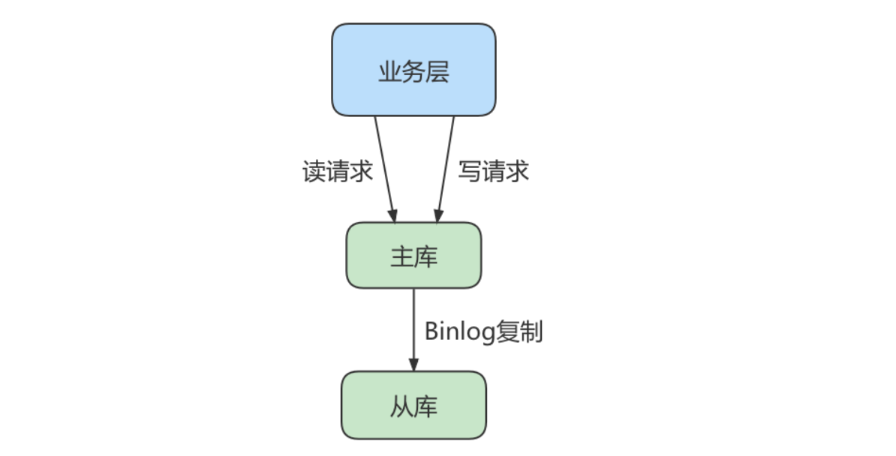

读写分离情况下，解决主从同步中数据不一致的问题，就是解决主从之间`数据复制方式`的问题，如果按照数据一致性`从弱到强`来进行划分，有以下3种复制方式。

**方法1：异步复制**

异步模式就是客户端提交 COMMIT 之后不需要等从库返回任何结果，而是直接将结果返回给客户端，这样做的好处是不会影响主库写的效率，但可能会存在主库宕机，而Binlog还没有同步到从库的情况，也就是此时的主库和从库数据不一致。这时候从从库中选择一个作为新主，那么新主则可能缺少原来主服务器中已提交的事务。所以，这种复制模式下的数据一致性是最弱的。

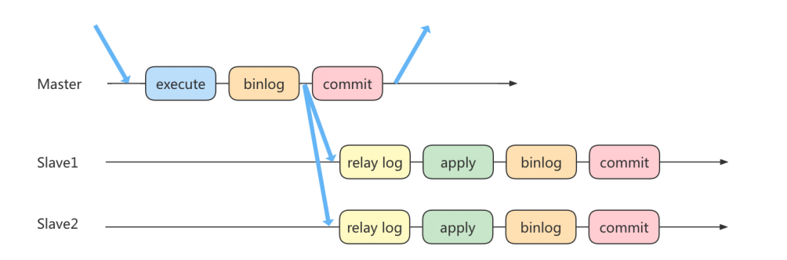

**方法2：半同步复制**

MySQL5.5版本之后开始支持半同步复制的方式。原理是在客户端提交 COMMIT 之后不直接将结果返回给客户端，而是等待至少有一个从库接收到了Binlog，并且写入到中继日志中，再返回给客户端。

这样做的好处就是提高了数据的一致性，当然相比于异步复制来说，至少多增加了一个网络连接的延迟，降低了主库写的效率。

在MySQL5.7版本中还增加了一个`rpl_semi_sync_master_wait_for_slave_count`参数，可以对应答的从库数量进行设置，默认为1，也就是说只要有1个从库进行了响应，就可以返回给客户端。如果将这个参数调大，可以提升数据一致性的强度，但也会增加主库等待从库响应的时间。

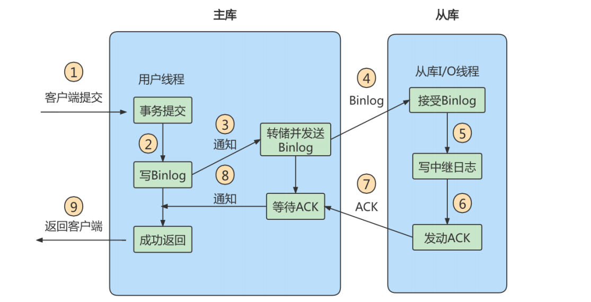

**方法3：组复制**

异步复制和半同步复制都无法最终保证数据的一致性问题，半同步复制是通过判断从库响应的个数来决定是否返回给客户端，虽然数据一致性相比于异步复制有提升，但仍然无法满足对数据一致性要求高的场景，比如金融领域。MGR很好地弥补了这两种复制模式的不足。

组复制技术，简称MGR（MySQL Group Replication）。是 MySQL 在 5.7.17 版本中推出的一种新的数据复制技术，这种复制技术是基于 Paxos 协议的状态机复制。

**MGR 是如何工作的**

首先我们将多个节点共同组成一个复制组，在`执行读写（RW）事务`的时候，需要通过一致性协议层（Consensus 层）的同意，也就是读写事务想要进行提交，必须要经过组里“大多数人”（对应 Node 节点）的同意，大多数指的是同意的节点数量需要大于（N/2+1），这样才可以进行提交，而不是原发起方一个说了算。而针对`只读（RO）事务`则不需要经过组内同意，直接 COMMIT 即可。

在一个复制组内有多个节点组成，它们各自维护了自己的数据副本，并且在一致性协议层实现了原子消息和全局有序消息，从而保证组内数据的一致性。

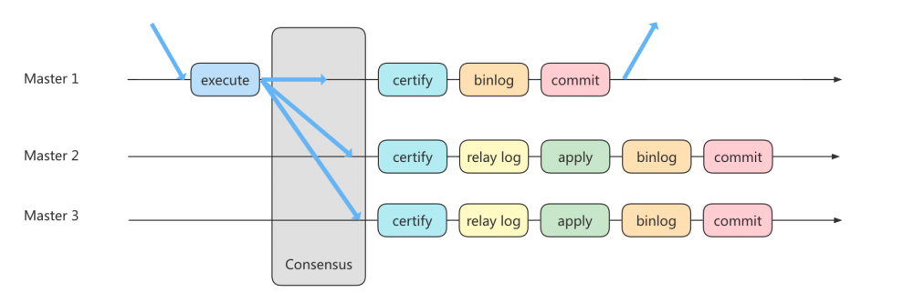

MGR 将 MySQL 带入了数据强一致性的时代，是一个划时代的创新，其中一个重要的原因就是MGR是基于 Paxos 协议的。Paxos 算法是由 2013 年的图灵奖获得者 Leslie Lamport 于 1990 年提出的，有关这个算法的决策机制可以搜一下。事实上，Paxos 算法提出来之后就作为`分布式一致性算法`被广泛应用，比如
Apache 的 ZooKeeper 也是基于 Paxos 实现的。


### 5 知识延伸

在主从架构的配置中，如果想要采取读写分离的策略，我们可以`自己编写程序`，也可以通过`第三方的中间件`来实现。

- 自己编写程序的好处就在于比较自主，我们可以自己判断哪些查询在从库上来执行，针对实时性要求高的需求，我们还可以考虑哪些查询可以在主库上执行。同时，程序直接连接数据库，减少了中间件层，相当于减少了性能损耗。

- 采用中间件的方法有很明显的优势，`功能强大，使用简单`。但因为在客户端和数据库之间增加了中间件层会有一些`性能损耗`，同时商业中间件也是有使用成本的。我们也可以考虑采取一些优秀的开源工具。

  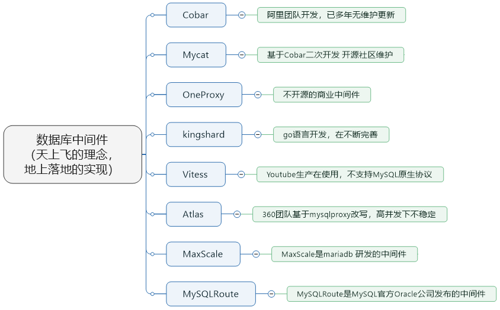

  1. `Cobar`属于阿里B2B事业群，始于2008年，在阿里服役3年多，接管3000+个MySQL数据库的schema，集群日处理在线SQL请求50亿次以上。由于Cobar发起人的离职，Cobar停止维护。
  2. `Mycat`是开源社区在阿里cobar基础上进行二次开发，解决了cobar存在的问题，并且加入了许多新的功能在其中。青出于蓝而胜于蓝。
  3. `OneProxy`基于MySQL官方的proxy思想利用c语言进行开发的，OneProxy是一款商业`收费`的中间件。舍弃了一些功能，专注在`性能和稳定性上`。
  4. `kingshard`由小团队用go语言开发，还需要发展，需要不断完善。
  5. `Vitess`是Youtube生产在使用，架构很复杂。不支持MySQL原生协议，使用`需要大量改造成本`。
  6. `Atlas`是360团队基于mysql proxy改写，功能还需完善，高并发下不稳定。
  7. `MaxScale`是mariadb（MySQL原作者维护的一个版本）研发的中间件
  8. `MySQLRoute`是MySQL官方Oracle公司发布的中间件


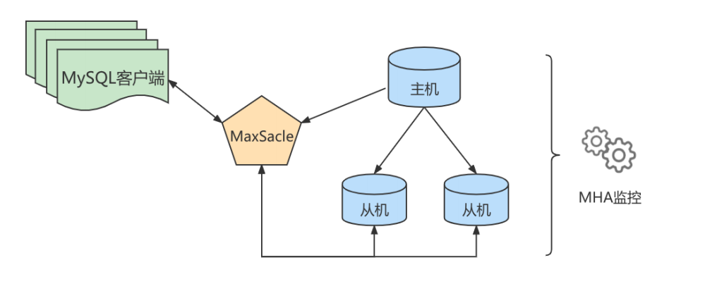


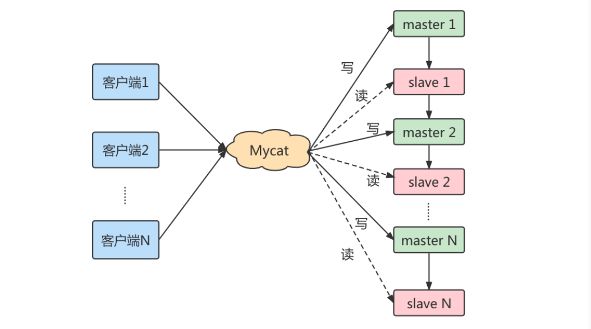


主备切换：

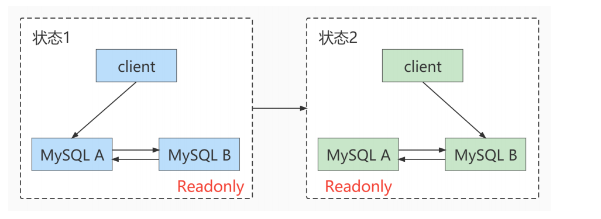

- 主动切换
- 被动切换
- 如何判断主库出问题了？如何解决过程中的数据不一致性问题？

------

## 十八、数据库备份与恢复

在任何数据库环境中，总会有`不确定的意外`情况发生，比如例外的停电、计算机系统中的各种软硬件故障、人为破坏、管理员误操作等是不可避免的，这些情况可能会导致`数据的丢失`、`服务器瘫痪`等严重的后果。存在多个服务器时，会出现主从服务器之间的`数据同步问题`。

为了有效防止数据丢失，并将损失降到最低，应`定期`对MySQL数据库服务器做`备份`。如果数据库中的数据丢失或者出现错误，可以使用备份的数据`进行恢复`。主从服务器之间的数据同步问题可以通过复制功能实现。


### 1 物理备份与逻辑备份

**物理备份**：备份数据文件，转储数据库物理文件到某一目录。物理备份恢复速度比较快，但占用空间比较大，MySQL中可以用`xtrabackup`工具来进行物理备份。

**逻辑备份**：对数据库对象利用工具进行导出工作，汇总入备份文件内。逻辑备份恢复速度慢，但占用空间小，更灵活。MySQL中常用的逻辑备份工具为`mysqldump`。逻辑备份就是`备份sql语句`，在恢复的时候执行备份的sql语句实现数据库数据的重现。


### 2 mysqldump实现逻辑备份

mysqldump是MySQL提供的一个非常有用的数据库备份工具。

#### 2.1 备份一个数据库

mysqldump命令执行时，可以将数据库备份成一个`文本文件`，该文件中实际上包含多个`CREATE`和`INSERT`语句，使用这些语句可以重新创建表和插入数据。

* 查出需要备份的表的结构，在文本文件中生成一个CREATE语句，
* 将表中的所有记录转换为一条INSERT语句。

**基本语法**：

```bash
mysqldump –u用户名称 –h主机名称 –p密码 待备份的数据库名称[tbname, [tbname...]] > 备份文件名称.sql
```

> 说明：
>
> 备份的文件并非一定要求后缀名为.sql，例如后缀名为.txt的文件也是可以的。

**举例**：使用root用户备份atguigu数据库：

```bash
mysqldump -uroot -p atguigu > atguigu.sql #备份文件存储在当前目录下
```

```bash
mysqldump -uroot -p atguigudb1 > /var/lib/mysql/atguigu.sql
```

**备份文件剖析**：

```mysql
-- MySQL dump 10.13 Distrib 8.0.26, for Linux (x86_64)
--
-- Host: localhost Database: atguigu
-- ------------------------------------------------------
-- Server version 8.0.26

/*!40101 SET @OLD_CHARACTER_SET_CLIENT=@@CHARACTER_SET_CLIENT */;
/*!40101 SET @OLD_CHARACTER_SET_RESULTS=@@CHARACTER_SET_RESULTS */;
/*!40101 SET @OLD_COLLATION_CONNECTION=@@COLLATION_CONNECTION */;
/*!50503 SET NAMES utf8mb4 */;
/*!40103 SET @OLD_TIME_ZONE=@@TIME_ZONE */;
/*!40103 SET TIME_ZONE='+00:00' */;
/*!40014 SET @OLD_UNIQUE_CHECKS=@@UNIQUE_CHECKS, UNIQUE_CHECKS=0 */;
/*!40014 SET @OLD_FOREIGN_KEY_CHECKS=@@FOREIGN_KEY_CHECKS, FOREIGN_KEY_CHECKS=0 */;
/*!40101 SET @OLD_SQL_MODE=@@SQL_MODE, SQL_MODE='NO_AUTO_VALUE_ON_ZERO' */;
/*!40111 SET @OLD_SQL_NOTES=@@SQL_NOTES, SQL_NOTES=0 */;

--
-- Current Database: `atguigu`
--

CREATE DATABASE /*!32312 IF NOT EXISTS*/ `atguigu` /*!40100 DEFAULT CHARACTER SET
utf8mb4 COLLATE utf8mb4_0900_ai_ci */ /*!80016 DEFAULT ENCRYPTION='N' */;

USE `atguigu`;

--
-- Table structure for table `student`
--

DROP TABLE IF EXISTS `student`;
/*!40101 SET @saved_cs_client = @@character_set_client */;
/*!50503 SET character_set_client = utf8mb4 */;
CREATE TABLE `student` (
	`studentno` int NOT NULL,
	`name` varchar(20) DEFAULT NULL,
	`class` varchar(20) DEFAULT NULL,
	PRIMARY KEY (`studentno`)
) ENGINE=InnoDB DEFAULT CHARSET=utf8mb3;
/*!40101 SET character_set_client = @saved_cs_client */;
INSERT INTO `student` VALUES (1,'张三_back','一班'),(3,'李四','一班'),(8,'王五','二班'),
(15,'赵六','二班'),(20,'钱七','>三班'),(22,'zhang3_update','1ban'),(24,'wang5','2ban');
/*!40000 ALTER TABLE `student` ENABLE KEYS */;
UNLOCK TABLES;
	.
	.
	.
	.
/*!40101 SET SQL_MODE=@OLD_SQL_MODE */;
/*!40014 SET FOREIGN_KEY_CHECKS=@OLD_FOREIGN_KEY_CHECKS */;
/*!40014 SET UNIQUE_CHECKS=@OLD_UNIQUE_CHECKS */;
/*!40101 SET CHARACTER_SET_CLIENT=@OLD_CHARACTER_SET_CLIENT */;
/*!40101 SET CHARACTER_SET_RESULTS=@OLD_CHARACTER_SET_RESULTS */;
/*!40101 SET COLLATION_CONNECTION=@OLD_COLLATION_CONNECTION */;
/*!40111 SET SQL_NOTES=@OLD_SQL_NOTES */;
-- Dump completed on 2022-01-07 9:58:23
```


#### 2.2 备份全部数据库

若想用mysqldump备份整个实例，可以使用`--all-databases`或`-A`参数：

```bash
mysqldump -uroot -p --all-databases > all_database.sql
# 或者
mysqldump -uroot -p -A > all_database.sql
```


#### 2.3 备份部分数据库

使用`--databases`或`-B`参数了，该参数后面跟数据库名称，多个数据库间用空格隔开。如果指定databases参数，备份文件中会存在创建数据库的语句，如果不指定参数，则不存在。语法如下：

```bash
mysqldump –u user –h host –p --databases [数据库的名称1 [数据库的名称2...]] > 备份文件名称.sql
```

**举例**：

```bash
mysqldump -uroot -p --databases atguigu atguigu12 > two_database.sql
```

或

```bash
mysqldump -uroot -p -B atguigu atguigu12 > two_database.sql
```


#### 2.4 备份部分表

比如，在表变更前做个备份。语法如下：

```bash
mysqldump –u user –h host –p 数据库的名称 [表名1 [表名2...]] > 备份文件名称.sql
```

**举例**：备份atguigu数据库下的book表

```bash
mysqldump -uroot -p atguigu book > book.sql
```

book.sql文件内容如下：

```mysql
[root@node1 ~]# ls
kk kubekey kubekey-v1.1.1-linux-amd64.tar.gz README.md test1.sql two_database.sql
[root@node1 ~]# mysqldump -uroot -p atguigu book> book.sql
Enter password:
[root@node1 ~]# ls
book.sql kk kubekey kubekey-v1.1.1-linux-amd64.tar.gz README.md test1.sql two_database.sql
[root@node1 ~]# vi book.sql
-- MySQL dump 10.13 Distrib 8.0.26, for Linux (x86_64)
--
-- Host: localhost Database: atguigu
-- ------------------------------------------------------
-- Server version 8.0.26

/*!40101 SET @OLD_CHARACTER_SET_CLIENT=@@CHARACTER_SET_CLIENT */;
/*!40101 SET @OLD_CHARACTER_SET_RESULTS=@@CHARACTER_SET_RESULTS */;
/*!40101 SET @OLD_COLLATION_CONNECTION=@@COLLATION_CONNECTION */;
/*!50503 SET NAMES utf8mb4 */;
/*!40103 SET @OLD_TIME_ZONE=@@TIME_ZONE */;
/*!40103 SET TIME_ZONE='+00:00' */;
/*!40014 SET @OLD_UNIQUE_CHECKS=@@UNIQUE_CHECKS, UNIQUE_CHECKS=0 */;
/*!40014 SET @OLD_FOREIGN_KEY_CHECKS=@@FOREIGN_KEY_CHECKS, FOREIGN_KEY_CHECKS=0 */;
/*!40101 SET @OLD_SQL_MODE=@@SQL_MODE, SQL_MODE='NO_AUTO_VALUE_ON_ZERO' */;
/*!40111 SET @OLD_SQL_NOTES=@@SQL_NOTES, SQL_NOTES=0 */;

--
-- Table structure for table `book`
--

DROP TABLE IF EXISTS `book`;
/*!40101 SET @saved_cs_client = @@character_set_client */;
/*!50503 SET character_set_client = utf8mb4 */;
CREATE TABLE `book` (
	`bookid` int unsigned NOT NULL AUTO_INCREMENT,
	`card` int unsigned NOT NULL,
	`test` varchar(255) COLLATE utf8_bin DEFAULT NULL,
	PRIMARY KEY (`bookid`),
	KEY `Y` (`card`)
) ENGINE=InnoDB AUTO_INCREMENT=101 DEFAULT CHARSET=utf8mb3 COLLATE=utf8_bin;
/*!40101 SET character_set_client = @saved_cs_client */;

--
-- Dumping data for table `book`
--

LOCK TABLES `book` WRITE;
/*!40000 ALTER TABLE `book` DISABLE KEYS */;
INSERT INTO `book` VALUES (1,9,NULL),(2,10,NULL),(3,4,NULL),(4,8,NULL),(5,7,NULL),
(6,10,NULL),(7,11,NULL),(8,3,NULL),(9,1,NULL),(10,17,NULL),(11,19,NULL),(12,4,NULL),
(13,1,NULL),(14,14,NULL),(15,5,NULL),(16,5,NULL),(17,8,NULL),(18,3,NULL),(19,12,NULL),
(20,11,NULL),(21,9,NULL),(22,20,NULL),(23,13,NULL),(24,3,NULL),(25,18,NULL),
(26,20,NULL),(27,5,NULL),(28,6,NULL),(29,15,NULL),(30,15,NULL),(31,12,NULL),
(32,11,NULL),(33,20,NULL),(34,5,NULL),(35,4,NULL),(36,6,NULL),(37,17,NULL),
(38,5,NULL),(39,16,NULL),(40,6,NULL),(41,18,NULL),(42,12,NULL),(43,6,NULL),
(44,12,NULL),(45,2,NULL),(46,12,NULL),(47,15,NULL),(48,17,NULL),(49,2,NULL),
(50,16,NULL),(51,13,NULL),(52,17,NULL),(53,7,NULL),(54,2,NULL),(55,9,NULL),
(56,1,NULL),(57,14,NULL),(58,7,NULL),(59,15,NULL),(60,12,NULL),(61,13,NULL),
(62,8,NULL),(63,2,NULL),(64,6,NULL),(65,2,NULL),(66,12,NULL),(67,12,NULL),(68,4,NULL),
(69,5,NULL),(70,10,NULL),(71,16,NULL),(72,8,NULL),(73,14,NULL),(74,5,NULL),
(75,4,NULL),(76,3,NULL),(77,2,NULL),(78,2,NULL),(79,2,NULL),(80,3,NULL),(81,8,NULL),
(82,14,NULL),(83,5,NULL),(84,4,NULL),(85,2,NULL),(86,20,NULL),(87,12,NULL),
(88,1,NULL),(89,8,NULL),(90,18,NULL),(91,3,NULL),(92,3,NULL),(93,6,NULL),(94,1,NULL),
(95,4,NULL),(96,17,NULL),(97,15,NULL),(98,1,NULL),(99,20,NULL),(100,15,NULL);
/*!40000 ALTER TABLE `book` ENABLE KEYS */;
UNLOCK TABLES;
/*!40103 SET TIME_ZONE=@OLD_TIME_ZONE */;
```

可以看到，book文件和备份的库文件类似。不同的是，book文件只包含book表的DROP、CREATE和INSERT语句。

备份多张表使用下面的命令，比如备份book和account表：

```bash
#备份多张表
mysqldump -uroot -p atguigu book account > 2_tables_bak.sql
```


#### 2.5 备份单表的部分数据

有些时候一张表的数据量很大，我们只需要部分数据。这时就可以使用`--where`选项了。where后面附带需要满足的条件。

**举例**：备份student表中id小于10的数据：

```bash
mysqldump -uroot -p atguigu student --where="id < 10 " > student_part_id10_low_bak.sql
```

内容如下所示，insert语句只有id小于10的部分

```mysql
LOCK TABLES `student` WRITE;
/*!40000 ALTER TABLE `student` DISABLE KEYS */;
INSERT INTO `student` VALUES (1,100002,'JugxTY',157,280),(2,100003,'QyUcCJ',251,277),
(3,100004,'lATUPp',80,404),(4,100005,'BmFsXI',240,171),(5,100006,'mkpSwJ',388,476),
(6,100007,'ujMgwN',259,124),(7,100008,'HBJTqX',429,168),(8,100009,'dvQSQA',61,504),
(9,100010,'HljpVJ',234,185);
```


#### 2.6 排除某些表的备份

如果我们想备份某个库，但是某些表数据量很大或者与业务关联不大，这个时候可以考虑排除掉这些表，同样的，选项`--ignore-table`可以完成这个功能。

```bash
mysqldump -uroot -p atguigu --ignore-table=atguigu.student > no_stu_bak.sql
```

通过如下指定判定文件中没有student表结构：

```bash
grep "student" no_stu_bak.sql
```


#### 2.7 只备份结构或只备份数据

- 只备份结构：只备份结构的话可以使用`--no-data`简写为`-d`选项；

  ```bash
  mysqldump -uroot -p atguigu --no-data > atguigu_no_data_bak.sql
  #使用grep命令，没有找到insert相关语句，表示没有数据备份。
  [root@node1 ~]# grep "INSERT" atguigu_no_data_bak.sql
  [root@node1 ~]#
  ```

- 只备份数据：只备份数据可以使用`--no-create-info`简写为`-t`选项。

  ```mysql
  mysqldump -uroot -p atguigu --no-create-info > atguigu_no_create_info_bak.sql
  #使用grep命令，没有找到create相关语句，表示没有数据结构。
  [root@node1 ~]# grep "CREATE" atguigu_no_create_info_bak.sql
  [root@node1 ~]#
  ```


#### 2.8 备份中包含存储过程、函数、事件

mysqldump备份默认是不包含存储过程，自定义函数及事件的。可以使用`--routines`或`-R`选项来备份存储过程及函数，使用`--events`或`-E`参数来备份事件。

**举例**：备份整个atguigu库，包含存储过程及事件：

- 使用下面的SQL可以查看当前库有哪些存储过程或者函数

  ```mysql
  SELECT SPECIFIC_NAME, ROUTINE_TYPE, ROUTINE_SCHEMA 
  FROM information_schema.Routines 
  WHERE ROUTINE_SCHEMA="atguigu";
  +---------------+--------------+----------------+
  | SPECIFIC_NAME | ROUTINE_TYPE | ROUTINE_SCHEMA |
  +---------------+--------------+----------------+
  | rand_num      | FUNCTION     | atguigu        |
  | rand_string   | FUNCTION     | atguigu        |
  | BatchInsert   | PROCEDURE    | atguigu        |
  | insert_class  | PROCEDURE    | atguigu        |
  | insert_order  | PROCEDURE    | atguigu        |
  | insert_stu    | PROCEDURE    | atguigu        |
  | insert_user   | PROCEDURE    | atguigu        |
  | ts_insert     | PROCEDURE    | atguigu        |
  +---------------+--------------+----------------+
  9 rows in set (0.02 sec)
  ```

- 下面备份atguigu库的数据，函数以及存储过程。

  ```bash
  mysqldump -uroot -p -R -E --databases atguigu > fun_atguigu_bak.sql
  ```

- 查询备份文件中是否存在函数，如下所示，可以看到确实包含了函数。

  ```mysql
  grep -C 5 "rand_num" fun_atguigu_bak.sql
  --
  
  
  --
  -- Dumping routines for database 'atguigu'
  --
  /*!50003 DROP FUNCTION IF EXISTS `rand_num` */;
  /*!50003 SET @saved_cs_client = @@character_set_client */ ;
  /*!50003 SET @saved_cs_results = @@character_set_results */ ;
  /*!50003 SET @saved_col_connection = @@collation_connection */ ;
  /*!50003 SET character_set_client = utf8mb3 */ ;
  /*!50003 SET character_set_results = utf8mb3 */ ;
  /*!50003 SET collation_connection = utf8_general_ci */ ;
  /*!50003 SET @saved_sql_mode = @@sql_mode */ ;
  /*!50003 SET sql_mode =
  'ONLY_FULL_GROUP_BY,STRICT_TRANS_TABLES,NO_ZERO_IN_DATE,NO_ZERO_DATE,ERROR_FOR_DIVISIO
  N_BY_ZERO,NO_ENGINE_SUBSTITUTION' */ ;
  DELIMITER ;;
  CREATE DEFINER=`root`@`%` FUNCTION `rand_num`(from_num BIGINT ,to_num BIGINT) RETURNS bigint
  BEGIN
  DECLARE i BIGINT DEFAULT 0;
  SET i = FLOOR(from_num +RAND()*(to_num - from_num+1)) ;
  RETURN i;
  END ;;
  --
  BEGIN
  DECLARE i INT DEFAULT 0;
  	SET autocommit = 0;
  	REPEAT
  	SET i = i + 1;
  	INSERT INTO class ( classname,address,monitor ) VALUES
  	(rand_string(8),rand_string(10),rand_num());
  	UNTIL i = max_num
  	END REPEAT;
  	COMMIT;
  END ;;
  DELIMITER ;
  --
  BEGIN
  DECLARE i INT DEFAULT 0;
  	SET autocommit = 0; #设置手动提交事务
  	REPEAT #循环
  	SET i = i + 1; #赋值
  	INSERT INTO order_test (order_id, trans_id ) VALUES
  	(rand_num(1,7000000),rand_num(100000000000000000,700000000000000000));
  	UNTIL i = max_num
  	END REPEAT;
  	COMMIT; #提交事务
  END ;;
  DELIMITER ;
  --
  BEGIN
  DECLARE i INT DEFAULT 0;
  	SET autocommit = 0; #设置手动提交事务
  	REPEAT #循环
  	SET i = i + 1; #赋值
  	INSERT INTO student (stuno, name ,age ,classId ) VALUES
  	((START+i),rand_string(6),rand_num(),rand_num());
  	UNTIL i = max_num
  	END REPEAT;
  	COMMIT; #提交事务
  END ;;
  DELIMITER ;
  --
  BEGIN
  DECLARE i INT DEFAULT 0;
  	SET autocommit = 0;
  	REPEAT
  	SET i = i + 1;
  	INSERT INTO `user` ( name,age,sex ) VALUES ("atguigu",rand_num(1,20),"male");
  	UNTIL i = max_num
  	END REPEAT;
  	COMMIT;
  END ;;
  DELIMITER ;
  ```


#### 2.9 mysqldump常用选项

mysqldump其他常用选项如下：

```mysql
--add-drop-database：在每个CREATE DATABASE语句前添加DROP DATABASE语句。

--add-drop-tables：在每个CREATE TABLE语句前添加DROP TABLE语句。

--add-locking：用LOCK TABLES和UNLOCK TABLES语句引用每个表转储。重载转储文件时插入得更快。

--all-database, -A：转储所有数据库中的所有表。与使用--database选项相同，在命令行中命名所有数据库。

--comment[=0|1]：如果设置为0，禁止转储文件中的其他信息，例如程序版本、服务器版本和主机。--skipcomments与--comments=0的结果相同。默认值为1，即包括额外信息。

--compact ：产生少量输出。该选项禁用注释并启用--skip-add-drop-tables、--no-set-names、--skipdisable-keys和--skip-add-locking选项。

--compatible=name：产生与其他数据库系统或旧的MySQL服务器更兼容的输出，值可以为ansi、MySQL323、MySQL40、postgresql、oracle、mssql、db2、maxdb、no_key_options、no_table_options或者no_field_options。

--complete_insert, -c：使用包括列名的完整的INSERT语句。

--debug[=debug_options], -#[debug_options]：写调试日志。

--delete，-D：导入文本文件前清空表。

--default-character-set=charset：使用charsets默认字符集。如果没有指定，就使用utf8。

--delete--master-logs：在主复制服务器上，完成转储操作后删除二进制日志。该选项自动启用-master-data。

--extended-insert，-e：使用包括几个VALUES列表的多行INSERT语法。这样使得转储文件更小，重载文件时可以加速插入。

--flush-logs，-F：开始转储前刷新MySQL服务器日志文件。该选项要求RELOAD权限。

--force，-f：在表转储过程中，即使出现SQL错误也继续。

--lock-all-tables，-x：对所有数据库中的所有表加锁。在整体转储过程中通过全局锁定来实现。该选项自动关闭--single-transaction和--lock-tables。

--lock-tables，-l：开始转储前锁定所有表。用READ LOCAL锁定表以允许并行插入MyISAM表。对于事务表（例如InnoDB和BDB），--single-transaction是一个更好的选项，因为它根本不需要锁定表。

--no-create-db，-n：该选项禁用CREATE DATABASE /*!32312 IF NOT EXIST*/db_name语句，如果给出--database或--all-database选项，就包含到输出中。

--no-create-info，-t：只导出数据，而不添加CREATE TABLE语句。

--no-data，-d：不写表的任何行信息，只转储表的结构。

--opt：该选项是速记，它可以快速进行转储操作并产生一个能很快装入MySQL服务器的转储文件。该选项默认开启，但可以用--skip-opt禁用。

--password[=password]，-p[password]：当连接服务器时使用的密码。

-port=port_num，-P port_num：用于连接的TCP/IP端口号。

--protocol={TCP|SOCKET|PIPE|MEMORY}：使用的连接协议。

--replace，-r –replace和--ignore：控制替换或复制唯一键值已有记录的输入记录的处理。如果指定--replace，新行替换有相同的唯一键值的已有行；如果指定--ignore，复制已有的唯一键值的输入行被跳过。如果不指定这两个选项，当发现一个复制键值时会出现一个错误，并且忽视文本文件的剩余部分。

--silent，-s：沉默模式。只有出现错误时才输出。

--socket=path，-S path：当连接localhost时使用的套接字文件（为默认主机）。

--user=user_name，-u user_name：当连接服务器时MySQL使用的用户名。

--verbose，-v：冗长模式，打印出程序操作的详细信息。

--xml，-X：产生XML输出。
```

运行帮助命令`mysqldump --help`，可以获得特定版本的完整选项列表。

> 提示 
>
> 如果运行mysqldump没有--quick或--opt选项，mysqldump在转储结果前将整个结果集装入内存。如果转储大数据库可能会出现问题，该选项默认启用，但可以用--skip-opt禁用。如果使用最新版本的mysqldump程序备份数据，并用于恢复到比较旧版本的MySQL服务器中，则不要使用--opt或-e选项。


### 3 mysql命令恢复数据

使用mysqldump命令将数据库中的数据备份成一个文本文件。需要恢复时，可以使用`mysql命令`来恢复备份的数据。

mysql命令可以执行备份文件中的`CREATE语句`和`INSERT语句`。通过CREATE语句来创建数据库和表。通过INSERT语句来插入备份的数据。

基本语法：

```bash
mysql –u root –p [dbname] < backup.sql
```

其中，dbname参数表示数据库名称。该参数是可选参数，可以指定数据库名，也可以不指定。指定数据库名时，表示还原该数据库下的表。此时需要确保MySQL服务器中已经创建了该名的数据库。不指定数据库名，表示还原文件中所有的数据库。此时sql文件中包含有CREATE DATABASE语句，不需要MySQL服务器中已存在的这些数据库。


#### 3.1 单库备份中恢复单库

使用root用户，将之前练习中备份的atguigu.sql文件中的备份导入数据库中，命令如下：

如果备份文件中包含了创建数据库的语句，则恢复的时候不需要指定数据库名称，如下所示

```bash
mysql -uroot -p < atguigu.sql
```

否则需要指定数据库名称，如下所示

```bash
mysql -uroot -p atguigu4 < atguigu.sql
```


#### 3.2 全量备份恢复

如果我们现在有昨天的全量备份，现在想整个恢复，则可以这样操作：

```bash
mysql –u root –p < all.sql
```

```bash
mysql -uroot -pxxxxxx < all.sql
```

执行完后，MySQL数据库中就已经恢复了all.sql文件中的所有数据库。

> 补充：
>
> 如果使 --all-databases 参数备份了所有的数据库，那么恢复时不需要指定数据库。对应的sql文件包含有CREATE DATABASE语句，可通过该语句创建数据库。创建数据库后，可以执行sql文件中的USE语句选择数据库，再创建表并插入记录。


#### 3.3 从全量备份中恢复单库

可能有这样的需求，比如说我们只想恢复某一个库，但是我们有的是整个实例的备份，这个时候我们可以从全量备份中分离出单个库的备份。

举例：

```bash
sed -n '/^-- Current Database: `atguigu`/,/^-- Current Database: `/p' all_database.sql > atguigu.sql

#分离完成后我们再导入atguigu.sql即可恢复单个库
```


#### 3.4 从单库备份中恢复单表

这个需求还是比较常见的。比如说我们知道哪个表误操作了，那么就可以用单表恢复的方式来恢复。

举例：我们有atguigu整库的备份，但是由于class表误操作，需要单独恢复出这张表。

```bash
cat atguigu.sql | sed -e '/./{H;$!d;}' -e 'x;/CREATE TABLE `class`/!d;q' > class_structure.sql

cat atguigu.sql | grep --ignore-case 'insert into `class`' > class_data.sql
#用shell语法分离出创建表的语句及插入数据的语句后 再依次导出即可完成恢复
```

```mysql
use atguigu;
mysql> source class_structure.sql;
Query OK, 0 rows affected, 1 warning (0.00 sec)

mysql> source class_data.sql;
Query OK, 1 row affected (0.01 sec)
```


### 4 物理备份：直接复制整个数据库

直接将MySQL中的数据库文件复制出来。这种方法最简单，速度也最快。MySQL的数据库目录位置不一定相同：

- 在Windows平台下，MySQL 8.0存放数据库的目录通常默认为 “`C:\ProgramData\MySQL\MySQL Server 8.0\Data`”或者其他用户自定义目录；
- 在Linux平台下，数据库目录位置通常为`/var/lib/mysql/`；
- 在MAC OSX平台下，数据库目录位置通常为“`/usr/local/mysql/data`”

但为了保证备份的一致性。需要保证：

- 方式1：备份前，将服务器停止。
- 方式2：备份前，对相关表执行`FLUSH TABLES WITH READ LOCK`操作。这样当复制数据库目录中的文件时，允许其他客户继续查询表。同时，FLUSH TABLES语句来确保开始备份前将所有激活的索引页写入硬盘。

这种方式方便、快速，但不是最好的备份方法，因为实际情况可能`不允许停止MySQL服务器`或者`锁住表`，而且这种方法`对InnoDB存储引擎`的表不适用。对于MyISAM存储引擎的表，这样备份和还原很方便，但是还原时最好是相同版本的MySQL数据库，否则可能会存在文件类型不同的情况。

注意，物理备份完毕后，执行`UNLOCK TABLES`来结算其他客户对表的修改行为。

> 说明：在MySQL版本号中，第一个数字表示主版本号，主版本号相同的MySQL数据库文件格式相同。

此外，还可以考虑使用相关工具实现备份。比如，`MySQLhotcopy`工具。MySQLhotcopy是一个Perl脚本，它使用LOCK TABLES、FLUSH TABLES和cp或scp来快速备份数据库。它是备份数据库或单个表最快的途径，但它只能运行在数据库目录所在的机器上，并且只能备份MyISAM类型的表。多用于mysql5.5之前。


### 5 物理恢复：直接复制到数据库目录

**步骤**：

1. 演示删除备份的数据库中指定表的数据
2. 将备份的数据库数据拷贝到数据目录下，并重启MySQL服务器
3. 查询相关表的数据是否恢复。需要使用下面的`chown`操作。

**要求**：

- 必须确保备份数据的数据库和待恢复的数据库服务器的主版本号相同。

  - 因为只有MySQL数据库主版本号相同时，才能保证这两个MySQL数据库文件类型是相同的。

- 这种方式对`MyISAM类型的表比较有效`，对于InnoDB类型的表则不可用。

  - 因为InnoDB表的表空间不能直接复制。

- 在Linux操作系统下，复制到数据库目录后，一定要将数据库的用户和组变成mysql，命令如下：

  ```bash
  chown -R mysql.mysql /var/lib/mysql/dbname
  ```

其中，两个mysql分别表示组和用户；“-R”参数可以改变文件夹下的所有子文件的用户和组；“dbname”参数表示数据库目录。

> 提示 
>
> Linux操作系统下的权限设置非常严格。通常情况下，MySQL数据库只有root用户和mysql用户组下的mysql用户才可以访问，因此将数据库目录复制到指定文件夹后，一定要使用chown命令将文件夹的用户组变为mysql，将用户变为mysql。


### 6 表的导出与导入

#### 6.1 表的导出

##### 6.1.1 使用SELECT ... INTO OUTFILE导出文本文件

在MySQL中，可以使用`SELECT ... INTO OUTFILE`语句将表的内容导出成一个文本文件。

**举例**：使用`SELECT ... INTO OUTFILE`将atguigu数据库中account表中的记录导出到文本文件。 

1. 选择数据库atguigu，并查询account表，执行结果如下所示。

   ```mysql
   use atguigu;
   select * from account;
   mysql> select * from account;
   +----+--------+---------+
   | id | name   | balance |
   +----+--------+---------+
   | 1  | 张三   | 90       |
   | 2  | 李四   | 100      |
   | 3  | 王五   | 0        |
   +----+--------+---------+
   3 rows in set (0.01 sec)
   ```

2. mysql默认对导出的目录有权限限制，也就是说使用命令行进行导出的时候，需要指定目录进行操作。

   查询secure_file_priv值：

   ```mysql
   mysql> SHOW GLOBAL VARIABLES LIKE '%secure%';
   +--------------------------+-----------------------+
   | Variable_name            | Value                 |
   +--------------------------+-----------------------+
   | require_secure_transport | OFF                   |
   | secure_file_priv         | /var/lib/mysql-files/ |
   +--------------------------+-----------------------+
   2 rows in set (0.02 sec)
   ```

   参数secure_file_priv的可选值和作用分别是：

   - 如果设置为empty，表示不限制文件生成的位置，这是不安全的设置；
   - 如果设置为一个表示路径的字符串，就要求生成的文件只能放在这个指定的目录，或者它的子目录；
   - 如果设置为NULL，就表示禁止在这个MySQL实例上执行select ... into outfile操作。

3. 上面结果中显示，secure_file_priv变量的值为/var/lib/mysql-files/，导出目录设置为该目录，SQL语句如下。

   ```mysql
   SELECT * FROM account INTO OUTFILE "/var/lib/mysql-files/account.txt";
   ```

4. 查看 /var/lib/mysql-files/account.txt`文件。

   ```
   1	张三	90
   2	李四	100
   3	王五	0
   ```


##### 6.1.2 使用mysqldump命令导出文本文件

**举例1**：使用mysqldump命令将将atguigu数据库中account表中的记录导出到文本文件：

```bash
mysqldump -uroot -p -T "/var/lib/mysql-files/" atguigu account
```

mysqldump命令执行完毕后，在指定的目录/var/lib/mysql-files/下生成了account.sql和account.txt文件。

打开account.sql文件，其内容包含创建account表的CREATE语句。

```mysql
[root@node1 mysql-files]# cat account.sql
-- MySQL dump 10.13 Distrib 8.0.26, for Linux (x86_64)
--
-- Host: localhost Database: atguigu
-- ------------------------------------------------------
-- Server version 8.0.26

/*!40101 SET @OLD_CHARACTER_SET_CLIENT=@@CHARACTER_SET_CLIENT */;
/*!40101 SET @OLD_CHARACTER_SET_RESULTS=@@CHARACTER_SET_RESULTS */;
/*!40101 SET @OLD_COLLATION_CONNECTION=@@COLLATION_CONNECTION */;
/*!50503 SET NAMES utf8mb4 */;
/*!40103 SET @OLD_TIME_ZONE=@@TIME_ZONE */;
/*!40103 SET TIME_ZONE='+00:00' */;
/*!40101 SET @OLD_SQL_MODE=@@SQL_MODE, SQL_MODE='' */;
/*!40111 SET @OLD_SQL_NOTES=@@SQL_NOTES, SQL_NOTES=0 */;

--
-- Table structure for table `account`
--

DROP TABLE IF EXISTS `account`;
/*!40101 SET @saved_cs_client = @@character_set_client */;
/*!50503 SET character_set_client = utf8mb4 */;
CREATE TABLE `account` (
	`id` int NOT NULL AUTO_INCREMENT,
	`name` varchar(255) NOT NULL,
	`balance` int NOT NULL,
	PRIMARY KEY (`id`)
) ENGINE=InnoDB AUTO_INCREMENT=4 DEFAULT CHARSET=utf8mb3;
/*!40101 SET character_set_client = @saved_cs_client */;

/*!40103 SET TIME_ZONE=@OLD_TIME_ZONE */;

/*!40101 SET SQL_MODE=@OLD_SQL_MODE */;
/*!40101 SET CHARACTER_SET_CLIENT=@OLD_CHARACTER_SET_CLIENT */;
/*!40101 SET CHARACTER_SET_RESULTS=@OLD_CHARACTER_SET_RESULTS */;
/*!40101 SET COLLATION_CONNECTION=@OLD_COLLATION_CONNECTION */;
/*!40111 SET SQL_NOTES=@OLD_SQL_NOTES */;

-- Dump completed on 2022-01-07 23:19:27
```

打开account.txt文件，其内容只包含account表中的数据。

```bash
[root@node1 mysql-files]# cat account.txt
1 	张三 	90
2 	李四 	100
3 	王五 	0
```


**举例2**：使用mysqldump将atguigu数据库中的account表导出到文本文件，使用FIELDS选项，要求字段之间使用逗号“，”间隔，所有字符类型字段值用双引号括起来：

```bash
mysqldump -uroot -p -T "/var/lib/mysql-files/" atguigu account --fields-terminated-by=',' --fields-optionally-enclosed-by='\"'
```

语句mysqldump语句执行成功之后，指定目录下会出现两个文件account.sql和account.txt。

打开account.sql文件，其内容包含创建account表的CREATE语句。

```mysql
[root@node1 mysql-files]# cat account.sql
-- MySQL dump 10.13 Distrib 8.0.26, for Linux (x86_64)
--
-- Host: localhost Database: atguigu
-- ------------------------------------------------------
-- Server version 8.0.26

/*!40101 SET @OLD_CHARACTER_SET_CLIENT=@@CHARACTER_SET_CLIENT */;
/*!40101 SET @OLD_CHARACTER_SET_RESULTS=@@CHARACTER_SET_RESULTS */;
/*!40101 SET @OLD_COLLATION_CONNECTION=@@COLLATION_CONNECTION */;
/*!50503 SET NAMES utf8mb4 */;
/*!40103 SET @OLD_TIME_ZONE=@@TIME_ZONE */;
/*!40103 SET TIME_ZONE='+00:00' */;
/*!40101 SET @OLD_SQL_MODE=@@SQL_MODE, SQL_MODE='' */;
/*!40111 SET @OLD_SQL_NOTES=@@SQL_NOTES, SQL_NOTES=0 */;

--
-- Table structure for table `account`
--

DROP TABLE IF EXISTS `account`;
/*!40101 SET @saved_cs_client = @@character_set_client */;
/*!50503 SET character_set_client = utf8mb4 */;
CREATE TABLE `account` (
	`id` int NOT NULL AUTO_INCREMENT,
	`name` varchar(255) NOT NULL,
	`balance` int NOT NULL,
	PRIMARY KEY (`id`)
) ENGINE=InnoDB AUTO_INCREMENT=4 DEFAULT CHARSET=utf8mb3;
/*!40101 SET character_set_client = @saved_cs_client */;

/*!40103 SET TIME_ZONE=@OLD_TIME_ZONE */;

/*!40101 SET SQL_MODE=@OLD_SQL_MODE */;
/*!40101 SET CHARACTER_SET_CLIENT=@OLD_CHARACTER_SET_CLIENT */;
/*!40101 SET CHARACTER_SET_RESULTS=@OLD_CHARACTER_SET_RESULTS */;
/*!40101 SET COLLATION_CONNECTION=@OLD_COLLATION_CONNECTION */;
/*!40111 SET SQL_NOTES=@OLD_SQL_NOTES */;

-- Dump completed on 2022-01-07 23:36:39
```

打开account.txt文件，其内容包含创建account表的数据。从文件中可以看出，字段之间用逗号隔开，字符类型的值被双引号括起来。

```bash
[root@node1 mysql-files]# cat account.txt
1,"张三",90
2,"李四",100
3,"王五",0
```


##### 6.1.3 使用mysql命令导出文本文件

**举例1**：使用mysql语句导出atguigu数据中account表中的记录到文本文件：

```bash
mysql -uroot -p --execute="SELECT * FROM account;" atguigu > "/var/lib/mysql-files/account.txt"
```

打开account.txt文件，其内容包含创建account表的数据。

```bash
[root@node1 mysql-files]# cat account.txt
id 	name 	balance
1  	张三     90
2  	李四     100
3  	王五     0
```

**举例2**：将atguigu数据库account表中的记录导出到文本文件，使用--veritcal参数将该条件记录分为多行显示：

```bash
mysql -uroot -p --vertical --execute="SELECT * FROM account;" atguigu > "/var/lib/mysql-files/account_1.txt"
```

打开account_1.txt文件，其内容包含创建account表的数据。

```bash
[root@node1 mysql-files]# cat account_1.txt
*************************** 1. row ***************************
     id: 1
   name: 张三
balance: 90
*************************** 2. row ***************************
     id: 2
   name: 李四
balance: 100
*************************** 3. row ***************************
     id: 3
   name: 王五
balance: 0
```

**举例3**：将atguigu数据库account表中的记录导出到xml文件，使用--xml参数，具体语句如下。

```bash
mysql -uroot -p --xml --execute="SELECT * FROM account;" atguigu >"/var/lib/mysql-files/account_3.xml"
```

```xml
[root@node1 mysql-files]# cat account_3.xml
<?xml version="1.0"?>

<resultset statement="SELECT * FROM account"
xmlns:xsi="http://www.w3.org/2001/XMLSchema-instance">
	<row>
		<field name="id">1</field>
		<field name="name">张三</field>
		<field name="balance">90</field>
	</row>
    
	<row>
		<field name="id">2</field>
		<field name="name">李四</field>
		<field name="balance">100</field>
	</row>
    
	<row>
		<field name="id">3</field>
		<field name="name">王五</field>
		<field name="balance">0</field>
	</row>
</resultset>
```

说明：如果要将表数据导出到html文件中，可以使用`--html`选项。然后可以使用浏览器打开。


#### 6.2 表的导入

##### 6.2.1 使用LOAD DATA INFILE方式导入文本文件

**举例1**：

使用`SELECT...INTO OUTFILE`将atguigu数据库中account表的记录导出到文本文件

```mysql
SELECT * FROM atguigu.account INTO OUTFILE '/var/lib/mysql-files/account_0.txt';
```

删除account表中的数据：

```mysql
DELETE FROM atguigu.account;
```

从文本文件account.txt中恢复数据：

```mysql
LOAD DATA INFILE '/var/lib/mysql-files/account_0.txt' INTO TABLE atguigu.account;
```

查询account表中的数据：

```mysql
mysql> select * from account;
+----+--------+---------+
| id | name   | balance |
+----+--------+---------+
| 1  | 张三    | 90      |
| 2  | 李四    | 100     |
| 3  | 王五    | 0       |
+----+--------+---------+
3 rows in set (0.00 sec)
```


**举例2**： 

选择数据库atguigu，使用`SELECT ... INTO OUTFILE`将atguigu数据库account表中的记录导出到文本文件，使用FIELDS选项和LINES选项，要求字段之间使用逗号","间隔，所有字段值用双引号括起来：

```mysql
SELECT * FROM atguigu.account INTO OUTFILE '/var/lib/mysql-files/account_1.txt' FIELDS
TERMINATED BY ',' ENCLOSED BY '\"';
```

删除account表中的数据：

```mysql
DELETE FROM atguigu.account;
```

从/var/lib/mysql-files/account.txt中导入数据到account表中：

```mysql
LOAD DATA INFILE '/var/lib/mysql-files/account_1.txt' INTO TABLE atguigu.account
FIELDS TERMINATED BY ',' ENCLOSED BY '\"';
```

查询account表中的数据，具体SQL如下：

```mysql
select * from account;
mysql> select * from account;
+----+--------+----------+
| id | name   | balance  |
+----+--------+----------+
| 1  | 张三    |      90 |
| 2  | 李四    |     100 |
| 3  | 王五    |       0 |
+----+--------+----------+
3 rows in set (0.00 sec)
```


##### 6.2.2 使用mysqlimport方式导入文本文件

**举例**：

导出文件account.txt，字段之间使用逗号","间隔，字段值用双引号括起来：

```mysql
SELECT * FROM atguigu.account INTO OUTFILE '/var/lib/mysql-files/account.txt' FIELDS
TERMINATED BY ',' ENCLOSED BY '\"';
```

删除account表中的数据：

```mysql
DELETE FROM atguigu.account;
```

使用mysqlimport命令将account.txt文件内容导入到数据库atguigu的account表中：

```mysql
mysqlimport -uroot -p atguigu '/var/lib/mysql-files/account.txt' --fields-terminated-by=',' 
--fields-optionally-enclosed-by='\"'
```

查询account表中的数据：

```mysql
select * from account;
mysql> select * from account;
+----+--------+---------+
| id | name   | balance |
+----+--------+---------+
| 1  | 张三   |       90 |
| 2  | 李四   |      100 |
| 3  | 王五   |        0 |
+----+--------+---------+
3 rows in set (0.00 sec)
```

除了前面介绍的几个选项之外，mysqlimport支持需要选项，常见的选项有：

- --columns=column_list,-c column_list：该选项采用逗号分隔的列名作为其值。列名的顺序只是如何匹配数据文件列和表列。
- --compress, -C：压缩在客户端和服务器之间发送的所有信息(如果二者均支持压缩)。
- -d, --delete：导入文本文件前请空表。
- --force, -f：忽视错误。例如，如果某个文本文件的表不存在，就继续处理其他文件。不使用--force，若表不存在，则mysqlimport退出。
- --host=host_name, -h host host_name：将数据导入给定主机上的MySQL服务器，默认主机是localhost。
- --ignore, -i：参见--replace选项的描述。
- --ignore-lines=n：忽视数据文件的前n行。
- --local, -L：从本地客户端读入输入文件。
- --lock-tables, -l：处理文本文件前锁定所有表，以便写入。这样可以确保所有表在服务器上保持同步。
- --password[=password], -p[password]：当连接服务器时使用的密码。如果使用短选项形式(-p)，选项和密码之间不能有空格。如果在命令行中--password或-p选项后面没有密码值，就提示输入一个密码。
- --port=port_num, -P port_num：用户连接的TCP/IP端口号。
- --protocol={TCP|SOCKET[PIPE|MEMORY}：使用的连接协议。
- --replace, -r -replace和--ignore选项控制复制唯一键值已有记录的输入记录的处理。如果指定--replace, 新行替换有相同唯一键值的已有行；如果指定--ignore, 复制已有唯一键值的输入行被跳过；如果不指定这两个选项，当发现一个复制键值时会出现一个错误，并且忽视文本文件的剩余部分。
- --silent, -s：沉默模式。只有出现错误时才输出信息。
- --user=username，-u user_name：当连接服务器时MySQL使用的用户名。
- --verbose, -v：冗长模式。打印出程序操作的详细信息。
- --version, -V：显示版本信息并退出。


### 7 数据库迁移

#### 7.1 概述

数据迁移（data migration）是指选择、准备、提取和转换数据，并**将数据从一个计算机存储系统永久地传输到另一个计算机存储系统的过程**。此外，`验证迁移数据的完整性`和`退役原来旧的数据存储`，也被认为是整个数据迁移过程的一部分。

数据库迁移的原因是多样的，包括服务器或存储设备更换、维护或升级，应用程序迁移，网站集成，灾难恢复和数据中心迁移。

根据不同的需求可能要采取不同的迁移方案，但总体来讲，MySQL 数据迁移方案大致可以分为`物理迁移`和`逻辑迁移`两类。通常以尽可能`自动化`的方式执行，从而将人力资源从繁琐的任务中解放出来。


#### 7.2 迁移方案

- **物理迁移**

  物理迁移适用于大数据量下的整体迁移。使用物理迁移方案的优点是比较快速，但需要停机迁移并且要求 MySQL 版本及配置必须和原服务器相同，也可能引起未知问题。

  物理迁移包括拷贝数据文件和使用 XtraBackup 备份工具两种。

  不同服务器之间可以采用物理迁移，我们可以在新的服务器上安装好同版本的数据库软件，创建好相同目录，建议配置文件也要和原数据库相同，然后从原数据库方拷贝来数据文件及日志文件，配置好文件组权限，之后在新服务器这边使用 mysqld 命令启动数据库。

- **逻辑迁移**

  逻辑迁移适用范围更广，无论是`部分迁移`还是`全量迁移`，都可以使用逻辑迁移。逻辑迁移中使用最多的就是通过 mysqldump 等备份工具。


#### 7.3 迁移注意点

1. **相同版本的数据库之间迁移注意点**

   指的是在主版本号相同的MySQL数据库之间进行数据库移动。

   `方式1`：因为迁移前后MySQL数据库的`主版本号相同`，所以可以通过复制数据库目录来实现数据库迁移，但是物理迁移方式只适用于MyISAM引擎的表。对于InnoDB表，不能用直接复制文件的方式备份数据库。

   `方式2`：最常见和最安全的方式是使用`mysqldump命令`导出数据，然后在目标数据库服务器中使用MySQL命令导入。

   举例：

   ```bash
   #host1的机器中备份所有数据库,并将数据库迁移到名为host2的机器上
   mysqldump –h host1 –uroot –p –-all-databases | mysql –h host2 –uroot –p
   ```

   在上述语句中，“|”符号表示管道，其作用是将mysqldump备份的文件给mysql命令；“--all-databases”表示要迁移所有的数据库。通过这种方式可以直接实现迁移。

2. **不同版本的数据库之间迁移注意点**

   例如，原来很多服务器使用5.7版本的MySQL数据库，在8.0版本推出来以后，改进了5.7版本的很多缺陷，因此需要把数据库升级到8.0版本。

   旧版本与新版本的MySQL可能使用不同的默认字符集，例如有的旧版本中使用latin1作为默认字符集，而最新版本的MySQL默认字符集为utf8mb4。如果数据库中有中文数据，那么迁移过程中需要对`默认字符集进行修改`，不然可能无法正常显示数据。

   高版本的MySQL数据库通常都会`兼容低版本`，因此可以从低版本的MySQL数据库迁移到高版本的MySQL数据库。

3. **不同数据库之间迁移注意点**

   不同数据库之间迁移是指从其他类型的数据库迁移到MySQL数据库，或者从MySQL数据库迁移到其他类型的数据库。这种迁移没有普适的解决方法。

   迁移之前，需要了解不同数据库的架构，`比较它们之间的差异`。不同数据库中定义相同类型的数据的`关键字可能会不同`。例如，MySQL中日期字段分为DATE和TIME两种，而ORACLE日期字段只有DATE；SQLServer数据库中有ntext、Image等数据类型，MySQL数据库没有这些数据类型；MySQL支持的ENUM和SET类型，这些SQL Server数据库不支持。

   另外，数据库厂商并没有完全按照SQL标准来设计数据库系统，导致不同的数据库系统的`SQL语句`有差别。例如，微软的SQL Server软件使用的是T-SQL语句，T-SQL中包含了非标准的SQL语句，不能和MySQL的SQL语句兼容。

   不同类型数据库之间的差异造成了互相`迁移的困难`，这些差异其实是商业公司故意造成的技术壁垒。但是不同类型的数据库之间的迁移并`不是完全不可能`。例如，可以使用`MyODBC`实现MySQL和SQL Server之间的迁移。MySQL官方提供的工具`MySQL Migration Toolkit`也可以在不同数据之间进行数据迁移。MySQL迁移到Oracle时，需要使用mysqldump命令导出sql文件，然后，`手动更改`sql文件中的CREATE语句。


#### 7.4 迁移小结

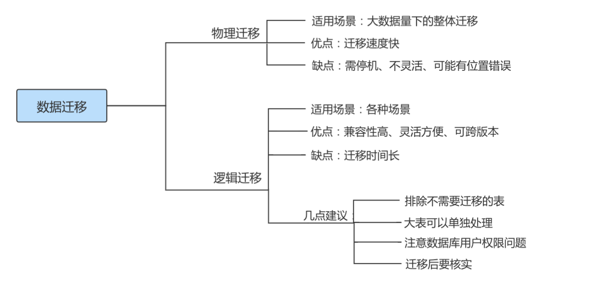


### 8 删库了不敢跑，能干点啥？

传统的高可用架构是不能预防误删数据的，因为主库的一个drop table命令，会通过binlog传给所有从库和级联从库，进而导致整个集群的实例都会执行这个命令。

为了找到解决误删数据的更高效的方法，我们需要先对和MySQL相关的误删数据，做下分类:

1. 使用delete语句误删数据行;
2. 使用drop table或者truncate table语句误删数据表;
3. 使用drop database语句误删数据库;
4. 使用rm命令误删整个MySQL实例。


#### 8.1 delete：误删行

**处理措施1：数据恢复**

使用`Flashback`工具恢复数据。

原理：`修改binlog`内容，拿回原库重放。如果误删数据涉及到了多个事务的话，需要将事务的顺序调过来再执行。

使用前提: binlog_format=row 和 binlog_row_image = FULL。

**处理措施2：预防**

- 代码上线前，必须SQL审查、审计。
- 建议可以打开`安全模式`，把`sql_safe_updates`参数设置为`on`。强制要求加where条件且where后需要是索引字段，否则必须使用limit。否则就会报错。

**经验之谈**：

1. 恢复数据比较安全的做法，是`恢复出一个备份`，或者找一个从库作为`临时库`，在这个临时库上执行这些操作，然后再将确认过的临时库的数据，恢复回主库。如果直接修改主库，可能导致对数据的`二次破坏`。

2. 当然，针对预防误删数据的问题，建议如下：

   1. 把`sql_safe_updates`参数设置为`on`。这样一来，如果我们忘记在delete或者update语句中写where条件，或者where条件里面没有包含索引字段的话，这条语句的执行就会报错。

     > 如果确定要把一个小表的数据全部删掉，在设置了sql_safe_updates=on情况下，可以在delete语句中加上where条件，比如where id>=0。

   2. 代码上线前，必须经过`SQL审计`。


#### 8.2 truncate/drop：误删库/表

**背景：**

delete全表是很慢的，需要生成回滚日志、写redo、 写binlog。所以，从性能角度考虑，优先考虑使用truncate table或者drop table命令。

使用delete命令删除的数据，你还可以用Flashback来恢复。而使用truncate/drop table和drop database命令删除的数据，就没办法通过Flashback来恢复了。因为，即使我们配置了binlog_format=row, 执行这三个命令时，记录的binlog还是statement格式。binlog里面就只有一个truncate/drop语句，这些信息是恢复不出数据的。

**方案：**

这种情况下，要想恢复数据，就需要使用`全量备份`，加`增量日志`的方式了。这个方案要求线上有定期的全量备份，并且实时备份binlog。

在这两个条件都具备的情况下，假如有人中午12点误删了一个库，恢复数据的流程如下：

1. 取最近一次`全量备份`，假设这个库是一天一备，上次备份是当天`凌晨2点`；
2. 用备份恢复出一个`临时库`；(注意：这里选择临时库，而不是直接操作主库)
3. 从日志备份里面，取出凌晨2点之后的日志；
4. 剔除误删除数据的语句外，其它语句全部应用到临时库。(前面讲过binlog的恢复)
5. 最后恢复到主库


#### 8.3 预防使用truncate/drop误删库/表

上面我们说了使用truncate/drop语句误删库/表的恢复方案，在生产环境中可以通过下面建议的方案来尽量的避免类似的误操作。

**(1) 权限分离**

- 限制帐户权限，核心的数据库，一般都`不能随便分配写权限`，想要获取写权限需要`审批`。比如只给业务开发人员DML权限，不给truncate/drop权限。即使是DBA团队成员，日常也都规定只使用`只读账号`，必要的时候才使用有更新权限的账号。
- 不同的账号，不同的数据之间要进行`权限分离`，避免-一个账号可以删除所有库。

**(2) 制定操作规范**

比如在删除数据表之前，必须先对表做改名操作(比如加`_to_be_deleted`)。然后，观察一段时间，确保对业务无影响以后再删除这张表。

**(3) 设置延迟复制备库**

简单的说延迟复制就是设置一个固定的延迟时间，比如1个小时，让从库落后主库一个小时。出现误删除操作1小时内，到这个备库上执行`stop slave`，再通过之前介绍的方法，跳过误操作命令，就可以恢复出需要的数据。这里通过`CHANGE MASTER TO MASTER_DELAY = N`命令，可以指定这个备库持续保持跟主库有N秒的延迟。比如把N设置为3600，即代表1个小时。

此外，延迟复制还可以用来解决以下问题: 

1. 用来做`延迟测试`，比如做好的数据库读写分离，把从库作为读库，那么想知道当数据产生延迟的时候到底会发生什么，就可以使用这个特性模拟延迟。
2. 用于`老数据的查询等需求`，比如你经常需要查看某天前一个表或者字段的数值，你可能需要把备份恢复后进行查看，如果有延迟从库，比如延迟一周，那么就可以解决这样类似的需求。


#### 8.4 预防误删库/表的方法

1. `账号分离`。这样做的目的是，避免写错命令。比如：
   - 只给业务开发同学DML权限，而不给truncate/drop权限。而如果业务开发人员有DDL需求的话，可以通过开发管理系统得到支持。
   - 即使是DBA团队成员，日常也都规定只使用`只读账号`，必要的时候才使用有更新权限的账号。
2. `制定操作规范`。比如：
   - 在删除数据表之前，必须先`对表做改名`操作。然后，观察一段时间，确保对业务无影响以后再删除这张表。
   - 改表名的时候，要求给表名加固定的后缀（比如加`_to_be_deleted`)，然后删除表的动作必须通过管理系统执行。并且，管理系统删除表的时候，只能删除固定后缀的表。


#### 8.5 rm：误删MySQL实例

对于一个有高可用机制的MySQL集群来说，不用担心`rm删除数据`了。只是删掉了其中某一个节点的数据的话，HA系统就会开始工作，选出一个新的主库，从而保证整个集群的正常工作。我们要做的就是在这个节点上把数据恢复回来，再接入整个集群。

但如果是恶意地把整个集群删除，那就需要考虑跨机房备份，跨城市备份。


### 9 附录：MySQL常用命令

#### 9.1 mysql

该mysql不是指mysql服务，而是指mysql的客户端工具。

语法：

```mysql
mysql [options] [database]
```

1. 连接选项

   ```
   #参数 ：
   	-u, --user=name       指定用户名
   	-p, --password[=name] 指定密码
   	-h, --host=name       指定服务器IP或域名
   	-P, --port=#          指定连接端口
   #示例 ：
   	mysql -h 127.0.0.1 -P 3306 -u root -p
   	mysql -h127.0.0.1 -P3306 -uroot -p密码
   ```

2. 执行选项

   ```
   -e, --execute=name 		执行SQL语句并退出
   ```

   此选项可以在Mysql客户端执行SQL语句，而不用连接到MySQL数据库再执行，对于一些批处理脚本，这种方式尤其方便。

   ```bash
   #示例：
   mysql -uroot -p db01 -e "select * from tb_book";
   ```

   

#### 9.2 mysqladmin

mysqladmin 是一个执行管理操作的客户端程序。可以用它来检查服务器的配置和当前状态、创建并删除数据库等。

可以通过：`mysqladmin --help`指令查看帮助文档

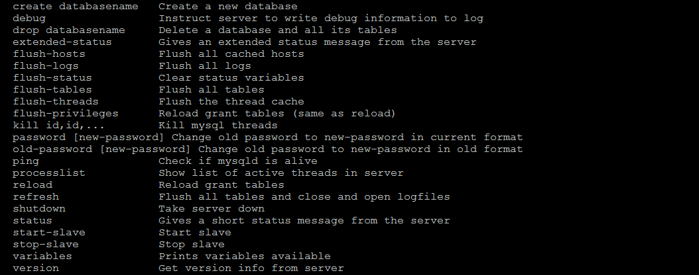

```bash
#示例 ：
	mysqladmin -uroot -p create 'test01';
	mysqladmin -uroot -p drop 'test01';
	mysqladmin -uroot -p version;
```


#### 9.3 mysqlbinlog

由于服务器生成的二进制日志文件以二进制格式保存，所以如果想要检查这些文本的文本格式，就会使用到mysqlbinlog日志管理工具。

语法：

```
mysqlbinlog [options] log-files1 log-files2 ...

#选项：
	-d, --database=name : 指定数据库名称，只列出指定的数据库相关操作。
	
	-o, --offset=# : 忽略掉日志中的前n行命令。
	
	-r,--result-file=name : 将输出的文本格式日志输出到指定文件。
	
	-s, --short-form : 显示简单格式， 省略掉一些信息。
	
	--start-datatime=date1 --stop-datetime=date2 : 指定日期间隔内的所有日志。
	
	--start-position=pos1 --stop-position=pos2 : 指定位置间隔内的所有日志。
```


#### 9.4 mysqldump

mysqldump 客户端工具用来备份数据库或在不同数据库之间进行数据迁移。备份内容包含创建表，及插入表的SQL语句。

语法：

```
mysqldump [options] db_name [tables]

mysqldump [options] --database/-B db1 [db2 db3...]

mysqldump [options] --all-databases/-A
```

1. 连接选项

   ```
   #参数 ：
   	-u, --user=name 		指定用户名
   	-p, --password[=name] 	指定密码
   	-h, --host=name 		指定服务器IP或域名
   	-P, --port=# 			指定连接端口
   ```

2. 输出内容选项

   ```
   #参数：
   --add-drop-database    在每个数据库创建语句前加上 Drop database 语句
   --add-drop-table       在每个表创建语句前加上 Drop table 语句 , 默认开启 ; 不开启 (--skip-add-drop-table)
   -n, --no-create-db     不包含数据库的创建语句
   -t, --no-create-info   不包含数据表的创建语句
   -d --no-data           不包含数据
   -T, --tab=name         自动生成两个文件：
                          一个.sql文件，创建表结构的语句；
                          一个.txt文件，数据文件，相当于select into outfile
                          
   #示例 ：
   mysqldump -uroot -p db01 tb_book --add-drop-database --add-drop-table > a
   mysqldump -uroot -p -T /tmp test city
   ```

   

#### 9.5 mysqlimport/source

mysqlimport 是客户端数据导入工具，用来导入mysqldump 加 -T 参数后导出的文本文件。

语法：

```
mysqlimport [options] db_name textfile1 [textfile2...]
```

示例：

```
mysqlimport -uroot -p test /tmp/city.txt
```

如果需要导入sql文件,可以使用mysql中的source 指令：

```mysql
source /root/tb_book.sql
```


#### 9.6 mysqlshow

mysqlshow 客户端对象查找工具，用来很快地查找存在哪些数据库、数据库中的表、表中的列或者索引。

语法：

```
mysqlshow [options] [db_name [table_name [col_name]]]
```

参数：

```
--count 		显示数据库及表的统计信息（数据库，表 均可以不指定）
-i 			    显示指定数据库或者指定表的状态信息
```

示例：

```mysql
#查询每个数据库的表的数量及表中记录的数量
mysqlshow -uroot -p --count
[root@node1 ~]# mysqlshow -uroot -p --count
Enter password: 
+--------------------+--------+--------------+
|     Databases      | Tables |  Total Rows  |
+--------------------+--------+--------------+
| atguigudb          |     10 |          330 |
| atguigudb1         |      2 |      1000100 |
| dbtest1            |      5 |            9 |
| information_schema |     79 |        30604 |
| mysql              |     37 |         4008 |
| performance_schema |    110 |       333126 |
| sys                |    101 |         5632 |
+--------------------+--------+--------------+
7 rows in set.


#查询atguigudb库中每个表中的字段书，及行数
mysqlshow -uroot -p atguigudb --count
[root@node1 ~]# mysqlshow -uroot -p atguigudb --count
Enter password: 
Database: atguigudb
+------------------+----------+------------+
|      Tables      | Columns  | Total Rows |
+------------------+----------+------------+
| countries        |        3 |         25 |
| departments      |        4 |         27 |
| emp_details_view |       16 |        106 |
| employees        |       11 |        107 |
| job_grades       |        3 |          6 |
| job_history      |        5 |         10 |
| jobs             |        4 |         19 |
| locations        |        6 |         23 |
| order            |        2 |          3 |
| regions          |        2 |          4 |
+------------------+----------+------------+
10 rows in set.


#查询atguigudb库中employees表的详细情况
mysqlshow -uroot -p atguigudb employees --count
[root@node1 ~]# mysqlshow -uroot -p atguigudb employees --count
Enter password: 
Database: atguigudb  Table: employees  Rows: 107
+----------------+-------------+-----------------+------+-----+---------+-------+---------------------------------+---------+
| Field          | Type        | Collation       | Null | Key | Default | Extra | Privileges                      | Comment |
+----------------+-------------+-----------------+------+-----+---------+-------+---------------------------------+---------+
| employee_id    | int         |                 | NO   | PRI | 0       |       | select,insert,update,references |         |
| first_name     | varchar(20) | utf8_general_ci | YES  |     |         |       | select,insert,update,references |         |
| last_name      | varchar(25) | utf8_general_ci | NO   |     |         |       | select,insert,update,references |         |
| email          | varchar(25) | utf8_general_ci | NO   | UNI |         |       | select,insert,update,references |         |
| phone_number   | varchar(20) | utf8_general_ci | YES  |     |         |       | select,insert,update,references |         |
| hire_date      | date        |                 | NO   |     |         |       | select,insert,update,references |         |
| job_id         | varchar(10) | utf8_general_ci | NO   | MUL |         |       | select,insert,update,references |         |
| salary         | double(8,2) |                 | YES  |     |         |       | select,insert,update,references |         |
| commission_pct | double(2,2) |                 | YES  |     |         |       | select,insert,update,references |         |
| manager_id     | int         |                 | YES  | MUL |         |       | select,insert,update,references |         |
| department_id  | int         |                 | YES  | MUL |         |       | select,insert,update,references |         |
+----------------+-------------+-----------------+------+-----+---------+-------+---------------------------------+---------+
[root@node1 ~]#
```

# MySQL_章节练习篇

> 讲师：尚硅谷-宋红康（江湖人称：康师傅）
>
> 尚硅谷官网：[http://www.atguigu.com](http://www.atguigu.com/)
>
> 视频链接：https://www.bilibili.com/video/BV1iq4y1u7vj?spm_id_from=333.337.search-card.all.click

------

## 第00章、MySQL环境搭建

**1.安装好MySQL之后在windows系统中哪些位置能看到MySQL?**

- MySQL DBMS软件的安装位置。 D:\develop_tools\MySQL\MySQL Server 8.0
- MySQL 数据库文件的存放位置。 C:\ProgramData\MySQL\MySQL Server 8.0\Data
- MySQL DBMS 的配置文件。 C:\ProgramData\MySQL\MySQL Server 8.0\my.ini
- MySQL的服务（要想通过客户端能够访问MySQL的服务器，必须保证服务是开启状态的）
- MySQL的path环境变量

**2.卸载MySQL主要卸载哪几个位置的内容？**

- 使用控制面板的软件卸载，去卸载MySQL DBMS软件的安装位置。

  D:\develop_tools\MySQL\MySQL Server 8.0

- 手动删除数据库文件。 C:\ProgramData\MySQL\MySQL Server 8.0\Data
- MySQL的环境变量
- MySQL的服务进入注册表删除。（ **regedit** ）
- 务必重启电脑

**3.能够独立完成MySQL8.0、MySQL5.7版本的下载、安装、配置 （掌握）**

**4.MySQL5.7在配置完以后，如何修改配置文件？**

- 为什么要修改my.ini文件？ 默认的数据库使用的字符集是latin1。我们需要修改为：utf8

- 修改哪些信息？

  ```ini
  [mysql] #大概在63行左右，在其下添加
  ...
  default-character-set=utf8 #默认字符集
  [mysqld] # 大概在76行左右，在其下添加
  ...
  character-set-server=utf8
  collation-server=utf8_general_ci
  ```

  修改完以后，需要重启服务。

  ```shell
  net stop mysql服务名;
  net start mysql服务名;
  ```


**5.熟悉常用的数据库管理和操作的工具**

- 方式1：windows自带的cmd
- 方式2：mysql数据库自带的命令行窗口
- 方式3：图形化管理工具：Navicat、SQLyog、dbeaver等。

------

## 第01章、数据库概述

**1.说说你了解的常见的数据库**

Oracle、MySQl、SQL Server、DB2、PGSQL；Redis、MongoDB、ES.....

**2.谈谈你对MySQL历史、特点的理解**

- 历史：
  - 由瑞典的MySQL AB 公司创立，1995开发出的MySQL
  - 2008年，MySQL被SUN公司收购
  - 2009年，Oracle收购SUN公司，进而Oracle就获取了MySQL
  - 2016年，MySQL8.0.0版本推出

- 特点：
  - 开源的、关系型的数据库
  - 支持千万级别数据量的存储，大型的数据库

**3.说说你对DB、DBMS、SQL的理解**

DB：database，看做是数据库文件。 （类似于：.doc、.txt、.mp3、.avi、。。。）

DBMS：数据库管理系统。（类似于word工具、wps工具、记事本工具、qq影音播放器等）

MySQL数据库服务器中安装了MySQL DBMS,使用MySQL DBMS 来管理和操作DB，使用的是SQL语言。

**4.你知道哪些非关系型数据库的类型呢？（了解）**

- 键值型数据库：Redis
- 文档型数据库：MongoDB
- 搜索引擎数据库：ES、Solr
- 列式数据库：HBase
- 图形数据库：InfoGrid

**5.表与表的记录之间存在哪些关联关**

- ORM思想。（了解）
- 表与表的记录之间的关系：一对一关系、一对多关系、多对多关系、自关联 （了解）

------

## 第02章、基本的SELECT语句

```sql
# 1.查询员工12个月的工资（基本加奖金）总和，并起别名为ANNUAL SALARY
SELECT 
	employee_id, 
	last_name,
	salary * (1 + IFNULL(commission_pct, 0)) * 12 AS "ANNUAL SALARY"
FROM 
	employees;

# 2.查询employees表中去除重复的job_id以后的数据
SELECT 
	DISTINCT job_id 
FROM 
	employees;

# 3.查询工资大于12000的员工姓名和工资
SELECT 
	last_name, 
	salary
FROM 
	employees
WHERE 
	salary > 12000;

# 4.查询员工号为176的员工的姓名和部门号
SELECT 
	last_name, 
	department_id
FROM 
	employees
WHERE 
	employee_id = 176;

# 5.显示表 departments 的结构，并查询其中的全部数据
DESCRIBE departments;

SELECT * FROM departments;
```

------

## 第03章、运算符

```mysql
# 1.选择工资不在5000到12000的员工的姓名和工资
SELECT 
	last_name,
	salary 
FROM 
	employees
WHERE 
	salary NOT BETWEEN 5000 AND 12000;
	# salary < 5000 OR salary > 12000;

# 2.选择在20或50号部门工作的员工姓名和部门号
SELECT 
	last_name,
	department_id 
FROM 
	employees
WHERE 
	department_id IN(20,50);
	# department_id = 20 OR department_id = 50;

# 3.选择公司中没有管理者的员工姓名及job_id
SELECT 
	last_name,
	job_id 
FROM 
	employees
WHERE 
	manager_id is NULL;
	# manager_id <=> NULL;

# 4.选择公司中有奖金的员工姓名，工资和奖金级别
SELECT 
	last_name,
	salary,
	commission_pct 
FROM 
	employees
WHERE 
	commission_pct IS NOT NULL;

# 5.选择员工姓名的第三个字母是a的员工姓名
SELECT 
	last_name
FROM 
	employees
WHERE 
	last_name LIKE '__a%';

# 6.选择姓名中有字母a和k的员工姓名
SELECT 
	last_name
FROM 
	employees
WHERE 
	last_name LIKE '%a%' AND last_name LIKE '%k%';
	# last_name LIKE '%a%k%' OR last_name LIKE '%k%a%';

# 7.显示出表 employees 表中 first_name 以 'e'结尾的员工信息
SELECT 
	employee_id,
	first_name,
	last_name
FROM 
	employees
WHERE 
	first_name LIKE '%e';
	# first_name REGEXP 'e$';

# 8.显示出表 employees 部门编号在 80-100 之间的姓名、工种
SELECT 
	last_name,
	job_id 
FROM 
	employees 
WHERE 
	department_id BETWEEN 80 AND 100;

# 9.显示出表 employees 的 manager_id 是 100,101,110 的员工姓名、工资、管理者id
SELECT 
	last_name,
	salary,
	manager_id
FROM 
	employees
WHERE 
	manager_id IN(100,101,110);
```

------

## 第04章、排序与分页

```mysql
# 1. 查询员工的姓名和部门号和年薪，按年薪降序，按姓名升序显示
SELECT 
	last_name,
	department_id,
	salary * 12 annualSalary 
FROM 
	employees
ORDER BY 
	annualSalary DESC,
	last_name ASC;

# 2. 选择工资不在 8000 到 17000 的员工的姓名和工资，按工资降序，显示第21到40位置的数据
SELECT 
	last_name,
	salary
FROM 
	employees
WHERE 
	salary NOT BETWEEN 8000 AND 17000
ORDER BY 
	salary DESC
LIMIT 
	20,20;

# 3. 查询邮箱中包含 e 的员工信息，并先按邮箱的字节数降序，再按部门号升序
SELECT
	last_name,
	email,
	department_id
FROM 
	employees
WHERE 
	email LIKE '%e%'
	# email REGEXP '[e]'
ORDER BY 
	LENGTH(email) DESC, 
	department_id ASC;
```

------

## 第05章、多表查询

多表查询-1

```mysql
# 1.显示所有员工的姓名，部门号和部门名称。
SELECT 
	e.last_name, d.department_id, d.department_name
FROM 
	employees e
LEFT JOIN 
	departments d
ON 
	e.department_id = d.department_id;

# 2.查询90号部门员工的job_id和90号部门的location_id
SELECT 
	e.job_id, d.location_id
FROM 
	employees e
JOIN 
	departments d
ON 
	e.department_id = d.department_id
WHERE 
	e.department_id = 90;

# 3.选择所有有奖金的员工的 last_name , department_name , location_id , city
SELECT e.last_name, d.department_name, l.location_id, l.city
FROM employees e
LEFT JOIN departments d ON e.department_id = d.department_id
LEFT JOIN locations l ON d.location_id = l.location_id
WHERE commission_pct IS NOT NULL;

# 4.选择city在Toronto工作的员工的 last_name , job_id , department_id , department_name
SELECT e.last_name, e.job_id, d.department_id, d.department_name
FROM employees e
JOIN departments d on e.department_id = d.department_id
JOIN locations l ON d.location_id = l.location_id
WHERE l.city = "Toronto";

# 5.查询员工所在的部门名称、部门地址、姓名、工作、工资，其中员工所在部门的部门名称为’Executive’
SELECT d.department_name, l.street_address, e.last_name, e.job_id, e.salary
FROM employees e
JOIN departments d on e.department_id = d.department_id
JOIN locations l ON d.location_id = l.location_id
WHERE d.department_name = "Executive";

# 6.选择指定员工的姓名，员工号，以及他的管理者的姓名和员工号，结果类似于下面的格式
/*
employees Emp# manager Mgr#
kochhar   101  king    100
*/
SELECT 
	worker.last_name "employees",
	worker.employee_id "Emp#",
	manager.last_name "manager",
	manager.employee_id "Mgr#"
FROM 
	employees worker
LEFT JOIN 
	employees manager 
ON 
	worker.manager_id = manager.employee_id;

# 7.查询哪些部门没有员工
# 方式1
SELECT 
	d.department_id, d.department_name
FROM 
	employees e
RIGHT JOIN 
	departments d
on 
	e.department_id = d.department_id
WHERE 
	e.department_id IS NULL;
# 方式2
SELECT 
	d.department_id, d.department_name
FROM 
	departments d
WHERE NOT EXISTS(
	SELECT * FROM employees e
	WHERE d.department_id = e.department_id
);

# 8. 查询哪个城市没有部门
SELECT 
	l.location_id, l.city
FROM 
	departments d
RIGHT JOIN 
	locations l
ON 
	d.location_id = l.location_id
WHERE 
	d.location_id IS NULL;

# 9. 查询部门名为 Sales 或 IT 的员工信息
SELECT 
	e.employee_id, e.last_name, e.salary, d.department_name
FROM 
	employees e
JOIN 
	departments d
ON 
	e.department_id = d.department_id
WHERE 
	d.department_name IN("Sales", "IT");
```

多表查询-2

```mysql
储备：建表操作：
CREATE TABLE `t_dept` (
`id` INT(11) NOT NULL AUTO_INCREMENT,
`deptName` VARCHAR(30) DEFAULT NULL,
`address` VARCHAR(40) DEFAULT NULL,
PRIMARY KEY (`id`)
) ENGINE=INNODB AUTO_INCREMENT=1 DEFAULT CHARSET=utf8;

CREATE TABLE `t_emp` (
`id` INT(11) NOT NULL AUTO_INCREMENT,
`name` VARCHAR(20) DEFAULT NULL,
`age` INT(3) DEFAULT NULL,
`deptId` INT(11) DEFAULT NULL,
empno int not null,
PRIMARY KEY (`id`),
KEY `idx_dept_id` (`deptId`)
#CONSTRAINT `fk_dept_id` FOREIGN KEY (`deptId`) REFERENCES `t_dept` (`id`)
) ENGINE=INNODB AUTO_INCREMENT=1 DEFAULT CHARSET=utf8;

INSERT INTO t_dept(deptName,address) VALUES('华山','华山');
INSERT INTO t_dept(deptName,address) VALUES('丐帮','洛阳');
INSERT INTO t_dept(deptName,address) VALUES('峨眉','峨眉山');
INSERT INTO t_dept(deptName,address) VALUES('武当','武当山');
INSERT INTO t_dept(deptName,address) VALUES('明教','光明顶');
INSERT INTO t_dept(deptName,address) VALUES('少林','少林寺');
INSERT INTO t_emp(NAME,age,deptId,empno) VALUES('风清扬',90,1,100001);
INSERT INTO t_emp(NAME,age,deptId,empno) VALUES('岳不群',50,1,100002);
INSERT INTO t_emp(NAME,age,deptId,empno) VALUES('令狐冲',24,1,100003);
INSERT INTO t_emp(NAME,age,deptId,empno) VALUES('洪七公',70,2,100004);
INSERT INTO t_emp(NAME,age,deptId,empno) VALUES('乔峰',35,2,100005);
INSERT INTO t_emp(NAME,age,deptId,empno) VALUES('灭绝师太',70,3,100006);
INSERT INTO t_emp(NAME,age,deptId,empno) VALUES('周芷若',20,3,100007);
INSERT INTO t_emp(NAME,age,deptId,empno) VALUES('张三丰',100,4,100008);
INSERT INTO t_emp(NAME,age,deptId,empno) VALUES('张无忌',25,5,100009);
INSERT INTO t_emp(NAME,age,deptId,empno) VALUES('韦小宝',18,null,100010);
```

```mysql
#1.所有有门派的人员信息 （ A、B两表共有）
SELECT 
	*  
FROM 
	t_emp e 
INNER JOIN 
	t_dept d 
ON 
	e.deptId = d.id;

#2.列出所有用户，并显示其机构信息（A的全集）
SELECT e.`name`, d.deptName 
FROM t_emp e
LEFT JOIN t_dept d
ON e.deptId = d.id;

#3.列出所有门派（B的全集）
SELECT * from 

#4.所有不入门派的人员（A的独有）
SELECT *
FROM t_emp e
LEFT JOIN t_dept d
ON e.deptId = d.id
WHERE d.id IS NULL;

#5.所有没人入的门派（B的独有）
SELECT *
FROM t_emp e
RIGHT JOIN t_dept d
ON e.deptId = d.id
WHERE e.deptId IS NULL;

#6.列出所有人员和机构的对照关系 (AB全有)
#MySQL Full Join的实现 因为MySQL不支持FULL JOIN,下面是替代方法
# left join + union(可去除重复数据)+ right join
SELECT *
FROM t_emp e LEFT JOIN t_dept d
ON e.deptId = d.id

UNION

SELECT *
FROM t_emp e RIGHT JOIN t_dept d
ON e.deptId = d.id；

#7.列出所有没入派的人员和没人入的门派（A的独有+B的独有）
SELECT *
FROM t_emp e
LEFT JOIN t_dept d
ON e.deptId = d.id
WHERE d.id IS NULL;

UNION ALL

SELECT *
FROM t_emp e
RIGHT JOIN t_dept d
ON e.deptId = d.id
WHERE e.deptId IS NULL;
```

------

## 第06章、单行函数

```mysql
# 1.显示系统时间(注：日期+时间)
SELECT NOW() FROM DUAL;
SELECT SYSDATE() FROM DUAL;

# 2.查询员工号，姓名，工资，以及工资提高百分之20%后的结果（new salary）
SELECT 
	employee_id,
	last_name,
	salary,
	salary*(1+0.2) "new salary"
FROM 
	employees;

# 3.将员工的姓名按首字母排序，并写出姓名的长度（length）
SELECT 
	last_name, 
	LENGTH(last_name)
FROM 
	employees 
ORDER BY 
	last_name ASC;

# 4.查询员工id,last_name,salary，并作为一个列输出，别名为OUT_PUT
SELECT 
	CONCAT(employee_id,",",last_name,",",salary) "OUT_PUT"
FROM 
	employees;

# 5.查询公司各员工工作的年数、工作的天数，并按工作年数的降序排序
SELECT 
	YEAR(NOW()) - YEAR(hire_date)  "工作年数",
	DATEDIFF(NOW(), hire_date) "工作天数"
FROM 
	employees
ORDER BY
	"工作年数" DESC;

# 6.查询员工姓名，hire_date , department_id，满足以下条件：雇用时间在1997年之后，department_id为80 或 90 或110, commission_pct不为空
SELECT 
	last_name, hire_date, department_id
FROM 
	employees
WHERE 
	YEAR(hire_date) >= 1997 
AND
	department_id IN(80, 90, 110)
AND
	commission_pct IS NOT NULL;

# 7.查询公司中入职超过10000天的员工姓名、入职时间
SELECT 
	last_name, hire_date
FROM 
	employees
WHERE
	DATEDIFF(NOW(), hire_date) > 10000;
```

```mysql
# 8.做一个查询，产生下面的结果
# <last_name> earns <salary> monthly but wants <salary*3>
SELECT 
	CONCAT(last_name," earns ",TRUNCATE(salary, 0)," monthly but wants ",TRUNCATE(salary*3, 0)) "Dream Salary"
FROM 
	employees;
```


```mysql
# 9.使用case-when，按照下面的条件：
/*
job         grade
AD_PRES     A
ST_MAN      B
IT_PROG     C
SA_REP      D
ST_CLERK    E
其余的均为F
*/
SELECT 
	last_name "Last_name",
	job_id "Job_id",
	CASE job_id
		WHEN 'AD_PRES' THEN 'A'
		WHEN 'ST_MAN' THEN 'B'
		WHEN 'IT_PROG' THEN 'C'
		WHEN 'SA_REP' THEN 'D'
		WHEN 'ST_CLERK' THEN 'E'
		ELSE 'F' END "Grade"
FROM
	employees;
```


------

## 第07章、聚合函数

```mysql
# 1.where子句可否使用组函数进行过滤?
NO

# 2.查询公司员工工资的最大值，最小值，平均值，总和
SELECT 
	MAX(salary), MIN(salary), AVG(salary), SUM(salary)
FROM 
	employees;

# 3.查询各job_id的员工工资的最大值，最小值，平均值，总和
SELECT 
	job_id, MAX(salary), MIN(salary), AVG(salary), SUM(salary)
FROM 
	employees
GROUP BY
	job_id;

# 4.选择具有各个job_id的员工人数
SELECT 
	job_id, COUNT(*)
FROM 
	employees
GROUP BY
	job_id;

# 5.查询员工最高工资和最低工资的差距（DIFFERENCE）
SELECT 
	MAX(salary), MIN(salary), MAX(salary) - MIN(salary) "DIFFERENCE"
FROM 
	employees;

# 6.查询各个管理者手下员工的最低工资，其中最低工资不能低于6000，没有管理者的员工不计算在内
SELECT 
	manager_id, MIN(salary)
FROM 
	employees
WHERE
	manager_id IS NOT NULL
GROUP BY 
	manager_id
HAVING
	MIN(salary) >= 6000;

# 7.查询所有部门的名字，location_id，员工数量和平均工资，并按平均工资降序
SELECT 
	d.department_name "部门名字",
	d.location_id "loc_id",
	COUNT(e.employee_id) "员工数量",
	AVG(e.salary) "平均工资"
FROM 
	employees e 
RIGHT JOIN 
	departments d 
ON 
	e.department_id = d.department_id
GROUP BY 
	d.department_name,
	d.location_id
ORDER BY
	AVG(e.salary) DESC;

# 8.查询每个工种、每个部门的部门名、工种名和最低工资
SELECT 
	department_name,
	job_id,
	MIN(salary)
FROM 
	departments d 
LEFT JOIN 
	employees e
ON 
	e.department_id = d.department_id
GROUP BY 
	department_name,
	job_id;
```

------

## 第08章、子查询

```mysql
#1.查询和Zlotkey相同部门的员工姓名和工资
SELECT 
	last_name, salary
from 
	employees
WHERE 
	department_id IN 
		(SELECT department_id FROM employees WHERE last_name = "Zlotkey");

#2.查询工资比公司平均工资高的员工的员工号，姓名和工资。
SELECT 
	employee_id, last_name, salary
FROM 
	employees
WHERE 
	salary > 
		(SELECT AVG(salary) FROM employees);

#3.选择工资大于所有JOB_ID = 'SA_MAN'的员工的工资的员工的last_name, job_id, salary
SELECT 
	last_name, job_id, salary
FROM 
	employees
WHERE 
	salary > ALL 
		(SELECT salary FROM employees WHERE job_id = 'SA_MAN');

#4.查询和姓名中包含字母u的员工在相同部门的员工的员工号和姓名
SELECT 
	employee_id, last_name
FROM 
	employees
WHERE 
	department_id IN
		(SELECT DISTINCT department_id FROM employees WHERE last_name LIKE '%u%');

#5.查询在部门的location_id为1700的部门工作的员工的员工号
SELECT 
	employee_id
FROM 
	employees
WHERE 
	department_id IN
		(SELECT department_id FROM departments WHERE location_id = 1700);

#6.查询管理者是King的员工姓名和工资
SELECT 
	last_name, salary
FROM 
	employees
WHERE 
	manager_id IN 
		(SELECT employee_id FROM employees WHERE last_name = 'King');

#7.查询工资最低的员工信息: last_name, salary
SELECT 
	last_name, salary
FROM 
	employees
WHERE 
	salary = (SELECT MIN(salary) FROM employees);

#8.查询平均工资最低的部门信息
#方式一：
SELECT 
	*
FROM 
	departments
WHERE 
	department_id = 
		(SELECT department_id
		 FROM employees
		 GROUP BY department_id
          HAVING AVG(salary) = (
			SELECT MIN(dept_avgsal)
				FROM (
					SELECT AVG(salary) dept_avgsal
					FROM employees
					GROUP BY department_id
					) avg_sal
			)
		);
#方式二：
SELECT 
	*
FROM 
	departments
WHERE 
	department_id = 
		(SELECT department_id
		 FROM employees
		 GROUP BY department_id
		 HAVING AVG(salary) <= ALL
         	(SELECT AVG(salary) avg_sal
			FROM employees
			GROUP BY department_id));
#方式三：
SELECT 
	*
FROM 
	departments
WHERE 
	department_id =
		(SELECT department_id
		 FROM employees
	 	 GROUP BY department_id
		 HAVING AVG(salary) = 
         	(SELECT AVG(salary) avg_sal
			FROM employees
			GROUP BY department_id
			ORDER BY avg_sal
			LIMIT 0,1));
#方式四：
SELECT 
	d.*
FROM 
	departments d,
	(SELECT department_id, AVG(salary) avg_sal
	 FROM employees
	 GROUP BY department_id
	 ORDER BY avg_sal
	 LIMIT 0,1) dept_avg_sal
WHERE 
	d.department_id = dept_avg_sal.department_id;

#9.查询平均工资最低的部门信息和该部门的平均工资（相关子查询）
#方式一：
SELECT 
	d.*, (SELECT AVG(salary) FROM employees WHERE department_id = d.department_id) "avg_sal"
FROM 
	departments d
WHERE 
	department_id = 
		(SELECT department_id
		 FROM employees
		 GROUP BY department_id
          HAVING AVG(salary) = (
			SELECT MIN(dept_avgsal)
				FROM (
					SELECT AVG(salary) dept_avgsal
					FROM employees
					GROUP BY department_id
					) avg_sal
			)
		);
#方式二：
SELECT 
	d.*, (SELECT AVG(salary) FROM employees WHERE department_id = d.department_id) "avg_sal"
FROM 
	departments d
WHERE 
	department_id = 
		(SELECT department_id
		 FROM employees
		 GROUP BY department_id
		 HAVING AVG(salary) <= ALL
         	(SELECT AVG(salary) avg_sal
			FROM employees
			GROUP BY department_id));
#方式三：
SELECT 
	d.*, (SELECT AVG(salary) FROM employees WHERE department_id = d.department_id) "avg_sal"
FROM 
	departments d
WHERE 
	department_id =
		(SELECT department_id
		 FROM employees
	 	 GROUP BY department_id
		 HAVING AVG(salary) = 
         	(SELECT AVG(salary) avg_sal
			FROM employees
			GROUP BY department_id
			ORDER BY avg_sal
			LIMIT 0,1));
#方式四：
SELECT 
	d1.*, d2.avg_sal
FROM 
	departments d1,
	(SELECT department_id, AVG(salary) avg_sal 
	 FROM employees 
	 GROUP BY department_id
	 ORDER BY avg_sal
	 LIMIT 0,1) d2
WHERE d2.department_id = d1.department_id;

#10.查询平均工资最高的 job 信息
#方式一：
SELECT 
	*
FROM 
	jobs
WHERE 
	job_id = (
		SELECT job_id
		FROM employees
		GROUP BY job_id
		HAVING AVG(salary) = (
			SELECT MAX(avg_sal)
			FROM(
				SELECT AVG(salary) avg_sal
				FROM employees
				GROUP BY job_id
			) job_avgsal
		)
	);
#方式二：
SELECT 
	*
FROM 
	jobs
WHERE 
	job_id = (
		SELECT job_id
		FROM employees
		GROUP BY job_id
		HAVING AVG(salary) >= ALL(
			SELECT AVG(salary)
			FROM employees
			GROUP BY job_id
		)
	);
#方式三：
SELECT 
	*
FROM 
	jobs
WHERE 
	job_id = (
		SELECT job_id
		FROM employees
		GROUP BY job_id
		HAVING AVG(salary) = (
			SELECT AVG(salary) avg_sal
			FROM employees
			GROUP BY job_id
			ORDER BY avg_sal DESC
			LIMIT 0,1
		)
	);
#方式四：
SELECT 
	j.*
FROM 
	jobs j,(
	SELECT job_id, AVG(salary) avg_sal
	FROM employees
	GROUP BY job_id
	ORDER BY avg_sal DESC
	LIMIT 0,1 ) job_avg_sal
WHERE 
	j.job_id = job_avg_sal.job_id

#11.查询平均工资高于公司平均工资的部门有哪些?
SELECT 
	department_id, AVG(salary) avg_sal
FROM 
	employees
WHERE 
	department_id IS NOT NULL
GROUP BY 
	department_id
HAVING 
	avg_sal > 
		(SELECT AVG(salary) FROM employees)

#12.查询出公司中所有 manager 的详细信息
# 方式一：自连接
SELECT 
	DISTINCT mgr.employee_id, mgr.last_name, mgr.salary
FROM 
	employees mgr, employees wo
WHERE 
	mgr.employee_id = wo.manager_id;
# or
SELECT 
	DISTINCT mgr.employee_id, mgr.last_name, mgr.salary
FROM 
	employees wo 
JOIN 
	employees mgr
ON 
	mgr.employee_id = wo.manager_id;
#方式二：子查询
SELECT 
	employee_id, last_name, salary
FROM 
	employees
WHERE 
	employee_id IN (
		SELECT DISTINCT manager_id
		FROM employees
	);
#方式三
SELECT 
	employee_id, last_name, salary
FROM 
	employees e1
WHERE EXISTS ( 
		SELECT *
		FROM employees e2
		WHERE e2.manager_id = e1.employee_id);

#13.各个部门中 最高工资中最低的那个部门的 最低工资是多少?
#方式1:
SELECT 
	MIN(salary)
FROM 
	employees
WHERE 
	department_id = (
		SELECT department_id
		FROM employees
		GROUP BY department_id
		HAVING MAX(salary) = (
			SELECT MIN(max_sal)
			FROM (
				SELECT MAX(salary) max_sal
				FROM employees
				GROUP BY department_id
            ) dept_max_sal
		)
	);
#方式2:
SELECT 
	MIN(salary)
FROM 
	employees
WHERE 
	department_id = (
		SELECT department_id
		FROM employees
		GROUP BY department_id
		HAVING MAX(salary) <= ALL(
			SELECT MAX(salary) max_sal
			FROM employees
			GROUP BY department_id
		)
	);
#方式3：
SELECT 
	MIN(salary)
FROM 
	employees
WHERE 
	department_id = (
		SELECT department_id
		FROM employees
		GROUP BY department_id
		HAVING MAX(salary) = (
			SELECT MAX(salary) max_sal
			FROM employees
			GROUP BY department_id
			ORDER BY max_sal
			LIMIT 0,1
		)
	);
#方式4：
SELECT 
	salary
FROM 
	employees e,
	(SELECT department_id, MAX(salary) max_sal
	 FROM employees
	 GROUP BY department_id
	 ORDER BY max_sal
	 LIMIT 0,1) dept_max_sal
WHERE 
	e.department_id = dept_max_sal.department_id;

#14.查询平均工资最高的部门的 manager 的详细信息: last_name, department_id, email, salary
#方式1：
SELECT 
	last_name, department_id, email, salary
FROM 	
	employees
WHERE 
	employee_id = ANY (
			SELECT DISTINCT manager_id
			FROM employees
			WHERE department_id = (
				SELECT department_id
				FROM employees
				GROUP BY department_id
				HAVING AVG(salary) = (
					SELECT MAX(avg_sal)
					FROM (
						SELECT AVG(salary) avg_sal
						FROM employees
						GROUP BY department_id
						) t_dept_avg_sal
					)
				)
			);

#方式2：
SELECT last_name, department_id, email, salary
FROM employees
WHERE employee_id = ANY (
			SELECT DISTINCT manager_id
			FROM employees
			WHERE department_id = (
						SELECT department_id
						FROM employees
						GROUP BY department_id
						HAVING AVG(salary) >= ALL (
								SELECT AVG(salary) avg_sal
								FROM employees
								GROUP BY department_id
								)
						)
			);
#方式3：
SELECT 
	last_name, department_id, email, salary
FROM 
	employees
WHERE 
	employee_id IN (
			SELECT DISTINCT manager_id
			FROM employees e, (
					SELECT department_id, AVG(salary) avg_sal
					FROM employees
					GROUP BY department_id
					ORDER BY avg_sal DESC
					LIMIT 0,1
					) t_dept_avg_sal
			WHERE e.`department_id` = t_dept_avg_sal.department_id
			);

#15. 查询部门的部门号，其中不包括job_id是"ST_CLERK"的部门号
#方式1：
SELECT 
	department_id
FROM 
	departments
WHERE 
	department_id NOT IN (
			SELECT DISTINCT department_id
			FROM employees
			WHERE job_id = 'ST_CLERK');
#方式2：
SELECT 
	department_id
FROM 
	departments d
WHERE NOT EXISTS
	(SELECT * 
     FROM employees e 
     WHERE e.department_id = d.department_id 
     AND e.job_id = 'ST_CLERK');

#16. 选择所有没有管理者的员工的last_name
SELECT 
	last_name 
FROM 
	employees emp
WHERE 
	NOT EXISTS 
		(SELECT * FROM employees mgr WHERE emp.manager_id = mgr.employee_id);

#17．查询员工号、姓名、雇用时间、工资，其中员工的管理者为 'De Haan'
#方式1：
SELECT employee_id, last_name, hire_date, salary
FROM employees
WHERE manager_id IN (
		SELECT employee_id
		FROM employees
		WHERE last_name = 'De Haan'
		);
#方式2：
SELECT employee_id, last_name, hire_date, salary
FROM employees e1
WHERE EXISTS (
		SELECT *
		FROM employees e2
		WHERE e1.`manager_id` = e2.`employee_id`
		AND e2.last_name = 'De Haan'
		); 

#18.查询各部门中工资比本部门平均工资高的员工的员工号, 姓名和工资（相关子查询）
#方式1：使用相关子查询
SELECT e1.employee_id, e1.last_name, e1.salary
FROM employees e1
WHERE e1.salary > (
			SELECT AVG(e2.salary) avg_sal
			FROM employees e2
			WHERE e1.department_id = e2.department_id);
#方式2：在FROM中声明子查询
SELECT e.last_name,e.salary,e.department_id
FROM employees e,(
		SELECT department_id, AVG(salary) avg_sal
		FROM employees
		GROUP BY department_id) t_dept_avg_sal
WHERE e.department_id = t_dept_avg_sal.department_id
AND e.salary > t_dept_avg_sal.avg_sal;

#19.查询每个部门下的部门人数大于 5 的部门名称（相关子查询）
SELECT 
	d.department_name
FROM 
	departments d
WHERE 
	5 < (SELECT COUNT(*) FROM employees e WHERE d.department_id = e.department_id)

#20.查询每个国家下的部门个数大于 2 的国家编号（相关子查询）
SELECT 
	l.country_id 
FROM 
	locations l
WHERE 
	2 < (SELECT COUNT(*) FROM departments d WHERE l.location_id = d.location_id)
	
/* 
子查询的编写技巧（或步骤）：① 从里往外写  ② 从外往里写

如何选择？
① 如果子查询相对较简单，建议从外往里写。一旦子查询结构较复杂，则建议从里往外写
② 如果是相关子查询的话，通常都是从外往里写。
*/
```

------

## 第09章、创建和管理表

- **练习1**

```mysql
#1. 创建数据库test01_office, 指明字符集为utf8。并在此数据库下执行下述操作
CREATE DATABASE IF NOT EXISTS test01_office CHARACTER SET 'utf8';
USE test01_office;

#2. 创建表dept01
/*
字段 类型
id INT(7)
NAME VARCHAR(25)
*/
CREATE TABLE IF NOT EXISTS dept01(
	id INT(7),
	`name` VARCHAR(25)
);

#3. 将表departments中的数据插入新表dept02中
CREATE TABLE dept02
AS
SELECT * FROM atguigudb.departments;

#4. 创建表emp01
/*
	字段           类型
	id             INT(7)
	first_name     VARCHAR (25)
	last_name      VARCHAR(25)
	dept_id        INT(7)
*/
CREATE TABLE emp01(
	id INT(7),
	first_name VARCHAR(25),
	last_name VARCHAR(25),
	dept_id INT(7)
);

#5. 将列last_name的长度增加到50
DESCRIBE emp01;

ALTER TABLE emp01 
MODIFY last_name VARCHAR(50);

#6. 根据表employees创建emp02
CREATE TABLE emo02
AS
SELECT * FROM atguigudb.employees;

SHOW TABLES FROM test01_office;

#7. 删除表emp01
DROP TABLE IF EXISTS emp01;

#8. 将表emp02重命名为emp01
RENAME TABLE emo02 TO emp01;
# or
ALTER TABLE emo02 RENAME TO emp01; 

#9.在表dept02和emp01中添加新列test_column，并检查所作的操作
ALTER TABLE emp01 ADD test_column VARCHAR(10);
DESC emp01;

ALTER TABLE dept02 ADD test_column VARCHAR(10);
DESC dept02;

#10.直接删除表emp01中的列 department_id
ALTER TABLE emp01 DROP COLUMN department_id;
```

- **练习2**

TABLE customers：

| 字段名    | 数据类型    |
| --------- | ----------- |
| c_num     | int         |
| c_name    | varchar(50) |
| c_contact | varchar(50) |
| c_city    | varchar(50) |
| c_birth   | date        |

```mysql
# 1、创建数据库 test02_market;
CREATE DATABASE IF NOT EXISTS test02_market CHARACTER SET 'utf8';
USE test02_market;

# 2、创建数据表 customers
CREATE TABLE IF NOT EXISTS contomers(
	c_num		INT,
    c_name		VARCHAR(50),
    c_concact	VARCHAR(50),
    c_city		VARCHAR(50),
    c_birth		DATE
);

# 3、将 c_contact 字段移动到 c_birth 字段后面
ALTER TABLE contomers MODIFY c_contact varchar(50) AFTER c_birth;

# 4、将 c_name 字段数据类型改为 varchar(70)
ALTER TABLE contomers MODIFY c_name varchar(70);

# 5、将c_contact字段改名为c_phone
ALTER TABLE contomers CHANGE c_contact c_phone varchar(50);

# 6、增加c_gender字段到c_name后面，数据类型为char(1)
ALTER TABLE contomers ADD c_gender CHAR(1) AFTER c_name;

# 7、将表名改为customers_info
ALTER TABLE contomers RENAME TO customers_info;
# OR
RENAME TABLE contomers TO customers_info;

# 8、删除字段c_city
ALTER TABLE customers_info DROP COLUMN c_city;
```

- **练习3**

TABLE offices：

| 字段名     | 数据类型    |
| ---------- | ----------- |
| officeCode | int         |
| city       | varchar(30) |
| address    | varchar(50) |
| country    | varchar(50) |
| postalCode | varchar(25) |

TABLE employees：

| 字段名    | 数据类型     |
| --------- | ------------ |
| empNum    | int          |
| lastName  | varchar(50)  |
| firstName | varchar(50)  |
| mobile    | varchar(25)  |
| code      | int          |
| jobTitle  | varchar(50)  |
| birth     | date         |
| note      | varchar(255) |
| sex       | varchar(5)   |

```mysql
# 1、创建数据库 test03_company
CREATE DATABASE IF NOT EXISTS test03_company CHARACTER SET 'utf8';
USE test03_company;

# 2、创建表offices
CREATE TABLE IF NOT EXISTS offices(
	officeCode				INT,
    city					VARCHAR(30),
    address					 VARCHAR(50),
    country					 VARCHAR(50),
    postalCode				 VARCHAR(25)
);

# 3、创建表employees
CREATE TABLE IF NOT EXISTS employees(
	empNum 				INT,
	lastName 			VARCHAR(50),
	firstName 			VARCHAR(50),
	mobile 				VARCHAR(25),
	`code` 				INT,
	jobTitle 			 VARCHAR(50),
	birth 				DATE,
	note   				VARCHAR(255),
	sex 				VARCHAR(5)
);

# 4、将表employees的mobile字段修改到code字段后面
ALTER TABLE employees MODIFY COLUMN mobile VARCHAR(25) AFTER `code`;

# 5、将表employees的birth字段改名为birthday
ALTER TABLE employees CHANGE COLUMN birth birthday DATE;

# 6、修改sex字段，数据类型为char(1)
ALTER TABLE employees MODIFY COLUMN sex CHAR(1);

# 7、删除字段note
ALTER TABLE employees DROP COLUMN note;

# 8、增加字段名favoriate_activity，数据类型为varchar(100)
ALTER TABLE employees ADD COLUMN favoriate_activity VARCHAR(100);

# 9、将表employees的名称修改为 employees_info
ALTER TABLE employees RENAME TO employees_info;
# OR
RENAME TABLE employees TO employees_info;

DESC employees_info;
```

------

## 第10章、数据处理之增删改

**练习1**

```mysql
#1. 创建数据库dbtest11
CREATE DATABASE IF NOT EXISTS dbtest11 CHARACTER SET 'utf8';

#2. 运行以下脚本创建表my_employees
USE dbtest11;
CREATE TABLE my_employees(
	id INT(10),
	first_name VARCHAR(10),
	last_name VARCHAR(10),
	userid VARCHAR(10),
	salary DOUBLE(10,2)
);
CREATE TABLE users(
	id INT,
	userid VARCHAR(10),
	department_id INT
);

#3. 显示表my_employees的结构
DESC my_employees;

#4. 向my_employees表中插入下列数据
ID FIRST_NAME LAST_NAME USERID SALARY
1  patel      Ralph     Rpatel   895
2  Dancs      Betty     Bdancs   860
3  Biri       Ben       Bbiri    1100
4  Newman     Chad      Cnewman  750
5  Ropeburn   Audrey    Aropebur 1550
# 方式一
INSERT INTO my_employees 
VALUES(1, 'patel', 'Ralph', 'Rpatel', 895);
INSERT INTO my_employees
VALUES
(2,'Dancs','Betty','Bdancs',860),
(3,'Biri','Ben','Bbiri',1100),
(4,'Newman','Chad','Cnewman',750),
(5,'Ropeburn','Audrey','Aropebur',1550);

DELETE FROM my_employees;
# 方式二
INSERT INTO my_employees
SELECT 1,'patel','Ralph','Rpatel',895 UNION ALL
SELECT 2,'Dancs','Betty','Bdancs',860 UNION ALL
SELECT 3,'Biri','Ben','Bbiri',1100 UNION ALL
SELECT 4,'Newman','Chad','Cnewman',750 UNION ALL
SELECT 5,'Ropeburn','Audrey','Aropebur',1550;

#5. 向users表中插入数据
ID	userid	department_id
1   Rpatel     10
2   Bdancs     10
3   Biri      20
4   Cnewman    30
5   Aropebur   40
INSERT INTO users VALUES
(1,'Rpatel',10),
(2,'Bdancs',10),
(3,'Bbiri',20),
(4,'Cnewman',30),
(5,'Aropebur',40);

#6. 将3号员工的last_name修改为“drelxer”
UPDATE my_employees SET last_name = 'drelxer' where id = 3;

#7. 将所有工资少于900的员工的工资修改为1000
UPDATE my_employees SET salary = 1000 WHERE salary < 900;

#8. 将userid为Biri的users表和my_employees表的记录全部删除
DELETE 
	u, e
FROM 
	users u 
JOIN 
	my_employees e 
ON  
	u.userid = e.userid
WHERE 
	u.userid = 'Bbirl';

#9. 删除my_employees、users表所有数据
DELETE FROM my_employees;
DELETE FROM users;

#10. 检查所作的修正
SELECT * FROM my_employees;
SELECT * FROM users;

#11. 清空表my_employees
TRUNCATE TABLE my_employees;
```

**练习2**

```mysql
# 1. 使用现有数据库dbtest11
USE dbtest11;

# 2. 创建表格pet
CREATE TABLE IF NOT EXISTS pet(
	`name` VARCHAR(20),
	`owner` VARCHAR(20),
    species VARCHAR(20),
    sex CHAR(1),
    birth YEAR,
    death YEAR
);
```

| 字段名  | 字段说明 | 数据类型    |
| ------- | -------- | ----------- |
| name    | 宠物名称 | VARCHAR(20) |
| owner   | 宠物主人 | VARCHAR(20) |
| species | 种类     | VARCHAR(20) |
| sex     | 性别     | CHAR(1)     |
| birth   | 出生日期 | YEAR        |
| death   | 死亡日期 | YEAR        |

```mysql
# 3. 添加记录
INSERT INTO pet 
VALUES
('Fluffy', 'harold', 'Cat', 'f', 2003, 2010), #1
('bowser', 'diane', 'Dog', 'm', 2003, 2009); #5
INSERT INTO pet VALUES('Claws', 'gwen', 'Cat', 'm', 2004, NULL); #2
INSERT INTO pet(name,owner,species,sex,birth) VALUES('Buffy', 'benny', 'Dog', 'f', 2009); #3
INSERT INTO pet(name,species,sex,birth) VALUES('Chirpy', 'Bird', 'f', 2008); #6
```

| name   | owner  | species | sex  | birth | death |
| ------ | ------ | ------- | ---- | ----- | ----- |
| Fluffy | harold | Cat     | f    | 2003  | 2010  |
| Claws  | gwen   | Cat     | m    | 2004  |       |
| Buffy  | benny  | benny   | f    | 2009  |       |
| Fang   |        | Dog     | m    | 2000  |       |
| bowser | diane  | Dog     | m    | 2003  | 2009  |
| Chirpy |        | Bird    | f    | 2008  |       |

```mysql
# 4. 添加字段:主人的生日owner_birth DATE类型。
ALTER TABLE pet ADD COLUMN owner_birth DATE;

# 5. 将名称为Claws的猫的主人改为kevin
UPDATE pet SET owner = 'kevin' WHERE name = 'Claws' AND species='Cat';

# 6. 将没有死的狗的主人改为duck
UPDATE pet SET owner = 'duck' WHERE death IS NULL AND species = 'Dog';

# 7. 查询没有主人的宠物的名字；
SELECT name FROM pet WHERE owner IS NULL;

# 8. 查询已经死了的cat的姓名，主人，以及去世时间；
SELECT 
	`name`, `owner`, death 
FROM 
	pet 
WHERE 
	death IS NOT NULL 
AND
	species = 'Cat';
	
# 9. 删除已经死亡的狗
DELETE FROM pet WHERE death IS NOT NULL AND species = 'DOG';

# 10. 查询所有宠物信息
SELECT * FROM pet;
```

**练习3**

```mysql
# 1. 使用已有的数据库dbtest11
USE dbtest11;

# 2. 创建表employee，并添加记录
CREATE TABLE employee(
	id 		INT,
	`name` 	VARCHAR(20),
	sex 	VARCHAR(2),
	tel 	VARCHAR(20),
	addr	VARCHAR(50),
	salary 	DOUBLE(10,2)
);
# 添加信息
INSERT INTO employee(id, `name`, sex, tel, addr, salary)VALUES
(10001,'张一一','男','13456789000','山东青岛',1001.58),
(10002,'刘小红','女','13454319000','河北保定',1201.21),
(10003,'李四','男','0751-1234567','广东佛山',1004.11),
(10004,'刘小强','男','0755-5555555','广东深圳',1501.23),
(10005,'王艳','男','020-1232133','广东广州',1405.16);
```

| id    | name   | sex  | tel          | addr     | salary  |
| ----- | ------ | ---- | ------------ | -------- | ------- |
| 10001 | 张一一 | 男   | 13456789000  | 山东青岛 | 1001.58 |
| 10002 | 刘小红 | 女   | 13454319000  | 河北保定 | 1201.21 |
| 10003 | 李四   | 男   | 0751-1234567 | 广东佛山 | 1004.11 |
| 10004 | 刘小强 | 男   | 0755-5555555 | 广东深圳 | 1501.23 |
| 10005 | 王艳   | 女   | 020-1232133  | 广东广州 | 1405.16 |

```mysql
# 3. 查询出薪资在1200~1300之间的员工信息。
SELECT * FROM employee WHERE salary BETWEEN 1200 AND 1300;

# 4. 查询出姓“刘”的员工的工号，姓名，家庭住址。
SELECT id,name,addr FROM enployee WHERE `name` LIKE '刘%';

# 5. 将“李四”的家庭住址改为“广东韶关”
UPDATE employee SET addr = '广东韶关' WHERE `name` = '李四';

# 6. 查询出名字中带“小”的员工
SELECT * FROM enployee WHERE `name` LIKE '%小%';
```

------

## 第11章、MySQL数据类型精讲

**无**

------

## 第12章、约束

**练习1**

```mysql
# 已经存在数据库test04_emp，两张表emp2和dept2
CREATE DATABASE test04_emp;
USE test04_emp;

CREATE TABLE emp2(
	id INT,
	emp_name VARCHAR(15)
);

CREATE TABLE dept2(
	id INT,
	dept_name VARCHAR(15)
);
```

```mysql
# 题目：
#1.向表emp2的id列中添加PRIMARY KEY约束
ALTER TABLE emp2 MODIFY COLUMN id INT PRIMARY KEY;
# or
ALTER TABLE emp2 ADD PRIMARY KEY(id);

#2. 向表dept2的id列中添加PRIMARY KEY约束
ALTER TABLE dept2 MODIFY COLUMN id INT PRIMARY KEY;
# or
ALTER TABLE dept2 ADD PRIMARY KEY(id);

#3. 向表emp2中添加列dept_id，并在其中定义FOREIGN KEY约束，与之相关联的列是dept2表中的id列。
#先向表emp2中添加字段dept_id
ALTER TABLE emp2 ADD COLUMN dept_id INT; 
#再设置外键约束
ALTER TABLE emp2 ADD CONSTRAINT fk_emp2_dept_id FOREIGN KEY (dept_id) REFERENCES dept2(id);
```

**练习2**

```mysql
# 承接《第11章_数据处理之增删改》的综合案例。
# 1、创建数据库test01_library
CREATE DATABASE IF NOT EXISTS test01_library CHARACTER SET 'utf8';
USE test01_library;

# 2、创建表 books，表结构如下：
CREATE TABLE IF NOT EXISTS books(
	id int,
	`name` VARCHAR(50),
	`authors` VARCHAR(100),
	price FLOAT,
	pubdate YEAR,
	note VARCHAR(100),
	num INT
);
```

| 字段名  | 字段说明 | 数据类型     |
| ------- | -------- | ------------ |
| id      | 书编号   | INT          |
| name    | 书名     | VARCHAR(50)  |
| authors | 作者     | VARCHAR(100) |
| price   | 价格     | FLOAT        |
| pubdate | 出版日期 | YEAR         |
| note    | 说明     | VARCHAR(100) |
| num     | 库存     | INT          |

```mysql
# 3、使用ALTER语句给books按如下要求增加相应的约束
#方式1
#给id增加主键约束
ALTER TABLE books ADD PRIMARY KEY(id);
#给id增加自增约束
ALTER TABLE books MODIFY id INT AUTO_INCREMENT;
#方式2
ALTER TABLE books MODIFY id INT PRIMARY KEY AUTO_INCREMENT;

#给name、authors、price、pubdate、num字段增加非空约束
ALTER TABLE books MODIFY `name` VARCHAR(50) NOT NULL;
ALTER TABLE books MODIFY `authors` VARCHAR(100) NOT NULL;
ALTER TABLE books MODIFY price FLOAT NOT NULL;
ALTER TABLE books MODIFY pubdate YEAR NOT NULL;
ALTER TABLE books MODIFY num INT NOT NULL;
```

| 字段名  | 字段说明 | 数据类型     | 主键   | 外键 | 非空   | 唯一   | 自增   |
| ------- | -------- | ------------ | ------ | ---- | ------ | ------ | ------ |
| id      | 书编号   | INT          | **是** | 否   | **是** | **是** | **是** |
| name    | 书名     | VARCHAR(50)  | 否     | 否   | **是** | 否     | 否     |
| authors | 作者     | VARCHAR(100) | 否     | 否   | **是** | 否     | 否     |
| price   | 价格     | FLOAT        | 否     | 否   | **是** | 否     | 否     |
| pubdate | 出版日期 | YEAR         | 否     | 否   | **是** | 否     | 否     |
| note    | 说明     | VARCHAR(100) | 否     | 否   | 否     | 否     | 否     |
| num     | 库存     | INT          | 否     | 否   | **是** | 否     | 否     |

**练习3**

```mysql
#1. 创建数据库test04_company
CREATE DATABASE IF NOT EXISTS test04_company;
USE test04_company;

#2. 按照下表给出的表结构在test04_company数据库中创建两个数据表offices和employees
CREATE TABLE IF NOT EXISTS offices(
    officeCode INT(10),
    city VARCHAR(50) NOT NULL,
    address VARCHAR(50),
    country VARCHAR(50) NOT NULL,
    postalCode VARCHAR(15),
    CONSTRAINT uk_off_poscode UNIQUE(postalCode),
    PRIMARY KEY(officeCode)
);

CREATE TABLE IF NOT EXISTS employees(
    employeeNumber INT(11) PRIMARY KEY AUTO_INCREMENT,
    lastName VARCHAR(50) NOT NULL,
    firstName VARCHAR(50) NOT NULL,
    mobile VARCHAR(25) UNIQUE,
    officeCode INT(10) NOT NULL,
    jobTitle VARCHAR(50) NOT NULL,
    birth DATETIME NOT NULL,
    note VARCHAR(255),
    sex VARCHAR(5),
    CONSTRAINT fk_emp_ofCode FOREIGN KEY(officeCode) REFERENCES offices(officeCode)
);
```

- offices表：

  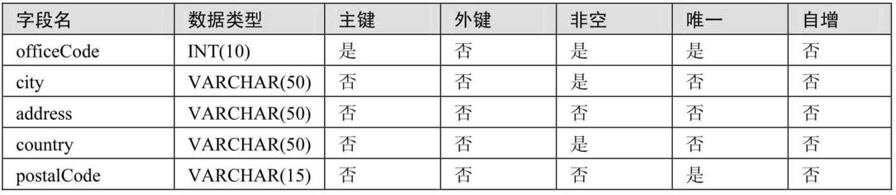

- employees表：

  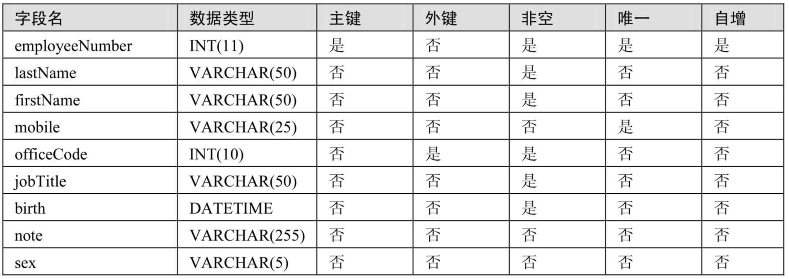

```mysql
#3. 将表employees的mobile字段修改到officeCode字段后面
ALTER TABLE employees MODIFY mobile VARCHAR(25) UNIQUE AFTER officeCode;

#4. 将表employees的birth字段改名为employee_birth
ALTER TABLE employees CHANGE birth employee_birth DATETIME NOT NULL;

#5. 修改sex字段，数据类型为CHAR(1)，非空约束
ALTER TABLE employees MODIFY sex CHAR(1) NOT NULL;

#6. 删除字段note
ALTER TABLE employees DROP COLUMN note;

#7. 增加字段名favoriate_activity，数据类型为VARCHAR(100)
ALTER TABLE employees ADD favoriate_activity VARCHAR(100);

#8. 将表employees名称修改为employees_info
RENAME TABLE employees TO employees_info;
# OR
ALTER TABLE employees RENAME TO employees_info;
```

------

##  第13章、视图

**练习1**

```mysql
#1. 使用表employees创建视图employee_vu，其中包括姓名（LAST_NAME），员工号（EMPLOYEE_ID），部门号(DEPARTMENT_ID)
CREATE OR REPLACE VIEW employee_vu
AS
SELECT last_name, employee_id, department_id
FROM employees;

#2. 显示视图的结构
DESC employee_vu;
# OR
DESCRIBE employee_vu;

#3. 查询视图中的全部内容
SELECT * FROM employee_vu

#4. 将视图中的数据限定在部门号是80的范围内
CREATE OR REPLACE VIEW employee_vu
AS
SELECT last_name, employee_id, department_id
FROM employees
WHERE department_id = 80;
```

**练习2**

```mysql
CREATE TABLE emps
AS
SELECT * FROM atguigudb.employees;

#1. 创建视图emp_v1,要求查询电话号码以‘011’开头的员工姓名和工资、邮箱
CREATE OR REPLACE VIEW emp_v1
AS
SELECT last_name, salary, email
FROM emps
WHERE phone_number LIKE '011%';

#2. 要求将视图 emp_v1 修改为查询电话号码以‘011’开头的并且邮箱中包含 e 字符的员工姓名和邮箱、电话号码
CREATE OR REPLACE VIEW emp_v1
AS
SELECT last_name, salary, email, phone_number
FROM emps
WHERE phone_number LIKE '011%'
AND email LIKE '%e%';

#3. 向 emp_v1 插入一条记录，是否可以？
DESC emps;
DESC emp_v1;
INSERT INTO emp_v1(last_name,salary,email,phone_number)
VALUES('Tom',2300,'tom@126.com','1322321312');
实测不可以，因为原表中last_name,salary,email,phone_number之外的字段中有非空约束且没指定默认值

#4. 修改emp_v1中员工的工资，每人涨薪1000
UPDATE emp_v1 SET salary = salary + 1000;

#5. 删除emp_v1中姓名为Olsen的员工
DELETE FROM emp_v1 WHERE last_name = 'Olsen';

#6. 创建视图emp_v2，要求查询部门的最高工资高于 12000 的部门id和其最高工资
CREATE OR REPLACE VIEW emp_v2
AS
SELECT department_id, MAX(salary)
FROM emps
GROUP BY department_id
HAVING MAX(salary) > 12000;

#7. 向 emp_v2 中插入一条记录，是否可以？
# [Err] 1471 - The target table emp_v2 of the INSERT is not insertable-into
INSERT INTO emp_v2 VALUES(400,18000);
实测不可以

#8. 删除刚才的emp_v2 和 emp_v1
DROP VIEW IF EXISTS emp_v1, emp_v2;
```

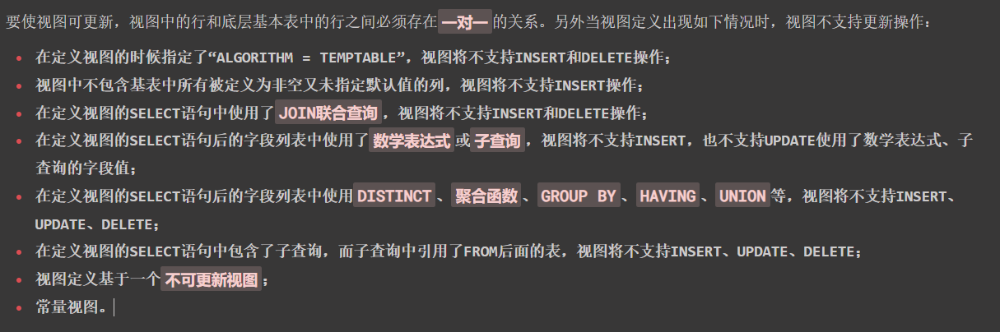

------

## 第14章、存储过程与函数

**存储过程练习**

```mysql
#0.准备工作
CREATE DATABASE test15_pro_func;
USE test15_pro_func;

#1. 创建存储过程insert_user(),实现传入用户名和密码，插入到admin表中
CREATE TABLE admin(
	id INT PRIMARY KEY AUTO_INCREMENT,
	user_name VARCHAR(15) NOT NULL,
	pwd VARCHAR(25) NOT NULL
);

DELIMITER //
CREATE PROCEDURE insert_user(IN username VARCHAR(15), IN pwds VARCHAR(25))
BEGIN
	INSERT INTO admin(user_name, pwd)
	VALUES(username, pwds);
END //
DELIMITER ;

#2. 创建存储过程get_phone(),实现传入女神编号，返回女神姓名和女神电话
CREATE TABLE beauty(
	id INT PRIMARY KEY AUTO_INCREMENT,
	`name` VARCHAR(15) NOT NULL,
	phone VARCHAR(15) UNIQUE,
	birth DATE
);

INSERT INTO beauty(NAME,phone,birth)
VALUES
('朱茵','13201233453','1982-02-12'),
('孙燕姿','13501233653','1980-12-09'),
('田馥甄','13651238755','1983-08-21'),
('邓紫棋','17843283452','1991-11-12'),
('刘若英','18635575464','1989-05-18'),
('杨超越','13761238755','1994-05-11');
SELECT * FROM beauty;

DELIMITER //
CREATE PROCEDURE get_phone(IN bid INT, OUT bname VARCHAR(15), OUT bphone VARCHAR(15))
BEGIN
	SELECT
		`name`, `phone` INTO bname, bphone
	FROM
		beauty
	WHERE
		id = bid;
END //
DELIMITER ;

#3. 创建存储过程date_diff()，实现传入两个女神生日，返回日期间隔大小
DELIMITER //
CREATE PROCEDURE date_diff(IN birth1 DATE, IN birth2 DATE, OUT result INT)
BEGIN
	SELECT DATEDIFF(birth1,birth2) INTO result;
END //
DELIMITER ;

#调用
SET @birth1 = '1992-09-08';
SET @birth2 = '1989-01-03';
CALL date_diff(@birth1,@birth2,@result);
SELECT @result;

#4. 创建存储过程format_date()，实现传入一个日期，格式化成xx年xx月xx日并返回
DELIMITER //
CREATE PROCEDURE format_date(IN date_time DATETIME, OUT res VARCHAR(50)))
BEGIN
	SELECT DATE_FORMAT(date_time, '%y年%m月%d日') INTO res;
END //
DELIMITER ;

#5. 创建存储过程beauty_limit()，根据传入的起始索引和条目数，查询女神表的记录
DELIMITER &&
CREATE PROCEDURE beauty_limit(IN myindex INT, IN mycount INT)
BEGIN
	SELECT * FROM beauty LIMIT myindex, mycount;
END &&
DELIMITER ;

#创建带inout模式参数的存储过程
#6. 传入a和b两个值，最终a和b都翻倍并返回
DELIMITER &&
CREATE PROCEDURE double_res(INOUT a INT, INOUT b INT)
BEGIN
	SET a = a * 2;
	SET b = b * 2;
END &&
DELIMITER ;

# 调用
SET @a = 3, @b = 5;
CALL double_res(@a, @b);
SELECT @a, @b;

#7. 删除题目5的存储过程
DROP PROCEDURE IF EXISTS beauty_limit;

#8. 查看题目6中存储过程的信息
SHOW CREATE PROCEDURE double_res;
SHOW PROCEDURE STATUS LIKE 'double_res';
```

**存储函数练习**

```mysql
#0. 准备工作
USE test15_pro_func;

CREATE TABLE employees
AS
SELECT * FROM atguigudb.`employees`;

CREATE TABLE departments
AS
SELECT * FROM atguigudb.`departments`;

#无参有返回
#1. 创建函数get_count(),返回公司的员工个数
DELIMITER //

CREATE FUNCTION get_count()
RETURNS INT
BEGIN
	RETURN (SELECT COUNT(*) FROM employees);
END //

DELIMITER ;

#调用
SELECT get_count();

#有参有返回
#2. 创建函数ename_salary(),根据员工姓名，返回它的工资
DELIMITER &&

CREATE FUNCTION ename_salary(lname VARCHAR(20))
RETURNS DOUBLE
BEGIN
	RETURN (SELECT salary FROM employees WHERE last_name = lname);
END &&

DELIMITER ;
#调用
SELECT ename_salary('Abel');

#3. 创建函数dept_sal()，根据部门名，返回该部门的平均工资
DELIMITER @@

CREATE FUNCTION dept_sal(dname VARCHAR(30))
RETURNS DOUBLE
BEGIN
	RETURN (
        	SELECT 
        		 AVG(e.salary)
        	FROM 
        		employees e
        	JOIN
        		departments d
        	ON
        		e.department_id = d.department_id
		WHERE
        		d.department_name = dname;
        );
END @@

DELIMITER ;
#调用
SELECT dept_sal('IT');

#4. 创建函数add_float()，实现传入两个float，返回二者之和
DELIMITER //

CREATE FUNCTION add_float(num1 FLOAT, num2 FLOAT)
RETUENS FLOAT
BEGIN
	RETURN (SELECT num1 + num2);
END //

DELIMITER ;
```

------

## 第15章、变量、流程控制与游标

**变量**

```mysql
#0.准备工作
CREATE DATABASE test16_var_cur;
use test16_var_cur;

CREATE TABLE employees
AS
SELECT * FROM atguigudb.`employees`;

CREATE TABLE departments
AS
SELECT * FROM atguigudb.`departments`;

#无参有返回
#1. 创建函数get_count(),返回公司的员工个数
DELIMITER //

CREATE FUNCTION get_count()
RETURNS INT
BEGIN
	DECLARE emp_num INT DEFAULT 0;
	
	SELECT COUNT(*) INTO emp_num FROM employees;
	
	RETURN emp_num;
END //

DELIMITER ;
#调用
SELECT get_count();

#有参有返回
#2. 创建函数ename_salary(),根据员工姓名，返回它的工资
DELIMITER $$

CREATE FUNCTION ename_salary(ename VARCHAR(15))
RETURNS DOUBLE
BEGIN
	#定义用户变量
	SET @sal = 0.0;
	#赋值
	SELECT salary INTO @sal FROM employees WHERE last_name = ename;
	
	RETURN @sal;
END $$

DELIMITER ;
#调用
SELECT ename_salary('Abel');

#3. 创建函数dept_sal() ,根据部门名，返回该部门的平均工资
DELIMITER //

CREATE FUNCTION dept_sal(dept_name VARCHAR(15))
RETURNS DOUBLE
BEGIN
	DECLARE avg_sal DOUBLE DEFAULT 0.0;
	
	SELECT
		AVG(e.salary) INTO avg_sal
	FROM
		employees e
	JOIN
		departments d
	ON
		e.department_id = d.department_id
	WHERE
		d.department_name = dept_name;
	
	RETURN avg_sal;
END //

DELIMITER ;
#调用
SELECT dept_sal('Marketing');

#4. 创建函数add_float()，实现传入两个float，返回二者之和
DELIMITER //

CREATE FUNCTION add_float(num1 FLOAT, num2 FLOAT)
RETURNS FLOAT
BEGIN
	DECLARE sum_f FLOAT;
	
	SET sum_f = num1 + num2; 

	RETURN sum_f;
END //

DELIMITER ;
#调用
SET @v1 := 12.2;
SET @v2 = 2.3;
SELECT add_float(@v1,@v2);
```

**流程控制**

```mysql
#1. 创建函数test_if_case()，实现传入成绩，如果成绩>90,返回A，如果成绩>80,返回B，如果成绩>60,返回C，否则返回D
#要求：分别使用if结构和case结构实现
# 方式1：IF
DELIMITER //
CREATE FUNCTION test_if(score DOUBLE)
RETUENS CHAR
BEGIN
	DECLARE res CHAR;
	
	IF score > 90 THEN
		SET res = 'A';
	ELSEIF score > 80 THEN
		SET res = 'B';
	ELSEIF score > 60 THEN
		SET res = 'C';
	ELSE
		SET res = 'D';
	END IF;
	
	RETURN res;
END //
DELIMITER ;

# 方式2：CASE
DELIMITER //
CREATE FUNCTION test_case(score DOUBLE)
RETUENS CHAR
BEGIN
	DECLARE res CHAR;
	
	CASE 
	WHEN score > 90 THEN
		SET res = 'A';
	WHEN score > 80 THEN
		SET res = 'B';
	WHEN score > 60 THEN
		SET res = 'C';
	ELSE
		SET res = 'D';
	END CASE;
	
	RETURN res;
END //
DELIMITER ;

#2. 创建存储过程test_if_pro()，传入工资值，如果工资值<3000,则删除工资为此值的员工，如果3000 <= 工资值 <= 5000,则修改此工资值的员工薪资涨1000，否则涨工资500
DELIMITER //

CREATE PROCEDURE test_if_pro(IN sal DOUBLE)
BEGIN
	IF sal < 3000 THEN
		DELETE FROM employees WHERE salary = sal;
	ELSEIF sal <= 5000 THEN
		UPDATE employees SET salary = salary + 1000 WHERE salary = sal;
	ELSE
		UPDATE employees SET salary = salary + 500 WHERE salary = sal;
	END IF;
END //

DELIMITER ;
#调用
CALL test_if_pro(3100);

#3. 创建存储过程insert_data(),传入参数为 IN 的 INT 类型变量 insert_count,实现向admin表中批量插入insert_count条记录
CREATE TABLE admin(
	id INT PRIMARY KEY AUTO_INCREMENT,
	user_name VARCHAR(25) NOT NULL,
	user_pwd VARCHAR(35) NOT NULL
);
SELECT * FROM admin;

DELIMITER //

CREATE PROCEDURE insert_data(IN insert_count INT)
BEGIN
	DECLARE i INT DEFAULT 0;
	
	WHILE i < insert_count DO
		INSERT INTO admin(user_name, user_pwd) 
			VALUES(CONCAT('Rose-',i), ROUND(RAND() * 1000000));
		SET i = i + 1;
	END WHILE;
END //

DELIMITER ;
#调用
CALL insert_data(100);
```

**游标的使用**

创建存储过程update_salary()，参数1为 IN 的INT型变量dept_id，表示部门id；参数2为 IN的INT型变量change_sal_count，表示要调整薪资的员工个数。查询指定id部门的员工信息，按照salary升序排列，根据hire_date的情况，调整前change_sal_count个员工的薪资，详情如下。

| hire_date                              | salary               |
| -------------------------------------- | -------------------- |
| hire_date < 1995                       | salary = salary*1.2  |
| hire_date >=1995 and hire_date <= 1998 | salary = salary*1.15 |
| hire_date > 1998 and hire_date <= 2001 | salary = salary*1.10 |
| hire_date > 2001                       | salary = salary*1.05 |

```mysql
DELIMITER //

CREATE PROCEDURE update_salary(IN dept_id INT, IN change_sal_count INT)
BEGIN
	#声明变量
	DECLARE int_count INT DEFAULT 0;
	DECLARE salary_rate DOUBLE DEFAULT 0.0;

	DECLARE date_emp DATE;
	DECLARE emp_id INT;
	
	# 1.声明游标
	DECLARE cursor_date CURSOR FOR 
		SELECT employee_id, hire_date FROM employees WHERE department_id = dept_id ORDER BY salary ASC;
	# 2.打开游标
	OPEN cursor_date;
	
	WHILE int_count < change_sal_count DO
		# 3.使用游标
		FETCH cursor_date INTO emp_id, date_emp;
		
		IF(YEAR(date_emp) < 1995) THEN
			SET salary_rate = 1.2;
		ELSEIF(YEAR(date_emp) <= 1998) THEN
			SET salary_rate = 1.15;
		ELSEIF(YEAR(date_emp) <= 2001) THEN 
			SET salary_rate = 1.10;
		ELSE 
			SET salary_rate = 1.05;
		END IF;
	
		#更新工资
		UPDATE employees SET salary = salary * salary_rate WHERE employee_id = emp_id;

		#迭代条件
		SET int_count = int_count + 1;
	END WHILE;
	
	# 4.关闭游标
	CLOSE cursor_date;
END //

DELIMITER ;
```

------

## 第16章、触发器

**练习一**

```mysql
#0. 准备工作
CREATE TABLE emps
AS
SELECT employee_id, last_name, salary
FROM atguigudb.`employees`;

#1. 复制一张emps表的空表emps_back，只有表结构，不包含任何数据
CREATE TABLE emps_back
AS
SELECT * FROM emps WHERE 1 = 2;

#2. 查询emps_back表中的数据
SELECT * FROM emps_back;

#3. 创建触发器emps_insert_trigger，每当向emps表中添加一条记录时，同步将这条记录添加到emps_back表中
DELIMITER //

CREATE TRIGGER emps_insert_trigger
AFTER INSERT ON emps
FOR EACH ROW
BEGIN
	#将新添加到emps表中的记录添加到emps_back表中
	INSERT INTO emps_back(employee_id, last_name, salary)
	VALUES(NEW.employee_id, NEW.last_name, NEW.salary);
END //

DELIMITER ;

#4. 验证触发器是否起作用
INSERT INTO emps VALUES(300,'Tom',5600);

SELECT * FROM emps_back;
```

**练习二**

```mysql
#0. 准备工作：使用练习1中的emps表
#1. 复制一张emps表的空表emps_back1，只有表结构，不包含任何数据
CREATE TABLE emps_back1
AS
SELECT * FROM emps WHERE 1 = 2;

#2. 查询emps_back1表中的数据
SELECT * FROM emps_back1;

#3. 创建触发器emps_del_trigger，每当向emps表中删除一条记录时，同步将删除的这条记录添加到emps_back1表中
DELIMITER //

CREATE TRIGGER emps_del_trigger
BEFORE DELETE ON emps
FOR EACH ROW
BEGIN
	#将emps表中删除的记录，添加到emps_back1表中。
	INSERT INTO emps_back1(employee_id, last_name, salary)
	VALUES(OLD.employee_id, OLD.last_name, OLD.salary);
END //

DELIMITER ;

#4. 验证触发器是否起作用
#测试1
DELETE FROM emps WHERE employee_id = 101;
SELECT * FROM emps_back1;

#测试2
DELETE FROM emps;
SELECT * FROM emps_back1;
```

------

## 第17章、MySQL8 其它新特性

```mysql
#1. 创建students数据表，如下
CREATE TABLE students(
	id INT PRIMARY KEY AUTO_INCREMENT,
	student VARCHAR(15),
	points TINYINT
);

#2. 向表中添加数据如下
INSERT INTO students(student,points)
VALUES
('张三',89),
('李四',77),
('王五',88),
('赵六',90),
('孙七',90),
('周八',88);

#3. 分别使用RANK()、DENSE_RANK() 和 ROW_NUMBER()函数对学生成绩降序排列情况进行显示
SELECT 
	student,
	points,
	RANK() OVER w AS rank_num,
	DENSE_RANK() OVER w AS dense_num,
	ROW_NUMBER() OVER w AS row_num
FROM
	students
WINDOW w AS (ORDER BY points DESC);
```

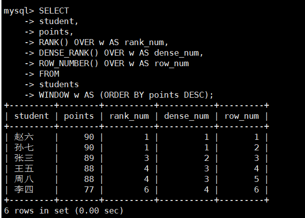

# MySQL_JDBC

> 讲师：尚硅谷-宋红康（江湖人称：康师傅）
>
> 尚硅谷官网：[http://www.atguigu.com](http://www.atguigu.com/)
>
> 视频链接：https://www.bilibili.com/video/BV1eJ411c7rf?vd_source=6e6b2286ee9a603d7bdb2bc5ba80e449

+++

## 一、JDBC概述

### 1 数据的持久化

- 持久化(persistence)：**把数据保存到可掉电式存储设备中以供之后使用**。大多数情况下，特别是企业级应用，**数据持久化意味着将内存中的数据保存到硬盘**上加以”固化”**，而持久化的实现过程大多通过各种关系数据库来完成**。

- 持久化的主要应用是将内存中的数据存储在关系型数据库中，当然也可以存储在磁盘文件、XML数据文件中。

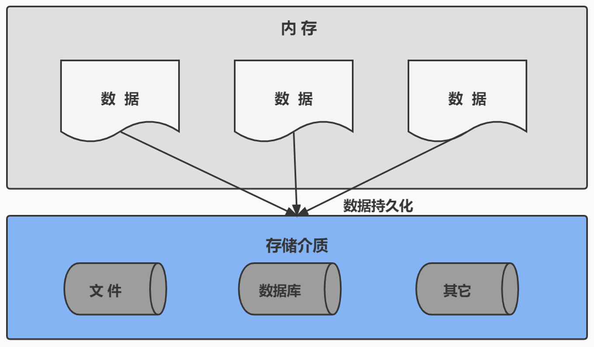


### 2 Java中的数据存储技术

- 在Java中，数据库存取技术可分为如下几类：
  - **JDBC**直接访问数据库
  - JDO (Java Data Object)技术

  - **第三方O/R工具**，如Hibernate, Mybatis等

- JDBC是Java访问数据库的基石，JDO、Hibernate、MyBatis等只是更好的封装了JDBC。


### 3 JDBC介绍

- JDBC(Java Database Connectivity)是一个**独立于特定数据库管理系统、通用的SQL数据库存取和操作的公共接口**（一组API），定义了用来访问数据库的标准Java类库，（**java.sql、javax.sql**）使用这些类库可以以一种**标准**的方法、方便地访问数据库资源。

- JDBC为访问不同的数据库提供了一种**统一的途径**，为开发者屏蔽了一些细节问题。

- JDBC的目标是使Java程序员使用JDBC可以连接任何**提供了JDBC驱动程序**的数据库系统，这样就使得程序员无需对特定的数据库系统的特点有过多的了解，从而大大简化和加快了开发过程。

- 如果没有JDBC，那么Java程序访问数据库时是这样的：

  

- 有了JDBC，Java程序访问数据库时是这样的：

  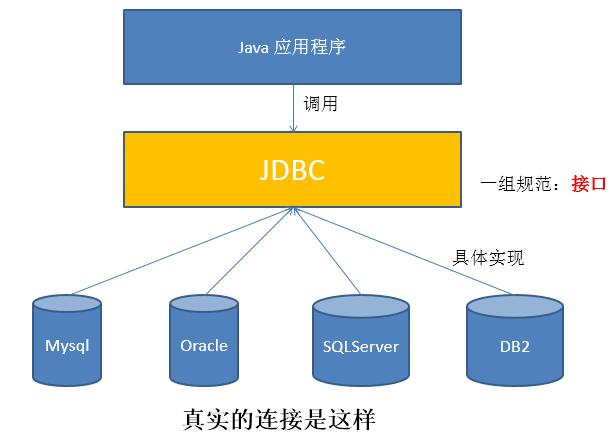

- 总结如下：

  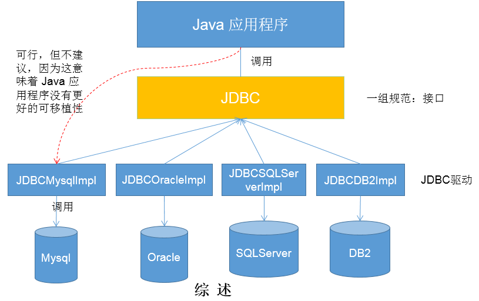

### 4 JDBC体系结构

- JDBC接口（API）包括两个层次：
  - **面向应用的API**：Java API，抽象接口，供应用程序开发人员使用（连接数据库，执行SQL语句，获得结果）。
  - **面向数据库的API**：Java Driver API，供开发商开发数据库驱动程序用。

> **JDBC是sun公司提供一套用于数据库操作的接口，java程序员只需要面向这套接口编程即可。**
>
> **不同的数据库厂商，需要针对这套接口，提供不同实现。不同的实现的集合，即为不同数据库的驱动。																————面向接口编程**


### 5 JDBC程序编写步骤

1. 注册驱动（作用：告诉Java程序，即将要连接的是哪个品牌的数据库）
2. 获取连接`Connection`（表示JVM的进程和数据库进程之间的通道打开了，这属于进程之间的通信，重量级的，使用完之后一定要关闭通道。）
3. 获取数据库操作对象`Statement`（专门执行sql语句的对象）
4. 执行SQL语句（DQL DML....）
5. 处理查询结果集`ResultSet`（只有当第四步执行的是select语句的时候，才有这第五步处理查询结果集。）
6. 释放资源（使用完资源之后一定要关闭资源。Java和数据库属于进程间的通信，开启之后一定要关闭。）


> 补充：ODBC(**Open Database Connectivity**，开放式数据库连接)，是微软在Windows平台下推出的。使用者在程序中只需要调用ODBC API，由 ODBC 驱动程序将调用转换成为对特定的数据库的调用请求。

+++

## 二、获取数据库连接

### 1 要素一：Driver接口实现类

#### 1.1 Driver接口介绍

- java.sql.Driver 接口是所有 JDBC 驱动程序需要实现的接口。这个接口是提供给数据库厂商使用的，不同数据库厂商提供不同的实现。

- 在程序中不需要直接去访问实现了 Driver 接口的类，而是由驱动程序管理器类(java.sql.DriverManager)去调用这些Driver实现。
  - Oracle的驱动：**oracle.jdbc.driver.OracleDriver**
  - mySql的驱动： **com.mysql.jdbc.Driver**


#### 1.2 加载与注册JDBC驱动

- 加载驱动：加载 JDBC 驱动需调用 Class 类的静态方法 forName()，向其传递要加载的 JDBC 驱动的类名

  - **Class.forName(“com.mysql.jdbc.Driver”);**

- 注册驱动：DriverManager 类是驱动程序管理器类，负责管理驱动程序

  - 使用**DriverManager.registerDriver(com.mysql.jdbc.Driver)**来注册驱动

  - 通常不用显式调用 DriverManager 类的 registerDriver() 方法来注册驱动程序类的实例，因为 Driver 接口的驱动程序类**都**包含了静态代码块，在这个静态代码块中，会调用*DriverManager.registerDriver()*方法来注册自身的一个实例。下图是MySQL的Driver实现类的源码：

    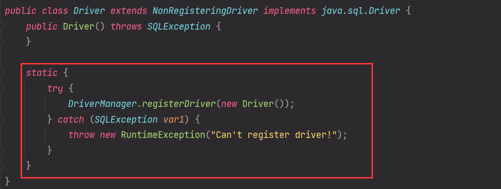

### 2 要素二：URL

- JDBC URL 用于标识一个被注册的驱动程序，驱动程序管理器通过这个 URL 选择正确的驱动程序，从而建立到数据库的连接。

- JDBC URL的标准由三部分组成，各部分间用冒号分隔。

  - **jdbc:子协议://子名称**
  - **协议**：JDBC URL中的协议总是jdbc
  - **子协议**：子协议用于标识一个数据库驱动程序
  - **子名称**：一种标识数据库的方法。子名称可以依不同的子协议而变化，用子名称的目的是为了**定位数据库**提供足够的信息。包含**主机名**(对应服务端的ip地址)，**端口号，数据库名**。

- 举例：

  

- **几种常用数据库的 JDBC URL**

  - MySQL的连接URL编写方式：

    - jdbc:mysql://主机名称:mysql服务端口号/数据库名称?参数=值&参数=值
    - jdbc:mysql://localhost:3306/atguigu
    - jdbc:mysql://localhost:3306/atguigu**?useUnicode=true&characterEncoding=utf8**（如果JDBC程序与服务器端的字符集不一致，会导致乱码，那么可以通过参数指定服务器端的字符集）
    - jdbc:mysql://localhost:3306/atguigu?user=root&password=123456

  - Oracle 9i的连接URL编写方式：

    - jdbc:oracle:thin:@主机名称:oracle服务端口号:数据库名称
    - jdbc:oracle:thin:@localhost:1521:atguigu

  - SQLServer的连接URL编写方式：

    - jdbc:sqlserver://主机名称:sqlserver服务端口号:DatabaseName=数据库名称

    - jdbc:sqlserver://localhost:1433:DatabaseName=atguigu


### 3 要素三：用户名和密码

- user,password可以用“属性名=属性值”方式告诉数据库
- 可以调用 DriverManager 类的 getConnection() 方法建立到数据库的连接


### 4 数据库连接方式举例

#### 4.1 连接方式一

```java
	@Test
    public void testConnection1() {
        try {
            //1.提供java.sql.Driver接口实现类的对象
            Driver driver = new com.mysql.jdbc.Driver();
            //2.提供url，指明具体操作的数据
            String url = "jdbc:mysql://localhost:3306/test";
            
            //3.提供Properties的对象，指明用户名和密码
            Properties info = new Properties();
            info.setProperty("user", "root");
            info.setProperty("password", "abc123");

            //4.调用driver的connect()，获取连接
            Connection conn = driver.connect(url, info);
            System.out.println(conn);
        } catch (SQLException e) {
            e.printStackTrace();
        }
    }
```

> 说明：上述代码中显式出现了第三方数据库的API


#### 4.2 连接方式二

```java
	@Test
    public void testConnection2() {
        try {
            //1.实例化Driver
            Class clazz = Class.forName("com.mysql.jdbc.Driver");
            Driver driver = (Driver) clazz.newInstance();

            //2.提供url，指明具体操作的数据
            String url = "jdbc:mysql://localhost:3306/test";

            //3.提供Properties的对象，指明用户名和密码
            Properties info = new Properties();
            info.setProperty("user", "root");
            info.setProperty("password", "abc123");

            //4.调用driver的connect()，获取连接
            Connection conn = driver.connect(url, info);
            System.out.println(conn);

        } catch (Exception e) {
            e.printStackTrace();
        }
    }
```

> 说明：相较于方式一，这里使用反射实例化Driver，不在代码中体现第三方数据库的API。体现了面向接口编程思想。


#### 4.3 连接方式三

```java
	@Test
    public void testConnection3() {
        try {
            //1.数据库连接的4个基本要素：
            String url = "jdbc:mysql://localhost:3306/test";
            String user = "root";
            String password = "abc123";
            String driverName = "com.mysql.jdbc.Driver";

            //2.实例化Driver
            Class clazz = Class.forName(driverName);
            Driver driver = (Driver) clazz.newInstance();
            //3.注册驱动
            DriverManager.registerDriver(driver);
            //4.获取连接
            Connection conn = DriverManager.getConnection(url, user, password);
            System.out.println(conn);
        } catch (Exception e) {
            e.printStackTrace();
        }
    }
```

> 说明：使用DriverManager实现数据库的连接。体会获取连接必要的4个基本要素。


#### 4.4 连接方式四

```java
	@Test
    public void testConnection4() {
        try {
            //1.数据库连接的4个基本要素：
            String url = "jdbc:mysql://localhost:3306/test";
            String user = "root";
            String password = "abc123";
            String driverName = "com.mysql.jdbc.Driver";

            //2.加载驱动 （①实例化Driver ②注册驱动）
            Class.forName(driverName);
            //3.获取连接
            Connection conn = DriverManager.getConnection(url, user, password);
            System.out.println(conn);
        } catch (Exception e) {
            e.printStackTrace();
        }
    }
```

> 说明：不必显式的注册驱动了。因为在DriverManager的源码中已经存在静态代码块，实现了驱动的注册。


#### 4.5 连接方式五(最终版)

```java
	@Test
    public  void testConnection5() throws Exception {
    	//1.加载配置文件
        InputStream is = ConnectionTest.class.getClassLoader().getResourceAsStream("jdbc.properties");
        Properties pros = new Properties();
        pros.load(is);
        
        //2.读取配置信息
        String user = pros.getProperty("user");
        String password = pros.getProperty("password");
        String url = pros.getProperty("url");
        String driverClass = pros.getProperty("driverClass");

        //3.加载驱动
        Class.forName(driverClass);
        //4.获取连接
        Connection conn = DriverManager.getConnection(url, user, password);
        System.out.println(conn);
    }
```

其中，配置文件声明在工程的src目录下：【jdbc.properties】

```properties
user=root
password=abc123
url=jdbc:mysql://localhost:3306/test
driverClass=com.mysql.jdbc.Driver
```

> 说明：使用配置文件的方式保存配置信息，在代码中加载配置文件
>
> **使用配置文件的好处**：
>
> 1. 实现了代码和数据的分离，如果需要修改配置信息，直接在配置文件中修改，不需要深入代码
> 2. 如果修改了配置信息，省去重新编译的过程。

+++

## 三、使用PreparedStatement实现CRUD操作

### 1 操作和访问数据库

- 数据库连接被用于向数据库服务器发送命令和 SQL 语句，并接受数据库服务器返回的结果。其实一个数据库连接就是一个Socket连接。

- 在 java.sql 包中有 3 个接口分别定义了对数据库的调用的不同方式：

  - Statement：用于执行静态SQL语句并返回它所生成结果的对象。
  - PrepatedStatement：SQL语句被预编译并存储在此对象中，可以使用此对象多次高效地执行该语句。
  - CallableStatement：用于执行 SQL 存储过程。

  

### 2 使用Statement操作数据表的弊端

- 通过调用 Connection 对象的 createStatement() 方法创建该对象。该对象用于执行静态的 SQL 语句，并且返回执行结果。

- Statement 接口中定义了下列方法用于执行 SQL 语句：

  ```java
  int excuteUpdate(String sql); //执行更新操作INSERT、UPDATE、DELETE
  ResultSet executeQuery(String sql); //执行查询操作SELECT
  ```

- 但是使用Statement操作数据表存在弊端：

  - **问题一：存在拼串操作，繁琐**
  - **问题二：存在SQL注入问题**

- SQL 注入是利用某些系统没有对用户输入的数据进行充分的检查，而在用户输入数据中注入非法的 SQL 语句段或命令(如：`SELECT user, password FROM user_table WHERE user='a' OR 1 = ' AND password = ' OR '1' = '1'`)，从而利用系统的 SQL 引擎完成恶意行为的做法。

- 对于 Java 而言，要防范 SQL 注入，只要用`PreparedStatement`(从Statement扩展而来) 取代`Statement`就可以了。

- 代码演示：

  ```java
  public class StatementTest {
  	// 使用Statement的弊端：需要拼写sql语句，并且存在SQL注入的问题
  	@Test
  	public void testLogin() {
  		Scanner scan = new Scanner(System.in);
  
  		System.out.print("用户名：");
  		String userName = scan.nextLine();
  		System.out.print("密   码：");
  		String password = scan.nextLine();
  
  		//SELECT user,password FROM user_table WHERE USER = '1' or ' AND PASSWORD = '='1' or '1' = '1';
  		String sql = "SELECT user,password FROM user_table WHERE USER = '" 
              + userName + "' AND PASSWORD = '" + password + "'";
  		User user = get(sql, User.class);
  		if (user != null) {
  			System.out.println("登陆成功!");
  		} else {
  			System.out.println("用户名或密码错误！");
  		}
  	}
  
  	// 使用Statement实现对数据表的查询操作
  	public <T> T get(String sql, Class<T> clazz) {
  		T t = null;
  
  		Connection conn = null;
  		Statement st = null;
  		ResultSet rs = null;
  		try {
  			// 1.加载配置文件
  			InputStream is = StatementTest.class.getClassLoader().getResourceAsStream("jdbc.properties");
  			Properties pros = new Properties();
  			pros.load(is);
  			// 2.读取配置信息
  			String user = pros.getProperty("user");
  			String password = pros.getProperty("password");
  			String url = pros.getProperty("url");
  			String driverClass = pros.getProperty("driverClass");
  			// 3.加载驱动
  			Class.forName(driverClass);
  			// 4.获取连接
  			conn = DriverManager.getConnection(url, user, password);
  			st = conn.createStatement();
  			rs = st.executeQuery(sql);
  			// 获取结果集的元数据
  			ResultSetMetaData rsmd = rs.getMetaData();
  			// 获取结果集的列数
  			int columnCount = rsmd.getColumnCount();
  			if (rs.next()) {
  				t = clazz.newInstance();
  				for (int i = 0; i < columnCount; i++) {
  					// 1. 获取列的别名
  					String columnName = rsmd.getColumnLabel(i + 1);
  					// 2. 根据列名获取对应数据表中的数据
  					Object columnVal = rs.getObject(columnName);
  					// 3. 将数据表中得到的数据，封装进对象
  					Field field = clazz.getDeclaredField(columnName);
  					field.setAccessible(true);
  					field.set(t, columnVal);
  				}
  				return t;
  			}
  		} catch (Exception e) {
  			e.printStackTrace();
  		} finally {
  			// 关闭资源
  			if (rs != null) {
  				try {
  					rs.close();
  				} catch (SQLException e) {
  					e.printStackTrace();
  				}
  			}
  			if (st != null) {
  				try {
  					st.close();
  				} catch (SQLException e) {
  					e.printStackTrace();
  				}
  			}
  
  			if (conn != null) {
  				try {
  					conn.close();
  				} catch (SQLException e) {
  					e.printStackTrace();
  				}
  			}
  		}
  		return null;
  	}
  }
  ```

综上：

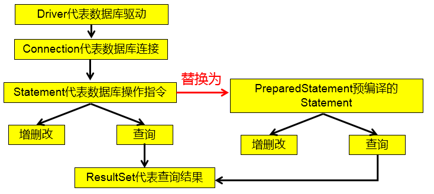

### 3 PreparedStatement的使用

#### 3.1 PreparedStatement介绍

- 可以通过调用 Connection 对象的 **preparedStatement(String sql)** 方法获取 PreparedStatement 对象

- **PreparedStatement 接口是 Statement 的子接口，它表示一条预编译过的 SQL 语句**

- PreparedStatement 对象所代表的 SQL 语句中的参数用问号(?)来表示，调用 PreparedStatement 对象的 setXxx() 方法来设置这些参数. setXxx() 方法有两个参数，第一个参数是要设置的 SQL 语句中的参数的索引(从 1 开始)，第二个是设置的 SQL 语句中的参数的值


#### 3.2 PreparedStatement vs Statement

- 代码的可读性和可维护性。

- **PreparedStatement 能最大可能提高性能：**
  - DBServer会对**预编译**语句提供性能优化。因为预编译语句有可能被重复调用，所以<u>语句在被DBServer的编译器编译后的执行代码被缓存下来，那么下次调用时只要是相同的预编译语句就不需要编译，只要将参数直接传入编译过的语句执行代码中就会得到执行</u>。
  - 在statement语句中，即使是相同操作但因为数据内容不一样，所以整个语句本身不能匹配，没有缓存语句的意义。事实是没有数据库会对普通语句编译后的执行代码缓存。这样<u>每执行一次都要对传入的语句编译一次</u>。
  - (语法检查，语义检查，翻译成二进制命令，缓存)

- PreparedStatement 可以防止 SQL 注入


#### 3.3 Java与SQL对应数据类型转换表

| *Java类型*         | *SQL类型*                |
| ------------------ | ------------------------ |
| boolean            | BIT                      |
| byte               | TINYINT                  |
| short              | SMALLINT                 |
| int                | INTEGER                  |
| long               | BIGINT                   |
| String             | CHAR,VARCHAR,LONGVARCHAR |
| byte   array       | BINARY  ,    VAR BINARY  |
| java.sql.Date      | DATE                     |
| java.sql.Time      | TIME                     |
| java.sql.Timestamp | TIMESTAMP                |


#### 3.4 使用PreparedStatement实现增、删、改操作

```java
import java.io.InputStream;
import java.sql.Connection;
import java.sql.DriverManager;
import java.sql.ResultSet;
import java.sql.SQLException;
import java.sql.Statement;
import java.util.Properties;

/**
 * 操作数据库的工具类
 */
public class JDBCUtils {
	/**
	 * 获取数据库的连接
	 */
	public static Connection getConnection() throws Exception {
		// 1.读取配置文件中的4个基本信息
		InputStream is = ClassLoader.getSystemClassLoader().getResourceAsStream("jdbc.properties");

		Properties pros = new Properties();
		pros.load(is);

		String user = pros.getProperty("user");
		String password = pros.getProperty("password");
		String url = pros.getProperty("url");
		String driverClass = pros.getProperty("driverClass");

		// 2.加载驱动
		Class.forName(driverClass);

		// 3.获取连接
		Connection conn = DriverManager.getConnection(url, user, password);
		return conn;
	}
	/**
	 * 关闭连接
	 */
	public static void closeResource(Connection conn, Statement ps){
		closeResource(conn, ps, null);
	}
	/**
	 * 关闭资源操作
	 * 
	 */
	public static void closeResource(Connection conn,Statement ps,ResultSet rs){
	    try {
			if(rs != null) rs.close();
		} catch (SQLException e) {
			e.printStackTrace();
		}
        try {
			if(ps != null) ps.close();
		} catch (SQLException e) {
			e.printStackTrace();
		}
		try {
			if(conn != null) conn.close();
		} catch (SQLException e) {
			e.printStackTrace();
		}
	}
}
```

```java
	//通用的增、删、改操作（体现一：增、删、改 ； 体现二：针对于不同的表）
	public void update(String sql, Object... args){
		Connection conn = null;
		PreparedStatement ps = null;
		try {
			//1.获取数据库的连接
			conn = JDBCUtils.getConnection();
			
			//2.获取PreparedStatement的实例 (或：预编译sql语句)
			ps = conn.prepareStatement(sql);
			//3.填充占位符
			for(int i = 0;i < args.length;i++){
				ps.setObject(i + 1, args[i]);
			}
			
			//4.执行sql语句
			ps.execute();
		} catch (Exception e) {
			e.printStackTrace();
		}finally{
			//5.关闭资源
			JDBCUtils.closeResource(conn, ps);
		}
	}
```


#### 3.5 使用PreparedStatement实现查询操作

```java
	// 通用的针对于不同表的查询:返回一个对象 (version 1.0)
	public <T> T getInstance(Class<T> clazz, String sql, Object... args) {
		Connection conn = null;
		PreparedStatement ps = null;
		ResultSet rs = null;
		try {
			// 1.获取数据库连接
			conn = JDBCUtils.getConnection();
			// 2.预编译sql语句，得到PreparedStatement对象
			ps = conn.prepareStatement(sql);
			// 3.填充占位符
			for (int i = 0; i < args.length; i++) {
				ps.setObject(i + 1, args[i]);
			}
			// 4.执行executeQuery(),得到结果集：ResultSet
			rs = ps.executeQuery();
			// 5.得到结果集的元数据：ResultSetMetaData
			ResultSetMetaData rsmd = rs.getMetaData();
			// 6.1通过ResultSetMetaData得到columnCount、columnLabel；通过ResultSet得到列值
			int columnCount = rsmd.getColumnCount();
			if (rs.next()) {
				T t = clazz.newInstance();
				for (int i = 0; i < columnCount; i++) {// 遍历每一个列
					// 通过ResultSet获取列值
					Object columnVal = rs.getObject(i + 1);
					// 通过ResultSetMetaData获取列的别名，使用类的属性名充当
					String columnLabel = rsmd.getColumnLabel(i + 1);
					// 6.2使用反射，给对象的相应属性赋值
					Field field = clazz.getDeclaredField(columnLabel);
					field.setAccessible(true);
					field.set(t, columnVal);
				}
				return t;
			}
		} catch (Exception e) {
			e.printStackTrace();
		} finally {
			// 7.关闭资源
			JDBCUtils.closeResource(conn, ps, rs);
		}
		return null;
	}
```

> 说明：使用PreparedStatement实现的查询操作可以替换Statement实现的查询操作，解决Statement拼串和SQL注入问题。


### 4 ResultSet 与 ResultSetMetaData

#### 4.1 ResultSet

- 查询需要调用PreparedStatement 的 executeQuery() 方法，查询结果是一个 ResultSet 对象
- ResultSet 对象以逻辑表格的形式封装了执行数据库操作的结果集，ResultSet 接口由数据库厂商提供实现
- ResultSet 返回的实际上就是一张数据表。有一个指针指向数据表的第一条记录的前面。
- ResultSet 对象维护了一个指向当前数据行的**游标**，初始的时候，游标在第一行之前，可以通过 ResultSet 对象的 next() 方法移动到下一行。调用 next()方法检测下一行是否有效。若有效，该方法返回 true，且指针下移。相当于Iterator对象的 hasNext() 和 next() 方法的结合体。
- 当指针指向一行时, 可以通过调用 getXxx(int index) 或 getXxx(int columnName) 获取每一列的值。

  - 例如: getInt(1), getString("name")
  - **注意：Java与数据库交互涉及到的相关Java API中的索引都从1开始。**
- ResultSet 接口的常用方法：
  - boolean next()

  - getString(int)、getString(String)
  - getInt(int)、getInt(String)
  - close()
  - ......


#### 4.2 ResultSetMetaData

- 可用于获取关于 ResultSet 对象中`列的类型`和`属性信息`的对象。

- ResultSetMetaData meta = rs.getMetaData();
  - **getColumnName**(int column)：获取指定列的名称
  - **getColumnLabel**(int column)：获取指定列的别名
  - **getColumnCount**()：返回当前 ResultSet 对象中的列数。

  - getColumnTypeName(int column)：检索指定列的数据库特定的类型名称。
  - getColumnDisplaySize(int column)：指示指定列的最大标准宽度，以字符为单位。 
  - **isNullable**(int column)：指示指定列中的值是否可以为 null。

  - isAutoIncrement(int column)：指示是否自动为指定列进行编号，这样这些列仍然是只读的。

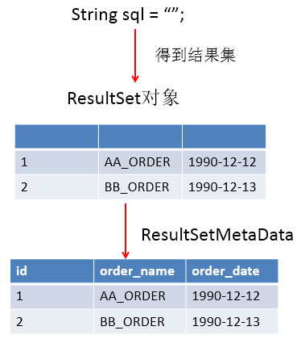

**问题1：得到结果集后, 如何知道该结果集中有哪些列 ？ 列名是什么？**

需要使用一个描述 ResultSet 的对象，即 ResultSetMetaData

**问题2：关于ResultSetMetaData**

1. **如何获取 ResultSetMetaData**：调用 ResultSet 的 getMetaData() 方法即可
2. **获取 ResultSet 中有多少列**：调用 ResultSetMetaData 的 getColumnCount() 方法
3. **获取 ResultSet 每一列的列的别名是什么**：调用 ResultSetMetaData 的getColumnLabel() 方法

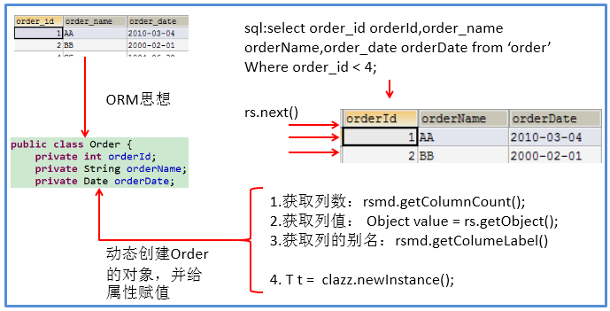


### 5 资源的释放

- 释放`ResultSet`、`Statement`、`Connection`。
- 数据库连接（Connection）是非常稀有的资源，用完后必须马上释放，如果Connection不能及时正确的关闭将导致系统宕机。Connection的使用原则是**尽量晚创建，尽量早的释放**。
- 可以在*finally*中关闭，保证及时其他代码出现异常，资源也一定能被关闭。


### 6 JDBC API小结

- 两种思想

  - 面向接口编程的思想

  - ORM思想(object relational mapping)
    - 一个数据表对应一个java类
    - 表中的一条记录对应java类的一个对象
    - 表中的一个字段对应java类的一个属性

  > sql是需要结合列名和表的属性名来写。注意起别名。

- 两种技术

  - JDBC结果集的元数据：ResultSetMetaData
    - 获取列数：getColumnCount()
    - 获取列的别名：getColumnLabel()
  - 通过反射，创建指定类的对象，获取指定的属性并赋值

+++

## 四、操作BLOB类型字段

### 1 MySQL BLOB类型

- MySQL中，BLOB是一个二进制大型对象，是一个可以存储大量数据的容器，它能容纳不同大小的数据。
- 插入BLOB类型的数据必须使用*PreparedStatement*，因为BLOB类型的数据无法使用字符串拼接写的。

- MySQL的四种BLOB类型(除了在存储的最大信息量上不同外，他们是等同的)

| *类型*     | *大小（单位：字节）* |
| ---------- | -------------------- |
| TinyBlob   | 最大**255**          |
| Blob       | 最大**65K**          |
| MediumBlob | 最大**16M**          |
| LongBlob   | 最大**4G**           |

- 实际使用中根据需要存入的数据大小定义不同的BLOB类型。
- 需要注意的是：如果存储的文件过大，数据库的性能会下降。
- 如果在指定了相关的Blob类型以后，还报错：xxx too large，那么在mysql的安装目录下，找my.ini文件加上如下的配置参数：**max_allowed_packet=16M**。同时注意：修改了my.ini文件之后，需要重新启动mysql服务。


### 2 向数据表中插入大数据类型

```java
//获取连接
Connection conn = JDBCUtils.getConnection();
		
String sql = "insert into customers(name,email,birth,photo) values(?,?,?,?)";
PreparedStatement ps = conn.prepareStatement(sql);

// 填充占位符
ps.setString(1, "徐海强");
ps.setString(2, "xhq@126.com");
ps.setDate(3, new Date(new java.util.Date().getTime()));
// 操作Blob类型的变量
FileInputStream fis = new FileInputStream("xhq.png");
ps.setBlob(4, fis);
//执行
ps.execute();
		
fis.close();
JDBCUtils.closeResource(conn, ps);
```


### 3 修改数据表中的Blob类型字段

```java
Connection conn = JDBCUtils.getConnection();
String sql = "update customers set photo = ? where id = ?";
PreparedStatement ps = conn.prepareStatement(sql);

// 填充占位符
// 操作Blob类型的变量
FileInputStream fis = new FileInputStream("coffee.png");
ps.setBlob(1, fis);
ps.setInt(2, 25);

ps.execute();

fis.close();
JDBCUtils.closeResource(conn, ps);
```


### 4 从数据表中读取大数据类型

```java
String sql = "SELECT id, name, email, birth, photo FROM customer WHERE id = ?";
conn = getConnection();
ps = conn.prepareStatement(sql);
ps.setInt(1, 8);
rs = ps.executeQuery();
if(rs.next()){
	Integer id = rs.getInt(1);
    String name = rs.getString(2);
	String email = rs.getString(3);
    Date birth = rs.getDate(4);
	Customer cust = new Customer(id, name, email, birth);
    System.out.println(cust); 
    //读取Blob类型的字段
	Blob photo = rs.getBlob(5);
	InputStream is = photo.getBinaryStream();
	OutputStream os = new FileOutputStream("c.jpg");
	byte [] buffer = new byte[1024];
	int len = 0;
	while((len = is.read(buffer)) != -1){
		os.write(buffer, 0, len);
	}
    JDBCUtils.closeResource(conn, ps, rs);
		
	if(is != null){
		is.close();
	}
		
	if(os !=  null){
		os.close();
	}   
}
```

+++

## 五、批量插入

### 1 批量执行SQL语句

当需要成批插入或者更新记录时，可以采用Java的批量**更新**机制，这一机制允许多条语句一次性提交给数据库批量处理。通常情况下比单独提交处理更有效率

JDBC的批量处理语句包括下面三个方法：

- **addBatch(String)：添加需要批量处理的SQL语句或是参数；**
- **executeBatch()：执行批量处理语句；**
- **clearBatch()：清空缓存的数据**

通常我们会遇到两种批量执行SQL语句的情况：

- 多条SQL语句的批量处理；
- 一个SQL语句的批量传参；


### 2 高效的批量插入

举例：向数据表中插入20000条数据

- 数据库中提供一个goods表。创建如下：

```sql
CREATE TABLE goods(
	id INT PRIMARY KEY AUTO_INCREMENT,
	NAME VARCHAR(20)
);
```


#### 2.1 实现层次一：使用Statement

```java
Connection conn = JDBCUtils.getConnection();
Statement st = conn.createStatement();
for(int i = 1;i <= 20000;i++){
	String sql = "insert into goods(name) values('name_' + "+ i +")";
	st.executeUpdate(sql);
}
```


#### 2.2 实现层次二：使用PreparedStatement

```java
long start = System.currentTimeMillis();
	
Connection conn = JDBCUtils.getConnection();	
String sql = "insert into goods(name) values(?)";
PreparedStatement ps = conn.prepareStatement(sql);
for(int i = 1;i <= 20000; i++) {
	ps.setString(1, "name_" + i);
	ps.executeUpdate();
}
	
long end = System.currentTimeMillis();
System.out.println("花费的时间为：" + (end - start));//82340
	
JDBCUtils.closeResource(conn, ps);
```


#### 2.3 实现层次三

```java
/*
 * 修改1：使用 addBatch() / executeBatch() / clearBatch()
 * 修改2：mysql服务器默认是关闭批处理的，我们需要通过一个参数，让mysql开启批处理的支持。
 * 		 ?rewriteBatchedStatements=true 写在配置文件的url后面
 * 修改3：使用更新的mysql 驱动：mysql-connector-java-5.1.37-bin.jar 
 */
@Test
public void testInsert1() throws Exception{
	long start = System.currentTimeMillis();
		
	Connection conn = JDBCUtils.getConnection();
		
	String sql = "insert into goods(name)values(?)";
	PreparedStatement ps = conn.prepareStatement(sql);
		
	for(int i = 1;i <= 1000000;i++){
		ps.setString(1, "name_" + i);
		//1.“攒”sql
		ps.addBatch();
		if(i % 500 == 0){
			//2.执行
			ps.executeBatch();
			//3.清空
			ps.clearBatch();
		}
	}
		
	long end = System.currentTimeMillis();
	System.out.println("花费的时间为：" + (end - start));//20000条：625
    												//1000000条:14733  
	JDBCUtils.closeResource(conn, ps);
}
```


#### 2.4 实现层次四

```java
/*
* 层次四：在层次三的基础上操作
* 使用Connection 的 setAutoCommit(false)  /  commit()
*/
@Test
public void testInsert2() throws Exception{
	long start = System.currentTimeMillis();
		
	Connection conn = JDBCUtils.getConnection();
		
	//1.设置为不自动提交数据
	conn.setAutoCommit(false);
		
	String sql = "insert into goods(name)values(?)";
	PreparedStatement ps = conn.prepareStatement(sql);
		
	for(int i = 1;i <= 1000000;i++){
		ps.setString(1, "name_" + i);
			
		//1.“攒”sql
		ps.addBatch();
			
		if(i % 500 == 0){
			//2.执行
			ps.executeBatch();
			//3.清空
			ps.clearBatch();
		}
	}
		
	//2.提交数据
	conn.commit();
		
	long end = System.currentTimeMillis();
	System.out.println("花费的时间为：" + (end - start));//1000000条:4978 
    
	JDBCUtils.closeResource(conn, ps);
}
```

+++

## 六、数据库事务

### 1 数据库事务介绍

- **事务：一组逻辑操作单元，使数据从一种状态变换到另一种状态。**

- **事务处理（事务操作）：**保证所有事务都作为一个工作单元来执行，即使出现了故障，都不能改变这种执行方式。当在一个事务中执行多个操作时，要么所有的事务都**被提交(commit)**，那么这些修改就永久地保存下来；要么数据库管理系统将放弃所作的所有修改，整个事务**回滚(rollback)**到最初状态。

- 为确保数据库中数据的**一致性**，数据的操纵应当是离散的成组的逻辑单元：当它全部完成时，数据的一致性可以保持，而当这个单元中的一部分操作失败，整个事务应全部视为错误，所有从起始点以后的操作应全部回退到开始状态。


### 2 JDBC事务处理

- 数据一旦提交，就不可回滚。

- 数据什么时候意味着提交？

  - **当一个连接对象被创建时，默认情况下是自动提交事务**：每次执行一个 SQL 语句时，如果执行成功，就会向数据库自动提交，而不能回滚。
  - **关闭数据库连接，数据就会自动的提交。**如果多个操作，每个操作使用的是自己单独的连接，则无法保证事务。即同一个事务的多个操作必须在同一个连接下。

- **JDBC程序中为了让多个 SQL 语句作为一个事务执行：**

  - 调用 Connection 对象的 **setAutoCommit(false);** 以取消自动提交事务
  - 在所有的 SQL 语句都成功执行后，调用 **commit();** 方法提交事务
  - 在出现异常时，调用 **rollback();** 方法回滚事务

  > 若此时 Connection 没有被关闭，还可能被重复使用，则需要恢复其自动提交状态 setAutoCommit(true)。尤其是在使用数据库连接池技术时，执行close()方法前，建议恢复自动提交状态。

【案例：用户AA向用户BB转账100】

```java
public void testJDBCTransaction() {
	Connection conn = null;
	try {
		// 1.获取数据库连接
		conn = JDBCUtils.getConnection();
		// 2.开启事务
		conn.setAutoCommit(false);
		// 3.进行数据库操作
		String sql1 = "update user_table set balance = balance - 100 where user = ?";
		update(conn, sql1, "AA");

		// 模拟网络异常
		//System.out.println(10 / 0);

		String sql2 = "update user_table set balance = balance + 100 where user = ?";
		update(conn, sql2, "BB");
		// 4.若没有异常，则提交事务
		conn.commit();
	} catch (Exception e) {
		e.printStackTrace();
		// 5.若有异常，则回滚事务
		try {
			conn.rollback();
		} catch (SQLException e1) {
			e1.printStackTrace();
		}
    } finally {
        try {
			//6.恢复每次DML操作的自动提交功能
			conn.setAutoCommit(true);
		} catch (SQLException e) {
			e.printStackTrace();
		}
        //7.关闭连接
		JDBCUtils.closeResource(conn, null, null); 
    }  
}
```

其中，对数据库操作的方法为：

```java
//使用事务以后的通用的增删改操作（version 2.0）
public void update(Connection conn ,String sql, Object... args) {
	PreparedStatement ps = null;
	try {
		// 1.获取PreparedStatement的实例 (或：预编译sql语句)
		ps = conn.prepareStatement(sql);
		// 2.填充占位符
		for (int i = 0; i < args.length; i++) {
			ps.setObject(i + 1, args[i]);
		}
		// 3.执行sql语句
		ps.execute();
	} catch (Exception e) {
		e.printStackTrace();
	} finally {
		// 4.关闭资源
		JDBCUtils.closeResource(null, ps);
	}
}
```


### 3 事务的ACID属性    

1. **原子性（Atomicity）**
   原子性是指事务是一个不可分割的工作单位，事务中的操作要么都发生，要么都不发生。 

2. **一致性（Consistency）**
   事务必须使数据库从一个一致性状态变换到另外一个一致性状态。

3. **隔离性（Isolation）**
   事务的隔离性是指一个事务的执行不能被其他事务干扰，即一个事务内部的操作及使用的数据对并发的其他事务是隔离的，并发执行的各个事务之间不能互相干扰。

4. **持久性（Durability）**
   持久性是指一个事务一旦被提交，它对数据库中数据的改变就是永久性的，接下来的其他操作和数据库故障不应该对其有任何影响。


#### 3.1 数据库的并发问题

- 对于同时运行的多个事务, 当这些事务访问数据库中相同的数据时, 如果没有采取必要的隔离机制, 就会导致各种并发问题:
  - **脏读**：对于两个事务 T1、T2，T1 读取了已经被 T2 更新但还**没有被提交**的字段。之后，若 T2 回滚，T1读取的内容就是临时且无效的。
  - **不可重复读**：对于两个事务T1、T2，T1 读取了一个字段，然后 T2 **更新**了该字段。之后，T1再次读取同一个字段，值就不同了。
  - **幻读**：对于两个事务T1、T2，T1 从一个表中读取了一个字段，然后 T2 在该表中**插入**了一些新的行。之后，如果 T1 再次读取同一个表，就会多出几行。

- **数据库事务的隔离性**：数据库系统必须具有隔离并发运行各个事务的能力，使它们不会相互影响，避免各种并发问题。

- 一个事务与其他事务隔离的程度称为隔离级别。数据库规定了多种事务隔离级别，不同隔离级别对应不同的干扰程度，**隔离级别越高, 数据一致性就越好, 但并发性越弱。**


#### 3.2 四种隔离级别

- 数据库提供的4种事务隔离级别：
  - `READ UNCOMMITTED`：*读未提交*，在该隔离级别，所有事务都可以看到其他未提交事务的执行结果。不能避免脏读、不可重复读、幻读。
  - `READ COMMITTED`：*读已提交*，它满足了隔离的简单定义：一个事务只能看见已经提交事务所做的改变。这是大多数数据库系统的默认隔离级别（但不是MySQL默认的）。可以避免脏读，但不可重复读、幻读问题仍然存在。
  - `REPEATABLE READ`：*可重复读*，事务A在读到一条数据之后，此时事务B对该数据进行了修改并提交，那么事务A再读该数据，读到的还是原来的内容。可以避免脏读、不可重复读，但幻读问题仍然存在。这是MySQL的默认隔离级别。
  - `SERIALIZABLE`：*串行化*，确保事务可以从一个表中读取相同的行。在这个事务持续期间，禁止其他事务对该表执行插入、更新和删除操作。所有的并发问题都可以避免，但性能十分低下。能避免脏读、不可重复读和幻读。
- Oracle 支持的 2 种事务隔离级别：**READ COMMITED**、SERIALIZABLE。 Oracle 默认的事务隔离级别为：**READ COMMITED**。
- Mysql 支持 4 种事务隔离级别。Mysql 默认的事务隔离级别为：**REPEATABLE READ**。


#### 3.3 在MySql中设置隔离级别

- 每启动一个 mysql 程序，就会获得一个单独的数据库连接。每个数据库连接都有一个全局变量 @@tx_isolation, 表示当前的事务隔离级别。

- 查看当前的隔离级别: 

  ```mysql
  SELECT @@tx_isolation;
  ```

- 设置当前 mySQL 连接的隔离级别:  

  ```mysql
  set transaction isolation level read committed;
  ```

- 设置数据库系统的全局的隔离级别:

  ```mysql
  set global transaction isolation level read committed;
  ```

- 补充操作：

  - 创建mysql数据库用户：

    ```mysql
    create user tom identified by 'abc123';
    ```

  - 授予权限

    ```mysql
    #授予通过网络方式登录的tom用户，对所有库所有表的全部权限，密码设为abc123.
    grant all privileges on *.* to tom@'%'  identified by 'abc123'; 
    
     #给tom用户使用本地命令行方式，授予atguigudb这个库下的所有表的插删改查的权限。
    grant select, delete, update, insert on atguigudb.* to tom@localhost identified by 'abc123';
    ```


+++

## 七、DAO及相关实现类

- DAO：Data Access Object访问数据信息的类和接口，包括了对数据的CRUD（Create、Retrival、Update、Delete），而不包含任何业务相关的信息。有时也称作：BaseDAO

- 作用：为了实现功能的模块化，更有利于代码的维护和升级。

- 下面是尚硅谷JavaWeb阶段书城项目中DAO使用的体现：

  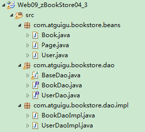

- 层次结构：

  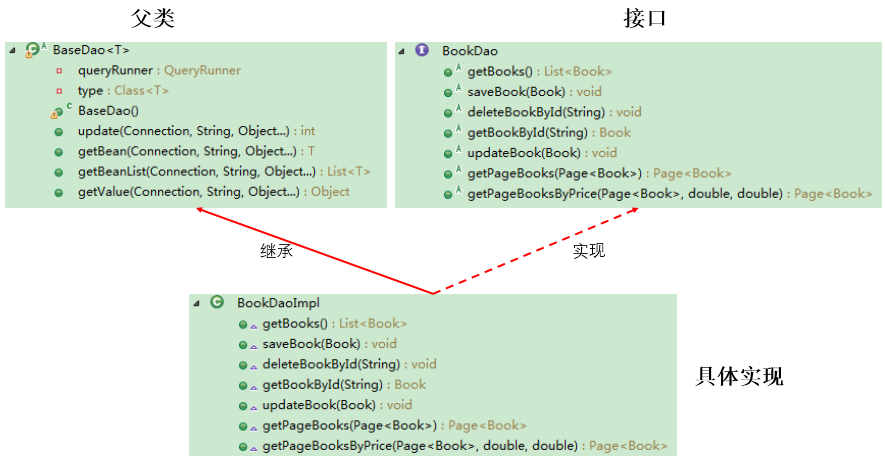

### 1 Bean

#### 1.1 Book.java

```java
package com.atguigu.bookstore.beans;
/**
 * 图书类
 * @author songhongkang
 *
 */
public class Book {

	private Integer id;
	private String title; // 书名
	private String author; // 作者
	private double price; // 价格
	private Integer sales; // 销量
	private Integer stock; // 库存
	private String imgPath = "static/img/default.jpg"; // 封面图片的路径
	//构造器，get()，set()，toString()方法略
}
```


#### 1.2 Page.java

```java
package com.atguigu.bookstore.beans;

import java.util.List;
/**
 * 页码类
 * @author songhongkang
 *
 */
public class Page<T> {

	private List<T> list; // 每页查到的记录存放的集合
	public static final int PAGE_SIZE = 4; // 每页显示的记录数
	private int pageNo; // 当前页
	//	private int totalPageNo; // 总页数，通过计算得到
	private int totalRecord; // 总记录数，通过查询数据库得到
    //构造器，get()，set()，toString()方法略
}
```


#### 1.3 User.java

```java
package com.atguigu.bookstore.beans;
/**
 * 用户类
 */
public class User {
	private Integer id;
	private String username;
	private String password;
	private String email;
    //构造器，get()，set()，toString()方法略
}
```


### 2 BaseDao.java

```java
package com.atguigu.bookstore.dao;

import java.lang.reflect.ParameterizedType;
import java.lang.reflect.Type;
import java.sql.Connection;
import java.sql.SQLException;
import java.util.List;

import org.apache.commons.dbutils.QueryRunner;
import org.apache.commons.dbutils.handlers.BeanHandler;
import org.apache.commons.dbutils.handlers.BeanListHandler;
import org.apache.commons.dbutils.handlers.ScalarHandler;


/**
 * 定义一个用来被继承的对数据库进行基本操作的Dao
 */
public abstract class BaseDao<T> {
	private QueryRunner queryRunner = new QueryRunner();
	// 定义一个变量来接收泛型的类型
	private Class<T> type;

	// 获取T的Class对象，获取泛型的类型，泛型是在被子类继承时才确定
	public BaseDao() {
		// 获取子类的类型
		Class clazz = this.getClass();
		// 获取父类的类型
		// getGenericSuperclass()用来获取当前类的父类的类型
		// ParameterizedType表示的是带泛型的类型
		ParameterizedType parameterizedType = (ParameterizedType) clazz.getGenericSuperclass();
		// 获取具体的泛型类型 getActualTypeArguments获取具体的泛型的类型
		// 这个方法会返回一个Type的数组
		Type[] types = parameterizedType.getActualTypeArguments();
		// 获取具体的泛型的类型·
		this.type = (Class<T>) types[0];
	}

	/**
	 * 通用的增删改操作
	 */
	public int update(Connection conn, String sql, Object... params) {
		int count = 0;
		try {
			count = queryRunner.update(conn, sql, params);
		} catch (SQLException e) {
			e.printStackTrace();
		} 
		return count;
	}

	/**
	 * 获取一个对象
	 */
	public T getBean(Connection conn, String sql, Object... params) {
		T t = null;
		try {
			t = queryRunner.query(conn, sql, new BeanHandler<T>(type), params);
		} catch (SQLException e) {
			e.printStackTrace();
		} 
		return t;
	}

	/**
	 * 获取所有对象
	 */
	public List<T> getBeanList(Connection conn, String sql, Object... params) {
		List<T> list = null;
		try {
			list = queryRunner.query(conn, sql, new BeanListHandler<T>(type), params);
		} catch (SQLException e) {
			e.printStackTrace();
		} 
		return list;
	}

	/**
	 * 获取一个但一值得方法，专门用来执行像 select count(*)...这样的sql语句
	 */
	public Object getValue(Connection conn,String sql, Object... params) {
		Object count = null;
		try {
			// 调用queryRunner的query方法获取一个单一的值
			count = queryRunner.query(conn, sql, new ScalarHandler<>(), params);
		} catch (SQLException e) {
			e.printStackTrace();
		} 
		return count;
	}
}
```


### 3 Dao接口及其实现类

#### 3.1 BookDao.java

```java
package com.atguigu.bookstore.dao;

import java.sql.Connection;
import java.util.List;

import com.atguigu.bookstore.beans.Book;
import com.atguigu.bookstore.beans.Page;

public interface BookDao {
	/**
	 * 从数据库中查询出所有的记录
	 * 
	 * @return
	 */
	List<Book> getBooks(Connection conn);

	/**
	 * 向数据库中插入一条记录
	 * 
	 * @param book
	 */
	void saveBook(Connection conn, Book book);

	/**
	 * 从数据库中根据图书的id删除一条记录
	 * 
	 * @param bookId
	 */
	void deleteBookById(Connection conn, String bookId);

	/**
	 * 根据图书的id从数据库中查询出一条记录
	 * 
	 * @param bookId
	 * @return
	 */
	Book getBookById(Connection conn, String bookId);

	/**
	 * 根据图书的id从数据库中更新一条记录
	 * 
	 * @param book
	 */
	void updateBook(Connection conn, Book book);

	/**
	 * 获取带分页的图书信息
	 * 
	 * @param page：是只包含了用户输入的pageNo属性的page对象
	 * @return 返回的Page对象是包含了所有属性的Page对象
	 */
	Page<Book> getPageBooks(Connection conn, Page<Book> page);

	/**
	 * 获取带分页和价格范围的图书信息
	 * 
	 * @param page：是只包含了用户输入的pageNo属性的page对象
	 * @return 返回的Page对象是包含了所有属性的Page对象
	 */
	Page<Book> getPageBooksByPrice(Connection conn,Page<Book> page, double minPrice, double maxPrice);
}
```


#### 3.2 BookDaoImpl.java

```java
package com.atguigu.bookstore.dao.impl;

import java.sql.Connection;
import java.util.List;

import com.atguigu.bookstore.beans.Book;
import com.atguigu.bookstore.beans.Page;
import com.atguigu.bookstore.dao.BaseDao;
import com.atguigu.bookstore.dao.BookDao;

public class BookDaoImpl extends BaseDao<Book> implements BookDao {
	@Override
	public List<Book> getBooks(Connection conn) {
		// 调用BaseDao中得到一个List的方法
		List<Book> beanList = null;
		// 写sql语句
		String sql = "select id,title,author,price,sales,stock,img_path imgPath from books";
		beanList = getBeanList(conn,sql);
		return beanList;
	}

	@Override
	public void saveBook(Connection conn,Book book) {
		// 写sql语句
		String sql = "insert into books(title,author,price,sales,stock,img_path) values(?,?,?,?,?,?)";
		// 调用BaseDao中通用的增删改的方法
		update(conn,sql, book.getTitle(), book.getAuthor(), book.getPrice(), book.getSales(), book.getStock(),book.getImgPath());
	}

	@Override
	public void deleteBookById(Connection conn, String bookId) {
		// 写sql语句
		String sql = "DELETE FROM books WHERE id = ?";
		// 调用BaseDao中通用增删改的方法
		update(conn, sql, bookId);
	}

	@Override
	public Book getBookById(Connection conn,String bookId) {
		// 调用BaseDao中获取一个对象的方法
		Book book = null;
		// 写sql语句
		String sql = "select id,title,author,price,sales,stock,img_path imgPath from books where id = ?";
		book = getBean(conn,sql, bookId);
		return book;
	}

	@Override
	public void updateBook(Connection conn,Book book) {
		// 写sql语句
		String sql = "update books set title = ? , author = ? , price = ? , sales = ? , stock = ? where id = ?";
		// 调用BaseDao中通用的增删改的方法
		update(conn,sql, book.getTitle(), book.getAuthor(), book.getPrice(), book.getSales(), book.getStock(), book.getId());
	}

	@Override
	public Page<Book> getPageBooks(Connection conn, Page<Book> page) {
		// 获取数据库中图书的总记录数
		String sql = "select count(*) from books";
		// 调用BaseDao中获取一个单一值的方法
		long totalRecord = (long) getValue(conn, sql);
		// 将总记录数设置都page对象中
		page.setTotalRecord((int) totalRecord);

		// 获取当前页中的记录存放的List
		String sql2 = "select id, title, author, price, sales, stock, img_path imgPath from books limit ?,?";
		// 调用BaseDao中获取一个集合的方法
		List<Book> beanList = getBeanList(conn, sql2, (page.getPageNo() - 1) * Page.PAGE_SIZE, Page.PAGE_SIZE);
		// 将这个List设置到page对象中
		page.setList(beanList);
		return page;
	}

	@Override
	public Page<Book> getPageBooksByPrice(Connection conn,Page<Book> page, double minPrice, double maxPrice) {
		// 获取数据库中图书的总记录数
		String sql = "select count(*) from books where price between ? and ?";
		// 调用BaseDao中获取一个单一值的方法
		long totalRecord = (long) getValue(conn,sql,minPrice,maxPrice);
		// 将总记录数设置都page对象中
		page.setTotalRecord((int) totalRecord);

		// 获取当前页中的记录存放的List
		String sql2 = "select id,title,author,price,sales,stock,img_path imgPath from books where price between ? and ? limit ?,?";
		// 调用BaseDao中获取一个集合的方法
		List<Book> beanList = getBeanList(conn,sql2, minPrice , maxPrice , (page.getPageNo() - 1) * Page.PAGE_SIZE, Page.PAGE_SIZE);
		// 将这个List设置到page对象中
		page.setList(beanList);
		
		return page;
	}
}
```


#### 3.3 UserDao.java

```java
package com.atguigu.bookstore.dao;

import java.sql.Connection;

import com.atguigu.bookstore.beans.User;

public interface UserDao {
	/**
	 * 根据User对象中的用户名和密码从数据库中获取一条记录
	 * 
	 * @param user
	 * @return User 数据库中有记录 null 数据库中无此记录
	 */
	User getUser(Connection conn,User user);

	/**
	 * 根据User对象中的用户名从数据库中获取一条记录
	 * 
	 * @param user
	 * @return true 数据库中有记录 false 数据库中无此记录
	 */
	boolean checkUsername(Connection conn,User user);

	/**
	 * 向数据库中插入User对象
	 * 
	 * @param user
	 */
	void saveUser(Connection conn,User user);
}
```


#### 3.4 UserDaoImpl.java

```java
package com.atguigu.bookstore.dao.impl;

import java.sql.Connection;

import com.atguigu.bookstore.beans.User;
import com.atguigu.bookstore.dao.BaseDao;
import com.atguigu.bookstore.dao.UserDao;

public class UserDaoImpl extends BaseDao<User> implements UserDao {
	@Override
	public User getUser(Connection conn,User user) {
		// 调用BaseDao中获取一个对象的方法
		User bean = null;
		// 写sql语句
		String sql = "select id,username,password,email from users where username = ? and password = ?";
		bean = getBean(conn,sql, user.getUsername(), user.getPassword());
		return bean;
	}

	@Override
	public boolean checkUsername(Connection conn,User user) {
		// 调用BaseDao中获取一个对象的方法
		User bean = null;
		// 写sql语句
		String sql = "select id,username,password,email from users where username = ?";
		bean = getBean(conn,sql, user.getUsername());
		return bean != null;
	}

	@Override
	public void saveUser(Connection conn,User user) {
		//写sql语句
		String sql = "insert into users(username,password,email) values(?,?,?)";
		//调用BaseDao中通用的增删改的方法
		update(conn,sql, user.getUsername(),user.getPassword(),user.getEmail());
	}
}
```

+++

## 八、数据库连接池

### 1 JDBC数据库连接池的必要性

- 在使用开发基于数据库的web程序时，传统的模式基本是按以下步骤：
  - **在主程序（如servlet、beans）中建立数据库连接**
  - **进行sql操作**
  - **断开数据库连接**

- 这种模式开发，存在的问题：
  - 普通的JDBC数据库连接使用 DriverManager 来获取，每次向数据库建立连接的时候都要将 Connection 加载到内存中，再验证用户名和密码(得花费0.05s～1s的时间)。需要数据库连接的时候，就向数据库要求一个，执行完成后再断开连接。这样的方式将会消耗大量的资源和时间。**数据库的连接资源并没有得到很好的重复利用。**若同时有几百人甚至几千人在线，频繁的进行数据库连接操作将占用很多的系统资源，严重的甚至会造成服务器的崩溃。
  - **对于每一次数据库连接，使用完后都得断开。**否则，如果程序出现异常而未能关闭，将会导致数据库系统中的内存泄漏，最终将导致重启数据库。（回忆：何为Java的内存泄漏？）
  - **这种开发不能控制被创建的连接对象数**，系统资源会被毫无顾及的分配出去，如连接过多，也可能导致内存泄漏，服务器崩溃。 


### 2 数据库连接池技术

- 为解决传统开发中的数据库连接问题，可以采用数据库连接池技术。
- **数据库连接池的基本思想**：就是为数据库连接建立一个“缓冲池”。预先在缓冲池中放入一定数量的连接，当需要建立数据库连接时，只需从“缓冲池”中取出一个，使用完毕之后再放回去。

- **数据库连接池**负责分配、管理和释放数据库连接，它**允许应用程序重复使用一个现有的数据库连接，而不是重新建立一个**。
- 数据库连接池在初始化时将创建一定数量的数据库连接放到连接池中，这些数据库连接的数量是由**最小数据库连接数来设定**的。无论这些数据库连接是否被使用，连接池都将一直保证至少拥有这么多的连接数量。连接池的**最大数据库连接数量**限定了这个连接池能占有的最大连接数，当应用程序向连接池请求的连接数超过最大连接数量时，这些请求将被加入到等待队列中。

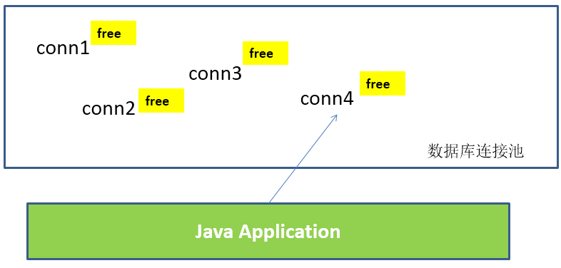

- **工作原理**：

  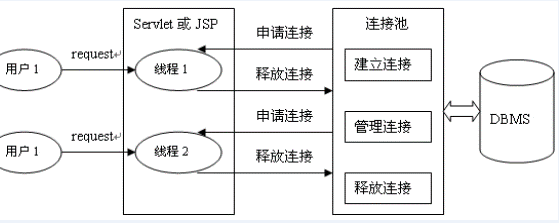

- **数据库连接池技术的优点**：

  1. **资源重用**

     由于数据库连接得以重用，避免了频繁创建，释放连接引起的大量性能开销。在减少系统消耗的基础上，另一方面也增加了系统运行环境的平稳性。

  2. **更快的系统反应速度**

     数据库连接池在初始化过程中，往往已经创建了若干数据库连接置于连接池中备用。此时连接的初始化工作均已完成。对于业务请求处理而言，直接利用现有可用连接，避免了数据库连接初始化和释放过程的时间开销，从而减少了系统的响应时间

  3. **新的资源分配手段**

     对于多应用共享同一数据库的系统而言，可在应用层通过数据库连接池的配置，实现某一应用最大可用数据库连接数的限制，避免某一应用独占所有的数据库资源

  4. **统一的连接管理，避免数据库连接泄漏**

     在较为完善的数据库连接池实现中，可根据预先的占用超时设定，强制回收被占用连接，从而避免了常规数据库连接操作中可能出现的资源泄露


### 3 多种开源的数据库连接池

- JDBC 的数据库连接池使用 javax.sql.DataSource 来表示，DataSource 只是一个接口，该接口通常由服务器(Weblogic, WebSphere, Tomcat)提供实现，也有一些开源组织提供实现：
  - **DBCP** 是Apache提供的数据库连接池。tomcat 服务器自带dbcp数据库连接池。**速度相对c3p0较快**，但因自身存在BUG，Hibernate3已不再提供支持。
  - **C3P0** 是一个开源组织提供的一个数据库连接池，**速度相对较慢，稳定性还可以。**hibernate官方推荐使用
  - **Proxool** 是sourceforge下的一个开源项目数据库连接池，有监控连接池状态的功能，**稳定性较c3p0差一点**
  - **BoneCP** 是一个开源组织提供的数据库连接池，速度快
  - **Druid** 是阿里提供的数据库连接池，据说是集DBCP 、C3P0 、Proxool 优点于一身的数据库连接池，但是速度不确定是否有BoneCP快
- DataSource 通常被称为数据源，它包含连接池和连接池管理两个部分，习惯上也经常把 DataSource 称为连接池
- **DataSource用来取代DriverManager来获取Connection，获取速度快，同时可以大幅度提高数据库访问速度。**
- 特别注意：
  - 数据源和数据库连接不同，数据源无需创建多个，它是产生数据库连接的工厂，因此**整个应用只需要一个数据源即可。**
  - 当数据库访问结束后，程序还是像以前一样关闭数据库连接：conn.close(); 但conn.close()并没有关闭数据库的物理连接，它仅仅把数据库连接释放，归还给了数据库连接池。


#### 3.1 C3P0数据库连接池

- 获取连接方式一

```java
//使用C3P0数据库连接池的方式，获取数据库的连接：不推荐
public static Connection getConnection1() throws Exception{
	ComboPooledDataSource cpds = new ComboPooledDataSource();
	cpds.setDriverClass("com.mysql.jdbc.Driver"); 
	cpds.setJdbcUrl("jdbc:mysql://localhost:3306/test");
	cpds.setUser("root");
	cpds.setPassword("abc123");
		
	//cpds.setMaxPoolSize(100);
	
	Connection conn = cpds.getConnection();
	return conn;
}
```


- 获取连接方式二

```java
//使用C3P0数据库连接池的配置文件方式，获取数据库的连接：推荐
private static DataSource cpds = new ComboPooledDataSource("helloc3p0");
public static Connection getConnection2() throws SQLException{
	Connection conn = cpds.getConnection();
	return conn;
}
```

其中，src下的配置文件为：【c3p0-config.xml】

```xml
<?xml version="1.0" encoding="UTF-8"?>
<c3p0-config>
	<named-config name="helloc3p0">
		<!-- 获取连接的4个基本信息 -->
		<property name="user">root</property>
		<property name="password">abc123</property>
		<property name="jdbcUrl">jdbc:mysql:///test</property>
		<property name="driverClass">com.mysql.jdbc.Driver</property>
		
		<!-- 涉及到数据库连接池的管理的相关属性的设置 -->
		<!-- 若数据库中连接数不足时, 一次向数据库服务器申请多少个连接 -->
		<property name="acquireIncrement">5</property>
		<!-- 初始化数据库连接池时连接的数量 -->
		<property name="initialPoolSize">5</property>
		<!-- 数据库连接池中的最小的数据库连接数 -->
		<property name="minPoolSize">5</property>
		<!-- 数据库连接池中的最大的数据库连接数 -->
		<property name="maxPoolSize">10</property>
		<!-- C3P0 数据库连接池可以维护的 Statement 的个数 -->
		<property name="maxStatements">20</property>
		<!-- 每个连接同时可以使用的 Statement 对象的个数 -->
		<property name="maxStatementsPerConnection">5</property>

	</named-config>
</c3p0-config>
```


#### 3.2 DBCP数据库连接池

- DBCP 是 Apache 软件基金组织下的开源连接池实现，该连接池依赖该组织下的另一个开源系统：Common-pool。如需使用该连接池实现，应在系统中增加如下两个 jar 文件：
  - Commons-dbcp.jar：连接池的实现
  - Commons-pool.jar：连接池实现的依赖库
- **Tomcat 的连接池正是采用该连接池来实现的。**该数据库连接池既可以与应用服务器整合使用，也可由应用程序独立使用。
- 数据源和数据库连接不同，数据源无需创建多个，它是产生数据库连接的工厂，因此整个应用只需要一个数据源即可。
- 当数据库访问结束后，程序还是像以前一样关闭数据库连接：conn.close(); 但上面的代码并没有关闭数据库的物理连接，它仅仅把数据库连接释放，归还给了数据库连接池。
- 配置属性说明

| *属性*                     | *默认值* | *说明*                                                       |
| -------------------------- | -------- | ------------------------------------------------------------ |
| initialSize                | 0        | 连接池启动时创建的初始化连接数量                             |
| maxActive                  | 8        | 连接池中可同时连接的最大的连接数                             |
| maxIdle                    | 8        | 连接池中最大的空闲的连接数，超过的空闲连接将被释放，如果设置为负数表示不限制 |
| minIdle                    | 0        | 连接池中最小的空闲的连接数，低于这个数量会被创建新的连接。该参数越接近maxIdle，性能越好，因为连接的创建和销毁，都是需要消耗资源的；但是不能太大。 |
| maxWait                    | 无限制   | 最大等待时间，当没有可用连接时，连接池等待连接释放的最大时间，超过该时间限制会抛出异常，如果设置-1表示无限等待 |
| poolPreparedStatements     | false    | 开启池的Statement是否prepared                                |
| maxOpenPreparedStatements  | 无限制   | 开启池的prepared 后的同时最大连接数                          |
| minEvictableIdleTimeMillis |          | 连接池中连接，在时间段内一直空闲， 被逐出连接池的时间        |
| removeAbandonedTimeout     | 300      | 超过时间限制，回收没有用(废弃)的连接                         |
| removeAbandoned            | false    | 超过removeAbandonedTimeout时间后，是否进 行没用连接（废弃）的回收 |

- 获取连接方式一：

```java
public static Connection getConnection3() throws Exception {
	BasicDataSource source = new BasicDataSource();
		
	source.setDriverClassName("com.mysql.jdbc.Driver");
	source.setUrl("jdbc:mysql:///test");
	source.setUsername("root");
	source.setPassword("abc123");

	source.setInitialSize(10);
		
	Connection conn = source.getConnection();
	return conn;
}
```

- 获取连接方式二：

```java
//使用dbcp数据库连接池的配置文件方式，获取数据库的连接：推荐
private static DataSource source = null;
static{
	try {
		Properties pros = new Properties();
		
		InputStream is = DBCPTest.class.getClassLoader().getResourceAsStream("dbcp.properties");
			
		pros.load(is);
		//根据提供的BasicDataSourceFactory创建对应的DataSource对象
		source = BasicDataSourceFactory.createDataSource(pros);
	} catch (Exception e) {
		e.printStackTrace();
	}
}
public static Connection getConnection4() throws Exception {
	Connection conn = source.getConnection();
	return conn;
}
```

其中，src下的配置文件为：【dbcp.properties】

```properties
driverClassName=com.mysql.jdbc.Driver
url=jdbc:mysql://localhost:3306/test?rewriteBatchedStatements=true&useServerPrepStmts=false
username=root
password=abc123
initialSize=10
#...
```


#### 3.3 Druid（德鲁伊）数据库连接池

Druid是阿里巴巴开源平台上一个数据库连接池实现，它结合了C3P0、DBCP、Proxool等DB池的优点，同时加入了日志监控，可以很好的监控DB池连接和SQL的执行情况，可以说是针对监控而生的DB连接池，**可以说是目前最好的连接池之一**。

```java
package com.atguigu.druid;

import java.sql.Connection;
import java.util.Properties;

import javax.sql.DataSource;

import com.alibaba.druid.pool.DruidDataSourceFactory;

public class TestDruid {
	public static void main(String[] args) throws Exception {
		Properties pro = new Properties();		 
         pro.load(TestDruid.class.getClassLoader().getResourceAsStream("druid.properties"));
		DataSource ds = DruidDataSourceFactory.createDataSource(pro);
		Connection conn = ds.getConnection();
		System.out.println(conn);
	}
}

```

其中，src下的配置文件为：【druid.properties】

```java
url=jdbc:mysql://localhost:3306/test?rewriteBatchedStatements=true
username=root
password=123456
driverClassName=com.mysql.jdbc.Driver

initialSize=10
maxActive=20
maxWait=1000
filters=wall
```

- 详细配置参数：

| **配置**                      | **缺省** | **说明**                                                     |
| ----------------------------- | -------- | ------------------------------------------------------------ |
| name                          |          | 配置这个属性的意义在于，如果存在多个数据源，监控的时候可以通过名字来区分开来。<br />如果没有配置，将会生成一个名字，格式是：”DataSource-” +   System.identityHashCode(this) |
| url                           |          | 连接数据库的url，不同数据库不一样。例如：<br />mysql:jdbc:mysql://10.20.153.104:3306/druid2      <br />oracle:jdbc:oracle:thin:@10.20.149.85:1521:ocnauto |
| username                      |          | 连接数据库的用户名                                           |
| password                      |          | 连接数据库的密码。如果你不希望密码直接写在配置文件中，可以使用ConfigFilter。<br />详细看这里：<https://github.com/alibaba/druid/wiki/%E4%BD%BF%E7%94%A8ConfigFilter> |
| driverClassName               |          | 根据url自动识别   <br />这一项可配可不配，如果不配置druid会根据url自动识别dbType，然后选择相应的driverClassName(建议配置下) |
| initialSize                   | 0        | 初始化时建立物理连接的个数。初始化发生在显示调用init方法，或者第一次getConnection时 |
| maxActive                     | 8        | 最大连接池数量                                               |
| maxIdle                       | 8        | 已经不再使用，配置了也没效果                                 |
| minIdle                       |          | 最小连接池数量                                               |
| maxWait                       |          | 获取连接时最大等待时间，单位毫秒。配置了maxWait之后，缺省启用公平锁，并发效率会有所下降，<br />如果需要可以通过配置useUnfairLock属性为true使用非公平锁。 |
| poolPreparedStatements        | false    | 是否缓存preparedStatement，也就是PSCache。PSCache对支持游标的数据库性能提升巨大，<br />比如说oracle。在mysql下建议关闭。 |
| maxOpenPreparedStatements     | -1       | 要启用PSCache，必须配置大于0，当大于0时，poolPreparedStatements自动触发修改为true。<br />在Druid中，不会存在Oracle下PSCache占用内存过多的问题，可以把这个数值配置大一些，比如说100 |
| validationQuery               |          | 用来检测连接是否有效的sql，要求是一个查询语句。<br />如果validationQuery为null，testOnBorrow、testOnReturn、testWhileIdle都不会其作用。 |
| testOnBorrow                  | true     | 申请连接时执行validationQuery检测连接是否有效，做了这个配置会降低性能。 |
| testOnReturn                  | false    | 归还连接时执行validationQuery检测连接是否有效，做了这个配置会降低性能 |
| testWhileIdle                 | false    | 建议配置为true，不影响性能，并且保证安全性。<br />申请连接的时候检测，如果空闲时间大于timeBetweenEvictionRunsMillis，执行validationQuery检测连接是否有效。 |
| timeBetweenEvictionRunsMillis |          | 有两个含义：<br />1. Destroy线程会检测连接的间隔时间<br />2. testWhileIdle的判断依据，详细看testWhileIdle属性的说明 |
| numTestsPerEvictionRun        |          | 不再使用，一个DruidDataSource只支持一个EvictionRun           |
| minEvictableIdleTimeMillis    |          |                                                              |
| connectionInitSqls            |          | 物理连接初始化的时候执行的sql                                |
| exceptionSorter               |          | 根据dbType自动识别   当数据库抛出一些不可恢复的异常时，抛弃连接 |
| filters                       |          | 属性类型是字符串，通过别名的方式配置扩展插件，常用的插件有：   <br />监控统计用的filter:stat、日志用的filter:log4j、防御sql注入的filter:wall |
| proxyFilters                  |          | 类型是List，如果同时配置了filters和proxyFilters，是组合关系，并非替换关系 |

+++

## 九、Apache-DBUtils实现CRUD操作

### 1 Apache-DBUtils简介

- commons-dbutils 是 Apache 组织提供的一个开源 JDBC工具类库，它是对JDBC的简单封装，学习成本极低，并且使用dbutils能极大简化jdbc编码的工作量，同时也不会影响程序的性能。

- API介绍：

  - org.apache.commons.dbutils.QueryRunner
  - org.apache.commons.dbutils.ResultSetHandler
  - 工具类：org.apache.commons.dbutils.DbUtils   

- API包说明：

  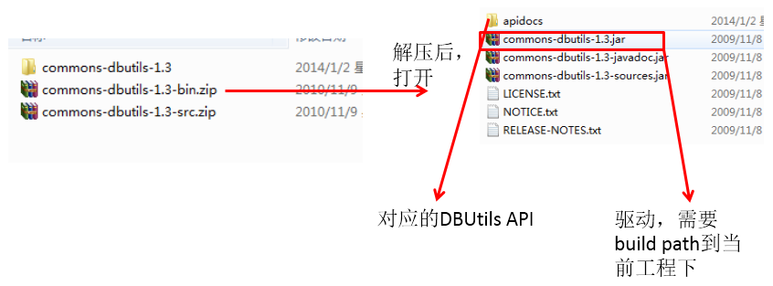

  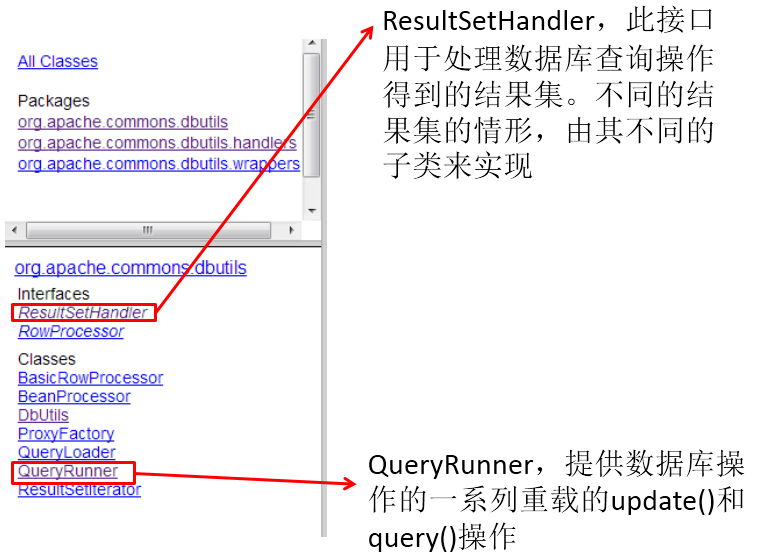


### 2 主要API的使用

#### 2.1 DbUtils

- DbUtils：提供如关闭连接、装载JDBC驱动程序等常规工作的工具类，里面的所有方法都是静态的。主要方法如下：
  - **public static void close(…) throws java.sql.SQLException**：DbUtils类提供了三个重载的关闭方法。这些方法检查所提供的参数是不是NULL，如果不是的话，它们就关闭Connection、Statement和ResultSet。
  - **public static void closeQuietly(…)**: 这一类方法不仅能在Connection、Statement和ResultSet为NULL情况下避免关闭，还能隐藏一些在程序中抛出的SQLEeception。
  - **public static void commitAndClose(Connection conn)throws SQLException**：用来提交连接的事务，然后关闭连接
  - **public static void commitAndCloseQuietly(Connection conn)**：用来提交连接，然后关闭连接，并且在关闭连接时不抛出SQL异常。 
  - **public static void rollback(Connection conn)throws SQLException**：允许conn为null，因为方法内部做了判断
  - **public static void rollbackAndClose(Connection conn)throws SQLException**
  - **rollbackAndCloseQuietly(Connection)**
  - **public static boolean loadDriver(java.lang.String driverClassName)**：这一方法装载并注册JDBC驱动程序，如果成功就返回true。使用该方法，你不需要捕捉这个异常ClassNotFoundException。

#### 2.2 QueryRunner类

- **该类简单化了SQL查询，它与ResultSetHandler组合在一起使用可以完成大部分的数据库操作，能够大大减少编码量。**

- QueryRunner类提供了两个构造器：

  - 默认的构造器
  - 需要一个 javax.sql.DataSource 来作参数的构造器

- QueryRunner类的主要方法：

  - **更新**
    - public int update(Connection conn, String sql, Object... params) throws SQLException：用来执行一个更新（插入、更新或删除）操作。
    - ......
  - **插入**
    - public <T> T insert(Connection conn,String sql,ResultSetHandler<T> rsh, Object... params) throws SQLException：只支持INSERT语句，其中 rsh - The handler used to create the result object from the ResultSet of auto-generated keys.  返回值: An object generated by the handler.即自动生成的键值
    - ....
  - **批处理**
    - public int[] batch(Connection conn,String sql,Object[][] params)throws SQLException：INSERT, UPDATE, or DELETE语句
    - public <T> T insertBatch(Connection conn,String sql,ResultSetHandler<T> rsh,Object[][] params)throws SQLException：只支持INSERT语句
    - .....
  - **查询**
    - public Object query(Connection conn, String sql, ResultSetHandler rsh,Object... params) throws SQLException：执行一个查询操作，在这个查询中，对象数组中的每个元素值被用来作为查询语句的置换参数。该方法会自行处理 PreparedStatement 和 ResultSet 的创建和关闭。
    - ...... 

- 测试：

  ```java
  // 测试添加
  @Test
  public void testInsert() throws Exception {
  	QueryRunner runner = new QueryRunner();
  	Connection conn = JDBCUtils.getConnection3();
  	String sql = "insert into customers(name,email,birth)values(?,?,?)";
  	int count = runner.update(conn, sql, "何成飞", "he@qq.com", "1992-09-08");
  
  	System.out.println("添加了" + count + "条记录");
  		
  	JDBCUtils.closeResource(conn, null);
  }
  ```

  ```java
  // 测试删除
  @Test
  public void testDelete() throws Exception {
  	QueryRunner runner = new QueryRunner();
  	Connection conn = JDBCUtils.getConnection3();
  	String sql = "delete from customers where id < ?";
  	int count = runner.update(conn, sql,3);
  
  	System.out.println("删除了" + count + "条记录");
  		
  	JDBCUtils.closeResource(conn, null);
  }
  ```


#### 2.3 ResultSetHandler接口及实现类

- 该接口用于处理 java.sql.ResultSet，将数据按要求转换为另一种形式。

- ResultSetHandler 接口提供了一个单独的方法：Object handle (java.sql.ResultSet .rs)。

- 接口的主要实现类：

  - ArrayHandler：把结果集中的第一行数据转成对象数组。
  - ArrayListHandler：把结果集中的每一行数据都转成一个数组，再存放到List中。
  - **BeanHandler：**将结果集中的第一行数据封装到一个对应的JavaBean实例中。
  - **BeanListHandler：**将结果集中的每一行数据都封装到一个对应的JavaBean实例中，存放到List里。
  - ColumnListHandler：将结果集中某一列的数据存放到List中。
  - KeyedHandler(name)：将结果集中的每一行数据都封装到一个Map里，再把这些map再存到一个map里，其key为指定的key。
  - **MapHandler：**将结果集中的第一行数据封装到一个Map里，key是列名，value就是对应的值。
  - **MapListHandler：**将结果集中的每一行数据都封装到一个Map里，然后再存放到List
  - **ScalarHandler：**查询单个值对象

- 测试

```java
/*
 * 测试查询:查询一条记录
 * 
 * 使用ResultSetHandler的实现类：BeanHandler
 */
@Test
public void testQueryInstance() throws Exception{
	QueryRunner runner = new QueryRunner();

	Connection conn = JDBCUtils.getConnection3();
		
	String sql = "select id,name,email,birth from customers where id = ?";
		
	//
	BeanHandler<Customer> handler = new BeanHandler<>(Customer.class);
	Customer customer = runner.query(conn, sql, handler, 23);
	System.out.println(customer);	
	JDBCUtils.closeResource(conn, null);
}
```

```java
/*
 * 测试查询:查询多条记录构成的集合
 * 
 * 使用ResultSetHandler的实现类：BeanListHandler
 */
@Test
public void testQueryList() throws Exception{
	QueryRunner runner = new QueryRunner();

	Connection conn = JDBCUtils.getConnection3();
		
	String sql = "select id,name,email,birth from customers where id < ?";
	
	BeanListHandler<Customer> handler = new BeanListHandler<>(Customer.class);
	List<Customer> list = runner.query(conn, sql, handler, 23);
	list.forEach(System.out::println);
		
	JDBCUtils.closeResource(conn, null);
}
```

```java
/*
 * 自定义ResultSetHandler的实现类
 */
@Test
public void testQueryInstance1() throws Exception{
	QueryRunner runner = new QueryRunner();

	Connection conn = JDBCUtils.getConnection3();
		
	String sql = "select id,name,email,birth from customers where id = ?";
		
	ResultSetHandler<Customer> handler = new ResultSetHandler<Customer>() {
		@Override
		public Customer handle(ResultSet rs) throws SQLException {
			System.out.println("handle");
			if(rs.next()){
				int id = rs.getInt("id");
				String name = rs.getString("name");
				String email = rs.getString("email");
				Date birth = rs.getDate("birth");
					
				return new Customer(id, name, email, birth);
			}
			return null;
		}
	};
		
	Customer customer = runner.query(conn, sql, handler, 23);
	System.out.println(customer);
		
	JDBCUtils.closeResource(conn, null);
}
```

```java
/*
 * 如何查询类似于最大的，最小的，平均的，总和，个数相关的数据，
 * 使用ScalarHandler
 * 
 */
@Test
public void testQueryValue() throws Exception{
	QueryRunner runner = new QueryRunner();
	Connection conn = JDBCUtils.getConnection3();
	//测试一：
	//	String sql = "select count(*) from customers where id < ?";
	//	ScalarHandler handler = new ScalarHandler();
	//	long count = (long) runner.query(conn, sql, handler, 20);
	//	System.out.println(count);
		
	//测试二：
	String sql = "select max(birth) from customers";
	ScalarHandler handler = new ScalarHandler();
	Date birth = (Date) runner.query(conn, sql, handler);
	System.out.println(birth);
    
	JDBCUtils.closeResource(conn, null);
}
```

