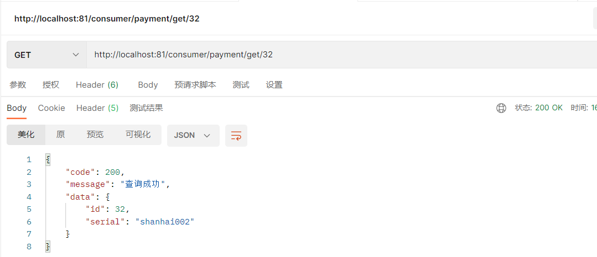
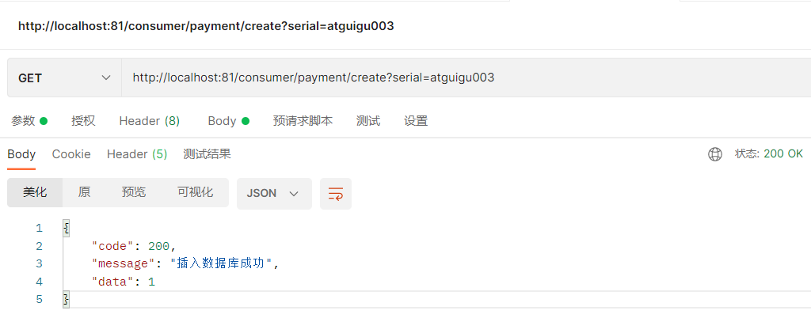

# SpringCloud

+++

## 一、课程介绍及版本选择

课程链接：[尚硅谷SpringCloud框架开发教程(SpringCloudAlibaba微服务分布式架构丨Spring Cloud)](https://www.bilibili.com/video/BV18E411x7eT?p=8&vd_source=6e6b2286ee9a603d7bdb2bc5ba80e449)

> Springcloud和Springboot之间的依赖关系如何看：

1. 查询：[Springcloud和Springboot之间的依赖关系](https://spring.io/projects/spring-cloud#overview)

   

2. 更详细的版本对应查看方法

   https://start.spring.io/actuator/info

   查看json串返回结果

   

3. 同时用boot和cloud，需要照顾cloud，由cloud决定boot版本

   

   


> 本次SpringCloud课程定稿

1. SpringCloud：Hoxton.SR1
2. SpringBoot：2.2.2.RELEASE
3. SpringCloud Alibaba：2.1.0.RELEASE
4. Java：JDK8
5. Maven：3.8.1
6. MySQL：5.7


+++

## 二、Cloud各种组件的停更/升级/替换

> 由停更引发的“升级惨案”

- 停更不停用

  1. 被动修复bugs
  2. 不再接受合并请求
  3. 不再发布新版本

- 明细条目

  1. 2020年以前

     

  2. 截止至2020年上半年

     

> 参考资料见官网

- Spring Cloud
  - https://cloud.spring.io/spring-cloud-static/Hoxton.SR1/reference/htmlsingle/
  - Spring Cloud中文文档：https://www.bookstack.cn/read/spring-cloud-docs/docs-index.md
- Spring Boot
  - https://docs.spring.io/spring-boot/docs/2.2.2.RELEASE/reference/htmlsingle/

+++

## 三、微服务架构编码构建

### 1 约定>配置>编码


### 2 IDEA新建project工作空间

#### 2.1 微服务cloud整体聚合父工程Project

父工程步骤：

1. New Project

   

2. Maven选版本

   

3. 字符编码

   

4. 注解生效激活

   

5. java编译版本选8

   

#### 2.2 父工程POM

```xml
<project xmlns="http://maven.apache.org/POM/4.0.0" xmlns:xsi="http://www.w3.org/2001/XMLSchema-instance"
  xsi:schemaLocation="http://maven.apache.org/POM/4.0.0 http://maven.apache.org/xsd/maven-4.0.0.xsd">
  <modelVersion>4.0.0</modelVersion>

  <groupId>com.shanhai.springcloud</groupId>
  <artifactId>sh-cloud</artifactId>
  <version>1.0-SNAPSHOT</version>
  <packaging>pom</packaging>

  <modules>
    <module>cloud-provider-payment8001</module>
  </modules>

  <!-- 统一管理jar包版本 -->
  <properties>
    <project.build.sourceEncoding>UTF-8</project.build.sourceEncoding>
    <maven.compiler.source>1.8</maven.compiler.source>
    <maven.compiler.target>1.8</maven.compiler.target>
    <junit.version>4.12</junit.version>
    <log4j.version>1.2.17</log4j.version>
    <lombok.version>1.16.18</lombok.version>
    <mysql.version>5.1.47</mysql.version>
    <druid.version>1.1.16</druid.version>
    <mybatis.spring.boot.version>1.3.0</mybatis.spring.boot.version>
  </properties>

  <!-- 子模块继承之后，提供作用：锁定版本+子modlue不用写groupId和version  -->
  <dependencyManagement>
    <dependencies>
      <!--spring boot 2.2.2-->
      <dependency>
        <groupId>org.springframework.boot</groupId>
        <artifactId>spring-boot-dependencies</artifactId>
        <version>2.2.2.RELEASE</version>
        <type>pom</type>
        <scope>import</scope>
      </dependency>
      <!--spring cloud Hoxton.SR1-->
      <dependency>
        <groupId>org.springframework.cloud</groupId>
        <artifactId>spring-cloud-dependencies</artifactId>
        <version>Hoxton.SR1</version>
        <type>pom</type>
        <scope>import</scope>
      </dependency>
      <!--spring cloud alibaba 2.1.0.RELEASE-->
      <dependency>
        <groupId>com.alibaba.cloud</groupId>
        <artifactId>spring-cloud-alibaba-dependencies</artifactId>
        <version>2.1.0.RELEASE</version>
        <type>pom</type>
        <scope>import</scope>
      </dependency>
      <dependency>
        <groupId>mysql</groupId>
        <artifactId>mysql-connector-java</artifactId>
        <version>${mysql.version}</version>
      </dependency>
      <dependency>
        <groupId>com.alibaba</groupId>
        <artifactId>druid</artifactId>
        <version>${druid.version}</version>
      </dependency>
      <dependency>
        <groupId>org.mybatis.spring.boot</groupId>
        <artifactId>mybatis-spring-boot-starter</artifactId>
        <version>${mybatis.spring.boot.version}</version>
      </dependency>
      <dependency>
        <groupId>junit</groupId>
        <artifactId>junit</artifactId>
        <version>${junit.version}</version>
      </dependency>
      <dependency>
        <groupId>log4j</groupId>
        <artifactId>log4j</artifactId>
        <version>${log4j.version}</version>
      </dependency>
      <dependency>
        <groupId>org.projectlombok</groupId>
        <artifactId>lombok</artifactId>
        <version>${lombok.version}</version>
        <optional>true</optional>
      </dependency>
    </dependencies>
  </dependencyManagement>

  <build>
    <plugins>
      <plugin>
        <groupId>org.springframework.boot</groupId>
        <artifactId>spring-boot-maven-plugin</artifactId>
        <configuration>
          <fork>true</fork>
          <addResources>true</addResources>
        </configuration>
        <version>2.2.2.RELEASE</version>
      </plugin>
    </plugins>
  </build>

</project>
```


#### 2.3 Maven工程复习

- Maven中的`DependencyManagement`和`Dependencies`

  dependencyManagement：Maven 使用 dependencyManagement 元素来提供了一种管理依赖版本号的方式。*通常会在一个组织或者项目的最顶层的父POM 中看到 dependencyManagement 元素*。

  使用 pom.xml 中的 dependencyManagement 元素能让所有在子项目中引用一个依赖而不用显式的列出版本号。

  Maven 会沿着父子层次向上走，直到找到一个拥有 dependencyManagement 元素的项目，然后它就会使用这个 dependencyManagement 元素中指定的版本号。

  

  这样做的好处就是：如果有多个子项目都引用同一样依赖，则可以避免在每个使用的子项目里都声明一个版本号，这样当想升级或切换到另一个版本时，只需要在顶层父容器里更新，而不需要一个一个子项目的修改；另外如果某个子项目需要另外的一个版本，只需要声明version就可。

  1. dependencyManagement里只是声明依赖，并不实现引入，因此子项目需要显示的声明需要用的依赖。
  2. 如果不在子项目中声明依赖，是不会从父项目中继承下来的；只有在子项目中写了该依赖项，并且没有指定具体版本，才会从父项目中继承该项，并且version和scope都读取自父pom；
  3. 如果子项目中指定了版本号，那么会使用子项目中指定的jar版本。

- maven中跳过单元测试

  1. 配置

     ```xml
     <build><!-- maven中跳过单元测试 -->
         <plugins>
             <plugin>
                 <groupId>org.apache.maven.plugins</groupId>
                 <artifactId>maven-surefire-plugin</artifactId>
                 <configuration>
                     <skip>true</skip>
                 </configuration>
             </plugin>
         </plugins>
     </build>
     ```

  2. IDEA工具支持(推荐)

     

> 父工程创建完成执行mvn:install将父工程发布到仓库方便子工程继承


### 3 Rest微服务工程构建

#### 3.1 微服务提供者支付Module模块

微服务提供者支付Module模块：`cloud-provider-payment8001`

```
1 建module
2 改POM
3 写YML
4 主启动类
5 业务类
6 测试
```


##### 3.1.1 建立module模块

1. 建Maven子工程：cloud-provider-payment8001

   创建完成后请回到父工程查看pom文件变化

   

2. 改POM

   ```xml
   <project xmlns="http://maven.apache.org/POM/4.0.0" xmlns:xsi="http://www.w3.org/2001/XMLSchema-instance"
            xsi:schemaLocation="http://maven.apache.org/POM/4.0.0 http://maven.apache.org/xsd/maven-4.0.0.xsd">
       <parent>
           <artifactId>sh-cloud</artifactId>
           <groupId>com.shanhai.springcloud</groupId>
           <version>1.0-SNAPSHOT</version>
       </parent>
       <modelVersion>4.0.0</modelVersion>
   
       <artifactId>cloud-provider-payment8001</artifactId>
   
       <dependencies>
           <dependency>
               <groupId>org.springframework.boot</groupId>
               <artifactId>spring-boot-starter-web</artifactId>
           </dependency>
           <dependency>
               <groupId>org.springframework.boot</groupId>
               <artifactId>spring-boot-starter-actuator</artifactId>
           </dependency>
           <dependency>
               <groupId>org.mybatis.spring.boot</groupId>
               <artifactId>mybatis-spring-boot-starter</artifactId>
           </dependency>
           <dependency>
               <groupId>com.alibaba</groupId>
               <artifactId>druid-spring-boot-starter</artifactId>
               <version>1.1.10</version>
           </dependency>
           <!--mysql-connector-java-->
           <dependency>
               <groupId>mysql</groupId>
               <artifactId>mysql-connector-java</artifactId>
           </dependency>
           <!--jdbc-->
           <dependency>
               <groupId>org.springframework.boot</groupId>
               <artifactId>spring-boot-starter-jdbc</artifactId>
           </dependency>
           <dependency>
               <groupId>org.springframework.boot</groupId>
               <artifactId>spring-boot-devtools</artifactId>
               <scope>runtime</scope>
               <optional>true</optional>
           </dependency>
           <dependency>
               <groupId>org.projectlombok</groupId>
               <artifactId>lombok</artifactId>
               <optional>true</optional>
           </dependency>
           <dependency>
               <groupId>org.springframework.boot</groupId>
               <artifactId>spring-boot-starter-test</artifactId>
               <scope>test</scope>
           </dependency>
       </dependencies>
   
   </project>
   ```

3. 写YML：application.yml

   ```yaml
   server:
     port: 8001
   
   spring:
     application:
       name: cloud-payment-service
     datasource:
       type: com.alibaba.druid.pool.DruidDataSource            # 当前数据源操作类型
       driver-class-name: com.mysql.jdbc.Driver              # mysql驱动包 com.mysql.jdbc.Driver
       url: jdbc:mysql://localhost:3306/cloud_test?useUnicode=true&characterEncoding=utf-8&useSSL=false
       username: root
       password: 123456
   
   mybatis:
     mapperLocations: classpath:mapper/*.xml
     type-aliases-package: com.shanhai.springcloud.entities    # 所有Entity别名类所在包
   ```

4. 主启动类

   ```java
   package com.shanhai.springcloud;
   
   import org.springframework.boot.SpringApplication;
   import org.springframework.boot.autoconfigure.SpringBootApplication;
   
   /**
    * @description:
    * @author: xu
    * @date: 2022/12/22 20:02
    */
   @SpringBootApplication
   public class PaymentMain8001 {
       public static void main(String[] args) {
           SpringApplication.run(PaymentMain8001.class, args);
       }
   }
   ```

至此子模块项目构建完成，下面就是业务类的代码编写。


##### 3.1.2 业务类

1. 建表SQL

   ```sql
   CREATE TABLE `payment` (
     `id` bigint(20) NOT NULL AUTO_INCREMENT COMMENT 'ID',
     `serial` varchar(200) DEFAULT '',
     PRIMARY KEY (`id`)
   ) ENGINE=InnoDB AUTO_INCREMENT=1 DEFAULT CHARSET=utf8
   ```

2. entities

   主实体Payment

   ```java
   package com.shanhai.springcloud.entities;
   
   import lombok.AllArgsConstructor;
   import lombok.Data;
   import lombok.NoArgsConstructor;
   
   import java.io.Serializable;
   
   /**
    * @description: 主实体Payment
    * @author: xu
    * @date: 2022/12/22 20:10
    */
   @Data
   @AllArgsConstructor
   @NoArgsConstructor
   public class Payment implements Serializable {
       private static final long serialVersionUID = 1L;
   
       private Long id;
       private String serial;
   }
   ```

   Json封装体CommonResult

   ```java
   package com.shanhai.springcloud.entities;
   
   import lombok.AllArgsConstructor;
   import lombok.Data;
   import lombok.NoArgsConstructor;
   
   /**
    * @description: Json封装体CommonResult
    * @author: xu
    * @date: 2022/12/22 20:13
    */
   @Data
   @AllArgsConstructor
   @NoArgsConstructor
   public class CommonResult<T> {
       private Integer code;
       private String  message;
       private T data;
   
       public CommonResult(Integer code, String message) {
           this(code, message,null);
       }
   }
   ```

3. dao/mapper

   接口PaymentDao

   ```java
   package com.shanhai.springcloud.dao;
   
   import com.shanhai.springcloud.entities.Payment;
   import org.apache.ibatis.annotations.Mapper;
   import org.apache.ibatis.annotations.Param;
   
   /**
    * @description: 接口PaymentDao
    * @author: xu
    * @date: 2022/12/22 20:16
    */
   @Mapper
   public interface PaymentDao {
       int create(Payment payment);
   
       Payment getPaymentById(@Param("id") Long id);
   }
   ```

   mybaits的映射文件 src\main\resources\mapper\PaymentMapper.xml

   ```xml
   <?xml version="1.0" encoding="UTF-8" ?>
   <!DOCTYPE mapper
           PUBLIC "-//mybatis.org//DTD Mapper 3.0//EN"
           "http://mybatis.org/dtd/mybatis-3-mapper.dtd">
   <mapper namespace="com.shanhai.springcloud.dao.PaymentDao">
   
       <insert id="create" parameterType="Payment" useGeneratedKeys="true" keyProperty="id" >
           insert into payment(serial) values (#{serial})
       </insert>
   
       <resultMap id="BaseResultMap" type="com.shanhai.springcloud.entities.Payment" >
           <id column="id" property="id" jdbcType="BIGINT" />
           <id column="serial" property="serial" jdbcType="VARCHAR" />
       </resultMap>
   
       <select id="getPaymentById" parameterType="long" resultMap="BaseResultMap">
           select * from payment where id=#{id}
       </select>
   </mapper>
   ```

4. service

   接口PaymentService

   ```java
   package com.shanhai.springcloud.service;
   
   import com.shanhai.springcloud.entities.Payment;
   import org.apache.ibatis.annotations.Param;
   
   /**
    * @description:
    * @author: xu
    * @date: 2022/12/22 20:27
    */
   public interface PaymentService {
       int create(Payment payment);
   
       Payment getPaymentById(@Param("id") Long id);
   }
   ```

   实现类PaymentServiceImpl

   ```java
   package com.shanhai.springcloud.service.impl;
   
   import com.shanhai.springcloud.dao.PaymentDao;
   import com.shanhai.springcloud.entities.Payment;
   import com.shanhai.springcloud.service.PaymentService;
   import org.springframework.stereotype.Service;
   
   import javax.annotation.Resource;
   
   /**
    * @description:
    * @author: xu
    * @date: 2022/12/22 20:28
    */
   @Service
   public class PaymentServiceImpl implements PaymentService {
       @Resource
       private PaymentDao paymentDao;
   
       @Override
       public int create(Payment payment) {
           return paymentDao.create(payment);
       }
   
       @Override
       public Payment getPaymentById(Long id) {
           return paymentDao.getPaymentById(id);
       }
   }
   ```

5. controller

   ```java
   package com.shanhai.springcloud.controller;
   
   import com.shanhai.springcloud.entities.CommonResult;
   import com.shanhai.springcloud.entities.Payment;
   import com.shanhai.springcloud.service.PaymentService;
   import lombok.extern.slf4j.Slf4j;
   import org.springframework.web.bind.annotation.GetMapping;
   import org.springframework.web.bind.annotation.PathVariable;
   import org.springframework.web.bind.annotation.PostMapping;
   import org.springframework.web.bind.annotation.RestController;
   
   import javax.annotation.Resource;
   
   /**
    * @description:
    * @author: xu
    * @date: 2022/12/22 20:30
    */
   @RestController
   @Slf4j
   public class PaymentController {
       @Resource
       private PaymentService paymentService;
   
       @PostMapping(value = "/payment/create")
       public CommonResult<Integer> create(Payment payment) {
           int result = paymentService.create(payment);
           log.info("插入结果：" + result);
           if (result > 0) {
               return new CommonResult(200, "插入数据库成功", result);
           } else {
               return new CommonResult(444, "插入数据库失败", null);
           }
       }
   
       @GetMapping(value = "/payment/get/{id}")
       public CommonResult<Payment> getPaymentById(@PathVariable("id") Long id) {
           Payment payment = paymentService.getPaymentById(id);
           log.info("结果：" + payment);
           if (payment != null) {
               return new CommonResult(200, "查询成功", payment);
           } else {
               return new CommonResult(444, "没有对应记录，查询失败，查询ID：" + id, null);
           }
       }
   }
   ```


##### 3.1.3 测试

> `http://localhost:8001/payment/get/31`
>
> `http://localhost:8001/payment/create`


##### 3.1.4 热部署Devtools

1. Adding devtools to your project

   ```xml
   <dependency>
       <groupId>org.springframework.boot</groupId>
       <artifactId>spring-boot-devtools</artifactId>
       <scope>runtime</scope>
       <optional>true</optional>
   </dependency>
   ```

2. Adding plugin to your parent pom.xml

   下段配置我们粘贴进聚合父类总工程的pom.xml里

   ```xml
   <build>
     <plugins>
       <plugin>
         <groupId>org.springframework.boot</groupId>
         <artifactId>spring-boot-maven-plugin</artifactId>
         <configuration>
           <fork>true</fork>
           <addResources>true</addResources>
         </configuration>
         <version>2.2.2.RELEASE</version>
       </plugin>
     </plugins>
   </build>
   ```

3. Enabling automatic build

   

4. Update the value of

   2021.2版本之前

   

   

   2021.2版本之后

   

5. 重启IDEA


#### 3.2 微服务消费者订单Module模块

微服务消费者订单Module模块：`cloud-consumer-order80`


##### 3.2.1 建立module模块

1. 建Maven子工程：cloud-consumer-order80

   创建完成后请回到父工程查看pom文件变化

   

2. 改POM

   ```xml
   <project xmlns="http://maven.apache.org/POM/4.0.0" xmlns:xsi="http://www.w3.org/2001/XMLSchema-instance"
            xsi:schemaLocation="http://maven.apache.org/POM/4.0.0 http://maven.apache.org/xsd/maven-4.0.0.xsd">
       <parent>
           <artifactId>sh-cloud</artifactId>
           <groupId>com.shanhai.springcloud</groupId>
           <version>1.0-SNAPSHOT</version>
       </parent>
       <modelVersion>4.0.0</modelVersion>
   
       <artifactId>cloud-consumer-order80</artifactId>
   
       <dependencies>
           <dependency>
               <groupId>org.springframework.boot</groupId>
               <artifactId>spring-boot-starter-web</artifactId>
           </dependency>
           <dependency>
               <groupId>org.springframework.boot</groupId>
               <artifactId>spring-boot-starter-actuator</artifactId>
           </dependency>
   
           <dependency>
               <groupId>org.springframework.boot</groupId>
               <artifactId>spring-boot-devtools</artifactId>
               <scope>runtime</scope>
               <optional>true</optional>
           </dependency>
           <dependency>
               <groupId>org.projectlombok</groupId>
               <artifactId>lombok</artifactId>
               <optional>true</optional>
           </dependency>
           <dependency>
               <groupId>org.springframework.boot</groupId>
               <artifactId>spring-boot-starter-test</artifactId>
               <scope>test</scope>
           </dependency>
       </dependencies>
   
   </project>
   ```

3. 写YML：application.yml

   ```yaml
   server:
     port: 81
   ```

4. 主启动类

   ```java
   package com.shanhai.springcloud;
   
   import org.springframework.boot.SpringApplication;
   import org.springframework.boot.autoconfigure.SpringBootApplication;
   
   /**
    * @description:
    * @author: xu
    * @date: 2022/12/22 21:59
    */
   @SpringBootApplication
   public class MainApp80 {
       public static void main(String[] args) {
           SpringApplication.run(MainApp80.class,args);
       }
   }
   ```


##### 3.2.2 业务类

1. entities

   主实体Payment

   ```java
   package com.shanhai.springcloud.entities;
   
   import lombok.AllArgsConstructor;
   import lombok.Data;
   import lombok.NoArgsConstructor;
   
   import java.io.Serializable;
   
   /**
    * @description: 主实体Payment
    * @author: xu
    * @date: 2022/12/22 20:10
    */
   @Data
   @AllArgsConstructor
   @NoArgsConstructor
   public class Payment implements Serializable {
       private static final long serialVersionUID = 1L;
   
       private Long id;
       private String serial;
   }
   ```

   Json封装体CommonResult

   ```java
   package com.shanhai.springcloud.entities;
   
   import lombok.AllArgsConstructor;
   import lombok.Data;
   import lombok.NoArgsConstructor;
   
   /**
    * @description: Json封装体CommonResult
    * @author: xu
    * @date: 2022/12/22 20:13
    */
   @Data
   @AllArgsConstructor
   @NoArgsConstructor
   public class CommonResult<T> {
       private Integer code;
       private String  message;
       private T data;
   
       public CommonResult(Integer code, String message) {
           this(code, message,null);
       }
   }
   ```

2. RestTemplate

   > 是什么：RestTemplate提供了多种便捷访问远程Http服务的方法，是一种简单便捷的访问restful服务模板类，是Spring提供的用于访问Rest服务的**客户端模板工具集**。
   >
   > 
   >
   > 官网地址：https://docs.spring.io/spring-framework/docs/5.2.2.RELEASE/javadoc-api/org/springframework/web/client/RestTemplate.html
   >
   > 使用：
   >
   > 使用restTemplate访问restful接口非常的简单粗暴无脑。
   >
   > (url, requestMap, ResponseBean.class)这三个参数分别代表
   >
   > REST请求地址、请求参数、HTTP响应转换被转换成的对象类型。

3. config配置类

   ```java
   package com.shanhai.springcloud.config;
   
   import org.springframework.context.annotation.Bean;
   import org.springframework.context.annotation.Configuration;
   import org.springframework.web.client.RestTemplate;
   
   /**
    * @description:
    * @author: xu
    * @date: 2022/12/22 22:08
    */
   @Configuration
   public class ApplicationContextConfig {
       @Bean
       public RestTemplate getRestTemplate() {
           return new RestTemplate();
       }
   }
   ```

4. controller

   ```java
   package com.shanhai.springcloud.controller;
   
   import com.shanhai.springcloud.entities.CommonResult;
   import com.shanhai.springcloud.entities.Payment;
   import lombok.extern.slf4j.Slf4j;
   import org.springframework.web.bind.annotation.GetMapping;
   import org.springframework.web.bind.annotation.PathVariable;
   import org.springframework.web.bind.annotation.RestController;
   import org.springframework.web.client.RestTemplate;
   
   import javax.annotation.Resource;
   
   /**
    * @description:
    * @author: xu
    * @date: 2022/12/22 22:04
    */
   @RestController
   @Slf4j
   public class OrderController {
       private static final String PAYMENT_URL = "http://localhost:8001";
   
       @Resource
       private RestTemplate restTemplate;
   
       @GetMapping("/consumer/payment/create")
       public CommonResult<Integer> create(Payment payment) {
           log.info("OrderController.create");
           return restTemplate.postForObject(PAYMENT_URL +  "/payment/create", payment, CommonResult.class);
       }
   
       @GetMapping("/consumer/payment/get/{id}")
       public CommonResult<Payment> getPaymentById(@PathVariable("id") Long id) {
           log.info("OrderController.getPaymentById");
           return restTemplate.getForObject(PAYMENT_URL +  "/payment/get/"+ id, CommonResult.class);
       }
   }
   ```


##### 3.2.3 测试

> `http://localhost:81/consumer/payment/get/32`
>
> `http://localhost:81/consumer/payment/create?serial=atguigu003`






#### 3.3 工程重构

> 观察问题：系统中有重复部分，重构


> 建立`cloud-api-commons`模块

1. 新建Maven工程：cloud-api-commons

2. 改POM

   ```xml
   <project xmlns="http://maven.apache.org/POM/4.0.0" xmlns:xsi="http://www.w3.org/2001/XMLSchema-instance"
            xsi:schemaLocation="http://maven.apache.org/POM/4.0.0 http://maven.apache.org/xsd/maven-4.0.0.xsd">
       <parent>
           <artifactId>sh-cloud</artifactId>
           <groupId>com.shanhai.springcloud</groupId>
           <version>1.0-SNAPSHOT</version>
       </parent>
       <modelVersion>4.0.0</modelVersion>
   
       <artifactId>cloud-api-commons</artifactId>
   
       <dependencies>
           <dependency>
               <groupId>org.springframework.boot</groupId>
               <artifactId>spring-boot-devtools</artifactId>
               <scope>runtime</scope>
               <optional>true</optional>
           </dependency>
           <dependency>
               <groupId>org.projectlombok</groupId>
               <artifactId>lombok</artifactId>
               <optional>true</optional>
           </dependency>
           <dependency>
               <groupId>cn.hutool</groupId>
               <artifactId>hutool-all</artifactId>
               <version>5.1.0</version>
           </dependency>
       </dependencies>
   
   </project>
   ```

3. 将`支付模块`和`订单模块`的`公共实体类`拷贝到当前模块下

4. maven命令

   clean ---> install

   

5. 订单模块和支付模块分别改造

   删除各自的原先有过的entities文件夹

   各自添加依赖

   ```xml
   <dependency><!-- 引入自己定义的api通用包，可以使用Payment支付Entity -->
   	<groupId>com.shanhai.springcloud</groupId>
   	<artifactId>cloud-api-commons</artifactId>
   	<version>${project.version}</version>
   </dependency>
   ```


> 目前工程样图


+++

## 四、Eureka服务注册与发现

### 1 Eureka基础知识

> 什么是服务治理？

SpringCloud 封装了 Netflix 公司开发的 Eureka 模块来**实现服务治理**。

在传统的rpc远程调用框架中，管理每个服务与服务之间依赖关系比较复杂，管理比较复杂，所以需要使用服务治理，管理服务于服务之间依赖关系，可以实现服务调用、负载均衡、容错等，实现服务发现与注册。

> 什么是服务注册与发现？

Eureka采用了CS的设计架构，Eureka Server作为服务注册功能的服务器，它是服务注册中心。而系统中的其他微服务，使用Eureka的客户端连接到Eureka Server并维持心跳连接。这样系统的维护人员就可以通过Eureka Server来监控系统中各个微服务是否正常运行。

在服务注册与发现中，有一个注册中心。当服务器启动的时候，会把当前自己服务器的信息 比如 服务地址通讯地址等以别名方式注册到注册中心上。另一方（消费者|服务提供者），以该别名的方式去注册中心上获取到实际的服务通讯地址，然后再实现本地RPC调用RPC远程调用框架核心设计思想：在于注册中心，因为使用注册中心管理每个服务与服务之间的一个依赖关系(服务治理概念)。在任何rpc远程框架中，都会有一个注册中心(存放服务地址相关信息(接口地址))。

> Eureka两组件：<font color='gree'>Eureka Server</font>和<font color="gree">Eureka Client</font>。

1. *Eureka Server*提供服务注册服务

   各个微服务节点通过配置启动后，会在Eureka Server中进行注册，这样Eureka Server中的服务注册表中将会存储所有可用服务节点的信息，服务节点的信息可以在界面中直观看到。

2. *Eureka Client*通过注册中心进行访问

   是一个Java客户端，用于简化Eureka Server的交互，客户端同时也具备一个内置的、使用轮询(round-robin)负载算法的负载均衡器。在应用启动后，将会向Eureka Server发送心跳(默认周期为30秒)。如果Eureka Server在多个心跳周期内没有接收到某个节点的心跳，EurekaServer将会从服务注册表中把这个服务节点移除（默认90秒）


### 2 单机Eureka构建步骤

#### 2.1 Eureka Server端服务注册中心


#### 2.2 Eureka Client端


