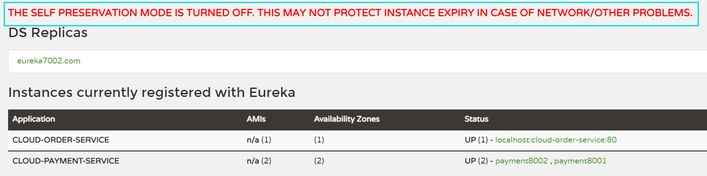

# SpringCloud

+++

## 一、课程介绍及版本选择

课程链接：[尚硅谷SpringCloud框架开发教程(SpringCloudAlibaba微服务分布式架构丨Spring Cloud)](https://www.bilibili.com/video/BV18E411x7eT?p=8&vd_source=6e6b2286ee9a603d7bdb2bc5ba80e449)

> Springcloud和Springboot之间的依赖关系如何看：

1. 查询：[Springcloud和Springboot之间的依赖关系](https://spring.io/projects/spring-cloud#overview)

   

2. 更详细的版本对应查看方法

   https://start.spring.io/actuator/info

   查看json串返回结果

   

3. 同时用boot和cloud，需要照顾cloud，由cloud决定boot版本

   

   


> 本次SpringCloud课程定稿

1. SpringCloud：Hoxton.SR1
2. SpringBoot：2.2.2.RELEASE
3. SpringCloud Alibaba：2.1.0.RELEASE
4. Java：JDK8
5. Maven：3.8.1
6. MySQL：5.7


+++

## 二、Cloud各种组件的停更/升级/替换

> 由停更引发的“升级惨案”

- 停更不停用

  1. 被动修复bugs
  2. 不再接受合并请求
  3. 不再发布新版本

- 明细条目

  1. 2020年以前

     

  2. 截止至2020年上半年

     

> 参考资料见官网

- Spring Cloud
  - https://cloud.spring.io/spring-cloud-static/Hoxton.SR1/reference/htmlsingle/
  - Spring Cloud中文文档：https://www.bookstack.cn/read/spring-cloud-docs/docs-index.md
- Spring Boot
  - https://docs.spring.io/spring-boot/docs/2.2.2.RELEASE/reference/htmlsingle/

+++

## 三、微服务架构编码构建

### 1 约定>配置>编码


### 2 IDEA新建project工作空间

#### 2.1 微服务cloud整体聚合父工程Project

父工程步骤：

1. New Project

   

2. Maven选版本

   

3. 字符编码

   

4. 注解生效激活

   

5. java编译版本选8

   

#### 2.2 父工程POM

```xml
<project xmlns="http://maven.apache.org/POM/4.0.0" xmlns:xsi="http://www.w3.org/2001/XMLSchema-instance"
  xsi:schemaLocation="http://maven.apache.org/POM/4.0.0 http://maven.apache.org/xsd/maven-4.0.0.xsd">
  <modelVersion>4.0.0</modelVersion>

  <groupId>com.shanhai.springcloud</groupId>
  <artifactId>sh-cloud</artifactId>
  <version>1.0-SNAPSHOT</version>
  <packaging>pom</packaging>

  <modules>
    <module>cloud-provider-payment8001</module>
  </modules>

  <!-- 统一管理jar包版本 -->
  <properties>
    <project.build.sourceEncoding>UTF-8</project.build.sourceEncoding>
    <maven.compiler.source>1.8</maven.compiler.source>
    <maven.compiler.target>1.8</maven.compiler.target>
    <junit.version>4.12</junit.version>
    <log4j.version>1.2.17</log4j.version>
    <lombok.version>1.16.18</lombok.version>
    <mysql.version>5.1.47</mysql.version>
    <druid.version>1.1.16</druid.version>
    <mybatis.spring.boot.version>1.3.0</mybatis.spring.boot.version>
  </properties>

  <!-- 子模块继承之后，提供作用：锁定版本+子modlue不用写groupId和version  -->
  <dependencyManagement>
    <dependencies>
      <!--spring boot 2.2.2-->
      <dependency>
        <groupId>org.springframework.boot</groupId>
        <artifactId>spring-boot-dependencies</artifactId>
        <version>2.2.2.RELEASE</version>
        <type>pom</type>
        <scope>import</scope>
      </dependency>
      <!--spring cloud Hoxton.SR1-->
      <dependency>
        <groupId>org.springframework.cloud</groupId>
        <artifactId>spring-cloud-dependencies</artifactId>
        <version>Hoxton.SR1</version>
        <type>pom</type>
        <scope>import</scope>
      </dependency>
      <!--spring cloud alibaba 2.1.0.RELEASE-->
      <dependency>
        <groupId>com.alibaba.cloud</groupId>
        <artifactId>spring-cloud-alibaba-dependencies</artifactId>
        <version>2.1.0.RELEASE</version>
        <type>pom</type>
        <scope>import</scope>
      </dependency>
      <dependency>
        <groupId>mysql</groupId>
        <artifactId>mysql-connector-java</artifactId>
        <version>${mysql.version}</version>
      </dependency>
      <dependency>
        <groupId>com.alibaba</groupId>
        <artifactId>druid</artifactId>
        <version>${druid.version}</version>
      </dependency>
      <dependency>
        <groupId>org.mybatis.spring.boot</groupId>
        <artifactId>mybatis-spring-boot-starter</artifactId>
        <version>${mybatis.spring.boot.version}</version>
      </dependency>
      <dependency>
        <groupId>junit</groupId>
        <artifactId>junit</artifactId>
        <version>${junit.version}</version>
      </dependency>
      <dependency>
        <groupId>log4j</groupId>
        <artifactId>log4j</artifactId>
        <version>${log4j.version}</version>
      </dependency>
      <dependency>
        <groupId>org.projectlombok</groupId>
        <artifactId>lombok</artifactId>
        <version>${lombok.version}</version>
        <optional>true</optional>
      </dependency>
    </dependencies>
  </dependencyManagement>

  <build>
    <plugins>
      <plugin>
        <groupId>org.springframework.boot</groupId>
        <artifactId>spring-boot-maven-plugin</artifactId>
        <configuration>
          <fork>true</fork>
          <addResources>true</addResources>
        </configuration>
        <version>2.2.2.RELEASE</version>
      </plugin>
    </plugins>
  </build>

</project>
```


#### 2.3 Maven工程复习

- Maven中的`DependencyManagement`和`Dependencies`

  dependencyManagement：Maven 使用 dependencyManagement 元素来提供了一种管理依赖版本号的方式。*通常会在一个组织或者项目的最顶层的父POM 中看到 dependencyManagement 元素*。

  使用 pom.xml 中的 dependencyManagement 元素能让所有在子项目中引用一个依赖而不用显式的列出版本号。

  Maven 会沿着父子层次向上走，直到找到一个拥有 dependencyManagement 元素的项目，然后它就会使用这个 dependencyManagement 元素中指定的版本号。

  

  这样做的好处就是：如果有多个子项目都引用同一样依赖，则可以避免在每个使用的子项目里都声明一个版本号，这样当想升级或切换到另一个版本时，只需要在顶层父容器里更新，而不需要一个一个子项目的修改；另外如果某个子项目需要另外的一个版本，只需要声明version就可。

  1. dependencyManagement里只是声明依赖，并不实现引入，因此子项目需要显示的声明需要用的依赖。
  2. 如果不在子项目中声明依赖，是不会从父项目中继承下来的；只有在子项目中写了该依赖项，并且没有指定具体版本，才会从父项目中继承该项，并且version和scope都读取自父pom；
  3. 如果子项目中指定了版本号，那么会使用子项目中指定的jar版本。

- maven中跳过单元测试

  1. 配置

     ```xml
     <build><!-- maven中跳过单元测试 -->
         <plugins>
             <plugin>
                 <groupId>org.apache.maven.plugins</groupId>
                 <artifactId>maven-surefire-plugin</artifactId>
                 <configuration>
                     <skip>true</skip>
                 </configuration>
             </plugin>
         </plugins>
     </build>
     ```

  2. IDEA工具支持(推荐)

     

> 父工程创建完成执行mvn:install将父工程发布到仓库方便子工程继承


### 3 Rest微服务工程构建

#### 3.1 微服务提供者支付Module模块

微服务提供者支付Module模块：`cloud-provider-payment8001`

```
1 建module
2 改POM
3 写YML
4 主启动类
5 业务类
6 测试
```


##### 3.1.1 建立module模块

1. 建Maven子工程：cloud-provider-payment8001

   创建完成后请回到父工程查看pom文件变化

   

2. 改POM

   ```xml
   <project xmlns="http://maven.apache.org/POM/4.0.0" xmlns:xsi="http://www.w3.org/2001/XMLSchema-instance"
            xsi:schemaLocation="http://maven.apache.org/POM/4.0.0 http://maven.apache.org/xsd/maven-4.0.0.xsd">
       <parent>
           <artifactId>sh-cloud</artifactId>
           <groupId>com.shanhai.springcloud</groupId>
           <version>1.0-SNAPSHOT</version>
       </parent>
       <modelVersion>4.0.0</modelVersion>
   
       <artifactId>cloud-provider-payment8001</artifactId>
   
       <dependencies>
           <dependency>
               <groupId>org.springframework.boot</groupId>
               <artifactId>spring-boot-starter-web</artifactId>
           </dependency>
           <dependency>
               <groupId>org.springframework.boot</groupId>
               <artifactId>spring-boot-starter-actuator</artifactId>
           </dependency>
           <dependency>
               <groupId>org.mybatis.spring.boot</groupId>
               <artifactId>mybatis-spring-boot-starter</artifactId>
           </dependency>
           <dependency>
               <groupId>com.alibaba</groupId>
               <artifactId>druid-spring-boot-starter</artifactId>
               <version>1.1.10</version>
           </dependency>
           <!--mysql-connector-java-->
           <dependency>
               <groupId>mysql</groupId>
               <artifactId>mysql-connector-java</artifactId>
           </dependency>
           <!--jdbc-->
           <dependency>
               <groupId>org.springframework.boot</groupId>
               <artifactId>spring-boot-starter-jdbc</artifactId>
           </dependency>
           <dependency>
               <groupId>org.springframework.boot</groupId>
               <artifactId>spring-boot-devtools</artifactId>
               <scope>runtime</scope>
               <optional>true</optional>
           </dependency>
           <dependency>
               <groupId>org.projectlombok</groupId>
               <artifactId>lombok</artifactId>
               <optional>true</optional>
           </dependency>
           <dependency>
               <groupId>org.springframework.boot</groupId>
               <artifactId>spring-boot-starter-test</artifactId>
               <scope>test</scope>
           </dependency>
       </dependencies>
   
   </project>
   ```

3. 写YML：application.yml

   ```yaml
   server:
     port: 8001
   
   spring:
     application:
       name: cloud-payment-service
     datasource:
       type: com.alibaba.druid.pool.DruidDataSource            # 当前数据源操作类型
       driver-class-name: com.mysql.jdbc.Driver              # mysql驱动包 com.mysql.jdbc.Driver
       url: jdbc:mysql://localhost:3306/cloud_test?useUnicode=true&characterEncoding=utf-8&useSSL=false
       username: root
       password: 123456
   
   mybatis:
     mapperLocations: classpath:mapper/*.xml
     type-aliases-package: com.shanhai.springcloud.entities    # 所有Entity别名类所在包
   ```

4. 主启动类

   ```java
   package com.shanhai.springcloud;
   
   import org.springframework.boot.SpringApplication;
   import org.springframework.boot.autoconfigure.SpringBootApplication;
   
   /**
    * @description:
    * @author: xu
    * @date: 2022/12/22 20:02
    */
   @SpringBootApplication
   public class PaymentMain8001 {
       public static void main(String[] args) {
           SpringApplication.run(PaymentMain8001.class, args);
       }
   }
   ```

至此子模块项目构建完成，下面就是业务类的代码编写。


##### 3.1.2 业务类

1. 建表SQL

   ```sql
   CREATE TABLE `payment` (
     `id` bigint(20) NOT NULL AUTO_INCREMENT COMMENT 'ID',
     `serial` varchar(200) DEFAULT '',
     PRIMARY KEY (`id`)
   ) ENGINE=InnoDB AUTO_INCREMENT=1 DEFAULT CHARSET=utf8
   ```

2. entities

   主实体Payment

   ```java
   package com.shanhai.springcloud.entities;
   
   import lombok.AllArgsConstructor;
   import lombok.Data;
   import lombok.NoArgsConstructor;
   
   import java.io.Serializable;
   
   /**
    * @description: 主实体Payment
    * @author: xu
    * @date: 2022/12/22 20:10
    */
   @Data
   @AllArgsConstructor
   @NoArgsConstructor
   public class Payment implements Serializable {
       private static final long serialVersionUID = 1L;
   
       private Long id;
       private String serial;
   }
   ```

   Json封装体CommonResult

   ```java
   package com.shanhai.springcloud.entities;
   
   import lombok.AllArgsConstructor;
   import lombok.Data;
   import lombok.NoArgsConstructor;
   
   /**
    * @description: Json封装体CommonResult
    * @author: xu
    * @date: 2022/12/22 20:13
    */
   @Data
   @AllArgsConstructor
   @NoArgsConstructor
   public class CommonResult<T> {
       private Integer code;
       private String  message;
       private T data;
   
       public CommonResult(Integer code, String message) {
           this(code, message,null);
       }
   }
   ```

3. dao/mapper

   接口PaymentDao

   ```java
   package com.shanhai.springcloud.dao;
   
   import com.shanhai.springcloud.entities.Payment;
   import org.apache.ibatis.annotations.Mapper;
   import org.apache.ibatis.annotations.Param;
   
   /**
    * @description: 接口PaymentDao
    * @author: xu
    * @date: 2022/12/22 20:16
    */
   @Mapper
   public interface PaymentDao {
       int create(Payment payment);
   
       Payment getPaymentById(@Param("id") Long id);
   }
   ```

   mybaits的映射文件 src\main\resources\mapper\PaymentMapper.xml

   ```xml
   <?xml version="1.0" encoding="UTF-8" ?>
   <!DOCTYPE mapper
           PUBLIC "-//mybatis.org//DTD Mapper 3.0//EN"
           "http://mybatis.org/dtd/mybatis-3-mapper.dtd">
   <mapper namespace="com.shanhai.springcloud.dao.PaymentDao">
   
       <insert id="create" parameterType="Payment" useGeneratedKeys="true" keyProperty="id" >
           insert into payment(serial) values (#{serial})
       </insert>
   
       <resultMap id="BaseResultMap" type="com.shanhai.springcloud.entities.Payment" >
           <id column="id" property="id" jdbcType="BIGINT" />
           <id column="serial" property="serial" jdbcType="VARCHAR" />
       </resultMap>
   
       <select id="getPaymentById" parameterType="long" resultMap="BaseResultMap">
           select * from payment where id=#{id}
       </select>
   </mapper>
   ```

4. service

   接口PaymentService

   ```java
   package com.shanhai.springcloud.service;
   
   import com.shanhai.springcloud.entities.Payment;
   import org.apache.ibatis.annotations.Param;
   
   /**
    * @description:
    * @author: xu
    * @date: 2022/12/22 20:27
    */
   public interface PaymentService {
       int create(Payment payment);
   
       Payment getPaymentById(@Param("id") Long id);
   }
   ```

   实现类PaymentServiceImpl

   ```java
   package com.shanhai.springcloud.service.impl;
   
   import com.shanhai.springcloud.dao.PaymentDao;
   import com.shanhai.springcloud.entities.Payment;
   import com.shanhai.springcloud.service.PaymentService;
   import org.springframework.stereotype.Service;
   
   import javax.annotation.Resource;
   
   /**
    * @description:
    * @author: xu
    * @date: 2022/12/22 20:28
    */
   @Service
   public class PaymentServiceImpl implements PaymentService {
       @Resource
       private PaymentDao paymentDao;
   
       @Override
       public int create(Payment payment) {
           return paymentDao.create(payment);
       }
   
       @Override
       public Payment getPaymentById(Long id) {
           return paymentDao.getPaymentById(id);
       }
   }
   ```

5. controller

   ```java
   package com.shanhai.springcloud.controller;
   
   import com.shanhai.springcloud.entities.CommonResult;
   import com.shanhai.springcloud.entities.Payment;
   import com.shanhai.springcloud.service.PaymentService;
   import lombok.extern.slf4j.Slf4j;
   import org.springframework.web.bind.annotation.GetMapping;
   import org.springframework.web.bind.annotation.PathVariable;
   import org.springframework.web.bind.annotation.PostMapping;
   import org.springframework.web.bind.annotation.RestController;
   
   import javax.annotation.Resource;
   
   /**
    * @description:
    * @author: xu
    * @date: 2022/12/22 20:30
    */
   @RestController
   @Slf4j
   public class PaymentController {
       @Resource
       private PaymentService paymentService;
   
       @PostMapping(value = "/payment/create")
       public CommonResult<Integer> create(@RequestBody Payment payment) {
           int result = paymentService.create(payment);
           log.info("插入结果：" + result);
           if (result > 0) {
               return new CommonResult(200, "插入数据库成功", result);
           } else {
               return new CommonResult(444, "插入数据库失败", null);
           }
       }
   
       @GetMapping(value = "/payment/get/{id}")
       public CommonResult<Payment> getPaymentById(@PathVariable("id") Long id) {
           Payment payment = paymentService.getPaymentById(id);
           log.info("结果：" + payment);
           if (payment != null) {
               return new CommonResult(200, "查询成功", payment);
           } else {
               return new CommonResult(444, "没有对应记录，查询失败，查询ID：" + id, null);
           }
       }
   }
   ```


##### 3.1.3 测试

> `http://localhost:8001/payment/get/31`
>
> `http://localhost:8001/payment/create`


##### 3.1.4 热部署Devtools

1. Adding devtools to your project

   ```xml
   <dependency>
       <groupId>org.springframework.boot</groupId>
       <artifactId>spring-boot-devtools</artifactId>
       <scope>runtime</scope>
       <optional>true</optional>
   </dependency>
   ```

2. Adding plugin to your parent pom.xml

   下段配置我们粘贴进聚合父类总工程的pom.xml里

   ```xml
   <build>
     <plugins>
       <plugin>
         <groupId>org.springframework.boot</groupId>
         <artifactId>spring-boot-maven-plugin</artifactId>
         <configuration>
           <fork>true</fork>
           <addResources>true</addResources>
         </configuration>
         <version>2.2.2.RELEASE</version>
       </plugin>
     </plugins>
   </build>
   ```

3. Enabling automatic build

   

4. Update the value of

   2021.2版本之前

   

   

   2021.2版本之后

   

5. 重启IDEA


#### 3.2 微服务消费者订单Module模块

微服务消费者订单Module模块：`cloud-consumer-order80`


##### 3.2.1 建立module模块

1. 建Maven子工程：cloud-consumer-order80

   创建完成后请回到父工程查看pom文件变化

   

2. 改POM

   ```xml
   <project xmlns="http://maven.apache.org/POM/4.0.0" xmlns:xsi="http://www.w3.org/2001/XMLSchema-instance"
            xsi:schemaLocation="http://maven.apache.org/POM/4.0.0 http://maven.apache.org/xsd/maven-4.0.0.xsd">
       <parent>
           <artifactId>sh-cloud</artifactId>
           <groupId>com.shanhai.springcloud</groupId>
           <version>1.0-SNAPSHOT</version>
       </parent>
       <modelVersion>4.0.0</modelVersion>
   
       <artifactId>cloud-consumer-order80</artifactId>
   
       <dependencies>
           <dependency>
               <groupId>org.springframework.boot</groupId>
               <artifactId>spring-boot-starter-web</artifactId>
           </dependency>
           <dependency>
               <groupId>org.springframework.boot</groupId>
               <artifactId>spring-boot-starter-actuator</artifactId>
           </dependency>
   
           <dependency>
               <groupId>org.springframework.boot</groupId>
               <artifactId>spring-boot-devtools</artifactId>
               <scope>runtime</scope>
               <optional>true</optional>
           </dependency>
           <dependency>
               <groupId>org.projectlombok</groupId>
               <artifactId>lombok</artifactId>
               <optional>true</optional>
           </dependency>
           <dependency>
               <groupId>org.springframework.boot</groupId>
               <artifactId>spring-boot-starter-test</artifactId>
               <scope>test</scope>
           </dependency>
       </dependencies>
   
   </project>
   ```

3. 写YML：application.yml

   ```yaml
   server:
     port: 80
   ```

4. 主启动类

   ```java
   package com.shanhai.springcloud;
   
   import org.springframework.boot.SpringApplication;
   import org.springframework.boot.autoconfigure.SpringBootApplication;
   
   /**
    * @description:
    * @author: xu
    * @date: 2022/12/22 21:59
    */
   @SpringBootApplication
   public class MainApp80 {
       public static void main(String[] args) {
           SpringApplication.run(MainApp80.class,args);
       }
   }
   ```


##### 3.2.2 业务类

1. entities

   主实体Payment

   ```java
   package com.shanhai.springcloud.entities;
   
   import lombok.AllArgsConstructor;
   import lombok.Data;
   import lombok.NoArgsConstructor;
   
   import java.io.Serializable;
   
   /**
    * @description: 主实体Payment
    * @author: xu
    * @date: 2022/12/22 20:10
    */
   @Data
   @AllArgsConstructor
   @NoArgsConstructor
   public class Payment implements Serializable {
       private static final long serialVersionUID = 1L;
   
       private Long id;
       private String serial;
   }
   ```

   Json封装体CommonResult

   ```java
   package com.shanhai.springcloud.entities;
   
   import lombok.AllArgsConstructor;
   import lombok.Data;
   import lombok.NoArgsConstructor;
   
   /**
    * @description: Json封装体CommonResult
    * @author: xu
    * @date: 2022/12/22 20:13
    */
   @Data
   @AllArgsConstructor
   @NoArgsConstructor
   public class CommonResult<T> {
       private Integer code;
       private String  message;
       private T data;
   
       public CommonResult(Integer code, String message) {
           this(code, message,null);
       }
   }
   ```

2. RestTemplate

   > 是什么：RestTemplate提供了多种便捷访问远程Http服务的方法，是一种简单便捷的访问restful服务模板类，是Spring提供的用于访问Rest服务的**客户端模板工具集**。
   >
   > 
   >
   > 官网地址：https://docs.spring.io/spring-framework/docs/5.2.2.RELEASE/javadoc-api/org/springframework/web/client/RestTemplate.html
   >
   > 使用：
   >
   > 使用restTemplate访问restful接口非常的简单粗暴无脑。
   >
   > (url, requestMap, ResponseBean.class)这三个参数分别代表
   >
   > REST请求地址、请求参数、HTTP响应转换被转换成的对象类型。

3. config配置类

   ```java
   package com.shanhai.springcloud.config;
   
   import org.springframework.context.annotation.Bean;
   import org.springframework.context.annotation.Configuration;
   import org.springframework.web.client.RestTemplate;
   
   /**
    * @description:
    * @author: xu
    * @date: 2022/12/22 22:08
    */
   @Configuration
   public class ApplicationContextConfig {
       @Bean
       public RestTemplate getRestTemplate() {
           return new RestTemplate();
       }
   }
   ```

4. controller

   ```java
   package com.shanhai.springcloud.controller;
   
   import com.shanhai.springcloud.entities.CommonResult;
   import com.shanhai.springcloud.entities.Payment;
   import lombok.extern.slf4j.Slf4j;
   import org.springframework.web.bind.annotation.GetMapping;
   import org.springframework.web.bind.annotation.PathVariable;
   import org.springframework.web.bind.annotation.RestController;
   import org.springframework.web.client.RestTemplate;
   
   import javax.annotation.Resource;
   
   /**
    * @description:
    * @author: xu
    * @date: 2022/12/22 22:04
    */
   @RestController
   @Slf4j
   public class OrderController {
       private static final String PAYMENT_URL = "http://localhost:8001";
   
       @Resource
       private RestTemplate restTemplate;
   
       @GetMapping("/consumer/payment/create")
       public CommonResult<Integer> create(Payment payment) {
           log.info("OrderController.create");
           return restTemplate.postForObject(PAYMENT_URL +  "/payment/create", payment, CommonResult.class);
       }
   
       @GetMapping("/consumer/payment/get/{id}")
       public CommonResult<Payment> getPaymentById(@PathVariable("id") Long id) {
           log.info("OrderController.getPaymentById");
           return restTemplate.getForObject(PAYMENT_URL +  "/payment/get/"+ id, CommonResult.class);
       }
   }
   ```


##### 3.2.3 测试

> `http://localhost:80/consumer/payment/get/32`
>
> `http://localhost:80/consumer/payment/create?serial=atguigu003`


#### 3.3 工程重构

> 观察问题：系统中有重复部分，重构


> 建立`cloud-api-commons`模块

1. 新建Maven工程：cloud-api-commons

2. 改POM

   ```xml
   <project xmlns="http://maven.apache.org/POM/4.0.0" xmlns:xsi="http://www.w3.org/2001/XMLSchema-instance"
            xsi:schemaLocation="http://maven.apache.org/POM/4.0.0 http://maven.apache.org/xsd/maven-4.0.0.xsd">
       <parent>
           <artifactId>sh-cloud</artifactId>
           <groupId>com.shanhai.springcloud</groupId>
           <version>1.0-SNAPSHOT</version>
       </parent>
       <modelVersion>4.0.0</modelVersion>
   
       <artifactId>cloud-api-commons</artifactId>
   
       <dependencies>
           <dependency>
               <groupId>org.springframework.boot</groupId>
               <artifactId>spring-boot-devtools</artifactId>
               <scope>runtime</scope>
               <optional>true</optional>
           </dependency>
           <dependency>
               <groupId>org.projectlombok</groupId>
               <artifactId>lombok</artifactId>
               <optional>true</optional>
           </dependency>
           <dependency>
               <groupId>cn.hutool</groupId>
               <artifactId>hutool-all</artifactId>
               <version>5.1.0</version>
           </dependency>
       </dependencies>
   
   </project>
   ```

3. 将`支付模块`和`订单模块`的`公共实体类`拷贝到当前模块下

4. maven命令

   clean ---> install

   

5. 订单模块和支付模块分别改造

   删除各自的原先有过的entities文件夹

   各自添加依赖

   ```xml
   <dependency><!-- 引入自己定义的api通用包，可以使用Payment支付Entity -->
   	<groupId>com.shanhai.springcloud</groupId>
   	<artifactId>cloud-api-commons</artifactId>
   	<version>${project.version}</version>
   </dependency>
   ```


> 目前工程样图


+++

## 四、Eureka服务注册与发现

### 1 Eureka基础知识

> 什么是服务治理？

SpringCloud 封装了 Netflix 公司开发的 Eureka 模块来**实现服务治理**。

在传统的rpc远程调用框架中，管理每个服务与服务之间依赖关系比较复杂，管理比较复杂，所以需要使用服务治理，管理服务于服务之间依赖关系，可以实现服务调用、负载均衡、容错等，实现服务发现与注册。

> 什么是服务注册与发现？

Eureka采用了CS的设计架构，Eureka Server作为服务注册功能的服务器，它是服务注册中心。而系统中的其他微服务，使用Eureka的客户端连接到Eureka Server并维持心跳连接。这样系统的维护人员就可以通过Eureka Server来监控系统中各个微服务是否正常运行。

在服务注册与发现中，有一个注册中心。当服务器启动的时候，会把当前自己服务器的信息 比如 服务地址通讯地址等以别名方式注册到注册中心上。另一方（消费者|服务提供者），以该别名的方式去注册中心上获取到实际的服务通讯地址，然后再实现本地RPC调用RPC远程调用框架核心设计思想：在于注册中心，因为使用注册中心管理每个服务与服务之间的一个依赖关系(服务治理概念)。在任何rpc远程框架中，都会有一个注册中心(存放服务地址相关信息(接口地址))。

> Eureka两组件：<font color='gree'>Eureka Server</font>和<font color="gree">Eureka Client</font>。

1. *Eureka Server*提供服务注册服务

   各个微服务节点通过配置启动后，会在Eureka Server中进行注册，这样Eureka Server中的服务注册表中将会存储所有可用服务节点的信息，服务节点的信息可以在界面中直观看到。

2. *Eureka Client*通过注册中心进行访问

   是一个Java客户端，用于简化Eureka Server的交互，客户端同时也具备一个内置的、使用轮询(round-robin)负载算法的负载均衡器。在应用启动后，将会向Eureka Server发送心跳(默认周期为30秒)。如果Eureka Server在多个心跳周期内没有接收到某个节点的心跳，EurekaServer将会从服务注册表中把这个服务节点移除（默认90秒）


### 2 单机Eureka构建步骤

#### 2.1 Eureka Server端服务注册中心

IDEA生成eurekaServer端服务注册中心：类似物业公司

1. 建Maven子工程：cloud-eureka-server7001

2. 改POM

   ```xml
   <project xmlns="http://maven.apache.org/POM/4.0.0" xmlns:xsi="http://www.w3.org/2001/XMLSchema-instance"
            xsi:schemaLocation="http://maven.apache.org/POM/4.0.0 http://maven.apache.org/xsd/maven-4.0.0.xsd">
       <parent>
           <artifactId>sh-cloud</artifactId>
           <groupId>com.shanhai.springcloud</groupId>
           <version>1.0-SNAPSHOT</version>
       </parent>
       <modelVersion>4.0.0</modelVersion>
   
       <artifactId>cloud-eureka-server7001</artifactId>
   
       <dependencies>
           <!--eureka-server-->
           <dependency>
               <groupId>org.springframework.cloud</groupId>
               <artifactId>spring-cloud-starter-netflix-eureka-server</artifactId>
           </dependency>
           <!-- 引入自己定义的api通用包，可以使用Payment支付Entity -->
           <dependency>
               <groupId>com.shanhai.springcloud</groupId>
               <artifactId>cloud-api-commons</artifactId>
               <version>1.0-SNAPSHOT</version>
           </dependency>
           <!--boot web actuator-->
           <dependency>
               <groupId>org.springframework.boot</groupId>
               <artifactId>spring-boot-starter-web</artifactId>
           </dependency>
           <dependency>
               <groupId>org.springframework.boot</groupId>
               <artifactId>spring-boot-starter-actuator</artifactId>
           </dependency>
           <!--一般通用配置-->
           <dependency>
               <groupId>org.springframework.boot</groupId>
               <artifactId>spring-boot-devtools</artifactId>
               <scope>runtime</scope>
               <optional>true</optional>
           </dependency>
           <dependency>
               <groupId>org.projectlombok</groupId>
               <artifactId>lombok</artifactId>
           </dependency>
           <dependency>
               <groupId>org.springframework.boot</groupId>
               <artifactId>spring-boot-starter-test</artifactId>
               <scope>test</scope>
           </dependency>
           <dependency>
               <groupId>junit</groupId>
               <artifactId>junit</artifactId>
           </dependency>
       </dependencies>
   </project>
   ```

3. 写YML：application.yml

   ```yaml
   server:
     port: 7001
   
   eureka:
     instance:
       hostname: localhost # eureka服务端的实例名称
     client:
       # false表示不向注册中心注册自己。
       register-with-eureka: false
       # false表示自己端就是注册中心，我的职责就是维护服务实例，并不需要去检索服务
       fetch-registry: false
       service-url:
         #设置与Eureka Server交互的地址查询服务和注册服务都需要依赖这个地址。
         defaultZone: http://${eureka.instance.hostname}:${server.port}/eureka/
   ```

4. 主启动类

   注：加`@EnableEurekaServer`注解

   ```java
   package com.shanhai.springcloud;
   
   import org.springframework.boot.SpringApplication;
   import org.springframework.boot.autoconfigure.SpringBootApplication;
   import org.springframework.cloud.netflix.eureka.server.EnableEurekaServer;
   
   /**
    * @description:
    * @author: xu
    * @date: 2022/12/23 9:28
    */
   @EnableEurekaServer
   @SpringBootApplication
   public class EurekaMain7001 {
       public static void main(String[] args) {
           SpringApplication.run(EurekaMain7001.class, args);
       }
   }
   ```

5. 测试

   访问：`http://localhost:7001/`

   No application available 没有服务被发现 O(∩_∩)O

   因为没有注册服务进来当然不可能有服务被发现

   


#### 2.2 Eureka Client端

> Eureka Client端将 cloud-provider-payment8001 注册进Eureka Server成为服务提供者provider
>
> 类似尚硅谷学校对外提供授课服务

*修改cloud-provider-payment8001模块*：

1. 改POM

   添加依赖

   ```xml
   <!--eureka-client-->
   <dependency>
       <groupId>org.springframework.cloud</groupId>
       <artifactId>spring-cloud-starter-netflix-eureka-client</artifactId>
   </dependency>
   ```

2. 修改YML文件：application.yml

   ```yml
   server:
     port: 8001
   
   spring:
     application:
       name: cloud-payment-service
     datasource:
       type: com.alibaba.druid.pool.DruidDataSource
       driver-class-name: com.mysql.jdbc.Driver
       url: jdbc:mysql://192.168.88.100:3306/cloud_test?useUnicode=true&characterEncoding=utf-8&useSSL=false
       username: root
       password: 123456
   
   mybatis:
     mapperLocations: classpath:mapper/*.xml
     type-aliases-package: com.shanhai.springcloud.entities
   
   eureka:
     client:
       # 表示是否将自己注册进EurekaServer默认为true。
       register-with-eureka: true
       # 是否从EurekaServer抓取已有的注册信息，默认为true。
       # 单节点无所谓，集群必须设置为true才能配合ribbon使用负载均衡
       fetchRegistry: true
       service-url:
         defaultZone: http://localhost:7001/eureka
   ```

3. 主启动类：加`@EnableEurekaClient`注解

   ```java
   @EnableEurekaClient
   @SpringBootApplication
   public class PaymentMain8001 {
       public static void main(String[] args) {
           SpringApplication.run(PaymentMain8001.class, args);
       }
   }
   ```

4. 测试

   **先要启动EurekaServer**，访问`http://localhost:7001/`：

   

   微服务注册名配置说明

   


> Eureka Client端 cloud-consumer-order80 将注册进Eureka Server成为服务消费者consumer
>
> 类似来尚硅谷上课消费的各位同学

*修改cloud-consumer-order80模块*：

1. 改POM

   添加依赖

   ```xml
   <!--eureka-client-->
   <dependency>
       <groupId>org.springframework.cloud</groupId>
       <artifactId>spring-cloud-starter-netflix-eureka-client</artifactId>
   </dependency>
   ```

2. 修改YML文件：application.yml

   ```yaml
   server:
     port: 80
   
   spring:
     application:
       name: cloud-order-service
   
   eureka:
     client:
       # 表示是否将自己注册进EurekaServer默认为true。
       register-with-eureka: true
       # 是否从EurekaServer抓取已有的注册信息，默认为true。
       # 单节点无所谓，集群必须设置为true才能配合ribbon使用负载均衡
       fetchRegistry: true
       service-url:
         defaultZone: http://localhost:7001/eureka
   ```

3. 主启动类：加`@EnableEurekaClient`注解

   ```java
   @EnableEurekaClient
   @SpringBootApplication
   public class MainApp80 {
       public static void main(String[] args) {
           SpringApplication.run(MainApp80.class,args);
       }
   }
   ```

4. 测试

   **先要启动EurekaServer，7001服务**；**再要启动服务提供者provider，8001服务**；

   访问`http://localhost:7001/`：

   


### 3 集群Eureka构建步骤

#### 3.1 Eureka集群原理说明


1. 先启动Eureka注册中心
2. 启动服务提供者payment支付服务
3. 支付服务启动后会把自身信息(比如服务地址以别名方式)注册进Eureka
4. 消费者order服务在需要调用接口时，使用服务别名去注册中心获取实际的RPC远程调用地址
5. 消费者获得调用地址后，底层实际是利用HttpClient技术实现远程调用
6. 消费者获得服务地址后会缓存在本地JVM内存中，默认每间隔30s更新一次服务调用地址

> 问题：微服务RPC远程服务调用最核心的是什么？

高可用，试想你的注册中心只有一个only one，它出故障了那就呵呵了，会导致整个为服务环境不可用

解决办法：搭建Eureka注册中心集群 ，实现负载均衡+故障容错


#### 3.2 Eureka Server集群环境构建步骤

参考*cloud-eureka-server7001*：

1. 新建module：cloud-eureka-server7002

2. 改POM：和cloud-eureka-server7001模块的POM文件一模一样

3. 修改映射配置

   找到C:\Windows\System32\drivers\etc路径下的hosts文件

   修改映射配置添加进hosts文件

   ```
   127.0.0.1  eureka7001.com
   127.0.0.1  eureka7002.com
   ```

4. 写YML

   cloud-eureka-server7001

   ```yaml
   server:
     port: 7001
   
   eureka:
     instance:
       hostname: eureka7001.com #eureka服务端的实例名称
     client:
       register-with-eureka: false     #false表示不向注册中心注册自己。
       fetch-registry: false     #false表示自己端就是注册中心，我的职责就是维护服务实例，并不需要去检索服务
       service-url:
         # defaultZone: http://${eureka.instance.hostname}:${server.port}/eureka/
         defaultZone: http://eureka7002.com:7002/eureka/
   ```

   cloud-eureka-server7002

   ```yaml
   server:
     port: 7002
   
   eureka:
     instance:
       hostname: eureka7002.com #eureka服务端的实例名称
     client:
       register-with-eureka: false     #false表示不向注册中心注册自己。
       fetch-registry: false     #false表示自己端就是注册中心，我的职责就是维护服务实例，并不需要去检索服务
       service-url:
         defaultZone: http://eureka7001.com:7001/eureka/
   ```

5. 主启动类

   ```java
   package com.shanhai.springcloud;
   
   import org.springframework.boot.SpringApplication;
   import org.springframework.boot.autoconfigure.SpringBootApplication;
   import org.springframework.cloud.netflix.eureka.server.EnableEurekaServer;
   
   /**
    * @description:
    * @author: xu
    * @date: 2022/12/23 11:11
    */
   @EnableEurekaServer
   @SpringBootApplication
   public class EurekaMain7002 {
       public static void main(String[] args) {
           SpringApplication.run(EurekaMain7002.class, args);
       }
   }
   ```

6. 测试：相互注册，相互守望

   分别访问：`http://eureka7001.com:7001/`和`http://eureka7002.com:7002/`。

   

   


#### 3.3 将微服务发布到Eureka集群配置中

> 将支付服务8001微服务发布到上面2台Eureka集群配置中

> 将订单服务80微服务发布到上面2台Eureka集群配置中

只需要分别修改两个服务的YML文件即可：

- cloud-provider-payment8001

  ```yaml
  server:
    port: 8001
  
  spring:
    application:
      name: cloud-payment-service
    datasource:
      type: com.alibaba.druid.pool.DruidDataSource            # 当前数据源操作类型
      driver-class-name: com.mysql.jdbc.Driver              # mysql驱动包 com.mysql.jdbc.Driver
      url: jdbc:mysql://192.168.88.100:3306/cloud_test?useUnicode=true&characterEncoding=utf-8&useSSL=false
      username: root
      password: 123456
  
  mybatis:
    mapperLocations: classpath:mapper/*.xml
    type-aliases-package: com.shanhai.springcloud.entities    # 所有Entity别名类所在包
  
  eureka:
    client:
      # 表示是否将自己注册进EurekaServer默认为true。
      register-with-eureka: true
      # 是否从EurekaServer抓取已有的注册信息，默认为true。
      # 单节点无所谓，集群必须设置为true才能配合ribbon使用负载均衡
      fetchRegistry: true
      service-url:
        # defaultZone: http://localhost:7001/eureka
        # 集群版
        defaultZone: http://eureka7001.com:7001/eureka,http://eureka7002.com:7002/eureka
  ```

- cloud-consumer-order80

  ```yaml
  server:
    port: 80
  
  spring:
    application:
      name: cloud-order-service
  
  eureka:
    client:
      # 表示是否将自己注册进EurekaServer默认为true。
      register-with-eureka: true
      # 是否从EurekaServer抓取已有的注册信息，默认为true。
      # 单节点无所谓，集群必须设置为true才能配合ribbon使用负载均衡
      fetchRegistry: true
      service-url:
        # defaultZone: http://localhost:7001/eureka
        # 集群版
        defaultZone: http://eureka7001.com:7001/eureka,http://eureka7002.com:7002/eureka
  ```

> 测试

*先要启动EurekaServer，7001/7002服务*；*再要启动服务提供者provider，8001服务*；*再要启动消费者，80服务*。

分别访问：`http://eureka7001.com:7001/`和`http://eureka7002.com:7002/`。


`http://localhost:80/consumer/payment/get/32`：OK


#### 3.4 支付服务提供者集群环境构建

参考cloud-provider-payment8001

1. 新建module：cloud-provider-payment8002

2. 改POM：依赖环境和cloud-provider-payment8001模块的POM文件一模一样

3. 写YML：和cloud-provider-payment8001的YML文件基本一致(只修改服务端口即可)

   ```yaml
   server:
     port: 8002
   
   spring:
     application:
       name: cloud-payment-service
     datasource:
       type: com.alibaba.druid.pool.DruidDataSource            # 当前数据源操作类型
       driver-class-name: com.mysql.jdbc.Driver              # mysql驱动包 com.mysql.jdbc.Driver
       url: jdbc:mysql://192.168.88.100:3306/cloud_test?useUnicode=true&characterEncoding=utf-8&useSSL=false
       username: root
       password: 123456
   
   mybatis:
     mapperLocations: classpath:mapper/*.xml
     type-aliases-package: com.shanhai.springcloud.entities    # 所有Entity别名类所在包
   
   eureka:
     client:
       # 表示是否将自己注册进EurekaServer默认为true。
       register-with-eureka: true
       # 是否从EurekaServer抓取已有的注册信息，默认为true。
       # 单节点无所谓，集群必须设置为true才能配合ribbon使用负载均衡
       fetchRegistry: true
       service-url:
         # defaultZone: http://localhost:7001/eureka
         # 集群版
         defaultZone: http://eureka7001.com:7001/eureka,http://eureka7002.com:7002/eureka
   ```

4. 主启动类

   ```java
   package com.shanhai.springcloud;
   
   import org.springframework.boot.SpringApplication;
   import org.springframework.boot.autoconfigure.SpringBootApplication;
   import org.springframework.cloud.netflix.eureka.EnableEurekaClient;
   
   /**
    * @description:
    * @author: xu
    * @date: 2022/12/23 12:19
    */
   @SpringBootApplication
   @EnableEurekaClient
   public class PaymentMain8002 {
       public static void main(String[] args) {
           SpringApplication.run(PaymentMain8002.class, args);
       }
   }
   ```

5. 业务类：直接从8001粘

6. 修改8001/8002的Controller

   cloud-provider-payment8001

   ```java
   @RestController
   @Slf4j
   public class PaymentController {
       @Resource
       private PaymentService paymentService;
   
       @Value("${server.port}")
       private String serverPort;
   
       @PostMapping(value = "/payment/create")
       public CommonResult<Integer> create(@RequestBody Payment payment) {
           int result = paymentService.create(payment);
           log.info("插入结果：" + result);
           if (result > 0) {
               return new CommonResult(200, "插入数据库成功，serverPort" + serverPort, result);
           } else {
               return new CommonResult(444, "插入数据库失败", null);
           }
       }
   
       @GetMapping(value = "/payment/get/{id}")
       public CommonResult<Payment> getPaymentById(@PathVariable("id") Long id) {
           Payment payment = paymentService.getPaymentById(id);
           log.info("结果：" + payment);
           if (payment != null) {
               return new CommonResult(200, "查询成功，serverPort" + serverPort, payment);
           } else {
               return new CommonResult(444, "没有对应记录，查询失败，查询ID：" + id, null);
           }
       }
   }
   ```

   cloud-provider-payment8002

   ```java
   @RestController
   @Slf4j
   public class PaymentController {
       @Resource
       private PaymentService paymentService;
   
       @Value("${server.port}")
       private String serverPort;
   
       @PostMapping(value = "/payment/create")
       public CommonResult<Integer> create(@RequestBody Payment payment) {
           int result = paymentService.create(payment);
           log.info("插入结果：" + result);
           if (result > 0) {
               return new CommonResult(200, "插入数据库成功，serverPort" + serverPort, result);
           } else {
               return new CommonResult(444, "插入数据库失败", null);
           }
       }
   
       @GetMapping(value = "/payment/get/{id}")
       public CommonResult<Payment> getPaymentById(@PathVariable("id") Long id) {
           Payment payment = paymentService.getPaymentById(id);
           log.info("结果：" + payment);
           if (payment != null) {
               return new CommonResult(200, "查询成功，serverPort" + serverPort, payment);
           } else {
               return new CommonResult(444, "没有对应记录，查询失败，查询ID：" + id, null);
           }
       }
   }
   ```

7. 测试

   分别访问：`http://eureka7001.com:7001/`和`http://eureka7002.com:7002/`。

   

   


#### 3.5 负载均衡

> BUG：80订单服务访问地址不能写死

cloud-consumer-order80：订单模块的Controller类

```java
package com.shanhai.springcloud.controller;

import com.shanhai.springcloud.entities.CommonResult;
import com.shanhai.springcloud.entities.Payment;
import lombok.extern.slf4j.Slf4j;
import org.springframework.web.bind.annotation.GetMapping;
import org.springframework.web.bind.annotation.PathVariable;
import org.springframework.web.bind.annotation.RestController;
import org.springframework.web.client.RestTemplate;

import javax.annotation.Resource;

/**
 * @description:
 * @author: xu
 * @date: 2022/12/22 22:04
 */
@RestController
@Slf4j
public class OrderController {
    //private static final String PAYMENT_URL = "http://localhost:8001";
    private static final String PAYMENT_URL = "http://CLOUD-PAYMENT-SERVICE";

    @Resource
    private RestTemplate restTemplate;

    @GetMapping("/consumer/payment/create")
    public CommonResult<Integer> create(Payment payment) {
        log.info("OrderController.create");
        return restTemplate.postForObject(PAYMENT_URL +  "/payment/create", payment, CommonResult.class);
    }

    @GetMapping("/consumer/payment/get/{id}")
    public CommonResult<Payment> getPaymentById(@PathVariable("id") Long id) {
        log.info("OrderController.getPaymentById");
        return restTemplate.getForObject(PAYMENT_URL +  "/payment/get/"+ id, CommonResult.class);
    }
}
```


> 使用`@LoadBalanced`注解赋予`RestTemplate`负载均衡的能力

cloud-consumer-order80：订单模块的config配置类：ApplicationContextConfig

```java
package com.shanhai.springcloud.config;

import org.springframework.cloud.client.loadbalancer.LoadBalanced;
import org.springframework.context.annotation.Bean;
import org.springframework.context.annotation.Configuration;
import org.springframework.web.client.RestTemplate;

/**
 * @description:
 * @author: xu
 * @date: 2022/12/22 22:08
 */
@Configuration
public class ApplicationContextConfig {
    @Bean
    @LoadBalanced
    public RestTemplate getRestTemplate() {
        return new RestTemplate();
    }
}
```


> 测试

*先要启动EurekaServer，7001/7002服务*；*再要启动服务提供者provider，8001/8002服务*；*再要启动消费者，80服务*。

多次访问：`http://localhost/consumer/payment/get/31`

结果：负载均衡效果达到，8001/8002端口交替出现

Ribbon和Eureka整合后Consumer可以直接调用服务而不用再关心地址和端口号，且该服务还有负载功能了。O(∩_∩)O


### 4 actuator微服务信息完善

> 主机名称:服务名称修改

当前问题：含有主机名称


分别修改`cloud-provider-payment8001`和修改`cloud-provider-payment8002`的YML文件。

修改部分：

```yaml
eureka:
  client:
    # 表示是否将自己注册进EurekaServer默认为true。
    register-with-eureka: true
    # 是否从EurekaServer抓取已有的注册信息，默认为true。
    # 单节点无所谓，集群必须设置为true才能配合ribbon使用负载均衡
    fetchRegistry: true
    service-url:
      # defaultZone: http://localhost:7001/eureka
      # 集群版
      defaultZone: http://eureka7001.com:7001/eureka,http://eureka7002.com:7002/eureka
  instance:
    instance-id: payment8001 # payment8002
```

修改之后：


> 访问信息有IP信息提示

当前问题：没有IP提示


分别修改`cloud-provider-payment8001`和修改`cloud-provider-payment8002`的YML文件。

修改部分：

```yaml
eureka:
  client:
    # 表示是否将自己注册进EurekaServer默认为true。
    register-with-eureka: true
    # 是否从EurekaServer抓取已有的注册信息，默认为true。
    # 单节点无所谓，集群必须设置为true才能配合ribbon使用负载均衡
    fetchRegistry: true
    service-url:
      defaultZone: http://eureka7001.com:7001/eureka,http://eureka7002.com:7002/eureka
  instance:
    instance-id: payment8001 # payment8002
    prefer-ip-address: true
```

修改之后：


### 5 服务发现Discovery

对于注册进eureka里面的微服务，可以通过服务发现来获得该服务的信息

修改`cloud-provider-payment8001`的`Controller`：

```java
package com.shanhai.springcloud.controller;

import com.shanhai.springcloud.entities.CommonResult;
import com.shanhai.springcloud.entities.Payment;
import com.shanhai.springcloud.service.PaymentService;
import lombok.extern.slf4j.Slf4j;
import org.springframework.beans.factory.annotation.Value;
import org.springframework.cloud.client.ServiceInstance;
import org.springframework.cloud.client.discovery.DiscoveryClient;
import org.springframework.web.bind.annotation.*;

import javax.annotation.Resource;
import java.util.List;

/**
 * @description:
 * @author: xu
 * @date: 2022/12/22 20:30
 */
@RestController
@Slf4j
public class PaymentController {
    @Resource
    private PaymentService paymentService;

    @Value("${server.port}")
    private String serverPort;

    @Resource
    private DiscoveryClient discoveryClient;

    @PostMapping(value = "/payment/create")
    public CommonResult<Integer> create(@RequestBody Payment payment) {
        int result = paymentService.create(payment);
        log.info("插入结果：" + result);
        if (result > 0) {
            return new CommonResult(200, "插入数据库成功，serverPort" + serverPort, result);
        } else {
            return new CommonResult(444, "插入数据库失败", null);
        }
    }

    @GetMapping(value = "/payment/get/{id}")
    public CommonResult<Payment> getPaymentById(@PathVariable("id") Long id) {
        Payment payment = paymentService.getPaymentById(id);
        log.info("结果：" + payment);
        if (payment != null) {
            return new CommonResult(200, "查询成功，serverPort" + serverPort, payment);
        } else {
            return new CommonResult(444, "没有对应记录，查询失败，查询ID：" + id, null);
        }
    }

    @GetMapping(value = "/payment/discovery")
    public Object discovery() {
        List<String> services = discoveryClient.getServices();
        for (String service : services) {
            log.info("service：" + service);
        }

        List<ServiceInstance> instances = discoveryClient.getInstances("CLOUD-PAYMENT-SERVICE");
        for (ServiceInstance instance : instances) {
            log.info(instance.getServiceId() + "\t" + instance.getHost() + "\t" +
                    instance.getPort() + "\t" + instance.getUri());
        }
        return discoveryClient;
    }
}
```

8001主启动类：添加`@EnableDiscoveryClient`注解

```java
package com.shanhai.springcloud;

import org.springframework.boot.SpringApplication;
import org.springframework.boot.autoconfigure.SpringBootApplication;
import org.springframework.cloud.client.discovery.EnableDiscoveryClient;
import org.springframework.cloud.netflix.eureka.EnableEurekaClient;

/**
 * @description: 主启动类
 * @author: xu
 * @date: 2022/12/22 20:02
 */
@EnableDiscoveryClient
@EnableEurekaClient
@SpringBootApplication
public class PaymentMain8001 {
    public static void main(String[] args) {
        SpringApplication.run(PaymentMain8001.class, args);
    }
}
```

测试：

先要启动EurekaServer，再启动8001主启动类

访问`http://localhost:8001/payment/discovery`。


> 修改`cloud-provider-payment8002`的`Controller`和其主启动类的操作和以上操作一样。


### 6 Eureka自我保护

#### 6.1 概述

> 故障现象

概述：保护模式主要用于一组客户端和Eureka Server之间存在网络分区场景下的保护。一旦进入保护模式，Eureka Server将会尝试保护其服务注册表中的信息，不再删除服务注册表中的数据，也就是不会注销任何微服务。

如果在Eureka Server的首页看到以下这段提示，则说明Eureka进入了保护模式：

`EMERGENCY! EUREKA MAY BE INCORRECTLY CLAIMING INSTANCES ARE UP WHEN THEY'RE NOT. 
RENEWALS ARE LESSER THAN THRESHOLD AND HENCE THE INSTANCES ARE NOT BEING EXPIRED JUST TO BE SAFE `


> 导致原因

*为什么会产生Eureka自我保护机制*？

为了防止EurekaClient可以正常运行，但是 与 EurekaServer网络不通情况下，EurekaServer不会立刻将EurekaClient服务剔除。

*什么是自我保护模式*？

默认情况下，如果EurekaServer在一定时间内没有接收到某个微服务实例的心跳，EurekaServer将会注销该实例（默认90秒）。但是当网络分区故障发生(延时、卡顿、拥挤)时，微服务与EurekaServer之间无法正常通信，以上行为可能变得非常危险了——因为微服务本身其实是健康的，**此时本不应该注销这个微服务**。Eureka通过“自我保护模式”来解决这个问题——当EurekaServer节点在短时间内丢失过多客户端时（可能发生了网络分区故障），那么这个节点就会进入自我保护模式。


**在自我保护模式中，Eureka Server会保护服务注册表中的信息，不再注销任何服务实例**。

它的设计哲学就是宁可保留错误的服务注册信息，也不盲目注销任何可能健康的服务实例。*一句话讲解：好死不如赖活着*。

综上，自我保护模式是一种应对网络异常的安全保护措施。它的架构哲学是宁可同时保留所有微服务（健康的微服务和不健康的微服务都会保留）也不盲目注销任何健康的微服务。使用自我保护模式，可以让Eureka集群更加的健壮、稳定。


一句话：某时刻某一个微服务不可用了，Eureka不会立刻清理，依旧会对该微服务的信息进行保存。

属于CAP里面的AP分支


#### 6.2 怎么禁止自我保护

> 注册中心eureakeServer端7001
>
> 注册中心eureakeServer端7002

出厂默认，自我保护机制是开启的：`eureka.server.enable-self-preservation=true`

使用`eureka.server.enable-self-preservation=false`可以禁用自我保护模式

修改 7001 和 7002 两个模块的YML文件即可

```yaml
server:
  port: 7001 #7002

eureka:
  instance:
    hostname: eureka7001.com #eureka服务端的实例名称
  client:
    register-with-eureka: false     #false表示不向注册中心注册自己。
    fetch-registry: false     #false表示自己端就是注册中心，我的职责就是维护服务实例，并不需要去检索服务
    service-url:
      # defaultZone: http://${eureka.instance.hostname}:${server.port}/eureka/
      defaultZone: http://eureka7002.com:7002/eureka/ # http://eureka7001.com:7001/eureka/
  server:
    #关闭自我保护机制，保证不可用服务被及时踢除
    enable-self-preservation: false
    eviction-interval-timer-in-ms: 2000
```

关闭效果：




> 生产者客户端eureakeClient端8001
>
> 生产者客户端eureakeClient端8002

默认配置：

- eureka.instance.lease-renewal-interval-in-seconds=30 (单位为秒(默认是30秒))
- eureka.instance.lease-expiration-duration-in-seconds=90 (单位为秒(默认是90秒))

修改 8001 和 8002 两个模块的YML文件即可

```yaml
eureka:
  client:
    # 表示是否将自己注册进EurekaServer默认为true。
    register-with-eureka: true
    # 是否从EurekaServer抓取已有的注册信息，默认为true。
    # 单节点无所谓，集群必须设置为true才能配合ribbon使用负载均衡
    fetchRegistry: true
    service-url:
      # defaultZone: http://localhost:7001/eureka
      # 集群版
      defaultZone: http://eureka7001.com:7001/eureka,http://eureka7002.com:7002/eureka
  instance:
    instance-id: payment8001
    prefer-ip-address: true
    # Eureka客户端向服务端发送心跳的时间间隔，单位为秒(默认是30秒)
    lease-renewal-interval-in-seconds: 1
    # Eureka服务端在收到最后一次心跳后等待时间上限，单位为秒(默认是90秒)，超时将剔除服务
    lease-expiration-duration-in-seconds: 2
```


> 测试

7001、7002和8001、8002都配置完成

先启动7001、7002再启动8001、8002


先关闭8001：马上被删除了


+++

## 五、Zookeeper服务注册与发现

> 问题：Eureka停止更新了你怎么办？
>
> https://github.com/Netflix/eureka/wiki


答案之一：*SpringCloud整合Zookeeper代替Eureka*。


下面就就进行SpringCloud整合Zookeeper的操作：

### 1 注册中心Zookeeper

- zookeeper是一个分布式协调工具，可以实现注册中心功能
- 关闭Linux服务器防火墙后启动zookeeper服务器
- zookeeper服务器取代Eureka服务器，zk作为服务注册中心


### 2 服务提供者

1. 新建Maven子模块：cloud-provider-payment8004

2. POM

   ```xml
   <project xmlns="http://maven.apache.org/POM/4.0.0" xmlns:xsi="http://www.w3.org/2001/XMLSchema-instance"
            xsi:schemaLocation="http://maven.apache.org/POM/4.0.0 http://maven.apache.org/xsd/maven-4.0.0.xsd">
       <parent>
           <artifactId>sh-cloud</artifactId>
           <groupId>com.shanhai.springcloud</groupId>
           <version>1.0-SNAPSHOT</version>
       </parent>
       <modelVersion>4.0.0</modelVersion>
   
       <artifactId>cloud-provider-payment8004</artifactId>
       <dependencies>
           <!-- SpringBoot整合Web组件 -->
           <dependency>
               <groupId>org.springframework.boot</groupId>
               <artifactId>spring-boot-starter-web</artifactId>
           </dependency>
           <dependency><!-- 引入自己定义的api通用包，可以使用Payment支付Entity -->
               <groupId>com.shanhai.springcloud</groupId>
               <artifactId>cloud-api-commons</artifactId>
               <version>${project.version}</version>
           </dependency>
           <!-- SpringBoot整合zookeeper客户端 -->
           <dependency>
               <groupId>org.springframework.cloud</groupId>
               <artifactId>spring-cloud-starter-zookeeper-discovery</artifactId>
           </dependency>
           <dependency>
               <groupId>org.springframework.boot</groupId>
               <artifactId>spring-boot-devtools</artifactId>
               <scope>runtime</scope>
               <optional>true</optional>
           </dependency>
           <dependency>
               <groupId>org.projectlombok</groupId>
               <artifactId>lombok</artifactId>
               <optional>true</optional>
           </dependency>
           <dependency>
               <groupId>org.springframework.boot</groupId>
               <artifactId>spring-boot-starter-test</artifactId>
               <scope>test</scope>
           </dependency>
       </dependencies>
   </project>
   ```

3. YML：application.yml

   ```yaml
   #8004表示注册到zookeeper服务器的支付服务提供者端口号
   server:
     port: 8004
   #服务别名----注册zookeeper到注册中心名称
   spring:
     application:
       name: cloud-provider-zk-payment
     cloud:
       zookeeper:
         connect-string: 192.168.88.100:2181
   ```

4. 主启动类：添加`@EnableDiscoveryClient`注解

   ```java
   package com.shanhai.springcloud;
   
   import org.springframework.boot.SpringApplication;
   import org.springframework.boot.autoconfigure.SpringBootApplication;
   import org.springframework.cloud.client.discovery.EnableDiscoveryClient;
   
   /**
    * @description:
    * @author: xu
    * @date: 2022/12/23 15:05
    */
   //该注解用于向使用consul或者zookeeper作为注册中心时注册服务
   @EnableDiscoveryClient
   @SpringBootApplication
   public class PaymentMain8004 {
       public static void main(String[] args) {
           SpringApplication.run(PaymentMain8004.class, args);
       }
   }
   ```

5. Controller

   ```java
   package com.shanhai.springcloud.controller;
   
   import org.springframework.beans.factory.annotation.Value;
   import org.springframework.web.bind.annotation.RestController;
   
   import java.util.UUID;
   
   /**
    * @description:
    * @author: xu
    * @date: 2022/12/23 15:07
    */
   @RestController
   public class PaymentController {
       @Value("${server.port}")
       private String serverPort;
   
       public String paymentZk(){
           return "SpringCloud With Zookeeper : " + serverPort + "\t"
                   + UUID.randomUUID().toString();
       }
   }
   ```

6. 启动8004注册进zookeeper

   启动后可能出现的问题：

   

   why？

   

   

   解决zookeeper版本jar包冲突问题

   ```xml
   <!-- SpringBoot整合zookeeper客户端 -->
   <dependency>
   	<groupId>org.springframework.cloud</groupId>
   	<artifactId>spring-cloud-starter-zookeeper-discovery</artifactId>
   	<!--先排除自带的zookeeper3.5.3-->
   	<exclusions>
   		<exclusion>
       		<groupId>org.apache.zookeeper</groupId>
       		<artifactId>zookeeper</artifactId>
   		</exclusion>
   	</exclusions>
   </dependency>
   <!--添加zookeeper3.4.9版本-->
   <dependency>
       <groupId>org.apache.zookeeper</groupId>
       <artifactId>zookeeper</artifactId>
       <version>3.4.9</version>
   </dependency>
   ```

7. 验证测试：`http://localhost:8004/payment/zk`

   

   

8. 验证测试2：获得json串后用在线工具查看试试

   

   

9. 思考：服务节点是临时节点还是持久节点？

   答：临时节点

   


### 3 服务消费者

1. 新建Maven子模块：cloud-consumerzk-order80

2. POM

   ```xml
   <project xmlns="http://maven.apache.org/POM/4.0.0" xmlns:xsi="http://www.w3.org/2001/XMLSchema-instance"
            xsi:schemaLocation="http://maven.apache.org/POM/4.0.0 http://maven.apache.org/xsd/maven-4.0.0.xsd">
       <parent>
           <artifactId>sh-cloud</artifactId>
           <groupId>com.shanhai.springcloud</groupId>
           <version>1.0-SNAPSHOT</version>
       </parent>
       <modelVersion>4.0.0</modelVersion>
   
       <artifactId>cloud-consumerzk-order80</artifactId>
       <dependencies>
           <!-- SpringBoot整合Web组件 -->
           <dependency>
               <groupId>org.springframework.boot</groupId>
               <artifactId>spring-boot-starter-web</artifactId>
           </dependency>
           <!-- SpringBoot整合zookeeper客户端 -->
           <dependency>
               <groupId>org.springframework.cloud</groupId>
               <artifactId>spring-cloud-starter-zookeeper-discovery</artifactId>
           </dependency>
           <dependency>
               <groupId>org.springframework.boot</groupId>
               <artifactId>spring-boot-devtools</artifactId>
               <scope>runtime</scope>
               <optional>true</optional>
           </dependency>
           <dependency>
               <groupId>org.projectlombok</groupId>
               <artifactId>lombok</artifactId>
               <optional>true</optional>
           </dependency>
           <dependency>
               <groupId>org.springframework.boot</groupId>
               <artifactId>spring-boot-starter-test</artifactId>
               <scope>test</scope>
           </dependency>
       </dependencies>
   </project>
   ```

3. YML：application.yml

   ```yaml
   server:
     port: 80
   
   spring:
     application:
       name: cloud-consumer-zk-order
     cloud:
       #注册到zookeeper地址
       zookeeper:
         connect-string: 192.168.88.100:2181
   ```

4. 主启动类

   ```java
   @SpringBootApplication
   public class OrderZK80 {
       public static void main(String[] args) {
           SpringApplication.run(OrderZK80.class, args);
       }
   }
   ```

5. 业务类

   配置Bean：RestTemplate

   ```java
   @Configuration
   public class ApplicationContextConfig {
       @Bean
       @LoadBalanced
       public RestTemplate getRestTemplate() {
           return new RestTemplate();
       }
   }
   ```

   Controller

   ```java
   @RestController
   public class OrderZKController {
       public static final String INVOKE_URL = "http://cloud-provider-zk-payment";
   
       @Resource
       private RestTemplate restTemplate;
   
       @RequestMapping(value = "/consumer/payment/zk")
       public String paymentInfo() {
           String result = restTemplate.getForObject(INVOKE_URL+"/payment/zk", String.class);
           System.out.println("消费者调用支付服务(zookeeper)--->result:" + result);
           return result;
       }
   }
   ```

6. 验证测试

   

   访问`http://localhost/consumer/payment/zk`：

   

+++

## 六、Consul服务注册与发现


