# SpringCloud

+++

## 一、课程介绍及版本选择

课程链接：[尚硅谷SpringCloud框架开发教程(SpringCloudAlibaba微服务分布式架构丨Spring Cloud)](https://www.bilibili.com/video/BV18E411x7eT?p=8&vd_source=6e6b2286ee9a603d7bdb2bc5ba80e449)

> Springcloud和Springboot之间的依赖关系如何看：

1. 查询：[Springcloud和Springboot之间的依赖关系](https://spring.io/projects/spring-cloud#overview)

   

2. 更详细的版本对应查看方法

   https://start.spring.io/actuator/info

   查看json串返回结果

   

3. 同时用boot和cloud，需要照顾cloud，由cloud决定boot版本

   

   


> 本次SpringCloud课程定稿

1. SpringCloud：Hoxton.SR1
2. SpringBoot：2.2.2.RELEASE
3. SpringCloud Alibaba：2.1.0.RELEASE
4. Java：JDK8
5. Maven：3.8.1
6. MySQL：5.7


+++

## 二、Cloud各种组件的停更/升级/替换

> 由停更引发的“升级惨案”

- 停更不停用

  1. 被动修复bugs
  2. 不再接受合并请求
  3. 不再发布新版本

- 明细条目

  1. 2020年以前

     

  2. 截止至2020年上半年

     

> 参考资料见官网

- Spring Cloud
  - https://cloud.spring.io/spring-cloud-static/Hoxton.SR1/reference/htmlsingle/
  - Spring Cloud中文文档：https://www.bookstack.cn/read/spring-cloud-docs/docs-index.md
- Spring Boot
  - https://docs.spring.io/spring-boot/docs/2.2.2.RELEASE/reference/htmlsingle/

+++

## 三、微服务架构编码构建

### 1 约定>配置>编码


### 2 IDEA新建project工作空间

#### 2.1 微服务cloud整体聚合父工程Project

父工程步骤：

1. New Project

   

2. Maven选版本

   

3. 字符编码

   

4. 注解生效激活

   

5. java编译版本选8

   

#### 2.2 父工程POM

```xml
<project xmlns="http://maven.apache.org/POM/4.0.0" xmlns:xsi="http://www.w3.org/2001/XMLSchema-instance"
  xsi:schemaLocation="http://maven.apache.org/POM/4.0.0 http://maven.apache.org/xsd/maven-4.0.0.xsd">
  <modelVersion>4.0.0</modelVersion>

  <groupId>com.shanhai.springcloud</groupId>
  <artifactId>sh-cloud</artifactId>
  <version>1.0-SNAPSHOT</version>
  <packaging>pom</packaging>

  <modules>
    <module>cloud-provider-payment8001</module>
  </modules>

  <!-- 统一管理jar包版本 -->
  <properties>
    <project.build.sourceEncoding>UTF-8</project.build.sourceEncoding>
    <maven.compiler.source>1.8</maven.compiler.source>
    <maven.compiler.target>1.8</maven.compiler.target>
    <junit.version>4.12</junit.version>
    <log4j.version>1.2.17</log4j.version>
    <lombok.version>1.16.18</lombok.version>
    <mysql.version>5.1.47</mysql.version>
    <druid.version>1.1.16</druid.version>
    <mybatis.spring.boot.version>1.3.0</mybatis.spring.boot.version>
  </properties>

  <!-- 子模块继承之后，提供作用：锁定版本+子modlue不用写groupId和version  -->
  <dependencyManagement>
    <dependencies>
      <!--spring boot 2.2.2-->
      <dependency>
        <groupId>org.springframework.boot</groupId>
        <artifactId>spring-boot-dependencies</artifactId>
        <version>2.2.2.RELEASE</version>
        <type>pom</type>
        <scope>import</scope>
      </dependency>
      <!--spring cloud Hoxton.SR1-->
      <dependency>
        <groupId>org.springframework.cloud</groupId>
        <artifactId>spring-cloud-dependencies</artifactId>
        <version>Hoxton.SR1</version>
        <type>pom</type>
        <scope>import</scope>
      </dependency>
      <!--spring cloud alibaba 2.1.0.RELEASE-->
      <dependency>
        <groupId>com.alibaba.cloud</groupId>
        <artifactId>spring-cloud-alibaba-dependencies</artifactId>
        <version>2.1.0.RELEASE</version>
        <type>pom</type>
        <scope>import</scope>
      </dependency>
      <dependency>
        <groupId>mysql</groupId>
        <artifactId>mysql-connector-java</artifactId>
        <version>${mysql.version}</version>
      </dependency>
      <dependency>
        <groupId>com.alibaba</groupId>
        <artifactId>druid</artifactId>
        <version>${druid.version}</version>
      </dependency>
      <dependency>
        <groupId>org.mybatis.spring.boot</groupId>
        <artifactId>mybatis-spring-boot-starter</artifactId>
        <version>${mybatis.spring.boot.version}</version>
      </dependency>
      <dependency>
        <groupId>junit</groupId>
        <artifactId>junit</artifactId>
        <version>${junit.version}</version>
      </dependency>
      <dependency>
        <groupId>log4j</groupId>
        <artifactId>log4j</artifactId>
        <version>${log4j.version}</version>
      </dependency>
      <dependency>
        <groupId>org.projectlombok</groupId>
        <artifactId>lombok</artifactId>
        <version>${lombok.version}</version>
        <optional>true</optional>
      </dependency>
    </dependencies>
  </dependencyManagement>

  <build>
    <plugins>
      <plugin>
        <groupId>org.springframework.boot</groupId>
        <artifactId>spring-boot-maven-plugin</artifactId>
        <configuration>
          <fork>true</fork>
          <addResources>true</addResources>
        </configuration>
        <version>2.2.2.RELEASE</version>
      </plugin>
    </plugins>
  </build>

</project>
```


#### 2.3 Maven工程复习

- Maven中的`DependencyManagement`和`Dependencies`

  dependencyManagement：Maven 使用 dependencyManagement 元素来提供了一种管理依赖版本号的方式。*通常会在一个组织或者项目的最顶层的父POM 中看到 dependencyManagement 元素*。

  使用 pom.xml 中的 dependencyManagement 元素能让所有在子项目中引用一个依赖而不用显式的列出版本号。

  Maven 会沿着父子层次向上走，直到找到一个拥有 dependencyManagement 元素的项目，然后它就会使用这个 dependencyManagement 元素中指定的版本号。

  

  这样做的好处就是：如果有多个子项目都引用同一样依赖，则可以避免在每个使用的子项目里都声明一个版本号，这样当想升级或切换到另一个版本时，只需要在顶层父容器里更新，而不需要一个一个子项目的修改；另外如果某个子项目需要另外的一个版本，只需要声明version就可。

  1. dependencyManagement里只是声明依赖，并不实现引入，因此子项目需要显示的声明需要用的依赖。
  2. 如果不在子项目中声明依赖，是不会从父项目中继承下来的；只有在子项目中写了该依赖项，并且没有指定具体版本，才会从父项目中继承该项，并且version和scope都读取自父pom；
  3. 如果子项目中指定了版本号，那么会使用子项目中指定的jar版本。

- maven中跳过单元测试

  1. 配置

     ```xml
     <build><!-- maven中跳过单元测试 -->
         <plugins>
             <plugin>
                 <groupId>org.apache.maven.plugins</groupId>
                 <artifactId>maven-surefire-plugin</artifactId>
                 <configuration>
                     <skip>true</skip>
                 </configuration>
             </plugin>
         </plugins>
     </build>
     ```

  2. IDEA工具支持(推荐)

     

> 父工程创建完成执行mvn:install将父工程发布到仓库方便子工程继承


### 3 Rest微服务工程构建

#### 3.1 微服务提供者支付Module模块

微服务提供者支付Module模块：`cloud-provider-payment8001`

```
1 建module
2 改POM
3 写YML
4 主启动类
5 业务类
6 测试
```


##### 3.1.1 建立module模块

1. 建Maven子工程：cloud-provider-payment8001

   创建完成后请回到父工程查看pom文件变化

   

2. 改POM

   ```xml
   <project xmlns="http://maven.apache.org/POM/4.0.0" xmlns:xsi="http://www.w3.org/2001/XMLSchema-instance"
            xsi:schemaLocation="http://maven.apache.org/POM/4.0.0 http://maven.apache.org/xsd/maven-4.0.0.xsd">
       <parent>
           <artifactId>sh-cloud</artifactId>
           <groupId>com.shanhai.springcloud</groupId>
           <version>1.0-SNAPSHOT</version>
       </parent>
       <modelVersion>4.0.0</modelVersion>
   
       <artifactId>cloud-provider-payment8001</artifactId>
   
       <dependencies>
           <dependency>
               <groupId>org.springframework.boot</groupId>
               <artifactId>spring-boot-starter-web</artifactId>
           </dependency>
           <dependency>
               <groupId>org.springframework.boot</groupId>
               <artifactId>spring-boot-starter-actuator</artifactId>
           </dependency>
           <dependency>
               <groupId>org.mybatis.spring.boot</groupId>
               <artifactId>mybatis-spring-boot-starter</artifactId>
           </dependency>
           <dependency>
               <groupId>com.alibaba</groupId>
               <artifactId>druid-spring-boot-starter</artifactId>
               <version>1.1.10</version>
           </dependency>
           <!--mysql-connector-java-->
           <dependency>
               <groupId>mysql</groupId>
               <artifactId>mysql-connector-java</artifactId>
           </dependency>
           <!--jdbc-->
           <dependency>
               <groupId>org.springframework.boot</groupId>
               <artifactId>spring-boot-starter-jdbc</artifactId>
           </dependency>
           <dependency>
               <groupId>org.springframework.boot</groupId>
               <artifactId>spring-boot-devtools</artifactId>
               <scope>runtime</scope>
               <optional>true</optional>
           </dependency>
           <dependency>
               <groupId>org.projectlombok</groupId>
               <artifactId>lombok</artifactId>
               <optional>true</optional>
           </dependency>
           <dependency>
               <groupId>org.springframework.boot</groupId>
               <artifactId>spring-boot-starter-test</artifactId>
               <scope>test</scope>
           </dependency>
       </dependencies>
   
   </project>
   ```

3. 写YML：application.yml

   ```yaml
   server:
     port: 8001
   
   spring:
     application:
       name: cloud-payment-service
     datasource:
       type: com.alibaba.druid.pool.DruidDataSource            # 当前数据源操作类型
       driver-class-name: com.mysql.jdbc.Driver              # mysql驱动包 com.mysql.jdbc.Driver
       url: jdbc:mysql://localhost:3306/cloud_test?useUnicode=true&characterEncoding=utf-8&useSSL=false
       username: root
       password: 123456
   
   mybatis:
     mapperLocations: classpath:mapper/*.xml
     type-aliases-package: com.shanhai.springcloud.entities    # 所有Entity别名类所在包
   ```

4. 主启动类

   ```java
   package com.shanhai.springcloud;
   
   import org.springframework.boot.SpringApplication;
   import org.springframework.boot.autoconfigure.SpringBootApplication;
   
   /**
    * @description:
    * @author: xu
    * @date: 2022/12/22 20:02
    */
   @SpringBootApplication
   public class PaymentMain8001 {
       public static void main(String[] args) {
           SpringApplication.run(PaymentMain8001.class, args);
       }
   }
   ```

至此子模块项目构建完成，下面就是业务类的代码编写。


##### 3.1.2 业务类

1. 建表SQL

   ```sql
   CREATE TABLE `payment` (
     `id` bigint(20) NOT NULL AUTO_INCREMENT COMMENT 'ID',
     `serial` varchar(200) DEFAULT '',
     PRIMARY KEY (`id`)
   ) ENGINE=InnoDB AUTO_INCREMENT=1 DEFAULT CHARSET=utf8
   ```

2. entities

   主实体Payment

   ```java
   package com.shanhai.springcloud.entities;
   
   import lombok.AllArgsConstructor;
   import lombok.Data;
   import lombok.NoArgsConstructor;
   
   import java.io.Serializable;
   
   /**
    * @description: 主实体Payment
    * @author: xu
    * @date: 2022/12/22 20:10
    */
   @Data
   @AllArgsConstructor
   @NoArgsConstructor
   public class Payment implements Serializable {
       private static final long serialVersionUID = 1L;
   
       private Long id;
       private String serial;
   }
   ```

   Json封装体CommonResult

   ```java
   package com.shanhai.springcloud.entities;
   
   import lombok.AllArgsConstructor;
   import lombok.Data;
   import lombok.NoArgsConstructor;
   
   /**
    * @description: Json封装体CommonResult
    * @author: xu
    * @date: 2022/12/22 20:13
    */
   @Data
   @AllArgsConstructor
   @NoArgsConstructor
   public class CommonResult<T> {
       private Integer code;
       private String  message;
       private T data;
   
       public CommonResult(Integer code, String message) {
           this(code, message,null);
       }
   }
   ```

3. dao/mapper

   接口PaymentDao

   ```java
   package com.shanhai.springcloud.dao;
   
   import com.shanhai.springcloud.entities.Payment;
   import org.apache.ibatis.annotations.Mapper;
   import org.apache.ibatis.annotations.Param;
   
   /**
    * @description: 接口PaymentDao
    * @author: xu
    * @date: 2022/12/22 20:16
    */
   @Mapper
   public interface PaymentDao {
       int create(Payment payment);
   
       Payment getPaymentById(@Param("id") Long id);
   }
   ```

   mybaits的映射文件 src\main\resources\mapper\PaymentMapper.xml

   ```xml
   <?xml version="1.0" encoding="UTF-8" ?>
   <!DOCTYPE mapper
           PUBLIC "-//mybatis.org//DTD Mapper 3.0//EN"
           "http://mybatis.org/dtd/mybatis-3-mapper.dtd">
   <mapper namespace="com.shanhai.springcloud.dao.PaymentDao">
   
       <insert id="create" parameterType="Payment" useGeneratedKeys="true" keyProperty="id" >
           insert into payment(serial) values (#{serial})
       </insert>
   
       <resultMap id="BaseResultMap" type="com.shanhai.springcloud.entities.Payment" >
           <id column="id" property="id" jdbcType="BIGINT" />
           <id column="serial" property="serial" jdbcType="VARCHAR" />
       </resultMap>
   
       <select id="getPaymentById" parameterType="long" resultMap="BaseResultMap">
           select * from payment where id=#{id}
       </select>
   </mapper>
   ```

4. service

   接口PaymentService

   ```java
   package com.shanhai.springcloud.service;
   
   import com.shanhai.springcloud.entities.Payment;
   import org.apache.ibatis.annotations.Param;
   
   /**
    * @description:
    * @author: xu
    * @date: 2022/12/22 20:27
    */
   public interface PaymentService {
       int create(Payment payment);
   
       Payment getPaymentById(@Param("id") Long id);
   }
   ```

   实现类PaymentServiceImpl

   ```java
   package com.shanhai.springcloud.service.impl;
   
   import com.shanhai.springcloud.dao.PaymentDao;
   import com.shanhai.springcloud.entities.Payment;
   import com.shanhai.springcloud.service.PaymentService;
   import org.springframework.stereotype.Service;
   
   import javax.annotation.Resource;
   
   /**
    * @description:
    * @author: xu
    * @date: 2022/12/22 20:28
    */
   @Service
   public class PaymentServiceImpl implements PaymentService {
       @Resource
       private PaymentDao paymentDao;
   
       @Override
       public int create(Payment payment) {
           return paymentDao.create(payment);
       }
   
       @Override
       public Payment getPaymentById(Long id) {
           return paymentDao.getPaymentById(id);
       }
   }
   ```

5. controller

   ```java
   package com.shanhai.springcloud.controller;
   
   import com.shanhai.springcloud.entities.CommonResult;
   import com.shanhai.springcloud.entities.Payment;
   import com.shanhai.springcloud.service.PaymentService;
   import lombok.extern.slf4j.Slf4j;
   import org.springframework.web.bind.annotation.GetMapping;
   import org.springframework.web.bind.annotation.PathVariable;
   import org.springframework.web.bind.annotation.PostMapping;
   import org.springframework.web.bind.annotation.RestController;
   
   import javax.annotation.Resource;
   
   /**
    * @description:
    * @author: xu
    * @date: 2022/12/22 20:30
    */
   @RestController
   @Slf4j
   public class PaymentController {
       @Resource
       private PaymentService paymentService;
   
       @PostMapping(value = "/payment/create")
       public CommonResult<Integer> create(@RequestBody Payment payment) {
           int result = paymentService.create(payment);
           log.info("插入结果：" + result);
           if (result > 0) {
               return new CommonResult(200, "插入数据库成功", result);
           } else {
               return new CommonResult(444, "插入数据库失败", null);
           }
       }
   
       @GetMapping(value = "/payment/get/{id}")
       public CommonResult<Payment> getPaymentById(@PathVariable("id") Long id) {
           Payment payment = paymentService.getPaymentById(id);
           log.info("结果：" + payment);
           if (payment != null) {
               return new CommonResult(200, "查询成功", payment);
           } else {
               return new CommonResult(444, "没有对应记录，查询失败，查询ID：" + id, null);
           }
       }
   }
   ```


##### 3.1.3 测试

> `http://localhost:8001/payment/get/31`
>
> `http://localhost:8001/payment/create`


##### 3.1.4 热部署Devtools

1. Adding devtools to your project

   ```xml
   <dependency>
       <groupId>org.springframework.boot</groupId>
       <artifactId>spring-boot-devtools</artifactId>
       <scope>runtime</scope>
       <optional>true</optional>
   </dependency>
   ```

2. Adding plugin to your parent pom.xml

   下段配置我们粘贴进聚合父类总工程的pom.xml里

   ```xml
   <build>
     <plugins>
       <plugin>
         <groupId>org.springframework.boot</groupId>
         <artifactId>spring-boot-maven-plugin</artifactId>
         <configuration>
           <fork>true</fork>
           <addResources>true</addResources>
         </configuration>
         <version>2.2.2.RELEASE</version>
       </plugin>
     </plugins>
   </build>
   ```

3. Enabling automatic build

   

4. Update the value of

   2021.2版本之前

   

   

   2021.2版本之后

   

5. 重启IDEA


#### 3.2 微服务消费者订单Module模块

微服务消费者订单Module模块：`cloud-consumer-order80`


##### 3.2.1 建立module模块

1. 建Maven子工程：cloud-consumer-order80

   创建完成后请回到父工程查看pom文件变化

   

2. 改POM

   ```xml
   <project xmlns="http://maven.apache.org/POM/4.0.0" xmlns:xsi="http://www.w3.org/2001/XMLSchema-instance"
            xsi:schemaLocation="http://maven.apache.org/POM/4.0.0 http://maven.apache.org/xsd/maven-4.0.0.xsd">
       <parent>
           <artifactId>sh-cloud</artifactId>
           <groupId>com.shanhai.springcloud</groupId>
           <version>1.0-SNAPSHOT</version>
       </parent>
       <modelVersion>4.0.0</modelVersion>
   
       <artifactId>cloud-consumer-order80</artifactId>
   
       <dependencies>
           <dependency>
               <groupId>org.springframework.boot</groupId>
               <artifactId>spring-boot-starter-web</artifactId>
           </dependency>
           <dependency>
               <groupId>org.springframework.boot</groupId>
               <artifactId>spring-boot-starter-actuator</artifactId>
           </dependency>
   
           <dependency>
               <groupId>org.springframework.boot</groupId>
               <artifactId>spring-boot-devtools</artifactId>
               <scope>runtime</scope>
               <optional>true</optional>
           </dependency>
           <dependency>
               <groupId>org.projectlombok</groupId>
               <artifactId>lombok</artifactId>
               <optional>true</optional>
           </dependency>
           <dependency>
               <groupId>org.springframework.boot</groupId>
               <artifactId>spring-boot-starter-test</artifactId>
               <scope>test</scope>
           </dependency>
       </dependencies>
   
   </project>
   ```

3. 写YML：application.yml

   ```yaml
   server:
     port: 80
   ```

4. 主启动类

   ```java
   package com.shanhai.springcloud;
   
   import org.springframework.boot.SpringApplication;
   import org.springframework.boot.autoconfigure.SpringBootApplication;
   
   /**
    * @description:
    * @author: xu
    * @date: 2022/12/22 21:59
    */
   @SpringBootApplication
   public class MainApp80 {
       public static void main(String[] args) {
           SpringApplication.run(MainApp80.class,args);
       }
   }
   ```


##### 3.2.2 业务类

1. entities

   主实体Payment

   ```java
   package com.shanhai.springcloud.entities;
   
   import lombok.AllArgsConstructor;
   import lombok.Data;
   import lombok.NoArgsConstructor;
   
   import java.io.Serializable;
   
   /**
    * @description: 主实体Payment
    * @author: xu
    * @date: 2022/12/22 20:10
    */
   @Data
   @AllArgsConstructor
   @NoArgsConstructor
   public class Payment implements Serializable {
       private static final long serialVersionUID = 1L;
   
       private Long id;
       private String serial;
   }
   ```

   Json封装体CommonResult

   ```java
   package com.shanhai.springcloud.entities;
   
   import lombok.AllArgsConstructor;
   import lombok.Data;
   import lombok.NoArgsConstructor;
   
   /**
    * @description: Json封装体CommonResult
    * @author: xu
    * @date: 2022/12/22 20:13
    */
   @Data
   @AllArgsConstructor
   @NoArgsConstructor
   public class CommonResult<T> {
       private Integer code;
       private String  message;
       private T data;
   
       public CommonResult(Integer code, String message) {
           this(code, message,null);
       }
   }
   ```

2. RestTemplate

   > 是什么：RestTemplate提供了多种便捷访问远程Http服务的方法，是一种简单便捷的访问restful服务模板类，是Spring提供的用于访问Rest服务的**客户端模板工具集**。
   >
   > 
   >
   > 官网地址：https://docs.spring.io/spring-framework/docs/5.2.2.RELEASE/javadoc-api/org/springframework/web/client/RestTemplate.html
   >
   > 使用：
   >
   > 使用restTemplate访问restful接口非常的简单粗暴无脑。
   >
   > (url, requestMap, ResponseBean.class)这三个参数分别代表
   >
   > REST请求地址、请求参数、HTTP响应转换被转换成的对象类型。

3. config配置类

   ```java
   package com.shanhai.springcloud.config;
   
   import org.springframework.context.annotation.Bean;
   import org.springframework.context.annotation.Configuration;
   import org.springframework.web.client.RestTemplate;
   
   /**
    * @description:
    * @author: xu
    * @date: 2022/12/22 22:08
    */
   @Configuration
   public class ApplicationContextConfig {
       @Bean
       public RestTemplate getRestTemplate() {
           return new RestTemplate();
       }
   }
   ```

4. controller

   ```java
   package com.shanhai.springcloud.controller;
   
   import com.shanhai.springcloud.entities.CommonResult;
   import com.shanhai.springcloud.entities.Payment;
   import lombok.extern.slf4j.Slf4j;
   import org.springframework.web.bind.annotation.GetMapping;
   import org.springframework.web.bind.annotation.PathVariable;
   import org.springframework.web.bind.annotation.RestController;
   import org.springframework.web.client.RestTemplate;
   
   import javax.annotation.Resource;
   
   /**
    * @description:
    * @author: xu
    * @date: 2022/12/22 22:04
    */
   @RestController
   @Slf4j
   public class OrderController {
       private static final String PAYMENT_URL = "http://localhost:8001";
   
       @Resource
       private RestTemplate restTemplate;
   
       @GetMapping("/consumer/payment/create")
       public CommonResult<Integer> create(Payment payment) {
           log.info("OrderController.create");
           return restTemplate.postForObject(PAYMENT_URL +  "/payment/create", payment, CommonResult.class);
       }
   
       @GetMapping("/consumer/payment/get/{id}")
       public CommonResult<Payment> getPaymentById(@PathVariable("id") Long id) {
           log.info("OrderController.getPaymentById");
           return restTemplate.getForObject(PAYMENT_URL +  "/payment/get/"+ id, CommonResult.class);
       }
   }
   ```


##### 3.2.3 测试

> `http://localhost:80/consumer/payment/get/32`
>
> `http://localhost:80/consumer/payment/create?serial=atguigu003`


#### 3.3 工程重构

> 观察问题：系统中有重复部分，重构


> 建立`cloud-api-commons`模块

1. 新建Maven工程：cloud-api-commons

2. 改POM

   ```xml
   <project xmlns="http://maven.apache.org/POM/4.0.0" xmlns:xsi="http://www.w3.org/2001/XMLSchema-instance"
            xsi:schemaLocation="http://maven.apache.org/POM/4.0.0 http://maven.apache.org/xsd/maven-4.0.0.xsd">
       <parent>
           <artifactId>sh-cloud</artifactId>
           <groupId>com.shanhai.springcloud</groupId>
           <version>1.0-SNAPSHOT</version>
       </parent>
       <modelVersion>4.0.0</modelVersion>
   
       <artifactId>cloud-api-commons</artifactId>
   
       <dependencies>
           <dependency>
               <groupId>org.springframework.boot</groupId>
               <artifactId>spring-boot-devtools</artifactId>
               <scope>runtime</scope>
               <optional>true</optional>
           </dependency>
           <dependency>
               <groupId>org.projectlombok</groupId>
               <artifactId>lombok</artifactId>
               <optional>true</optional>
           </dependency>
           <dependency>
               <groupId>cn.hutool</groupId>
               <artifactId>hutool-all</artifactId>
               <version>5.1.0</version>
           </dependency>
       </dependencies>
   
   </project>
   ```

3. 将`支付模块`和`订单模块`的`公共实体类`拷贝到当前模块下

4. maven命令

   clean ---> install

   

5. 订单模块和支付模块分别改造

   删除各自的原先有过的entities文件夹

   各自添加依赖

   ```xml
   <dependency><!-- 引入自己定义的api通用包，可以使用Payment支付Entity -->
   	<groupId>com.shanhai.springcloud</groupId>
   	<artifactId>cloud-api-commons</artifactId>
   	<version>${project.version}</version>
   </dependency>
   ```


> 目前工程样图


+++

## 四、Eureka服务注册与发现

### 1 Eureka基础知识

> 什么是服务治理？

SpringCloud 封装了 Netflix 公司开发的 Eureka 模块来**实现服务治理**。

在传统的rpc远程调用框架中，管理每个服务与服务之间依赖关系比较复杂，管理比较复杂，所以需要使用服务治理，管理服务于服务之间依赖关系，可以实现服务调用、负载均衡、容错等，实现服务发现与注册。

> 什么是服务注册与发现？

Eureka采用了CS的设计架构，Eureka Server作为服务注册功能的服务器，它是服务注册中心。而系统中的其他微服务，使用Eureka的客户端连接到Eureka Server并维持心跳连接。这样系统的维护人员就可以通过Eureka Server来监控系统中各个微服务是否正常运行。

在服务注册与发现中，有一个注册中心。当服务器启动的时候，会把当前自己服务器的信息 比如 服务地址通讯地址等以别名方式注册到注册中心上。另一方（消费者|服务提供者），以该别名的方式去注册中心上获取到实际的服务通讯地址，然后再实现本地RPC调用RPC远程调用框架核心设计思想：在于注册中心，因为使用注册中心管理每个服务与服务之间的一个依赖关系(服务治理概念)。在任何rpc远程框架中，都会有一个注册中心(存放服务地址相关信息(接口地址))。

> Eureka两组件：<font color='gree'>Eureka Server</font>和<font color="gree">Eureka Client</font>。

1. *Eureka Server*提供服务注册服务

   各个微服务节点通过配置启动后，会在Eureka Server中进行注册，这样Eureka Server中的服务注册表中将会存储所有可用服务节点的信息，服务节点的信息可以在界面中直观看到。

2. *Eureka Client*通过注册中心进行访问

   是一个Java客户端，用于简化Eureka Server的交互，客户端同时也具备一个内置的、使用轮询(round-robin)负载算法的负载均衡器。在应用启动后，将会向Eureka Server发送心跳(默认周期为30秒)。如果Eureka Server在多个心跳周期内没有接收到某个节点的心跳，EurekaServer将会从服务注册表中把这个服务节点移除（默认90秒）


### 2 单机Eureka构建步骤

#### 2.1 Eureka Server端服务注册中心

IDEA生成eurekaServer端服务注册中心：类似物业公司

1. 建Maven子工程：cloud-eureka-server7001

2. 改POM

   ```xml
   <project xmlns="http://maven.apache.org/POM/4.0.0" xmlns:xsi="http://www.w3.org/2001/XMLSchema-instance"
            xsi:schemaLocation="http://maven.apache.org/POM/4.0.0 http://maven.apache.org/xsd/maven-4.0.0.xsd">
       <parent>
           <artifactId>sh-cloud</artifactId>
           <groupId>com.shanhai.springcloud</groupId>
           <version>1.0-SNAPSHOT</version>
       </parent>
       <modelVersion>4.0.0</modelVersion>
   
       <artifactId>cloud-eureka-server7001</artifactId>
   
       <dependencies>
           <!--eureka-server-->
           <dependency>
               <groupId>org.springframework.cloud</groupId>
               <artifactId>spring-cloud-starter-netflix-eureka-server</artifactId>
           </dependency>
           <!-- 引入自己定义的api通用包，可以使用Payment支付Entity -->
           <dependency>
               <groupId>com.shanhai.springcloud</groupId>
               <artifactId>cloud-api-commons</artifactId>
               <version>1.0-SNAPSHOT</version>
           </dependency>
           <!--boot web actuator-->
           <dependency>
               <groupId>org.springframework.boot</groupId>
               <artifactId>spring-boot-starter-web</artifactId>
           </dependency>
           <dependency>
               <groupId>org.springframework.boot</groupId>
               <artifactId>spring-boot-starter-actuator</artifactId>
           </dependency>
           <!--一般通用配置-->
           <dependency>
               <groupId>org.springframework.boot</groupId>
               <artifactId>spring-boot-devtools</artifactId>
               <scope>runtime</scope>
               <optional>true</optional>
           </dependency>
           <dependency>
               <groupId>org.projectlombok</groupId>
               <artifactId>lombok</artifactId>
           </dependency>
           <dependency>
               <groupId>org.springframework.boot</groupId>
               <artifactId>spring-boot-starter-test</artifactId>
               <scope>test</scope>
           </dependency>
           <dependency>
               <groupId>junit</groupId>
               <artifactId>junit</artifactId>
           </dependency>
       </dependencies>
   </project>
   ```

3. 写YML：application.yml

   ```yaml
   server:
     port: 7001
   
   eureka:
     instance:
       hostname: localhost # eureka服务端的实例名称
     client:
       # false表示不向注册中心注册自己。
       register-with-eureka: false
       # false表示自己端就是注册中心，我的职责就是维护服务实例，并不需要去检索服务
       fetch-registry: false
       service-url:
         #设置与Eureka Server交互的地址查询服务和注册服务都需要依赖这个地址。
         defaultZone: http://${eureka.instance.hostname}:${server.port}/eureka/
   ```

4. 主启动类

   注：加`@EnableEurekaServer`注解

   ```java
   package com.shanhai.springcloud;
   
   import org.springframework.boot.SpringApplication;
   import org.springframework.boot.autoconfigure.SpringBootApplication;
   import org.springframework.cloud.netflix.eureka.server.EnableEurekaServer;
   
   /**
    * @description:
    * @author: xu
    * @date: 2022/12/23 9:28
    */
   @EnableEurekaServer
   @SpringBootApplication
   public class EurekaMain7001 {
       public static void main(String[] args) {
           SpringApplication.run(EurekaMain7001.class, args);
       }
   }
   ```

5. 测试

   访问：`http://localhost:7001/`

   No application available 没有服务被发现 O(∩_∩)O

   因为没有注册服务进来当然不可能有服务被发现

   


#### 2.2 Eureka Client端

> Eureka Client端将 cloud-provider-payment8001 注册进Eureka Server成为服务提供者provider
>
> 类似尚硅谷学校对外提供授课服务

*修改cloud-provider-payment8001模块*：

1. 改POM

   添加依赖

   ```xml
   <!--eureka-client-->
   <dependency>
       <groupId>org.springframework.cloud</groupId>
       <artifactId>spring-cloud-starter-netflix-eureka-client</artifactId>
   </dependency>
   ```

2. 修改YML文件：application.yml

   ```yml
   server:
     port: 8001
   
   spring:
     application:
       name: cloud-payment-service
     datasource:
       type: com.alibaba.druid.pool.DruidDataSource
       driver-class-name: com.mysql.jdbc.Driver
       url: jdbc:mysql://192.168.88.100:3306/cloud_test?useUnicode=true&characterEncoding=utf-8&useSSL=false
       username: root
       password: 123456
   
   mybatis:
     mapperLocations: classpath:mapper/*.xml
     type-aliases-package: com.shanhai.springcloud.entities
   
   eureka:
     client:
       # 表示是否将自己注册进EurekaServer默认为true。
       register-with-eureka: true
       # 是否从EurekaServer抓取已有的注册信息，默认为true。
       # 单节点无所谓，集群必须设置为true才能配合ribbon使用负载均衡
       fetchRegistry: true
       service-url:
         defaultZone: http://localhost:7001/eureka
   ```

3. 主启动类：加`@EnableEurekaClient`注解

   ```java
   @EnableEurekaClient
   @SpringBootApplication
   public class PaymentMain8001 {
       public static void main(String[] args) {
           SpringApplication.run(PaymentMain8001.class, args);
       }
   }
   ```

4. 测试

   **先要启动EurekaServer**，访问`http://localhost:7001/`：

   

   微服务注册名配置说明

   


> Eureka Client端 cloud-consumer-order80 将注册进Eureka Server成为服务消费者consumer
>
> 类似来尚硅谷上课消费的各位同学

*修改cloud-consumer-order80模块*：

1. 改POM

   添加依赖

   ```xml
   <!--eureka-client-->
   <dependency>
       <groupId>org.springframework.cloud</groupId>
       <artifactId>spring-cloud-starter-netflix-eureka-client</artifactId>
   </dependency>
   ```

2. 修改YML文件：application.yml

   ```yaml
   server:
     port: 80
   
   spring:
     application:
       name: cloud-order-service
   
   eureka:
     client:
       # 表示是否将自己注册进EurekaServer默认为true。
       register-with-eureka: true
       # 是否从EurekaServer抓取已有的注册信息，默认为true。
       # 单节点无所谓，集群必须设置为true才能配合ribbon使用负载均衡
       fetchRegistry: true
       service-url:
         defaultZone: http://localhost:7001/eureka
   ```

3. 主启动类：加`@EnableEurekaClient`注解

   ```java
   @EnableEurekaClient
   @SpringBootApplication
   public class MainApp80 {
       public static void main(String[] args) {
           SpringApplication.run(MainApp80.class,args);
       }
   }
   ```

4. 测试

   **先要启动EurekaServer，7001服务**；**再要启动服务提供者provider，8001服务**；

   访问`http://localhost:7001/`：

   


### 3 集群Eureka构建步骤

#### 3.1 Eureka集群原理说明


1. 先启动Eureka注册中心
2. 启动服务提供者payment支付服务
3. 支付服务启动后会把自身信息(比如服务地址以别名方式)注册进Eureka
4. 消费者order服务在需要调用接口时，使用服务别名去注册中心获取实际的RPC远程调用地址
5. 消费者获得调用地址后，底层实际是利用HttpClient技术实现远程调用
6. 消费者获得服务地址后会缓存在本地JVM内存中，默认每间隔30s更新一次服务调用地址

> 问题：微服务RPC远程服务调用最核心的是什么？

高可用，试想你的注册中心只有一个only one，它出故障了那就呵呵了，会导致整个为服务环境不可用

解决办法：搭建Eureka注册中心集群 ，实现负载均衡+故障容错


#### 3.2 Eureka Server集群环境构建步骤

参考*cloud-eureka-server7001*：

1. 新建module：cloud-eureka-server7002

2. 改POM：和cloud-eureka-server7001模块的POM文件一模一样

3. 修改映射配置

   找到C:\Windows\System32\drivers\etc路径下的hosts文件

   修改映射配置添加进hosts文件

   ```
   127.0.0.1  eureka7001.com
   127.0.0.1  eureka7002.com
   ```

4. 写YML

   cloud-eureka-server7001

   ```yaml
   server:
     port: 7001
   
   eureka:
     instance:
       hostname: eureka7001.com #eureka服务端的实例名称
     client:
       register-with-eureka: false     #false表示不向注册中心注册自己。
       fetch-registry: false     #false表示自己端就是注册中心，我的职责就是维护服务实例，并不需要去检索服务
       service-url:
         # defaultZone: http://${eureka.instance.hostname}:${server.port}/eureka/
         defaultZone: http://eureka7002.com:7002/eureka/
   ```

   cloud-eureka-server7002

   ```yaml
   server:
     port: 7002
   
   eureka:
     instance:
       hostname: eureka7002.com #eureka服务端的实例名称
     client:
       register-with-eureka: false     #false表示不向注册中心注册自己。
       fetch-registry: false     #false表示自己端就是注册中心，我的职责就是维护服务实例，并不需要去检索服务
       service-url:
         defaultZone: http://eureka7001.com:7001/eureka/
   ```

5. 主启动类

   ```java
   package com.shanhai.springcloud;
   
   import org.springframework.boot.SpringApplication;
   import org.springframework.boot.autoconfigure.SpringBootApplication;
   import org.springframework.cloud.netflix.eureka.server.EnableEurekaServer;
   
   @EnableEurekaServer
   @SpringBootApplication
   public class EurekaMain7002 {
       public static void main(String[] args) {
           SpringApplication.run(EurekaMain7002.class, args);
       }
   }
   ```
   
6. 测试：相互注册，相互守望

   分别访问：`http://eureka7001.com:7001/`和`http://eureka7002.com:7002/`。

   

   


#### 3.3 将微服务发布到Eureka集群配置中

> 将支付服务8001微服务发布到上面2台Eureka集群配置中

> 将订单服务80微服务发布到上面2台Eureka集群配置中

只需要分别修改两个服务的YML文件即可：

- cloud-provider-payment8001

  ```yaml
  server:
    port: 8001
  
  spring:
    application:
      name: cloud-payment-service
    datasource:
      type: com.alibaba.druid.pool.DruidDataSource            # 当前数据源操作类型
      driver-class-name: com.mysql.jdbc.Driver              # mysql驱动包 com.mysql.jdbc.Driver
      url: jdbc:mysql://192.168.88.100:3306/cloud_test?useUnicode=true&characterEncoding=utf-8&useSSL=false
      username: root
      password: 123456
  
  mybatis:
    mapperLocations: classpath:mapper/*.xml
    type-aliases-package: com.shanhai.springcloud.entities    # 所有Entity别名类所在包
  
  eureka:
    client:
      # 表示是否将自己注册进EurekaServer默认为true。
      register-with-eureka: true
      # 是否从EurekaServer抓取已有的注册信息，默认为true。
      # 单节点无所谓，集群必须设置为true才能配合ribbon使用负载均衡
      fetchRegistry: true
      service-url:
        # defaultZone: http://localhost:7001/eureka
        # 集群版
        defaultZone: http://eureka7001.com:7001/eureka,http://eureka7002.com:7002/eureka
  ```

- cloud-consumer-order80

  ```yaml
  server:
    port: 80
  
  spring:
    application:
      name: cloud-order-service
  
  eureka:
    client:
      # 表示是否将自己注册进EurekaServer默认为true。
      register-with-eureka: true
      # 是否从EurekaServer抓取已有的注册信息，默认为true。
      # 单节点无所谓，集群必须设置为true才能配合ribbon使用负载均衡
      fetchRegistry: true
      service-url:
        # defaultZone: http://localhost:7001/eureka
        # 集群版
        defaultZone: http://eureka7001.com:7001/eureka,http://eureka7002.com:7002/eureka
  ```

> 测试

*先要启动EurekaServer，7001/7002服务*；*再要启动服务提供者provider，8001服务*；*再要启动消费者，80服务*。

分别访问：`http://eureka7001.com:7001/`和`http://eureka7002.com:7002/`。


`http://localhost:80/consumer/payment/get/32`：OK


#### 3.4 支付服务提供者集群环境构建

参考cloud-provider-payment8001

1. 新建module：cloud-provider-payment8002

2. 改POM：依赖环境和cloud-provider-payment8001模块的POM文件一模一样

3. 写YML：和cloud-provider-payment8001的YML文件基本一致(只修改服务端口即可)

   ```yaml
   server:
     port: 8002
   
   spring:
     application:
       name: cloud-payment-service
     datasource:
       type: com.alibaba.druid.pool.DruidDataSource            # 当前数据源操作类型
       driver-class-name: com.mysql.jdbc.Driver              # mysql驱动包 com.mysql.jdbc.Driver
       url: jdbc:mysql://192.168.88.100:3306/cloud_test?useUnicode=true&characterEncoding=utf-8&useSSL=false
       username: root
       password: 123456
   
   mybatis:
     mapperLocations: classpath:mapper/*.xml
     type-aliases-package: com.shanhai.springcloud.entities    # 所有Entity别名类所在包
   
   eureka:
     client:
       # 表示是否将自己注册进EurekaServer默认为true。
       register-with-eureka: true
       # 是否从EurekaServer抓取已有的注册信息，默认为true。
       # 单节点无所谓，集群必须设置为true才能配合ribbon使用负载均衡
       fetchRegistry: true
       service-url:
         # defaultZone: http://localhost:7001/eureka
         # 集群版
         defaultZone: http://eureka7001.com:7001/eureka,http://eureka7002.com:7002/eureka
   ```

4. 主启动类

   ```java
   package com.shanhai.springcloud;
   
   import org.springframework.boot.SpringApplication;
   import org.springframework.boot.autoconfigure.SpringBootApplication;
   import org.springframework.cloud.netflix.eureka.EnableEurekaClient;
   
   /**
    * @description:
    * @author: xu
    * @date: 2022/12/23 12:19
    */
   @SpringBootApplication
   @EnableEurekaClient
   public class PaymentMain8002 {
       public static void main(String[] args) {
           SpringApplication.run(PaymentMain8002.class, args);
       }
   }
   ```

5. 业务类：直接从8001粘

6. 修改8001/8002的Controller

   cloud-provider-payment8001

   ```java
   @RestController
   @Slf4j
   public class PaymentController {
       @Resource
       private PaymentService paymentService;
   
       @Value("${server.port}")
       private String serverPort;
   
       @PostMapping(value = "/payment/create")
       public CommonResult<Integer> create(@RequestBody Payment payment) {
           int result = paymentService.create(payment);
           log.info("插入结果：" + result);
           if (result > 0) {
               return new CommonResult(200, "插入数据库成功，serverPort" + serverPort, result);
           } else {
               return new CommonResult(444, "插入数据库失败", null);
           }
       }
   
       @GetMapping(value = "/payment/get/{id}")
       public CommonResult<Payment> getPaymentById(@PathVariable("id") Long id) {
           Payment payment = paymentService.getPaymentById(id);
           log.info("结果：" + payment);
           if (payment != null) {
               return new CommonResult(200, "查询成功，serverPort" + serverPort, payment);
           } else {
               return new CommonResult(444, "没有对应记录，查询失败，查询ID：" + id, null);
           }
       }
   }
   ```

   cloud-provider-payment8002

   ```java
   @RestController
   @Slf4j
   public class PaymentController {
       @Resource
       private PaymentService paymentService;
   
       @Value("${server.port}")
       private String serverPort;
   
       @PostMapping(value = "/payment/create")
       public CommonResult<Integer> create(@RequestBody Payment payment) {
           int result = paymentService.create(payment);
           log.info("插入结果：" + result);
           if (result > 0) {
               return new CommonResult(200, "插入数据库成功，serverPort" + serverPort, result);
           } else {
               return new CommonResult(444, "插入数据库失败", null);
           }
       }
   
       @GetMapping(value = "/payment/get/{id}")
       public CommonResult<Payment> getPaymentById(@PathVariable("id") Long id) {
           Payment payment = paymentService.getPaymentById(id);
           log.info("结果：" + payment);
           if (payment != null) {
               return new CommonResult(200, "查询成功，serverPort" + serverPort, payment);
           } else {
               return new CommonResult(444, "没有对应记录，查询失败，查询ID：" + id, null);
           }
       }
   }
   ```

7. 测试

   分别访问：`http://eureka7001.com:7001/`和`http://eureka7002.com:7002/`。

   

   


#### 3.5 负载均衡

> BUG：80订单服务访问地址不能写死

cloud-consumer-order80：订单模块的Controller类

```java
package com.shanhai.springcloud.controller;

import com.shanhai.springcloud.entities.CommonResult;
import com.shanhai.springcloud.entities.Payment;
import lombok.extern.slf4j.Slf4j;
import org.springframework.web.bind.annotation.GetMapping;
import org.springframework.web.bind.annotation.PathVariable;
import org.springframework.web.bind.annotation.RestController;
import org.springframework.web.client.RestTemplate;

import javax.annotation.Resource;

/**
 * @description:
 * @author: xu
 * @date: 2022/12/22 22:04
 */
@RestController
@Slf4j
public class OrderController {
    //private static final String PAYMENT_URL = "http://localhost:8001";
    private static final String PAYMENT_URL = "http://CLOUD-PAYMENT-SERVICE";

    @Resource
    private RestTemplate restTemplate;

    @GetMapping("/consumer/payment/create")
    public CommonResult<Integer> create(Payment payment) {
        log.info("OrderController.create");
        return restTemplate.postForObject(PAYMENT_URL +  "/payment/create", payment, CommonResult.class);
    }

    @GetMapping("/consumer/payment/get/{id}")
    public CommonResult<Payment> getPaymentById(@PathVariable("id") Long id) {
        log.info("OrderController.getPaymentById");
        return restTemplate.getForObject(PAYMENT_URL +  "/payment/get/"+ id, CommonResult.class);
    }
}
```


> 使用`@LoadBalanced`注解赋予`RestTemplate`负载均衡的能力

cloud-consumer-order80：订单模块的config配置类：ApplicationContextConfig

```java
package com.shanhai.springcloud.config;

import org.springframework.cloud.client.loadbalancer.LoadBalanced;
import org.springframework.context.annotation.Bean;
import org.springframework.context.annotation.Configuration;
import org.springframework.web.client.RestTemplate;

/**
 * @description:
 * @author: xu
 * @date: 2022/12/22 22:08
 */
@Configuration
public class ApplicationContextConfig {
    @Bean
    @LoadBalanced
    public RestTemplate getRestTemplate() {
        return new RestTemplate();
    }
}
```


> 测试

*先要启动EurekaServer，7001/7002服务*；*再要启动服务提供者provider，8001/8002服务*；*再要启动消费者，80服务*。

多次访问：`http://localhost/consumer/payment/get/31`

结果：负载均衡效果达到，8001/8002端口交替出现

Ribbon和Eureka整合后Consumer可以直接调用服务而不用再关心地址和端口号，且该服务还有负载功能了。O(∩_∩)O


### 4 actuator微服务信息完善

> 主机名称:服务名称修改

当前问题：含有主机名称


分别修改`cloud-provider-payment8001`和修改`cloud-provider-payment8002`的YML文件。

修改部分：

```yaml
eureka:
  client:
    # 表示是否将自己注册进EurekaServer默认为true。
    register-with-eureka: true
    # 是否从EurekaServer抓取已有的注册信息，默认为true。
    # 单节点无所谓，集群必须设置为true才能配合ribbon使用负载均衡
    fetchRegistry: true
    service-url:
      # defaultZone: http://localhost:7001/eureka
      # 集群版
      defaultZone: http://eureka7001.com:7001/eureka,http://eureka7002.com:7002/eureka
  instance:
    instance-id: payment8001 # payment8002
```

修改之后：


> 访问信息有IP信息提示

当前问题：没有IP提示


分别修改`cloud-provider-payment8001`和修改`cloud-provider-payment8002`的YML文件。

修改部分：

```yaml
eureka:
  client:
    # 表示是否将自己注册进EurekaServer默认为true。
    register-with-eureka: true
    # 是否从EurekaServer抓取已有的注册信息，默认为true。
    # 单节点无所谓，集群必须设置为true才能配合ribbon使用负载均衡
    fetchRegistry: true
    service-url:
      defaultZone: http://eureka7001.com:7001/eureka,http://eureka7002.com:7002/eureka
  instance:
    instance-id: payment8001 # payment8002
    prefer-ip-address: true
```

修改之后：


### 5 服务发现Discovery

对于注册进eureka里面的微服务，可以通过服务发现来获得该服务的信息

修改`cloud-provider-payment8001`的`Controller`：

```java
package com.shanhai.springcloud.controller;

import com.shanhai.springcloud.entities.CommonResult;
import com.shanhai.springcloud.entities.Payment;
import com.shanhai.springcloud.service.PaymentService;
import lombok.extern.slf4j.Slf4j;
import org.springframework.beans.factory.annotation.Value;
import org.springframework.cloud.client.ServiceInstance;
import org.springframework.cloud.client.discovery.DiscoveryClient;
import org.springframework.web.bind.annotation.*;

import javax.annotation.Resource;
import java.util.List;

@RestController
@Slf4j
public class PaymentController {
    @Resource
    private PaymentService paymentService;

    @Value("${server.port}")
    private String serverPort;

    @Resource
    private DiscoveryClient discoveryClient;

    @PostMapping(value = "/payment/create")
    public CommonResult<Integer> create(@RequestBody Payment payment) {
        int result = paymentService.create(payment);
        log.info("插入结果：" + result);
        if (result > 0) {
            return new CommonResult(200, "插入数据库成功，serverPort" + serverPort, result);
        } else {
            return new CommonResult(444, "插入数据库失败", null);
        }
    }

    @GetMapping(value = "/payment/get/{id}")
    public CommonResult<Payment> getPaymentById(@PathVariable("id") Long id) {
        Payment payment = paymentService.getPaymentById(id);
        log.info("结果：" + payment);
        if (payment != null) {
            return new CommonResult(200, "查询成功，serverPort" + serverPort, payment);
        } else {
            return new CommonResult(444, "没有对应记录，查询失败，查询ID：" + id, null);
        }
    }

    @GetMapping(value = "/payment/discovery")
    public Object discovery() {
        List<String> services = discoveryClient.getServices();
        for (String service : services) {
            log.info("service：" + service);
        }

        List<ServiceInstance> instances = discoveryClient.getInstances("CLOUD-PAYMENT-SERVICE");
        for (ServiceInstance instance : instances) {
            log.info(instance.getServiceId() + "\t" + instance.getHost() + "\t" +
                    instance.getPort() + "\t" + instance.getUri());
        }
        return discoveryClient;
    }
}
```

8001主启动类：添加`@EnableDiscoveryClient`注解

```java
package com.shanhai.springcloud;

import org.springframework.boot.SpringApplication;
import org.springframework.boot.autoconfigure.SpringBootApplication;
import org.springframework.cloud.client.discovery.EnableDiscoveryClient;
import org.springframework.cloud.netflix.eureka.EnableEurekaClient;

/**
 * @description: 主启动类
 * @author: xu
 * @date: 2022/12/22 20:02
 */
@EnableDiscoveryClient
@EnableEurekaClient
@SpringBootApplication
public class PaymentMain8001 {
    public static void main(String[] args) {
        SpringApplication.run(PaymentMain8001.class, args);
    }
}
```

测试：

先要启动EurekaServer，再启动8001主启动类

访问`http://localhost:8001/payment/discovery`。


> 修改`cloud-provider-payment8002`的`Controller`和其主启动类的操作和以上操作一样。


### 6 Eureka自我保护

#### 6.1 概述

> 故障现象

概述：保护模式主要用于一组客户端和Eureka Server之间存在网络分区场景下的保护。一旦进入保护模式，Eureka Server将会尝试保护其服务注册表中的信息，不再删除服务注册表中的数据，也就是不会注销任何微服务。

如果在Eureka Server的首页看到以下这段提示，则说明Eureka进入了保护模式：

`EMERGENCY! EUREKA MAY BE INCORRECTLY CLAIMING INSTANCES ARE UP WHEN THEY'RE NOT. 
RENEWALS ARE LESSER THAN THRESHOLD AND HENCE THE INSTANCES ARE NOT BEING EXPIRED JUST TO BE SAFE `


> 导致原因

*为什么会产生Eureka自我保护机制*？

为了防止EurekaClient可以正常运行，但是 与 EurekaServer网络不通情况下，EurekaServer不会立刻将EurekaClient服务剔除。

*什么是自我保护模式*？

默认情况下，如果EurekaServer在一定时间内没有接收到某个微服务实例的心跳，EurekaServer将会注销该实例（默认90秒）。但是当网络分区故障发生(延时、卡顿、拥挤)时，微服务与EurekaServer之间无法正常通信，以上行为可能变得非常危险了——因为微服务本身其实是健康的，**此时本不应该注销这个微服务**。Eureka通过“自我保护模式”来解决这个问题——当EurekaServer节点在短时间内丢失过多客户端时（可能发生了网络分区故障），那么这个节点就会进入自我保护模式。


**在自我保护模式中，Eureka Server会保护服务注册表中的信息，不再注销任何服务实例**。

它的设计哲学就是宁可保留错误的服务注册信息，也不盲目注销任何可能健康的服务实例。*一句话讲解：好死不如赖活着*。

综上，自我保护模式是一种应对网络异常的安全保护措施。它的架构哲学是宁可同时保留所有微服务（健康的微服务和不健康的微服务都会保留）也不盲目注销任何健康的微服务。使用自我保护模式，可以让Eureka集群更加的健壮、稳定。


一句话：某时刻某一个微服务不可用了，Eureka不会立刻清理，依旧会对该微服务的信息进行保存。

属于CAP里面的AP分支


#### 6.2 怎么禁止自我保护

> 注册中心eureakeServer端7001
>
> 注册中心eureakeServer端7002

出厂默认，自我保护机制是开启的：`eureka.server.enable-self-preservation=true`

使用`eureka.server.enable-self-preservation=false`可以禁用自我保护模式

修改 7001 和 7002 两个模块的YML文件即可

```yaml
server:
  port: 7001 #7002

eureka:
  instance:
    hostname: eureka7001.com #eureka服务端的实例名称
  client:
    register-with-eureka: false     #false表示不向注册中心注册自己。
    fetch-registry: false     #false表示自己端就是注册中心，我的职责就是维护服务实例，并不需要去检索服务
    service-url:
      # defaultZone: http://${eureka.instance.hostname}:${server.port}/eureka/
      defaultZone: http://eureka7002.com:7002/eureka/ # http://eureka7001.com:7001/eureka/
  server:
    #关闭自我保护机制，保证不可用服务被及时踢除
    enable-self-preservation: false
    eviction-interval-timer-in-ms: 2000
```

关闭效果：


> 生产者客户端eureakeClient端8001
>
> 生产者客户端eureakeClient端8002

默认配置：

- eureka.instance.lease-renewal-interval-in-seconds=30 (单位为秒(默认是30秒))
- eureka.instance.lease-expiration-duration-in-seconds=90 (单位为秒(默认是90秒))

修改 8001 和 8002 两个模块的YML文件即可

```yaml
eureka:
  client:
    # 表示是否将自己注册进EurekaServer默认为true。
    register-with-eureka: true
    # 是否从EurekaServer抓取已有的注册信息，默认为true。
    # 单节点无所谓，集群必须设置为true才能配合ribbon使用负载均衡
    fetchRegistry: true
    service-url:
      # defaultZone: http://localhost:7001/eureka
      # 集群版
      defaultZone: http://eureka7001.com:7001/eureka,http://eureka7002.com:7002/eureka
  instance:
    instance-id: payment8001
    prefer-ip-address: true
    # Eureka客户端向服务端发送心跳的时间间隔，单位为秒(默认是30秒)
    lease-renewal-interval-in-seconds: 1
    # Eureka服务端在收到最后一次心跳后等待时间上限，单位为秒(默认是90秒)，超时将剔除服务
    lease-expiration-duration-in-seconds: 2
```


> 测试

7001、7002和8001、8002都配置完成

先启动7001、7002再启动8001、8002


先关闭8001：马上被删除了


+++

## 五、Zookeeper服务注册与发现

> 问题：Eureka停止更新了你怎么办？
>
> https://github.com/Netflix/eureka/wiki


答案之一：*SpringCloud整合Zookeeper代替Eureka*。


下面就就进行SpringCloud整合Zookeeper的操作：

### 1 注册中心Zookeeper

- zookeeper是一个分布式协调工具，可以实现注册中心功能
- 关闭Linux服务器防火墙后启动zookeeper服务器
- zookeeper服务器取代Eureka服务器，zk作为服务注册中心


### 2 服务提供者

1. 新建Maven子模块：cloud-provider-payment8004

2. POM

   ```xml
   <project xmlns="http://maven.apache.org/POM/4.0.0" xmlns:xsi="http://www.w3.org/2001/XMLSchema-instance"
            xsi:schemaLocation="http://maven.apache.org/POM/4.0.0 http://maven.apache.org/xsd/maven-4.0.0.xsd">
       <parent>
           <artifactId>sh-cloud</artifactId>
           <groupId>com.shanhai.springcloud</groupId>
           <version>1.0-SNAPSHOT</version>
       </parent>
       <modelVersion>4.0.0</modelVersion>
   
       <artifactId>cloud-provider-payment8004</artifactId>
       <dependencies>
           <!-- SpringBoot整合Web组件 -->
           <dependency>
               <groupId>org.springframework.boot</groupId>
               <artifactId>spring-boot-starter-web</artifactId>
           </dependency>
           <dependency><!-- 引入自己定义的api通用包，可以使用Payment支付Entity -->
               <groupId>com.shanhai.springcloud</groupId>
               <artifactId>cloud-api-commons</artifactId>
               <version>${project.version}</version>
           </dependency>
           <!-- SpringBoot整合zookeeper客户端 -->
           <dependency>
               <groupId>org.springframework.cloud</groupId>
               <artifactId>spring-cloud-starter-zookeeper-discovery</artifactId>
           </dependency>
           <dependency>
               <groupId>org.springframework.boot</groupId>
               <artifactId>spring-boot-devtools</artifactId>
               <scope>runtime</scope>
               <optional>true</optional>
           </dependency>
           <dependency>
               <groupId>org.projectlombok</groupId>
               <artifactId>lombok</artifactId>
               <optional>true</optional>
           </dependency>
           <dependency>
               <groupId>org.springframework.boot</groupId>
               <artifactId>spring-boot-starter-test</artifactId>
               <scope>test</scope>
           </dependency>
       </dependencies>
   </project>
   ```

3. YML：application.yml

   ```yaml
   #8004表示注册到zookeeper服务器的支付服务提供者端口号
   server:
     port: 8004
   #服务别名----注册zookeeper到注册中心名称
   spring:
     application:
       name: cloud-provider-zk-payment
     cloud:
       zookeeper:
         connect-string: 192.168.88.100:2181
   ```

4. 主启动类：添加`@EnableDiscoveryClient`注解

   ```java
   package com.shanhai.springcloud;
   
   import org.springframework.boot.SpringApplication;
   import org.springframework.boot.autoconfigure.SpringBootApplication;
   import org.springframework.cloud.client.discovery.EnableDiscoveryClient;
   
   /**
    * @description:
    * @author: xu
    * @date: 2022/12/23 15:05
    */
   //该注解用于向使用consul或者zookeeper作为注册中心时注册服务
   @EnableDiscoveryClient
   @SpringBootApplication
   public class PaymentMain8004 {
       public static void main(String[] args) {
           SpringApplication.run(PaymentMain8004.class, args);
       }
   }
   ```

5. Controller

   ```java
   package com.shanhai.springcloud.controller;
   
   import org.springframework.beans.factory.annotation.Value;
   import org.springframework.web.bind.annotation.RestController;
   
   import java.util.UUID;
   
   /**
    * @description:
    * @author: xu
    * @date: 2022/12/23 15:07
    */
   @RestController
   public class PaymentController {
       @Value("${server.port}")
       private String serverPort;
   
       public String paymentZk(){
           return "SpringCloud With Zookeeper : " + serverPort + "\t"
                   + UUID.randomUUID().toString();
       }
   }
   ```

6. 启动8004注册进zookeeper

   启动后可能出现的问题：

   

   why？

   

   

   解决zookeeper版本jar包冲突问题

   ```xml
   <!-- SpringBoot整合zookeeper客户端 -->
   <dependency>
   	<groupId>org.springframework.cloud</groupId>
   	<artifactId>spring-cloud-starter-zookeeper-discovery</artifactId>
   	<!--先排除自带的zookeeper3.5.3-->
   	<exclusions>
   		<exclusion>
       		<groupId>org.apache.zookeeper</groupId>
       		<artifactId>zookeeper</artifactId>
   		</exclusion>
   	</exclusions>
   </dependency>
   <!--添加zookeeper3.4.9版本-->
   <dependency>
       <groupId>org.apache.zookeeper</groupId>
       <artifactId>zookeeper</artifactId>
       <version>3.4.9</version>
   </dependency>
   ```

7. 验证测试：`http://localhost:8004/payment/zk`

   

   

8. 验证测试2：获得json串后用在线工具查看试试

   

   

9. 思考：服务节点是临时节点还是持久节点？

   答：临时节点

   


### 3 服务消费者

1. 新建Maven子模块：cloud-consumerzk-order80

2. POM

   ```xml
   <project xmlns="http://maven.apache.org/POM/4.0.0" xmlns:xsi="http://www.w3.org/2001/XMLSchema-instance"
            xsi:schemaLocation="http://maven.apache.org/POM/4.0.0 http://maven.apache.org/xsd/maven-4.0.0.xsd">
       <parent>
           <artifactId>sh-cloud</artifactId>
           <groupId>com.shanhai.springcloud</groupId>
           <version>1.0-SNAPSHOT</version>
       </parent>
       <modelVersion>4.0.0</modelVersion>
   
       <artifactId>cloud-consumerzk-order80</artifactId>
       <dependencies>
           <!-- SpringBoot整合Web组件 -->
           <dependency>
               <groupId>org.springframework.boot</groupId>
               <artifactId>spring-boot-starter-web</artifactId>
           </dependency>
           <!-- SpringBoot整合zookeeper客户端 -->
           <dependency>
               <groupId>org.springframework.cloud</groupId>
               <artifactId>spring-cloud-starter-zookeeper-discovery</artifactId>
           </dependency>
           <dependency>
               <groupId>org.springframework.boot</groupId>
               <artifactId>spring-boot-devtools</artifactId>
               <scope>runtime</scope>
               <optional>true</optional>
           </dependency>
           <dependency>
               <groupId>org.projectlombok</groupId>
               <artifactId>lombok</artifactId>
               <optional>true</optional>
           </dependency>
           <dependency>
               <groupId>org.springframework.boot</groupId>
               <artifactId>spring-boot-starter-test</artifactId>
               <scope>test</scope>
           </dependency>
       </dependencies>
   </project>
   ```

3. YML：application.yml

   ```yaml
   server:
     port: 80
   
   spring:
     application:
       name: cloud-consumer-zk-order
     cloud:
       #注册到zookeeper地址
       zookeeper:
         connect-string: 192.168.88.100:2181
   ```

4. 主启动类

   ```java
   @SpringBootApplication
   public class OrderZK80 {
       public static void main(String[] args) {
           SpringApplication.run(OrderZK80.class, args);
       }
   }
   ```

5. 业务类

   配置Bean：RestTemplate

   ```java
   @Configuration
   public class ApplicationContextConfig {
       @Bean
       @LoadBalanced
       public RestTemplate getRestTemplate() {
           return new RestTemplate();
       }
   }
   ```

   Controller

   ```java
   @RestController
   public class OrderZKController {
       public static final String INVOKE_URL = "http://cloud-provider-zk-payment";
   
       @Resource
       private RestTemplate restTemplate;
   
       @RequestMapping(value = "/consumer/payment/zk")
       public String paymentInfo() {
           String result = restTemplate.getForObject(INVOKE_URL+"/payment/zk", String.class);
           System.out.println("消费者调用支付服务(zookeeper)--->result:" + result);
           return result;
       }
   }
   ```

6. 验证测试

   

   访问`http://localhost/consumer/payment/zk`：

   

+++

## 六、Consul服务注册与发现

### 1 Consul简介

官网：https://www.consul.io/intro/index.html


#### 1.1 Consul是什么？


Consul 是一套开源的分布式服务发现和配置管理系统，由 HashiCorp 公司**用 Go 语言开发**。

提供了微服务系统中的*服务治理*、*配置中心*、*控制总线*等功能。这些功能中的每一个都可以根据需要单独使用，也可以一起使用以构建全方位的服务网格，总之Consul提供了一种完整的服务网格解决方案。

它具有很多优点。包括：基于 raft 协议，比较简洁；支持健康检查，同时支持 HTTP 和 DNS 协议，支持跨数据中心的 WAN 集群，提供图形界面跨平台，支持Linux、Mac、Windows。


#### 1.2 Consul能干嘛？

Spring Cloud Consul 具有如下特性：


1. 服务发现：提供HTTP和DNS两种发现方式。
2. 健康监测：支持多种方式，HTTP、TCP、Docker、Shell脚本定制化监控
3. KV存储：Key、Value的存储方式
4. 多数据中心：Consul支持多数据中心
5. 可视化Web界面


#### 1.3 下载与使用

去哪下：https://www.consul.io/downloads.html

怎么玩：https://www.springcloud.cc/spring-cloud-consul.html


### 2 安装并运行Consul

官网安装说明：https://learn.hashicorp.com/consul/getting-started/install.html

下载完成后只有一个consul.exe文件，硬盘路径下cmd运行，查看版本号信息


使用开发模式启动：`consul agent -dev`

通过以下地址可以访问Consul的首页：`http://localhost:8500`

结果页面：


### 3 服务提供者

1. 新建Module支付服务provider8006：`cloud-providerconsul-payment8006`

2. POM

   ```xml
   <project xmlns="http://maven.apache.org/POM/4.0.0" xmlns:xsi="http://www.w3.org/2001/XMLSchema-instance"
            xsi:schemaLocation="http://maven.apache.org/POM/4.0.0 http://maven.apache.org/xsd/maven-4.0.0.xsd">
       <parent>
           <artifactId>sh-cloud</artifactId>
           <groupId>com.shanhai.springcloud</groupId>
           <version>1.0-SNAPSHOT</version>
       </parent>
       <modelVersion>4.0.0</modelVersion>
   
       <artifactId>cloud-providerconsul-payment8006</artifactId>
   
       <dependencies>
           <!--SpringCloud consul-server -->
           <dependency>
               <groupId>org.springframework.cloud</groupId>
               <artifactId>spring-cloud-starter-consul-discovery</artifactId>
           </dependency>
           <!-- SpringBoot整合Web组件 -->
           <dependency>
               <groupId>org.springframework.boot</groupId>
               <artifactId>spring-boot-starter-web</artifactId>
           </dependency>
           <dependency>
               <groupId>org.springframework.boot</groupId>
               <artifactId>spring-boot-starter-actuator</artifactId>
           </dependency>
           <!--日常通用jar包配置-->
           <dependency>
               <groupId>org.springframework.boot</groupId>
               <artifactId>spring-boot-devtools</artifactId>
               <scope>runtime</scope>
               <optional>true</optional>
           </dependency>
           <dependency>
               <groupId>org.projectlombok</groupId>
               <artifactId>lombok</artifactId>
               <optional>true</optional>
           </dependency>
           <dependency>
               <groupId>org.springframework.boot</groupId>
               <artifactId>spring-boot-starter-test</artifactId>
               <scope>test</scope>
           </dependency>
       </dependencies>
   </project>
   ```

3. YML：application.yml

   ```yaml
   ###consul服务端口号
   server:
     port: 8006
   
   spring:
     application:
       name: consul-provider-payment
     ####consul注册中心地址
     cloud:
       consul:
         host: localhost
         port: 8500
         discovery:
           #hostname: 127.0.0.1
           service-name: ${spring.application.name}
   ```

4. 主启动类

   ```java
   /**
    * @description:
    * @author: xu
    * @date: 2022/12/24 1:20
    */
   @SpringBootApplication
   @EnableDiscoveryClient
   public class PaymentMain8006 {
       public static void main(String[] args) {
           SpringApplication.run(PaymentMain8006.class, args);
       }
   }
   ```

5. 业务类Controller

   ```java
   /**
    * @description:
    * @author: xu
    * @date: 2022/12/24 1:22
    */
   @RestController
   public class PaymentController {
       @Value("${server.port}")
       private String serverPort;
   
       @GetMapping("/payment/consul")
       public String paymentInfo() {
           return "SpringCloud With Consul：" + serverPort + "\t"
                   + UUID.randomUUID().toString();
       }
   }
   ```

6. 验证测试

   `http://localhost:8500`：

   

   `http://localhost:8006/payment/consul`：

   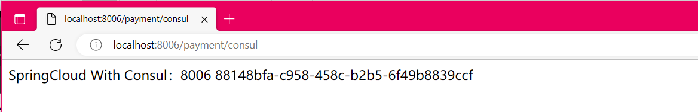


### 4 服务消费者

1. 新建Module消费服务order80：`cloud-consumerconsul-order80`

2. POM

   ```xml
   <project xmlns="http://maven.apache.org/POM/4.0.0" xmlns:xsi="http://www.w3.org/2001/XMLSchema-instance"
            xsi:schemaLocation="http://maven.apache.org/POM/4.0.0 http://maven.apache.org/xsd/maven-4.0.0.xsd">
       <parent>
           <artifactId>sh-cloud</artifactId>
           <groupId>com.shanhai.springcloud</groupId>
           <version>1.0-SNAPSHOT</version>
       </parent>
       <modelVersion>4.0.0</modelVersion>
   
       <artifactId>cloud-consumerconsul-order80</artifactId>
   
       <dependencies>
           <!--SpringCloud consul-server -->
           <dependency>
               <groupId>org.springframework.cloud</groupId>
               <artifactId>spring-cloud-starter-consul-discovery</artifactId>
           </dependency>
           <!-- SpringBoot整合Web组件 -->
           <dependency>
               <groupId>org.springframework.boot</groupId>
               <artifactId>spring-boot-starter-web</artifactId>
           </dependency>
           <dependency>
               <groupId>org.springframework.boot</groupId>
               <artifactId>spring-boot-starter-actuator</artifactId>
           </dependency>
           <!--日常通用jar包配置-->
           <dependency>
               <groupId>org.springframework.boot</groupId>
               <artifactId>spring-boot-devtools</artifactId>
               <scope>runtime</scope>
               <optional>true</optional>
           </dependency>
           <dependency>
               <groupId>org.projectlombok</groupId>
               <artifactId>lombok</artifactId>
               <optional>true</optional>
           </dependency>
           <dependency>
               <groupId>org.springframework.boot</groupId>
               <artifactId>spring-boot-starter-test</artifactId>
               <scope>test</scope>
           </dependency>
       </dependencies>
   </project>
   ```

3. YML：application.yml

   ```yml
   ###consul服务端口号
   server:
     port: 80
   
   spring:
     application:
       name: cloud-consumer-order
     ####consul注册中心地址
     cloud:
       consul:
         host: localhost
         port: 8500
         discovery:
           #hostname: 127.0.0.1
           service-name: ${spring.application.name}
   ```

4. 主启动类

   ```java
   //该注解用于向使用consul或者zookeeper作为注册中心时注册服务
   @EnableDiscoveryClient
   @SpringBootApplication
   public class OrderConsulMain80 {
       public static void main(String[] args) {
           SpringApplication.run(OrderConsulMain80.class, args);
       }
   }
   ```

5. 配置Config

   ```java
   @Configuration
   public class ApplicationContextConfig {
       @Bean
       @LoadBalanced
       public RestTemplate getRestTemplate() {
           return new RestTemplate();
       }
   }
   ```

6. Controller

   ```java
   @RestController
   public class OrderConsulController {
       // consul-provider-payment
       public static final String INVOKE_URL = "http://consul-provider-payment";
   
       @Autowired
       private RestTemplate restTemplate;
   
       @GetMapping(value = "/consumer/payment/consul")
       public String paymentInfo() {
           String result = restTemplate.getForObject(INVOKE_URL + "/payment/consul", String.class);
           System.out.println("消费者调用支付服务(consul)--->result:" + result);
           return result;
       }
   }
   ```

7. 验证测试

   `http://localhost:8500`：

   

   `http://localhost/consumer/payment/consul`：

   


### 5 三个注册中心异同点

| **组件名** | **语言** | **CAP** | **服务健康检查** | **对外暴露接口** | **SpringCloud集成** |
| ---------- | -------- | ------- | ---------------- | ---------------- | ------------------- |
| Eureka     | Java     | AP      | 可配支持         | HTTP             | 已集成              |
| Consul     | Go       | CP      | 支持             | HTTP/DNS         | 已集成              |
| Zookeeper  | Java     | CP      | 支持             | 客户端           | 已集成              |


> CAP：

- C：Consistency（强一致性）
- A：Availability（可用性）
- P：Partition tolerance（分区容错性）
- CAP理论关注粒度是数据，而不是整体系统设计的策略

> 经典CAP图：

*最多只能同时较好的满足两个*。

CAP理论的核心是：*一个分布式系统不可能同时很好的满足一致性，可用性和分区容错性这三个需求*。

因此，根据 CAP 原理将 NoSQL 数据库分成了**满足 CA 原则**、**满足 CP 原则**和**满足 AP 原则**三大类：

- CA --- 单点集群，满足一致性，可用性的系统，通常在可扩展性上不太强大。
- CP --- 满足一致性，分区容错性的系统，通常性能不是特别高。
- AP --- 满足可用性，分区容错性的系统，通常可能对一致性要求低一些。


> AP(Eureka)

AP架构

当网络分区出现后，为了保证可用性，系统B*可以返回旧值*，保证系统的可用性。

结论：**违背了一致性C的要求，只满足可用性和分区容错，即AP**。


> CP(Zookeeper/Consul)

CP架构

当网络分区出现后，为了保证一致性，就必须拒接请求，否则无法保证一致性。

结论：**违背了可用性A的要求，只满足一致性和分区容错，即CP**。


+++

## 七、Ribbon负载均衡服务调用

### 1 概述

> Ribbon是什么？

Spring Cloud Ribbon是基于Netflix Ribbon实现的一套**客户端负载均衡的工具**。

简单的说，Ribbon是Netflix发布的开源项目，主要功能是提供**客户端的软件负载均衡算法和服务调用**。Ribbon客户端组件提供一系列完善的配置项如连接超时，重试等。简单的说，就是在配置文件中列出Load Balancer（简称LB）后面所有的机器，Ribbon会自动的帮助你基于某种规则（如简单轮询，随机连接等）去连接这些机器。我们很容易使用Ribbon实现自定义的负载均衡算法。


官网资料：https://github.com/Netflix/ribbon/wiki/Getting-Started

Ribbon目前也进入维护模式，


未来替换方案：Spring Cloud loadbalancer


> Ribbon能干嘛？

- **LB（负载均衡）**

  1. *LB负载均衡(Load Balance)是什么？*

     简单的说就是将用户的请求平摊的分配到多个服务上，从而达到系统的HA（高可用）。

     常见的负载均衡有软件Nginx，LVS，硬件 F5等。

  2. *Ribbon本地负载均衡客户端 VS Nginx服务端负载均衡区别？*

     Nginx是服务器负载均衡，客户端所有请求都会交给nginx，然后由nginx实现转发请求。即负载均衡是由服务端实现的。

     Ribbon本地负载均衡，在调用微服务接口时候，会在注册中心上获取注册信息服务列表之后缓存到JVM本地，从而在本地实现RPC远程服务调用技术。

- **集中式LB**

  即在服务的消费方和提供方之间使用独立的LB设施(可以是硬件，如F5, 也可以是软件，如nginx), 由该设施负责把访问请求通过某种策略转发至服务的提供方；

- **进程内LB**

  将LB逻辑集成到消费方，消费方从服务注册中心获知有哪些地址可用，然后自己再从这些地址中选择出一个合适的服务器。

  **Ribbon就属于进程内LB**，它只是一个类库，**集成于消费方进程**，消费方通过它来获取到服务提供方的地址。


前面我们讲解过了80通过轮询负载访问8001/8002

一句话：负载均衡+RestTemplate调用


### 2 Ribbon负载均衡演示

> 架构说明


Ribbon在工作时分成两步：

1. 第一步先选择 EurekaServer，它优先选择在同一个区域内负载较少的server。
2. 第二步再根据用户指定的策略，在从server取到的服务注册列表中选择一个地址。其中Ribbon提供了多种策略：比如轮询、随机和根据响应时间加权。

总结：Ribbon其实就是一个软负载均衡的客户端组件，他可以和其他所需请求的客户端结合使用，和eureka结合只是其中的一个实例。


> POM

之前写样例时候没有引入spring-cloud-starter-ribbon也可以使用ribbon

```xml
<dependency>
    <groupId>org.springframework.cloud</groupId>
    <artifactId>spring-cloud-starter-netflix-ribbon</artifactId>
</dependency>
```

猜测spring-cloud-starter-netflix-eureka-client自带了spring-cloud-starter-ribbon引用

证明如下：可以看到 spring-cloud-starter-netflix-eureka-client 确实引入了Ribbon


> RestTemplate的使用

官网：https://docs.spring.io/spring-framework/docs/5.2.2.RELEASE/javadoc-api/org/springframework/web/client/RestTemplate.html


1. getForObject方法/getForEntity方法

   **返回对象为响应体中数据转化成的对象，基本上可以理解为Json**

   

   **返回对象为ResponseEntity对象，包含了响应中的一些重要信息，比如响应头、响应状态码、响应体等**

   

2. postForObject/postForEntity

   

3. GET请求方法

   ```java
   <T> T getForObject(String url, Class<T> responseType, Object... uriVariables);
    
   <T> T getForObject(String url, Class<T> responseType, Map<String, ?> uriVariables);
    
   <T> T getForObject(URI url, Class<T> responseType);
    
   <T> ResponseEntity<T> getForEntity(String url, Class<T> responseType, Object... uriVariables);
    
   <T> ResponseEntity<T> getForEntity(String url, Class<T> responseType, Map<String, ?> uriVariables);
    
   <T> ResponseEntity<T> getForEntity(URI var1, Class<T> responseType);
   
   ```

4. POST请求方法

   ```java
   <T> T postForObject(String url, @Nullable Object request, Class<T> responseType, Object... uriVariables);
    
   <T> T postForObject(String url, @Nullable Object request, Class<T> responseType, Map<String, ?> uriVariables);
    
   <T> T postForObject(URI url, @Nullable Object request, Class<T> responseType);
    
   <T> ResponseEntity<T> postForEntity(String url, @Nullable Object request, Class<T> responseType, Object... uriVariables);
    
   <T> ResponseEntity<T> postForEntity(String url, @Nullable Object request, Class<T> responseType, Map<String, ?> uriVariables);
    
   <T> ResponseEntity<T> postForEntity(URI url, @Nullable Object request, Class<T> responseType);
   ```


### 3 Ribbon核心组件IRule

> IRule：根据特定算法中从服务列表中选取一个要访问的服务


1. com.netflix.loadbalancer.RoundRobinRule：轮询
2. com.netflix.loadbalancer.RandomRule：随机
3. com.netflix.loadbalancer.RetryRule：先按照RoundRobinRule的策略获取服务，如果获取服务失败则在指定时间内会进行重试，获取可用的服务
4. WeightedResponseTimeRule：对RoundRobinRule的扩展，响应速度越快的实例选择权重越大，越容易被选择
5. BestAvailableRule：会先过滤掉由于多次访问故障而处于断路器跳闸状态的服务，然后选择一个并发量最小的服务
6. AvailabilityFilteringRule：先过滤掉故障实例，再选择并发较小的实例
7. ZoneAvoidanceRule：默认规则，复合判断server所在区域的性能和server的可用性选择服务器


> 如何替换负载均衡算法？

1. 修改cloud-consumer-order80

2. 注意配置细节

   *官方文档明确给出了警告*：<font color="gree">这个自定义配置类不能放在@ComponentScan所扫描的当前包下以及子包下，否则我们自定义的这个配置类就会被所有的Ribbon客户端所共享，达不到特殊化定制的目的了。</font>

3. 新建package：com.shanhai.myrule

4. 上面包下新建MySelfRule规则类

   

5. 主启动类添加`@RibbonClient`

   ```java
   package com.shanhai.springcloud;
   
   import com.shanhai.myrule.MySelfRule;
   import org.springframework.boot.SpringApplication;
   import org.springframework.boot.autoconfigure.SpringBootApplication;
   import org.springframework.cloud.netflix.eureka.EnableEurekaClient;
   import org.springframework.cloud.netflix.ribbon.RibbonClient;
   
   // 在启动该微服务的时候就能去加载我们的自定义Ribbon配置类，从而使配置生效，形如：
   @RibbonClient(name = "CLOUD-PAYMENT-SERVICE", configuration = MySelfRule.class)
   @EnableEurekaClient
   @SpringBootApplication
   public class MainApp80 {
       public static void main(String[] args) {
           SpringApplication.run(MainApp80.class,args);
       }
   }
   ```

6. 测试：http://localhost/consumer/payment/get/31

   结果，随机访问8001/8002端口


### 4 Ribbon负载均衡算法

> 原理

**负载均衡算法**：*rest接口第几次请求数 % 服务器集群总数量 = 实际调用服务器位置下标，每次服务重启动后rest接口计数从1开始*。

`List<ServiceInstance> instances = discoveryClient.getInstances("CLOUD-PAYMENT-SERVICE");`

如：

`List [0] instances = 127.0.0.1:8002`

`List [1] instances = 127.0.0.1:8001`

8001+ 8002 组合成为集群，它们共计2台机器，集群总数为2，按照轮询算法原理：

- 当总请求数为1时：1 % 2 =1 对应下标位置为1，则获得服务地址为127.0.0.1:8001
- 当总请求数位2时：2 % 2 =0 对应下标位置为0，则获得服务地址为127.0.0.1:8002
- 当总请求数位3时：3 % 2 =1 对应下标位置为1，则获得服务地址为127.0.0.1:8001
- 当总请求数位4时：4 % 2 =0 对应下标位置为0，则获得服务地址为127.0.0.1:8002
- 如此类推......


> 手写：自己试着写一个本地负载均衡器试试

- 7001/7002集群启动

- 8001/8002微服务改造，controller

  分别添加一个相同的方法即可

  ```java
  @Value("${server.port}") // 8001 / 8002
  private String serverPort;
  
  @GetMapping(value = "/payment/lb")
  public String getPaymentLB() {
      return serverPort;
  }
  ```

  8001/8002集群启动

- 80订单微服务改造

  1. ApplicationContextConfig去掉注解`@LoadBalanced`

     ```java
     @Configuration
     public class ApplicationContextConfig {
         //@LoadBalanced
         @Bean
         public RestTemplate getRestTemplate() {
             return new RestTemplate();
         }
     }
     ```

  2. LoadBalancer接口

     ```java
     package com.shanhai.springcloud.lb;
     
     import org.springframework.cloud.client.ServiceInstance;
     import java.util.List;
     
     public interface LoadBalancer {
         ServiceInstance instances(List<ServiceInstance> serviceInstances);
     }
     ```

  3. MyLB实现LoadBalancer接口

     ```java
     package com.shanhai.springcloud.lb;
     
     import org.springframework.cloud.client.ServiceInstance;
     import org.springframework.stereotype.Component;
     
     import java.util.List;
     import java.util.concurrent.atomic.AtomicInteger;
     
     @Component
     public class MyLB implements LoadBalancer {
         private AtomicInteger atomicInteger = new AtomicInteger(0);
     
         public final int getAtomicInteger() {
             int current;
             int next;
             do {
                 current = this.atomicInteger.get();
                 next = current >= Integer.MAX_VALUE ? 0 : current + 1;
             } while (!this.atomicInteger.compareAndSet(current, next));
             System.out.println("第几次访问次数next = " + next);
             return next;
         }
     
         @Override
         public ServiceInstance instances(List<ServiceInstance> serviceInstances) {
             int index = getAtomicInteger() % serviceInstances.size();
             return serviceInstances.get(index);
         }
     }
     ```

  4. OrderController

     ```java
     // org.springframework.web.client.RestTemplate;
     @Resource
     private RestTemplate restTemplate;
     
     @Resource
     private LoadBalancer loadBalancer;
     
     // org.springframework.cloud.client.discovery.DiscoveryClient;
     @Resource
     private DiscoveryClient discoveryClient;
     
     @GetMapping("/consumer/payment/lb")
     public String getPaymentLB() {
         List<ServiceInstance> instances = discoveryClient.getInstances("CLOUD-PAYMENT-SERVICE");
         if (instances != null && instances.size() <= 0) {
             return null;
         }
         ServiceInstance serviceInstance = loadBalancer.instances(instances);
         URI uri = serviceInstance.getUri();
         return restTemplate.getForObject(uri + "/payment/lb", String.class);
     }
     ```

- 测试：`http://localhost/consumer/payment/lb`

  结果：轮询访问8001/8002

+++

## 八、OpenFeign服务接口调用

### 1 概述

#### 1.1 OpenFeign是什么？

官网解释：https://cloud.spring.io/spring-cloud-static/Hoxton.SR1/reference/htmlsingle/#spring-cloud-openfeign

Feign是一个声明式WebService客户端。使用Feign能让编写Web Service客户端更加简单。

它的使用方法是*定义一个服务接口然后在上面添加注解*。Feign也支持可拔插式的编码器和解码器。Spring Cloud对Feign进行了封装，使其支持了Spring MVC标准注解和HttpMessageConverters。Feign可以与Eureka和Ribbon组合使用以支持负载均衡。


Feign是一个声明式的Web服务客户端，让编写Web服务客户端变得非常容易，**只需创建一个接口并在接口上添加注解即可**。

GitHub：https://github.com/spring-cloud/spring-cloud-openfeign


#### 1.2 OpenFeign能干嘛？

- *Feign能干什么*：

  Feign旨在使编写Java Http客户端变得更容易。

  前面在使用Ribbon+RestTemplate时，利用RestTemplate对http请求的封装处理，形成了一套模版化的调用方法。但是在实际开发中，由于对服务依赖的调用可能不止一处，**往往一个接口会被多处调用，所以通常都会针对每个微服务自行封装一些客户端类来包装这些依赖服务的调用**。所以，Feign在此基础上做了进一步封装，由他来帮助我们定义和实现依赖服务接口的定义。**在Feign的实现下，我们只需创建一个接口并使用注解的方式来配置它(以前是Dao接口上面标注Mapper注解，现在是一个微服务接口上面标注一个Feign注解即可)**，即可完成对服务提供方的接口绑定，简化了使用Spring cloud Ribbon时，自动封装服务调用客户端的开发量。

- *Feign集成了Ribbon*：

  利用Ribbon维护了Payment的服务列表信息，并且通过轮询实现了客户端的负载均衡。而与Ribbon不同的是，**通过feign只需要定义服务绑定接口且以声明式的方法**，优雅而简单的实现了服务调用。


#### 1.3 Feign和OpenFeign两者区别

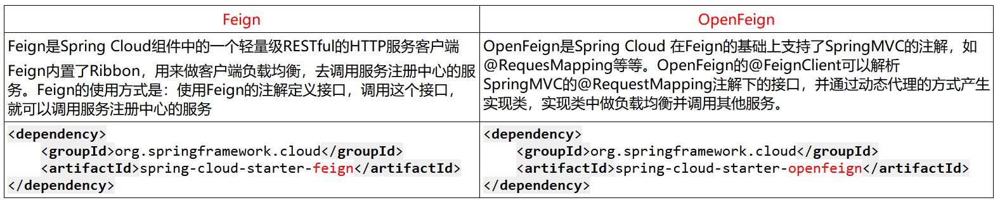


### 2 OpenFeign使用步骤

**接口+注解：微服务调用接口+@FeignClient**

1. 新建Maven子模块：cloud-consumer-feign-order80

   Feign在消费端使用

2. POM

   ```xml
   <dependencies>
       <!--openfeign-->
       <dependency>
           <groupId>org.springframework.cloud</groupId>
           <artifactId>spring-cloud-starter-openfeign</artifactId>
       </dependency>
       <!--eureka client-->
       <dependency>
           <groupId>org.springframework.cloud</groupId>
           <artifactId>spring-cloud-starter-netflix-eureka-client</artifactId>
       </dependency>
       <!-- 引入自己定义的api通用包，可以使用Payment支付Entity -->
       <dependency>
           <groupId>com.shanhai.springcloud</groupId>
           <artifactId>cloud-api-commons</artifactId>
           <version>${project.version}</version>
       </dependency>
       <!--web-->
       <dependency>
           <groupId>org.springframework.boot</groupId>
           <artifactId>spring-boot-starter-web</artifactId>
       </dependency>
       <dependency>
           <groupId>org.springframework.boot</groupId>
           <artifactId>spring-boot-starter-actuator</artifactId>
       </dependency>
       <!--一般基础通用配置-->
       <dependency>
           <groupId>org.springframework.boot</groupId>
           <artifactId>spring-boot-devtools</artifactId>
           <scope>runtime</scope>
           <optional>true</optional>
       </dependency>
       <dependency>
           <groupId>org.projectlombok</groupId>
           <artifactId>lombok</artifactId>
           <optional>true</optional>
       </dependency>
       <dependency>
           <groupId>org.springframework.boot</groupId>
           <artifactId>spring-boot-starter-test</artifactId>
           <scope>test</scope>
       </dependency>
   </dependencies>
   ```

3. YML

   ```yaml
   server:
     port: 80
   
   eureka:
     client:
       register-with-eureka: false
       service-url:
         defaultZone: http://eureka7001.com:7001/eureka/,http://eureka7002.com:7002/eureka/
   ```

4. 主启动类：加注解`@EnableFeignClients`

   ```java
   package com.shanhai.springcloud;
   
   import org.springframework.boot.SpringApplication;
   import org.springframework.boot.autoconfigure.SpringBootApplication;
   import org.springframework.cloud.openfeign.EnableFeignClients;
   
   @SpringBootApplication
   @EnableFeignClients
   public class OrderFeignMain80 {
       public static void main(String[] args) {
           SpringApplication.run(OrderFeignMain80.class, args);
       }
   }
   ```

5. 业务类

   - 业务逻辑接口+*@FeignClient配置调用provider服务*

   - 新建`PaymentFeignService接口`并*新增注解`@FeignClient`*

     ```java
     package com.shanhai.springcloud.service;
     
     import com.shanhai.springcloud.entities.CommonResult;
     import com.shanhai.springcloud.entities.Payment;
     import org.springframework.cloud.openfeign.FeignClient;
     import org.springframework.stereotype.Component;
     import org.springframework.web.bind.annotation.GetMapping;
     import org.springframework.web.bind.annotation.PathVariable;
     
     @Component
     @FeignClient(value = "CLOUD-PAYMENT-SERVICE")
     public interface PaymentFeignService {
         @GetMapping(value = "/payment/get/{id}")
         public CommonResult<Payment> getPaymentById(@PathVariable("id") Long id);
     }
     ```

   - 控制层Controller

     ```java
     @RestController
     @Slf4j
     public class OrderFeignController {
         @Resource
         private PaymentFeignService paymentFeignService;
     
         @GetMapping(value = "/consumer/payment/get/{id}")
         public CommonResult<Payment> getPaymentById(@PathVariable("id") Long id) {
             CommonResult<Payment> commonResult = paymentFeignService.getPaymentById(id);
             log.info("commonResult.Payment" + commonResult.getData());
             return commonResult;
         }
     }
     ```

6. 测试

   先启动2个eureka集群7001/7002

   再启动2个微服务8001/8002

   启动cloud-consumer-feign-order80

   访问：`http://localhost/consumer/payment/get/31`

   Feign自带负载均衡配置项

   

   

7. 小总结

   


### 3 OpenFeign超时控制

超时设置，故意设置超时演示出错情况：

1. 服务提供方8001故意写暂停程序：8001 controller

   ```java
   @GetMapping(value = "/payment/feign/timeout")
   public String paymentFeignTimeOut()
   {
       System.out.println("*****paymentFeignTimeOut from port: " + serverPort);
       //暂停几秒钟线程
       try {
           TimeUnit.SECONDS.sleep(3);
       } catch (InterruptedException e) {
           e.printStackTrace();
       }
       return serverPort;
   }
   ```

2. 服务消费方80添加超时方法PaymentFeignService

   ```java
   @Component
   @FeignClient(value = "CLOUD-PAYMENT-SERVICE")
   public interface PaymentFeignService {
       @GetMapping(value = "/payment/get/{id}")
       CommonResult<Payment> getPaymentById(@PathVariable("id") Long id);
   
       @GetMapping(value = "/payment/feign/timeout")
       String paymentFeignTimeOut();
   }
   ```

3. 服务消费方80添加超时方法OrderFeignController

   ```java
   @RestController
   @Slf4j
   public class OrderFeignController {
       @Resource
       private PaymentFeignService paymentFeignService;
   
       @GetMapping(value = "/consumer/payment/get/{id}")
       public CommonResult<Payment> getPaymentById(@PathVariable("id") Long id) {
           CommonResult<Payment> commonResult = paymentFeignService.getPaymentById(id);
           log.info("commonResult.Payment" + commonResult.getData());
           return commonResult;
       }
   
       @GetMapping(value = "/consumer/payment/feign/timeout")
       public String paymentFeignTimeOut(){
           return paymentFeignService.paymentFeignTimeOut();
       }
   }
   ```

4. 测试：`http://localhost/consumer/payment/feign/timeout`

   错误页面：

   


OpenFeign默认等待1秒钟，超过后报错：默认Feign客户端只等待一秒钟，但是服务端处理需要超过1秒钟，导致Feign客户端不想等待了，直接返回报错。为了避免这样的情况，有时候我们需要设置Feign客户端的超时控制。

yml文件中开启配置

OpenFeign默认支持Ribbon

YML文件里需要开启OpenFeign客户端超时控制

```yaml
server:
  port: 80

eureka:
  client:
    register-with-eureka: false
    service-url:
      defaultZone: http://eureka7001.com:7001/eureka/,http://eureka7002.com:7002/eureka/

#设置feign客户端超时时间(OpenFeign默认支持ribbon)
ribbon:
  #指的是建立连接所用的时间，适用于网络状况正常的情况下,两端连接所用的时间
  ReadTimeout: 5000
  #指的是建立连接后从服务器读取到可用资源所用的时间
  ConnectTimeout: 5000
```

测试：测试通过


### 4 OpenFeign日志打印功能

是什么？

Feign 提供了日志打印功能，我们可以通过配置来调整日志级别，从而了解 Feign 中 Http 请求的细节。

说白了就是**对Feign接口的调用情况进行监控和输出**。


日志级别：

- NONE：默认的，不显示任何日志；
- BASIC：仅记录请求方法、URL、响应状态码及执行时间；
- HEADERS：除了 BASIC 中定义的信息之外，还有请求和响应的头信息；
- FULL：除了 HEADERS 中定义的信息之外，还有请求和响应的正文及元数据。


配置日志bean：

```java
package com.shanhai.springcloud.config;

import feign.Logger;
import org.springframework.context.annotation.Bean;
import org.springframework.context.annotation.Configuration;

@Configuration
public class FeignConfig {
    @Bean
    Logger.Level feignLoggerLevel() {
        return Logger.Level.FULL;
    }
}
```


YML文件里需要开启日志的Feign客户端：

```yaml
server:
  port: 80

eureka:
  client:
    register-with-eureka: false
    service-url:
      defaultZone: http://eureka7001.com:7001/eureka/,http://eureka7002.com:7002/eureka/

#设置feign客户端超时时间(OpenFeign默认支持ribbon)
ribbon:
  #指的是建立连接所用的时间，适用于网络状况正常的情况下,两端连接所用的时间
  ReadTimeout: 5000
  #指的是建立连接后从服务器读取到可用资源所用的时间
  ConnectTimeout: 5000

logging:
  level:
    # feign日志以什么级别监控哪个接口
    com.shanhai.springcloud.service.PaymentFeignService: debug
```


测试：后台日志查看


+++

## 九、Hystrix断路器

### 1 概述

> 分布式系统面临的问题

*复杂分布式体系结构中的应用程序有数十个依赖关系，每个依赖关系在某些时候将不可避免地失败*。


**服务雪崩**：

多个微服务之间调用的时候，假设微服务A调用微服务B和微服务C，微服务B和微服务C又调用其它的微服务，这就是所谓的“**扇出**”。如果扇出的链路上某个微服务的调用响应时间过长或者不可用，对微服务A的调用就会占用越来越多的系统资源，进而引起系统崩溃，所谓的“雪崩效应”。

对于高流量的应用来说，单一的后端依赖可能会导致所有服务器上的所有资源都在几秒钟内饱和。比失败更糟糕的是，这些应用程序还可能导致服务之间的延迟增加，备份队列，线程和其他系统资源紧张，导致整个系统发生更多的级联故障。这些都表示需要对故障和延迟进行隔离和管理，以便单个依赖关系的失败，不能取消整个应用程序或系统。

所以，通常当你发现一个模块下的某个实例失败后，这时候这个模块依然还会接收流量，然后这个有问题的模块还调用了其他的模块，这样就会发生级联故障，或者叫雪崩。


> Hystrix是什么？

Hystrix是一个用于处理分布式系统的**延迟**和**容错**的开源库，在分布式系统里，许多依赖不可避免的会调用失败，比如超时、异常等，Hystrix能够保证在一个依赖出问题的情况下，**不会导致整体服务失败，避免级联故障，以提高分布式系统的弹性**。

“断路器”本身是一种开关装置，当某个服务单元发生故障之后，通过断路器的故障监控（类似熔断保险丝），**向调用方返回一个符合预期的、可处理的备选响应（FallBack），而不是长时间的等待或者抛出调用方无法处理的异常**，这样就保证了服务调用方的线程不会被长时间、不必要地占用，从而避免了故障在分布式系统中的蔓延，乃至雪崩。


> Hystrix能干嘛？

- 服务降级
- 服务熔断
- 接近实时的监控
- ......


官网资料：https://github.com/Netflix/Hystrix/wiki/How-To-Use

*Hystrix官宣，停更进维*：https://github.com/Netflix/Hystrix

- 被动修复bugs
- 不再接受合并请求
- 不再发布新版本

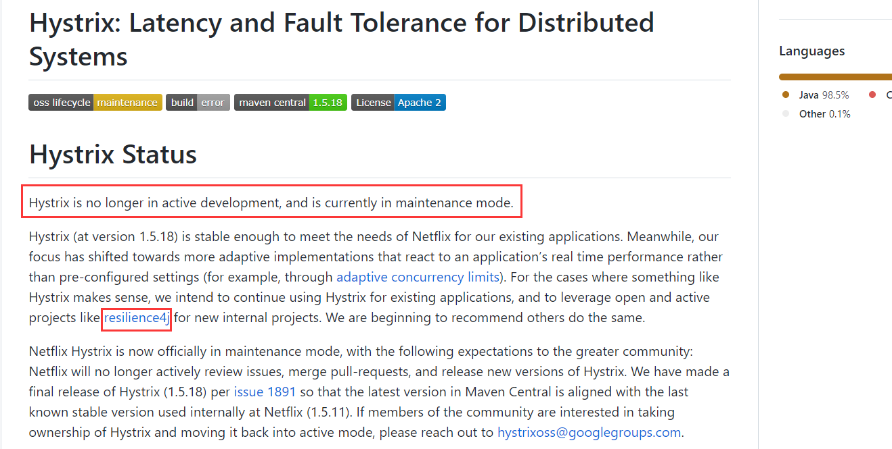


### 2 Hystrix重要概念

- **服务降级**

  服务器忙，请稍后再试，不让客户端等待并立刻返回一个友好提示，fallback

  哪些情况会出发降级：

  程序运行异常、超时、服务熔断触发服务降级、线程池/信号量打满也会导致服务降级

- **服务熔断**

  类比保险丝达到最大服务访问后，直接拒绝访问，拉闸限电，然后调用服务降级的方法并返回友好提示

  就是保险丝：服务的降级 ---> 进而熔断 ---> 恢复调用链路

- **服务限流**

  秒杀高并发等操作，严禁一窝蜂的过来拥挤，大家排队，一秒钟N个，有序进行


### 3 Hystrix案例

#### 3.1 构建提供者支付模块8001

1. 新建Maven子模块：cloud-provider-hystrix-payment8001

2. POM

   ```xml
   <dependencies>
       <!--hystrix-->
       <dependency>
           <groupId>org.springframework.cloud</groupId>
           <artifactId>spring-cloud-starter-netflix-hystrix</artifactId>
       </dependency>
       <!--eureka client-->
       <dependency>
           <groupId>org.springframework.cloud</groupId>
           <artifactId>spring-cloud-starter-netflix-eureka-client</artifactId>
       </dependency>
       <!--web-->
       <dependency>
           <groupId>org.springframework.boot</groupId>
           <artifactId>spring-boot-starter-web</artifactId>
       </dependency>
       <dependency>
           <groupId>org.springframework.boot</groupId>
           <artifactId>spring-boot-starter-actuator</artifactId>
       </dependency>
       <dependency>
           <groupId>org.springframework.boot</groupId>
           <artifactId>spring-boot-devtools</artifactId>
           <scope>runtime</scope>
           <optional>true</optional>
       </dependency>
       <dependency>
           <groupId>org.projectlombok</groupId>
           <artifactId>lombok</artifactId>
           <optional>true</optional>
       </dependency>
       <dependency>
           <groupId>org.springframework.boot</groupId>
           <artifactId>spring-boot-starter-test</artifactId>
           <scope>test</scope>
       </dependency>
   </dependencies>
   ```

3. YML

   ```yaml
   server:
     port: 8001
   
   spring:
     application:
       name: cloud-provider-hystrix-payment
   
   eureka:
     client:
       register-with-eureka: true
       fetch-registry: true
       service-url:
         defaultZone: http://eureka7001.com:7001/eureka
   ```

4. 主启动类

   ```java
   @SpringBootApplication
   @EnableEurekaClient //本服务启动后会自动注册进eureka服务中
   public class PaymentHystrixMain8001 {
       public static void main(String[] args) {
           SpringApplication.run(PaymentHystrixMain8001.class, args);
       }
   }
   ```

5. 业务类

   service

   ```java
   @Service
   public class PaymentService {
       /**
        * 正常访问，一切OK
        * @param id
        * @return
        */
       public String paymentInfo_OK(Integer id) {
           return "线程池：" + Thread.currentThread().getName() +
                   "paymentInfo_OK,id: " + id + "\t" + "O(∩_∩)O";
       }
   
       /**
        * 超时访问，演示降级
        * @param id
        * @return
        */
       public String paymentInfo_TimeOut(Integer id) {
           Integer timeSeconds = 3;
           try { 
               TimeUnit.SECONDS.sleep(timeSeconds); 
           } catch (InterruptedException e) { 
               e.printStackTrace(); }
           return "线程池：" + Thread.currentThread().getName() + "paymentInfo_TimeOut,id: " +
                   id + "\t" + "O(∩_∩)O，耗费" + timeSeconds + "秒";
       }
   }
   ```

   controller

   ```java
   @RestController
   @Slf4j
   public class PaymentController {
       @Resource
       private PaymentService paymentService;
   
       @GetMapping("/payment/hystrix/ok/{id}")
       public String paymentInfo_OK(@PathVariable("id") Integer id) {
           String result = paymentService.paymentInfo_OK(id);
           log.info("****result: "+result);
           return result;
       }
   
       @GetMapping("/payment/hystrix/timeout/{id}")
       public String paymentInfo_TimeOut(@PathVariable("id") Integer id) throws InterruptedException {
           String result = paymentService.paymentInfo_TimeOut(id);
           log.info("****result: "+result);
           return result;
       }
   }
   ```

6. 正常测试

   启动eureka7001

   启动cloud-provider-hystrix-payment8001

   访问:

   success的方法：`http://localhost:8001/payment/hystrix/ok/31`

   每次调用耗费3秒钟：`http://localhost:8001/payment/hystrix/timeout/31`

   

   

   上述module均OK，以上述为根基平台，从正确->错误->降级熔断->恢复


#### 3.2 高并发测试1

上述在非高并发情形下，还能勉强满足，but......

Jmeter压测测试：

- 开启Jmeter，来20000个并发压死8001，20000个请求都去访问paymentInfo_TimeOut服务

  

  

- 再来一个访问：`http://localhost:8001/payment/hystrix/ok/31`
  
- 看演示结果

  两个请求都在自己转圈圈

  为什么会被卡死：tomcat的默认的工作线程数被打满了，没有多余的线程来分解压力和处理。

- Jmeter压测结论

  上面还是**服务提供者8001**自己测试，假如此时外部的消费者80也来访问，那**消费者**只能干等，最终导致消费端80不满意，服务端8001直接被拖死。


#### 3.3 构建消费者模块80

> 看热闹不嫌弃事大，80新建加入

1. 新建Maven子模块：cloud-consumer-feign-hystrix-order80

2. POM

   ```xml
   <dependencies>
     <!--openfeign-->
     <dependency>
       <groupId>org.springframework.cloud</groupId>
       <artifactId>spring-cloud-starter-openfeign</artifactId>
     </dependency>
     <!--hystrix-->
     <dependency>
       <groupId>org.springframework.cloud</groupId>
       <artifactId>spring-cloud-starter-netflix-hystrix</artifactId>
     </dependency>
     <!--eureka client-->
     <dependency>
       <groupId>org.springframework.cloud</groupId>
       <artifactId>spring-cloud-starter-netflix-eureka-client</artifactId>
     </dependency>
     <!--web-->
     <dependency>
       <groupId>org.springframework.boot</groupId>
       <artifactId>spring-boot-starter-web</artifactId>
     </dependency>
     <dependency>
       <groupId>org.springframework.boot</groupId>
       <artifactId>spring-boot-starter-actuator</artifactId>
     </dependency>
     <!--一般基础通用配置-->
     <dependency>
       <groupId>org.springframework.boot</groupId>
       <artifactId>spring-boot-devtools</artifactId>
       <scope>runtime</scope>
       <optional>true</optional>
     </dependency>
     <dependency>
       <groupId>org.projectlombok</groupId>
       <artifactId>lombok</artifactId>
       <optional>true</optional>
     </dependency>
     <dependency>
       <groupId>org.springframework.boot</groupId>
       <artifactId>spring-boot-starter-test</artifactId>
       <scope>test</scope>
     </dependency>
   </dependencies>
   ```

3. YML

   ```yaml
   server:
     port: 80
   
   eureka:
     client:
       register-with-eureka: false
       service-url:
         defaultZone: http://eureka7001.com:7001/eureka/
   ```

4. 主启动类

   ```java
   @SpringBootApplication
   @EnableFeignClients
   public class OrderHystrixMain80 {
       public static void main(String[] args) {
           SpringApplication.run(OrderHystrixMain80.class,args);
       }
   }
   ```

5. 业务类

   service接口

   ```java
   @Component
   @FeignClient(value = "CLOUD-PROVIDER-HYSTRIX-PAYMENT")
   public interface PaymentHystrixService {
       @GetMapping("/payment/hystrix/ok/{id}")
       String paymentInfo_OK(@PathVariable("id") Integer id);
   
       @GetMapping("/payment/hystrix/timeout/{id}")
       String paymentInfo_TimeOut(@PathVariable("id") Integer id);
   }
   ```

   controller

   ```java
   @RestController
   @Slf4j
   public class OrderHystrixController {
       @Resource
       private PaymentHystrixService paymentHystrixService;
   
       @GetMapping("/consumer/payment/hystrix/ok/{id}")
       public String paymentInfo_OK(@PathVariable("id") Integer id) {
           String result = paymentHystrixService.paymentInfo_OK(id);
           log.info("****result: "+result);
           return result;
       }
   
       @GetMapping("/consumer/payment/hystrix/timeout/{id}")
       public String paymentInfo_TimeOut(@PathVariable("id") Integer id) throws InterruptedException {
           String result = paymentHystrixService.paymentInfo_TimeOut(id);
           log.info("****result: "+result);
           return result;
       }
   }
   ```

6. 正常测试：`http://localhost/consumer/payment/hystrix/ok/31`

   正常访问


#### 3.4 高并发测试2

高并发测试：

2W个线程压8001吗，消费端80微服务再去访问正常的Ok微服务8001地址

`http://localhost/consumer/payment/hystrix/ok/32`

消费者80，o(╥﹏╥)o

- 要么转圈圈等待

- 要么消费端报超时错误

  


故障现象和导致原因：

- 8001同一层次的其它接口服务被困死，因为tomcat线程池里面的工作线程已经被挤占完毕
- 80此时调用8001，客户端访问响应缓慢，转圈圈
- 结论：正因为有上述故障或不佳表现，才有我们的*降级*/*熔断*/*限流*等技术诞生


如何解决：

- 超时导致服务器变慢(转圈)：超时不再等待
- 出错(宕机或程序运行出错)：出错要有兜底
- 解决：
  - 对方服务(8001)超时了，调用者(80)不能一直卡死等待，必须有服务降级
  - 对方服务(8001)宕机了，调用者(80)不能一直卡死等待，必须有服务降级
  - 对方服务(8001)OK，调用者(80)自己出故障或有自我要求（自己的等待时间小于服务提供者），自己处理降级


#### 3.5 服务降级

##### 3.5.1 8001fallback

降级配置：`@HystrixCommand`

8001先从自身找问题：设置自身调用超时时间的峰值，峰值内可以正常运行，超过了需要有兜底的方法处理，作服务降级fallback。

*8001fallback*：

- 业务类启用：

  ```java
  @Service
  public class PaymentService {
      /**
       * 正常访问，一切OK
       * @param id
       * @return
       */
      public String paymentInfo_OK(Integer id) {
          return "线程池：" + Thread.currentThread().getName() +
                  "paymentInfo_OK,id: " + id + "\t" + "O(∩_∩)O";
      }
  
      /**
       * 超时访问，演示降级
       * @param id
       * @return
       */
      @HystrixCommand(fallbackMethod = "paymentInfo_TimeOutHandler", commandProperties = {
              @HystrixProperty(name = "execution.isolation.thread.timeoutInMilliseconds", value = "3000")
      })
      public String paymentInfo_TimeOut(Integer id) {
          Integer timeSeconds = 5000;
          try { 
              TimeUnit.MILLISECONDS.sleep(timeSeconds); 
          } catch (InterruptedException e) { 
              e.printStackTrace(); 
          }
          return "线程池：" + Thread.currentThread().getName() + "paymentInfo_TimeOut,id: " +
                  id + "\t" + "O(∩_∩)O，耗费" + timeSeconds + "毫秒";
      }
  
      public String paymentInfo_TimeOutHandler(Integer id) {
          return "/(ㄒoㄒ)/调用支付接口超时或异常：\tid：" + id + "\t当前线程池名字" + Thread.currentThread().getName();
      }
  }
  ```

  `@HystrixCommand`报异常后如何处理：一旦调用服务方法失败并抛出了错误信息后，会自动调用`@HystrixCommand`标注好的`fallbackMethod`调用类中的指定方法。

  

  上图故意制造两个异常：

  1. int age = 10/0; 计算异常
  2. 我们能接受3秒钟，它运行5秒钟，超时异常。

  当前服务不可用了，做服务降级，兜底的方案都是`paymentInfo_TimeOutHandler`。

- 主启动类激活：添加新注解`@EnableCircuitBreaker`

  ```java
  @SpringBootApplication
  @EnableEurekaClient //本服务启动后会自动注册进eureka服务中
  @EnableCircuitBreaker
  public class PaymentHystrixMain8001 {
      public static void main(String[] args) {
          SpringApplication.run(PaymentHystrixMain8001.class, args);
      }
  }
  ```


##### 3.5.2 80fallback

*80fallback*：80订单微服务，也可以更好的保护自己，自己也依样画葫芦进行客户端降级保护

注：我们自己配置过的热部署方式对java代码的改动明显，但对**@HystrixCommand内属性的修改建议重启微服务**。

1. YML

   ```yaml
   server:
     port: 80
   
   eureka:
     client:
       register-with-eureka: false
       service-url:
         defaultZone: http://eureka7001.com:7001/eureka/
   
   feign:
     hystrix:
       enabled: true
   ```

2. 主启动类：`@EnableHystrix`

   ```java
   @SpringBootApplication
   @EnableFeignClients
   @EnableHystrix
   public class OrderHystrixMain80 {
       public static void main(String[] args) {
           SpringApplication.run(OrderHystrixMain80.class,args);
       }
   }
   ```

3. 业务类

   ```java
   @RestController
   @Slf4j
   public class OrderHystrixController {
       @Resource
       private PaymentHystrixService paymentHystrixService;
   
       @GetMapping("/consumer/payment/hystrix/ok/{id}")
       public String paymentInfo_OK(@PathVariable("id") Integer id) {
           String result = paymentHystrixService.paymentInfo_OK(id);
           log.info("****result: "+result);
           return result;
       }
   
       @HystrixCommand(fallbackMethod = "paymentInfo_TimeOutHandler", commandProperties = {
               @HystrixProperty(name = "execution.isolation.thread.timeoutInMilliseconds", value = "1500")
       })
       @GetMapping("/consumer/payment/hystrix/timeout/{id}")
       public String paymentInfo_TimeOut(@PathVariable("id") Integer id) {
           String result = paymentHystrixService.paymentInfo_TimeOut(id);
           log.info("****result: "+result);
           return result;
       }
   
       public String paymentInfo_TimeOutHandler(@PathVariable("id") Integer id){
           return "我是消费者80,对方支付系统繁忙请10秒钟后再试或者自己运行出错请检查自己,o(╥﹏╥)o";
       }
   }
   ```


> 目前问题：
>
> - 每个业务方法对应一个兜底的方法，代码膨胀
> - 统一和自定义的分开，避免代码耦合


##### 3.5.3 解决问题：代码膨胀

每个方法配置一个fallback：代码膨胀

- feign接口系列

- @DefaultProperties(defaultFallback = "")

  1. 1:1 每个方法配置一个服务降级方法，技术上可以，实际上傻X

  2. 1:N 除了个别重要核心业务有专属，其它普通的可以通过@DefaultProperties(defaultFallback = "")

     统一跳转到统一处理结果页面

  通用的和独享的各自分开，避免了代码膨胀，合理减少了代码量

- 80：controller配置

  ```java
  @RestController
  @Slf4j
  @DefaultProperties(defaultFallback = "payment_Global_FallbackMethod")
  public class OrderHystrixController {
      @Resource
      private PaymentHystrixService paymentHystrixService;
  
      @GetMapping("/consumer/payment/hystrix/ok/{id}")
      public String paymentInfo_OK(@PathVariable("id") Integer id) {
          String result = paymentHystrixService.paymentInfo_OK(id);
          log.info("****result: "+result);
          return result;
      }
  
      //@HystrixCommand(fallbackMethod = "paymentInfo_TimeOutHandler", commandProperties = {
      //        @HystrixProperty(name = "execution.isolation.thread.timeoutInMilliseconds", value = "1500")
      //})
      @HystrixCommand //加了@DefaultProperties属性注解，并且没有写具体方法名字，就用统一全局的
      @GetMapping("/consumer/payment/hystrix/timeout/{id}")
      public String paymentInfo_TimeOut(@PathVariable("id") Integer id) {
          String result = paymentHystrixService.paymentInfo_TimeOut(id);
          log.info("****result: "+result);
          return result;
      }
      public String paymentInfo_TimeOutHandler(@PathVariable("id") Integer id){
          return "我是消费者80,对方支付系统繁忙请10秒钟后再试或者自己运行出错请检查自己,o(╥﹏╥)o";
      }
  
      public String payment_Global_FallbackMethod() {
          return "Global异常处理信息，请稍后再试，/(ㄒoㄒ)/~~";
      }
  }
  ```


##### 3.5.4 解决问题：代码耦合

**服务降级，客户端去调用服务端，碰上服务端宕机或关闭**。

本次案例服务降级处理是在客户端80实现完成的，与服务端8001没有关系；

*只需要为Feign客户端定义的接口添加一个服务降级处理的实现类即可实现解耦*。

未来我们要面对的异常：*运行*、*超时*、*宕机*。

- 再看我们的业务类`OrderHystrixController`

  

  混合在一块，每个业务方法都要提供一个。

- 修改cloud-consumer-feign-hystrix-order80：

  根据cloud-consumer-feign-hystrix-order80已经有的`PaymentHystrixService`接口，重新新建一个类(`PaymentFallbackService`)实现该接口，统一为接口里面的方法进行异常处理

- `PaymentFallbackService`类实现`PaymentHystrixService`接口

  ```java
  @Component //必须加
  public class PaymentFallbackService implements PaymentHystrixService{
      @Override
      public String paymentInfo_OK(Integer id) {
          return "paymentInfo_OK Error\t id：" + id + "\t"
                  + Thread.currentThread().getName();
      }
  
      @Override
      public String paymentInfo_TimeOut(Integer id) {
          return "paymentInfo_TimeOut Error\t id：" + id + "\t"
                  + Thread.currentThread().getName();
      }
  }
  ```

- YML

  ```yaml
  server:
    port: 80
  
  eureka:
    client:
      register-with-eureka: false
      service-url:
        defaultZone: http://eureka7001.com:7001/eureka/
  
  # 用于服务降级 在注解@FeignClient中添加fallbackFactory属性值
  feign:
    hystrix:
      enabled: true
  ```

- `PaymentHystrixService`接口

  ```java
  @Component
  @FeignClient(value = "CLOUD-PROVIDER-HYSTRIX-PAYMENT", fallback = PaymentFallbackService.class)
  public interface PaymentHystrixService {
      @GetMapping("/payment/hystrix/ok/{id}")
      String paymentInfo_OK(@PathVariable("id") Integer id);
  
      @GetMapping("/payment/hystrix/timeout/{id}")
      String paymentInfo_TimeOut(@PathVariable("id") Integer id);
  }
  ```

- 测试：

  单个eureka先启动7001，cloud-provider-hystrix-payment8001启动，cloud-consumer-feign-hystrix-order80启动

  正常访问测试：`http://localhost/consumer/payment/hystrix/ok/31`

  **故意关闭**微服务8001

  客户端自己调用提示：此时服务端provider已经down了，但是我们做了服务降级处理，让客户端在服务端不可用时也会获得提示信息而不会挂起耗死服务器


#### 3.6 服务熔断

##### 3.6.1 实操

断路器：一句话就是家里的保险丝

> 熔断是什么？

**熔断机制概述**：熔断机制是应对雪崩效应的一种微服务链路保护机制。当扇出链路的某个微服务出错不可用或者响应时间太长时，会进行服务的降级，进而熔断该节点微服务的调用，快速返回错误的响应信息。**当检测到该节点微服务调用响应正常后，恢复调用链路**。

在SpringCloud框架里，熔断机制通过Hystrix实现。Hystrix会监控微服务间调用的状况，当失败的调用到一定阈值，缺省是5秒内20次调用失败，就会启动熔断机制。熔断机制的注解是`@HystrixCommand`。

大神论文：https://martinfowler.com/bliki/CircuitBreaker.html


> 实操

修改cloud-provider-hystrix-payment8001

- PaymentService

  ```java
  //=========服务熔断
  @HystrixCommand(fallbackMethod = "paymentCircuitBreaker_fallback",commandProperties = {
          @HystrixProperty(name = "circuitBreaker.enabled", value = "true"),// 是否开启断路器
          @HystrixProperty(name = "circuitBreaker.requestVolumeThreshold", value = "10"),// 请求次数
          @HystrixProperty(name = "circuitBreaker.sleepWindowInMilliseconds", value = "10000"),// 时间窗口期
          @HystrixProperty(name = "circuitBreaker.errorThresholdPercentage", value = "60"),// 失败率达到多少后跳闸
  })
  public String paymentCircuitBreaker(Integer id) {
      if(id < 0) {
          throw new RuntimeException("******id 不能负数");
      }
      String serialNumber = UUID.randomUUID().toString();
      return Thread.currentThread().getName()+"\t"+"调用成功，流水号: " + serialNumber;
  }
  public String paymentCircuitBreaker_fallback(Integer id){
      return "id 不能负数，请稍后再试，/(ㄒoㄒ)/~~   id: " +id;
  }
  ```

- PaymentController

  ```java
  @Resource
  private PaymentService paymentService;
  
  @GetMapping("/payment/circuit/{id}")
  public String paymentCircuitBreaker(@PathVariable("id") Integer id) {
      String result = paymentService.paymentCircuitBreaker(id);
      log.info("****result: "+result);
      return result;
  }
  ```

- 测试

  自测cloud-provider-hystrix-payment8001

  正确：`http://localhost:8001/payment/circuit/31`

  错误：`http://localhost:8001/payment/circuit/-31`

  一次正确一次错误trytry

  重点测试：多次错误，然后慢慢正确，发现刚开始不满足条件，就算是正确的访问地址也不能进行，一段时间过后，正确的访问地址又可以了


##### 3.6.2 原理

> 熔断类型：

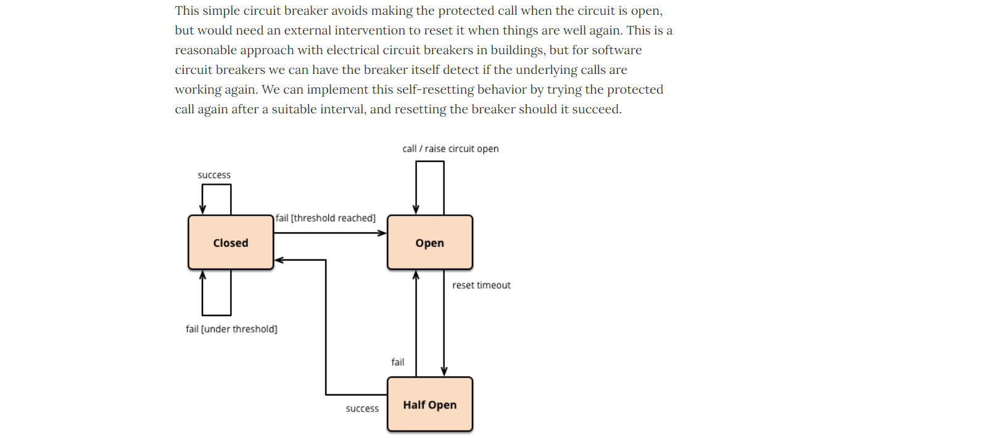

1. *熔断打开*：

   请求不再进行调用当前服务，内部设置时钟一般为MTTR（平均故障处理时间)，当打开时长达到所设时钟则进入半熔断状态

2. *熔断关闭*：

   熔断关闭不会对服务进行熔断

3. *熔断半开*：

   部分请求根据规则调用当前服务，如果请求成功且符合规则则认为当前服务恢复正常，关闭熔断


> 官网断路器流程图：


官网步骤：


> 断路器在什么情况下开始起作用：

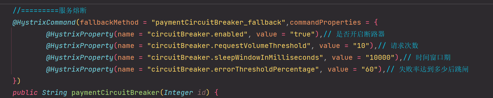

涉及到断路器的三个重要参数：**快照时间窗**、**请求总数阀值**、**错误百分比阀值**。

1. 快照时间窗：

   断路器确定是否打开需要统计一些请求和错误数据，而统计的时间范围就是快照时间窗，默认为最近的10秒。

2. 请求总数阀值：

   在快照时间窗内，必须满足请求总数阀值才有资格熔断。默认为20，意味着在10秒内，如果该hystrix命令的调用次数不足20次，即使所有的请求都超时或其他原因失败，断路器都不会打开。

3. 错误百分比阀值：

   当请求总数在快照时间窗内超过了阀值，比如发生了30次调用，如果在这30次调用中，有15次发生了超时异常，也就是超过50%的错误百分比，在默认设定50%阀值情况下，这时候就会将断路器打开。


> 断路器开启或者关闭的条件：

1. 当满足一定的阀值的时候（默认10秒内超过20个请求次数）
2. 当失败率达到一定的时候（默认10秒内超过50%的请求失败）
3. 到达以上阀值，断路器将会开启
4. 当开启的时候，所有请求都不会进行转发
5. 一段时间之后（默认是5秒），这个时候断路器是半开状态，会让其中一个请求进行转发。如果成功，断路器会关闭，若失败，继续开启。重复4和5。


> 断路器打开之后：

1. 再有请求调用的时候，将不会调用主逻辑，而是直接调用降级fallback。通过断路器，实现了自动地发现错误并将降级逻辑切换为主逻辑，减少响应延迟的效果。

2. 原来的主逻辑要如何恢复呢？

   对于这一问题，hystrix也为我们实现了自动恢复功能。当断路器打开，对主逻辑进行熔断之后，hystrix会启动一个休眠时间窗，在这个时间窗内，降级逻辑是临时的成为主逻辑，当休眠时间窗到期，断路器将进入半开状态，释放一次请求到原来的主逻辑上，如果此次请求正常返回，那么断路器将继续闭合，主逻辑恢复，如果这次请求依然有问题，断路器继续进入打开状态，休眠时间窗重新计时。


> All配置

```java
//========================All
@HystrixCommand(fallbackMethod = "str_fallbackMethod",
        groupKey = "strGroupCommand",
        commandKey = "strCommand",
        threadPoolKey = "strThreadPool",

        commandProperties = {
                // 设置隔离策略，THREAD 表示线程池 SEMAPHORE：信号池隔离
                @HystrixProperty(name = "execution.isolation.strategy", value = "THREAD"),
                // 当隔离策略选择信号池隔离的时候，用来设置信号池的大小（最大并发数）
                @HystrixProperty(name = "execution.isolation.semaphore.maxConcurrentRequests", value = "10"),
                // 配置命令执行的超时时间
                @HystrixProperty(name = "execution.isolation.thread.timeoutinMilliseconds", value = "10"),
                // 是否启用超时时间
                @HystrixProperty(name = "execution.timeout.enabled", value = "true"),
                // 执行超时的时候是否中断
                @HystrixProperty(name = "execution.isolation.thread.interruptOnTimeout", value = "true"),
                // 执行被取消的时候是否中断
                @HystrixProperty(name = "execution.isolation.thread.interruptOnCancel", value = "true"),
                // 允许回调方法执行的最大并发数
                @HystrixProperty(name = "fallback.isolation.semaphore.maxConcurrentRequests", value = "10"),
                // 服务降级是否启用，是否执行回调函数
                @HystrixProperty(name = "fallback.enabled", value = "true"),
                // 是否启用断路器
                @HystrixProperty(name = "circuitBreaker.enabled", value = "true"),
                // 该属性用来设置在滚动时间窗中，断路器熔断的最小请求数。例如，默认该值为 20 的时候，
                // 如果滚动时间窗（默认10秒）内仅收到了19个请求， 即使这19个请求都失败了，断路器也不会打开。
                @HystrixProperty(name = "circuitBreaker.requestVolumeThreshold", value = "20"),
                // 该属性用来设置在滚动时间窗中，表示在滚动时间窗中，在请求数量超过
                // circuitBreaker.requestVolumeThreshold 的情况下，如果错误请求数的百分比超过50,
                // 就把断路器设置为 "打开" 状态，否则就设置为 "关闭" 状态。
                @HystrixProperty(name = "circuitBreaker.errorThresholdPercentage", value = "50"),
                // 该属性用来设置当断路器打开之后的休眠时间窗。 休眠时间窗结束之后，
                // 会将断路器置为 "半开" 状态，尝试熔断的请求命令，如果依然失败就将断路器继续设置为 "打开" 状态，
                // 如果成功就设置为 "关闭" 状态。
                @HystrixProperty(name = "circuitBreaker.sleepWindowinMilliseconds", value = "5000"),
                // 断路器强制打开
                @HystrixProperty(name = "circuitBreaker.forceOpen", value = "false"),
                // 断路器强制关闭
                @HystrixProperty(name = "circuitBreaker.forceClosed", value = "false"),
                // 滚动时间窗设置，该时间用于断路器判断健康度时需要收集信息的持续时间
                @HystrixProperty(name = "metrics.rollingStats.timeinMilliseconds", value = "10000"),
                // 该属性用来设置滚动时间窗统计指标信息时划分"桶"的数量，断路器在收集指标信息的时候会根据
                // 设置的时间窗长度拆分成多个 "桶" 来累计各度量值，每个"桶"记录了一段时间内的采集指标。
                // 比如 10 秒内拆分成 10 个"桶"收集这样，所以 timeinMilliseconds 必须能被 numBuckets 整除。否则会抛异常
                @HystrixProperty(name = "metrics.rollingStats.numBuckets", value = "10"),
                // 该属性用来设置对命令执行的延迟是否使用百分位数来跟踪和计算。如果设置为 false, 那么所有的概要统计都将返回 -1。
                @HystrixProperty(name = "metrics.rollingPercentile.enabled", value = "false"),
                // 该属性用来设置百分位统计的滚动窗口的持续时间，单位为毫秒。
                @HystrixProperty(name = "metrics.rollingPercentile.timeInMilliseconds", value = "60000"),
                // 该属性用来设置百分位统计滚动窗口中使用 “ 桶 ”的数量。
                @HystrixProperty(name = "metrics.rollingPercentile.numBuckets", value = "60000"),
                // 该属性用来设置在执行过程中每个 “桶” 中保留的最大执行次数。如果在滚动时间窗内发生超过该设定值的执行次数，
                // 就从最初的位置开始重写。例如，将该值设置为100, 滚动窗口为10秒，若在10秒内一个 “桶 ”中发生了500次执行，
                // 那么该 “桶” 中只保留 最后的100次执行的统计。另外，增加该值的大小将会增加内存量的消耗，并增加排序百分位数所需的计算时间。
                @HystrixProperty(name = "metrics.rollingPercentile.bucketSize", value = "100"),
                // 该属性用来设置采集影响断路器状态的健康快照（请求的成功、 错误百分比）的间隔等待时间。
                @HystrixProperty(name = "metrics.healthSnapshot.intervalinMilliseconds", value = "500"),
                // 是否开启请求缓存
                @HystrixProperty(name = "requestCache.enabled", value = "true"),
                // HystrixCommand的执行和事件是否打印日志到 HystrixRequestLog 中
                @HystrixProperty(name = "requestLog.enabled", value = "true"),
        },
        threadPoolProperties = {
                // 该参数用来设置执行命令线程池的核心线程数，该值也就是命令执行的最大并发量
                @HystrixProperty(name = "coreSize", value = "10"),
                // 该参数用来设置线程池的最大队列大小。当设置为 -1 时，线程池将使用 SynchronousQueue 实现的队列，
                // 否则将使用 LinkedBlockingQueue 实现的队列。
                @HystrixProperty(name = "maxQueueSize", value = "-1"),
                // 该参数用来为队列设置拒绝阈值。 通过该参数， 即使队列没有达到最大值也能拒绝请求。
                // 该参数主要是对 LinkedBlockingQueue 队列的补充,因为 LinkedBlockingQueue
                // 队列不能动态修改它的对象大小，而通过该属性就可以调整拒绝请求的队列大小了。
                @HystrixProperty(name = "queueSizeRejectionThreshold", value = "5"),
        }
)
public String strConsumer() {
    return "hello 2020";
}
public String str_fallbackMethod()
{
    return "*****fall back str_fallbackMethod";
}
```


### 4 Hystrix工作流程

https://github.com/Netflix/Hystrix/wiki/How-it-Works

> Hystrix工作流程：

官网图例：


步骤说明：

1. 创建 HystrixCommand（用在依赖的服务返回单个操作结果的时候）或 HystrixObserableCommand（用在依赖的服务返回多个操作结果的时候）对象。

2. 命令执行。

   其中 HystrixComand 实现了下面前两种执行方式；而 HystrixObservableCommand 实现了后两种执行方式：

   `execute()`：同步执行，从依赖的服务返回一个单一的结果对象，或是在发生错误的时候抛出异常。

   `queue()`：异步执行，直接返回一个Future对象，其中包含了服务执行结束时要返回的单一结果对象。

   `observe()`：返回 Observable 对象，它代表了操作的多个结果，它是一个 Hot Obserable（不论 "事件源" 是否有 "订阅者"，都会在创建后对事件进行发布，所以对于 Hot Observable 的每一个 "订阅者" 都有可能是从 "事件源" 的中途开始的，并可能只是看到了整个操作的局部过程）。

   `toObservable()`：同样会返回 Observable 对象，也代表了操作的多个结果，但它返回的是一个Cold Observable（没有 "订阅者" 的时候并不会发布事件，而是进行等待，直到有 "订阅者" 之后才发布事件，所以对于 Cold Observable 的订阅者，它可以保证从一开始看到整个操作的全部过程）。

3. 若当前命令的请求缓存功能是被启用的，并且该命令缓存命中，那么缓存的结果会立即以 Observable 对象的形式返回。

4. 检查断路器是否为打开状态。如果断路器是打开的，那么Hystrix不会执行命令，而是转接到 fallback 处理逻辑（第8步）；如果断路器是关闭的，检查是否有可用资源来执行命令（第5步）。

5. 线程池/请求队列/信号量是否占满。如果命令依赖服务的专有线程池和请求队列，或者信号量（不使用线程池的时候）已经被占满，那么 Hystrix 也不会执行命令，而是转接到 fallback 处理逻辑（第8步）。

6. Hystrix 会根据我们编写的方法来决定采取什么样的方式去请求依赖服务。

   `HystrixCommand.run()`：返回一个单一的结果，或者抛出异常。

   `HystrixObservableCommand.construct()`：返回一个Observable对象来发射多个结果，或通过 onError 发送错误通知。

7. Hystrix会将"成功"、"失败"、"拒绝"、"超时"等信息报告给断路器，而断路器会维护一组计数器来统计这些数据。断路器会使用这些统计数据来决定是否要将断路器打开，来对某个依赖服务的请求进行"熔断/短路"。

8. 当命令执行失败的时候，Hystrix 会进入 fallback 尝试回退处理，我们通常也称该操作为 "服务降级"。而能够引起服务降级处理的情况有下面几种：

   第4步：当前命令处于"熔断/短路"状态，断路器是打开的时候。

   第5步：当前命令的线程池、请求队列或者信号量被占满的时候。

   第6步：`HystrixObservableCommand.construct()`或`HystrixCommand.run()`抛出异常的时候。

9. 当Hystrix命令执行成功之后，它会将处理结果直接返回或是以 Observable 的形式返回。

Tips：如果我们没有为命令实现降级逻辑或者在降级处理逻辑中抛出了异常，Hystrix 依然会返回一个 Observable 对象，但是它不会发射任何结果数据，而是通过 onError 方法通知命令立即中断请求，并通过onError()方法将引起命令失败的异常发送给调用者。


### 5 服务监控HystrixDashboard

#### 5.1 概述

除了隔离依赖服务的调用以外，Hystrix还提供了**准实时的调用监控（Hystrix Dashboard）**，Hystrix会持续地记录所有通过Hystrix发起的请求的执行信息，并以统计报表和图形的形式展示给用户，包括每秒执行多少请求多少成功，多少失败等。Netflix通过hystrix-metrics-event-stream项目实现了对以上指标的监控。Spring Cloud也提供了Hystrix Dashboard的整合，对监控内容转化成可视化界面。


#### 5.2 仪表盘9001

1. 新建Maven子模块：cloud-consumer-hystrix-dashboard9001

2. POM

   ```xml
   <dependencies>
       <dependency>
           <groupId>org.springframework.cloud</groupId>
           <artifactId>spring-cloud-starter-netflix-hystrix-dashboard</artifactId>
       </dependency>
       <dependency>
           <groupId>org.springframework.boot</groupId>
           <artifactId>spring-boot-starter-actuator</artifactId>
       </dependency>
       <dependency>
           <groupId>org.springframework.boot</groupId>
           <artifactId>spring-boot-devtools</artifactId>
           <scope>runtime</scope>
           <optional>true</optional>
       </dependency>
       <dependency>
           <groupId>org.projectlombok</groupId>
           <artifactId>lombok</artifactId>
           <optional>true</optional>
       </dependency>
       <dependency>
           <groupId>org.springframework.boot</groupId>
           <artifactId>spring-boot-starter-test</artifactId>
           <scope>test</scope>
       </dependency>
   </dependencies>
   ```

3. YML

   ```yaml
   server:
     port: 9001
   ```

4. 主启动类：`@EnableHystrixDashboard`

   ```java
   @SpringBootApplication
   @EnableHystrixDashboard
   public class HystrixDashboardMain9001 {
       public static void main(String[] args)
       {
           SpringApplication.run(HystrixDashboardMain9001.class,args);
       }
   }
   ```

5. 所有Provider微服务提供类(8001/8002/8003)都需要**监控依赖配置**

   ```xml
   <!-- actuator监控信息完善 -->
   <dependency>
       <groupId>org.springframework.boot</groupId>
       <artifactId>spring-boot-starter-actuator</artifactId>
   </dependency>
   ```

6. 启动cloud-consumer-hystrix-dashboard9001；该微服务后续将监控微服务8001

   访问：`http://localhost:9001/hystrix`

   


#### 5.3 断路器演示(服务监控hystrixDashboard)

> 修改cloud-provider-hystrix-payment8001

- 注意：新版本Hystrix需要在主启动类`PaymentHystrixMain8001`中指定监控路径

  ```java
  package com.shanhai.springcloud;
  
  import com.netflix.hystrix.contrib.metrics.eventstream.HystrixMetricsStreamServlet;
  import org.springframework.boot.SpringApplication;
  import org.springframework.boot.autoconfigure.SpringBootApplication;
  import org.springframework.boot.web.servlet.ServletRegistrationBean;
  import org.springframework.cloud.client.circuitbreaker.EnableCircuitBreaker;
  import org.springframework.cloud.netflix.eureka.EnableEurekaClient;
  import org.springframework.context.annotation.Bean;
  
  @SpringBootApplication
  @EnableEurekaClient //本服务启动后会自动注册进eureka服务中
  @EnableCircuitBreaker
  public class PaymentHystrixMain8001 {
      public static void main(String[] args) {
          SpringApplication.run(PaymentHystrixMain8001.class, args);
      }
  
      /**
       *此配置是为了服务监控而配置，与服务容错本身无关，springcloud升级后的坑
       *ServletRegistrationBean因为springboot的默认路径不是"/hystrix.stream"，
       *只要在自己的项目里配置上下面的servlet就可以了
       */
      @Bean
      public ServletRegistrationBean getServlet() {
          HystrixMetricsStreamServlet streamServlet = new HystrixMetricsStreamServlet();
          ServletRegistrationBean registrationBean = new ServletRegistrationBean(streamServlet);
          registrationBean.setLoadOnStartup(1);
          registrationBean.addUrlMappings("/hystrix.stream");
          registrationBean.setName("HystrixMetricsStreamServlet");
          return registrationBean;
      }
  }
  ```

- 否则：Unable to connect to Command Metric Stream。

  404


> 监控测试

启动1个eureka或者3个eureka集群均可

观察监控窗口：9001监控8001

- 填写监控地址：`http://localhost:8001/hystrix.stream`

  

- 测试地址：

  `http://localhost:8001/payment/circuit/31`

  `http://localhost:8001/payment/circuit/-31`

  上述测试通过：OK

- 先访问正确地址，再访问错误地址，再正确地址，会发现图示断路器都是慢慢放开的。

  监控结果，成功

  

  监控结果，失败

  

> 如何看监控？

- 7色

- 1圈

  实心圆：共有两种含义。它通过颜色的变化代表了实例的健康程度，它的健康度从<font color=gree>绿色</font><<font color="yellow">黄色</font><<font color="orange">橙色</font><<font color="red">红色</font>递减。

  该实心圆除了颜色的变化之外，它的大小也会根据实例的请求流量发生变化，流量越大该实心圆就越大。所以通过该实心圆的展示，就可以在大量的实例中快速的发现故障实例和高压力实例。

- 1线

  曲线：用来记录2分钟内流量的相对变化，可以通过它来观察到流量的上升和下降趋势。


+++

## 十、Gateway网关

### 1 概述简介

官网：

上一代zuul 1.X：https://github.com/Netflix/zuul/wiki

当前gateway：https://cloud.spring.io/spring-cloud-static/spring-cloud-gateway/2.2.1.RELEASE/reference/html/


#### 1.1 Gateway是什么？

Cloud全家桶中有个很重要的组件就是网关，在1.x版本中都是采用的Zuul网关；但在2.x版本中，zuul的升级一直跳票，SpringCloud最后自己研发了一个网关替代Zuul，那就是**SpringCloud Gateway**。

一句话：**Gateway是原zuul1.x版的替代**。


Gateway概述：Gateway是在Spring生态系统之上构建的API网关服务，基于Spring5，Spring Boot2和Project Reactor等技术。

Gateway旨在提供一种简单而有效的方式来对API进行路由，以及提供一些强大的过滤器功能，例如：*熔断*、*限流*、*重试*等。


SpringCloud Gateway是Spring Cloud的一个全新项目，基于Spring5.0+Spring Boot2.0和Project Reactor等技术开发的网关，它旨在为微服务架构提供一种简单有效的统一的 API 路由管理方式。

SpringCloud Gateway作为Spring Cloud生态系统中的网关，目标是替代Zuul，在Spring Cloud 2.0以上版本中，没有对新版本的Zuul 2.0以上最新高性能版本进行集成，仍然还是使用的Zuul 1.x非Reactor模式的老版本。而为了提升网关的性能，SpringCloud Gateway是基于WebFlux框架实现的，而WebFlux框架底层则使用了高性能的Reactor模式通信框架Netty。

Spring Cloud Gateway的目标提供统一的路由方式且基于 Filter 链的方式提供了网关基本的功能，例如：*安全*，*监控/指标*和*限流*。

一句话：**SpringCloud Gateway使用的Webflux中的reactor-netty响应式编程组件，底层使用了Netty通讯框架**。

源码架构：


#### 1.2 Gateway能干嘛？

1. 反向代理
2. 鉴权
3. 流量控制
4. 熔断
5. 日志监控
6. ......


> 微服务架构中网关在哪里


#### 1.3 有Zuul了怎么又出来了Gateway

> 我们为什么选择Gateway？

1. neflix不太靠谱，zuul2.0一直跳票，迟迟不发布

   一方面因为Zuul1.0已经进入了维护阶段，而且Gateway是SpringCloud团队研发的，是亲儿子产品，值得信赖。

   而且很多功能Zuul都没有用起来也非常的简单便捷。

   Gateway是基于**异步非阻塞模型上**进行开发的，性能方面不需要担心。虽然Netflix早就发布了最新的Zuul2.x，但 Spring Cloud 貌似没有整合计划。而且Netflix相关组件都宣布进入维护期；不知前景如何？

   多方面综合考虑Gateway是很理想的网关选择。

2. SpringCloud Gateway具有如下特性

   - 基于Spring Framework5，Project Reactor和Spring Boot2.0进行构建；
   - 动态路由：能够匹配任何请求属性；
   - 可以对路由指定 Predicate（断言）和 Filter（过滤器）；
   - 集成Hystrix的断路器功能；
   - 集成 Spring Cloud 服务发现功能；
   - 易于编写的 Predicate（断言）和 Filter（过滤器）；
   - 请求限流功能；
   - 支持路径重写。

3. SpringCloud Gateway 与 Zuul的区别

   在SpringCloud Finchley正式版之前，Spring Cloud 推荐的网关是 Netflix 提供的Zuul：

   - Zuul 1.x，是一个基于阻塞I/O的API Gateway
   - Zuul 1.x基于Servlet2.5使用阻塞架构，它不支持任何长连接(如WebSocket)，Zuul的设计模式和Nginx较像，每次I/O操作都是从工作线程中选择一个执行，请求线程被阻塞到工作线程完成，但是差别是Nginx用C++实现，Zuul 用 Java 实现，而JVM本身会有第一次加载较慢的情况，使得Zuul的性能相对较差。
   - Zuul 2.x理念更先进，想基于Netty非阻塞和支持长连接，但SpringCloud目前还没有整合。Zuul 2.x的性能较Zuul 1.x有较大提升。在性能方面，根据官方提供的基准测试，Spring Cloud Gateway的RPS（每秒请求数）是Zuul的1.6倍。
   - Spring Cloud Gateway建立在 Spring Framework5、Project Reactor和Spring Boot2之上，使用非阻塞API。


> Zuul1.x模型

Springcloud中所集成的Zuul版本，采用的是Tomcat容器，使用的是传统的Servlet IO处理模型。

**Servlet的生命周期**：servlet由servlet container进行生命周期管理。

- container启动时构造servlet对象并调用servlet init()进行初始化；
- container运行时接受请求，并为每个请求分配一个线程（一般从线程池中获取空闲线程）然后调用service()。
- container关闭时调用servlet destory()销毁servlet；


**上述模式的缺点**：

servlet是一个简单的网络IO模型，当请求进入servlet container时，servlet container就会为其绑定一个线程，在**并发不高的场景下**这种模型是适用的。但是一旦高并发(比如抽风用jemeter压)，线程数量就会上涨，而线程资源代价是昂贵的（上下文切换，内存消耗大）严重影响请求的处理时间。在一些简单业务场景下，不希望为每个request分配一个线程，只需要1个或几个线程就能应对极大并发的请求，这种业务场景下servlet模型没有优势。

所以Zuul 1.X是基于servlet之上的一个阻塞式处理模型，即spring实现了处理所有request请求的一个servlet（DispatcherServlet）并由该servlet阻塞式处理处理。所以Springcloud Zuul无法摆脱servlet模型的弊端。


> GateWay模型

WebFlux是什么：https://docs.spring.io/spring/docs/current/spring-framework-reference/web-reactive.html#webflux-new-framework


传统的Web框架，比如说：struts2，springmvc等都是基于Servlet API与Servlet容器基础之上运行的。

但是**在Servlet3.1之后有了异步非阻塞的支持**。而WebFlux是一个典型非阻塞异步的框架，它的核心是基于Reactor的相关API实现的。相对于传统的web框架来说，它可以运行在诸如Netty，Undertow及支持Servlet3.1的容器上。非阻塞式+函数式编程（Spring5必须让你使用java8）

Spring WebFlux是Spring 5.0引入的新的响应式框架，区别于Spring MVC，它不需要依赖Servlet API，它是完全异步非阻塞的，并且基于Reactor来实现响应式流规范。


### 2 三大核心概念

- Route(路由)

  路由是构建网关的基本模块，它由ID，目标URI，一系列的断言和过滤器组成，如果断言为true则匹配该路由

- Predicate(断言)

  参考的是Java8的java.util.function.Predicate

  开发人员可以匹配HTTP请求中的所有内容(例如请求头或请求参数)，**如果请求与断言相匹配则进行路由**

- Filter(过滤)

  指的是Spring框架中GatewayFilter的实例，使用过滤器，可以在请求被路由前或者之后对请求进行修改。

- 最后总结：

  

  web请求，通过一些匹配条件，定位到真正的服务节点。并在这个转发过程的前后，进行一些精细化控制。

  predicate就是我们的匹配条件；而filter，就可以理解为一个无所不能的拦截器。有了这两个元素，再加上目标uri，就可以实现一个具体的路由了。


### 3 Gateway工作流程

官网总结：


客户端向SpringCloud Gateway发出请求。然后在Gateway Handler Mapping中找到与请求相匹配的路由，将其发送到Gateway Web Handler。

Handler再通过指定的过滤器链来将请求发送到我们实际的服务执行业务逻辑，然后返回。

过滤器之间用虚线分开是因为过滤器可能会在发送代理请求之前（“pre”）或之后（“post”）执行业务逻辑。

Filter在“pre”类型的过滤器可以做参数校验、权限校验、流量监控、日志输出、协议转换等；

在“post”类型的过滤器中可以做响应内容、响应头的修改，日志的输出，流量监控等有着非常重要的作用。


核心逻辑：*路由转发+执行过滤器链*。


### 4 入门配置

#### 4.1 新建路由网关Module9527

1. 新建Maven子模块：cloud-gateway-gateway9527

2. POM

   ```xml
   <dependencies>
       <!--gateway-->
       <dependency>
           <groupId>org.springframework.cloud</groupId>
           <artifactId>spring-cloud-starter-gateway</artifactId>
       </dependency>
       <!--eureka-client-->
       <dependency>
           <groupId>org.springframework.cloud</groupId>
           <artifactId>spring-cloud-starter-netflix-eureka-client</artifactId>
       </dependency>
       <!-- 引入自己定义的api通用包，可以使用Payment支付Entity -->
       <dependency>
           <groupId>com.shanhai.springcloud</groupId>
           <artifactId>cloud-api-commons</artifactId>
           <version>1.0-SNAPSHOT</version>
       </dependency>
       <!--一般基础配置类-->
       <dependency>
           <groupId>org.springframework.boot</groupId>
           <artifactId>spring-boot-devtools</artifactId>
           <scope>runtime</scope>
           <optional>true</optional>
       </dependency>
       <dependency>
           <groupId>org.projectlombok</groupId>
           <artifactId>lombok</artifactId>
           <optional>true</optional>
       </dependency>
       <dependency>
           <groupId>org.springframework.boot</groupId>
           <artifactId>spring-boot-starter-test</artifactId>
           <scope>test</scope>
       </dependency>
   </dependencies>
   ```

3. YML

   ```yaml
   server:
     port: 9527
   
   eureka:
     instance:
       hostname: cloud-gateway-service
     client: #服务提供者provider注册进eureka服务列表内
       service-url:
         register-with-eureka: true
         fetch-registry: true
         defaultZone: http://eureka7001.com:7001/eureka
   ```

4. 主启动类

   ```java
   @SpringBootApplication
   @EnableEurekaClient
   public class GateWayMain9527 {
       public static void main(String[] args) {
           SpringApplication.run(GateWayMain9527.class, args);
       }
   }
   ```

5. 9527网关如何做路由映射那？？？

   cloud-provider-payment8001看看controller的访问地址：

   `http://localhost:8001/payment/get/31`

   `http://localhost:8001/payment/lb`

   我们目前不想暴露8001端口，希望在8001外面套一层9527

6. YML新增网关配置

   ```yaml
   server:
     port: 9527
   
   spring:
     application:
       name: cloud-gateway-service
     cloud:
       gateway:
         routes:
           - id: payment_routh #payment_route    #路由的ID，没有固定规则但要求唯一，建议配合服务名
             uri: http://localhost:8001          #匹配后提供服务的路由地址
             predicates:
               - Path=/payment/get/**         # 断言，路径相匹配的进行路由
   
           - id: payment_routh2 #payment_route    #路由的ID，没有固定规则但要求唯一，建议配合服务名
             uri: http://localhost:8001          #匹配后提供服务的路由地址
             predicates:
               - Path=/payment/lb/**         # 断言，路径相匹配的进行路由
   
   eureka:
     instance:
       hostname: cloud-gateway-service
     client: #服务提供者provider注册进eureka服务列表内
       service-url:
         register-with-eureka: true
         fetch-registry: true
         defaultZone: http://eureka7001.com:7001/eureka
   ```

7. 测试

   启动Eureka注册中心7001：cloud-eureka-server7001

   启动提供者支付模块8001：cloud-provider-payment8001

   启动9527网关：cloud-gateway-gateway9527

   访问说明：

   添加网关前：`http://localhost:8001/payment/get/31`

   添加网关后：`http://localhost:9527/payment/get/31`

   结果：都能访问成功

   

   

   


#### 4.2 Gateway网关路由有两种配置方式

1. 在配置文件yml中配置：

   ```yaml
   server:
     port: 9527
   
   spring:
     application:
       name: cloud-gateway-service
     cloud:
       gateway:
         routes:
           - id: payment_routh #payment_route    #路由的ID，没有固定规则但要求唯一，建议配合服务名
             uri: http://localhost:8001          #匹配后提供服务的路由地址
             predicates:
               - Path=/payment/get/**         # 断言，路径相匹配的进行路由
   
           - id: payment_routh2 #payment_route    #路由的ID，没有固定规则但要求唯一，建议配合服务名
             uri: http://localhost:8001          #匹配后提供服务的路由地址
             predicates:
               - Path=/payment/lb/**         # 断言，路径相匹配的进行路由
   ```

2. 代码中注入RouteLocator的Bean

   官网案例：

   

   访问网址：https://nyimac.gitee.io/archives/

   自己写一个：

   业务需求：通过9527网关访问到上述的网址

   编码：cloud-gateway-gateway9527

   业务实现：config

   ```java
   package com.shanhai.springcloud.config;
   
   import org.springframework.cloud.gateway.route.RouteLocator;
   import org.springframework.cloud.gateway.route.builder.RouteLocatorBuilder;
   import org.springframework.context.annotation.Bean;
   import org.springframework.context.annotation.Configuration;
   
   @Configuration
   public class GateWayConfig {
       /**
        * 配置了一个id为path-route-shanhai的路由规则，
        * 		当访问地址 http://localhost:9527/archives 时
        * 		会自动转发到地址：https://nyimac.gitee.io/archives/
        * @param builder
        * @return
        */
       @Bean
       public RouteLocator visitRouteLocator(RouteLocatorBuilder builder) {
           RouteLocatorBuilder.Builder routes = builder.routes();
           routes.route("path-route-shanhai", r ->
                   r.path("/archives").uri("https://nyimac.gitee.io/archives")).build();
           return routes.build();
       }
   }
   ```


### 5 通过微服务名实现动态路由

默认情况下Gateway会根据注册中心注册的服务列表，以注册中心上微服务名为路径创建**动态路由进行转发，从而实现动态路由的功能**。

1. 启动：一个 eureka7001 + 两个服务提供者 8001/8002

2. POM：9527要有下面的依赖

   ```xml
   <dependency>
       <groupId>org.springframework.cloud</groupId>
       <artifactId>spring-cloud-starter-netflix-eureka-client</artifactId>
   </dependency>
   ```

3. YML：需要注意的是**uri的协议为lb**，表示**启用Gateway的负载均衡功能**。

   `lb://serviceName` 是 springcloud gateway在微服务中自动为我们创建的负载均衡uri

   ```yaml
   server:
     port: 9527
   
   spring:
     application:
       name: cloud-gateway-service
     cloud:
       gateway:
         discovery:
           locator:
             enabled: true #开启从注册中心动态创建路由的功能，利用微服务名进行路由
         routes:
           - id: payment_routh #payment_route    #路由的ID，没有固定规则但要求唯一，建议配合服务名
             #uri: http://localhost:8001          #匹配后提供服务的路由地址
             uri: lb://cloud-payment-service      #匹配后提供服务的路由地址
             predicates:
               - Path=/payment/get/**         # 断言，路径相匹配的进行路由
   
           - id: payment_routh2 #payment_route    #路由的ID，没有固定规则但要求唯一，建议配合服务名
             #uri: http://localhost:8001          #匹配后提供服务的路由地址
             uri: lb://cloud-payment-service      #匹配后提供服务的路由地址
             predicates:
               - Path=/payment/lb/**         # 断言，路径相匹配的进行路由
   
   eureka:
     instance:
       hostname: cloud-gateway-service
     client: #服务提供者provider注册进eureka服务列表内
       service-url:
         register-with-eureka: true
         fetch-registry: true
         defaultZone: http://eureka7001.com:7001/eureka
   ```

4. 测试：`http://localhost:9527/payment/lb`

   8001/8002两个端口切换


### 6 Predicate的使用

#### 6.1 Predicate是什么？

启动我们的gateway9527：


Route Predicate Factories 这个是什么?


Spring Cloud Gateway将路由匹配作为Spring WebFlux HandlerMapping基础架构的一部分。

Spring Cloud Gateway包括许多内置的Route Predicate工厂。所有这些Predicate都与HTTP请求的不同属性匹配。多个Route Predicate工厂可以进行组合。

Spring Cloud Gateway创建Route对象时，使用RoutePredicateFactory创建Predicate对象，Predicate对象可以赋值给Route。Spring Cloud Gateway包含许多内置的Route Predicate Factories。

所有这些谓词都匹配HTTP请求的不同属性。多种谓词工厂可以组合，并通过逻辑and。


#### 6.2 常用的Route Predicate

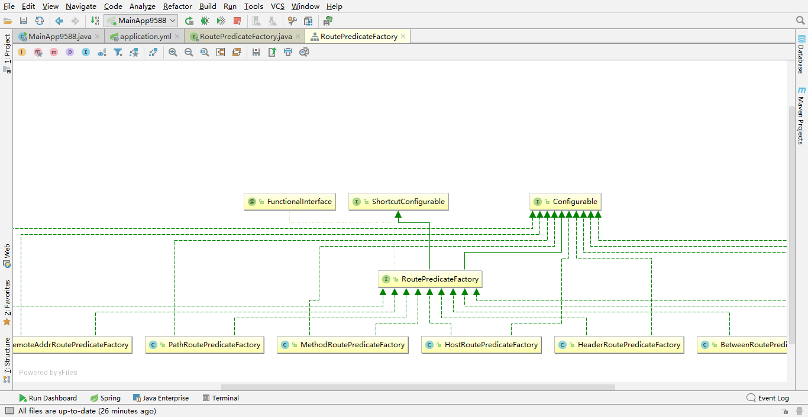


##### 6.2.1 *After Route Predicate*


我们的问题是：上述这个After好懂，这个时间串串？

```java
public class Test {
    public static void main(String[] args) {
        // 默认时区
        ZonedDateTime zbj = ZonedDateTime.now();
        System.out.println(zbj);//2022-12-25T18:06:54.928+08:00[Asia/Shanghai]

        // 用指定时区获取当前时间
        ZonedDateTime zny = ZonedDateTime.now(ZoneId.of("America/New_York"));
        System.out.println(zny);//2022-12-25T05:06:54.932-05:00[America/New_York]
    }
}
```

练习：

```yaml
spring:
  cloud:
    gateway:
      discovery:
        locator:
          enabled: true #开启从注册中心动态创建路由的功能，利用微服务名进行路由
      routes:
        - id: payment_routh2 #payment_route    #路由的ID，没有固定规则但要求唯一，建议配合服务名
          #uri: http://localhost:8001          #匹配后提供服务的路由地址
          uri: lb://cloud-payment-service      #匹配后提供服务的路由地址
          predicates:
            - Path=/payment/lb/**         # 断言，路径相匹配的进行路由
            - After=2022-12-25T18:06:54.928+08:00[Asia/Shanghai]   # 断言，路径相匹配的进行路由
```

`- After=时间[时区]`表示在所标志的时间开始之后才能被路由，否则不能路由


##### 6.2.2 *Before Route Predicate*


练习：

```yaml
spring:
  cloud:
    gateway:
      discovery:
        locator:
          enabled: true #开启从注册中心动态创建路由的功能，利用微服务名进行路由
      routes:
        - id: payment_routh2 #payment_route    #路由的ID，没有固定规则但要求唯一，建议配合服务名
          #uri: http://localhost:8001          #匹配后提供服务的路由地址
          uri: lb://cloud-payment-service      #匹配后提供服务的路由地址
          predicates:
            - Path=/payment/lb/**         # 断言，路径相匹配的进行路由
            - After=2022-12-25T18:06:54.928+08:00[Asia/Shanghai]   # 断言，路径相匹配的进行路由
            - Before=2022-12-25T19:06:54.928+08:00[Asia/Shanghai]  # 断言，路径相匹配的进行路由
```

`- After=时间[时区]`表示在所标志的时间开始之前才能被路由，否则不能路由


##### 6.2.3 *Between Route Predicate*


练习：

```yaml
spring:
  cloud:
    gateway:
      discovery:
        locator:
          enabled: true #开启从注册中心动态创建路由的功能，利用微服务名进行路由
      routes:
        - id: payment_routh2              #路由的ID，没有固定规则但要求唯一，建议配合服务名
          uri: lb://cloud-payment-service      #匹配后提供服务的路由地址
          predicates:
            - Path=/payment/lb/**         # 断言，路径相匹配的进行路由
            # - After=2022-12-25T18:06:54.928+08:00[Asia/Shanghai] # 断言，路径相匹配的进行路由
            # - Before=2022-12-25T19:06:54.928+08:00[Asia/Shanghai]# 断言，路径相匹配的进行路由
            - Between=2022-12-25T18:06:54.928+08:00[Asia/Shanghai],2022-12-25T19:06:54.928+08:00[Asia/Shanghai]
```

`- After=时间[时区]`表示在所标志的两个时间之间才能被路由，否则不能路由


##### 6.2.4 *Cookie Route Predicate*


Cookie Route Predicate需要两个参数，一个是Cookie name，一个是正则表达式。

路由规则会通过获取对应的 Cookie name 值和正则表达式去匹配，如果匹配上就会执行路由，如果没有匹配上则不执行

练习：

```yaml
spring:
  application:
    name: cloud-gateway-service
  cloud:
    gateway:
      discovery:
        locator:
          enabled: true #开启从注册中心动态创建路由的功能，利用微服务名进行路由
      routes:
        - id: payment_routh2 #payment_route    #路由的ID，没有固定规则但要求唯一，建议配合服务名
          #uri: http://localhost:8001          #匹配后提供服务的路由地址
          uri: lb://cloud-payment-service      #匹配后提供服务的路由地址
          predicates:
            - Path=/payment/lb/**         # 断言，路径相匹配的进行路由
            - Cookie=username,shan-hai    # 断言，路径相匹配的进行路由
```

不带cookies访问：`curl http://localhost:9527/payment/lb`


带cookies访问：`curl http://localhost:9527/payment/lb --cookie "username=shan-hai"`

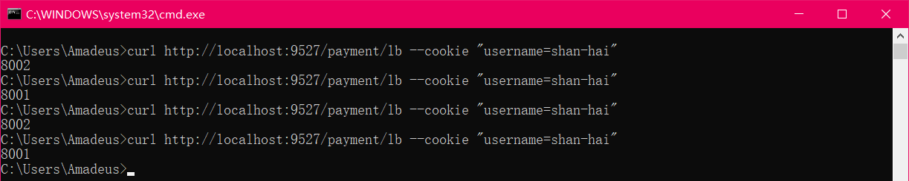

[加入curl返回中文乱码解决问题链接](https://blog.csdn.net/leedee/article/details/82685636)


##### 6.2.5 *Header Route Predicate*

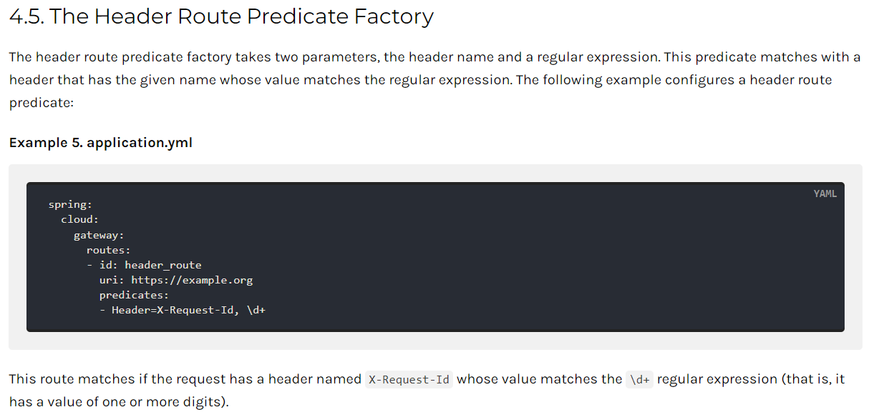

两个参数：一个是属性名称和一个正则表达式，这个属性值和正则表达式匹配则执行。

练习：

```yaml
spring:
  cloud:
    gateway:
      discovery:
        locator:
          enabled: true #开启从注册中心动态创建路由的功能，利用微服务名进行路由
      routes:
        - id: payment_routh2 #payment_route    #路由的ID，没有固定规则但要求唯一，建议配合服务名
          #uri: http://localhost:8001          #匹配后提供服务的路由地址
          uri: lb://cloud-payment-service      #匹配后提供服务的路由地址
          predicates:
            - Path=/payment/lb/**         # 断言，路径相匹配的进行路由
            - Header=X-Request-Id,\d+     #请求头要有X-Request-Id属性并且值为正整数的正则表达式
```

`curl http://localhost:9527/payment/lb -H "X-Request-Id:123"`

`curl http://localhost:9527/payment/lb -H "X-Request-Id:123.0"`


##### 6.2.6 *Host Route Predicate*


Host Route Predicate接收一组参数，一组匹配的域名列表，这个模板是一个`ant`分隔的模板，用`.`号作为分隔符。

它通过参数中的主机地址作为匹配规则。

练习：

```yaml
spring:
  cloud:
    gateway:
      discovery:
        locator:
          enabled: true #开启从注册中心动态创建路由的功能，利用微服务名进行路由
      routes:
        - id: payment_routh2 #payment_route    #路由的ID，没有固定规则但要求唯一，建议配合服务名
          #uri: http://localhost:8001          #匹配后提供服务的路由地址
          uri: lb://cloud-payment-service      #匹配后提供服务的路由地址
          predicates:
            - Path=/payment/lb/**         # 断言，路径相匹配的进行路由
            - Host=**.shanHai.com
```

正确：`curl http://localhost:9527/payment/lb -H "Host: www.shanHai.com"`

正确：`curl http://localhost:9527/payment/lb -H "Host: news.shanHai.com"`

错误：`curl http://localhost:9527/payment/lb -H "Host: www.shanHai.net"`


##### 6.2.7 *Method Route Predicate*


练习：

```yaml
spring:
  application:
    name: cloud-gateway-service
  cloud:
    gateway:
      discovery:
        locator:
          enabled: true #开启从注册中心动态创建路由的功能，利用微服务名进行路由
      routes:
        - id: payment_routh #payment_route    #路由的ID，没有固定规则但要求唯一，建议配合服务名
          #uri: http://localhost:8001          #匹配后提供服务的路由地址
          uri: lb://cloud-payment-service      #匹配后提供服务的路由地址
          predicates:
            - Path=/payment/get/**         # 断言，路径相匹配的进行路由

        - id: payment_routh2 #payment_route    #路由的ID，没有固定规则但要求唯一，建议配合服务名
          #uri: http://localhost:8001          #匹配后提供服务的路由地址
          uri: lb://cloud-payment-service      #匹配后提供服务的路由地址
          predicates:
            - Path=/payment/lb/**         # 断言，路径相匹配的进行路由
            - Method=GET                  # 只路由Get请求
```

正确：`curl http://localhost:9527/payment/lb`

错误：`curl -X -POST http://localhost:9527/payment/lb`


##### 6.2.8 Path Route Predicate


练习：略，`- Path=/payment/get/**`


##### 2.6.9 Query Route Predicate


支持传入两个参数，一个是属性名，一个为属性值，属性值可以是正则表达式。

练习：

```yaml
spring:
  application:
    name: cloud-gateway-service
  cloud:
    gateway:
      discovery:
        locator:
          enabled: true #开启从注册中心动态创建路由的功能，利用微服务名进行路由
      routes:
        - id: payment_routh2 #payment_route    #路由的ID，没有固定规则但要求唯一，建议配合服务名
          #uri: http://localhost:8001          #匹配后提供服务的路由地址
          uri: lb://cloud-payment-service      #匹配后提供服务的路由地址
          predicates:
            - Path=/payment/lb/**         # 断言，路径相匹配的进行路由
            - Query=username,\d+          # 要有参数名username并且值还要是正整数才能路由
```

正确：`curl http://localhost:9527/payment/lb?username=31`

错误：`curl http://localhost:9527/payment/lb?username=-31`


> 说白了，Predicate就是为了实现一组匹配规则，让请求过来找到对应的Route进行处理。


### 7 Filter的使用

#### 7.1 简介

> Filter是什么？


路由过滤器可用于修改进入的HTTP请求和返回的HTTP响应，路由过滤器只能指定路由进行使用。

Spring Cloud Gateway内置了多种路由过滤器，他们都由GatewayFilter的工厂类来产生。


> Spring Cloud Gateway的Filter

生命周期：Only Two

1. pre
2. post


种类：Only Two

1. GatewayFilter

   [官网显示GatewayFilter有31种类型](https://cloud.spring.io/spring-cloud-static/spring-cloud-gateway/2.2.1.RELEASE/reference/html/#gatewayfilter-factories)

2. GlobalFilter

   [官网显示有10种类型](https://cloud.spring.io/spring-cloud-static/spring-cloud-gateway/2.2.1.RELEASE/reference/html/#global-filters)


> 常用的GatewayFilter：

`AddRequestParameter`：

```yaml
spring:
  cloud:
    gateway:
      discovery:
        locator:
          enabled: true #开启从注册中心动态创建路由的功能，利用微服务名进行路由
      routes:
        - id: payment_routh2 #payment_route    #路由的ID，没有固定规则但要求唯一，建议配合服务名
          #uri: http://localhost:8001          #匹配后提供服务的路由地址
          uri: lb://cloud-payment-service      #匹配后提供服务的路由地址
          filters:
            # 过滤器工厂会在匹配的请求头加上一对请求头，名称为X-Request-Id值为1024
            - AddRequestParameter=X-Request-Id,1024
          predicates:
            - Path=/payment/lb/**         # 断言，路径相匹配的进行路由
            - Method=GET,POST
```


#### 7.2 自定义过滤器

自定义全局`GlobalFilter`

1. 主要实现两个主要接口：`implements GlobalFilter,Ordered`

2. 能干嘛？

   - 全局日志记录
   - 统一网关鉴权
   - ......

3. 案例代码

   ```java
   package com.shanhai.springcloud.filter;
   
   import lombok.extern.slf4j.Slf4j;
   import org.springframework.cloud.gateway.filter.GatewayFilterChain;
   import org.springframework.cloud.gateway.filter.GlobalFilter;
   import org.springframework.core.Ordered;
   import org.springframework.http.HttpStatus;
   import org.springframework.stereotype.Component;
   import org.springframework.web.server.ServerWebExchange;
   import reactor.core.publisher.Mono;
   
   import java.util.Date;
   
   /**
    * @description:
    * @author: xu
    * @date: 2022/12/25 19:30
    */
   @Component // 必须加
   @Slf4j
   public class MyLogGateWayFilter implements GlobalFilter, Ordered {
   
       @Override
       public Mono<Void> filter(ServerWebExchange exchange, GatewayFilterChain chain) {
           log.info("time：" + new Date() + "\t 执行了自定义的全局过滤器：MyLogGateWayFilter Hello");
           String uname = exchange.getRequest().getQueryParams().getFirst("uname");
           if (uname == null) {
               log.error("用户名为null，无法登陆");
               exchange.getResponse().setStatusCode(HttpStatus.NOT_ACCEPTABLE);
               return exchange.getResponse().setComplete();
           }
           log.info("以获取用户名uname：" + uname);
           return chain.filter(exchange);
       }
   
       @Override
       public int getOrder() {
           return 0;
       }
   }
   ```

4. 测试

   启动：7001、8001、8002、9527

   正确：`http://localhost:9527/payment/lb?uname=z3`

   错误(没有参数uname)：`http://localhost:9527/payment/lb`(无法正常使用转发)

   

+++

## 十一、SpringCloud Config分布式配置中心

### 1 概述

> 分布式系统面临的 --- 配置问题

微服务意味着要将单体应用中的业务拆分成一个个子服务，每个服务的粒度相对较小，因此系统中会出现大量的服务。由于每个服务都需要必要的配置信息才能运行，所以一套*集中式的*、*动态的*配置管理设施是必不可少的。

SpringCloud提供了ConfigServer来解决这个问题，我们每一个微服务自己带着一个application.yml，上百个配置文件的管理......o(╥﹏╥)o


#### 1.1 SpringCloud Config是什么？

官网：[SpringCloud Config官网](https://cloud.spring.io/spring-cloud-static/spring-cloud-config/2.2.1.RELEASE/reference/html/)


- *是什么*？

  SpringCloud Config为微服务架构中的微服务提供集中化的外部配置支持，配置服务器为**各个不同微服务应用**的所有环境提供了一个**中心化的外部配置**。

- *怎么玩*？

  SpringCloud Config分为**服务端和客户端两部分**。

  服务端也称为**分布式配置中心，它是一个独立的微服务应用**，用来连接配置服务器并为客户端提供获取配置信息，加密/解密信息等访问接口。

  客户端则是通过指定的配置中心来管理应用资源，以及与业务相关的配置内容，并在启动的时候从配置中心获取和加载配置信息配置服务器默认采用git来存储配置信息，这样就有助于对环境配置进行版本管理，并且可以通过git客户端工具来方便的管理和访问配置内容。


#### 1.2 SpringCloud Config能干嘛？

1. 集中管理配置文件
2. 不同环境不同配置，动态化的配置更新，分环境部署比如dev/test/prod/beta/release
3. 运行期间动态调整配置，不再需要在每个服务部署的机器上编写配置文件，服务会向配置中心统一拉取配置自己的信息
4. 当配置发生变动时，服务不需要重启即可感知到配置的变化并应用新的配置
5. 将配置信息以REST接口的形式暴露----post、curl访问刷新均可......

与GitHub整合配置：

由于SpringCloud Config默认使用Git来存储配置文件(也有其它方式，比如支持SVN和本地文件)，但最推荐的还是Git，而且使用的是http/https访问的形式。


### 2 Config服务端配置与测试

#### 2.1 配置与测试

1. 用你自己的账号在GitHub上新建一个名为springcloud-config的新Repository

2. 由上一步获得刚新建的git地址：`git@github.com:xukang0509/springcloud-config.git`

3. 本地硬盘目录上新建git仓库并clone：本地地址：X:\NewCode\05cloud\cloud-config

   git命令：`git clone url`

   

4. 此时在本地X盘符下X:\NewCode\05cloud\cloud-config\springcloud-config

   表示多个环境的配置文件、保存格式必须为UTF-8

   如果需要修改，此处模拟运维人员操作git和github

   `git add <fileName>...`

   `git commit -m "init yml"`

   `git push origin main`

   

   ```yml
   # config-dev:
   config:
     info: springcloud-config Dev Hello
     
   # config-prod:
   config:
     info: springcloud-config Prod Hello
     
   # config-test:
   config:
     info: springcloud-config Test Hello
   ```

5. 新建Maven子模块：cloud-config-center-3344

   它即为Cloud的配置中心模块CloudConfig Center

6. POM

   ```xml
   <dependencies>
       <dependency>
           <groupId>org.springframework.cloud</groupId>
           <artifactId>spring-cloud-config-server</artifactId>
       </dependency>
       <dependency>
           <groupId>org.springframework.cloud</groupId>
           <artifactId>spring-cloud-starter-netflix-eureka-client</artifactId>
       </dependency>
       <dependency>
           <groupId>org.springframework.boot</groupId>
           <artifactId>spring-boot-starter-web</artifactId>
       </dependency>
   
       <dependency>
           <groupId>org.springframework.boot</groupId>
           <artifactId>spring-boot-starter-actuator</artifactId>
       </dependency>
       <dependency>
           <groupId>org.springframework.boot</groupId>
           <artifactId>spring-boot-devtools</artifactId>
           <scope>runtime</scope>
           <optional>true</optional>
       </dependency>
       <dependency>
           <groupId>org.projectlombok</groupId>
           <artifactId>lombok</artifactId>
           <optional>true</optional>
       </dependency>
       <dependency>
           <groupId>org.springframework.boot</groupId>
           <artifactId>spring-boot-starter-test</artifactId>
           <scope>test</scope>
       </dependency>
   </dependencies>
   ```

7. YML

   ```yaml
   server:
     port: 3344
   
   spring:
     application:
       name: cloud-config-center #注册进Eureka服务器的微服务名
     cloud:
       config:
         server:
           git:
             #GitHub上面的git仓库名字
             uri: https://github.com/xukang0509/springcloud-config.git
             ####搜索目录
             search-paths:
               - springcloud-config
             username: ******
             password: ******
             skip-ssl-validation: true
         ####读取分支
         label: main
   
   #服务注册到eureka地址
   eureka:
     client:
       service-url:
         defaultZone: http://localhost:7001/eureka
   ```

8. 主启动类：加`@EnableConfigServer`注解

   ```java
   @SpringBootApplication
   @EnableConfigServer
   public class ConfigCenterMain3344 {
       public static void main(String[] args) {
           SpringApplication.run(ConfigCenterMain3344.class, args);
       }
   }
   ```

9. windows下修改hosts文件，增加映射：`127.0.0.1  config-3344.com`

10. 测试通过Config微服务是否可以从GitHub上获取配置内容

    启动微服务3344

    访问：

    `http://config-3344.com:3344/main/config-dev.yml`

    `http://config-3344.com:3344/main/config-prod.yml`

    `http://config-3344.com:3344/main/config-test.yml`

    

    

11. 成功实现了用SpringCloud Config通过GitHub获取配置信息


#### 2.2 配置读取规则

官网：


1. `/{label}/{application}-{profile}.yml`

   main分支

   - http://config-3344.com:3344/main/config-dev.yml
   - http://config-3344.com:3344/main/config-test.yml
   - http://config-3344.com:3344/main/config-prod.yml

   dev分支

   - http://config-3344.com:3344/dev/config-dev.yml
   - http://config-3344.com:3344/dev/config-test.yml
   - http://config-3344.com:3344/dev/config-prod.yml

2. `/{application}-{profile}.yml`

   - http://config-3344.com:3344/config-dev.yml
   - http://config-3344.com:3344/config-test.yml
   - http://config-3344.com:3344/config-prod.yml
   - http://config-3344.com:3344/config-xxxx.yml(不存在的配置)

3. `/{application}/{profile}[/{label}]`

   - http://config-3344.com:3344/config/dev/master
   - http://config-3344.com:3344/config/test/master
   - http://config-3344.com:3344/config/test/dev

4. 重要配置细节总结：

   `/{name}-{profiles}.yml`

   `/{label}-{name}-{profiles}.yml`

   - label：分支(branch)
   - name：服务名
   - profiles：环境(dev/test/prod)


### 3 Config客户端配置与测试

#### 3.1 配置与测试

1. 新建Maven子模块：cloud-config-client-3355

2. POM

   ```xml
   <dependencies>
       <dependency>
           <groupId>org.springframework.cloud</groupId>
           <artifactId>spring-cloud-starter-config</artifactId>
       </dependency>
       <dependency>
           <groupId>org.springframework.cloud</groupId>
           <artifactId>spring-cloud-starter-netflix-eureka-client</artifactId>
       </dependency>
       <dependency>
           <groupId>org.springframework.boot</groupId>
           <artifactId>spring-boot-starter-web</artifactId>
       </dependency>
       <dependency>
           <groupId>org.springframework.boot</groupId>
           <artifactId>spring-boot-starter-actuator</artifactId>
       </dependency>
   
       <dependency>
           <groupId>org.springframework.boot</groupId>
           <artifactId>spring-boot-devtools</artifactId>
           <scope>runtime</scope>
           <optional>true</optional>
       </dependency>
       <dependency>
           <groupId>org.projectlombok</groupId>
           <artifactId>lombok</artifactId>
           <optional>true</optional>
       </dependency>
       <dependency>
           <groupId>org.springframework.boot</groupId>
           <artifactId>spring-boot-starter-test</artifactId>
           <scope>test</scope>
       </dependency>
   </dependencies>
   ```

3. YML：`bootstrap.yml`

   是什么：

   - applicaiton.yml是用户级的资源配置项
   - bootstrap.yml是系统级的，优先级更加高

   Spring Cloud会创建一个“Bootstrap Context”，作为Spring应用的`Application Context`的父上下文。初始化的时候，`Bootstrap Context`负责从外部源加载配置属性并解析配置。这两个上下文共享一个从外部获取的`Environment`。

   `Bootstrap`属性有高优先级，默认情况下，它们不会被本地配置覆盖。`Bootstrap context`和`Application Context`有着不同的约定，所以新增了一个`bootstrap.yml`文件，保证`Bootstrap Context`和`Application Context`配置的分离。

   **要将Client模块下的`application.yml`文件改为`bootstrap.yml`，这是很关键的**，因为`bootstrap.yml`是比`application.yml`先加载的。`bootstrap.yml`优先级高于`application.yml`。

   ```yaml
   server:
     port: 3355
   
   spring:
     application:
       name: cloud-config-client
     cloud:
       #Config客户端配置
       config:
         label: main #分支名称
         name: config #配置文件名称
         profile: dev #读取后缀名称
         # 上述3个综合：main分支上config-dev.yml的配置文件被读取http://config-3344.com:3344/master/config-dev.yml
         uri: http://localhost:3344 #配置中心地址k
   
   #服务注册到eureka地址
   eureka:
     client:
       service-url:
         defaultZone: http://localhost:7001/eureka
   ```

   

4. 修改config-dev.yml配置并提交到GitHub中，比如加个变量age或者版本号version

   ```yaml
   # config-dev:
   config:
     info: springcloud-config Dev Hello Client3355
   ```

5. 主启动类

   ```java
   @SpringBootApplication
   @EnableEurekaClient
   public class ConfigClientMain3355 {
       public static void main(String[] args) {
           SpringApplication.run(ConfigClientMain3355.class, args);
       }
   }
   ```

6. 业务类

   ```java
   @RestController
   public class ConfigClientController {
       @Value("${config.info}")
       private String configInfo;
   
       @GetMapping("/configInfo")
       public String getConfigInfo() {
           return configInfo;
       }
   }
   ```

7. 测试：

   启动Config配置中心3344微服务并自测：

   `http://config-3344.com:3344/main/config-dev.yml`

   

   启动3355作为Client准备访问：

   `http://localhost:3355/configInfo`

   

8. 成功实现了客户端3355访问SpringCloud Config3344通过GitHub获取配置信息


#### 3.2 动态刷新问题

- Linux运维修改GitHub上的配置文件内容做调整

  ```yaml
  # config-dev.yml
  config:
    info: springcloud-config Dev Hello Client3355 Update Files
  ```

- 刷新3344，发现ConfigServer配置中心立刻响应

  

- 刷新3355，发现ConfigClient客户端没有任何响应

  

- 3355没有变化除非自己重启或者重新加载

- 难到每次运维修改配置文件，客户端都需要重启？？噩梦


### 4 Config客户端之动态刷新

目的：避免每次更新配置都要重启客户端微服务3355

修改3355模块

1. POM引入actuator监控

   ```xml
   <dependency>
       <groupId>org.springframework.boot</groupId>
       <artifactId>spring-boot-starter-actuator</artifactId>
   </dependency>
   ```

2. 修改YML，暴露监控端口

   ```yaml
   # 暴露监控端点
   management:
     endpoints:
       web:
         exposure:
           include: "*"
   ```

3. `@RefreshScope`业务类Controller修改

   ```java
   @RestController
   @RefreshScope
   public class ConfigClientController {
       @Value("${config.info}")
       private String configInfo;
   
       @GetMapping("/configInfo")
       public String getConfigInfo() {
           return configInfo;
       }
   }
   ```

4. 此时修改github ---> 3344 ----> 3355

   `http://localhost:3355/configInfo`

   此时3355改变没有？*没有*

5. 如何做？

   需要**运维人员**发送Post请求刷新3355：必须是POST请求

   `curl -X POST "http://localhost:3355/actuator/refresh"`

   

6. 再次测试3355：`http://localhost:3355/configInfo`

   成功实现了客户端3355刷新到最新配置内容，避免了服务重启


还有什么问题：

- 假如有多个微服务客户端3355/3366/3377......
- 每个微服务都要执行一次post请求，手动刷新？
- **可否广播，一次通知，处处生效**？
- 我们想大范围的自动刷新，求方法

+++

## 十二、SpringCloud Bus消息总线

### 1 概述

上一讲解的加深和扩充，一言以蔽之：

- 分布式自动刷新配置功能
- Spring Cloud Bus配合Spring Cloud Config使用可以实现配置的动态刷新。

> SpringCloud Bus是什么？

Bus支持两种消息代理：**RabbitMQ**和**Kafka**。

Spring Cloud Bus配合Spring Cloud Config使用可以实现配置的动态刷新。


Spring Cloud Bus是用来将分布式系统的节点与轻量级消息系统链接起来的框架，它整合了Java的事件处理机制和消息中间件的功能。Spring Clud Bus目前支持RabbitMQ和Kafka。


> SpringCloud Bus能干嘛？

Spring Cloud Bus能管理和传播分布式系统间的消息，就像一个分布式执行器，可用于广播状态更改、事件推送等，也可以当作微服务间的通信通道。


> 为何被称为总线？

- 什么是总线？

  在微服务架构的系统中，通常会使用**轻量级的消息代理**来构建一个**共用的消息主题**，并让系统中所有微服务实例都连接上来。**由于该主题中产生的消息会被所有实例监听和消费，所以称它为消息总线**。在总线上的各个实例，都可以方便地广播一些需要让其他连接在该主题上的实例都知道的消息。

- 基本原理

  ConfigClient实例都监听MQ中同一个topic(默认是springCloudBus)。当一个服务刷新数据的时候，它会把这个信息放入到Topic中，这样其它监听同一Topic的服务就能得到通知，然后去更新自身的配置。


### 2 RabbitMQ环境配置

用之前学过的Docker容器自动化部署RabbitMQ：

命令：

```bash
# 安装启动rabbitmq容器
docker run -d --name myRabbitMQ -e RABBITMQ_DEFAULT_USER=admin -e RABBITMQ_DEFAULT_PASS=admin -p 15672:15672 -p 5672:5672 rabbitmq:3.8.14-management
```

访问地址查看是否安装成功：`http://192.168.88.110:15672/`

输入账号密码并登录：admin admin


### 3 SpringCloud Bus动态刷新全局广播

必须先具备良好的RabbitMQ环境先


#### 3.1 新建一个客户端模块3366

> 演示广播效果，增加复杂度，再以3355为模板再制作一个3366

1. 新建模块：cloud-config-client-3366

2. POM

   ```xml
   <dependencies>
       <dependency>
           <groupId>org.springframework.cloud</groupId>
           <artifactId>spring-cloud-starter-config</artifactId>
       </dependency>
       <dependency>
           <groupId>org.springframework.cloud</groupId>
           <artifactId>spring-cloud-starter-netflix-eureka-client</artifactId>
       </dependency>
       <dependency>
           <groupId>org.springframework.boot</groupId>
           <artifactId>spring-boot-starter-web</artifactId>
       </dependency>
       <dependency>
           <groupId>org.springframework.boot</groupId>
           <artifactId>spring-boot-starter-actuator</artifactId>
       </dependency>
   
       <dependency>
           <groupId>org.springframework.boot</groupId>
           <artifactId>spring-boot-devtools</artifactId>
           <scope>runtime</scope>
           <optional>true</optional>
       </dependency>
       <dependency>
           <groupId>org.projectlombok</groupId>
           <artifactId>lombok</artifactId>
           <optional>true</optional>
       </dependency>
       <dependency>
           <groupId>org.springframework.boot</groupId>
           <artifactId>spring-boot-starter-test</artifactId>
           <scope>test</scope>
       </dependency>
   </dependencies>
   ```

3. YML：`bootstrap.yml`

   ```yml
   server:
     port: 3366
   
   spring:
     application:
       name: cloud-config-client
     cloud:
       #Config客户端配置
       config:
         label: main #分支名称
         name: config #配置文件名称
         profile: dev #读取后缀名称
         # 上述3个综合：master分支上config-dev.yml的配置文件被读取http://config-3344.com:3344/master/config-dev.yml
         uri: http://localhost:3344 #配置中心地址
   
   #服务注册到eureka地址
   eureka:
     client:
       service-url:
         defaultZone: http://localhost:7001/eureka
   
   # 暴露监控端点
   management:
     endpoints:
       web:
         exposure:
           include: "*"
   ```

4. 主启动类

   ```java
   @SpringBootApplication
   @EnableEurekaClient
   public class ConfigClientMain3366 {
       public static void main(String[] args) {
           SpringApplication.run(ConfigClientMain3366.class,args);
       }
   }
   ```

5. controller

   ```java
   @RestController
   @RefreshScope
   public class ConfigClientController {
       @Value("${server.port}")
       private String serverPort;
   
       @Value("${config.info}")
       private String configInfo;
   
       @GetMapping("/configInfo")
       public String configInfo() {
           return "serverPort: "+serverPort+"\t\n\n configInfo: "+configInfo;
       }
   }
   ```


#### 3.2 总线设计思想

1. 利用消息总线触发一个客户端/bus/refresh，而刷新所有客户端的配置

   

2. 利用消息总线触发一个服务端ConfigServer的/bus/refresh端点，而刷新所有客户端的配置

   

3. 图二的架构显然更加适合，图一不适合的原因如下：

   - 打破了微服务的职责单一性，因为微服务本身是业务模块，它本不应该承担配置刷新的职责。
   - 破坏了微服务各节点的对等性。
   - 有一定的局限性。例如，微服务在迁移时，它的网络地址常常会发生变化，此时如果想要做到自动刷新，那就会增加更多的修改。


#### 3.3 给各模块添加总线支持

1. 给cloud-config-center-3344配置中心**服务端**添加消息总线支持

   - POM

     ```xml
     <!--添加消息总线RabbitMQ支持-->
     <dependency>
         <groupId>org.springframework.cloud</groupId>
         <artifactId>spring-cloud-starter-bus-amqp</artifactId>
     </dependency>
     <dependency>
         <groupId>org.springframework.boot</groupId>
         <artifactId>spring-boot-starter-actuator</artifactId>
     </dependency>
     ```

   - YML：application.yml

     ```yml
     server:
       port: 3344
     
     spring:
       application:
         name: cloud-config-center #注册进Eureka服务器的微服务名
       cloud:
         config:
           server:
             git:
               #GitHub上面的git仓库名字
               uri: https://github.com/xukang0509/springcloud-config.git
               ####搜索目录
               search-paths:
                 - springcloud-config
               username: ******
               password: ******
               skip-ssl-validation: true
           ####读取分支
           label: main
       #rabbitmq相关配置 15672是Web管理界面的端口；5672是MQ访问的端口
       rabbitmq:
         host: 192.168.88.110
         port: 5672
         username: admin
         password: admin
     
     #服务注册到eureka地址
     eureka:
       client:
         service-url:
           defaultZone: http://localhost:7001/eureka
     
     ##rabbitmq相关配置,暴露bus刷新配置的端点
     management:
       endpoints: #暴露bus刷新配置的端点
         web:
           exposure:
             include: 'bus-refresh'
     ```

2. 给cloud-config-client-3355**客户端**添加消息总线支持

   - POM

     ```xml
     <!--添加消息总线RabbitMQ支持-->
     <dependency>
         <groupId>org.springframework.cloud</groupId>
         <artifactId>spring-cloud-starter-bus-amqp</artifactId>
     </dependency>
     <dependency>
         <groupId>org.springframework.boot</groupId>
         <artifactId>spring-boot-starter-actuator</artifactId>
     </dependency>
     ```

   - YML：bootstrap.yml

     ```yml
     server:
       port: 3355
     
     spring:
       application:
         name: cloud-config-client
       cloud:
         #Config客户端配置
         config:
           label: main #分支名称
           name: config #配置文件名称
           profile: dev #读取后缀名称
           # 上述3个综合：main分支上config-dev.yml的配置文件被读取http://config-3344.com:3344/master/config-dev.yml
           uri: http://localhost:3344 #配置中心地址k
       rabbitmq:
         host: 192.168.88.110
         port: 5672
         username: admin
         password: admin
     
     #服务注册到eureka地址
     eureka:
       client:
         service-url:
           defaultZone: http://localhost:7001/eureka
     
     # 暴露监控端点
     management:
       endpoints:
         web:
           exposure:
             include: "*"
     ```

3. 给cloud-config-client-3366**客户端**添加消息总线支持

   - POM

     ```xml
     <!--添加消息总线RabbitMQ支持-->
     <dependency>
         <groupId>org.springframework.cloud</groupId>
         <artifactId>spring-cloud-starter-bus-amqp</artifactId>
     </dependency>
     <dependency>
         <groupId>org.springframework.boot</groupId>
         <artifactId>spring-boot-starter-actuator</artifactId>
     </dependency>
     ```

   - YML：bootstrap.yml

     ```yml
     server:
       port: 3366
     
     spring:
       application:
         name: cloud-config-client
       cloud:
         #Config客户端配置
         config:
           label: main #分支名称
           name: config #配置文件名称
           profile: dev #读取后缀名称
           # 上述3个综合：master分支上config-dev.yml的配置文件被读取http://config-3344.com:3344/master/config-dev.yml
           uri: http://localhost:3344 #配置中心地址
       #rabbitmq相关配置 15672是Web管理界面的端口；5672是MQ访问的端口
       rabbitmq:
         host: 192.168.88.110
         port: 5672
         username: admin
         password: admin
     
     #服务注册到eureka地址
     eureka:
       client:
         service-url:
           defaultZone: http://localhost:7001/eureka
     
     # 暴露监控端点
     management:
       endpoints:
         web:
           exposure:
             include: "*"
     ```

4. 测试：

   - 运维工程师

     修改GitHub上配置文件

     ```yml
     # config-dev.yml
     config:
       info: springcloud-config Dev Hello Client3355 Update Files SpringCloud Bus
     ```

     发送POST请求：`curl -X POST "http://localhost:3344/actuator/bus-refresh"`

     一次发送，处处生效

     

   - 配置中心：`http://config-3344.com:3344/config-dev.yml`

   - 客户端：

     `http://localhost:3355/configInfo`

     `http://localhost:3366/configInfo`

     获取配置信息，发现都已经刷新了

5. 一次修改，广播通知，处处生效


### 4 SpringCloud Bus动态刷新定点通知

- 不想全部通知，只想定点通知：只通知3355、不通知3366

- 指定具体某一个实例生效而不是全部

- 公式：`http://localhost:配置中心的端口号/actuator/bus-refresh/{destination}`

- /bus/refresh请求不再发送到具体的服务实例上，而是发给config server并通过*destination*参数类指定需要更新配置的服务或实例

- 案例：我们这里以刷新运行在3355端口上的`cloud-config-client`为例

  `curl -X POST "http://localhost:3344/actuator/bus-refresh/cloud-config-client:3355"`

- 测试结果：3355变化，3366没变化

- 通知总结All

  

+++

## 十三、SpringCloud Stream消息驱动

### 1 消息驱动概述

#### 1.1 消息驱动是什么？

什么是SpringCloudStream？

官方定义Spring Cloud Stream是一个**构建消息驱动微服务的框架**。

应用程序通过 inputs 或者 outputs 来与 Spring Cloud Stream中 binder 对象交互。通过我们配置来binding(绑定)，而Spring Cloud Stream的binder对象负责与消息中间件交互。所以，我们只需要搞清楚如何与Spring Cloud Stream交互就可以方便使用消息驱动的方式。

通过使用Spring Integration来连接消息代理中间件以实现消息事件驱动。

Spring Cloud Stream为一些供应商的消息中间件产品提供了个性化的自动化配置实现，引用了*发布-订阅*、*消费组*、*分区*的三个核心概念。

**目前仅支持RabbitMQ、Kafka**。

总之一句话：*屏蔽底层消息中间件的差异，降低切换成本，统一消息的编程模型*。


官网：

- https://spring.io/projects/spring-cloud-stream#overview

  Spring Cloud Stream是用于构建与共享消息传递系统连接的高度可伸缩的事件驱动微服务框架，该框架提供了一个灵活的编程模型，它建立在已经建立和熟悉的Spring熟语和最佳实践上，包括支持持久化的发布/订阅、消费组以及消息分区这三个核心概念。

  

- https://docs.spring.io/spring-cloud-stream/docs/current/reference/html/

- [Spring Cloud Stream中文指导手册](https://m.wang1314.com/doc/webapp/topic/20971999.html)


#### 1.2 设计思想

1. *标准MQ*

   

   - 生产者/消费者之间靠**消息**媒介传递信息内容 --- Message
   - 消息必须走特定的**通道** --- 消息通道MessageChannel
   - 消息通道里的消息如何被消费呢，谁负责收发**处理** --- 消息通道MessageChannel的子接口SubscribableChannel，由MessageHandler消息处理器所订阅

2. *为什么用Cloud Stream*

   比方说我们用到了RabbitMQ和Kafka，由于这两个消息中间件的架构上的不同，像RabbitMQ有exchange，kafka有Topic和Partitions分区

   

   stream凭什么可以统一底层差异？

   在没有绑定器这个概念的情况下，我们的SpringBoot应用要直接与消息中间件进行信息交互的时候，由于各消息中间件构建的初衷不同，它们的实现细节上会有较大的差异性。

   通过定义绑定器作为中间层，**完美地实现了应用程序与消息中间件细节之间的隔离**。通过向应用程序暴露统一的Channel通道，使得应用程序不需要再考虑各种不同的消息中间件实现。

   **通过定义绑定器Binder作为中间层，实现了应用程序与消息中间件细节之间的隔离**。

   *Binder*：

   - INPUT对应于消费者
   - OUTPUT对应于生产者

3. Stream中的消息通信方式遵循了发布-订阅模式

   Topic主题进行广播

   - 在RabbitMQ就是Exchange
   - 在Kakfa中就是Topic


#### 1.3 SpringCloud Stream标准流程套路


1. *Binder*：很方便的连接中间件，屏蔽差异

2. *Channel*：

   通道，是队列Queue的一种抽象，在消息通讯系统中就是实现存储和转发的媒介，通过Channel对队列进行配置。

3. *Source*和*Sink*：

   简单的可理解为参照对象是Spring Cloud Stream自身，从Stream发布消息就是输出，接受消息就是输入

4. 编码API和常用注解

   

   | **组成**        | **说明**                                                     |
   | --------------- | ------------------------------------------------------------ |
   | Middleware      | 中间件，RabbitMQ/Kafka                                       |
   | Binder          | Binder是应用于消息中间件之间的封装，通过Binder可以很方便的连接中间件，可以动态的改变消息类型（对应于Kafka的topic，RabbitMQ的exchange），这些都可以通过配置文件来实现 |
   | @Input          | 注解标识输入管道，通过该输入管道接收到的消息进入应用程序     |
   | @Output         | 注解标识输出管道，发布的消息将通过该管道离开应用程序         |
   | @StreamListener | 监听队列，用于消费者的队列的消息接收                         |
   | @EnalbeBinding  | 指通道channel和exchange绑定在一起                            |


#### 1.4 案例说明

- RabbitMQ环境已经OK
- 工程中新建三个子模块
  1. cloud-stream-rabbitmq-provider8801，作为生产者进行发消息模块
  2. cloud-stream-rabbitmq-consumer8802，作为消息接收模块
  3. cloud-stream-rabbitmq-consumer8803，作为消息接收模块


### 2 消息驱动之生产者8801

1. 新建Maven子模块：cloud-stream-rabbitmq-provider8801

2. POM

   ```xml
   <dependencies>
       <dependency>
           <groupId>org.springframework.boot</groupId>
           <artifactId>spring-boot-starter-web</artifactId>
       </dependency>
       <dependency>
           <groupId>org.springframework.boot</groupId>
           <artifactId>spring-boot-starter-actuator</artifactId>
       </dependency>
       <dependency>
           <groupId>org.springframework.cloud</groupId>
           <artifactId>spring-cloud-starter-netflix-eureka-client</artifactId>
       </dependency>
       <dependency>
           <groupId>org.springframework.cloud</groupId>
           <artifactId>spring-cloud-starter-stream-rabbit</artifactId>
           <version>2.2.1.RELEASE</version>
       </dependency>
       <!--基础配置-->
       <dependency>
           <groupId>org.springframework.boot</groupId>
           <artifactId>spring-boot-devtools</artifactId>
           <scope>runtime</scope>
           <optional>true</optional>
       </dependency>
       <dependency>
           <groupId>org.projectlombok</groupId>
           <artifactId>lombok</artifactId>
           <optional>true</optional>
       </dependency>
       <dependency>
           <groupId>org.springframework.boot</groupId>
           <artifactId>spring-boot-starter-test</artifactId>
           <scope>test</scope>
       </dependency>
   </dependencies>
   ```

3. YML：application.yml

   ```yaml
   server:
     port: 8801
   
   spring:
     application:
       name: cloud-stream-provider
     cloud:
       stream:
         binders: # 在此处配置要绑定的rabbitmq的服务信息；
           rabbit: # 表示定义的名称，用于于binding整合
             type: rabbit # 消息组件类型
             environment: # 设置rabbitmq的相关的环境配置
               spring:
                 rabbitmq:
                   host: 192.168.88.110
                   port: 5672
                   username: admin
                   password: admin
         bindings: # 服务的整合处理
           output: # 这个名字是一个通道的名称
             destination: studyExchange # 表示要使用的Exchange名称定义
             content-type: application/json # 设置消息类型，本次为json，文本则设置“text/plain”
             binder: rabbit # 设置要绑定的消息服务的具体设置
   
   eureka:
     client: # 客户端进行Eureka注册的配置
       service-url:
         defaultZone: http://localhost:7001/eureka
     instance:
       lease-renewal-interval-in-seconds: 2 # 设置心跳的时间间隔（默认是30秒）
       lease-expiration-duration-in-seconds: 5 # 如果现在超过了5秒的间隔（默认是90秒）
       instance-id: send-8801.com  # 在信息列表时显示主机名称
       prefer-ip-address: true     # 访问的路径变为IP地址
   ```

4. 主启动类

   ```java
   @SpringBootApplication
   public class StreamMQMain8801 {
       public static void main(String[] args) {
           SpringApplication.run(StreamMQMain8801.class,args);
       }
   }
   ```

5. 业务类

   发送消息接口

   ```java
   public interface IMessageProvider {
       String sendMsg();
   }
   ```

   发送消息接口实现类

   ```java
   package com.shanhai.springcloud.service.impl;
   
   import com.shanhai.springcloud.service.IMessageProvider;
   import org.springframework.cloud.stream.annotation.EnableBinding;
   import org.springframework.cloud.stream.messaging.Source;
   import org.springframework.integration.support.MessageBuilder;
   import org.springframework.messaging.MessageChannel;
   
   import javax.annotation.Resource;
   import java.util.UUID;
   
   @EnableBinding(Source.class) // 可以理解为是一个消息的发送管道的定义
   public class MessageProviderImpl implements IMessageProvider {
       @Resource
       private MessageChannel output; // 消息发送管道 必须是 output
   
       @Override
       public String sendMsg() {
           String serial = UUID.randomUUID().toString();
           this.output.send(MessageBuilder.withPayload(serial).build());
           System.out.println("我是生产者，生产消息：serial = " + serial);
           return serial;
       }
   }
   ```

   Controller

   ```java
   @RestController
   public class SendMessageController {
       @Resource
       private IMessageProvider messageProvider;
   
       @GetMapping("/sendMessage")
       public String sendMessage(){
           return messageProvider.sendMsg();
       }
   }
   ```

6. 测试

   启动7001eureka

   启动rabbitmq：`http://192.168.88.110:15672/`

   启动8801：访问`http://localhost:8801/sendMessage`

   

> 注：
>
> 


### 3 消息驱动之消费者8802

1. 新建Maven子模块：cloud-stream-rabbitmq-consumer8802

2. POM

   ```xml
   <dependencies>
       <dependency>
           <groupId>org.springframework.boot</groupId>
           <artifactId>spring-boot-starter-web</artifactId>
       </dependency>
       <dependency>
           <groupId>org.springframework.cloud</groupId>
           <artifactId>spring-cloud-starter-netflix-eureka-client</artifactId>
       </dependency>
       <dependency>
           <groupId>org.springframework.cloud</groupId>
           <artifactId>spring-cloud-starter-stream-rabbit</artifactId>
       </dependency>
       <dependency>
           <groupId>org.springframework.boot</groupId>
           <artifactId>spring-boot-starter-actuator</artifactId>
       </dependency>
       <!--基础配置-->
       <dependency>
           <groupId>org.springframework.boot</groupId>
           <artifactId>spring-boot-devtools</artifactId>
           <scope>runtime</scope>
           <optional>true</optional>
       </dependency>
       <dependency>
           <groupId>org.projectlombok</groupId>
           <artifactId>lombok</artifactId>
           <optional>true</optional>
       </dependency>
       <dependency>
           <groupId>org.springframework.boot</groupId>
           <artifactId>spring-boot-starter-test</artifactId>
           <scope>test</scope>
       </dependency>
   </dependencies>
   ```

3. YML：application.yml

   ```yaml
   server:
     port: 8802
   
   spring:
     application:
       name: cloud-stream-consumer
     cloud:
       stream:
         binders: # 在此处配置要绑定的rabbitmq的服务信息；
           rabbit: # 表示定义的名称，用于于binding整合
             type: rabbit # 消息组件类型
             environment: # 设置rabbitmq的相关的环境配置
               spring:
                 rabbitmq:
                   host: 192.168.88.110
                   port: 5672
                   username: admin
                   password: admin
         bindings: # 服务的整合处理
           input: # 这个名字是一个通道的名称
             destination: studyExchange # 表示要使用的Exchange名称定义
             content-type: application/json # 设置消息类型，本次为对象json，如果是文本则设置“text/plain”
             binder: rabbit # 设置要绑定的消息服务的具体设置
   
   eureka:
     client: # 客户端进行Eureka注册的配置
       service-url:
         defaultZone: http://localhost:7001/eureka
     instance:
       lease-renewal-interval-in-seconds: 2 # 设置心跳的时间间隔（默认是30秒）
       lease-expiration-duration-in-seconds: 5 # 如果现在超过了5秒的间隔（默认是90秒）
       instance-id: receive-8802.com  # 在信息列表时显示主机名称
       prefer-ip-address: true     # 访问的路径变为IP地址
   ```

4. 主启动类

   ```java
   @SpringBootApplication
   public class StreamMQMain8802 {
       public static void main(String[] args) {
           SpringApplication.run(StreamMQMain8802.class, args);
       }
   }
   ```

5. 业务类

   ```java
   package com.shanhai.springcloud.controller;
   
   import org.springframework.beans.factory.annotation.Value;
   import org.springframework.cloud.stream.annotation.EnableBinding;
   import org.springframework.cloud.stream.annotation.StreamListener;
   import org.springframework.cloud.stream.messaging.Sink;
   import org.springframework.messaging.Message;
   import org.springframework.stereotype.Component;
   
   @Component
   @EnableBinding(Sink.class)
   public class ReceiveMessageListener {
       @Value("${server.port}")
       private String serverPort;
   
       @StreamListener(Sink.INPUT)
       public void input(Message<String> message) {
           System.out.println("消费者1号，------->接收到的消息："
                   + message.getPayload() + "\t port: " + serverPort);
       }
   }
   ```

6. 测试

   先启动7701eureka，再启动8801生产端、8802消费端

   

   8801发送消息，8802接收消息

   多次访问`http://localhost:8801/sendMessage`，生产者生产消息

   

   


### 4 分组消费与持久化

#### 4.1 消费者8803

依照8802，clone出来一份运行8803：cloud-stream-rabbitmq-consumer8803

1. POM

   ```xml
   <dependencies>
       <dependency>
           <groupId>org.springframework.boot</groupId>
           <artifactId>spring-boot-starter-web</artifactId>
       </dependency>
       <dependency>
           <groupId>org.springframework.cloud</groupId>
           <artifactId>spring-cloud-starter-netflix-eureka-client</artifactId>
       </dependency>
       <dependency>
           <groupId>org.springframework.cloud</groupId>
           <artifactId>spring-cloud-starter-stream-rabbit</artifactId>
       </dependency>
       <dependency>
           <groupId>org.springframework.boot</groupId>
           <artifactId>spring-boot-starter-actuator</artifactId>
       </dependency>
       <!--基础配置-->
       <dependency>
           <groupId>org.springframework.boot</groupId>
           <artifactId>spring-boot-devtools</artifactId>
           <scope>runtime</scope>
           <optional>true</optional>
       </dependency>
       <dependency>
           <groupId>org.projectlombok</groupId>
           <artifactId>lombok</artifactId>
           <optional>true</optional>
       </dependency>
       <dependency>
           <groupId>org.springframework.boot</groupId>
           <artifactId>spring-boot-starter-test</artifactId>
           <scope>test</scope>
       </dependency>
   </dependencies>
   ```

2. YML：application.yml

   ```yaml
   server:
     port: 8803
   
   spring:
     application:
       name: cloud-stream-consumer
     cloud:
       stream:
         binders: # 在此处配置要绑定的rabbitmq的服务信息；
           rabbit: # 表示定义的名称，用于于binding整合
             type: rabbit # 消息组件类型
             environment: # 设置rabbitmq的相关的环境配置
               spring:
                 rabbitmq:
                   host: 192.168.88.110
                   port: 5672
                   username: admin
                   password: admin
         bindings: # 服务的整合处理
           input: # 这个名字是一个通道的名称，在分析具体源代码的时候会进行说明
             destination: studyExchange # 表示要使用的Exchange名称定义
             content-type: application/json # 设置消息类型，本次为对象json，如果是文本则设置“text/plain”
             binder: rabbit # 设置要绑定的消息服务的具体设置
   
   eureka:
     client: # 客户端进行Eureka注册的配置
       service-url:
         defaultZone: http://localhost:7001/eureka
     instance:
       lease-renewal-interval-in-seconds: 2 # 设置心跳的时间间隔（默认是30秒）
       lease-expiration-duration-in-seconds: 5 # 如果现在超过了5秒的间隔（默认是90秒）
       instance-id: receive-8803.com  # 在信息列表时显示主机名称
       prefer-ip-address: true     # 访问的路径变为IP地址
   ```

3. 主启动类

   ```java
   @SpringBootApplication
   public class StreamMQMain8803 {
       public static void main(String[] args) {
           SpringApplication.run(StreamMQMain8803.class,args);
       }
   }
   ```

4. 业务类

   ```java
   @Component
   @EnableBinding(Sink.class)
   public class ReceiveMessageListener {
       @Value("${server.port}")
       private String serverPort;
   
       @StreamListener(Sink.INPUT)
       public void input(Message<String> message) {
           System.out.println("消费者2号，------->接收到的消息："
                   + message.getPayload() + "\t port: " + serverPort);
       }
   }
   ```


启动：

- RabbitMQ
- 7001：服务注册
- 8801：消息生产
- 8802：消息消费
- 8803：消息消费

运行后有两个问题：

1. 有重复消费问题
2. 消息持久化问题


#### 4.2 重复消费问题

生产者8801生产消息，目前是8802/8803同时都收到了，存在重复消费问题

- 访问多次`http://localhost:8801/sendMessage`

  *8802*：

  

  *8803*：

  

- 如何解决：**分组和持久化属性group**

- 生产实际案例

  比如在如下场景中，订单系统我们做集群部署，都会从RabbitMQ中获取订单信息，那**如果一个订单同时被两个服务获取到**，那么就会造成数据错误，我们得避免这种情况。这时**我们就可以使用Stream中的消息分组来解决**。

  

  注意在Stream中处于同一个group中的多个消费者是竞争关系，就能够保证消息只会被其中一个应用消费一次。

  **不同组是可以全面消费的(重复消费)，同一组内会发生竞争关系，只有其中一个可以消费**。


#### 4.3 分组

原理：微服务应用放置于同一个group中，就能够保证消息只会被其中一个应用消费一次。**不同的组是可以消费的，同一个组内会发生竞争关系，只有其中一个可以消费**。


8802/8803都变成**不同组**，group两个不同：

1. *group*: shanhaiA、shanhaiB

2. 8802修改YML：

   ```yaml
   spring:
     cloud:
       stream:
         binders: # 在此处配置要绑定的rabbitmq的服务信息；
           rabbit: # 表示定义的名称，用于于binding整合
             type: rabbit # 消息组件类型
             environment: # 设置rabbitmq的相关的环境配置
               spring:
                 rabbitmq:
                   host: 192.168.88.110
                   port: 5672
                   username: admin
                   password: admin
         bindings: # 服务的整合处理
           input: # 这个名字是一个通道的名称
             destination: studyExchange # 表示要使用的Exchange名称定义
             content-type: application/json # 设置消息类型，本次为对象json，如果是文本则设置“text/plain”
             binder: rabbit # 设置要绑定的消息服务的具体设置
             group: shanhaiA
   ```

3. 8803修改YML：

   ```yaml
   spring:
     cloud:
       stream:
         binders: # 在此处配置要绑定的rabbitmq的服务信息；
           rabbit: # 表示定义的名称，用于于binding整合
             type: rabbit # 消息组件类型
             environment: # 设置rabbitmq的相关的环境配置
               spring:
                 rabbitmq:
                   host: 192.168.88.110
                   port: 5672
                   username: admin
                   password: admin
         bindings: # 服务的整合处理
           input: # 这个名字是一个通道的名称，在分析具体源代码的时候会进行说明
             destination: studyExchange # 表示要使用的Exchange名称定义
             content-type: application/json # 设置消息类型，本次为对象json，如果是文本则设置“text/plain”
             binder: rabbit # 设置要绑定的消息服务的具体设置
             group: shanhaiB
   ```

4. 重新启动

   

   分布式微服务应用为了实现高可用和负载均衡，实际上都会部署多个实例，本例阳哥启动了两个消费微服务(8802/8803)

   多数情况，生产者发送消息给某个具体微服务时只希望被消费一次，按照上面我们启动两个应用的例子，虽然它们同属一个应用，但是这个消息出现了被重复消费两次的情况。为了解决这个问题，在Spring Cloud Stream中提供了**消费组**的概念。

5. 结论：还是重复消费


8802/8803实现了轮询分组，每次只有一个消费者，8801模块的发送的消息只能被8802或8803其中一个接收到，这样避免了重复消费。

8802/8803都变成**相同组**，group两个相同

1. *group*: shanhaiA、shanhaiB

2. 8802修改YML：

   ```properties
   spring.cloud.stream.bindings.input.group=shanhaiA
   ```

3. 8803修改YML：

   ```properties
   spring.cloud.stream.bindings.input.group=shanhaiA
   ```

4. 测试：

   *8801*：

   

   *8802*：

   

   *8803*：

   

5. 结论：同一个组的多个微服务实例，每次只会有一个拿到


#### 4.4 持久化

- 通过上述，解决了重复消费问题，再看看持久化

- 停止8802/8803

  去除掉8802的分组group: shanhaiA

  8803的分组group: shanhaiA没有去掉

- 8801先发送4条消息到rabbitmq

  

- 先启动8802，无分组属性配置，后台没有打出来消息

  

- 再启动8803，有分组属性配置，后台打出来了MQ上的消息

  

+++

## 十四、SpringCloud Sleuth分布式请求链路跟踪

### 1 概述

> 为什么会出现这个技术？需要解决哪些问题？

在微服务框架中，一个由客户端发起的请求在后端系统中会经过多个不同的的服务节点调用来协同产生最后的请求结果，每一个前段请求都会形成一条复杂的分布式服务调用链路，链路中的任何一环出现高延时或错误都会引起整个请求最后的失败。


> 是什么？

官网：https://github.com/spring-cloud/spring-cloud-sleuth

Spring Cloud Sleuth提供了一套完整的服务跟踪的解决方案

在分布式系统中提供追踪解决方案并且兼容支持了zipkin

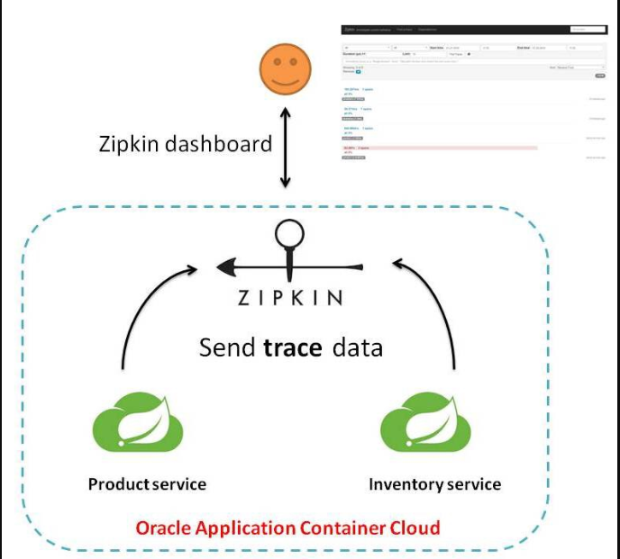


### 2 搭建链路监控步骤

#### 2.1 zipkin

> 快速启动：

官网：https://zipkin.io/

- 方式一：Docker

  ```bash
  docker run -d -p 9411:9411 openzipkin/zipkin
  ```

- 方式二：如果安装了Java8或更高版本，最快的入门方法是获取最新版本作为一个自包含的可执行jar

  ```bash
  curl -sSL https://zipkin.io/quickstart.sh | bash -s
  java -jar zipkin.jar
  ```

- 本次采用方式一


> 运行控制台

`http://192.168.88.110:9411/zipkin/`


术语：

- 完整的调用链路：表示一请求链路，一条链路通过Trace Id唯一标识，Span标识发起的请求信息，各span通过parent id关联起来

  

- 上图what

  一条链路通过Trace Id唯一标识，Span标识发起的请求信息，各span通过parent id关联起来

  

  

- 名词解释：

  1. Trace：类似于树结构的Span集合，表示一条调用链路，存在唯一标识
  2. span：表示调用链路来源，通俗的理解span就是一次请求信息


#### 2.2 服务提供者

1. 修改：cloud-provider-payment8001

2. POM：添加依赖

   ```xml
   <!--包含了sleuth+zipkin-->
   <dependency>
       <groupId>org.springframework.cloud</groupId>
       <artifactId>spring-cloud-starter-zipkin</artifactId>
   </dependency>
   ```

3. YML

   ```yaml
   server:
     port: 8001
   
   spring:
     application:
       name: cloud-payment-service
     zipkin:
       base-url: http://192.168.88.110:9411
     sleuth:
       sampler:
         #采样率值介于 0 到 1 之间，1 则表示全部采集
         probability: 1
   
   eureka:
     client:
       register-with-eureka: true
       fetchRegistry: true
       service-url:
         defaultZone: http://localhost:7001/eureka
   ```

4. 业务类PaymentController

   ```java
   @GetMapping("/payment/zipkin")
   public String paymentZipkin() {
       return "hi, I am paymentzipkin server fall back，Welcome to NanJ，O(∩_∩)O哈哈~";
   }
   ```


#### 2.3 服务消费者(调用方)

1. 修改：cloud-consumer-order80

2. POM：添加依赖

   ```xml
   <!--包含了sleuth+zipkin-->
   <dependency>
       <groupId>org.springframework.cloud</groupId>
       <artifactId>spring-cloud-starter-zipkin</artifactId>
   </dependency>
   ```

3. YML

   ```yaml
   server:
     port: 80
   
   spring:
     application:
       name: cloud-order-service
     zipkin:
       base-url: http://192.168.88.110:9411
     sleuth:
       sampler:
         probability: 1
   
   eureka:
     client:
       register-with-eureka: true
       fetchRegistry: true
       service-url:
         defaultZone: http://localhost:7001/eureka
   ```

4. 业务类OrderController

   ```java
   // ====================> zipkin+sleuth
   @GetMapping("/consumer/payment/zipkin")
   public String paymentZipkin() {
       String result = restTemplate.getForObject("http://localhost:8001"+"/payment/zipkin/", String.class);
       return result;
   }
   ```

5. 测试

   依次启动eureka7001/8001/80

   80调用8001几次测试下：`http://localhost/consumer/payment/zipkin`

6. 打开浏览器访问：`http://192.168.88.110:9411`

   会出现以下界面：

   

   

+++

## 十五、SpringCloud Alibaba入门简介

### 1 why会出现SpringCloud Alibaba？

1. Spring Cloud Netflix项目进入维护模式

   https://spring.io/blog/2018/12/12/spring-cloud-greenwich-rc1-available-now

   

2. Spring Cloud Netflix Projects Entering Maintenance Mode

   - 什么是维护模式？

     

     将模块置于维护模式，意味着Spring Cloud团队将不会再向模块添加新功能。我们将修复 block 级别的 bug 以及安全问题，我们也会考虑并审查社区的小型pull request。

   - 进入维护模式意味着

     **Spring Cloud Netflix将不再开发新的组件**

     我们都知道Spring Cloud版本迭代算是比较快的，因而出现了很多重大ISSUE都还来不及Fix就又推另一个Release了。进入维护模式意思就是目前一直以后一段时间Spring Cloud Netflix提供的服务和功能就这么多了，不在开发新的组件和功能了。以后将以维护和Merge分支Full Request为主。

     **新组件功能将以其他替代平代替的方式实现**

     


### 2 SpringCloud Alibaba带来了什么？

> SpringCloud Alibaba是什么？

官网：https://github.com/alibaba/spring-cloud-alibaba/blob/master/README-zh.md

诞生：2018.10.31，Spring Cloud Alibaba正式入驻了Spring Cloud官方孵化器，并在 Maven 中央库发布了第一个版本。


> SpringCloud Alibaba能干嘛？

- **服务限流降级**：默认支持 WebServlet、WebFlux、OpenFeign、RestTemplate、Spring Cloud Gateway、Dubbo 和 RocketMQ 限流降级功能的接入，可以在运行时通过控制台实时修改限流降级规则，还支持查看限流降级 Metrics 监控。
- **服务注册与发现**：适配 Spring Cloud 服务注册与发现标准，默认集成了 Ribbon 的支持。
- **分布式配置管理**：支持分布式系统中的外部化配置，配置更改时自动刷新。
- **消息驱动能力**：基于 Spring Cloud Stream 为微服务应用构建消息驱动能力。
- **分布式事务**：使用 @GlobalTransactional 注解， 高效并且对业务零侵入地解决分布式事务问题。
- **阿里云对象存储**：阿里云提供的海量、安全、低成本、高可靠的云存储服务。支持在任何应用、任何时间、任何地点存储和访问任意类型的数据。
- **分布式任务调度**：提供秒级、精准、高可靠、高可用的定时（基于 Cron 表达式）任务调度服务。同时提供分布式的任务执行模型，如网格任务。网格任务支持海量子任务均匀分配到所有Worker（schedulerx-client）上执行。
- **阿里云短信服务**：覆盖全球的短信服务，友好、高效、智能的互联化通讯能力，帮助企业迅速搭建客户触达通道。


> SpringCloud Alibaba去哪下?

https://github.com/alibaba/spring-cloud-alibaba/blob/master/README-zh.md


> SpringCloud Alibaba怎么玩?
>
> 有哪些组件？

1. **[Sentinel](https://github.com/alibaba/Sentinel)**：把流量作为切入点，从流量控制、熔断降级、系统负载保护等多个维度保护服务的稳定性。
2. **[Nacos](https://github.com/alibaba/Nacos)**：一个更易于构建云原生应用的动态服务发现、配置管理和服务管理平台。
3. **[RocketMQ](https://rocketmq.apache.org/)**：一款开源的分布式消息系统，基于高可用分布式集群技术，提供低延时的、高可靠的消息发布与订阅服务。
4. **[Seata](https://github.com/seata/seata)**：阿里巴巴开源产品，一个易于使用的高性能微服务分布式事务解决方案。
5. **[Alibaba Cloud OSS](https://www.aliyun.com/product/oss)**: 阿里云对象存储服务（Object Storage Service，简称 OSS），是阿里云提供的海量、安全、低成本、高可靠的云存储服务。您可以在任何应用、任何时间、任何地点存储和访问任意类型的数据。
6. **[Alibaba Cloud SchedulerX](https://cn.aliyun.com/aliware/schedulerx)**: 阿里中间件团队开发的一款分布式任务调度产品，提供秒级、精准、高可靠、高可用的定时（基于 Cron 表达式）任务调度服务。
7. **[Alibaba Cloud SMS](https://www.aliyun.com/product/sms)**: 覆盖全球的短信服务，友好、高效、智能的互联化通讯能力，帮助企业迅速搭建客户触达通道。


> SpringCloud Alibaba学习资料获取

- 官网：https://spring.io/projects/spring-cloud-alibaba#overview

  

  Spring Cloud Alibaba致力于提供微服务开发的一站式解决方案。此项目包含开发分布式应用微服务的必需组件，方便开发者通过Spring Cloud编程模型轻松使用这些组件来开发分布式应用服务。

  依托 Spring Cloud Alibaba，您只需要添加一些注解和少量配置，就可以将Spring Cloud应用接入阿里微服务解决方案，通过阿里中间件来迅速搭建分布式应用系统。

  SpringCloud Alibaba进入了SpringCloud官方孵化器，而且毕业了。

- 英文

  https://github.com/alibaba/spring-cloud-alibaba

  https://spring-cloud-alibaba-group.github.io/github-pages/greenwich/spring-cloud-alibaba.html

- 中文：https://github.com/alibaba/spring-cloud-alibaba/blob/master/README-zh.md


+++

## 十六、Nacos服务注册和配置中心

### 1 简介

1. **为什么叫Nacos**？

   前四个字母分别为Naming和Configuration的前两个字母，最后的s为Service。

2. **Nacos是什么**？

   - 一个更易于构建云原生应用的动态服务发现、配置管理和服务管理平台。
   - Nacos: Dynamic Naming and Configuration Service
   - Nacos就是*注册中心* + *配置中心*的组合：Nacos = Eureka+Config +Bus

3. **Nacos能干嘛**？

   - 替代Eureka做服务注册中心
   - 替代Config做服务配置中心

4. **去哪下**？

   https://github.com/alibaba/Nacos

5. **官网文档**

   https://nacos.io/zh-cn/index.html

   https://spring-cloud-alibaba-group.github.io/github-pages/greenwich/spring-cloud-alibaba.html#_spring_cloud_alibaba_nacos_discovery

6. 各种注册中心比较

   | **服务注册与发现框架** | **CAP** | **控制台管理** | **社区活跃度**  |
   | ---------------------- | ------- | -------------- | --------------- |
   | Eureka                 | AP      | 支持           | 低(2.x版本闭源) |
   | Consul                 | CP      | 支持           | 中              |
   | Zookeeper              | CP      | 不支持         | 高              |
   | Nacos                  | AP      | 支持           | 高              |

   据说 Nacos 在阿里巴巴内部有超过 10 万的实例运行，已经过了类似双十一等各种大型流量的考验


### 2 安装并运行Nacos

1. **本地Java8+Maven环境已经OK**

2. 先从[官网](https://github.com/alibaba/nacos/releases)下载Nacos：Tags选择1.4.4稳定版本:windows

   

3. 解压安装包，直接运行bin目录下的startup.cmd

   `startup.cmd -m standalone`

4. 命令运行成功后直接访问http://localhost:8848/nacos

   默认账号密码都是nacos

   结果页面

   


### 3 Nacos作为服务注册中心演示

[官网文档](https://spring-cloud-alibaba-group.github.io/github-pages/greenwich/spring-cloud-alibaba.html#_spring_cloud_alibaba_nacos_config)


#### 3.1 基于Nacos的服务提供者9001

1. 新建Maven子模块：cloudalibaba-provider-payment9001

2. POM

   父POM

   ```xml
   <!--spring cloud alibaba 2.1.0.RELEASE-->
   <dependency>
     <groupId>com.alibaba.cloud</groupId>
     <artifactId>spring-cloud-alibaba-dependencies</artifactId>
     <version>2.1.0.RELEASE</version>
     <type>pom</type>
     <scope>import</scope>
   </dependency>
   ```

   本模块POM

   ```xml
   <dependencies>
       <!--SpringCloud ailibaba nacos -->
       <dependency>
           <groupId>com.alibaba.cloud</groupId>
           <artifactId>spring-cloud-starter-alibaba-nacos-discovery</artifactId>
       </dependency>
       <!-- SpringBoot整合Web组件 -->
       <dependency>
           <groupId>org.springframework.boot</groupId>
           <artifactId>spring-boot-starter-web</artifactId>
       </dependency>
       <dependency>
           <groupId>org.springframework.boot</groupId>
           <artifactId>spring-boot-starter-actuator</artifactId>
       </dependency>
       <!--日常通用jar包配置-->
       <dependency>
           <groupId>org.springframework.boot</groupId>
           <artifactId>spring-boot-devtools</artifactId>
           <scope>runtime</scope>
           <optional>true</optional>
       </dependency>
       <dependency>
           <groupId>org.projectlombok</groupId>
           <artifactId>lombok</artifactId>
           <optional>true</optional>
       </dependency>
       <dependency>
           <groupId>org.springframework.boot</groupId>
           <artifactId>spring-boot-starter-test</artifactId>
           <scope>test</scope>
       </dependency>
   </dependencies>
   ```

3. YML：application.yml

   ```yaml
   server:
     port: 9001
   
   spring:
     application:
       name: nacos-payment-provider
     cloud:
       nacos:
         discovery:
           server-addr: localhost:8848 #配置Nacos地址
   
   management:
     endpoints:
       web:
         exposure:
           include: '*'
   ```

4. 主启动类

   ```java
   @SpringBootApplication
   @EnableDiscoveryClient
   public class PaymentMain9001 {
       public static void main(String[] args) {
           SpringApplication.run(PaymentMain9001.class, args);
       }
   }
   ```

5. 业务类

   ```java
   @RestController
   public class PaymentController {
       @Value("${server.port}")
       private String serverPort;
   
       @GetMapping(value = "/payment/nacos/{id}")
       public String getPayment(@PathVariable("id") Integer id) {
           return "nacos registry, serverPort: "+ serverPort+"\t id"+id;
       }
   }
   ```

6. 测试

   `http://localhost:9001/payment/nacos/1`

   

   nacos控制台

   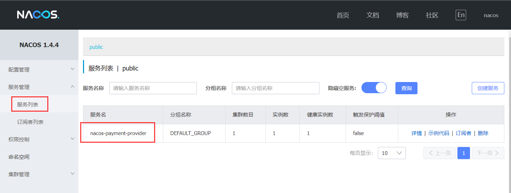

   nacos服务注册中心+服务提供者9001都OK了

7. 参照9001新建9002：cloudalibaba-provider-payment9002

   除了修改YML文件的服务端口号，其余的步骤基本一致

   启动：

   


#### 3.2 基于Nacos的服务消费者83

1. 新建Maven子模块：cloudalibaba-consumer-nacos-order83

2. POM

   ```xml
   <dependencies>
       <!--SpringCloud ailibaba nacos -->
       <dependency>
           <groupId>com.alibaba.cloud</groupId>
           <artifactId>spring-cloud-starter-alibaba-nacos-discovery</artifactId>
       </dependency>
       <!-- 引入自己定义的api通用包，可以使用Payment支付Entity -->
       <dependency>
           <groupId>com.shanhai.springcloud</groupId>
           <artifactId>cloud-api-commons</artifactId>
           <version>1.0-SNAPSHOT</version>
       </dependency>
       <!-- SpringBoot整合Web组件 -->
       <dependency>
           <groupId>org.springframework.boot</groupId>
           <artifactId>spring-boot-starter-web</artifactId>
       </dependency>
       <dependency>
           <groupId>org.springframework.boot</groupId>
           <artifactId>spring-boot-starter-actuator</artifactId>
       </dependency>
       <!--日常通用jar包配置-->
       <dependency>
           <groupId>org.springframework.boot</groupId>
           <artifactId>spring-boot-devtools</artifactId>
           <scope>runtime</scope>
           <optional>true</optional>
       </dependency>
       <dependency>
           <groupId>org.projectlombok</groupId>
           <artifactId>lombok</artifactId>
           <optional>true</optional>
       </dependency>
       <dependency>
           <groupId>org.springframework.boot</groupId>
           <artifactId>spring-boot-starter-test</artifactId>
           <scope>test</scope>
       </dependency>
   </dependencies>
   ```

   为什么nacos支持负载均衡？

   

3. YML

   ```yaml
   server:
     port: 83
   
   spring:
     application:
       name: nacos-order-consumer
     cloud:
       nacos:
         discovery:
           server-addr: localhost:8848
   
   #消费者将要去访问的微服务名称(注册成功进nacos的微服务提供者)
   service-url:
     nacos-user-service: http://nacos-payment-provider
   ```

4. 主启动类

   ```java
   @SpringBootApplication
   @EnableDiscoveryClient
   public class OrderNacosMain83 {
       public static void main(String[] args) {
           SpringApplication.run(OrderNacosMain83.class,args);
       }
   }
   ```

5. 业务类

   config

   ```java
   package com.shanhai.springcloud.config;
   
   import org.springframework.cloud.client.loadbalancer.LoadBalanced;
   import org.springframework.context.annotation.Bean;
   import org.springframework.context.annotation.Configuration;
   import org.springframework.web.client.RestTemplate;
   
   @Configuration
   public class ApplicationContextConfig {
       @Bean
       @LoadBalanced
       public RestTemplate getRestTemplate() {
           return new RestTemplate();
       }
   }
   ```

   controller

   ```java
   package com.shanhai.springcloud.controller;
   
   import org.springframework.beans.factory.annotation.Value;
   import org.springframework.web.bind.annotation.GetMapping;
   import org.springframework.web.bind.annotation.PathVariable;
   import org.springframework.web.bind.annotation.RestController;
   import org.springframework.web.client.RestTemplate;
   
   import javax.annotation.Resource;
   
   @RestController
   public class OrderNacosController {
       @Resource
       private RestTemplate restTemplate;
   
       @Value("${service-url.nacos-user-service}")
       private String serverURL;
   
       @GetMapping("/consumer/payment/nacos/{id}")
       public String paymentInfo(@PathVariable("id") Long id) {
           return restTemplate.getForObject(serverURL+"/payment/nacos/"+id,String.class);
       }
   }
   ```

6. 测试

   多次访问：`http://localhost:83/consumer/payment/nacos/13`

   结果：83访问9001/9002，轮询负载OK

   nacos控制台：

   


#### 3.3 服务注册中心对比

Nacos全景图：


Nacos和CAP：


切换：**Nacos支持AP和CP模式的切换**

**C是所有节点在同一时间看到的数据是一致的；而A的定义是所有的请求都会收到响应**。

*何时选择使用何种模式*？

一般来说，如果不需要存储服务级别的信息且服务实例是通过nacos-client注册，并能够保持心跳上报，那么就可以选择AP模式。当前主流的服务如Spring cloud和Dubbo服务，都适用于AP模式，AP模式为了服务的可能性而减弱了一致性，因此AP模式下只支持注册临时实例。

如果需要在服务级别编辑或者存储配置信息，那么CP是必须，K8S服务和DNS服务则适用于CP模式。CP模式下则支持注册持久化实例，此时则是以 Raft 协议为集群运行模式，该模式下注册实例之前必须先注册服务，如果服务不存在，则会返回错误。

`curl -X PUT '$NACOS_SERVER:8848/nacos/v1/ns/operator/switches?entry=serverMode&value=CP'`


### 4 Nacos作为服务配置中心演示

#### 4.1 Nacos作为配置中心-基础配置

1. 新建Maven子模块：cloudalibaba-config-nacos-client3377

2. POM

   ```xml
   <dependencies>
       <!--nacos-config-->
       <dependency>
           <groupId>com.alibaba.cloud</groupId>
           <artifactId>spring-cloud-starter-alibaba-nacos-config</artifactId>
       </dependency>
       <!--nacos-discovery-->
       <dependency>
           <groupId>com.alibaba.cloud</groupId>
           <artifactId>spring-cloud-starter-alibaba-nacos-discovery</artifactId>
       </dependency>
       <!--web + actuator-->
       <dependency>
           <groupId>org.springframework.boot</groupId>
           <artifactId>spring-boot-starter-web</artifactId>
       </dependency>
       <dependency>
           <groupId>org.springframework.boot</groupId>
           <artifactId>spring-boot-starter-actuator</artifactId>
       </dependency>
       <!--一般基础配置-->
       <dependency>
           <groupId>org.springframework.boot</groupId>
           <artifactId>spring-boot-devtools</artifactId>
           <scope>runtime</scope>
           <optional>true</optional>
       </dependency>
       <dependency>
           <groupId>org.projectlombok</groupId>
           <artifactId>lombok</artifactId>
           <optional>true</optional>
       </dependency>
       <dependency>
           <groupId>org.springframework.boot</groupId>
           <artifactId>spring-boot-starter-test</artifactId>
           <scope>test</scope>
       </dependency>
   </dependencies>
   ```

3. YML

   bootstrap.yml

   ```yaml
   # nacos配置
   server:
     port: 3377
   
   spring:
     application:
       name: nacos-config-client
     cloud:
       nacos:
         discovery:
           server-addr: localhost:8848 #Nacos服务注册中心地址
         config:
           server-addr: localhost:8848 #Nacos作为配置中心地址
           file-extension: yaml #指定yaml格式的配置
   
   # ${spring.application.name}-${spring.profile.active}.${spring.cloud.nacos.config.file-extension}
   # nacos-config-client-dev.yaml
   ```

   application.yml

   ```yaml
   spring:
     profiles:
       active: dev # 表示开发环境
   ```

   *why配置两个*？

   Nacos同springcloud-config一样，在项目初始化时，要保证先从配置中心进行配置拉取，拉取配置之后，才能保证项目的正常启动。

   springboot中配置文件的加载是存在优先级顺序的，**bootstrap优先级高于application**。

4. 主启动类

   ```java
   @EnableDiscoveryClient
   @SpringBootApplication
   public class NacosConfigClientMain3377 {
       public static void main(String[] args) {
           SpringApplication.run(NacosConfigClientMain3377.class, args);
       }
   }
   ```

5. 业务类

   `@RefreshScope`：通过SpringCloud原生注解`@RefreshScope`实现配置的自动更新

   ```java
   @RestController
   @RefreshScope //在控制器类加入@RefreshScope注解使当前类下的配置支持Nacos的动态刷新功能。
   public class ConfigClientController {
       @Value("${config.info}")
       private String configInfo;
   
       @GetMapping("/config/info")
       public String getConfigInfo() {
           return configInfo;
       }
   }
   ```

6. 在Nacos中添加配置信息

   Nacos中的匹配规则：

   - 理论

     > Nacos中的dataid的组成格式及与SpringBoot配置文件中的匹配规则

     [官网](https://nacos.io/zh-cn/docs/quick-start-spring-cloud.html)：`${spring.application.name}-${spring.profiles.active}.${spring.cloud.nacos.config.file-extension}`

     

   - 实操

     > 配置新增：nacos-config-client-dev.yaml

     

     > Nacos界面配置对应

     公式：`${prefix}-${spring.profiles.active}.${spring.cloud.nacos.config.file-extension}`

     prefix 默认为 spring.application.name 的值。

     spring.profile.active 即为当前环境对应的 profile，可以通过配置项 spring.profile.active 来配置。

     file-exetension 为配置内容的数据格式，可以通过配置项 spring.cloud.nacos.config.file-extension 来配置。

     

     > 历史配置

     Nacos会记录配置文件的历史版本默认保留30天，此外还有一键回滚功能，**回滚**操作将会触发配置更新

     

7. 测试

   启动前需要在nacos客户端-配置管理-配置管理栏目下有对应的yaml配置文件

   

   运行cloud-config-nacos-client3377的主启动类

   调用接口查看配置信息：`http://localhost:3377/config/info`

   自带动态刷新：修改下Nacos中的yaml配置文件，再次调用查看配置的接口，就会发现配置已经刷新


#### 4.2 Nacos作为配置中心-分类配置

##### 4.2.1 概述

> **问题**：多环境多项目管理

- **问题一**：

  实际开发中，通常一个系统会准备*dev开发环境*、*test测试环境*、*prod生产环境*。

  如何保证指定环境启动时服务能正确读取到Nacos上相应环境的配置文件呢？

- **问题二**：

  一个大型分布式微服务系统会有很多微服务子项目，每个微服务项目又都会有相应的开发环境、测试环境、预发环境、正式环境......

  那怎么对这些微服务配置进行管理呢？


> Nacos的图形化管理界面：

- 配置管理

  

- 命名空间

  


> `Namespace`+`Group`+`Data ID`三者关系？为什么这么设计？

1. 是什么？

   类似Java里面的package名和类名

   最外层的namespace是可以用于区分部署环境的，Group和DataID逻辑上区分两个目标对象。

2. 三者情况

   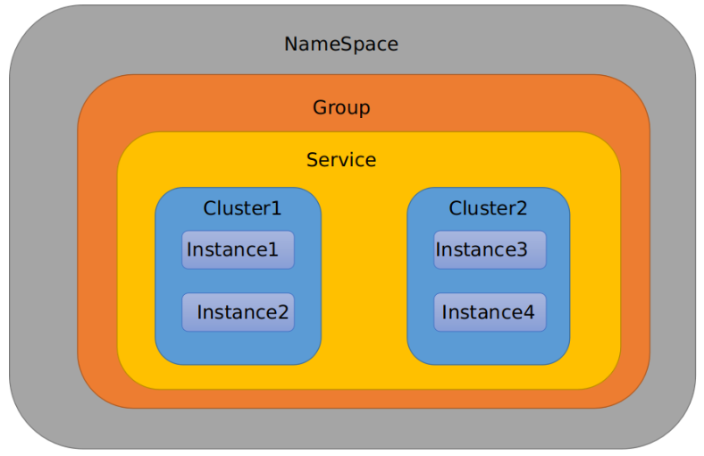

   默认情况：`Namespace=public，Group=DEFAULT_GROUP, 默认Cluster是DEFAULT`

   Nacos默认的命名空间是public，Namespace主要用来实现隔离。

   比方说我们现在有三个环境：开发、测试、生产环境，我们就可以创建三个Namespace，不同的Namespace之间是隔离的。

   Group默认是DEFAULT_GROUP，Group可以把不同的微服务划分到同一个分组里面去。

   Service就是微服务；一个Service可以包含多个Cluster（集群），Nacos默认Cluster是DEFAULT，Cluster是对指定微服务的一个虚拟划分。

   比方说为了容灾，将Service微服务分别部署在了杭州机房和广州机房，这时就可以给杭州机房的Service微服务起一个集群名称（HZ），给广州机房的Service微服务起一个集群名称（GZ），还可以尽量让同一个机房的微服务互相调用，以提升性能。

   最后是Instance，就是微服务的实例。


##### 4.2.2 三种方案加载配置

> DataID方案

指定`spring.profiles.active`和配置文件的`DataID`来使不同环境下读取不同的配置

1. 默认空间+默认分组+新建dev和test两个DataID

   - 新建dev配置DataID

   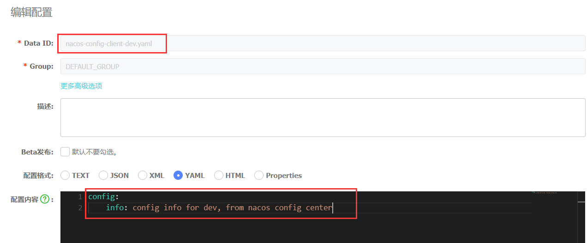

   - 新建test配置DataID

   

2. 通过`spring.profiles.active`属性就能进行多环境下配置文件的读取

   

3. 测试：重启3377

   `http://localhost:3377/config/info`

   配置是什么就加载什么：test

   


> Group方案

通过`Group`实现环境区分

1. 新建Group

   

2. 在nacos图形界面控制台上面新建配置文件DataID

   

3. bootstrap.yml + application.yml

   **在config下增加一条group的配置即可。可配置为DEV_GROUP或TEST_GROUP**。

   bootstrap.yml

   ```yaml
   # nacos配置
   server:
     port: 3377
   
   spring:
     application:
       name: nacos-config-client
     cloud:
       nacos:
         discovery:
           server-addr: localhost:8848 #Nacos服务注册中心地址
         config:
           server-addr: localhost:8848 #Nacos作为配置中心地址
           file-extension: yaml #指定yaml格式的配置
           #group: DEV_GROUP
           group: TEST_GROUP
   
   # ${spring.application.name}-${spring.profile.active}.${spring.cloud.nacos.config.file-extension}
   # nacos-config-client-info.yaml
   ```

   application.yml

   ```yaml
   spring:
     profiles:
       #active: dev # 表示开发环境
       #active: test # 表示测试环境
       active: info
   ```

4. 测试：重启3377

   `http://localhost:3377/config/info`

   配置是什么就加载什么：test

   

> Namespace方案

1. 新建dev/test的Namespace

   

2. 回到服务管理-服务列表查看

   

3. 按照域名配置填写

   

4. YML

   bootstrap.yml

   ```yaml
   # nacos配置
   server:
     port: 3377
   
   spring:
     application:
       name: nacos-config-client
     cloud:
       nacos:
         discovery:
           server-addr: localhost:8848 #Nacos服务注册中心地址
         config:
           server-addr: localhost:8848 #Nacos作为配置中心地址
           file-extension: yaml #指定yaml格式的配置
           namespace: 317872c3-56f5-46a0-9d11-3950319a238c
           group: TEST_GROUP
           #group: DEV_GROUP
   
   # ${spring.application.name}-${spring.profile.active}.${spring.cloud.nacos.config.file-extension}
   # nacos-config-client-dev.yaml
   ```

   application.yml

   ```yaml
   spring:
     profiles:
       active: dev
   ```

5. 测试：重启3377

   `http://localhost:3377/config/info`

   配置是什么就加载什么：dev 命名空间下 TEST_GROUP

   


### 5 Nacos集群和持久化配置

#### 5.1 官网说明

[官网](https://nacos.io/zh-cn/docs/cluster-mode-quick-start.html)：

- 官网架构图

  

- 上图官网翻译，真实情况

  

- [说明](https://nacos.io/zh-cn/docs/deployment.html)：

  默认Nacos使用嵌入式数据库实现数据的存储。所以，如果启动多个默认配置下的Nacos节点，数据存储是存在一致性问题的。

  为了解决这个问题，**Nacos采用了集中式存储的方式来支持集群化部署，目前只支持MySQL的存储**。

  按照上述，我们需要mysql数据库

  

  


#### 5.2 Nacos持久化配置解释

- Nacos默认自带的是嵌入式数据库derby，[config/pom.xml](https://github.com/alibaba/nacos/blob/develop/config/pom.xml)

- derby到mysql切换配置步骤

  1. nacos-server-1.4.4\nacos\conf目录下找到sql脚本：nacos-mysql.sql

     执行脚本

  2. nacos-server-1.4.4\nacos\conf目录下找到application.properties

     添加：

     ```properties
     spring.datasource.platform=mysql
      
     db.num=1
     db.url.0=jdbc:mysql://192.168.88.100:3306/nacos_config?characterEncoding=utf8&connectTimeout=1000&socketTimeout=3000&autoReconnect=true
     db.user=root
     db.password=123456
     ```

  3. 启动Nacos，可以看到是个全新的空记录界面，以前是记录进derby

     新建配置：

     

     数据库查询配置：

     


#### 5.3 Linux版Nacos+MySQL生产环境配置

- 预计需要，1个Nginx+3个nacos注册中心+1个mysql
- Nginx：192.168.88.114:1111
- nacos：192.168.88.114:[3333|4444|5555]
- mysql：192.168.88.100:3306


> Nacos下载安装Linux版

- 从[官网](https://github.com/alibaba/nacos/releases)下载Nacos：Tags选择1.4.3稳定版本:Linux

  不用1.4.4版本的原因：通过nginx请求转发的nacos会有账号密码错误，登录失败的问题

  

- 解压后安装

  将下载好的tar.gz包放在`/opt/software`文件夹下

  

  安装到`/mynacos/`文件夹下

  ```bash
  tar -zxvf nacos-server-1.4.3.tar.gz -C /mynacos
  ```

  


> 集群配置步骤(重点)

1. **Linux服务器上mysql数据库配置**

   SQL脚本在哪里：

   

   sql语句源文件：nacos-mysql.sql

   192.168.88.100 Linux机器上的Mysql数据库粘贴

   执行后结果

   

2. **application.properties配置**

   位置：

   

   添加内容：

   ```properties
   spring.datasource.platform=mysql
   
   db.num=1
   db.url.0=jdbc:mysql://192.168.88.100:3306/nacos_config?characterEncoding=utf8&connectTimeout=1000&socketTimeout=3000&autoReconnect=true
   db.user=root
   db.password=123456
   ```

3. **Linux服务器上nacos的集群配置cluster.conf**

   梳理出3台nacos集器的不同服务端口号

   复制出cluster.conf：

   

   内容：这个IP不能写127.0.0.1，必须是Linux命令`hostname -i`能够识别的IP

   ```
   # ip:prot
   192.168.88.114:3333
   192.168.88.114:4444
   192.168.88.114:5555
   ```

4. 编辑Nacos的启动脚本startup.sh，使它能够接受不同的启动端口

   /mynacos/nacos/bin 目录下有 startup.sh

   在什么地方，修改什么，怎么修改

   思考：

   /mynacos/nacos/bin 目录下有 startup.sh

   平时单机版的启动，都是`./startup.sh`即可。

   但是集群启动，我们希望可以类似其它软件的shell命令，传递不同的端口号启动不同的nacos实例。

   命令：`./startup.sh -p 3333 `表示启动端口号为3333的nacos服务器实例，和上一步的cluster.conf配置的一致。

   修改内容(老版本需要，新版本可能需要)：

   

   

   

   执行方式：

   ```bash
   ./startup.sh -p 3333
   ./startup.sh -p 4444
   ./startup.sh -p 5555
   ```

   

5. Nginx的配置，由它作为负载均衡器

   修改nginx的配置文件：

   

   nginx.conf：

   

   Nginx重新启动：`systemctl restart nginx`

6. 截止到此处，1个Nginx+3个nacos注册中心+1个mysql

   测试通过nginx访问nacos：`http://192.168.88.114:1111/nacos/#/login`

   默认账号密码都是nacos，结果页面：

   

   新建一个配置测试：

   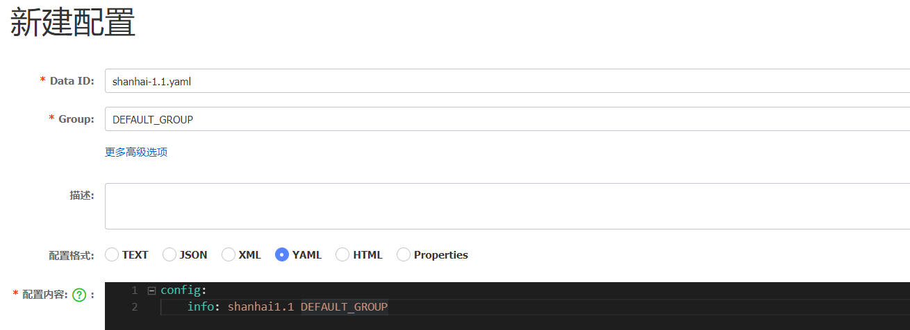

   linux服务器的mysql插入一条记录：

   

7. 测试

   微服务`cloudalibaba-provider-payment9002`启动注册进nacos集群

   YML：

   ```yaml
   server:
     port: 9002
   
   spring:
     application:
       name: nacos-payment-provider
     cloud:
       nacos:
         discovery:
           #server-addr: localhost:8848 #配置本机的单机版Nacos地址
           server-addr: 192.168.88.114:1111 #配置Linux的集群版Nacos地址
   
   management:
     endpoints:
       web:
         exposure:
           include: '*'
   ```

   结果：

   

8. 高可用小总结：

   

+++

## 十七、Sentinel实现熔断与限流

### 1 Sentinel概述及下载安装

官网：https://github.com/alibaba/Sentinel

中文：https://github.com/alibaba/Sentinel/wiki/%E4%BB%8B%E7%BB%8D


> Sentinel是什么？

随着微服务的流行，服务和服务之间的稳定性变得越来越重要。Sentinel以流量为切入点，从流量控制、流量路由、熔断降级、系统自适应过载保护、热点流量防护等多个维度保护服务的稳定性。

Sentinel 具有以下特征：

- **丰富的应用场景**：Sentinel 承接了阿里巴巴近 10 年的双十一大促流量的核心场景，例如秒杀（即突发流量控制在系统容量可以承受的范围）、消息削峰填谷、集群流量控制、实时熔断下游不可用应用等。
- **完备的实时监控**：Sentinel 同时提供实时的监控功能。您可以在控制台中看到接入应用的单台机器秒级数据，甚至 500 台以下规模的集群的汇总运行情况。
- **广泛的开源生态**：Sentinel 提供开箱即用的与其它开源框架/库的整合模块，例如与 Spring Cloud、Apache Dubbo、gRPC、Quarkus 的整合。您只需要引入相应的依赖并进行简单的配置即可快速地接入 Sentinel。同时 Sentinel 提供 Java/Go/C++ 等多语言的原生实现。
- **完善的 SPI 扩展机制**：Sentinel 提供简单易用、完善的 SPI 扩展接口。您可以通过实现扩展接口来快速地定制逻辑。例如定制规则管理、适配动态数据源等。

一句话解释，之前我们讲解过的Hystrix


去哪下：https://github.com/alibaba/Sentinel/releases


> Sentinel能干嘛？


> Sentinel[怎么玩](https://spring-cloud-alibaba-group.github.io/github-pages/greenwich/spring-cloud-alibaba.html#_spring_cloud_alibaba_sentinel)？

解决服务使用中的各种问题：

- 服务雪崩
- 服务降级
- 服务熔断
- 服务限流


> 安装Sentinel控制台

sentinel组件由2部分构成：


1. 后台
2. 前台8080


安装步骤：

1. [下载](https://github.com/alibaba/Sentinel/releases)：下载到本地sentinel-dashboard-1.7.1.jar

   

2. 运行命令

   前提：**Java8环境**、**8080端口不能被占用**。

   命令：`java -jar sentinel-dashboard-1.7.1.jar`

3. 访问sentinel管理界面：http://localhost:8080

   登录账号密码均为sentinel

   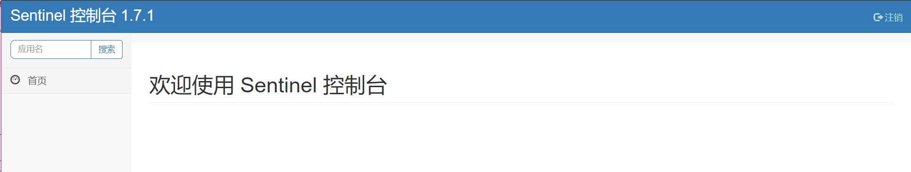


### 2 初始化演示工程

1. 启动Nacos8848成功：http://localhost:8848/nacos/#/login

   

2. 启动Sentinel8080，`java -jar sentinel-dashboard-1.7.0.jar`

   http://localhost:8080

3. 新建Maven子模块：cloudalibaba-sentinel-service8401

4. POM

   ```xml
   <dependencies>
       <!--SpringCloud ailibaba nacos -->
       <dependency>
           <groupId>com.alibaba.cloud</groupId>
           <artifactId>spring-cloud-starter-alibaba-nacos-discovery</artifactId>
       </dependency>
       <!--SpringCloud ailibaba sentinel-datasource-nacos 后续做持久化用到-->
       <dependency>
           <groupId>com.alibaba.csp</groupId>
           <artifactId>sentinel-datasource-nacos</artifactId>
       </dependency>
       <!--SpringCloud ailibaba sentinel -->
       <dependency>
           <groupId>com.alibaba.cloud</groupId>
           <artifactId>spring-cloud-starter-alibaba-sentinel</artifactId>
       </dependency>
       <!--openfeign-->
       <dependency>
           <groupId>org.springframework.cloud</groupId>
           <artifactId>spring-cloud-starter-openfeign</artifactId>
       </dependency>
       <!-- SpringBoot整合Web组件+actuator -->
       <dependency>
           <groupId>org.springframework.boot</groupId>
           <artifactId>spring-boot-starter-web</artifactId>
       </dependency>
       <dependency>
           <groupId>org.springframework.boot</groupId>
           <artifactId>spring-boot-starter-actuator</artifactId>
       </dependency>
       <!--日常通用jar包配置-->
       <dependency>
           <groupId>org.springframework.boot</groupId>
           <artifactId>spring-boot-devtools</artifactId>
           <scope>runtime</scope>
           <optional>true</optional>
       </dependency>
       <dependency>
           <groupId>cn.hutool</groupId>
           <artifactId>hutool-all</artifactId>
           <version>4.6.3</version>
       </dependency>
       <dependency>
           <groupId>org.projectlombok</groupId>
           <artifactId>lombok</artifactId>
           <optional>true</optional>
       </dependency>
       <dependency>
           <groupId>org.springframework.boot</groupId>
           <artifactId>spring-boot-starter-test</artifactId>
           <scope>test</scope>
       </dependency>
   </dependencies>
   ```

5. YML

   ```yaml
   server:
     port: 8401
   
   spring:
     application:
       name: cloudalibaba-sentinel-service
     cloud:
       nacos:
         discovery:
           #Nacos服务注册中心地址
           server-addr: localhost:8848
       sentinel:
         transport:
           #配置Sentinel dashboard地址
           dashboard: localhost:8080
           #默认8719端口，假如被占用会自动从8719开始依次+1扫描,直至找到未被占用的端口
           port: 8719
   
   management:
     endpoints:
       web:
         exposure:
           include: '*'
   ```

6. 主启动类

   ```java
   @EnableDiscoveryClient
   @SpringBootApplication
   public class MainApp8401
   {
       public static void main(String[] args) {
           SpringApplication.run(MainApp8401.class, args);
       }
   }
   ```

7. 业务类

   ```java
   @RestController
   public class FlowLimitController {
       @GetMapping("/testA")
       public String testA() {
           return "------testA";
       }
   
       @GetMapping("/testB")
       public String testB() {
           return "------testB";
       }
   }
   ```

8. 测试

   启动8401微服务后查看sentienl控制台：空空如也，啥都没有

   

   Sentinel采用的懒加载：

   - 执行一次访问即可：`http://localhost:8401/testA`、`http://localhost:8401/testB`

   - 效果：

     

9. 结论：sentinel8080正在监控微服务8401


### 3 流控规则

#### 3.1 基本介绍


- 资源名：唯一名称，默认请求路径
- 针对来源：Sentine可以针对调用者进行限流，填写微服务名，默认default(不区分来源)
- 阈值类型/单机阈值：
  - QPS(每秒钟的请求数量)：当调用该api的QPS达到阈值的时候，进行限流
  - 线程数：当调用该api的线程数达到阈值的时候，进行限流
- 是否集群：不需要集群
- 流控模式：
  - 直接：api达到限流条件时，直接限流。
  - 关联：当关联的资源达到阈值时，就限流自己。
  - 链路：只记录指定链路上的流量(指定资源从入口资源进来的流量，如果达到阈值，就进行限流)[api级别的针对来源]
- 流控效果：
  - 快速失败：直接失败，抛异常。
  - Warm Up：根据codeFactor(冷加载因子，默认3)的值，从阈值/codeFactor，经过预热时长，才达到设置的QPS阈值
  - 排队等待：匀速排队，让请求以匀速的速度通过，阈值类型必须设置为QPS，否则无效


#### 3.2 流控模式

##### 3.2.1 直接(默认)

> 直接QPS

1. 直接QPS ---> 快速失败，系统默认

2. 配置及说明：表示1秒钟内查询1次就是OK，若超过次数1，就直接---快速失败，报默认错误

   

3. 测试

   快速点击访问：`http://localhost:8401/testA`

   结果：Blocked by Sentinel (flow limiting)

4. 思考?

   直接调用默认报错信息，技术方面OK，but是否应该有我们自己的后续处理?

   类似有个fallback的兜底方法？

> 直接线程数

1. 直接线程数

2. 配置及说明：表示1秒钟内只能有一个客户端(线程)访问，若1秒内同时有多个客户端访问，就直接---快速失败，报默认错误。

   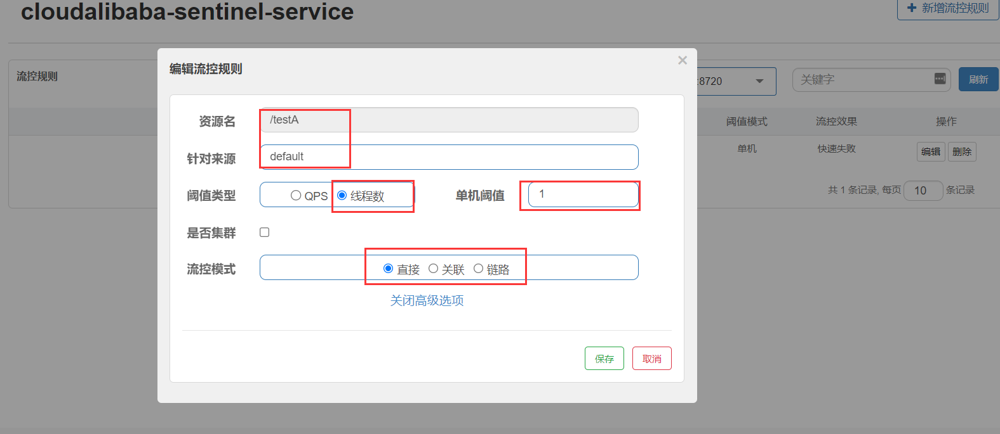

3. 测试

   多端同时点击访问：`http://localhost:8401/testA`

   结果：Blocked by Sentinel (flow limiting)


##### 3.2.2 关联

1. 是什么？

   当关联的资源达到阈值时，就限流自己

   当与A关联的资源B达到阀值后，就限流A自己

   B惹事，A挂了

2. 配置A

   **设置效果**：当关联资源/testB的qps阀值超过1时，就限流/testA的Rest访问地址，**当关联资源到阈值后限制配置好的资源名**。

   

3. postman模拟并发密集访问testB

   访问testB成功：

   

   将请求保存至工作区的SentinelTest集合当中：

   

   将访问地址添加进新新线程组：

   

   Run；大批量线程高并发访问B，导致A失效了

4. 运行后发现testA挂了

   点击访问`http://localhost:8401/testA`

   结果：Blocked by Sentinel (flow limiting)


##### 3.2.3 链路

1. 是什么？

   链路流控模式指的是，当从某个接口过来的资源达到限流条件时，开启限流，它的功能有点类似于针对来源配置项，区别在于：针对来源是针对上级微服务，而链路流控是针对上级接口，也就是说它的粒度更细。

   比如在一个微服务中，两个接口都调用了同一个Service中的方法，并且该方法用SentinelResource（用于定义资源）注解标注了，然后对该注解标注的资源（方法）进行配置，则可以选择链路模式。

   

2. POM

   Sentinel1.7.1版本开始（对应Spring Cloud Alibaba的2.1.1.RELEASE) 需要新增依赖

   ```xml
   <dependency>
       <groupId>com.alibaba.csp</groupId>
       <artifactId>sentinel-web-servlet</artifactId>
   </dependency>
   ```

3. YML：配置`spring.cloud.sentinel.web-context-unify=false`

   ```yaml
   spring:
     application:
       name: cloudalibaba-sentinel-service
     cloud:
       nacos:
         discovery:
           #Nacos服务注册中心地址
           server-addr: localhost:8848
       sentinel:
         transport:
           #配置Sentinel dashboard地址
           dashboard: localhost:8080
           #默认8719端口，假如被占用会自动从8719开始依次+1扫描,直至找到未被占用的端口
           port: 8719
         web-context-unify: false
   ```

4. 业务类：

   config

   ```java
   @Configuration
   public class FilterContextConfig {
       @Bean
       public FilterRegistrationBean sentinelFilterRegistration(){
           FilterRegistrationBean registration = new FilterRegistrationBean();
           registration.setFilter(new CommonFilter());
           registration.addUrlPatterns("/*");
           // 入口资源关闭聚合
           registration.addInitParameter(CommonFilter.WEB_CONTEXT_UNIFY, "false");
           registration.setName("sentinelFilter");
           registration.setOrder(1);
           return registration;
       }
   }
   ```

   首先编写一个Service

   ```java
   @Service
   public class TestService {
       // 定义限流资源
       @SentinelResource("common")
       public String common() {
           return "common";
       }
   }
   ```

   然后更改接口调用这个Service方法

   ```java
   @RestController
   public class FlowLimitController {
       @Resource
       private TestService testService;
   
       @GetMapping("/testA")
       public String testA() {
           return "--testA：" + testService.common();
       }
   
       @GetMapping("/testB")
       public String testB() {
           return "--testB：" + testService.common();
       }
   }
   ```

5. 当我们运行项目，并访问/testA或/testB后就会在sentinel dashbord中看到簇点链路common

   这里要注意不要对/testA或者/testB进行限流规则的配置，要给用SentinelResource注解标注的资源进行配置限流规则，这里的意思为当我们用入口资源访问被SentinelResource注解标注的资源方法时，当超过阈值就会被限流，但是此时实际效果是没有效果。

   这里设置表示访问common这个资源的入口资源是/testA时并且QPS超过1就会触发流控。

   

   

6. 测试：

   不停地访问/testA，会报异常。

   不停地访问/testB，无异常。


#### 3.3 流控效果

##### 3.3.1 直接---快速失败

- 直接 ---> 快速失败(默认的流控处理)

- 直接失败，抛出异常：Blocked by Sentinel (flow limiting)

- 源码：

  `com.alibaba.csp.sentinel.slots.block.flow.controller.DefaultController`

  ```java
  //
  // Source code recreated from a .class file by IntelliJ IDEA
  // (powered by FernFlower decompiler)
  //
  
  package com.alibaba.csp.sentinel.slots.block.flow.controller;
  
  import com.alibaba.csp.sentinel.node.Node;
  import com.alibaba.csp.sentinel.node.OccupyTimeoutProperty;
  import com.alibaba.csp.sentinel.slots.block.flow.PriorityWaitException;
  import com.alibaba.csp.sentinel.slots.block.flow.TrafficShapingController;
  import com.alibaba.csp.sentinel.util.TimeUtil;
  
  public class DefaultController implements TrafficShapingController {
      private static final int DEFAULT_AVG_USED_TOKENS = 0;
      private double count;
      private int grade;
  
      public DefaultController(double count, int grade) {
          this.count = count;
          this.grade = grade;
      }
  
      public boolean canPass(Node node, int acquireCount) {
          return this.canPass(node, acquireCount, false);
      }
  
      public boolean canPass(Node node, int acquireCount, boolean prioritized) {
          int curCount = this.avgUsedTokens(node);
          if ((double)(curCount + acquireCount) > this.count) {
              if (prioritized && this.grade == 1) {
                  long currentTime = TimeUtil.currentTimeMillis();
                  long waitInMs = node.tryOccupyNext(currentTime, acquireCount, this.count);
                  if (waitInMs < (long)OccupyTimeoutProperty.getOccupyTimeout()) {
                      node.addWaitingRequest(currentTime + waitInMs, acquireCount);
                      node.addOccupiedPass(acquireCount);
                      this.sleep(waitInMs);
                      throw new PriorityWaitException(waitInMs);
                  }
              }
  
              return false;
          } else {
              return true;
          }
      }
  
      private int avgUsedTokens(Node node) {
          if (node == null) {
              return 0;
          } else {
              return this.grade == 0 ? node.curThreadNum() : (int)node.passQps();
          }
      }
  
      private void sleep(long timeMillis) {
          try {
              Thread.sleep(timeMillis);
          } catch (InterruptedException var4) {
          }
  
      }
  }
  ```


##### 3.3.2 预热

- 说明

  **公式**：阈值除以coldFactor(默认值为3)，经过预热时长后才会达到阈值

- 官网：

  默认coldFactor为3，即请求 QPS 从 threshold/3 开始，经预热时长逐渐升至设定的 QPS 阈值。

  [限流 冷启动](https://github.com/alibaba/Sentinel/wiki/%E9%99%90%E6%B5%81---%E5%86%B7%E5%90%AF%E5%8A%A8)

- 源码

  `com.alibaba.csp.sentinel.slots.block.flow.controller.WarmUpController`

  

- WarmUp配置

  

- 多次点击`http://localhost:8401/testB`

  刚开始不行，后续慢慢OK

- 应用场景

  如：秒杀系统在开启的瞬间，会有很多流量上来，很有可能把系统打死，预热方式就是把为了保护系统，可慢慢的把流量放进来，慢慢的把阀值增长到设置的阀值。


##### 3.3.3 排队等待

- 是什么？

  匀速排队，让请求以均匀的速度通过，阀值类型必须设成QPS，否则无效。

- 设置含义：/testA每秒1次请求，超过的话就排队等待，等待的超时时间为20000毫秒。

  

- [官网](https://github.com/alibaba/Sentinel/wiki/%E6%B5%81%E9%87%8F%E6%8E%A7%E5%88%B6)

  匀速排队（`RuleConstant.CONTROL_BEHAVIOR_RATE_LIMITER`）方式会严格控制请求通过的间隔时间，也即是让请求以均匀的速度通过，对应的是漏桶算法。详细文档可以参考[流量控制 - 匀速器模式](https://github.com/alibaba/Sentinel/wiki/流量控制-匀速排队模式)，具体的例子可以参见[PaceFlowDemo](https://github.com/alibaba/Sentinel/blob/master/sentinel-demo/sentinel-demo-basic/src/main/java/com/alibaba/csp/sentinel/demo/flow/PaceFlowDemo.java)。

  该方式的作用如下图所示：

  

  这种方式主要用于处理间隔性突发的流量，例如消息队列。想象一下这样的场景，在某一秒有大量的请求到来，而接下来的几秒则处于空闲状态，我们希望系统能够在接下来的空闲期间逐渐处理这些请求，而不是在第一秒直接拒绝多余的请求。

  > 注意：匀速排队模式暂时不支持 QPS > 1000 的场景。

- 源码：

  `com.alibaba.csp.sentinel.slots.block.flow.controller.RateLimiterController`

  ```java
  //
  // Source code recreated from a .class file by IntelliJ IDEA
  // (powered by FernFlower decompiler)
  //
  
  package com.alibaba.csp.sentinel.slots.block.flow.controller;
  
  import com.alibaba.csp.sentinel.node.Node;
  import com.alibaba.csp.sentinel.slots.block.flow.TrafficShapingController;
  import com.alibaba.csp.sentinel.util.TimeUtil;
  import java.util.concurrent.atomic.AtomicLong;
  
  public class RateLimiterController implements TrafficShapingController {
      private final int maxQueueingTimeMs;
      private final double count;
      private final AtomicLong latestPassedTime = new AtomicLong(-1L);
  
      public RateLimiterController(int timeOut, double count) {
          this.maxQueueingTimeMs = timeOut;
          this.count = count;
      }
  
      public boolean canPass(Node node, int acquireCount) {
          return this.canPass(node, acquireCount, false);
      }
  
      public boolean canPass(Node node, int acquireCount, boolean prioritized) {
          if (acquireCount <= 0) {
              return true;
          } else if (this.count <= 0.0) {
              return false;
          } else {
              long currentTime = TimeUtil.currentTimeMillis();
              long costTime = Math.round(1.0 * (double)acquireCount / this.count * 1000.0);
              long expectedTime = costTime + this.latestPassedTime.get();
              if (expectedTime <= currentTime) {
                  this.latestPassedTime.set(currentTime);
                  return true;
              } else {
                  long waitTime = costTime + this.latestPassedTime.get() - TimeUtil.currentTimeMillis();
                  if (waitTime > (long)this.maxQueueingTimeMs) {
                      return false;
                  } else {
                      long oldTime = this.latestPassedTime.addAndGet(costTime);
  
                      try {
                          waitTime = oldTime - TimeUtil.currentTimeMillis();
                          if (waitTime > (long)this.maxQueueingTimeMs) {
                              this.latestPassedTime.addAndGet(-costTime);
                              return false;
                          } else {
                              if (waitTime > 0L) {
                                  Thread.sleep(waitTime);
                              }
  
                              return true;
                          }
                      } catch (InterruptedException var15) {
                          return false;
                      }
                  }
              }
          }
      }
  }
  ```

- 测试

  ```java
  @RestController
  @Slf4j
  public class FlowLimitController {
  
      @GetMapping("/testA")
      public String testA() {
          log.info("--testA：");
          return "--testA：";
      }
  }
  ```

  Postman设置没0.1秒发送一次/testA，发送10次

  结果：测试结果通过

  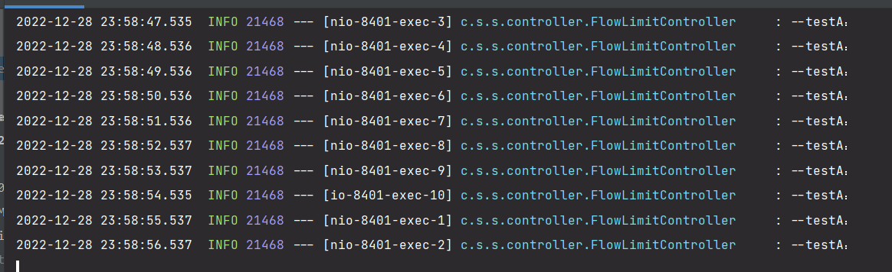


### 4 降级规则

#### 4.1 基本介绍

官网：https://github.com/alibaba/Sentinel/wiki/%E7%86%94%E6%96%AD%E9%99%8D%E7%BA%A7


1. *RT(平均响应时间，秒级)*

   平均响应时间**超出阈值**且**在时间窗口内通过的请求>=5**，两个条件同时满足后触发降级

   窗口期过后关闭断路器

   RT最大4900 (更大的需要通过-Dcsp.sentinel.statistic.max.rt=XXXX才能生效)

2. *异常比列(秒级)*

   **QPS >= 5**且**异常比例(秒级统计)超过阈值时**，触发降级；时间窗口结束后，关闭降级

3. *异常数(分钟级)*

   **异常数(分钟统计)超过阈值时**，触发降级；时间窗口结束后，关闭降级


进一步说明：

Sentinel 熔断降级会在调用链路中某个资源出现不稳定状态时(例如调用超时或异常比例升高)，对这个资源的调用进行限制，让请求快速失败，避免影响到其它的资源而导致级联错误。

当资源被降级后，在接下来的降级时间窗口之内，对该资源的调用都自动熔断(默认行为是抛出DegradeException)。


Sentinel的**断路器**是没有半开状态的

半开的状态系统自动去检测是否请求有异常，没有异常就关闭断路器恢复使用，有异常则继续打开断路器不可用。具体可以参考Hystrix。


#### 4.2 降级策略实战

##### 4.2.1 RT

- 是什么？

  目前使用的是旧的版本，和新版本有较大的差异

  

  

- 测试

  1. 代码

     ```java
     @GetMapping("/testD")
     public String testD() {
         //暂停几秒钟线程
         try {
             TimeUnit.SECONDS.sleep(1);
         } catch (InterruptedException e) {
             throw new RuntimeException(e);
         }
         log.info("testD 测试RT");
         return "------testD";
     }
     ```

  2. 配置

     

  3. jmeter压测：1秒内10个线程同时访问/testD

     

     

  4. 结论

     jmeter压测后，浏览器访问/testD，被降级，给出友好提示

     


##### 4.2.2 异常比例

- 是什么？

  

  

- 测试

  1. 代码

     ```java
     @GetMapping("/testD")
     public String testD() {
         log.info("testD 异常比例");
         int age = 10/0;
         return "------testD";
     }
     ```

  2. 配置

     

  3. jmeter压测：1秒内20个线程同时访问/testD

     

  4. 结论：

     按照上述配置，单独访问一次，必然来一次报错一次(`int age  = 10/0`)，调一次错一次；

     

     开启jmeter后，直接高并发发送请求，多次调用达到我们的配置条件了。

     断路器开启(保险丝跳闸)，微服务不可用了，不再报错error而是服务降级了。

     


##### 4.2.3 异常数

- 是什么？

  **时间窗口一定要大于等于60秒**。

  **异常数是按照分钟统计的**。

  

  

- 测试

  1. 代码

     ```java
     @GetMapping("/testD")
     public String testD() {
         log.info("testD 测试异常数");
         int age = 10/0;
         return "------testD";
     }
     ```

  2. 配置

     

  3. 测试

     `http://localhost:8401/testD`，第一次访问绝对报错，因为除数不能为零，我们看到error窗口，但是达到5次报错后，进入熔断后降级。


### 5 热点key限流


+++

## 十八、Seata处理分布式事务


