# Zookeeper

## 零、课程介绍

### 1 本课程的重点内容：

1. Zookeeper分布式锁案例
2. Paxos算法
3. ZAB协议
4. CAP
5. 源码：
   1. zk服务端初始化源码
   2. 服务器端加载数据源码
   3. 选举算法
   4. 状态同步算法
   5. Leader启动源码
   6. Follower启动源码
   7. 客户端启动源码


### 2 课程特色

1. 新	Zookeeper3.5.7
2. 细    注释详细，文档中代码复制粘贴就可以
3. 全    几乎涵盖了所有关于ZK相关讲解
4. 生动PPT动画


### 3 技术基础要求

JavaSE、Maven、IDEA、Linux常用命令

------

## 一、Zookeeper入门

### 1 概述

Zookeeper 是一个开源的分布式的，为分布式框架提供协调服务的 Apache 项目。


### 2 特点


1. Zookeeper：一个领导者（Leader），多个跟随者（Follower）组成的集群。
2. 集群中只要有**半数以上**节点存活，Zookeeper集群就能正常服务。所以Zookeeper适合安装奇数台服务器。
3. 全局数据一致：每个Server保存一份相同的数据副本，Client无论连接到哪个Server，数据都是一致的。
4. 更新请求顺序执行，来自同一个Client的更新请求按其发送顺序依次执行（FIFO）。
5. 数据更新原子性，一次数据更新要么成功，要么失败。
6. 实时性，在一定时间范围内，Client 能读到最新数据。


### 3 数据结构

ZooKeeper 数据模型的结构与**Unix文件系统很类似**，整体上可以看作是一棵树，每个节点称做一个ZNode。每一个 ZNode 默认能够存储**1MB**的数据，每个ZNode都可以**通过其路径唯一标识**。

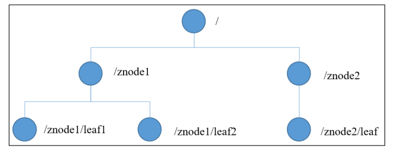


### 4 应用场景

提供的服务包括：

- 统一命名服务
- 统一配置管理
- 统一集群管理
- 服务器节点动态上下线
- 软负载均衡等

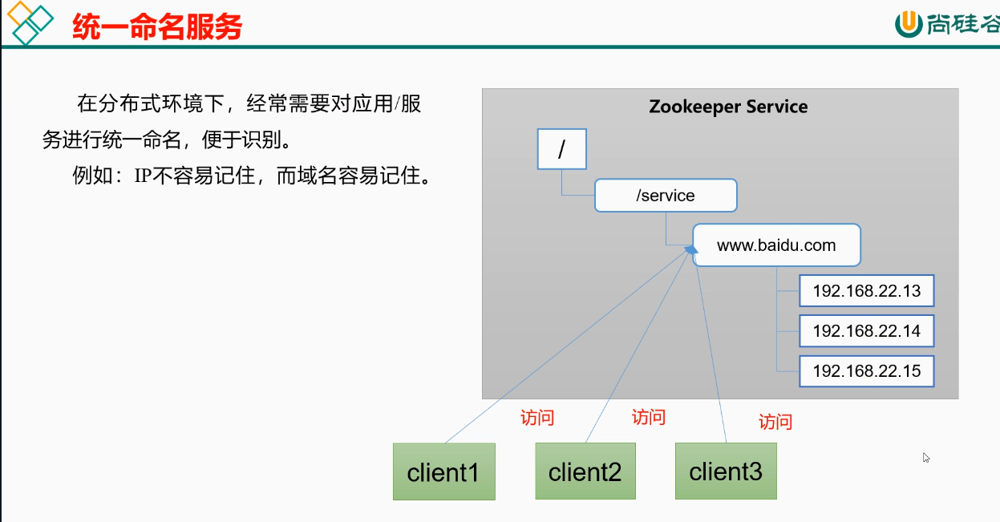


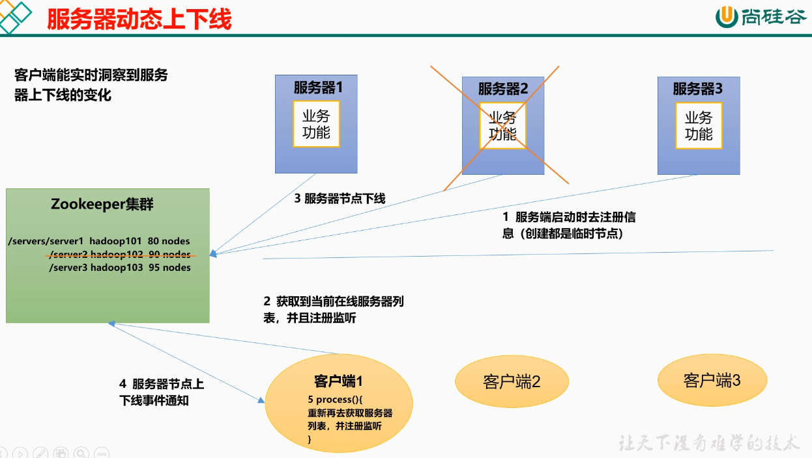

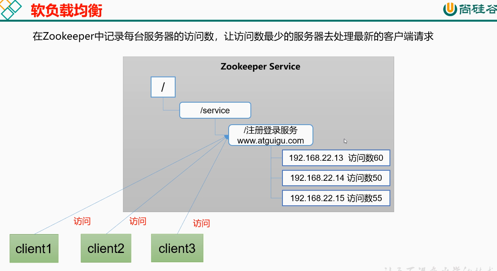


### 5 下载地址

官网地址：https://zookeeper.apache.org/


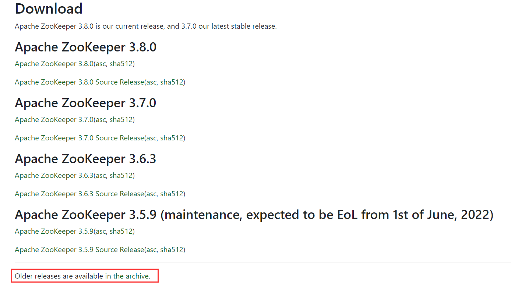

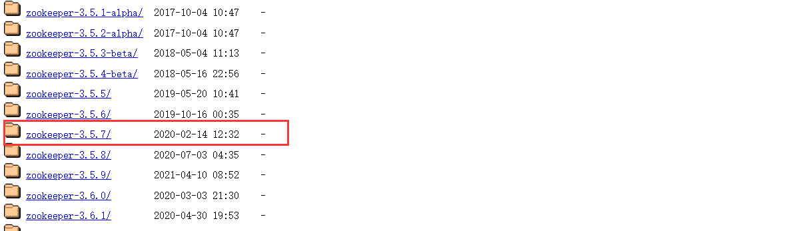

下载 Linux 环境安装的 tar 包


+++

## 二、ZooKeeper本地安装

### 1 本地模式安装

#### 1.1 安装前准备

1. 安装JDK：`yum install -y java-1.8.0-openjdk.x86_64`

2. 拷贝 apache-zookeeper-3.5.7-bin.tar.gz 安装包到 Linux 系统下的目录`/opt/software`

3. 解压到指定目录

   `tar -zxvf apache-zookeeper-3.5.7-bin.tar.gz -C /opt/module/`

4. 修改名称

   `mv apache-zookeeper-3.5.7-bin zookeeper-3.5.7`


#### 1.2 配置修改

1. 将`/opt/module/zookeeper-3.5.7/conf `这个路径下的 `zoo_sample.cfg` 修改为` zoo.cfg`：

   `mv zoo_sample.cfg zoo.cfg`

2. 打开 zoo.cfg 文件，修改 dataDir 路径：

   `vi zoo.cfg`

   修改如下内容：

   `dataDir=/opt/module/zookeeper-3.5.7/zkData`

3. 在`/opt/module/zookeeper-3.5.7/`这个目录上创建 zkData 文件夹

   `mkdir zkData`


#### 1.3 操作ZooKeeper

1. 启动 Zookeeper：`bin/zkServer.sh start`

2. 查看进程是否启动

3. 查看状态：`bin/zkServer.sh status`

   ```bash
   [root@localhost zookeeper-3.5.7]# bin/zkServer.sh status
   /usr/bin/java
   ZooKeeper JMX enabled by default
   Using config: /opt/model/zookeeper-3.5.7/bin/../conf/zoo.cfg
   Client port found: 2181. Client address: localhost.
   Mode: standalone
   ```

4. 启动客户端：`bin/zkCli.sh`
5. 退出客户端：`
   [zk: localhost:2181(CONNECTED) 0] quit`
6. 停止 Zookeeper：`
   bin/zkServer.sh stop`


### 2 配置参数解读

```properties
# The number of milliseconds of each tick
tickTime=2000
# The number of ticks that the initial
# synchronization phase can take
initLimit=10
# The number of ticks that can pass between
# sending a request and getting an acknowledgement
syncLimit=5
# the directory where the snapshot is stored.
# do not use /tmp for storage, /tmp here is just
# example sakes.
dataDir=/opt/model/zookeeper-3.5.7/zkData
# the port at which the clients will connect
clientPort=2181
# the maximum number of client connections.
# increase this if you need to handle more clients
#maxClientCnxns=60
#
# Be sure to read the maintenance section of the
# administrator guide before turning on autopurge.
#
# http://zookeeper.apache.org/doc/current/zookeeperAdmin.html#sc_maintenance
#
# The number of snapshots to retain in dataDir
#autopurge.snapRetainCount=3
# Purge task interval in hours
# Set to "0" to disable auto purge feature
#autopurge.purgeInterval=1
```

Zookeeper中的配置文件zoo.cfg中参数含义解读如下：

1. `tickTime = 2000`：通信心跳时间，Zookeeper服务器与客户端心跳时间，单位毫秒

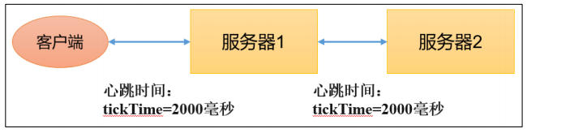

2. `initLimit = 10`：LF初始通信时限


3. `syncLimit = 5`：LF同步通信时限


4. `dataDir`：保存Zookeeper中的数据

   注意：默认的tmp目录，容易被Linux系统定期删除，所以一般不用默认的tmp目录。

5. `clientPort = 2181`：客户端连接端口，通常不做修改。

+++

## 三、Zookeeper集群操作

### 1 集群操作

#### 1.1 集群安装

1. 集群规划

   在 linux-copy2、linux-copy3 和 linux-copy4 三个节点上都部署 Zookeeper。

   > 思考：如果是 10 台服务器，需要部署多少台 Zookeeper？

2. 解压安装

   在 linux-copy2 解压 Zookeeper 安装包到/opt/module/目录下

   `tar -zxvf apache-zookeeper-3.5.7-bin.tar.gz -C /opt/module/`

   修改 apache-zookeeper-3.5.7-bin 名称为 zookeeper-3.5.7

   `mv apache-zookeeper-3.5.7-bin/ 
   zookeeper-3.5.7`

3. 配置服务器编号

   - 在/opt/module/zookeeper-3.5.7/这个目录下创建 zkData

     `mkdir zkData`

   - 在/opt/module/zookeeper-3.5.7/zkData 目录下创建一个 myid 的文件

     `cd /opt/module/zookeeper-3.5.7/zkData`

     `vim myid`

     在文件中添加与 server 对应的编号（注意：上下不要有空行，左右不要有空格）

     ```
     2
     ```

     > linux-copy2 ---- 2
     >
     > linux-copy3 ---- 3
     >
     > linux-copy4 ---- 4

   - 拷贝配置好的 zookeeper 到其他机器上

4. 配置zoo.cfg文件

   - 重命名/opt/module/zookeeper-3.5.7/conf 这个目录下的 zoo_sample.cfg 为 zoo.cfg

     `mv zoo_sample.cfg zoo.cfg`

   - 打开 zoo.cfg 文件

     `vim zoo.cfg`

     ```properties
     # 修改数据存储路径配置
     dataDir=/opt/module/zookeeper-3.5.7/zkData
     
     #增加如下配置
     #######################cluster##########################
     server.2=linux-copy2:2888:3888
     server.3=linux-copy3:2888:3888
     server.4=linux-copy4:2888:3888
     ```

   - 配置参数解读

     ```properties
     server.A=B:C:D
     ```

     *A* 是一个数字，表示这个是第几号服务器；

     集群模式下配置一个文件 myid，这个文件在 dataDir 目录下，这个文件里面有一个数据就是 A 的值，**Zookeeper启动时读取此文件，拿到里面的数据与zoo.cfg里面的配置信息比较从而判断到底是哪个server**。

     *B* 是这个服务器的地址；

     *C* 是这个服务器 Follower 与集群中的 Leader 服务器交换信息的端口；

     *D* 是万一集群中的Leader服务器挂了，需要一个端口来重新进行选举，选出一个新的Leader，而这个端口就是用来执行选举时服务器相互通信的端口。

   - 同步 zoo.cfg 配置文件

5. 集群操作

   - 分别启动 Zookeeper

     ```bash
     [root@linux-copy2 zookeeper-3.5.7]# bin/zkServer.sh start
     
     [root@linux-copy3 zookeeper-3.5.7]# bin/zkServer.sh start
     
     [root@linux-copy4 zookeeper-3.5.7]# bin/zkServer.sh start
     ```

   - 查看状态

     ```bash
     [root@linux-copy2 zookeeper-3.5.7]# bin/zkServer.sh status
     /usr/bin/java
     ZooKeeper JMX enabled by default
     Using config: /opt/module/zookeeper-3.5.7/bin/../conf/zoo.cfg
     Client port found: 2181. Client address: localhost.
     Mode: follower
     [root@linux-copy2 zookeeper-3.5.7]# 
     
     [root@linux-copy3 zookeeper-3.5.7]# bin/zkServer.sh status
     /usr/bin/java
     ZooKeeper JMX enabled by default
     Using config: /opt/module/zookeeper-3.5.7/bin/../conf/zoo.cfg
     Client port found: 2181. Client address: localhost.
     Mode: leader
     [root@linux-copy3 zookeeper-3.5.7]# 
     
     [root@linux-copy4 zookeeper-3.5.7]# bin/zkServer.sh status
     /usr/bin/java
     ZooKeeper JMX enabled by default
     Using config: /opt/module/zookeeper-3.5.7/bin/../conf/zoo.cfg
     Client port found: 2181. Client address: localhost.
     Mode: follower
     [root@linux-copy4 zookeeper-3.5.7]# 
     ```


#### 1.2 选举机制

核心概念：

- **SID**：*服务器ID*。用来唯一标识一台ZooKeeper集群中的机器，每台机器不能重复，**和myid一致**。
- **ZXID**：*事务ID*。**ZXID是一个事务ID，用来标识一次服务器状态的变更**。在某一时刻，集群中的每台机器的ZXID值不一定完全一致，这和ZooKeeper服务器对于客户端“更新请求”的处理逻辑有关。
- **Epoch**：*每个Leader任期的代号*。没有Leader时同一轮投票过程中的逻辑时钟值是相同的。每投完一次票这个数据就会增加


**Zookeeper选举机制 —— 第一次启动**：


1. 服务器1启动，发起一次选举。服务器1投自己一票。此时服务器1票数一票，不够半数以上（3票），选举无法完成，服务器1状态保持为 LOOKING；
2. 服务器2启动，再发起一次选举。服务器1和2分别投自己一票并交换选票信息：**此时服务器1发现服务器2的myid比自己目前投票推举的（服务器1）大，更改选票为推举服务器2**。此时服务器1票数0票，服务器2票数2票，没有半数以上结果，选举无法完成，服务器1，2状态保持LOOKING；
3. 服务器3启动，发起一次选举。此时服务器1和2都会更改选票为服务器3。此次投票结果：服务器1为0票，服务器2为0票，服务器3为3票。此时服务器3的票数已经超过半数，服务器3当选Leader。服务器1，2更改状态为FOLLOWING，服务器3更改状态为LEADING；
4. 服务器4启动，发起一次选举。此时服务器1，2，3已经不是LOOKING状态，不会更改选票信息。交换选票信息结果：服务器3为3票，服务器4为1票。此时服务器4服从多数，更改选票信息为服务器3，并更改状态为FOLLOWING；
5. 服务器5启动，同4一样当小弟。


**Zookeeper选举机制 —— 非第一次启动**：


1. 当ZooKeeper集群中的一台服务器出现以下两种情况之一时，就会开始进入Leader选举：

   - 服务器初始化启动。
   - 服务器运行期间无法和Leader保持连接。

2. 而当一台机器进入Leader选举流程时，当前集群也可能会处于以下两种状态：

   - 集群中本来就已经存在一个Leader。

     对于第一种已经存在Leader的情况，机器试图去选举Leader时，会被告知当前服务器的Leader信息，对于该机器来说，仅仅需要和Leader机器建立连接，并进行状态同步即可。

   - **集群中确实不存在Leader**。

     假设ZooKeeper由5台服务器组成，SID分别为1、2、3、4、5，ZXID分别为8、8、8、7、7，并且此时SID为3的服务器是Leader。某一时刻，3和5服务器出现故障，因此开始进行Leader选举。

     |                            | (EPOCH，ZXID，SID) | (EPOCH，ZXID，SID) | (EPOCH，ZXID，SID) |
     | -------------------------- | ------------------ | ------------------ | ------------------ |
     | SID为1、2、4的机器投票情况 | (1，8，1)          | (1，8，2)          | (1，7，4)          |

     选举Leader规则：

     1. EPOCH大的直接胜出
     2. EPOCH相同，事务id大的胜出
     3. 事务id相同，服务器id大的胜出


#### 1.3 ZK集群启动停止脚本

1. 在 linux-copy2 的 /root/bin 目录下创建脚本

   `vim zk.sh`

2. 在脚本中编写如下内容

   ```sh
   #!/bin/bash
   case $1 in
   "start"){
   	for i in linux-copy2 linux-copy3 linux-copy4
   	do
    		echo ---------- zookeeper $i 启动 ------------
   		ssh $i "/opt/module/zookeeper-3.5.7/bin/zkServer.sh 
   		start"
   	done
   };;
   "stop"){
   	for i in linux-copy2 linux-copy3 linux-copy4
   	do
    		echo ---------- zookeeper $i 停止 ------------
   		ssh $i "/opt/module/zookeeper-3.5.7/bin/zkServer.sh 
   		stop"
   	done
   };;
   "status"){
   	for i in linux-copy2 linux-copy3 linux-copy4
   	do
    		echo ---------- zookeeper $i 状态 ------------
   		ssh $i "/opt/module/zookeeper-3.5.7/bin/zkServer.sh 
   		status"
   	done
   };;
   esac
   ```

3. 增加脚本执行权限

   `chmod u+x zk.sh`

4. Zookeeper 集群启动脚本

   `zk.sh start`

5. Zookeeper 集群停止脚本

   `zk.sh stop`


### 2 客户端命令行操作

#### 2.1 命令行语法

| **命令基本语法** | **功能描述**                                                 |
| ---------------- | ------------------------------------------------------------ |
| help             | 显示所有操作命令                                             |
| ls path          | 使用 ls 命令来查看当前 znode 的子节点[可监听]<br/>-w 监听子节点变化<br/>-s 附加次级信息 |
| create           | 普通创建<br/>-s 含有序列<br/>-e 临时（重启或者超时消失）     |
| get path         | 获得节点的值 [可监听]<br/>-w 监听节点内容变化<br/>-s 附加次级信息 |
| set              | 设置节点的具体值                                             |
| stat             | 查看节点状态                                                 |
| delete           | 删除节点                                                     |
| deleteall        | 递归删除节点                                                 |

1. 启动客户端

   `bin/zkCli.sh`

   ```bash
   [zk: localhost:2181(CONNECTED) 0] bin/zkCli.sh -server linux-copy3:2181
   ```

2. 显示所有操作命令

   `help`

   


#### 2.2 znode节点数据信息

1. 查看当前znode中所包含的内容

   ```bash
   [zk: localhost:2181(CONNECTED) 1] ls /
   [zookeeper]
   ```

2. 查看当前节点详细数据

   ```bash
   [zk: localhost:2181(CONNECTED) 2] ls -s /
   [zookeeper]cZxid = 0x0
   ctime = Thu Jan 01 08:00:00 CST 1970
   mZxid = 0x0
   mtime = Thu Jan 01 08:00:00 CST 1970
   pZxid = 0x0
   cversion = -1
   dataVersion = 0
   aclVersion = 0
   ephemeralOwner = 0x0
   dataLength = 0
   numChildren = 1
   
   [zk: localhost:2181(CONNECTED) 3] 
   ```

   - *czxid*：创建节点的事务 zxid

     每次修改 ZooKeeper 状态都会产生一个 ZooKeeper 事务ID。事务ID是ZooKeeper中所有修改总的次序。每次修改都有唯一的 zxid，如果 zxid1 小于 zxid2，那么 zxid1 在 zxid2 之前发生。

   - *ctime*：znode 被创建的毫秒数（从 1970 年开始）

   - *mzxid*：znode 最后更新的事务 zxid

   - *mtime*：znode 最后修改的毫秒数（从 1970 年开始）

   - *pZxid*：znode 最后更新的子节点 zxid

   - *cversion*：znode 子节点变化号，znode 子节点修改次数

   - *dataversion*：**znode 数据变化号**

   - *aclVersion*：znode 访问控制列表的变化号

   - *ephemeralOwner*：如果是临时节点，这个是 znode 拥有者的 session id。如果不是临时节点则是 0。

   - *dataLength*：**znode 的数据长度**

   - *numChildren*：**znode 子节点数量**


#### 2.3 节点类型(持久/短暂/有序号/无序号)


- 持久化目录节点

  客户端与Zookeeper断开连接后，该节点依旧存在

- 持久化顺序编号目录节点

  客户端与Zookeeper断开连接后，该节点依旧存在，只是Zookeeper给该节点名称进行顺序编号

- 临时目录节点

  客户端与Zookeeper断开连接后，该节点被删除

- 临时顺序编号目录节点

  客户端与Zookeeper断开连接后，该节点被删除，只是Zookeeper给该节点名称进行顺序编号。


1. 分别创建2个普通节点（永久节点 + 不带序号）

   ```bash
   [zk: localhost:2181(CONNECTED) 0] create /sanguo "diaochan"
   Created /sanguo
   [zk: localhost:2181(CONNECTED) 1] create /sanguo/shuguo "liubei"
   Created /sanguo/shuguo
   [zk: localhost:2181(CONNECTED) 2] 
   ```

   > 注意：创建节点时，要赋值

2. 获得节点的值

   ```bash
   [zk: localhost:2181(CONNECTED) 7] get -s /sanguo
   diaochan
   cZxid = 0x100000004
   ctime = Sat Dec 17 19:29:56 CST 2022
   mZxid = 0x100000004
   mtime = Sat Dec 17 19:29:56 CST 2022
   pZxid = 0x100000005
   cversion = 1
   dataVersion = 0
   aclVersion = 0
   ephemeralOwner = 0x0
   dataLength = 8
   numChildren = 1
   
   [zk: localhost:2181(CONNECTED) 8] get -s /sanguo/shuguo
   liubei
   cZxid = 0x100000005
   ctime = Sat Dec 17 19:30:14 CST 2022
   mZxid = 0x100000005
   mtime = Sat Dec 17 19:30:14 CST 2022
   pZxid = 0x100000005
   cversion = 0
   dataVersion = 0
   aclVersion = 0
   ephemeralOwner = 0x0
   dataLength = 6
   numChildren = 0
   [zk: localhost:2181(CONNECTED) 9] 
   ```

3. 创建带序号的节点（永久节点 + 带序号）

   - 先创建一个普通的根节点/sanguo/weiguo

     ```bash
     [zk: localhost:2181(CONNECTED) 4] create /sanguo/weiguo "caocao"
     Created /sanguo/weiguo
     [zk: localhost:2181(CONNECTED) 5] 
     ```

   - 创建带序号的节点

     ```bash
     [zk: localhost:2181(CONNECTED) 5] create -s /sanguo/weiguo/zhangliao "zhangliao"
     Created /sanguo/weiguo/zhangliao0000000000
     [zk: localhost:2181(CONNECTED) 6] create -s /sanguo/weiguo/zhangliao "zhangliao"
     Created /sanguo/weiguo/zhangliao0000000001
     [zk: localhost:2181(CONNECTED) 7] create -s /sanguo/weiguo/zhangliao "zhangliao"
     Created /sanguo/weiguo/zhangliao0000000002
     [zk: localhost:2181(CONNECTED) 8] 
     ```

     如果原来没有序号节点，序号从 0 开始依次递增。如果原节点下已有 2 个节点，则再排序时从 2 开始，以此类推。

4. 创建短暂节点（短暂节点 + 不带序号 or 带序号）

   - 创建短暂的不带序号的节点

     ```bash
     [zk: localhost:2181(CONNECTED) 8] create -e /sanguo/wuguo "zhouyu"
     Created /sanguo/wuguo
     ```

   - 创建短暂的带序号的节点

     ```bash
     [zk: localhost:2181(CONNECTED) 9] create -e -s /sanguo/wuguo "zhouyu"
     Created /sanguo/wuguo0000000003
     ```

   - 在当前客户端是能查看到的

     ```bash
     [zk: localhost:2181(CONNECTED) 10] ls /sanguo
     [shuguo, weiguo, wuguo, wuguo0000000003]
     [zk: localhost:2181(CONNECTED) 11] 
     ```

   - 退出当前客户端然后再重启客户端

     ```bash
     [zk: localhost:2181(CONNECTED) 11] quit
     
     [root@linux-copy3 zookeeper-3.5.7]# bin/zkCli.sh
     ```

   - 再次查看根目录下短暂节点已经删除

     ```bash
     [zk: localhost:2181(CONNECTED) 0] ls /sanguo
     [shuguo, weiguo]
     ```

5. 修改节点数据值

   ```bash
   # 修改前
   [zk: localhost:2181(CONNECTED) 3] get /sanguo/weiguo
   caocao
   
   # 修改
   [zk: localhost:2181(CONNECTED) 4] set /sanguo/weiguo "simayi"
   
   # 修改后
   [zk: localhost:2181(CONNECTED) 5] get /sanguo/weiguo
   simayi
   ```


#### 2.4 监听器原理

客户端注册监听它关心的目录节点，当目录节点发生变化（数据改变、节点删除、子目录节点增加删除）时，ZooKeeper 会通知客户端。监听机制保证 ZooKeeper 保存的任何的数据的任何改变都能快速的响应到监听了该节点的应用程序。

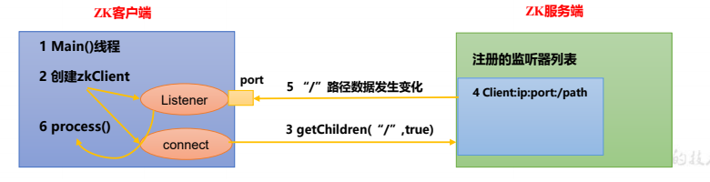

1. 监听原理详解
   1. 首先要有一个main线程
   2. 在main线程中创建Zookeeper客户端，这时就会创建两个线程，一个负责网络连接通信（connet），一个负责监听（listener）。
   3. 通过connect线程将注册的监听事件发送给Zookeeper。
   4. 在Zookeeper的注册监听器列表中将注册的监听事件添加到列表中。
   5. Zookeeper监听到有数据或路径变化，就会将这个消息发送给listener线程。
   6. listener线程内部调用了process()方法。
2. 常见的监听
   1. 监听节点数据的变化：`get path [watch]`
   2. 监听子节点增减的变化：`ls path [watch]`


1. 节点的值变化监听

   - 在 linux-copy4 主机上注册监听 /sanguo 节点数据变化

     ```bash
     [zk: localhost:2181(CONNECTED) 0] get -w /sanguo
     diaochan
     [zk: localhost:2181(CONNECTED) 1] 
     ```

   - 在 linux-copy3 主机上修改 /sanguo 节点的数据

     ```bash
     [zk: localhost:2181(CONNECTED) 6] set /sanguo "caomengde"
     ```

   - 观察 linux-copy4 主机收到数据变化的监听

     ```bash
     [zk: localhost:2181(CONNECTED) 1] 
     WATCHER::
     
     WatchedEvent state:SyncConnected type:NodeDataChanged path:/sanguo
     ```

   > 注意：在linux-copy3再多次修改 /sanguo 的值，linux-copy4上不会再收到监听。因为注册一次，只能监听一次。想再次监听，需要再次注册。

2. 节点的子节点变化监听（路径变化）

   - 在 linux-copy4 主机上注册监听 /sanguo 节点的子节点变化

     ```bash
     [zk: localhost:2181(CONNECTED) 1] ls -w /sanguo
     [shuguo, weiguo]
     [zk: localhost:2181(CONNECTED) 2] 
     ```

   - 在 linux-copy3 主机 /sanguo 节点上创建子节点

     ```bash
     [zk: localhost:2181(CONNECTED) 7] create /sanguo/jinguo "simayi"
     Created /sanguo/jinguo
     [zk: localhost:2181(CONNECTED) 8] 
     ```

   - 观察 linux-copy4 主机收到子节点变化的监听

     ```bash
     [zk: localhost:2181(CONNECTED) 2] 
     WATCHER::
     
     WatchedEvent state:SyncConnected type:NodeChildrenChanged path:/sanguo
     ```

   > 注意：节点的路径变化，也是注册一次，生效一次。想多次生效，就需要多次注册。


#### 2.5 节点删除与查看

1. 删除节点

   ```bash
   [zk: localhost:2181(CONNECTED) 2] delete /sanguo/jinguo
   [zk: localhost:2181(CONNECTED) 3] 
   ```

2. 递归删除节点

   ```bash
   [zk: localhost:2181(CONNECTED) 3] deleteall /sanguo/weiguo
   [zk: localhost:2181(CONNECTED) 4] 
   ```

3. 查看节点状态

   ```bash
   [zk: localhost:2181(CONNECTED) 0] stat /sanguo
   cZxid = 0x10000001c
   ctime = Sat Dec 17 20:00:48 CST 2022
   mZxid = 0x10000001c
   mtime = Sat Dec 17 20:00:48 CST 2022
   pZxid = 0x10000002f
   cversion = 9
   dataVersion = 0
   aclVersion = 0
   ephemeralOwner = 0x0
   dataLength = 8
   numChildren = 1
   [zk: localhost:2181(CONNECTED) 1] 
   ```


### 3 客户端API操作

前提：保证 linux-copy2、linux-copy3、linux-copy4 服务器上 Zookeeper 集群服务端启动。

#### 3.1 IDEA环境搭建

1. 创建一个Maven工程：zookeeper

2. pom文件添加依赖

   ```xml
   <dependencies>
     <dependency>
       <groupId>junit</groupId>
       <artifactId>junit</artifactId>
       <version>RELEASE</version>
     </dependency>
   
     <dependency>
       <groupId>org.apache.logging.log4j</groupId>
       <artifactId>log4j-core</artifactId>
       <version>2.8.2</version>
     </dependency>
   
     <dependency>
       <groupId>org.apache.zookeeper</groupId>
       <artifactId>zookeeper</artifactId>
       <version>3.5.7</version>
     </dependency>
   </dependencies>
   ```

3. 拷贝`log4j.properties`文件到项目根目录

   需要在项目的`src/main/resources`目录下，新建一个文件，命名为“`log4j.properties`”，在文件中填入。

   ```properties
   log4j.rootLogger=INFO, stdout
   log4j.appender.stdout=org.apache.log4j.ConsoleAppender
   log4j.appender.stdout.layout=org.apache.log4j.PatternLayout
   log4j.appender.stdout.layout.ConversionPattern=%d %p [%c] - %m%n
   log4j.appender.logfile=org.apache.log4j.FileAppender
   log4j.appender.logfile.File=target/spring.log
   log4j.appender.logfile.layout=org.apache.log4j.PatternLayout
   log4j.appender.logfile.layout.ConversionPattern=%d %p [%c] - %m%n
   ```

4. 创建包名com.shanhai.zk

5. 创建类名称zkClient


#### 3.2 创建ZooKeeper客户端

```java
// 注意：逗号左右不能有空格
private static String connectionString = "linux-copy2:2181,linux-copy3:2181,linux-copy4:2181";

private static Integer sessionTimeout = 2000;

ZooKeeper zkClient;

@Before
public void init() throws IOException {
    zkClient = new ZooKeeper(connectionString, sessionTimeout, new Watcher() {
        @Override
        public void process(WatchedEvent watchedEvent) {
            // 收到事件通知后的回调函数（用户的业务逻辑）
            try {
                System.out.println("======Watcher.process start======");
                // 再次启动监听
                List<String> children = zkClient.getChildren("/", true);
                children.forEach(System.out::println);
                System.out.println("======Watcher.process end======");
            } catch (KeeperException e) {
                throw new RuntimeException(e);
            } catch (InterruptedException e) {
                throw new RuntimeException(e);
            }
        }
    });
}
```


#### 3.3 创建子节点

```java
@Test
public void create() throws InterruptedException, KeeperException {
    // 参数 1：要创建的节点的路径
    // 参数 2：节点数据
    // 参数 3：节点权限
    // 参数 4：节点的类型
    String nodeCreated = zkClient.create("/shanhai", "xk.avi".getBytes(),
            ZooDefs.Ids.OPEN_ACL_UNSAFE, CreateMode.PERSISTENT);
    System.out.println("nodeCreated = " + nodeCreated);
}
```

测试：在 linux-copy2 的 zk 客户端上查看创建节点情况

```bash
[zk: localhost:2181(CONNECTED) 9] get -s /shanhai
xk.avi
cZxid = 0x100000056
ctime = Sat Dec 17 20:48:58 CST 2022
mZxid = 0x100000056
mtime = Sat Dec 17 20:48:58 CST 2022
pZxid = 0x100000056
cversion = 0
dataVersion = 0
aclVersion = 0
ephemeralOwner = 0x0
dataLength = 6
numChildren = 0
```


#### 3.4 获取子节点并监听节点变化

```java
@Test
public void getChildren() throws InterruptedException, KeeperException {
    System.out.println("======getChildren start======");
    List<String> children = zkClient.getChildren("/", true);
    children.forEach(System.out::println);
    System.out.println("======getChildren end======");
    
    // 延时堵塞
    Thread.sleep(Long.MAX_VALUE);
}
```

1. 在 IDEA 控制台上看到如下节点：

   ```
   ======getChildren start======
   shanhai
   zookeeper
   sanguo
   ======getChildren end======
   ```

2. 在 linux-copy2 的客户端上创建再创建一个节点 /shanhai1，观察 IDEA 控制台

   ```bash
   [zk: localhost:2181(CONNECTED) 11] create /shanhai1 "shanhai1"
   Created /shanhai1
   ```

3. 在 linux-copy2 的客户端上删除节点 /shanhai1，观察 IDEA 控制台

   ```bash
   [zk: localhost:2181(CONNECTED) 12] delete /shanhai1
   ```


#### 3.5 判断Znode是否存在

```java
@Test
public void exist() throws InterruptedException, KeeperException {
    Stat stat = zkClient.exists("/shanhai", false);
    System.out.println(stat == null ? "not exist" : "exist");
}
```


### 4 客户端向服务端写数据流程

- *写流程之写入请求直接发送给Leader节点*：

  

- *写流程之写入请求发送给follower节点*：

  


+++

## 四、服务器动态上下线监听案例

### 1 需求

某分布式系统中，主节点可以有多台，可以动态上下线，任意一台客户端都能实时感知到主节点服务器的上下线。


### 2 需求分析

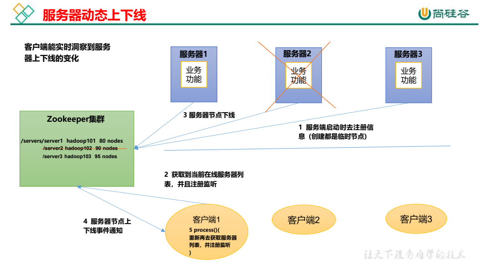


### 3 具体实现

1. 先在集群上创建 /servers 节点

   ```bash
   [zk: localhost:2181(CONNECTED) 18] create /servers "servers"
   Created /servers
   ```

2. 在 Idea 中创建包名：com.shanhai.zkcase1

3. 服务器端向 Zookeeper 注册代码

   ```java
   /**
    * @description: 服务器端代码
    * @author: xu
    * @date: 2022/12/17 21:06
    */
   public class DistributeServer {
       private static String connectString = "linux-copy2:2181,linux-copy3:2181,linux-copy4:2181";;
       private static int sessionTimeout = 2000;
   
       private ZooKeeper zkClient;
   
       public static void main(String[] args) throws IOException, InterruptedException, KeeperException {
           DistributeServer server = new DistributeServer();
   
           // 1.获取zk连接
           server.getConnect();
           
           // 2.注册服务器到zk集群
           server.regist(args[0]);
   
           // 3.启动业务逻辑（睡觉）
           server.business();
       }
       
       // 1.获取zk连接
       private void getConnect() throws IOException {
           zkClient = new ZooKeeper(connectString, sessionTimeout, new Watcher() {
               @Override
               public void process(WatchedEvent watchedEvent) {
   
               }
           });
       }
       
       // 2.注册服务器到zk集群
       private void regist(String hostname) throws InterruptedException, KeeperException {
           String create = zkClient.create("/servers/" + hostname, hostname.getBytes(),
                   ZooDefs.Ids.OPEN_ACL_UNSAFE, CreateMode.EPHEMERAL_SEQUENTIAL);
           System.out.println(hostname + " is online");
       }
   
       // 3.启动业务逻辑（睡觉）
       private void business() throws InterruptedException {
           Thread.sleep(Long.MAX_VALUE);
       }    
   }
   ```

4. 客户端代码

   ```java
   /**
    * @description: 客户端代码
    * @author: xu
    * @date: 2022/12/17 21:17
    */
   public class DistributeClient {
       private static String connectString = "linux-copy2:2181,linux-copy3:2181,linux-copy4:2181";;
       private static int sessionTimeout = 2000;
   
       private ZooKeeper zkClient;
   
       public static void main(String[] args) throws IOException, InterruptedException, KeeperException {
           DistributeClient client = new DistributeClient();
   
           // 1.获取zk连接
           client.getConnect();
   
           // 2.监听 /servers 下面子节点的添加和删除
           client.getServerList();
   
           // 3.业务逻辑（睡觉）
           client.business();
       }
       
       // 1.获取zk连接
       private void getConnect() throws IOException {
           zkClient = new ZooKeeper(connectString, sessionTimeout, new Watcher() {
               @Override
               public void process(WatchedEvent watchedEvent) {
                   try {
                       // 再次启动监听
                       getServerList();
                   } catch (InterruptedException e) {
                       throw new RuntimeException(e);
                   } catch (KeeperException e) {
                       throw new RuntimeException(e);
                   }
               }
           });
       }
   
       // 2.监听 /servers 下面子节点的添加和删除
       private void getServerList() throws InterruptedException, KeeperException {
           // 1 获取服务器子节点信息，并且对父节点进行监听
           List<String> children = zkClient.getChildren("/servers", true);
           
           // 2 存储服务器信息列表
           List<String> servers = new ArrayList<>();
           
           // 3 遍历所有节点，获取节点中的主机名称信息
           for (String child : children) {
               byte[] data = zkClient.getData("/servers/" + child, false, null);
               servers.add(new String(data));
           }
           // 4 打印服务器列表信息
           System.out.println("============client print servers start================");
           servers.forEach(System.out::println);
           System.out.println("============client print servers end================");
       }
       
       private void business() throws InterruptedException {
           Thread.sleep(Long.MAX_VALUE);
       }
   }
   ```


### 4 测试

1. 在 Linux 命令行上操作增加减少服务器

   - 启动 DistributeClient 客户端

   - 在 linux-copy2 上 zk 的客户端 /servers 目录上创建临时带序号节点

     ```bash
     [zk: localhost:2181(CONNECTED) 28] ls /servers
     []
     [zk: localhost:2181(CONNECTED) 29] create -e -s /servers/zk-101 "zk-101"
     Created /servers/zk-1010000000006
     [zk: localhost:2181(CONNECTED) 30] create -e -s /servers/zk-102 "zk-102"
     Created /servers/zk-1020000000007
     [zk: localhost:2181(CONNECTED) 31] create -e -s /servers/zk-103 "zk-103"
     Created /servers/zk-1030000000008
     [zk: localhost:2181(CONNECTED) 32] 
     ```

   - 观察 Idea 控制台变化

     ```bash
     ============client print servers end================
     ============client print servers end================
     ============client print servers start================
     zk-101
     ============client print servers end================
     ============client print servers start================
     zk-102
     zk-101
     ============client print servers end================
     ============client print servers start================
     zk-103
     zk-102
     zk-101
     ============client print servers end================
     ```

   - 执行删除操作

     ```bash
     [zk: localhost:2181(CONNECTED) 32] delete /servers/zk-1030000000008
     [zk: localhost:2181(CONNECTED) 33] delete /servers/zk-1020000000007
     [zk: localhost:2181(CONNECTED) 34] delete /servers/zk-1010000000006
     [zk: localhost:2181(CONNECTED) 35] 
     ```

   - 观察 Idea 控制台变化

     ```bash
     ============client print servers start================
     zk-103
     zk-102
     zk-101
     ============client print servers end================
     ============client print servers start================
     zk-102
     zk-101
     ============client print servers end================
     ============client print servers start================
     zk-101
     ============client print servers end================
     ============client print servers start================
     ============client print servers end================
     ```

2. 在 Idea 上操作增加减少服务器

   - 启动 DistributeClient 客户端（如果已经启动过，不需要重启）

   - 启动 DistributeServer 服务

     1. 点击 Edit Configurations…

        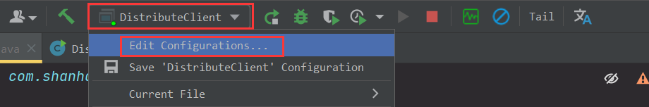

     2. 在弹出的窗口中（Program arguments）输入想启动的主机，例如，shanhai-102

        

     3. 回到DistributeServer的 main 方法，右键，在弹出的窗口中点击`Run
        “DistributeServer.main()”`；

     4. 观察 DistributeServer 控制台，提示：shanhai-102 is online

     5. 观察 DistributeClient 控制台，提示：

        ```bash
        ============client print servers start================
        shanhai-102
        ============client print servers end================
        ```

+++

## 五、ZooKeeper分布式锁案例

什么叫做分布式锁呢？

比如说"进程 1"在使用该资源的时候，会先去获得锁，"进程 1"获得锁以后会对该资源保持独占，这样其他进程就无法访问该资源，"进程 1"用完该资源以后就将锁释放掉，让其他进程来获得锁，那么通过这个锁机制，我们就能保证了分布式系统中多个进程能够有序的访问该临界资源。那么我们把这个分布式环境下的这个锁叫作分布式锁。


### 1 原生Zookeeper实现分布式锁案例

1. 分布式锁实现

   ```java
   public class DistributedLock {
   	// zookeeper server 列表
       private static String connectionString = "linux-copy2:2181,linux-copy3:2181,linux-copy4:2181";
       // 超时时间
       private static int sessionTimeout = 2000;
   
       private ZooKeeper zkClient;
   
       //ZooKeeper 连接
       private CountDownLatch connectLatch = new CountDownLatch(1);
       //ZooKeeper 节点等待
       private CountDownLatch waitLatch = new CountDownLatch(1);
   
       // 当前 client 等待的子节点
       private String waitPath;
   
       // 当前 client 创建的子节点
       private String currentMode;
   
       public DistributedLock() throws IOException, InterruptedException, KeeperException {
           // 获取连接
           zkClient = new ZooKeeper(connectionString, sessionTimeout, new Watcher() {
               @Override
               public void process(WatchedEvent watchedEvent) {
                   // connectLatch 如果连接上zk 可以释放
                   if (watchedEvent.getState() == Event.KeeperState.SyncConnected) {
                       connectLatch.countDown();
                   }
                   // waitLatch 需要释放
                   if (watchedEvent.getType() == Event.EventType.NodeDeleted
                           && watchedEvent.getPath().equals(waitPath)){
                       waitLatch.countDown();
                   }
               }
           });
           // 等待zk正常连接后，往下走程序
           connectLatch.await();
   
           // 判断根节点 /locks 是否存在
           Stat stat = zkClient.exists("/locks", false);
           if (stat == null) {
               // 创建 /locks 根节点
               zkClient.create("/locks", "locks".getBytes(),
                       ZooDefs.Ids.OPEN_ACL_UNSAFE, CreateMode.PERSISTENT);
           }
       }
   
       // 对zk加锁
       public void zkLock() {
           try {
               // 创建对应的临时带序号的节点 /locks/seq-0000000012
               currentMode = zkClient.create("/locks/seq-", null,
                       ZooDefs.Ids.OPEN_ACL_UNSAFE, CreateMode.EPHEMERAL_SEQUENTIAL);
   
               // 判断创建的节点是否是最小的序号节点，如果是获取到锁；
               // 如果不是，监听它序号的前一个节点
               // [ seq-0000000012 , seq-0000000013 ]
               List<String> children = zkClient.getChildren("/locks", false);
               // 如果 children 只有一个值，那就直接获取锁，如果有多个值，需要判断，谁最小
               if (children.size() == 1) {
                   return;
               } else {
                   Collections.sort(children);
                   // 获取节点名称
                   String thisNode = currentMode.substring("/locks/".length());
                   // 通过 seq-00000000 获取该节点在 children 集合中的位置
                   int index = children.indexOf(thisNode);
                   // 判断
                   if (index == -1) {
                       System.out.println("数据异常");
                   } else if (index == 0) {
                       // 第一个节点，可以获取到锁了
                       return;
                   } else {
                       // 需要监听 它前一个节点
                       waitPath = "/locks/" + children.get(index - 1);
                       zkClient.getData(waitPath, true, null);
                       // 等待监听
                       waitLatch.await();
                       return;
                   }
               }
           } catch (KeeperException e) {
               throw new RuntimeException(e);
           } catch (InterruptedException e) {
               throw new RuntimeException(e);
           }
       }
   
       // 解锁
       public void unZkLock() {
           try {
               // 删除节点
               zkClient.delete(currentMode, -1);
           } catch (InterruptedException e) {
               throw new RuntimeException(e);
           } catch (KeeperException e) {
               throw new RuntimeException(e);
           }
       }
   }
   ```

2. 分布式锁测试

   - 创建两个线程

     ```java
     public class DistributedLockTest {
         public static void main(String[] args) throws IOException, InterruptedException, KeeperException {
             DistributedLock lock1 = new DistributedLock();
             DistributedLock lock2 = new DistributedLock();
             new Thread(() -> {
                 try {
                     lock1.zkLock(); 
                     System.out.println("线程1 启动，获取到锁");
     
                     Thread.sleep(5000);
     
                     lock1.unZkLock();
                     System.out.println("线程1 释放锁");
                 } catch (InterruptedException e) {
                     throw new RuntimeException(e);
                 }
             }).start();
     
             new Thread(() -> {
                 try {
                     lock2.zkLock();
                     System.out.println("线程2 启动，获取到锁");
     
                     Thread.sleep(5000);
     
                     lock2.unZkLock();
                     System.out.println("线程2 释放锁");
                 } catch (InterruptedException e) {
                     throw new RuntimeException(e);
                 }
             }).start();
         }
     }
     ```

   - 观察控制台变化：

     ```
     线程2 启动，获取到锁
     线程2 释放锁
     线程1 启动，获取到锁
     线程1 释放锁
     ```


### 2 Curator框架实现分布式锁案例

- 原生的 Java API 开发存在的问题

  1. 会话连接是异步的，需要自己去处理。比如使用 CountDownLatch
  2. Watch 需要重复注册，不然就不能生效
  3. 开发的复杂性还是比较高的
  4. 不支持多节点删除和创建。需要自己去递归

- Curator 是一个专门解决分布式锁的框架，解决了原生 JavaAPI 开发分布式遇到的问题。

  详情请查看官方文档：https://curator.apache.org/index.html

- Curator 案例实操

  1. 添加依赖

     ```xml
     <dependency>
       <groupId>org.apache.curator</groupId>
       <artifactId>curator-framework</artifactId>
       <version>4.3.0</version>
     </dependency>
     <dependency>
       <groupId>org.apache.curator</groupId>
       <artifactId>curator-recipes</artifactId>
       <version>4.3.0</version>
     </dependency>
     <dependency>
       <groupId>org.apache.curator</groupId>
       <artifactId>curator-client</artifactId>
       <version>4.3.0</version>
     </dependency>
     ```

  2. 代码实现

     ```java
     public class CuratorLockTest {
         public static void main(String[] args) {
             // 创建分布式锁1
             InterProcessMutex lock1 = new InterProcessMutex(getCuratorFramework(), "/locks");
             // 创建分布式锁2
             InterProcessMutex lock2 = new InterProcessMutex(getCuratorFramework(), "/locks");
     
             new Thread(() -> {
                 try {
                     lock1.acquire();
                     System.out.println("线程1 获取到锁");
                     lock1.acquire();
                     System.out.println("线程1 再次获取到锁");
     
                     Thread.sleep(5000);
     
                     lock1.release();
                     System.out.println("线程1 释放锁");
                     lock1.release();
                     System.out.println("线程1 再次释放锁");
                 } catch (Exception e) {
                     throw new RuntimeException(e);
                 }
             }).start();
     
             new Thread(() -> {
                 try {
                     lock2.acquire();
                     System.out.println("线程2 获取到锁");
                     lock2.acquire();
                     System.out.println("线程2 再次获取到锁");
     
                     Thread.sleep(5000);
     
                     lock2.release();
                     System.out.println("线程2 释放锁");
                     lock2.release();
                     System.out.println("线程2 再次释放锁");
                 } catch (Exception e) {
                     throw new RuntimeException(e);
                 }
             }).start();
         }
     
         private static CuratorFramework getCuratorFramework() {
             ExponentialBackoffRetry policy =
                     new ExponentialBackoffRetry(3000, 3);
     
             CuratorFramework client = CuratorFrameworkFactory.builder()
                     .connectString("linux-copy2:2181,linux-copy3:2181,linux-copy4:2181")
                     .connectionTimeoutMs(2000)
                     .sessionTimeoutMs(2000)
                     .retryPolicy(policy)
                     .build();
             // 启动客户端
             client.start();
             System.out.println("zookeeper 启动成功");
             return client;
         }
     }
     ```

  3. 观察控制台变化：

     ```
     线程1 获取到锁
     线程1 再次获取到锁
     线程1 释放锁
     线程1 再次释放锁
     线程2 获取到锁
     线程2 再次获取到锁
     线程2 释放锁
     线程2 再次释放锁
     ```

+++

## 六、企业面试真题

### 1 选举机制

半数机制，超过半数的投票通过，即通过。

1. 第一次启动选举规则：
   - 投票过半数时，服务器 id 大的胜出
2. 第二次启动选举规则：
   - EPOCH 大的直接胜出
   - EPOCH 相同，事务 id 大的胜出
   - 事务 id 相同，服务器 id 大的胜出


### 2 生产集群安装多少 zk 合适？

安装奇数台。

生产经验：

- 10 台服务器：3 台 zk；
- 20 台服务器：5 台 zk；
- 100 台服务器：11 台 zk；
- 200 台服务器：11 台 zk

服务器台数多：好处，提高可靠性；坏处：提高通信延时


### 3 常用命令

| **命令基本语法** | **功能描述**                                                 |
| ---------------- | ------------------------------------------------------------ |
| help             | 显示所有操作命令                                             |
| ls path          | 使用 ls 命令来查看当前 znode 的子节点[可监听]<br/>-w 监听子节点变化<br/>-s 附加次级信息 |
| create           | 普通创建<br/>-s 含有序列<br/>-e 临时（重启或者超时消失）     |
| get path         | 获得节点的值 [可监听]<br/>-w 监听节点内容变化<br/>-s 附加次级信息 |
| set              | 设置节点的具体值                                             |
| stat             | 查看节点状态                                                 |
| delete           | 删除节点                                                     |
| deleteall        | 递归删除节点                                                 |

+++

## 七、算法基础

思考：**Zookeeper 是如何保证数据一致性的**？这也是困扰分布式系统框架的一个难题。

### 1 拜占庭将军问题

描述：拜占庭将军问题是一个协议问题，拜占庭帝国军队的将军们必须全体一致的决定是否攻击某一支敌军。问题是这些将军在地理上是分隔开来的，并且将军中存在叛徒。叛徒可以任意行动以达到以下目标：*欺骗某些将军采取进攻行动*；*促成一个不是所有将军都同意的决定*，*如当将军们不希望进攻时促成进攻行动*；*或者迷惑某些将军，使他们无法做出决定*。如果叛徒达到了这些目的之一，则任何攻击行动的结果都是注定要失败的，只有完全达成一致的努力才能获得胜利。

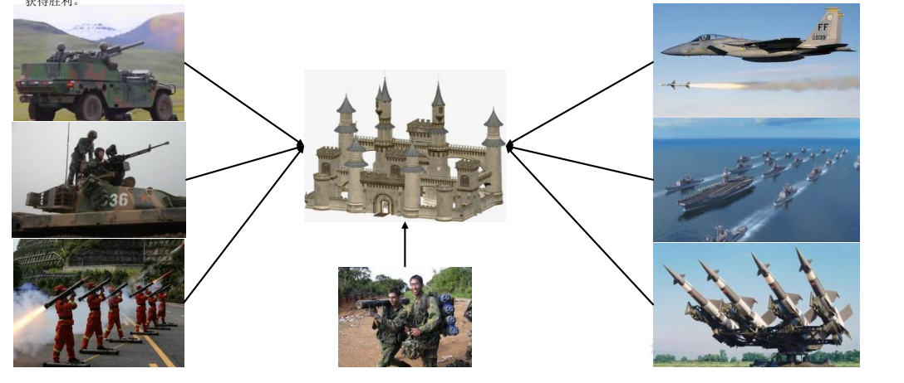


### 2 Paxos算法

> Paxos算法 —— 解决什么问题

- *Paxos算法*：一种基于消息传递且具有高度容错特性的**一致性算法**。
- *Paxos算法解决的问题*：就是如何快速正确的在一个分布式系统中对某个数据值达成一致，并且保证不论发生任何异常，都不会破坏整个系统的一致性。

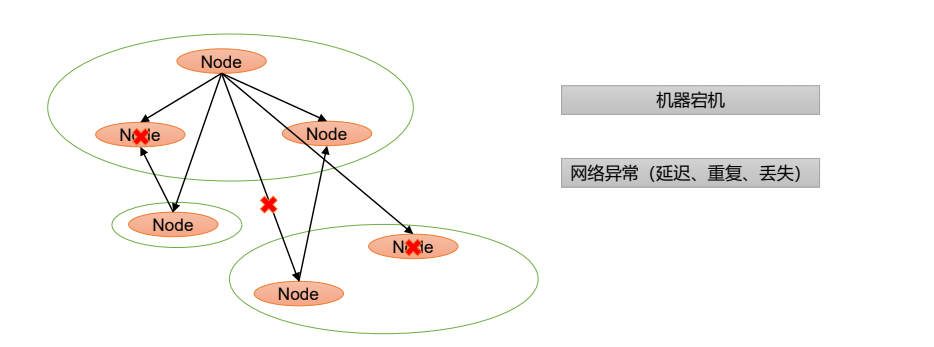

> Paxos算法描述：

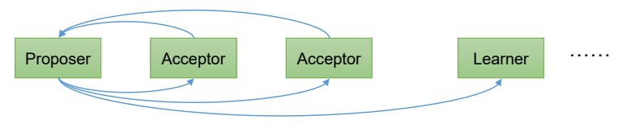

- 在一个Paxos系统中，首先将所有节点划分为Proposer（提议者），Acceptor（接受者），和 Learner（学习者）。（注意：每个节点都可以身兼数职）。
- 一个完整的Paxos算法流程分为三个阶段：
  1. Prepare准备阶段
     - Proposer向多个Acceptor发出Propose请求
     - Acceptor针对收到的Propose请求进行Promise（承诺）
  2. Accept接受阶段
     - Proposer收到多数Acceptor承诺的Promise后，向Acceptor发出Propose请求
     - Acceptor针对收到的Propose请求进行Accept处理
  3. Learn学习阶段：Proposer将形成的决议发送给所有Learners

> Paxos算法流程：

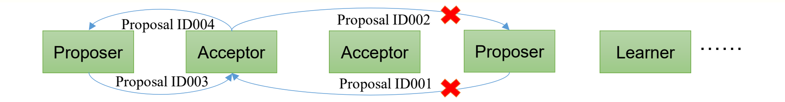

1. Prepare：Proposer生成全局唯一且递增的Proposal ID，向所有Acceptor发送Propose请求，这里无需携带提案内容，只携带Proposal ID即可。
2. Promise：Acceptor收到Propose请求后，做出“两个承诺，一个应答”。
   - 不再接受Proposal ID小于等于（注意：这里是<= ）当前请求的Propose请求。
   - 不再接受Proposal ID小于（注意：这里是< ）当前请求的Accept请求。
   - 不违背以前做出的承诺下，回复已经Accept过的提案中Proposal ID最大的那个提案的Value和Proposal ID，没有则返回空值。
3. Propose：Proposer收到多数Acceptor的Promise应答后，从应答中选择Proposal ID最大的提案的Value，作为本次要发起的提案。如果所有应答的提案Value均为空值，则可以自己随意决定提案Value。然后携带当前Proposal ID，向所有Acceptor发送 Propose请求。
4. Accept：Acceptor收到Propose请求后，在不违背自己之前做出的承诺下，接受并持久化当前Proposal ID和提案Value。
5. Learn：Proposer收到多数Acceptor的Accept后，决议形成，将形成的决议发送给所有Learner。


下面我们针对上述描述做三种情况的推演举例：为了简化流程，我们这里不设置 Learner。

> 情况一：

- 有A1, A2, A3, A4, A5 5位议员，就税率问题进行决议。

  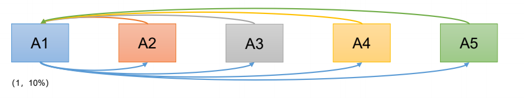

- A1发起1号Proposal的Propose，等待Promise承诺；

- A2-A5回应Promise；

- A1在收到两份回复时就会发起税率10%的Proposal；

- A2-A5回应Accept；

- 通过Proposal，税率10%。

> 情况二：

- 现在我们假设在A1提出提案的同时, A5决定将税率定为20%

  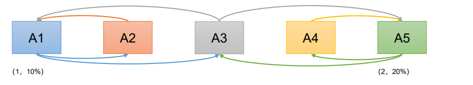

- A1，A5同时发起Propose（序号分别为1，2）

- A2承诺A1，A4承诺A5，A3行为成为关键

- 情况1：A3先收到A1消息，承诺A1。

- A1发起Proposal（1，10%），A2，A3接受。

- 之后A3又收到A5消息，回复A1：（1，10%），并承诺A5。

- A5发起Proposal（2，20%），A3，A4接受。之后A1，A5同时广播决议。

Paxos 算法缺陷：在网络复杂的情况下，一个应用 Paxos 算法的分布式系统，可能很久无法收敛，甚至陷入活锁的情况。

> 情况三：

- 现在我们假设在A1提出提案的同时, A5决定将税率定为20%

  

- A1，A5同时发起Propose（序号分别为1，2）

- A2承诺A1，A4承诺A5，A3行为成为关键

- 情况2：A3先收到A1消息，承诺A1。之后立刻收到A5消息，承诺A5。

- A1发起Proposal（1，10%），无足够响应，A1重新Propose（序号3），A3再次承诺A1。

- A5发起Proposal（2，20%），无足够相应。A5重新Propose （序号4），A3再次承诺A5。

- ……

造成这种情况的原因是系统中有一个以上的 Proposer，多个 Proposers 相互争夺 Acceptor，造成迟迟无法达成一致的情况。**针对这种情况，一种改进的 Paxos 算法被提出：从系统中选出一个节点作为 Leader，只有 Leader 能够发起提案**。这样，一次 Paxos 流程中只有一个 Proposer，不会出现活锁的情况，此时只会出现例子中第一种情况。


### 3 ZAB协议

#### 3.1 什么是ZAB算法

Zab借鉴了Paxos算法，是特别为 Zookeeper 设计的支持崩溃恢复的原子广播协议。基于该协议，Zookeeper设计为只有一台客户端（Leader）负责处理外部的写事务请求，然后Leader客户端将数据同步到其他Follower节点。即Zookeeper只有一个Leader可以发起提案。


#### 3.2 Zab协议内容

Zab 协议包括两种基本的模式：*消息广播*、*崩溃恢复*。

> 消息广播


1. 客户端发起一个写操作请求。
2. Leader服务器将客户端的请求转化为事务Proposal 提案，同时为每个Proposal 分配一个全局的ID，即zxid。
3. Leader服务器为每个Follower服务器分配一个单独的队列，然后将需要广播的Proposal依次放到队列中去，并且根据FIFO策略进行消息发送。
4. Follower接收到Proposal后，会首先将其以事务日志的方式写入本地磁盘中，写入成功后向Leader反馈一个Ack响应消息。
5. Leader接收到超过半数以上Follower的Ack响应消息后，即认为消息发送成功，可以发送commit消息。
6. Leader向所有Follower广播commit消息，同时自身也会完成事务提交。Follower 接收到commit消息后，会将上一条事务提交。
7. Zookeeper采用Zab协议的核心，就是只要有一台服务器提交了Proposal，就要确保所有的服务器最终都能正确提交Proposal。

ZAB协议针对事务请求的处理过程类似于一个两阶段提交过程

- 广播事务阶段 proposal -> ack
- 广播提交操作 commit

这两阶段提交模型如下，有可能因为Leader宕机带来数据不一致，比如：

- Leader发起一个事务Proposal1后就宕机，Follower都没有Proposal1
- Leader收到半数ACK宕机，没来得及向Follower发送Commit

怎么解决呢？ZAB引入了崩溃恢复模式。


> 崩溃恢复 ———— 异常假设

一旦Leader服务器出现崩溃或者由于网络原因导致Leader服务器失去了与过半Follower的联系，那么就会进入**崩溃恢复模式**。

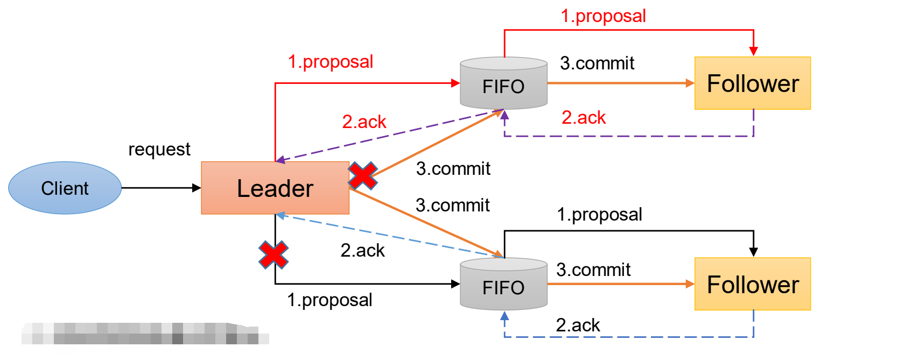

1. 假设两种服务器异常情况：
   1. 假设一个事务在Leader提出之后，Leader挂了。
   2. 一个事务在Leader上提交了，并且过半的Follower都响应Ack了，但是Leader在Commit消息发出之前挂了。
2. Zab协议崩溃恢复要求满足以下两个要求：
   1. 确保已经被Leader提交的提案Proposal，必须最终被所有的Follower服务器提交。（*已经产生的提案，Follower必须执行*）
   2. 确保**丢弃**已经被Leader提出的，但是没有被提交的Proposal。（*丢弃胎死腹中的提案*）


崩溃恢复主要包括两部分：*Leader选举*和*数据恢复*。

> 崩溃恢复 ———— Leader选举


Leader选举：根据上述要求，Zab协议需要保证选举出来的Leader需要满足以下条件：

1. 新选举出来的Leader不能包含未提交的Proposal。*即新Leader必须都是已经提交了Proposal的Follower服务器节点*。
2. *新选举的Leader节点中含有最大的zxid*。这样做的好处是可以避免Leader服务器检查Proposal的提交和丢弃工作。


> 崩溃恢复 ———— 数据恢复


**Zab如何数据同步**：

1. 完成Leader选举后，在正式开始工作之前（接收事务请求，然后提出新的Proposal），*Leader服务器会首先确认事务日志中的所有的 Proposal 是否已经被集群中过半的服务器Commit*。
2. Leader服务器需要确保所有的Follower服务器能够接收到每一条事务的Proposal，并且能将所有已经提交的事务Proposal 应用到内存数据中。*等到Follower将所有尚未同步的事务Proposal都从Leader服务器上同步过，并且应用到内存数据中以后，Leader才会把该Follower加入到真正可用的Follower列表中*。


### 4 CAP理论

CAP理论告诉我们，一个分布式系统不可能同时满足以下三种：

1. 一致性（C:Consistency）
2. 可用性（A:Available）
3. 分区容错性（P:Partition Tolerance）

这三个基本需求，最多只能同时满足其中的两项，因为P是必须的，因此往往选择就在CP或者AP中。

1. 一致性（C:Consistency）

   在分布式环境中，一致性是指*数据在多个副本之间是否能够保持数据一致的特性*。在一致性的需求下，当一个系统在数据一致的状态下执行更新操作后，应该保证系统的数据仍然处于一致的状态。

2. 可用性（A:Available）

   可用性是指*系统提供的服务必须一直处于可用的状态*，对于用户的每一个操作请求总是能够在*有限的时间内返回结果*。

3. 分区容错性（P:Partition Tolerance）

   *分布式系统在遇到任何网络分区故障的时候，仍然需要能够保证对外提供满足一致性和可用性的服务*，除非是整个网络环境都发生了故障。

> ZooKeeper保证的是CP

1. ZooKeeper不能保证每次服务请求的可用性。（注：在极端环境下，ZooKeeper可能会丢弃一些请求，消费者程序需要重新请求才能获得结果）。所以说，ZooKeeper不能保证服务可用性。
2. 进行Leader选举时集群都是不可用。

+++

## 八、源码解析

### 1 辅助源码

#### 1.1 持久化源码

Leader 和 Follower 中的数据会在**内存**和**磁盘**中各保存一份。所以需要将内存中的数据持久化到磁盘中。

在`org.apache.zookeeper.server.persistence`包下的相关类都是序列化相关的代码。


1. 快照

   ```java
   package org.apache.zookeeper.server.persistence;
   import java.io.File;
   import java.io.IOException;
   import java.util.Map;
   
   import org.apache.zookeeper.server.DataTree;
   
   public interface SnapShot {
       // 反序列化方法
       long deserialize(DataTree dt, Map<Long, Integer> sessions) 
           throws IOException;
       
       // 序列化方法
       void serialize(DataTree dt, Map<Long, Integer> sessions, 
               File name) 
           throws IOException;
       
       /**
        * find the most recent snapshot file
        * 查找最近的快照文件
        * @return the most recent snapshot file
        * @throws IOException
        */
       File findMostRecentSnapshot() throws IOException;
       
       // 释放资源
       void close() throws IOException;
   } 
   ```

2. 操作日志

   ```java
   package org.apache.zookeeper.server.persistence;
   
   import java.io.IOException;
   
   import org.apache.jute.Record;
   import org.apache.zookeeper.server.ServerStats;
   import org.apache.zookeeper.txn.TxnHeader;
   
   public interface TxnLog {
   
       // 设置服务状态
       void setServerStats(ServerStats serverStats);
       
       // 滚动日志
       void rollLog() throws IOException;
       
       // 追加
       boolean append(TxnHeader hdr, Record r) throws IOException;
   
       // 读取数据
       TxnIterator read(long zxid) throws IOException;
       
       // 获取最后一个 zxid
       long getLastLoggedZxid() throws IOException;
       
       // 删除日志
       boolean truncate(long zxid) throws IOException;
       
       // 获取 DbId
       long getDbId() throws IOException;
       
       // 提交
       void commit() throws IOException;
   
       // 日志同步时间
       long getTxnLogSyncElapsedTime();
      
       // 关闭日志
       void close() throws IOException;
       
       // 读取日志的接口
       public interface TxnIterator {
           // 获取头信息
           TxnHeader getHeader();
           
           // 获取传输的内容
           Record getTxn();
        
           // 下一条记录
           boolean next() throws IOException;
           
           // 关闭资源
           void close() throws IOException;
           
           // 获取存储的大小
           long getStorageSize() throws IOException;
       }
   }
   ```

3. 处理持久化的核心类

   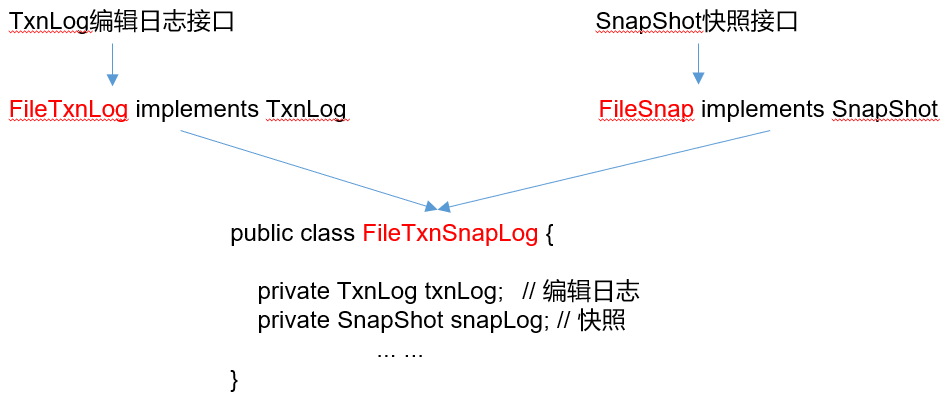

#### 1.2 序列化源码

zookeeper-jute 代码是关于 Zookeeper 序列化相关源码


1. 序列化和反序列化方法

   ```java
   package org.apache.jute;
   
   import org.apache.yetus.audience.InterfaceAudience;
   
   import java.io.IOException;
   
   @InterfaceAudience.Public
   public interface Record {
       // 序列化方法
       public void serialize(OutputArchive archive, String tag)
           throws IOException;
       
       // 反序列化方法
       public void deserialize(InputArchive archive, String tag)
           throws IOException;
   }
   ```

2. 迭代

   ```java
   package org.apache.jute;
   
   /**
    * Interface that acts as an iterator for deserializing maps.
    * The deserializer returns an instance that the record uses to
    * read vectors and maps. An example of usage is as follows:
    *
    * <code>
    * Index idx = startVector(...);
    * while (!idx.done()) {
    *   .... // read element of a vector
    *   idx.incr();
    * }
    * </code>
    *
    */
   public interface Index {
       // 结束
       public boolean done();
       // 下一个
       public void incr();
   }
   ```

3. 序列化支持的数据类型

   ```java
   package org.apache.jute;
   
   import java.io.IOException;
   import java.util.List;
   import java.util.TreeMap;
   
   /**
    * Interface that alll the serializers have to implement.
    *
    */
   public interface OutputArchive {
       public void writeByte(byte b, String tag) throws IOException;
       public void writeBool(boolean b, String tag) throws IOException;
       public void writeInt(int i, String tag) throws IOException;
       public void writeLong(long l, String tag) throws IOException;
       public void writeFloat(float f, String tag) throws IOException;
       public void writeDouble(double d, String tag) throws IOException;
       public void writeString(String s, String tag) throws IOException;
       public void writeBuffer(byte buf[], String tag) throws IOException;
       public void writeRecord(Record r, String tag) throws IOException;
       public void startRecord(Record r, String tag) throws IOException;
       public void endRecord(Record r, String tag) throws IOException;
       public void startVector(List<?> v, String tag) throws IOException;
       public void endVector(List<?> v, String tag) throws IOException;
       public void startMap(TreeMap<?,?> v, String tag) throws IOException;
       public void endMap(TreeMap<?,?> v, String tag) throws IOException;
   }
   ```

4. 反序列化支持的数据类型

   ```java
   package org.apache.jute;
   
   import java.io.IOException;
   
   /**
    * Interface that all the Deserializers have to implement.
    *
    */
   public interface InputArchive {
       public byte readByte(String tag) throws IOException;
       public boolean readBool(String tag) throws IOException;
       public int readInt(String tag) throws IOException;
       public long readLong(String tag) throws IOException;
       public float readFloat(String tag) throws IOException;
       public double readDouble(String tag) throws IOException;
       public String readString(String tag) throws IOException;
       public byte[] readBuffer(String tag) throws IOException;
       public void readRecord(Record r, String tag) throws IOException;
       public void startRecord(String tag) throws IOException;
       public void endRecord(String tag) throws IOException;
       public Index startVector(String tag) throws IOException;
       public void endVector(String tag) throws IOException;
       public Index startMap(String tag) throws IOException;
       public void endMap(String tag) throws IOException;
   }
   ```


### 2 ZK服务端初始化源码解析

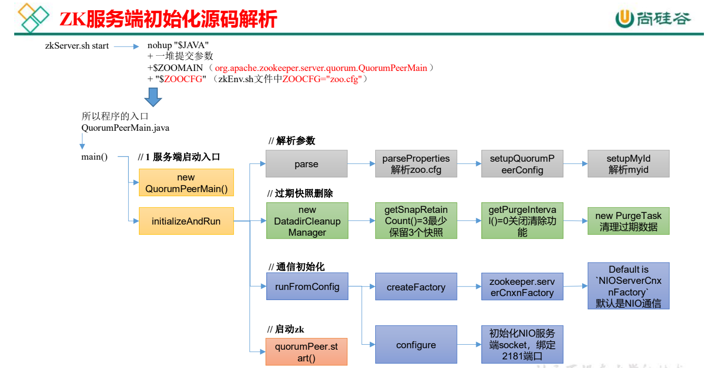

#### 2.1 ZK服务端启动脚本分析

1. Zookeeper 服务的启动命令是 zkServer.sh start

   ```bash
   #!/usr/bin/env bash
   
   # use POSTIX interface, symlink is followed automatically
   ZOOBIN="${BASH_SOURCE-$0}"
   ZOOBIN="$(dirname "${ZOOBIN}")"
   ZOOBINDIR="$(cd "${ZOOBIN}"; pwd)"
   
   if [ -e "$ZOOBIN/../libexec/zkEnv.sh" ]; then
     . "$ZOOBINDIR"/../libexec/zkEnv.sh
   else
     . "$ZOOBINDIR"/zkEnv.sh # 相当于获取 zkEnv.sh 中的环境变量（ZOOCFG="zoo.cfg"）
   fi
   
   # See the following page for extensive details on setting
   # up the JVM to accept JMX remote management:
   # http://java.sun.com/javase/6/docs/technotes/guides/management/agent.html
   # by default we allow local JMX connections
   if [ "x$JMXLOCALONLY" = "x" ]
   then
       JMXLOCALONLY=false
   fi
   
   if [ "x$JMXDISABLE" = "x" ] || [ "$JMXDISABLE" = 'false' ]
   then
     echo "ZooKeeper JMX enabled by default" >&2
     if [ "x$JMXPORT" = "x" ]
     then
       # for some reason these two options are necessary on jdk6 on Ubuntu
       #   accord to the docs they are not necessary, but otw jconsole cannot
       #   do a local attach
       ZOOMAIN="-Dcom.sun.management.jmxremote -Dcom.sun.management.jmxremote.local.only=$JMXLOCALONLY org.apache.zookeeper.server.quorum.QuorumPeerMain"
     else
       if [ "x$JMXAUTH" = "x" ]
       then
         JMXAUTH=false
       fi
       if [ "x$JMXSSL" = "x" ]
       then
         JMXSSL=false
       fi
       if [ "x$JMXLOG4J" = "x" ]
       then
         JMXLOG4J=true
       fi
       echo "ZooKeeper remote JMX Port set to $JMXPORT" >&2
       echo "ZooKeeper remote JMX authenticate set to $JMXAUTH" >&2
       echo "ZooKeeper remote JMX ssl set to $JMXSSL" >&2
       echo "ZooKeeper remote JMX log4j set to $JMXLOG4J" >&2
       ZOOMAIN="-Dcom.sun.management.jmxremote -Dcom.sun.management.jmxremote.port=$JMXPORT -Dcom.sun.management.jmxremote.authenticate=$JMXAUTH -Dcom.sun.management.jmxremote.ssl=$JMXSSL -Dzookeeper.jmx.log4j.disable=$JMXLOG4J org.apache.zookeeper.server.quorum.QuorumPeerMain"
     fi
   else
       echo "JMX disabled by user request" >&2
       ZOOMAIN="org.apache.zookeeper.server.quorum.QuorumPeerMain"
   fi
   
   if [ "x$SERVER_JVMFLAGS" != "x" ]
   then
       JVMFLAGS="$SERVER_JVMFLAGS $JVMFLAGS"
   fi
   
   if [ "x$2" != "x" ]
   then
       ZOOCFG="$ZOOCFGDIR/$2"
   fi
   
   # if we give a more complicated path to the config, don't screw around in $ZOOCFGDIR
   if [ "x$(dirname "$ZOOCFG")" != "x$ZOOCFGDIR" ]
   then
       ZOOCFG="$2"
   fi
   
   if $cygwin
   then
       ZOOCFG=`cygpath -wp "$ZOOCFG"`
       # cygwin has a "kill" in the shell itself, gets confused
       KILL=/bin/kill
   else
       KILL=kill
   fi
   
   echo "Using config: $ZOOCFG" >&2
   
   case "$OSTYPE" in
   *solaris*)
     GREP=/usr/xpg4/bin/grep
     ;;
   *)
     GREP=grep
     ;;
   esac
   ZOO_DATADIR="$($GREP "^[[:space:]]*dataDir" "$ZOOCFG" | sed -e 's/.*=//')"
   ZOO_DATADIR="$(echo -e "${ZOO_DATADIR}" | sed -e 's/^[[:space:]]*//' -e 's/[[:space:]]*$//')"
   ZOO_DATALOGDIR="$($GREP "^[[:space:]]*dataLogDir" "$ZOOCFG" | sed -e 's/.*=//')"
   
   # iff autocreate is turned off and the datadirs don't exist fail
   # immediately as we can't create the PID file, etc..., anyway.
   if [ -n "$ZOO_DATADIR_AUTOCREATE_DISABLE" ]; then
       if [ ! -d "$ZOO_DATADIR/version-2" ]; then
           echo "ZooKeeper data directory is missing at $ZOO_DATADIR fix the path or run initialize"
           exit 1
       fi
   
       if [ -n "$ZOO_DATALOGDIR" ] && [ ! -d "$ZOO_DATALOGDIR/version-2" ]; then
           echo "ZooKeeper txnlog directory is missing at $ZOO_DATALOGDIR fix the path or run initialize"
           exit 1
       fi
       ZOO_DATADIR_AUTOCREATE="-Dzookeeper.datadir.autocreate=false"
   fi
   
   if [ -z "$ZOOPIDFILE" ]; then
       if [ ! -d "$ZOO_DATADIR" ]; then
           mkdir -p "$ZOO_DATADIR"
       fi
       ZOOPIDFILE="$ZOO_DATADIR/zookeeper_server.pid"
   else
       # ensure it exists, otw stop will fail
       mkdir -p "$(dirname "$ZOOPIDFILE")"
   fi
   
   if [ ! -w "$ZOO_LOG_DIR" ] ; then
   mkdir -p "$ZOO_LOG_DIR"
   fi
   
   ZOO_LOG_FILE=zookeeper-$USER-server-$HOSTNAME.log
   _ZOO_DAEMON_OUT="$ZOO_LOG_DIR/zookeeper-$USER-server-$HOSTNAME.out"
   
   case $1 in
   start)
       echo  -n "Starting zookeeper ... "
       if [ -f "$ZOOPIDFILE" ]; then
         if kill -0 `cat "$ZOOPIDFILE"` > /dev/null 2>&1; then
            echo $command already running as process `cat "$ZOOPIDFILE"`.
            exit 1
         fi
       fi
       nohup "$JAVA" $ZOO_DATADIR_AUTOCREATE "-Dzookeeper.log.dir=${ZOO_LOG_DIR}" \
       "-Dzookeeper.log.file=${ZOO_LOG_FILE}" "-Dzookeeper.root.logger=${ZOO_LOG4J_PROP}" \
       -XX:+HeapDumpOnOutOfMemoryError -XX:OnOutOfMemoryError='kill -9 %p' \
       -cp "$CLASSPATH" $JVMFLAGS $ZOOMAIN "$ZOOCFG" > "$_ZOO_DAEMON_OUT" 2>&1 < /dev/null &
       if [ $? -eq 0 ]
       then
         case "$OSTYPE" in
         *solaris*)
           /bin/echo "${!}\\c" > "$ZOOPIDFILE"
           ;;
         *)
           /bin/echo -n $! > "$ZOOPIDFILE"
           ;;
         esac
         if [ $? -eq 0 ];
         then
           sleep 1
           pid=$(cat "${ZOOPIDFILE}")
           if ps -p "${pid}" > /dev/null 2>&1; then
             echo STARTED
           else
             echo FAILED TO START
             exit 1
           fi
         else
           echo FAILED TO WRITE PID
           exit 1
         fi
       else
         echo SERVER DID NOT START
         exit 1
       fi
       ;;
   start-foreground)
       ZOO_CMD=(exec "$JAVA")
       if [ "${ZOO_NOEXEC}" != "" ]; then
         ZOO_CMD=("$JAVA")
       fi
       "${ZOO_CMD[@]}" $ZOO_DATADIR_AUTOCREATE "-Dzookeeper.log.dir=${ZOO_LOG_DIR}" \
       "-Dzookeeper.log.file=${ZOO_LOG_FILE}" "-Dzookeeper.root.logger=${ZOO_LOG4J_PROP}" \
       -XX:+HeapDumpOnOutOfMemoryError -XX:OnOutOfMemoryError='kill -9 %p' \
       -cp "$CLASSPATH" $JVMFLAGS $ZOOMAIN "$ZOOCFG"
       ;;
   print-cmd)
       echo "\"$JAVA\" $ZOO_DATADIR_AUTOCREATE -Dzookeeper.log.dir=\"${ZOO_LOG_DIR}\" \
       -Dzookeeper.log.file=\"${ZOO_LOG_FILE}\" -Dzookeeper.root.logger=\"${ZOO_LOG4J_PROP}\" \
       -XX:+HeapDumpOnOutOfMemoryError -XX:OnOutOfMemoryError='kill -9 %p' \
       -cp \"$CLASSPATH\" $JVMFLAGS $ZOOMAIN \"$ZOOCFG\" > \"$_ZOO_DAEMON_OUT\" 2>&1 < /dev/null"
       ;;
   stop)
       echo -n "Stopping zookeeper ... "
       if [ ! -f "$ZOOPIDFILE" ]
       then
         echo "no zookeeper to stop (could not find file $ZOOPIDFILE)"
       else
         $KILL $(cat "$ZOOPIDFILE")
         rm "$ZOOPIDFILE"
         sleep 1
         echo STOPPED
       fi
       exit 0
       ;;
   restart)
       shift
       "$0" stop ${@}
       sleep 3
       "$0" start ${@}
       ;;
   status)
       # -q is necessary on some versions of linux where nc returns too quickly, and no stat result is output
       clientPortAddress=`$GREP "^[[:space:]]*clientPortAddress[^[:alpha:]]" "$ZOOCFG" | sed -e 's/.*=//'`
       if ! [ $clientPortAddress ]
       then
   	clientPortAddress="localhost"
       fi
       clientPort=`$GREP "^[[:space:]]*clientPort[^[:alpha:]]" "$ZOOCFG" | sed -e 's/.*=//'`
       if ! [[ "$clientPort"  =~ ^[0-9]+$ ]]
       then
          dataDir=`$GREP "^[[:space:]]*dataDir" "$ZOOCFG" | sed -e 's/.*=//'`
          myid=`cat "$dataDir/myid"`
          if ! [[ "$myid" =~ ^[0-9]+$ ]] ; then
            echo "clientPort not found and myid could not be determined. Terminating."
            exit 1
          fi
          clientPortAndAddress=`$GREP "^[[:space:]]*server.$myid=.*;.*" "$ZOOCFG" | sed -e 's/.*=//' | sed -e 's/.*;//'`
          if [ ! "$clientPortAndAddress" ] ; then
              echo "Client port not found in static config file. Looking in dynamic config file."
              dynamicConfigFile=`$GREP "^[[:space:]]*dynamicConfigFile" "$ZOOCFG" | sed -e 's/.*=//'`
              clientPortAndAddress=`$GREP "^[[:space:]]*server.$myid=.*;.*" "$dynamicConfigFile" | sed -e 's/.*=//' | sed -e 's/.*;//'`
          fi
          if [ ! "$clientPortAndAddress" ] ; then
             echo "Client port not found. Terminating."
             exit 1
          fi
          if [[ "$clientPortAndAddress" =~ ^.*:[0-9]+ ]] ; then
             clientPortAddress=`echo "$clientPortAndAddress" | sed -e 's/:.*//'`
          fi
          clientPort=`echo "$clientPortAndAddress" | sed -e 's/.*://'`
          if [ ! "$clientPort" ] ; then
             echo "Client port not found. Terminating."
             exit 1
          fi
       fi
       echo "Client port found: $clientPort. Client address: $clientPortAddress."
       STAT=`"$JAVA" "-Dzookeeper.log.dir=${ZOO_LOG_DIR}" "-Dzookeeper.root.logger=${ZOO_LOG4J_PROP}" "-Dzookeeper.log.file=${ZOO_LOG_FILE}" \
                -cp "$CLASSPATH" $JVMFLAGS org.apache.zookeeper.client.FourLetterWordMain \
                $clientPortAddress $clientPort srvr 2> /dev/null    \
             | $GREP Mode`
       if [ "x$STAT" = "x" ]
       then
           echo "Error contacting service. It is probably not running."
           exit 1
       else
           echo $STAT
           exit 0
       fi
       ;;
   *)
       echo "Usage: $0 [--config <conf-dir>] {start|start-foreground|stop|restart|status|print-cmd}" >&2
   
   esac
   ```

2. zkServer.sh start 底层的实际执行内容

   ```bash
   nohup "$JAVA" 
   + 一堆提交参数
   + $ZOOMAIN（org.apache.zookeeper.server.quorum.QuorumPeerMain）
   + "$ZOOCFG" （zkEnv.sh 文件中 ZOOCFG="zoo.cfg"）
   ```

3. 所以程序的入口是 `QuorumPeerMain.java` 类


#### 2.2 ZK服务端启动入口

1. 查找 QuorumPeerMain

   QuorumPeerMain.java

   ```java
   /**
    * To start the replicated server specify the configuration file name on
    * the command line.
    * @param args path to the configfile
    */
   public static void main(String[] args) {
       // 创建了一个 zk 节点
       QuorumPeerMain main = new QuorumPeerMain();
       try {
           // 初始化节点并运行，args 相当于提交参数中的 zoo.cfg
           main.initializeAndRun(args);
       } catch (IllegalArgumentException e) {
           ......
       }
       LOG.info("Exiting normally");
       System.exit(0);
   }
   ```

2. main.initializeAndRun(args)

   ```java
   protected void initializeAndRun(String[] args)
       throws ConfigException, IOException, AdminServerException {
       // 管理 zk 的配置信息
       QuorumPeerConfig config = new QuorumPeerConfig();
       if (args.length == 1) {
           // 1 解析参数，zoo.cfg 和 myid
           config.parse(args[0]);
       }
   
       // 2 启动定时任务，对过期的快照，执行删除（默认该功能关闭）
       // Start and schedule the the purge task
       DatadirCleanupManager purgeMgr = new DatadirCleanupManager(config
               .getDataDir(), config.getDataLogDir(), config
               .getSnapRetainCount(), config.getPurgeInterval());
       purgeMgr.start();
   
       if (args.length == 1 && config.isDistributed()) {
           // 3 启动集群
           runFromConfig(config);
       } else {
           LOG.warn("Either no config or no quorum defined in config, running "
                   + " in standalone mode");
           // there is only server in the quorum -- run as standalone
           ZooKeeperServerMain.main(args);
       }
   }
   ```


#### 2.3 解析参数zoo.cfg和myid

- QuorumPeerConfig.java

  ```java
  /**
   * Parse a ZooKeeper configuration file
   * @param path the patch of the configuration file
   * @throws ConfigException error processing configuration
   */
  public void parse(String path) throws ConfigException {
      LOG.info("Reading configuration from: " + path);
     
      try {
          // 校验文件路径及是否存在
          File configFile = (new VerifyingFileFactory.Builder(LOG)
              .warnForRelativePath()
              .failForNonExistingPath()
              .build()).create(path);
              
          Properties cfg = new Properties();
          FileInputStream in = new FileInputStream(configFile);
          try {
              // 加载配置文件
              cfg.load(in);
              configFileStr = path;
          } finally {
              in.close();
          }
          // 解析配置文件
          parseProperties(cfg);
      } catch (IOException e) {
          throw new ConfigException("Error processing " + path, e);
      } catch (IllegalArgumentException e) {
          throw new ConfigException("Error processing " + path, e);
      }   
      
      ......
  }
  ```

- parseProperties(cfg)

  ```java
  /**
   * Parse config from a Properties.
   * @param zkProp Properties to parse from.
   * @throws IOException
   * @throws ConfigException
   */
  public void parseProperties(Properties zkProp) throws IOException, ConfigException {
      int clientPort = 0;
      int secureClientPort = 0;
      String clientPortAddress = null;
      String secureClientPortAddress = null;
      VerifyingFileFactory vff = new VerifyingFileFactory.Builder(LOG).warnForRelativePath().build();
      
      // 读取 zoo.cfg 文件中的属性值，并赋值给 QuorumPeerConfig 的类对象
      for (Entry<Object, Object> entry : zkProp.entrySet()) {
          String key = entry.getKey().toString().trim();
          String value = entry.getValue().toString().trim();
          if (key.equals("dataDir")) {
              dataDir = vff.create(value);
          } else if (key.equals("dataLogDir")) {
              dataLogDir = vff.create(value);
          } else if (key.equals("clientPort")) {
              clientPort = Integer.parseInt(value);
          } else if (key.equals("localSessionsEnabled")) {
              localSessionsEnabled = Boolean.parseBoolean(value);
          } else if (key.equals("localSessionsUpgradingEnabled")) {
              localSessionsUpgradingEnabled = Boolean.parseBoolean(value);
          } else if (key.equals("clientPortAddress")) {
              clientPortAddress = value.trim();
          } else if (key.equals("secureClientPort")) {
              secureClientPort = Integer.parseInt(value);
          } else if (key.equals("secureClientPortAddress")){
              secureClientPortAddress = value.trim();
          } else if (key.equals("tickTime")) {
              tickTime = Integer.parseInt(value);
          } else if (key.equals("maxClientCnxns")) {
              maxClientCnxns = Integer.parseInt(value);
          } else if (key.equals("minSessionTimeout")) {
              minSessionTimeout = Integer.parseInt(value);
          } else if (key.equals("maxSessionTimeout")) {
              maxSessionTimeout = Integer.parseInt(value);
          }
          ......
      }
      // backward compatibility - dynamic configuration in the same file as
      // static configuration params see writeDynamicConfig()
      if (dynamicConfigFileStr == null) {
          setupQuorumPeerConfig(zkProp, true);
          if (isDistributed() && isReconfigEnabled()) {
              // we don't backup static config for standalone mode.
              // we also don't backup if reconfig feature is disabled.
              backupOldConfig();
          }
      }
  }
  ```

- setupQuorumPeerConfig(zkProp, true)

  ```java
  void setupQuorumPeerConfig(Properties prop, boolean configBackwardCompatibilityMode)
          throws IOException, ConfigException {
      quorumVerifier = parseDynamicConfig(prop, electionAlg, true, configBackwardCompatibilityMode);
      setupMyId();
      setupClientPort();
      setupPeerType();
      checkValidity();
  }
  ```

- QuorumPeerConfig.java

  ```java
  private void setupMyId() throws IOException {
      File myIdFile = new File(dataDir, "myid");
      // standalone server doesn't need myid file.
      if (!myIdFile.isFile()) {
          return;
      }
      BufferedReader br = new BufferedReader(new FileReader(myIdFile));
      String myIdString;
      try {
          myIdString = br.readLine();
      } finally {
          br.close();
      }
      try {
          // 将解析 myid 文件中的 id 赋值给 serverId
          serverId = Long.parseLong(myIdString);
          MDC.put("myid", myIdString);
      } catch (NumberFormatException e) {
          throw new IllegalArgumentException("serverid " + myIdString
                  + " is not a number");
      }
  }
  ```


#### 2.4 过期快照删除

可以启动定时任务，对过期的快照，执行删除。默认该功能时关闭的

- initializeAndRun

  ```java
  protected void initializeAndRun(String[] args)
      throws ConfigException, IOException, AdminServerException {
      // 管理 zk 的配置信息
      QuorumPeerConfig config = new QuorumPeerConfig();
      if (args.length == 1) {
          // 1 解析参数，zoo.cfg 和 myid
          config.parse(args[0]);
      }
  
      // 2 启动定时任务，对过期的快照，执行删除（默认该功能关闭）
      // Start and schedule the the purge task
      DatadirCleanupManager purgeMgr = new DatadirCleanupManager(config
              .getDataDir(), config.getDataLogDir(), config
              .getSnapRetainCount(), config.getPurgeInterval());
      purgeMgr.start();
  
      if (args.length == 1 && config.isDistributed()) {
          // 3 启动集群
          runFromConfig(config);
      } else {
          LOG.warn("Either no config or no quorum defined in config, running "
                  + " in standalone mode");
          // there is only server in the quorum -- run as standalone
          ZooKeeperServerMain.main(args);
      }
  }
  
  protected int snapRetainCount = 3;
  protected int purgeInterval = 0;
  ```

- purgeMgr.start();

  ```java
  public void start() {
      if (PurgeTaskStatus.STARTED == purgeTaskStatus) {
          LOG.warn("Purge task is already running.");
          return;
      }
      
      // 默认情况 purgeInterval=0，该任务关闭，直接返回
      // Don't schedule the purge task with zero or negative purge interval.
      if (purgeInterval <= 0) {
          LOG.info("Purge task is not scheduled.");
          return;
      }
  	// 创建一个定时器
      timer = new Timer("PurgeTask", true);
      // 创建一个清理快照任务
      TimerTask task = new PurgeTask(dataLogDir, snapDir, snapRetainCount);
      // 如果 purgeInterval 设置的值是 1，表示 1 小时检查一次，判断是否有过期快照，有则删除
      timer.scheduleAtFixedRate(task, 0, TimeUnit.HOURS.toMillis(purgeInterval));
  
      purgeTaskStatus = PurgeTaskStatus.STARTED;
  }
  ```

- PurgeTask

  ```java
  static class PurgeTask extends TimerTask {
      private File logsDir;
      private File snapsDir;
      private int snapRetainCount;
  
      public PurgeTask(File dataDir, File snapDir, int count) {
          logsDir = dataDir;
          snapsDir = snapDir;
          snapRetainCount = count;
      }
  
      @Override
      public void run() {
          LOG.info("Purge task started.");
          try {
              // 清理过期的数据
              PurgeTxnLog.purge(logsDir, snapsDir, snapRetainCount);
          } catch (Exception e) {
              LOG.error("Error occurred while purging.", e);
          }
          LOG.info("Purge task completed.");
      }
  }
  ```

- PurgeTxnLog.purge(logsDir, snapsDir, snapRetainCount);

  ```java
  public static void purge(File dataDir, File snapDir, int num) throws IOException {
      if (num < 3) {
          throw new IllegalArgumentException(COUNT_ERR_MSG);
      }
  
      FileTxnSnapLog txnLog = new FileTxnSnapLog(dataDir, snapDir);
  
      List<File> snaps = txnLog.findNRecentSnapshots(num);
      int numSnaps = snaps.size();
      if (numSnaps > 0) {
          purgeOlderSnapshots(txnLog, snaps.get(numSnaps - 1));
      }
  }
  ```


#### 2.5 初始化通信组件

- initializeAndRun

  ```java
  protected void initializeAndRun(String[] args)
      throws ConfigException, IOException, AdminServerException {
      // 管理 zk 的配置信息
      QuorumPeerConfig config = new QuorumPeerConfig();
      if (args.length == 1) {
          // 1 解析参数，zoo.cfg 和 myid
          config.parse(args[0]);
      }
  
      // 2 启动定时任务，对过期的快照，执行删除（默认该功能关闭）
      // Start and schedule the the purge task
      DatadirCleanupManager purgeMgr = new DatadirCleanupManager(config
              .getDataDir(), config.getDataLogDir(), config
              .getSnapRetainCount(), config.getPurgeInterval());
      purgeMgr.start();
  
      if (args.length == 1 && config.isDistributed()) {
          // 3 启动集群
          runFromConfig(config);
      } else {
          LOG.warn("Either no config or no quorum defined in config, running "
                  + " in standalone mode");
          // there is only server in the quorum -- run as standalone
          ZooKeeperServerMain.main(args);
      }
  }
  ```

- 通信协议默认 NIO（可以支持 Netty）

  runFromConfig(config);

  ```java
  public void runFromConfig(QuorumPeerConfig config)
          throws IOException, AdminServerException
  {
    try {
        ManagedUtil.registerLog4jMBeans();
    } catch (JMException e) {
        LOG.warn("Unable to register log4j JMX control", e);
    }
  
    LOG.info("Starting quorum peer");
    try {
        ServerCnxnFactory cnxnFactory = null;
        ServerCnxnFactory secureCnxnFactory = null;
  
        // 通信组件初始化，默认是 NIO 通信
        if (config.getClientPortAddress() != null) {
            cnxnFactory = ServerCnxnFactory.createFactory();
            cnxnFactory.configure(config.getClientPortAddress(),
                    config.getMaxClientCnxns(),
                    false);
        }
  
        if (config.getSecureClientPortAddress() != null) {
            secureCnxnFactory = ServerCnxnFactory.createFactory();
            secureCnxnFactory.configure(config.getSecureClientPortAddress(),
                    config.getMaxClientCnxns(),
                    true);
        }
  
        // 把解析的参数赋值给该 zookeeper 节点
        quorumPeer = getQuorumPeer();
        quorumPeer.setTxnFactory(new FileTxnSnapLog(
                    config.getDataLogDir(),
                    config.getDataDir()));
        quorumPeer.enableLocalSessions(config.areLocalSessionsEnabled());
        quorumPeer.enableLocalSessionsUpgrading(
            config.isLocalSessionsUpgradingEnabled());
        //quorumPeer.setQuorumPeers(config.getAllMembers());
        quorumPeer.setElectionType(config.getElectionAlg());
        quorumPeer.setMyid(config.getServerId());
        quorumPeer.setTickTime(config.getTickTime());
        quorumPeer.setMinSessionTimeout(config.getMinSessionTimeout());
        quorumPeer.setMaxSessionTimeout(config.getMaxSessionTimeout());
        quorumPeer.setInitLimit(config.getInitLimit());
        quorumPeer.setSyncLimit(config.getSyncLimit());
        quorumPeer.setConfigFileName(config.getConfigFilename());
        // 管理 zk 数据的存储
        quorumPeer.setZKDatabase(new ZKDatabase(quorumPeer.getTxnFactory()));
        quorumPeer.setQuorumVerifier(config.getQuorumVerifier(), false);
        if (config.getLastSeenQuorumVerifier()!=null) {
            quorumPeer.setLastSeenQuorumVerifier(config.getLastSeenQuorumVerifier(), false);
        }
        quorumPeer.initConfigInZKDatabase();
        // 管理 zk 的通信
        quorumPeer.setCnxnFactory(cnxnFactory);
        quorumPeer.setSecureCnxnFactory(secureCnxnFactory);
        quorumPeer.setSslQuorum(config.isSslQuorum());
        quorumPeer.setUsePortUnification(config.shouldUsePortUnification());
        quorumPeer.setLearnerType(config.getPeerType());
        quorumPeer.setSyncEnabled(config.getSyncEnabled());
        quorumPeer.setQuorumListenOnAllIPs(config.getQuorumListenOnAllIPs());
        if (config.sslQuorumReloadCertFiles) {
            quorumPeer.getX509Util().enableCertFileReloading();
        }
  
        // sets quorum sasl authentication configurations
        quorumPeer.setQuorumSaslEnabled(config.quorumEnableSasl);
        if(quorumPeer.isQuorumSaslAuthEnabled()){
            quorumPeer.setQuorumServerSaslRequired(config.quorumServerRequireSasl);
            quorumPeer.setQuorumLearnerSaslRequired(config.quorumLearnerRequireSasl);
            quorumPeer.setQuorumServicePrincipal(config.quorumServicePrincipal);
            quorumPeer.setQuorumServerLoginContext(config.quorumServerLoginContext);
            quorumPeer.setQuorumLearnerLoginContext(config.quorumLearnerLoginContext);
        }
        quorumPeer.setQuorumCnxnThreadsSize(config.quorumCnxnThreadsSize);
        quorumPeer.initialize();
        
        // 启动 zk
        quorumPeer.start();
        quorumPeer.join();
    } catch (InterruptedException e) {
        // warn, but generally this is ok
        LOG.warn("Quorum Peer interrupted", e);
    }
  }
  ```

  ServerCnxnFactory.createFactory();

  ```java
  static public ServerCnxnFactory createFactory() throws IOException {
      String serverCnxnFactoryName =
          System.getProperty(ZOOKEEPER_SERVER_CNXN_FACTORY);
      if (serverCnxnFactoryName == null) {
          serverCnxnFactoryName = NIOServerCnxnFactory.class.getName();
      }
      try {
          ServerCnxnFactory serverCnxnFactory = (ServerCnxnFactory) Class.forName(serverCnxnFactoryName)
                  .getDeclaredConstructor().newInstance();
          LOG.info("Using {} as server connection factory", serverCnxnFactoryName);
          return serverCnxnFactory;
      } catch (Exception e) {
          IOException ioe = new IOException("Couldn't instantiate "
                  + serverCnxnFactoryName);
          ioe.initCause(e);
          throw ioe;
      }
  }
  
  public static final String ZOOKEEPER_SERVER_CNXN_FACTORY = "zookeeper.serverCnxnFactory";
  /*
  zookeeperAdmin.md 文件中
  
  * *serverCnxnFactory* :
  (Java system property: **zookeeper.serverCnxnFactory**)
  Specifies ServerCnxnFactory implementation. 
   This should be set to `NettyServerCnxnFactory` in order to use TLS based server communication.
  Default is `NIOServerCnxnFactory`.
  */
  ```

- 初始化 NIO 服务端 Socket（并未启动）

  查找 configure 实现类，NIOServerCnxnFactory.java

  ```java
  @Override
  public void configure(InetSocketAddress addr, int maxcc, boolean secure) throws IOException {
      if (secure) {
          throw new UnsupportedOperationException("SSL isn't supported in NIOServerCnxn");
      }
      configureSaslLogin();
  
      maxClientCnxns = maxcc;
      sessionlessCnxnTimeout = Integer.getInteger(
          ZOOKEEPER_NIO_SESSIONLESS_CNXN_TIMEOUT, 10000);
      // We also use the sessionlessCnxnTimeout as expiring interval for
      // cnxnExpiryQueue. These don't need to be the same, but the expiring
      // interval passed into the ExpiryQueue() constructor below should be
      // less than or equal to the timeout.
      cnxnExpiryQueue =
          new ExpiryQueue<NIOServerCnxn>(sessionlessCnxnTimeout);
      expirerThread = new ConnectionExpirerThread();
  
      int numCores = Runtime.getRuntime().availableProcessors();
      // 32 cores sweet spot seems to be 4 selector threads
      numSelectorThreads = Integer.getInteger(
          ZOOKEEPER_NIO_NUM_SELECTOR_THREADS,
          Math.max((int) Math.sqrt((float) numCores/2), 1));
      if (numSelectorThreads < 1) {
          throw new IOException("numSelectorThreads must be at least 1");
      }
  
      numWorkerThreads = Integer.getInteger(
          ZOOKEEPER_NIO_NUM_WORKER_THREADS, 2 * numCores);
      workerShutdownTimeoutMS = Long.getLong(
          ZOOKEEPER_NIO_SHUTDOWN_TIMEOUT, 5000);
  
      LOG.info("Configuring NIO connection handler with "
               + (sessionlessCnxnTimeout/1000) + "s sessionless connection"
               + " timeout, " + numSelectorThreads + " selector thread(s), "
               + (numWorkerThreads > 0 ? numWorkerThreads : "no")
               + " worker threads, and "
               + (directBufferBytes == 0 ? "gathered writes." :
                  ("" + (directBufferBytes/1024) + " kB direct buffers.")));
      for(int i=0; i<numSelectorThreads; ++i) {
          selectorThreads.add(new SelectorThread(i));
      }
  
      // 初始化 NIO 服务端 socket，绑定 2181 端口，可以接收客户端请求
      this.ss = ServerSocketChannel.open();
      ss.socket().setReuseAddress(true);
      LOG.info("binding to port " + addr);
      // 绑定 2181 端口
      ss.socket().bind(addr);
      ss.configureBlocking(false);
      acceptThread = new AcceptThread(ss, addr, selectorThreads);
  }
  ```


### 3 ZK服务端加载数据源码解析


1. zk 中的数据模型，是一棵树，DataTree，每个节点，叫做DataNode
2. zk 集群中的 DataTree 时刻保持状态同步
3. Zookeeper 集群中每个 zk 节点中，数据在内存和磁盘中都有一份完整的数据。
   - 内存数据：DataTree
   - 磁盘数据：快照文件 + 编辑日志

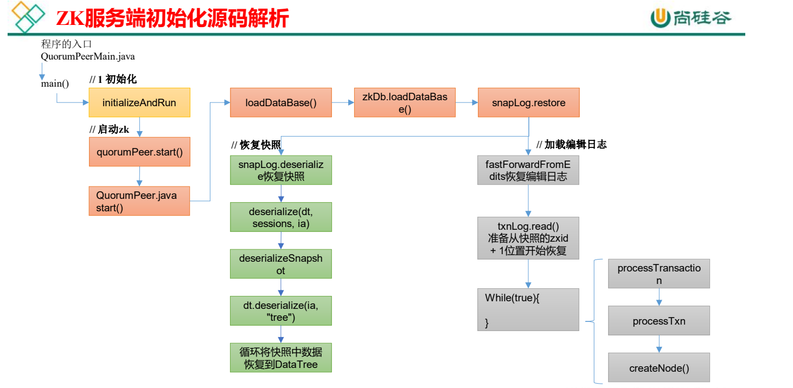


#### 3.1 冷启动数据恢复快照数据

- 启动集群

  runFromConfig

  ```java
  public void runFromConfig(QuorumPeerConfig config)
          throws IOException, AdminServerException
  {
    try {
        ManagedUtil.registerLog4jMBeans();
    } catch (JMException e) {
        LOG.warn("Unable to register log4j JMX control", e);
    }
  
    LOG.info("Starting quorum peer");
    try {
        ServerCnxnFactory cnxnFactory = null;
        ServerCnxnFactory secureCnxnFactory = null;
  
        // 通信组件初始化，默认是 NIO 通信
        if (config.getClientPortAddress() != null) {
            cnxnFactory = ServerCnxnFactory.createFactory();
            cnxnFactory.configure(config.getClientPortAddress(),
                    config.getMaxClientCnxns(),
                    false);
        }
  
        if (config.getSecureClientPortAddress() != null) {
            secureCnxnFactory = ServerCnxnFactory.createFactory();
            secureCnxnFactory.configure(config.getSecureClientPortAddress(),
                    config.getMaxClientCnxns(),
                    true);
        }
  
        // 把解析的参数赋值给该 Zookeeper 节点
        quorumPeer = getQuorumPeer();
        quorumPeer.setTxnFactory(new FileTxnSnapLog(
                    config.getDataLogDir(),
                    config.getDataDir()));
        quorumPeer.enableLocalSessions(config.areLocalSessionsEnabled());
        quorumPeer.enableLocalSessionsUpgrading(
            config.isLocalSessionsUpgradingEnabled());
        //quorumPeer.setQuorumPeers(config.getAllMembers());
        quorumPeer.setElectionType(config.getElectionAlg());
        quorumPeer.setMyid(config.getServerId());
        quorumPeer.setTickTime(config.getTickTime());
        quorumPeer.setMinSessionTimeout(config.getMinSessionTimeout());
        quorumPeer.setMaxSessionTimeout(config.getMaxSessionTimeout());
        quorumPeer.setInitLimit(config.getInitLimit());
        quorumPeer.setSyncLimit(config.getSyncLimit());
        quorumPeer.setConfigFileName(config.getConfigFilename());
        quorumPeer.setZKDatabase(new ZKDatabase(quorumPeer.getTxnFactory()));
        quorumPeer.setQuorumVerifier(config.getQuorumVerifier(), false);
        if (config.getLastSeenQuorumVerifier()!=null) {
            quorumPeer.setLastSeenQuorumVerifier(config.getLastSeenQuorumVerifier(), false);
        }
        quorumPeer.initConfigInZKDatabase();
        quorumPeer.setCnxnFactory(cnxnFactory);
        quorumPeer.setSecureCnxnFactory(secureCnxnFactory);
        quorumPeer.setSslQuorum(config.isSslQuorum());
        quorumPeer.setUsePortUnification(config.shouldUsePortUnification());
        quorumPeer.setLearnerType(config.getPeerType());
        quorumPeer.setSyncEnabled(config.getSyncEnabled());
        quorumPeer.setQuorumListenOnAllIPs(config.getQuorumListenOnAllIPs());
        if (config.sslQuorumReloadCertFiles) {
            quorumPeer.getX509Util().enableCertFileReloading();
        }
  
        // sets quorum sasl authentication configurations
        quorumPeer.setQuorumSaslEnabled(config.quorumEnableSasl);
        if(quorumPeer.isQuorumSaslAuthEnabled()){
            quorumPeer.setQuorumServerSaslRequired(config.quorumServerRequireSasl);
            quorumPeer.setQuorumLearnerSaslRequired(config.quorumLearnerRequireSasl);
            quorumPeer.setQuorumServicePrincipal(config.quorumServicePrincipal);
            quorumPeer.setQuorumServerLoginContext(config.quorumServerLoginContext);
            quorumPeer.setQuorumLearnerLoginContext(config.quorumLearnerLoginContext);
        }
        quorumPeer.setQuorumCnxnThreadsSize(config.quorumCnxnThreadsSize);
        quorumPeer.initialize();
        // 启动 zk
        quorumPeer.start();
        quorumPeer.join();
    } catch (InterruptedException e) {
        // warn, but generally this is ok
        LOG.warn("Quorum Peer interrupted", e);
    }
  }
  ```

- 冷启动恢复数据

  QuorumPeer.java：quorumPeer.start();

  ```java
  @Override
  public synchronized void start() {
      if (!getView().containsKey(myid)) {
          throw new RuntimeException("My id " + myid + " not in the peer list");
       }
      // 冷启动数据恢复
      loadDataBase();
      startServerCnxnFactory();
      try {
          // 启动通信工厂实例对象
          adminServer.start();
      } catch (AdminServerException e) {
          LOG.warn("Problem starting AdminServer", e);
          System.out.println(e);
      }
      // 准备选举环境
      startLeaderElection();
      // 执行选举
      super.start();
  }
  ```

- loadDataBase();

  ```java
  private void loadDataBase() {
      try {
           // 加载磁盘数据到内存，恢复 DataTree
  		// zk 的操作分两种：事务操作和非事务操作
  		// 事务操作：zk.cteate()；都会被分配一个全局唯一的 zxid，zxid 组成：64 位：（前 32 位：epoch 每个 leader 任期的代号；后 32 位：txid 为事务 id）
  		// 非事务操作：zk.getData()
  		// 数据恢复过程：
  		// （1）从快照文件中恢复大部分数据，并得到一个 lastProcessZXid
  		// （2）再从编辑日志中执行 replay，执行到最后一条日志并更新 lastProcessZXid
  		// （3）最终得到，datatree 和 lastProcessZXid，表示数据恢复完成
          zkDb.loadDataBase();
  
          // load the epochs
          long lastProcessedZxid = zkDb.getDataTree().lastProcessedZxid;
          long epochOfZxid = ZxidUtils.getEpochFromZxid(lastProcessedZxid);
          try {
              currentEpoch = readLongFromFile(CURRENT_EPOCH_FILENAME);
          } catch(FileNotFoundException e) {
             // pick a reasonable epoch number
             // this should only happen once when moving to a
             // new code version
             currentEpoch = epochOfZxid;
             LOG.info(CURRENT_EPOCH_FILENAME
                     + " not found! Creating with a reasonable default of {}. This should only happen when you are upgrading your installation",
                     currentEpoch);
             writeLongToFile(CURRENT_EPOCH_FILENAME, currentEpoch);
          }
          if (epochOfZxid > currentEpoch) {
              throw new IOException("The current epoch, " + ZxidUtils.zxidToString(currentEpoch) + ", is older than the last zxid, " + lastProcessedZxid);
          }
          try {
              acceptedEpoch = readLongFromFile(ACCEPTED_EPOCH_FILENAME);
          } catch(FileNotFoundException e) {
             // pick a reasonable epoch number
             // this should only happen once when moving to a
             // new code version
             acceptedEpoch = epochOfZxid;
             LOG.info(ACCEPTED_EPOCH_FILENAME
                     + " not found! Creating with a reasonable default of {}. This should only happen when you are upgrading your installation",
                     acceptedEpoch);
             writeLongToFile(ACCEPTED_EPOCH_FILENAME, acceptedEpoch);
          }
          if (acceptedEpoch < currentEpoch) {
              throw new IOException("The accepted epoch, " + ZxidUtils.zxidToString(acceptedEpoch) + " is less than the current epoch, " + ZxidUtils.zxidToString(currentEpoch));
          }
      } catch(IOException ie) {
          LOG.error("Unable to load database on disk", ie);
          throw new RuntimeException("Unable to run quorum server ", ie);
      }
  }
  ```

- zkDb.loadDataBase();

  ```java
  /**
   * load the database from the disk onto memory and also add
   * the transactions to the committedlog in memory.
   * @return the last valid zxid on disk
   * @throws IOException
   */
  public long loadDataBase() throws IOException {
      long zxid = snapLog.restore(dataTree, sessionsWithTimeouts, commitProposalPlaybackListener);
      initialized = true;
      return zxid;
  }
  ```

- snapLog.restore(dataTree, sessionsWithTimeouts, commitProposalPlaybackListener);

  ```java
  public long restore(DataTree dt, Map<Long, Integer> sessions,
                      PlayBackListener listener) throws IOException {
      // 恢复快照文件数据到 DataTree
      long deserializeResult = snapLog.deserialize(dt, sessions);
      FileTxnLog txnLog = new FileTxnLog(dataDir);
  
      RestoreFinalizer finalizer = () -> {
          // 恢复编辑日志数据到 DataTree
          long highestZxid = fastForwardFromEdits(dt, sessions, listener);
          return highestZxid;
      };
  
      if (-1L == deserializeResult) {
          /* this means that we couldn't find any snapshot, so we need to
           * initialize an empty database (reported in ZOOKEEPER-2325) */
          if (txnLog.getLastLoggedZxid() != -1) {
              // ZOOKEEPER-3056: provides an escape hatch for users upgrading
              // from old versions of zookeeper (3.4.x, pre 3.5.3).
              if (!trustEmptySnapshot) {
                  throw new IOException(EMPTY_SNAPSHOT_WARNING + "Something is broken!");
              } else {
                  LOG.warn("{}This should only be allowed during upgrading.", EMPTY_SNAPSHOT_WARNING);
                  return finalizer.run();
              }
          }
          /* TODO: (br33d) we should either put a ConcurrentHashMap on restore()
           *       or use Map on save() */
          save(dt, (ConcurrentHashMap<Long, Integer>)sessions);
          /* return a zxid of zero, since we the database is empty */
          return 0;
      }
  
      return finalizer.run();
  }
  ```

- 查找 deserialize 实现类 FileSnap.java：snapLog.deserialize(dt, sessions);

  ```java
  public long deserialize(DataTree dt, Map<Long, Integer> sessions)
          throws IOException {
      // we run through 100 snapshots (not all of them)
      // if we cannot get it running within 100 snapshots
      // we should  give up
      List<File> snapList = findNValidSnapshots(100);
      if (snapList.size() == 0) {
          return -1L;
      }
      File snap = null;
      boolean foundValid = false;
      // 依次遍历每一个快照的数据
      for (int i = 0, snapListSize = snapList.size(); i < snapListSize; i++) {
          snap = snapList.get(i);
          LOG.info("Reading snapshot " + snap);
          // 反序列化环境准备
          try (InputStream snapIS = new BufferedInputStream(new FileInputStream(snap));
               CheckedInputStream crcIn = new CheckedInputStream(snapIS, new Adler32())) {
              InputArchive ia = BinaryInputArchive.getArchive(crcIn);
              // 反序列化，恢复数据到 DataTree
              deserialize(dt, sessions, ia);
              long checkSum = crcIn.getChecksum().getValue();
              long val = ia.readLong("val");
              if (val != checkSum) {
                  throw new IOException("CRC corruption in snapshot :  " + snap);
              }
              foundValid = true;
              break;
          } catch (IOException e) {
              LOG.warn("problem reading snap file " + snap, e);
          }
      }
      if (!foundValid) {
          throw new IOException("Not able to find valid snapshots in " + snapDir);
      }
      dt.lastProcessedZxid = Util.getZxidFromName(snap.getName(), SNAPSHOT_FILE_PREFIX);
      return dt.lastProcessedZxid;
  }
  ```

- deserialize(dt, sessions, ia);

  ```java
  public void deserialize(DataTree dt, Map<Long, Integer> sessions,
          InputArchive ia) throws IOException {
      FileHeader header = new FileHeader();
      header.deserialize(ia, "fileheader");
      if (header.getMagic() != SNAP_MAGIC) {
          throw new IOException("mismatching magic headers "
                  + header.getMagic() +
                  " !=  " + FileSnap.SNAP_MAGIC);
      }
      // 恢复快照数据到 DataTree
      SerializeUtils.deserializeSnapshot(dt,ia,sessions);
  }
  ```

- SerializeUtils.deserializeSnapshot(dt,ia,sessions);

  ```java
  public static void deserializeSnapshot(DataTree dt,InputArchive ia,
          Map<Long, Integer> sessions) throws IOException {
      int count = ia.readInt("count");
      while (count > 0) {
          long id = ia.readLong("id");
          int to = ia.readInt("timeout");
          sessions.put(id, to);
          if (LOG.isTraceEnabled()) {
              ZooTrace.logTraceMessage(LOG, ZooTrace.SESSION_TRACE_MASK,
                      "loadData --- session in archive: " + id
                      + " with timeout: " + to);
          }
          count--;
      }
      // 恢复快照数据到 DataTree
      dt.deserialize(ia, "tree");
  }
  ```

- dt.deserialize(ia, "tree");

  ```java
  public void deserialize(InputArchive ia, String tag) throws IOException {
      aclCache.deserialize(ia);
      nodes.clear();
      pTrie.clear();
      String path = ia.readString("path");
      // 从快照中恢复每一个 datanode 节点数据到 DataTree
      while (!"/".equals(path)) {
          // 每次循环创建一个节点对象
          DataNode node = new DataNode();
          ia.readRecord(node, "node");
          
          // 将 DataNode 恢复到 DataTree
          nodes.put(path, node);
          synchronized (node) {
              aclCache.addUsage(node.acl);
          }
          int lastSlash = path.lastIndexOf('/');
          if (lastSlash == -1) {
              root = node;
          } else {
              // 处理父节点
              String parentPath = path.substring(0, lastSlash);
              DataNode parent = nodes.get(parentPath);
              if (parent == null) {
                  throw new IOException("Invalid Datatree, unable to find " +
                          "parent " + parentPath + " of path " + path);
              }
              
              // 处理子节点
              parent.addChild(path.substring(lastSlash + 1));
              
              // 处理临时节点和永久节点
              long eowner = node.stat.getEphemeralOwner();
              EphemeralType ephemeralType = EphemeralType.get(eowner);
              if (ephemeralType == EphemeralType.CONTAINER) {
                  containers.add(path);
              } else if (ephemeralType == EphemeralType.TTL) {
                  ttls.add(path);
              } else if (eowner != 0) {
                  HashSet<String> list = ephemerals.get(eowner);
                  if (list == null) {
                      list = new HashSet<String>();
                      ephemerals.put(eowner, list);
                  }
                  list.add(path);
              }
          }
          path = ia.readString("path");
      }
      nodes.put("/", root);
      // we are done with deserializing the
      // the datatree
      // update the quotas - create path trie
      // and also update the stat nodes
      setupQuota();
  
      aclCache.purgeUnused();
  }
  ```


#### 3.2 冷启动数据恢复编辑日志

- 回到 FileTxnSnapLog.java 类中的 restore 方法

  ```java
  public long restore(DataTree dt, Map<Long, Integer> sessions,
                      PlayBackListener listener) throws IOException {
      // 恢复快照文件数据到 DataTree
      long deserializeResult = snapLog.deserialize(dt, sessions);
      FileTxnLog txnLog = new FileTxnLog(dataDir);
  
      RestoreFinalizer finalizer = () -> {
          // 恢复编辑日志数据到 DataTree
          long highestZxid = fastForwardFromEdits(dt, sessions, listener);
          return highestZxid;
      };
  
  	......
  
      return finalizer.run();
  }
  ```

- fastForwardFromEdits(dt, sessions, listener);

  ```java
  public long fastForwardFromEdits(DataTree dt, Map<Long, Integer> sessions,
                                   PlayBackListener listener) throws IOException {
      // 在此之前，已经从快照文件中恢复了大部分数据，接下来只需从快照的 zxid + 1 位置开始恢复
      TxnIterator itr = txnLog.read(dt.lastProcessedZxid+1);
      // 快照中最大的 zxid，在执行编辑日志时，这个值会不断更新，直到所有操作执行完
      long highestZxid = dt.lastProcessedZxid;
      TxnHeader hdr;
      try {
          // 从 lastProcessedZxid 事务编号器开始，不断的从编辑日志中恢复剩下的还没有恢复的数据
          while (true) {
              // iterator points to
              // the first valid txn when initialized
              // 获取事务头信息（有 zxid）
              hdr = itr.getHeader();
              if (hdr == null) {
                  //empty logs
                  return dt.lastProcessedZxid;
              }
              if (hdr.getZxid() < highestZxid && highestZxid != 0) {
                  LOG.error("{}(highestZxid) > {}(next log) for type {}",
                          highestZxid, hdr.getZxid(), hdr.getType());
              } else {
                  highestZxid = hdr.getZxid();
              }
              try {
                  // 根据编辑日志恢复数据到 DataTree，每执行一次，对应的事务 id，highestZxid + 1
                  processTransaction(hdr,dt,sessions, itr.getTxn());
              } catch(KeeperException.NoNodeException e) {
                 throw new IOException("Failed to process transaction type: " +
                       hdr.getType() + " error: " + e.getMessage(), e);
              }
              listener.onTxnLoaded(hdr, itr.getTxn());
              if (!itr.next())
                  break;
          }
      } finally {
          if (itr != null) {
              itr.close();
          }
      }
      return highestZxid;
  }
  ```

- processTransaction(hdr,dt,sessions, itr.getTxn());

  ```java
  public void processTransaction(TxnHeader hdr,DataTree dt,
          Map<Long, Integer> sessions, Record txn)
      throws KeeperException.NoNodeException {
      
      ProcessTxnResult rc;
      switch (hdr.getType()) {
      case OpCode.createSession:
          sessions.put(hdr.getClientId(),
                  ((CreateSessionTxn) txn).getTimeOut());
          if (LOG.isTraceEnabled()) {
              ZooTrace.logTraceMessage(LOG,ZooTrace.SESSION_TRACE_MASK,
                      "playLog --- create session in log: 0x"
                              + Long.toHexString(hdr.getClientId())
                              + " with timeout: "
                              + ((CreateSessionTxn) txn).getTimeOut());
          }
          // give dataTree a chance to sync its lastProcessedZxid
          rc = dt.processTxn(hdr, txn);
          break;
      case OpCode.closeSession:
          sessions.remove(hdr.getClientId());
          if (LOG.isTraceEnabled()) {
              ZooTrace.logTraceMessage(LOG,ZooTrace.SESSION_TRACE_MASK,
                      "playLog --- close session in log: 0x"
                              + Long.toHexString(hdr.getClientId()));
          }
          rc = dt.processTxn(hdr, txn);
          break;
      default:
          // 创建节点、删除节点和其他的各种事务操作等
          rc = dt.processTxn(hdr, txn);
      }
  
      /**
       * Snapshots are lazily created. So when a snapshot is in progress,
       * there is a chance for later transactions to make into the
       * snapshot. Then when the snapshot is restored, NONODE/NODEEXISTS
       * errors could occur. It should be safe to ignore these.
       */
      if (rc.err != Code.OK.intValue()) {
          LOG.debug(
                  "Ignoring processTxn failure hdr: {}, error: {}, path: {}",
                  hdr.getType(), rc.err, rc.path);
      }
  }
  ```

- dt.processTxn(hdr, txn);

  ```java
  public ProcessTxnResult processTxn(TxnHeader header, Record txn) {
      return this.processTxn(header, txn, false);
  }
  
  public ProcessTxnResult processTxn(TxnHeader header, Record txn, boolean isSubTxn)
  {
      ProcessTxnResult rc = new ProcessTxnResult();
  
      try {
          rc.clientId = header.getClientId();
          rc.cxid = header.getCxid();
          rc.zxid = header.getZxid();
          rc.type = header.getType();
          rc.err = 0;
          rc.multiResult = null;
          switch (header.getType()) {
              case OpCode.create:
                  CreateTxn createTxn = (CreateTxn) txn;
                  rc.path = createTxn.getPath();
                  createNode(
                          createTxn.getPath(),
                          createTxn.getData(),
                          createTxn.getAcl(),
                          createTxn.getEphemeral() ? header.getClientId() : 0,
                          createTxn.getParentCVersion(),
                          header.getZxid(), header.getTime(), null);
                  break;
              case OpCode.create2:
                  CreateTxn create2Txn = (CreateTxn) txn;
                  rc.path = create2Txn.getPath();
                  Stat stat = new Stat();
                  createNode(
                          create2Txn.getPath(),
                          create2Txn.getData(),
                          create2Txn.getAcl(),
                          create2Txn.getEphemeral() ? header.getClientId() : 0,
                          create2Txn.getParentCVersion(),
                          header.getZxid(), header.getTime(), stat);
                  rc.stat = stat;
                  break;
              case OpCode.createTTL:
                  CreateTTLTxn createTtlTxn = (CreateTTLTxn) txn;
                  rc.path = createTtlTxn.getPath();
                  stat = new Stat();
                  createNode(
                          createTtlTxn.getPath(),
                          createTtlTxn.getData(),
                          createTtlTxn.getAcl(),
                          EphemeralType.TTL.toEphemeralOwner(createTtlTxn.getTtl()),
                          createTtlTxn.getParentCVersion(),
                          header.getZxid(), header.getTime(), stat);
                  rc.stat = stat;
                  break;
              case OpCode.createContainer:
                  CreateContainerTxn createContainerTxn = (CreateContainerTxn) txn;
                  rc.path = createContainerTxn.getPath();
                  stat = new Stat();
                  createNode(
                          createContainerTxn.getPath(),
                          createContainerTxn.getData(),
                          createContainerTxn.getAcl(),
                          EphemeralType.CONTAINER_EPHEMERAL_OWNER,
                          createContainerTxn.getParentCVersion(),
                          header.getZxid(), header.getTime(), stat);
                  rc.stat = stat;
                  break;
              case OpCode.delete:
              case OpCode.deleteContainer:
                  DeleteTxn deleteTxn = (DeleteTxn) txn;
                  rc.path = deleteTxn.getPath();
                  deleteNode(deleteTxn.getPath(), header.getZxid());
                  break;
              case OpCode.reconfig:
              case OpCode.setData:
                  SetDataTxn setDataTxn = (SetDataTxn) txn;
                  rc.path = setDataTxn.getPath();
                  rc.stat = setData(setDataTxn.getPath(), setDataTxn
                          .getData(), setDataTxn.getVersion(), header
                          .getZxid(), header.getTime());
                  break;
              case OpCode.setACL:
                  SetACLTxn setACLTxn = (SetACLTxn) txn;
                  rc.path = setACLTxn.getPath();
                  rc.stat = setACL(setACLTxn.getPath(), setACLTxn.getAcl(),
                          setACLTxn.getVersion());
                  break;
              case OpCode.closeSession:
                  killSession(header.getClientId(), header.getZxid());
                  break;
              case OpCode.error:
                  ErrorTxn errTxn = (ErrorTxn) txn;
                  rc.err = errTxn.getErr();
                  break;
              case OpCode.check:
                  CheckVersionTxn checkTxn = (CheckVersionTxn) txn;
                  rc.path = checkTxn.getPath();
                  break;
              case OpCode.multi:
                  MultiTxn multiTxn = (MultiTxn) txn ;
                  List<Txn> txns = multiTxn.getTxns();
                  rc.multiResult = new ArrayList<ProcessTxnResult>();
                  boolean failed = false;
                  for (Txn subtxn : txns) {
                      if (subtxn.getType() == OpCode.error) {
                          failed = true;
                          break;
                      }
                  }
  
                  ......
          }
      } catch (KeeperException e) {
          if (LOG.isDebugEnabled()) {
              LOG.debug("Failed: " + header + ":" + txn, e);
          }
          rc.err = e.code().intValue();
      } catch (IOException e) {
          if (LOG.isDebugEnabled()) {
              LOG.debug("Failed: " + header + ":" + txn, e);
          }
      }
  
  
      ......
          
      return rc;
  }
  ```


### 4 ZK选举源码解析

- **Zookeeper选举机制 —— 第一次启动**：

  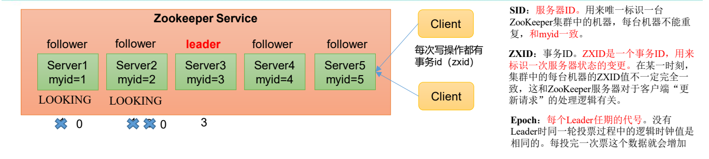

  1. 服务器1启动，发起一次选举。服务器1投自己一票。此时服务器1票数一票，不够半数以上（3票），选举无法完成，服务器1状态保持为 LOOKING；
  2. 服务器2启动，再发起一次选举。服务器1和2分别投自己一票并交换选票信息：**此时服务器1发现服务器2的myid比自己目前投票推举的（服务器1）大，更改选票为推举服务器2**。此时服务器1票数0票，服务器2票数2票，没有半数以上结果，选举无法完成，服务器1，2状态保持LOOKING；
  3. 服务器3启动，发起一次选举。此时服务器1和2都会更改选票为服务器3。此次投票结果：服务器1为0票，服务器2为0票，服务器3为3票。此时服务器3的票数已经超过半数，服务器3当选Leader。服务器1，2更改状态为FOLLOWING，服务器3更改状态为LEADING；
  4. 服务器4启动，发起一次选举。此时服务器1，2，3已经不是LOOKING状态，不会更改选票信息。交换选票信息结果：服务器3为3票，服务器4为1票。此时服务器4服从多数，更改选票信息为服务器3，并更改状态为FOLLOWING；
  5. 服务器5启动，同4一样当小弟。

- **Zookeeper选举机制 —— 非第一次启动**：

  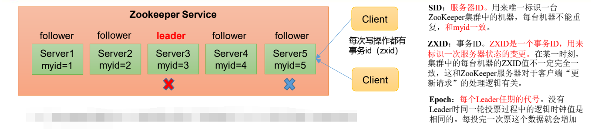

  1. 当ZooKeeper集群中的一台服务器出现以下两种情况之一时，就会开始进入Leader选举：

     - 服务器初始化启动。
     - 服务器运行期间无法和Leader保持连接。

  2. 而当一台机器进入Leader选举流程时，当前集群也可能会处于以下两种状态：

     - 集群中本来就已经存在一个Leader。

       对于第一种已经存在Leader的情况，机器试图去选举Leader时，会被告知当前服务器的Leader信息，对于该机器来说，仅仅需要和Leader机器建立连接，并进行状态同步即可。

     - **集群中确实不存在Leader**。

       假设ZooKeeper由5台服务器组成，SID分别为1、2、3、4、5，ZXID分别为8、8、8、7、7，并且此时SID为3的服务器是Leader。某一时刻，3和5服务器出现故障，因此开始进行Leader选举。

       |                            | (EPOCH，ZXID，SID) | (EPOCH，ZXID，SID) | (EPOCH，ZXID，SID) |
       | -------------------------- | ------------------ | ------------------ | ------------------ |
       | SID为1、2、4的机器投票情况 | (1，8，1)          | (1，8，2)          | (1，7，4)          |

       选举Leader规则：

       1. EPOCH大的直接胜出
       2. EPOCH相同，事务id大的胜出
       3. 事务id相同，服务器id大的胜出


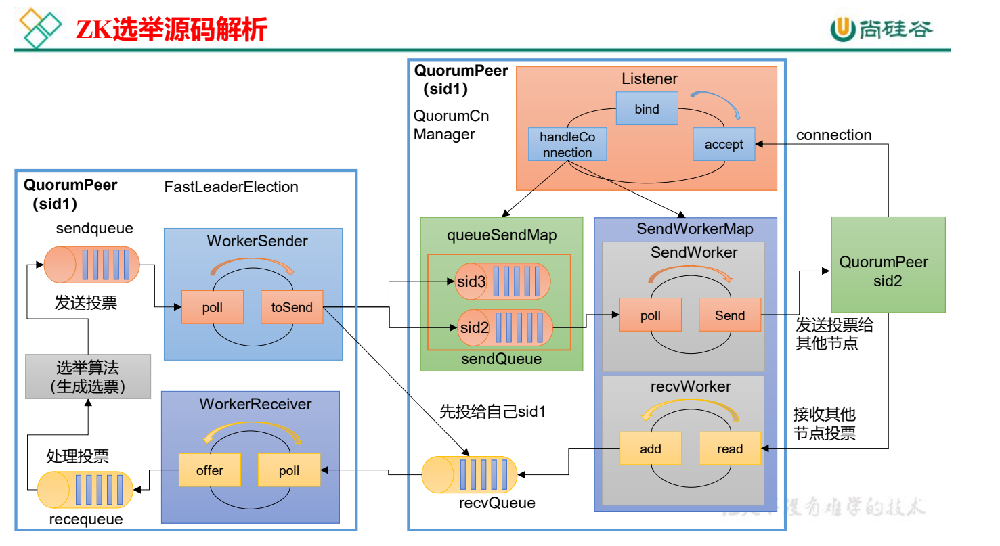


#### 4.1 选举准备

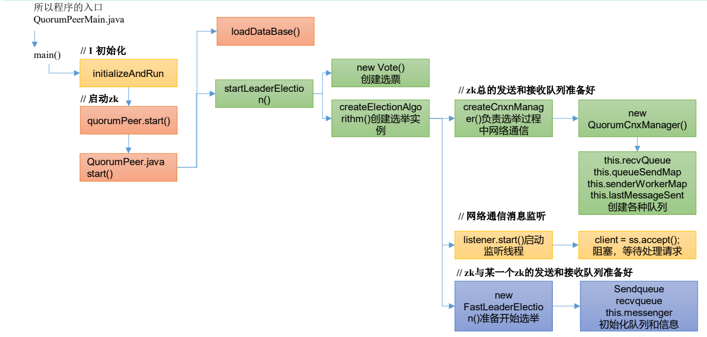

- QuorumPeer.java

  ```java
  @Override
  public synchronized void start() {
      if (!getView().containsKey(myid)) {
          throw new RuntimeException("My id " + myid + " not in the peer list");
       }
      loadDataBase();
      startServerCnxnFactory();
      try {
          adminServer.start();
      } catch (AdminServerException e) {
          LOG.warn("Problem starting AdminServer", e);
          System.out.println(e);
      }
      // 选举准备
      startLeaderElection();
      super.start();
  }
  ```

  startLeaderElection();

  ```java
  synchronized public void startLeaderElection() {
     try {
         if (getPeerState() == ServerState.LOOKING) {
  		  // 创建选票
   		  //（1）选票组件：epoch（leader 的任期代号）、zxid（某个 leader 当选期间执行的事务编号）、myid（serverid）
  		  //（2）开始选票时，都是先投自己
             currentVote = new Vote(myid, getLastLoggedZxid(), getCurrentEpoch());
         }
     } catch(IOException e) {
         RuntimeException re = new RuntimeException(e.getMessage());
         re.setStackTrace(e.getStackTrace());
         throw re;
     }
  
     // if (!getView().containsKey(myid)) {
    //      throw new RuntimeException("My id " + myid + " not in the peer list");
      //}
      if (electionType == 0) {
          try {
              udpSocket = new DatagramSocket(getQuorumAddress().getPort());
              responder = new ResponderThread();
              responder.start();
          } catch (SocketException e) {
              throw new RuntimeException(e);
          }
      }
      // 创建选举算法实例
      this.electionAlg = createElectionAlgorithm(electionType);
  }
  ```

  createElectionAlgorithm(electionType);

  ```java
  protected Election createElectionAlgorithm(int electionAlgorithm){
      Election le=null;
  
      //TODO: use a factory rather than a switch
      switch (electionAlgorithm) {
      case 0:
          le = new LeaderElection(this);
          break;
      case 1:
          le = new AuthFastLeaderElection(this);
          break;
      case 2:
          le = new AuthFastLeaderElection(this, true);
          break;
      case 3:
          // 1 创建 QuorumCnxnManager，负责选举过程中的所有网络通信
          QuorumCnxManager qcm = createCnxnManager();
          QuorumCnxManager oldQcm = qcmRef.getAndSet(qcm);
          if (oldQcm != null) {
              LOG.warn("Clobbering already-set QuorumCnxManager (restarting leader election?)");
              oldQcm.halt();
          }
          QuorumCnxManager.Listener listener = qcm.listener;
          if(listener != null){
              // 2 启动监听线程
              listener.start();
              // 3 准备开始选举
              FastLeaderElection fle = new FastLeaderElection(this, qcm);
              fle.start();
              le = fle;
          } else {
              LOG.error("Null listener when initializing cnx manager");
          }
          break;
      default:
          assert false;
      }
      return le;
  }
  ```

- 网络通信组件初始化：createCnxnManager();

  ```java
  public QuorumCnxManager createCnxnManager() {
      return new QuorumCnxManager(this,
              this.getId(),
              this.getView(),
              this.authServer,
              this.authLearner,
              this.tickTime * this.syncLimit,
              this.getQuorumListenOnAllIPs(),
              this.quorumCnxnThreadsSize,
              this.isQuorumSaslAuthEnabled());
  }
  ```

  new QuorumCnxManager

  ```java
  public QuorumCnxManager(QuorumPeer self,
                          final long mySid,
                          Map<Long,QuorumPeer.QuorumServer> view,
                          QuorumAuthServer authServer,
                          QuorumAuthLearner authLearner,
                          int socketTimeout,
                          boolean listenOnAllIPs,
                          int quorumCnxnThreadsSize,
                          boolean quorumSaslAuthEnabled) {
      
      // 创建各种队列
      this.recvQueue = new ArrayBlockingQueue<Message>(RECV_CAPACITY);
      this.queueSendMap = new ConcurrentHashMap<Long, ArrayBlockingQueue<ByteBuffer>>();
      this.senderWorkerMap = new ConcurrentHashMap<Long, SendWorker>();
      this.lastMessageSent = new ConcurrentHashMap<Long, ByteBuffer>();
  
      String cnxToValue = System.getProperty("zookeeper.cnxTimeout");
      if(cnxToValue != null){
          this.cnxTO = Integer.parseInt(cnxToValue);
      }
  
      this.self = self;
  
      this.mySid = mySid;
      this.socketTimeout = socketTimeout;
      this.view = view;
      this.listenOnAllIPs = listenOnAllIPs;
  
      initializeAuth(mySid, authServer, authLearner, quorumCnxnThreadsSize,
              quorumSaslAuthEnabled);
  
      // Starts listener thread that waits for connection requests
      listener = new Listener();
      listener.setName("QuorumPeerListener");
  }
  ```

- 监听线程初始化

  点击 QuorumCnxManager.Listener，找到对应的 run 方法

  ```java
  @Override
  public void run() {
      int numRetries = 0;
      InetSocketAddress addr;
      Socket client = null;
      Exception exitException = null;
      while ((!shutdown) && (portBindMaxRetry == 0 || numRetries < portBindMaxRetry)) {
          try {
              if (self.shouldUsePortUnification()) {
                  LOG.info("Creating TLS-enabled quorum server socket");
                  ss = new UnifiedServerSocket(self.getX509Util(), true);
              } else if (self.isSslQuorum()) {
                  LOG.info("Creating TLS-only quorum server socket");
                  ss = new UnifiedServerSocket(self.getX509Util(), false);
              } else {
                  ss = new ServerSocket();
              }
  
              ss.setReuseAddress(true);
  
              if (self.getQuorumListenOnAllIPs()) {
                  int port = self.getElectionAddress().getPort();
                  addr = new InetSocketAddress(port);
              } else {
                  // Resolve hostname for this server in case the
                  // underlying ip address has changed.
                  self.recreateSocketAddresses(self.getId());
                  addr = self.getElectionAddress();
              }
              LOG.info("My election bind port: " + addr.toString());
              setName(addr.toString());
              // 绑定服务器地址
              ss.bind(addr);
              // 死循环
              while (!shutdown) {
                  try {
                      // 阻塞，等待处理请求
                      client = ss.accept();
                      setSockOpts(client);
                      LOG.info("Received connection request "
                              + formatInetAddr((InetSocketAddress)client.getRemoteSocketAddress()));
                      // Receive and handle the connection request
                      // asynchronously if the quorum sasl authentication is
                      // enabled. This is required because sasl server
                      // authentication process may take few seconds to finish,
                      // this may delay next peer connection requests.
                      if (quorumSaslAuthEnabled) {
                          receiveConnectionAsync(client);
                      } else {
                          receiveConnection(client);
                      }
                      numRetries = 0;
                  } catch (SocketTimeoutException e) {
                      LOG.warn("The socket is listening for the election accepted "
                               + "and it timed out unexpectedly, but will retry."
                               + "see ZOOKEEPER-2836");
                  }
              }
          } catch (IOException e) {
              ......
              closeSocket(client);
          }
      }
      ......
  }
  ```

- 选举准备

  点击 FastLeaderElection

  ```java
  public FastLeaderElection(QuorumPeer self, QuorumCnxManager manager){
      this.stop = false;
      this.manager = manager;
      starter(self, manager);
  }
  ```

  starter(self, manager);

  ```java
  private void starter(QuorumPeer self, QuorumCnxManager manager) {
      this.self = self;
      proposedLeader = -1;
      proposedZxid = -1;
  
      // 初始化队列和信息
      sendqueue = new LinkedBlockingQueue<ToSend>();
      recvqueue = new LinkedBlockingQueue<Notification>();
      this.messenger = new Messenger(manager);
  }
  ```


#### 4.2 选举执行

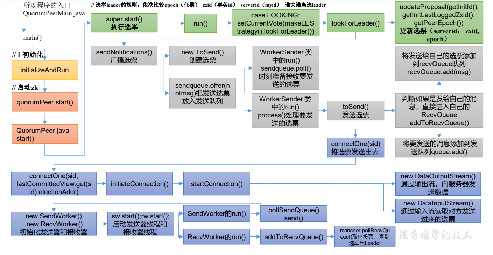

- QuorumPeer.java

  ```java
  @Override
  public synchronized void start() {
      if (!getView().containsKey(myid)) {
          throw new RuntimeException("My id " + myid + " not in the peer list");
       }
      // 冷启动数据恢复
      loadDataBase();
      startServerCnxnFactory();
      try {
          // 启动通信工厂实例对象
          adminServer.start();
      } catch (AdminServerException e) {
          LOG.warn("Problem starting AdminServer", e);
          System.out.println(e);
      }
      // 准备选举环境
      startLeaderElection();
      // 执行选举
      super.start();
  }
  ```

- 执行 super.start(); 就相当于执行 QuorumPeer.java 类中的 run() 方法

  当 Zookeeper 启动后，首先都是 Looking 状态，通过选举，让其中一台服务器成为 Leader，其他的服务器成为 Follower。

  QuorumPeer.java

  ```java
  @Override
  public void run() {
      updateThreadName();
  
      LOG.debug("Starting quorum peer");
      try {
          jmxQuorumBean = new QuorumBean(this);
          MBeanRegistry.getInstance().register(jmxQuorumBean, null);
          for(QuorumServer s: getView().values()){
              ZKMBeanInfo p;
              if (getId() == s.id) {
                  p = jmxLocalPeerBean = new LocalPeerBean(this);
                  try {
                      MBeanRegistry.getInstance().register(p, jmxQuorumBean);
                  } catch (Exception e) {
                      LOG.warn("Failed to register with JMX", e);
                      jmxLocalPeerBean = null;
                  }
              } else {
                  RemotePeerBean rBean = new RemotePeerBean(this, s);
                  try {
                      MBeanRegistry.getInstance().register(rBean, jmxQuorumBean);
                      jmxRemotePeerBean.put(s.id, rBean);
                  } catch (Exception e) {
                      LOG.warn("Failed to register with JMX", e);
                  }
              }
          }
      } catch (Exception e) {
          LOG.warn("Failed to register with JMX", e);
          jmxQuorumBean = null;
      }
  
      try {
          /*
           * Main loop
           */
          while (running) {
              switch (getPeerState()) {
              case LOOKING:
                  LOG.info("LOOKING");
  
                  if (Boolean.getBoolean("readonlymode.enabled")) {
                      LOG.info("Attempting to start ReadOnlyZooKeeperServer");
  
                      // Create read-only server but don't start it immediately
                      final ReadOnlyZooKeeperServer roZk =
                          new ReadOnlyZooKeeperServer(logFactory, this, this.zkDb);
  
                      // Instead of starting roZk immediately, wait some grace
                      // period before we decide we're partitioned.
                      //
                      // Thread is used here because otherwise it would require
                      // changes in each of election strategy classes which is
                      // unnecessary code coupling.
                      Thread roZkMgr = new Thread() {
                          public void run() {
                              try {
                                  // lower-bound grace period to 2 secs
                                  sleep(Math.max(2000, tickTime));
                                  if (ServerState.LOOKING.equals(getPeerState())) {
                                      roZk.startup();
                                  }
                              } catch (InterruptedException e) {
                                  LOG.info("Interrupted while attempting to start ReadOnlyZooKeeperServer, not started");
                              } catch (Exception e) {
                                  LOG.error("FAILED to start ReadOnlyZooKeeperServer", e);
                              }
                          }
                      };
                      try {
                          roZkMgr.start();
                          reconfigFlagClear();
                          if (shuttingDownLE) {
                              shuttingDownLE = false;
                              startLeaderElection();
                          }
                          // 进行选举，选举结束，返回最终成为 Leader 胜选的那张选票
                          setCurrentVote(makeLEStrategy().lookForLeader());
                      } catch (Exception e) {
                          LOG.warn("Unexpected exception", e);
                          setPeerState(ServerState.LOOKING);
                      } finally {
                          // If the thread is in the the grace period, interrupt
                          // to come out of waiting.
                          roZkMgr.interrupt();
                          roZk.shutdown();
                      }
                  } else {
                      try {
                         reconfigFlagClear();
                          if (shuttingDownLE) {
                             shuttingDownLE = false;
                             startLeaderElection();
                             }
                          setCurrentVote(makeLEStrategy().lookForLeader());
                      } catch (Exception e) {
                          LOG.warn("Unexpected exception", e);
                          setPeerState(ServerState.LOOKING);
                      }                        
                  }
                  break;
              case OBSERVING:
                  try {
                      LOG.info("OBSERVING");
                      setObserver(makeObserver(logFactory));
                      observer.observeLeader();
                  } catch (Exception e) {
                      LOG.warn("Unexpected exception",e );
                  } finally {
                      observer.shutdown();
                      setObserver(null);  
                     updateServerState();
                  }
                  break;
              case FOLLOWING:
                  try {
                     LOG.info("FOLLOWING");
                      setFollower(makeFollower(logFactory));
                      follower.followLeader();
                  } catch (Exception e) {
                     LOG.warn("Unexpected exception",e);
                  } finally {
                     follower.shutdown();
                     setFollower(null);
                     updateServerState();
                  }
                  break;
              case LEADING:
                  LOG.info("LEADING");
                  try {
                      setLeader(makeLeader(logFactory));
                      leader.lead();
                      setLeader(null);
                  } catch (Exception e) {
                      LOG.warn("Unexpected exception",e);
                  } finally {
                      if (leader != null) {
                          leader.shutdown("Forcing shutdown");
                          setLeader(null);
                      }
                      updateServerState();
                  }
                  break;
              }
              start_fle = Time.currentElapsedTime();
          }
      } finally {
          ......
      }
  }
  ```

- 点击 lookForLeader() 的实现类 FastLeaderElection.java

  ```java
  /**
   * Starts a new round of leader election. Whenever our QuorumPeer
   * changes its state to LOOKING, this method is invoked, and it
   * sends notifications to all other peers.
   */
  public Vote lookForLeader() throws InterruptedException {
      try {
          self.jmxLeaderElectionBean = new LeaderElectionBean();
          MBeanRegistry.getInstance().register(
                  self.jmxLeaderElectionBean, self.jmxLocalPeerBean);
      } catch (Exception e) {
          LOG.warn("Failed to register with JMX", e);
          self.jmxLeaderElectionBean = null;
      }
      if (self.start_fle == 0) {
         self.start_fle = Time.currentElapsedTime();
      }
      try {
          // 正常启动中，所有其他服务器，都会给我发送一个投票
          // 保存每一个服务器的最新合法有效的投票
          HashMap<Long, Vote> recvset = new HashMap<Long, Vote>();
  
          // 存储合法选举之外的投票结果
          HashMap<Long, Vote> outofelection = new HashMap<Long, Vote>();
  
          // 一次选举的最大等待时间，默认值是 0.2s
          int notTimeout = finalizeWait;
  
          // 每发起一轮选举，logicalclock++
          // 在没有合法的 epoch 数据之前，都使用逻辑时钟代替
          // 选举 leader 的规则：依次比较 epoch（任期） zxid（事务 id） serverid（myid） 谁大谁当选 leader
          synchronized(this){
              // 更新逻辑时钟，每进行一次选举，都需要更新逻辑时钟
              logicalclock.incrementAndGet();
              // 更新选票（serverid， zxid, epoch），
              updateProposal(getInitId(), getInitLastLoggedZxid(), getPeerEpoch());
          }
  
          LOG.info("New election. My id =  " + self.getId() +
                  ", proposed zxid=0x" + Long.toHexString(proposedZxid));
          // 广播选票，把自己的选票发给其他服务器
          sendNotifications();
  
          /*
           * Loop in which we exchange notifications until we find a leader
           */
          // 一轮一轮的选举直到选举成功
          while ((self.getPeerState() == ServerState.LOOKING) &&
                  (!stop)){
              ......
          }
          return null;
      } finally {
          ......
      }
  }
  ```

- 点击 sendNotifications，广播选票，把自己的选票发给其他服务器

  ```java
  /**
   * Send notifications to all peers upon a change in our vote
   */
  private void sendNotifications() {
      // 遍历投票参与者，给每台服务器发送选票
      for (long sid : self.getCurrentAndNextConfigVoters()) {
          QuorumVerifier qv = self.getQuorumVerifier();
          // 创建发送选票
          ToSend notmsg = new ToSend(ToSend.mType.notification,
                  proposedLeader,
                  proposedZxid,
                  logicalclock.get(),
                  QuorumPeer.ServerState.LOOKING,
                  sid,
                  proposedEpoch, qv.toString().getBytes());
          if(LOG.isDebugEnabled()){
              LOG.debug("Sending Notification: " + proposedLeader + " (n.leader), 0x"  +
                    Long.toHexString(proposedZxid) + " (n.zxid), 0x" + Long.toHexString(logicalclock.get())  +
                    " (n.round), " + sid + " (recipient), " + self.getId() +
                    " (myid), 0x" + Long.toHexString(proposedEpoch) + " (n.peerEpoch)");
          }
          // 把发送选票放入发送队列
          sendqueue.offer(notmsg);
      }
  }
  ```

- 在 FastLeaderElection.java 类中查找 WorkerSender 线程。

  ```java
  class WorkerSender extends ZooKeeperThread {
      volatile boolean stop;
      QuorumCnxManager manager;
  
      WorkerSender(QuorumCnxManager manager){
          super("WorkerSender");
          this.stop = false;
          this.manager = manager;
      }
  
      public void run() {
          while (!stop) {
              try {
                  // 队列阻塞，时刻准备接收要发送的选票
                  ToSend m = sendqueue.poll(3000, TimeUnit.MILLISECONDS);
                  if(m == null) continue;
  			   // 处理要发送的选票
                  process(m);
              } catch (InterruptedException e) {
                  break;
              }
          }
          LOG.info("WorkerSender is down");
      }
  
      /**
       * Called by run() once there is a new message to send.
       *
       * @param m     message to send
       */
      void process(ToSend m) {
          ByteBuffer requestBuffer = buildMsg(m.state.ordinal(),
                                              m.leader,
                                              m.zxid,
                                              m.electionEpoch,
                                              m.peerEpoch,
                                              m.configData);
  
          // 发送选票
          manager.toSend(m.sid, requestBuffer);
  
      }
  }
  ```

- manager.toSend(m.sid, requestBuffer);

  ```java
  public void toSend(Long sid, ByteBuffer b) {
      /*
       * If sending message to myself, then simply enqueue it (loopback).
       */
      // 判断如果是发给自己的消息，直接进入自己的 RecvQueue
      if (this.mySid == sid) {
           b.position(0);
           addToRecvQueue(new Message(b.duplicate(), sid));
          /*
           * Otherwise send to the corresponding thread to send.
           */
      } else {
           /*
            * Start a new connection if doesn't have one already.
            */
          // 如果是发给其他服务器，创建对应的发送队列或者获取已经存在的发送队列
          // ，并把要发送的消息放入该队列
           ArrayBlockingQueue<ByteBuffer> bq = new ArrayBlockingQueue<ByteBuffer>(
              SEND_CAPACITY);
           ArrayBlockingQueue<ByteBuffer> oldq = queueSendMap.putIfAbsent(sid, bq);
           if (oldq != null) {
               addToSendQueue(oldq, b);
           } else {
               addToSendQueue(bq, b);
           }
           // 将选票发送出去
           connectOne(sid);
      }
  }
  ```

- 如果数据是发送给自己的，添加到自己的接收队列

  addToRecvQueue(new Message(b.duplicate(), sid));

  ```java
  public void addToRecvQueue(Message msg) {
      synchronized(recvQLock) {
          if (recvQueue.remainingCapacity() == 0) {
              try {
                  recvQueue.remove();
              } catch (NoSuchElementException ne) {
                  // element could be removed by poll()
                   LOG.debug("Trying to remove from an empty " +
                       "recvQueue. Ignoring exception " + ne);
              }
          }
          try {
              // 将发送给自己的选票添加到 recvQueue 队列
              recvQueue.add(msg);
          } catch (IllegalStateException ie) {
              // This should never happen
              LOG.error("Unable to insert element in the recvQueue " + ie);
          }
      }
  }
  ```

- 数据添加到发送队列：addToSendQueue(oldq, b);

  ```java
  private void addToSendQueue(ArrayBlockingQueue<ByteBuffer> queue,
        ByteBuffer buffer) {
      if (queue.remainingCapacity() == 0) {
          try {
              queue.remove();
          } catch (NoSuchElementException ne) {
              // element could be removed by poll()
              LOG.debug("Trying to remove from an empty " +
                      "Queue. Ignoring exception " + ne);
          }
      }
      try {
          // 将要发送的消息添加到发送队列
          queue.add(buffer);
      } catch (IllegalStateException ie) {
          // This should never happen
          LOG.error("Unable to insert an element in the queue " + ie);
      }
  }
  ```

- 与要发送的服务器节点建立通信连接

  connectOne(sid);

  ```java
  synchronized void connectOne(long sid){
      if (senderWorkerMap.get(sid) != null) {
          LOG.debug("There is a connection already for server " + sid);
          return;
      }
      synchronized (self.QV_LOCK) {
          boolean knownId = false;
          // Resolve hostname for the remote server before attempting to
          // connect in case the underlying ip address has changed.
          self.recreateSocketAddresses(sid);
          Map<Long, QuorumPeer.QuorumServer> lastCommittedView = self.getView();
          QuorumVerifier lastSeenQV = self.getLastSeenQuorumVerifier();
          Map<Long, QuorumPeer.QuorumServer> lastProposedView = lastSeenQV.getAllMembers();
          if (lastCommittedView.containsKey(sid)) {
              knownId = true;
              if (connectOne(sid, lastCommittedView.get(sid).electionAddr))
                  return;
          }
          if (lastSeenQV != null && lastProposedView.containsKey(sid)
                  && (!knownId || (lastProposedView.get(sid).electionAddr !=
                  lastCommittedView.get(sid).electionAddr))) {
              knownId = true;
              if (connectOne(sid, lastProposedView.get(sid).electionAddr))
                  return;
          }
          if (!knownId) {
              LOG.warn("Invalid server id: " + sid);
              return;
          }
      }
  }
  ```

- connectOne(sid, lastProposedView.get(sid).electionAddr)

  ```java
  synchronized private boolean connectOne(long sid, InetSocketAddress electionAddr){
      if (senderWorkerMap.get(sid) != null) {
          LOG.debug("There is a connection already for server " + sid);
          return true;
      }
  
      Socket sock = null;
      try {
          LOG.debug("Opening channel to server " + sid);
          if (self.isSslQuorum()) {
               SSLSocket sslSock = self.getX509Util().createSSLSocket();
               setSockOpts(sslSock);
               sslSock.connect(electionAddr, cnxTO);
               sslSock.startHandshake();
               sock = sslSock;
               LOG.info("SSL handshake complete with {} - {} - {}", sslSock.getRemoteSocketAddress(), sslSock.getSession().getProtocol(), sslSock.getSession().getCipherSuite());
           } else {
               sock = new Socket();
               setSockOpts(sock);
               sock.connect(electionAddr, cnxTO);
  
           }
           LOG.debug("Connected to server " + sid);
          // Sends connection request asynchronously if the quorum
          // sasl authentication is enabled. This is required because
          // sasl server authentication process may take few seconds to
          // finish, this may delay next peer connection requests.
          if (quorumSaslAuthEnabled) {
              initiateConnectionAsync(sock, sid);
          } else {
              // 处理连接
              initiateConnection(sock, sid);
          }
          return true;
      } catch (UnresolvedAddressException e) {
         ......
      }
  }
  ```

- initiateConnection(sock, sid);

  ```java
  public void initiateConnection(final Socket sock, final Long sid) {
      try {
          startConnection(sock, sid);
      } catch (IOException e) {
          LOG.error("Exception while connecting, id: {}, addr: {}, closing learner connection",
                  new Object[] { sid, sock.getRemoteSocketAddress() }, e);
          closeSocket(sock);
          return;
      }
  }
  ```

- 创建并启动发送器线程和接收器线程

  startConnection(sock, sid);

  ```java
  private boolean startConnection(Socket sock, Long sid)
          throws IOException {
      DataOutputStream dout = null;
      DataInputStream din = null;
      try {
          // Use BufferedOutputStream to reduce the number of IP packets. This is
          // important for x-DC scenarios.
          // 通过输出流，向服务器发送数据
          BufferedOutputStream buf = new BufferedOutputStream(sock.getOutputStream());
          dout = new DataOutputStream(buf);
  
          // Sending id and challenge
          // represents protocol version (in other words - message type)
          dout.writeLong(PROTOCOL_VERSION);
          dout.writeLong(self.getId());
          String addr = formatInetAddr(self.getElectionAddress());
          byte[] addr_bytes = addr.getBytes();
          dout.writeInt(addr_bytes.length);
          dout.write(addr_bytes);
          dout.flush();
  
          // 通过输入流读取对方发送过来的选票
          din = new DataInputStream(
                  new BufferedInputStream(sock.getInputStream()));
      } catch (IOException e) {
          LOG.warn("Ignoring exception reading or writing challenge: ", e);
          closeSocket(sock);
          return false;
      }
  
      // authenticate learner
      QuorumPeer.QuorumServer qps = self.getVotingView().get(sid);
      if (qps != null) {
          // TODO - investigate why reconfig makes qps null.
          authLearner.authenticate(sock, qps.hostname);
      }
  
      // If lost the challenge, then drop the new connection
      // 如果对方的 id 比我的大，我是没有资格给对方发送连接请求的，直接关闭自己的客户端
      if (sid > self.getId()) {
          LOG.info("Have smaller server identifier, so dropping the " +
                  "connection: (" + sid + ", " + self.getId() + ")");
          closeSocket(sock);
          // Otherwise proceed with the connection
      } else {
          // 初始化，发送器 和 接收器
          SendWorker sw = new SendWorker(sock, sid);
          RecvWorker rw = new RecvWorker(sock, din, sid, sw);
          sw.setRecv(rw);
  
          SendWorker vsw = senderWorkerMap.get(sid);
  
          if(vsw != null)
              vsw.finish();
  
          senderWorkerMap.put(sid, sw);
          queueSendMap.putIfAbsent(sid, new ArrayBlockingQueue<ByteBuffer>(
                  SEND_CAPACITY));
  
          // 启动发送器线程和接收器线程
          sw.start();
          rw.start();
  
          return true;
  
      }
      return false;
  }
  ```

- 点击 SendWorker，并查找该类下的 run 方法

  QuorumCnxManager.java

  ```java
  @Override
      public void run() {
          threadCnt.incrementAndGet();
          try {
              /**
               * If there is nothing in the queue to send, then we
               * send the lastMessage to ensure that the last message
               * was received by the peer. The message could be dropped
               * in case self or the peer shutdown their connection
               * (and exit the thread) prior to reading/processing
               * the last message. Duplicate messages are handled correctly
               * by the peer.
               *
               * If the send queue is non-empty, then we have a recent
               * message than that stored in lastMessage. To avoid sending
               * stale message, we should send the message in the send queue.
               */
              ArrayBlockingQueue<ByteBuffer> bq = queueSendMap.get(sid);
              if (bq == null || isSendQueueEmpty(bq)) {
                 ByteBuffer b = lastMessageSent.get(sid);
                 if (b != null) {
                     LOG.debug("Attempting to send lastMessage to sid=" + sid);
                     send(b);
                 }
              }
          } catch (IOException e) {
              LOG.error("Failed to send last message. Shutting down thread.", e);
              this.finish();
          }
  
          try {
              // 只要连接没有断开
              while (running && !shutdown && sock != null) {
  
                  ByteBuffer b = null;
                  try {
                      ArrayBlockingQueue<ByteBuffer> bq = queueSendMap
                              .get(sid);
                      if (bq != null) {
                          // 不断从发送队列 SendQueue 中，获取发送消息，并执行发送
                          b = pollSendQueue(bq, 1000, TimeUnit.MILLISECONDS);
                      } else {
                          LOG.error("No queue of incoming messages for " +
                                    "server " + sid);
                          break;
                      }
  
                      if(b != null){
                          // 更新对于 sid 这台服务器的最近一条消息
                          lastMessageSent.put(sid, b);
                          // 执行发送
                          send(b);
                      }
                  } catch (InterruptedException e) {
                      LOG.warn("Interrupted while waiting for message on queue",
                              e);
                  }
              }
          } catch (Exception e) {
              LOG.warn("Exception when using channel: for id " + sid
                       + " my id = " + QuorumCnxManager.this.mySid
                       + " error = " + e);
          }
          this.finish();
          LOG.warn("Send worker leaving thread " + " id " + sid + " my id = " + self.getId());
      }
  }
  ```

  send(b);

  ```java
  synchronized void send(ByteBuffer b) throws IOException {
      byte[] msgBytes = new byte[b.capacity()];
      try {
          b.position(0);
          b.get(msgBytes);
      } catch (BufferUnderflowException be) {
          LOG.error("BufferUnderflowException ", be);
          return;
      }
      // 输出流向外发送
      dout.writeInt(b.capacity());
      dout.write(b.array());
      dout.flush();
  }
  ```

- 点击 RecvWorker，并查找该类下的 run 方法

  QuorumCnxManager.java

  ```java
  @Override
      public void run() {
          threadCnt.incrementAndGet();
          try {
              // 只要连接没有断开
              while (running && !shutdown && sock != null) {
                  /**
                   * Reads the first int to determine the length of the
                   * message
                   */
                  int length = din.readInt();
                  if (length <= 0 || length > PACKETMAXSIZE) {
                      throw new IOException(
                              "Received packet with invalid packet: "
                                      + length);
                  }
                  /**
                   * Allocates a new ByteBuffer to receive the message
                   */
                  byte[] msgArray = new byte[length];
                  // 输入流接收消息
                  din.readFully(msgArray, 0, length);
                  ByteBuffer message = ByteBuffer.wrap(msgArray);
                  // 接收对方发送过来的选票
                  addToRecvQueue(new Message(message.duplicate(), sid));
              }
          } catch (Exception e) {
              LOG.warn("Connection broken for id " + sid + ", my id = "
                       + QuorumCnxManager.this.mySid + ", error = " , e);
          } finally {
              LOG.warn("Interrupting SendWorker");
              sw.finish();
              closeSocket(sock);
          }
      }
  }
  ```

  addToRecvQueue(new Message(message.duplicate(), sid));

  ```java
  public void addToRecvQueue(Message msg) {
      synchronized(recvQLock) {
          if (recvQueue.remainingCapacity() == 0) {
              try {
                  recvQueue.remove();
              } catch (NoSuchElementException ne) {
                  // element could be removed by poll()
                   LOG.debug("Trying to remove from an empty " +
                       "recvQueue. Ignoring exception " + ne);
              }
          }
          try {
              // 将接收到的消息，放入接收消息队列
              recvQueue.add(msg);
          } catch (IllegalStateException ie) {
              // This should never happen
              LOG.error("Unable to insert element in the recvQueue " + ie);
          }
      }
  }
  ```

- 在 FastLeaderElection.java 类中查找 WorkerReceiver 线程。

  ```java
  class WorkerReceiver extends ZooKeeperThread  {
      volatile boolean stop;
      QuorumCnxManager manager;
  
      WorkerReceiver(QuorumCnxManager manager) {
          super("WorkerReceiver");
          this.stop = false;
          this.manager = manager;
      }
  
      public void run() {
  
          Message response;
          while (!stop) {
              // Sleeps on receive
              try {
                  // 从 RecvQueue 中取出选举投票消息（其他服务器发送过来的）
                  response = manager.pollRecvQueue(3000, TimeUnit.MILLISECONDS);
                  ......
              } catch (InterruptedException e) {
                  LOG.warn("Interrupted Exception while waiting for new message" +
                          e.toString());
              }
          }
          LOG.info("WorkerReceiver is down");
      }
  }
  ```


### 5 Follower和Leader状态同步源码

当选举结束后，每个节点都需要根据自己的角色更新自己的状态。选举出的Leader更新自己状态为Leader，其他节点更新自己状态为Follower。

Leader 更新状态入口：leader.lead()

Follower 更新状态入口：follower.followerLeader()

注意：

1. follower 必须要让 leader 知道自己的状态：epoch、zxid、sid

   必须要找出谁是 leader；

   发起请求连接 leader；

   发送自己的信息给 leader；

   leader 接收到信息，必须要返回对应的信息给 follower。

2. 当leader得知follower的状态了，就确定需要做何种方式的数据同步DIFF、TRUNC、SNAP

3. 执行数据同步

4. 当 leader 接收到超过半数 follower 的 ack 之后，进入正常工作状态，集群启动完成了

最终总结同步的方式：

- **DIFF** 咱两一样，不需要做什么
- **TRUNC** follower 的 zxid 比 leader 的 zxid 大，所以 Follower 要回滚
- **COMMIT** leader 的 zxid 比 follower 的 zxid 大，发送 Proposal 给 foloower 提交执行
- 如果 follower 并没有任何数据，直接使用 **SNAP** 的方式来执行数据同步（直接把数据全部序列到 follower）

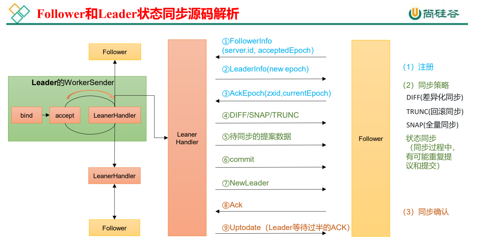

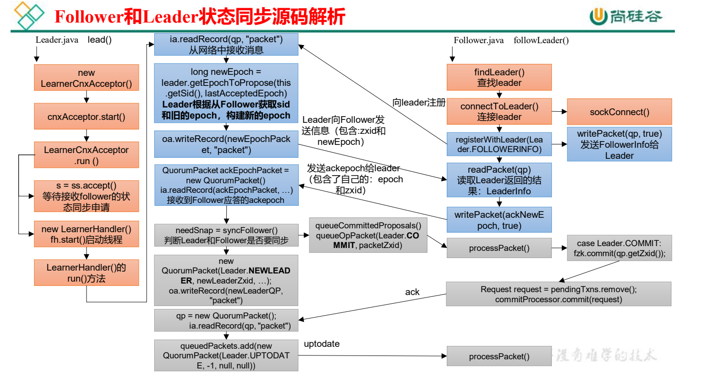

#### 5.1 Leader.lead()等待接收 follower 的状态同步申请

1. 在 Leader.java 中查找 lead()方法

   ```java
   void lead() throws IOException, InterruptedException {
       self.end_fle = Time.currentElapsedTime();
       long electionTimeTaken = self.end_fle - self.start_fle;
       self.setElectionTimeTaken(electionTimeTaken);
       LOG.info("LEADING - LEADER ELECTION TOOK - {} {}", electionTimeTaken,
               QuorumPeer.FLE_TIME_UNIT);
       self.start_fle = 0;
       self.end_fle = 0;
   
       zk.registerJMX(new LeaderBean(this, zk), self.jmxLocalPeerBean);
   
       try {
           self.tick.set(0);
           // 恢复数据到内存，启动时，其实已经加载过了
           zk.loadData();
   
           leaderStateSummary = new StateSummary(self.getCurrentEpoch(), zk.getLastProcessedZxid());
   
           // Start thread that waits for connection requests from
           // new followers.
           // 等待其他 follower 节点向 leader 节点发送同步状态
           cnxAcceptor = new LearnerCnxAcceptor();
           cnxAcceptor.start();
   
           long epoch = getEpochToPropose(self.getId(), self.getAcceptedEpoch());
   
           ......
       } finally {
           zk.unregisterJMX(this);
       }
   }
   ```

2. LearnerCnxAcceptor.java

   ```java
   class LearnerCnxAcceptor extends ZooKeeperCriticalThread {
       private volatile boolean stop = false;
   
       public LearnerCnxAcceptor() {
           super("LearnerCnxAcceptor-" + ss.getLocalSocketAddress(), zk
                   .getZooKeeperServerListener());
       }
   
       @Override
       public void run() {
           try {
               while (!stop) {
                   Socket s = null;
                   boolean error = false;
                   try {
                       // 等待接收 follower 的状态同步申请
                       s = ss.accept();
   
                       // start with the initLimit, once the ack is processed
                       // in LearnerHandler switch to the syncLimit
                       s.setSoTimeout(self.tickTime * self.initLimit);
                       s.setTcpNoDelay(nodelay);
   
                       BufferedInputStream is = new BufferedInputStream(
                               s.getInputStream());
                       // 一旦接收到 follower 的请求，就创建 LearnerHandler 对象，处理请求
                       LearnerHandler fh = new LearnerHandler(s, is, Leader.this);
                       // 启动线程
                       fh.start();
                   } catch (SocketException e) {
                       ......
                   }
                   ......
               }
           } catch (Exception e) {
               LOG.warn("Exception while accepting follower", e.getMessage());
               handleException(this.getName(), e);
           }
       }
   
       public void halt() {
           stop = true;
       }
   }
   ```

   其中 ss 的初始化是在创建 Leader 对象时，创建的 socket

   ```java
   private final ServerSocket ss;
   
   Leader(QuorumPeer self,LeaderZooKeeperServer zk) throws IOException {
       this.self = self;
       this.proposalStats = new BufferStats();
       try {
           if (self.shouldUsePortUnification() || self.isSslQuorum()) {
               boolean allowInsecureConnection = self.shouldUsePortUnification();
               if (self.getQuorumListenOnAllIPs()) {
                   ss = new UnifiedServerSocket(self.getX509Util(), allowInsecureConnection, self.getQuorumAddress().getPort());
               } else {
                   ss = new UnifiedServerSocket(self.getX509Util(), allowInsecureConnection);
               }
           } else {
               if (self.getQuorumListenOnAllIPs()) {
                   ss = new ServerSocket(self.getQuorumAddress().getPort());
               } else {
                   ss = new ServerSocket();
               }
           }
           ss.setReuseAddress(true);
           if (!self.getQuorumListenOnAllIPs()) {
               ss.bind(self.getQuorumAddress());
           }
       } catch (BindException e) {
           if (self.getQuorumListenOnAllIPs()) {
               LOG.error("Couldn't bind to port " + self.getQuorumAddress().getPort(), e);
           } else {
               LOG.error("Couldn't bind to " + self.getQuorumAddress(), e);
           }
           throw e;
       }
       this.zk = zk;
       this.learnerSnapshotThrottler = createLearnerSnapshotThrottler(
               maxConcurrentSnapshots, maxConcurrentSnapshotTimeout);
   }
   ```


#### 5.2 Follower.lead()查找并连接 Leader

- 在 Follower.java 种查找 followLeader()方法

  ```java
  void followLeader() throws InterruptedException {
      self.end_fle = Time.currentElapsedTime();
      long electionTimeTaken = self.end_fle - self.start_fle;
      self.setElectionTimeTaken(electionTimeTaken);
      LOG.info("FOLLOWING - LEADER ELECTION TOOK - {} {}", electionTimeTaken,
              QuorumPeer.FLE_TIME_UNIT);
      self.start_fle = 0;
      self.end_fle = 0;
      fzk.registerJMX(new FollowerBean(this, zk), self.jmxLocalPeerBean);
      try {
          // 查找 leader
          QuorumServer leaderServer = findLeader();            
          try {
              // 连接 leader
              connectToLeader(leaderServer.addr, leaderServer.hostname);
              // 向 leader 注册
              long newEpochZxid = registerWithLeader(Leader.FOLLOWERINFO);
              if (self.isReconfigStateChange())
                 throw new Exception("learned about role change");
              //check to see if the leader zxid is lower than ours
              //this should never happen but is just a safety check
              long newEpoch = ZxidUtils.getEpochFromZxid(newEpochZxid);
              if (newEpoch < self.getAcceptedEpoch()) {
                  LOG.error("Proposed leader epoch " + ZxidUtils.zxidToString(newEpochZxid)
                          + " is less than our accepted epoch " + ZxidUtils.zxidToString(self.getAcceptedEpoch()));
                  throw new IOException("Error: Epoch of leader is lower");
              }
              syncWithLeader(newEpochZxid);                
              QuorumPacket qp = new QuorumPacket();
              while (this.isRunning()) {
                  readPacket(qp);
                  processPacket(qp);
              }
          } catch (Exception e) {
              LOG.warn("Exception when following the leader", e);
              try {
                  sock.close();
              } catch (IOException e1) {
                  e1.printStackTrace();
              }
  
              // clear pending revalidations
              pendingRevalidations.clear();
          }
      } finally {
          zk.unregisterJMX((Learner)this);
      }
  }
  ```

  findLeader();

  ```java
  /**
   * Returns the address of the node we think is the leader.
   */
  protected QuorumServer findLeader() {
      QuorumServer leaderServer = null;
      // Find the leader by id
      // 选举投票的时候记录的，最后推荐的 leader 的 sid
      Vote current = self.getCurrentVote();
      // 如果这个 sid 在启动的所有服务器范围中
      for (QuorumServer s : self.getView().values()) {
          if (s.id == current.getId()) {
              // Ensure we have the leader's correct IP address before
              // attempting to connect.
              // 尝试连接 leader 的正确 IP 地址
              s.recreateSocketAddresses();
              leaderServer = s;
              break;
          }
      }
      if (leaderServer == null) {
          LOG.warn("Couldn't find the leader with id = "
                  + current.getId());
      }
      return leaderServer;
  }
  ```

  connectToLeader(leaderServer.addr, leaderServer.hostname);

  ```java
  protected void connectToLeader(InetSocketAddress addr, String hostname)
          throws IOException, InterruptedException, X509Exception {
      this.sock = createSocket();
  
      int initLimitTime = self.tickTime * self.initLimit;
      int remainingInitLimitTime = initLimitTime;
      long startNanoTime = nanoTime();
  
      for (int tries = 0; tries < 5; tries++) {
          try {
              // recalculate the init limit time because retries sleep for 1000 milliseconds
              remainingInitLimitTime = initLimitTime - (int)((nanoTime() - startNanoTime) / 1000000);
              if (remainingInitLimitTime <= 0) {
                  LOG.error("initLimit exceeded on retries.");
                  throw new IOException("initLimit exceeded on retries.");
              }
  
              sockConnect(sock, addr, Math.min(self.tickTime * self.syncLimit, remainingInitLimitTime));
              if (self.isSslQuorum())  {
                  ((SSLSocket) sock).startHandshake();
              }
              sock.setTcpNoDelay(nodelay);
              break;
          } catch (IOException e) {
              ......
          }
          Thread.sleep(1000);
      }
  
      self.authLearner.authenticate(sock, hostname);
  
      leaderIs = BinaryInputArchive.getArchive(new BufferedInputStream(
              sock.getInputStream()));
      bufferedOutput = new BufferedOutputStream(sock.getOutputStream());
      leaderOs = BinaryOutputArchive.getArchive(bufferedOutput);
  }
  ```


#### 5.3 Leader.lead()创建 LearnerHandler

- Leader.lead()

  ```java
  void lead() throws IOException, InterruptedException {
      self.end_fle = Time.currentElapsedTime();
      long electionTimeTaken = self.end_fle - self.start_fle;
      self.setElectionTimeTaken(electionTimeTaken);
      LOG.info("LEADING - LEADER ELECTION TOOK - {} {}", electionTimeTaken,
              QuorumPeer.FLE_TIME_UNIT);
      self.start_fle = 0;
      self.end_fle = 0;
  
      zk.registerJMX(new LeaderBean(this, zk), self.jmxLocalPeerBean);
  
      try {
          self.tick.set(0);
          zk.loadData();
  
          leaderStateSummary = new StateSummary(self.getCurrentEpoch(), zk.getLastProcessedZxid());
  
          // Start thread that waits for connection requests from
          // new followers.
          cnxAcceptor = new LearnerCnxAcceptor();
          cnxAcceptor.start();
  
          ......
      } finally {
          zk.unregisterJMX(this);
      }
  }
  ```

  new LearnerCnxAcceptor();

  ```java
  class LearnerCnxAcceptor extends ZooKeeperCriticalThread {
      private volatile boolean stop = false;
  
      public LearnerCnxAcceptor() {
          super("LearnerCnxAcceptor-" + ss.getLocalSocketAddress(), zk
                  .getZooKeeperServerListener());
      }
  
      @Override
      public void run() {
          try {
              while (!stop) {
                  Socket s = null;
                  boolean error = false;
                  try {
                      s = ss.accept();
  
                      // start with the initLimit, once the ack is processed
                      // in LearnerHandler switch to the syncLimit
                      s.setSoTimeout(self.tickTime * self.initLimit);
                      s.setTcpNoDelay(nodelay);
  
                      BufferedInputStream is = new BufferedInputStream(
                              s.getInputStream());
                      LearnerHandler fh = new LearnerHandler(s, is, Leader.this);
                      fh.start();
                  } catch (SocketException e) {
                      ......
                  }
              }
          } catch (Exception e) {
              LOG.warn("Exception while accepting follower", e.getMessage());
              handleException(this.getName(), e);
          }
      }
  
      public void halt() {
          stop = true;
      }
  }
  ```

  由于 public class LearnerHandler extends ZooKeeperThread{}，说明 LearnerHandler 是一个线程。所以 fh.start()执行的是 LearnerHandler 中的 run()方法。

  ```java
  @Override
  public void run() {
      try {
          leader.addLearnerHandler(this);
          // 心跳处理
          tickOfNextAckDeadline = leader.self.tick.get()
                  + leader.self.initLimit + leader.self.syncLimit;
  
          ia = BinaryInputArchive.getArchive(bufferedInput);
          bufferedOutput = new BufferedOutputStream(sock.getOutputStream());
          oa = BinaryOutputArchive.getArchive(bufferedOutput);
  
          // 从网络中接收消息，并反序列化为 packet
          QuorumPacket qp = new QuorumPacket();
          ia.readRecord(qp, "packet");
          // 选举结束后，observer 和 follower 都应该给 leader 发送一个标志信息：FOLLOWERINFO 或者 OBSERVERINFO
          if(qp.getType() != Leader.FOLLOWERINFO && qp.getType() != Leader.OBSERVERINFO){
              LOG.error("First packet " + qp.toString()
                      + " is not FOLLOWERINFO or OBSERVERINFO!");
              return;
          }
  
          byte learnerInfoData[] = qp.getData();
          if (learnerInfoData != null) {
              ByteBuffer bbsid = ByteBuffer.wrap(learnerInfoData);
              if (learnerInfoData.length >= 8) {
                  this.sid = bbsid.getLong();
              }
              if (learnerInfoData.length >= 12) {
                  this.version = bbsid.getInt(); // protocolVersion
              }
              if (learnerInfoData.length >= 20) {
                  long configVersion = bbsid.getLong();
                  if (configVersion > leader.self.getQuorumVerifier().getVersion()) {
                      throw new IOException("Follower is ahead of the leader (has a later activated configuration)");
                  }
              }
          } else {
              this.sid = leader.followerCounter.getAndDecrement();
          }
  
          if (leader.self.getView().containsKey(this.sid)) {
              LOG.info("Follower sid: " + this.sid + " : info : "
                      + leader.self.getView().get(this.sid).toString());
          } else {
              LOG.info("Follower sid: " + this.sid + " not in the current config " + Long.toHexString(leader.self.getQuorumVerifier().getVersion()));
          }
                      
          if (qp.getType() == Leader.OBSERVERINFO) {
                learnerType = LearnerType.OBSERVER;
          }
  
          // 读取 Follower 发送过来的 lastAcceptedEpoch
          // 选举过程中，所使用的 epoch，其实还是上一任 leader 的 epoch
          long lastAcceptedEpoch = ZxidUtils.getEpochFromZxid(qp.getZxid());
  
          long peerLastZxid;
          StateSummary ss = null;
          // 读取 follower 发送过来的 zxid
          long zxid = qp.getZxid();
          // Leader 根据从 Follower 获取 sid 和旧的 epoch，构建新的 epoch
          long newEpoch = leader.getEpochToPropose(this.getSid(), lastAcceptedEpoch);
          long newLeaderZxid = ZxidUtils.makeZxid(newEpoch, 0);
  
          if (this.getVersion() < 0x10000) {
              // we are going to have to extrapolate the epoch information
              long epoch = ZxidUtils.getEpochFromZxid(zxid);
              ss = new StateSummary(epoch, zxid);
              // fake the message
              leader.waitForEpochAck(this.getSid(), ss);
          } else {
              byte ver[] = new byte[4];
              ByteBuffer.wrap(ver).putInt(0x10000);
              // Leader 向 Follower 发送信息（包含:zxid 和 newEpoch）
              QuorumPacket newEpochPacket = new QuorumPacket(Leader.LEADERINFO, newLeaderZxid, ver, null);
              oa.writeRecord(newEpochPacket, "packet");
              bufferedOutput.flush();
              QuorumPacket ackEpochPacket = new QuorumPacket();
              ia.readRecord(ackEpochPacket, "packet");
              if (ackEpochPacket.getType() != Leader.ACKEPOCH) {
                  LOG.error(ackEpochPacket.toString()
                          + " is not ACKEPOCH");
                  return;
  }
              ByteBuffer bbepoch = ByteBuffer.wrap(ackEpochPacket.getData());
              ss = new StateSummary(bbepoch.getInt(), ackEpochPacket.getZxid());
              leader.waitForEpochAck(this.getSid(), ss);
          }
          peerLastZxid = ss.getLastZxid();
         
          // Take any necessary action if we need to send TRUNC or DIFF
          // startForwarding() will be called in all cases
          boolean needSnap = syncFollower(peerLastZxid, leader.zk.getZKDatabase(), leader);
          
          /* if we are not truncating or sending a diff just send a snapshot */
          if (needSnap) {
              boolean exemptFromThrottle = getLearnerType() != LearnerType.OBSERVER;
              LearnerSnapshot snapshot = 
                      leader.getLearnerSnapshotThrottler().beginSnapshot(exemptFromThrottle);
              try {
                  long zxidToSend = leader.zk.getZKDatabase().getDataTreeLastProcessedZxid();
                  oa.writeRecord(new QuorumPacket(Leader.SNAP, zxidToSend, null, null), "packet");
                  bufferedOutput.flush();
  
                  LOG.info("Sending snapshot last zxid of peer is 0x{}, zxid of leader is 0x{}, "
                          + "send zxid of db as 0x{}, {} concurrent snapshots, " 
                          + "snapshot was {} from throttle",
                          Long.toHexString(peerLastZxid), 
                          Long.toHexString(leaderLastZxid),
                          Long.toHexString(zxidToSend), 
                          snapshot.getConcurrentSnapshotNumber(),
                          snapshot.isEssential() ? "exempt" : "not exempt");
                  // Dump data to peer
                  leader.zk.getZKDatabase().serializeSnapshot(oa);
                  oa.writeString("BenWasHere", "signature");
                  bufferedOutput.flush();
              } finally {
                  snapshot.close();
              }
          }
  
          LOG.debug("Sending NEWLEADER message to " + sid);
          // the version of this quorumVerifier will be set by leader.lead() in case
          // the leader is just being established. waitForEpochAck makes sure that readyToStart is true if
          // we got here, so the version was set
          if (getVersion() < 0x10000) {
              QuorumPacket newLeaderQP = new QuorumPacket(Leader.NEWLEADER,
                      newLeaderZxid, null, null);
              oa.writeRecord(newLeaderQP, "packet");
          } else {
              QuorumPacket newLeaderQP = new QuorumPacket(Leader.NEWLEADER,
                      newLeaderZxid, leader.self.getLastSeenQuorumVerifier()
                              .toString().getBytes(), null);
              queuedPackets.add(newLeaderQP);
          }
          bufferedOutput.flush();
  
          // Start thread that blast packets in the queue to learner
          startSendingPackets();
          
          /*
           * Have to wait for the first ACK, wait until
           * the leader is ready, and only then we can
           * start processing messages.
           */
          qp = new QuorumPacket();
          ia.readRecord(qp, "packet");
          if(qp.getType() != Leader.ACK){
              LOG.error("Next packet was supposed to be an ACK,"
                  + " but received packet: {}", packetToString(qp));
              return;
          }
  
          if(LOG.isDebugEnabled()){
             LOG.debug("Received NEWLEADER-ACK message from " + sid);   
          }
          leader.waitForNewLeaderAck(getSid(), qp.getZxid());
  
          syncLimitCheck.start();
          
          // now that the ack has been processed expect the syncLimit
          sock.setSoTimeout(leader.self.tickTime * leader.self.syncLimit);
  
          /*
           * Wait until leader starts up
           */
          synchronized(leader.zk){
              while(!leader.zk.isRunning() && !this.isInterrupted()){
                  leader.zk.wait(20);
              }
          }
          // Mutation packets will be queued during the serialize,
          // so we need to mark when the peer can actually start
          // using the data
          //
          LOG.debug("Sending UPTODATE message to " + sid);      
          queuedPackets.add(new QuorumPacket(Leader.UPTODATE, -1, null, null));
  
          while (true) {
              qp = new QuorumPacket();
              ia.readRecord(qp, "packet");
  
              long traceMask = ZooTrace.SERVER_PACKET_TRACE_MASK;
              if (qp.getType() == Leader.PING) {
                  traceMask = ZooTrace.SERVER_PING_TRACE_MASK;
              }
              if (LOG.isTraceEnabled()) {
                  ZooTrace.logQuorumPacket(LOG, traceMask, 'i', qp);
              }
              tickOfNextAckDeadline = leader.self.tick.get() + leader.self.syncLimit;
  
  
              ByteBuffer bb;
              long sessionId;
              int cxid;
              int type;
  
              switch (qp.getType()) {
              case Leader.ACK:
                  if (this.learnerType == LearnerType.OBSERVER) {
                      if (LOG.isDebugEnabled()) {
                          LOG.debug("Received ACK from Observer  " + this.sid);
                      }
                  }
                  syncLimitCheck.updateAck(qp.getZxid());
                  leader.processAck(this.sid, qp.getZxid(), sock.getLocalSocketAddress());
                  break;
              case Leader.PING:
                  // Process the touches
                  ByteArrayInputStream bis = new ByteArrayInputStream(qp
                          .getData());
                  DataInputStream dis = new DataInputStream(bis);
                  while (dis.available() > 0) {
                      long sess = dis.readLong();
                      int to = dis.readInt();
                      leader.zk.touch(sess, to);
                  }
                  break;
              case Leader.REVALIDATE:
                  bis = new ByteArrayInputStream(qp.getData());
                  dis = new DataInputStream(bis);
                  long id = dis.readLong();
                  int to = dis.readInt();
                  ByteArrayOutputStream bos = new ByteArrayOutputStream();
                  DataOutputStream dos = new DataOutputStream(bos);
                  dos.writeLong(id);
                  boolean valid = leader.zk.checkIfValidGlobalSession(id, to);
                  if (valid) {
                      try {
                          //set the session owner
                          // as the follower that
                          // owns the session
                          leader.zk.setOwner(id, this);
                      } catch (SessionExpiredException e) {
                          LOG.error("Somehow session " + Long.toHexString(id) +
                                  " expired right after being renewed! (impossible)", e);
                      }
                  }
                  if (LOG.isTraceEnabled()) {
                      ZooTrace.logTraceMessage(LOG,
                                               ZooTrace.SESSION_TRACE_MASK,
                                               "Session 0x" + Long.toHexString(id)
                                               + " is valid: "+ valid);
                  }
                  dos.writeBoolean(valid);
                  qp.setData(bos.toByteArray());
                  queuedPackets.add(qp);
                  break;
              case Leader.REQUEST:
                  bb = ByteBuffer.wrap(qp.getData());
                  sessionId = bb.getLong();
                  cxid = bb.getInt();
                  type = bb.getInt();
                  bb = bb.slice();
                  Request si;
                  if(type == OpCode.sync){
                      si = new LearnerSyncRequest(this, sessionId, cxid, type, bb, qp.getAuthinfo());
                  } else {
                      si = new Request(null, sessionId, cxid, type, bb, qp.getAuthinfo());
                  }
                  si.setOwner(this);
                  leader.zk.submitLearnerRequest(si);
                  break;
              default:
                  LOG.warn("unexpected quorum packet, type: {}", packetToString(qp));
                  break;
              }
          }
      } catch (IOException e) {
          if (sock != null && !sock.isClosed()) {
              LOG.error("Unexpected exception causing shutdown while sock "
                      + "still open", e);
             //close the socket to make sure the
             //other side can see it being close
             try {
                sock.close();
             } catch(IOException ie) {
                // do nothing
             }
          }
      } catch (InterruptedException e) {
          LOG.error("Unexpected exception causing shutdown", e);
      } catch (SnapshotThrottleException e) {
          LOG.error("too many concurrent snapshots: " + e);
      } finally {
          LOG.warn("******* GOODBYE "
                  + (sock != null ? sock.getRemoteSocketAddress() : "<null>")
                  + " ********");
          shutdown();
      }
  }
  ```


#### 5.4 Follower.followLeader()创建 registerWithLeader

-  Follower.followLeader()

  ```java
  void followLeader() throws InterruptedException {
      self.end_fle = Time.currentElapsedTime();
      long electionTimeTaken = self.end_fle - self.start_fle;
      self.setElectionTimeTaken(electionTimeTaken);
      LOG.info("FOLLOWING - LEADER ELECTION TOOK - {} {}", electionTimeTaken,
              QuorumPeer.FLE_TIME_UNIT);
      self.start_fle = 0;
      self.end_fle = 0;
      fzk.registerJMX(new FollowerBean(this, zk), self.jmxLocalPeerBean);
      try {
          // 查找 leader
          QuorumServer leaderServer = findLeader();            
          try {
              // 连接 leader
              connectToLeader(leaderServer.addr, leaderServer.hostname);
              // 向 leader 注册
              long newEpochZxid = registerWithLeader(Leader.FOLLOWERINFO);
              if (self.isReconfigStateChange())
                 throw new Exception("learned about role change");
              //check to see if the leader zxid is lower than ours
              //this should never happen but is just a safety check
              long newEpoch = ZxidUtils.getEpochFromZxid(newEpochZxid);
              if (newEpoch < self.getAcceptedEpoch()) {
                  LOG.error("Proposed leader epoch " + ZxidUtils.zxidToString(newEpochZxid)
                          + " is less than our accepted epoch " + ZxidUtils.zxidToString(self.getAcceptedEpoch()));
                  throw new IOException("Error: Epoch of leader is lower");
              }
              syncWithLeader(newEpochZxid);                
              QuorumPacket qp = new QuorumPacket();
              // 循环等待接收消息
              while (this.isRunning()) {
                  // 读取 packet 信息
                  readPacket(qp);
                  // 处理 packet 消息
                  processPacket(qp);
              }
          } catch (Exception e) {
              LOG.warn("Exception when following the leader", e);
              try {
                  sock.close();
              } catch (IOException e1) {
                  e1.printStackTrace();
              }
  
              // clear pending revalidations
              pendingRevalidations.clear();
          }
      } finally {
          zk.unregisterJMX((Learner)this);
      }
  }
  ```

- registerWithLeader(Leader.FOLLOWERINFO);

  ```java
  protected long registerWithLeader(int pktType) throws IOException{
        /*
         * Send follower info, including last zxid and sid
         */
     long lastLoggedZxid = self.getLastLoggedZxid();
        QuorumPacket qp = new QuorumPacket();                
        qp.setType(pktType);
        qp.setZxid(ZxidUtils.makeZxid(self.getAcceptedEpoch(), 0));
        
        /*
         * Add sid to payload
         */
        LearnerInfo li = new LearnerInfo(self.getId(), 0x10000, self.getQuorumVerifier().getVersion());
        ByteArrayOutputStream bsid = new ByteArrayOutputStream();
        BinaryOutputArchive boa = BinaryOutputArchive.getArchive(bsid);
        boa.writeRecord(li, "LearnerInfo");
        qp.setData(bsid.toByteArray());
        
        // 发送 FollowerInfo 给 Leader
        writePacket(qp, true);
        // 读取 Leader 返回的结果：LeaderInfo
        readPacket(qp);        
        final long newEpoch = ZxidUtils.getEpochFromZxid(qp.getZxid());
      // 如果接收到 LeaderInfo
  	if (qp.getType() == Leader.LEADERINFO) {
         // we are connected to a 1.0 server so accept the new epoch and read the next packet
         leaderProtocolVersion = ByteBuffer.wrap(qp.getData()).getInt();
         byte epochBytes[] = new byte[4];
         final ByteBuffer wrappedEpochBytes = ByteBuffer.wrap(epochBytes);
         // 接收 leader 的 epoch
         if (newEpoch > self.getAcceptedEpoch()) {
            // 把自己原来的 epoch 保存在 wrappedEpochBytes 里
            wrappedEpochBytes.putInt((int)self.getCurrentEpoch());
            // 把 leader 发送过来的 epoch 保存起来
            self.setAcceptedEpoch(newEpoch);
         } else if (newEpoch == self.getAcceptedEpoch()) {
            // since we have already acked an epoch equal to the leaders, we cannot ack
            // again, but we still need to send our lastZxid to the leader so that we can
            // sync with it if it does assume leadership of the epoch.
            // the -1 indicates that this reply should not count as an ack for the new epoch
                wrappedEpochBytes.putInt(-1);
         } else {
            throw new IOException("Leaders epoch, " + newEpoch + " is less than accepted epoch, " + self.getAcceptedEpoch());
         }
         // 发送 ackepoch 给 leader（包含了自己的：epoch 和 zxid）
         QuorumPacket ackNewEpoch = new QuorumPacket(Leader.ACKEPOCH, lastLoggedZxid, epochBytes, null);
         writePacket(ackNewEpoch, true);
            return ZxidUtils.makeZxid(newEpoch, 0);
        } else {
         if (newEpoch > self.getAcceptedEpoch()) {
            self.setAcceptedEpoch(newEpoch);
         }
            if (qp.getType() != Leader.NEWLEADER) {
                LOG.error("First packet should have been NEWLEADER");
                throw new IOException("First packet should have been NEWLEADER");
            }
            return qp.getZxid();
        }
    } 
  ```


#### 5.5 Leader.lead()接收 Follwer 状态，根据同步方式发送同步消息

- LearnerHandler 中的 run()方法。

  ```java
  @Override
  public void run() {
      try {
          leader.addLearnerHandler(this);
          // 心跳处理
          tickOfNextAckDeadline = leader.self.tick.get()
                  + leader.self.initLimit + leader.self.syncLimit;
  
          ia = BinaryInputArchive.getArchive(bufferedInput);
          bufferedOutput = new BufferedOutputStream(sock.getOutputStream());
          oa = BinaryOutputArchive.getArchive(bufferedOutput);
  
          // 从网络中接收消息，并反序列化为 packet
          QuorumPacket qp = new QuorumPacket();
          ia.readRecord(qp, "packet");
          // 选举结束后，observer 和 follower 都应该给 leader 发送一个标志信息：FOLLOWERINFO 或者 OBSERVERINFO
          if(qp.getType() != Leader.FOLLOWERINFO && qp.getType() != Leader.OBSERVERINFO){
              LOG.error("First packet " + qp.toString()
                      + " is not FOLLOWERINFO or OBSERVERINFO!");
              return;
          }
  
          byte learnerInfoData[] = qp.getData();
          if (learnerInfoData != null) {
              ByteBuffer bbsid = ByteBuffer.wrap(learnerInfoData);
              if (learnerInfoData.length >= 8) {
                  this.sid = bbsid.getLong();
              }
              if (learnerInfoData.length >= 12) {
                  this.version = bbsid.getInt(); // protocolVersion
              }
              if (learnerInfoData.length >= 20) {
                  long configVersion = bbsid.getLong();
                  if (configVersion > leader.self.getQuorumVerifier().getVersion()) {
                      throw new IOException("Follower is ahead of the leader (has a later activated configuration)");
                  }
              }
          } else {
              this.sid = leader.followerCounter.getAndDecrement();
          }
  
          if (leader.self.getView().containsKey(this.sid)) {
              LOG.info("Follower sid: " + this.sid + " : info : "
                      + leader.self.getView().get(this.sid).toString());
          } else {
              LOG.info("Follower sid: " + this.sid + " not in the current config " + Long.toHexString(leader.self.getQuorumVerifier().getVersion()));
          }
                      
          if (qp.getType() == Leader.OBSERVERINFO) {
                learnerType = LearnerType.OBSERVER;
          }
  
          // 读取 Follower 发送过来的 lastAcceptedEpoch
          // 选举过程中，所使用的 epoch，其实还是上一任 leader 的 epoch
          long lastAcceptedEpoch = ZxidUtils.getEpochFromZxid(qp.getZxid());
  
          long peerLastZxid;
          StateSummary ss = null;
          // 读取 follower 发送过来的 zxid
          long zxid = qp.getZxid();
          // 获取 leader 的最新 epoch
          // 新的 leader 会构建一个新的 epoch
          long newEpoch = leader.getEpochToPropose(this.getSid(), lastAcceptedEpoch);
          long newLeaderZxid = ZxidUtils.makeZxid(newEpoch, 0);
  
          if (this.getVersion() < 0x10000) {
              // we are going to have to extrapolate the epoch information
              long epoch = ZxidUtils.getEpochFromZxid(zxid);
              ss = new StateSummary(epoch, zxid);
              // fake the message
              leader.waitForEpochAck(this.getSid(), ss);
          } else {
              byte ver[] = new byte[4];
              ByteBuffer.wrap(ver).putInt(0x10000);
              // Leader 向 Follower 发送信息（包含:zxid 和 newEpoch）
              QuorumPacket newEpochPacket = new QuorumPacket(Leader.LEADERINFO, newLeaderZxid, ver, null);
              oa.writeRecord(newEpochPacket, "packet");
              bufferedOutput.flush();
              // 接收到 Follower 应答的 ackepoch
              QuorumPacket ackEpochPacket = new QuorumPacket();
              ia.readRecord(ackEpochPacket, "packet");
              if (ackEpochPacket.getType() != Leader.ACKEPOCH) {
                  LOG.error(ackEpochPacket.toString()
                          + " is not ACKEPOCH");
                  return;
  }
              ByteBuffer bbepoch = ByteBuffer.wrap(ackEpochPacket.getData());
              // 保存了对方 follower 或者 observer 的状态：epoch 和 zxid
              ss = new StateSummary(bbepoch.getInt(), ackEpochPacket.getZxid());
              leader.waitForEpochAck(this.getSid(), ss);
          }
          peerLastZxid = ss.getLastZxid();
         
          // Take any necessary action if we need to send TRUNC or DIFF
          // startForwarding() will be called in all cases
          // 方法判断 Leader 和 Follower 是否需要同步
          boolean needSnap = syncFollower(peerLastZxid, leader.zk.getZKDatabase(), leader);
          
          /* if we are not truncating or sending a diff just send a snapshot */
          if (needSnap) {
              boolean exemptFromThrottle = getLearnerType() != LearnerType.OBSERVER;
              LearnerSnapshot snapshot = 
                      leader.getLearnerSnapshotThrottler().beginSnapshot(exemptFromThrottle);
              try {
                  long zxidToSend = leader.zk.getZKDatabase().getDataTreeLastProcessedZxid();
                  oa.writeRecord(new QuorumPacket(Leader.SNAP, zxidToSend, null, null), "packet");
                  bufferedOutput.flush();
  
                  LOG.info("Sending snapshot last zxid of peer is 0x{}, zxid of leader is 0x{}, "
                          + "send zxid of db as 0x{}, {} concurrent snapshots, " 
                          + "snapshot was {} from throttle",
                          Long.toHexString(peerLastZxid), 
                          Long.toHexString(leaderLastZxid),
                          Long.toHexString(zxidToSend), 
                          snapshot.getConcurrentSnapshotNumber(),
                          snapshot.isEssential() ? "exempt" : "not exempt");
                  // Dump data to peer
                  leader.zk.getZKDatabase().serializeSnapshot(oa);
                  oa.writeString("BenWasHere", "signature");
                  bufferedOutput.flush();
              } finally {
                  snapshot.close();
              }
          }
  
          LOG.debug("Sending NEWLEADER message to " + sid);
          // the version of this quorumVerifier will be set by leader.lead() in case
          // the leader is just being established. waitForEpochAck makes sure that readyToStart is true if
          // we got here, so the version was set
          if (getVersion() < 0x10000) {
              QuorumPacket newLeaderQP = new QuorumPacket(Leader.NEWLEADER,
                      newLeaderZxid, null, null);
              oa.writeRecord(newLeaderQP, "packet");
          } else {
              QuorumPacket newLeaderQP = new QuorumPacket(Leader.NEWLEADER,
                      newLeaderZxid, leader.self.getLastSeenQuorumVerifier()
                              .toString().getBytes(), null);
              queuedPackets.add(newLeaderQP);
          }
          ......
  
          while (true) {
              ......
          }
      } catch (IOException e) {
          ......
      } finally {
          ......
      }
  }
  ```

  syncFollower(peerLastZxid, leader.zk.getZKDatabase(), leader);

  ```java
  public boolean syncFollower(long peerLastZxid, ZKDatabase db, Leader leader) {
      /*
       * When leader election is completed, the leader will set its
       * lastProcessedZxid to be (epoch < 32). There will be no txn associated
       * with this zxid.
       *
       * The learner will set its lastProcessedZxid to the same value if
       * it get DIFF or SNAP from the leader. If the same learner come
       * back to sync with leader using this zxid, we will never find this
       * zxid in our history. In this case, we will ignore TRUNC logic and
       * always send DIFF if we have old enough history
       */
      boolean isPeerNewEpochZxid = (peerLastZxid & 0xffffffffL) == 0;
      // Keep track of the latest zxid which already queued
      long currentZxid = peerLastZxid;
      boolean needSnap = true;
      boolean txnLogSyncEnabled = db.isTxnLogSyncEnabled();
      ReentrantReadWriteLock lock = db.getLogLock();
      ReadLock rl = lock.readLock();
      try {
          rl.lock();
          long maxCommittedLog = db.getmaxCommittedLog();
          long minCommittedLog = db.getminCommittedLog();
          long lastProcessedZxid = db.getDataTreeLastProcessedZxid();
  
          LOG.info("Synchronizing with Follower sid: {} maxCommittedLog=0x{}"
                  + " minCommittedLog=0x{} lastProcessedZxid=0x{}"
                  + " peerLastZxid=0x{}", getSid(),
                  Long.toHexString(maxCommittedLog),
                  Long.toHexString(minCommittedLog),
                  Long.toHexString(lastProcessedZxid),
                  Long.toHexString(peerLastZxid));
  
          if (db.getCommittedLog().isEmpty()) {
              /*
               * It is possible that committedLog is empty. In that case
               * setting these value to the latest txn in leader db
               * will reduce the case that we need to handle
               *
               * Here is how each case handle by the if block below
               * 1. lastProcessZxid == peerZxid -> Handle by (2)
               * 2. lastProcessZxid < peerZxid -> Handle by (3)
               * 3. lastProcessZxid > peerZxid -> Handle by (5)
               */
              minCommittedLog = lastProcessedZxid;
              maxCommittedLog = lastProcessedZxid;
          }
  
          /*
           * Here are the cases that we want to handle
           *
           * 1. Force sending snapshot (for testing purpose)
           * 2. Peer and leader is already sync, send empty diff
           * 3. Follower has txn that we haven't seen. This may be old leader
           *    so we need to send TRUNC. However, if peer has newEpochZxid,
           *    we cannot send TRUNC since the follower has no txnlog
           * 4. Follower is within committedLog range or already in-sync.
           *    We may need to send DIFF or TRUNC depending on follower's zxid
           *    We always send empty DIFF if follower is already in-sync
           * 5. Follower missed the committedLog. We will try to use on-disk
           *    txnlog + committedLog to sync with follower. If that fail,
           *    we will send snapshot
           */
  
          if (forceSnapSync) {
              // Force leader to use snapshot to sync with follower
              LOG.warn("Forcing snapshot sync - should not see this in production");
          } else if (lastProcessedZxid == peerLastZxid) {
              // Follower is already sync with us, send empty diff
              LOG.info("Sending DIFF zxid=0x" + Long.toHexString(peerLastZxid) +
                       " for peer sid: " +  getSid());
              queueOpPacket(Leader.DIFF, peerLastZxid);
              needOpPacket = false;
              needSnap = false;
          } else if (peerLastZxid > maxCommittedLog && !isPeerNewEpochZxid) {
              // Newer than committedLog, send trunc and done
              LOG.debug("Sending TRUNC to follower zxidToSend=0x" +
                        Long.toHexString(maxCommittedLog) +
                        " for peer sid:" +  getSid());
              queueOpPacket(Leader.TRUNC, maxCommittedLog);
              currentZxid = maxCommittedLog;
              needOpPacket = false;
              needSnap = false;
          } else if ((maxCommittedLog >= peerLastZxid)
                  && (minCommittedLog <= peerLastZxid)) {
              // Follower is within commitLog range
              LOG.info("Using committedLog for peer sid: " +  getSid());
              Iterator<Proposal> itr = db.getCommittedLog().iterator();
              currentZxid = queueCommittedProposals(itr, peerLastZxid,
                                                   null, maxCommittedLog);
              needSnap = false;
          } else if (peerLastZxid < minCommittedLog && txnLogSyncEnabled) {
              // Use txnlog and committedLog to sync
  
              // Calculate sizeLimit that we allow to retrieve txnlog from disk
              long sizeLimit = db.calculateTxnLogSizeLimit();
              // This method can return empty iterator if the requested zxid
              // is older than on-disk txnlog
              Iterator<Proposal> txnLogItr = db.getProposalsFromTxnLog(
                      peerLastZxid, sizeLimit);
              if (txnLogItr.hasNext()) {
                  LOG.info("Use txnlog and committedLog for peer sid: " +  getSid());
                  currentZxid = queueCommittedProposals(txnLogItr, peerLastZxid,
                                                       minCommittedLog, maxCommittedLog);
  
                  LOG.debug("Queueing committedLog 0x" + Long.toHexString(currentZxid));
                  Iterator<Proposal> committedLogItr = db.getCommittedLog().iterator();
                  currentZxid = queueCommittedProposals(committedLogItr, currentZxid,
                                                       null, maxCommittedLog);
                  needSnap = false;
              }
              // closing the resources
              if (txnLogItr instanceof TxnLogProposalIterator) {
                  TxnLogProposalIterator txnProposalItr = (TxnLogProposalIterator) txnLogItr;
                  txnProposalItr.close();
              }
          } else {
              LOG.warn("Unhandled scenario for peer sid: " +  getSid());
          }
          LOG.debug("Start forwarding 0x" + Long.toHexString(currentZxid) +
                    " for peer sid: " +  getSid());
          leaderLastZxid = leader.startForwarding(this, currentZxid);
      } finally {
          rl.unlock();
      }
  
      if (needOpPacket && !needSnap) {
          // This should never happen, but we should fall back to sending
          // snapshot just in case.
          LOG.error("Unhandled scenario for peer sid: " +  getSid() +
                   " fall back to use snapshot");
          needSnap = true;
      }
  
      return needSnap;
  }
  ```


#### 5.6 Follower.lead()应答 Leader 同步结果

- Follower.processPacket(qp)

  ```java
  protected void processPacket(QuorumPacket qp) throws Exception{
      switch (qp.getType()) {
      case Leader.PING:            
          ping(qp);            
          break;
      case Leader.PROPOSAL:           
          TxnHeader hdr = new TxnHeader();
          Record txn = SerializeUtils.deserializeTxn(qp.getData(), hdr);
          if (hdr.getZxid() != lastQueued + 1) {
              LOG.warn("Got zxid 0x"
                      + Long.toHexString(hdr.getZxid())
                      + " expected 0x"
                      + Long.toHexString(lastQueued + 1));
          }
          lastQueued = hdr.getZxid();
          
          if (hdr.getType() == OpCode.reconfig){
             SetDataTxn setDataTxn = (SetDataTxn) txn;       
             QuorumVerifier qv = self.configFromString(new String(setDataTxn.getData()));
             self.setLastSeenQuorumVerifier(qv, true);                               
          }
          
          fzk.logRequest(hdr, txn);
          break;
      case Leader.COMMIT:
          fzk.commit(qp.getZxid());
          break;
          
      case Leader.COMMITANDACTIVATE:
         // get the new configuration from the request
         Request request = fzk.pendingTxns.element();
         SetDataTxn setDataTxn = (SetDataTxn) request.getTxn();                                                                                                      
         QuorumVerifier qv = self.configFromString(new String(setDataTxn.getData()));                                
  
         // get new designated leader from (current) leader's message
         ByteBuffer buffer = ByteBuffer.wrap(qp.getData());    
         long suggestedLeaderId = buffer.getLong();
          boolean majorChange = 
                 self.processReconfig(qv, suggestedLeaderId, qp.getZxid(), true);
         // commit (writes the new config to ZK tree (/zookeeper/config)                     
         fzk.commit(qp.getZxid());
          if (majorChange) {
             throw new Exception("changes proposed in reconfig");
         }
         break;
      case Leader.UPTODATE:
          LOG.error("Received an UPTODATE message after Follower started");
          break;
      case Leader.REVALIDATE:
          revalidate(qp);
          break;
      case Leader.SYNC:
          fzk.sync();
          break;
      default:
          LOG.warn("Unknown packet type: {}", LearnerHandler.packetToString(qp));
          break;
      }
  }
  ```

  fzk.commit(qp.getZxid());

  ```java
  public void commit(long zxid) {
      if (pendingTxns.size() == 0) {
          LOG.warn("Committing " + Long.toHexString(zxid)
                  + " without seeing txn");
          return;
      }
      long firstElementZxid = pendingTxns.element().zxid;
      if (firstElementZxid != zxid) {
          LOG.error("Committing zxid 0x" + Long.toHexString(zxid)
                  + " but next pending txn 0x"
                  + Long.toHexString(firstElementZxid));
          System.exit(12);
      }
      Request request = pendingTxns.remove();
      commitProcessor.commit(request);
  }
  ```


#### 5.7 Leader.lead()应答 Follower

由于 public class LearnerHandler extends ZooKeeperThread{}，说明 LearnerHandler 是一个线程。所以 fh.start()执行的是 LearnerHandler 中的 run()方法。

```java
@Override
public void run() {
    ......
        // Mutation packets will be queued during the serialize,
        // so we need to mark when the peer can actually start
        // using the data
        //
        LOG.debug("Sending UPTODATE message to " + sid);      
        queuedPackets.add(new QuorumPacket(Leader.UPTODATE, -1, null, null));

        while (true) {
            ......
        }
    } catch (IOException e) {
        ......
    } finally {
        ......
    }
}
```


### 6 服务端Leader启动

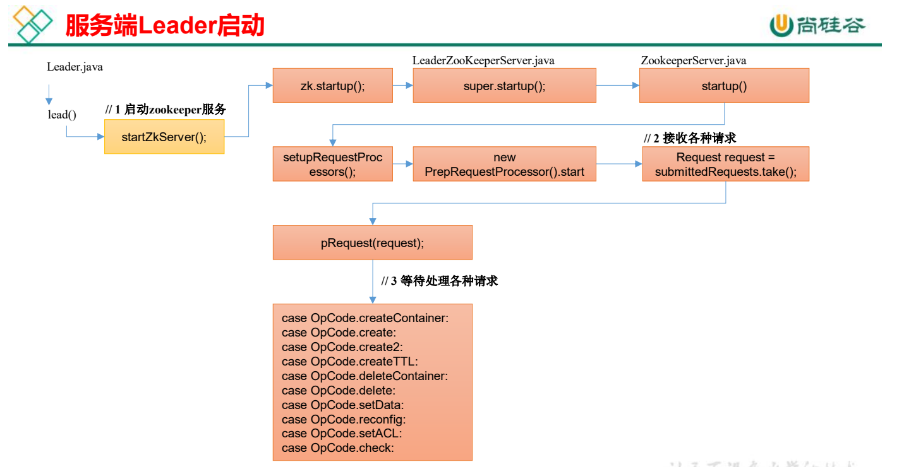

ZooKeeperServer

- Leader.lead()

  ```java
  void lead() throws IOException, InterruptedException {
      ......
  
      // 启动 zookeeper 服务
      startZkServer();
           
      ......
  }
  ```

- Leader.startZkServer();

  ```java
  final LeaderZooKeeperServer zk;
  
  /**
   * Start up Leader ZooKeeper server and initialize zxid to the new epoch
   */
  private synchronized void startZkServer() {
      ......
      
      // 启动 Zookeeper
      zk.startup();
      
      ......
  }
  ```

- LeaderZooKeeperServer.java

  ```java
  @Override
  public synchronized void startup() {
      super.startup();
      if (containerManager != null) {
          containerManager.start();
      }
  }
  ```

- ZookeeperServer.java

  ```java
  public synchronized void startup() {
      if (sessionTracker == null) {
          createSessionTracker();
      }
      startSessionTracker();
      setupRequestProcessors();
  
      registerJMX();
  
      setState(State.RUNNING);
      notifyAll();
  }
  ```

  setupRequestProcessors();

  ```java
  protected void setupRequestProcessors() {
      RequestProcessor finalProcessor = new FinalRequestProcessor(this);
      RequestProcessor syncProcessor = new SyncRequestProcessor(this,
              finalProcessor);
      ((SyncRequestProcessor)syncProcessor).start();
      firstProcessor = new PrepRequestProcessor(this, syncProcessor);
      ((PrepRequestProcessor)firstProcessor).start();
  }
  ```

  点击 PrepRequestProcessor，并查找它的 run 方法

  ```java
  @Override
  public void run() {
      try {
          while (true) {
              Request request = submittedRequests.take();
              long traceMask = ZooTrace.CLIENT_REQUEST_TRACE_MASK;
              if (request.type == OpCode.ping) {
                  traceMask = ZooTrace.CLIENT_PING_TRACE_MASK;
              }
              if (LOG.isTraceEnabled()) {
                  ZooTrace.logRequest(LOG, traceMask, 'P', request, "");
              }
              if (Request.requestOfDeath == request) {
                  break;
              }
              pRequest(request);
          }
      } catch (RequestProcessorException e) {
          if (e.getCause() instanceof XidRolloverException) {
              LOG.info(e.getCause().getMessage());
          }
          handleException(this.getName(), e);
      } catch (Exception e) {
          handleException(this.getName(), e);
      }
      LOG.info("PrepRequestProcessor exited loop!");
  }
  ```

  pRequest(request);

  ```java
  protected void pRequest(Request request) throws RequestProcessorException {
      // LOG.info("Prep>>> cxid = " + request.cxid + " type = " +
      // request.type + " id = 0x" + Long.toHexString(request.sessionId));
      request.setHdr(null);
      request.setTxn(null);
  
      try {
          switch (request.type) {
          case OpCode.createContainer:
          case OpCode.create:
          case OpCode.create2:
              CreateRequest create2Request = new CreateRequest();
              pRequest2Txn(request.type, zks.getNextZxid(), request, create2Request, true);
              break;
          case OpCode.createTTL:
              CreateTTLRequest createTtlRequest = new CreateTTLRequest();
              pRequest2Txn(request.type, zks.getNextZxid(), request, createTtlRequest, true);
              break;
          case OpCode.deleteContainer:
          case OpCode.delete:
              DeleteRequest deleteRequest = new DeleteRequest();
              pRequest2Txn(request.type, zks.getNextZxid(), request, deleteRequest, true);
              break;
          case OpCode.setData:
              SetDataRequest setDataRequest = new SetDataRequest();                
              pRequest2Txn(request.type, zks.getNextZxid(), request, setDataRequest, true);
              break;
          case OpCode.reconfig:
              ReconfigRequest reconfigRequest = new ReconfigRequest();
              ByteBufferInputStream.byteBuffer2Record(request.request, reconfigRequest);
              pRequest2Txn(request.type, zks.getNextZxid(), request, reconfigRequest, true);
              break;
          case OpCode.setACL:
              SetACLRequest setAclRequest = new SetACLRequest();                
              pRequest2Txn(request.type, zks.getNextZxid(), request, setAclRequest, true);
              break;
          case OpCode.check:
              CheckVersionRequest checkRequest = new CheckVersionRequest();              
              pRequest2Txn(request.type, zks.getNextZxid(), request, checkRequest, true);
              break;
          case OpCode.multi:
              MultiTransactionRecord multiRequest = new MultiTransactionRecord();
              try {
                  ByteBufferInputStream.byteBuffer2Record(request.request, multiRequest);
              } catch(IOException e) {
                  request.setHdr(new TxnHeader(request.sessionId, request.cxid, zks.getNextZxid(),
                          Time.currentWallTime(), OpCode.multi));
                  throw e;
              }
              List<Txn> txns = new ArrayList<Txn>();
              //Each op in a multi-op must have the same zxid!
              long zxid = zks.getNextZxid();
              KeeperException ke = null;
  
              //Store off current pending change records in case we need to rollback
              Map<String, ChangeRecord> pendingChanges = getPendingChanges(multiRequest);
  
              for(Op op: multiRequest) {
                  Record subrequest = op.toRequestRecord();
                  int type;
                  Record txn;
  
                  /* If we've already failed one of the ops, don't bother
                   * trying the rest as we know it's going to fail and it
                   * would be confusing in the logfiles.
                   */
                  if (ke != null) {
                      type = OpCode.error;
                      txn = new ErrorTxn(Code.RUNTIMEINCONSISTENCY.intValue());
                  }
  
                  /* Prep the request and convert to a Txn */
                  else {
                      try {
                          pRequest2Txn(op.getType(), zxid, request, subrequest, false);
                          type = request.getHdr().getType();
                          txn = request.getTxn();
                      } catch (KeeperException e) {
                          ke = e;
                          type = OpCode.error;
                          txn = new ErrorTxn(e.code().intValue());
  
                          if (e.code().intValue() > Code.APIERROR.intValue()) {
                              LOG.info("Got user-level KeeperException when processing {} aborting" +
                                      " remaining multi ops. Error Path:{} Error:{}",
                                      request.toString(), e.getPath(), e.getMessage());
                          }
  
                          request.setException(e);
  
                          /* Rollback change records from failed multi-op */
                          rollbackPendingChanges(zxid, pendingChanges);
                      }
                  }
  
                  //FIXME: I don't want to have to serialize it here and then
                  //       immediately deserialize in next processor. But I'm
                  //       not sure how else to get the txn stored into our list.
                  ByteArrayOutputStream baos = new ByteArrayOutputStream();
                  BinaryOutputArchive boa = BinaryOutputArchive.getArchive(baos);
                  txn.serialize(boa, "request") ;
                  ByteBuffer bb = ByteBuffer.wrap(baos.toByteArray());
  
                  txns.add(new Txn(type, bb.array()));
              }
  
              request.setHdr(new TxnHeader(request.sessionId, request.cxid, zxid,
                      Time.currentWallTime(), request.type));
              request.setTxn(new MultiTxn(txns));
  
              break;
  
          //create/close session don't require request record
          case OpCode.createSession:
          case OpCode.closeSession:
              if (!request.isLocalSession()) {
                  pRequest2Txn(request.type, zks.getNextZxid(), request,
                               null, true);
              }
              break;
  
          //All the rest don't need to create a Txn - just verify session
          case OpCode.sync:
          case OpCode.exists:
          case OpCode.getData:
          case OpCode.getACL:
          case OpCode.getChildren:
          case OpCode.getChildren2:
          case OpCode.ping:
          case OpCode.setWatches:
          case OpCode.checkWatches:
          case OpCode.removeWatches:
              zks.sessionTracker.checkSession(request.sessionId,
                      request.getOwner());
              break;
          default:
              LOG.warn("unknown type " + request.type);
              break;
          }
      } catch (KeeperException e) {
          ......
      } catch (Exception e) {
          ......
      }
      request.zxid = zks.getZxid();
      nextProcessor.processRequest(request);
  }
  ```


### 7 服务端Follower启动

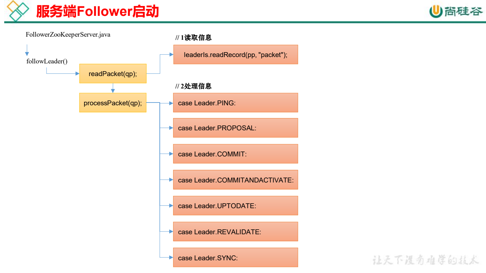

FollowerZooKeeperServer

- Follower.followLeader()

  ```java
  void followLeader() throws InterruptedException {
      self.end_fle = Time.currentElapsedTime();
      long electionTimeTaken = self.end_fle - self.start_fle;
      self.setElectionTimeTaken(electionTimeTaken);
      LOG.info("FOLLOWING - LEADER ELECTION TOOK - {} {}", electionTimeTaken,
              QuorumPeer.FLE_TIME_UNIT);
      self.start_fle = 0;
      self.end_fle = 0;
      fzk.registerJMX(new FollowerBean(this, zk), self.jmxLocalPeerBean);
      try {
          QuorumServer leaderServer = findLeader();            
          try {
              connectToLeader(leaderServer.addr, leaderServer.hostname);
              long newEpochZxid = registerWithLeader(Leader.FOLLOWERINFO);
              if (self.isReconfigStateChange())
                 throw new Exception("learned about role change");
              //check to see if the leader zxid is lower than ours
              //this should never happen but is just a safety check
              long newEpoch = ZxidUtils.getEpochFromZxid(newEpochZxid);
              if (newEpoch < self.getAcceptedEpoch()) {
                  LOG.error("Proposed leader epoch " + ZxidUtils.zxidToString(newEpochZxid)
                          + " is less than our accepted epoch " + ZxidUtils.zxidToString(self.getAcceptedEpoch()));
                  throw new IOException("Error: Epoch of leader is lower");
              }
              syncWithLeader(newEpochZxid);                
              QuorumPacket qp = new QuorumPacket();
              while (this.isRunning()) {
                  readPacket(qp);
                  processPacket(qp);
              }
          } catch (Exception e) {
              LOG.warn("Exception when following the leader", e);
              try {
                  sock.close();
              } catch (IOException e1) {
                  e1.printStackTrace();
              }
  
              // clear pending revalidations
              pendingRevalidations.clear();
          }
      } finally {
          zk.unregisterJMX((Learner)this);
      }
  }
  ```

  readPacket(qp);

  ```java
  void readPacket(QuorumPacket pp) throws IOException {
      synchronized (leaderIs) {
          leaderIs.readRecord(pp, "packet");
      }
      if (LOG.isTraceEnabled()) {
          final long traceMask =
              (pp.getType() == Leader.PING) ? ZooTrace.SERVER_PING_TRACE_MASK
                  : ZooTrace.SERVER_PACKET_TRACE_MASK;
  
          ZooTrace.logQuorumPacket(LOG, traceMask, 'i', pp);
      }
  }
  ```

  processPacket(qp);

  ```java
  protected void processPacket(QuorumPacket qp) throws Exception{
      switch (qp.getType()) {
      case Leader.PING:            
          ping(qp);            
          break;
      case Leader.PROPOSAL:           
          TxnHeader hdr = new TxnHeader();
          Record txn = SerializeUtils.deserializeTxn(qp.getData(), hdr);
          if (hdr.getZxid() != lastQueued + 1) {
              LOG.warn("Got zxid 0x"
                      + Long.toHexString(hdr.getZxid())
                      + " expected 0x"
                      + Long.toHexString(lastQueued + 1));
          }
          lastQueued = hdr.getZxid();
          
          if (hdr.getType() == OpCode.reconfig){
             SetDataTxn setDataTxn = (SetDataTxn) txn;       
             QuorumVerifier qv = self.configFromString(new String(setDataTxn.getData()));
             self.setLastSeenQuorumVerifier(qv, true);                               
          }
          
          fzk.logRequest(hdr, txn);
          break;
      case Leader.COMMIT:
          fzk.commit(qp.getZxid());
          break;
          
      case Leader.COMMITANDACTIVATE:
         // get the new configuration from the request
         Request request = fzk.pendingTxns.element();
         SetDataTxn setDataTxn = (SetDataTxn) request.getTxn();                                                                                                      
         QuorumVerifier qv = self.configFromString(new String(setDataTxn.getData()));                                
  
         // get new designated leader from (current) leader's message
         ByteBuffer buffer = ByteBuffer.wrap(qp.getData());    
         long suggestedLeaderId = buffer.getLong();
          boolean majorChange = 
                 self.processReconfig(qv, suggestedLeaderId, qp.getZxid(), true);
         // commit (writes the new config to ZK tree (/zookeeper/config)                     
         fzk.commit(qp.getZxid());
          if (majorChange) {
             throw new Exception("changes proposed in reconfig");
         }
         break;
      case Leader.UPTODATE:
          LOG.error("Received an UPTODATE message after Follower started");
          break;
      case Leader.REVALIDATE:
          revalidate(qp);
          break;
      case Leader.SYNC:
          fzk.sync();
          break;
      default:
          LOG.warn("Unknown packet type: {}", LearnerHandler.packetToString(qp));
          break;
      }
  }
  ```


### 8 客户端启动


ZkCli.sh

```bash
#!/usr/bin/env bash
# use POSTIX interface, symlink is followed automatically
ZOOBIN="${BASH_SOURCE-$0}"
ZOOBIN="$(dirname "${ZOOBIN}")"
ZOOBINDIR="$(cd "${ZOOBIN}"; pwd)"

if [ -e "$ZOOBIN/../libexec/zkEnv.sh" ]; then
  . "$ZOOBINDIR"/../libexec/zkEnv.sh
else
  . "$ZOOBINDIR"/zkEnv.sh
fi

ZOO_LOG_FILE=zookeeper-$USER-cli-$HOSTNAME.log

"$JAVA" "-Dzookeeper.log.dir=${ZOO_LOG_DIR}" "-Dzookeeper.root.logger=${ZOO_LOG4J_PROP}" "-Dzookeeper.log.file=${ZOO_LOG_FILE}" \
     -cp "$CLASSPATH" $CLIENT_JVMFLAGS $JVMFLAGS \
     org.apache.zookeeper.ZooKeeperMain "$@"
```

在 ZkCli.sh 启动 Zookeeper 时，会调用 ZooKeeperMain.java

ZooKeeperMain.main()

```java
public static void main(String args[]) throws CliException, IOException, InterruptedException
{
    ZooKeeperMain main = new ZooKeeperMain(args);
    main.run();
}
```


#### 8.1 创建ZookeeperMain

连接 zk

- new ZooKeeperMain(args)

  ```java
  public ZooKeeperMain(String args[]) throws IOException, InterruptedException {
      cl.parseOptions(args);
      System.out.println("Connecting to " + cl.getOption("server"));
      connectToZK(cl.getOption("server"));
  }
  ```

- connectToZK(cl.getOption("server"));

  ```java
  protected void connectToZK(String newHost) throws InterruptedException, IOException {
      if (zk != null && zk.getState().isAlive()) {
          zk.close();
      }
  
      host = newHost;
      boolean readOnly = cl.getOption("readonly") != null;
      if (cl.getOption("secure") != null) {
          System.setProperty(ZKClientConfig.SECURE_CLIENT, "true");
          System.out.println("Secure connection is enabled");
      }
      zk = new ZooKeeperAdmin(host, Integer.parseInt(cl.getOption("timeout")), new MyWatcher(), readOnly);
  }
  ```

- 创建 ZooKeeperAdmin 对象

  new ZooKeeperAdmin(host, Integer.parseInt(cl.getOption("timeout")), new MyWatcher(), readOnly);

  ```java
  public ZooKeeperAdmin(String connectString, int sessionTimeout, Watcher watcher,
                   boolean canBeReadOnly) throws IOException {
      super(connectString, sessionTimeout, watcher, canBeReadOnly);
  }
  ```

  super(connectString, sessionTimeout, watcher, canBeReadOnly);

  ```java
  public ZooKeeper(String connectString, int sessionTimeout, Watcher watcher,
          boolean canBeReadOnly) throws IOException {
      this(connectString, sessionTimeout, watcher, canBeReadOnly,
              createDefaultHostProvider(connectString));
  }
  ```

  this(connectString, sessionTimeout, watcher, canBeReadOnly,
  createDefaultHostProvider(connectString));

  ```java
  public ZooKeeper(String connectString, int sessionTimeout, Watcher watcher,
          boolean canBeReadOnly, HostProvider aHostProvider)
          throws IOException {
      this(connectString, sessionTimeout, watcher, canBeReadOnly,
              aHostProvider, null);
  }
  ```


#### 8.2 初始化监听器

- this(connectString, sessionTimeout, watcher, canBeReadOnly, aHostProvider, null);

  ```java
  public ZooKeeper(String connectString, int sessionTimeout, Watcher watcher,
          boolean canBeReadOnly, HostProvider aHostProvider,
          ZKClientConfig clientConfig) throws IOException {
      LOG.info("Initiating client connection, connectString=" + connectString
              + " sessionTimeout=" + sessionTimeout + " watcher=" + watcher);
  
      if (clientConfig == null) {
          clientConfig = new ZKClientConfig();
      }
      this.clientConfig = clientConfig;
      watchManager = defaultWatchManager();
      
      // 赋值 watcher 给默认的 defaultWatcher
      watchManager.defaultWatcher = watcher;
      ConnectStringParser connectStringParser = new ConnectStringParser(
              connectString);
      hostProvider = aHostProvider;
  
      // 客户端与服务器端通信的终端
      cnxn = createConnection(connectStringParser.getChrootPath(),
              hostProvider, sessionTimeout, this, watchManager,
              getClientCnxnSocket(), canBeReadOnly);
      cnxn.start();
  }
  ```


#### 8.3 解析连接地址

- new ConnectStringParser(connectString);

  ```java
  public ConnectStringParser(String connectString) {
      // connectString = "linux-copy2:2181,linux-copy3:2181,linux-copy4:2181"
      // parse out chroot, if any
      int off = connectString.indexOf('/');
      if (off >= 0) {
          String chrootPath = connectString.substring(off);
          // ignore "/" chroot spec, same as null
          if (chrootPath.length() == 1) {
              this.chrootPath = null;
          } else {
              PathUtils.validatePath(chrootPath);
              this.chrootPath = chrootPath;
          }
          connectString = connectString.substring(0, off);
      } else {
          this.chrootPath = null;
      }
  
      // "linux-copy2:2181,linux-copy3:2181,linux-copy4:2181"用逗号切割
      List<String> hostsList = split(connectString,",");
      for (String host : hostsList) {
          int port = DEFAULT_PORT;
          int pidx = host.lastIndexOf(':');
          if (pidx >= 0) {
              // otherwise : is at the end of the string, ignore
              if (pidx < host.length() - 1) {
                  port = Integer.parseInt(host.substring(pidx + 1));
              }
              host = host.substring(0, pidx);
          }
          serverAddresses.add(InetSocketAddress.createUnresolved(host, port));
      }
  }
  ```

  ```java
  public class InetSocketAddress extends SocketAddress
  {
      // Private implementation class pointed to by all public methods.
      private static class InetSocketAddressHolder {
          // The hostname of the Socket Address 主机名称
          private String hostname;
          // The IP address of the Socket Address 通信地址
          private InetAddress addr;
          // The port number of the Socket Address 端口号
          private int port;
  
          ......
      }
  
      ......
  }
  ```


#### 8.4 创建通信

```java
public ZooKeeper(String connectString, int sessionTimeout, Watcher watcher,
        boolean canBeReadOnly, HostProvider aHostProvider,
        ZKClientConfig clientConfig) throws IOException {
    LOG.info("Initiating client connection, connectString=" + connectString
            + " sessionTimeout=" + sessionTimeout + " watcher=" + watcher);

    if (clientConfig == null) {
        clientConfig = new ZKClientConfig();
    }
    this.clientConfig = clientConfig;
    watchManager = defaultWatchManager();
    // 赋值 watcher 给默认的 defaultWatcher
    watchManager.defaultWatcher = watcher;
    ConnectStringParser connectStringParser = new ConnectStringParser(
            connectString);
    hostProvider = aHostProvider;

    // 客户端与服务器端通信的终端
    cnxn = createConnection(connectStringParser.getChrootPath(),
            hostProvider, sessionTimeout, this, watchManager,
            getClientCnxnSocket(), canBeReadOnly);
    cnxn.start();
}
```

getClientCnxnSocket()

```java
private ClientCnxnSocket getClientCnxnSocket() throws IOException {
    String clientCnxnSocketName = getClientConfig().getProperty(
            ZKClientConfig.ZOOKEEPER_CLIENT_CNXN_SOCKET);
    if (clientCnxnSocketName == null) {
        clientCnxnSocketName = ClientCnxnSocketNIO.class.getName();
    }
    try {
        // 通过反射获取 clientCxnSocket 对象
        Constructor<?> clientCxnConstructor = Class.forName(clientCnxnSocketName).getDeclaredConstructor(ZKClientConfig.class);
        ClientCnxnSocket clientCxnSocket = (ClientCnxnSocket) clientCxnConstructor.newInstance(getClientConfig());
        return clientCxnSocket;
    } catch (Exception e) {
        IOException ioe = new IOException("Couldn't instantiate "
                + clientCnxnSocketName);
        ioe.initCause(e);
        throw ioe;
    }
}
```

createConnection(connectStringParser.getChrootPath(), hostProvider, sessionTimeout, this, watchManager, getClientCnxnSocket(), canBeReadOnly);

```java
/**
 * @deprecated Use {@link ZKClientConfig#ZOOKEEPER_CLIENT_CNXN_SOCKET}
 *             instead.
 */
@Deprecated
public static final String ZOOKEEPER_CLIENT_CNXN_SOCKET = "zookeeper.clientCnxnSocket";
// Setting this to "true" will enable encrypted client-server communication.

/**
 * @deprecated Use {@link ZKClientConfig#SECURE_CLIENT}
 *             instead.
 */
@Deprecated
public static final String SECURE_CLIENT = "zookeeper.client.secure";

protected ClientCnxn createConnection(String chrootPath,
        HostProvider hostProvider, int sessionTimeout, ZooKeeper zooKeeper,
        ClientWatchManager watcher, ClientCnxnSocket clientCnxnSocket,
        boolean canBeReadOnly) throws IOException {
    return new ClientCnxn(chrootPath, hostProvider, sessionTimeout, this,
            watchManager, clientCnxnSocket, canBeReadOnly);
}
```

new ClientCnxn(chrootPath, hostProvider, sessionTimeout, this, watchManager, clientCnxnSocket, canBeReadOnly);

```java
public ClientCnxn(String chrootPath, HostProvider hostProvider, int sessionTimeout, ZooKeeper zooKeeper,
        ClientWatchManager watcher, ClientCnxnSocket clientCnxnSocket, boolean canBeReadOnly)
        throws IOException {
    this(chrootPath, hostProvider, sessionTimeout, zooKeeper, watcher,
         clientCnxnSocket, 0, new byte[16], canBeReadOnly);
}
```

this(chrootPath, hostProvider, sessionTimeout, zooKeeper, watcher,
clientCnxnSocket, 0, new byte[16], canBeReadOnly);

```java
public ClientCnxn(String chrootPath, HostProvider hostProvider, int sessionTimeout, ZooKeeper zooKeeper,
        ClientWatchManager watcher, ClientCnxnSocket clientCnxnSocket,
        long sessionId, byte[] sessionPasswd, boolean canBeReadOnly) {
    this.zooKeeper = zooKeeper;
    this.watcher = watcher;
    this.sessionId = sessionId;
    this.sessionPasswd = sessionPasswd;
    this.sessionTimeout = sessionTimeout;
    this.hostProvider = hostProvider;
    this.chrootPath = chrootPath;

    connectTimeout = sessionTimeout / hostProvider.size();
    readTimeout = sessionTimeout * 2 / 3;
    readOnly = canBeReadOnly;

    // 创建了两个线程
    sendThread = new SendThread(clientCnxnSocket);
    eventThread = new EventThread();
    this.clientConfig=zooKeeper.getClientConfig();
    initRequestTimeout();
}

public void start() {
    sendThread.start();
    eventThread.start();
}
```

new SendThread(clientCnxnSocket);

```java
SendThread(ClientCnxnSocket clientCnxnSocket) {
    super(makeThreadName("-SendThread()"));
    state = States.CONNECTING;
    this.clientCnxnSocket = clientCnxnSocket;
    setDaemon(true);
}
```


```java
public ZooKeeperThread(String threadName) {
    super(threadName);
    setUncaughtExceptionHandler(uncaughtExceptionalHandler);
}

public class ZooKeeperThread extends Thread {}
// ZooKeeperThread 是一个线程，执行它的 run()方法
@Override
public void run() {
    clientCnxnSocket.introduce(this, sessionId, outgoingQueue);
    clientCnxnSocket.updateNow();
    clientCnxnSocket.updateLastSendAndHeard();
    int to;
    long lastPingRwServer = Time.currentElapsedTime();
    final int MAX_SEND_PING_INTERVAL = 10000; //10 seconds
    InetSocketAddress serverAddress = null;
    // 在循环里面，循环发送，循环接收
    while (state.isAlive()) {
        try {
            if (!clientCnxnSocket.isConnected()) {
                // don't re-establish connection if we are closing
                if (closing) {
                    break;
                }
                if (rwServerAddress != null) {
                    serverAddress = rwServerAddress;
                    rwServerAddress = null;
                } else {
                    serverAddress = hostProvider.next(1000);
                }
                // 启动连接服务端
                startConnect(serverAddress);
                clientCnxnSocket.updateLastSendAndHeard();
            }

            if (state.isConnected()) {
                ......
                to = readTimeout - clientCnxnSocket.getIdleRecv();
            } else {
                to = connectTimeout - clientCnxnSocket.getIdleRecv();
            }
            
            if (to <= 0) {
                String warnInfo;
                warnInfo = "Client session timed out, have not heard from server in "
                    + clientCnxnSocket.getIdleRecv()
                    + "ms"
                    + " for sessionid 0x"
                    + Long.toHexString(sessionId);
                LOG.warn(warnInfo);
                throw new SessionTimeoutException(warnInfo);
            }
            if (state.isConnected()) {
               //1000(1 second) is to prevent race condition missing to send the second ping
               //also make sure not to send too many pings when readTimeout is small 
                int timeToNextPing = readTimeout / 2 - clientCnxnSocket.getIdleSend() - 
                      ((clientCnxnSocket.getIdleSend() > 1000) ? 1000 : 0);
                //send a ping request either time is due or no packet sent out within MAX_SEND_PING_INTERVAL
                if (timeToNextPing <= 0 || clientCnxnSocket.getIdleSend() > MAX_SEND_PING_INTERVAL) {
                    sendPing();
                    clientCnxnSocket.updateLastSend();
                } else {
                    if (timeToNextPing < to) {
                        to = timeToNextPing;
                    }
                }
            }

            // If we are in read-only mode, seek for read/write server
            if (state == States.CONNECTEDREADONLY) {
                long now = Time.currentElapsedTime();
                int idlePingRwServer = (int) (now - lastPingRwServer);
                if (idlePingRwServer >= pingRwTimeout) {
                    lastPingRwServer = now;
                    idlePingRwServer = 0;
                    pingRwTimeout =
                        Math.min(2*pingRwTimeout, maxPingRwTimeout);
                    pingRwServer();
                }
                to = Math.min(to, pingRwTimeout - idlePingRwServer);
            }

            // 接收服务端响应，并处理
            clientCnxnSocket.doTransport(to, pendingQueue, ClientCnxn.this);
        } catch (Throwable e) {
            ......
        }
    }
    synchronized (state) {
        // When it comes to this point, it guarantees that later queued
        // packet to outgoingQueue will be notified of death.
        cleanup();
    }
    clientCnxnSocket.close();
    if (state.isAlive()) {
        eventThread.queueEvent(new WatchedEvent(Event.EventType.None,
                Event.KeeperState.Disconnected, null));
    }
    eventThread.queueEvent(new WatchedEvent(Event.EventType.None,
                Event.KeeperState.Closed, null));
    ZooTrace.logTraceMessage(LOG, ZooTrace.getTextTraceLevel(),
            "SendThread exited loop for session: 0x"
                   + Long.toHexString(getSessionId()));
}
```


```java
private void startConnect(InetSocketAddress addr) throws IOException {
    // initializing it for new connection
    saslLoginFailed = false;
    if(!isFirstConnect){
        try {
            Thread.sleep(r.nextInt(1000));
        } catch (InterruptedException e) {
            LOG.warn("Unexpected exception", e);
        }
    }
    state = States.CONNECTING;

    String hostPort = addr.getHostString() + ":" + addr.getPort();
    MDC.put("myid", hostPort);
    setName(getName().replaceAll("\\(.*\\)", "(" + hostPort + ")"));
    if (clientConfig.isSaslClientEnabled()) {
        try {
            if (zooKeeperSaslClient != null) {
                zooKeeperSaslClient.shutdown();
            }
            zooKeeperSaslClient = new ZooKeeperSaslClient(SaslServerPrincipal.getServerPrincipal(addr, clientConfig),
                clientConfig);
        } catch (LoginException e) {
            // An authentication error occurred when the SASL client tried to initialize:
            // for Kerberos this means that the client failed to authenticate with the KDC.
            // This is different from an authentication error that occurs during communication
            // with the Zookeeper server, which is handled below.
            LOG.warn("SASL configuration failed: " + e + " Will continue connection to Zookeeper server without "
              + "SASL authentication, if Zookeeper server allows it.");
            eventThread.queueEvent(new WatchedEvent(
              Watcher.Event.EventType.None,
              Watcher.Event.KeeperState.AuthFailed, null));
            saslLoginFailed = true;
        }
    }
    logStartConnect(addr);

    // 建立连接
    clientCnxnSocket.connect(addr);
}
```

ClientCnxnSocketNIO.connect

```java
@Override
void connect(InetSocketAddress addr) throws IOException {
    SocketChannel sock = createSock();
    try {
       registerAndConnect(sock, addr);
  } catch (IOException e) {
        LOG.error("Unable to open socket to " + addr);
        sock.close();
        throw e;
    }
    initialized = false;

    /*
     * Reset incomingBuffer
     */
    lenBuffer.clear();
    incomingBuffer = lenBuffer;
}
```

registerAndConnect(sock, addr);

```java
void registerAndConnect(SocketChannel sock, InetSocketAddress addr) 
throws IOException {
    sockKey = sock.register(selector, SelectionKey.OP_CONNECT);
    boolean immediateConnect = sock.connect(addr);
    if (immediateConnect) {
        sendThread.primeConnection();
    }
}
```

sendThread.primeConnection();

```java
void primeConnection() throws IOException {
    LOG.info("Socket connection established, initiating session, client: {}, server: {}",
            clientCnxnSocket.getLocalSocketAddress(),
            clientCnxnSocket.getRemoteSocketAddress());
    
    // 标记不是第一次连接
    isFirstConnect = false;
    ......
}
```

ClientCnxnSocketNIO.doTransport

```java
void doTransport(int waitTimeOut, List<Packet> pendingQueue, ClientCnxn cnxn)
        throws IOException, InterruptedException {
    selector.select(waitTimeOut);
    Set<SelectionKey> selected;
    synchronized (this) {
        selected = selector.selectedKeys();
    }
    // Everything below and until we get back to the select is
    // non blocking, so time is effectively a constant. That is
    // Why we just have to do this once, here
    updateNow();
    for (SelectionKey k : selected) {
        SocketChannel sc = ((SocketChannel) k.channel());
        if ((k.readyOps() & SelectionKey.OP_CONNECT) != 0) {
            if (sc.finishConnect()) {
                updateLastSendAndHeard();
                updateSocketAddresses();
                sendThread.primeConnection();
            }
        } else if ((k.readyOps() & (SelectionKey.OP_READ | SelectionKey.OP_WRITE)) != 0) {
            doIO(pendingQueue, cnxn);
        }
    }
    if (sendThread.getZkState().isConnected()) {
        if (findSendablePacket(outgoingQueue,
                sendThread.tunnelAuthInProgress()) != null) {
            enableWrite();
        }
    }
    selected.clear();
}
```

doIO(pendingQueue, cnxn);

```java
void doIO(List<Packet> pendingQueue, ClientCnxn cnxn)
  throws InterruptedException, IOException {
    SocketChannel sock = (SocketChannel) sockKey.channel();
    if (sock == null) {
        throw new IOException("Socket is null!");
    }
    if (sockKey.isReadable()) {
        int rc = sock.read(incomingBuffer);
        if (rc < 0) {
            throw new EndOfStreamException(
                    "Unable to read additional data from server sessionid 0x"
                            + Long.toHexString(sessionId)
                            + ", likely server has closed socket");
        }
        if (!incomingBuffer.hasRemaining()) {
            incomingBuffer.flip();
            if (incomingBuffer == lenBuffer) {
                recvCount.getAndIncrement();
                readLength();
            } else if (!initialized) {
                readConnectResult();
                enableRead();
                if (findSendablePacket(outgoingQueue,
                        sendThread.tunnelAuthInProgress()) != null) {
                    // Since SASL authentication has completed (if client is configured to do so),
                    // outgoing packets waiting in the outgoingQueue can now be sent.
                    enableWrite();
                }
                lenBuffer.clear();
                incomingBuffer = lenBuffer;
                updateLastHeard();
                initialized = true;
            } else {
                // 读取服务端应答
                sendThread.readResponse(incomingBuffer);
                lenBuffer.clear();
                incomingBuffer = lenBuffer;
                updateLastHeard();
            }
        }
    }
    if (sockKey.isWritable()) {
        Packet p = findSendablePacket(outgoingQueue,
                sendThread.tunnelAuthInProgress());

        if (p != null) {
            updateLastSend();
            // If we already started writing p, p.bb will already exist
            if (p.bb == null) {
                if ((p.requestHeader != null) &&
                        (p.requestHeader.getType() != OpCode.ping) &&
                        (p.requestHeader.getType() != OpCode.auth)) {
                    p.requestHeader.setXid(cnxn.getXid());
                }
                p.createBB();
            }
            sock.write(p.bb);
            if (!p.bb.hasRemaining()) {
                sentCount.getAndIncrement();
                outgoingQueue.removeFirstOccurrence(p);
                if (p.requestHeader != null
                        && p.requestHeader.getType() != OpCode.ping
                        && p.requestHeader.getType() != OpCode.auth) {
                    synchronized (pendingQueue) {
                        pendingQueue.add(p);
                    }
                }
            }
        }
        if (outgoingQueue.isEmpty()) {
            // No more packets to send: turn off write interest flag.
            // Will be turned on later by a later call to enableWrite(),
            // from within ZooKeeperSaslClient (if client is configured
            // to attempt SASL authentication), or in either doIO() or
            // in doTransport() if not.
            disableWrite();
        } else if (!initialized && p != null && !p.bb.hasRemaining()) {
            // On initial connection, write the complete connect request
            // packet, but then disable further writes until after
            // receiving a successful connection response.  If the
            // session is expired, then the server sends the expiration
            // response and immediately closes its end of the socket.  If
            // the client is simultaneously writing on its end, then the
            // TCP stack may choose to abort with RST, in which case the
            // client would never receive the session expired event.  See
            // http://docs.oracle.com/javase/6/docs/technotes/guides/net/articles/connection_release.html
            disableWrite();
        } else {
            // Just in case
            enableWrite();
        }
    }
}
```


#### 8.5 执行run()

```java
public static void main(String args[]) throws CliException, IOException, InterruptedException
{
    ZooKeeperMain main = new ZooKeeperMain(args);
    main.run();
}
```

main.run();

```java
void run() throws CliException, IOException, InterruptedException {
    if (cl.getCommand() == null) {
        System.out.println("Welcome to ZooKeeper!");

        boolean jlinemissing = false;
        // only use jline if it's in the classpath
        try {
            Class<?> consoleC = Class.forName("jline.console.ConsoleReader");
            Class<?> completorC =
                Class.forName("org.apache.zookeeper.JLineZNodeCompleter");

            System.out.println("JLine support is enabled");

            Object console =
                consoleC.getConstructor().newInstance();

            Object completor =
                completorC.getConstructor(ZooKeeper.class).newInstance(zk);
            Method addCompletor = consoleC.getMethod("addCompleter",
                    Class.forName("jline.console.completer.Completer"));
            addCompletor.invoke(console, completor);

            String line;
            Method readLine = consoleC.getMethod("readLine", String.class);
            while ((line = (String)readLine.invoke(console, getPrompt())) != null) {
                executeLine(line);
            }
        } catch (ClassNotFoundException e) {
            ......
        }

        if (jlinemissing) {
            System.out.println("JLine support is disabled");
            BufferedReader br =
                new BufferedReader(new InputStreamReader(System.in));

            String line;
            while ((line = br.readLine()) != null) {
                // 一行一行读取命令
                executeLine(line);
            }
        }
    } else {
        // Command line args non-null.  Run what was passed.
        processCmd(cl);
    }
    System.exit(exitCode);
}
```

executeLine(line);

```java
public void executeLine(String line) throws CliException, InterruptedException, IOException {
  if (!line.equals("")) {
    cl.parseCommand(line);
    addToHistory(commandCount,line);
    // 处理客户端命令
    processCmd(cl);
    commandCount++;
  }
}
```

processCmd(cl);

```java
protected boolean processCmd(MyCommandOptions co) throws CliException, IOException, InterruptedException {
    boolean watch = false;
    try {
        // 解析命令
        watch = processZKCmd(co);
        exitCode = 0;
    } catch (CliException ex) {
        exitCode = ex.getExitCode();
        System.err.println(ex.getMessage());
    }
    return watch;
}
```

processZKCmd(co);

```java
protected boolean processZKCmd(MyCommandOptions co) throws CliException, IOException, InterruptedException {
    String[] args = co.getArgArray();
    String cmd = co.getCommand();
    if (args.length < 1) {
        usage();
        throw new MalformedCommandException("No command entered");
    }

    if (!commandMap.containsKey(cmd)) {
        usage();
        throw new CommandNotFoundException("Command not found " + cmd);
    }
    
    boolean watch = false;
    LOG.debug("Processing " + cmd);


    if (cmd.equals("quit")) {
        zk.close();
        System.exit(exitCode);
    } else if (cmd.equals("redo") && args.length >= 2) {
        Integer i = Integer.decode(args[1]);
        if (commandCount <= i || i < 0) { // don't allow redoing this redo
            throw new MalformedCommandException("Command index out of range");
        }
        cl.parseCommand(history.get(i));
        if (cl.getCommand().equals("redo")) {
            throw new MalformedCommandException("No redoing redos");
        }
        history.put(commandCount, history.get(i));
        processCmd(cl);
    } else if (cmd.equals("history")) {
        for (int i = commandCount - 10; i <= commandCount; ++i) {
            if (i < 0) continue;
            System.out.println(i + " - " + history.get(i));
        }
    } else if (cmd.equals("printwatches")) {
        if (args.length == 1) {
            System.out.println("printwatches is " + (printWatches ? "on" : "off"));
        } else {
            printWatches = args[1].equals("on");
        }
    } else if (cmd.equals("connect")) {
        if (args.length >= 2) {
            connectToZK(args[1]);
        } else {
            connectToZK(host);
        }
    }
    
    // Below commands all need a live connection
    if (zk == null || !zk.getState().isAlive()) {
        System.out.println("Not connected");
        return false;
    }
    
    // execute from commandMap
    CliCommand cliCmd = commandMapCli.get(cmd);
    if(cliCmd != null) {
        cliCmd.setZk(zk);
        watch = cliCmd.parse(args).exec();
    } else if (!commandMap.containsKey(cmd)) {
         usage();
    }
    return watch;
}
```

