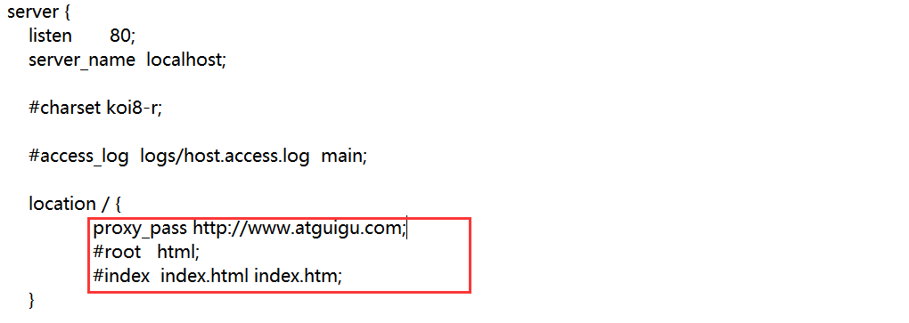

# Nginx-基础篇

+++


## 一、Nginx简介

Nginx(engine x) 是一个高性能的HTTP和反向代理web服务器，同时也提供了IMAP/POP3/SMTP服务。Nginx是由伊戈尔·赛索耶夫为俄罗斯访问量第二的Rambler.ru站点（俄文：Рамблер）开发的，第一个公开版本0.1.0发布于2004年10月4日。

其将源代码以类BSD许可证的形式发布，因它的稳定性、丰富的功能集、简单的配置文件和低系统资源的消耗而闻名。2011年6月1日，nginx 1.0.4发布。

Nginx是一款轻量级的Web服务器/反向代理服务器及电子邮件（IMAP/POP3）代理服务器，在BSD-like协议下发行。其特点是占有内存少，并发能力强，事实上nginx的并发能力在同类型的网页服务器中表现较好，中国大陆使用nginx网站用户有：百度、京东、新浪、网易、腾讯、淘宝等。

> Nginx应用场景：

1. **HttpWeb服务器**
   - 可以用于构建静态web站点
   - 虚拟主机
   - 用于展示Html、css等静态资源或作为CDN（Content Delivery Network）资源服务器
   - 支持rtmp协议，直播推流
   - 使用http协议作为短视频、多媒体资源服务器（优酷、抖⾳）
   - 文件下载服务器（rar、exe⽂件）
2. **高性能网关/反向代理服务器**
   - 内网服务器与外围隔离
   - 以隧道模式完成请求转发
   - 支持Http的7层或Tcp/Udp的4层转发
3. **日志采集**
   - 供大数据分析
   - 使用http协议，接收用户请求
   - 返回简单报文
   - 收集用户访问日志（京东、淘宝）
4. **应用服务器**
   - 整合php、Perl、Python、Lua等语言
   - 内存缓存
   - 可以连接其他中间件
   - 中间件中不宜实现过度复杂的业务逻辑
5. **负载均衡器**
   - 内置轮询、权重、ip-hash等算法
   - 可自定义负载均衡算法
   - Cookies的会话保持问题

> 使用虚拟机安装学习Nginx

特点：

- 安装使用简单
- 适用于传统公司
- 适用于VPS
- 适用于高性能服务器部署

> 版本介绍：

- Nginx开源版 http://nginx.org/en/

  官方原始的Nginx版本

- Nginx plus商业版

  开箱即用，集成了大量功能

- Open Resty https://openresty.org/cn/

  OpenResty是一个基于Nginx与 Lua 的高性能 Web 平台，其内部集成了大量精良的 Lua 库、第三方模块以及大多数的依赖项。**更适用于需要大量二次开发的场景，有极强的扩展性**。

- Tengine https://tengine.taobao.org/

  由淘宝网发起的Web服务器项目。它在[Nginx (opens new window)](http://nginx.org/)的基础上，针对大访问量网站的需求，添加了很多高级功能和特性。Tengine的性能和稳定性已经在大型的网站如[淘宝网 (opens new window)](http://www.taobao.com/)，[天猫商城 (opens new window)](http://www.tmall.com/)等得到了很好的检验。相比于Open Resty，扩展性不够强，但是能够满足绝多数使用场景


+++

## 二、Nginx安装

- 前提：本地安装Linux虚拟机

  本人在本地已安装CentOS7版本虚拟机，主机名字为：linux-copy4

- **下载Nginx包**

  [官网下载地址](http://nginx.org/en/download.html)

  

  使用FTP工具将文件上传到虚拟机中 /opt/software/

- 解压Nginx包，并安装

  ```cmd
  cd /opt/software/
  
  #解压到 /opt/module/ 目录
  tar -zxvf nginx-1.22.1.tar.gz -C /opt/module/
  
  #进入解压后的文件夹
  cd /opt/module/nginx-1.22.1/
  ```

- 安装依赖库

  ```cmd
  #安装C编译器
  yum install -y gcc
  
  #安装pcre库
  yum install -y pcre pcre-devel
  
  #安装zlib
  yum install -y zlib zlib-devel
  ```

- 安装

  ```cmd
  ./configure --prefix=/usr/local/nginx #使用prefix选项指定安装的目录
  
  # 接下来
  make
  make install
  ```

- 启动

  ```cmd
  cd /usr/local/nginx/sbin
  
  ls # 里面是一个nginx的可执行文件
  
  ./nginx # 启动这个可执行
  ```

- 永久关闭防火墙

  ```cmd
  systemctl disable firewalld.service
  ```

- *Nginx其它命令*：

  ```cmd
  ./nginx -s stop #快速停止
  ./nginx -s quit #完成已接受的请求后，停止
  ./nginx -s reload #重新加载配置
  ./nginx -t #检查nginx配置是否正确
  ```

- 查看nginx状态

  ```cmd
  ps -ef | grep nginx
  ```

  启动时：

  

  停止时：

  

- 注册系统服务

  通过系统服务的方式启动nginx

  ```cmd
  vim /usr/lib/systemd/system/nginx.service
  ```

  ```shell
  [Unit] 
  Description=nginx-web server
  After=network.target remote-fs.target nss-lookup.target
  
  [Service]
  Type=forking
  PIDFile=/usr/local/nginx/logs/nginx.pid
  ExecStartPre=/usr/local/nginx/sbin/nginx -t -c /usr/local/nginx/conf/nginx.conf
  ExecStart=/usr/local/nginx/sbin/nginx -c /usr/local/nginx/conf/nginx.conf
  ExecReload=/usr/local/nginx/sbin/nginx -s reload
  ExecStop=/usr/local/nginx/sbin/nginx -s stop
  ExecQuit=/usr/local/nginx/sbin/nginx -s quit 
  PrivateTmp=true
  
  [Install]   
  WantedBy=multi-user.target  # 多用户
  ```

  重新加载系统服务

  ```cmd
  systemctl daemon-reload
  ```

  启动服务

  ```cmd
  systemctl start nginx.service
  ```

  重新启动nginx服务

  ```cmd
  systemctl reload nginx
  ```

- 开机启动

  ```cmd
  systemctl enable nginx.service
  ```

- 服务器访问

  

+++

## 三、Nginx的基本使用

### 1 目录结构

进入Nginx的主目录我们可以看到这些文件夹：


```cmd
[root@localhost ~]# tree /usr/local/nginx
/usr/local/nginx
├── client_body_temp                 # POST 大文件暂存目录
├── conf                             # Nginx所有配置文件的目录
│   ├── fastcgi.conf                 # fastcgi相关参数的配置文件
│   ├── fastcgi.conf.default         # fastcgi.conf的原始备份文件
│   ├── fastcgi_params               # fastcgi的参数文件
│   ├── fastcgi_params.default       
│   ├── koi-utf
│   ├── koi-win
│   ├── mime.types                   # 媒体类型
│   ├── mime.types.default
│   ├── nginx.conf                   #这是Nginx默认的主配置文件，日常使用和修改的文件
│   ├── nginx.conf.default
│   ├── scgi_params                  # scgi相关参数文件
│   ├── scgi_params.default  
│   ├── uwsgi_params                 # uwsgi相关参数文件
│   ├── uwsgi_params.default
│   └── win-utf
├── fastcgi_temp                     # fastcgi临时数据目录
├── html                             # Nginx默认站点目录
│   ├── 50x.html                     # 错误页面优雅替代显示文件，例如出现502错误时会调用此页面
│   └── index.html                   # 默认的首页文件
├── logs                             # Nginx日志目录
│   ├── access.log                   # 访问日志文件
│   ├── error.log                    # 错误日志文件
│   └── nginx.pid                    # pid文件，Nginx进程启动后，会把所有进程的ID号写到此文件
├── proxy_temp                       # 临时目录
├── sbin                             # Nginx 可执行文件目录
│   └── nginx                        # Nginx 二进制可执行程序
├── scgi_temp                        # 临时目录
└── uwsgi_temp                       # 临时目录
```


其中这几个文件夹在刚安装后是没有的，主要用来存放运行过程中的临时文件：

`client_body_temp` `fastcgi_temp` `proxy_temp` `scgi_temp`  

- **conf**：用来存放配置文件相关  
- **html**：用来存放静态文件的默认目录 html、css等  
- **sbin**：nginx的主程序
- logs：文件夹用于存放日志信息

```text
conf #配置文件
	｜-nginx.conf # 主配置文件
	｜-其他配置文件 # 可通过那个include关键字，引入到了nginx.conf生效
	
html #静态页面

logs
	｜-access.log #访问日志(每次访问都会记录)
	｜-error.log  #错误日志
	｜-nginx.pid  #进程号
	
sbin
	｜-nginx #主进程文件
	
*_temp #运行时，生成临时文件
```


### 2 基本运行原理


Nginx的进程是使用经典的「Master-Worker」模型，Nginx在启动后，会有一个master进程和多个worker进程。master进程主要用来管理worker进程，包含：接收来自外界的信号，向各worker进程发送信号，监控worker进程的运行状态，当worker进程退出后(异常情况下)，会自动重新启动新的worker进程。worker进程主要处理基本的网络事件，多个worker进程之间是对等的，他们同等竞争来自客户端的请求，各进程互相之间是独立的。一个请求，只可能在一个worker进程中处理，一个worker进程，不可能处理其它进程的请求。worker进程的个数是可以设置的，一般会设置与机器cpu核数一致，这里面的原因与nginx的进程模型以及事件处理模型是分不开的。


### 3 Nginx配置文件

后面学习Nginx配置，每次修改配置文件，一定要重载才能生效

```cmd
systemctl reload nginx
```

Nginx配置文件：


**nginx.conf default**：

```bash
#user  nobody;
worker_processes  1;

#error_log  logs/error.log;
#error_log  logs/error.log  notice;
#error_log  logs/error.log  info;

#pid        logs/nginx.pid;

events {
    worker_connections  1024;
}


http {
    include       mime.types;
    default_type  application/octet-stream;

    #log_format  main  '$remote_addr - $remote_user [$time_local] "$request" '
    #                  '$status $body_bytes_sent "$http_referer" '
    #                  '"$http_user_agent" "$http_x_forwarded_for"';

    #access_log  logs/access.log  main;

    sendfile        on;
    #tcp_nopush     on;

    #keepalive_timeout  0;
    keepalive_timeout  65;

    #gzip  on;

    server {
        listen       80;
        server_name  localhost;

        #charset koi8-r;

        #access_log  logs/host.access.log  main;

        location / {
            root   html;
            index  index.html index.htm;
        }

        #error_page  404              /404.html;

        # redirect server error pages to the static page /50x.html
        #
        error_page   500 502 503 504  /50x.html;
        location = /50x.html {
            root   html;
        }

        # proxy the PHP scripts to Apache listening on 127.0.0.1:80
        #
        #location ~ \.php$ {
        #    proxy_pass   http://127.0.0.1;
        #}

        # pass the PHP scripts to FastCGI server listening on 127.0.0.1:9000
        #
        #location ~ \.php$ {
        #    root           html;
        #    fastcgi_pass   127.0.0.1:9000;
        #    fastcgi_index  index.php;
        #    fastcgi_param  SCRIPT_FILENAME  /scripts$fastcgi_script_name;
        #    include        fastcgi_params;
        #}

        # deny access to .htaccess files, if Apache's document root
        # concurs with nginx's one
        #
        #location ~ /\.ht {
        #    deny  all;
        #}
    }


    # another virtual host using mix of IP-, name-, and port-based configuration
    #
    #server {
    #    listen       8000;
    #    listen       somename:8080;
    #    server_name  somename  alias  another.alias;

    #    location / {
    #        root   html;
    #        index  index.html index.htm;
    #    }
    #}


    # HTTPS server
    #
    #server {
    #    listen       443 ssl;
    #    server_name  localhost;

    #    ssl_certificate      cert.pem;
    #    ssl_certificate_key  cert.key;

    #    ssl_session_cache    shared:SSL:1m;
    #    ssl_session_timeout  5m;

    #    ssl_ciphers  HIGH:!aNULL:!MD5;
    #    ssl_prefer_server_ciphers  on;

    #    location / {
    #        root   html;
    #        index  index.html index.htm;
    #    }
    #}

}
```

以下将原有的注释全部删除了：

```bash
worker_processes  1;

events {
    worker_connections  1024;
}

http {
    include       mime.types;
    default_type  application/octet-stream;

    sendfile        on;

    keepalive_timeout  65;

    server {
        listen       80;
        server_name  localhost;

        location / {
            root   html; 
            index  index.html index.htm;	 #访问80端口，找到nginx目录下的html目录下的index.html
        }
        error_page   500 502 503 504  /50x.html;
        location = /50x.html {
            root   html;
        }

    }
}
```

- **worker_processes**

  worker_processes 1; 默认为1，表示开启一个业务进程 

- **worker_connections**

  worker_connections 1024; 单个业务进程可接受连接数 

- **include mime.types;**

  include mime.types; 引入http mime类型 

- **default_type application/octet-stream;**

  default_type application/octet-stream; 如果mime类型没匹配上，默认使用二进制流的方式传输。

- **sendfile on;**

  sendfile on; 使用linux的 sendfile(socket, file, len) 高效网络传输，也就是数据0拷贝。

  未开启sendfile

  

  开启后

  

- **keepalive_timeout 65;**

  keepalive_timeout 65; 保持连接，超时时间。

- **server**

  

  虚拟主机配置 vhost

  ```bash
  server {
      listen 80; # 监听端口号
      server_name localhost; #域名、主机名
      location / {  # 匹配路径
          root html; # 文件根目录
          index index.html index.htm; # 默认页名称
      }
      error_page 500 502 503 504 /50x.html; # 报错编码对应页面
      location = /50x.html {
      	root html;
  	}
  }
  ```


### 4 使用host文件解析域名

利用host文件假装解析域名：


修改完成后


访问虚拟机的ip解析的域名


> 还可以通过域名解析 然后连接到内网
>
> 我们在阿里云的dns域名解析上面添加了我们域名和内网ip的对应关系，仅仅只是对应关系，所以我们ping 域名可以解析成我们的内网ip，由于终端与对应机器在同一局域网所以能通，你换个不在同一内网的不行


### 5 虚拟主机和域名解析

虚拟主机使用特殊的软硬件技术，把一台运行在因特网上的服务器主机分成一台台“虚拟”的主机，每一台虚拟主机都具有独立的域名，具有完整的Internet服务器（WWW、FTP、Email等）功能，虚拟主机之间完全独立，并可由用户自行管理，在外界看来，每一台虚拟主机和一台独立的主机完全一样。

域名解析就是域名到IP地址的转换过程，IP地址是网路上标识站点的数字地址，为了简单好记，采用域名来代替ip地址标识站点地址。域名的解析工作由DNS服务器完成。


#### 5.1 域名、DNS、ip地址

- 域名是相对网站来说的，IP是相对网络来说的。当输入一个域名的时候，网页是如何做出反应的？

  输入域名---->域名解析服务器（dns）解析成ip地址--->访问IP地址--->完成访问的内容--->返回信息。

- Internet上的计算机IP是唯一的，一个IP地址对应一个计算机。

  一台计算机上面可以有很多个服务，也就是一个ip地址对应了很多个域名，即一个计算机上有很多网站。

> **IP地址和DNS地址的区别**

- IP地址是指单个主机的唯一IP地址，而DNS服务器地址是用于域名解析的地址。
- 一个是私网地址，一个是公网地址；
- 一个作为主机的逻辑标志，一个作为域名解析服务器的访问地址。

**IP地址**：

IP，就是Internet Protocol的缩写，是一种通信协议，我们用的因特网基本是IP网组成的。

IP地址就是因特网上的某个设备的一个编号。

IP地址一般由网络号，主机号，掩码来组成。

IP网络上有很多路由器，路由器之间转发、通信都是只认这个IP地址，类似什么哪？就好像你寄包裹，你的写上发件人地址，你的姓名，收件人地址，收件人姓名。

这个发件人地址就是你电脑的IP的网络号，你的姓名就是你的主机号。

收件人的地址就是你要访问的IP的网络号，收件人的姓名就是访问IP的主机号。

现在还有了更复杂的IPV6，还有IPV9。

**DNS是什么？**：

我们访问因特网必须知道对端的IP地址，可是我们访问网站一般只知道域名啊，怎么办？

这时候DNS就有用处了，电脑先访问DNS服务器，查找域名对应的IP，于是，你的电脑就知道要发包到IP地址了。


#### 5.2 虚拟主机域名配置

> 虚拟主机原理：

虚拟主机是为了在同一台物理机器上运行多个不同的网站，提高资源利用率引入的技术。

一般的web服务器一个ip地址的80端口只能正确对应一个网站。web服务器在不使用多个ip地址和端口的情况下，如果需要支持多个相对独立的网站就需要一种机制来分辨同一个ip地址上的不同网站的请求，这就出现了主机头绑定的方法。简单的说就是，将不同的网站空间对应不同的域名，以连接请求中的域名字段来分发和应答正确的对应空间的文件执行结果。举个例子来说，一台服务器ip地址为192.168.8.101，有两个域名和对应的空间在这台服务器上，使用的都是192.168.8.101的80端口来提供服务。如果只是简单的将两个域名A和B的域名记录解析到这个ip地址，那么web服务器在收到任何请求时反馈的都会是同一个网站的信息，这显然达不到要求。接下来我们使用主机头绑定域名A和B到他们对应的空间文件夹C和D。当含有域名A的web请求信息到达192.168.8.101时，web服务器将执行它对应的空间C中的首页文件，并返回给客户端，含有域名B的web请求信息同理，web服务器将执行它对应的空间D中的首页文件，并返回给客户端，所以在使用主机头绑定功能后就不能使用ip地址访问其上的任何网站了，因为请求信息中不存在域名信息，所以会出错。


> 实战：

在Linux主目录下创建`www`目录，在里面创建两个文件夹，`www`、`vod`，分别创建`index.html`。

```bash
[root@linux-copy4 ~]# cat /www/www/index.html 
this is www web site
[root@linux-copy4 ~]# cat /www/vod/index.html 
this is vod web site
[root@linux-copy4 ~]# 
```

修改`/usr/local/nginx/conf`下的`nginx.conf`：

```bash
[root@linux-copy4 ~]# cat /usr/local/nginx/conf/nginx.conf
worker_processes  1;

events {
    worker_connections  1024;
}

http {
    include       mime.types;
    default_type  application/octet-stream;

    sendfile        on;

    keepalive_timeout  65;

    server {
        listen       80;
        server_name  localhost;

        location / {
            root   html;
            index  index.html index.htm;
        }

        error_page   500 502 503 504  /50x.html;
        location = /50x.html {
            root   html;
        }
    }

    # 虚拟主机 vhost
    server {
        #监听端口
        listen       88;
        # 域名 主机名
        server_name  localhost;
        #配置根目录以及默认页面
        # 访问 /www/www/index.html
        location / {
            root   /www/www;
            index  index.html index.htm;
        }
        
        #出错页面配置
        error_page   500 502 503 504  /50x.html;
        location = /50x.html {
            root   html;
        }
    }

    # 虚拟主机 vhost
    server {
        listen       89;
        # 域名 主机名
        server_name  localhost;
        # 访问 /www/vod/index.html
        location / {
            root   /www/vod;
            index  index.html index.htm;
        }
        error_page   500 502 503 504  /50x.html;
        location = /50x.html {
            root   html;
        }
    }
}
[root@linux-copy4 ~]#
```

重新加载nginx服务：`systemctl reload nginx`

重启nginx服务：`systemctl restart nginx`

结果：


> **注意**：
>
> 虚拟主机技术server中，相同的主机端口号会报错。
>
> 可以这样配置：
>
> listen 88;	server_name `www.website.com;`	
>
> listen 89;	server_name `vod.website.com;`
>
> 在通配符的`server_name *.website.com`设置下，可以访问不同的网站
>
> 


#### 5.3 域名解析规则

- **servername匹配规则**

  我们需要注意的是servername匹配分先后顺序，写在前面的匹配上就不会继续往下匹配了。

- **完整匹配**

  我们可以在同一servername中匹配多个域名

  ```
  server_name vod.mmban.com www.mmban.com;
  ```

- **通配符匹配**

  ```
  server_name *.mmban.com
  ```

- **通配符结束匹配**

  ```
  server_name vod.*;
  ```

- **正则匹配**

  ```
  server_name ~^[0-9]+\.mmban\.com$;
  ```
  
- 特殊匹配格式

  ```
  server_name ""; 匹配Host请求头不存在的情况。
  ```

- 匹配顺序

  1. 精确的名字
  2. 以\*号开头的最长通配符名称，例如 \*.example.org
  3. 以\*号结尾的最长通配符名称，例如 mail.\*
  4. 第一个匹配的正则表达式（在配置文件中出现的顺序）


#### 5.4 泛域名

所谓“泛域名解析”是指：利用通配符 * (星号)来做次级域名以实现所有的次级域名均指向同一IP地址。

好处：

1. 可以让域名支持无限的子域名(这也是泛域名解析最大的用途)。
2. 防止用户错误输入导致的网站不能访问的问题
3. 可以让直接输入网址登陆网站的用户输入简洁的网址即可访问网站

泛域名在实际使用中作用是非常广泛的，比如实现无限二级域名功能，提供免费的url转发，在IDC部门实现自动分配免费网址，在大型企业中实现网址分类管理等等，都发挥了巨大的作用。


### 6 域名解析相关企业项目实现技术构架

- 多用户二级域名
- 短网址
- httpdns


### 7 反向代理、正向代理模型

- 反向代理：

  

  描述：反向代理是指以代理服务器来接受连接请求，然后将请求转发给内部网络上的服务器，并将从服务器上得到的结果返回给请求连接的客户端，此时代理服务器对外就表现为一个反向代理服务器，而且整个过程对于客户端而言是透明的。

  反向代理方式是指以代理服务器来接受Internet上的连接请求，然后将请求转发给内部网络上的服务器；并将从服务器上得到的结果返回给Internet上请求连接的客户端，此时代理服务器对外就表现为一个服务器。

  反向代理服务器通常有两种模型，一种是*作为内容服务器的替身*，另一种*作为内容服务器集群的负载均衡器*。

  - 作为内容服务器的替身

    如果您的内容服务器具有必须保持安全的敏感信息，如信用卡号数据库，可在防火墙外部设置一个代理服务器作为内容服务器的替身。当外部客户机尝试访问内容服务器时，会将其送到代理服务器。实际内容位于内容服务器上，在防火墙内部受到安全保护。代理服务器位于防火墙外部，在客户机看来就像是内容服务器。

    当客户机向站点提出请求时，请求将转到代理服务器。然后，代理服务器通过防火墙中的特定通路，将客户机的请求发送到内容服务器。内容服务器再通过该通道将结果回传给代理服务器。代理服务器将检索到的信息发送给客户机，好像代理服务器就是实际的内容服务器。如果内容服务器返回错误消息，代理服务器会先行截取该消息并更改标头中列出的任何 URL，然后再将消息发送给客户机。如此可防止外部客户机获取内部内容服务器的重定向URL。

    这样，代理服务器就在安全数据库和可能的恶意攻击之间提供了又一道屏障。与有权访问整个数据库的情况相对比，就算是侥幸攻击成功，作恶者充其量也仅限于访问单个事务中所涉及的信息。未经授权的用户无法访问到真正的内容服务器，因为防火墙通路只允许代理服务器有权进行访问。

  - 作为内容服务器的负载均衡器

    可以在一个组织内使用多个代理服务器来平衡各 Web 服务器间的网络负载。在此模型中，可以利用代理服务器的高速缓存特性，创建一个用于负载平衡的服务器池。此时，代理服务器可以位于防火墙的任意一侧。如果 Web 服务器每天都会接收大量的请求，则可以使用代理服务器分担 Web 服务器的负载并提高网络访问效率。

    对于客户机发往真正服务器的请求，代理服务器起着中间调停者的作用。代理服务器会将所请求的文档存入高速缓存。如果有不止一个代理服务器，DNS 可以采用“轮询法”选择其 IP 地址，随机地为请求选择路由。客户机每次都使用同一个 URL，但请求所采取的路由每次都可能经过不同的代理服务器。

    可以使用多个代理服务器来处理对一个高用量内容服务器的请求，这样做的好处是内容服务器可以处理更高的负载，并且比其独自工作时更有效率。在初始启动期间，代理服务器首次从内容服务器检索文档，此后，对内容服务器的请求数会大大下降。

- 正向代理：

  描述：正向代理意思是一个位于客户端和原始服务器(origin server)之间的服务器，为了从原始服务器取得内容，客户端向代理发送一个请求并指定目标(原始服务器)，然后由代理向原始服务器转交请求并将获得的内容返回给客户端。

  简单的说类似于采用VPN来访问google: 

  

  区别正向代理、反向

  都是站在客户端的角度，看代理服务器是帮客户端代理，还是帮服务端代理

- lvs（DR模型）

  lvs嵌套在CentOS中


### 8 负载均衡

描述：负载均衡也是Nginx常用的一个功能。简单而言就是当有2台或以上服务器时，根据规则随机的将请求分发到指定的服务器上处理，负载均衡配置一般都需要同时配置反向代理，通过反向代理跳转到负载均衡。

而Nginx目前支持自带3种负载均衡策略还有2种常用的第三方策略。


#### 8.1 使用proyx_pass进行代理配置

浏览器访问`192.168.88.114`就会跳转到 http://www.atguigu.com，同时域名没有变化（不支持https）

可以有多个server。然后根据策略、调度。

**外网配置**：




**内网配置**：

192.168.88.114 中 nginx 配置信息：


192.168.88.112 中 nginx index.html：


浏览器访问192.168.88.114：


#### 8.2 负载均衡基本配置（轮询案例）

192.168.88.113 和 192.168.88.114 中 index.html：


192.168.88.112 中 nginx 配置信息：


浏览器访问192.168.88.112 反复刷新界面即可看到效果（**雨露均沾**）：


#### 8.3 负载均衡策略

- *weight*：权重，默认为1；weight越大，负载的权重就越大。
- *down*：表示当前的server暂时不参与负载
- *backup*：预留的备份服务器；其它所有的非backup机器down或者忙的时候，请求backup机器。  
- *max_fails*：请求失败次数限制
- *fail_timeout*：经过max_fails后服务暂停时间
- *max_conns*：限制最大的连接数

简单实例：

```http
upstrem shanhai1 {
  server weiyigeek.top:8080 down;
  server weiyigeek.top:8081 backup;
  server weiyigeek.top:8082 max_fails=1 fail_timeout=10s max_conns=1024;
  server weiyigeek.top:8083 weight=1;
  server weiyigeek.top:8084 weight=2;
  server unix:/tmp/backend3;
}
```


#### 8.4 负载均衡调度算法

- *轮询*：**默认情况下使用轮询方式，逐一转发**，这种方式适用于**无状态请求**。
- weight(权重)：指定轮询几率，weight和访问比率成正比，用于后端服务器性能不均的情况。
- ip_hash：根据客户端的ip地址转发同一台服务器，可以保持回话。
- least_conn：最少连接访问
- url_hash：根据用户访问的url定向转发请求
- fair：根据后端服务器响应时间转发请求
- hash关键数值：hash 自定义 KEY


方式1：**轮询**

RR（默认轮询）每个请求按时间顺序逐一分配到不同的后端服务器，如果后端服务器down掉能自动剔除。

```http
upstream test {
  server weiyigeek.top:8080;
  server weiyigeek.top:8081;
}

server {
  listen  81;
  server_name  weiyigeek.top;
  client_max_body_size 1024M;
  location / {
    proxy_pass http://test;
    proxy_set_header Host $host:$server_port;
  }
} 
```


方式2：**权重**

权重指定轮询几率，weight和访问比率成正比，用于后端服务器性能不均的情况。例如

```http
upstream test {
  server weiyigeek.top:8081 weight=1;
  server weiyigeek.top:8080 weight=9;  
  # 那么每次一般会有1成会访问到8081，而有9成会访问到8080
}
```


方式3：**ip_hash**

ip_hash 会话粘连, 上面的2种方式都有一个问题，那就是下一个请求来的时候请求可能分发到另外一个服务器，当我们的程序不是无状态的时候（采用了session保存数据），这时候就有一个很大的很问题了，比如把登录信息保存到了session中，那么跳转到另外一台服务器的时候就需要重新登录了，所以很多时候我们需要一个客户只访问一个服务器，那么就需要用iphash了，iphash的每个请求按访问ip的hash结果分配，这样每个访客固定访问一个后端服务器，可以解决session的问题。

```http
# 会话粘粘可以理解为用户持续访问一个后端机器
upstream test {
  ip_hash;
  server weiyigeek.top:8080;
  server weiyigeek.top:8081;
}
```


方式4：**fair**

fair（第三方）按后端服务器的响应时间来分配请求，响应时间短的优先分配。 

```http
upstream backend {
  fair;
  server weiyigeek.top:8080;
  server weiyigeek.top:8081;
}
```


方式5：**url_hash**

url_hash（第三方）：按访问url的hash结果来分配请求，使每个url定向到同一个后端服务器，后端服务器为缓存时比较有效。

在upstream中加入hash语句，server语句中不能写入weight等其他的参数，hash_method是使用的hash算法 

```http
upstream backend {
  hash $request_uri;
  hash_method crc32;
  server weiyigeek.top:8080;
  server weiyigeek.top:8081;
}
```


方式6：**least_conn**

描述：将请求分配到连接数最少的服务上。

```http
upstream  dalaoyang-server {
  least_conn;
  server    weiyigeek.top:10001;
  server    weiyigeek.top:10002;
}
```


以上6种负载均衡各自适用不同情况下使用，所以可以根据实际情况选择使用哪种策略模式，不过fair和url_hash需要安装第三方模块才能使用。


### 9 动静分离

为了提高网站的响应速度，减轻程序服务器（Tomcat，Jboss等）的负载，对于静态资源，如图片、js、css等文件，可以在反向代理服务器中进行缓存，这样浏览器在请求一个静态资源时，代理服务器就可以直接处理，而不用将请求转发给后端服务器。对于用户请求的动态文件，如servlet、jsp，则转发给Tomcat，Jboss服务器处理，这就是动静分离。即动态文件与静态文件的分离。


动静分离可通过location对请求url进行匹配，将网站静态资源（HTML，JavaScript，CSS，img等文件）与后台应用分开部署，提高用户访问静态代码的速度，降低对后台应用访问。通常将静态资源放到nginx中，动态资源转发到tomcat服务器中。


动静分离是让动态网站里的动态网页根据一定规则把不变的资源和经常变的资源区分开来，动静资源做好了拆分以后，我们就可以根据静态资源的特点将其做缓存操作，这就是网站静态化处理的核心思路。

```bash
upstream test{
  server weiyigeek.top:8080;
  server weiyigeek.top:8081;
}

server {
  listen       80;
  server_name  weiyigeek.top;
  location / {
      root   e:wwwroot;//文件夹路径
      index  index.html;
  }

  # 所有静态请求都由nginx处理，存放目录为nginx中的html
  location ~ .(gif|jpg|jpeg|png|bmp|swf|css|js)$ {
      root    e:wwwroot;
  }
  # 例子，比如
  #location /css{
  	#root html;
    #index index.html index.htm;
  #}
  

  # 所有动态请求都转发给tomcat处理
  location ~ .(jsp|do)$ {
      proxy_pass  http://test;
  }
  
  error_page   500 502 503 504  /50x.html;
  location = /50x.html {
      root   e:wwwroot;
  }
} 
```

HTML以及图片和css以及js放到wwwroot目录下，而tomcat只负责处理jsp和请求

例如当我们后缀为gif的时候，Nginx默认会从wwwroot获取到当前请求的动态图文件返回，当然这里的静态文件跟Nginx是同一台服务器，我们也可以在另外一台服务器，然后通过反向代理和负载均衡配置过去就好了，只要搞清楚了最基本的流程，很多配置就很简单了


**使用一个location，使用正则**：`location 前缀`

- `/` 通用匹配，任何请求都会匹配到
- `=` 精准匹配，不是以指定模式开头
- `~` 正则匹配，区分大小写
- `~*` 正则匹配，不区分大小写
- `^~` 非正则匹配，匹配以指定模式开头的location


**location匹配顺序**：

- 多个正则location直接按书写顺序匹配，成功后就不会继续往后面匹配
- 普通（非正则）location会一直往下，直到找到匹配度最高的（最大前缀匹配）
- 当普通location与正则location同时存在，如果正则匹配成功，则不会再执行普通匹配
- 所有类型location存在时，“=”匹配 > “^~”匹配 > 正则匹配 > 普通（最大前缀匹配）


**alias与root**：

```
location /css {
	alias /usr/local/nginx/static/css;
	index index.html index.htm;
}
```

root用来设置根目录，而alias在接受请求的时候在路径上不会加上location。

1. alias指定的目录是准确的，即location匹配访问的path目录下的文件直接是在alias目录下查找的；
2. root指定的目录是location匹配访问的path目录的上一级目录，这个path目录一定要是真实存在root指定目录下的；
3. 使用alias标签的目录块中不能使用rewrite的break（具体原因不明）；另外，alias指定的目录后面必须要加上"/"符号！！
4. alias虚拟目录配置中，location匹配的path目录如果后面不带"/"，那么访问的url地址中这个path目录后面加不加"/"不影响访问，访问时它会自动加上"/"；但是如果location匹配的path目录后面加上"/"，那么访问的url地址中这个path目录必须要加上"/"，访问时它不会自动加上"/"。如果不加上"/"，访问就会失败！
5. root目录配置中，location匹配的path目录后面带不带"/"，都不会影响访问。


### 10 URLRewrite

rewrite是实现URL重写的关键指令，根据 regex(正则表达式) 部分内容，重定向到replacement，结尾是flag标记。

rewrite语法格式及参数语法：

```
rewrite		<regex>		<replacement>		[flag];
关键字		  正则		替代内容			 flag标记
```

- *关键字*：其中关键字error_log不能改变

  rewrite参数的标签段位置：*server*.*location*.*if*

- *正则*：perl兼容正则表达式语句进行规则匹配

- *替代内容*：将正则匹配的内容替换成replacement

- *flag标记*：rewrite支持的flag标记

  1. **last**：本条规则匹配完成后，继续向下匹配新的location URI规则
  2. **break**：本条规则匹配完成即终止，不再匹配后面的任何规则
  3. **redirect**：返回302临时重定向，浏览器地址会显示跳转后的URL地址
  4. **permanent**：返回301永久重定向，浏览器地址栏会显示跳转后的URL地址

实例：

```
location / {
	rewrite   ^/([0-9]+).html$   /index.jsp?pageNum=$1   break;
}
```


> 负载均衡 + URLRewrite
>
> 
>
> **网关服务器**
>
> 上图中，应用服务器，不能直接被外网访问到，只能通过Nginx服务器进行访问（使用proxy_pass），这时候这台Nginx服务器就成为了网关服务器（承担入口的功能）
>
> 所以，我们启动应用服务器的防火墙，设置其只能接受这台Nginx服务器的请求


这里面是`linux-copy2`通过负载均衡代理配置，rewrite 404:8080 (tomcat)

1. 打开防火墙：`systemctl start firewalld`

2. 指定端口和ip访问：在linux-copy4中操作

   ```bash
   firewall-cmd --permanent --add-rich-rule="rule family="ipv4" source address="192.168.88.112" port protocol="tcp" port="8080" accept"
   ```

   查看已配置规则：`firewall-cmd --list-all`

3. 重启防火墙：`systemctl restart firewalld`

   重载规则：`firewall-cmd --reload`

完成以上步骤后，发现无法访问`192.168.88.114:8080`端口，但是可以通过`192.168.88.112`访问`192.168.88.114:8080`

且URLrewrite把动态资源的地址隐藏起来了。

网关配置：

```http
upstream httpds {
	server 192.168.88.112 weight=8 down;
	server 192.168.88.113:8080 weight=2;
	server 192.168.88.114:8080 weight=1 backup;
}

location / {
	rewrite ^/([0-9]+).html$ /index.jsp?pageNum=$1 redirect;
	proxy_pass http://httpds;
}
```

4. 移除规则

   ```bash
   firewall-cmd --permanent --remove-rich-rule="rule family="ipv4" source address="192.168.88.112" port port="8080" protocol="tcp" accept"
   ```


### 11 防盗链

- **http协议中的 referrer**
- **nginx防盗链配置**
- **使用浏览器或curl检测**
- **返回错误码**
- **返回错误页面**
- **整合rewrite返回报错图片** 

当我们请求到一个页面后，这个页面一般会再去请求其中的静态资源，这时候请求头中，会有一个refer字段，表示当前这个请求的来源，我们可以限制指定来源的请求才返回，否则就不返回，这样可以节省资源


```
valid_referers none|server_names
```

设置有效的refer值：可以同时携带多个参数，表示多个 referer 头部都生效。

- none：允许没有 referer 信息的请求访问，即直接通过url访问。
- blocked：请求头Referer字段不为空（即存在Referer），但是值可以为空（值被代理或者防火墙删除了），并且允许refer不以“http://”或“https://”开头，通俗点说就是允许“http://”或"https//"以外的请求。
- server_names：检测主机地址，rerferer 显示是从这个地址来的，则有效（server_name必须是完整的`http://xxxx`）；若 referer 中站点域名与 server_name 中本机域名某个匹配，则允许该请求访问
- 其他字符串类型：检测referer与字符串是否匹配，如果匹配则允许访问，可以采用通配符*
- 正则表达式：若 referer 的值匹配上了正则，就允许访问

注意：`if ($invalid_referer)`中if后有个空格，不写就会报错

- 允许访问时变量值为空
- 不允许访问时变量值为1

```shell
nginx: [emerg] unknown directive "if ($invalid_referer)" in /usr/local/nginx/conf/nginx.conf:27
```

例子：这里设置nginx服务器中的img目录下的图片必须refer为http:192.168.174/133才能访问

```shell
server {
        listen       80;
        server_name  localhost;
		
	    location / { 
        	proxy_pass http://xxx;
        }
      
		location /img {
             valid_referers http:192.168.174/133;
             if ($invalid_referer){#无效的
                 return 403;#返回状态码403
             }
             root html;
             index  index.html index.htm;
        }
        
        error_page   500 502 503 504  /50x.html;
        location = /50x.html {
            root   html;
        }
}
```

如果引用这张图片的页面且refer并没有被设置，图片无法加载出来

如果直接访问图片地址，因为没有refer字段指向来源，会直接显示Nginx的页面


**设置盗链图片**

将提示图片放在html/img/x.png，访问设置防盗链图片时，就返回这x.png张图

```shell
location /img{
                valid_referers http:192.168.174/133;
                if ($invalid_referer){#无效的
                     rewrite ^/  /img/x.png break;
                }
                root html;
                index  index.html index.htm;
}
```


### 12 高可用场景


用户访问时，访问的是一个虚拟IP，keepalived会选定一个主服务器使用这个虚拟IP

每台机器上的keepalived会相互通信，根据其他机器上的keepalived进程是否存在，判断服务器状态，如果默认的Master停止了，就会在剩下的Backup机器中，竞选出一台Nginx服务器作为Master


Keepalived软件起初是专为LVS负载均衡软件设计的，用来管理并监控LVS集群系统中各个服务节点的状态，后来又加入了可以实现高可用的VRRP功能。因此，Keepalived除了能够管理LVS软件外，还可以作为其他服务（例如：Nginx、Haproxy、MySQL等）的高可用解决方案软件。VRRP出现的目的就是为了解决静态路由单点故障问题的，它能够保证当个别节点宕机时，整个网络可以不间断地运行。所以，Keepalived 一方面具有配置管理LVS的功能，同时还具有对LVS下面节点进行健康检查的功能，另一方面也可实现系统网络服务的高可用功能。

keepalived官网：[http://www.keepalived.org](http://www.keepalived.org/)

keepalived服务的三个重要功能：

- 管理LVS负载均衡软件
- 实现LVS集群节点的健康检查中
- 作为系统网络服务的高可用性（failover）


> 安装keepalived

```bash
yum install -y keepalived
```


**修改keepalived配置**：

- 配置文件在/etc/keepalived/keepalived.conf
- `vrrp_instance`、`authentication`、`virtual_router_id`、`virtual_ipaddress`这几个一样的机器，才算是同一个组里。这个组才会选出一个作为Master机器

这里我们设置两台机器，分别下载好keepalived，然后进行配置

机器一：

```bash
! Configuration File for keepalived

global_defs {
   router_id sh1 # 名字与其他配置了keepalive的机器不重复就行
}

vrrp_instance shanhai {
    state MASTER #只能有一个默认的Master，其他写BACKUP
    interface ens33 # ip addr查看下网卡名，默认时ens33
    virtual_router_id 51
    priority 100 # 多台安装了keepalived的机器竞争成为Master的优先级
    advert_int 1 #通信时间
    authentication {
        auth_type PASS
        auth_pass 1111
    }
    virtual_ipaddress {
        192.168.88.200 #虚拟IP
    }
}
```

机器二：

```bash
! Configuration File for keepalived

global_defs {
   router_id sh2 # 名字与其他配置了keepalive的机器不重复就行
}

vrrp_instance shanhai {
    state BACKUP #只能有一个默认的Master，其他写BACKUP
    interface ens33
    virtual_router_id 51
    priority 50
    advert_int 1
    authentication {
        auth_type PASS
        auth_pass 1111
    }
    virtual_ipaddress {
        192.168.88.200 #虚拟IP
    }
}
```

系统启动keepalived服务

```bash
systemctl start keepalived.service
```

通过命令`ip addr`查看机器一的ip信息，可以看到虚拟IP


### 13 Https

#### 13.1 HTTP和HTTPS

##### 13.1.1 不安全的HTTP

HTTP协议没有任何的加密以及身份验证的机制，非常容易遭到窃听、劫持、篡改等。不安全的原因主要包含以下三个方面：

- 通信使用明文，内容可能被窃听。
- 不验证通信方的身份，因此有可能遭到伪装。
- 无法验证报文的完整性，所以有可能被篡改。

传统的HTTP请求过程都是明文传输的，所谓的明文指的是没有经过加密的信息，如果HTTP请求和响应被黑客拦截，并且里面含有密码等敏感数据的话，会非常危险。


说明：由于HTTP本身不具备加密的功能，所以也无法做到对通信整体进行加密，HTTP报文使用明文方式发送。


##### 13.1.2 安全的HTTPS

为了解决这个问题，Netscape公司制定了HTTPS协议，HTTPS可以将数据加密传输，也就是传输的是密文，即便黑客在传输过程中拦截到数据也无法破译，这就保证了网络通信的安全。**HTTPS就是 披着 TLS/SSL 的HTTP**。

**首先需要了解下加密算法这块的基础：**

下面是一些加密算法的知识。

- 明文：明文指的是未被加密过的原始数据。

- 密文：明文被某种加密算法加密之后，会变成密文，从而确保原始数据的安全。密文也可以被解密，得到原始的明文。

- 密钥：密钥是一种参数，它是在明文转换为密文或将密文转换为明文的算法中输入的参数。密钥分为对称密钥与非对称密钥，分别应用在对称加密和非对称加密上。

  1. 对称加密：对称加密又叫做私钥加密，即信息的发送方和接收方使用同一个密钥去加密和解密数据。对称加密的特点是算法公开、加密和解密速度快，适合于对大数据量进行加密，常见的对称加密算法有DES、3DES、TDEA、Blowfish、RC5和IDEA。

     其加密过程如下：`明文 + 加密算法 + 私钥 => 密文`

     解密过程如下：`密文 + 解密算法 + 私钥 => 明文`

     对称加密中用到的密钥叫做私钥，私钥表示个人私有的密钥，即该密钥不能被泄露。

     其加密过程中的私钥与解密过程中用到的私钥是同一个密钥，这也是称加密之所以称之为“对称”的原因。由于对称加密的算法是公开的，所以一旦私钥被泄露，那么密文就很容易被破解，所以对称加密的缺点是密钥安全管理困难。

  2. 非对称加密：非对称加密也叫做公钥加密。非对称加密与对称加密相比，其安全性更好。对称加密的通信双方使用相同的密钥，如果一方的密钥遭泄露，那么整个通信就会被破解。而非对称加密使用一对密钥，即公钥和私钥，且二者成对出现。私钥被自己保存，不能对外泄露。公钥指的是公共的密钥，任何人都可以获得该密钥。用公钥或私钥中的任何一个进行加密，用另一个进行解密。

     被*公钥*加密过的密文只能被私钥解密，过程如下：

     `明文 + 加密算法 + 公钥 => 密文`

     被*私钥*加密过的密文只能被公钥解密，过程如下：

     `密文 + 解密算法 + 公钥 => 明文`

     由于加密和解密使用了两个不同的密钥，这就是非对称加密“非对称”的原因。

     非对称加密的缺点是加密和解密花费时间长、速度慢，只适合对少量数据进行加密。

     在非对称加密中使用的主要算法有：RSA、Elgamal、Rabin、D-H、ECC（椭圆曲线加密算法）等。


##### 13.1.3 HTTPS通信过程

`HTTPS协议 = HTTP协议 + SSL/TLS协议`，在HTTPS数据传输的过程中，需要用SSL/TLS对数据进行加密和解密，需要用HTTP对加密后的数据进行传输，由此可以看出HTTPS是由HTTP和SSL/TLS一起合作完成的。

SSL的全称是Secure Sockets Layer，即安全套接层协议，是为网络通信提供安全及数据完整性的一种安全协议。SSL协议在1994年被Netscape发明，后来各个浏览器均支持SSL，其最新的版本是3.0 TLS的全称是Transport Layer Security，即传输层安全协议，最新版本的TLS是IETF（Internet Engineering Task Force，Internet工程任务组）制定的一种新的协议，它建立在SSL 3.0协议规范之上，是SSL 3.0的后续版本。在TLS与SSL3.0之间存在着显著的差别，主要是它们所支持的加密算法不同，所以TLS与SSL3.0不能互操作。虽然TLS与SSL3.0在加密算法上不同，但是在我们理解HTTPS的过程中，我们可以把SSL和TLS看做是同一个协议。

HTTPS为了兼顾安全与效率，同时使用了对称加密和非对称加密。数据是被对称加密传输的，对称加密过程需要客户端的一个密钥，为了确保能把该密钥安全传输到服务器端，采用非对称加密对该密钥进行加密传输，总的来说，对数据进行对称加密，对称加密所要使用的密钥通过非对称加密传输。


**HTTPS在传输的过程中会涉及到三个密钥：**

- 服务器端的公钥和私钥，用来进行非对称加密

- 客户端生成的随机密钥，用来进行对称加密

  

一个HTTPS请求实际上包含了两次HTTP传输，可以细分为8步。

1. 客户端向服务器发起HTTPS请求，连接到服务器的443端口
2. 服务器端有一个密钥对，即公钥和私钥，是用来进行非对称加密使用的，服务器端保存着私钥，不能将其泄露，公钥可以发送给任何人。
3. 服务器将自己的公钥发送给客户端。
4. 客户端收到服务器端的证书之后，会对证书进行检查，验证其合法性，如果发现发现证书有问题，那么HTTPS传输就无法继续。严格的说，这里应该是验证服务器发送的数字证书的合法性，关于客户端如何验证数字证书的合法性，下文会进行说明。如果公钥合格，那么客户端会生成一个随机值，这个随机值就是用于进行对称加密的密钥，我们将该密钥称之为client key，即客户端密钥，这样在概念上和服务器端的密钥容易进行区分。然后用服务器的公钥对客户端密钥进行非对称加密，这样客户端密钥就变成密文了，至此，HTTPS中的第一次HTTP请求结束。
5. 客户端会发起HTTPS中的第二个HTTP请求，将加密之后的客户端密钥发送给服务器。
6. 服务器接收到客户端发来的密文之后，会用自己的私钥对其进行非对称解密，解密之后的明文就是客户端密钥，然后用客户端密钥对数据进行对称加密，这样数据就变成了密文。
7. 然后服务器将加密后的密文发送给客户端。
8. 客户端收到服务器发送来的密文，用客户端密钥对其进行对称解密，得到服务器发送的数据。这样HTTPS中的第二个HTTP请求结束，整个HTTPS传输完成。


#### 13.2 ca机构参与保证互联网安全

> ca简介

1. 什么是CA？

   CA全称为Certificate Authority，可以翻译为证书颁发机构。

   主要功能为：证书发放、证书更新、证书撤销和证书验证。

2. 什么是证书?

   证书指数字证书。

   数字证书又称为数字标识。其作用是对计算机网络交流中的信息和数据进行加密和解密保证信息和数据的机密性、完整性、可用性和不可抵赖性。

3. 证书生成过程

   **数字证书的签发过程**：

   1. 撰写证书的元数据：包括签发人、地址、签发时间、有效期等，还有证书持有者的基本信息，比如DNS、所有者公钥等信息。
   2. 使用通用的Hash算法对证书元数据计算生成数字摘要
   3. 使用发行人的密钥对该数字摘要进行加密，生成一个加密的数字摘要，也就是发行人的数字签名。（发行人指CA）
   4. 将数字签名房价到数字证书上，变成一个签过名的数字证书。

   **数字证书的验证过程**：

   1. 证书使用者通过某种途径（如浏览器访问）获取到该数字证书，解压后分别获得证书元数据和数字签名。
   2. 使用同样的Hash算法计算证书元数据的数字摘要
   3. 使用发行人的公钥对数字签名进行加密，得到解密后的数字摘要
   4. 对比两次的数字摘要，如果相同，则说明这个数字证书是被CA验证过的合法证书。

4. 数字证书使用的算法

   数字证书使用了非对称加密算法、摘要加密算法。

   - 摘要加密算法主要分为三类：MD（信息摘要算法）、SHA（安全散列算法）、MAC（信息认证码）

     这三类算法的主要作用为验证数据的完整性。

   - 非对称加密算法

     非对称加密算法也叫RSA公钥加密算法。加密密钥和解密密钥是不同的密钥，其公钥对外公布，私钥自我保留。

     使用公钥加密的内容只能用私钥解密，与之相反。

5. 遵守的编码标准

   最为常见的CA证书的编码标准是X.509公钥证书格式标准。以为X.509内包含公钥、身份信息和签名信息。所以X.509标准可以进行公开发布，不需要为它进行加密。而且X.509除了证书本身的功能还附带了证书吊销列表和用于从最终对证书进行签名的证书签发机构直到最终可信点为止的证书合法性验证算法。


> 配置证书

- 购买服务器
- 购买域名，并解析到这个主机
- 购买证书，绑定到域名上，并且把证书文件安装到服务器，并在Nginx上配置好

这时候，这个域名就可以使用https进行访问（`https://xxxx`），浏览器上会有一个小锁

具体过程详细看：P43-P51

https://www.bilibili.com/video/BV1yS4y1N76R?p=43&vd_source=6e6b2286ee9a603d7bdb2bc5ba80e449 

+++

# Nginx-高级篇

+++


