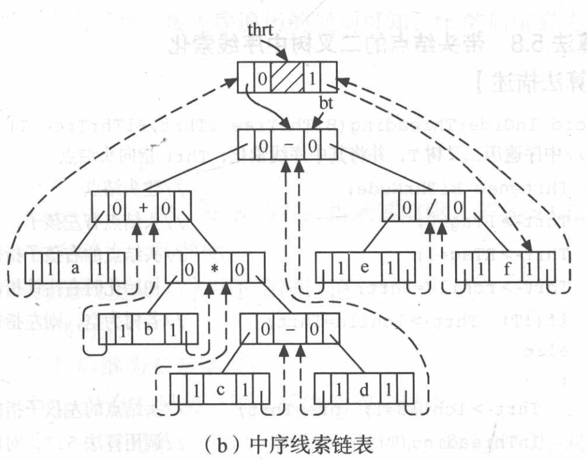

[TOC]


# 数据结构与算法

## 宏定义

在本笔记中用到的宏定义，头文件为define.h

```c
#define TRUE 1
#define FALSE 0

#define OK 1
#define ERROR 0

#define INFEASIBLE -1
#define OVERFLOW -2  // 溢出

typedef int Status;
```

------

## 一、线性表

### 1 顺序表(Sequence List)

特点：逻辑上相邻的数据元素，其物理次序也是相邻的

线性表中第 `i+1` 个数据元素的存储位置 LOC(a<sub>i+1</sub>) 和第 `i` 个元素满足下列关系

LOC(a<sub>i+1</sub>) = LOC(a<sub>i</sub>) + l

LOC(a<sub>i</sub>) = LOC(a<sub>1</sub>) + (i-1)*l

l：代表每个元素所占用的空间


#### -顺序表的存储结构

```c
#define SQLMAXSIZE 100
// 顺序表的存储结构
typedef int SqlElemType;
typedef struct SqList {
    SqlElemType *data;    // 数据
    int length;           // 当前线性表的长度
} SqList;
```

#### -初始化

```c
// 初始化
Status InitSql (SqList *L, int length) {
    L->data = (SqlElemType*) malloc(sizeof(SqlElemType) * SQLMAXSIZE);
    if (!L->data) {
        return OVERFLOW;
    }
    L->length = 0;
    for (int i = 1; i <= length; ++i) {
        SqlElemType e;
        scanf("%d", &e);
        SqlInsert(L, i, e);
    }
    return OK;
}
```

#### -获取元素

```c
// 获取元素
Status GetElem(SqList *L, int position, SqlElemType *e) {
    if (!L->data) return ERROR;
    if (position < 1 || position > L->length) return ERROR;
    *e = L->data[position - 1];
    return OK;
}
```

#### -查找元素

```c
// 查找元素
int LocateElem(SqList *L, SqlElemType e) {
    if (!L->data) return OVERFLOW;
    for (int i = 0; i < L->length; ++i) {
        if (L->data[i] == e) return i + 1;
    }
    return 0; // 0代表元素不在顺序表中
}
```

平均查找长度ASL(Average Search Length)
$$
ASL = \sum_{i=1}^{n} p_iC_i
$$
p<sub>i</sub>为查找第i个元素成功的概率

C<sub>i</sub>为查找第i个元素需要比较的次数

可知 p<sub>i</sub> = 1/n

C<sub>i</sub>为第i个元素在表中位置
$$
ASL = \frac{1}{n}\sum_{i=1}^{n}i = \frac{n+1}{2}
$$
因此可知 LocateElem 的时间复杂度为 O(n)

#### -插入元素

```c
// 插入
Status SqlInsert(SqList *L, int position, SqlElemType e) {
    if (!L->data || L->length == SQLMAXSIZE) return ERROR;
    if (position < 1 || position > L->length + 1) return ERROR;
    for (int i = L->length - 1; i >= position - 1; i--) {
        // 注意需要把数组中的元素全部向右移动，需要从数组最右边的元素开始移动
        L->data[i+1] = L->data[i];
    }
    L->data[position - 1] = e;
    L->length++;
    return OK;
}
```

E<sub>ins</sub> 表示插入元素所需要移动元素次数的期望值(平均次数)
$$
E_{ins}=\sum_{i=1}^{n+1}p_i(n-i+1)
$$
假设在各个位置上插入元素的概率相等p<sub>i</sub> = 1/(n+1)
$$
E_{ins}=\frac{1}{n+1}\sum_{i=1}^{n+1}(n-i+1)=\frac{n}{2}
$$
因此可知 SqlInsert 的时间复杂度为 O(n)

#### -删除元素

```c
// 删除
Status SqlDelete(SqList *L, int position, SqlElemType *e) {
    if (!L->data || L->length == 0) return ERROR;
    if (position < 1 || position > L->length) return ERROR;
    *e = L->data[position - 1];
    for (int i = position - 1; i < L->length - 1; i++) {
        L->data[i] = L->data[i+1];
    }
    L->length--;
    return OK;
}
```

$$
E_{del}=\sum_{i=1}^{n}p_i(n-i)=\frac{1}{n}\sum_{i=1}^{n}(n-i)=\frac{n-1}{2}
$$

因此可知 SqlDelete 的时间复杂度为 O(n)

#### -销毁、清空线性表

```c
// 销毁线性表
Status SqlDestroy(SqList *L) {
    if (!L->data) {
        return ERROR;
    }
    free(L->data);
    return OK;
}

// 清空线性表
void SqlClear(SqList *L) {
    L->length = 0;
}
```

#### -检查为空、获取线性表长度

```c
// 判断线性表是否为空
Status SqlIsEmpty(SqList L) {
    return L.length == 0 ? TRUE : FALSE;
}

// 求线性表的长度
int SqlLength(SqList L) {
    return L.length;
}
```

#### -顺序表的头文件

```c
#define SQLMAXSIZE 100

// 顺序表的存储结构
typedef int SqlElemType;
typedef struct SqList {
    SqlElemType *data;    // 数据
    int length;           // 当前线性表的长度
} SqList;

// 初始化
Status InitSql (SqList *L, int length);
// 获取元素
Status GetElem(SqList *L, int position, SqlElemType *e);
// 查找元素
int LocateElem(SqList *L, SqlElemType e);
// 插入
Status SqlInsert(SqList *L, int position, SqlElemType e);
// 删除
Status SqlDelete(SqList *L, int position, SqlElemType *e);
// 销毁线性表
Status SqlDestroy(SqList *L);
// 清空线性表
void SqlClear(SqList *L);
// 判断线性表是否为空
Status SqlIsEmpty(SqList L);
// 求线性表的长度
int SqlLength(SqList L);
```


### 2 单链表(Single Linked List)

- 单链表由头节点(不存放数据只存放下个节点的地址)和n个节点组成，
- 每个节点分为两个域：*数据域*和*指针域(存放下个节点的地址)*
- 第n个节点的指针域为NULL

如下图所示


#### -单链表的存储结构

```c
typedef int LlElemType;
typedef struct _LNode {
    LlElemType data;      //存放单个节点的数据
    struct _LNode *next;  //存放下个节点的地址
} LNode, *LinkList;
```

#### -初始化

```c
// 初始化
Status InitLL(LinkList *L) { // L是一个二级指针
    (*L) = (LinkList) malloc(sizeof(LNode));
    (*L)->next = NULL;
    return OK;
}
```

#### -创建链表(头插法) O(n)

```c
// 创建链表(头插法) O(n)
void CreateLL_H(LinkList L, int n) {
    //用此方法创建的链表，遍历的顺序和创建的顺序相反
    printf("Please enter %d numbers: \n", n);
    for (int i = 0; i < n; ++i) {
        LinkList p = (LinkList) malloc(sizeof(LNode));
        LlElemType data;
        scanf("%d", &data);
        p->data = data;
        p->next = L->next;
        L->next = p;
    }
}
```

#### -创建链表(尾插法) O(n)

```c
// 创建链表(尾插法) O(n)
void CreateLL_T(LinkList L, int n) {
    LinkList pTail = L;
    printf("Please enter %d numbers: \n", n);
    for (int i = 0; i < n; ++i) {
        LinkList p = (LinkList) malloc(sizeof(LNode));
        LlElemType data;
        scanf("%d", &data);
        p->data = data;
        p->next = NULL;
        pTail->next = p;
        pTail = p;
    }
}
```

#### -获取元素 O(n)

```c
// 获取元素 O(n)
Status GetElem(LinkList L, int pos, LlElemType *e) {
    LinkList p = L->next;               // p 指向 链表L 的第一个结点
    int j = 1;                          // j 为计数器
    while (p && j < pos) {              // p不为空且j计数器还没有等于pos时
        p = p->next;                    // p指向下一个结点
        j++;
    }
    if (!p || j > pos) return ERROR;    // 第 pos 个结点不存在
    *e = p->data;                       // 取第 pos 个结点的数据
    return OK;
}
```

#### -查找元素 O(n)

```c
// 查找元素 O(n) 返回节点
LinkList LocateElem_e (LinkList L, LlElemType e) {
    LinkList p = L->next;
    while (p && p->data != e) {
        p = p->next;
    }
    if (!p) return NULL; //如果 p 的地址为空,说明 e 不在链表中
    return p;
}

// 查找元素 O(n) 返回节点在线性表中的下标位置
int LocateElem_i (LinkList L, LlElemType e) {
    LinkList p = L->next;
    int i = 1;
    while (p && p->data != e) {
        p = p->next;
        i++;
    }
    if (!p) return 0; //如果 p 的地址为空，说明 e 不在链表中，返回0
    return i;
}
```

#### -插入元素 O(n)


想在 a，b 之间插入 x, 需要先知道 a 节点的地址
如图所示，如果想要在位置 i 插入节点，则需要知道位置 i-1 节点的位置


- 注意因为插入操作和GetElem操作不同
- 要从0开始，p要从L开始
- 如果从1和L开始的话，无法在位置1插入元素

```c
// 插入元素 O(n)
Status LlInsert(LinkList L, int pos, LlElemType e) {
    LinkList p = L;                     // 注意因为插入操作和GetElem操作不同
    int i = 0;                          // i要从0开始，p要从L头结点开始
    // 如果从1和L首元结点开始的话，无法在位置1插入元素
    while (p && i < pos-1) {      //查找插入节点位置的前一个节点
        p = p->next;
        i++;
    }
    if (!p || i > pos - 1) return ERROR;

    LinkList newP = (LinkList) malloc(sizeof(LNode));
    newP->data = e;
    newP->next = p->next;
    p->next = newP;
    return OK;
}
```

#### -删除元素 O(n)


想要删除 b，则必须先知道 a 的地址

- 注意因为删除操作和GetElem操作不同
- 要从0开始，p要从L开始
- 如果从1和L开始的话，无法在位置1删除元素


```c
// 删除元素 O(n)
Status LlDelete(LinkList L, int pos, LlElemType *e) {
    LinkList p = L, q;
    int i = 0;
    while (p && i < pos - 1) { // 查找删除节点位置的前一个节点
        p = p->next;
        i++;
    }
    //注意是 多增加了判断条件!(p->next)，当节点数为n，删除的位置为n+1时会返回error
    if (!p || !p->next || i > pos - 1) return ERROR;

    q = p->next;
    *e = q->data;
    p->next = q->next;
    free(q);
    return OK;
}
```

#### -总结插入和删除操作算法的不同

```c
while (p){
	p = p->next;
} //最终p的值为NULL

while(p->next){
	p = p->next;
} //最终p的值为最后一个节点的地址
```

```c
//---------------------插入----------------------
//如果插入操作的pos不合法，即pos > n+1(n为链表长度)，那么p一定会指向NULL，此时按照退出条件!p可以返回ERROR
if (!p || i > pos-1) return ERROR;
//但是如果采用:
while(p->next)
//则最终会指向链表最后一个节点，即使pos不合法，那么也会在最后一个节点后方插入新节点
//所以使用:
while(p)
```

```c
////---------------------删除----------------------
//如果删除操作的pos不合法，即pos>链表长度，p会指向最后一个节点的地址(pos == n+1时)或是NULL(pos > n+1)，那么下面的代码会出错
LinkList pfree = p->next;
//如果p指向最后一个节点，此时pfree指向NULL。如果p指向NULL，此时pfree指向非法空间(不受主程序控制)，从而导致下面代码报错
*e = pfree->data;
//所以需要增加一个判断条件
if (i> pos-1 || !p || !p->next) return ERROR;
// 必须保证 !p 要在 !p->next的左边，即 position > n+1 的情况
// 这是因为如果 !p->next 在 !p 的左边，如果p指向NULL，那么NULL->next会报错
```

#### -销毁链表、清空链表 O(n)

```c
// 销毁链表 O(n)
Status LlDestroy(LinkList L) {
    LinkList p;
    while (L) {
        p = L;
        L = L->next;
        free(p);
    }
    return OK;
}

// 清空链表 O(n)
Status LlClear(LinkList L) {
    LinkList p = L->next, q;    // p指向第一个结点
    while (p) {                 // 没到表尾
        q = p;
        p = p->next;
        free(q);
    }
    L->next = NULL;             // 头结点指针域置位空
    return OK;
}
```

#### -求单链表的长度 O(n)

```c
// 求单链表的长度 O(n)
int LlLength(LinkList L) {
    LinkList p = L->next;
    int i = 0;
    while (p) {
        p = p->next;
        ++i;
    }
    return i;
}
```

#### -单链表头文件

```c
typedef int LlElemType;
typedef struct _LNode {
    LlElemType data;      //存放单个节点的数据
    struct _LNode *next; //存放下个节点的地址
} LNode, *LinkList;

// 初始化
Status InitLL(LinkList *L);
// 创建链表(头插法) O(n)
void CreateLL_H(LinkList L, int n);
// 创建链表(尾插法) O(n)
void CreateLL_T(LinkList L, int n);
// 获取元素 O(n)
Status GetElem(LinkList L, int pos, LlElemType *e);
// 查找元素 O(n)
LinkList LocateElem_e (LinkList L, LlElemType e);
int LocateElem_i (LinkList L, LlElemType e);
// 插入元素 O(n)
Status LlInsert(LinkList L, int pos, LlElemType e);
// 删除元素 O(n)
Status LlDelete(LinkList L, int pos, LlElemType *e);
// 销毁链表 O(n)
Status LlDestroy(LinkList L);
// 清空链表 O(n)
Status LlClear(LinkList L);
// 求单链表的长度 O(n)
int LlLength(LinkList L);
```


### 3 循环链表(Circular Linked List)

循环链表的特点：

- 最后一个节点的指针域指向头节点，整个表链形成一个环
- 由此，从表中任意节点出发，可以找到其他节点


和单链表很像，区别就是最后一个节点的next域指向头节点

1. 单链表中，空表判断`L->next!=NULL`；
2. 循环链表中，空表判断`L->next!=L`；
3. 单链表中，遍历链表时，判别当前指针`p`是否指向表尾节点的终止条件为`p!=NULL`或者`p->next!=NULL`；
4. 而循环链表中，遍历链表时，判别当前指针`p`是否指向表尾节点的终止条件为`p!=L`或者`p->next!=L`；


### 4 双向链表(Double Linked List)

有两个指针域，一个指向直接前驱，另一个指向直接后继


#### -数据类型

```c
typedef int ElemType;
typedef struct _DouLinkedList {
    ElemType data;
    struct _DouLinkedList * prior;
    struct _DouLinkedList * next;
} DouLinkedNode, *DouLinkedList;
```

#### -初始化

```c
// 初始化
void InitDL (DouLinkedList *L) {
    (*L) = (DouLinkedNode *) malloc(sizeof(DouLinkedNode));
    (*L)->next = NULL;
    (*L)->prior = NULL;
}
```

#### -创建双向链表

```c
// 创建双向链表---头插法
void CreatDL_H (DouLinkedList L, int length) {
    for (int i = 0; i < length; ++i) {
        DouLinkedList newp = (DouLinkedNode *) malloc(sizeof(DouLinkedNode));
        ElemType data;
        printf("(for %d)Please input the data:", i + 1);
        scanf("%d", &data);
        newp->data = data;
        newp->next = L->next;
        if(L->next) L->next->prior = newp;
        newp->prior = L;
        L->next = newp;
    }
}

// 创建双向链表---尾插法
void CreatDL_R (DouLinkedList L, int length) {
    DouLinkedList ptail = L;
    for (int i = 0; i < length; ++i) {
        DouLinkedList pnew = (DouLinkedNode *) malloc(sizeof(DouLinkedNode));
        ElemType data;
        printf("(for %d)Please input the data:", i + 1);
        scanf("%d", &data);
        pnew->data = data;
        pnew->next = NULL;
        pnew->prior = ptail;
        ptail->next = pnew;
        ptail = pnew;
    }
}
```

#### -插入和删除


```c
// 插入
Status DLInsert(DouLinkedList L, int pos, ElemType e) {
    DouLinkedList p = L;
    int i = 0;
    while (p && i < pos - 1) {
        p = p->next;
        i++;
    }
    if (!p || i > pos - 1) return ERROR;

    DouLinkedList newP = (DouLinkedList) malloc(sizeof(DouLinkedNode));
    newP->data = e;
    newP->next = p->next;					// 1
    newP->prior = p;						// 2    
    if (p->next) p->next->prior = newP;		  // 3
    p->next = newP;							// 4
    return OK;
}

// 删除
Status DLDelete(DouLinkedList L, int pos, ElemType *e){
    DouLinkedList p = L;
    int i = 0;
    while (p && i < pos) { // 找到要删除的节点
        p = p->next;
        i++;
    }
    if (!p || i > pos) return ERROR;

    *e = p->data;
    p->prior->next = p->next;		// 1
    p->next->prior = p->prior;		// 2
    free(p);
    return OK;
}
```


### 5 线性表的应用

#### -线性表合并

已知两个集合：A = { 7, 5, 3, 11 }; B = { 2, 6, 3 };

求出合并之后的集合 A = { 7, 5, 3, 11, 2, 6 };

算法步骤：

1. 分别获取 LA 表长 m 和 LB 表长 n。
2. 从 LB 中第 1 个数据元素开始，循环n次执行以下操作：
   - 从 LB 中查找第i(1<=i<=n)个数据元素赋给e;
   - 在 LA 中查找元素 e, 如果不存在，则将 e 插在表 LA 的最后。

```c
void MergeList(SqList *LA, SqList *LB) {
    int m = LA->length;
    int n = LB->length;
    SqlElemType e;
    for (int i = 1; i <= n; ++i) {
        GetElem(LB, i, &e);
        if (!LocateElem(LA, e)) {
            SqlInsert(LA, ++m, e);
        }
    }
}
```

```c
int main() {
    SqList La, Lb;
    SqList *pa = &La;
    SqList *pb = &Lb;
    InitSql(pa, 4);
    InitSql(pb, 3);

    SqlPrint(La);
    SqlPrint(Lb);

    MergeList(pa, pb);
    SqlPrint(La);
    SqlPrint(Lb);

    return 0;
}
```


#### -有序表合并(并归排序的基础)

有序集合是指集合中的元素有序排列。已知两个有序集合A和B, 数据元素按值非递减有序排列，现要求一个新的集合C=AUB, 使集合C中的数据元素仍按值非递减有序排列。

例如：A = { 3, 5, 8, 11 }; B = { 2, 6, 8, 9, 11, 15, 20 };

C = { 2, 3, 5, 6, 8, 8, 9, 11, 11, 15, 20 };

算法步骤：

1. LA的表长为 m，LB的表长为n，创建一个表长为 m+n 的空表LC；
2. 指针pc初始化，指向LC的第一个元素；
3. 指针pa和pb初始化，分别指向LA和LB的第一个元素；
4. 当指针 pa 和 pb 均未到达相应表尾时，则依次比较pa和pb所指向的元素值，从LA或LB中“摘取”元素值较小的结点插入到LC的最后；
5. 如果pb巳到达LB的表尾，依次将LA的剩余元素插入LC的最后；
6. 如果pa已到达LA的表尾，依次将LB的剩余元素插入LC的最后。

```c
// 已知顺序有序表LA和LB的元素按值非递减排列
// 归并LA和LB得到新的顺序有序表LC, LC的元素也按值非递减排列
void MergeList_Seq(SqList LA, SqList LB, SqList *LC) {
    // 新表长度为待合并两表的长度之和
    LC->length = LA.length + LB.length;
    // 为合并后的新表分配一个数组空间
    LC->data = (SqlElemType *) malloc(sizeof(SqlElemType) * LC->length);
    // 指针 pc 指向新表的第一个元素
    SqlElemType *pc = LC->data;
    // 指针 pa 和 pb 的初值分别指向两个表的第一个元素
    // 指针 pa_last 指向 LA 的最后一个元素
    // 指针 pb_last 指向 LB的最后一个元素
    SqlElemType *pa = LA.data, *pa_last = LA.data + LA.length - 1;
    SqlElemType *pb = LB.data, *pb_last = LB.data + LB.length - 1;
    // LA和LB均未到达表尾
    while ((pa <= pa_last) && (pb <= pb_last)) {
        // 依次"摘取"两表中值较小的结点插人到LC的最后
        if (*pa <= *pb) *pc++ = *pa++;
        else *pc++ = *pb++;
    }
    // LB已到达表尾，依次将LA的剩余元素插人LC的最后
    while (pa <= pa_last) { *pc++ = *pa++; }
    // LA已到达表尾，依次将LB的剩余元素插人LC的最后
    while (pb <= pb_last) { *pc++ = *pb++; }
}
```


#### -有序链表合并

1. 指针 pa 和 pb 初始化，分别指向LA和LB的第一个结点；
2. LC 的结点取值为 LA 的头结点；
3. 指针 pc 初始化，指向LC的头结点；
4. 当指针 pa 和 pb 均未到达相应表尾时，则依次比较 pa 和 pb 所指向的元素值，从 LA 或 LB 中“摘取”元素值较小的结点插入到 LC 的最后；
5. 将非空表的剩余段插入到 pc 所指结点之后；
6. 释放 LB 的头结点。

```c
void MergeList_L(LinkList LA, LinkList LB, LinkList *LC) {
    *LC = LA;
    LinkList pa = LA->next, pb = LB->next;
    LinkList pc = *LC;
    while (pa && pb) {
        if (pa->data <= pb->data) {
            pc->next = pa;
            pc = pa;
            pa = pa->next;
        } else {
            pc->next = pb;
            pc = pb;
            pb = pb->next;
        }
    }
    pc->next = pa ? pa : pb;
    free(LB);
}
```

------

## 二、栈和队列(Stack and Queue)

### 1 顺序栈实现方式一(Sequence Stack)

栈是限定仅在*表尾*进行*插入或删除操作*的线性表，表末端为栈顶(Top)，表头称为栈顶(Bottom)，不含元素称为空栈(用顺序表存储的栈更常见)

因此栈又称为**后进先出(Last in First out, LIFO)**的线性表，如下图


#### -栈的类型定义

```c
#define MAXSTACK 100
typedef char StackElemType;
typedef struct _SqStack {   // 顺序栈，最常用
    StackElemType * base;   // 栈底指针
    StackElemType * top;    // 栈顶指针
    int stackSize;          // 栈可用的最大容量
} SqStack;
```

#### -栈的初始化

1. 为顺序栈动态分配一个最大容最为 MAXSIZE 的数组空间，使 base 指向这段空间的基地址，即栈底。
2. 栈顶指针 top 初始为 base, 表示栈为空。
3. stacksize 置为栈的最大容量 MAXSTACK

```c
// 初始化栈
Status InitStack(SqStack *S) {
    S->base = (StackElemType *) malloc(sizeof(StackElemType) * MAXSTACK);
    if (!S->base) exit(OVERFLOW);
    S->top = S->base;			// 栈顶指向栈底，表示栈空
    S->stackSize = MAXSTACK;     // stackSize 置为栈的最大容量 MAXSTACK
    return OK;
}
```


观察上图，发现top指向内存空间不存放元素

#### -入栈

因为top指向的内存不存放空间，当为base分配的空间存满元素时，`top=分配空间的最后一个元素的地址+1`，此时表示栈满，即`top-base = stackSize`。

1. 判断栈是否满，若满则返回ERROR；
2. 将新元素压入栈顶，栈顶指针加1。

```c
// 入栈
Status Push(SqStack *S, StackElemType e) {
    // 栈满
    if (S->top - S->base == S->stackSize) return ERROR;
    // top指向内存单元存放e，且top指向下一个内存单元
    *S->top++ = e;
    return OK;
}
```

#### -出栈

当`base == top`时，表示栈空

1. 判断栈是否空，若空则返回ERROR。
2. 栈顶指针减1, 栈顶元素出栈。

```c
// 出栈
Status Pop(SqStack *S, StackElemType *e) {
    // 栈空
    if (S->top == S->base) return ERROR;
    *e = *--S->top;
    return OK;
}
```

#### -栈的其他操作

```c
// 获取栈顶元素
Status GetTop(SqStack *S, StackElemType *e) {
    if (S->top == S->base) return ERROR;
    *e = *(S->top - 1);
    return OK;
}

// 判断栈是否为空；若栈为空返回TRUE，否则返回FALSE
Status IsEmpty(SqStack *S) {
    return S->top == S->base ? TRUE : FALSE;
}

// 判断栈是否已满；若栈已满返回TRUE，否则返回FALSE
Status IsFull(SqStack *S) {
    return S->top - S->base == S->stackSize ? TRUE : FALSE;
}
```


### 1 顺序栈实现方式2(Sequence Stack)

#### -栈的类型定义

```c
#define MaxStack 100            // 定义栈中元素的最大个数
typedef char SElemType;
typedef struct _SqStack {
    SElemType data[MaxStack];   // 存放栈中元素
    int top;                    // 栈顶指针，初始时top=-1，栈满时top=MaxStack-1
} SqStack;
```

#### -栈的初始化

```c
// 初始化栈
void InitStack(SqStack *S) {
    S->top = -1;            // 初始化栈顶指针
}
```

#### -入栈

因为top指向的内存存放空间，当分配的空间存满元素时，`top=分配空间的最后一个元素的地址`，此时表示栈满，即`top = MaxStack - 1`。

1. 判断栈是否满，若满则返回FALSE；
2. 栈顶指针加1，将新元素压入栈顶。

```c
// 入栈
Status Push(SqStack *S, SElemType e) {
    // 判断栈是否满
    if (S->top == MaxStack - 1) return FALSE;
    // S->top++;
    // S->data[S->top] = e;
    S->data[++S->top] = e;      // 指针先加1，后入栈
    return TRUE;
}
```

#### -出栈

当`top == -1`时，表示栈空

1. 判断栈是否空，若空则返回FALSE。
2. 栈顶指针减1, 栈顶元素出栈。

```c
// 出栈
Status Pop(SqStack *S, SElemType *e) {
    // 判断栈是否为空
    if (S->top == -1) return FALSE;
    *e = S->data[S->top--];     // 先出栈，指针再减1
    return TRUE;
}
```

#### -栈的其他操作

```c
// 获取栈顶元素
Status GetTop(SqStack *S, SElemType *e) {
    if (S->top == -1) return FALSE;     // 栈空，报错
    *e = S->data[S->top];               // e记录栈顶元素
    return TRUE;
}

// 判断栈是否为空；若栈为空返回TRUE，否则返回FALSE
Status IsEmpty(SqStack *S) {
    return S->top == -1 ? TRUE : FALSE;
}

// 判断栈是否已满；若栈已满返回TRUE，否则返回FALSE
Status IsFull(SqStack *S) {
    return S->top == MaxStack - 1 ? TRUE : FALSE;
}
```


### 2 链栈(Linked Stack)

由于栈的主要操作是对栈顶进行Push和Pop，所以选用top作为链表的头节点

#### -链栈的类型定义

```c
typedef char SElemType;
typedef struct _StackNode { // 链栈
    SElemType data;
    struct _StackNode *next;
} StackNode, *LinkStack;
```

#### -链栈_初始化

链栈的初始化操作就是构造一个空栈，因为没必要设头结点，所以直接将栈顶指针置空即可。

```c
// 链栈初始化
// 构造一个空栈S, 栈顶指针置空
Status InitStack (LinkStack *S) {
    *S = NULL;
    // (*S)->next = NULL; 不需要此行代码
    return OK;
}
```

#### -链栈_入栈

`在第一次Push时，第一个节点的next指向NULL`。

1. 为入栈元素e分配空间，用指针p指向。
2. 将新结点数据域置为e。
3. 将新结点插入栈顶。
4. 修改栈顶指针为p。


```c
// 链栈-入栈
Status Push(LinkStack *S, SElemType e) {
    LinkStack p = (LinkStack) malloc(sizeof(StackNode));
    p->data = e;
    p->next = *S; 	// 将新结点插人栈顶
    *S = p;         // 修改栈顶指针为p
    return OK;
}
```

#### -链栈_出栈


1. 判断栈是否为空，若空则返回ERROR。
2. 将栈顶元素赋给e。
3. 临时保存栈顶元素的空间，以备释放。
4. 修改栈顶指针，指向新的栈顶元素。
5. 释放原栈顶元素的空间。

```c
// 链栈-出栈
Status Pop(LinkStack *S, SElemType *e) {
    if ((*S) == NULL) return ERROR; // 栈空
    *e = (*S)->data;
    LinkStack pFree = *S;
    *S = (*S)->next;
    free(pFree);
    return OK;
}
```

#### -链栈的其他操作

```c
// 链栈-获取栈顶元素
Status GetTop(LinkStack S, SElemType *e) {
    if (!S) return ERROR;
    *e = S->data;
    return OK;
}

// 链栈-判断栈是否为空
Status IsEmpty(LinkStack S) {
    return !S ? TRUE : FALSE;
}
```


### 3 栈与递归

#### -函数的调用过程

调用前，系统完成：

1. 将实参，返回地址(下行代码地址)等传递给被调用函数
2. 为被调用函数的局部变量分配空间
3. 将控制转移到被调用函数的入口

调用后，系统完成：

1. 保存被调用函数的计算结果(返回值)
2. 释放被调用函数的数据区
3. 依照被调用函数保存的返回地址，将控制转移到调用函数


```c
long fact(long n) {
    if(n==0) return 1;
    return n * fact(n-1);
}
```

递归调用函数时，如下图


- 按照调用顺序依此把各个函数入栈
- 当栈顶函数满足return条件时，依此出栈(按照FISLO原则)，并且返回值从上向下传递
- 直到主程序调用的fact(4)出栈后，递归完成


### 4 循环队列

定义：只能在*表的一端进行插入运算*，*在表的另一端进行删除*运算的线性表；

**先进先出(First in First out)**原则


#### -数据类型定义

```c
#define QMAXSIZE 100
typedef char QElemType;
typedef struct _SqQueue {
    QElemType * base;
    int front, rear; // front为队头下标，rear为队尾下标 (rear下标的位置不存放元素)
} SqQueue;
// 入队rear+1, 出队front+1,但是此种情况存在问题，如下图
```


如上图，(d)虽然数组中的空间没有满，但是rear却不能继续增加，假溢出
解决方法：把base数组想象成一个环形的循环队列如下图


此时如果`front == rere`表示**队空**，而`front == (rere+1) % QMAXSIZE`时表示**队满**。

#### -循环队列初始化

```c
// 循环队列初始化
Status InitQueue(SqQueue *Q) {
    Q->base = (QElemType *) malloc(sizeof(QElemType) * QMAXSIZE);
    if (!Q->base) exit(OVERFLOW);
    Q->front = 0;
    Q->rear = 0;
    return OK;
}
```

#### -循环队列入队

1. 判断队列是否满，若满则返回ERROR。
2. 将新元素插入队尾。
3. 队尾指针加 1。

```c
// 循环队列入队
Status EnQueue(SqQueue *Q, QElemType e) {
    if (Q->front == (Q->rear + 1) % QMAXSIZE) return ERROR; // 队满
    Q->base[Q->rear] = e;
    Q->rear = (Q->rear + 1) % QMAXSIZE; // Q->rear++; 为错误写法
    return OK;
}
```

#### -循环队列出队

1. 判断队列是否为空，若空则返回ERROR。
2. 保存队头元素。
3. 队头指针加1。

```c
// 循环队列出队
Status DeQueue(SqQueue *Q, QElemType *e) {
    if (Q->front == Q->rear) return ERROR; // 队空
    *e = Q->base[Q->front];
    Q->front = (Q->front + 1) % QMAXSIZE;  // Q->front++; 为错误写法
    return OK;
}
```

#### -循环队列其他操作

```c
// 判断队列是否为空，若队列为空，返回TRUE，否则返回FALSE
Status IsEmpty(SqQueue *Q) {
    if (Q->front == Q->rear)
        return TRUE;
    else
        return FALSE;
    // OR
    // return Q->front == Q->rear;
}

// 判断队列是否已满
Status IsFull(SqQueue *Q) {
    if(Q->front == (Q->rear + 1) % QMAXSIZE)
        return TRUE;
    else
        return FALSE;
    // OR
    // return Q->front == (Q->rear + 1) % QMAXSIZE;
}

// 获取循环队列的队头元素
Status GetHead(SqQueue *Q, QElemType *e) {
    if (Q->front == Q->rear) return ERROR; // 队空
    *e = Q->base[Q->front];
    return OK;
}

// 获取循环队列的元素个数
int LengthQueue(SqQueue *Q) {
    return (Q->rear - Q->front + QMAXSIZE) % QMAXSIZE;
}
```


### 5 链队

链队结构类似于链表，不同于链表的头指针，用两个指针域 `front`、`rear` 来表示队列，如下图


#### -数据类型定义

```c
typedef char QElemType;
typedef struct _QNode {
    QElemType data;
    struct _QNode *next;
} QNode, *QueuePtr;
typedef struct {
    QueuePtr front;  // front相当于链表的头指针
    QueuePtr rear;   // rear指向整个链表的最后一个节点
} LinkQueue;
```

#### -链队初始化

```c
// 链队初始化
Status InitQueue(LinkQueue *Q) {
    // 生成新节点作为头结点，队头队尾指针指向头结点
    Q->front = Q->rear = (QNode *) malloc(sizeof(QNode));
    if (!Q->front) exit(OVERFLOW);
    Q->front->next = NULL; // 头结点的指针域置位空
    return OK;
}
```

#### -链队入队


```c
// 链队入队 头删尾插
Status EnQueue(LinkQueue *Q, QElemType e) {
    // 为入队元素分配结点空间
    QueuePtr newP = (QueuePtr) malloc(sizeof(QNode));
    if(!newP) exit(OVERFLOW);
    newP->data = e;         // 将新结点的数据域置为e
    newP->next = NULL;      // 将新结点的指针域置为空
    Q->rear->next = newP;   // 将新结点插入到队尾
    Q->rear = newP;         // 修改队尾指针
    return OK;
}
```

#### -链队出队

```c
// 链队出队 头删尾插
Status DeQueue(LinkQueue *Q, QElemType *e) {
    if (Q->front == Q->rear) return ERROR;    // 队空
    QueuePtr p = Q->front->next;              // p指向队头元素
    *e = p->data;                             // e保存队头元素的值
    Q->front->next = p->next;                 // 修改头结点的指针域
    // 如果删除的节点为队尾，那么释放p之后，rear指向未知存储空间
    if (p == Q->rear) Q->rear = Q->front;
    free(p);                          // 释放原队头元素的空间
    return OK;
}
```

#### -链队的其他操作

```c
// 取链队的队头元素
Status GetHead(LinkQueue *Q, QElemType *e) {
    if (Q->front == Q->rear) return ERROR; // 队空
    *e = Q->front->next->data;
    return OK;
}

// 判断链队是否为空
Status IsEmpty(LinkQueue *Q) {
    return Q->front == Q->rear;
}

// 获取链队的元素个数
int LengthQueue(LinkQueue *Q) {
    QueuePtr p = Q->front->next;
    int count = 0;
    while (p) {
        p = p->next;
        count++;
    }
    return count;
}
```


### 6 栈与队列的应用

#### -进制转化

一个进制转换函数，有一个参数n(十进制)，要求输出n的8进制

```c
//注：typedef int StackElemType;
void Convert10To8 (int n) {
    SqStack S;
    InitStack(&S);
    int temp = n;
    while(temp) {
        Push(&S, temp%8);
        temp = temp/8;
    }
    int e;
    while(!IsEmpty(&S)) {
        Pop(&S, &e);
        printf("%d", e);
    }
    printf("\n");
}
```

一个进制转换函数，有一个参数n(十进制)，要求输出n的16进制

```c
//注：typedef int StackElemType;
void Convert10To16(int n) {
    SqStack S;
    InitStack(&S);
    int temp = n;
    while (temp) {
        Push(&S, temp % 16);
        temp = temp / 16;
    }
    int e;
    while (!IsEmpty(&S)) {
        Pop(&S, &e);
        if (e < 10)
            printf("%d", e);
        else {
            printf("%c", e - 10 + 'A');
        }
    }
    printf("\n");
}
```


#### -括号的匹配

传入字符串括号`()[]{}`，判断括号是否匹配成功，`\0`字符表示输入结束

例：`([({})])` 成功 `[(()){}]]` 失败

```c
Status Matching_Parentheses(char *str) {
    SqStack *S = NULL;
    InitStack(&S);
    char *ch, pop;
    Status flag = TRUE;
    for (ch = str; *ch != '\0'; ch++) {
        switch (*ch) {
            case '(':
            case '[':
            case '{':
                Push(S, *ch);
                break;
            case ')':
                if(!IsEmpty(S)) {
                    Pop(S, &pop);
                    if (pop != '(') flag = FALSE;
                } else flag = FALSE;
                break;
            case ']':
                if(!IsEmpty(S)) {
                    Pop(S, &pop);
                    if (pop != '[') flag = FALSE;
                } else flag = FALSE;
                break;
            case '}':
                if(!IsEmpty(S)) {
                    Pop(S, &pop);
                    if (pop != '{') flag = FALSE;
                } else flag = FALSE;
                break;
        }
    }
    if (flag && IsEmpty(S)) {
        return TRUE;
    }
    return FALSE;
    // OR return (flag && IsEmpty(S));
}
```

------

## 三、字符串、数组和广义表

------

## 四、树和二叉树

### 1 树的定义

树(Tree)是n(n>=0)个节点的有限集合，当n==0时为空树；对于非空树T，有：

1. 有且只有一个称之为根的节点
2. 除根节点外，可分为m(m>0)个互不相交的有限集，T1、T2、...、Tm，其中一个集合本身又是一棵树，称之为根的子树(SubTree)。


### 2 树的基本术语

**节点、根节点、父节点、子节点、兄弟节点**；

- 一棵树可以没有任何节点，称为**空树**
- 一棵树可以只有 1 个节点，也就是只有根节点


**节点的度（degree）**：节点拥有的子树个数成为节点的度；如上图中degree(A) = 3, degree(C) = 1, degree(F) = 0

**树的度**：所有节点中度的最大值；上图的度为3

**叶子节点（leaf）**：度为 0 的节点；

**非叶子节点**：度不为 0 的节点；


**层数（level）**：根节点在第 1 层，根节点的子节点在第 2 层，以此类推（有些教程也从第 0 层开始计算）

**节点的深度（depth）**：从根节点到当前节点的唯一路径上的节点总数；

**节点的高度（height）**：从当前节点到最远叶子节点的路径上的节点总数；


**树的深度**：所有节点深度中的最大值；

**树的高度**：所有节点高度中的最大值；

**树的深度** 等于 **树的高度**；


**有序树**、**无序树**、**森林**

**有序树**：树中任意节点的子节点之间有顺序关系；

**无序树**：树中任意节点的子节点之间没有顺序关系，也称为 “自由树”；

**森林**：由 m（m ≥ 0）棵互不相交的树组成的集合；对任意一棵树而言，其子树组成森林


### 3 二叉树的定义及性质

二叉树的定义：

**二叉树**(Binary Tree) 是 n(n>=0) 个节点所构成的集合，n==0时为空树；对于非空树T：

1. 有且仅有一个称之为根的节点
2. 除根节点外，有互不相交的子集T1和T2，分别称为T的左子树和右子树，且T1和T2本身又都是二叉树。


二叉树的性质：

1. 每个节点最多有两颗子树(即二叉树中不存在度大于2的节点)
2. 二叉树的子树有左右之分，其次序不能任意颠倒。


### 4 二叉树定理

**定理一**：在二叉树的第i层上，最多有 2<sup>i-1</sup> 个节点

**定理二**：深度为k的二叉树，最多有 2<sup>k</sup>-1 个节点

**Proof**：2<sup>0</sup> + 2<sup>1</sup> + 2<sup>2</sup> + ... + 2<sup>k-1</sup> = 1*(1-2<sup>k</sup>)/(1-2) = 2<sup>k</sup>-1


**定理三**：n<sub>0</sub> = n<sub>2</sub> + 1

**Proof**：

令一颗二叉树T有n个节点，其中 n<sub>1</sub>，n<sub>2</sub>，n<sub>0</sub> 分别为 度为 1,2,0 的节点个数，即有：

n<sub>1</sub> + n<sub>2</sub> + n<sub>0</sub> = n     (1)

可知T的根无双亲节点，而其它节点都有双亲，令这些有双亲的节点的个数为B，即 B = n - 1 = 0·n<sub>0</sub> + 1·n<sub>1</sub> + 2·n<sub>2</sub> = 1·n<sub>1</sub> + 2·n<sub>2</sub>，即：

1·n<sub>1</sub> + 2·n<sub>2</sub> + 1 = n  (2)

(1)(2)联立得：n<sub>0</sub> = n<sub>2</sub> + 1


### 5 完全二叉树性质及定理

完全二叉树的定义：

- 深度为k的，有n个节点的二叉树
- 当且仅当其每一个节点都与深度为k的满二叉树中编号从1到n的节点一一对应时

称其为完全二叉树


**特点**：对完全二叉树的任意节点，若其右分支的子孙最大层次为k，则其左分支的子孙最大层次为k或k+1


**定理四**：若一个完全二叉树有n个节点，深度为k，则
$$
k=\lfloor log_2n \rfloor+1
$$
**Proof**：

根据完全二叉树性质可知，2<sup>k-1</sup> - 1 < n <= 2<sup>k</sup> - 1 ===> 2<sup>k-1</sup> <= n < 2<sup>k</sup>

对其log2化：k-1 <= log<sub>2</sub>n < k；因为k属于正整数，故 $$k=\lfloor log_2n \rfloor+1$$


**定理五**：一棵完全二叉树T，有n个节点，若按照节点层次(从左到右，从上至下)编号，则对于任意节点i(从1开始至n)：

1. i = 1；根节点，无双亲

2. i != 1 && i <= n；i的双亲为 $$\lfloor i/2 \rfloor$$

3. 若 2i > n，则 i 无左孩子

   若 2i <= n, 2i 为 i 的左孩子

4. 若 2i + 1 > n，则 i 无右孩子

   若 2i + 1 <= n, 2i + 1 为 i 的右孩子


扩展：i的范围为[0, n-1]

1. i = 0；根节点，无双亲

2. i != 0 && i <= n-1；i的双亲为 $$\lfloor (i-1)/2 \rfloor$$

3. 若 2i + 1 > n - 1，则 i 无左孩子

   若 2i + 1 <= n - 1, 2i+1 为 i 的左孩子

4. 若 2i + 2 > n - 1，则 i 无右孩子

   若 2i + 2 <= n - 1, 2i + 2 为 i 的右孩子


### 6 链式二叉树

#### -存储结构

```c
typedef char ElemType;
typedef struct _BiNode {
    ElemType data;
    struct _BiNode *left, *right;
} BiNode, *BiTree;
```

#### -遍历方式(递归)

```c
// 二叉树递归遍历---先(前)序遍历
void PreOrder(BiTree T) {
    if (!T) return;
    printf("%c", T->data);
    PreOrder(T->left);
    PreOrder(T->right);
}

// 二叉树递归遍历---中序遍历
void InOrder(BiTree T) {
    if (!T) return;
    InOrder(T->left);
    printf("%c", T->data);
    InOrder(T->right);
}

// 二叉树递归遍历---后序遍历
void PostOrder(BiTree T) {
    if (!T) return;
    PostOrder(T->left);
    PostOrder(T->right);
    printf("%c", T->data);
}
```

#### -遍历方式(非递归)

```c
// 二叉树非递归遍历---先(前)序遍历1
void PreOrder_NonRec1(BiTree T) {
    SqStack S;
    InitStack(&S);                          	// 初始化栈
    BiTree p = T;                               // p为遍历指针
    while (p || !StackEmpty(&S)) {          	// p不空 或 栈不空时循环
        if (p) {                                // 一路向左
            printf("%c", p->data);      		// 访问当前节点
            Push(&S, p);                 		// 并入栈
            p = p->left;                         // 左孩子不空，一直向左走
        } else {                                // 出栈，并转向出栈结点的右子树
            Pop(&S, &p);                 		// 栈顶元素出栈
            p = p->right;                       // 向右子树走，p赋值为当前结点的有孩子
        }
    }
}
```

```c
// 二叉树非递归遍历---先(前)序遍历2
void PreOrder_NonRec2(BiTree T) {
    if (!T) return;
    SqStack S;
    InitStack(&S);                          // 初始化栈
    Push(&S, T);
    while (!StackEmpty(&S)) {               // 栈不空时循环
        BiTree p;
        Pop(&S, &p);                        // 中
        printf("%c", p->data);
        if (p->right) Push(&S, p->right);   // 右 空结点不入栈
        if (p->left) Push(&S, p->left);     // 左 空节点不入栈
    }
}
```

```c
// 二叉树非递归遍历---中序遍历
void InOrder_NonRec(BiTree T) {
    SqStack S;
    InitStack(&S);                             // 初始化栈
    BiTree p = T;                              // p为遍历指针
    while (p || !StackEmpty(&S)) {             // p不空 或 栈不空时循环
        if (p) {                               // 一路向左
            Push(&S, p);                       // 当前结点入栈
            p = p->left;                       // 左孩子不空，一直向左走
        } else {                               // 出栈，并转向出栈结点的右子树
            Pop(&S, &p);
            printf("%c", p->data);             // 栈顶元素出栈，访问出栈元素
            p = p->right;                      // 向右子树走，p赋值为当前结点的有孩子
        }
    }
}
```

```c
// 二叉树非递归遍历---后序遍历
void PostOrder_NonRec(BiTree T) {
    if (!T) return;
    BiTree pre = NULL;
    SqStack S;
    InitStack(&S);
    Push(&S, T);
    while (!StackEmpty(&S)) {
        BiTree node;
        GetTop(&S, &node);
        //判断是否为叶子结点
        int isLeaf = (node->left == NULL && node->right == NULL);
        //判断上次处理的结点是否是当前处理结点的子结点
        int isSub = (pre != NULL) && (node->left == pre || node->right == pre);
        if (isLeaf || isSub) {
            Pop(&S, &pre);
            printf("%c", pre->data);
        } else {
            if (node->right) Push(&S, node->right);   // 右 空结点不入栈
            if (node->left) Push(&S, node->left);     // 左 空节点不入栈
        }
    }
}
```


#### -层次遍历算法

```c
// 二叉树的层次遍历
void LevelOrder(BiTree T) {
    QElemType node;
    SqQueue Q;
    InitQueue(&Q);                                          // 初始化辅助队列
    EnQueue(&Q, T);                                         // 根节点入队
    while (!QueueEmpty(&Q)) {                               // 队列不空则循环
        DeQueue(&Q, &node);                                 // 队头结点出队
        printf("%c", node->data);                           // 访问队头结点
        if (node->left) EnQueue(&Q, node->left);            // 左子树不空，则左子树根节点入队
        if (node->right) EnQueue(&Q, node->right);          // 右子树不空，则右子树根节点入队
    }
}
```


#### -先序遍历创建二叉树

```c
// 先序遍历创建二叉树
void Creat_BiTree_Pre(BiTree *T) {
    //根据输出字符识别虚空节点，'#'代表虚空节点
    char e;
    scanf("%c", &e); 		// 输入字符
    if(e == '#')
        *T = NULL;           // 设置虚空结点
    else {
        *T = (BiTree) malloc(sizeof(BiNode));
        (*T)->data = e;
        Creat_BiTree_Pre(&(*T)->left);
        Creat_BiTree_Pre(&(*T)->right);
    }
}
```


#### -测试(创建，遍历)

输入如下一棵树，按照各种遍历方式输出


```c
int main() {
    BiTree T;
    // CDNK##J##BZ###FL##M##
    Creat_BiTree_Pre(&T);
    TestPreOrder(T);
    TestInOrder(T);
    TestPostOrder(T);
    TestLevelOrder(T);
    return 0;
}
```

```c
// 测试前序遍历
void TestPreOrder(BiTree T) {
    printf("前序遍历---递归\n");
    PreOrder(T);
    printf("\n");
    printf("前序遍历---非递归1\n");
    PreOrder_NonRec1(T);
    printf("\n");
    printf("前序遍历---非递归2\n");
    PreOrder_NonRec2(T);
    printf("\n");
}

// 测试中序遍历
void TestInOrder(BiTree T) {
    printf("中序遍历---递归\n");
    InOrder(T);
    printf("\n");
    printf("中序遍历---非递归\n");
    InOrder_NonRec(T);
    printf("\n");
}

// 测试后序遍历
void TestPostOrder(BiTree T) {
    printf("后序遍历---递归\n");
    PostOrder(T);
    printf("\n");

    printf("后序遍历---非递归\n");
    PostOrder_NonRec(T);
    printf("\n");
}

// 测试层次遍历
void TestLevelOrder(BiTree T) {
    printf("层次遍历---队列\n");
    LevelOrder(T);
    printf("\n");
}
```


#### -复制二叉树

```c
// 复制二叉树
void Copy(BiTree T, BiTree *newT) {
    if (T == NULL) {               // 空树，队规结束
        *newT = NULL;
        return;
    } else {
        *newT = (BiTree) malloc(sizeof(BiNode));
        (*newT)->data = T->data;
        // 递归复制左子树
        Copy(T->left, &(*newT)->left);
        // 递归复制右子树
        Copy(T->right, &(*newT)->right);
    }
}
```


#### -求深度和节点数

```c
// 二叉树的深度
int BTDepth(BiTree T) {
    if (T == NULL) return 0;
    int l = BTDepth(T->left);
    int r = BTDepth(T->right);
    return l > r ? (l+1) : (r+1);
}

// 二叉树的结点个数
int BTNodes(BiTree T) {
    // 空树，返回0，递归结束
    if (T == NULL) return 0;
    return BTNodes(T->left) + BTNodes(T->right) + 1;
}
```


#### -销毁二叉树

```c
// 二叉树的销毁---递归方式
void BTDestroy(BiTree *T) {
    if (!(*T)) return;
    BTDestroy(&(*T)->left);
    BTDestroy(&(*T)->right);
    free(*T);
    *T = NULL;
}
```


### 7 线索二叉树

线索二叉树：Threaded Binary Tree

问题，如何寻找特定遍历顺序中二叉树节点的前驱和后继？

办法：

1. 通过遍历，浪费时间
2. 给结构体内增加前驱和后继指针，增加存储负担
3. 利用二叉链表中的空指针域


**定理**：如果一个二叉树有 n 个节点，那么空指针域为 n+1 个

**Proof**：总指针域为 2n 个，除去根节点，一个有 n-1 个节点，即需要 n-1 个指针域，则空指针域为 n+1 个


线索二叉树的定义：

- 如果某个节点的左孩子为空，那么利用左孩子指针域，把它指向它的前驱
- 如果右孩子为空，则指向它后继
- 这种改变指向的指针称为线索


#### -数据类型定义

```c
// 二叉树的二叉线索存储表示
typedef struct _BiThrNode {
    ElemType data;
    struct _BiThrNode *lchild, *rchild;    // 左右孩子指针
    int LTap, RTap;                        // 左右线索标志
} BiThrNode, *BiThrTree;
```

- LTap == 0：左孩子指向其左子树

  LTap == 1：左孩子指向其前驱

- RTap == 0：右孩子指向其右子树

  RTap == 1：右孩子指向其后继

- 如果按照遍历的顺序，那么序列中第一个元素必然没有前驱，把该节点的左孩子指向一个头指针；

  该头指针的左孩子指向根节点，右孩子指向序列最后一个节点

- 一个中序遍历为 a + b*c - d - e/f 的线索二叉树




#### -中序线索化及遍历

```c
static BiThrTree pre;

// 以结点p为根的子树中序线索化
void InThreading(BiThrTree p) {
    // pre为全局变量，初始化时其右孩子指针为空，便于在树的最左点开始建线索
    if(p) {
        InThreading(p->lchild);            // 左子树递归线索化
        if (p->lchild == NULL) {           // p的左子树为空
            p->LTap = 1;                   // 给p加上左线索
            p->lchild = pre;               // p的左孩子指向pre(前驱)
        } else
            p->LTap = 0;

        if (pre->rchild == NULL) {         // pre的右孩子为空
            pre->RTap = 1;                 // 给pre加上右线索
            pre->rchild = p;               // pre的右孩子指向p(后继)
        } else
            pre->RTap = 0;

        pre = p;                           // 保持pre指向p的前驱
        InThreading(p->rchild);            // 右子树递归线索化
    }
}

// 带头结点的二叉树中序线索化
void InOrderThreading(BiThrTree *Thrt, BiThrTree T) {
    // 中序遍历二叉树T，并将其中序线索化，Thrt指向头结点
    (*Thrt) = (BiThrTree) malloc(sizeof(BiThrNode));         // 建头结点
    (*Thrt)->LTap = 0;                                       // 头结点有左孩子，若树非空，则其左孩子为树根
    (*Thrt)->RTap = 1;                                       // 头结点的右孩子指针为右线索
    (*Thrt)->rchild = (*Thrt);                               // 初始化时右指针指向自己
    if (!T) (*Thrt)->lchild = (*Thrt);                       // 若树为空，则左指针也指向自己
    else {
        (*Thrt)->lchild = T;                                 // 头结点的左孩子指向根
        pre = (*Thrt);                                       //  pre初值指向头结点
        InThreading(T);                                      // 对以T为根的二叉树进行中序线索化
        pre->rchild = (*Thrt);                               // 线索化结束后，pre为最右结点，pre的右线索指向头结点
        pre->RTap = 1;
        (*Thrt)->rchild = pre;                               // 头结点的右线索指向pre
    }
}

// 遍历中序线索二叉树
void InOrderTraverse_Thr(BiThrTree T) {
    // T指向头结点，头结点的左链lchild指向根结点
    // 中序遍历二叉线索树T的非递归算法，对每个数据元素直接输出
    BiThrTree  p = T->lchild;                           // p指向头结点
    while (p != T) {                                    // 空树或遍历结束时，p==T
        while (p->LTap == 0) p = p->lchild;             // 沿左孩子向下
        printf("%c", p->data);                          // 访问其左孩子为空的结点
        while (p->RTap == 1 && p->rchild != T) {
            p = p->rchild;                              // 沿右线索访问后继结点
            printf("%c", p->data);
        }
        p = p->rchild;                                  // 转向p的右子树
    }
}
```


### 8 树和森林

#### -树的存储结构

##### 1 双亲表示法

```c
struct PTNode {
    DataType data;
    int parent;			// 存放parent在数组中的位置
};

struct PTree {
    struct PTNode[MAXSIZE];
    int root;		 // 根节点位置
    int n;			// 当前结点个数
}
```


##### 2 孩子链表

```c
//孩子节点结构
struct CTNode {
	int chlid;
	CTNode *next;
};

//双亲结点结构
struct CTBox {
	DataType data;
	int parent; 			//可有可无，看具体需求
	struct CTNode * firstChild;
};

//整体树结构
struct CTree {
	struct CTBox[MAXSIZE];
	int root;				// 根节点位置
	int n;					// 当前结点个数
};
```


##### 3 孩子兄弟表示法(树转化二叉树的基础)

```c
// 节点的firstChild指针域指向它的第一个孩子，nextSibling指向第一个兄弟
struct CSNode {
	DataType data;
	struct CSNode *firstChild, *nextSibling;
};
```


#### -树与二叉树之间相互转换

**树转二叉树**

1. 在兄弟之间连线
2. 对于任意一个节点k，除了其左孩子外，去除掉所有孩子与其的关系
3. 以根节点的左孩子为中心，顺时针旋转45度，再与根节点相连


**二叉树转树**

1. 若K节点是双亲节点的左孩子，则将K的右孩子，右孩子的右孩子...连接到K的双亲结点上
2. 抹掉所有双亲结点和右孩子之间关系
3. 整理成树状


#### -森林与二叉树之间的转化

**森林转二叉树**

1. 将森林中的各棵树转化为二叉树
2. 链接这些二叉树的根节点
3. 第一棵树的根为二叉树的根，进行调整


**二叉树转森林**

1. 若R是二叉树的根，则取消所有R的右孩子，右孩子的右孩子...之间的关系
2. 此时有m颗孤立的二叉树，把这些二叉树转成树


#### -树和森林的遍历

##### 1 树的遍历

- 先根遍历：若树不为空，则先访问根节点，然后再依次先根遍历遍历各个子树
- 后根遍历：若树不为空，先依次后根遍历各个子树，再访问根节点
- 层次遍历：自上到下，从左到右


- 先根遍历为：R A D E B C F G H K
- 后根遍历为：D E A B G H K F C R
- 层次遍历为：R A B C D E F G H K


##### 2 森林的遍历

假设有森林F，有n棵互不相交的树{f1, f2, f3, ... ,fn}

将森林看成三部分：

1. 森林中第一棵树的根节点
2. 森林中第一棵树的所有子树
3. 森林中第2到第n颗树组成的森林

**先序遍历**：若森林不空，则

1. 访问f1的根节点

2. 先序遍历f1的所有子树

3. 先序遍历f2到fn

   即从左到右依次对 f1、f2、f3、...、fn 进行先根遍历

**中序遍历**：

1. 中序遍历f1的所有子树

2. 访问f1的根节点

3. 中序遍历f2到fn

   即从左到右依次对 f1、f2、f3、...、fn 进行后根遍历


- 先序遍历结果：A B C D E F G H I J
- 中序遍历结果：B C D A F E H J I G


### 9 哈夫曼树

#### -术语

- **路径**：从树中一个节点到另一个节点之间的分支，组成两个节点间的路径

- **节点的路径长度**：两节点间路径上的分支数

- **树的路径长度**：从树根到每一个节点的路径长度之和，记作TL

  节点数目相同的二叉树中，完全二叉树是路径长度最短的二叉树

- **权**(*Weight*)：将树中节点赋给一个含有某种意义的值，这个值叫权(*Weight*)

- **结点的带权路径长度**：从根节点到该节点之间的路径长度与该节点的乘积，即 $$weight * length$$

- **树的带权路径长度**(*Weighted Path Length*)：树中所有叶子节点的带权路径长度之和
  $$
  WPL = \sum_{k=1}^{n} w_kl_k
  $$


- 最优二叉树

  哈夫曼树，又称最优二叉树，即带权路径$$WPL$$最短的树

  注意：在叶子结点权值相同的树比较之下，完全二叉树(包括满二叉树)不一定是哈夫曼树

  ​	 哈夫曼树中权值越大的叶子节点离根节点越近，具有相同带权路径的哈夫曼树，节点位置不唯一


#### -构造哈夫曼树

##### 1 step和定理

1. 根据$$n$$个给定的权值{$$w_1,w_2,...,w_n$$}构成$$n$$个只有根节点的森林$$F=$$ {$$T_1,T_2,...T_n$$}；(*构造森林全是根*)

2. 在$$F$$中选取两个权值最小的树$$T_{min1},T_{min2}$$，构造一颗新的二叉树$$T_{new}$$；(*选用两小造新树*)
   $$
   Weight(T_{new}) = Weight(T_{min1}) + Weight(T_{min2})
   $$

3. 在$$F$$中删除$$T_{min1},T_{min2}$$，把$$T_{new}$$加入$$F$$中；(*删除两小添新人*)

4. 重复如上步骤，直到$$F$$中只有一颗树。（*重复23剩单根*）


- 定理一：包含$$n$$个节点的树，需要经过$$n-1$$次合并才能形成哈夫曼树
- 定理二：把一颗含有$$n$$个节点的树，转化成哈夫曼树，那么这个哈夫曼树一共有$$2n-1$$个结点


##### 2 代码实现

数据类型定义：

```c
typedef struct {
    int weight;
    int parent, lch, rch;
} HTNode, *HuffmanTree;
```

前置函数，选取两个最小值：

```c
// 构造哈夫曼树过程中，从森林中选取两个权值最小的根节点
void Select_Min(const HuffmanTree HT, int length, int *e1, int *e2) {
    int min1, min2;
    min1 = min2 = INT_MAX;
    int pos1 = 0, pos2 = 0;

    for (int i = 1; i <= length; i++) {
        if (HT[i].parent == 0) {                   // parent==0 说明在森林中
            if (HT[i].weight < min1) {
                min2 = min1;
                pos2 = pos1;
                min1 = HT[i].weight;
                pos1 = i;
            } else if (HT[i].weight < min2) {
                min2 = HT[i].weight;
                pos2 = i;
            }
        }
    }
    (*e1) = pos1;
    (*e2) = pos2;
}
```

构造哈夫曼树：

```c
//构造哈夫曼树
void Creat_HuffmanTree(HuffmanTree *T, int n) {
    if (n < 1) return;
    int m = 2*n - 1;                                            // 数组共 2n-1 个元素
    (*T) = (HTNode *) malloc(sizeof(HTNode) * (m+1));           // 0号单元未用，HT[m]表示根节点
    //初始化哈夫曼树
    for (int i = 1; i <= m; ++i) 
        (*T)[i].parent = (*T)[i].lch = (*T)[i].rch = 0;
    
    printf("input: ");
    for (int i = 1; i <= n; ++i)
        scanf("%d", &(*T)[i].weight);                          // 输入前n个元素的weight值
    
    /*----------------初始化完毕，开始构造哈夫曼树------------------*/
    int min1, min2;                                            // 表示第一小和第二小的位置
    for (int i = n+1; i <= m; i++) {                           // n+1号位置为新构造的节点下标
        Select_Min(*T, i-1, &min1, &min2);
        (*T)[min1].parent = (*T)[min2].parent = i;             // 表示从F中删除min1 min2
        (*T)[i].lch = min1;                                    // 新结点的左右孩子
        (*T)[i].rch = min2;
        (*T)[i].weight = (*T)[min1].weight + (*T)[min2].weight;// 新结点的权值为左右孩子权值之和
    }
}
```

测试代码：

```c
int main() {
    HuffmanTree T = NULL;
    int n = 8;
    Creat_HuffmanTree(&T, n);
    printf("\n");
    for (int i = 1; i < 2 * n; ++i) {
        printf("index = %d \t weight = %d \t parent = %d \t lch = %d \t rch = %d \n",
               i, T[i].weight, T[i].parent, T[i].lch, T[i].rch);
    }
    return 0;
}
```

```
input: 7 19 2 6 32 3 21 10

index = 1        weight = 7      parent = 11     lch = 0         rch = 0
index = 2        weight = 19     parent = 13     lch = 0         rch = 0
index = 3        weight = 2      parent = 9      lch = 0         rch = 0
index = 4        weight = 6      parent = 10     lch = 0         rch = 0
index = 5        weight = 32     parent = 14     lch = 0         rch = 0
index = 6        weight = 3      parent = 9      lch = 0         rch = 0
index = 7        weight = 21     parent = 13     lch = 0         rch = 0
index = 8        weight = 10     parent = 11     lch = 0         rch = 0
index = 9        weight = 5      parent = 10     lch = 3         rch = 6
index = 10       weight = 11     parent = 12     lch = 9         rch = 4
index = 11       weight = 17     parent = 12     lch = 1         rch = 8
index = 12       weight = 28     parent = 14     lch = 10        rch = 11
index = 13       weight = 40     parent = 15     lch = 2         rch = 7
index = 14       weight = 60     parent = 15     lch = 12        rch = 5
index = 15       weight = 100    parent = 0      lch = 13        rch = 14
```


### 10 哈夫曼编码

#### -背景及简介

讨论的背景：

在远程通信中传递字符串时，需要转换成二进制的字符串；即，让待传递字符串中出现次数多的字符采用尽可能短的编码，这样的话二进制字符串的编码就会缩短；但，由于二进制只有0和1，所以有可能二进制代码转成字符时，出现二义性；所以要设计长度不等的编码，则必须使任一字符的编码都不是另一个字符编码的前缀。

如上形式的编码称为：前缀码


**哈夫曼编码**：哈夫曼编码是总长最短的前缀码

1. 统计字符集中每个字符在电文中出现的平均概率（概率越大，编码要求最短）
2. 利用哈夫曼树的特点：权值越大的叶子离根越近；将每个字符的概率值设为权值，构造哈夫曼树
3. 在哈夫曼树的每个分支上标$$0$$和$$1$$，左分支为$$0$$，右分支为$$1$$。


问：为什么哈夫曼编码能够保证是前缀码？

答：根据哈夫曼树的特性，原树中的$$n$$个节点，在哈夫曼树中变成了叶子，叶子节点不会是另一个叶子的双亲或是祖先，所以是前缀码

问：为什么哈夫曼编码是最短的前缀码？

答：因为哈夫曼树的带权路径长度最短，故字符编码的总长最短。


哈夫曼编码的性质：

1. 哈夫曼编码是前缀码
2. 哈夫曼编码是最优前缀码


#### -代码实现

```c
typedef char **HuffmanCode;
```

```c
// 哈夫曼编码
HuffmanCode Creat_HuffmanCode(const HuffmanTree HT, int n) {
    // HC和哈夫曼树一样，不使用0号下标
    HuffmanCode HC = (char **) malloc(sizeof(char *) * (n+1));
    char * temp_string = (char *) malloc(sizeof(char) * n);          // 使用数组0下标
    temp_string[n-1] = '\0';                                         // 因为存放字符串

    for (int i = 1; i <= n; i++) {
        int parent = HT[i].parent;                                   // 需要向上回溯
        int current = i;                                             // 回溯中当前节点
        int start = n-1;                                             // 数组中最后一个位置，即'\0'
        while (parent != 0) {
            if (current == HT[parent].lch)
                temp_string[--start] = '0';
            else
                temp_string[--start] = '1';
            current = parent;
            parent = HT[parent].parent;
        }
        //计算长度：因为start表示字符串的起始下标，n-1表示末尾结束符'\0',所以 length = n-1-start+1 = n-start;
        HC[i] = (char *) malloc(sizeof(char) * (n - start));
        strcpy(HC[i], &temp_string[start]);
    }
    free(temp_string);
    return HC;
}
```

测试代码：

构建如下哈夫曼编码：$$D$$ = {$$A,B,C,D,E,F,G$$}；$$Weight$$ = {$$40,30,15,5,4,3,3$$}


```c
int main() {
    HuffmanTree T = NULL;
    int n = 7;
    Creat_HuffmanTree(&T, n);

    HuffmanCode HC = Creat_HuffmanCode(T, n);

    printf("--------------------------------------------\n");
    int a = 65; // ASCII 65 是'A'
    for (int i = 1; i < n + 1; ++i) {
        printf("%c=%s\n", a, HC[i]);
        ++a;
    }
    return 0;
}
```

```
input:40 
30 15 5 4 3 3 
--------------------------------------------
A=0
B=10
C=110
D=11111
E=11110
F=11100
G=11101
```

------

## 五、图(Graph)

### 1 图的定义和术语

**图**：$$G(V,E)$$;

- $$V$$：顶点(*vertex*)的有限非空集合

- $$E$$：边(*edge*)的有限集合

- 图分为有向图(*Digraph*)和无向图(*Undigraph*)

  


**完全图**(*Complete Graph*)：任意两个点都有一条边相连

- 若有$$n$$个顶点的无向完全图，则$$Edges = C_n^2 = \frac{n(n-1)}{2}$$
- 若有$$n$$个顶点的有向完全图，则$$Edges = 2*C_n^2 = n(n-1)$$


**稀疏图**(*Sparse Graph*)和**稠密图**(*Dense Gaph*)：

- 稀疏图：有较少边或弧的图($$e<nlogn$$)
- 稠密图：有较多边或弧的图


**顶点的度**(*degree*)：

- $$degree(v_x)$$：与该顶点相关联的边的数量

- 有向图$$Digraph$$中，$$顶点的度= indegree + outdegree$$

- 问题：在$$Digraph$$中，仅有一个顶点的$$indegree$$为$$0$$，其余顶点的$$indegree=1$$，此时图为什么形状?

  答：树，有向树


**路径**(*Path*)：

- 路径：接续的边构成的顶点序列
- 路径长度：路径上边的数量或权值之和
- **回路**(*loop*)：第一个顶点和最后一个顶点相同的路径
- 简单路径：路径上的顶点均不相同
- 简单回路：除路径起点和终点可以相同外，其余顶点均不相同的路径


**连通图**(*Connected Graph*)：

- 连通图：在无向图$$G=(V,\{E\})$$中，若对任何两个顶点$$v$$、$$u$$，都存在从$$v$$到$$u$$的路径，则称$$G$$是连通图。
- 强连通图：在有向图$$G=(V,\{E\})$$中，若对任何两个顶点$$v$$、$$u$$，都存在从$$v$$到$$u$$的路径，则称$$G$$是强连通图。


**连通子图**和**连通分量**(*Connected Component*)

- 连通分量：无向图$$G$$的极大连通子图称为$$G$$的连通分量

- 极大连通子图：若无向图$$G=(V,\{E\})$$的子图$$G_1=(V_1,\{E_1\})$$为连通图

  若把$$v$$加入到$$v_1$$中，如果$$G_1$$不再连通，则称$$G_1$$为$$G$$的极大连通子图

  如图：

  

- 强连通分量：有向图$$G$$的极大强连通子图称为$$G$$的强连通分量

- 极大强连通子图：若有向图$$G=(V,\{E\})$$的子图$$G_1=(V_1,\{E_1\})$$为强连通图

  若把$$v$$加入到$$v_1$$中，如果$$G_1$$不再连通，则称$$G_1$$为$$G$$的极大强连通子图

  如图：

  


**极小连通子图**和**生成树**(*Spanning Tree*)：

- 极小连通子图：若子图$$G_1$$是$$G$$的连通子图，在该子图中删除任意一条边，$$G_1$$不再连通，则称$$G_1$$是$$G$$的极小连通子图

  注意：极小连通子图中不存在loop，极大连通子图可以存在loop

- 生成树：若无向图$$G=(V,\{E\})$$中所有的顶点构成的极小连通子图就是$$G$$的生成树


### 2 图的存储结构

#### -邻接矩阵(*Adjacency Matrix*)

$$
若有图G=(V,E)，有n个顶点，则对应n*n的矩阵A\\
A_{(v1,v2)}=
\begin{cases}
1 &(v1,v2) {\in} E\\
0 &(v1,v2) {\not\in} E\\
\end{cases}
$$

注意：无向图的邻接矩阵为对称矩阵，而有向图的邻接矩阵未必


**无向图**：


**有向图**：


**带权图(网)**(*weighted Graph*)
$$
若有带权图W=(V,E)，有n个顶点，则对应n*n的矩阵A\\
A_{(v1,v2)}=
\begin{cases}
weight &(v1,v2) {\in} E\\
{\infty} &(v1,v2) {\not\in} E\\
\end{cases}
$$

##### 数据结构定义及辅助方法

```c
#define MaxWeight 32767         // 最大权值
#define MaxVertices 20          // 最大顶点数
typedef char VertexType;        // 顶点用字符表示
typedef int MatrixType;         // 矩阵类型，即边的权值

// 图的数据类型定义
typedef struct {
    VertexType vertex[MaxVertices];             // 顶点表
    MatrixType edge[MaxVertices][MaxVertices];  // 邻接矩阵
    int vertices, edges;                        // 顶点数和边数
} AMGraph;
```

```c
// 根据顶点v的值获取G中顶点表中v1所在的位置
int Locate_Vertex_AM(const AMGraph *G, VertexType v) {
    for (int i = 0; i < G->vertices; ++i) {
        if (G->vertex[i] == v) return i;
    }
    return -1;
}

// 打印图---邻接矩阵
void Print_Graph_AM(const AMGraph *G) {
    printf("\n=====打印图---邻接矩阵=====\n");
    printf("该图有%d个顶点，%d条边\n", G->vertices, G->edges);
    printf("顶点值分别为：");
    for (int i = 0; i < G->vertices; ++i)
        printf("%c ", G->vertex[i]);
    printf("\n邻接矩阵为：\n");
    for (int i = 0; i < G->vertices; ++i) {
        for (int j = 0; j < G->vertices; ++j) {
            if (G->edge[i][j] == MaxWeight) printf("M ");
            else printf("%d ", G->edge[i][j]);
        }
        printf("\n");
    }
    printf("=====打印图---邻接矩阵完毕=====\n");
}
```

构造图(邻接矩阵)的算法思想：

1. 输入总顶点数和边数
2. 依次输入点的信息存入顶点表中
3. 初始化邻接矩阵，使每个权值初始化为0(无权图)或最大值(有权图)
4. 构造邻接矩阵


##### 无向无权图

```c
// 构造无向无权图
void Create_UnAMGraph_UnWeighted (AMGraph *G) {
    // 初始化点和边的个数
    printf("Please input the numbers of vertices and edges:");
    scanf("%d %d", &G->vertices, &G->edges);
    // 输入各个顶点的名字
    for (int i = 0; i < G->vertices; ++i) {
        while (getchar() != '\n') continue;
        printf("Please input the name of vertices(just like A B C):");
        scanf("%c", &G->vertex[i]);
    }
    // 矩阵初始化
    for (int i = 0; i < G->vertices; ++i)
        for (int j = 0; j < G->vertices; ++j)
            G->edge[i][j] = 0;

    VertexType v1, v2;                      // 一条边的顶点
    int idx_v1, idx_v2;                     // 边的顶点所在的下标
    for (int i = 0; i < G->edges; ++i) {
        while (getchar() != '\n') continue;
        printf("Please input two vertices name of one edge:");
        scanf("%c %c", &v1, &v2);
        idx_v1 = Locate_Vertex_AM(G, v1);
        idx_v2 = Locate_Vertex_AM(G, v2);
        G->edge[idx_v1][idx_v2] = G->edge[idx_v2][idx_v1] = 1;
    }
}
```

```c
// 测试代码
int main() {
    AMGraph G;
    Create_UnAMGraph_UnWeighted(&G);

    Print_Graph_AM(&G);
    return 0;
}
```

```
Please input the numbers of vertices and edges:5 6
Please input the name of vertices(just like A B C):A
Please input the name of vertices(just like A B C):B
Please input the name of vertices(just like A B C):C
Please input the name of vertices(just like A B C):D
Please input the name of vertices(just like A B C):E
Please input two vertices name of one edge:AB
Please input two vertices name of one edge:AD
Please input two vertices name of one edge:BC
Please input two vertices name of one edge:DC
Please input two vertices name of one edge:CE
Please input two vertices name of one edge:BE

=====打印图---邻接矩阵=====
该图有5个顶点，6条边
顶点值分别为：A B C D E
邻接矩阵为：
0 1 0 1 0
1 0 1 0 1
0 1 0 1 1
1 0 1 0 0
0 1 1 0 0
=====打印图---邻接矩阵完毕=====
```

##### 无向带权图

```C
// 构造无向带权图
void Create_UnAMGraph_Weighted (AMGraph *G) {
    // 初始化点和边的个数
    printf("Please input the numbers of vertices and edges:");
    scanf("%d %d", &G->vertices, &G->edges);
    // 输入各个顶点的名字
    for (int i = 0; i < G->vertices; ++i) {
        while (getchar() != '\n') continue;
        printf("Please input the name of vertices(just like A B C):");
        scanf("%c", &G->vertex[i]);
    }
    // 矩阵初始化
    for (int i = 0; i < G->vertices; ++i)
        for (int j = 0; j < G->vertices; ++j)
            G->edge[i][j] = MaxWeight;

    VertexType v1, v2;                      // 一条边的顶点
    int idx_v1, idx_v2;                     // 边的顶点所在的下标
    MatrixType weight;                           // 权值信息
    for (int i = 0; i < G->edges; ++i) {
        while (getchar() != '\n') continue;
        printf("Please input two vertices name of one edge and weight:");
        scanf("%c %c %d", &v1, &v2, &weight);
        idx_v1 = Locate_Vertex_AM(G, v1);
        idx_v2 = Locate_Vertex_AM(G, v2);
        G->edge[idx_v1][idx_v2] = G->edge[idx_v2][idx_v1] = weight;
    }
}
```

##### 有向无权图

```c
// 构造有向无权图
void Creat_AMGraph_UnWeighted(AMGraph *G) {
    // 初始化点和边的个数
    printf("Please input the numbers of vertices and edges:");
    scanf("%d %d", &G->vertices, &G->edges);
    // 输入各个顶点的名字
    for (int i = 0; i < G->vertices; ++i) {
        while (getchar() != '\n') continue;
        printf("Please input the name of vertices(just like A B C):");
        scanf("%c", &G->vertex[i]);
    }
    // 矩阵初始化
    for (int i = 0; i < G->vertices; ++i)
        for (int j = 0; j < G->vertices; ++j)
            G->edge[i][j] = 0;

    VertexType v1, v2;                      // 一条边的顶点
    int idx_v1, idx_v2;                     // 边的顶点所在的下标
    for (int i = 0; i < G->edges; ++i) {
        while (getchar() != '\n') continue;
        printf("Please input two vertices name of one edge:");
        scanf("%c %c", &v1, &v2);
        idx_v1 = Locate_Vertex_AM(G, v1);
        idx_v2 = Locate_Vertex_AM(G, v2);
        G->edge[idx_v1][idx_v2] = 1;        // 有向图不是对称矩阵
    }
}
```

##### 有向带权图

```c
// 构造有向带权图
void Create_AMGraph_Weighted (AMGraph *G) {
    // 初始化点和边的个数
    printf("Please input the numbers of vertices and edges:");
    scanf("%d %d", &G->vertices, &G->edges);
    // 输入各个顶点的名字
    for (int i = 0; i < G->vertices; ++i) {
        while (getchar() != '\n') continue;
        printf("Please input the name of vertices(just like A B C):");
        scanf("%c", &G->vertex[i]);
    }
    // 矩阵初始化
    for (int i = 0; i < G->vertices; ++i)
        for (int j = 0; j < G->vertices; ++j)
            G->edge[i][j] = MaxWeight;

    VertexType v1, v2;                      // 一条边的顶点
    int idx_v1, idx_v2;                     // 边的顶点所在的下标
    MatrixType weight;                           // 权值信息
    for (int i = 0; i < G->edges; ++i) {
        while (getchar() != '\n') continue;
        printf("Please input two vertices name of one edge and weight:");
        scanf("%c %c %d", &v1, &v2, &weight);
        idx_v1 = Locate_Vertex_AM(G, v1);
        idx_v2 = Locate_Vertex_AM(G, v2);
        G->edge[idx_v1][idx_v2] = weight;
    }
}
```


#### -邻接表(*Adjacency List*)


##### 数据类型定义及辅助方法

```c
#define MaxWeight 32767     // 最大权值
#define MaxVex 100          // 最大顶点数
typedef char VertexType;    // 顶点类型
typedef int EdgeType;       // 边上的权值类型
// 边表结点
typedef struct _EdgeNode {
    int adjVex;             // 邻接点域，存储该顶点对应的下标
    EdgeType weight;        // 用于存储权值，对于非网图可以不需要
    struct _EdgeNode *next; // 链域，指向下一个邻接点
} EdgeNode;
// 顶点表结点
typedef struct _VertexNode {
    VertexType data;        // 顶点域，存储顶点信息
    EdgeNode *firstChild;   // 边表头指针
} VertexNode, AdjList[MaxVex];
// 图的结构定义
typedef struct {
    AdjList adjList;         // 等价于 VertexNode adjList[MaxVex];
    int vertices, edges;     // 图中当前顶点数和边数
} ALGraph;
```

```c
// 根据顶点的值获取顶点在邻接表中顶点表数组中的位置
int Locate_vertex(ALGraph *G, VertexType v) {
    for (int i = 0; i < G->vertices; ++i) {
        if (G->adjList[i].data == v) return i;
    }
    return -1;
}

// 打印图---邻接表
void Print_ALG(ALGraph *G) {
    printf("\n======打印图---邻接表======\n");
    printf("There are %d vertices and %d edges\n", G->vertices, G->edges);
    printf("---------------------------------------\n");
    for (int i = 0; i < G->vertices; ++i) {
        printf("%c:", G->adjList[i].data);
        EdgeNode *node = G->adjList[i].firstChild;
        while (node != NULL) {
            printf("\t");
            printf("%c--%c", G->adjList[i].data, G->adjList[node->adjVex].data);
            if (node->weight != MaxWeight) {
                printf("---%d", node->weight);
            }
            node = node->next;
        }
        printf("\n");
    }
    printf("======打印图---邻接表结束======\n");
}
```

采用邻接表表示法构造图：

1. 输入总顶点数和总边数

2. 建立顶点表

   依次输入点的信息存入顶点表中

   使每个表头结点的指针域初始化为NULL

3. 创建邻接表

   依次输入每条边依附的两个顶点

   确定两个顶点的序号i和j，建立边节点

   将此边结点分别插入v<sub>i</sub>和v<sub>j</sub>对应的两个边链表的头部(头插法)

##### 无向无权图

```c
// 构造无向无权图
void Create_UnALGraph_UnWeight(ALGraph *G) {
    // 初始化点和边的个数
    printf("Please input the number of vertices and edges:");
    scanf("%d %d", &G->vertices, &G->edges);
    // 输入各个结点的名字
    for (int i = 0; i < G->vertices; ++i) {
        printf("Please input the name of vertices(Just like A B C): ");
        scanf("%c", &G->adjList[i].data);
        G->adjList[i].firstChild = NULL;
    }

    VertexType v1, v2;                    // 一条边的顶点
    int idx_v1, idx_v2;                   // 边的顶点的下标
    for (int i = 0; i < G->edges; ++i) {
        printf("Please input the two vertices of one edges:");
        scanf("%c %c", &v1, &v2);

        idx_v1 = Locate_vertex(G, v1);
        idx_v2 = Locate_vertex(G, v2);
        // 新建新结点1---头插法
        EdgeNode *new1 = (EdgeNode *) malloc(sizeof(EdgeNode));
        new1->adjVex = idx_v2;
        new1->next = G->adjList[idx_v1].firstChild;
        G->adjList[idx_v1].firstChild = new1;
        new1->weight = MaxWeight;
        // 新建新结点2---头插法
        EdgeNode *new2 = (EdgeNode *) malloc(sizeof(EdgeNode));
        new2->adjVex = idx_v1;
        new2->next = G->adjList[idx_v2].firstChild;
        G->adjList[idx_v2].firstChild = new2;
        new2->weight = MaxWeight;
    }
}
```

测试代码：

```c
int main() {
    ALGraph G;
    Create_UnALGraph_UnWeight(&G);
    Print_ALG(&G);
    return 0;
}
```

```
Please input the number of vertices and edges:5 6
Please input the name of vertices(Just like A B C): A
Please input the name of vertices(Just like A B C): B
Please input the name of vertices(Just like A B C): C
Please input the name of vertices(Just like A B C): D
Please input the name of vertices(Just like A B C): E
Please input the two vertices of one edges: AB
Please input the two vertices of one edges: AD
Please input the two vertices of one edges: BC
Please input the two vertices of one edges: DC
Please input the two vertices of one edges: CE
Please input the two vertices of one edges: BE

======打印图---邻接表======
There are 5 vertices and 6 edges
---------------------------------------
A:      A--D    A--B
B:      B--E    B--C    B--A
C:      C--E    C--D    C--B
D:      D--C    D--A
E:      E--B    E--C
======打印图---邻接表结束======
```

##### 无向带权图

```c
// 构造无向带权图
void Create_UnALGraph_Weight (ALGraph *G) {
    // 初始化点和边的个数
    printf("Please input the number of vertices and edges:");
    scanf("%d %d", &G->vertices, &G->edges);
    // 输入各个结点的名字
    for (int i = 0; i < G->vertices; ++i) {
        printf("Please input the name of vertices(Just like A B C): ");
        scanf("%c", &G->adjList[i].data);
        G->adjList[i].firstChild = NULL;
    }

    VertexType v1, v2;                    // 一条边的顶点
    int idx_v1, idx_v2;                   // 边的顶点的下标
    int weight;                           // 权值
    for (int i = 0; i < G->edges; ++i) {
        printf("Please input the two vertices of one edges and weights:");
        scanf("%c %c %d", &v1, &v2, &weight);

        idx_v1 = Locate_vertex(G, v1);
        idx_v2 = Locate_vertex(G, v2);
        // 新建新结点1---头插法
        EdgeNode *new1 = (EdgeNode *) malloc(sizeof(EdgeNode));
        new1->adjVex = idx_v2;
        new1->next = G->adjList[idx_v1].firstChild;
        G->adjList[idx_v1].firstChild = new1;
        new1->weight = weight;
        // 新建新结点2---头插法
        EdgeNode *new2 = (EdgeNode *) malloc(sizeof(EdgeNode));
        new2->adjVex = idx_v1;
        new2->next = G->adjList[idx_v2].firstChild;
        G->adjList[idx_v2].firstChild = new2;
        new2->weight = weight;
    }
}
```

##### 有向无权图

```C
// 构造有向无权图
void Create_ALGraph_UnWeight (ALGraph *G) {
    // 初始化点和边的个数
    printf("Please input the number of vertices and edges:");
    scanf("%d %d", &G->vertices, &G->edges);
    // 输入各个结点的名字
    for (int i = 0; i < G->vertices; ++i) {
        printf("Please input the name of vertices(Just like A B C): ");
        scanf("%c", &G->adjList[i].data);
        G->adjList[i].firstChild = NULL;
    }

    VertexType v1, v2;                    // 一条边的顶点
    int idx_v1, idx_v2;                   // 边的顶点的下标
    for (int i = 0; i < G->edges; ++i) {
        printf("Please input the two vertices of one edges:");
        scanf("%c %c", &v1, &v2);

        idx_v1 = Locate_vertex(G, v1);
        idx_v2 = Locate_vertex(G, v2);
        // 新建新结点---头插法
        EdgeNode *new1 = (EdgeNode *) malloc(sizeof(EdgeNode));
        new1->adjVex = idx_v2;
        new1->next = G->adjList[idx_v1].firstChild;
        G->adjList[idx_v1].firstChild = new1;
        new1->weight = MaxWeight;
    }
}
```

##### 有向带权图

```c
// 构造有向带权图
void Create_ALGraph_Weight (ALGraph *G) {
    // 初始化点和边的个数
    printf("Please input the number of vertices and edges:");
    scanf("%d %d", &G->vertices, &G->edges);
    // 输入各个结点的名字
    for (int i = 0; i < G->vertices; ++i) {
        printf("Please input the name of vertices(Just like A B C): ");
        scanf("%c", &G->adjList[i].data);
        G->adjList[i].firstChild = NULL;
    }

    VertexType v1, v2;                    // 一条边的顶点
    int idx_v1, idx_v2;                   // 边的顶点的下标
    int weight;                           // 权值
    for (int i = 0; i < G->edges; ++i) {
        printf("Please input the two vertices of one edges and weights:");
        scanf("%c %c %d", &v1, &v2, &weight);

        idx_v1 = Locate_vertex(G, v1);
        idx_v2 = Locate_vertex(G, v2);
        // 新建新结点---头插法
        EdgeNode *new1 = (EdgeNode *) malloc(sizeof(EdgeNode));
        new1->adjVex = idx_v2;
        new1->next = G->adjList[idx_v1].firstChild;
        G->adjList[idx_v1].firstChild = new1;
        new1->weight = weight;
    }
}
```


#### -邻接矩阵和邻接表的比较

**邻接矩阵**：

- 优点：
  1. 便于判断顶点间是否有边
  2. 便于计算各个顶点的度
- 缺点：
  1. 不便于插入和删除顶点
  2. 不便于统计边数，需要扫描矩阵才能计算$$O(n^2)$$；
  3. 空间复杂度较高，但如果n较大时，可以采用上三角或下三角矩阵(因为矩阵是对称的)

**邻接表**：

- 优点：
  1. 便于增加和删除顶点
  2. 便于统计边的数量，按顶点顺序扫描所有边即可。$$O(n+e)$$；
  3. 空间效率高，无向图$$O(n+2e)$$，有向图$$O(n+e)$$；
- 缺点：
  1. 不便于判断两顶点间是否有边(相对于矩阵的随机取值而言)
  2. 不便于计算各个顶点的度。
  3. 对于无向图，$$degree(v_i)=第i个表的节点个数$$；
  4. 对于有向图，$$degree(v_i)=第i个表的出度+第i个表的入度$$；出度为第i个表的节点个数；但是入度要遍历所有的表。


#### -十字链表

十字链表可以解决用邻接链表储存的有向图求顶点degree的问题


根据上图可知，一条边即是一个顶点的入度，也是另外一个顶点的出度

设$$e$$是$$(v1,v2)$$的一条边

当建立边节点$$e$$时，使$$v1$$的$$firstout$$域指向$$e$$，使$$v2$$的$$firstin$$指向$$e$$；

当$$v1$$再次有出度边时$$e2$$，使$$e2$$的$$hlink$$域指向$$v1$$的$$firstout$$所指节点，$$firstout$$指向$$e2$$；

当$$v2$$再次有入度边时$$e3$$，使$$e3$$的$$tlink$$域指向$$v2$$的$$firstin$$所指节点，$$firstin$$指向$$e3$$。


#### -邻接多重表

用于**解决**用**邻接表**存储的**无向图**每条边都要存储**两遍**的问题


$$mark$$记录该边是否被搜索过

$$ivex$$、$$jvex$$分别表示边$$e=(vi,vj)$$顶点的下标

$$ilink$$、$$jlink$$分别表示$$v_i$$的下条边节点，$$v_j$$的下条边节点

令$$e=(v_i,v_j)$$，使$$e$$的$$ilink$$指向$$v_i$$的$$first$$域，$$e$$的$$jlink$$指向$$v_j$$的$$first$$域

$$e$$的$$ivex=v_i$$的下标，$$e$$的$$jvex=v_j$$的下标

使$$v_i$$和$$v_j$$的$$first$$指向$$e$$；

遍历：

令$$v_i$$的$$first$$为$$p$$；

```c
while (p != NULL) {
    print(p);
    p = p->ilink;
}
```


### 3 图的遍历

图中可能存在loop，且图的任何一点都有可能和其他顶点相连

在访问完某个顶点之后，可能会沿着某些边又回到了曾经访问过的顶点

**解决思路**：

设置辅助数组$$visit[n]$$，用来标记顶点是否被访问过
$$
\begin{cases}
visit[i] = 0 &i顶点未被访问过\\
visit[i] = 1 &i顶点被访问过\\
\end{cases}
$$

#### -深度优先遍历(Depth First Search)


**算法描述**：

先访问$$v1$$，再访问$$v1$$的邻接点$$v2$$；再访问$$v2$$的邻接点$$v4$$，......，$$v8$$，$$v5$$；

开始出栈，控制节点再次来到$$v1$$；

因为$$v2$$已经被访问过，所以开始访问$$v3$$，$$v6$$，$$v7$$；

全部出栈完，控制再次回到$$v1$$；$$v1$$出栈，结束。


代码实现下图：


注：注意上图中的当访问完$$E$$之后，并不是直接回到$$A$$；而是退回到$$H$$，$$D$$，$$B$$，需要依次出栈


##### DFS算法---邻接矩阵

```c
// 邻接矩阵深度优先遍历
void DFS_AMGraph(AMGraph *G, VertexType v) {
    int * visit = (int *) malloc(sizeof(int) * G->vertices);    // 为visit分配空间
    for (int i = 0; i < G->vertices; ++i) visit[i] = 0;         // 初始化visit
    int index = Locate_Vertex_AM(G, v);                         // 找到下标
    DFS_AM(G, index, visit);                                    // 以此下标为顶点出发，遍历
    free(visit);
}

void DFS_AM(AMGraph *G, int i, int * visit) {
    printf("%c ", G->vertex[i]);                                 // 先访问顶点
    visit[i] = 1;                                                // 访问标记
    for (int j = 0; j < G->vertices; ++j)					   // 依次检查邻接矩阵i所在的行 
        if ((G->edge[i][j] != 0) && (visit[j] == 0))
            DFS_AM(G, j, visit);
}
```


##### DFS算法---邻接表

注意:使用邻接表时，遍历的顺序和邻接矩阵不一样，因为创建邻接表使用头插法(如果使用尾插法顺序则一样)

```c
// 邻接表深度优先遍历
void DFS_ALGraph(ALGraph *G, VertexType v) {
    int * visit = (int *) malloc(sizeof(int) * G->vertices);    // 为visit分配空间
    for (int i = 0; i < G->vertices; ++i) visit[i] = 0;         // 初始化visit
    int index = Locate_vertex(G, v);                            // 找到下标
    DFS_AL(G, index, visit);                                    // 以此下标为顶点出发，遍历
    free(visit);
}

void DFS_AL(ALGraph *G, int i, int * visit) {
    printf("%c ", G->adjList[i].data);                          // 先访问顶点
    visit[i] = 1;                                               // 访问标记
    EdgeNode * p = G->adjList[i].firstChild;                    // 与其相邻的第一个边结点
    while (p != NULL) {                                         // 边结点非空
        int j = p->adjVex;                                      // 表示j为i的邻接点
        if (visit[j] == 0) DFS_AL(G, j, visit);                 // 如果j未被访问，递归调用
        p = p->next;                                            // p指向下一个边结点
    }    
}
```


#### -广度优先遍历(Breadth First Search)

**算法描述**：

从图的$$v_1$$出发，首先访问$$v_1$$，然后访问$$v_1$$的所有邻接点$$v_{i1}、v_{i2}、...、v_{in}$$；

然后按照$$v_{i1}、v_{i2}、...、v_{in}$$的顺序，依次访问他们的邻接点


实现遍历下图


##### BFS算法---邻接矩阵

```c
// 邻接矩阵广度优先遍历
void BFS_AMGraph(AMGraph *G, VertexType v) {
    int * visit = (int *) malloc(sizeof(int) * G->vertices);	// 分配空间
    for (int i = 0; i < G->vertices; ++i) visit[i] = 0;		    // 初始化
    int index = Locate_Vertex_AM(G, v);						   // 找到下标
    BFS_AM(G, index, visit);							      // 以此下标为顶点出发，遍历
    free(visit);
}

void BFS_AM(AMGraph *G, int i, int * visit) {
    SqQueue Q;
    InitQueue(&Q);
    EnQueue(&Q, i);											// 先让顶点入队
    visit[i] = 1;											// 入队时设置visit状态
    int pop;												// 用于接收队列弹出数据
    while (!QueueEmpty(&Q)) {
        DeQueue(&Q, &pop);
        printf("%2c", G->vertex[pop]);						  // 出队时，打印
        for (int j = 0; j < G->vertices; j++) {
            if (G->edge[pop][j] != 0 && visit[j] == 0) {
                EnQueue(&Q, j);
                visit[j] = 1;
                // 设置visit状态，不可以放在printf后面，因为for循环可能造成重复入队
            }
        }
    }
}
```


##### BFS算法---邻接表

注意：使用邻接表时，遍历的顺序和邻接矩阵不一样，因为创建邻接表使用头插法(如果使用尾插法顺序则一样)

```c
// 邻接表广度优先遍历
void BFS_ALGraph(ALGraph *G, VertexType v) {
    int * visit = (int *) malloc(sizeof(int) * G->vertices);    // 为visit分配空间
    for (int i = 0; i < G->vertices; ++i) visit[i] = 0;         // 初始化visit
    int index = Locate_vertex(G, v);                            // 找到下标
    BFS_AL(G, index, visit);                                    // 以此下标为顶点出发，遍历
    free(visit);
}

void BFS_AL(ALGraph *G, int i, int * visit) {
    SqQueue Q;
    InitQueue(&Q);
    EnQueue(&Q, i);                               // 入队顶点
    visit[i] = 1;                                 // 设置顶点visit数组状态
    EdgeNode *p;                                  // 用于遍历邻接表
    int pop;                                      // 用于接收队列弹出数据
    while (!QueueEmpty(&Q)) {
        DeQueue(&Q, &pop);
        printf("%2c", G->adjList[pop].data);      // 出队后打印
        p = G->adjList[pop].firstChild;
        while (p) {
            if (visit[p->adjVex] == 0) {          // 判断p遍历中的邻接点是否被遍历过
                EnQueue(&Q, p->adjVex);           // 如果没有被遍历过，入队
                visit[p->adjVex] = 1;             // 同时设置visit状态
            }
            p = p->next;
        }
    }
}
```


#### -算法效率

如论是DFS算法还是BFS算法：

- 邻接矩阵的时间复杂度为$$O(n^2)$$；
- 邻接表的时间复杂度为$$O(n+e)$$；


### 4 最小生成树

#### -Prim算法

令$$G=\{V,E\}$$为带权连通图，且$$U=\varnothing$$；

设起点为$$v_0$$，把$$v_0$$放入到$$U$$中；

选取$$v_i{\in}(V-U) \land Weight(v_0,v_i)$$为最小；

输出$$(v_0,v_i)$$边，把$$v_i$$放入到$$U$$中；

选取$$v_j{\in}(V-U) \land Weight(v_i,v_j)$$为最小；

输出$$(v_i,v_j)$$边，把$$v_j$$放入到$$U$$中；

......

直到存在$$n-1$$条边，此时输出的边即为*Minimum Spanning Tree*

实现下图的*Minimum Spanning Tree*


```c
// 辅助集合U
typedef struct {
    int adjVertex;  // 下标为adjVertex的点的邻接点
    int weight;     // 当前权值
} Uset;
```


##### Prim算法---邻接矩阵

```c
// 最小生成树---Prim算法
void MST_Prim(AMGraph *G, VertexType v) {
    int u = Locate_Vertex_AM(G, v);
    // 动态为U分配空间，大小为n(顶点个数)
    Uset *U = (Uset *) malloc(sizeof(Uset) * G->vertices);
    
    for (int i = 0; i < G->vertices; ++i) {
        // 初始化U集合，因为先把顶点v放入U集合中，所以U[i].adjVertex为
        // 顶点v的下标，即u。
        U[i].adjVertex = u;
        //如果i与点v存在边，赋值，如果不存在weight为MaxWeight
        U[i].weight = G->edge[u][i];
    }
    U[u].weight = 0; // weight = 0 说明此点已经加入U集合
    
    for (int i = 1; i < G->vertices; ++i) { // 选取n-1条边
        int min = Min_Uset(U, G->vertices);     // 在V-U中选取权值最小的边
        int u_0 = U[min].adjVertex;                // u_0为最小边的邻接点
        printf("%c->%c ", G->vertex[u_0], G->vertex[min]);
        U[min].weight = 0;  // 把该边的顶点加入集合U
        for (int j = 0; j < G->vertices; ++j) { // 更新U集合
            if (G->edge[min][j] < U[j].weight) {
                //如果成立，使U的weight，和adjVertex和min相关
                U[j].weight = G->edge[min][j];
                U[j].adjVertex = min;
            }
        }
    }
    free(U);
}

int Min_Uset(Uset *U, int n) {
    int min = INT_MAX;
    int pos = 0;
    for (int i = 0; i < n; ++i) {
        // 核心语句 U[i].weight != 0 说明不在U中，即V-U
        if (U[i].weight != 0 && U[i].weight < min) {
            min = U[i].weight;
            pos = i;
        }
    }
    return pos;
}
```


##### Prim算法---邻接表

```c
// 最小生成树---Prim算法
void MST_Prim(ALGraph *G, VertexType v) {
    int u = Locate_vertex(G, v);
    Uset *U = (Uset *) malloc(sizeof(Uset) * G->vertices);
    for (int i = 0; i < G->vertices; ++i) {
        // 邻接表的weight不会为最大值，所以初始化为最大值
        U[i].weight = MaxWeight;
        U[i].adjVertex = u;
    }
    U[u].weight = 0;
    EdgeNode *p = G->adjList[u].firstChild;
    while (p) {
        U[p->adjVex].weight = p->weight;
        p = p->next;
    }

    for (int i = 1; i < G->vertices; ++i) {
        int min = Min_Uset(U, G->vertices); // 权值最小边
        int u_0 = U[min].adjVertex;
        printf("%c->%c ", G->adjList[u_0].data, G->adjList[min].data);
        U[min].weight = 0; // 加入集合U中

        EdgeNode *p_min = G->adjList[min].firstChild;
        while (p_min) {
            // 因为邻接表的特性，无需要遍历所有顶点，只需遍历min的邻接表即可
            if (p_min->weight < U[p_min->adjVex].weight) {
                U[p_min->adjVex].adjVertex = min;
                U[p_min->adjVex].weight = p_min->weight;
            }
            p_min = p_min->next;
        }
    }
    free(U);
}

int Min_Uset(Uset *U, int n) {
    int min = INT_MAX;
    int pos = 0;
    for (int i = 0; i < n; ++i) {
        if (U[i].weight != 0 && U[i].weight < min) {
            min = U[i].weight;
            pos = i;
        }
    }
    return pos;
}
```


#### -Kruskal算法

**定理1**：若无向有权无环图$$G=\{V,E\}$$为$$A$$图的最大连通子图，$${\forall}v_i{\in}V$$作为连通依赖点，则$$V$$集合所有点必然存在一条通往$$v_i$$的路径；单个顶点的连通依赖点为自身(注意:$$(v,v)$$表示为$$loop$$,不可以这么表示)

**Proof**：令$$v_i$$为连通依赖点，且$${\exists}v_k{\in}V$$使$$v_k,v_i$$之间并不存在路径；*Contradiction By G*为连通图

**引理**：若$$G=\{V_G,E_G\},H=\{V_H,E_H\}$$分别为$$A$$的最大连通子图；若$${\forall}v_i{\in}V_G,{\forall}v_j{\in}V_H$$，则$$v_i {\neq} v_j$$;

**Proof**：利用*Contradiction*，若$$v_i=v_j$$，则说明$$V_G$$中所有的点都有一条通往$$v_j$$的路径

*Contradiction By G*为最大连通子图(子图$$H$$同理)


**Kruskal算法**：

若存在无向带权图$$G=\{V,E\}$$且$$G$$连通；

令集合$$MST={\varnothing}$$，对$$E$$进行排序，取$$min(E)=e_1$$；把$$e_1$$加入$$MST$$中；

循环对$$e_2,e_3,...,e_n$$进行如下操作：

- 如果$$e_i$$的连通依赖点$${\neq}{\forall}e_j{\in}MST$$的联通点，则把$$e_i$$加入到$$MST$$；
- 直到遍历所有边，$$MST$$集合中为$$G$$的*Minimum Spanning Tree*。


```c
// 辅助集合E
typedef struct {
    int start;      // 起点
    int end;        // 终点
    int weight;
} Eset;
```

```c
//排序函数---冒泡排序
void Sort_Eset(Eset *E, int length) {
    int flat = 1;
    for (int i = 0; i < length - 1 && flat; i++) {
        flat = 0; // 如果未发生交换则说明有序
        for (int j = 0; j < length - 1 - i; j++) {
            if (E[j].weight > E[j+1].weight) {
                flat = 1;
                Eset temp = E[j];
                E[j] = E[j+1];
                E[j+1] = temp;
            }
        }
    }
}
```


##### Kruskal算法---邻接矩阵

```c
// 最小生成树---Kruskal算法
void MST_Krusal(AMGraph *G) {
    Eset *E = (Eset *) malloc(sizeof(Eset) * G->edges);
    InitEset(E, G);
    Sort_Eset(E, G->edges);

    // 此时E集合有序
    // 建立V集合存放连通依赖点
    int V[G->vertices]; // V[i] = k; 表示顶点i依赖于k点(即必有一条到k的路径)
    for (int i = 0; i < G->vertices; ++i) // 清除所有边
        V[i] = i; // 现在V集合的连通分量就是自己，即所有顶点无邻接点
    for (int j = 0; j < G->edges; ++j) {
        int v_1 = E[j].start; // v_1和v_2分别为这个边的顶点
        int v_2 = E[j].end;

        int component_v1 = V[v_1]; // v_1所属的连通分量
        int component_v2 = V[v_2]; // v_2所属的连通分量
        if (component_v1 != component_v2) { // 说明不会形成loop
            // 链接这两个顶点，并且输出
            printf("%c->%c ", G->vertex[v_1], G->vertex[v_2]);
            // 因为链接了两个顶点，那么此时构成一条新的连通分量，所以要更新连通分量依赖点
            for (int k = 0; k < G->vertices; ++k)
                if (V[k] == component_v2)  // 如果k顶点依赖于v_2的连通分量
                    // 那么在连接之后，所有的顶点都依赖于v_1的连通分量
                    V[k] = component_v1;
        }
    }
    free(E);
}

void InitEset(Eset *E, AMGraph *G) {
    // 遍历上三角矩阵
    Eset *p = E;
    for (int i = 0; i < G->vertices; ++i) {
        for (int k = i+1; k < G->vertices; k++) {
            if (G->edge[i][k] < MaxWeight) {
                p->start = i;
                p->end = k;
                p->weight = G->edge[i][k];
                ++p;
            }
        }
    }
    p = NULL;
}
```


##### Kruskal算法---邻接表

```c
// 最小生成树---Kruskal算法
void MST_Krusal(ALGraph *G) {
    Eset *E = (Eset *) malloc(sizeof(Eset) * G->edges);
    InitEset(E, G);
    Sort_Eset(E, G->edges);

    int V[G->vertices];
    for (int i = 0; i < G->vertices; ++i)
        V[i] = i;

    for (int j = 0; j < G->edges; ++j) {
        int v_1 = E[j].start; // v_1和v_2分别为这个边的顶点
        int v_2 = E[j].end;

        int component_v1 = V[v_1]; // v_1所属的连通分量
        int component_v2 = V[v_2]; // v_2所属的连通分量

        if (component_v1 != component_v2) { // 说明不会形成loop
            // 链接这两个顶点，并且输出
            printf("%c->%c ", G->adjList[v_1].data, G->adjList[v_2].data);
            // 因为链接了两个顶点，那么此时构成一条新的连通分量，所以要更新连通分量依赖点
            for (int k = 0; k < G->vertices; ++k)
                if (V[k] == component_v2)  // 如果k顶点依赖于v_2的连通分量
                    // 那么在连接之后，所有的顶点都依赖于v_1的连通分量
                    V[k] = component_v1;
        }
    }
    free(E);
}

void InitEset(Eset *E, ALGraph *G) {
    // 邻接表和邻接矩阵不一样，矩阵是连续的，而邻接表在存储上不是连续的
    // ALGraph需要为有向图
    Eset *p_E = E;
    for (int i = 0; i < G->vertices; ++i) {
        EdgeNode *p = G->adjList[i].firstChild;
        while (p) {
            p_E->start = i;
            p_E->end = p->adjVex;
            p_E->weight = p->weight;
            p = p->next;
            ++p_E;
        }
    }
    p_E = NULL;
}
```


### 5 最短路径

#### -Dijkstra算法


------

## 六、查找

关键字

- 主关键字：可**唯一标识**一个记录的关键字
- 次关键字：用以识别**若干**记录的关键字

查找表分类

- 线性表
- 树表
- 哈希表

动态和静态

- 静态：仅作查询，检索
- 动态：作插入和删除操作

平均查找长度ASL(*Average Search Length*)：
$$
ASL = \sum_{i=1}^{n} p_ic_i
\\
n：记录的个数(表长)\\
p_i：查找第i个元素的概率\\
c_i：查找到第i个元素需要的比较次数
$$

### 1 线性表

#### -顺序查找

应用范围

- 顺序表或线性链表的静态查找
- 表内元素无序

类型定义：

```c
typedef int KeyType;
typedef char *OtherInfo;

typedef struct {
    KeyType key;
    OtherInfo other; // 存储其他信息
} ElemType;

typedef struct {
    ElemType *base; // 存放数组的首地址(0号位置不存放关键字，预留给guard)
    int length;     // 当前表长(数组的长度)
}SSTable;
```


##### 算法

思路：把base数组中0号位置预留出来，从最后一个元素出发，依此向0号方向比较

```c
int Search_SS1(SSTable ST, KeyType key) {
    for (int i = ST.length; i > 0; --i) {
        if (ST.base[i].key == key) return i;
    }
    return 0;
}
```

可发现此算法中一次循环`i>0`和`ST.base[i].key == key`比较了两次

其他形式：

```c
int Search_SS2(SSTable ST, KeyType key) {
    int i;
    for (int i = ST.length; i > 0 && ST.base[i].key != key; --i);
    return i;
}
```

`i>0`和`ST.base[i].key != key`比较了两次

优化算法：为数组中0号位置添加guard(哨兵)

```c
int Search_SS3(SSTable ST, KeyType key) {
    ST.base[0].key = key; // 预留0号位置，设置guard(哨兵)
    int i;
    for (int i = ST.length; ST.base[i].key != key; --i); // 分号不可以丢
    return i;
}
```

可发现循环中`ST.base[i].key != key`只比较一次


##### 算法分析


观察此图，发现想查到第$$i$$个位置，需要$$n-i+1$$次比较

查找失败则需要$$n+1$$次比较

令$$p_i=\frac1n$$；
$$
ASL={\frac1n} \sum_{i=1}^{n}(n-i+1) = {\frac{n+1}{2}}
$$
所以时间复杂度：$$O(n)$$；

空间复杂度(需要额外的数组中0号位置)：$$O(1)$$。


##### 如何提高查找效率

1. 按查找概率高低存储
  - 查找概率高，比较次数少
  - 查找概率低，比较次数多
2. 当查找概率无法确定时
  - 按查找概率动态调整
  - 在每个key中增设一个访问频度域
  - 始终保持频度域按非递增，有序的次序排列
  - 每次查找后，讲刚查到的key数据移至表头


##### 顺序查找特点

- 优点：算法简单，逻辑次序无要求，不同存储结构均适用
- 缺点：ASL太长，时间效率低


#### -折半查找(*Binary Search*)

前置条件：集合中的元素按递增的顺序排列

方法：每次将集合中的元素缩小一半

需要变量`low`,`high`或`left`,`right`。

由图可知，如果查找的元素不在集合中，那么最终的结果为`low>high`，即循环的条件为`while(low <= high)`。


##### 算法

```c
int Search_BS(SSTable ST, KeyType key) {
    int left = 1;
    int right = ST.length;
    while (left <= right) {
        int mid = (left + right)/2;
        if (ST.base[mid].key == key)
            return mid;
        else if (ST.base[mid].key > key)
            right = mid - 1;
        else
            left = mid + 1;
    }
    return 0;
}
```


##### 算法分析--判断树


------

## 七、排序


